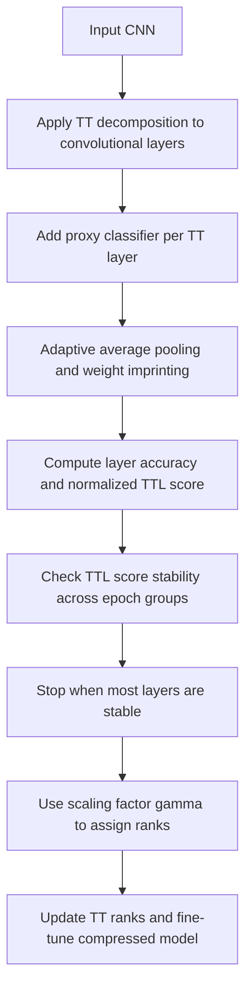

# An Adaptive Tensor-Train Decomposition Approach for Efficient Deep Neural Network Compression

> 论文阅读报告。若“报告依据”不是 PDF 全文，结论需以论文全文复核为准。

## 基本信息

| 字段 | 内容 |
| --- | --- |
| arXiv ID | 2408.01534 |
| 发布时间 | 2026-05-29 |
| 作者 | Shiyi Luo, Mingshuo Liu, Yifeng Yu, Shangping Ren, Yu Bai |
| 类别 | cs.LG |
| 方向 | 感知视觉 |
| 推荐等级 | 可观察 |
| 推荐分 | 12.0 / 30 |
| 业务相关度 | - |
| 工程落地性 | - |
| 代码 | 未知 |
| 报告依据 | PDF全文与摘要 |
| 生成时间 | 2026-06-01T12:17:58+00:00 |

## 原始链接

- [查看论文](<https://arxiv.org/abs/2408.01534>)
- [下载 PDF](<https://arxiv.org/pdf/2408.01534>)

## 一页结论

这篇论文值得模型压缩、端侧部署和低秩分解方向工程师观察性精读。论文提出 LWIQ，用 weight imprinting 估计 TT 分解后各卷积层的重要性，并用缩放因子适配不同压缩预算，目标是减少自动 rank 搜索成本，见 PAGE 1、PAGE 2、PAGE 4。实验只覆盖 CIFAR-10/CIFAR-100 与 ResNet20/32/56，主张 ResNet-56 on CIFAR-10 的 rank 搜索时间从 PARS 的 1h16min 降至 LWIQ 的 28min，LWIQ-sample 为 18min，见 PAGE 9。对业务建议是观察并做小试，不宜直接作为通用 CV 大模型压缩方案，因为论文未来工作才计划扩展到 ILSVRC-2012 和其他低秩分解，见 PAGE 10。

**适合读者：** 负责端侧分类模型压缩、CNN 轻量化、自动化压缩搜索、模型部署成本优化的算法工程师和研发负责人。

**业务判断：** 提出自动、预算感知的张量秩选择方法，用于提升深度神经网络压缩效率。

## 图解材料

> 适合放入报告的方法总览图，用于解释 LWIQ 的三段式 rank 决策流程，见 PAGE 3、PAGE 4。

> 适合放入技术细节页，帮助说明 TT 卷积层如何从普通卷积 kernel 变成 compact tensor 表达，见 PAGE 5、PAGE 6。

> 可用于说明 TTL score 稳定性和提前停止 rank decision 的依据，但报告中应结合正文而非直接解读图像，见 PAGE 7、PAGE 8。

## 方法流程图

## Heilmeier 七问精读

## 1. 这篇论文要做什么？

**论文事实**

- 论文声称要解决 TT 分解模型压缩中的 rank 选择问题，使模型压缩率、效率和精度之间更平衡，见 PAGE 1。
- 论文提出自动、预算感知的 rank 选择方法 LWIQ，用于高效模型压缩，见 PAGE 1。

**证据**

- PAGE 1: 论文指出 rank 选择对模型压缩率和效率的平衡至关重要，手工和优化式自动方法会增加复杂度。
- PAGE 1: 摘要称 LWIQ 通过 proxy classifier 量化每层重要性，并使用 scaling factor 适配不同计算预算。

## 2. 现有方法有什么限制？

**论文事实**

- 手工 rank 选择低效、耗时、依赖专家经验，且不一定产生最优压缩，见 PAGE 1。
- 启发式自动 rank 搜索会显著增加计算负担，已有预算感知方法在预算变化时常需重复搜索和训练，见 PAGE 2。

**证据**

- PAGE 1: 论文列出现有低秩分解压缩的第一个限制是手工调 rank 低效且难扩展。
- PAGE 2: 论文列出现有自动 rank 方法计算负担高，预算变化时需要重复搜索和训练。

## 3. 方法怎么做？

**论文事实**

- 方法分三步：对每个卷积层做 TT 分解，插入基于 proxy classifier 和 weight imprinting 的层特征计算模块，再用预算感知 rank 决策算法确定 rank，见 PAGE 4。
- LWIQ 根据层重要性分配 rank：高 TTL score 层分配较高 rank，低 TTL score 层分配较低 rank，见 PAGE 7。

**证据**

- PAGE 4: 论文明确列出 Applying TT decomposition、Embedding layer characteristics calculation module、A budget-aware automatic rank determination algorithm 三个步骤。
- PAGE 7: 论文说明高 TTL score 层保留更高 rank，低 TTL score 层用更低 rank 提升压缩效率。

## 4. 关键机制与数学细节

**论文事实**

- Weight imprinting 用训练集样本直接设置每层 proxy classifier 的权重，避免为每层单独训练分类器，见 PAGE 4。
- 每层输出先经 adaptive average pooling 得到统一长度 embedding，再按类别平均得到 proxy classifier 权重矩阵，见 PAGE 5。
- rank 决策阶段先给所有 TT 卷积层统一初始 rank R，训练到 TTL score 相对稳定后停止，并通过 scaling factor gamma 生成每层 rank，见 PAGE 7。
- 当 80% 层的 TTL score 标准差低于阈值 beta 时停止 rank 决策，剩余 20% 层用终止时的 epoch group 计算最终 TTL score，见 PAGE 8。

**证据**

- PAGE 4: 论文称采用 imprinting 近似全连接层权重，不需要显式训练。
- PAGE 5: 公式 1-3 给出 pooling、类别平均 imprinting 和预测计算。
- PAGE 7: Algorithm 1 给出从训练、imprint、TTL score 归一化、稳定性判断到 rank determination 的流程。
- PAGE 8: 论文说明 80% 层稳定时结束 rank decision，并引入 scaling factor gamma 适配不同资源约束。

## 5. 谁会关心这项工作？

**业务判断**

- 对端侧分类 CNN 和资源受限设备部署有直接参考价值：方法目标是减少存储和计算成本，同时避免大量 rank 搜索。
- 对检测、跟踪、ReID、关键点、属性模型仅有间接价值，因为全文没有这些任务的实验结果，业务迁移证据不足。
- 对自动标注或数据闭环没有直接贡献；它更像压缩搜索流程优化模块。

**证据**

- PAGE 1: 引言强调移动设备部署需要准确率、小模型尺寸和低处理延迟。
- PAGE 8: 实验设置只列出 CIFAR10、CIFAR100 与 ResNet20/32/56。

## 6. 实验是否支撑结论？

**论文事实**

- 实验在 CIFAR10 和 CIFAR100 上评估，模型包括 ResNet20、ResNet32、ResNet56，见 PAGE 8。
- 训练使用 SGD、Nesterov momentum 0.9、初始学习率 0.1、每 30 epoch 衰减 0.1、batch size 256、weight decay 0.0005，并在 RTX 3090 上实验，见 PAGE 8。
- ResNet-56 on CIFAR-10 的搜索时间表显示 LWIQ 总搜索时间 28min，LWIQ-sample 18min，PARS 为 1h16min，见 PAGE 9。
- CIFAR-10 上，ResNet20 的 LWIQ 在约 2.88x 参数压缩下 Top-1 为 90.84%，ResNet32 在约 2.95x 参数压缩下 Top-1 为 91.57%，见 PAGE 10。
- CIFAR-100 上，ResNet20 的 LWIQ 在 2.32x 参数压缩下 Top-1 为 65.21%，ResNet32 的 LWIQ-sample 在 2.77x 参数压缩下 Top-1 为 68.20%，见 PAGE 10。

**业务判断**

- 实验覆盖经典小型分类基准，足以证明作者设定中的 rank 搜索效率，但不足以证明对 ImageNet、检测、分割或端侧真实硬件延迟的泛化。
- PARS 对比使用 A-100，LWIQ 使用 RTX3090，硬件不同，搜索时间对比有参考价值但不能视为严格同硬件公平加速结论。

**证据**

- PAGE 8: 论文列出 CIFAR10/CIFAR100、ResNet20/32/56 和训练超参。
- PAGE 9: Table II 给出 ResNet-56 on CIFAR-10 的搜索时间、epoch、设备、压缩和 Top-1。
- PAGE 10: Table III、Table IV 给出 CIFAR10/CIFAR100 上 ResNet20/32 的方法对比。

## 7. 风险、成本与边界

**论文事实**

- 论文未来工作称计划扩展到 Tucker、Tensor Ring 等其他低秩分解，并测试 ILSVRC-2012，说明当前大规模数据集和其他分解方法验证不足，见 PAGE 10。
- 论文实验没有报告检测、跟踪、ReID、关键点、属性或端侧真实延迟结果；这些细节证据不足。

**业务判断**

- 复现成本主要在 TT 卷积替换、imprinting rank 搜索、fine-tune 流程和与现有部署框架适配。
- 部署风险包括 TT 分解层在推理框架中的算子支持、实际硬件加速不确定，以及分类任务结果迁移到检测 backbone 后精度下降风险。

**证据**

- PAGE 10: 论文称未来将把方法应用到 Tucker、Tensor Ring，并在 ILSVRC-2012 上测试。
- PAGE 8: 当前实验设置只列出 CIFAR10/CIFAR100 和 ResNet20/32/56。

## 创新点

- 用 weight imprinting 替代逐层训练 proxy classifier，以较低成本估计 TT 分解层的重要性。
- 将层重要性 TTL score 与 TT rank 分配关联起来，避免复杂启发式 rank 搜索。
- 引入 scaling factor gamma，让同一组层重要性评分适配不同压缩预算。
- 提出 LWIQ-sample，用 50% 数据集做 rank search，以进一步减少搜索时间。

## 结构化实验表

### ResNet-56 on CIFAR-10 搜索时间对比

| 方法 | 设备 | 搜索epoch | 总搜索时间 | 参数压缩 | Top-1 | 证据 |
| --- | --- | --- | --- | --- | --- | --- |
| PARS w f-t | A-100 | 200 | 1h16min | 证据不足 | 93.2% | PAGE 9 |
| LWIQ | RTX3090 | 21 | 28min | 3.2x | 92.34% | PAGE 9 |
| LWIQ-sample | RTX3090 | 24 | 18min | 3.6x | 91.83% | PAGE 9 |

### CIFAR-10 ResNet20/32 主结果

| 模型 | 方法 | Rank选择 | Top-1 | 参数压缩 | 证据 |
| --- | --- | --- | --- | --- | --- |
| ResNet20 | Tensor Train | Fixed | 89.48% | 2.71x | PAGE 10 |
| ResNet20 | LWIQ | Imprinting, 16-19 epoch | 90.84% | 2.88x | PAGE 10 |
| ResNet20 | LWIQ-sample | Imprinting, 23-26 epoch | 90.34% | 2.59x | PAGE 10 |
| ResNet32 | Tensor Train | Fixed | 89.32% | 2.45x | PAGE 10 |
| ResNet32 | LWIQ | Imprinting, 16-19 epoch | 91.57% | 2.95x | PAGE 10 |
| ResNet32 | LWIQ-sample | Imprinting, 23-26 epoch | 91.45% | 2.69x | PAGE 10 |

### CIFAR-100 ResNet20/32 主结果

| 模型 | 方法 | Rank选择 | Top-1 | 参数压缩 | 证据 |
| --- | --- | --- | --- | --- | --- |
| ResNet20 | Tensor Train | Fixed | 62.76% | 2.96x | PAGE 10 |
| ResNet20 | LWIQ | Imprinting, 15-19 epoch | 65.21% | 2.32x | PAGE 10 |
| ResNet20 | LWIQ-sample | Imprinting, 17-22 epoch | 64.93% | 2.41x | PAGE 10 |
| ResNet32 | Tensor Train | Fixed | 65.79% | 2.40x | PAGE 10 |
| ResNet32 | LWIQ | Imprinting, 15-19 epoch | 67.15% | 2.91x | PAGE 10 |
| ResNet32 | LWIQ-sample | Imprinting, 17-22 epoch | 68.20% | 2.77x | PAGE 10 |

## 业务价值

对端侧 CNN 分类模型压缩、自动 rank 搜索和模型尺寸优化有参考价值；若团队已有 TT 分解或低秩压缩链路，可借鉴 LWIQ 的层重要性估计和预算缩放思路。对检测/跟踪/ReID/关键点/属性模型需要重新验证，因为论文未提供这些业务任务证据。

## 落地建议

- 1天内验证项：在现有小型 ResNet/CIFAR 或内部轻量分类模型上复现 proxy classifier imprinting，检查 TTL score 是否能在少量 epoch 内稳定。
- 1周内小实验：实现 TT 卷积替换与 LWIQ rank 分配，在一个端侧分类 backbone 上比较固定 rank、手工 rank、LWIQ 的精度、参数量、实际推理延迟和搜索时间。
- 是否进入技术储备：若在同硬件、同训练预算下相对固定 rank 有稳定精度收益且部署框架支持 TT 算子，则进入技术储备；否则仅归档为低秩 rank 搜索参考。

## 风险限制

- 论文实验集中在 CIFAR 小图分类，尚未验证 ImageNet、检测、ReID、关键点或分割任务；见 PAGE 8、PAGE 10。
- 搜索时间对比涉及不同硬件，PARS 使用 A-100，LWIQ 使用 RTX3090；严格工程加速比需要同硬件复测，见 PAGE 9。
- TT 卷积层可能无法在所有推理后端获得真实加速，论文主要报告参数压缩和搜索时间，端侧真实延迟证据不足。
- 方法需要实现 TT 分解卷积、imprinting、rank 稳定性判断和 fine-tune，集成成本高于普通剪枝或量化。

## 待确认问题

- gamma 如何从目标预算稳定映射到每层 rank，论文给出流程但工程实现细节仍需复现确认。
- LWIQ 在 ImageNet 级别数据集、检测 backbone、Transformer 或现代轻量网络上的有效性证据不足。
- TT 压缩后的实际硬件 latency、memory bandwidth、算子融合收益是否优于剪枝/量化，全文证据不足。
- LWIQ-sample 的 50% 采样比例是否对类别不均衡或长尾数据稳健，全文证据不足。

## 证据索引

- PAGE 1: 摘要提出自动、预算感知 rank 选择方法 LWIQ，并声称在 CIFAR-10 ResNet-56 上 rank search efficiency 提升 63.2%，精度下降 0.86%，模型尺寸减少 3.2x。
- PAGE 2: 论文列出现有方法的三类限制：手工 rank 调整低效，启发式自动搜索计算负担高，预算变化时需要重复搜索训练。
- PAGE 4: 方法部分将框架分为 TT 分解、层特征计算模块、预算感知自动 rank 决策三步。
- PAGE 5: 公式 1-3 给出 adaptive average pooling、imprinting 权重计算和 proxy classifier 预测。
- PAGE 7: Algorithm 1 给出 LWIQ rank selection 的训练、imprint、TTL score 稳定性判断和 gamma rank determination 流程。
- PAGE 8: 实验设置使用 CIFAR10/CIFAR100、ResNet20/32/56、SGD 和 RTX 3090。
- PAGE 9: Table II 报告 ResNet-56 on CIFAR-10 的搜索时间，LWIQ 为 28min，LWIQ-sample 为 18min。
- PAGE 10: Table III 和 Table IV 报告 CIFAR10/CIFAR100 上 ResNet20/32 的 Top-1 与参数压缩结果；结论与未来工作说明计划扩展到其他分解和 ILSVRC-2012。
