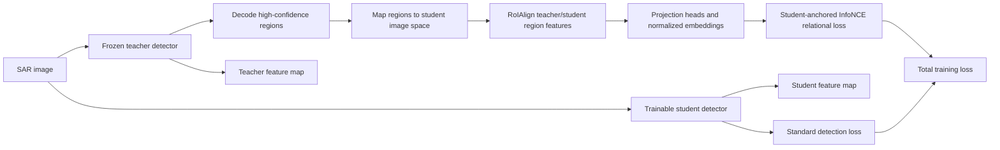

# Lightweight SAR Ship Detection via Contrastive Distillation

> 论文阅读报告。若“报告依据”不是 PDF 全文，结论需以论文全文复核为准。

## 基本信息

| 字段 | 内容 |
| --- | --- |
| arXiv ID | 2605.30380 |
| 发布时间 | 2026-06-01 |
| 作者 | Surendar Devasundaram, Saber Latibari Banafsheh, Abhijit Mahalanobis |
| 类别 | cs.CV |
| 方向 | 小模型/部署 |
| 推荐等级 | 中优先级 |
| 推荐分 | 18.5 / 30 |
| 业务相关度 | 中 |
| 工程落地性 | 中 |
| 代码 | 未知 |
| 报告依据 | PDF全文与摘要 |
| 生成时间 | 2026-06-01T13:07:14+00:00 |

## 原始链接

- [查看论文](<https://arxiv.org/abs/2605.30380>)
- [下载 PDF](<https://arxiv.org/pdf/2605.30380>)

## 一页结论

这篇论文值得做小规模技术验证，但优先级应限定在“检测模型压缩/蒸馏”和“SAR或遥感船舶检测”场景。论文提出 SURGE：把教师检测器的高置信候选框转成统一 region-level 蒸馏接口，通过 RoIAlign 抽取教师/学生区域特征，并在共享嵌入空间用 student-anchored InfoNCE 保持区域表征关系结构，见 PAGE 2、PAGE 3。实验覆盖 SSDD、HRSID，两阶段 Faster R-CNN 收益最明确：SSDD 上 R18 学生从 62.87 mAP 到 68.03 mAP，HRSID 上从 59.93 mAP 到 65.96 mAP，见 PAGE 5。部署侧价值在于蒸馏只发生在训练期，学生部署结构不变，推理 GFLOPs、延迟、显存按学生模型计，见 PAGE 5、PAGE 6。需要克制看待：一阶段 RetinaNet 在 SSDD 上 mAP 下降，DETR 在 HRSID 上 mAP/AP75 下降，且 DETR 只做 2 次运行，跨 RGB 通用检测迁移证据不足，见 PAGE 5。

**适合读者：** 适合负责目标检测小模型、蒸馏训练、SAR/遥感感知、边缘部署的算法工程师和研发负责人阅读；RGB行人/车辆检测团队可作为关系蒸馏思路参考，但不能直接假设收益可迁移。

**业务判断：** 检测和蒸馏方向相关，但实验集中在SAR遥感船舶，需谨慎迁移到常规RGB检测。

## 图解材料

未抽取到可用图像，或图像候选缺少可解释 caption。

## 方法流程图

## Heilmeier 七问精读

## 1. 这篇论文要做什么？

**论文事实**

- 论文要解决 SAR 船舶检测中高容量 CNN/Transformer 检测器精度强但实时或星载/板载部署成本高的问题，见 PAGE 1。
- 论文提出 SURGE，用关系感知知识蒸馏把教师检测器的对象级表征几何关系迁移到紧凑学生检测器，见 PAGE 1、PAGE 2。
- 论文声称框架适用于两阶段、一阶段和 Transformer 检测器，且不修改部署架构，见 PAGE 1、PAGE 2。

**证据**

- PAGE 1: 高容量 Faster R-CNN、RetinaNet、DETR 等检测器在 SAR 船舶检测中表现强但计算昂贵，不适合实时或 onboard 部署。
- PAGE 2: 贡献中声明 SURGE 将异构检测器预测转为对齐候选区域，并迁移对象级嵌入之间的 relational geometry。

## 2. 现有方法有什么限制？

**论文事实**

- 现有 SAR 蒸馏方法主要做 feature-map matching 或 logit alignment，偏向局部激活相似，未显式建模目标表征之间的关系结构，见 PAGE 1、PAGE 2。
- SAR 图像存在 speckle noise、复杂散射机制和细粒度结构变化，使检测器需要上下文和几何线索，见 PAGE 1。
- 已有高精度模型依赖深 backbone 和密集特征表示，计算复杂度高，限制实时或 onboard SAR 系统使用，见 PAGE 2。

**证据**

- PAGE 1: 论文指出局部特征或 logit 对齐让学生学习 local responses，而非教师使用的 structural reasoning。
- PAGE 2: Related Work 指出 SAR-oriented distillation 多依赖 feature-map matching 或 output-level logit alignment，缺少面向异构 SAR 船舶检测的系统化关系对比蒸馏研究。

## 3. 方法怎么做？

**论文事实**

- SURGE 使用冻结教师和可训练学生处理同一 SAR 图像，教师高置信预测被解码为候选区域，再与学生空间对齐并用 RoIAlign 抽取区域特征，见 PAGE 2、PAGE 3。
- 教师/学生区域特征经过 GAP 和轻量投影头进入共享嵌入空间，使用 L2 归一化嵌入，见 PAGE 3。
- 训练目标联合标准检测损失、关系对比损失，以及卷积检测器上的分类和框蒸馏损失；DETR 不使用 output-level query 蒸馏，见 PAGE 3、PAGE 4。

**证据**

- PAGE 2: Methodology 描述教师预测生成 candidate regions，跨检测器 feature alignment，并以 contrastive objective 监督区域特征。
- PAGE 3: Figure 1 caption 说明候选区域 top-K、IoU filtering、RoIAlign、投影头、InfoNCE 关系损失和总损失。

## 4. 关键机制与数学细节

**论文事实**

- 候选区域来源随检测器而变：两阶段用 RPN proposals，一阶段从 dense outputs 选高置信预测并解码为框，DETR 使用 decoder 预测的高置信框，见 PAGE 2、PAGE 3。
- 正样本集合由同类语义标签且 IoU ≥ 0.5 的教师区域定义，负样本集合由 IoU ≤ 0.3 的区域定义，见 PAGE 3。
- 关系损失是 student anchor embedding 与 teacher region embedding 的 temperature-scaled cosine similarity 上的多正/多负 InfoNCE，目标是保持相对邻域结构而非直接激活回归，见 PAGE 3。
- 为稳定训练，论文使用 capped positives 和 hard negative mining；卷积检测器附加输出级分类/框蒸馏，DETR 仅用 region-level relational distillation，见 PAGE 3、PAGE 4。

**证据**

- PAGE 3: 公式 (1) 定义教师/学生区域嵌入，公式 (2)(3) 定义正负集合，公式 (4) 定义 Lrel。
- PAGE 4: 公式 (5) 给出 L = Ldet + λc Lrel + λcls LKDcls + λbox LKDbox，并说明 DETR 不做 query-level supervision。

## 5. 谁会关心这项工作？

**业务判断**

- 对小模型检测部署：论文的训练期蒸馏不改变学生部署结构，适合已有轻量检测器需要提升精度但不能增加推理成本的场景。
- 对 SAR/遥感船舶检测：收益主要来自两阶段 Faster R-CNN，适合显式 region proposal 或 RoI 表征的检测管线优先试验。
- 对通用 RGB 检测、跟踪、ReID、关键点、属性识别：论文没有给出这些任务或数据域实验，能借鉴的是“区域表征关系蒸馏”的训练思想，业务效果证据不足。

**证据**

- PAGE 5: Computational Efficiency 段落说明 SURGE 只在训练期使用，不修改部署学生检测器。
- PAGE 5: Faster R-CNN 家族取得最大增益；一阶段和 Transformer 增益较小或不稳定。

## 6. 实验是否支撑结论？

**论文事实**

- 实验使用 SSDD 和 HRSID 两个公开 SAR 船舶检测基准；SSDD resize 到 512×512，HRSID resize 到 800×800，使用官方 train/test split，指标为 COCO-style mAP、AP50、AP75，见 PAGE 4。
- 两阶段 Faster R-CNN 使用 R101 教师、R18 学生；一阶段 RetinaNet 使用 R101 教师、R18 学生；DETR 使用 R101 教师、R50 学生，见 PAGE 4。
- Faster R-CNN R18 + Proposed RKD 在 SSDD 上达到 68.03 mAP、94.13 AP50、82.35 AP75；在 HRSID 上达到 65.96 mAP、88.10 AP50、76.72 AP75，见 PAGE 5。
- RetinaNet 在 SSDD 上 Proposed RKD 为 60.33 mAP，低于学生 61.12 mAP；HRSID 上为 62.77 mAP，高于学生 62.12 mAP，见 PAGE 5。
- DETR 在 SSDD 上 Proposed RKD 为 59.70 mAP，高于学生 59.37 mAP；HRSID 上为 48.60 mAP，低于学生 48.77 mAP，见 PAGE 5。

**业务判断**

- 实验对两阶段检测器的结论较有支撑，因为主结果、消融和效率都围绕 Faster R-CNN 展开。
- 一阶段和 Transformer 的业务结论应保守：RetinaNet 在 SSDD 没有提升，DETR 在 HRSID 没有提升，说明统一 region-level 接口并不等于各架构稳定收益。
- 论文报告 CNN 检测器 6 次运行、DETR 2 次运行；DETR 统计稳定性弱于 CNN 检测器。

**证据**

- PAGE 4: Experimental Setup 给出数据集、resize、指标、教师/学生架构、优化器、epoch、batch size 和硬件。
- PAGE 5: Table 1 给出 SSDD/HRSID 上三类检测器的均值和标准差。
- PAGE 5: Loss Ablation 显示 Det + KD + Rel 最优，Rel 单独使用提升有限。

## 7. 风险、成本与边界

**论文事实**

- 论文承认一阶段和 Transformer 检测器收益更小，不同检测范式下关系监督影响不同，见 PAGE 6。
- 未来工作才会探索 multi-class SAR detection、更强 Transformer 架构和 SAR/optical cross-modal distillation，因此这些方向当前证据不足，见 PAGE 6。
- 论文说明若对 DETR 做直接 query-level teacher-student 对齐会产生不稳定 correspondence，并在初步实验中降低性能，因此未报告 conventional output-level distillation baseline，见 PAGE 4、PAGE 5。

**业务判断**

- 复现成本主要在统一候选区域抽取、跨预处理坐标映射、RoIAlign 区域特征抽取、正负样本构造和多检测器训练接口。
- 部署风险较低但训练成本增加：需要教师推理、region decoding、RoIAlign 和 projection heads；推理端收益取决于学生模型本身。
- 迁移到 RGB 通用检测、密集小目标、开放类别或多类别任务前，应先做小数据集 ablation，不能直接采用论文的 SAR 船舶结论。

**证据**

- PAGE 5: Computational Efficiency 说明 SURGE 增加训练期 teacher inference、region decoding、RoIAlign、projection heads 开销，但部署时延和显存不变。
- PAGE 6: Conclusion and Future Direction 指出一阶段和 Transformer 收益更 modest，并列出未来方向。

## 创新点

- 把两阶段、一阶段和 DETR 的教师预测统一成 region-level 蒸馏接口，并显式处理教师/学生预处理坐标空间对齐，见 PAGE 2。
- 在 SAR 船舶检测中使用 student-anchored InfoNCE 蒸馏区域表征关系结构，而非只做 feature-map 或 logit 的局部对齐，见 PAGE 1、PAGE 3。
- 论文声称是首个面向 SAR 船舶检测的 transformer-based detector knowledge distillation framework，但该声明仅由本文叙述支持，外部独立证据未在当前材料中验证，见 PAGE 1、PAGE 2。

## 结构化实验表

### 主结果表：SSDD/HRSID 检测精度

| 模型 | 数据集 | 指标 | 结果 | 证据 |
| --- | --- | --- | --- | --- |
| Faster R-CNN R18 Student | SSDD | mAP / AP50 / AP75 | 62.87±0.49 / 91.08±0.75 / 74.64±1.28 | PAGE 5 |
| Faster R-CNN R18 + Proposed RKD | SSDD | mAP / AP50 / AP75 | 68.03±1.35 / 94.13±0.97 / 82.35±1.63 | PAGE 5 |
| Faster R-CNN R18 Student | HRSID | mAP / AP50 / AP75 | 59.93±0.19 / 84.65±0.07 / 69.01±0.34 | PAGE 5 |
| Faster R-CNN R18 + Proposed RKD | HRSID | mAP / AP50 / AP75 | 65.96±0.16 / 88.10±0.51 / 76.72±0.40 | PAGE 5 |
| RetinaNet R18 Student | SSDD | mAP / AP50 / AP75 | 61.12±0.72 / 93.73±1.08 / 70.72±1.62 | PAGE 5 |
| RetinaNet R18 + Proposed RKD | SSDD | mAP / AP50 / AP75 | 60.33±0.81 / 93.67±0.52 / 70.65±1.48 | PAGE 5 |
| RetinaNet R18 Student | HRSID | mAP / AP50 / AP75 | 62.12±0.28 / 89.03±0.36 / 71.02±0.44 | PAGE 5 |
| RetinaNet R18 + Proposed RKD | HRSID | mAP / AP50 / AP75 | 62.77±0.33 / 89.36±0.53 / 72.12±0.40 | PAGE 5 |
| DETR R50 Student | SSDD | mAP / AP50 / AP75 | 59.37±0.00 / 91.47±0.73 / 68.94±0.36 | PAGE 5 |
| DETR R50 + Proposed RKD | SSDD | mAP / AP50 / AP75 | 59.70±0.57 / 91.59±0.46 / 69.02±0.44 | PAGE 5 |
| DETR R50 Student | HRSID | mAP / AP50 / AP75 | 48.77±0.12 / 72.87±0.18 / 56.14±0.59 | PAGE 5 |
| DETR R50 + Proposed RKD | HRSID | mAP / AP50 / AP75 | 48.60±0.19 / 73.04±0.15 / 55.95±0.10 | PAGE 5 |

### 消融与效率表

| 项目 | 模型/设置 | 指标 | 结果 | 证据 |
| --- | --- | --- | --- | --- |
| Loss ablation | Faster R-CNN R18, Det only, SSDD | mAP / AP50 / AP75 | 62.87±0.49 / 91.08±0.75 / 74.64±1.28 | PAGE 5 |
| Loss ablation | Faster R-CNN R18, Det + KD + Rel, SSDD | mAP / AP50 / AP75 | 68.03±1.35 / 94.13±0.97 / 82.35±1.63 | PAGE 5 |
| 效率 | Faster R-CNN R101 Teacher | GFLOPs / Latency / Memory | 68.64 / 21.02 ms / 543.76 MB | PAGE 6 |
| 效率 | Faster R-CNN R18 Student / Ours | GFLOPs / Latency / Memory | 49.77 / 10.53 ms / 362.52 MB | PAGE 6 |
| SOTA comparison | Faster R-CNN R18, MGD vs SURGE, SSDD | mAP | 62.80 vs 68.03 (+5.23) | PAGE 6 |
| SOTA comparison | RetinaNet R18, MGD vs SURGE, SSDD | mAP | 58.70 vs 60.33 (+1.63) | PAGE 6 |
| SOTA comparison | DETR R50, MGD vs SURGE, SSDD | mAP | 37.36 vs 59.70 (+22.34) | PAGE 6 |

## 业务价值

对检测小模型部署的主要价值是训练期增强而不改学生推理结构，适合在已有教师-学生检测框架中加入 region-level relation distillation。对 SAR 船舶检测、遥感小目标检测、边缘部署有直接参考意义；对跟踪、ReID、关键点、属性、自动标注没有实验证据，只能作为候选表征蒸馏思想。

## 落地建议

- 1天内验证项：在现有 Faster R-CNN 或带 RoI head 的检测代码中复查是否能导出教师 proposals、学生对应 feature map、RoIAlign 区域特征和坐标映射；先不接完整训练。
- 1周内小实验：选择一个小型检测数据集，固定教师，训练学生 baseline、vanilla KD、KD + relation loss 三组；优先记录 mAP/AP75、训练耗时、推理延迟是否保持不变。
- 是否进入技术储备：若两阶段或显式 ROI 模型 AP75 有稳定提升且推理成本不变，可进入小模型蒸馏技术储备；若业务主模型是一阶段或 DETR，应先继续观察或只做低成本 ablation。

## 风险限制

- 领域迁移风险：论文只在 SAR 船舶检测 SSDD/HRSID 上验证，RGB 通用检测、多类别检测和非遥感任务证据不足。
- 架构收益不均：两阶段提升明显，一阶段和 DETR 收益小且部分指标下降，见 PAGE 5、PAGE 6。
- 训练复杂度增加：虽然部署不变，但训练需要教师推理、region decoding、RoIAlign、projection heads 和 hard negative mining，见 PAGE 5。
- 复现风险：SAR-specific KD 方法实现不可用，论文采用可复现 RGB distillation baseline；与其他 SAR KD 的公平比较仍有限，见 PAGE 4。

## 待确认问题

- 在非 SAR、非船舶、多类别检测任务上，region-level relational geometry 是否仍能带来稳定 AP75 提升？证据不足。
- Rel 单独使用在消融中没有提升，最佳效果依赖 vanilla KD；关系损失权重、正负阈值和 hard negative mining 的敏感性需要复现确认。
- DETR 只做 2 次运行且 HRSID 指标下降，Transformer 检测器上的可靠适配方式仍需进一步实验。
- 论文没有给出代码链接；坐标映射和多检测器 RoI 特征接口的工程细节需要实现时确认。

## 证据索引

- PAGE 1: 论文提出 SURGE，用 contrastive InfoNCE 在共享投影嵌入空间迁移教师到学生的 relational geometry，并强调不修改部署架构。
- PAGE 2: Methodology 描述冻结教师、可训练学生、teacher-guided region generation、cross-detector feature alignment 和 region-level distillation。
- PAGE 3: Figure 1 caption 和公式 (1)-(4) 给出 RoIAlign、投影嵌入、正负样本和 InfoNCE 关系损失。
- PAGE 4: Experimental Setup 给出 SSDD/HRSID、模型配置、优化器、训练 epoch、batch size 和 L40S GPU。
- PAGE 5: Table 1 显示 Faster R-CNN 收益最大；RetinaNet 和 DETR 部分数据集收益有限或下降。
- PAGE 5: Table 2 显示 Det + KD + Rel 最优，Rel 单独使用有限。
- PAGE 6: Table 3 说明学生/Ours 推理 GFLOPs、latency、memory 与学生模型一致；结论指出未来扩展到多类别 SAR、更强 Transformer 和跨模态蒸馏。
