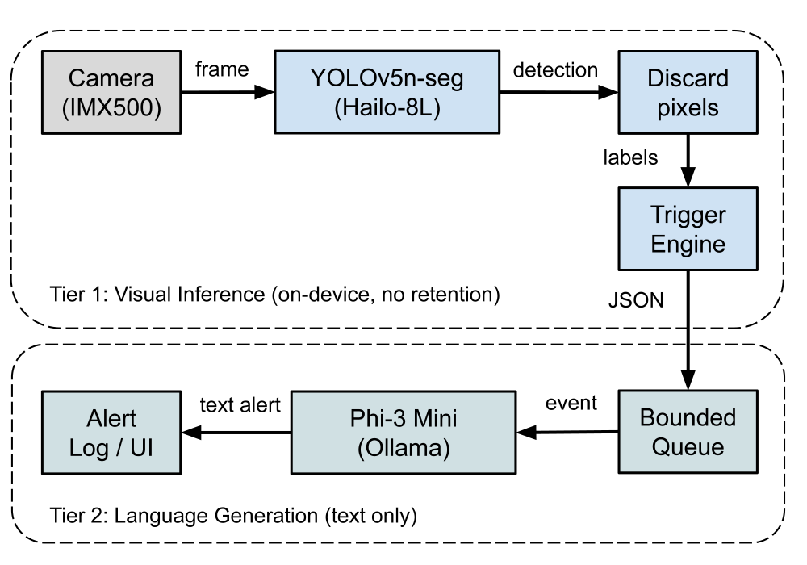
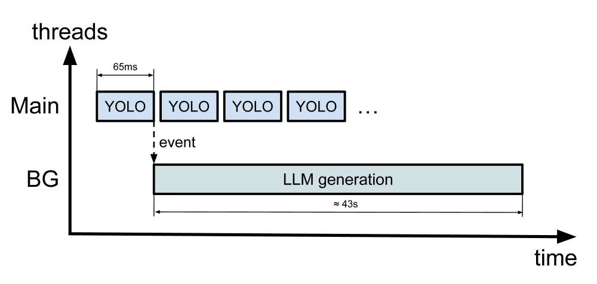
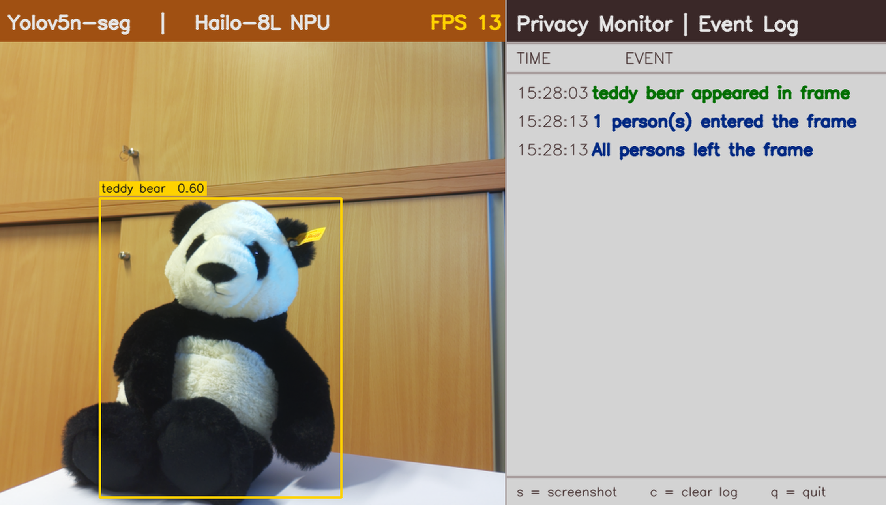

# On-Device Generative AI for GDPR-Compliant Visual Monitoring: Natural Language Alerts from Local Object Detection

## 摘要

| 项目 | 内容 |
|---|---|
| 论文标题 | On-Device Generative AI for GDPR-Compliant Visual Monitoring: Natural Language Alerts from Local Object Detection |
| 作者 | Gudrun Schappacher-Tilp, Nicoletta Kaehling, Jan Kornberger, Egon Teiniker |
| arXiv ID | 2605.30544 |
| 链接 | https://arxiv.org/abs/2605.30544 |
| 任务类型 | 端侧视觉监控、隐私保护、自然语言告警、小模型部署 |
| 代码状态 | 本文未提供可确认的公开代码。论文声称提出“complete, open-source privacy-by-design architecture”，但全文材料与给定信息中没有可访问代码仓库 URL；外部题名检索也未发现明确 GitHub 仓库。因此不写源码段，代码证据不足。 |

一句话总结：本文提出一个端侧视觉监控 PoC 系统：Raspberry Pi 5 通过 Hailo-8L 加速运行 YOLOv5n-seg，只保留类别级事件 JSON，再由本地 Phi-3 Mini 生成自然语言告警；核心价值不是新检测算法，而是将“检测、触发、文本生成”全部限制在设备侧，以降低 GDPR 数据最小化风险（见 PAGE 1、PAGE 2）。

这篇论文的技术定位应当理解为系统集成与部署验证，而不是模型结构创新。它没有提出新的目标检测网络、训练损失、生成模型算法或数学优化公式；论文主要贡献在于架构边界、硬件选型、线程解耦、触发逻辑、端侧 LLM 调用和资源测量（见 PAGE 1、PAGE 3、PAGE 4）。因此，本文解读会把重点放在系统链路是否闭合、隐私主张如何被实现、实验数据是否足以支撑“可部署”的说法。

公式证据不足：全文未给出显式数学公式、训练目标函数、推理复杂度推导或算法伪代码。下文不会伪造论文公式。涉及“31× speedup”等数值时，只引用作者依据 Table I 原始延迟得出的结论，或直接解释表格数值，不将其包装为论文公式（见 PAGE 4、PAGE 5）。

## 背景与动机

视觉监控系统的传统架构通常把摄像头采集的视频流或帧图像上传到云端，由云服务执行目标检测、活动识别或行为分析。这种模式在计算上方便，因为云端有更强 GPU、集中化存储和统一模型服务；但在法律和合规层面，它把原始监控图像暴露给第三方处理器。论文明确指出，可识别自然人的监控图像在 GDPR 下属于个人数据，上传到云端通常需要合法依据、数据处理协议，以及在特定司法辖区中可能还需要处理活动记录（见 PAGE 1）。

本文的问题意识来自 GDPR Art. 5(1)(c) 的数据最小化原则，即处理的数据应当限于必要范围。对视觉监控而言，关键矛盾是：系统真正需要的是“发生了什么事件”，而不是完整图像本身。若只是为了通知操作员“有人进入区域”或“背包出现”，上传整帧图像显然超过了事件告警所需的信息量。论文将这种过度暴露视为云端 AI 监控架构的根本风险（见 PAGE 1、PAGE 2）。

已有隐私方案常通过图像匿名化缓解风险，例如人脸模糊、人物轮廓化或身份去标识化。论文承认这些方法能解决一部分问题，但认为它们仍然脆弱：匿名化可能被逆向攻击，同时上传动作本身仍带来延迟、带宽成本和网络依赖（见 PAGE 1、PAGE 2）。因此，作者选择的路线不是“先处理图像再上传”，而是“图像永不离开设备”。

此前，低成本单板计算机难以实时运行视觉检测模型，这是边缘侧完整推理的主要障碍。论文认为两个趋势改变了条件：第一，Hailo-8L 这类消费级神经网络加速器可通过 Raspberry Pi 5 的 PCIe 接口承担检测推理；第二，Phi-3 Mini、Gemma 这类量化小语言模型可以在 4–8GB 级别内存设备上本地运行，并通过 Ollama 等工具提供服务（见 PAGE 1、PAGE 2）。

因此，本文的核心出发点是把视觉检测和文本生成都迁移到端侧：摄像头采集像素，Hailo-8L 执行 YOLO 检测，触发器把检测结果抽象为事件，Phi-3 Mini 把事件 JSON 改写为人类可读告警。系统只允许最终文本告警跨越网络边界，而不允许图像、像素缓冲区、边界框几何信息进入外部通道（见 PAGE 1、PAGE 2、PAGE 3）。

从研究贡献角度，作者强调三点：一是严格数据边界，原始帧在检测后立即丢弃，LLM 只接收类别标签和事件类型字符串；二是给出 HailoRT Python API、触发冷却逻辑、Ollama 集成等实现细节；三是通过延迟、资源占用和代表性告警输出证明系统可行（见 PAGE 1）。这些贡献说明论文更接近“隐私保护端侧 AI 系统原型”而不是“视觉模型或语言模型算法论文”。

## 预备知识

### GDPR 数据最小化与 Privacy-by-Design

GDPR Art. 5(1)(c) 要求个人数据处理满足数据最小化原则。本文把可识别自然人的图像视为个人数据，并将“原始图像是否跨越网络边界”作为合规风险的核心判断点（见 PAGE 1、PAGE 2）。这里的 privacy-by-design 不是事后加密或日志脱敏，而是在系统结构上让敏感数据无法到达后续模块。

论文引用 Cavoukian 的 Privacy by Design 原则和 Hoepman 的 privacy design strategies，特别强调“privacy as the default setting”和“minimise”。在本文架构中，最小化不是一句政策声明，而是具体实现为：像素缓冲区只在 Tier 1 检测阶段存在，进入 Tier 2 语言生成阶段之前已经被释放，LLM 和日志只看到类别和事件字符串（见 PAGE 2、PAGE 3）。

### 端侧检测与端侧语言模型

YOLOv5n-seg 是本文使用的目标检测模型，输入为 640×640×3 UINT8，覆盖 80 个 COCO 类别；模型被编译为 Hailo Executable Format，即 HEF，并通过 HailoRT 的 `hailo_platform` Python API 在 Hailo-8L 上执行（见 PAGE 3）。Hailo-8L 是 13 TOPS 的 M.2 AI 加速器，通过 Raspberry Pi M.2 HAT+ 接入 Raspberry Pi 5 的 PCIe 2.0 接口（见 PAGE 2、PAGE 3）。

Phi-3 Mini 是本文使用的本地大语言模型，参数规模为 3.8B，采用 Q4_0 量化，磁盘占用约 2.2GB，由 Ollama 0.24.0 在 `localhost:11434` 提供本地 HTTP REST API 服务（见 PAGE 4）。这里的 Q4_0 表示 4-bit 量化格式，作用是降低内存占用，使多十亿参数模型能够在 Raspberry Pi 5 的内存预算内运行。论文报告 Phi-3 Mini 在运行时占用约 3700MB RAM，并在生成告警期间占满四个 Cortex-A76 核心（见 PAGE 4）。

## 方法详解

### 1. 两层架构：把隐私边界放在检测和语言生成之间

论文的系统架构分为 Tier 1 和 Tier 2。Tier 1 是 Visual Inference，即视觉推理层；摄像头帧进入 YOLO 检测模型，检测完成后像素缓冲区立即释放，不写磁盘、不写网络 socket。Tier 2 是 Language Generation，即文本生成层；只有当触发器发出事件后，最小 JSON payload 才进入有界队列，并由后台线程构造 prompt 调用本地 Phi-3 Mini（见 PAGE 2）。

用途：Fig. 1 用来说明系统总体架构和隐私边界位置。

读图要点：图中最重要的不是模型名称，而是 Tier 1 与 Tier 2 之间的 boundary。论文 caption 明确指出，隐私边界位于两层之间，pixel buffer 在任何数据到达语言模型或网络之前已被丢弃（见 PAGE 2）。

支撑的判断：Fig. 1 支撑了本文的核心隐私主张，即 GDPR 相关风险不是通过云端承诺降低，而是通过架构约束降低。只要实现确实遵守“像素不越界”，LLM 阶段就无法访问原始图像、边界框或几何坐标（见 PAGE 2、PAGE 3）。

这种设计与常见云端检测方案的根本差异在于数据流反转。传统方案把高维原始图像上传到云端，再从云端得到低维语义结果；本文先在端侧把高维图像压缩为低维事件，再只允许事件文本继续传播。这个过程牺牲了一部分可审计视觉证据，例如无法远程复查画面，但换来了更强的数据最小化属性（见 PAGE 2、PAGE 5）。

### 2. 硬件平台：Raspberry Pi 5 + Hailo-8L + AI Camera

原型运行在 Raspberry Pi 5 Model B Rev 1.1 上，处理器为 4-core Arm Cortex-A76 @ 2.4GHz，内存为 16GB LPDDR4X，系统为 Raspberry Pi OS Bookworm，Python 版本为 3.11.2（见 PAGE 2）。视觉加速器是 Hailo-8L M.2 AI accelerator，标称 13 TOPS，通过官方 Raspberry Pi M.2 HAT+ 的 PCIe 2.0 接口连接（见 PAGE 2）。

摄像头采用 Raspberry Pi AI Camera，内含 Sony IMX500 传感器，原生分辨率 4056×3040，采集通过 `picamera2` 0.3.31 和 PiSP 图像信号处理器完成。论文使用 2028×1520 模式采集，随后中心裁剪并缩放到 YOLOv5n-seg 需要的 640×640 输入（见 PAGE 3）。虽然 IMX500 本身具有片上推理能力，本文仍将目标检测交给 Hailo-8L，因为后者计算预算更高，并支持完整 YOLOv5n-seg 模型（见 PAGE 3）。

用途：Fig. 2 展示原型硬件栈，帮助确认论文不是纯软件模拟，而是在实际单板硬件上完成部署。

读图要点：图中从上到下分别是 Raspberry Pi AI Camera、Hailo-8L M.2 AI accelerator 与 Raspberry Pi 5。橙色排线对应 CSI 摄像头接口（见 PAGE 3）。

支撑的判断：Fig. 2 支撑“消费级单板硬件可运行完整链路”的系统可行性主张。它也限定了论文结论的适用范围：数据来自该硬件组合，而不是任意边缘设备；若换成更小内存、更弱 CPU 或无 NPU 平台，LLM 延迟和检测吞吐需要重新测量（见 PAGE 3、PAGE 4）。

### 3. 检测阶段：用 Hailo-8L 支撑实时视觉推理

目标检测模型为 YOLOv5n-seg，输入是 640×640×3 UINT8，输出包括三个检测头：80×80、40×40、20×20 网格，以及一个 160×160×32 segmentation mask head。本文只消费检测输出，丢弃 segmentation masks；检测后处理使用 per-class non-maximum suppression，IoU threshold 为 0.45，confidence threshold 为 0.25（见 PAGE 3）。

这里的关键工程判断是：本文不是为了分割掩码本身，而是为了从视频帧中得到足够触发事件的类别级事实。因此，即使模型带有 segmentation head，系统也不把 mask 传给后续层。这与 privacy-by-design 一致，因为 mask、box 坐标等空间信息可能包含比类别标签更丰富的场景内容（见 PAGE 3）。

论文给出两种配置：加速配置在 Hailo-8L 上运行 HEF 模型；CPU baseline 用 Ultralytics Python library 8.3.248，在 `device="cpu"` 下运行同一 YOLOv5n-seg 架构、同样置信度阈值和 IoU 阈值（见 PAGE 3）。这个对照很重要，因为它说明瓶颈不是摄像头采集或触发逻辑，而是 YOLO 推理本身。

实验中，Hailo-8L 正常条件下推理约为 85–150ms per frame，即约 7–12 FPS；系统展示表格中又报告持续运行的 YOLO inference 平均为 65ms per frame，对应 15.2 FPS（见 PAGE 3、PAGE 4）。两个数值略有口径差异：PAGE 3 描述“normal operating conditions”的范围，PAGE 4 Table I 给出 measured wall-clock latency 的汇总结果。解读时应以表格为主要量化依据，并保留范围描述作为运行波动证据。

### 4. 帧处理与数据最小化：从 pixel buffer 到类别事件

论文明确规定，原始图像数据 never persisted or transmitted beyond the detection stage。`picamera2` 返回的 pixel buffer 在推理完成后丢弃；系统只在当前帧处理周期内保留结构化检测输出，包括 class labels、confidence scores 和 normalised bounding-box coordinates（见 PAGE 3）。

更进一步，在进入 LLM 阶段之前，bounding-box coordinates 也被抽象掉。转发给语言模型的 payload 只包含 categorical labels 和 event-type strings，不包含几何坐标、边界框、像素信息或图像内容（见 PAGE 3）。这一步是论文隐私主张的核心。如果 LLM 能看到 box coordinates 或 crop 图像，那么它可能间接泄露位置、行为或环境上下文；本文通过字段级裁剪降低了这类风险。

需要强调的是，论文没有给出形式化隐私证明，也没有进行攻击实验。它的合规论证是结构性和工程性的：如果实现中没有路径能把 pixel buffer、box geometry 或图像文件写入网络/日志，那么外部只会看到文本告警（见 PAGE 2、PAGE 3、PAGE 5）。这类论证对工程审计有价值，但仍依赖代码实现、日志配置、异常处理和操作系统层面的验证；由于未提供可确认源码，代码级审计证据不足。

### 5. 触发逻辑：让 LLM 只处理语义变化

如果每帧都调用 LLM，系统会因语言模型延迟而不可用，也会产生大量重复告警。本文设计 stateful trigger engine，对每帧检测集合与上一帧集合做比较，只在 semantically meaningful scene change 发生时发出事件（见 PAGE 3）。触发器维护两个状态变量：当前帧中出现的 object class labels 集合，以及检测到的 person 数量（见 PAGE 3）。

论文定义了五类事件：`person_entered` 表示 person count 从 0 变为正数；`person_left` 表示 person count 变为 0；`person_count_changed` 表示人数变化但不跨越 0；`object_appeared` 表示非 person 类别首次出现；`object_disappeared` 表示此前存在的非 person 类别不再检测到（见 PAGE 3）。这些事件是系统从视觉层到语言层的接口。

| 事件类型 | 触发条件 | 隐私含义 | 页码证据 |
|---|---|---|---|
| `person_entered` | 人数从 0 到正数 | 只表达进入事件，不传输图像 | PAGE 3 |
| `person_left` | 人数变为 0 | 只表达离开状态 | PAGE 3 |
| `person_count_changed` | 人数变化但不跨越 0 | 传输人数变化，不传输位置 | PAGE 3 |
| `object_appeared` | 非 person 类别由无到有 | 传输类别出现事件 | PAGE 3 |
| `object_disappeared` | 非 person 类别由有到无 | 传输类别消失事件 | PAGE 3 |

表格解读：触发器把检测输出压缩为“状态变化”，这比逐帧输出类别列表更适合告警场景。它减少了 LLM 调用次数，也减少了日志中关于场景连续状态的冗余信息。但该逻辑依赖检测稳定性，目标在边界处抖动可能导致出现/消失事件，因此论文又引入冷却机制（见 PAGE 3、PAGE 4）。

为了避免边界检测噪声造成 alert flooding，每个 `(event-type, label)` pair 都有 5 秒 per-key cooldown。相同事件若在 5 秒内再次出现会被抑制，冷却时间可通过 `--cooldown` 参数配置（见 PAGE 3、PAGE 4）。这是一种实用的去抖动设计，但不是统计意义上的误报控制；论文没有报告不同 cooldown 下的 precision、recall 或 missed alerts，相关证据不足。

### 6. LLM 告警生成：本地 Phi-3 Mini 只读最小 JSON

当触发器发出事件后，系统构造最小 JSON payload 并发送给本地 `phi3:mini`。论文给出的 payload 包含 ISO-8601 timestamp 和 events 列表；每个 event 由 `kind`、`label`、`detail` 三个字符串字段构成（见 PAGE 4）。示例中，`kind` 为 `person_entered`，`label` 为 `person`，`detail` 为 “1 person(s) entered the frame”（见 PAGE 4）。

系统 prompt 明确限制模型输出：只写 1–2 句给安全操作员的告警；必须 factual；只能描述 JSON 中列出的内容；不得推断意图、情绪或行为；不得提及 pixel data、coordinates、bounding boxes 或 image content；若没有需要注意的内容，则严格回复 “No alert.”（见 PAGE 4）。这说明作者意识到 LLM 的主要风险不是计算不可行，而是生成模型可能补充未被输入支持的内容。

“ No alert.” 响应会被抑制且不记录；其他响应连同 wall-clock generation latency 会追加到 line-buffered CSV evaluation log。论文还报告系统在启动时通过 silent warmup request 预加载语言模型，把 cold-start latency 从约 30–45 秒降到后续查询低于 5 秒（见 PAGE 4）。这一区分很重要：冷启动延迟和实际生成延迟不同，Table I 报告的 LLM alert generation 平均约 43 秒是每个事件的生成延迟，而不是模型首次加载延迟（见 PAGE 4）。

### 7. 并发结构：检测主线程与 LLM 后台线程解耦

论文将 pipeline 分为四个阶段：image acquisition、object detection、event-trigger evaluation、conditional LLM alert generation。前 3 个阶段在主线程同步执行，第 4 个阶段在专用后台线程执行，使语言模型延迟不阻塞摄像头吞吐（见 PAGE 3）。

有界队列容量为 2，负责解耦两个线程。若队列已满，事件会被静默丢弃，以确保 detection loop remains live under LLM load（见 PAGE 3）。这是一个典型实时系统取舍：系统优先保持视觉循环实时性，而不是保证每个事件都被语言化记录。对监控产品而言，这个取舍需要根据业务场景重新评估；例如安全告警不能轻易静默丢弃，而客流摘要或低风险日志可以接受丢失部分事件。

用途：Fig. 3 展示检测循环与 LLM 生成之间的并发执行关系。

读图要点：主线程负责持续运行检测循环，后台线程处理 LLM 生成；图注明确指出 camera throughput 不受 alert generation latency 影响（见 PAGE 4）。

支撑的判断：Fig. 3 支撑论文“43 秒 LLM 生成不影响 15.2 FPS 检测吞吐”的主张。它也揭示系统延迟的两类指标必须分开看：视觉检测是实时的，文本告警不是实时的（见 PAGE 4、PAGE 5）。

### 8. 代码分析状态：公开代码证据不足

论文在贡献列表中写到“complete, open-source privacy-by-design architecture”，并提到 HailoRT Python API、trigger-and-cooldown logic、Ollama-based LLM integration 等实现细节（见 PAGE 1）。但是，在提供的全文页、参考文献和元信息中，没有出现 GitHub、GitLab、Zenodo、项目主页或代码 DOI 等明确仓库地址。已知代码链接也标注为“未知”。

因此，本文未提供可确认的公开代码。按照任务要求，不贴代码段，不推测函数名，不伪造文件路径，也不把论文中的 JSON payload 示例当作源码实现。可以确认的是接口级设计：HailoRT `hailo_platform` 用于检测模型执行，Ollama HTTP REST API 用于本地 LLM 调用，`--cooldown` 是运行时可配置参数（见 PAGE 3、PAGE 4）。但具体源码结构、异常处理、日志过滤、队列实现、线程安全和资源释放是否严格符合论文叙述，均缺乏代码级证据。

## 实验分析

### 实验设置概述

实验平台是 Raspberry Pi 5 Model B Rev 1.1，配备 16GB LPDDR4X、Hailo-8L M.2 AI accelerator、Raspberry Pi AI Camera 和 Raspberry Pi OS Bookworm。视觉模型为 YOLOv5n-seg HEF，端侧语言模型为 Phi-3 Mini 3.8B Q4_0，Ollama 0.24.0 运行在 localhost（见 PAGE 2、PAGE 3、PAGE 4）。CPU baseline 使用同一 YOLOv5n-seg 架构和相同阈值，但通过 Ultralytics 在 CPU 上执行（见 PAGE 3）。

论文实验主要回答三个问题：第一，Hailo-8L 是否能让 YOLOv5n-seg 在 Raspberry Pi 5 上达到实时或准实时；第二，Pi 5 的 RAM 是否能同时容纳 HailoRT、应用和 Phi-3 Mini；第三，LLM 是否能基于最小 JSON 产生事实性、可读的告警（见 PAGE 4、PAGE 5）。论文没有报告检测准确率、误报率、漏报率、复杂场景鲁棒性或用户研究，因此这些方面证据不足。

### 主要结果一：延迟与吞吐

| Pipeline stage | Hailo-8L | CPU only | 页码证据 |
|---|---:|---:|---|
| Image acquisition | 1 ms | 1 ms | PAGE 4 |
| YOLO inference | 65 ms | ≈2,000 ms | PAGE 4 |
| Trigger evaluation | <1 ms | <1 ms | PAGE 4 |
| LLM alert generation | ≈43 s | ≈43 s | PAGE 4 |
| Detection throughput | 15.2 FPS | <1 FPS | PAGE 4 |

表格解读：Table I 的关键结论是，视觉检测瓶颈被 Hailo-8L 显著降低。CPU only 下 YOLO 推理约 2 秒一帧，低于 1 FPS，不适合连续监控；Hailo-8L 下 YOLO 推理 65ms，对应 15.2 FPS，已经能支撑常见低成本监控场景（见 PAGE 4）。LLM 生成约 43 秒，明显不能用于秒级告警，但因后台线程解耦，它不拖慢检测主循环（见 PAGE 4、PAGE 5）。

作者在 Discussion 中进一步指出，Hailo-8L 将 YOLO inference latency 从约 2,000ms 降到 65ms，得到 31× speedup，并将检测吞吐从 0.5 FPS 提升到 15.2 FPS（见 PAGE 5）。这个结果是全论文最有说服力的实验数据，因为它直接证明“低成本单板电脑 + 专用 NPU”能够跨过实时检测门槛。相比之下，LLM 生成的 43 秒延迟说明自然语言层仍然是异步记录层，而不是即时响应层（见 PAGE 5）。

### 主要结果二：资源利用率

| Component | RAM (MB) | CPU (%) | 页码证据 |
|---|---:|---:|---|
| HailoRT runtime + YOLO | 111 | <5 | PAGE 4 |
| Phi-3 Mini (Q4_0) | 3,700 | ∼100 | PAGE 4 |
| Application + OS | 14 | <5 | PAGE 4 |
| Total | 3,825 | ∼100 | PAGE 4 |

表格解读：资源表显示，视觉模型本身对主机 RAM 和 CPU 的压力很低，因为 YOLO 主要在 Hailo-8L 上执行；真正占用主机资源的是 Phi-3 Mini。Q4_0 量化后的 Phi-3 Mini 占用约 3.7GB RAM，并在生成期间占满四个 Cortex-A76 核心（见 PAGE 4）。在 16GB Pi 5 上，3.825GB 总 RAM 占用仍有较大余量，支持作者“co-hosting 可行”的结论；但如果迁移到 4GB 或 8GB 设备，系统余量和并发稳定性需要重新验证，论文未给出这类设备数据。

这个结果还说明，Hailo-8L 与本地 LLM 的资源瓶颈不同。视觉侧瓶颈是专用加速器吞吐，语言侧瓶颈是 CPU 生成速度。若业务要求更低文本延迟，优化方向不是继续提升 YOLO，而是换更小 LLM、使用模板化文本、采用更快推理 runtime，或引入额外 CPU/GPU/NPU 支持。论文也在 Discussion 中明确建议，对需要 sub-second alerting 的应用，应将生成层替换为 rule-based text template，同时保留检测和触发架构（见 PAGE 5）。

### 主要结果三：生成告警是否符合最小信息原则

| Event type | Generated alert | 页码证据 |
|---|---|---|
| `person_entered` | “One individual has entered the monitored area.” | PAGE 5 |
| `person_left` | “The monitored area is now unoccupied.” | PAGE 5 |
| `person_count_changed` | “The number of individuals present has increased to 3.” | PAGE 5 |
| `object_appeared` | “A backpack has appeared in the monitored area.” | PAGE 5 |
| `object_disappeared` | “A suitcase previously detected is no longer visible.” | PAGE 5 |

表格解读：Table III 说明 LLM 在代表性样例中遵守了 prompt 约束：句子短、面向操作员、没有声称人物意图、情绪或行为，也没有提及坐标、bounding boxes 或图像内容（见 PAGE 5）。这支持“最小 JSON payload 足以生成可读告警”的系统主张。但该表只是代表性样例，不是系统性 hallucination 评测；论文没有报告大规模事件集上的 unsupported detail rate，因此 LLM fidelity 仍是风险点（见 PAGE 5）。

用途：Fig. 4 展示系统运行时的实时输出，包括检测 feed 与 Privacy Monitor event log。

读图要点：左侧是 Hailo-8L NPU 上 YOLOv5n-seg 的检测结果，显示 teddy bear bounding box 和 confidence；右侧是事件日志，包含 timestamped trigger events。图注强调日志中没有 pixel data，只记录类别标签和状态变化描述（见 PAGE 5）。

支撑的判断：Fig. 4 支撑系统链路的可运行性：检测结果可以触发事件日志，视觉输出和文本输出可以同时存在于本地演示系统中。但它也提醒读者，图中左侧检测 feed 本身仍是视觉数据；论文的隐私主张是“不跨网络边界”，不是说设备本地永远不显示图像（见 PAGE 5）。

### 消融与对比证据

严格意义上的消融实验证据不足。论文没有逐项移除触发器、冷却机制、队列、warmup、prompt 约束或本地 LLM 来比较效果。唯一明确对比是 Hailo-8L 与 CPU only 的 YOLO 推理延迟对比（见 PAGE 3、PAGE 4）。因此，能直接支撑的是“专用视觉加速器必要”，而不是“每个软件模块的设计都是最优”。

此外，论文没有报告 YOLOv5n-seg 在该摄像头场景下的 mAP、precision、recall，也没有给出 COCO 类别之外目标的失败样例。它报告的是系统吞吐与代表性输出，不是检测准确性基准（见 PAGE 4、PAGE 5）。因此，论文适合作为隐私敏感监控部署的工程参考，但不能作为复杂监控场景检测可靠性的充分证据。

## 讨论

本文最强的适用场景是隐私敏感、事件类别相对固定、对文本告警延迟不要求秒级的视觉监控。例如门店、园区、实验室、设备间、仓储区域等场景，常见需求是记录“有人进入”“物品出现/消失”“人数变化”等事件，而不是把全量图像上传云端。对于这类任务，本文的端侧检测和文本化告警架构具有明确业务价值（见 PAGE 1、PAGE 3、PAGE 5）。

它的关键方法论启示是：在隐私敏感系统中，LLM 不一定要直接看图像。更稳健的做法是让视觉模型先在本地提取结构化事实，再让 LLM 在受限输入上生成操作员可读文本。这样既减少 LLM 输入中的敏感信息，也降低生成模型对视觉细节的自由解释空间（见 PAGE 3、PAGE 4、PAGE 5）。

但是，本文架构并不适合所有监控任务。若业务要求事后视觉取证、行为识别、跨摄像头身份关联、细粒度轨迹分析，本文刻意删除像素和几何信息的设计会限制功能。作者称其符合“full functionality”，但这里的 functionality 是针对自然语言事件告警，而不是传统监控系统的全部功能集合（见 PAGE 2、PAGE 5）。

从未来扩展看，论文提出三个方向：用 open-vocabulary model 替换固定词表检测器；引入本地 RAG 知识库，例如 floor plans、equipment inventories、personnel rosters，以产生更具上下文的告警；扩展到 federated setting，让多个摄像头节点协同适应检测模型但不共享图像数据（见 PAGE 5）。这些方向合理，但都尚未在论文中验证，不能视为当前系统能力。

## 局限分析

作者自述的第一类局限是检测词表限制。系统继承 YOLOv5n-seg 在 COCO-80 上训练得到的 closed vocabulary，COCO 类别之外的物体无法被检测或报告。作者认为可以通过领域数据微调或替换更大的 Hailo-supported model 扩展，但这需要新的模型适配和部署验证（见 PAGE 5）。这对工业和门店场景影响较大，因为真实业务常关心 COCO 中没有的设备、物料、危险品或区域状态。

作者自述的第二类局限是 LLM output fidelity。尽管 prompt 在正常运行中有效，模型仍可能偶尔用 plausible but unsupported details 修饰事件。作者建议使用 structured output formats，例如 JSON-mode generation，或对生成结果做 post-generation validation，以降低风险（见 PAGE 5）。这说明本文的 prompt 约束不是形式化保证；如果告警会触发安保、执法或自动化控制，仅靠自然语言模型自律是不够的。

作者自述的第三类局限是 event density。5 秒 cooldown 和 bounded queue 会导致快速连续事件中的部分告警被丢弃。作者建议在高密度环境中调整 cooldown 和 queue capacity，或使用 summarisation strategy 替代逐事件生成（见 PAGE 5）。这点与安全场景尤其相关，因为静默丢弃可能使系统漏记关键事件。

独立判断上，本文还存在评估维度不足。论文报告了延迟、RAM、CPU 和代表性告警，但没有报告检测准确率、误报/漏报、不同光照/遮挡/拥挤条件下的鲁棒性，也没有报告 LLM 幻觉率或人工可用性评估（见 PAGE 4、PAGE 5）。因此，论文能证明“该架构跑得起来”，但还不能证明“该架构在复杂生产环境中足够可靠”。

第二个独立局限是合规主张需要工程审计补强。论文称 pixel buffer 不写磁盘、不进网络，box geometry 不进入 LLM 或日志（见 PAGE 2、PAGE 3）。但由于没有可确认公开代码，无法验证异常路径、调试日志、崩溃转储、屏幕输出、CSV 日志字段、HTTP 请求体和系统级缓存是否完全符合该描述。对于 GDPR 合规部署，代码审计、数据流测试和日志审计会是必要后续工作。

第三个独立局限是语言延迟与“告警”语义之间存在张力。论文把 LLM 输出称为 alert，但平均生成约 43 秒；作者也承认 sub-second alerting 应使用 rule-based text template（见 PAGE 4、PAGE 5）。因此，本文中的自然语言 alert 更适合作为异步操作员日志或摘要，不应直接等同于实时安全报警。

## 结论

本文提出并实现了一个 privacy-by-design 视觉监控管线：Raspberry Pi 5 采集图像，Hailo-8L 加速 YOLOv5n-seg 检测，触发器把检测结果压缩成最小事件 JSON，本地 Phi-3 Mini 生成 1–2 句自然语言告警。其核心原则是“detect locally, generate locally, transmit only text”：原始帧在 YOLO 推理后立即丢弃，LLM 只接收类别和事件字符串，最终只有文本告警可以离开设备（见 PAGE 1、PAGE 2、PAGE 6）。

论文最有价值的结论是系统可行性：Hailo-8L 将 YOLO 推理降到 65ms，检测吞吐达到 15.2 FPS；Phi-3 Mini Q4_0 与视觉管线可共存于 16GB Raspberry Pi 5，RAM 总占用约 3825MB；LLM 虽然生成慢，但通过后台线程与有界队列不阻塞检测循环（见 PAGE 4、PAGE 5）。这为隐私敏感监控、小模型部署和端侧系统集成提供了直接参考。

同时，本文不应被解读为新的检测算法或完整合规证明。它没有显式数学公式，没有公开可确认源码，没有复杂场景准确率评测，也没有系统性 LLM 幻觉评估。其贡献边界应当表述为：一个在指定硬件上可运行、数据最小化设计清晰、实验初步可行的端侧视觉到文本告警 PoC。若用于生产系统，仍需补充代码审计、鲁棒性测试、事件丢失评估、日志合规审查和业务场景微调。

## 证据索引

| 关键结论 | PAGE 证据 |
|---|---|
| 云端视觉监控上传原始图像，与 GDPR 数据最小化存在张力 | PAGE 1 |
| 本文提出端侧 privacy-by-design PoC，所有推理限制在 edge device | PAGE 1 |
| YOLOv5n-seg 运行于 Hailo-8L，raw pixel buffers 推理后立即丢弃 | PAGE 1、PAGE 3 |
| Phi-3 Mini 3.8B Q4_0 本地生成 1–2 句自然语言告警 | PAGE 1、PAGE 4 |
| 系统只传输最终文本告警，不让图像跨网络边界 | PAGE 1、PAGE 2、PAGE 6 |
| Fig. 1 展示 Tier 1/Tier 2 架构与隐私边界 | PAGE 2 |
| 硬件平台为 Raspberry Pi 5、Hailo-8L M.2、AI Camera | PAGE 2、PAGE 3 |
| Fig. 2 展示原型硬件栈 | PAGE 3 |
| YOLOv5n-seg 输入、输出头、阈值、NMS 设置 | PAGE 3 |
| CPU baseline 使用 Ultralytics `device="cpu"`，平均约 2000ms/frame | PAGE 3、PAGE 4 |
| 触发器维护类别集合和人数，定义五类事件 | PAGE 3 |
| 每个 `(event-type, label)` 使用 5 秒 cooldown | PAGE 3、PAGE 4 |
| LLM payload 只含 timestamp、kind、label、detail | PAGE 4 |
| 系统 prompt 限制事实性、禁止推断和视觉细节 | PAGE 4 |
| Fig. 3 展示检测主线程与 LLM 后台线程并发 | PAGE 4 |
| Table I 报告 Hailo-8L 65ms、15.2 FPS，CPU only 约 2000ms | PAGE 4 |
| Table II 报告 Phi-3 Mini 占用约 3700MB RAM，总 RAM 约 3825MB | PAGE 4 |
| Table III 给出五类代表性生成告警 | PAGE 5 |
| Fig. 4 展示 live system output 与 Privacy Monitor event log | PAGE 5 |
| Discussion 报告 Hailo-8L 带来 31× speedup，43 秒 LLM 延迟不影响检测吞吐 | PAGE 5 |
| 作者自述局限：COCO-80 closed vocabulary | PAGE 5 |
| 作者自述局限：LLM 可能生成 unsupported details | PAGE 5 |
| 作者自述局限：cooldown 和 bounded queue 可能丢弃密集事件 | PAGE 5 |
| 未来工作：open-vocabulary model、on-device RAG、federated setting | PAGE 5 |
| 结论再次概括 raw frames 丢弃、最小事件元数据进入 LLM、只有文本离开设备 | PAGE 6 |
