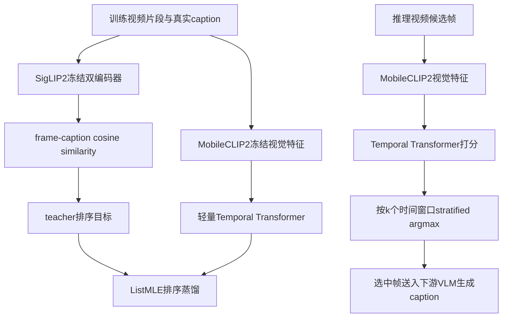

# PEEK: Picking Essential frames via Efficient Knowledge distillation

> 论文阅读报告。若“报告依据”不是 PDF 全文，结论需以论文全文复核为准。

## 基本信息

| 字段 | 内容 |
| --- | --- |
| arXiv ID | 2605.31029 |
| 发布时间 | 2026-06-01 |
| 作者 | Killian Steunou, Anas Filali Razzouki, Khalil Guetari, Moun\^im A. El-Yacoubi, Yannis Tevissen |
| 类别 | cs.CV |
| 方向 | 视频理解 |
| 推荐等级 | 中优先级 |
| 推荐分 | 16.0 / 30 |
| 业务相关度 | 中 |
| 工程落地性 | 中-高 |
| 代码 | https://github.com/momentslab/peek |
| 报告依据 | PDF全文与摘要 |
| 生成时间 | 2026-06-01T13:07:14+00:00 |

## 原始链接

- [查看论文](<https://arxiv.org/abs/2605.31029>)
- [下载 PDF](<https://arxiv.org/pdf/2605.31029>)
- [查看代码](<https://github.com/momentslab/peek>)

## 一页结论

PEEK值得视频理解、视频摘要和多模态效率方向的小范围精读与复现，尤其适合关注低帧预算视频 captioning 或长视频前处理的算法工程师。论文的核心结论是：用 SigLIP2 教师根据真实 caption 对候选帧打分，再把这种排序蒸馏到只看视觉特征的轻量 Transformer，推理时无需文本即可选帧（见 PAGE 2、PAGE 5、PAGE 6）。实验显示在 ActivityNet Captions 与 MSR-VTT 上，PEEK 在 1帧和2帧预算下最稳定，ActivityNet Captions 上 16 个 CIDEr 配置中赢 14 个；但在 MSR-VTT 的4帧和8帧预算下结果更混合，Uniform、Random 或 MaxInfo 有时更好（见 PAGE 9、PAGE 10、PAGE 11、PAGE 14）。工程价值主要在效率：在 ANC 评估集上 PEEK 选择开销为每段0.36秒，完整 captioning 流水线相对 Uniform 只增加5.2% GPU时间，明显低于 CSTA 的65.4%和 MaxInfo 的211.9%（见 PAGE 11、PAGE 12）。建议动作是小试：先在内部视频 caption、缩略图/预览帧、事件摘要前处理上验证；不建议直接外推到检测、跟踪、ReID或关键点，因为论文未给出这些任务的证据。

**适合读者：** 适合视频理解、多模态 captioning、视频摘要、长视频前处理和推理效率优化方向的算法工程师与研发负责人；不适合作为检测、跟踪、ReID、关键点算法主线论文直接落地。

**业务判断：** 视频理解效率相关，可迁移到长视频分析前处理，但不是视频检测或跟踪核心算法。

## 图解材料

> 适合作为报告中的方法流程图；caption 和正文明确说明三阶段流程，可帮助读者快速理解训练监督与推理部署的分离（见 PAGE 2）。

## 方法流程图

## Heilmeier 七问精读

## 1. 这篇论文要做什么？

**论文事实**

- 论文要解决的是视频语言模型只能处理有限帧数时的帧选择瓶颈，尤其是高效视频 captioning 的选帧问题（见 PAGE 1、PAGE 2）。
- 论文声称现有 captioning 流水线常用 uniform sampling，成本低但不看视觉内容；自适应选帧更有信息量但计算昂贵（见 PAGE 1、PAGE 2）。
- PEEK 的目标是在推理时不使用 caption 或文本编码器，仅凭视觉特征选择对 caption 有用的帧（见 PAGE 2、PAGE 3）。

**证据**

- PAGE 1: 视频语言模型只能处理有限帧数，frame selection 是高效 video captioning 的关键瓶颈；uniform sampling 便宜但 content-agnostic，自适应方法计算昂贵。
- PAGE 2: 推理时目标 caption 未知，caption-conditioned Oracle 不能直接用于 captioning；作者假设其中一部分相关性可以蒸馏到只看视觉的轻量模型。
- PAGE 3: PEEK 是 query-free frame selector，部署时 caption-agnostic，且独立于下游 captioning 模型。

## 2. 现有方法有什么限制？

**论文事实**

- Uniform sampling 是强基线，因为确定、无模型、低成本，但它忽略视频内信息密度差异（见 PAGE 2、PAGE 3）。
- 文本相关的选帧方法需要先知道 caption 或 query，因此难以直接用于 video captioning 推理阶段（见 PAGE 2、PAGE 4）。
- 训练免费或内容感知基线通常需要对密集候选帧运行较大的视觉编码器，因此成本较高（见 PAGE 3、PAGE 11、PAGE 12）。

**证据**

- PAGE 2: uniform sampling 将视频切成等长片段并取帧，但对关键事件瞬间出现和证据分散的视频一视同仁。
- PAGE 3: 相关工作指出 uniform sampling 是强基线，但忽略不同视频的信息密度差异；training-free 方法通常优化信息量、多样性和覆盖度。
- PAGE 4: video captioning 中选帧时只有视觉信号，text-aware selector 难以直接应用，除非改变任务或先生成 caption。
- PAGE 12: CSTA、MaxInfo、Oracle 的选择开销显著高于 PEEK。

## 3. 方法怎么做？

**论文事实**

- PEEK 是两阶段蒸馏框架：Stage 1 用冻结的 SigLIP2 双编码器根据真实 caption 给每个候选帧打相关性分数；Stage 2 训练轻量 temporal Transformer 从 MobileCLIP2 视觉特征预测该排序（见 PAGE 2、PAGE 5、PAGE 6）。
- PEEK 推理时将视频片段分成 k 个时间窗口，每个窗口取预测分数最高的帧，从而结合局部内容相关性与时间覆盖（见 PAGE 6）。
- 部署的 selector 不依赖下游 captioning 模型，也不需要文本输入（见 PAGE 3、PAGE 8、PAGE 9）。

**证据**

- PAGE 2: Figure 1 caption 描述了 Oracle teacher scoring、query-free temporal scorer 和 k=4 stratified argmax inference。
- PAGE 5: Stage 1 用 SigLIP2 计算 frame-caption cosine similarity，并将分数作为监督；Stage 2 不使用 caption embedding 或 teacher visual embedding。
- PAGE 6: student 使用 MobileCLIP2-S0 冻结视觉编码器输入，temporal scorer 输出每帧 relevance logit；推理采用 stratified argmax。

## 4. 关键机制与数学细节

**论文事实**

- Teacher 端用 SigLIP2 vision encoder 和 text encoder 分别编码帧与 caption，并用 L2-normalized cosine similarity 得到每帧分数，再 min-max 到[0,1]作为目标（见 PAGE 5）。
- Student 输入为 MobileCLIP2-S0 的512维视觉 embedding，经过 layer normalization、线性投影、固定正弦位置编码和 Transformer encoder 输出每帧 logit（见 PAGE 5、PAGE 6）。
- 训练目标是 ListMLE listwise ranking loss，而不是点回归；作者认为选帧只关心候选帧排序（见 PAGE 6）。
- 实现细节包括 hidden size 256、2层 encoder、4个 attention heads、FFN维度1024、dropout 0.15、约1.7M可训练参数，总参数13.1M；训练只用 ActivityNet Captions train segments（见 PAGE 6、PAGE 7）。

**证据**

- PAGE 5: SigLIP2 teacher 对每帧和 caption 做 cosine similarity，保留 scalar scores 作为 student 监督。
- PAGE 6: temporal scorer 公式给出 MobileCLIP2 embedding、TransformerLayer 和 frame relevance logit；ListMLE 优化 teacher-induced ranking。
- PAGE 7: 训练细节列出模型结构、优化器、学习率、batch size、epoch、增强和序列长度上限。

## 5. 谁会关心这项工作？

**业务判断**

- 对视频 captioning 和视频摘要业务，PEEK 可作为低帧预算前处理，在只给 VLM 1到2帧时提升帧选择质量。
- 对长视频检索、预览帧、缩略图、事件摘要，可把它看作低成本候选帧排序器，但需要用内部任务指标重新验证。
- 对检测、跟踪、ReID、关键点、属性识别，论文没有直接实验；只能作为抽帧启发，不能当作有效性证据。
- 对部署负责人，主要价值是选择开销低于内容感知基线，且不依赖推理时文本，便于插入现有 captioning 前处理流水线。

**证据**

- PAGE 8: 评估任务是 video captioning，帧预算 k 为1、2、4、8，并送入下游 VLM。
- PAGE 12: PEEK 完整流水线只比 Uniform 增加5.2% GPU时间。
- PAGE 14: 作者称 PEEK 对 efficient video captioning 实用，也可作为 thumbnail 或 preview-frame selection 的候选。

## 6. 实验是否支撑结论？

**论文事实**

- 训练使用 ActivityNet Captions train segments；评估在 ActivityNet Captions test 和 MSR-VTT test 上，MSR-VTT 为 zero-shot transfer（见 PAGE 7、PAGE 8）。
- 下游 VLM 包括 SmolVLM2-2.2B-Instruct、Qwen2.5-VL-3B、Qwen3.5-4B、Qwen2.5-VL-7B；指标包括 CIDEr、BLEU-4、METEOR、ROUGE-L，CIDEr 是主要讨论指标（见 PAGE 9）。
- ActivityNet Captions 上，PEEK 是最强 query-free selector，在16个 model/budget CIDEr 设置中赢14个，1帧和2帧收益最明显（见 PAGE 9、PAGE 10）。
- MSR-VTT zero-shot 上，PEEK 在1帧设置中对四个 VLM 的所有报告指标都是最佳 query-free 方法；但4帧和8帧下结果更混合（见 PAGE 9、PAGE 10、PAGE 11）。
- 效率实验在完整 ANC 评估集17,505段、SmolVLM2-2.2B、4×NVIDIA A10G GPU 上测量；PEEK 每段0.36秒，完整流水线增加5.2% GPU时间（见 PAGE 11、PAGE 12）。

**业务判断**

- 实验覆盖两个 captioning 数据集、四个下游 VLM 和多个帧预算，足以支持低帧预算 captioning 的结论。
- Oracle 使用 ground-truth caption，不可部署，适合作为上界或诊断，不应和可部署方法等价比较。
- 没有检测、跟踪、ReID、关键点或属性任务实验，跨任务泛化证据不足。
- 参考 caption 指标可能惩罚语义正确但措辞不同的 caption，作者也承认更多视觉上下文下指标可能非单调。

**证据**

- PAGE 8: 表1给出 ANC train/val/test 和 MSR-VTT test 的视频数、segment数、平均时长和 caption长度。
- PAGE 9: 论文说明评估四个下游 VLM，并报告 CIDEr、BLEU-4、METEOR、ROUGE-L。
- PAGE 10: 表2给出 ActivityNet Captions 上各 VLM、selector 和帧预算的指标。
- PAGE 11: 表3给出 MSR-VTT zero-shot 结果。
- PAGE 12: 表4给出选择与端到端 captioning 时间。

## 7. 风险、成本与边界

**论文事实**

- 作者明确指出 learned frame selection 不是普遍优于 uniform sampling；当可传入多帧时 uniform 仍是强基线，MSR-VTT k=4 时尤其明显（见 PAGE 13、PAGE 14）。
- 教师信号来自 ground-truth captions，因此学习到的是参考 caption 对齐相关性，而不是视频中所有有意义事件；正确但不匹配参考 caption 的帧可能得低分（见 PAGE 14）。
- 评估局限于短 caption 生成；长视频 captioning 可能需要保留多个事件、细粒度时序和单一 caption 相关性未覆盖的细节（见 PAGE 14）。
- 其他视频理解任务如 QA 或 retrieval 可能受益于 task/query-specific selection，PEEK 对这些任务需要专门实验（见 PAGE 14）。

**业务判断**

- 复现成本包括预计算 SigLIP2 teacher 分数、MobileCLIP2 特征和训练 temporal scorer；虽然 student 轻量，但数据处理链路仍需工程化。
- 若业务目标是检测召回或跟踪连续性，按 caption relevance 选少量帧可能丢失小目标、短时遮挡或跨帧运动线索。
- 在多帧预算较高时，PEEK 相对 uniform 的收益可能不足以抵消额外组件复杂度。

**证据**

- PAGE 13: 作者讨论 PEEK 在一帧和两帧最有用，Uniform 在多帧预算下仍是强基线。
- PAGE 14: 作者列出 ground-truth caption teacher、reference-based metric、短 caption 生成、长视频和 query-conditioned 任务的限制。

## 创新点

- 把 caption-conditioned frame relevance 当作离线 Oracle 监督，再蒸馏到 query-free visual temporal scorer，规避 video captioning 推理时没有目标文本的问题。
- 用轻量 MobileCLIP2 特征和小 Transformer 预测排序，在低帧预算下取得较好 captioning 指标，同时选择开销远低于 CSTA 和 MaxInfo。
- 推理阶段采用 stratified argmax，将学习到的局部相关性和时间覆盖结合，避免 raw top-k 过度集中。

## 结构化实验表

### ActivityNet Captions 主结果摘要

| 模型 | 数据集 | 指标 | 结果 | 证据 |
| --- | --- | --- | --- | --- |
| SmolVLM2-2.2B | ActivityNet Captions test | CIDEr, k=1 | PEEK 31.53，高于 Uniform 29.79、Random 28.40、CSTA 28.37、MaxInfo 27.07；Oracle 37.36不可部署 | PAGE 10 |
| Qwen2.5-VL-3B | ActivityNet Captions test | CIDEr, k=1 | PEEK 32.39，高于 Uniform 30.05、Random 29.03、CSTA 28.56、MaxInfo 26.47；Oracle 37.31不可部署 | PAGE 10 |
| Qwen3.5-4B | ActivityNet Captions test | CIDEr, k=1 | PEEK 31.73，高于 Uniform 29.55、Random 28.94、CSTA 28.51、MaxInfo 27.01；Oracle 38.44不可部署 | PAGE 10 |
| Qwen2.5-VL-7B | ActivityNet Captions test | CIDEr, k=1 | PEEK 31.54，高于 Uniform 28.54、Random 28.44、CSTA 28.02、MaxInfo 26.44；Oracle 36.60不可部署 | PAGE 10 |
| 整体 | ActivityNet Captions test | CIDEr | 论文称 PEEK 在16个 model/budget 设置中赢14个，低帧预算收益最明显 | PAGE 9 |

### MSR-VTT Zero-shot 与效率摘要

| 模型 | 数据集 | 指标 | 结果 | 证据 |
| --- | --- | --- | --- | --- |
| SmolVLM2-2.2B | MSR-VTT test | CIDEr, k=1 | PEEK 44.83，高于 Uniform 42.15、Random 41.77、CSTA 39.99、MaxInfo 34.36；Oracle 48.33不可部署 | PAGE 11 |
| Qwen2.5-VL-3B | MSR-VTT test | CIDEr, k=1 | PEEK 30.64，高于 Uniform 29.18、Random 28.34、CSTA 28.20、MaxInfo 21.82；Oracle 33.67不可部署 | PAGE 11 |
| Qwen3.5-4B | MSR-VTT test | CIDEr, k=1 | PEEK 34.89，高于 Uniform 32.63、Random 32.21、CSTA 31.23、MaxInfo 26.10；Oracle 38.80不可部署 | PAGE 11 |
| Qwen2.5-VL-7B | MSR-VTT test | CIDEr, k=1 | PEEK 33.16，高于 Uniform 31.08、Random 31.91、CSTA 31.54、MaxInfo 25.60；Oracle 36.63不可部署 | PAGE 11 |
| PEEK | ActivityNet Captions evaluation split | 选择与端到端时间 | selector time 1h44m，0.36s/segment，完整流水线35h20m，相对 Uniform 增加5.2% | PAGE 12 |
| CSTA / MaxInfo | ActivityNet Captions evaluation split | 选择与端到端时间 | CSTA 完整流水线+65.4%，MaxInfo +211.9%，均高于 PEEK | PAGE 12 |

## 业务价值

对视频 captioning、视频摘要、长视频理解前处理、预览帧/缩略图选择有明确小试价值：它可以在不增加太多端到端成本的情况下，用低帧预算给 VLM 提供更可能相关的帧。对检测、跟踪、ReID、关键点和属性识别，论文没有直接证据，只能作为抽帧策略候选，需要用任务指标重新验证。

## 落地建议

- 1天内验证项：用现有视频 captioning 流水线复现推理侧 stratified argmax selector 接口，先用 Uniform、Random 和内部轻量视觉打分器做离线对照，确认帧预算 k=1/2 时业务指标是否敏感。
- 1周内小实验：在内部视频摘要或事件 caption 数据上预计算视觉特征，训练或直接评估 PEEK 类排序器；至少比较 Uniform、Random、内容多样性选帧和 PEEK，并记录端到端延迟。
- 是否进入技术储备：若低帧预算 caption 指标有稳定收益且额外耗时低于既有前处理阈值，可进入视频理解前处理技术储备；若业务主指标是检测召回、跟踪ID稳定性或ReID检索，需另立实验，不应直接纳入主线。

## 风险限制

- 优化目标是参考 caption 相关性，可能偏向主事件或参考文本描述，遗漏对检测、跟踪、ReID有价值但 caption 未描述的帧。
- 多帧预算增大时优势下降；MSR-VTT k=4/k=8 中 Uniform、Random 或 MaxInfo 有时更好，说明 PEEK 不是 uniform sampling 的通用替代品。
- Oracle 依赖真实 caption 产生监督，迁移到无标注业务数据需要额外策略或标注来源。
- 论文评估限定在短 caption 生成，没有长视频多事件、视频QA、检索、检测或部署在线流式场景的直接证据。

## 待确认问题

- 内部长视频中关键事件是否稀疏到足以让 PEEK 相比 Uniform 获益？需要按业务视频分布验证。
- 如果业务使用中文 caption 或跨语言 caption，SigLIP2 teacher 监督是否仍稳定？论文未给出该场景证据。
- 对于多事件长视频，单一 caption-conditioned ranking 是否会过度选择主事件并丢掉次要事件？论文承认需要未来研究。
- 能否把 PEEK 的视觉 scorer 作为检测/跟踪前的候选片段召回器？论文没有相关实验，证据不足。

## 证据索引

- PAGE 1: 摘要说明 PEEK 面向视频 captioning 的高效动态选帧，蒸馏 caption-conditioned relevance ranking 到轻量视觉时序模型，并报告低帧预算与效率优势。
- PAGE 2: 图1和引言说明 Oracle teacher、query-free temporal scorer、stratified argmax，以及目标 caption 推理时不可用的问题。
- PAGE 5: 方法部分给出 SigLIP2 teacher scoring 公式和 Stage 2 不使用 caption/teacher embedding 的设定。
- PAGE 6: 方法部分给出 temporal scorer、ListMLE 和 stratified argmax 推理规则。
- PAGE 7: 实现细节列出 ActivityNet Captions 训练、SigLIP2/MobileCLIP2 配置、模型规模和训练参数。
- PAGE 8: 数据与评估设置给出 ANC、MSR-VTT split 统计和训练评估协议。
- PAGE 9: 结果文字说明 PEEK 在 ActivityNet Captions 低帧预算收益和 MSR-VTT zero-shot 一帧优势。
- PAGE 10: 表2给出 ActivityNet Captions 主结果。
- PAGE 11: 表3给出 MSR-VTT zero-shot 主结果，并指出部分 captioner 随帧数增加出现非单调。
- PAGE 12: 表4给出选择与端到端 captioning 时间；表5给出 stratified argmax 优于 raw top-k。
- PAGE 13: 表6给出 ListMLE 优于 MSE+pairwise；讨论指出 PEEK 最适合低帧预算。
- PAGE 14: 论文限制包括 Uniform 多帧仍强、teacher 来自 ground-truth captions、短 caption 评估和其他任务需要专门实验。
