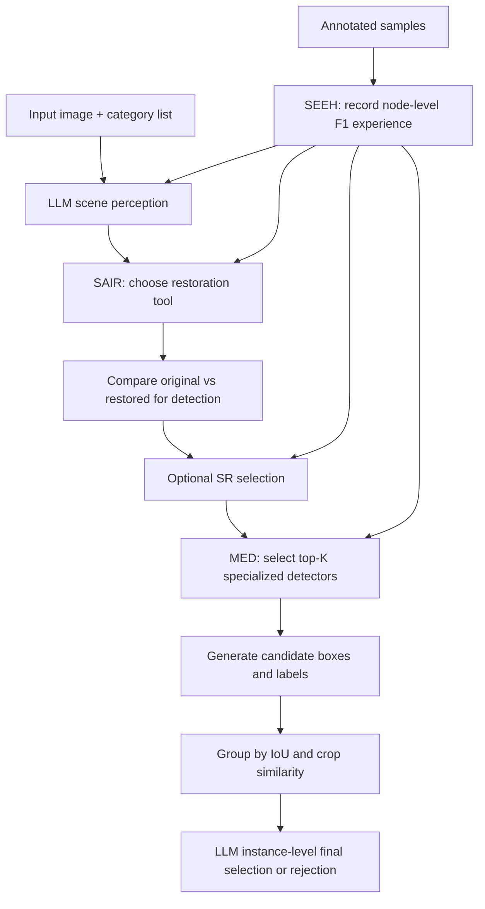

# Detect in Any Scene: An Agentic Framework for Object Detection with Experience-Aware Reasoning

> 论文阅读报告。若“报告依据”不是 PDF 全文，结论需以论文全文复核为准。

## 基本信息

| 字段 | 内容 |
| --- | --- |
| arXiv ID | 2605.31174 |
| 发布时间 | 2026-06-01 |
| 作者 | Wenlun Zhang, Jun Yin, Kentaro Yoshioka |
| 类别 | cs.CV |
| 方向 | 检测 |
| 推荐等级 | 中优先级 |
| 推荐分 | 21.0 / 30 |
| 业务相关度 | 中-高 |
| 工程落地性 | 低-中 |
| 代码 | 未知 |
| 报告依据 | PDF全文与摘要 |
| 生成时间 | 2026-06-01T13:07:14+00:00 |

## 原始链接

- [查看论文](<https://arxiv.org/abs/2605.31174>)
- [下载 PDF](<https://arxiv.org/pdf/2605.31174>)

## 一页结论

这篇论文值得检测方向算法工程师小范围精读和复现实验，尤其适合负责低照、雾天、雨天、水下、无人机视角等退化场景检测泛化的团队。论文把检测从固定模型/固定预处理流水线改成由MLLM代理动态选择恢复工具、超分和专用检测器的流程，并用少量标注样本沉淀节点级经验形成DetAS-X；方法框架见PAGE 2、PAGE 3、PAGE 4。实验覆盖COCO、HazyDet、MARIS、DarkFace、BDD100K Night/Rainy，主指标为IoU=0.5下F1，DetAS-X平均F1为47.99，明显高于Qwen3-VL-8B的19.63和DetAS的45.17，见PAGE 6、PAGE 7。建议动作是小试而非直接产品化：其收益集中在复杂退化场景，但依赖MLLM、多恢复模型、多专用检测器和经验库，实时部署成本与工程复杂度较高，限制见PAGE 9。

**适合读者：** 目标检测、开放词表检测、恶劣天气感知、多域检测、视觉Agent和感知系统工程化负责人。

**业务判断：** 直接针对复杂真实场景检测泛化，适合检测团队跟踪，但更像高成本agentic系统。

## 图解材料

> 适合放入报告的问题定义/方法动机部分，用来解释论文为何从固定训练或固定流水线转向动态工具选择；依据caption和PAGE 2正文判断，不能从图片细节额外推断。

## 方法流程图

## Heilmeier 七问精读

## 1. 这篇论文要做什么？

**论文事实**

- 论文声称真实场景目标检测受雾、雨、低照、水下失真等图像退化和异构目标分布影响，现有检测器泛化困难，见PAGE 1。
- 论文提出DetAS，把目标检测表述为动态决策过程，由MLLM作为中心代理从恢复模块和专用检测器工具箱中自适应组合检测工作流，见PAGE 1、PAGE 2。
- 论文进一步提出SEEH并形成DetAS-X，从少量标注数据中积累节点级决策经验，在推理时进行experience-aware reasoning，见PAGE 1、PAGE 5、PAGE 6。

**证据**

- PAGE 1: 摘要指出真实场景检测受多样退化和异构分布影响，DetAS用MLLM代理动态组合恢复模块和专用检测器。
- PAGE 2: 论文将Agentic Detection与representation learning、end-to-end pipeline对比，强调动态选择工具。
- PAGE 5: SEEH从小规模标注数据收集、存储、总结节点级决策经验。

## 2. 现有方法有什么限制？

**论文事实**

- 表示学习类方法依赖固定退化类型和目标类别的数据集，在轻微退化或场景分布变化下也可能泛化变差，见PAGE 1、PAGE 2。
- 端到端流水线通常依赖预定义恢复策略和人工设计流程，恢复不当会降低检测性能，适配新场景往往需要重新设计，见PAGE 2。
- 现有开放词表视觉 grounding 和MLLM检测方法主要在干净静态场景评估，对严重退化、遮挡和动态条件下的鲁棒性探索不足，见PAGE 3。

**证据**

- PAGE 2: 固定退化、固定类别和预定义流水线被描述为两类范式的核心局限。
- PAGE 3: 相关工作指出现有grounding方法对严重退化、遮挡、动态条件的鲁棒性不足。

## 3. 方法怎么做？

**论文事实**

- DetAS包含SAIR和MED两个核心组件：SAIR生成更适合检测的图像，MED利用互补检测器处理多样场景，见PAGE 3。
- SAIR先由LLM感知图像退化并从normal、fog、rain、underwater、low-light、noise等预定义场景标签中判断，再激活去雾、去雨、去噪、亮度增强等恢复工具，见PAGE 3。
- MED由LLM结合图像内容和目标类别列表，从通用、小密集目标、自动驾驶、无人机视角、水下、人脸等检测器池中选择Top-K检测器，见PAGE 4。
- DetAS-X在restorer selection、SR selection、detector selection三个关键决策节点引入经验检索，见PAGE 5、PAGE 6。

**证据**

- PAGE 3: 方法总览说明DetAS由SAIR、MED组成，并引入SEEH升级为DetAS-X。
- PAGE 4: Fig. 2及正文展示SAIR、MED和SEEH的整体流程。
- PAGE 5: 论文明确三个经验检索节点：restorer selection、SR selection、detector selection。

## 4. 关键机制与数学细节

**论文事实**

- SAIR并非总是使用恢复结果，而是比较原图与恢复图，按目标可见性、边界清晰度和结构完整性选择更适合检测的输入，见PAGE 4。
- SAIR最后使用SR提升空间分辨率，尤其服务小目标或远距离目标；给定目标分辨率时自动选择放大倍率，见PAGE 4。
- MED先对多个检测器输出做候选框分组，分组依据包括IoU和裁剪区域视觉相似度，视觉相似度由32×32裁剪patch向量余弦相似度计算，见PAGE 5。
- MED在每个实例组内把区域crop和候选proposal交给LLM做最终bbox-label选择，也允许拒绝虚假预测组，见PAGE 5。
- SEEH在部署前用每个数据集训练集随机50个标注样本做经验采集，记录各决策配置下的F1等指标；推理时检索Top-K相似profile，见PAGE 6。

**证据**

- PAGE 4: 图像选择机制强调检测导向而非视觉美观，并说明SR阶段。
- PAGE 5: 给出IoU、视觉相似度公式和实例级LLM决策流程。
- PAGE 6: 经验采集、推理检索、50个样本、Top-K=3等实现细节。

## 5. 谁会关心这项工作？

**业务判断**

- 对检测业务的直接价值在于把退化场景下的预处理、模型选择和候选融合从固定规则改成输入自适应决策，适合低照、雨雾、水下、无人机、车载等多域检测链路。
- 对研发负责人而言，这篇论文更像系统编排方案而非单一模型改进：可借鉴其工具箱、专用检测器池、经验库和节点级A/B评估思想，用于多场景检测服务的自动路由和灰度策略。
- 对实时感知链路需要谨慎，MLLM代理加多检测器推理会带来延迟、显存和运维复杂度，论文没有给出端侧或实时吞吐结果，相关部署效率证据不足。

**证据**

- PAGE 4: MED检测器池覆盖通用、小密集、自动驾驶、无人机、水下、人脸等场景。
- PAGE 6: 实现中使用多种恢复模型、Qwen3-VL-8B专用检测器和Rex-Omni，说明系统组件较多。

## 6. 实验是否支撑结论？

**论文事实**

- 实验数据集包括HazyDet、MARIS、DarkFace、BDD100K的B-Night和B-Rainy子集，以及COCO，见PAGE 6。
- 指标为IoU=0.5下F1 score (%)，见PAGE 6、PAGE 7。
- 表1显示DetAS-X在COCO、HazyDet、MARIS、DarkFace、B-Night、B-Rainy上的F1分别为59.90、52.35、52.29、44.98、38.35、40.08，平均47.99，见PAGE 7。
- 表1显示Qwen3-VL-8B平均F1为19.63，DetAS平均F1为45.17，DetAS-X平均F1为47.99，见PAGE 7。
- 消融显示去掉SAIR时DarkFace从44.98降到25.84，去掉MED时MARIS从52.29降到2.04；Top-K检测器数量收益在K=2附近饱和，K=4略降，见PAGE 8。

**业务判断**

- 实验覆盖退化类型较丰富，主表和消融都支持SAIR、MED、SEEH的增益判断。
- 可信度的主要风险是系统组件多且基线均为MLLM grounding检测器，论文没有与强传统专用检测器在固定场景下系统比较；作者也承认MLLM检测器在固定场景通常弱于传统检测器，见PAGE 9。
- 正文对B-Rainy增益的叙述与表格数字存在不一致风险：表1中DetAS为39.69、DetAS-X为40.08，而正文写到从11.29到40.08的例子，建议以表1为准并在复现时核对。

**证据**

- PAGE 6: 实验设置列出数据集、基线、恢复模型、检测器池、LoRA设置、50个经验样本等。
- PAGE 7: 表1给出各方法在六个数据集上的F1。
- PAGE 8: Fig. 4和正文给出组件消融与Top-K检测器数量分析。

## 7. 风险、成本与边界

**论文事实**

- 论文承认DetAS-X受MLLM-based detectors能力约束，而这些检测器在固定场景中通常弱于传统检测器，见PAGE 9。
- 论文承认当前系统由五个恢复工具和六个领域专用检测器构成，只覆盖常见开放环境场景，未探索红外、X光、医学影像等更专门领域，见PAGE 9。

**业务判断**

- 复现成本高：需要多套恢复模型、多个SFT专用检测器、MLLM代理、实例分组和经验库流程，工程集成复杂。
- 部署风险高：论文没有报告延迟、吞吐、成本、显存或多模型调度开销，实时业务落地证据不足。
- 经验库依赖少量标注数据和profile检索，跨业务迁移时可能需要重新采样和重新收集节点经验。

**证据**

- PAGE 6: 实现细节显示恢复工具、检测器池、Qwen3-VL-8B代理、Rex-Omni和经验采集共同构成系统。
- PAGE 9: Limitations明确MLLM检测器能力和未覆盖专门领域的限制。

## 创新点

- 将退化场景检测组织为MLLM代理驱动的动态工具选择流程，而不是固定预处理或单一检测器，见PAGE 1、PAGE 2。
- SAIR显式引入检测导向的恢复结果选择，避免把视觉上更好但检测上更差的恢复图直接送入检测器，见PAGE 4。
- MED把多个领域专用MLLM检测器的候选结果做实例分组，再由LLM进行实例级bbox-label裁决，见PAGE 4、PAGE 5。
- SEEH从少量标注数据中记录restorer、SR、detector三个节点的经验，用profile检索辅助推理，见PAGE 5、PAGE 6。

## 结构化实验表

### 主结果表：F1 score (%) at IoU=0.5

| 模型 | 数据集 | 指标 | 结果 | 证据 |
| --- | --- | --- | --- | --- |
| Qwen3-VL-8B | 六数据集平均 | F1@IoU=0.5 | 19.63 | PAGE 7 |
| DetAS | 六数据集平均 | F1@IoU=0.5 | 45.17 | PAGE 7 |
| DetAS-X | 六数据集平均 | F1@IoU=0.5 | 47.99 | PAGE 7 |
| DetAS-X | COCO | F1@IoU=0.5 | 59.90 | PAGE 7 |
| DetAS-X | HazyDet | F1@IoU=0.5 | 52.35 | PAGE 7 |
| DetAS-X | MARIS | F1@IoU=0.5 | 52.29 | PAGE 7 |
| DetAS-X | DarkFace | F1@IoU=0.5 | 44.98 | PAGE 7 |
| DetAS-X | B-Night | F1@IoU=0.5 | 38.35 | PAGE 7 |
| DetAS-X | B-Rainy | F1@IoU=0.5 | 40.08 | PAGE 7 |

### 消融结果摘录

| 模型/设置 | 数据集 | 指标 | 结果 | 证据 |
| --- | --- | --- | --- | --- |
| w/o SAIR | DarkFace | F1@IoU=0.5 | 25.84 | PAGE 8 |
| DetAS-X | DarkFace | F1@IoU=0.5 | 44.98 | PAGE 8 |
| w/o MED | MARIS | F1@IoU=0.5 | 2.04 | PAGE 8 |
| DetAS-X | MARIS | F1@IoU=0.5 | 52.29 | PAGE 8 |
| Top-K=2检测器 | COCO/HazyDet/DarkFace | 趋势 | 收益基本饱和，K=4略降 | PAGE 8 |

## 业务价值

这篇论文对检测业务的价值主要是系统策略：在多退化、多场景业务中，用退化识别、恢复工具箱、领域检测器池、实例级候选融合和少量标注经验库构成自适应检测路由。适合离线质检、自动标注、复杂场景巡检、低照/雨雾/水下专项检测增强；对严格实时车端或端侧检测，因未报告速度和资源成本，业务落地证据不足。

## 落地建议

- 1天内验证项：在现有业务数据中选低照/雾天/雨天各20到50张，先不接MLLM全流程，只比较原图、恢复图、超分图对现有检测器F1/召回的影响，验证SAIR的检测导向选择是否有收益。
- 1周内小实验：构建2到3个专用检测器或已有模型路由池，用IoU分组加crop相似度融合候选，手工或轻量VLM做实例级裁决；用少量标注样本记录每类profile下的最佳恢复和检测器组合。
- 是否进入技术储备：建议进入技术储备但不直接产品化；若小实验显示退化场景F1或召回有稳定提升，再评估MLLM代理替换为轻量规则/小模型路由以降低延迟。

## 风险限制

- 系统复杂度高：五类恢复工具、六类专用检测器、MLLM代理、经验库和候选融合都需要维护，见PAGE 6。
- 实时部署风险：论文未给出延迟、吞吐、显存、成本或端侧部署数据，证据不足。
- 比较边界有限：主要对比MLLM grounding检测器，作者承认MLLM检测器在固定场景中通常弱于传统检测器，见PAGE 9。
- 经验迁移风险：SEEH依赖小规模标注样本和profile检索，换业务域后可能需要重新采集经验，见PAGE 5、PAGE 6。
- 专门领域覆盖不足：红外、X光、医学影像等未探索，见PAGE 9。

## 待确认问题

- DetAS-X相对强传统检测器或专门恶劣天气检测器的收益如何？论文主表没有充分回答。
- 完整系统的端到端延迟、吞吐、显存和API成本是多少？全文未报告，证据不足。
- LLM场景profile预测错误时，恢复工具和检测器选择会如何退化？全文缺少系统错误分析，证据不足。
- SEEH的50个标注样本是否对不同数据集都足够，样本数变化曲线如何？全文未见详细样本量敏感性实验，证据不足。
- 表1与正文对B-Rainy部分叙述存在数字核对需求，复现时应以表格和代码为准。

## 证据索引

- PAGE 1: 摘要提出DetAS和DetAS-X，声称六个挑战基准平均F1提升28.36%，DarkFace最高提升37.01%。
- PAGE 2: 论文比较表示学习、端到端流水线和agentic detection，并说明固定退化/类别/流水线的局限。
- PAGE 3: 方法章节说明DetAS由SAIR、MED组成，并用SEEH扩展为DetAS-X。
- PAGE 4: SAIR流程包括恢复工具选择、原图/恢复图选择和SR；MED检测器池覆盖多个专长。
- PAGE 5: MED实例分组公式和实例级LLM裁决；SEEH动机和三个经验节点。
- PAGE 6: 实验设置、数据集、基线、恢复工具、检测器池、LoRA、50个经验样本和检索Top-K。
- PAGE 7: 表1给出所有主结果，DetAS-X平均F1为47.99。
- PAGE 8: 消融显示SAIR、MED和Top-K检测器数量的影响。
- PAGE 9: 论文限制包括MLLM检测器能力和未探索红外、X光、医学影像等专门领域。
