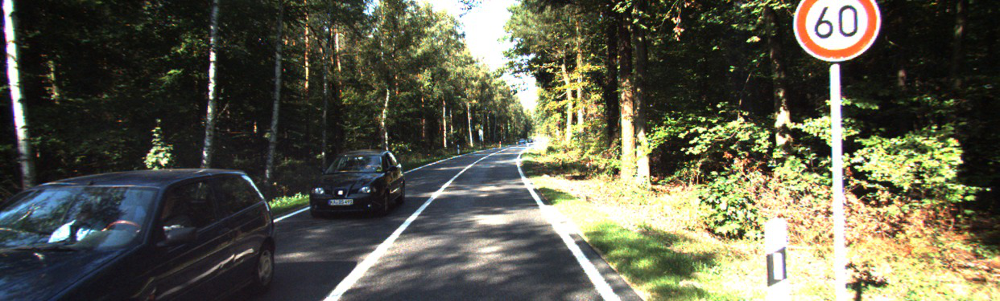
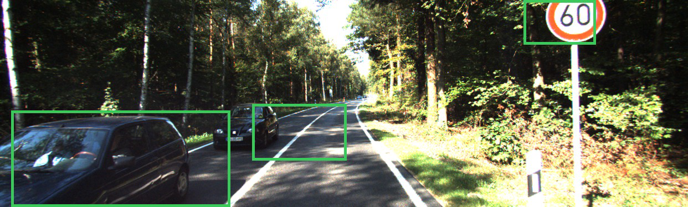
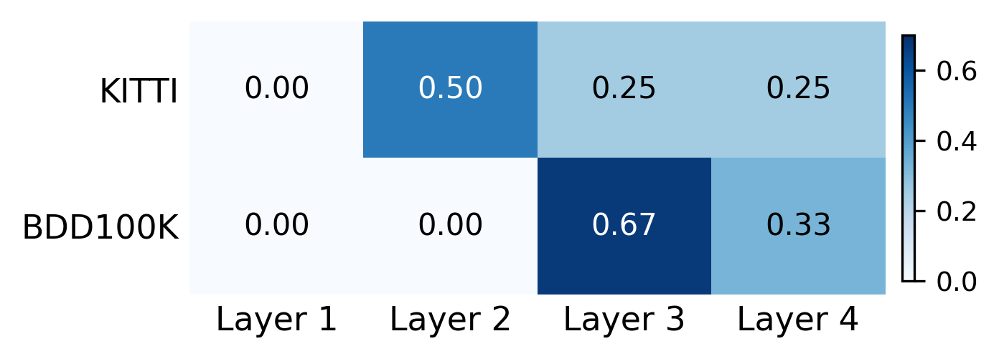

# LFA: Layer Feature Attention for Run-Time Introspection of 2D Object Detectors in Automated Driving

## 摘要

| 项目 | 内容 |
|---|---|
| 论文 | LFA: Layer Feature Attention for Run-Time Introspection of 2D Object Detectors in Automated Driving |
| 作者 | Mert Keser, Alois Knoll |
| arXiv | https://arxiv.org/abs/2606.00372 |
| PDF | https://arxiv.org/pdf/2606.00372 |
| 发布时间 | 2026-06-02 |
| 研究方向 | 自动驾驶 2D 目标检测可靠性、运行时内省（run-time introspection） |
| 代码状态 | 本文未提供可确认的公开 LFA 代码。论文只给出 Faster R-CNN 官方模型文档与 DETR 仓库链接作为检测器来源，未给出 LFA 官方实现链接；基于题名、作者与 arXiv ID 的公开检索也未确认官方仓库。证据不足，本文不编写代码段。 |

一句话总结：LFA 将冻结目标检测器的多个 ResNet-50 backbone 层特征视为 token，通过轻量 Transformer attention 学习层级特征权重，从而在不替换主检测器的前提下预测帧级漏检错误，并在 KITTI 与 BDD100K 上取得最优 AUROC（见 PAGE 1、PAGE 3、PAGE 4）。

本文关注的问题不是“如何让检测器本身更准”，而是“检测器已经部署后，如何在运行时判断它这一帧是否可能出错”。论文将这种能力称为 introspection，即感知系统对自身输出可靠性的运行时评估。作者指出，在自动驾驶中，分布偏移、恶劣环境和长尾场景会导致检测失败，而 EU AI Act 与 ISO/PAS 8800:2024 等监管趋势也强化了运行时监控机制的必要性（见 PAGE 1）。

LFA 的基本假设是：检测错误不会只体现在最后一层特征中。低层特征包含纹理、边缘、小目标和遮挡细节；高层特征包含语义和场景上下文。已有 feature-based introspection 方法通常手工选择最后一个 backbone 层，LFA 则把多个层的特征共同输入一个 attention 模块，让模型端到端学习哪一层对错误预测更重要（见 PAGE 1、PAGE 2、PAGE 3）。

论文的实验结论需要带限定地理解。LFA 在 KITTI 和 BDD100K、DETR 和 Faster R-CNN 四个 detector-dataset 组合上都取得最高 AUROC；但在 KITTI + DETR 上，LFA 的 F1 和 FNR 不如 LFR 与 LF-ASH。因此，更严谨的表述是：LFA 在阈值无关的排序能力上最稳定，而在特定阈值下的安全指标仍受类别不平衡和操作点选择影响（见 PAGE 4）。

## 背景与动机

自动驾驶感知栈需要识别车辆、行人、骑行者等交通参与者，2D object detection 提供实例级类别和位置框，是规划与决策模块的重要输入。论文开篇强调，尽管检测器在 KITTI、BDD100K 等基准上已有显著进展，DNN-based detectors 在真实部署中仍会受训练域与运行域差异、天气光照变化、稀有场景和长尾目标影响而失败（见 PAGE 1）。

在安全关键系统中，单纯追求平均检测性能不足以覆盖部署风险。即使主检测器总体 mAP 较高，某一帧中漏掉一个行人或远处车辆也可能触发危险决策。因此 introspection 的目标是：对给定输入帧，在运行时预测检测器是否产生错误输出，并据此触发 human takeover request、minimum risk maneuver 或其他 fallback strategy（见 PAGE 1）。

已有 introspection 方法大致可分为几类。Confidence-based 方法依赖 softmax score 或 Bayesian uncertainty；metric-based 方法预测帧级 mAP；inconsistency-based 方法利用多传感器或多算法分歧；concept-based 方法用语义概念验证检测结果。论文指出，输出层置信度常常校准不足，额外模态或语义监督也会提高系统复杂度，因此 feature-based introspection 成为更直接的路径（见 PAGE 1、PAGE 2）。

Feature-based introspection 的核心思想是读取检测器内部 backbone activation，而不是只看最终检测框和置信度。LFR 使用最后一个 backbone 层特征训练分类器，LF-ASH 在最后一层特征上做 Activation Shaping。但这些方法默认“最后一层最有用”，缺少原则性依据。论文认为，不同层级表达不同视觉抽象，错误模式也可能分布在不同层级，因此只看最后一层会丢失互补信息（见 PAGE 2、PAGE 3）。

本文的动机可以概括为三个层次。第一，自动驾驶需要运行时故障预警，而不是离线评测报告。第二，output-level cues 可能误导可靠性判断，feature-level cues 更接近检测器内部状态。第三，多层 backbone 特征包含不同类型的失败信号，应该通过可学习机制自适应聚合，而不是固定拼接或手工选层（见 PAGE 1、PAGE 3）。

## 预备知识

运行时内省（run-time introspection）在本文中被定义为：给定输入图像和检测器内部或外部信号，预测这一帧检测结果是否存在错误。论文采用 frame-level binary error prediction，也就是输出 “error” 或 “no-error” 两类，而不是直接修正检测框（见 PAGE 1、PAGE 3）。

Backbone feature hierarchy 指检测器主干网络不同阶段的特征层级。以 ResNet-50 为例，论文使用四个 backbone stage，通道数示例为 $C_\ell \in \{256,512,1024,2048\}$，其中 $\ell$ 表示层索引，$C_\ell$ 表示第 $\ell$ 层特征通道维度。浅层通常保留局部外观信息，深层更偏语义和场景关系（见 PAGE 3）。

Global Average Pooling（GAP，全局平均池化）用于把每个空间特征图压缩成一个向量。设第 $\ell$ 层经过 GAP 后得到 $f_\ell \in \mathbb{R}^{C_\ell}$，其中 $f_\ell$ 是第 $\ell$ 层的紧凑特征向量。LFA 不直接处理完整空间特征图，而是处理这些 GAP-pooled vectors，因此参数量和计算开销较低（见 PAGE 3、PAGE 5）。

Transformer attention 在本文中不是用于检测，而是用于聚合“层 token”。LFA 把每个 backbone 层投影后的向量视为一个 token，再额外加入分类 token $z_{\mathrm{cls}}$。分类 token 的最终表示用于二分类；它对各层 token 的 attention weights 则用于解释不同层的相对重要性（见 PAGE 2、PAGE 3）。

## 方法详解

### 总体框架

LFA 的输入来自一个已经 fine-tuned 并冻结的目标检测器。检测器可以是 Faster R-CNN，也可以是 DETR；二者都使用 ResNet-50 backbone，并先从 COCO-pretrained weights 初始化，再在目标驾驶数据集上微调。随后 LFA 读取冻结 detector 的多个 backbone 层特征，训练一个独立的 introspection model 预测帧级错误标签（见 PAGE 3、PAGE 4）。

**用途**：下图用于说明 LFA 并不替换目标检测器，而是附着在冻结 detector 的 backbone 特征之上，形成并行的 introspection 分支。

**读图要点**：Figure 1 展示了上方 object detection pipeline 和下方 LFA pipeline。主检测器输出 detections；LFA 读取 Layer 1 到 Layer 4 特征，经 GAP、layer projection、Transformer block 和 classifier 输出 Error / No-Error。  
**支撑的判断**：LFA 的业务价值在于作为运行时质量监控模块接入现有检测器，而不是要求替换 Faster R-CNN 或 DETR 主模型（见 PAGE 2）。

### 创新一：从单层内省转向多层特征内省

已有 LFR 和 LF-ASH 只取最后 backbone 层。LFA 的第一项核心创新是把 $L$ 个中间层都纳入建模，其中 $L$ 表示 backbone 选取的层数。论文表述为从所有 backbone layers 抽取 GAP-pooled feature vectors，并通过 transformer attention 聚合（见 PAGE 3）。

第 $\ell$ 层特征经 GAP 后得到 $f_\ell \in \mathbb{R}^{C_\ell}$。由于不同层通道数不同，LFA 先使用层特定投影把它们映射到统一维度：

$$
z_\ell = \mathrm{LN}(W_\ell f_\ell + b_\ell), \quad z_\ell \in \mathbb{R}^{d}
$$

其中 $W_\ell \in \mathbb{R}^{d \times C_\ell}$ 是第 $\ell$ 层的可学习投影矩阵，$b_\ell$ 是偏置项，$\mathrm{LN}$ 表示 Layer Normalization，$d$ 是共享 embedding 维度（见 PAGE 3，公式 1）。这条公式的含义是：不同层原本维度不一致，LFA 先把它们规范化成同一语义空间，后续 attention 才能在层之间比较和加权。

该设计的优势在于保留层级互补信息。浅层对小目标、遮挡边界和局部外观更敏感；深层对类别语义和场景上下文更敏感。论文摘要明确指出，检测错误在 feature hierarchy 上的表现并不一致，因此多层输入比单层输入更符合错误信号的生成机制（见 PAGE 1）。

### 创新二：把每个层表示视为 token，由 attention 学习层重要性

LFA 不采用固定平均或固定拼接作为主方法，而是把投影后的层特征组织成序列。首先加入一个可学习分类 token $z_{\mathrm{cls}}$，再加入 learnable layer embeddings $e_i$ 表示 token 身份：

$$
Z^{(0)} = [z_{\mathrm{cls}}, z_1, \ldots, z_L] + [e_0, e_1, \ldots, e_L]
$$

$$
Z^{(0)} \in \mathbb{R}^{(L+1)\times d}
$$

其中 $Z^{(0)}$ 是 Transformer 的输入序列，长度为 $L+1$，包括一个分类 token 和 $L$ 个层 token（见 PAGE 3，公式 2）。这条公式的含义是：LFA 将“第几层”本身作为可学习身份信息注入，使模型能区分 Layer 1、Layer 2、Layer 3、Layer 4，而不是只看到一组无序向量。

随后，序列经过单层 pre-norm Transformer block。论文给出两步残差计算：

$$
\hat{Z} = Z^{(0)} + \mathrm{MHSA}\left(\mathrm{LN}\left(Z^{(0)}\right)\right)
$$

$$
Z^{(1)} = \hat{Z} + \mathrm{FFN}\left(\mathrm{LN}\left(\hat{Z}\right)\right)
$$

其中 $\mathrm{MHSA}$ 是 Multi-Head Self-Attention，$\mathrm{FFN}$ 是 feed-forward network，$\hat{Z}$ 是 attention 后的中间表示，$Z^{(1)}$ 是 Transformer block 输出（见 PAGE 3，公式 3-4）。这两条公式的含义是：层 token 之间通过 self-attention 交换信息，分类 token 能选择性吸收不同层的错误相关信号。

**用途**：下图用于展示 LFA 中 GAP、layer projection、classification token 与 Transformer block 的连接关系。

**读图要点**：图中 $f_1$ 到 $f_4$ 来自四个 backbone 层，经 $W_1$ 到 $W_4$ 和 LN 投影为 $z_1$ 到 $z_4$，再与 $z_{\mathrm{CLS}}$ 组成输入序列 $Z^{(0)}$。  
**支撑的判断**：LFA 的关键不是简单堆叠多层特征，而是把“层级”作为 attention 序列中的基本单元，由模型学习聚合策略（见 PAGE 2、PAGE 3）。

### 创新三：用分类 token 做错误预测，同时用 attention weights 做解释

Transformer 输出后，LFA 取分类 token 对应的输出作为聚合后的帧级表示：

$$
\hat{y} = \mathrm{MLP}\left(z^{(1)}_{\mathrm{cls}}\right) \in \mathbb{R}^{2}
$$

其中 $\hat{y}$ 是二分类 logits，对应 error 和 no-error 两类；$z^{(1)}_{\mathrm{cls}}$ 是 Transformer 输出中分类 token 的表示（见 PAGE 3，公式 5）。这条公式的含义是：LFA 最终输出不是检测框，而是判断当前帧检测是否失败的二分类结果。

论文还给出用于解释层重要性的 attention 计算：

$$
\alpha = \mathrm{softmax}\left(\frac{q_{\mathrm{cls}}K^\top}{\sqrt{d_h}}\right) \in \mathbb{R}^{L+1}
$$

其中 $q_{\mathrm{cls}}$ 是分类 token 对应的 query，$K$ 是 key matrix，$d_h=d/H$ 是每个 attention head 的维度，$H$ 是 head 数量（见 PAGE 3，公式 6）。这条公式的含义是：分类 token 对各层 token 的注意力分布 $\alpha$ 可以作为 post-hoc layer relevance，即模型认为哪些 backbone 层更能提示检测错误。

需要注意，论文明确写道 attention weights are not used in the classification itself，而是作为事后解释层相关性的方法（见 PAGE 3）。因此不能把 attention weight 等同于严格因果贡献；它更适合被解读为模型内部聚合时的相关性指标。

### 错误标签构造：从 mAP 标签转向 false-negative 标签

LFA 的训练标签不是直接使用 frame-level mAP。论文指出，基于 mAP 的标签可能因为按类平均而掩盖 individual missed objects；因此作者沿用 LF-ASH 的 false-negative based labeling，直接针对漏检（见 PAGE 3）。

设某帧图像 $I$ 的 ground-truth boxes 为 $G=\{g_1,\ldots,g_M\}$，检测器预测为 $D=\{d_1,\ldots,d_N\}$。论文执行 class-aware greedy matching：每个检测框与同类别、IoU 最高且满足 $\tau_{\mathrm{IoU}}=0.5$ 的 ground-truth box 匹配。未被匹配的 ground-truth object 被视为 false negative（见 PAGE 3）。

帧级二分类标签定义为：

$$
y =
\begin{cases}
1 \;(\mathrm{error}), & \text{if } \exists g \in G \text{ unmatched}, \\
0 \;(\mathrm{no\text{-}error}), & \text{otherwise}.
\end{cases}
$$

其中 $y=1$ 表示该帧存在至少一个未匹配 ground-truth object，即存在漏检错误；$y=0$ 表示所有标注对象都被检测器成功匹配（见 PAGE 3，公式 7）。这条公式的含义是：只要一帧中漏掉一个真实目标，LFA 就把它当作 error frame。

这种标签构造与自动驾驶风险更接近，因为漏检往往比重复检测或置信度偏差更危险。但它也引入一个局限：标签质量强依赖 ground truth 完整性。论文在 qualitative examples 中展示了 false positives caused by missing ground-truth annotations，说明某些 LFA “误报”可能来自标注缺失，而非模型真实误判（见 PAGE 5）。

### 训练流程与类别不平衡处理

论文的 introspection pipeline 分三阶段。第一，目标检测器从 COCO-pretrained weights 出发，在目标驾驶数据集上 fine-tune，然后冻结。第二，冻结检测器在 held-out validation split 上生成预测，并与 ground truth 比较得到 FN-based binary labels；这些标签与 GAP-pooled features 共同训练 introspection model。第三，在测试集上评估，该测试集未参与 detector fine-tuning 和 introspection training（见 PAGE 3）。

为处理 error/no-error 类别不平衡，论文使用 weighted cross-entropy，并给 error-class weight：

$$
w = \frac{n_{\mathrm{neg}}}{n_{\mathrm{pos}}}
$$

其中 $n_{\mathrm{neg}}$ 表示 no-error 样本数量，$n_{\mathrm{pos}}$ 表示 error 样本数量（见 PAGE 3）。这条公式的含义是：当错误帧较少时，提高错误类别损失权重，以减少模型倾向预测 no-error 的风险。

论文未给出完整训练超参数，例如 learning rate、batch size、optimizer、epoch 数等。关于这些实现细节，证据不足。因此本文不推断具体复现实验配置，只能确认其三阶段训练框架、冻结检测器设定、FN-based labels 和 weighted cross-entropy 机制（见 PAGE 3）。

### 计算效率与部署接口

论文强调 LFA 是 lightweight introspection method。与 LFR 和 LF-ASH 使用 ResNet-18 encoder 处理最后一层空间特征图不同，LFA 只在四个 GAP-pooled layer vectors 上运行单层 Transformer。作者报告 LFR/LF-ASH encoder 为 11.2M 参数，而 LFA 为 1.8M 参数，约 6 倍参数减少；所有方法都在 sub-millisecond time 运行，对检测 pipeline 增加的开销可忽略（见 PAGE 5）。

**用途**：下图继续呈现 Figure 1 中 LFA 与 detector pipeline 的整体连接，有助于定位部署接口。

**读图要点**：图中 detector 标注为 frozen，LFA 只读取 backbone feature，并不参与 detection head 的 classification + regression。  
**支撑的判断**：LFA 更适合作为主检测器的运行时监控组件，尤其适用于误检漏检预警、自动回退、线上样本筛选和主动学习，而不是作为替代检测器（见 PAGE 2、PAGE 5）。

## 实验分析

### 实验设置

论文在两个自动驾驶数据集上评估 LFA。KITTI 包含 7,481 张带 2D bounding box annotation 的城市驾驶图像；由于官方 test labels 不公开，作者按 60%/20%/20% 划分 training、validation 和 testing。BDD100K 包含 100K driving images，并具有官方 train/validation/test partitions（见 PAGE 4）。

为了保持跨数据集一致，作者将原始类别合并为两类：Vehicle，包括 car、van、truck、bus；People，包括 pedestrian、cyclist、rider。这一类别合并沿用 LFR 相关工作设置（见 PAGE 4）。

检测器方面，论文选择 Faster R-CNN 和 DETR。Faster R-CNN 代表 two-stage anchor-based detector，DETR 代表 transformer-based end-to-end detector。两者都使用 ResNet-50 backbone，并从 COCO-pretrained weights 初始化后在目标数据集上 fine-tune（见 PAGE 4）。

Baselines 包括 SF、LFR 和 LF-ASH。SF 使用检测器输出 confidence scores；LFR 对最后 backbone 层做 GAP；LF-ASH 在最后 backbone 层做 activation shaping 后再 GAP。LF-ASH 的 pruning percentile 在 KITTI 上为 90%，BDD100K 上为 75%，沿用既有最佳配置（见 PAGE 4）。

评价指标包括 AUROC、F1 和 FNR。AUROC 衡量跨阈值排序能力；F1 是 precision 和 recall 的调和均值；FNR 衡量 true error frames 中被 introspection model 漏掉的比例。对安全关键部署而言，FNR 特别重要，因为 missed errors 可能导致危险驾驶决策（见 PAGE 4）。

### KITTI 结果

| Detector | Method | AUROC ↑ | F1 ↑ | FNR ↓ |
|---|---:|---:|---:|---:|
| DETR | SF | 0.8544 | 0.8856 | 0.1814 |
| DETR | LFR | 0.8908 | 0.9517 | 0.0595 |
| DETR | LF-ASH | 0.8866 | 0.9422 | 0.0595 |
| DETR | LFA (Ours) | **0.9118** | 0.8762 | 0.2100 |
| Faster R-CNN | SF | 0.7350 | 0.6226 | 0.3125 |
| Faster R-CNN | LFR | 0.7932 | 0.6478 | **0.1989** |
| Faster R-CNN | LF-ASH | 0.7724 | 0.5845 | 0.4564 |
| Faster R-CNN | LFA (Ours) | **0.8422** | **0.6998** | **0.1989** |

表格解读：Table 1 显示 LFA 在 KITTI 上对两个检测器都取得最高 AUROC。对 Faster R-CNN，LFA 同时取得最高 F1，并与 LFR 并列最低 FNR，说明多层 attention 对 two-stage detector 的漏检风险识别更有效。对 DETR，LFA 的 AUROC 最高，但 F1 和 FNR 明显弱于 LFR/LF-ASH；论文将此归因于 fine-tuned DETR 检测准确率较强、错误帧较少，导致标签高度不平衡，单层方法在特定阈值下可取得更优 threshold-dependent metrics。该结果提醒：LFA 的优势主要体现在排序分离能力，而非所有操作阈值下都占优（见 PAGE 4，Table 1）。

### BDD100K 结果

| Detector | Method | AUROC ↑ | F1 ↑ | FNR ↓ |
|---|---:|---:|---:|---:|
| DETR | SF | 0.7979 | 0.7201 | 0.4191 |
| DETR | LFR | 0.7744 | 0.7750 | 0.3332 |
| DETR | LF-ASH | 0.7699 | 0.7386 | 0.3875 |
| DETR | LFA (Ours) | **0.8045** | **0.8781** | **0.1322** |
| Faster R-CNN | SF | 0.7006 | 0.7816 | 0.1650 |
| Faster R-CNN | LFR | 0.6973 | 0.8023 | 0.0421 |
| Faster R-CNN | LF-ASH | 0.6986 | 0.8004 | 0.0682 |
| Faster R-CNN | LFA (Ours) | **0.7161** | **0.8052** | **0.0310** |

表格解读：Table 2 是论文中最支持 LFA 泛化性的结果。BDD100K 更大且场景更多样，LFA 在 DETR 和 Faster R-CNN 上均同时取得最佳 AUROC、F1 和 FNR。尤其在 DETR 上，FNR 从 LFR 的 0.3332 降至 0.1322，说明 LFA 对错误帧的漏报率显著降低。对 Faster R-CNN，AUROC 提升幅度不大，但 FNR 达到 0.0310，是四种方法中最低，符合安全部署中“尽量不漏掉错误帧”的目标（见 PAGE 4，Table 2）。

### 消融实验

| Variant | AUROC ↑ | F1 ↑ | FNR ↓ |
|---|---:|---:|---:|
| LFA (Ours) | **0.8422** | 0.6998 | **0.1989** |
| LFA Uniform | 0.8200 | 0.6997 | 0.2784 |
| LFA Concat | 0.8209 | **0.7034** | 0.2746 |

表格解读：Table 3 在 KITTI + Faster R-CNN 上比较 full LFA、uniform averaging 和 concat。Uniform 与 Concat 的 AUROC 接近 full LFA，说明“多层信息”本身已经有价值；但 full LFA 的 FNR 明显更低，从 0.27+ 降至 0.1989，说明 learned attention 对减少 missed detection errors 更关键。Concat 的 F1 略高于 full LFA，但 FNR 更差；在安全关键场景中，FNR 的劣化可能比 F1 小幅提升更不可接受（见 PAGE 5，Table 3）。

### 层重要性与可解释性

**用途**：下图用于支持论文关于 dataset-dependent layer importance 的判断，同时包含 Table 3、Figure 2 和 Figure 3 的视觉证据。

**读图要点**：Figure 2 显示 Faster R-CNN 下不同数据集的 attention weights。KITTI 上 Layer 2 权重最高，为 0.50；BDD100K 上 Layer 3 权重最高，为 0.67；两者中 Layer 1 权重都接近可忽略。Figure 3 展示 KITTI qualitative results，包括 error true positive、no-error true negative，以及由 missing ground-truth annotations 导致的 false positives。  
**支撑的判断**：LFA 学到的层重要性不是固定模板，而会随数据集变化。BDD100K 场景更多样，论文推测 deeper semantic features 对天气、光照和场景上下文更稳健；KITTI 则更强调 mid-level features。与此同时，qualitative results 也暴露出标签缺失会影响 introspection 评估（见 PAGE 5，Figure 2、Figure 3）。

层重要性结果需要谨慎解读。论文用 classification token 到 layer tokens 的 attention weights 作为 post-hoc measure，并非证明这些层对错误预测具有因果充分性。更稳妥的说法是：attention weights 提供了一种可观察的模型内部相关性，显示 LFA 在不同数据集上采用了不同的层级聚合偏好（见 PAGE 3、PAGE 5）。

### 关键实验结论

最有说服力的实验结果是 BDD100K 上的全指标提升。原因有三点。第一，BDD100K 数据规模更大、场景更多样，比 KITTI 更能检验跨条件泛化；第二，LFA 在两个检测器上同时优于 SF、LFR、LF-ASH；第三，FNR 降幅与安全需求直接相关，尤其 DETR 从 0.3332 降至 0.1322，Faster R-CNN 从 0.0421 降至 0.0310（见 PAGE 4，Table 2）。

KITTI 上的结果则提供了一个重要反例：AUROC 最优不等于固定阈值下所有指标最优。LFA 在 DETR 上 AUROC 最高，但 FNR 最差。这说明在实际部署中，LFA 仍需要阈值选择、校准和运行域验证，而不能只根据 AUROC 宣称安全性充分（见 PAGE 4，Table 1）。

计算效率结果支持 LFA 的工程可接入性。1.8M 参数和 sub-millisecond overhead 意味着它有潜力作为在线监控模块附加到已有检测系统中。但论文没有给出不同硬件平台、batch size、输入分辨率或端到端 pipeline latency 的完整测量，关于真实车载计算预算仍证据不足（见 PAGE 5）。

## 讨论

LFA 的适用边界首先由其输入接口决定：它需要访问检测器 backbone intermediate features。因此它适合白盒或半白盒部署场景，例如自研检测器、可插桩 PyTorch 模型或可导出中间层的感知栈；对于只能访问 detection outputs 的黑盒商业模块，LFA 无法直接应用（见 PAGE 3）。

从业务价值看，LFA 的优势是“不必替换主检测器”。它可以作为附加质量监控头，用于误检漏检预警、自动回退、线上样本筛选、主动学习采样和数据闭环。尤其当某些帧被 LFA 判为 error，而主检测器置信度仍较高时，这类样本可进入人工复核或难例挖掘队列（见 PAGE 1、PAGE 5）。

从方法论看，LFA 把 detector introspection 从“最后一层特征分类”推进到“层级特征自适应聚合”。这一变化并不复杂，但很有针对性：检测失败可能来自局部纹理、遮挡、小目标、语义混淆或上下文异常，不同错误源对应不同层级的特征表现。Table 3 也说明，只要引入多层信息，Uniform 和 Concat 已有收益；attention 的额外价值主要体现在更低 FNR（见 PAGE 5）。

尚未解决的问题主要是校准、阈值和跨域稳定性。论文报告 AUROC、F1、FNR，但没有给出 expected calibration error、precision-recall curve、阈值选择策略或跨域测试结果。对于自动驾驶运行时告警系统，过高 false positive 会导致频繁回退或驾驶体验下降，过高 false negative 则带来安全风险。如何在不同域、不同天气、不同目标密度下设定 operating point，仍需进一步验证。

## 局限分析

第一，作者自述的适用范围仍有限。论文结论中明确把 future work 定位为 extending LFA to foundation model backbones，以及扩展到 3D object detection 和 multi-sensor fusion 等其他 safety-critical perception tasks。这说明当前实验只覆盖 ResNet-50 backbone、2D object detection、Faster R-CNN/DETR 和两个驾驶数据集，尚未验证视觉基础模型、3D 点云检测或多传感器融合场景（见 PAGE 5）。

第二，标签构造依赖 ground truth 完整性。论文 Figure 3 的 false positive examples 显示，某些 LFA 预测 error 的帧中，检测器识别了远处车辆或自行车，但 ground truth 缺失对应标注；这些样本被评估为 false positives，却可能反映 annotation incompleteness，而非 LFA 真正错误（见 PAGE 5）。这意味着 FN-based label 更贴近漏检风险，但也会把数据集标注缺陷传递给 introspection model。

第三，LFA 在 KITTI + DETR 上的 FNR 表现暴露了阈值风险。虽然 AUROC 达到 0.9118，是 Table 1 中 DETR 最高，但 FNR 为 0.2100，明显高于 LFR/LF-ASH 的 0.0595。论文将其解释为错误帧少、标签高度不平衡导致 threshold-dependent metrics 更有利于单层方法；但从安全部署看，这仍意味着 LFA 需要额外阈值调优或校准流程（见 PAGE 4）。

第四，论文未公开可确认 LFA 代码，且缺少若干复现实验细节。正文给出了架构公式、数据集划分、检测器选择、baselines 和核心指标，但没有给出完整训练超参、随机种子、多次运行方差、硬件测量细节和官方实现。对于希望在检测团队中复现或上线该方法的读者，这些信息不足以直接完成生产级复现，证据不足（见 PAGE 3、PAGE 4、PAGE 5）。

## 结论

LFA 的贡献可以凝练为三点：第一，它把 2D object detector introspection 从单层特征扩展到多层 backbone feature hierarchy；第二，它用 lightweight Transformer attention 学习不同层对错误预测的相对重要性，并提供 post-hoc layer relevance；第三，它在 KITTI 与 BDD100K、Faster R-CNN 与 DETR 上验证了多层聚合的有效性，尤其在 AUROC 和 BDD100K 的 FNR 上表现突出（见 PAGE 2、PAGE 4、PAGE 5）。

更实际的结论是，LFA 是一个适合检测可靠性工程的“旁路监控模块”。它不修正检测框，也不替换检测器，而是在运行时给出错误风险信号。对于自动驾驶检测团队，它的价值在于发现主检测器可能漏检的帧，并将这些帧用于回退策略、数据闭环和主动学习。不过，在真实部署前仍需补足代码复现、阈值校准、跨域评估、标注缺失鲁棒性和车载延迟测量。

## 证据索引

| 结论 / 事实 | PAGE 证据 |
|---|---|
| LFA 论文标题、作者、摘要、核心问题是自动驾驶检测器运行时内省 | PAGE 1 |
| 现有方法依赖 output confidence 或 single last-layer feature，存在校准不足和丢失多层信息的问题 | PAGE 1、PAGE 2、PAGE 3 |
| LFA 使用多层 backbone features、GAP、layer-specific projection、Transformer attention 和 classifier | PAGE 2、PAGE 3 |
| Figure 1 展示冻结 detector 与 LFA introspection 分支 | PAGE 2 |
| Layer projection 公式 $z_\ell=\mathrm{LN}(W_\ell f_\ell+b_\ell)$ | PAGE 3 |
| 输入序列公式 $Z^{(0)}=[z_{\mathrm{cls}},z_1,\ldots,z_L]+[e_0,e_1,\ldots,e_L]$ | PAGE 3 |
| Transformer block 公式 $\hat{Z}=Z^{(0)}+\mathrm{MHSA}(\mathrm{LN}(Z^{(0)}))$ 与 $Z^{(1)}=\hat{Z}+\mathrm{FFN}(\mathrm{LN}(\hat{Z}))$ | PAGE 3 |
| 分类公式 $\hat{y}=\mathrm{MLP}(z^{(1)}_{\mathrm{cls}})\in\mathbb{R}^{2}$ | PAGE 3 |
| Attention interpretability 公式 $\alpha=\mathrm{softmax}(q_{\mathrm{cls}}K^\top/\sqrt{d_h})$ | PAGE 3 |
| False-negative frame label 公式与 $\tau_{\mathrm{IoU}}=0.5$ class-aware greedy matching | PAGE 3 |
| 训练流程：fine-tune detector、freeze detector、validation split 生成标签、test split 评估 | PAGE 3 |
| KITTI 数据集划分 60%/20%/20%，BDD100K 使用官方 split | PAGE 4 |
| Faster R-CNN 与 DETR 均使用 ResNet-50 backbone 和 COCO-pretrained weights | PAGE 4 |
| Baselines 为 SF、LFR、LF-ASH；LF-ASH pruning percentile 为 KITTI 90%、BDD100K 75% | PAGE 4 |
| Evaluation metrics 为 AUROC、F1、FNR，且 FNR 对安全关键部署重要 | PAGE 4 |
| KITTI Table 1：LFA 在 DETR 和 Faster R-CNN 上 AUROC 最高，但 KITTI + DETR 的 F1/FNR 不最优 | PAGE 4 |
| BDD100K Table 2：LFA 在两个检测器上 AUROC、F1、FNR 均最优 | PAGE 4 |
| Ablation Table 3：attention 相比 Uniform/Concat 显著降低 FNR | PAGE 5 |
| Figure 2：KITTI 上 Layer 2 权重最高 0.50，BDD100K 上 Layer 3 权重最高 0.67，Layer 1 权重可忽略 | PAGE 5 |
| Figure 3：qualitative results 包括 TP、TN，以及 missing ground-truth annotations 造成的 false positives | PAGE 5 |
| LFA 参数量 1.8M，LFR/LF-ASH 使用 11.2M ResNet-18 encoder；所有方法 sub-millisecond overhead | PAGE 5 |
| 作者 future work：扩展到 foundation model backbones、3D object detection 和 multi-sensor fusion | PAGE 5 |
| 论文参考文献与相关工作出处 | PAGE 6 |
