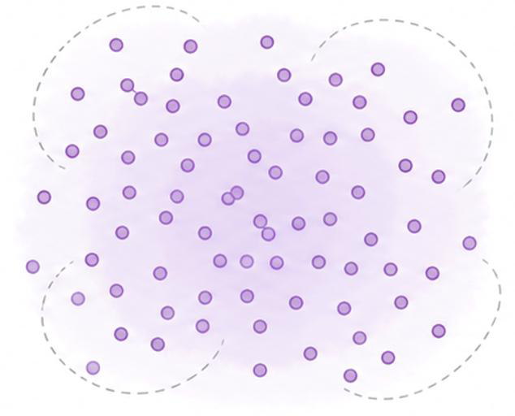
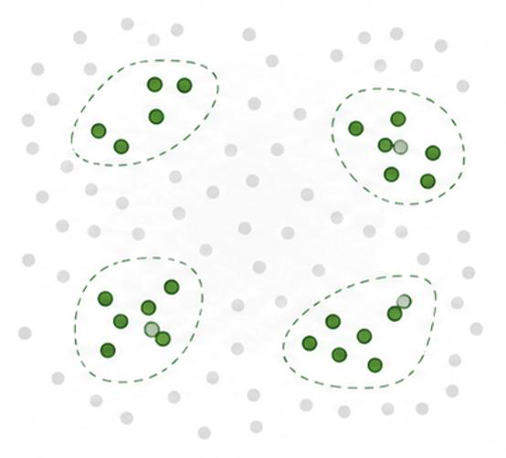
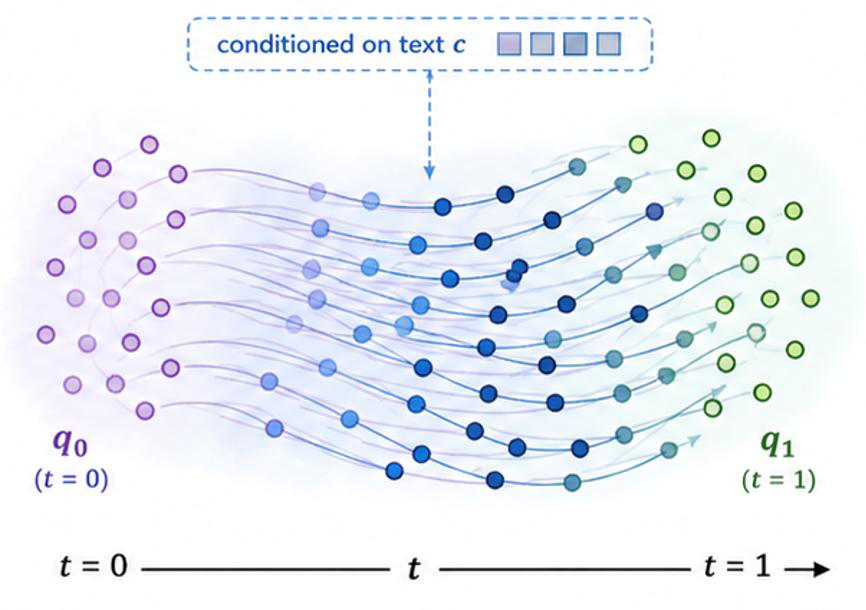
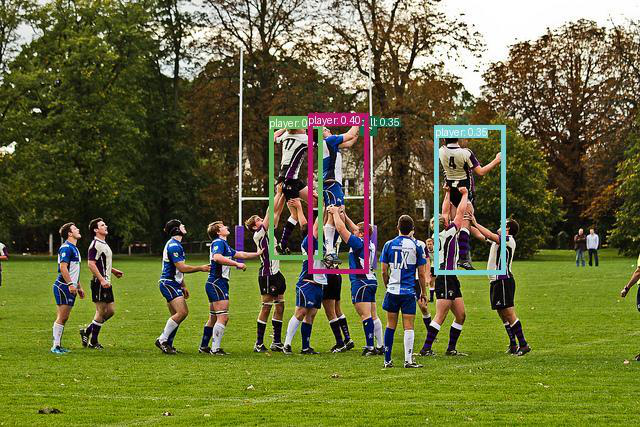

# FlowOVD: Learning Generative Latent Flows for Zero-shot Open-vocabulary Detection

## 摘要

**论文元信息。** 本文分析 arXiv:2606.00782，题为 *FlowOVD: Learning Generative Latent Flows for Zero-shot Open-vocabulary Detection*，作者为 Yao Wei、Andrea Cavallaro、Changjae Oh，论文发布时间为 2026-06-02，类别为 cs.CV。论文链接为 https://arxiv.org/abs/2606.00782，PDF 链接为 https://arxiv.org/pdf/2606.00782。论文首页给出项目页 https://qm-ipalab.github.io/FlowOVD/，但全文未给出可确认的 FlowOVD 官方 GitHub 仓库；附录仅说明其 GroundingDINO 复现实验基于 Open-GroundingDINO，并未提供 FlowOVD 源码位置。因此，代码状态应记为：**本文未提供可确认的公开代码**，不做源码段落分析，见 PAGE 1、PAGE 12。

**一句话总结。** FlowOVD 将开放词汇目标检测中的 decoder query 初始化，从静态或 Top-K 离散选择，改写为文本条件的连续潜变量流生成过程，使文本无关 query 逐步运输到文本引导 query，在 COCO 与长尾 LVIS 上分别达到 49.5 AP 与 31.5 AP，尤其提升 LVIS rare category 表现，见 PAGE 1、PAGE 7、PAGE 8。

本文的核心贡献可以概括为三点。第一，论文把开放词汇目标检测（Open-vocabulary Object Detection, OVD）中的 query 初始化视为 latent space 中的 “continuous transport process”，而不是一个固定 embedding 或启发式选择问题，见 PAGE 1、PAGE 2、PAGE 4。第二，论文提出基于 Rectified Flow 的 “text-conditioned query flow”，通过速度场学习从文本无关 query $q_0$ 到文本引导 query $q_1$ 的动态映射，见 PAGE 4、PAGE 5、PAGE 6。第三，在不引入额外训练数据的前提下，FlowOVD 在 COCO、LVIS、COCO-ReM 以及效率对比中表现出稳定增益，尤其在 LVIS 长尾类别上从 reproduced GroundingDINO 的 24.3 AP 提升到 31.5 AP，见 PAGE 7、PAGE 8。

## 背景与动机

开放词汇目标检测（OVD）的目标是在不局限于固定类别集合的条件下，检测并定位任意文本提示所描述的目标。传统 closed-set detector 只能在训练类别集合内进行预测；OVD 则依赖视觉语言模型（Vision-Language Model, VLM）把视觉区域与文本概念对齐，从而把检测能力迁移到未见类别，见 PAGE 1、PAGE 2、PAGE 3。

已有代表性方法包括 GLIP、GroundingDINO、YOLO-World、GroundingDINO 1.5 与 Dynamic-DINO 等。论文指出，这些方法已经通过 grounded pre-training、Transformer detector、cross-modal interaction、region-text alignment 等机制显著提升开放词汇检测能力，但它们仍主要把 OVD 视为判别式预测任务：给定图像和文本后，模型通过对比学习、分类损失和框回归损失完成 grounding 与 localization，见 PAGE 1、PAGE 3。

FlowOVD 关注的瓶颈不是检测头本身，而是 DETR-style 检测器中的 object query 构造方式。论文指出，现有 Transformer-based detector 通常使用静态 learnable query，或从 encoder features 中用 Top-K 选择 query。前者在不同图像推理时保持不变，后者依赖离散启发式选择。两者都可能限制 query distribution 的多样性与表达能力，尤其不利于开放词汇场景中大量细粒度、组合式和长尾语义概念的建模，见 PAGE 1、PAGE 3、PAGE 6。

这也是本文把 generative modeling 引入 OVD 的动机。生成模型擅长刻画底层分布并鼓励多样性；已有 DiffusionDet、FlowDet 等工作曾把生成建模用于检测，但这些方法主要在 bounding box space 中建模几何框分布，而 OVD 的核心困难是跨模态语义对齐，即语言条件应该主动指导视觉 query 的生成过程，见 PAGE 1、PAGE 3。

FlowOVD 的出发点是：若 object query 是连接 VLM encoder 与 Transformer decoder 的语义接口，那么 query 不应只是静态向量或离散选择结果，而应能在文本条件下连续演化。论文因此提出在 latent query space 中学习一个由文本条件控制的 rectified flow，把 text-agnostic query 运输为 text-guided query。Figure 1 以离散潜空间与连续潜空间的对比展示了这一思想：以前的方法在 discriminative OVD 中依赖 static query 或 query selection，本文则将 query initialization 转换为 generative OVD 的连续流过程，见 PAGE 2。

**用途：** 下图为 PAGE 2 中 Figure 1 的抽取图像分块，用于说明 FlowOVD 与既有 discriminative OVD 在 query 初始化思想上的差异。

**读图要点 / 支撑的判断：** 该图支撑论文的基本判断：FlowOVD 的变化发生在 latent query initialization，而不是重新定义检测输出空间。论文强调从 discrete latent space 转向 continuous latent space，是为了提升 query diversity 与 semantic alignment，见 PAGE 2。

**用途：** 下图继续展示 PAGE 2 中 Figure 1 的抽取分块，用于观察文本、图像、encoder-decoder 与 latent query 之间的关系。

**读图要点 / 支撑的判断：** 该图支撑本文对方法定位的判断：FlowOVD 仍保留 VLM-based detector 的整体结构，只改变 query 进入 decoder 之前的生成方式，而不是替代视觉 backbone、文本 backbone 或 decoder，见 PAGE 2、PAGE 4。

**用途：** 下图为 Figure 1 的另一抽取分块，用于说明论文将 missing detection 和 false detection 归因于传统 query 构造表达力不足。

**读图要点 / 支撑的判断：** 该图支撑 FlowOVD 的问题意识：静态或启发式 query selection 在开放词汇检测中可能导致漏检或误检，而连续 query flow 被设计为更灵活的语义对齐机制，见 PAGE 1、PAGE 2。

**用途：** 下图为 PAGE 2 Figure 1 的第四个抽取分块，用于补充说明论文把 query 初始化建模为文本条件 latent flow 的视觉对比。

**读图要点 / 支撑的判断：** 该图进一步支撑本文后续方法分析：FlowOVD 不是生成图像或生成检测框，而是在 latent query representation 上进行条件运输，最终仍由 Transformer decoder 输出 boxes 与 classes，见 PAGE 2、PAGE 4、PAGE 6。

## 预备知识

理解 FlowOVD 需要先区分三类 query。第一类是 text-agnostic query $q_0$，它不直接依赖文本条件，可以实现为 learnable embeddings。第二类是 text-guided target query $q_1$，它从 VLM encoder 的视觉特征 $f_I$ 与文本特征 $f_P$ 中通过语言引导的 query selection 得到。第三类是 FlowOVD 最终送入 decoder 的 refined content query，即通过连续速度场从 $q_0$ 运输得到的 $q_{\text{flow}}$ 或混合后的 $q_{\text{init}}$，见 PAGE 4、PAGE 6。

这里的符号需要明确。$I$ 表示输入图像，$P$ 表示文本提示；$f_I \in \mathbb{R}^{N_I \times d}$ 表示视觉特征，其中 $N_I$ 是视觉 token 数量，$d$ 是特征维度；$f_P \in \mathbb{R}^{N_P \times d}$ 表示文本特征，其中 $N_P$ 是文本 token 数量。$N$ 表示 object query 数量，论文实验中设置为 900；$q_0, q_1 \in \mathbb{R}^{N \times d}$ 分别表示源 query 集合与目标 query 集合，见 PAGE 4、PAGE 7、PAGE 12。

Rectified Flow 的关键思想是学习两个分布之间的连续运输路径。FlowOVD 没有把这种运输放在 box space，而是放在 content query latent space。论文特别强调 content query 编码语义信息，positional query 提供空间先验；本文只对 content query 做 flow-based refinement，而保持 positional query 不变，见 PAGE 6、PAGE 7、PAGE 14。

## 方法详解

### 1. 总体框架：在 VLM detector 中插入 Query Flow

FlowOVD 架构建立在 DETR-like vision-language detector 上。给定图像 $I$ 与文本提示 $P$，视觉 backbone 提取 visual features，文本 backbone 提取 textual embeddings，随后 shared vision-language encoder 融合跨模态特征。传统方法会直接把 static query 或 selected query 输入 Transformer decoder；FlowOVD 则在 encoder 与 decoder 之间插入 Query Flow 模块，见 PAGE 3、PAGE 4。

论文在 Figure 2(a) 中给出整体框架：image backbone 与 text backbone 分别产生 $f_I$ 和 $f_P$，VLM encoder 进行融合，Query Flow 在 latent space 中把 text-agnostic query $q_0$ 变成 text-conditioned query，最后 Transformer decoder 输出 bounding boxes 与 classes，见 PAGE 4。这个设计的关键在于：query refinement 发生在 decoder 之前，因此它可以在不重写 detector pipeline 的情况下提升 query 表达。

与 GroundingDINO 的差异可以概括为：GroundingDINO 依赖 encoder features 的 Top-K selection，把 query construction 变成一个离散筛选过程；FlowOVD 用选出的 $q_1$ 作为 flow 的目标端点，而不是直接把它输入 decoder。换言之，FlowOVD 并没有否定 selection，而是把 selection 转化为生成过程中的 target distribution，使 learnable query 能沿着连续路径向文本引导 query 迁移，见 PAGE 4、PAGE 5、PAGE 6。

### 2. 文本引导目标 query：从视觉-文本相似度构造 $q_1$

FlowOVD 首先根据视觉特征与文本特征计算相似度矩阵：

$$
S = f_I f_P^\top
$$

其中 $S \in \mathbb{R}^{N_I \times N_P}$，表示每个视觉 token 与每个文本 token 的对齐程度，见 PAGE 4，公式 (1)。人话解释：这个公式计算“图像区域特征”和“文本 token 特征”的两两相似度，用它来判断哪些视觉 token 更可能对应文本提示中的概念。

随后，论文对文本 token 维度做最大聚合，并选择得分最高的 $K$ 个 image tokens 构成 target query：

$$
q_1 = f_I[k], \quad k = \mathrm{TopK}\left(\max_j S_{:,j}\right)
$$

这里 $k$ 是被选中的视觉 token 索引，$K$ 在实验中设置为 $N=900$，见 PAGE 5、PAGE 7、PAGE 12，公式 (2)。人话解释：模型不是随机找目标 query，而是先问“哪些图像 token 与任一文本 token 最相似”，再把这些 token 作为文本引导的目标 query 集合。

这一步和 GroundingDINO 的 query selection 有联系，但 FlowOVD 的使用方式不同。传统 selection 会把 Top-K 结果直接作为 decoder query；FlowOVD 把它作为 $p_1$ 分布的样本，即 flow 的目标端，源端 $p_0$ 则来自 learnable text-agnostic queries，见 PAGE 4、PAGE 5。

### 3. Set-level matching：解决 query 集合无序问题

$q_0$ 与 $q_1$ 都是 query 集合，而集合本身没有固定顺序。如果直接对第 $i$ 个 $q_0$ 与第 $i$ 个 $q_1$ 做插值，可能产生任意且不稳定的对应关系。因此，论文先执行 set-level matching，例如基于 cosine similarity 的 greedy matching，为每个 source query 找到对应 target query，见 PAGE 5。

这一步的作用是给 latent transport 提供监督路径。如果没有 matching，flow matching objective 中的 $u=q_1-q_0$ 会受到 query 排列噪声干扰。论文没有给出匹配算法的完整伪代码，因此具体 matching 实现细节存在证据不足；但论文明确说明使用 set-level matching 建立一对一对应，见 PAGE 5。

### 4. 线性插值路径：从 $q_0$ 到 $q_1$ 构造中间状态

在匹配后的 query pair 上，FlowOVD 使用线性插值构造任意时刻 $t$ 的中间状态：

$$
q_t = (1-t)q_0 + t q_1
$$

其中 $t \in [0,1]$ 是时间步，见 PAGE 5，公式 (3)。人话解释：当 $t=0$ 时，query 仍是文本无关的 $q_0$；当 $t=1$ 时，query 到达文本引导的 $q_1$；中间的每个 $q_t$ 表示从源语义状态到目标语义状态的连续过渡。

这个设定体现了 FlowOVD 的生成式视角。传统 query selection 是一次性离散决策，而 FlowOVD 让 query 沿着 latent trajectory 演化。论文认为这种连续轨迹更有利于捕捉细粒度语义变化，尤其适合 open-vocabulary generalization，见 PAGE 2、PAGE 4、PAGE 5。

### 5. 速度场：用 ODE 建模 query 演化

FlowOVD 用时间相关速度场 $v_\theta(q_t,t,c)$ 描述 query 的演化，其中 $\theta$ 是 velocity network 参数，$c$ 是文本条件，论文中对应 textual feature $f_P$。其 ODE 形式为：

$$
\frac{d q_t}{dt} = v_\theta(q_t, t, c)
$$

见 PAGE 5，公式 (4)。人话解释：这个公式说明 query 在 latent space 中如何随时间移动；速度场决定每一步应该朝哪个语义方向调整，并且这个方向由文本条件参与控制。

Figure 3 展示了 velocity network 的结构。它是一个轻量 Transformer，输入包括 interpolated query $q_t$、timestep $t$ 和 textual feature $f_P$。文本条件通过 cross-attention 注入；时间步 $t$ 先经过 sinusoidal positional encoding，再经过 MLP 产生 FiLM 的 scale 和 shift 参数，见 PAGE 5。

### 6. FiLM 时间调制：让不同 flow layer 感知时间

论文使用 Feature-wise Linear Modulation（FiLM）把时间嵌入注入中间表示 $h$：

$$
h_{\delta+1} = (\gamma(t)+1) \cdot h_\delta + \beta(t), \quad \delta = 0,1,2,\ldots,L_{QF}-1
$$

其中 $h_\delta$ 是第 $\delta$ 个 flow layer 的中间表示，$L_{QF}$ 是 flow layer 数量，$\gamma(t)$ 与 $\beta(t)$ 分别是由 timestep 产生的缩放与平移参数，见 PAGE 5，公式 (5)。人话解释：FiLM 让网络知道当前处在从 $q_0$ 到 $q_1$ 的哪一个阶段，从而对早期、中期、后期 query refinement 使用不同调制。

每个 flow layer 包含 self-attention、text cross-attention、另一个 self-attention 和 FFN，并在各子层后使用 residual connection 与 layer normalization。这个结构对应两个需求：self-attention 捕捉 query 之间的关系，cross-attention 捕捉 query 与文本条件的对齐，见 PAGE 5。

### 7. Flow matching 目标：监督速度场逼近真实运输方向

训练时，论文把 ground-truth velocity 定义为：

$$
u = q_1 - q_0
$$

见 PAGE 5，公式 (6)。人话解释：如果从 $q_0$ 直线走向 $q_1$，那么最直接的目标方向就是二者差值。

Flow loss 使用预测速度与真实运输方向之间的均方误差：

$$
\mathcal{L}_{\mathrm{flow}} =
\mathbb{E}_{t,q_0,q_1}
\left[
\left\|v_\theta(q_t,t,c)-u\right\|_2^2
\right]
$$

见 PAGE 6，公式 (7)。人话解释：训练目标是让 velocity network 在任意中间状态 $q_t$ 上，都能预测出“应该往 $q_1$ 方向移动”的速度。

这个目标与 detection loss 联合优化。论文将检测损失写为：

$$
\mathcal{L}_{\mathrm{det}} =
\mathcal{L}_{\mathrm{bbox}} + \mathcal{L}_{\mathrm{class}}
=
\mathcal{L}_1 + \mathcal{L}_{\mathrm{GIOU}} + \mathcal{L}_{\mathrm{focal}}
$$

见 PAGE 6，公式 (8)。人话解释：检测损失仍然负责常规目标检测中的框回归与分类/grounding，FlowOVD 并没有替换检测监督。

总目标为：

$$
\mathcal{L} =
\mathcal{L}_{\mathrm{det}} + \lambda \mathcal{L}_{\mathrm{flow}}
$$

其中 $\lambda$ 是 flow objective 的平衡系数，实验设置为 0.05，见 PAGE 6、PAGE 7、PAGE 12，公式 (9)。人话解释：FlowOVD 同时要求模型会检测，也要求 query 生成过程沿着文本语义方向演化。

### 8. 推理：用 Euler 离散积分生成 refined query

推理阶段，FlowOVD 从初始 query $q_0$ 出发，积分学习到的速度场：

$$
q_{\mathrm{flow}} =
q_0 +
\int_0^1 v_\theta(q_t,t,c)\,dt
$$

见 PAGE 6，公式 (10)。人话解释：模型不再只用 $q_0$ 或 $q_1$，而是根据学习到的 velocity field，把 $q_0$ 连续运输到一个文本条件生成的 refined query。

实际计算中，论文用 Euler discretization 近似积分：

$$
q_{t+\epsilon} =
q_t + \epsilon \cdot v_\theta(q_t,t,c)
$$

其中 $\epsilon$ 是步长，实验设置为 0.25，见 PAGE 6、PAGE 7、PAGE 12，公式 (11)。人话解释：每一步用当前速度更新 query，重复若干步后得到最终 transported state。

为平衡稳定性与表达能力，论文没有直接丢弃原始 query，而是将 transported query 与 original query 混合：

$$
q_{\mathrm{init}} =
(1-\alpha)q_0 + \alpha q_{\mathrm{flow}}
$$

其中 $\alpha$ 控制 generative refinement 强度，实验设置为 0.2，见 PAGE 6、PAGE 7、PAGE 12，公式 (12)。人话解释：FlowOVD 让生成式 query 影响 decoder 初始化，但保留一部分 learnable query 的稳定先验。

### 9. 为什么只更新 content query，而不更新 positional query

DETR-style detector 的 query 包含 content query 与 positional query。Content query 主要编码语义信息，负责与图像和文本特征交互；positional query 则提供空间先验，例如 reference point，用于定位。FlowOVD 只对 content query 做 flow-based refinement，并保持 positional query 不变，见 PAGE 6、PAGE 7。

附录 B.1 给出重要证据：作者尝试把 flow formulation 扩展到 positional query，但观察到性能下降，例如仅训练一个 epoch 后出现超过 2 AP 的下降。作者推测 positional query 需要稳定、确定性的 spatial priors；若在 positional latent space 中做连续形变，可能削弱 anchor behavior，使 decoder optimization 不稳定，见 PAGE 14。

这个发现也解释了为什么 FlowOVD 与 box-space generative detector 不同。虽然直接在 box 或 positional space 中生成看起来更符合 localization 直觉，但 OVD 的核心是 visual-language semantic alignment。Content query 更承载语义多样性，因此更适合连续生成式建模，见 PAGE 14。

### 10. 与既有 query construction 的关系

Figure 4 对比了四类 query construction strategy：Static Query、Vanilla Selection、Mixed Selection 与 Query Flow。Static Query 使用 learnable query embeddings；Vanilla Selection 直接从 encoder features 中 Top-K；Mixed Selection 结合 learnable query 与 selected query；FlowOVD 则把 $q_0$ 和 $q_1$ 通过生成式 Query Flow 连续连接，见 PAGE 6、PAGE 7。

这一区分很重要。FlowOVD 并非简单地“多加一个模块”，而是改变了 query initialization 的建模范式：从离散构造变为文本条件的 latent dynamics。论文用 Figure 4 支撑这一点，并在 Table 3 中用 ablation 证明 Query Flow 明显优于 Vanilla Selection 与 Mixed Selection，见 PAGE 6、PAGE 8。

## 实验分析

### 实验设置概述

FlowOVD 在 Objects365（O365）上训练，该数据集包含超过 600K training images。评估采用 zero-shot OVD 设置，测试集包括 COCO val2017、COCO-ReM 与 LVIS mini-validation。COCO val2017 包含约 5,000 validation images 和 80 类；COCO-ReM 通过去除训练和评估之间重叠类别，更强调 novel category generalization；LVIS 包含 1,203 类与约 2,000,000 instances，是更困难的长尾开放词汇评估，见 PAGE 7、PAGE 12。

实现细节方面，视觉 backbone 使用 Swin-T，文本 backbone 使用 BERT；flow layers 数量 $L_{QF}=2$，Euler step size $\epsilon=0.25$，flow loss weight $\lambda=0.05$，generative refinement strength $\alpha=0.2$，query 数量 $N=900$。默认 decoder layers 为 6，训练使用 4 张 NVIDIA H100，batch size 为 16，optimizer 为 AdamW，base learning rate 为 $1\times10^{-4}$，backbone learning rate 为 $2\times10^{-5}$，见 PAGE 7、PAGE 12。

### 表 1：COCO zero-shot domain transfer

| Method | Backbone | Pre-training Data | Data Size | COCO AP | APs / APm / APl | Evidence |
|---|---:|---|---:|---:|---|---|
| GroundingDINO | Swin-T | O365 | 0.61M | 46.7 | - | PAGE 7 |
| GroundingDINO reproduced | Swin-T | O365 | 0.61M | 45.3 | 31.6 / 48.1 / 57.6 | PAGE 7 |
| FlowOVD | Swin-T | O365 | 0.61M | 45.5 | 32.0 / 48.4 / 58.0 | PAGE 7 |
| GroundingDINO | Swin-T | O365, GoldG, Cap4M | 5.38M | 48.3 | 34.0 / 51.6 / 62.9 | PAGE 7 |
| FlowOVD | Swin-T | O365, GoldG, Cap4M init; O365 optimization | 0.61M reported | 49.5 | 35.4 / 52.6 / 63.6 | PAGE 7、PAGE 12 |

**表格解读。** 在 O365-only 设置下，FlowOVD 相比 reproduced GroundingDINO 只提升 0.2 AP，但在小、中、大目标上均有增益，说明 query flow 至少没有破坏原有检测能力，见 PAGE 7。更关键的是在 large-scale vision-language pre-training initialization 下，FlowOVD 达到 49.5 AP，相比 GroundingDINO 的 48.3 AP 提升 1.2 AP，且 APs 从 34.0 提升到 35.4，APm 从 51.6 提升到 52.6，APl 从 62.9 提升到 63.6，见 PAGE 7。需要注意的是，附录说明大规模预训练设置下 FlowOVD 的 detector weights 来自 O365、GoldG、Cap4M checkpoint，而 Query Flow 从头训练并在 O365 上进一步端到端优化 3 epochs；因此不能简单理解为完全不使用大规模预训练先验，见 PAGE 12。

### 表 2：LVIS zero-shot domain transfer

| Method | Pre-training Data | Data Size | LVIS AP | APr / APc / APf | Evidence |
|---|---|---:|---:|---|---|
| GLIP | O365, GoldG | 1.38M | 24.9 | 17.7 / 19.5 / 31.0 | PAGE 7 |
| GroundingDINO | O365, GoldG | 1.38M | 25.6 | 14.4 / 19.6 / 32.2 | PAGE 7 |
| GLIP | O365, GoldG, Cap4M | 5.38M | 26.0 | 20.8 / 21.4 / 31.0 | PAGE 7 |
| GroundingDINO | O365, GoldG, Cap4M | 5.38M | 27.4 | 18.1 / 23.3 / 32.7 | PAGE 7 |
| GroundingDINO reproduced | O365, GoldG, Cap4M | 5.38M | 24.3 | 17.2 / 20.9 / 28.6 | PAGE 7 |
| FlowOVD | O365, GoldG, Cap4M init; O365 optimization | 0.61M reported | 31.5 | 22.4 / 27.0 / 37.1 | PAGE 7、PAGE 8、PAGE 12 |

**表格解读。** LVIS 是最能体现 FlowOVD 价值的实验，因为它有 1,203 个类别且长尾分布更强，见 PAGE 12。FlowOVD 在 LVIS minival 上达到 31.5 AP，相比 GroundingDINO reported 27.4 AP 提升 4.1 AP；相对于 reproduced baseline 24.3 AP，提升更大，见 PAGE 7、PAGE 8。尤其 rare category APr 从 reproduced baseline 的 17.2 提升到 22.4，说明连续 query generation 对低频类别更有帮助。这与论文的核心假设一致：开放词汇检测需要更灵活、多样的语义 query，而不是只依赖离散选择，见 PAGE 1、PAGE 8。

### 表 3：Query initialization 消融

| Query Initialization | COCO AP | APs | APm | APl | COCO-ReM AP | COCO-ReM APs / APm / APl | Evidence |
|---|---:|---:|---:|---:|---:|---|---|
| Vanilla Selection | 44.9 | 31.3 | 47.9 | 56.5 | 46.4 | 33.1 / 50.7 / 59.9 | PAGE 8 |
| Mixed Selection | 45.3 | 31.6 | 48.1 | 57.6 | 46.7 | 33.1 / 50.9 / 60.9 | PAGE 8 |
| Query Flow | 49.5 | 35.4 | 52.6 | 63.6 | 51.1 | 36.6 / 55.7 / 67.4 | PAGE 8 |

**表格解读。** 这是 FlowOVD 最关键的机制验证。Query Flow 相比 Mixed Selection 在 COCO AP 上从 45.3 提升到 49.5，提升 4.2 AP；在 COCO-ReM 上从 46.7 提升到 51.1，提升 4.4 AP，见 PAGE 8。由于 COCO-ReM 更强调 novel category generalization，该结果支持论文判断：query flow 的优势不只是常规检测精度，而是开放词汇泛化能力。该表也说明，简单混合 learnable query 与 Top-K selected query 不足以获得 FlowOVD 的效果，连续 latent transport 本身是主要增益来源，见 PAGE 8。

### 表 4：效率与 decoder depth

| Method | Flow | Decoder Layers | Params (M) | Training Time per Epoch (h) | COCO AP | FPS | Evidence |
|---|---:|---:|---:|---:|---:|---:|---|
| GroundingDINO | No | 6 | 172.3 | 9.58 | 48.3 | 2.23 | PAGE 8 |
| FlowOVD | Yes | 6 | 177.6 | 9.60 | 49.5 | 2.46 | PAGE 8 |
| FlowOVD | Yes | 4 | 174.0 | 9.22 | 49.3 | 2.48 | PAGE 8 |
| FlowOVD | Yes | 2 | 170.3 | 8.83 | 48.9 | 2.57 | PAGE 8 |

**表格解读。** FlowOVD 引入 Query Flow 后，6-layer 版本参数从 GroundingDINO 的 172.3M 增加到 177.6M，训练时间从 9.58h 增加到 9.60h，增量很小；同时 COCO AP 从 48.3 提升到 49.5，FPS 从 2.23 提升到 2.46，见 PAGE 8。更有意思的是，2-layer decoder 的 FlowOVD 仍达到 48.9 AP，高于 6-layer GroundingDINO 的 48.3 AP，参数更少且 FPS 更高。该结果支撑论文关于 “better efficiency with fewer decoder layers” 的判断，见 PAGE 2、PAGE 8。

### 定性实验与失败案例

Figure 5 给出 COCO 图像上的 qualitative comparison，提示包括 “cat tail”、“ball . adult . running child .” 与 “beer bottle . drinking glass . salad bowl .”。论文指出，GroundingDINO 对 “cat tail” 往往响应整个物体，而 FlowOVD 能更准确定位指定部位；在遮挡或组合式提示中，FlowOVD 能识别 “running child” 与 “adult”，并区分 running child 与右侧站立 child；在 cluttered multi-object scene 中，FlowOVD 的检测更完整，见 PAGE 9。

Figure 6 进一步展示稀有类别与组合描述优势。例如 FlowOVD 在 “wok”、“sandals”等 rare categories 上表现更好；在 “man holding surfboard”、“lifted player”等组合描述中更能进行 attribute-level discrimination；同时 GroundingDINO 出现 false or repeated detection，如把 laptop 与椅子上的 booklets 混淆，或因遮挡重复检测 nightstand，见 PAGE 13。

Figure 8 给出 failure cases。模型会被反光区域、复杂背景或视觉相似实例干扰；在 “historic San Francisco cable car” 这类细粒度描述下，模型难以从多个相似 cable car 中区分目标；在 “dog face” 组合提示下，模型可能在 cat 上 hallucinate 语义相关概念，见 PAGE 14、PAGE 15。这些失败案例非常重要，因为它们说明 FlowOVD 提升了 query semantic alignment，但并未解决所有语言理解与细粒度 grounding 问题。

## 讨论

FlowOVD 最适合的问题边界是：已有 VLM-based detector 具备较强基础检测与跨模态对齐能力，但 query construction 过于离散或静态，导致开放词汇、长尾类别和组合式文本提示下的 query 表达不足。论文并未从零训练一个检测器，而是在 GroundingDINO-like pipeline 中引入 Query Flow，因此其价值更像是对 DETR-style OVD 的 query initialization 机制升级，见 PAGE 4、PAGE 6、PAGE 7。

从业务应用角度，FlowOVD 对开放类目召回、长尾目标发现、文本驱动候选标注生成有直接意义。LVIS rare category 的 APr 增益尤其相关，因为真实业务类别往往具有长尾分布：常见类目数据充足，罕见类目和细粒度类目才是自动标注与开放检测的难点。FlowOVD 在 rare/common/frequent 三组上均提升，且 rare category 提升明显，见 PAGE 7、PAGE 8。

不过，论文没有评估中文词表、跨语言 prompts、真实业务 taxonomy、极小目标场景、移动端部署或低算力推理。因此，对于中文业务类目、长文本类别描述、行业专有名词、密集小物体检测等场景，只能说 FlowOVD 的技术方向具有迁移潜力，不能据此断言其已被验证。上述问题在论文全文中没有对应实验，证据不足。

方法论上，FlowOVD 的意义在于把生成模型从 pixel/box generation 转移到 latent semantic query generation。它没有把检测任务完全生成式化，而是在判别式 detector 的关键中间表示上引入连续生成动态。这个折中设计让方法能复用成熟 detector 的定位能力，同时用 flow matching 增强 query 的语义灵活性，见 PAGE 3、PAGE 4、PAGE 6。

## 局限分析

第一类局限来自作者自述的 failure cases。论文承认 FlowOVD 仍会受到 reflection、cluttered background 和 visually similar objects 的干扰；在细粒度开放词汇描述中，模型可能难以区分相似实例；在 compositional prompts 下，模型可能 hallucinate 语义相关但实际不存在的概念，例如 “dog face” 被错误定位到 cat 上，见 PAGE 14、PAGE 15。

第二类局限来自 positional query 实验。作者尝试把 flow-based generation 扩展到 positional queries，但观察到性能下降，例如训练一个 epoch 后超过 2 AP drop。该结果说明 FlowOVD 的生成式建模并不能无约束地应用到所有 query 组成部分；content query 适合语义流建模，但 positional query 更依赖稳定空间先验，见 PAGE 14。

第三类局限是本文独立判断：FlowOVD 的主要实验仍围绕 COCO、COCO-ReM 与 LVIS，缺少跨语言、跨领域、真实业务类别和小目标/密集目标的系统评估。虽然 Table 1、Table 2、Table 3 已证明主流 benchmark 上的增益，但无法推出它在中文开放词表、工业缺陷、遥感目标、医疗图像或零售 SKU 级长尾识别中的可靠性，证据不足，见 PAGE 7、PAGE 8、PAGE 12。

第四类局限是代码与复现透明度。论文给出充分公式、超参数和训练设置，但全文未提供可确认的 FlowOVD 官方代码仓库；附录仅说明 GroundingDINO baseline 基于 Open-GroundingDINO 复现，并做了 positive maps 与 training curriculum 修改，见 PAGE 12。因此，外部研究者若要复现 FlowOVD，需要自行实现 query matching、velocity network、flow loss、Euler inference 与 content-query-only refinement 等细节。由于没有源码，本文不提供代码段分析。

## 结论

FlowOVD 的核心贡献不是提出一个全新的 detector backbone，而是重新定义开放词汇检测中 decoder query 的初始化方式。它把 query 从静态或离散选择的对象，转变为文本条件下连续生成的 latent representation：先用视觉-文本相似度构造目标 query $q_1$，再用 rectified flow 学习从 $q_0$ 到 $q_1$ 的运输动态，最后将生成式 refinement 后的 content query 输入 Transformer decoder，见 PAGE 4、PAGE 5、PAGE 6。

实验结果支持这一设计。FlowOVD 在 COCO 上达到 49.5 AP，在 LVIS 上达到 31.5 AP；相较 GroundingDINO，在 COCO 上提升 1.2 AP，在 LVIS 上提升 4.1 AP，且 rare category APr 提升明显，见 PAGE 1、PAGE 7、PAGE 8。消融实验进一步说明 Query Flow 明显优于 Vanilla Selection 与 Mixed Selection；效率实验则表明较浅 decoder 仍能保持竞争力，见 PAGE 8。

从研究趋势看，FlowOVD 提供了一个值得关注的方向：在开放世界视觉语言感知中，生成式建模未必必须发生在像素、mask 或 box 空间，也可以发生在 detector 内部的 semantic latent query space。该方向的下一步关键问题包括：如何提升组合式语言理解，如何处理相似实例区分，如何稳定扩展到 positional 或结构化空间先验，以及如何在真实业务词表和跨语言开放类别中验证泛化能力，见 PAGE 14、PAGE 15。

## 证据索引

| 证据点 | PAGE |
|---|---|
| 论文标题、作者、项目页、摘要、核心结果 49.5 COCO AP 与 31.5 LVIS AP | PAGE 1 |
| Figure 1：discriminative OVD 与 generative OVD、discrete latent space 与 continuous latent space 对比 | PAGE 2 |
| OVD 相关工作、GroundingDINO、YOLO-World、Dynamic-DINO、query representation 被简化的问题 | PAGE 3 |
| Figure 2：FlowOVD overall framework；$q_0$、$q_1$、Query Flow、VLM encoder 与 decoder 的关系；公式 (1) | PAGE 4 |
| Figure 3：velocity network；公式 (2)-(6)；matching、interpolation、ODE、FiLM | PAGE 5 |
| Figure 4：query construction strategies；公式 (7)-(12)；training objective 与 inference | PAGE 6 |
| Table 1、Table 2：COCO 与 LVIS zero-shot transfer 主要结果；实验设置开始 | PAGE 7 |
| Table 3、Table 4：query initialization 消融与效率对比；主要实验解读 | PAGE 8 |
| Figure 5：COCO qualitative comparison，细粒度定位、遮挡、组合提示和 cluttered scene | PAGE 9 |
| 附录 A.1：COCO、COCO-ReM、LVIS 数据集细节 | PAGE 12 |
| 附录 A.2 与 Table 5：GroundingDINO 复现、训练细节、超参数、Open-GroundingDINO 说明 | PAGE 12 |
| Figure 6：additional qualitative comparisons，rare categories、false/repeated detection、attribute-level discrimination | PAGE 13 |
| 附录 B.1：positional query 不适合 flow refinement，超过 2 AP drop；content query 更适合语义流建模 | PAGE 14 |
| Figure 8 与 Future Work：reflection、clutter、相似实例、compositional prompt hallucination、未来方向 | PAGE 14、PAGE 15 |
