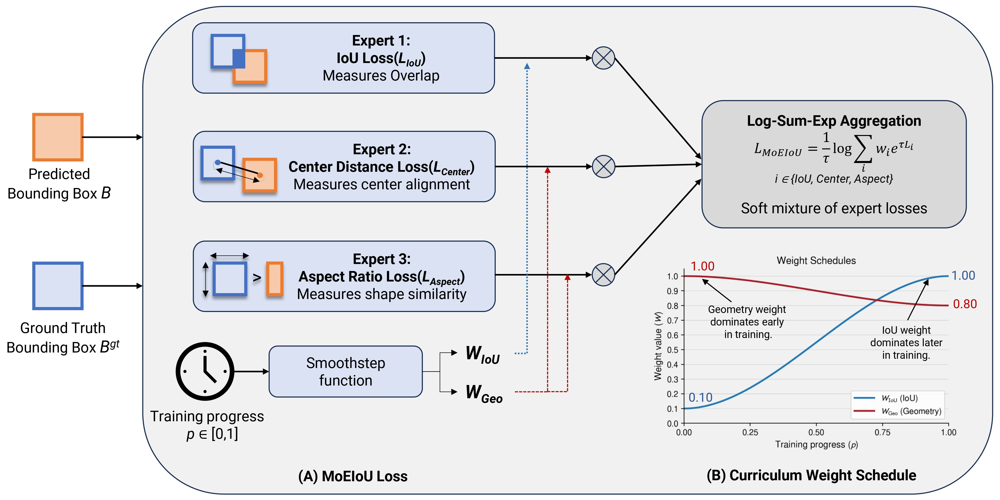
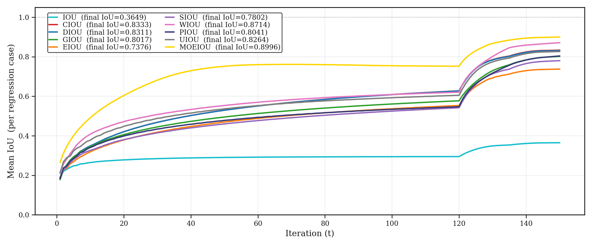
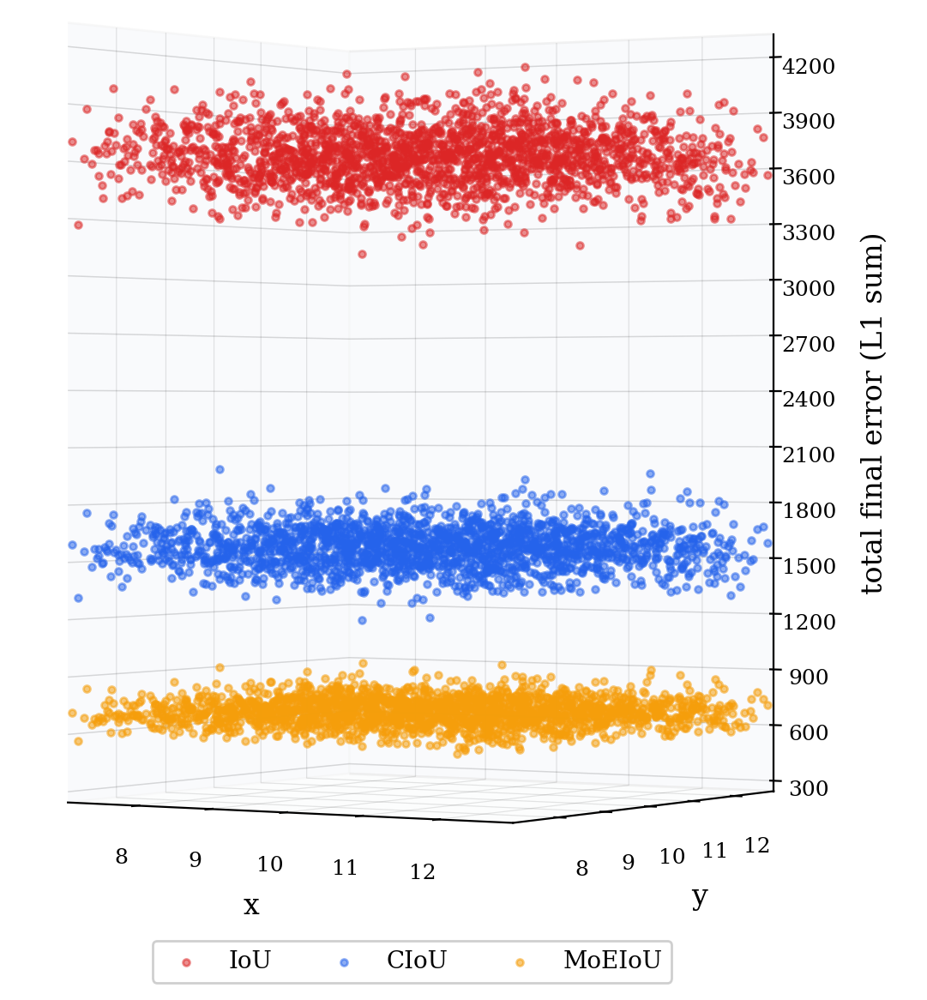
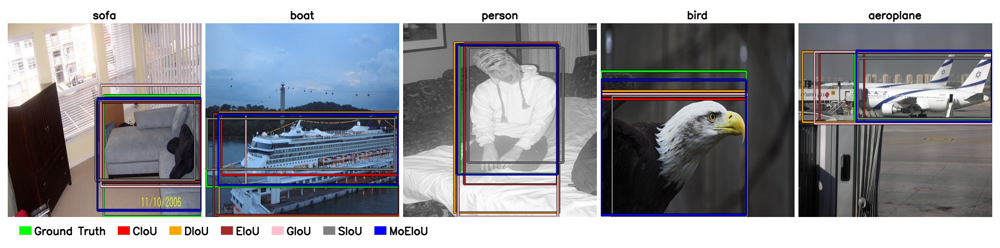

# MoEIoU: Rethinking Bounding-Box Regression as a Mixture of Experts

## 摘要

### 论文元信息

| 项目 | 内容 |
|---|---|
| 标题 | MoEIoU: Rethinking Bounding-Box Regression as a Mixture of Experts |
| 作者 | Vinay Edula, Priyanka Bagade，Indian Institute of Technology Kanpur（见 PAGE 1） |
| arXiv ID | 2606.00844，PDF 页眉标注为 arXiv:2606.00844v1 [cs.CV]（见 PAGE 1） |
| 论文链接 | https://arxiv.org/abs/2606.00844 |
| PDF 链接 | https://arxiv.org/pdf/2606.00844 |
| 代码状态 | 本文未提供可确认的公开代码。论文只说明实验使用 Ultralytics 实现，并在参考文献列出 Ultralytics YOLO/YOLO26 仓库，未给出 MoEIoU 官方实现仓库（见 PAGE 9、PAGE 15） |
| 推荐方向 | 目标检测中的边界框回归损失（bounding-box regression loss）改进 |
| 风险提示 | 论文结果需要在内部数据与目标检测框架中复核，尤其是超参数 $\tau$、训练日程和 YOLO 版本迁移稳定性（见 PAGE 9-14） |

一句话总结：MoEIoU 将边界框回归重新表述为一个由重叠、中心对齐、长宽比匹配三个“专家”组成的混合专家损失，用加权 Log-Sum-Exp 自适应强调当前最主要的定位误差，并用课程权重将训练重点从早期几何校正逐步转向后期 IoU 精修（见 PAGE 1-7）。

本文的核心价值不在于提出新的检测器结构，而在于改写检测训练中常见的框回归损失项。论文声称在 PASCAL VOC、HRIPCB 和 MS COCO 子集上，仅替换 bounding-box regression loss、保持检测器结构和训练配置固定，即可在 YOLOv12 与 YOLO26 上获得更好的 mAP，且在仿真实验中表现出更快收敛和更低最终回归误差（见 PAGE 8-14）。因此，若业务已有 YOLO 类训练管线，MoEIoU 的接入成本理论上较低，但复现前必须注意论文的 COCO 实验使用的是约 25K 图像的 curated 20% train2017 子集，而不是完整 COCO 训练集（见 PAGE 10）。

## 背景与动机

目标检测的边界框回归任务，本质上是在学习预测框 $b$ 与真实框 $b^{gt}$ 之间的几何对齐关系。早期检测器将框预测视为坐标级回归问题，直接对 $(x,y,w,h)$ 等参数使用 sum-squared 或 Smooth-$\ell_1$ 损失；这类方法优化的是独立坐标误差，而检测评估关心的是预测框与真实框的整体重叠程度，因此优化目标与评价指标之间存在不一致（见 PAGE 1）。

IoU-based loss 的出现，是为了让训练目标直接对齐检测评估指标。UnitBox 使用 $-\log(\operatorname{IoU})$ 作为尺度不变监督，使边界框作为一个整体几何对象被优化，而不是拆成彼此独立的坐标项（见 PAGE 1）。但基础 IoU 损失存在一个关键缺陷：当预测框与真实框不重叠时，IoU 梯度会失效，早期训练中框可能无法获得有效移动方向（见 PAGE 2）。

后续 GIoU、DIoU、CIoU、EIoU、SIoU 等方法分别引入最小外接框、中心距离、长宽比、边长差异和角度代价等几何惩罚项，以弥补单纯 IoU 对非重叠或低重叠预测监督不足的问题（见 PAGE 2）。这些方法的共同逻辑是：在重叠之外增加几何线索，让模型即使在预测很差时也能知道应该如何移动、缩放或改变形状。

论文指出，现有方法的主要局限不只是“用了哪些几何项”，而是这些几何项通常以固定加和形式参与训练。固定加和意味着中心距离、形状误差、重叠误差在训练全过程中按预设方式发挥作用，而实际优化动态并非如此：早期预测框通常存在较大中心偏移和形状错误，后期预测框更需要提升与真实框的精确重叠（见 PAGE 1-3）。

因此，MoEIoU 的出发点是将不同定位误差视作不同专家：overlap expert 关注 IoU 重叠，center expert 关注中心对齐，aspect expert 关注长宽比一致性。与固定加法不同，MoEIoU 用加权 Log-Sum-Exp 聚合这些项，使当前更大的误差项获得更强梯度，同时保留其他项的平滑贡献（见 PAGE 3、PAGE 6-7）。

## 预备知识

给定预测框 $b=(x_1,y_1,x_2,y_2)$ 与真实框 $b^{gt}=(x^{gt}_1,y^{gt}_1,x^{gt}_2,y^{gt}_2)$，论文采用左上角和右下角坐标表示边界框。$b$ 表示模型预测框，$b^{gt}$ 表示标注真实框，二者的交集和并集用于定义 IoU（Intersection over Union，交并比）（见 PAGE 3）。

MoEIoU 使用三个核心回归分量。第一是 overlap term，即基于 IoU 的重叠误差；第二是 center-distance term，即预测框中心与真实框中心之间的归一化距离；第三是 aspect-ratio term，即预测框与真实框长宽比的角度差异。这三个分量分别对应“是否重叠得好”“位置是否对齐”“形状是否一致”（见 PAGE 3-5）。

论文中的 mixture-of-experts（混合专家，MoE）并不是 Transformer MoE 中的稀疏路由层，而是一个损失函数层面的类比。每个误差项被视为一个专家，Log-Sum-Exp 聚合函数相当于软选择机制：当某个误差更大时，它获得更高优化权重；但其他误差不会被完全屏蔽（见 PAGE 6-7）。

## 方法详解

### 1. Overlap Expert：用 Log-IoU 强化低重叠惩罚

IoU 定义为预测框与真实框交集面积除以并集面积：

$$
\operatorname{IoU}(b,b^{gt})=\frac{|b\cap b^{gt}|}{|b\cup b^{gt}|}
$$

这个公式说明，IoU 衡量的是两个框的整体重叠质量，而不是单个坐标是否接近；论文将其作为 localization evaluation 和 regression 的基础量（见 PAGE 3，Eq. 1）。

论文没有直接使用线性惩罚 $1-\operatorname{IoU}$，而是定义 Log-IoU 项：

$$
T_{iou}=-\log(\operatorname{IoU}+\varepsilon)
$$

其中 $T_{iou}$ 表示重叠误差项，$\varepsilon>0$ 用于避免 IoU 接近 0 时出现未定义值。直观解释是：当 IoU 很低时，负对数会给出比线性损失更强的惩罚；当 IoU 较高时，它仍保持与 IoU 排序一致（见 PAGE 3-4，Eq. 2）。

**用途：** Figure 2 用于解释 IoU 计算方式以及 $1-\operatorname{IoU}$ 与 $-\log(\operatorname{IoU})$ 的惩罚曲线差异（见 PAGE 4）。

**读图要点：** 图中左侧展示交集面积与并集面积，右侧展示低 IoU 区间中 Log-IoU 损失明显高于线性 IoU 损失（见 PAGE 4）。

**支撑的判断：** MoEIoU 选择 Log-IoU 并非只是形式变化，而是为了加强低重叠预测的优化信号，尤其对应早期训练或困难样本（见 PAGE 3-4）。

### 2. Center Expert：用归一化中心距离处理无重叠场景

IoU 的问题在于非重叠框可能没有有效梯度，而中心距离项仍能提供方向信息。令预测框中心为 $(c_x,c_y)$，真实框中心为 $(c_x^{gt},c_y^{gt})$，二者平方欧氏距离为：

$$
\rho^2=(c_x-c_x^{gt})^2+(c_y-c_y^{gt})^2
$$

其中 $\rho$ 表示中心点距离。这个公式衡量预测框相对真实框在空间位置上的偏移，而不依赖二者是否已经发生重叠（见 PAGE 4，Eq. 3）。

论文进一步用最小外接框的对角线长度平方 $c^2=w_c^2+h_c^2$ 进行归一化，并定义中心距离项：

$$
T_{center}=\sqrt{\frac{\rho^2}{c^2+\varepsilon}}
$$

其中 $T_{center}$ 是归一化中心距离误差，$w_c$ 和 $h_c$ 是覆盖预测框与真实框的最小外接框宽高。该项的作用是使中心距离惩罚具备尺度感知能力：大目标和小目标上的同样像素偏移不会被机械等价处理（见 PAGE 4，Eq. 4）。

**用途：** Figure 3(a) 展示中心距离 $\rho$、外接框宽高 $w_c,h_c$ 以及归一化项 $T_{center}$ 的几何关系（见 PAGE 5）。

**读图要点：** 预测框中心与真实框中心之间的距离被放在最小外接框尺度下解释，而不是直接使用绝对像素距离（见 PAGE 5）。

**支撑的判断：** 中心项是 MoEIoU 在早期训练中保持优化方向的重要组成部分，因为即使两个框没有重叠，中心距离仍然可计算并可提供移动方向（见 PAGE 4-5）。

### 3. Aspect Expert：用角度化长宽比刻画形状误差

MoEIoU 的第三个专家来自 CIoU 风格的长宽比项。设预测框宽高为 $w,h$，真实框宽高为 $w^{gt},h^{gt}$，论文定义：

$$
T_{aspect}=\frac{4}{\pi^2}\left(\arctan\left(\frac{w^{gt}}{h^{gt}}\right)-\arctan\left(\frac{w}{h}\right)\right)^2
$$

其中 $T_{aspect}$ 表示长宽比不一致造成的形状误差。用 $\arctan(w/h)$ 表示框形状，可以让该项关注比例差异，而不是直接混入绝对尺寸或位置误差（见 PAGE 4，Eq. 5）。

**用途：** Figure 3(b) 用角度 $\alpha=\arctan(w/h)$ 和 $\alpha^{gt}=\arctan(w^{gt}/h^{gt})$ 表示预测框与真实框的形状差异（见 PAGE 5）。

**读图要点：** 长宽比被转化成角度差 $\Delta\alpha$，因此该项监督的是框形状方向，而不是框是否已经与目标重叠（见 PAGE 5）。

**支撑的判断：** Aspect expert 对小目标、细长目标或形状偏差大的预测有意义；它补充了 IoU 和中心距离无法单独表达的形状一致性（见 PAGE 4-5）。

### 4. Curriculum Scheduling：训练早期重几何，后期重重叠

论文认为，不同训练阶段需要不同监督重点。早期预测框粗糙，可能中心偏移大、形状不准、甚至无重叠，此时几何项更可靠；后期预测框接近真实框，IoU 重叠监督更适合精修定位（见 PAGE 4-5）。

为表达训练进度，论文定义 $p\in[0,1]$，其中 $p=0$ 表示训练开始，$p=1$ 表示训练结束。然后使用 smoothstep 函数：

$$
s=p^2(3-2p)
$$

其中 $s$ 是平滑后的课程进度。该函数单调、有界且可微，在端点附近变化缓慢，中间阶段变化更明显，避免训练目标突然切换（见 PAGE 5，Eq. 6）。

IoU 项权重随训练进度逐步增大：

$$
w_{iou}=0.10+0.90s
$$

这个公式表示 IoU expert 在早期仍保留 0.10 的基础贡献，后期逐渐上升到 1.00，从而让模型从一开始就获得少量重叠监督，但训练后期显著强调重叠精修（见 PAGE 5，Eq. 7）。

几何项权重则轻微下降：

$$
w_{geo}=1.00-0.20s
$$

这里 $w_{geo}$ 同时用于中心距离项和长宽比项。它从 1.00 缓慢下降到 0.80，说明几何监督不会在后期消失，而是从主导地位转为辅助稳定定位（见 PAGE 5，Eq. 8）。

### 5. Weighted LSE Aggregation：从固定加和转向软最大

MoEIoU 将三个误差项组成向量：

$$
T=[T_{iou},T_{center},T_{aspect}]
$$

其中 $T$ 是 localization error components 的集合，分别代表重叠、中心和形状三个维度的误差（见 PAGE 6，Eq. 9）。

最终损失不是简单加权求和，而是使用加权 Log-Sum-Exp：

$$
L_{MoEIoU}=\frac{1}{\tau}\log\left(\sum_i w_i\exp(\tau T_i)\right)
$$

其中 $L_{MoEIoU}$ 是最终回归损失，$T_i$ 是第 $i$ 个误差分量，$w_i$ 是对应权重，$\tau>0$ 是温度参数。直观解释是：当 $\tau$ 较小时，各项更像平均贡献；当 $\tau$ 较大时，较大的误差项会被更强强调，整体接近 hard maximum，但仍保持可微（见 PAGE 6，Eq. 10）。

代入课程权重后，MoEIoU 展开为：

$$
L_{MoEIoU}=\frac{1}{\tau}\log\left(w_{iou}e^{\tau T_{iou}}+w_{geo}e^{\tau T_{center}}+w_{geo}e^{\tau T_{aspect}}\right)
$$

这个公式体现了论文所谓 mixture-of-experts 的核心：三个 expert 不再以固定比例线性相加，而是由当前误差大小和训练阶段权重共同决定贡献（见 PAGE 6，Eq. 11）。

**用途：** Figure 1 是 MoEIoU 总体结构图，用于展示 Log-IoU、center distance 和 aspect ratio 三个分量如何进入 LSE 聚合并形成最终 loss（见 PAGE 2-3）。

**读图要点：** 该图的重点是三类定位误差并列进入聚合模块，而不是串行依赖或检测器结构改造（见 PAGE 2-3）。

**支撑的判断：** MoEIoU 的主要创新位于损失函数聚合方式，而不是 backbone、neck 或 detection head 的结构变化；因此论文将其描述为可接入 YOLO 类检测训练的 regression loss（见 PAGE 3、PAGE 14）。

图 1 支撑了本文对 MoEIoU 的三专家解释：overlap、center alignment、aspect-ratio mismatch 分别提供不同定位信号，LSE 聚合用于强调当前主导误差，而 curriculum schedule 用于控制训练阶段权重（见 PAGE 2-3）。

### 6. 梯度行为：LSE 的核心优势在于动态分配梯度

论文进一步分析 LSE 与传统 weighted sum 的梯度差异。对 Eq. 10 中的 $T_i$ 求导得到：

$$
\frac{\partial L_{MoEIoU}}{\partial T_i}=
\frac{w_i e^{\tau T_i}}{\sum_j w_j e^{\tau T_j}}
$$

该导数具有 softmax-like 形式。也就是说，当前误差更大的项会获得更大梯度份额，而误差较小的项仍有非零贡献；这正是 MoEIoU 能对不同预测样本自适应响应的数学依据（见 PAGE 7，Eq. 12）。

作为对比，传统加权和形式为：

$$
L_{sum}=\sum_i w_iT_i,\quad \frac{\partial L_{sum}}{\partial T_i}=w_i
$$

这个公式说明，固定加和损失中每个分量的梯度份额只由预设权重决定，而与该样本当前到底是哪类误差最大无关（见 PAGE 7，Eq. 13）。

**用途：** Figure 4 展示 hard maximum 与不同 $\tau$ 下 LSE 曲面的差异；Figure 5 展示 $\tau$ 对两个分量之间梯度份额分配的影响（见 PAGE 6-7）。

**读图要点：** Hard maximum 在分量相等处不可微；LSE 保持平滑。$\tau$ 越大，LSE 越接近 hard maximum，梯度越集中到较大误差项（见 PAGE 6-7）。

**支撑的判断：** MoEIoU 的优势并非单纯“多加了几个项”，而是把回归损失从固定线性组合改成了动态梯度分配机制（见 PAGE 7）。

## 实验分析

### 1. 仿真实验：隔离损失函数本身的优化行为

论文首先设计 controlled simulation experiment，用 1000 万组合成框对直接比较不同回归损失如何引导预测框向真实框移动。每个样本由真实框和初始预测框组成，框以 center-size 形式 $(c_x,c_y,w,h)$ 表示；样本覆盖 far non-overlap、near non-overlap、low/medium/high-overlap、center-shape mismatch、shifted boxes、nested boxes 等八类定位错误，并刻意将约 40% 分布为 far non-overlap 困难样本（见 PAGE 8）。

仿真更新规则采用 DIoU/CIoU 的 box optimization 算法：

$$
B_n^{(t)}=B_n^{(t-1)}-\eta_t\left(2-\operatorname{IoU}(B_n^{(t-1)},G_n)\right)\nabla_{B_n^{(t-1)}}L(B_n^{(t-1)},G_n)
$$

其中 $B_n^{(t)}$ 表示第 $n$ 个预测框第 $t$ 次迭代后的状态，$G_n$ 是真实框，$\eta_t$ 是学习率，$L$ 是被测试的回归损失。$(2-\operatorname{IoU})$ 会放大低重叠样本的更新幅度，并在预测框接近目标时减小步长（见 PAGE 8，Eq. 14）。

论文报告，150 次优化迭代后，MoEIoU 的 final mean IoU 为 0.8996，WIoU 为 0.8714；同时 MoEIoU 曲线在整个优化过程中均高于其他损失，表示其不仅最终精度更高，而且收敛过程也更快（见 PAGE 9）。

**用途：** Figure 6(a) 用于比较各类 bounding-box regression losses 在 150 次仿真迭代中的 mean IoU 曲线（见 PAGE 9）。

**读图要点：** 论文文字说明 MoEIoU 的曲线全程高于其他方法，最终 mean IoU 达到 0.8996，下一名 WIoU 为 0.8714（见 PAGE 9）。

**支撑的判断：** 该实验支撑 MoEIoU 的优化信号更强，但它是直接优化框参数的仿真实验，不能完全等价于完整检测器训练中的端到端性能（见 PAGE 8-9）。

Figure 6(a) 的主要证据是 MoEIoU 在合成定位错误分布上的优化轨迹优势。由于仿真刻意包含大量 non-overlap 和低质量框，该结果尤其支持论文关于“早期几何项 + 后期重叠项”组合策略的动机（见 PAGE 8-9）。

**用途：** Figure 6(b) 展示 IoU、CIoU、MoEIoU 在最终回归误差上的 3D scatter 对比（见 PAGE 9）。

**读图要点：** 论文描述基础 IoU 产生最大误差和最宽空间分布，CIoU 明显降低误差，而 MoEIoU 进一步产生最低且更集中的最终误差（见 PAGE 9）。

**支撑的判断：** MoEIoU 不仅提高平均 IoU，也改善最终框参数误差的稳定性；这与 LSE 动态强调主导误差的设计目标一致（见 PAGE 9）。

### 2. 主实验设置：只替换边界框回归损失

论文的真实检测实验使用 Ultralytics 实现。为公平比较，实验只改变 bounding-box regression loss，保持 detector architecture、data processing 和 training configuration 固定；默认训练分辨率为 $640\times640$，batch size 为 16，优化器为 SGD，learning rate 0.01，momentum 0.9，weight decay $5\times10^{-4}$，随机种子固定为 42，并使用 NVIDIA RTX A6000 GPU（见 PAGE 9）。

MoEIoU 的温度参数 $\tau$ 通过短轮试训练选择，候选包括 $\{1,4,8,10,12\}$，然后必要时检查邻近值。论文称在 benchmark datasets 和 simulation experiments 上未观察到 $\tau>12$ 的额外收益（见 PAGE 9-10）。这说明 $\tau$ 是一个需要调参的关键超参数，而非论文给出单一全局最优设置。

数据集包括 PASCAL VOC、HRIPCB 和 MS COCO 子集。PASCAL VOC 使用 VOC2007+VOC2012 train/val 训练并在 VOC2007 test 上评估；HRIPCB 包含 1,386 张 PCB 缺陷图像和六类缺陷；COCO 使用 prior work 提出的 curated 20% train2017 子集，约 25K 张图像，用于保留类别分布、尺度统计和难度属性（见 PAGE 10）。

### 3. PASCAL VOC、HRIPCB、MS COCO 主结果

| 数据集 | 检测器 | 最佳 MoEIoU 指标 | 对比基线中的强结果 | 论文报告的主要结论 |
|---|---:|---:|---:|---|
| PASCAL VOC | YOLOv12 | mAP50 76.2，mAP75 61.0，mAP50:95 55.0 | DIoU/SIoU mAP50 75.4，GIoU mAP75 60.1 | MoEIoU 在 YOLOv12 三项指标均为最高（见 PAGE 10） |
| PASCAL VOC | YOLO26 | mAP50 74.1，mAP75 57.9，mAP50:95 52.4 | SIoU mAP50 73.4，WIoU mAP75 57.8 | MoEIoU 在 YOLO26 三项指标均为最高（见 PAGE 10） |
| HRIPCB | YOLOv12 | mAP50 98.6，mAP75 66.9，mAP50:95 59.4 | UIoU/CIoU mAP50 98.1，SIoU mAP75 63.2 | MoEIoU 对严格定位指标 mAP75 提升明显（见 PAGE 11） |
| HRIPCB | YOLO26 | mAP50 98.6，mAP75 67.2，mAP50:95 59.7 | WIoU/UIoU mAP75 65.9/65.5 | MoEIoU 三项指标最高（见 PAGE 11） |
| MS COCO subset | YOLOv12 | mAP50 48.6，mAP75 35.7，mAP50:95 33.1 | WIoU mAP50 47.7，mAP50:95 32.9 | MoEIoU 在 YOLOv12 上三项指标最高（见 PAGE 11） |
| MS COCO subset | YOLO26 | mAP50 46.6，mAP75 34.9，mAP50:95 32.3 | CIoU/GIoU mAP50:95 32.2/32.1 | MoEIoU 在 YOLO26 上三项指标最高，但增益较小（见 PAGE 11） |

表格解读：主结果表明，MoEIoU 在三个数据集和两个 YOLO 架构上都取得最高或最优一档的 mAP50:95。值得区分的是，HRIPCB 的 mAP50 已接近饱和，MoEIoU 更有信息量的提升出现在 mAP75；这说明它对更严格定位阈值可能更有效。COCO 子集上的 YOLO26 增益较小，提示在更复杂场景或不同检测器版本上，MoEIoU 的收益并不必然同幅度放大（见 PAGE 10-11）。

**用途：** Figure 7 展示 YOLOv12 在 PASCAL VOC test set 上使用不同 IoU-based loss 得到的框预测可视化（见 PAGE 11）。

**读图要点：** 论文文字说明 MoEIoU 产生更紧、更准确的 bounding boxes；图像本身用于提供定性证据，而不是替代 mAP 定量比较（见 PAGE 10-11）。

**支撑的判断：** Figure 7 支撑 MoEIoU 改善 localization quality 的定性论断，但其说服力应与 Tables 1-3 的定量结果结合看待（见 PAGE 10-11）。

### 4. LSE 聚合本身是否有效

论文进一步将 CIoU、DIoU、GIoU、EIoU、SIoU 的固定加法形式替换为 LSE 聚合，同时保留各自原始几何项。WIoU 被排除，因为它主要使用单一几何项；PIoU 和 UIoU 被排除，因为它们已有自身 weighting mechanisms，LSE 会变得冗余（见 PAGE 11）。

| Baseline | 原始 mAP50:95 | LSE 版本 mAP50:95 | 相对提升 | 说明 |
|---|---:|---:|---:|---|
| CIoU | 22.32 | 22.72 | +1.79% | LSE-CIoU 使用 $LSE(T_{iou},T_{center},T_{aspect})$（见 PAGE 12） |
| DIoU | 22.18 | 23.41 | +5.57% | LSE-DIoU 使用 $LSE(T_{iou},T_{center})$（见 PAGE 12） |
| GIoU | 21.95 | 23.40 | +6.62% | LSE-GIoU 使用 $LSE(T_{iou},T_{enclosure})$（见 PAGE 12） |
| EIoU | 22.55 | 23.12 | +2.52% | LSE-EIoU 使用 $LSE(T_{iou},T_{center},T_{shape})$（见 PAGE 12） |
| SIoU | 22.75 | 23.46 | +3.09% | LSE-SIoU 使用 $LSE(T_{iou},T_{dist},T_{shape})$（见 PAGE 12） |

表格解读：这组实验比主结果更直接地支持论文核心主张：LSE 不是只对 MoEIoU 特定公式有效，而是能改善多种多项几何损失的聚合方式。尤其 GIoU 和 DIoU 的相对提升较大，说明当固定加法难以处理不同误差项主导关系时，软最大式聚合可能提供更好的训练信号（见 PAGE 11-12）。

### 5. 组件消融：LSE、Log-IoU、课程权重分别贡献什么

论文以 YOLOv12n 在 curated MS COCO 数据集上进行消融，用 CIoU 作为 baseline，并逐步加入 LogSumExp、Log-IoU 和 Curriculum（见 PAGE 12-13）。

| 配置 | mAP50 | mAP75 | mAP50:95 | 结论 |
|---|---:|---:|---:|---|
| CIoU baseline | 33.7 | 23.7 | 22.3 | 固定加法基线（见 PAGE 13） |
| CIoU + LogSumExp | 35.0 | 24.1 | 22.7 | LSE 首先带来 mAP50 与 mAP50:95 提升（见 PAGE 13） |
| + Log-IoU | 35.0 | 24.4 | 22.8 | Log-IoU 更明显改善高阈值 mAP75（见 PAGE 13） |
| + Curriculum | 35.0 | 24.7 | 23.0 | 课程权重带来最佳 mAP75 与 mAP50:95（见 PAGE 13） |

表格解读：消融结果显示，MoEIoU 的性能不是由单一技巧决定。LSE 聚合提供主要结构性增益，Log-IoU 强化低重叠或难样本惩罚，课程权重则进一步改善严格定位指标。mAP50 在后三组都为 35.0，说明最终提升主要集中在 mAP75 和 mAP50:95，即更严格定位质量，而不是宽松检测命中（见 PAGE 13）。

论文还比较了几何项缩放、aspect-ratio formulation 和课程 schedule。几何项方面，将中心项从 $\rho^2/c^2$ 改为 $\sqrt{\rho^2/c^2}$，并采用 proposed 版本后，mAP50:95 从 26.7 提升到 27.3（见 PAGE 13）。长宽比项方面，CIoU-based 角度形式取得 mAP50 35.0、mAP75 24.7、mAP50:95 23.0，优于 EIoU-based、log-ratio 和 normalized ratio 方案（见 PAGE 14）。课程 schedule 方面，smoothstep 达到 mAP50 35.0、mAP75 24.7、mAP50:95 23.0，优于 linear、cosine、sigmoid 和 warmup（见 PAGE 14）。

## 讨论

从适用边界看，MoEIoU 最适合被视作一种检测训练损失替换项，而不是通用检测架构创新。论文的实验条件明确强调只改变 bounding-box regression loss，保持架构、数据处理与训练配置固定；因此其工程接入点应位于 YOLO 类训练代码中的 box regression loss 计算处（见 PAGE 9、PAGE 14）。

从业务价值看，MoEIoU 对小规模 ablation 有较高可试验性。它不要求修改 backbone、neck 或 head，理论上只需实现 $T_{iou}$、$T_{center}$、$T_{aspect}$、LSE 聚合和课程权重即可。对于已有 YOLO 训练管线，如果重点业务指标关注 mAP75 或 mAP50:95，而非仅 mAP50，MoEIoU 的实验结果更相关，因为论文中多个提升集中在严格定位指标上（见 PAGE 10-14）。

从方法学看，论文最有推广意义的部分是 LSE aggregation。Table 4 显示，把多个已有 IoU-based loss 的固定求和替换为 LSE 后，所有被评估损失都获得 mAP50:95 提升；这说明“动态强调主导定位误差”可能比“继续发明单个新几何惩罚项”更具一般性（见 PAGE 11-12）。

但需要谨慎的是，论文的真实检测实验集中在 YOLOv12 与 YOLO26，且使用 Ultralytics 实现。对于 Faster R-CNN、RetinaNet、DETR/RT-DETR 或 anchor-free transformer detector，论文没有提供直接证据。因此，不能将结果直接推广为“所有检测器都能稳定提升”（证据不足；实验范围见 PAGE 9-11）。

## 局限分析

首先，作者没有在论文中设置独立的 Limitations 章节，也没有明确逐条列出 author-stated limitations；因此“作者自述局限”证据不足。可确认的是，论文在实验设置中承认 $\tau$ 通过短轮试训练选择，并说明没有观察到 $\tau>12$ 的额外收益，这表明 MoEIoU 仍依赖温度参数选择，而不是完全免调参（见 PAGE 9-10）。

第二，COCO 实验使用的是 prior work 的 curated 20% train2017 子集，约 25K 图像，而非完整 COCO train2017。论文说明该子集保留类别分布、尺度统计和难度，但这仍意味着 full COCO 长周期训练上的收益、稳定性与计算成本没有在本文中直接证明（见 PAGE 10）。

第三，论文没有提供可确认的 MoEIoU 官方代码。虽然参考文献列出 Ultralytics YOLO 和 YOLO26 仓库，实验也声明使用 Ultralytics implementation，但读者无法直接核对 MoEIoU 在训练管线中的实现细节、默认 $\tau$ 选择、epoch progress $p$ 的具体计算方式、以及与 Ultralytics loss 权重的耦合关系（见 PAGE 9、PAGE 15）。

第四，LSE 聚合虽然数学上平滑可微，但其效果依赖各误差项数值尺度。论文也在消融中专门处理了几何项 rescaling，指出 Log-IoU 可能因量级较大而主导 LSE，需要移除 $\alpha$ 缩放并将中心项改为平方根形式以平衡贡献（见 PAGE 13）。这意味着将 LSE 直接套到其他损失或其他检测框架时，必须重新检查项间尺度，而不能机械复用公式。

## 结论

MoEIoU 的贡献可以概括为三点：第一，它将边界框回归中的重叠、中心位置和长宽比误差统一为三个互补专家；第二，它用加权 Log-Sum-Exp 取代固定加法，使梯度根据当前主导定位误差动态分配；第三，它用 smoothstep 课程权重将训练重点从早期几何校正逐步过渡到后期 IoU 精修（见 PAGE 3-7）。

实验上，论文通过 1000 万合成框对仿真、PASCAL VOC、HRIPCB、MS COCO 子集以及多组消融支持其有效性。最强证据来自两个方向：仿真实验中 MoEIoU 达到最高 final mean IoU 0.8996，且曲线全程高于其他损失；真实检测实验中 MoEIoU 在多个数据集和 YOLO 架构上获得最佳 mAP50:95，并在 LSE 替换实验中显示出跨多种 IoU loss 的一致收益（见 PAGE 8-14）。

对工程落地而言，MoEIoU 值得作为 YOLO 类业务检测训练中的低成本 ablation 候选，尤其适合关注高 IoU 阈值定位质量的场景。但在正式替换默认损失前，应优先复核三点：内部数据上的 mAP75/mAP50:95 稳定性，温度参数 $\tau$ 与课程 schedule 对训练的敏感性，以及代码实现是否与论文公式严格一致（见 PAGE 9-14）。

## 证据索引

| PAGE | 关键证据 |
|---|---|
| PAGE 1 | 标题、作者、arXiv 编号、摘要；说明现有 IoU-based loss 使用固定几何惩罚，MoEIoU 引入 MoE-style loss、LSE 聚合和 curriculum weighting |
| PAGE 2 | 相关工作脉络：GIoU、DIoU、CIoU、EIoU、SIoU、WIoU、PIoU、UIoU；Figure 1 总览 MoEIoU |
| PAGE 3 | 论文贡献列表；Methodology 结构；预测框与真实框定义；IoU Eq. 1；Log-IoU Eq. 2 |
| PAGE 4 | Figure 2；中心距离 Eq. 3；中心项 Eq. 4；长宽比项 Eq. 5 |
| PAGE 5 | Figure 3；课程调度动机；smoothstep Eq. 6；$w_{iou}$ Eq. 7；$w_{geo}$ Eq. 8 |
| PAGE 6 | MoEIoU loss formulation；误差向量 Eq. 9；LSE Eq. 10；展开式 Eq. 11；Figure 4 |
| PAGE 7 | LSE 梯度 Eq. 12；固定加权和 Eq. 13；Figure 5；$\tau$ 对梯度分配的影响 |
| PAGE 8 | 仿真实验设计；1000 万合成框对；八类定位错误；更新规则 Eq. 14 |
| PAGE 9 | Figure 6；MoEIoU final mean IoU 0.8996，WIoU 0.8714；实验设置、Ultralytics、训练超参数与 A6000 GPU |
| PAGE 10 | 数据集设置；PASCAL VOC、HRIPCB、COCO curated 20% subset；Table 1 PASCAL VOC 主结果 |
| PAGE 11 | Table 2 HRIPCB；Table 3 MS COCO；Figure 7；LSE aggregation 实验设置 |
| PAGE 12 | Table 4：CIoU、DIoU、GIoU、EIoU、SIoU 的 LSE counterparts 及相对提升 |
| PAGE 13 | Table 5 组件消融；Table 6 几何项 rescaling；Table 7 weighting strategy ablation |
| PAGE 14 | Table 8 aspect-ratio formulation；Table 9 curriculum schedule；Conclusion 中 drop-in replacement 与无需架构变化的表述 |
| PAGE 15 | 参考文献中 Ultralytics YOLO 与 YOLO26 仓库；未提供 MoEIoU 官方代码仓库证据 |
