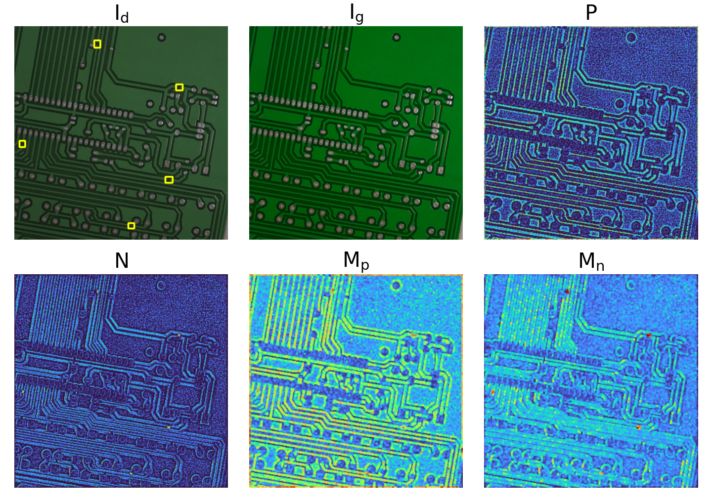

# RefDiffNet: Learning to Expose Subtle PCB Defects Before Detection

## 摘要

### 论文元信息

| 项目 | 内容 |
|---|---|
| 标题 | RefDiffNet: Learning to Expose Subtle PCB Defects Before Detection |
| 作者 | Vinay Edula, Nilesh Badwe, Priyanka Bagade |
| arXiv ID | 2606.00852v1 |
| 发布时间 | 2026-05-30 |
| 类别 | cs.CV, cs.AI, cs.LG |
| 论文链接 | http://arxiv.org/abs/2606.00852v1 |
| PDF 链接 | https://arxiv.org/pdf/2606.00852v1 |
| 代码状态 | 本文未在正文中提供可确认的 RefDiffNet 官方代码仓库；外部检索未发现同名官方实现，因此本文不写源码段。相关但非本文官方实现的 PCB 缺陷检测仓库可见 GitHub topic: https://github.com/topics/pcb-defect-detection。 |

一句话总结：RefDiffNet 将缺陷 PCB 图像与对齐的无缺陷参考图像进行结构化差异建模，在检测器骨干网络之前生成一个“缺陷更显眼”的增强图像，从而以 0.004–0.005M 参数和 0.7–0.8 GFLOPs 的极小开销提升多类检测器在 DeepPCB 与 HRIPCB 上的检测性能，尤其改善小模型和细微缺陷的 mAP50:95 表现（见 PAGE 1、PAGE 4、PAGE 10–12）。

本文的核心判断是：RefDiffNet 的价值不在于提出新的检测器主干，而在于把传统模板匹配中“有参考图就应利用参考图”的思想重新放入深度检测流水线，并将其设计成检测器无关的输入增强模块。这使它可以作为 YOLO、RT-DETR、Faster R-CNN 等已有检测器的前置模块，而不需要改写下游检测器结构（见 PAGE 3、PAGE 8、PAGE 12）。

## 背景与动机

PCB 缺陷检测的难点来自两个方面：一是制造缺陷本身可能非常小，论文在引言中提到高密度互连 PCB 可包含宽度不超过 $100\mu m$ 的走线和直径小于 $150\mu m$ 的微孔；二是 PCB 背景由焊盘、走线、铜箔区域等复杂结构组成，细微缺陷很容易被正常纹理淹没（见 PAGE 1–2）。这也是为什么人工目检在高通量制造中不现实，自动化视觉检测成为质量控制的必要环节（见 PAGE 2）。

早期 PCB 检测方法大量依赖模板图像比较：将待测 PCB 图像与无缺陷参考图像对齐，再通过差分、阈值、XOR、连通域分析、形态学后处理等方法定位差异区域（见 PAGE 2）。这类方法的优点是直接利用了“应该长什么样”的参考信息；缺点也明确：对照明变化、噪声和轻微错位敏感，因此跨板型、跨拍摄条件的鲁棒性有限（见 PAGE 2）。

深度学习方法改善了特征学习能力。论文列举了 Faster R-CNN、YOLO 系列，以及针对 PCB 缺陷的上下文学习、Transformer 融合、注意力机制、特征金字塔、轻量化检测器等方向（见 PAGE 2–3）。这些方法通常只看待检图像本身，即只使用 defective image，而没有使用 defect-free reference image。对于 PCB 这类天然存在标准模板或黄金样本的工业场景，这相当于放弃了一类强先验（见 PAGE 3）。

已有 reference-guided deep learning 方法已经说明参考图有效，例如 DeepPCB 的成对图像检测框架、Auto-VRS 的 AOI 后验证、Siamese 网络的缺陷/伪缺陷判别等（见 PAGE 3）。但论文指出，这些方法往往将成对图像直接用于最终预测、区域相似度估计或 AOI 告警验证；RefDiffNet 的定位不同：它不替代检测器，而是在检测器之前学习一个轻量的 reference-guided enhancement block（见 PAGE 3）。

因此，本文的出发点可以概括为：经典检测知道利用参考图，但鲁棒性不足；现代检测器鲁棒性更强，但常忽略参考图。RefDiffNet 试图在二者之间建立一个低成本接口，即先用参考图暴露缺陷，再把增强后的图像交给任意下游检测器（见 PAGE 3–4）。

## 预备知识

本文涉及三个关键概念。第一是 defect image 与 golden reference image。论文用 $I_d \in \mathbb{R}^{C\times H\times W}$ 表示待检缺陷图像，用 $I_g \in \mathbb{R}^{C\times H\times W}$ 表示与之对齐的无缺陷参考图像；其中 $C$ 是通道数，$H,W$ 分别是图像高度和宽度（见 PAGE 4）。RefDiffNet 的所有输入增强都建立在这对图像之上。

第二是 reference-guided cue construction，即从 $I_d$ 与 $I_g$ 中构造参考引导线索。论文并不直接把两张图拼接后交给检测器，而是先构造 Haar-band structural cues、signed residual cues 和 morphology-expanded residual cues 三类信息（见 PAGE 4–7）。这三类线索分别对应“结构变化”“正负差异”和“低分辨率缺陷区域扩展”。

第三是 plug-and-play pre-backbone module。RefDiffNet 被放置在检测器 backbone 之前，输出仍是三通道增强图像，因此下游 detector 不需要改变结构（见 PAGE 3、PAGE 8）。这使它的评估可以覆盖不同检测器家族，包括 YOLOv8–YOLOv26、RT-DETR 和 Faster R-CNN（见 PAGE 1、PAGE 10）。

## 方法详解

### 总体框架：从参考差异到残差增强

RefDiffNet 的总体输出由如下公式定义（见 PAGE 4）：

$$
I_{\text{out}} = I_d + \alpha S \odot \Delta
$$

这里，$I_{\text{out}}$ 是增强后的检测器输入图像，$I_d$ 是原始待检图像，$\Delta \in \mathbb{R}^{C\times H\times W}$ 是学习到的 RGB correction map，$S \in \mathbb{R}^{1\times H\times W}$ 是空间门控图，$\odot$ 表示逐元素乘法并在通道维广播，$\alpha$ 是初始化为较小值的可学习标量（见 PAGE 4）。这个公式的含义是：RefDiffNet 不重建整幅图像，而是在原图上只向被空间门控选中的位置添加受控修正。

这种 residual enhancement 设计有两个重要后果。第一，它保留了原始 PCB 图像的上下文，避免像直接差分图那样丢失走线、焊盘等正常结构；第二，增强幅度由 $\alpha$ 和 $S$ 共同调节，理论上可以抑制正常区域的无意义改变（见 PAGE 4、PAGE 8）。消融实验也显示，仅把 $I_d-I_g$ 送给检测器会使 mAP50:95 低至 0.218，而保留 $I_d$ 并添加差异后提升到 0.411（见 PAGE 12–13）。

用途：下图用于说明论文在 PAGE 5 展示的 local contrast normalization 对光照变化的抑制效果。  
读图要点：重点看原图与光照变化图经 LCN 后是否保留 PCB 主结构，同时降低局部亮度/对比度差异。  
支撑的判断：RefDiffNet 在做差异比较前先做 LCN，是为了把后续 residual cue 的关注点从照明偏差转向结构差异（见 PAGE 4–5）。

图后解读：Figure 2 支撑了论文的一个关键工程假设：参考图比较不能直接依赖原始像素差，否则照明变化会被误认为缺陷。LCN 的作用不是检测缺陷本身，而是为后续结构差异和残差差异提供更稳定的输入（见 PAGE 5）。

### 局部对比度归一化：降低光照与局部对比误差

RefDiffNet 首先对待检图像和参考图像分别做 local contrast normalization, LCN（见 PAGE 4）：

$$
\hat I_d = \operatorname{LCN}(I_d), \quad \hat I_g = \operatorname{LCN}(I_g)
$$

这里 $\hat I_d$ 和 $\hat I_g$ 分别表示 LCN 后的待检图像与参考图像。该公式的含义是：后续比较并不直接在原始 $I_d,I_g$ 上进行，而是在局部归一化后的图像上进行，以减少照明与对比度不一致带来的伪差异（见 PAGE 4）。

论文给出 LCN 的局部定义（见 PAGE 4–5）：

$$
\operatorname{LCN}(I)(u,v)=
\frac{I(u,v)-\mu_{u,v}}
{\sqrt{\sigma^2_{u,v}+\varepsilon}}
$$

其中 $(u,v)$ 是像素位置，$\mu_{u,v}$ 是局部邻域均值，$\sigma_{u,v}$ 是局部邻域标准差，$\varepsilon$ 是避免除零的稳定项。这个公式的含义是：每个像素都相对其局部背景进行标准化，而不是相对整幅图像做全局归一化。

局部均值和方差由 $7\times 7$ 邻域 $\Omega_{u,v}$ 计算（见 PAGE 4–5）：

$$
\mu_{u,v}=
\frac{1}{|\Omega_{u,v}|}
\sum_{(i,j)\in \Omega_{u,v}} I(i,j),
\quad
\sigma^2_{u,v}=
\frac{1}{|\Omega_{u,v}|}
\sum_{(i,j)\in \Omega_{u,v}}
(I(i,j)-\mu_{u,v})^2
$$

这一步的直观解释是：同一个位置的缺陷和参考差异应主要来自结构变化，而不是局部亮度偏差。论文明确指出，LCN 使 defective-reference comparison 对局部亮度和对比度变化不那么敏感（见 PAGE 5）。

### Haar-band 结构线索：显式编码 PCB 结构变化

在归一化后，RefDiffNet 对 $\hat I_d$ 与 $\hat I_g$ 分别施加固定 Haar transform（见 PAGE 5）：

$$
B_d = H(\hat I_d), \quad B_g = H(\hat I_g)
$$

这里 $B_d$ 和 $B_g$ 分别表示待检图像与参考图像的 Haar-band 输出。论文使用 grouped stride-2 convolution，每个通道使用四个 $2\times 2$ Haar 滤波器，对应 $LL,LH,HL,HH$ 四个子带（见 PAGE 5）。

四个滤波器定义如下（见 PAGE 5）：

$$
K_{LL}=\frac{1}{2}
\begin{bmatrix}
1 & 1\\
1 & 1
\end{bmatrix},
\quad
K_{LH}=\frac{1}{2}
\begin{bmatrix}
-1 & -1\\
1 & 1
\end{bmatrix}
$$

$$
K_{HL}=\frac{1}{2}
\begin{bmatrix}
-1 & 1\\
-1 & 1
\end{bmatrix},
\quad
K_{HH}=\frac{1}{2}
\begin{bmatrix}
1 & -1\\
-1 & 1
\end{bmatrix}
$$

这里 $LL$ 捕获低频布局，$LH$、$HL$、$HH$ 分别捕获不同方向的局部变化。这个设计的意义是：PCB 缺陷常表现为走线断裂、额外铜、孔洞缺失等结构性异常，Haar 子带能把这些异常转化为更明确的方向性响应（见 PAGE 5–6）。

用途：下图是论文用于说明 Haar 分解输入样例的 PCB 图像。  
读图要点：该图本身不是结果图，而是 Figure 4 的输入参照，用来观察后续 $LL,LH,HL,HH$ 子带如何分解同一块 PCB 结构。  
支撑的判断：Haar-band cue 并非抽象特征，它直接来自 PCB 局部结构，是 RefDiffNet 将传统小波/模板思想引入深度模块的关键证据（见 PAGE 5）。

图后解读：Figure 3 的价值在于提供视觉基准。后续 Figure 4 中的子带响应可以对应到该图中的走线、焊盘和局部边缘，从而说明 Haar cue 为什么适合表达 PCB 的结构变化（见 PAGE 5–6）。

用途：下图展示 Figure 3 PCB 图像的 Haar-band decomposition。  
读图要点：行对应 $LL,LH,HL,HH$，列对应 blue、green、red 三个通道；重点看 $LL$ 保留整体布局，$LH/HL/HH$ 强化方向变化。  
支撑的判断：RefDiffNet 同时使用 $B_d$ 与 $B_g$，目的是让模型比较待检图与参考图的结构响应，而不是只比较原始像素（见 PAGE 5–6）。

图后解读：Figure 4 支撑了消融实验中的结果：仅 Haar bands 就能达到较高的 mAP50 与 mAP50:95，但完整 cue stack 在精定位指标 mAP50:95 上更优（见 PAGE 13）。这说明结构 cue 很强，但它仍需要与 residual 和 morphology cue 互补。

### Signed residual cue：区分“多出来”和“缺失”的缺陷

除 Haar 结构特征外，RefDiffNet 还计算低分辨率的 defective-reference residual（见 PAGE 6）：

$$
I_d^{lr} = \operatorname{AvgPool}(\hat I_d),
\quad
I_g^{lr} = \operatorname{AvgPool}(\hat I_g)
$$

$$
D^{lr} = I_d^{lr} - I_g^{lr}
$$

其中 $I_d^{lr}$ 与 $I_g^{lr}$ 是经过 average pooling 后的低分辨率图像，$D^{lr}$ 是二者差异。这个公式的含义是：RefDiffNet 在与 Haar bands 相同的半分辨率尺度上显式计算待检图与参考图的差异（见 PAGE 6）。

论文进一步把 residual 分解为正分支和负分支（见 PAGE 6）：

$$
P=\operatorname{ReLU}(D^{lr}),
\quad
N=\operatorname{ReLU}(-D^{lr})
$$

这里 $P$ 表示 positive residual cue，$N$ 表示 negative residual cue。直观地说，$P$ 更适合表示“待检图比参考图多出来”的异常，例如 spurious copper；$N$ 更适合表示“待检图比参考图少了”的异常，例如 open circuit 或缺失材料（见 PAGE 6）。

这种正负分离比单一差分更符合 PCB 缺陷语义。论文在 Figure 5 中明确指出，open-circuit defect 在 $N$ 中更清晰，而 spurious-copper defect 在 $P$ 中更清晰（见 PAGE 6–7）。这说明 RefDiffNet 不是把差分当成无符号热力图，而是保留了缺陷方向性。

### Morphology-expanded cue：扩大低分辨率缺陷线索

论文指出，$P$ 和 $N$ 在低分辨率尺度上可能只占少数像素，因此使用 $3\times 3$ max pooling 对其局部扩展（见 PAGE 6）：

$$
M_p = \operatorname{MaxPool}_{3\times3}(P),
\quad
M_n = \operatorname{MaxPool}_{3\times3}(N)
$$

这里 $M_p$ 和 $M_n$ 是 morphology-expanded residual maps。这个公式的含义是：不改变空间分辨率，但把很小的 residual 响应向邻域传播，使缺陷区域对后续轻量编码器更可见（见 PAGE 6）。

最终 cue tensor 定义为（见 PAGE 7）：

$$
X=\operatorname{Concat}(B_d,B_g,P,N,M_p,M_n)
$$

对于 RGB 输入，论文给出 $X\in \mathbb{R}^{12C\times \frac{H}{2}\times \frac{W}{2}}$（见 PAGE 7）。这里的 $12C$ 来自 defective/reference Haar bands 以及正负 residual 和形态学扩展 cue 的组合。这个设计的重点是“保留分支信息”，而不是把所有差异提前压缩成一张差分图。

用途：下图展示 signed residual 与 morphology-expanded cues 对两类缺陷的可视化。  
读图要点：关注 open circuit 与 spurious copper 在正负 residual 分支中的响应差异，以及 max pooling 后缺陷区域是否更容易被观察到。  
支撑的判断：正负残差分支和形态学扩展不是装饰性模块，而是直接对应不同缺陷方向和小区域可见性的设计（见 PAGE 6–7）。

图后解读：Figure 5 是理解 RefDiffNet 的关键图之一。它说明单纯“有差异”并不足够，模型还需要知道差异方向和局部扩展后的空间范围；这与 Table 4 中 full cue stack 优于去除 Haar、去除 signed residual 或去除 morphology maps 的结果一致（见 PAGE 13）。

### 轻量编码器与通道重标定

构造 cue tensor 后，RefDiffNet 使用轻量卷积编码器生成隐藏特征（见 PAGE 7）：

$$
F=\operatorname{Encoder}(X)
$$

其中 $F\in \mathbb{R}^{H_{\text{hid}}\times \frac{H}{2}\times \frac{W}{2}}$，论文实现中 $H_{\text{hid}}=24$（见 PAGE 7）。编码器先用 $1\times1$ pointwise convolution 将 $12C$ 个 cue 通道投影到隐藏通道，再用两层 depthwise-separable convolution block 做空间细节提炼（见 PAGE 7–8）。

由于不同缺陷类型并不总是依赖相同 cue，RefDiffNet 使用 squeeze-and-excitation style channel gate 做通道重标定（见 PAGE 7）：

$$
g_c=\operatorname{SE}(F),
\quad
g_c\in \mathbb{R}^{H_{\text{hid}}\times 1\times 1}
$$

$$
F_c=F\odot g_c
$$

这里 $g_c$ 是通道权重，$F_c$ 是重标定后的特征。该公式的含义是：模型可以对 structural cue、signed residual cue、morphology cue 中更有用的通道赋予更高权重，而不是静态地把所有 cue 等权使用（见 PAGE 7）。

### RGB correction 与 spatial gate

从 $F_c$ 出发，RefDiffNet 同时预测 RGB correction map 和 spatial gate。低分辨率 RGB correction 定义为（见 PAGE 7–8）：

$$
\Delta^{lr}=\operatorname{RGBDelta}(F_c),
\quad
\Delta^{lr}\in \mathbb{R}^{C\times \frac{H}{2}\times \frac{W}{2}}
$$

RGBDelta 分支定义为（见 PAGE 8）：

$$
\operatorname{RGBDelta}(\cdot)
=
\tanh\left(
\operatorname{Conv}_{1\times1}
(\operatorname{ConvBNAct}(\cdot))
\right)
$$

这里 $\tanh$ 将 correction 限制在 $[-1,1]$，论文同时指出增强图像会 clamp 回 $[0,1]$（见 PAGE 8）。这个公式的含义是：RefDiffNet 输出的是受约束的颜色级修正，而不是无限制地改写图像。

空间门控预测为（见 PAGE 8）：

$$
S^{lr}=G(F_c),
\quad
S^{lr}\in \mathbb{R}^{1\times \frac{H}{2}\times \frac{W}{2}}
$$

论文说明，$G$ 使用 coordinate-attention-based spatial gate，再做单通道投影（见 PAGE 8）。coordinate attention 分别编码高度和宽度方向的位置信息，因此适合 PCB 走线、铜区这类具有行列方向结构的图像（见 PAGE 8、PAGE 14）。

最后，低分辨率 correction 和 gate 被双线性上采样到原图分辨率（见 PAGE 8）：

$$
\Delta=\operatorname{Upsample}(\Delta^{lr}),
\quad
S=\operatorname{Upsample}(S^{lr})
$$

$$
\Delta\in \mathbb{R}^{C\times H\times W},
\quad
S\in \mathbb{R}^{1\times H\times W}
$$

将其代回 $I_{\text{out}} = I_d+\alpha S\odot \Delta$ 后，下游检测器接收的仍然是标准三通道图像（见 PAGE 8）。因此 RefDiffNet 可以插入不同检测器前端，而不要求修改 backbone、neck、head 或 loss。

### 代码分析

本文未提供可确认的公开 RefDiffNet 官方代码。论文正文没有给出 GitHub 仓库链接，已知元信息中代码链接为“未知”，外部检索也未发现同名官方实现。因此，本文不提供源码片段，也不把 Ultralytics、TorchVision 或其他 PCB 缺陷检测仓库误判为 RefDiffNet 实现。论文只明确说明 YOLO 变体和 RT-DETR-L 使用 Ultralytics 框架训练，Faster R-CNN 使用 TorchVision Faster R-CNN ResNet-50 FPN 实现（见 PAGE 10）。

## 实验分析

### 实验设置

论文在 DeepPCB 与 HRIPCB 两个公开 PCB 缺陷检测数据集上评估 RefDiffNet。DeepPCB 包含 1,500 对对齐 PCB 图像，缺陷类别包括 open、short、mousebite、spur、pin hole、spurious copper；HRIPCB 包含 1,386 张图像，类别包括 missing hole、mouse bite、open circuit、short、spur、spurious copper（见 PAGE 11）。论文说明两个数据集均使用原始公开数据，不增加、删除或重采样图像（见 PAGE 11）。

检测器覆盖 YOLOv8 到 YOLOv26、RT-DETR-L 和 Faster R-CNN。YOLO 与 RT-DETR-L 使用 Ultralytics 框架，Faster R-CNN 使用 TorchVision 实现；所有检测器初始化为 COCO 预训练权重，并在 PCB 数据集上微调（见 PAGE 10）。训练设置为 200 epochs、$640\times640$ 分辨率、batch size 8、AdamW、初始学习率 0.001、final learning-rate factor 0.01、weight decay $5\times10^{-4}$、cosine scheduling、3 warmup epochs、固定随机种子 42（见 PAGE 10）。

### DeepPCB 主要结果

| 模型 | Params 原始/增强 (M) | FLOPs 原始/增强 (G) | 原始 mAP50:95 (%) | 增强 mAP50:95 (%) | 相对变化 |
|---|---:|---:|---:|---:|---:|
| RT-DETR | 32.818 / 32.823 | 108.0 / 108.8 | 81.8 | 82.7 | +1.1% |
| Faster R-CNN | 41.325 / 41.329 | 181.5 / 182.2 | 76.5 | 79.9 | +4.5% |
| YOLOv8n | 3.012 / 3.016 | 8.2 / 9.0 | 78.9 | 82.8 | +4.9% |
| YOLOv9s | 7.290 / 7.294 | 27.4 / 28.2 | 84.0 | 85.6 | +1.9% |
| YOLOv9e | 58.150 / 58.154 | 192.7 / 193.5 | 84.0 | 86.1 | +2.5% |
| YOLOv12s | 9.255 / 9.260 | 21.5 / 22.3 | 82.2 | 82.0 | -0.2% |
| YOLOv26x | 58.822 / 58.827 | 208.6 / 209.4 | 82.0 | 85.0 | +3.7% |

表格解读：DeepPCB 上 baseline 已经较强，许多模型原始 mAP50 已接近 98% 左右，因此 RefDiffNet 的收益主要体现在 mAP50:95 这种更严格的定位指标上（见 PAGE 10、PAGE 12）。YOLOv9e+RefDiffNet 达到 86.1% mAP50:95，是论文列出的 DeepPCB 最佳结果之一；同时，小模型 YOLOv9s+RefDiffNet 以 7.294M 参数和 28.2 GFLOPs 达到 85.6% mAP50:95，超过原始 YOLOv26x 的 82.0%，说明参考增强能让中小模型获得接近甚至超过大模型的定位能力（见 PAGE 12）。但 YOLOv12s 的 mAP50:95 从 82.2% 降到 82.0%，说明该模块不是对每个模型与每个指标都单调提升（见 PAGE 10）。

### HRIPCB 主要结果

| 模型 | Params 原始/增强 (M) | FLOPs 原始/增强 (G) | 原始 mAP50:95 (%) | 增强 mAP50:95 (%) | 相对变化 |
|---|---:|---:|---:|---:|---:|
| RT-DETR | 32.818 / 32.823 | 108.0 / 108.8 | 52.8 | 56.0 | +6.1% |
| Faster R-CNN | 41.325 / 41.329 | 181.5 / 182.2 | 45.0 | 51.0 | +13.2% |
| YOLOv8n | 3.012 / 3.016 | 8.2 / 9.0 | 50.0 | 56.7 | +13.4% |
| YOLOv9t | 2.007 / 2.011 | 7.9 / 8.6 | 49.6 | 57.3 | +15.5% |
| YOLOv12m | 20.142 / 20.146 | 67.8 / 68.5 | 57.4 | 61.1 | +6.4% |
| YOLOv26n | 2.506 / 2.510 | 5.8 / 6.6 | 48.9 | 57.7 | +18.0% |
| YOLOv26x | 58.822 / 58.827 | 208.6 / 209.4 | 57.7 | 60.2 | +4.3% |

表格解读：HRIPCB 上收益比 DeepPCB 更明显，论文解释为 HRIPCB 存在更大的 board layout、defect appearance 和 image orientation 变化（见 PAGE 12）。最大相对提升出现在 YOLOv26n，mAP50:95 从 48.9% 提升到 57.7%，相对增益 18.0%（见 PAGE 11–12）。这支持论文摘要中“up to 18% relative mAP50:95 gain”的说法（见 PAGE 1）。同时，YOLOv12m+RefDiffNet 以 20.146M 参数、68.5 GFLOPs 达到 61.1% mAP50:95，超过多个更大的原始检测器，说明 RefDiffNet 的收益并不只是堆参数带来的（见 PAGE 12）。

### 架构消融

| 架构变体 | 输出给检测器 | LCN | Encoder | Channel gate | Spatial gate | mAP50 | mAP50:95 |
|---|---|---|---|---|---|---:|---:|
| Raw difference only | $I_d-I_g$ | ✗ | ✗ | ✗ | ✗ | 0.519 | 0.218 |
| Defect image with raw difference | $I_d+\alpha(I_d-I_g)$ | ✗ | ✗ | ✗ | ✗ | 0.817 | 0.411 |
| Defect image with LCN difference | $I_d+\alpha(\hat I_d-\hat I_g)$ | ✓ | ✗ | ✗ | ✗ | 0.850 | 0.436 |
| Learnable encoder enhancement | $I_d+\alpha R$ | ✓ | ✓ | ✗ | ✗ | 0.875 | 0.438 |
| Encoder with channel recalibration | $I_d+\alpha R_{cg}$ | ✓ | ✓ | ✓ | ✗ | 0.867 | 0.444 |
| Encoder with channel recalibration and spatial gate | $I_d+\alpha G\odot R_{cg}$ | ✓ | ✓ | ✓ | ✓ | 0.880 | 0.446 |
| Full architecture with RGB correction | $I_d+\alpha G\odot R_{rgb}$ | ✓ | ✓ | ✓ | ✓ | 0.873 | 0.449 |

表格解读：Table 3 的最重要信息是，直接差分不是可行方案。只输入 $I_d-I_g$ 会破坏原图上下文，使 mAP50:95 只有 0.218（见 PAGE 12–13）。保留 $I_d$ 后大幅提升到 0.411，说明缺陷增强必须建立在原图语义之上。LCN、可学习 encoder、channel recalibration、spatial gate 和 RGB correction 逐步提高 mAP50:95，最终达到 0.449（见 PAGE 12–13）。这支持 RefDiffNet 的设计逻辑：它不是简单做图像相减，而是学习“在哪里、以何种形式”增强差异。

### Cue 设计消融

| 变体 | Encoder input | Haar | Signed residual | Morphology | mAP50 | mAP50:95 |
|---|---|---|---|---|---:|---:|
| Full cue stack | $\operatorname{Concat}(B_d,B_g,P,N,M_p,M_n)$ | ✓ | ✓ | ✓ | 0.887 | 0.461 |
| Remove Haar bands | $\operatorname{Concat}(P,N,M_p,M_n)$ | ✗ | ✓ | ✓ | 0.871 | 0.438 |
| Remove signed residual maps | $\operatorname{Concat}(B_d,B_g,M_p,M_n)$ | ✓ | ✗ | ✓ | 0.862 | 0.441 |
| Remove morphology maps | $\operatorname{Concat}(B_d,B_g,P,N)$ | ✓ | ✓ | ✗ | 0.874 | 0.444 |
| Only signed residual maps | $\operatorname{Concat}(P,N)$ | ✗ | ✓ | ✗ | 0.888 | 0.451 |
| Only Haar bands | $\operatorname{Concat}(B_d,B_g)$ | ✓ | ✗ | ✗ | 0.891 | 0.456 |

表格解读：Table 4 显示 Haar-only 的 mAP50 达到 0.891，甚至高于 full cue stack 的 0.887，但 full cue stack 的 mAP50:95 最高，为 0.461（见 PAGE 13）。这说明 Haar 子带对粗定位或类别检测很有帮助，但更严格的定位质量需要 signed residual 与 morphology-expanded cue 提供补充。去掉任一 cue 类型都会降低 mAP50:95，说明三类 cue 的组合是针对 PCB 细微缺陷定位的关键。

### Spatial gate attention 消融

| Attention mechanism | mAP50 | mAP50:95 |
|---|---:|---:|
| Convolutional Block Attention Module | 0.831 | 0.450 |
| Efficient Channel Attention | 0.793 | 0.431 |
| Squeeze-and-Excitation Attention | 0.808 | 0.427 |
| Selective Kernel Attention | 0.819 | 0.442 |
| Coordinate Attention | 0.887 | 0.461 |

表格解读：Coordinate Attention 在 Table 6 中取得最佳 mAP50 和 mAP50:95（见 PAGE 14）。论文解释为 coordinate attention 不把所有空间信息压缩到单一全局描述，而是沿高度和宽度方向分别编码位置关系，这有利于 PCB 走线与铜区的小缺陷区分（见 PAGE 14）。这也说明 RefDiffNet 的 spatial gate 不只是普通注意力替换，而是与 PCB 图像的行列结构具有方法匹配性。

## 讨论

RefDiffNet 最适合的场景是存在 defect-free golden reference image 且待检图像能够较好对齐的工业视觉检测。PCB 裸板、规则零部件、屏幕瑕疵、标准化外观件等任务都可能满足这一前提；但论文实验只覆盖 PCB 数据集，其他场景属于合理外推，尚未由本文实验证明（见 PAGE 10–12）。

从方法论角度看，RefDiffNet 的贡献是“检测器前置增强”而不是“检测器内部改造”。这使它与 detector architecture advances 互补：检测器可以继续使用 YOLO、RT-DETR、Faster R-CNN 等现有结构，而 RefDiffNet 负责在输入阶段注入参考图信息（见 PAGE 3、PAGE 8、PAGE 12）。这一点对工程部署有意义，因为替换输入模块通常比重写检测器 head 或训练新 backbone 更容易评估。

从效率角度看，论文报告 RefDiffNet 只增加 0.004–0.005M 参数和 0.7–0.8 GFLOPs，最多不超过任何已评估检测器参数量的 0.25%（见 PAGE 1、PAGE 4、PAGE 12）。不过，论文主要报告参数量和 FLOPs，没有在给定全文中提供端到端实际延迟、吞吐量或硬件部署测量，因此实时产线价值还需要结合目标设备实测验证，证据不足。

## 局限分析

第一，本文依赖对齐参考图。论文明确设定输入为 defective image $I_d$ 和 aligned golden reference image $I_g$，并指出在生产环境中若二者不能完美对齐，可以在 RefDiffNet 之前使用 ECC maximization 等标准图像配准步骤（见 PAGE 4）。这意味着 RefDiffNet 的性能上界与配准质量有关；但全文没有给出不同错位程度、配准失败或非刚性变形条件下的系统实验，因此对 misalignment robustness 的证据不足。

第二，论文没有单列 Limitations 章节，也没有明确写出作者自述局限。因此，严格意义上的“作者自述局限”证据不足。可以确认的是，作者在方法假设中承认需要 aligned reference，并建议不完美对齐时使用 ECC；这是一项前提条件，而不是完整的局限分析（见 PAGE 4）。

第三，实验覆盖 DeepPCB 和 HRIPCB 两个公开 PCB 数据集，且均为具有参考图或成对图像设定的数据集（见 PAGE 11）。因此，本文能证明 RefDiffNet 对 PCB defect detection 有效，但不能证明它对无模板、开放世界、强非刚性目标、复杂三维表面或缺少 golden reference 的缺陷检测同样有效。论文摘要中的“detector-agnostic”应理解为跨检测器结构，而不是跨所有视觉检测场景（见 PAGE 1、PAGE 10–12）。

第四，尽管整体趋势是提升，但 DeepPCB 的 YOLOv12s mAP50:95 从 82.2% 降到 82.0%，出现 -0.2% 的相对变化（见 PAGE 10）。这提示 RefDiffNet 可能与个别模型、训练随机性或数据分布存在不完全一致的交互。论文固定随机种子为 42，但给定全文未提供多随机种子均值和方差，因此统计稳定性证据不足（见 PAGE 10）。

第五，代码未公开或至少未在论文与检索结果中可确认。由于缺少 RefDiffNet 官方实现，读者暂时无法核验 LCN、Haar grouped convolution、cue 拼接、coordinate attention gate、$\alpha$ 初始化、clamp 等实现细节是否与论文完全一致。本文因此没有源码级复现分析，证据不足。

## 结论

RefDiffNet 的主要贡献可以归纳为三点：第一，它把无缺陷参考图显式引入深度检测流水线，但不替换下游检测器；第二，它用 LCN、Haar bands、signed residual、morphology-expanded maps 构造互补 cue，再通过轻量 gated encoder 输出 RGB correction 和 spatial gate；第三，它在 DeepPCB 与 HRIPCB 上跨 YOLOv8–YOLOv26、RT-DETR、Faster R-CNN 获得一致或大体一致的性能提升，同时参数与 FLOPs 开销很小（见 PAGE 3–4、PAGE 10–14）。

对于工业质检应用，本文最直接的启示是：当生产对象存在稳定 golden reference 时，不应只依赖单图检测器从复杂纹理中“猜缺陷”，而应把参考差异作为检测器前的显式增强信号。RefDiffNet 证明了这种思路可以以较小模块成本获得显著收益；但其落地仍需重点验证参考图配准、误检变化、端到端延迟、多随机种子稳定性以及自有数据分布下的泛化能力。

## 证据索引

| PAGE | 关键证据 |
|---|---|
| PAGE 1 | 论文标题、作者、arXiv 信息、摘要；提出 RefDiffNet 是 lightweight plug-and-play input enhancement block；报告最高 18% 相对 mAP50:95 增益、0.004–0.005M 参数、0.7–0.8 GFLOPs。 |
| PAGE 2 | PCB 制造微小缺陷背景；传统模板匹配、差分、阈值、XOR、连通域、形态学和 Haar/wavelet 方法；传统方法对光照、噪声、错位敏感。 |
| PAGE 3 | 深度 PCB 检测方法通常只使用 defective image；reference-guided 方法相关工作；RefDiffNet 作为 pre-backbone enhancement block 的定位；主要贡献列表。 |
| PAGE 4 | Methodology overview；输入 $I_d,I_g$；ECC 配准建议；核心公式 $I_{\text{out}}=I_d+\alpha S\odot\Delta$；LCN 公式起始。 |
| PAGE 5 | LCN 局部均值/方差；Figure 2；Haar transform 定义；四个 Haar filters；Figure 3。 |
| PAGE 6 | Figure 4；low-resolution residual；$D^{lr}$、$P$、$N$；positive/negative residual 对 open circuit 与 spurious copper 的作用；morphology-expanded cue 公式。 |
| PAGE 7 | Figure 5；最终 cue tensor $X=\operatorname{Concat}(B_d,B_g,P,N,M_p,M_n)$；encoder、$H_{\text{hid}}=24$、SE channel gate、$F_c=F\odot g_c$。 |
| PAGE 8 | RGB correction、tanh bounded correction、spatial gate、coordinate attention、upsampling、最终增强图像输入检测器；Figure 6 描述。 |
| PAGE 9 | Figure 7 定性可视化说明；由于本任务 figures 未提供 Figure 7 的 markdown_path，本文未嵌入该图。 |
| PAGE 10 | 实验设置；YOLO/RT-DETR 使用 Ultralytics，Faster R-CNN 使用 TorchVision；训练超参数；DeepPCB Table 1。 |
| PAGE 11 | DeepPCB 与 HRIPCB 数据集描述；HRIPCB Table 2。 |
| PAGE 12 | DeepPCB 与 HRIPCB 定量结果总结；小模型超过大模型的例子；HRIPCB 上最高 18.0% 相对 mAP50:95 增益；消融设置。 |
| PAGE 13 | Table 3 架构消融解释；Table 4 cue-subset ablation；full cue stack 在 mAP50:95 上最佳。 |
| PAGE 14 | Table 5 feature-stack redesign ablation；Table 6 spatial-gate attention ablation；Coordinate Attention 最优；Conclusion。 |
| 外部检索 | 未发现可确认的 RefDiffNet 官方代码仓库；相关但非官方实现的 PCB defect detection GitHub topic: https://github.com/topics/pcb-defect-detection；DeepPCB 数据集仓库: https://github.com/tangsanli5201/DeepPCB。 |
