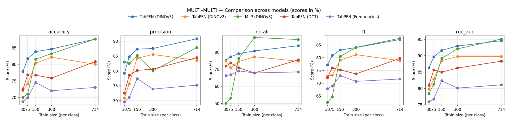
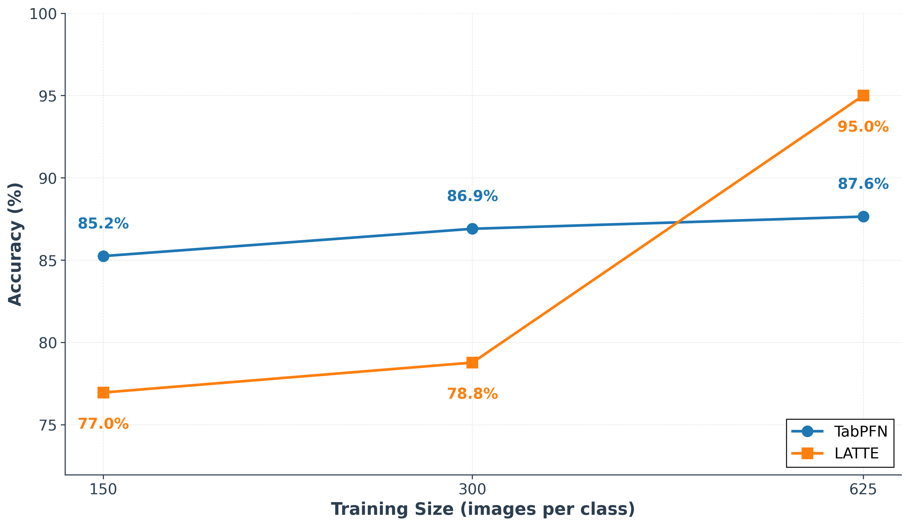
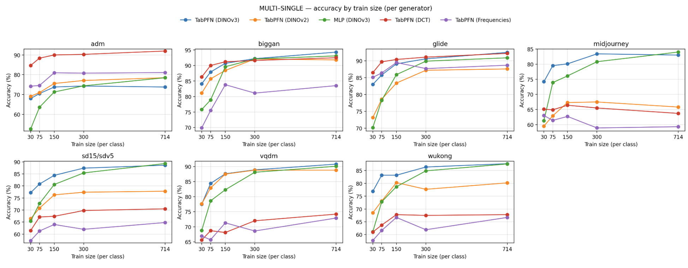
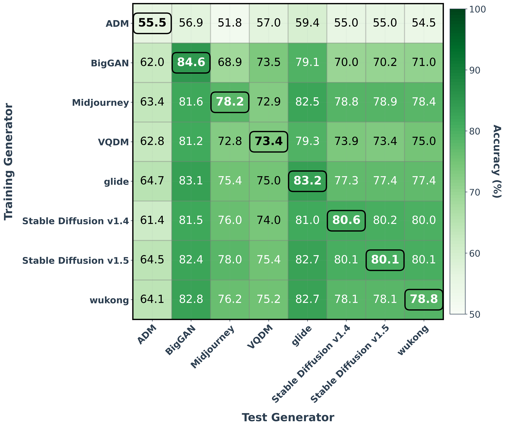

# Images as Tables: In-Context Learning with TabPFN for Low-Data Detection of AI-Generated Images

## 摘要

| 项目 | 内容 |
|---|---|
| 论文标题 | Images as Tables: In-Context Learning with TabPFN for Low-Data Detection of AI-Generated Images |
| 作者 | Jan Philip Walter, Shashank Agnihotri, Margret Keuper |
| arXiv ID | 2606.00872v1 |
| 发布时间 | 2026-05-30 |
| 论文链接 | http://arxiv.org/abs/2606.00872v1 |
| PDF 链接 | https://arxiv.org/pdf/2606.00872v1 |
| 代码状态 | 论文在 PAGE 1 标注代码超链接，并在 PAGE 8 给出 GitHub 地址：https://github.com/jpwalter30/Towards-Generalizable-Detection-of-AI-Generated-Images；但当前材料未提供仓库源码内容，因此源码片段、文件路径与行号证据不足。 |

表格解读：该表给出本文解读所依赖的元信息。需要特别说明的是，论文声明存在公开代码入口，但本报告只获得 PDF 全文和摘要，没有获得仓库 README、源码文件或配置文件内容。因此本文可以讨论论文级复现流程，却不能伪造代码段或声称某个函数与论文方法逐行对应。

一句话总结：论文将 AI 生成图像检测转化为“图像特征表格上的少样本二分类”，用冻结 DINOv3 提取视觉表示、PCA 压缩为 500 维表格行，再由 TabPFN 通过 in-context inference 完成 real/fake 判别，在低样本和跨生成器迁移场景优于 LATTE，但在大规模 pooled 设置下峰值仍落后于 LATTE（见 PAGE 1、PAGE 3、PAGE 4）。

本文关注的不是目标检测意义上的 object detection，而是图像真伪分类或属性分类意义上的 AI-generated image detection。对业务而言，它更接近数据闭环中的 AIGC 污染样本过滤、少样本属性分类适配、跨数据源质量审计，而不是定位图像中具体目标的位置。论文自身也将任务定义为 binary real/fake detection，并把 generated class 作为正类计算 precision、recall、F1 和 ROC-AUC（见 PAGE 3、PAGE 9）。

## 背景与动机

AI 生成图像检测的核心困难在于“moving-target classification problem”：生成器架构、训练数据、采样过程、后处理流程不断变化，导致在旧生成器上训练良好的检测器可能在新生成器上失效（见 PAGE 1）。论文指出，真实/生成的决策边界并不只是 real versus generated，还带有 generator-dependent 的性质，即不同生成器会产生不同伪影、指纹或分布偏移（见 PAGE 1、PAGE 2）。

现有检测器大多仍是 image-domain systems。论文将相关方法概括为视觉分类头、CNN 或 ViT backbone、frequency artifacts、diffusion-specific traces 等方向，并强调这些方法通常需要为目标数据重新训练或拟合检测器（见 PAGE 1、PAGE 2）。LATTE 是论文重点比较的近期强基线，它使用 latent trajectory embeddings 来检测 diffusion-generated images，因此代表了一类更专门的扩散图像取证模型（见 PAGE 2）。

这篇论文的出发点是一个相对克制但清晰的问题：如果一张图像已经被强冻结视觉模型转换成高质量表示，最后的取证判断是否可以从图像域训练问题转化为 structured-data inference（见 PAGE 1）。这不是声称图像信息不重要，而是把视觉表示学习与检测器适配解耦：视觉编码器固定，少量新标注样本只改变 TabPFN 的 context set（见 PAGE 1、PAGE 2）。

这种设定对应现实中的低样本适配场景。新生成器出现时，通常很难立即收集大量高质量标注样本，但可以快速获得少量真实图像与生成图像。论文因此把关键问题设为：在 $k$ 很小的训练样本条件下，DINOv3-PCA-TabPFN 是否能比需要更多样本或更强任务训练的检测器更快适应新分布（见 PAGE 3、PAGE 4）。

论文的贡献可以概括为三点。第一，将 AI-generated image detection 表述为 frozen visual features 上的 tabular inference。第二，在 GenImage 上设计 generator-aware protocols，分别考察 pooled performance、per-generator difficulty、single-generator transfer、pairwise specialization。第三，与 LATTE 对比后得到经验性 trade-off：TabPFN 低样本和若干跨生成器场景更强，而 LATTE 在多生成器大样本 pooled 设置下达到最高峰值（见 PAGE 2、PAGE 4）。

## 预备知识

DINOv3 是本文使用的 frozen visual foundation model。给定图像 $x$，论文使用 DINOv3 ViT-B/16 生成 CLS token 表示，记作：

$$
h(x) \in \mathbb{R}^{768}
$$

这里 $x$ 表示输入图像，$h(x)$ 表示冻结 DINOv3 输出的 768 维 CLS 特征向量。人话解释：论文先把每张图像压成一个 768 维视觉摘要，而不是直接在像素上训练分类器（见 PAGE 3）。

PCA，即 Principal Component Analysis，主成分分析，被用于将 768 维视觉表示降到 TabPFN 当前版本可处理的 500 维特征限制。论文写作：

$$
z(h(x)) \in \mathbb{R}^{500}
$$

这里 $z(\cdot)$ 表示 PCA 映射，$z(h(x))$ 是进入 TabPFN 的表格行。人话解释：每张图像最终变成一个 500 列的表格样本，图像检测问题被改写成表格二分类问题（见 PAGE 3、PAGE 8）。

TabPFN 是 tabular foundation model。论文将其描述为 prior-data fitted network，通过 labeled context set 近似 Bayesian-style tabular inference，并避免在预测时进行 dataset-specific gradient-based training（见 PAGE 2、PAGE 3）。因此，TabPFN 在本文中的作用不是图像编码器，而是少样本表格分类器；它接收 PCA 后的特征行和 binary labels，其中 0 表示 real，1 表示 generated（见 PAGE 3）。

论文使用的 TabPFN 版本存在两个关键规模限制：最多 10,000 个样本和 500 个特征（见 PAGE 3）。这解释了为什么 DINOv3 的 768 维 CLS 表示需要 PCA 压缩，也解释了为什么 Multi training 在 $k=625$ 时刚好达到 5,000 fake 加 5,000 real 的 10,000 样本上限（见 PAGE 3）。

## 方法详解

整体方法 DINOv3-PCA-TabPFN 可以拆成三个阶段：image preprocessing、frozen feature extraction、in-context tabular classification。图像首先被转换为 RGB，短边 resize 到 256，center-crop 到 $224 \times 224$，再按 ImageNet statistics 归一化；DINOv3 处于 evaluation mode，不进行 image-domain fine-tuning（见 PAGE 3、PAGE 8）。

第一项创新是 image-to-table formulation。传统检测器通常在图像域中训练视觉分类头，而本文将每张图像映射为一个 structured row：先用 DINOv3 提取 CLS embedding，再用 PCA 对特征进行维度约束，最后让 TabPFN 对这些行进行二分类（见 PAGE 1、PAGE 3）。这一步的关键不是“表格比图像更强”，而是强视觉特征已经承载了足够的 real/fake 与 generator-dependent structure，使得下游可以转向少样本结构化推理（见 PAGE 10、PAGE 12、PAGE 13）。

第二项创新是把适配从 gradient-based detector retraining 转移到 labeled context set 的变化。论文明确指出，与 learned detector head 不同，TabPFN classifier 不在 target split 上优化，而是通过 prior-data fitted network mechanism 从 labeled context 中进行预测（见 PAGE 3）。这使适配成本主要取决于少量标注样本如何构成 context，而不是重新训练图像模型。

第三项创新是 generator-aware evaluation。论文没有只报告一个 i.i.d. pooled accuracy，而是设计 Multi-Multi、Multi-Single、Single-Multi、Single-Single 四类协议，用来分离 pooled detection、per-generator difficulty、从单个生成器到全体生成器的 transfer、以及 pairwise generator specialization（见 PAGE 2、PAGE 3）。这对 AI 生成图像检测尤为重要，因为真正困难的问题往往不是“见过同类生成器后能否分类”，而是“新生成器出现后能否迁移”。

| Protocol | Train | Test | 衡量内容 |
|---|---|---|---|
| Multi-Multi | 8 generators | 8 generators | 所有生成器都出现在训练与测试中的 pooled detection |
| Multi-Single | 8 generators | 1 generator | broad training coverage 后的单生成器难度 |
| Single-Multi | 1 generator | 8 generators | 从一个已观测生成器迁移到全生成器集合 |
| Single-Single | 1 generator | 1 generator | pairwise generator specialization 与跨生成器迁移 |

表格解读：Table 1 的价值在于把“准确率”拆成不同泛化问题。Multi-Multi 更接近充分覆盖后的总体检测，Multi-Single 暴露单个生成器的难度差异，Single-Multi 和 Single-Single 则更接近新生成器或少覆盖场景下的实际风险（见 PAGE 2、PAGE 3）。

训练样本规模被设为：

$$
k \in \{25, 30, 75, 150, 300, 625\}
$$

这里 $k$ 表示每个生成器的 fake samples 数量，同时使用相同数量的 real samples。人话解释：论文系统考察从极低样本到 TabPFN 样本上限附近的适配曲线，而不是只在大样本设置下比较模型强弱（见 PAGE 3）。

用途：Figure 2 用于判断“方法收益来自哪里”，即 DINOv3 表示、TabPFN 分类器、频域特征、MLP 基线之间的差异。

读图要点：Figure 2 比较 Multi-Multi development setting 下 accuracy、precision、recall、F1、ROC-AUC 等指标；论文文字说明 DINOv3 features with TabPFN 在这些指标上最强且最稳定，DINOv2、frequency features 与 MLP 在低样本下更弱（见 PAGE 3、PAGE 4）。

支撑的判断：该图支撑的不是“任意视觉 backbone 加 TabPFN 都有效”，而是 DINOv3 frozen representation 与 TabPFN low-data prior 的组合最有效。论文特别指出，MLP 在更多数据下会变得有竞争力，但 TabPFN 在 small-context regime 更强（见 PAGE 4）。

从方法论角度看，DINOv3-PCA-TabPFN 的关键假设是：冻结视觉模型的 CLS 特征空间已经包含与生成器和真伪有关的结构，而 TabPFN 可以在少量样本条件下利用这种结构。论文附录的 PCA diagnostics 进一步支持这个假设：Figures 8 到 10 显示 DINOv3 feature space 中已经存在 generator-dependent structure 与 real/fake structure，但也存在重叠，因此需要下游分类器（见 PAGE 10、PAGE 12、PAGE 13）。

代码分析方面，论文在 PAGE 8 给出 anonymized code URL，并在 PAGE 1 摘要区标注代码入口。然而当前输入材料没有提供 README、源码文件、配置文件或实验脚本内容。因此，代码段证据不足；本文不展示任何源码片段，也不标注文件路径与行号。可以确认的仅是论文级组件：feature extraction、IncrementalPCA、balanced split construction、TabPFN evaluation script 均在 PAGE 8 的复现描述中出现，但具体函数名与实现细节需要实际仓库内容验证。

## 实验分析

实验数据集使用 GenImage，包含 ImageNet-derived real images 和来自八个生成器的 fake images：ADM、BigGAN、GLIDE、Midjourney、Stable Diffusion v1.4、Stable Diffusion v1.5、VQDM、wukong（见 PAGE 3、PAGE 8、PAGE 9）。这些生成器包括七个 diffusion-based generators 和一个 GAN-based BigGAN，因此跨生成器迁移并不是单一模型家族内部的轻微分布变化（见 PAGE 8）。

| Generator | Train | Test | Total |
|---|---:|---:|---:|
| ADM | 162k | 6k | 168k |
| BigGAN | 162k | 6k | 168k |
| GLIDE | 162k | 6k | 168k |
| Midjourney | 162k | 6k | 168k |
| Stable Diffusion v1.4 | 162k | 6k | 168k |
| Stable Diffusion v1.5 | 166k | 8k | 174k |
| VQDM | 162k | 6k | 168k |
| wukong | 162k | 6k | 168k |

表格解读：Table 3 显示 GenImage 的生成器级规模足够大，但论文刻意从中抽取低样本训练集来模拟新生成器适配条件。Stable Diffusion v1.5 的样本数略高，其余生成器基本为 162k train、6k test。这个设计使评估焦点落在少样本上下文选择与跨生成器泛化，而不是数据集是否足够大（见 PAGE 8、PAGE 9）。

论文使用 accuracy、precision、recall、F1、ROC-AUC 评价 binary real/fake detection，其中 generated class 为 positive class（见 PAGE 9）。Accuracy 定义为：

$$
\text{Accuracy} = \frac{TP + TN}{TP + TN + FP + FN}
$$

其中 $TP$、$TN$、$FP$、$FN$ 分别是真阳性、真阴性、假阳性、假阴性。人话解释：accuracy 衡量所有真实图像和生成图像中被正确分类的比例（见 PAGE 9）。

Precision 定义为：

$$
\text{Precision} = \frac{TP}{TP + FP}
$$

人话解释：precision 衡量被模型判为 generated 的图像中有多少真的 generated，业务上对应“拦截出来的 AIGC 样本有多干净”（见 PAGE 9）。

Recall 定义为：

$$
\text{Recall} = \frac{TP}{TP + FN}
$$

人话解释：recall 衡量所有 generated 图像中有多少被检测出来，业务上对应“污染样本漏检多少”（见 PAGE 9）。

F1 定义为：

$$
\text{F1} = \frac{2 \cdot \text{Precision} \cdot \text{Recall}}{\text{Precision} + \text{Recall}}
$$

人话解释：F1 是 precision 与 recall 的调和平均，用于避免模型只追求拦截纯度或只追求覆盖率（见 PAGE 9）。

用途：Figure 1 用于展示论文最核心的 pooled generator setting 结果，即 LATTE 与 DINOv3-PCA-TabPFN 在不同训练规模下的 trade-off。

读图要点：论文文字说明，在最大训练规模 $k=625$ 时，LATTE 的 pooled accuracy 比 DINOv3-PCA-TabPFN 高 7.4%；但在较小 shared training sizes 下，DINOv3-PCA-TabPFN 更强，最大优势达到 8.2%，且 $k=25$ 时已达到 78% accuracy（见 PAGE 1、PAGE 4）。

支撑的判断：Figure 1 支持论文的中心定位：该方法不是在所有数据规模上取代 LATTE，而是在低样本适配场景提供更强的轻量级替代或补充。当训练数据来自所有生成器且规模较大时，专门设计的 LATTE 仍有更高峰值（见 PAGE 4）。

| Setting | 论文报告的主要观察 |
|---|---|
| Pooled low-data | DINOv3-PCA-TabPFN 在 $k=25$ 时达到 78% accuracy，并在较小 shared training sizes 下最多领先 LATTE 8.2% |
| Pooled high-data | LATTE 在 $k=625$ 时更强，在最大 pooled setting 中领先 DINOv3-PCA-TabPFN 7.4% |
| Per-generator tests | BigGAN 和 GLIDE 更容易；ADM、Midjourney 和 wukong 更困难，且需要更多 context 才逐渐改善 |
| Pairwise transfer | 在 $k=625$ 时，DINOv3-PCA-TabPFN 在 54/64 个 train-test generator pairs 上优于 LATTE，最大增益 31.5% |

表格解读：Table 2 是论文经验结论的压缩版。它表明该方法的优势集中在低样本与迁移场景，而不是大样本 pooled peak。尤其是 54/64 pairwise transfer 的结果，比单一 pooled accuracy 更能说明 TabPFN context 对 generator shift 的适配价值（见 PAGE 4）。

用途：Figure 3 用于拆解 pooled accuracy 背后不同生成器的难度差异。

读图要点：Multi-Single 设置中，训练包含全部 fake generators，但每个 panel 只测试一个生成器。论文指出 BigGAN 和 GLIDE 在少量样本下就较容易，ADM、Midjourney、wukong 更困难，且随 context 增加改善更慢（见 PAGE 3、PAGE 4）。

支撑的判断：Figure 3 支持一个重要结论：AI 生成图像检测的难度不能被 pooled average 完全代表。某些生成器在 DINOv3 feature space 中与真实图像分离更清楚，另一些生成器与真实图像重叠更强，因此同一检测器在不同 generator 上的行为可能显著不同（见 PAGE 4、PAGE 10、PAGE 14）。

用途：Figure 4 用于考察最细粒度的 pairwise generator transfer，即一个生成器训练、另一个生成器测试时的迁移矩阵。

读图要点：论文说明，在 $k=25$ 时 TabPFN matrix 相对 balanced；在 $k=625$ 时 same-generator accuracies 往往超过 90%，但部分 off-diagonal transfer 下降，说明更多样本也可能强化 generator-specific cues。右图展示 $k=625$ 下 TabPFN minus LATTE，正值代表 TabPFN 优势（见 PAGE 4）。

支撑的判断：Figure 4 是论文中最强的跨生成器证据。DINOv3-PCA-TabPFN 在 54/64 个 generator pair 上优于 LATTE，最大增益达 31.5%，说明它不仅是 pooled low-data detector，也能作为 generator family 之间的迁移机制（见 PAGE 4）。

消融实验的核心结论是：收益不是单纯来自 TabPFN，也不是单纯来自视觉 backbone，而是来自 DINOv3 learned representation 与 TabPFN prior 的组合。DINOv2-TabPFN 稳定弱于 DINOv3-TabPFN，DCT 和 FFT2 frequency features 随样本增长会改善但仍弱于 DINOv3，MLP 在更多数据下可竞争但低样本下不如 TabPFN（见 PAGE 3、PAGE 4、PAGE 9、PAGE 10、PAGE 11）。

需要注意的是，当前材料没有提供 Figure 5 到 Figure 20 的图片路径，虽然全文抽取给出了这些附录图的文字说明。因此本文只能引用其页码证据和文字结论，不输出不存在的图片路径。对于这些附录图，证据足以支持“DINOv3 feature space 包含 generator-dependent structure”“BigGAN/GLIDE 更分离、ADM/Midjourney 更重叠”等定性判断，但不足以复原每个点的精确数值（见 PAGE 10 至 PAGE 20）。

## 讨论

该方法的适用边界很明确：它适合低样本、快速适配、需要跨生成器泛化的 AI-generated image classification 场景，尤其当业务上能够快速收集少量目标生成器样本，但不希望重新训练图像检测模型时（见 PAGE 1、PAGE 3、PAGE 4）。在数据闭环中，它可作为 AIGC 污染过滤器、少样本属性分类适配模块或质量审计模块，但不应被理解为通用目标检测器。

从方法学角度看，论文把 multimodal structured-data problem 作为新的评价方向：先由其他模态的 foundation model 产生结构化表示，再由 tabular foundation model 进行少样本决策（见 PAGE 2、PAGE 4）。这对 TabPFN 一类模型的意义在于，其评估不必局限于原生表格数据，也可以扩展到“由图像、传感器或其他模态诱导出的表格表示”。

从图像取证角度看，该方法与 LATTE 等 specialized forensic detectors 是互补关系。论文结论明确说它是 complementary low-data detector，不是 replacement for specialized forensic models（见 PAGE 10）。当拥有大量覆盖充分的标注样本时，LATTE 在 pooled high-data setting 中仍有优势；当新生成器出现且标注稀缺时，TabPFN context 更新更轻量（见 PAGE 4、PAGE 10）。

未解决的问题主要有三类。第一，鲁棒性维度不足：论文明确没有评估 JPEG compression、blur、low resolution 等 degraded inputs（见 PAGE 10）。第二，特征压缩方式较简单：PCA 是 deliberate simple choice，未来可评估更强 compression 或 feature-selection methods（见 PAGE 10）。第三，TabPFN 版本受 10,000 samples 和 500 features 限制，未来需要评估更新 TabPFN variants 的更大 context 与 feature limits（见 PAGE 3、PAGE 10）。

## 局限分析

作者自述的第一项局限是实验范围聚焦 cross-generator classification，而没有测试 JPEG 压缩、模糊、低分辨率等退化输入（见 PAGE 10）。这意味着当前结论不能直接外推到社交媒体压缩、截图转发、裁剪缩放、二次编辑等真实传播链路。若业务目标是线上内容审核或数据湖污染过滤，必须重新测试这些后处理条件。

作者自述的第二项局限是 PCA extraction deliberately simple，未来可以使用更强的 compression 或 feature-selection methods（见 PAGE 10）。这说明 500 维表格行并非理论最优表示，而是受 TabPFN 当前特征上限和复现实用性约束。若换用更大特征容量的 TabPFN 变体或其他 tabular foundation model，是否仍需要 PCA、如何选择压缩目标维度，都需要实验验证。

独立判断的第一项局限是：论文的强结论依赖 DINOv3 表示质量，而 DINOv3 本身是较新的视觉基础模型。若业务图像分布与 GenImage/ImageNet-derived 图像差异显著，例如工业缺陷图、医学图像、低清监控图、强压缩电商图，$h(x)$ 的可分性可能下降。论文附录 PCA diagnostics 已显示真实与生成样本存在重叠，因此不能把 TabPFN 的少样本优势理解为无条件泛化（见 PAGE 10、PAGE 12、PAGE 13）。

独立判断的第二项局限是：pairwise transfer 中 $k=625$ 时 same-generator accuracy 往往超过 90%，但部分 off-diagonal transfer 下降，说明更多同源样本可能强化 generator-specific cues（见 PAGE 4）。这对部署有实际含义：如果 context set 过度偏向某个已知生成器，检测器可能在该生成器上更强，却对新生成器更脆弱。因此，context sampling strategy 本身需要作为系统设计变量，而不能只追求样本数增加。

代码层面的局限也需要保留。论文提供了 GitHub 地址，但当前材料没有源码内容，因此无法审查数据划分实现、PCA fitting 是否严格只用训练集、TabPFN 调用参数、LATTE 对比配置、随机种子与重复实验设置。论文文字说明 IncrementalPCA fitted on training features and applied to test features（见 PAGE 3、PAGE 8），但代码级确认仍证据不足。

## 结论

这篇论文的核心价值在于提出并验证一个简单但有用的检测范式：将图像先变成冻结视觉特征表，再用 TabPFN 做少样本 in-context tabular inference。它没有宣称取代所有图像取证模型，而是在低样本与跨生成器迁移条件下，为 AI-generated image detection 提供了一种轻量适配机制（见 PAGE 1、PAGE 2、PAGE 4）。

对研究而言，论文提示了一个值得继续扩展的方向：structured foundation models 可以作为其他模态表示的下游决策器。对业务而言，它更适合作为 AIGC 污染过滤和少样本属性分类适配的候选模块，而不是直接替代已有高数据量专用检测器。部署前必须在目标业务分布、后处理链路和真实生成器更新节奏上重新验证（见 PAGE 4、PAGE 10）。

## 证据索引

- PAGE 1：论文标题、作者、摘要、核心问题“moving-target classification problem”、DINOv3-PCA-TabPFN 总体流程、LATTE high-data 优势 7.4%、TabPFN low-data 最大优势 8.2%、Figure 1。
- PAGE 2：主要贡献、相关工作、LATTE 定位、TabPFN 作为 prior-data fitted network、Table 1 generator-aware evaluation protocols。
- PAGE 3：方法细节，包含 $h(x)\in\mathbb{R}^{768}$、$z(h(x))\in\mathbb{R}^{500}$、标签 0/1、TabPFN 10,000 samples 与 500 features 限制、GenImage 八个生成器、$k$ 取值、Figure 2、Figure 3。
- PAGE 4：主要结果，包含 Figure 4、Table 2、pooled low-data/high-data 对比、per-generator 难度、pairwise transfer 中 54/64 与最大 31.5% 增益、讨论与结论。
- PAGE 8：附录实现细节，包含 RGB、resize、center-crop、ImageNet normalization、DINOv3 evaluation mode、IncrementalPCA、balanced split construction、GitHub 代码链接、GenImage composition 说明。
- PAGE 9：Table 3 数据集组成；accuracy、precision、recall、F1、ROC-AUC 定义；DINOv3、DINOv2、MLP、DCT、FFT2 baseline 描述。
- PAGE 10：附录结果与局限，包含 Figure 5 到 Figure 20 的文字索引、DINOv3 表示诊断、per-generator difficulty、cross-generator transfer、limitations and future work。
- PAGE 11：Figure 5、Figure 6、Figure 7，支持 TabPFN scaling、DINOv3-TabPFN 稳定性、frequency features 弱于 DINOv3。
- PAGE 12：Figure 8、Figure 9，支持 frozen representation 中存在 generator-dependent structure 与不同生成器分离程度差异。
- PAGE 13：Figure 10，支持 real/generated 在 PCA 投影中有结构但仍存在重叠。
- PAGE 14：Figure 11、Figure 12，支持 BigGAN/GLIDE 较容易、ADM/Midjourney 较困难的 per-generator 结论。
- PAGE 15 至 PAGE 20：附录图补充 Multi-Single、Single-Multi、baseline 与 grouped summary，但当前 figures 输入未提供对应 markdown_path，因此不输出这些图片。
