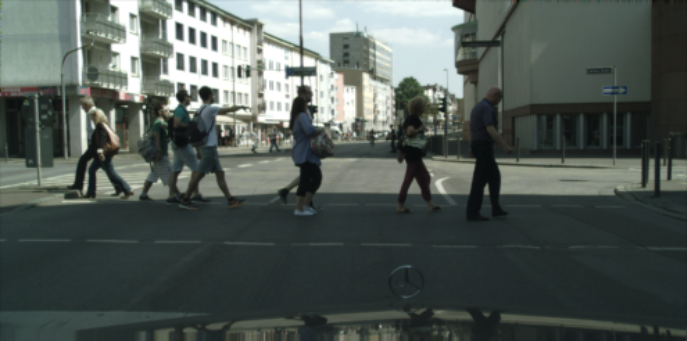
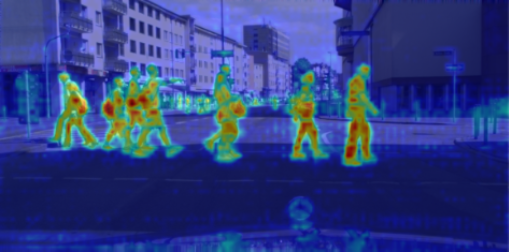
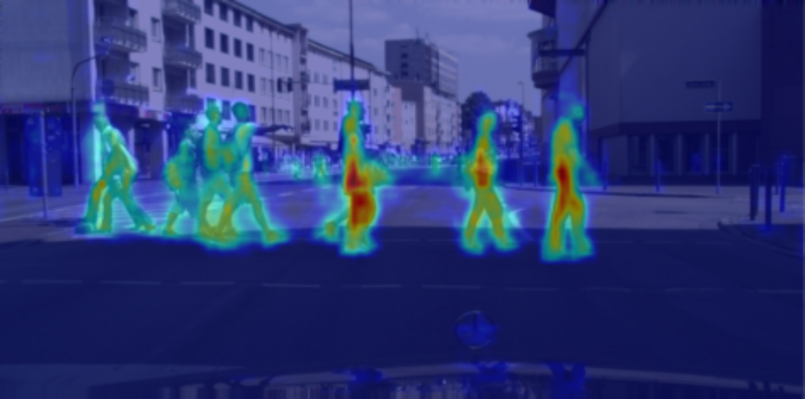
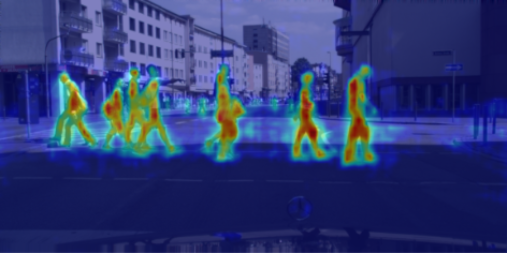

# SWARD: Stochastic Window-Attention-Based Relational Distillation for Cross-Architectural Semantic Segmentation

## 摘要

| 项目 | 内容 |
|---|---|
| 论文标题 | SWARD: Stochastic Window-Attention-Based Relational Distillation for Cross-Architectural Semantic Segmentation |
| 作者 | Aditya Makineni, Qing Tian |
| arXiv ID | 2606.00999v1 |
| 发布时间 | 2026-05-31 |
| 类别 | cs.CV |
| 链接 | http://arxiv.org/abs/2606.00999v1 |
| 报告依据 | PDF 全文与摘要，文本抽取状态为 fulltext:pypdf |
| 代码状态 | 论文全文未提供可确认的公开代码链接；代码段与源码对应分析证据不足 |

一句话总结：SWARD 面向 Transformer / foundation teacher 与 CNN lightweight student 的跨架构语义分割蒸馏，通过随机移位窗口注意力关系对齐 MWAD 与原型判别正则 PDR，在 Cityscapes 与息肉分割数据集上提升轻量学生模型表现，核心目标是把教师的空间关系与类别判别结构转移给部署友好的学生网络（见 PAGE 1, PAGE 2, PAGE 14）。

本文的核心贡献可以压缩为两个部分。第一，Multi-Scale Windowed Attention Distillation（MWAD，多尺度窗口注意力蒸馏）不再直接要求 CNN 学生模仿 Transformer 教师的原始 feature activation，而是在多尺度、局部窗口内对齐 attention、value 和 context 三类关系量（见 PAGE 5-PAGE 7）。第二，Prototype Discriminative Regularization（PDR，原型判别正则）显式塑造学生特征空间，使类内更紧凑、类间更分离，从而补足小容量学生仅靠关系模仿难以继承教师判别几何的问题（见 PAGE 7-PAGE 8）。

表格解读：上面的元信息表给出本文分析的证据边界。需要特别强调的是，论文提供了完整方法公式、实验设置、主实验与消融结果，但没有在正文、页脚或参考信息中给出代码仓库，因此本文不会伪造源码片段，也不会把方法公式当作实现代码。

## 背景与动机

语义分割（semantic segmentation）的目标是为图像中每一个像素预测类别标签。与图像分类只输出图像级标签不同，语义分割要求模型同时保持语义识别能力与空间定位能力，因此对 dense prediction 中的边界、细小结构、局部区域一致性和长程上下文都有要求。论文开篇指出，大规模 vision foundation models 在 semantic segmentation、object detection 等 dense prediction 任务上表现强，但模型规模和计算开销使其难以部署到资源受限场景，例如自动驾驶和医学影像（见 PAGE 1）。

知识蒸馏（knowledge distillation, KD）的基本动机是用 heavy teacher 训练 lightweight student，让小模型继承大模型能力。经典 KD 在分类任务中相对直接，因为输出空间较低维，模型只需学习类别概率或 logits 分布。但 dense prediction 的蒸馏更困难：像素的语义权重并不均匀，简单的 pixel-wise mimicry 会稀释对结构依赖最关键的信息，难以保留局部预测所需的空间关系（见 PAGE 1-PAGE 2）。

本文强调的真正难点是 cross-architectural mismatch，即教师与学生架构异质。现代强教师往往是 Transformer-based 或 hybrid foundation architecture，依赖 self-attention 编码长程依赖与 token-wise relational structure；而高效学生通常是 CNN，例如 MobileNetV3、ResUNet++、UNeXt 一类部署友好的网络，其 inductive bias 更偏向局部感受野和层级卷积特征（见 PAGE 2, PAGE 9-PAGE 10）。这意味着教师和学生的中间特征即使空间分辨率相近，也未必表达同一种结构。

既有 dense-prediction KD 多数默认教师和学生架构相容，可以通过 feature reconstruction、attention transfer、cross-image relational distillation、region-aware distillation 等方式对齐中间表示。但论文指出，这些方法在异构架构下存在限制：直接特征模仿难以桥接 Transformer 的全局关系表示与 CNN 的局部层级表示，投影到共享 latent space 或 logit space 的方法又可能丢失像素级预测所需的空间细节（见 PAGE 3）。

SWARD 的出发点是：对跨架构语义分割蒸馏而言，学生不一定需要复制教师的绝对 activation，而应学习教师在局部区域内如何组织 token-to-token relation、如何聚合上下文，以及如何形成可分离的类别特征空间。论文原文中的关键词包括 “window boundary bias”、“attention, value, and context losses” 与 “well-separated, compact class clusters”，分别对应随机窗口、三重关系蒸馏和 PDR 的核心设计（见 PAGE 6-PAGE 8, PAGE 14）。

## 预备知识

知识蒸馏中的 teacher-student formulation 可以表示为：教师网络 $T$ 先在任务上具有强性能，学生网络 $S$ 在训练时同时接受任务监督与教师监督，最终推理时只保留学生网络。本文的 teacher 是 frozen attention-based teacher，student 是 trainable convolutional student；这种设计保证推理阶段仍由轻量学生承担计算，蒸馏模块主要服务于训练（见 PAGE 4-PAGE 5）。

注意力关系（attention relation）在本文中不是泛指模型是否有 Transformer 层，而是指在一个局部窗口内，把空间位置看作 tokens，通过 query、key、value 投影计算 pairwise attention matrix。对 CNN 学生而言，它原本没有显式 QKV；SWARD 用轻量 1×1 convolution 将教师和学生特征都投影到共享 relational basis，使两者可以在同一窗口内比较 attention、value 和 context（见 PAGE 6-PAGE 7）。

原型判别正则（Prototype Discriminative Regularization, PDR）依赖 class prototype。这里的 prototype 指某个语义类别在学生 encoder feature space 中的 centroid，即把 batch 中属于同一类别的像素特征求平均得到的类别中心 $\mu_k$。PDR 同时要求不同类别 prototype 之间至少相隔一个 margin，并要求同一类别内部的 feature covariance trace 较小，从而强化 inter-class separation 与 intra-class compactness（见 PAGE 7-PAGE 8）。

## 方法详解

### 总体框架：从直接模仿转向结构关系转移

SWARD 将 distillation formulation 从 direct activation-level mimicking 改写为 structured relational transfer。给定输入图像 $x$，学生网络 $S$ 输出 dense prediction map $\hat{y}$，并在 $N$ 个 stage 提取多尺度中间特征 $\{f_s^i\}_{i=1}^{N}$；教师网络 $T$ 提取对应尺度特征 $\{f_t^i\}_{i=1}^{N}$。其中 $f_s^i$ 表示学生第 $i$ 层级特征，$f_t^i$ 表示教师第 $i$ 层级特征（见 PAGE 4）。

论文 Figure 2 给出整体框架：frozen attention-based teacher 位于上方，trainable convolutional student 位于下方；MWAD 在对应 stage 对齐 teacher-student features，并通过随机移位窗口中的 attention、value、context losses 传递关系结构；PDR 则基于学生特征形成 per-class prototypes，并施加 separation 与 compactness losses。由于本次 figures 只提供 Figure 1 的图片路径，Figure 2 无可嵌入图片，图片证据不足；但其文字 caption 与方法描述见 PAGE 5。

### 1. 多尺度特征对齐：先把异构特征放到同一网格

问题：Transformer teacher 与 CNN student 的 feature map 通道数和空间尺寸往往不同。如果直接计算 feature distance，损失函数会混合通道不匹配、空间不匹配和语义不匹配三个问题，无法明确指导学生学习教师关系结构。

SWARD 首先用 learnable linear projection，也就是 1×1 convolution，把教师通道投影到学生通道空间。论文公式为：

$$
\tilde{f}_t^i=\phi(f_t^i)
$$

其中 $f_t^i \in \mathbb{R}^{C_t^i \times H_t^i \times W_t^i}$ 是教师第 $i$ 个 stage 的特征，$C_t^i$、$H_t^i$、$W_t^i$ 分别表示通道数、高和宽；$\phi(\cdot)$ 是 1×1 convolution，将教师通道 $C_t^i$ 映射到学生通道 $C_s^i$（见 PAGE 5）。人话解释：这一步不是让学生复制教师，而是先把教师特征翻译到学生可比较的通道维度。

空间尺寸则通过 bilinear resampling 对齐到共同分辨率：

$$
(\hat{f}_t^i,\hat{f}_s^i)=\psi(\tilde{f}_t^i,f_s^i)
$$

$$
(\hat{H}_i,\hat{W}_i)=\bigl(\min(H_t^i,H_s^i),\min(W_t^i,W_s^i)\bigr)
$$

其中 $\psi(\cdot)$ 表示双线性重采样，$\hat{H}_i$ 与 $\hat{W}_i$ 是对齐后的高度和宽度（见 PAGE 6）。人话解释：教师和学生都被放到较小的共同空间网格上，避免因为插值到更大尺寸而引入额外虚假细节。

与 Cross-Architecture Knowledge Distillation（CKD）类方法相比，这一步仍保留空间网格，而不是把表示整体投影后进行粗粒度匹配。论文认为 CKD 的 projection 能减少架构间 coarse mismatch，但不显式约束 individual spatial locations，因此对边界、小区域和 location-to-location agreement 仍然不足（见 PAGE 3）。

### 2. 随机移位窗口划分：让局部关系覆盖不同边界

问题：全局 attention relation 对高分辨率 segmentation feature 来说计算量高，并且可能超出 CNN 学生的局部感受野；固定窗口又会制造人工边界，使跨窗口对象结构难以被持续看到。SWARD 的选择是 multi-scale windowed partitioning，并在每次训练迭代随机重采样窗口偏移（见 PAGE 6）。

对第 $i$ 个 stage，窗口大小为 $M_i \times M_i$，对齐后的 feature map 被划分为非重叠窗口：

$$
\mathcal{W}(\hat{f}^i)=\{w_n^i\}_{n=1}^{N_w}
$$

$$
N_w=\frac{\hat{H}_i\hat{W}_i}{M_i^2}
$$

其中 $w_n^i \in \mathbb{R}^{C_s^i \times M_i \times M_i}$ 表示第 $n$ 个局部窗口，$N_w$ 表示窗口数量；若 feature map 不能被 $M_i$ 整除，论文使用 right/bottom zero-padding（见 PAGE 6）。人话解释：把大图切成多个局部小块，让教师与学生在同一空间邻域里比较 token 间关系。

随机移位定义为：

$$
(\Delta x_i,\Delta y_i)\sim \mathcal{U}(0,M_i)
$$

$$
\hat{f}^{i\prime}=\mathrm{Roll}(\hat{f}^i,-\Delta x_i,-\Delta y_i)
$$

其中 $\Delta x_i$ 与 $\Delta y_i$ 是第 $i$ 个 scale 的窗口偏移，$\mathcal{U}(0,M_i)$ 表示从窗口大小范围内采样偏移，$\mathrm{Roll}$ 是 cyclic shift（见 PAGE 6）。人话解释：同一张 feature map 在不同训练迭代会被不同窗口边界切分，因此模型不能只适应某一种固定边界。

与 Swin Transformer 中 deterministic shifted-window attention 不同，SWARD 的 offset 在每个 scale、每个 training iteration 独立采样。论文认为这能减少固定窗口边界偏差，并让学生接触到同一特征的多种 spatial decomposition（见 PAGE 6, PAGE 13-PAGE 14）。

### 3. QKV 关系蒸馏：比较 attention、value 与 context 三个层面

问题：CNN 学生没有原生的 query、key、value attention 表示，不能直接与 Transformer teacher 的 self-attention 对齐。SWARD 的做法是用轻量投影将二者放进同一个 relational basis：

$$
Q_t^i,K_t^i,V_t^i=\Theta_t^i(\hat{f}_t^i),\quad
Q_s^i,K_s^i,V_s^i=\Theta_s^i(\hat{f}_s^i)
$$

其中 $Q$、$K$、$V$ 分别表示 query、key、value；下标 $t$ 表示 teacher，下标 $s$ 表示 student；$\Theta_t^i$ 与 $\Theta_s^i$ 是独立的 1×1 convolutional projections（见 PAGE 6-PAGE 7）。人话解释：即使学生不是 Transformer，也可以通过投影构造一个可比较的局部注意力视角。

局部 scaled attention 定义为：

$$
A_t^i=\mathrm{Softmax}\left(\frac{Q_t^i(K_t^i)^\top}{\sqrt{d_i}}\right),\quad
A_s^i=\mathrm{Softmax}\left(\frac{Q_s^i(K_s^i)^\top}{\sqrt{d_i}}\right)
$$

其中 $A_t^i$ 与 $A_s^i$ 是教师和学生在第 $i$ 个 stage 的窗口内 attention matrix，$d_i$ 是归一化尺度（见 PAGE 7）。人话解释：这个矩阵描述窗口内每个 token 如何关注其他 token，蒸馏的重点从“特征值像不像”转为“空间位置之间的关系像不像”。

上下文向量由 attention 与 value 相乘得到：

$$
Z_t^i=A_t^iV_t^i,\quad Z_s^i=A_s^iV_s^i
$$

其中 $Z_t^i$ 与 $Z_s^i$ 表示教师和学生的 contextual representations（见 PAGE 7）。人话解释：如果 attention 是“看哪里”，value 是“看见了什么”，context 就是“按这种关注方式聚合后的结果”。

MWAD 对三类量分别施加损失。attention loss 使用 KL divergence：

$$
L_{\mathrm{attn}}^i=\mathrm{KL}(A_t^i\Vert A_s^i)
$$

该式让学生窗口内的 pairwise attention distribution 接近教师，转移 relational structure（见 PAGE 7）。人话解释：学生不仅要关注目标区域，还要学习窗口内位置之间的相互依赖模式。

value loss 使用 cosine distance：

$$
L_{\mathrm{val}}^i=1-\frac{\langle V_s^i,V_t^i\rangle}{\Vert V_s^i\Vert_2\Vert V_t^i\Vert_2}
$$

该式对齐 per-token value embeddings 的方向，转移 attention mixing 之前的语义内容（见 PAGE 7）。人话解释：即使数值尺度不同，学生也应在语义方向上接近教师。

context loss 使用 L2 distance：

$$
L_{\mathrm{ctx}}^i=\Vert Z_s^i-Z_t^i\Vert_2^2
$$

该式对齐聚合后的 context vectors，转移教师在窗口内整合信息的方式（见 PAGE 7）。人话解释：学生最终聚合出的上下文表示应接近教师，而不是只学到分散的局部 token。

三项组合为 stage-level MWAD objective：

$$
L_{\mathrm{MWAD}}^i=L_{\mathrm{attn}}^i+L_{\mathrm{val}}^i+L_{\mathrm{ctx}}^i
$$

多尺度聚合为：

$$
L_{\mathrm{MWAD}}=\frac{1}{N}\sum_{i=1}^{N}L_{\mathrm{MWAD}}^i
$$

其中 $N$ 是 stage 数量（见 PAGE 7）。人话解释：SWARD 不只在单一层级对齐关系，而是在多个 resolution 上同时学习局部到较大范围的空间依赖。

### 4. PDR：用原型几何补足小模型的判别结构

问题：MWAD 可以转移教师的关系推理，但轻量学生容量有限，仍可能无法形成像教师一样清晰的 class-wise separability。语义分割对类别边界敏感，如果特征空间中相近类别混在一起，模型容易产生边界模糊、类别混淆和小区域误分（见 PAGE 7）。

PDR 首先为每个 semantic class $k\in\{1,\ldots,K\}$ 计算 centroid vector $\mu_k$。其中 $K$ 是 batch 中出现的语义类别数，$\mu_k$ 是属于类别 $k$ 的学生 encoder features 的均值。类间分离损失为：

$$
L_{\mathrm{sep}}=\frac{2}{K(K-1)}\sum_{i<j}\max(0,m-\Vert \mu_i-\mu_j\Vert_2)
$$

其中 $m$ 是 separation margin（见 PAGE 8）。人话解释：如果两个类别 prototype 距离小于 margin，就会产生惩罚，推动它们在 embedding space 中分开。

类内紧凑性通过 covariance trace 约束。对类别 $k$ 的 feature set $f_k$，其 covariance matrix 为：

$$
\Sigma_k=\frac{1}{|f_k|-1}\sum_{f\in f_k}(f-\mu_k)(f-\mu_k)^\top
$$

compactness loss 定义为：

$$
L_{\mathrm{comp}}=\frac{1}{K}\sum_{k=1}^{K}\mathrm{tr}(\Sigma_k)
$$

其中 $\mathrm{tr}(\cdot)$ 是矩阵 trace，等于类别内各 feature 维度方差之和（见 PAGE 8）。人话解释：同一类别的像素特征应聚得更紧，这有助于稳定边界和区域一致性。

PDR 总目标为：

$$
L_{\mathrm{PDR}}=\lambda_1L_{\mathrm{sep}}+\lambda_2L_{\mathrm{comp}}
$$

其中 $\lambda_1$ 与 $\lambda_2$ 分别平衡类间分离和类内紧凑（见 PAGE 8）。论文强调 PDR 与 Fisher-style discriminative criteria 有关，但不需要矩阵求逆或特征分解，并使用 pairwise prototype separation 而不是 global mean-based scatter，因此更适合高维 dense segmentation feature（见 PAGE 8）。

### 5. 总训练目标：任务损失、关系蒸馏与判别正则联合优化

SWARD 最终训练目标为：

$$
L_{\mathrm{total}}=\alpha L_{\mathrm{task}}+\beta L_{\mathrm{MWAD}}+\gamma L_{\mathrm{PDR}}
$$

其中 $L_{\mathrm{task}}$ 是 segmentation 的标准任务损失，论文说明为 cross-entropy；$\alpha$、$\beta$、$\gamma$ 是三个损失权重（见 PAGE 9）。人话解释：学生仍要学习真实标签，同时接受教师关系结构指导，并被约束形成更清晰的类别特征空间。

论文在实验中设置 $\alpha=1.0$、$\beta=2.0$、$\gamma=1.0$；PDR 内部设置 $\lambda_1=\lambda_2=1.0$，separation margin $m=1.3$（见 PAGE 10）。这说明作者在实验中让 MWAD 权重高于 task loss 和 PDR，反映出本文主要贡献仍是关系蒸馏，PDR 是配套的 feature geometry regularization。

代码分析方面，论文未提供可确认的公开代码，因此本文不写代码段，不推断文件路径，也不将公式伪装成实现。源码对应分析证据不足。

## 实验分析

### 实验设置

论文评估两个 dense prediction domain：urban scene parsing 与 medical image segmentation。城市街景使用 Cityscapes，包含 5,000 张精细标注街景图，训练 / 验证 / 测试分别为 2,975 / 500 / 1,525，覆盖 19 个 semantic classes；训练时动态裁剪到 $512\times1024$，评估时用 full resolution 并通过 bilinear upsampling 得到预测 mask（见 PAGE 9）。

医学分割使用 CVC-ClinicDB 与 CVC-ColonDB 两个息肉分割 benchmark。CVC-ClinicDB 含 612 帧、29 个 colonoscopy sequences，按 80/10/10 划分；CVC-ColonDB 含 300 张图、15 个 sequences，训练 / 验证 / 测试为 240 / 30 / 30，且具有更高 intra-class variability；所有医学图像 resize 到 $512\times512$（见 PAGE 9）。

实现方面，所有实验使用 PyTorch，在单张 NVIDIA A100 80GB GPU 上运行。Cityscapes teacher 为 frozen SAM 2.1 Hiera-L backbone 加 DeepLabV3+ segmentation head，student 为 DeepLabV3+ with MobileNetV3 backbone，output stride 16，训练 40,000 iterations，batch size 16，AdamW 初始学习率 $1\times10^{-3}$、weight decay $1\times10^{-4}$，使用 polynomial learning rate schedule（见 PAGE 9-PAGE 10）。

医学分割 teacher 为 MedSAM2 Hiera-T backbone 加 ResUNet++ segmentation head，student 包括 ResUNet++ 和 UNeXt，训练 200 epochs，batch size 8，AdamW 初始学习率 $5\times10^{-4}$、weight decay $1\times10^{-4}$，使用 cosine annealing（见 PAGE 10）。这些设置说明论文试图覆盖不同 student architecture，但任务仍集中在 semantic segmentation。

### 主实验 1：Cityscapes

| Method | Params (M) | FLOPs (G) | mIoU (%) | mAcc (%) |
|---|---:|---:|---:|---:|
| T: SAM2.1 Hiera-L | 224.45 | 406.01 | 74.61 | 84.01 |
| S: DeepLabV3+ - MBV3-S | 3.30 | 22.60 | 65.05 | 72.86 |
| +CIRKD | 论文表中未单列 | 论文表中未单列 | 66.12 | 73.61 |
| +MasKD | 论文表中未单列 | 论文表中未单列 | 67.58 | 75.12 |
| +FreeKD | 论文表中未单列 | 论文表中未单列 | 67.99 | 75.93 |
| +SWARD | 论文表中未单列 | 论文表中未单列 | 69.97 | 77.75 |

表格解读：SWARD 在 Cityscapes 上达到 69.97% mIoU 和 77.75% mAcc，相比从头训练学生的 65.05% mIoU 提升 4.92 points；相比最强 baseline FreeKD 的 67.99% mIoU 仍高 1.98 points（见 PAGE 10）。教师与学生差距为 74.61 - 65.05 = 9.56 mIoU points，SWARD 恢复约 4.92 / 9.56，即约一半差距；论文也明确称其只使用约 1.5% 教师参数和约 5.6% 教师 FLOPs（见 PAGE 10）。

这一结果支持 SWARD 的核心假设：在异构 teacher-student 设置中，普通 dense KD 方法仍能提升学生，但直接或间接的 feature mimicry 不能充分传递 Transformer teacher 的局部关系结构。MWAD 的 window relation matching 与 PDR 的 discriminative shaping 组合，使学生在保持轻量结构的同时获得更强 spatial reasoning 与 semantic organization（见 PAGE 10）。

### 主实验 2：息肉分割

| Method | Params (M) | FLOPs (G) | CVC-ClinicDB mDice (%) | CVC-ClinicDB mIoU (%) | CVC-ColonDB mDice (%) | CVC-ColonDB mIoU (%) |
|---|---:|---:|---:|---:|---:|---:|
| T: MedSAM2 | 38.96 | 55.38 | 94.60 | 90.29 | 93.03 | 87.36 |
| S: ResUNet++ | 4.06 | 126.84 | 89.53 | 85.27 | 68.05 | 57.96 |
| +CIRKD | 论文表中未单列 | 论文表中未单列 | 91.39 | 85.21 | 78.12 | 70.81 |
| +MasKD | 论文表中未单列 | 论文表中未单列 | 90.62 | 84.32 | 77.52 | 69.83 |
| +FreeKD | 论文表中未单列 | 论文表中未单列 | 91.61 | 85.77 | 85.92 | 78.57 |
| +SWARD | 论文表中未单列 | 论文表中未单列 | 94.45 | 90.03 | 88.49 | 80.90 |
| S: UNeXt | 1.47 | 4.63 | 90.02 | 84.21 | 80.65 | 72.70 |
| +CIRKD | 论文表中未单列 | 论文表中未单列 | 91.07 | 84.85 | 83.08 | 74.16 |
| +MasKD | 论文表中未单列 | 论文表中未单列 | 91.72 | 86.01 | 82.83 | 73.09 |
| +FreeKD | 论文表中未单列 | 论文表中未单列 | 91.51 | 85.18 | 83.17 | 74.58 |
| +SWARD | 论文表中未单列 | 论文表中未单列 | 93.23 | 87.78 | 85.30 | 77.42 |

表格解读：在 CVC-ClinicDB 上，ResUNet++ student 经 SWARD 后 mDice 达 94.45%，几乎追平 teacher 的 94.60%；在更困难的 CVC-ColonDB 上，ResUNet++ student 从 68.05% mDice 提升到 88.49%，提升 20.44 points（见 PAGE 11）。UNeXt student 更轻量，参数仅 1.47M、FLOPs 4.63G，但 SWARD 仍在两个数据集上超过 CIRKD、MasKD 与 FreeKD（见 PAGE 11）。这说明 SWARD 对不同 CNN-like student 有一定泛化性，但证据范围仍限于 segmentation。

需要谨慎解读的是，ResUNet++ student 在表中 FLOPs 为 126.84G，高于 MedSAM2 teacher 的 55.38G（见 PAGE 11）。因此“轻量”在医学实验中并不完全等同于 FLOPs 更低；论文对 ResUNet++ 的论证更偏向参数量减少，而 UNeXt 才同时体现参数和 FLOPs 的低开销优势。

### 定性证据：Figure 1 的 Grad-CAM 可视化

用途：下图作为 Figure 1 的输入图局部，用于说明 Grad-CAM 对比发生在同一 Cityscapes 街景样例上；该图本身不证明 SWARD 优于 baseline，只提供可视化比较的原始场景背景（见 PAGE 2）。

读图要点：图中存在行人、道路、建筑、交通标志等多个细粒度街景对象，属于语义分割中容易出现小目标与边界混淆的场景。支撑的判断：论文选择该样例用于展示 attention focus 是否覆盖目标对象更完整，符合其 dense prediction spatial structure 的问题设定（见 PAGE 2）。

用途：下图来自 Figure 1 的 Grad-CAM 对比组，用于观察强教师或蒸馏模型在 Cityscapes 样例中对行人区域的关注分布；由于本次材料提供的是裁切图路径而非完整 Figure 1 排版，列身份以论文 caption 的从左到右说明为依据（见 PAGE 2）。

读图要点：热力图主要覆盖行人身体区域，并对远处小目标有一定响应。支撑的判断：Figure 1 caption 明确称 SWARD 相比 baseline student 能产生更完整、更好定位的 target object coverage，并更接近 teacher（见 PAGE 2）。该图用于支撑论文关于 attention-centric transfer 的定性主张，但不能替代表格中的 quantitative evidence。

用途：下图继续作为 Figure 1 的 Grad-CAM 对比面板，用于比较 baseline student 与 SWARD 在同一输入下的关注完整性差异；图像路径来自用户提供 figures，不引入额外图片（见 PAGE 2）。

读图要点：热区集中于主要行人轮廓，但部分行人和远处区域覆盖相对不均。支撑的判断：论文在 PAGE 2 明确描述 baseline student 往往只覆盖 object 的部分区域，而 distilled student 的 coverage 更完整。该图与 Figure 1 caption 共同支持 SWARD 改善目标关注范围的说法。

用途：下图作为 Figure 1 的最后一个提供面板，用于展示 SWARD 相关 Grad-CAM 结果；它服务于定性解释，而不是新增实验指标（见 PAGE 2）。

读图要点：热力区域覆盖多个人体目标，并在轮廓附近形成连续响应。支撑的判断：这与论文对 Figure 1 的说明一致，即 SWARD 的关注区域更接近 teacher，并比 baseline student 更完整、更好定位（见 PAGE 2）。但由于本次只提供 PAGE 2 的 Figure 1 图像路径，Figure 2、Figure 3、Figure 4 无法嵌入，图片复现证据不足。

论文还在 Figure 3 中展示 segmentation predictions：Cityscapes 样例中 baseline 对 light pole、traffic sign、fence 等细结构有噪声或漏检，FreeKD 略好但未完全恢复形状，SWARD 更接近 teacher；在息肉样例中，baseline 出现 jagged、fragmented boundaries 和 false-positive blob，SWARD 更能保持 lesion shape（见 PAGE 11-PAGE 12）。由于 figures 列表未提供 Figure 3 的 markdown_path，本文只引用文字证据，不嵌入图片。

Figure 4 展示 Cityscapes validation set 的 t-SNE feature space。论文描述 baseline student 中 person、rider、motorcycle、bicycle 等类别高度交叠；加入 MWAD 后 cluster arrangement 更接近 teacher；加入 PDR 后 cluster separation 更干净，若干相近类别甚至比 teacher 更分离（见 PAGE 12-PAGE 13）。这一点直接支撑 PDR 的设计目标：在关系对齐之外，显式塑造学生的判别几何。

### 消融实验 1：MWAD 与 PDR 的组成贡献

| Method | mDice (%) | mIoU (%) |
|---|---:|---:|
| T: MedSAM2 | 93.03 | 87.36 |
| S: ResUNet++ | 68.05 | 57.96 |
| +MWAD Attention only | 73.19 | 63.77 |
| +MWAD Attn + Value | 80.17 | 72.04 |
| +MWAD Attn + Value + Context | 87.02 | 79.58 |
| +MWAD + PDR | 88.49 | 80.96 |

表格解读：attention alignment alone 将 ResUNet++ student 的 CVC-ColonDB mDice 从 68.05% 提升到 73.19%，说明局部关系结构本身已经具有强蒸馏价值；加入 value alignment 后提升到 80.17%，表明 per-token semantic content 对分割质量很关键；再加入 context alignment 后达到 87.02%，说明聚合后的上下文表示对复杂边界和小目标也有贡献；最终 PDR 提升到 88.49%，证明 feature geometry regularization 与 MWAD 互补（见 PAGE 12-PAGE 14）。

一个细节需要记录：Table 2 中 ResUNet++ + SWARD 在 CVC-ColonDB 的 mIoU 为 80.90，而 Table 3 与 Table 4 中对应最终结果为 80.96（见 PAGE 11, PAGE 14）。这是论文表格间的轻微数值不一致，本文按各表原文分别记录，不自行修正。

### 消融实验 2：窗口移位策略

| Window Strategy | mDice (%) | mIoU (%) |
|---|---:|---:|
| No Shifting | 86.17 | 78.83 |
| Deterministic Shifting | 87.91 | 79.99 |
| Stochastic Shifting | 88.49 | 80.96 |

表格解读：无移位窗口达到 86.17% mDice，说明局部窗口关系蒸馏本身已经有效；deterministic shifting 提升到 87.91%，说明跨窗口交互缓解了固定边界问题；stochastic shifting 进一步达到 88.49%，说明每次迭代和每个 scale 重采样 offset 可以提供更多样的 relational contexts，并降低模型对单一窗口划分的依赖（见 PAGE 13-PAGE 14）。

该消融直接支撑 SWARD 中 “Stochastic” 的必要性。若随机移位仅是训练噪声，它不应稳定优于 deterministic shifting；但 Table 4 显示其 mDice 高 0.58 points、mIoU 高 0.97 points。尽管提升幅度小于 MWAD 三项损失的主要贡献，但它为窗口边界偏差问题提供了实验证据（见 PAGE 14）。

## 讨论

SWARD 最适合的应用边界是：teacher 具有强 attention-based 或 foundation-model 表示，student 是部署导向的 CNN 或轻量架构，任务是对空间结构敏感的 dense prediction，尤其是 semantic segmentation。论文的两个实验域分别覆盖 urban scene parsing 与 medical image segmentation，说明方法不只依赖单一自然图像场景（见 PAGE 9-PAGE 11）。

从部署视角看，Cityscapes 实验更直接支持“小模型/部署”价值：MobileNetV3 student 只有 3.30M 参数和 22.60G FLOPs，而 teacher 为 224.45M 参数和 406.01G FLOPs；SWARD 在保持学生推理结构的前提下提升 mIoU（见 PAGE 10）。医学实验中，UNeXt student 也体现低参数与低 FLOPs；ResUNet++ 则参数较少但 FLOPs 高于 teacher，因此不能简单概括为全实验都降低 FLOPs（见 PAGE 11）。

本文尚未解决的问题主要有三类。第一，方法只在语义分割上验证，没有对 object detection、keypoint detection、classification 或 panoptic segmentation 给出证据，因此其 cross-architectural dense prediction 泛化仍需额外实验。第二，论文给出参数量与 FLOPs，但未报告真实设备延迟、显存占用、训练额外开销或窗口大小对训练时间的影响；MWAD 的 QKV 投影、窗口 attention 和随机移位都发生在训练阶段，实际训练成本仍需要实现级评估（见 PAGE 9-PAGE 14）。第三，PDR 基于 batch-level class statistics，若 batch 中类别稀疏、长尾类别极少或 label noise 较强，prototype estimation 的稳定性可能受影响；论文没有专门报告长尾类别或小样本类别分析（见 PAGE 8-PAGE 14）。

对未来工作而言，SWARD 的启示不在于某个单独损失，而在于跨架构蒸馏应从“feature value 对齐”转向“relation / geometry 对齐”。对于人像解析、可行驶区域分割、语义 mask 自动标注和轻量分割模型压缩等业务方向，可以借鉴 MWAD 的局部关系蒸馏与 PDR 的类别几何约束；但这些应用迁移是基于方法机制的合理外推，不是论文已验证结论。

## 局限分析

作者没有设置独立的 Limitations section，因此严格意义上的“作者自述局限”证据不足。能够从论文正文直接确认的是实验范围边界：作者只声称在 urban scene parsing 与 medical image segmentation 两类 semantic segmentation 应用中验证，并没有声明已覆盖 detection、classification、keypoint 或其他 dense prediction 任务（见 PAGE 9-PAGE 11, PAGE 14）。

第一项独立判断局限是代码不可复核。论文全文和给定元信息都没有提供可确认的公开代码仓库，因此无法检查 MWAD 的窗口采样是否为整数 offset、padding 与 Roll 的具体实现、QKV 投影维度、各 stage window size、损失归一化方式、PDR 在类别缺失时的处理逻辑等关键工程细节。代码段证据不足。

第二项独立判断局限是训练成本与推理收益没有被完整分离。论文强调推理时保留学生效率，并给出参数量和 FLOPs；但没有报告训练阶段 MWAD/PDR 的额外计算、wall-clock time、显存开销或与 baseline KD 的训练成本对比（见 PAGE 9-PAGE 14）。如果团队关注快速迭代或大规模自动标注训练成本，这部分仍需实测。

第三项局限是医学分割实验的样本规模较小。CVC-ClinicDB 为 612 帧，CVC-ColonDB 为 300 张图，虽然是常用 benchmark，但数据规模和采集分布有限；论文没有报告跨医院、跨设备、外部验证集或 domain shift 下的结果（见 PAGE 9-PAGE 11）。因此不能仅凭该结果断言其在真实临床部署中具有同等稳健性。

第四项局限是部分表格数值存在轻微不一致。CVC-ColonDB 上 ResUNet++ + SWARD 的 mIoU 在 Table 2 为 80.90，而 Table 3 和 Table 4 为 80.96（见 PAGE 11, PAGE 14）。该差异不影响总体结论，但说明复现实验时需要以代码、日志或作者说明进一步核对。

## 结论

SWARD 的主要贡献是为 cross-architectural semantic segmentation distillation 提供了一套结构化方案：先通过 channel projection 与 spatial resizing 建立共同网格，再在多尺度随机移位窗口内对齐 attention、value、context 三类关系，最后用 PDR 强化学生特征空间的 inter-class separation 与 intra-class compactness。它避免了直接 feature mimicry 在 Transformer teacher 与 CNN student 之间的表达不匹配问题（见 PAGE 4-PAGE 9）。

实验上，SWARD 在 Cityscapes、CVC-ClinicDB 与 CVC-ColonDB 上均优于 CIRKD、MasKD、FreeKD 等对比方法；消融实验表明 attention、value、context 三项 MWAD loss 和 PDR 都有贡献，stochastic shifting 也优于 no shifting 与 deterministic shifting（见 PAGE 10-PAGE 14）。在证据边界内，本文是一篇对轻量语义分割蒸馏有参考价值的工作，尤其适合关注 foundation teacher 到 deployable CNN student 迁移的团队跟进。

## 证据索引

| PAGE | 关键证据 |
|---|---|
| PAGE 1 | 摘要、任务动机、foundation models 规模与资源受限部署问题、SWARD 两个组件 MWAD 与 PDR 的概述 |
| PAGE 2 | Figure 1 Grad-CAM caption；语义分割中像素权重不均、直接 mimicry 稀释结构依赖；Transformer teacher 与 CNN student 的架构差异 |
| PAGE 3 | Related Work：CKD、information flow modeling、OFA-KD 等异构蒸馏方法的局限；随机 shifted-window relation distillation 的研究空白 |
| PAGE 4 | PDR 的相关工作背景；Methodology 总体 formulation；teacher-student multi-scale features 与异构架构定义 |
| PAGE 5 | Figure 2 caption；MWAD 总体说明；公式 (1) 通道投影 |
| PAGE 6 | 公式 (2)-(8)：空间对齐、窗口划分、窗口数量、随机 offset、Roll shift、QKV 投影 |
| PAGE 7 | 公式 (9)-(15)：局部 scaled attention、context、attention/value/context losses、MWAD 聚合；PDR 动机 |
| PAGE 8 | 公式 (16)-(19)：prototype separation、covariance compactness、PDR 总目标；与 Fisher-style criteria 的差异 |
| PAGE 9 | 公式 (20) 总训练目标；Cityscapes、CVC-ClinicDB、CVC-ColonDB 数据集设置；Cityscapes teacher-student 配置 |
| PAGE 10 | Cityscapes Table 1；训练超参数；loss weights；SWARD 在 Cityscapes 上的 mIoU/mAcc 提升与参数/FLOPs 比例 |
| PAGE 11 | Polyp segmentation Table 2；ResUNet++ 与 UNeXt 两类学生结果；CVC-ClinicDB 与 CVC-ColonDB 主实验 |
| PAGE 12 | Figure 3 segmentation prediction qualitative analysis；Figure 4 t-SNE visualization 起始说明 |
| PAGE 13 | Figure 4 进一步分析；MWAD 与 PDR 对 feature space separation 的作用；消融实验背景 |
| PAGE 14 | Table 3 MWAD/PDR component ablation；Table 4 window strategy ablation；Conclusion 中对 SWARD 贡献和实验结论的总结 |
| PAGE 15-PAGE 18 | 参考文献列表，用于确认相关工作引用范围；未发现公开代码链接 |
