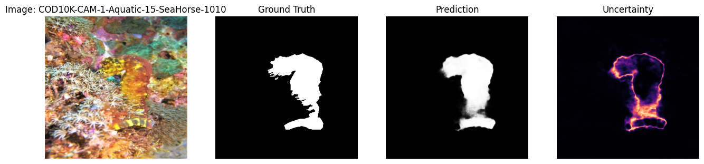
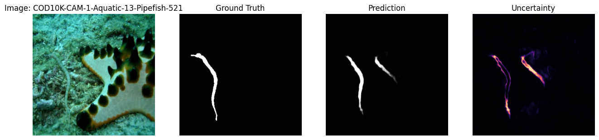

# COD10K-C: Benchmarking Robustness of Camouflaged Object Detection Under Natural Image Corruptions

## 论文元信息

| 条目 | 内容 |
|---|---|
| 标题 | COD10K-C: Benchmarking Robustness of Camouflaged Object Detection Under Natural Image Corruptions |
| 作者 | Arafat Hossain Sayem |
| arXiv ID | 2606.02603 |
| 发布时间 | 2026-06-03 |
| 类别 | cs.CV |
| 论文链接 | https://arxiv.org/abs/2606.02603 |
| PDF 链接 | https://arxiv.org/pdf/2606.02603 |
| 代码状态 | 本文未提供可确认的公开代码；论文仅说明未来将发布 COD10K-C GitHub 仓库，见 PAGE 1 与 PAGE 6 |
| 报告依据 | PDF 全文与摘要，文本抽取状态为 fulltext:pypdf |

一句话总结：本文提出 COD10K-C，用 8 类自然图像退化、5 个严重程度系统评测伪装目标检测（Camouflaged Object Detection, COD）模型的腐蚀鲁棒性，并表明干净测试集上的高分并不能可靠预测模糊、噪声、压缩、天气等真实退化场景下的性能，见 PAGE 1、PAGE 2、PAGE 4。

## 摘要

COD10K-C 的核心问题非常明确：现有伪装目标检测方法主要在干净图像上评测，而真实成像系统往往包含运动模糊、传感器噪声、天气影响与 JPEG 压缩伪影。论文在引言中指出标准 benchmark 通常假设 “test images are clean”，但这一假设与野外相机、监控视频、医学内窥镜等部署环境并不一致，见 PAGE 1。

本文基于 COD10K 构建腐蚀鲁棒性 benchmark。COD10K-C 使用 COD10K 的 2,026 张测试图像，对每张图像施加 8 类 corruption（图像退化）和 5 个 severity level（严重程度），得到 40 个评测条件与 81,040 个 evaluation pairs，见 PAGE 1 与 PAGE 2。这里的 corruption 覆盖 geometric corruptions（几何/空间结构相关退化）与 photometric corruptions（光度/像素值相关退化）两类，具体包括 Gaussian noise、motion blur、Gaussian blur、brightness、contrast、fog、JPEG compression 与 rain，见 PAGE 2。

实验对象包括三个已有 COD 模型 SINet-v2、PFNet、ZoomNet，以及作者提出的轻量模型 RobustCODLite，见 PAGE 1 与 PAGE 3。结果显示所有模型在 corrupted images 上都出现明显性能下降，尤其是 motion blur 与 Gaussian blur 对 Dice 分数破坏最强；摘要中给出的例子是 SINet-v2 在 motion blur 下损失 18.5 个 Dice points，见 PAGE 1。相对而言，brightness 与 fog 对模型影响较小，见 PAGE 1 与 PAGE 4。

RobustCODLite 的设计包括 corruption augmentation（腐蚀增强）、frequency-prior branch（频率先验分支）和 uncertainty-consistency loss（不确定性一致性损失），见 PAGE 1、PAGE 2、PAGE 3。它在 corrupted 条件下保留了 92.3% 的 clean Dice，而 SINet-v2、ZoomNet、PFNet 分别保留 87.7%、84.8%、84.1%，见 PAGE 1 与 PAGE 3。这说明 RobustCODLite 并非在干净图像上绝对领先，而是在分布偏移和自然退化下具有更高鲁棒性。

需要强调的是，论文未提供可确认的公开代码链接。文中仅说明未来将发布 “COD10k-C GitHub repo”，见 PAGE 1；结论部分也再次说明将公开 COD10K-C 以支持后续研究，见 PAGE 6。因此本文不提供源码片段，也不做文件路径级代码对应分析。证据不足。

## 背景与动机

Camouflaged Object Detection（伪装目标检测，COD）关注在复杂背景中定位与分割外观高度融入环境的目标，例如森林地表上的捕食者、树皮上的昆虫、穿着伪装服的人员等，见 PAGE 1。与一般显著目标检测相比，COD 的难点在于目标与背景之间的颜色、纹理和边界差异都很弱，模型必须依赖细粒度局部纹理、边界梯度和多尺度上下文来区分目标区域。

论文指出 COD 近年来进展很快，现代方法在标准 COD10K 测试集上可以达到 Dice 高于 0.73、S-measure 接近 0.90 的水平，见 PAGE 1。然而，这类进展建立在一个脆弱前提之上：测试图像是干净、稳定且无明显退化的。作者特别提到真实相机会遇到 “blur, sensor noise, weather effects, and compression artifacts”，见 PAGE 1。这些因素会直接影响 COD 所依赖的局部纹理和边界线索。

在更广泛的视觉鲁棒性研究中，ImageNet-C 已经证明干净图像分类准确率并不是 blur、noise、weather corruption 下性能的可靠预测指标，见 PAGE 1。后续类似 benchmark 已扩展到 object detection（目标检测）、semantic segmentation（语义分割）和 depth estimation（深度估计），见 PAGE 1 与 PAGE 7。论文的动机是：COD 领域尚缺少类似 corruption robustness benchmark，见 PAGE 1 与 PAGE 2。

这个空缺在 COD 中尤其重要。伪装目标的可见性本来就低，退化带来的边界模糊、纹理破坏和局部对比度下降会进一步削弱目标线索。论文主结果明确指出，COD 模型对 blur 与 noise 的敏感性远高于 photometric corruptions，且一个在 clean COD10K 上达到 0.73 Dice 的模型，在 moderate motion blur 下可能下降到 0.55 Dice，见 PAGE 1。这说明 clean benchmark 上的排序可能无法代表部署环境中的排序。

从应用价值看，COD10K-C 更适合作为鲁棒性回归测试基准，而不是直接面向通用行人、车辆或人脸检测的模型落地方案。原因是 COD 的目标类别与常规业务检测类别存在域差异，但 corruption 评测思想可以迁移到摄像头模糊、噪声、天气、压缩等退化场景下的检测鲁棒性验证。这个迁移判断基于论文对真实相机退化的动机论述，见 PAGE 1，但具体业务类别上的效果仍需要额外实验证据。

## 预备知识

COD10K-C 使用五类指标评测模型：Dice、IoU、MAE、Boundary F1 与 ECE，见 PAGE 2。其中 Dice 衡量预测 mask 与真实 mask 的重叠程度；IoU（Intersection over Union，交并比）在二值 mask 上计算交集与并集比例；MAE（Mean Absolute Error，平均绝对误差）衡量预测概率图与真实 mask 的像素级差异；Boundary F1 衡量边界区域的空间精度；ECE（Expected Calibration Error，期望校准误差）衡量模型置信度与实际正确性的匹配程度，见 PAGE 2。

论文给出的 Dice 公式为：

$$
\mathrm{Dice}(P,G)=\frac{2|P\cap G|}{|P|+|G|}
$$

其中 $P$ 表示模型预测区域，$G$ 表示 ground-truth mask（真实标注区域），$|P\cap G|$ 表示预测与真实区域的交集面积。这个公式的含义是：如果预测区域与真实目标区域高度重合，Dice 接近 1；如果预测偏离目标或漏检严重，Dice 会下降，见 PAGE 2。

论文还报告 $\Delta\mathrm{Dice}$，定义为 corrupted Dice 减去 clean Dice，见 PAGE 2。这个指标直接刻画退化图像相对干净图像带来的性能损失。由于本文关注 robustness（鲁棒性）而不只是 clean accuracy（干净图像性能），$\Delta\mathrm{Dice}$ 与 retention ratio（保留率，即 corrupted Dice / clean Dice）比单独的 clean Dice 更能解释模型是否适合真实退化场景，见 PAGE 3 与 PAGE 4。

COD10K-C 的 corruption 可分为两类。Geometric corruptions 改变空间结构或局部频率，包括 Gaussian noise、motion blur 与 Gaussian blur；Photometric corruptions 主要改变像素值而不直接破坏空间结构，包括 brightness、contrast、fog、JPEG compression 与 rain，见 PAGE 2。虽然论文将 rain 放在 8 类 corruption 之一，但实验分析中指出 rain 同时引入 streaks 与 mild blur，因此比纯 brightness、contrast、fog 更具破坏性，见 PAGE 4。

## 方法详解

### COD10K-C benchmark 构建

COD10K-C 的第一个贡献是将 COD10K 的测试集扩展为腐蚀鲁棒性评测集合。COD10K 原始数据集包含 10,000 张图像和 78 个目标类别，标准划分为 6,000 张训练图像与 4,000 张测试图像；本文评测使用 Fan 等人选出的 2,026 张 test subset，覆盖 aquatic、flying、terrestrial、amphibian 等类别，见 PAGE 2。论文还强调这些目标通常较小且边界不规则，因此更容易受到图像退化影响，见 PAGE 2。

COD10K-C 的组合规模来自如下构造：

$$
2026 \times 8 \times 5 = 81040
$$

这里 $2026$ 是测试图像数量，$8$ 是 corruption types 数量，$5$ 是 severity levels 数量。这个乘积表示每张测试图像会在 8 类退化、5 个强度下生成评测样本，因此总计 81,040 个 evaluation pairs，见 PAGE 2。这个公式不是模型训练损失，而是 benchmark 规模的直接计算。

具体 corruption 参数具有可复现实验含义。Gaussian noise 使用 $\sigma \in \{8,16,24,32,40\}$；motion blur 使用水平 kernel 且 $k\in\{3,5,7,9,11\}$；Gaussian blur 使用 radius $\in\{0.8,1.2,1.6,2.0,2.5\}$；brightness 与 contrast 使用 factor $\in\{0.85,0.70,0.55,0.40,0.30\}$；fog 使用白色画布 additive blending 且 $\alpha\in\{0.12,0.20,0.28,0.36,0.44\}$；JPEG quality 为 $\{70,55,40,30,20\}$；rain 使用不同 density 与 length 的 synthetic streaks，见 PAGE 2。参数集明确是本文作为 benchmark 的关键可复现性基础。

### RobustCODLite 架构

RobustCODLite 是一个 U-Net style segmentation network（U-Net 风格分割网络），encoder 使用 EfficientNet-B0，并从 ImageNet pretrained weights 初始化，见 PAGE 2。模型从五个空间尺度取 feature maps，stride 分别为 2、4、8、16、32，channel widths 为 $\{16,24,40,112,320\}$，见 PAGE 2。与 SINet-v2、ZoomNet 等 ResNet-50 backbone 模型相比，RobustCODLite 约 7.2M 参数，而 SINet-v2 与 ZoomNet 使用 30M 以上参数，见 PAGE 3 与 PAGE 6。

Decoder 采用逐级上采样链。每一阶段使用 bilinear interpolation 将当前 feature map 上采样，与 encoder 的 skip connection 对齐后拼接，再经过 ConvBNAct block；该 block 包含两个 $3\times3$ convolution，每个 convolution 后接 batch normalization 与 SiLU activation，见 PAGE 2。decoder 输出通道为 $\{256,128,96,64,32\}$，对应 strides $\{32,16,8,4,2\}$，见 PAGE 2。

RobustCODLite 的关键结构之一是 frequency prior branch（频率先验分支）。论文给出的高频残差为：

$$
F(x)=\left|x-\mathrm{AvgPool}_{5\times5}(x)\right|_{\mathrm{mean\ channel}}
$$

其中 $x$ 表示输入图像，$\mathrm{AvgPool}_{5\times5}$ 表示 $5\times5$ 平均池化，$|\cdot|$ 表示取绝对残差，mean channel 表示跨通道平均得到单通道图。这个公式的含义是：先用平滑操作去除局部高频，再用原图减去平滑图提取边缘、纹理等高频信息，见 PAGE 2。论文认为伪装目标与背景外观相似，边缘与纹理线索对分割尤其重要，见 PAGE 2。

该 frequency residual 被送入 16-channel ConvBNAct block 并上采样到 full resolution，再与 32-channel decoder output 拼接，最后由 $ConvBNAct(48\rightarrow32)$ fusion block 融合，见 PAGE 2。这个设计与普通 U-Net 的差异在于，它显式引入高频空间先验，而不完全依赖 encoder-decoder 自身从数据中隐式学习边界线索。

模型输出包含两个 $1\times1$ head：一个输出 segmentation logit map（分割 logit 图），另一个输出 uncertainty logit map（不确定性 logit 图），两者均为 full input resolution，见 PAGE 3。这意味着 RobustCODLite 不只预测目标区域，也预测自身在哪些区域可能出错，为后续 uncertainty-consistency loss 提供权重。

### 训练目标

Segmentation loss 同时用于 clean inputs 与 corrupted inputs。论文给出：

$$
L_{\mathrm{seg}}=\mathrm{BCE}(\hat{m},m)+L_{\mathrm{dice}}(\hat{m},m)
$$

其中 $m$ 是 ground-truth mask，$\hat{m}$ 是 predicted logit map，$\mathrm{BCE}$ 是 binary cross entropy，$L_{\mathrm{dice}}$ 是 soft Dice loss，见 PAGE 3。这个公式的直观含义是：BCE 约束像素级二分类概率，Dice loss 直接优化预测区域与真实区域的重叠质量。

Boundary loss 用于保留边界结构。论文先用 max pooling based dilation 和 erosion 提取预测 mask 与真实 mask 的 boundary maps，然后最小化二者的 $L_1$ 距离：

$$
L_{\mathrm{bdry}}=\|\partial \hat{m}-\partial m\|_1
$$

其中 $\partial\hat{m}$ 表示预测边界，$\partial m$ 表示真实边界，$\|\cdot\|_1$ 表示绝对值求和，见 PAGE 3。这个公式的含义是：模型不仅要把目标主体分出来，还要让预测边界尽量贴近真实边界。

Uncertainty loss 训练不确定性 head 去预测分割错误。论文给出：

$$
L_{\mathrm{unc}}=\mathrm{BCE}(\hat{u},|\sigma(\hat{m}_{\mathrm{detach}})-m|)
$$

其中 $\hat{u}$ 是 uncertainty logit map，$\sigma$ 是 sigmoid function，$\hat{m}_{\mathrm{detach}}$ 表示停止梯度传播后的分割 logit，$|\sigma(\hat{m}_{\mathrm{detach}})-m|$ 表示预测概率与真实 mask 的绝对误差，见 PAGE 3。这个公式的含义是：如果某个像素预测错得越明显，不确定性 head 就应该给出越高不确定性。

Consistency loss 使用 clean image 与 corrupted version 的成对前向传播，让模型在可信区域保持预测一致。论文给出：

$$
L_{\mathrm{cons}}=\|(p_{\mathrm{clean}}-p_{\mathrm{corrupt}})\odot(1-\sigma(\hat{u}_{\mathrm{detach}}))\|_1
$$

其中 $p=\sigma(\hat{m})$ 是分割概率图，$p_{\mathrm{clean}}$ 与 $p_{\mathrm{corrupt}}$ 分别表示干净图像和退化图像上的预测概率，$\odot$ 表示逐元素乘法，$1-\sigma(\hat{u}_{\mathrm{detach}})$ 是 reliability weight（可靠性权重），见 PAGE 3。这个公式的含义是：模型只在自己认为可靠的区域强制 clean/corrupt 一致，而在高不确定性区域降低一致性约束，避免错误监督。

最终总损失为：

$$
L=L_{\mathrm{seg}}^{\mathrm{clean}}+0.5L_{\mathrm{seg}}^{\mathrm{corrupt}}+0.2L_{\mathrm{bdry}}+0.1L_{\mathrm{unc}}+0.2L_{\mathrm{cons}}
$$

这个公式说明训练目标同时平衡干净图像分割、腐蚀图像分割、边界约束、不确定性预测与一致性约束，见 PAGE 3。权重设计表明 clean segmentation 是主任务，corrupted segmentation 与 consistency 是鲁棒性增强项，boundary 与 uncertainty 是辅助正则项。

训练设置方面，论文使用 COD10K training split 中 2,736 张图像训练，并用 304 张 held-out images 验证，见 PAGE 3。训练时每张图像随机采样一种 corruption，severity 从 $\{1,2,3,4\}$ 均匀采样，输入分辨率固定为 $384\times384$，优化器为 AdamW，使用 cosine learning rate schedule，初始学习率 $1\times10^{-4}$，weight decay 为 0.05，batch size 为 8，训练 50 epochs，见 PAGE 3。

### 代码分析与实现状态

本文未提供可确认的公开代码。论文摘要和结论仅表示未来将发布 COD10K-C GitHub repository，其中 PAGE 1 写到 “will release the COD10k-C GitHub repo”，PAGE 6 也说明将公开 COD10K-C 支持未来研究。由于材料中没有仓库 URL、commit、文件路径、核心函数名或配置文件，本文不能给出源码段，也不能建立“论文方法 ↔ 源码实现”的逐文件对应关系。证据不足。

需要区分的是，论文说明 SINet-v2、PFNet、ZoomNet 使用 public weights 进行评测且未重新训练，见 PAGE 3；这并不等同于 COD10K-C 或 RobustCODLite 官方实现已经公开。因此代码状态应写为：官方仓库计划释放，当前材料中不可确认公开代码。

## 实验分析

### Clean test performance

| Model | Dice ↑ | IoU ↑ | MAE ↓ | BF1 ↑ | ECE ↓ |
|---|---:|---:|---:|---:|---:|
| SINet-v2 | 0.734 | 0.627 | 0.037 | 0.473 | 0.024 |
| ZoomNet | 0.699 | 0.605 | 0.036 | 0.479 | 0.026 |
| PFNet | 0.681 | 0.572 | 0.041 | 0.434 | 0.031 |
| RobustCODLite | 0.685 | 0.572 | 0.043 | 0.430 | 0.029 |

表格解读：Table 1 显示 clean COD10K test set 上 SINet-v2 的 Dice 与 IoU 最优，ZoomNet 的 MAE 与 BF1 表现也很强，见 PAGE 3。RobustCODLite 在 clean Dice 上低于 SINet-v2 4.9 个点，但接近 PFNet，并不是干净图像上的最佳模型。这一点非常重要，因为后续 corrupted setting 下 RobustCODLite 的优势主要来自鲁棒性保留，而不是 clean accuracy 绝对领先，见 PAGE 3 与 PAGE 4。

### Mean corrupted performance

| Model | Clean Dice | Mean Corrupted Dice | IoU ↑ | MAE ↓ | BF1 ↑ | ECE ↓ | ΔDice | Retention |
|---|---:|---:|---:|---:|---:|---:|---:|---:|
| SINet-v2 | 0.734 | 0.644 | 0.533 | 0.057 | 0.381 | 0.039 | -0.090 | 87.7% |
| ZoomNet | 0.699 | 0.593 | 0.509 | 0.051 | 0.389 | 0.037 | -0.106 | 84.8% |
| PFNet | 0.681 | 0.573 | 0.465 | 0.056 | 0.339 | 0.042 | -0.108 | 84.1% |
| RobustCODLite | 0.685 | 0.632 | 0.516 | 0.050 | 0.372 | 0.035 | -0.053 | 92.3% |

表格解读：Table 2 表明 SINet-v2 的 mean corrupted Dice 仍最高，为 0.644，但 RobustCODLite 与其差距从 clean setting 的 0.049 缩小到 corrupted setting 的 0.012，见 PAGE 4。更关键的是 RobustCODLite 的 $\Delta\mathrm{Dice}$ 仅为 -0.053，保留 92.3% clean Dice；SINet-v2、ZoomNet、PFNet 分别保留 87.7%、84.8%、84.1%，见 PAGE 3 与 PAGE 4。这说明 RobustCODLite 的主要贡献是降低分布偏移下的性能坍塌，而不是简单提高 clean benchmark 分数。

### Per-corruption Dice

| Model | Brightness | Contrast | Fog | Rain | JPEG | G. Noise | G. Blur | Motion | Mean |
|---|---:|---:|---:|---:|---:|---:|---:|---:|---:|
| SINet-v2 | 0.731 | 0.729 | 0.730 | 0.632 | 0.636 | 0.566 | 0.580 | 0.549 | 0.644 |
| ZoomNet | 0.660 | 0.661 | 0.673 | 0.567 | 0.624 | 0.531 | 0.508 | 0.523 | 0.593 |
| PFNet | 0.649 | 0.646 | 0.653 | 0.539 | 0.611 | 0.477 | 0.484 | 0.530 | 0.573 |
| RobustCODLite | 0.667 | 0.663 | 0.675 | 0.664 | 0.626 | 0.566 | 0.583 | 0.614 | 0.632 |

表格解读：Table 3 支持论文最重要的经验结论：photometric corruptions 对 COD 模型破坏较小，而 geometric corruptions 尤其是 noise 与 blur 破坏更强，见 PAGE 4 与 PAGE 5。SINet-v2 在 brightness、contrast、fog 上几乎保持 clean Dice，但在 motion blur 下跌至 0.549；RobustCODLite 在 motion blur 下达到 0.614，比 SINet-v2 高 6.5 个点，见 PAGE 4 与 PAGE 5。Gaussian noise 下 SINet-v2 与 RobustCODLite 均为 0.566，Gaussian blur 下 RobustCODLite 为 0.583、SINet-v2 为 0.580，说明 RobustCODLite 在困难几何退化中至少能匹配或超过更大的模型，见 PAGE 5。

### Severity scaling

| Corruption | Model | s=1 | s=2 | s=3 | s=4 | s=5 |
|---|---|---:|---:|---:|---:|---:|
| G. Noise | SINet-v2 | 0.679 | 0.614 | 0.558 | 0.511 | 0.466 |
| G. Noise | ZoomNet | 0.671 | 0.603 | 0.532 | 0.458 | 0.393 |
| G. Noise | PFNet | 0.638 | 0.559 | 0.481 | 0.396 | 0.311 |
| G. Noise | RobustCODLite | 0.653 | 0.615 | 0.565 | 0.520 | 0.477 |
| M. Blur | SINet-v2 | 0.680 | 0.606 | 0.538 | 0.483 | 0.439 |
| M. Blur | ZoomNet | 0.645 | 0.580 | 0.521 | 0.462 | 0.410 |
| M. Blur | PFNet | 0.625 | 0.575 | 0.529 | 0.482 | 0.439 |
| M. Blur | RobustCODLite | 0.662 | 0.639 | 0.615 | 0.590 | 0.562 |

表格解读：Table 4 显示 severity 越高 Dice 越低，但不同模型下降斜率不同，见 PAGE 5。Gaussian noise 下，RobustCODLite 和 SINet-v2 在低 severity 接近，在 s=5 时分别为 0.477 与 0.466；motion blur 下差距更显著，s=5 时 RobustCODLite 为 0.562，SINet-v2 为 0.439，相差 12.3 个点，见 PAGE 4 与 PAGE 5。这说明 RobustCODLite 的优势主要出现在严重退化区间，这比平均分更能解释它的实际部署价值。

### Ablation study

| Configuration | Clean | Corrupt | Retention |
|---|---:|---:|---:|
| Full model | 0.685 | 0.632 | 92.3% |
| w/o consist. + unc. | 0.684 | 0.619 | 90.4% |
| w/o freq. prior | 0.681 | 0.614 | 90.2% |
| w/o corrupt. augment. | 0.683 | 0.591 | 86.5% |
| Plain EfficientNet U-Net | 0.680 | 0.576 | 84.7% |

表格解读：Table 5 表明 corruption augmentation 是鲁棒性提升的最大来源，移除后 corrupted Dice 从 0.632 降到 0.591，而 clean performance 变化很小，见 PAGE 5。Frequency-prior branch 移除后 corrupted Dice 降到 0.614，说明显式高频线索对 blur-heavy corruptions 有帮助；uncertainty-consistency loss 移除后 corrupted Dice 降到 0.619，并且论文指出该项对 corrupted ECE 改善最明显，见 PAGE 5。这个消融结果支持 RobustCODLite 的三部分设计不是单纯堆叠，而分别对应训练暴露、高频边界线索和置信度一致性三个鲁棒性来源。

### Calibration and boundary preservation

ECE 结果显示，clean images 上 SINet-v2 的 ECE 最低，为 0.024；corruption 下升至 0.039，相对增加 59.5%，见 PAGE 4。RobustCODLite 的 ECE 从 0.029 升至 0.035，相对增加 20.7%，见 PAGE 4。这说明 uncertainty head 可能降低了 distribution shift 下的过度自信，尤其对需要下游决策系统使用概率输出的场景更有意义。

Boundary F1 方面，ZoomNet 的 mean corrupted BF1 最高，为 0.389；SINet-v2 为 0.381；RobustCODLite 为 0.372；PFNet 为 0.339，见 PAGE 4。论文还提到 pilot experiments 显示移除 frequency prior branch 会在 blur-heavy corruptions 上带来 1.5 到 2 个 BF1 points 的退化，见 PAGE 4。由于该 pilot 结果没有在正式消融表中逐项列出具体数值，本文将其视为辅助证据，而非与 Table 5 同等强度的主要结论。

### Qualitative results

用途：下图用于展示 Figure 1 中 RobustCODLite 在 COD10K test images 上的定性预测结果，核心关注输入图、ground-truth mask、predicted probability map 与 uncertainty map 之间的对应关系，见 PAGE 6。

读图要点：Figure 1 caption 说明每行从左到右依次为 input image、ground-truth mask、predicted probability map、uncertainty map；因此读图时应重点观察预测概率是否覆盖目标主体，以及 uncertainty 是否集中在边界或错误预测区域，见 PAGE 6。

支撑的判断：该图用于支撑 uncertainty head 能够标出模型潜在失败区域，而不是直接证明所有 baseline 的定性优劣，因为论文说明该图只展示 RobustCODLite，其他模型没有 uncertainty heads，见 PAGE 6。

图后说明：这一部分作为 Figure 1 的可视化证据，支撑“uncertainty concentrates along boundaries and incorrectly predicted regions”的判断，见 PAGE 6。由于材料只给出图像切片与 caption，不应从该单图推断未标注的类别级统计结论。

用途：下图继续展示 Figure 1 的 RobustCODLite 定性预测，用于观察不确定性图是否与边界困难区域或预测偏差区域一致，见 PAGE 6。

读图要点：应把 uncertainty map 与 predicted probability map、ground-truth mask 对照阅读。如果预测区域与真实 mask 出现偏差，而 uncertainty 在相应位置增强，则说明 uncertainty head 具有错误感知能力，见 PAGE 5 与 PAGE 6。

支撑的判断：论文在定性分析中提到 seahorse 示例中薄附肢和伪装边缘不确定性较高，pipefish 示例中 partial false detection 被 uncertainty map 以较亮区域提示，见 PAGE 5。下图作为 Figure 1 的一部分支撑这种定性论述。

图后说明：该图支持 RobustCODLite 的不确定性输出具有解释价值，但不构成严格的统计显著性证据。定量支撑仍应主要来自 ECE、Dice、BF1 与 ablation 表格，见 PAGE 4、PAGE 5。

用途：下图用于补充 Figure 1 的定性案例覆盖，展示 RobustCODLite 在更多 COD10K test images 上的预测概率与不确定性分布，见 PAGE 6。

读图要点：重点观察不确定性是否沿目标边界、细长结构或错误预测区域集中。对于 COD 任务，这些区域往往也是人眼难以分辨目标与背景的区域，见 PAGE 5 与 PAGE 6。

支撑的判断：该图支撑论文关于 uncertainty head 能够识别模型 failure regions 的论述，但由于 Figure 1 只包含 RobustCODLite，不支持“RobustCODLite 的可视化结果全面优于其他模型”的比较性结论，见 PAGE 6。

图后说明：三张 Figure 1 切片共同说明 RobustCODLite 的 uncertainty map 与边界/错误区域存在视觉对应关系。该结论与 uncertainty loss 的设计一致，即通过预测 $|\sigma(\hat{m}_{\mathrm{detach}})-m|$ 来学习错误区域，见 PAGE 3、PAGE 6。

## 讨论

论文最有价值的发现是 geometric-photometric asymmetry（几何退化与光度退化的不对称影响），见 PAGE 5。Brightness、contrast、fog 等光度变化主要缩放或偏移像素值，通常保留边界和局部纹理结构；而 blur 与 noise 会破坏高频细节，使 COD 模型依赖的边界梯度和纹理差异消失，见 PAGE 5。这解释了为什么 fog severity 5 下所有模型损失少于 3 个 Dice points，而 motion blur severity 5 下损失可达 12.3 到 29.5 个 points，见 PAGE 5。

第二个重要讨论是 clean-corrupted performance mismatch（干净性能与腐蚀性能错配），见 PAGE 5。SINet-v2 在 clean images 上比 RobustCODLite 高 4.9 Dice points，但在 Gaussian noise 上二者均为 0.566，在 motion blur 上 RobustCODLite 反而高 6.5 points，见 PAGE 5。这说明只看 COD10K clean benchmark 可能导致模型选择错误：干净测试集最优的模型不一定是退化部署环境中最稳健的模型。

第三个讨论点是 efficiency（效率）。RobustCODLite 约 7.2M 参数，而 SINet-v2 与 ZoomNet 使用超过 30M 参数，PFNet 也使用 ResNet-50 backbone，见 PAGE 3 与 PAGE 6。论文据此认为 RobustCODLite 在参数规模更小的情况下，在困难几何退化上匹配或超过更大模型，见 PAGE 6。不过，这里的效率证据主要是参数量层面；论文材料中没有给出 FLOPs、显存占用、推理延迟或具体硬件吞吐，因此部署效率仍证据不足。

从方法论角度，COD10K-C 更像是给 COD 研究引入 ImageNet-C 风格的鲁棒性评估协议，而不是提出一个完全新型分割范式。RobustCODLite 的三个组件也都围绕该评估目标服务：corruption augmentation 让训练分布覆盖退化输入，frequency prior branch 补充边界与纹理线索，uncertainty-consistency loss 约束 clean/corrupt 预测在可靠区域一致，见 PAGE 2、PAGE 3、PAGE 5。

## 局限分析

作者自述的局限至少包括三点。第一，COD10K-C 只包含 8 类 corruption，而真实图像还可能包含 lens flares、rolling shutter、thermal noise 与 stronger haze，见 PAGE 6。第二，consistency loss 需要 clean 与 corrupted 两次 forward passes，训练时 memory cost 翻倍，见 PAGE 6。第三，ablation study 只使用一个 random seed，没有测量跨 seed 方差，见 PAGE 6。这些局限会影响 benchmark 覆盖度、训练成本和结果稳定性解释。

本文的独立判断是，COD10K-C 的 benchmark 价值高于 RobustCODLite 的直接业务落地价值。原因是 COD 目标通常是与背景高度相似的自然物体或伪装物体，和通用行人、车辆、人脸检测存在类别和任务形态差距；但 corruption taxonomy、severity scaling、retention ratio、ECE under corruption 等评测设计可以迁移到摄像头退化鲁棒性回归测试。该判断与论文关于真实相机退化的动机一致，见 PAGE 1，但具体迁移效果需要业务数据验证。

另一个独立判断是，当前公开复现性仍受代码状态限制。论文给出了较完整的 corruption 参数、训练设置、模型结构和损失公式，见 PAGE 2 与 PAGE 3；但没有提供可确认的仓库、配置文件、数据生成脚本或训练代码。因此，在官方仓库实际发布前，外部研究者可以复刻大部分方法描述，却难以确认实现细节是否完全一致。论文中关于未来发布仓库的表述见 PAGE 1 与 PAGE 6。

还需要注意 baseline comparison 的解释边界。SINet-v2、PFNet、ZoomNet 使用 public weights 且未重新训练，见 PAGE 3；RobustCODLite 则使用 corruption augmentation 与一致性训练。这个设定适合回答“现有 clean-trained COD 模型在 corruption 下会怎样”以及“鲁棒训练能否改善”两个问题，但不完全等价于所有模型都在相同 corruption training recipe 下公平重训后的架构优劣比较。因此，不能仅凭本文结果断言 RobustCODLite 架构本身必然优于 SINet-v2、PFNet 或 ZoomNet。

## 结论

COD10K-C 将 COD 鲁棒性问题从定性担忧转化为可复现的系统评测：2,026 张测试图像、8 类 corruption、5 个 severity levels、40 个评测条件与 81,040 个 evaluation pairs，见 PAGE 1 与 PAGE 2。实验表明，COD 模型在 clean benchmark 上的表现不能充分代表真实退化场景下的表现；blur 与 noise 尤其会造成大幅性能下降，见 PAGE 4 与 PAGE 5。

RobustCODLite 的贡献在于以轻量 EfficientNet-B0 U-Net 为基础，通过 corruption augmentation、frequency-prior branch 与 uncertainty-consistency loss 提高 corrupted setting 下的性能保留率，见 PAGE 2、PAGE 3、PAGE 5。它在 corrupted conditions 下保留 92.3% clean Dice，高于 SINet-v2、ZoomNet、PFNet，并在 motion blur 等困难退化上匹配或超过更大模型，见 PAGE 1、PAGE 4、PAGE 5。

整体来看，这篇论文对“检测”方向的主要启发不在于直接复用 COD 模型，而在于建立退化鲁棒性 benchmark 的方式：明确 corruption 类型、severity 梯度、评价指标、retention ratio、calibration 与边界质量，并把 clean performance 与 corrupted performance 分开报告。对于摄像头模糊、噪声、天气、压缩等业务场景，这种评测范式比单一干净测试集更接近部署风险管理。

## 证据索引

| PAGE | 关键证据 |
|---|---|
| PAGE 1 | 论文标题、作者、摘要；COD10K-C 包含 8 类 corruption、5 个 severity levels、40 conditions、81,040 evaluation pairs；评测 SINet-v2、PFNet、ZoomNet、RobustCODLite；motion blur 与 Gaussian blur 损失最大；RobustCODLite retention 为 92.3%；未来发布 COD10K-C GitHub repo。 |
| PAGE 1 | 引言说明 COD 的任务定义、clean test assumption、真实相机中的 blur、sensor noise、weather effects、compression artifacts；列出四项贡献；指出 clean 0.73 Dice 模型可能在 moderate motion blur 下跌至 0.55 Dice。 |
| PAGE 2 | COD10K base dataset 与 2,026-image test subset；8 类 corruption 的参数设置；Dice、IoU、MAE、Boundary F1、ECE 指标定义；RobustCODLite 架构、EfficientNet-B0 encoder、decoder、frequency residual 公式。 |
| PAGE 3 | Output heads、7.2M 参数；segmentation loss、boundary loss、uncertainty loss、consistency loss、total loss 公式；训练设置；Table 1 clean COD10K test performance；Compared Models 设置与 public weights。 |
| PAGE 4 | Table 2 mean corrupted performance；retention ratio 对比；per-corruption analysis 的文字解释；geometric corruptions 更困难；calibration under corruption 与 Boundary F1 分析。 |
| PAGE 5 | Table 3 per-corruption Dice；Table 4 severity scaling；Table 5 ablation study；Figure 1 qualitative analysis 的文字说明；frequency prior、corruption augmentation、uncertainty-consistency loss 的消融证据。 |
| PAGE 6 | Figure 1 图像与 caption；limitations：仅 8 类 corruption、未覆盖 lens flares/rolling shutter/thermal noise/stronger haze，consistency loss 增加训练内存成本，ablation 仅一个 random seed；结论与未来公开 COD10K-C。 |
| PAGE 7 | References，包括 COD10K/SINet-v2、PFNet、ImageNet-C、object detection robustness、semantic segmentation robustness、RoboDepth、ZoomNet、EfficientNet、ResNet 等相关工作来源。 |
