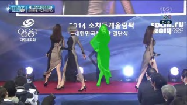
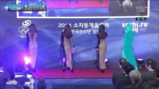
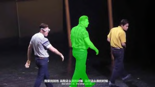
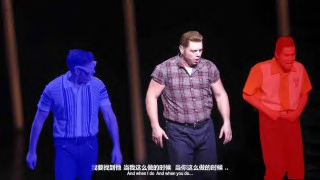

# AVTrack: Audio-Visual Tracking in Human-centric Complex Scenes

## 论文元信息

**标题**：AVTrack: Audio-Visual Tracking in Human-centric Complex Scenes  
**作者**：Yaoting Wang, Yun Zhou, Zipei Zhang, Henghui Ding  
**arXiv ID**：2606.02724  
**类别**：cs.CV  
**发布时间**：2026-06-03  
**论文链接**：https://arxiv.org/abs/2606.02724  
**PDF 链接**：https://arxiv.org/pdf/2606.02724  
**项目链接**：https://FudanCVL.github.io/AVTrack/  
**代码状态**：本文给出了项目网站，并在附录提示完整 prompt 随代码释放；但当前材料没有提供可确认的公开源码仓库、源码路径或可核验代码文件。因此本文不编造代码段，代码分析部分记为“本文未提供可确认的公开代码”（见 PAGE 1、PAGE 18）。  
**推荐方向**：跟踪 / ReID / 音视频人理解  
**报告依据**：PDF 全文抽取文本，状态为 `fulltext:pypdf:truncated`。

## 摘要

AVTrack 提出的是一个面向复杂人中心场景的音视频实例分割与跟踪 benchmark，而不是单纯的新模型论文。论文指出，现有音视频说话人跟踪、音视频分割与 AVIS 数据集多偏向短视频、静态场景、单一数据源或粗粒度标注，难以检验模型在遮挡、镜头运动、多人交互、说话轮换、音画不一致等真实条件下的跨模态时空推理能力。为此，作者构建了包含 871 段视频、3,120 条稠密标注实例轨迹的测试集 AVTrack，并定义 8 类复杂挑战条件（见 PAGE 2、PAGE 3、PAGE 14）。实验显示，VIS 与 AVIS 方法在 AVTrack 上均显著退化，最强端到端 AVIS baseline 的 HOTA 约为 21.47，而作者提出的多阶段 baseline AVTracker 达到 29.08（见 PAGE 7）。

一句话总结：**AVTrack 的核心贡献是把“谁在说话、在哪里、是否同一个人”从简单静态评测推向复杂动态人中心场景，并用实验证明现有 AVIS 方法在这种设置下仍有明显鲁棒性缺口。**

## 背景与动机

音视频说话人跟踪（audio-visual speaker tracking）旨在利用听觉线索与视觉线索定位并跟踪正在发声的人。这类能力直接服务于智能视频剪辑、监控、人机交互、增强现实等应用，因为系统不仅要知道画面中有什么人，还要知道当前声音对应哪个人，并在时间维度上保持身份一致（见 PAGE 1）。

相关领域在近几年逐步从粗粒度定位走向细粒度分割。早期音视频定位或主动说话人检测通常只输出边界框或二分类标签；音视频分割（audio-visual segmentation, AVS）进一步要求对发声对象进行像素级分割；音视频实例分割（audio-visual instance segmentation, AVIS）则将检测、分割和跨帧跟踪合并到实例级别任务中，要求模型同时解决“发声对象在哪里”和“跨帧是否为同一实例”（见 PAGE 2、PAGE 3）。

论文的核心动机来自一个评测缺口：现有 benchmark 的场景复杂度不足。AV16.3、CAV3D、AVRI 等音视频说话人跟踪数据集主要来自受控实验室环境；AVA-ActiveSpeaker 虽包含更多说话人，但来自单一 TV 剧数据源，且只提供 bounding box，没有跨帧 identity consistency；AVSBench 等 AVS benchmark 有像素级标签，但多为 5–10 秒短片；AVISeg 将时长扩展到约 60 秒并提供实例级跟踪，但大多数场景仍相对简单，镜头运动、背景变化和相对位置变化不足（见 PAGE 2、PAGE 3）。

这种数据偏差会导致评测目标退化。模型可能只学会静态音画共现（static audio-visual co-occurrence），例如“画面中最显眼的人正在说话”，而不是学习复杂场景中需要的长期身份保持、遮挡恢复、说话轮换判断和音画不一致推理。论文摘要明确指出，过度简化的设置会让评测偏向静态音视频共现，而不是严格考察 robust spatiotemporal modeling 和 cross-modal reasoning（见 PAGE 1）。

AVTrack 因此被设计成 test-only benchmark。作者强调，它并不优先作为训练集，而是作为长期稳定的复杂场景评测集，用于脱离 dataset-specific training 后检验模型泛化与鲁棒性。这一点很关键：如果训练与测试都来自同一个复杂数据集，模型表现可能混合了数据适配能力；而测试集定位更强调对现有模型能力边界的诊断（见 PAGE 3）。

## 预备知识

### AVIS：音视频实例分割

音视频实例分割（Audio-Visual Instance Segmentation, AVIS）要求模型在视频中检测、分割并跟踪正在发声的对象。与普通视频实例分割（Video Instance Segmentation, VIS）相比，AVIS 额外需要音频输入，并要求将声音源和视觉实例建立对应关系。对 AVTrack 而言，实例类别被限定在人中心场景，即主要关注正在说话或发声的人（见 PAGE 2、PAGE 3）。

### Tracking 指标

论文采用 TrackEval 工具包，并报告 HOTA、DetA、AssA、IDF1、MOTA 五个指标。HOTA（Higher-Order Tracking Accuracy）同时衡量检测与关联，是论文中最核心的综合指标；DetA（Detection Accuracy）侧重帧级检测正确性；AssA（Association Accuracy）侧重跨帧关联；IDF1 衡量全局身份保持；MOTA 聚合漏检、误检和 ID switch（见 PAGE 14、PAGE 15）。

HOTA 的定义为：

$$
\mathrm{HOTA}=\frac{1}{|A|}\sum_{\alpha\in A}\sqrt{\mathrm{DetA}_{\alpha}\cdot \mathrm{AssA}_{\alpha}}
$$

其中，$\alpha$ 是匹配阈值，$A$ 是用于评测的阈值集合。通俗解释：HOTA 不允许模型只擅长检测或只擅长关联，因为它通过几何平均同时惩罚检测失败与身份关联失败（见 PAGE 15）。

DetA 的定义为：

$$
\mathrm{DetA}=\frac{\mathrm{TP}}{\mathrm{TP}+\mathrm{FN}+\mathrm{FP}}
$$

其中，$\mathrm{TP}$、$\mathrm{FN}$、$\mathrm{FP}$ 分别表示真阳性、假阴性和假阳性。这个公式衡量的是：在每一帧里，模型是否正确找到了正在发声的人实例（见 PAGE 15）。

AssA 的定义为：

$$
\mathrm{AssA}=\frac{1}{|C|}\sum_{c\in C}
\frac{|\mathrm{TPA}(c)|}{|\mathrm{TPA}(c)|+|\mathrm{FNA}(c)|+|\mathrm{FPA}(c)|}
$$

其中，$C$ 是真阳性检测匹配集合，$\mathrm{TPA}$、$\mathrm{FNA}$、$\mathrm{FPA}$ 分别表示正确、漏掉和错误的关联。这个公式衡量的是：模型把同一个说话人在不同帧中的实例连成同一条轨迹的能力（见 PAGE 15）。

IDF1 的定义为：

$$
\mathrm{IDF1}=\frac{2\cdot \mathrm{IDTP}}{2\cdot \mathrm{IDTP}+\mathrm{IDFP}+\mathrm{IDFN}}
$$

其中，$\mathrm{IDTP}$、$\mathrm{IDFP}$、$\mathrm{IDFN}$ 分别表示身份级真阳性、假阳性和假阴性。人话解释：IDF1 对长期 identity fragmentation 非常敏感，因此适合评估多轮说话、遮挡后重现、跨镜头关联等人中心跟踪问题（见 PAGE 15）。

MOTA 的定义为：

$$
\mathrm{MOTA}=1-\frac{\mathrm{FN}+\mathrm{FP}+\mathrm{IDSW}}{\mathrm{GT}}
$$

其中，$\mathrm{IDSW}$ 是 identity switch 数量，$\mathrm{GT}$ 是 ground-truth 实例总数。这个公式把漏检、误检和身份切换合并为一个误差项，用于衡量整体多目标跟踪准确性（见 PAGE 15）。

## 方法详解

### 1. AVTrack 数据集设计：从“简单共现”转向“复杂时空推理”

AVTrack 首先明确了复杂音视频场景的定义。论文列出 8 类挑战：Visual Occlusion、Relative Position Change、Background Switch、Camera Motion Change、Multiple Instances、Multi-turn Sounding、Audio-Visual Inconsistency、Instance Scale Dynamics。视频只要包含其中一种或多种条件，才符合 AVTrack 的复杂场景标准（见 PAGE 3）。

这些挑战并非视觉难例的简单堆叠，而是直接对应 AVIS 的核心失败模式。例如 Visual Occlusion 会破坏人体边界与身份连续性；Relative Position Change 会要求模型维护跨时间身份，而不是依赖静态左右位置；Multiple Instances 会制造多个相似候选人；Multi-turn Sounding 会让 active speaker 在不同人之间频繁切换；Audio-Visual Inconsistency 则进一步破坏“最显眼对象就是声源”的捷径（见 PAGE 3、PAGE 4）。

用途：展示 AVTrack 关注的复杂人中心音视频样本。  
读图要点：图中强调实例尺度变化、遮挡、相对位置变化、多人实例与镜头运动变化。  
支撑的判断：AVTrack 的任务难点来自动态人中心场景，而不是普通单人静态说话检测。

这张图对应论文 Figure 1 的样例。它支持论文关于“现有数据集多为静态镜头和单实例场景，而 AVTrack 覆盖更复杂条件”的论断（见 PAGE 1）。

用途：补充展示 AVTrack 样本中的视觉遮挡或多人交互条件。  
读图要点：需要关注人物边界是否被遮挡，以及发声人与非发声人是否在视觉上接近。  
支撑的判断：模型不能只依靠单帧 saliency 判断声源，而必须结合音频、语义和时序。

该样例强化了 AVTrack 对遮挡与多人实例的覆盖。论文在复杂场景定义中明确将 Visual Occlusion 与 Multiple Instances 列为关键条件（见 PAGE 3）。

用途：展示相对位置变化、尺度变化或镜头变化带来的长期跟踪挑战。  
读图要点：关注人物在画面中的尺度、位置和可见性是否随时间变化。  
支撑的判断：AVTrack 不只是 frame-level segmentation benchmark，更是要求跨帧 identity association 的 tracking benchmark。

该样例与论文对 Relative Position Change、Camera Motion Change、Instance Scale Dynamics 的描述一致，说明 AVTrack 的困难集中在跨时间稳定建模（见 PAGE 1、PAGE 3）。

用途：展示 AVTrack 对极小实例、复杂构图或动态场景的覆盖。  
读图要点：论文 Figure 1 特别提示需要 zoom in 检查极小尺寸实例。  
支撑的判断：检测失败会直接影响后续关联，因此 AVTrack 同时考验 detection 和 association。

该图支撑 AVTrack 对 Instance Scale Dynamics 的强调。小尺度人物和尺度变化会使发声人定位、mask 生成和跨帧身份保持同时变难（见 PAGE 1、PAGE 3）。

### 2. 数据集规模与定位

AVTrack 包含 871 个视频 clip 和 3,120 个稠密标注 instance tracklet，平均视频长度为 54.0 秒，音频、mask 和跨帧 track identity 均可用。论文将其定位为 human-centric AVIS test set，测试集比例为 100%，即发布目的主要是评测而非训练（见 PAGE 2、PAGE 4、PAGE 14）。

与 AVISeg 相比，AVTrack 的数据规模相近，但任务设置更聚焦于人中心复杂场景。AVISeg 有 926 个视频、平均 61.4 秒、common domain；AVTrack 有 871 个视频、平均 54.0 秒、human domain。更重要的是，AVTrack 的 8 类挑战覆盖比例显著更高，尤其在 Camera Motion Change、Visual Occlusion、Relative Position Change、Background Switch 等方面差距明显（见 PAGE 4）。

| Dataset | Task | Videos | Test | Avg. Length | Domain | Annotation | Audio | Track |
|---|---:|---:|---:|---:|---|---|---|---|
| AVA-ActiveSpeaker | ASD | 262 | 41.6% | 529.0s | Human | bbox | 是 | 否 |
| YouTube-VIS | VIS | 2,883 | 11.9% | 4.6s | Common | mask | 否 | 是 |
| OVIS | VIS | 901 | 17.1% | 12.8s | Common | mask | 否 | 是 |
| YouMVOS | VIS | 200 | 15.0% | 333.1s | Human | mask | 否 | 是 |
| AVISeg | AVIS | 926 | 22.1% | 61.4s | Common | mask | 是 | 是 |
| AVTrack | AVIS | 871 | 100.0% | 54.0s | Human | mask | 是 | 是 |

表格解读：这张表体现 AVTrack 的差异化定位。它不是最大规模数据集，也不是最长视频数据集，而是少数同时具备 human domain、mask annotation、audio 和 cross-frame track identity 的 AVIS benchmark。与 AVISeg 相比，它从 common object AVIS 转向 human-centric AVIS；与 YouMVOS 相比，它增加音频；与 AVA-ActiveSpeaker 相比，它从 bbox 和单帧说话检测转向 mask 和跨帧身份跟踪（见 PAGE 4）。

### 3. 复杂挑战分布：AVTrack 与 AVISeg 的核心差别

论文 Figure 2 比较了 AVTrack 与 AVISeg 在不同挑战条件上的分布。AVTrack 中 Camera Motion Change 占 90.5%，Visual Occlusion 占 80.9%，Relative Position Change 占 70.7%，Background Switch 占 60.5%，Instance Scale Dynamics 占 56.9%，Multi-turn Sounding 占 56.8%，Audio-Visual Inconsistency 占 9.2%。AVISeg 对应挑战比例大多低得多，例如 Visual Occlusion 仅 8.6%，Background Switch 仅 5.9%，Camera Motion Change 仅 7.1%（见 PAGE 4、PAGE 19）。

| Challenge | AVTrack | AVISeg | 主要影响 |
|---|---:|---:|---|
| Camera Motion Change | 90.5% | 7.1% | 镜头变化导致尺度、视角、可见性变化 |
| Visual Occlusion | 80.9% | 8.6% | 人体边界和身份连续性受破坏 |
| Relative Position Change | 70.7% | 9.7% | 不能依赖静态空间位置做身份关联 |
| Background Switch | 60.5% | 5.9% | 背景变化破坏视觉连续性 |
| Instance Scale Dynamics | 56.9% | 35.3% | 小目标和尺度变化削弱检测稳定性 |
| Multi-turn Sounding | 56.8% | 16.0% | 说话人在多人之间切换，要求动态声源关联 |
| Audio-Visual Inconsistency | 9.2% | 证据不足 | 声音与视觉显著对象不一致，破坏共现捷径 |

表格解读：AVTrack 的关键价值在于挑战条件覆盖密度高。尤其是 Camera Motion、Visual Occlusion 和 Relative Position Change，这三类都直接影响长期 identity association。Audio-Visual Inconsistency 的占比虽然只有 9.2%，但它对模型假设破坏最强，因为它直接否定“可见显著人物就是声源”的静态对应关系。AVISeg 的部分对比数值在当前文本中没有完整列出，除论文明确给出的项外，表中标为“证据不足”（见 PAGE 4、PAGE 19）。

### 4. 数据构建流程：人工密集标注的 test-only benchmark

附录 B 给出了数据构建流程。作者先从公开 web sources 收集约 1,300 个候选视频，筛除不满足复杂场景要求的样本后保留约 1,000 个候选视频进入标注。随后使用 Grounded-SAM 生成 frame-level human instance masks 作为自动预标注（见 PAGE 13、PAGE 14）。

人工标注采用 human-in-the-loop 流程。标注者需要在 held-out subset 上接受训练并通过项目组审核；专用 web-based annotation tool 支持跨帧跟踪实例、手动新增或修正自动过程漏掉的 mask；标注时同步提供视频、音频和全帧视觉上下文，要求按帧标注 sounding human instances（见 PAGE 14）。

最后进入 refinement and quality control。轻微 artifact 如 fragmented regions 或 small holes 用图形编辑软件修复；严重错误或漏标实例用 LabelMe 重新标注。最终数据集包含 871 个高质量视频 clip 和 3,120 个标注实例，15 名专业标注者历时近三个月参与构建（见 PAGE 14）。

### 5. AVTracker：多阶段 baseline 的结构

论文不仅提供 benchmark，还提出 AVTracker 作为 simple yet effective baseline。AVTracker 是一个 modular multi-stage pipeline，由三个阶段组成：Speaker Chunks Aggregation、Local Window Process、Global Window Process。Figure 4 总览了该框架（见 PAGE 4、PAGE 5、PAGE 6）。

第一阶段是 Speaker Chunks Aggregation。系统使用 Whisper 进行 ASR，将音频转为带时间戳的文本片段；使用 ECAPA-TDNN 提取 speaker embedding；在可能重叠说话场景中可选 MossFormer2 做 speech separation。相邻 ASR chunk 若 speaker embedding 相似度超过阈值 $\tau=0.35$，则合并为更长的 speaker chunk，以减少局部窗口数量和全局推理负担（见 PAGE 5、PAGE 18）。

给定 ASR 输出集合：

$$
C=\{c_i\}_{i=1}^{N}
$$

其中每个 chunk 为：

$$
c_i=(t_i^s,t_i^e,x_i)
$$

这里 $t_i^s$ 是开始时间，$t_i^e$ 是结束时间，$x_i$ 是转写文本。这个定义把音频流转成可用于视觉对齐的语义时间片（见 PAGE 5）。

若对原始音频片段 $a_i$ 使用 speech separation 模块 $F_{\mathrm{sep}}$，则得到增强语音：

$$
\hat{a}_i=F_{\mathrm{sep}}(a_i)
$$

人话解释：这个公式表示在重叠说话或噪声条件下，先尝试把目标语音分离出来，再进行说话人嵌入与后续匹配（见 PAGE 5）。

speaker embedding 的计算为：

$$
e_i=E(\hat{a}_i), \quad e_{i+1}=E(\hat{a}_{i+1})
$$

其中，$E$ 是预训练 speaker encoder，$e_i$ 是第 $i$ 个音频片段的说话人向量表示。该公式的含义是：把两个相邻语音片段映射到可比较的身份嵌入空间（见 PAGE 5）。

相邻 chunk 的相似度定义为：

$$
\mathrm{sim}(c_i,c_{i+1})=
\frac{e_i^\top e_{i+1}}{\|e_i\|\|e_{i+1}\|}
$$

这是标准 cosine similarity。它衡量两个相邻语音片段是否可能来自同一个说话人（见 PAGE 5）。

若相似度超过阈值，则合并：

$$
(t_i^s,t_i^e,x_i)\oplus(t_{i+1}^s,t_{i+1}^e,x_{i+1})
=(t_i^s,t_{i+1}^e,x_i\oplus x_{i+1})
$$

其中，$\oplus$ 表示时间范围和文本内容的拼接。通俗解释：如果相邻两段话很可能是同一个人说的，就把它们合并成一个更完整的语义窗口，避免系统对碎片化短句反复推理（见 PAGE 5）。

### 6. Local Window Process：从语音片段到局部轨迹

第二阶段是 Local Window Process。对每个 speaker chunk $s_k=(t_k^s,t_k^e,x_k)$，系统先将时间边界转换为帧索引：

$$
f_k^s=\lfloor t_k^s\cdot r\rceil,\quad f_k^e=\lfloor t_k^e\cdot r\rceil
$$

其中，$r$ 是视频处理帧率，论文设置为 $r=1$ FPS。这个公式的作用是把音频时间戳转换成对应的视频帧范围（见 PAGE 5）。

在帧区间内，Local Reasoner $R_{\mathrm{local}}$ 使用语音文本 $x_k$ 和视觉观察来预测发声人的 frame-wise bounding box：

$$
b_R^{(f)}=R_{\mathrm{local}}(I_f,x_k,P_{\mathrm{local}})
$$

其中，$I_f$ 是第 $f$ 帧图像，$P_{\mathrm{local}}$ 是 local processing prompt。人话解释：VLM reasoner 被要求根据画面和语音内容判断当前说话者，并输出每帧候选框（见 PAGE 5）。

与此同时，SAM3 Video 生成每帧的人体候选框 $B_{\mathrm{SAM3}}^{(f)}$ 和对应 mask $M_{\mathrm{SAM3}}^{(f)}$。系统通过 IoU 最大化将 Local Reasoner 的 box 与 SAM3 检测对齐：

$$
b^{(f)}=\arg\max_{b\in B_{\mathrm{SAM3}}^{(f)}}
\mathrm{IoU}(b_R^{(f)},b)
$$

这个公式的含义是：VLM 负责“判断谁在说话”，SAM3 负责“给出更精细的人体 mask”，二者通过 bounding box 重叠来衔接（见 PAGE 5）。

匹配得到的 mask 序列构成 local tracklet：

$$
T_k^{\mathrm{local}}=
\{(f,m^{(f)})\mid f_k^s\leq f\leq f_k^e\}
$$

这里 $T_k^{\mathrm{local}}$ 是第 $k$ 个语音片段对应的局部说话人轨迹。通俗解释：在一个语义完整的短窗口内，模型先解决“这段话是谁说的，并在每帧中对应哪个 mask”（见 PAGE 5）。

系统还选择 mask 面积最大的帧作为 key frame：

$$
f_k^{\mathrm{key}}=
\arg\max_{f\in[f_k^s,f_k^e]}\mathrm{Area}(m^{(f)})
$$

这个 key frame 后续用于全局身份关联。其设计直觉是：mask 面积越大，人物可见性通常越好，越适合作为 identity grouping 的视觉证据（见 PAGE 5）。

### 7. Global Window Process：从局部轨迹到全局身份

第三阶段是 Global Window Process。局部窗口只能解决短期音视频对应，但同一个说话人可能出现在多个不连续 chunk 中。系统收集所有 key frame：

$$
F_{\mathrm{key}}=\{I_{f_k^{\mathrm{key}}}\}_{k=1}^{K}
$$

其中，$K$ 是 speaker chunks 数量。Global Reasoner $R_{\mathrm{global}}$ 被查询后输出 identity 到 chunk 集合的映射（见 PAGE 6）。

全局 identity mapping 定义为：

$$
G:p\mapsto \{k_1,k_2,\ldots\}
$$

其中，$p$ 表示某个说话人身份，$\{k_1,k_2,\ldots\}$ 表示归属于该身份的一组 speaker chunks。人话解释：Global Reasoner 的任务是判断不同时间片中的人物是否为同一个人（见 PAGE 6）。

最终，全局轨迹由对应 local tracklets 合并得到：

$$
T_p=\bigcup_{k\in G(p)}T_k^{\mathrm{local}}
$$

如果某些帧没有观测，则插入 empty masks 以维持时间连续性。这个公式总结了 AVTracker 的 local-to-global 设计：先在语义窗口内建立较可靠的局部轨迹，再跨窗口做身份合并（见 PAGE 6）。

### 8. AVTrackFormer：端到端 baseline 的补充

附录 D 还介绍了 AVTrackFormer。它是在 AVISM 基础上做轻微修改的端到端模型，训练方式与 AVISM 相同，但增强了视频级 sounding object tracking 中的音视频交互。它包含 Frame-level Sound Source Localizer 和 Video-level Sounding Object Tracker 两部分（见 PAGE 15、PAGE 16）。

AVTrackFormer 将视频分成 $T$ 个连续非重叠 1 秒 snippet，每个 snippet 包含视觉片段 $v_i$ 和音频片段 $a_i$。视觉 backbone 产生多尺度特征 $f_{i,k}^V\in\mathbb{R}^{H_k\times W_k\times D_k}$，音频 encoder 则把 log-mel spectrogram 编码为 $f_i^A\in\mathbb{R}^D$。这些定义说明模型同时维护视觉空间特征和音频时间片特征（见 PAGE 15）。

AVTrackFormer 的主要区别在 Audio-Visual Object-level Fusion Module（AV-OFM）。论文指出，AVISM 的跨模态交互更偏单向，而 AVTrackFormer 让 object tokens $Q_o'$ 与 audio features $f_i^A$ 作为共同演化状态进行双向交互（见 PAGE 16）。

迭代更新写为：

$$
(Q_o^j,Q_A^j)=\mathrm{AV\text{-}OFM}(Q_o^{j-1},Q_A^{j-1})
$$

其中，$Q_o^j$ 是第 $j$ 层 object token 状态，$Q_A^j$ 是第 $j$ 层 audio feature 状态。通俗解释：视觉对象 token 和音频特征在每层中相互更新，而不是只有音频去辅助视觉或只有视觉去辅助音频（见 PAGE 16）。

最终融合表示为：

$$
Q_o^{AV}=Q_o'\oplus Q_o^n
$$

其中，$Q_o^{AV}$ 是音频条件化后的 object token，$\oplus$ 表示残差式融合。该设计提高了 object-level 音视频交互，但实验显示它仍显著弱于 AVTracker pipeline（见 PAGE 16、PAGE 7）。

### 9. 代码分析

本文未提供可确认的公开代码。

依据如下：论文首页给出 Project website；附录 G 说明完整 prompt texts are released with the code；但当前全文材料没有给出 GitHub 仓库地址、源码文件路径、函数名、commit、README 或可核验代码片段。已知链接是项目网站而非源码仓库。因此，按照任务要求，本文不编造代码段，也不写“论文方法 ↔ 源码文件”的对应关系（见 PAGE 1、PAGE 18）。

## 实验分析

### 1. 主实验：VIS 与 AVIS 方法在 AVTrack 上显著退化

论文主实验比较了 VIS-only 方法、已有 AVIS 方法、AVTrackFormer 和 AVTracker。VIS 方法包括 VITA、LBVQ、CAVIS；AVIS 方法包括 AVISM、ACVIS；AVTrackFormer 是作者基于 AVISM 的端到端变体；AVTracker 是作者提出的多阶段 pipeline baseline（见 PAGE 6、PAGE 7）。

| Task | Method | HOTA | DetA | AssA | IDF1 | MOTA |
|---|---|---:|---:|---:|---:|---:|
| VIS | VITA | 9.70 | 10.54 | 9.35 | 12.32 | 1.91 |
| VIS | LBVQ | 10.29 | 11.77 | 9.36 | 12.87 | 1.98 |
| VIS | CAVIS | 11.46 | 12.10 | 10.07 | 12.95 | 1.96 |
| AVIS | AVISM | 20.84 | 23.22 | 19.53 | 26.57 | 3.95 |
| AVIS | ACVIS | 20.60 | 22.59 | 19.66 | 26.23 | 4.23 |
| AVIS | AVTrackFormer | 21.47 | 22.51 | 20.26 | 26.41 | 4.11 |
| Pipeline | AVTracker | 29.08 | 31.18 | 28.47 | 34.55 | 16.20 |

表格解读：VIS-only 方法的 HOTA 全部低于 12，说明在 AVTrack 上仅靠视觉跟踪无法可靠判断 active speaker。AVIS 方法引入音频后 HOTA 提升到约 20–21，但仍远低于 AVTracker 的 29.08。AVTracker 相比 AVTrackFormer 的 HOTA 提升 7.61，AssA 提升 8.21，MOTA 提升 12.09，说明主要收益不仅来自检测，还来自 local-to-global identity association（见 PAGE 7）。

### 2. 消融实验：模型规模、语音分离和 chunk 处理的作用

论文 Table 3 分析了 AVTracker 的不同组件。Base 使用 Whisper-large-v3-turbo（809M 参数）和 Qwen3-VL-8B-Instruct，不使用 speech separation，HOTA 为 28.85。S2 加入 MossFormer2 后 HOTA 达到 29.08，是主表中 AVTracker 的配置（见 PAGE 7、PAGE 8）。

| Setting | ParamA | ParamVL | Cmpr. | Chunk | Sepa. | HOTA | DetA | AssA | IDF1 | MOTA |
|---|---:|---:|---|---|---|---:|---:|---:|---:|---:|
| Base | 809M | 8B | 是 | 是 | 否 | 28.85 | 31.75 | 27.39 | 34.45 | 16.39 |
| M1 | 244M | 8B | 是 | 是 | 否 | 25.19 | 27.33 | 24.25 | 29.92 | 14.88 |
| M2 | 809M | 4B | 是 | 是 | 否 | 24.47 | 25.85 | 24.37 | 28.86 | 14.48 |
| M3 | 244M | 4B | 是 | 是 | 否 | 24.01 | 25.49 | 23.69 | 28.47 | 13.52 |
| M4 | 244M | 4B/Face | 是 | 是 | 否 | 23.62 | 24.80 | 21.31 | 27.16 | 11.03 |
| S1 | 809M | 8B | 是 | 是 | SepFormer | 28.41 | 30.81 | 27.54 | 33.65 | 15.99 |
| S2 | 809M | 8B | 是 | 是 | MossFormer2 | 29.08 | 31.18 | 28.47 | 34.55 | 16.20 |
| C1 | 244M | 4B | 否 | 是 | 否 | 16.88 | 18.34 | 16.33 | 19.99 | 9.34 |
| C2 | 809M | 8B | 是 | 否 | 否 | 27.45 | 29.57 | 26.64 | 32.97 | 13.49 |

表格解读：模型规模对性能影响明显。降低 ASR 或 VLM 容量都会导致 HOTA 下降，说明音频转写质量与视觉语言推理能力都参与了最终跟踪。Speech separation 并非总是有益：SepFormer 使 HOTA 从 28.85 降到 28.41，而 MossFormer2 提升到 29.08，说明低质量分离可能引入噪声或时间错位。Chunk 处理尤其关键，去掉 local chunk compression 后 HOTA 仅 16.88，表明碎片化窗口会显著削弱全局关联能力（见 PAGE 7、PAGE 8）。

### 3. Visual backbone 对端到端方法的影响

附录 D.4 比较了 ResNet-50 与 Swin-Large backbone 对 AVISM、ACVIS、AVTrackFormer 的影响。更强视觉 backbone 提升所有方法，但 AVTrackFormer 仍只有 21.47 HOTA，低于 AVTracker 的 29.08（见 PAGE 16、PAGE 17）。

| Backbone | Model | HOTA | DetA | AssA | IDF1 | MOTA |
|---|---|---:|---:|---:|---:|---:|
| R-50 | AVISM | 16.56 | 17.39 | 16.48 | 21.59 | 1.89 |
| R-50 | ACVIS | 16.94 | 18.02 | 16.62 | 22.55 | 2.18 |
| R-50 | AVTrackFormer | 17.50 | 18.91 | 16.97 | 22.78 | 2.25 |
| Swin-L | AVISM | 20.84 | 23.22 | 19.53 | 26.57 | 3.95 |
| Swin-L | ACVIS | 20.60 | 22.59 | 19.66 | 26.23 | 4.23 |
| Swin-L | AVTrackFormer | 21.47 | 22.51 | 20.26 | 26.41 | 4.11 |

表格解读：Swin-L 相比 R-50 带来约 3–4 HOTA 的提升，说明复杂场景下视觉表征容量仍是基础瓶颈。但在 Swin-L 下，端到端方法之间差距不大，最高 HOTA 也只有 21.47。这说明仅增强 backbone 或 object-level fusion 不足以解决 AVTrack 暴露的长期身份关联问题（见 PAGE 16、PAGE 17）。

### 4. 每类挑战的性能分析

附录 I 报告了 8 类挑战上的 HOTA。AVTracker 在所有挑战上均超过端到端 baseline，但 Audio-Visual Inconsistency 仍是最困难类别，AVTracker HOTA 仅 18.5（见 PAGE 19）。

| Challenge | AVISM | ACVIS | AVTrackFormer | AVTracker |
|---|---:|---:|---:|---:|
| Multiple Instances | 20.2 | 20.1 | 19.8 | 27.0 |
| Instance Scale | 18.6 | 18.2 | 17.8 | 26.8 |
| Visual Occlusion | 20.1 | 19.8 | 19.2 | 28.1 |
| Position Change | 20.6 | 20.7 | 20.7 | 25.9 |
| Camera Motion | 21.0 | 20.9 | 19.9 | 29.6 |
| Background Switch | 20.1 | 19.9 | 19.0 | 28.9 |
| Multi-turn Sound | 21.1 | 20.8 | 20.1 | 29.2 |
| AV Inconsistency | 12.6 | 12.8 | 12.2 | 18.5 |

表格解读：AVTracker 对 Camera Motion、Multi-turn Sound、Background Switch 的提升较明显，说明动态窗口和语义局部轨迹对复杂时间结构有帮助。但在 AV Inconsistency 下，所有方法都大幅下降，AVTracker 也只有 18.5。这表明当音频与视觉显著性不一致时，即使使用 VLM 与文本桥接，跨模态因果对应仍未被可靠解决（见 PAGE 19）。

### 5. 计算效率：准确率与成本的强烈权衡

AVTracker 借助 Qwen3-VL、Whisper、SAM3、ECAPA-TDNN、MossFormer2 等组件，精度明显高于端到端 baseline，但代价是参数量和计算量显著增加。附录 H 指出 AVTracker 约 9.4B 参数、每帧约 18,900 GFLOPs、吞吐约 0.21 FPS；AVISM / ACVIS 约 238M 参数、每帧约 308 GFLOPs、约 2–5 FPS（见 PAGE 18）。

| Method | Type | Params | GFLOPs/frame | FPS |
|---|---|---:|---:|---:|
| AVISM / ACVIS | End-to-end | 238M | 约 308 | 约 2–5 |
| AVTracker | Pipeline | 约 9.4B | 约 18,900 | 0.21 |

表格解读：AVTracker 不是轻量化模型，而是以 foundation-model orchestration 换取复杂场景准确率。论文指出 Qwen3-VL 占约 97% FLOPs，是主要计算瓶颈。若面向业务落地，必须考虑量化、批处理服务、KV-cache 复用或更小的视觉语言模型，否则 0.21 FPS 很难满足实时需求（见 PAGE 18、PAGE 19）。

### 6. 与商业 Omni-LLM 的初步比较

论文附录 J 提到，Gemini 2.5 Pro 在 zero-shot 设置下直接输入 1 FPS 视频帧和原始音频，要求输出 active-speaker bounding box 与跨帧 ID，HOTA 仅 14.4，低于专门训练的端到端 baseline（约 20），也显著低于 AVTracker（29.1）。当前文本在 PAGE 19 处截断，Table 10 后续完整数据证据不足，因此这里只引用明确可见信息（见 PAGE 19）。

表格数据证据不足：当前材料没有提供完整 Table 10，仅能确认 Gemini 2.5 Pro HOTA=14.4 这一项以及相对比较结论。

## 讨论

AVTrack 的最直接启示是：音视频人中心理解的主要瓶颈已经超出“帧级声源定位”。在复杂场景中，模型需要同时处理语音内容、说话人身份、人体外观、遮挡恢复、镜头运动和长期时序关联。论文 Discussion 明确提出 robust audio-visual alignment、audio-visual spatio-temporal intelligence、efficient human-centric data construction 和 agentic audio-visual reasoning 四个未来方向（见 PAGE 7、PAGE 8）。

从方法论看，AVTracker 的优势来自结构化分解。它不试图让一个端到端网络一次性完成所有推理，而是将任务拆成 ASR chunk、局部说话人匹配、mask 采样和全局 identity grouping。这个设计更贴近复杂视频理解的实际难点：局部窗口内的音视频对应相对可控，全局层面再做身份合并，可以减少长视频中直接建模所有帧、所有人、所有声音的组合复杂度（见 PAGE 4、PAGE 6）。

但 AVTracker 的成功也说明现有端到端 AVIS 方法的局限。AVTrackFormer 增强 object-level bidirectional audio-visual fusion 后，HOTA 仍只有 21.47；而 AVTracker 借助 VLM、ASR 和强 segmentation backbone 达到 29.08。这并不意味着 pipeline 一定是最终方向，而是说明当前端到端模型在复杂人中心时空推理、语义桥接和长期身份维护上还没有充分建模（见 PAGE 7、PAGE 16）。

对业务应用而言，AVTrack 更适合作为评测与研究基准，而不是直接落地方案。它覆盖会议、直播、安防、人机交互等说话人跟踪场景的关键困难，但数据集论文的价值主要在诊断模型能力边界。实际部署还必须考虑音频采集条件、隐私合规、实时性、误识别风险和多说话人重叠语音条件下的可靠性（见 PAGE 9、PAGE 18）。

## 局限分析

第一，作者自述的隐私与误用风险非常明确。Impact Statement 指出，定位和跟踪说话人的技术可能带来 privacy、surveillance 和 misuse concerns；即使 AVTrack 使用公开视频并仅作为 research benchmark，训练或评测出的模型仍可能被改用于侵入式监控。因此作者强调 AVTrack 仅用于研究，不用于现实监控，并鼓励隐私保护学习、负责任数据实践和伦理部署（见 PAGE 9）。

第二，AVTrack 是 test-only benchmark，这既是优点也是限制。作为稳定评测集，它有助于衡量泛化与鲁棒性；但如果研究者希望训练专门面向复杂人中心 AVIS 的模型，AVTrack 本身不提供训练监督。论文也在 Future Directions 中提出，高效构建 human-centric training data 仍是开放问题，并建议围绕 person–time–location triplets 探索数据构建管线（见 PAGE 3、PAGE 8）。

第三，AVTracker 的计算开销很高。它使用 Qwen3-VL-8B-Instruct、Whisper-large-v3-turbo、SAM3-Video、MossFormer2 等组件，总参数约 9.4B，每帧约 18,900 GFLOPs，速度约 0.21 FPS。虽然这在 benchmark 上精度较强，但对实时会议、直播、人机交互场景并不友好。论文提出 quantization、batched API serving、KV-cache reuse 等优化方向，但当前材料没有证明这些优化后的精度与速度表现（见 PAGE 18、PAGE 19）。

第四，baseline 强度仍需进一步验证。论文显示 AVTracker 明显优于已有 AVIS / VIS 方法，但它依赖多个 2025–2026 年强组件，例如 Qwen3-VL 和 SAM3。当前材料没有提供开源代码细节，也没有完整说明 prompt 对结果的敏感性、不同 VLM 替换后的稳定性、真实多麦克风或低质量音频条件下的表现。因此，AVTracker 更应被视为强参考 pipeline，而非已充分工程化的可部署系统（见 PAGE 5、PAGE 18）。

## 结论

AVTrack 的贡献主要有三点。第一，它定义并构建了一个面向复杂人中心音视频实例分割与跟踪的 test-only benchmark，包含 871 段视频、3,120 条标注实例轨迹和 8 类挑战条件。第二，它用系统实验说明，现有 VIS 与 AVIS 方法在复杂动态场景下存在显著性能退化，特别是在跨帧身份关联和音画不一致推理上仍不可靠。第三，它提供了 AVTracker 这一多阶段 baseline，通过 ASR、speaker embedding、动态窗口、SAM3 mask 和 VLM local/global reasoner 组合，证明结构化音视频推理能显著提高复杂场景性能（见 PAGE 2、PAGE 6、PAGE 7）。

总体而言，AVTrack 不只是“又一个数据集”，而是把 AVIS 评测从简单音画共现推进到人中心复杂时空推理。它对跟踪、ReID、多模态视频理解和主动说话人分析都有参考价值。其短期价值在于提供压力测试平台，长期价值在于推动模型从静态匹配走向可解释、可关联、可恢复的跨模态时序智能。

## 证据索引

| 关键结论 | PAGE 证据 |
|---|---|
| AVTrack 研究目标是复杂人中心音视频说话人跟踪与 AVIS | PAGE 1、PAGE 2、PAGE 3 |
| 现有数据集偏简单、静态、短视频或粗标注 | PAGE 1、PAGE 2、PAGE 3 |
| AVTrack 包含 871 clips、3,120 tracklets | PAGE 2、PAGE 14 |
| AVTrack 是 test-only benchmark | PAGE 3、PAGE 4 |
| 8 类复杂挑战定义 | PAGE 3 |
| Figure 1 展示尺度变化、遮挡、镜头运动、相对位置变化等样本 | PAGE 1 |
| Dataset comparison Table 1 | PAGE 4 |
| AVTrack 与 AVISeg 挑战分布差异 | PAGE 4、PAGE 19 |
| 数据来源分布 Figure 3 | PAGE 4、PAGE 5 |
| AVTracker 三阶段框架 Figure 4 | PAGE 4、PAGE 5、PAGE 6 |
| Speaker chunk aggregation 公式与阈值 $\tau=0.35$ | PAGE 5、PAGE 18 |
| Local window process 公式 | PAGE 5 |
| Global window process 公式 | PAGE 6 |
| 主实验 Table 2 | PAGE 6、PAGE 7 |
| 消融实验 Table 3 | PAGE 7、PAGE 8 |
| 评测指标 HOTA、DetA、AssA、IDF1、MOTA 公式 | PAGE 14、PAGE 15 |
| AVTrackFormer 结构、AV-OFM 和公式 | PAGE 15、PAGE 16 |
| Backbone 影响 Table 4 | PAGE 16、PAGE 17 |
| 模型配置 Table 5 | PAGE 18 |
| 阈值敏感性 Table 6 | PAGE 18 |
| 计算复杂度 Table 7、Table 8 | PAGE 18、PAGE 19 |
| Per-challenge HOTA Table 9 | PAGE 19 |
| Gemini 2.5 Pro zero-shot HOTA=14.4，完整 Table 10 证据不足 | PAGE 19 |
| 隐私、监控和误用风险 | PAGE 9 |
| 代码状态：项目网站和 prompt/code 释放提示，但当前材料无可确认源码 | PAGE 1、PAGE 18 |
