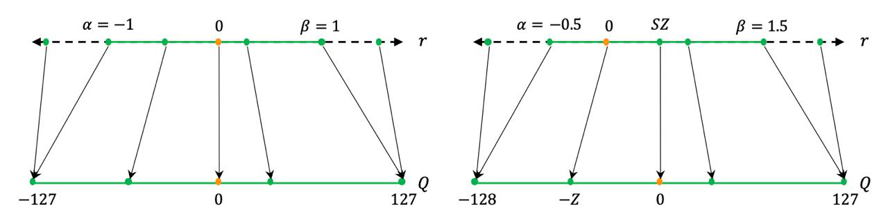
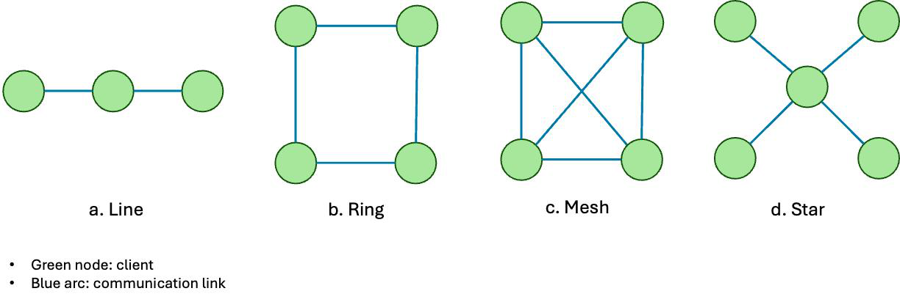
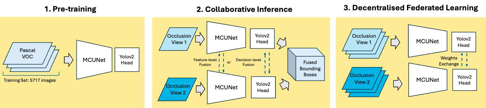
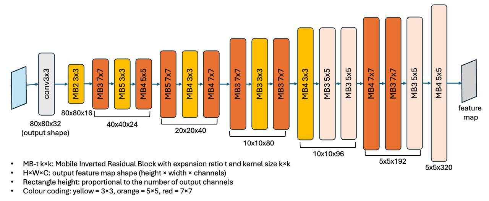

# Tiny Collaborative Inference for Occlusion-Robust Object Detection

## 摘要

### 论文元信息

| 项目 | 内容 |
|---|---|
| 标题 | Tiny Collaborative Inference for Occlusion-Robust Object Detection |
| 作者 | Chieh-Tung Cheng, Mustafa Aslanov, Eiman Kanjo |
| arXiv ID | 2606.02894 |
| 发布时间 | 2026-06-03 |
| 类别 | cs.CV |
| 论文链接 | https://arxiv.org/abs/2606.02894 |
| PDF 链接 | https://arxiv.org/pdf/2606.02894 |
| 代码状态 | 本文未提供可确认的公开代码；已知代码链接为未知。代码分析证据不足，不写源码段。 |
| 报告依据 | PDF 全文抽取含 PAGE 1-34，文本状态为 `fulltext:pypdf:truncated`；PAGE 34 之后内容证据不足。 |

一句话总结：本文在低于 1 MB SRAM 约束下，将 MCUNet-YOLOv2、INT8 量化与多视角决策级融合结合起来，证明 Weighted Boxes Fusion（WBF）比特征级融合更适合小规模遮挡鲁棒端侧检测，且可在两块 Coral Dev Board Micro 上无主机运行（见 PAGE 1、PAGE 24-26）。

本文的核心价值不在于提出新的检测主干，而在于把三个工程约束同时放在一个可运行系统里验证：小模型能否部署、多个低端节点能否低通信成本协同、遮挡视角下能否提高目标覆盖率。论文给出的主要证据是：INT8 量化后模型 mAP@0.5 仅下降 0.003，同时模型存储和峰值 RAM 分别下降约 71% 和 83%（见 PAGE 12）；两视角 WBF 在非对称遮挡下最高提升 +0.2736 mAP（见 PAGE 14）；三视角融合最高提升 +0.3827 mAP（见 PAGE 17）；真实 Wi-Fi 会话中 fused output 覆盖 61 帧，而 Board 2 单独覆盖 47 帧，覆盖提升 +29.8%（见 PAGE 26）。

需要先限定结论范围：本文实验主要是 car-only、小规模 CO3D 子集、人工 Cut Out 遮挡和两块 Coral Dev Board Micro。论文自身也明确把 DFL 作为 exploratory feasibility note，而非主结果；DFL 在非 iid 数据下虽然训练损失趋稳，但绝对 loss 仍约为 23,800，不能视为可部署适应能力的证据（见 PAGE 18、PAGE 28）。

## 背景与动机

边缘 AI（Edge AI）的目标是在传感端本地运行感知模型，而不是把原始数据上传到云端。论文以搜救（Search and Rescue, SAR）、监控节点、移动机器人和无人机作为典型场景：这些设备通常具备摄像头，但缺少 GPU，并受到能耗、内存、通信和实时性的共同限制（见 PAGE 1）。

该问题在 ultra-low-end hardware 上更尖锐。论文明确设定目标设备 SRAM 小于 1 MB；这意味着传统轻量化模型即便在手机级设备可运行，也不一定适合 MCU 级平台。已有 MobileNet、EfficientNet 等轻量网络仍可能超过 MCU 级内存预算，因此需要 TinyML 风格的模型架构与推理引擎协同设计（见 PAGE 2）。

遮挡是本文选择协同推理的直接动机。单个固定摄像头视角下，目标被部分遮挡时，模型不能简单依靠更高分辨率或更大主干来弥补，因为硬件预算不允许。论文引用遮挡鲁棒视觉研究指出：单模型可以通过 compositional layer、context-aware representation 或 part-based voting 改善鲁棒性，但这些方法仍依赖单个视角的信息（见 PAGE 3-4）。

多视角协同推理（collaborative inference）提供了另一种路径：不同边缘节点在推理时共享中间表征或最终检测结果，让某个视角被遮挡时，由另一个视角补足可见证据。论文将协同推理严格限定为 inference-time fusion，即融合阶段不重新训练基础检测器（见 PAGE 4）。

本文还讨论去中心化联邦学习（Decentralised Federated Learning, DFL），但其地位明显低于协同推理主线。DFL 被用来探索节点在非 iid 本地数据下能否通过 peer averaging 保持数值稳定，而不是证明其能带来可靠精度收益（见 PAGE 5、PAGE 10、PAGE 18）。

论文贡献可以概括为五点：一是将 MCUNet backbone 与 YOLOv2 detection head 结合，并进行 TensorFlow Lite 量化；二是在受控遮挡下比较 feature-level fusion 与 decision-level fusion；三是扩展到三视角并量化准确率与 Wi-Fi 通信开销；四是在两块 Coral Dev Board Micro 上完成 USB-relay 到 Wi-Fi peer-to-peer 的硬件验证；五是报告一个 FedAvg-style DFL 的小规模可行性实验并明确其局限（见 PAGE 2）。

## 预备知识

TinyML 的核心约束是内存峰值而不只是参数量。论文在 PAGE 2 回顾 MCUNet 时强调，MCUNet 通过 TinyNAS 与 TinyEngine 联合优化，在 512 kB SRAM 约束下相较 MobileNetV2 baseline 提升 PASCAL VOC 检测性能；MCUNet V2 进一步通过 patch-by-patch execution 降低早期 CNN 层的 peak activation memory。本文没有采用 MCUNet V2，而是因预训练权重和社区支持选择 MCUNet（见 PAGE 6）。

**图 1 用途**：说明量化（quantisation）为什么适合 MCU 部署，尤其是如何用 scale factor 与 zero point 将实值映射到整数表示（见 PAGE 3）。

**读图要点**：Figure 1 区分 symmetric quantisation 与 asymmetric quantisation，其中 $r$ 表示真实值，$S$ 表示实数缩放因子，$Z$ 表示整数零点。论文没有给出完整量化映射公式，因此这里不能补写未出现的具体映射方程。

**支撑的判断**：本文采用量化的理由不是模型结构创新，而是把 FP32 权重与激活压缩为 INT8，使模型更接近 MCU 的整数算术和内存预算（见 PAGE 3、PAGE 12）。

YOLOv2 detection head 将图像划分为 $S \times S$ 网格，$S$ 是输出网格边长；每个网格预测 $A$ 个 anchor，$A$ 是 anchor 数；每个 anchor 输出 5 个框相关值和 $C$ 个类别分数，$C$ 是类别数。论文在 VOC 预训练阶段使用 5 个 anchors 和 20 个 VOC 类别，因此输出通道数为：

$$
A \times (5 + C) = 5 \times (5 + 20) = 125
$$

这表示每个 anchor 预测边界框位置、objectness score 和类别分数；在后续 car-only 协同推理与硬件部署阶段，输出头改为单类，因此通道数为：

$$
5 \times (5 + 1) = 30
$$

这两个表达式直接来自模型结构描述，支撑“同一检测头可从 VOC 多类预训练切换到 car-only 部署”的判断（见 PAGE 7）。

mAP@0.5 是本文主要检测指标。mAP 是 mean Average Precision，即多类别或多样本上的平均精度曲线积分；@0.5 表示预测框与真实框的 Intersection over Union（IoU）阈值为 0.5。IoU 是预测框与真实框交集面积除以并集面积，用来判断定位是否足够准确。本文所有主要融合表格均报告 mAP@0.5（见 PAGE 7、PAGE 14、PAGE 17）。

WBF（Weighted Boxes Fusion，加权框融合）属于 decision-level fusion。它不交换图像、不交换中间 feature map，而是交换检测后的 bounding boxes 与 confidence scores。算法先按 IoU 阈值聚类重叠框，再用置信度加权平均得到融合框坐标，并用 cluster 内平均分数作为最终置信度（见 PAGE 9、PAGE 31）。

**图 2 用途**：说明 DFL 的网络拓扑背景，帮助区分本文主线“协同推理”和附带探索“去中心化训练”（见 PAGE 5）。

**读图要点**：Figure 2 展示 Line、Ring、Mesh、Star 等 DFL 拓扑。论文后续 DFL 小实验采用两设备 ring topology 与 pointing protocol，属于非常小规模的去中心化训练设置。

**支撑的判断**：DFL 在本文中不是完整 benchmark，而是测试 FedAvg-style peer averaging 在非 iid 视角数据下是否数值稳定；这解释了为什么最终结论没有把 DFL 当作部署成熟能力（见 PAGE 5、PAGE 10、PAGE 18）。

## 方法详解

### 1. 系统总体架构：预训练、协同推理、DFL 三阶段

**图 3 用途**：概括本文系统架构，是理解整篇论文最关键的图。它把模型预训练、遮挡下协同推理和 DFL 权重交换放在同一 pipeline 中（见 PAGE 6）。

**读图要点**：Figure 3 左侧是 MCUNet backbone 与 YOLOv2 head 的预训练；中间是协同推理，比较 feature-level fusion 和 decision-level fusion；右侧是 DFL，即节点间交换模型权重。

**支撑的判断**：论文主结果集中在中间的 collaborative inference，而不是右侧 DFL。PAGE 2 明确说 collaborative inference is the main focus；PAGE 18 又说明 DFL 仅能说明训练稳定性，不能说明部署级适应收益。

系统输入是各设备本地摄像头图像，输出是融合后的目标检测框。预训练阶段让轻量检测器具备基础目标检测能力；协同推理阶段让多个节点在遮挡条件下共享信息；DFL 阶段则尝试在若干轮协同推理后使用本地带标注遮挡图像进行 supervised local fine-tuning，并通过 peer averaging 交换权重（见 PAGE 6、PAGE 10）。

### 2. 检测器：MCUNet backbone 与 YOLOv2 head

**图 4 用途**：展示本文选择的 MCUNet backbone 结构，用于说明检测器为什么面向 MCU 级部署（见 PAGE 7）。

**读图要点**：Figure 4 体现 MCUNet 的轻量卷积骨干结构。论文选择 MCUNet 而非 MCUNet V2，原因是 open-source pre-trained weights 和 community support 更利于部署与复现（见 PAGE 6）。

**支撑的判断**：本文并非提出新 backbone，而是把已有 MCU-friendly backbone 接入 YOLOv2 检测头，再通过量化和协同融合验证端侧遮挡检测系统可行性。

YOLOv2 head 的关键设计是 passthrough layer。论文从 MCUNet 第 13 个 block 提取较高分辨率的 $10 \times 10 \times 96$ feature map，再通过 space-to-depth 操作重排为 $5 \times 5 \times 384$；然后与检测头第二个卷积层输出的 $5 \times 5 \times 320$ final feature map 拼接（见 PAGE 6-7）。这个设计让低分辨率最终特征保留更强语义，同时通过 passthrough 引入更高分辨率空间信息，缓解小目标检测时空间粒度不足的问题。

论文采用原始 YOLOv2 loss，由 coordinate regression、objectness confidence 和 classification 三部分组成。总损失为：

$$
L = L_{\mathrm{coord}} + L_{\mathrm{obj}} + L_{\mathrm{cls}}
$$

这表示训练目标同时约束框位置、是否有目标以及类别预测。该公式来自 Appendix A.1（见 PAGE 29）。

坐标损失为：

$$
\begin{aligned}
L_{\mathrm{coord}} =
&\lambda_{\mathrm{coord}}
\sum_{i=0}^{S^2}
\sum_{j=0}^{A}
\mathbf{1}^{\mathrm{obj}}_{ij}
\left[
(x_{ij}-\hat{x}_{ij})^2 + (y_{ij}-\hat{y}_{ij})^2
\right] \\
&+
\lambda_{\mathrm{coord}}
\sum_{i=0}^{S^2}
\sum_{j=0}^{A}
\mathbf{1}^{\mathrm{obj}}_{ij}
\left[
(\sqrt{w_{ij}}-\sqrt{\hat{w}_{ij}})^2
+
(\sqrt{h_{ij}}-\sqrt{\hat{h}_{ij}})^2
\right]
\end{aligned}
$$

其中 $i$ 是 grid cell 索引，$j$ 是 anchor 索引，$\mathbf{1}^{\mathrm{obj}}_{ij}$ 表示该 anchor 是否负责某个目标，$(x,y,w,h)$ 是真实框中心与尺寸，带帽符号表示预测值。人话解释：只有负责目标的 anchor 才承担定位误差，宽高使用平方根是为了降低大框尺寸误差对损失的支配（见 PAGE 29）。

objectness 损失为：

$$
\begin{aligned}
L_{\mathrm{obj}} =
&\lambda_{\mathrm{obj}}
\sum_{i=0}^{S^2}
\sum_{j=0}^{A}
\mathbf{1}^{\mathrm{obj}}_{ij}
\left(
\mathrm{IOU}^{\mathrm{truth}}_{ij} - \hat{C}_{ij}
\right)^2 \\
&+
\lambda_{\mathrm{noobj}}
\sum_{i=0}^{S^2}
\sum_{j=0}^{A}
\mathbf{1}^{\mathrm{noobj}}_{ij}
\left(
0 - \hat{C}_{ij}
\right)^2
\end{aligned}
$$

其中 $\hat{C}_{ij}$ 是预测 objectness，$\mathrm{IOU}^{\mathrm{truth}}_{ij}$ 是预测框与真实框的 IoU，$\mathbf{1}^{\mathrm{noobj}}_{ij}$ 表示该 anchor 不负责目标。人话解释：有目标位置希望 confidence 接近定位质量，无目标位置希望 confidence 接近 0（见 PAGE 29）。

分类损失为：

$$
L_{\mathrm{cls}}
=
\sum_{i=0}^{S^2}
\mathbf{1}^{\mathrm{obj}}_{i}
\left(
-\sum_{c \in \mathrm{classes}}
\hat{p}_{i}(c)\log p_i(c)
\right)
$$

其中 $c$ 是类别索引，$\hat{p}_{i}(c)$ 是类别目标指示，$p_i(c)$ 是模型预测概率。人话解释：只有含目标的 cell 才计算类别交叉熵，避免背景网格主导分类学习（见 PAGE 29）。

### 3. 量化：从 FP32 到 INT8 的部署压缩

论文指出，完整 FP32 MCUNet-YOLOv2 对低于 1 MB SRAM 的 MCU 仍然过大，因此采用 post-training quantisation，将 PyTorch 权重转换到 TensorFlow，再用 TensorFlow Lite converter 从 FP32 量化为 INT8（见 PAGE 12）。这一流程压缩权重和激活，目标是在尽量保留 mAP 的同时降低模型存储、峰值 RAM 和整数算术成本。

需要注意，论文只给出量化概念和 Figure 1，不给出完整量化映射方程。因此，本报告不补写常见的 $q=\mathrm{round}(r/S)+Z$ 公式，以避免把外部通用知识误标为本文公式。可确认事实是：Table 2 显示 INT8 量化后 mAP@0.5 从 0.2575 降到 0.2545，模型存储从 9.01 MB 降到 2.61 MB，peak RAM 从 15.27 MB 降到 2.55 MB（见 PAGE 12）。

### 4. Feature-level fusion：中间特征拼接，但对齐不足

Feature-level fusion 在 passthrough layer 和 detection head 的中间 feature maps 层面交换信息，再将不同视角的特征拼接为 joint representation。论文在融合后增加 feature alignment block，该模块包含 convolutional layer 和 batch normalisation layer，用于对齐不同 viewpoint 的信息（见 PAGE 8）。

该方案的问题是：特征图隐含空间位置、尺度和视角偏差。若不同摄像头未严格标定，仅用 batch normalisation 做 alignment 可能不足。实验也支持这一点：feature-level fusion 在 mixed-occlusion 的 (30%, 50%) 场景可带来 +0.2625 mAP，但在 (30%, 30%) 和 (50%, 50%) 等对称遮挡场景出现明显下降，最大下降 -0.1769 mAP（见 PAGE 14）。

与 decision-level fusion 相比，feature-level fusion 的潜在优势是更早整合互补视觉证据；潜在代价是通信量更大、对特征对齐更敏感、需要修改检测 pipeline。论文最终没有否定该路线，而是把它定位为需要更复杂 feature calibration 的未来方向（见 PAGE 14-15、PAGE 20）。

### 5. Decision-level fusion：WBF 是本文最稳定的协同推理组件

Decision-level fusion 在各节点独立完成检测后，只交换 bounding boxes 和 confidence scores。WBF 算法先将所有输入框按置信度排序，然后把 IoU 超过阈值的框聚成 cluster，最后对 cluster 内框坐标做 confidence-weighted average，对分数做 arithmetic mean（见 PAGE 9、PAGE 31）。

用符号化方式表述 Algorithm C.1 的第 17-18 行，若 cluster 中第 $k$ 个框为 $b_k=(x_{1k},y_{1k},x_{2k},y_{2k})$，其置信度为 $s_k$，则融合框可写为：

$$
\hat{b} = \frac{\sum_{k=1}^{K} s_k b_k}{\sum_{k=1}^{K} s_k}
$$

$$
\hat{s} = \frac{1}{K}\sum_{k=1}^{K}s_k
$$

这里 $K$ 是 cluster 内框数量，$\hat{b}$ 是融合后的框，$\hat{s}$ 是融合后的置信度。人话解释：位置更相信高置信度视角，但最终分数不是取最高值，而是取参与框的平均值；这解释了 PAGE 15 中 Figure 14 的现象，即 fused score 可能高于弱视角、低于强视角。

WBF 的工程优势在于它不要求交换 feature map，不要求同步训练，也不要求显式三维重建或严格多摄标定。论文选择 2D detection 和 lightweight prediction fusion，正是因为小型去中心化边缘部署很难满足 3D 多视角方法通常需要的 calibration、synchronised capture 和 geometric alignment 假设（见 PAGE 4）。

### 6. 三视角扩展与通信开销

两视角证明 WBF 稳定后，论文扩展到 three-view fusion。Table 6 显示三视角在多数遮挡 triplets 下优于两视角，尤其当第三个视角严重遮挡时，额外视角能显著补偿弱检测。例如 (30%, 30%, 50%) 中 View 3 相对 baseline 提升 +0.3827 mAP；(30%, 50%, 50%) 中 View 2 和 View 3 分别提升 +0.3413 和 +0.3444 mAP（见 PAGE 15-17）。

通信开销主要来自 bounding box packet，而非图像或 feature map。Table 7 显示 bbox limit 为 60 时 packet size 为 1312 bytes 且无丢包；到 80 boxes 时 packet size 为 1732 bytes，超过实现中的 practical Wi-Fi MTU limit 1500 bytes，出现 consistent packet loss（见 PAGE 17-18）。这支撑论文判断：decision-level fusion 更适合当前设备和网络约束。

论文在 PAGE 17 写到三视角额外视角带来约 6 KB communication overhead，并说明 ring structure 中有 six communication exchanges，每个 payload 为 1312 bytes。若直接按 $6 \times 1312$ bytes 计算约为 7872 bytes，和“about 6 KB”的文字存在口径差异。稳妥解读是：论文强调的是 KB 级通信，而不是 raw image 或 feature map 级通信；精确部署预算仍需按实际协议重新核算。

### 7. 真实硬件部署：USB-relay 到 Wi-Fi peer-to-peer

硬件部分使用两块 Coral Dev Board Micro。论文先建立 USB-relay baseline：每块板独立采集 Himax camera 的 $160 \times 160$ RGB frame，在 M7 core 上运行 TFLM INT8 模型，将 detection packet 通过 USB serial 发给 host PC，host 侧执行 WBF（见 PAGE 20-23）。

USB packet 使用二进制 WireDet 结构，每个 detection 由五个 uint16 字段组成：$x_1,y_1,x_2,y_2$ 按 pixel $\times 4$ 编码，score 按 score $\times 10{,}000$ 编码，共 10 bytes per detection（见 PAGE 21）。该协议使 detection-only packet 很小；单 detection packet 为 14 bytes，在 115,200 baud 下传输低于 2 ms（见 PAGE 23）。

随后论文把系统切换到 Wi-Fi peer-to-peer：每块板打开 UDP socket，广播到 `255.255.255.255:5005`，通过 board_id 过滤自身广播，接收 peer detections 后在 M7 core 上用 C++ 执行 WBF。两 detection 的 UDP firmware packet 为 22 bytes，比 USB stream 少 2-byte preamble，因为 UDP 保留 datagram boundary（见 PAGE 24）。

Wi-Fi 模式下能量估计采用：

$$
E = P \times t
$$

其中 $E$ 是能量，$P$ 是功率，$t$ 是耗时。人话解释：固件用测得的 inference、UDP transmit 和 UDP receive 时长乘以名义功率常数，估计每周期能量。论文明确说明这不是外接仪器测得的 board-level energy，而是 order-of-magnitude firmware estimate（见 PAGE 25）。

## 实验分析

### 1. 预训练与输入分辨率

| Resolution | Grid size | mAP@0.5 | FLOPs (M) | Peak RAM (MB) |
|---|---:|---:|---:|---:|
| 128×128 | 4 | 0.2055 | 205.41 | 39.7 |
| 160×160 | 5 | 0.2575 | 320.95 | 40.8 |
| 192×192 | 6 | 0.2780 | 462.17 | 42.1 |
| 224×224 | 7 | 0.3052 | 629.07 | 43.7 |
| 256×256 | 8 | 0.3096 | 821.64 | 45.5 |

表格解读：更高分辨率确实提高 mAP，但 FLOPs 也快速增加。论文选择 $160 \times 160$ 作为后续标准分辨率，因为从 $160 \times 160$ 到 $192 \times 192$，FLOPs 约从 320.95M 增至 462.17M，而 mAP 仅提升 0.0205；在低端 MCU 部署目标下，这一增益不足以抵消额外计算成本（见 PAGE 10-12）。

### 2. 量化与 MCU 部署结果

| 项目 | 指标 | 数值 |
|---|---|---:|
| FP32 | mAP@0.5 | 0.2575 |
| INT8 | mAP@0.5 | 0.2545 |
| FP32 | Model storage (MB) | 9.01 |
| INT8 | Model storage (MB) | 2.61 |
| FP32 | Peak RAM (MB) | 15.27 |
| INT8 | Peak RAM (MB) | 2.55 |
| Coral Micro | Arena used (KB) | 759.2 |
| Coral Micro | Avg latency (ms) | 3197 |
| Coral Micro | Invoke errors | 0 |

表格解读：量化的核心结果是“精度几乎不变，资源显著下降”。mAP@0.5 只下降 0.003，但模型存储下降约 71%，peak RAM 下降约 83%。不过，PAGE 13-14 的 Coral Micro 延迟仍约 3.2 s，说明模型能运行不等于实时；后续硬件部署中 onnx2tf per-channel INT8 pipeline 将 arena 降至 411 KB、延迟降至约 2.403 s，但吞吐仍低（见 PAGE 12-14、PAGE 22）。

### 3. 两视角融合：WBF 稳定优于 feature-level fusion

| Occ. pair | View | Baseline | Decision fusion | Δ(WBF) | Feature fusion | Δ(Feat.) |
|---|---|---:|---:|---:|---:|---:|
| 30%, 30% | View 1 | 0.5845 | 0.7393 | +0.1548 | 0.5696 | -0.0149 |
| 30%, 30% | View 2 | 0.6612 | 0.7232 | +0.0620 | 0.4843 | -0.1769 |
| 30%, 50% | View 1 | 0.5845 | 0.6582 | +0.0737 | 0.5942 | +0.0097 |
| 30%, 50% | View 2 | 0.2758 | 0.5494 | +0.2736 | 0.5383 | +0.2625 |
| 50%, 50% | View 1 | 0.2877 | 0.3411 | +0.0534 | 0.2026 | -0.0851 |
| 50%, 50% | View 2 | 0.2758 | 0.3747 | +0.0989 | 0.1727 | -0.1031 |

表格解读：WBF 在所有测试遮挡条件下都相对 baseline 为正增益，最大提升发生在非对称遮挡 (30%, 50%) 的 View 2，即弱视角由另一较清晰视角补偿。Feature-level fusion 在同一非对称场景也能提升，但在对称遮挡下不稳定，说明仅用 convolution + batch normalisation alignment 的特征拼接不足以可靠处理跨视角表征偏差（见 PAGE 14-15）。

### 4. 三视角融合：更多视角提高遮挡补偿，但带来通信成本

| Occ. triplet | View | Baseline | 2-view | Δ(2-view) | 3-view | Δ(3-view) |
|---|---|---:|---:|---:|---:|---:|
| 30%, 30%, 30% | View 1 | 0.6254 | 0.6739 | +0.0485 | 0.7226 | +0.0972 |
| 30%, 30%, 30% | View 2 | 0.5985 | 0.7192 | +0.1207 | 0.7685 | +0.1700 |
| 30%, 30%, 50% | View 3 | 0.2683 | 0.2683* | +0.0000* | 0.6510 | +0.3827 |
| 30%, 50%, 50% | View 2 | 0.2851 | 0.5770 | +0.2919 | 0.6264 | +0.3413 |
| 30%, 50%, 50% | View 3 | 0.2683 | 0.2683* | +0.0000* | 0.6127 | +0.3444 |
| 50%, 50%, 50% | View 1 | 0.2965 | 0.3691 | +0.0726 | 0.4503 | +0.1538 |
| 50%, 50%, 50% | View 2 | 0.2851 | 0.3900 | +0.1049 | 0.4975 | +0.2124 |
| 50%, 50%, 50% | View 3 | 0.2683 | 0.2683* | +0.0000* | 0.4498 | +0.1815 |

表格解读：三视角融合最能说明“视角互补”机制。严重遮挡的 View 3 在 (30%, 30%, 50%) 中从 0.2683 提升到 0.6510，说明第三视角不是平均意义上的小增益，而是在某些弱视角上提供强补偿。星号行表示二视角融合时第三视角未参与，因此使用其 single-view 分数比较（见 PAGE 15-17）。

### 5. Wi-Fi 通信开销

| Bounding box limit per image | Packet size (bytes) | Lost packets |
|---:|---:|---:|
| 10 | 262 | 0 |
| 20 | 472 | 0 |
| 40 | 892 | 0 |
| 60 | 1312 | 0 |
| 80 | 1732 | 100* |

表格解读：packet size 基本随 bbox limit 线性增长。60 boxes 时 1312 bytes 仍可靠；80 boxes 时 1732 bytes 超过实现中的 practical Wi-Fi MTU limit 1500 bytes，出现 consistent packet loss。这一结果直接支持论文选择 decision-level fusion：传输 bbox 比传输 feature map 更适合低带宽、低功耗多节点系统（见 PAGE 17-18）。

### 6. 真实 Wi-Fi peer-to-peer 会话

| Metric | Value |
|---|---:|
| Total frames | 108 |
| Session duration | 301.9 s |
| Average frame interval | 2.821 s |
| Both boards silent | 47 frames |
| Board 2 only | 28 frames |
| Board 1 only recovery | 14 frames |
| Both active | 19 frames |
| Any fused output | 61 frames |
| Single-view coverage, Board 2 alone | 47 frames |
| Collaborative coverage, fused | 61 frames |
| Gain from fusion | +14 frames (+29.8%) |

表格解读：真实硬件结果比 CO3D mAP 更接近部署问题。Board 2 单独只有 47 帧有检测输出，融合后有 61 帧有输出，多出的 14 帧来自 peer recovery。这说明 WBF 的价值不仅是提高 benchmark mAP，也能在现场视角不对称时增加 frame-level coverage。不过该会话平均帧间隔 2.821 s，仅约 0.354 FPS，仍不适合快速运动目标（见 PAGE 26-27）。

DFL 实验的证据较弱。PAGE 18 报告 FedAvg-style peer averaging 的训练 loss 在前几轮快速下降后趋于平稳，但绝对 loss 仍约 23,800。论文将其解释为 non-iid data distribution 的影响，因为不同视角被分配给不同设备。因此，DFL 只能说明小规模去中心化训练没有数值发散，不能说明检测性能或部署适应性已经改善。

## 讨论

本文最可靠的结论是：在小规模、多视角、低资源、遮挡场景中，decision-level fusion via WBF 是比 feature-level fusion 更稳健的协同推理选择。它不改变 backbone 和 detection head，不需要交换高维 feature maps，也不依赖复杂跨视角标定；在论文测试的所有两视角遮挡条件中，WBF 都带来正 mAP 增益（见 PAGE 14）。

该方法的适用边界也相当清楚。它适合固定或慢速目标、相机视角存在互补性、任务类别较少、节点数量较小、通信链路允许 KB 级 bbox 交换的场景。论文业务上最接近多摄像头盲区互补、搜救节点协同感知、低功耗监控与车体类目标检测，而不是高动态交通场景或大规模多类别城市感知（见 PAGE 1、PAGE 9、PAGE 26-27）。

Feature-level fusion 的负结果具有方法学意义。直觉上，更早融合表征应当保留更多信息；但在无充分对齐机制时，中间特征可能携带视角错位和尺度偏差，直接拼接反而破坏检测头输入分布。论文将失败原因归因于当前实现缺少 sophisticated alignment mechanisms，仅依赖 batch normalisation，而未使用 feature calibration 等更强机制（见 PAGE 14-15、PAGE 20）。

硬件验证是论文的重要加分项。许多 tiny object detection 工作停留在仿真或桌面评估，而本文从 Coral Dev Board Micro 上的内存、延迟、USB packet、Wi-Fi packet、on-device WBF 和自主 session 覆盖率逐层验证。尽管吞吐不高，系统闭环是完整的：摄像头采集、本地推理、无线交换、板端融合、无主机运行（见 PAGE 20-27）。

仍需谨慎看待“低于 1 MB SRAM”的表述。论文在 controlled evaluation 中报告 INT8 peak RAM 为 2.55 MB，但 on-device memory table 报告 arena used 为 759.2 KB；后续 onnx2tf 部署报告 TFLM arena 为 411 KB（见 PAGE 12-14、PAGE 22、PAGE 27）。这些数字来自不同测量口径和量化 pipeline，因此复现时不能只引用一个数值，必须区分 CPU inference peak RAM、TFLM arena、板载 SRAM 和部署工具链差异。

## 局限分析

作者自述的第一类局限是实验规模。协同推理实验使用 CO3D car category 的小子集，论文称约 100 images，并且限制为 single-class car detection。这足以做 proof-of-concept，但不足以推出多类别、复杂背景、真实遮挡分布下的普遍结论（见 PAGE 19）。

作者自述的第二类局限是 feature-level fusion 过于简化。当前实现只使用 batch normalisation alignment，没有使用 feature calibration 等更强跨视角对齐机制，这可能解释 feature fusion 在对称遮挡下低于 single-view baseline 的现象（见 PAGE 14-15、PAGE 20）。

作者自述的第三类局限是 DFL baseline 较弱。DFL 阶段仅实现 FedAvg-style peer averaging，没有探索更适合 non-iid 数据的算法；因此论文明确把 DFL 结论限制在 numerical stability，而非 deployment-ready adaptation gains（见 PAGE 18、PAGE 20、PAGE 28）。

独立判断上，本文的检测器组合存在年代差异风险。YOLOv2 和 MCUNet 的组合便于 MCU 部署，但相对当前业务中常见的更现代检测器可能落后。若用于真实业务评估，不能只复现论文模型，还应加入现有业务小模型或现代 tiny detector baseline，否则很难判断 WBF 增益能否迁移到当前生产模型。

另一个独立判断是系统尚未达到实时协同检测。Wi-Fi peer-to-peer 模式约 0.36 FPS，论文也承认当前适合 stationary or slow-moving targets，而 moving targets 需要 Edge TPU acceleration 和 timestamp synchronisation（见 PAGE 26-27）。这意味着论文证明了“host-free feasible”，但尚未证明“real-time field-ready”。

最后，通信能耗结论应视为估算而非测量。PAGE 25 明确说能量表使用 firmware 中的 nominal power constants，而不是 external power measurements。它能说明通信时间远短于 inference 时间，因此相对能耗很小；但若要做硬件产品决策，仍需外接功耗仪、不同 Wi-Fi 环境和丢包条件下的测量。

## 结论

本文的贡献可以凝练为：在低资源 MCU 目标上，用 MCUNet-YOLOv2 与 INT8 量化建立可部署检测器，再用 WBF 进行多视角决策级融合，以较小通信开销提高遮挡下目标覆盖率。最有说服力的证据不是单个 mAP 数字，而是从 controlled CO3D 遮挡实验到两块 Coral Dev Board Micro Wi-Fi 自主运行的一致趋势：弱视角可由互补视角恢复，WBF 比 feature-level fusion 更稳定（见 PAGE 14、PAGE 17、PAGE 26、PAGE 28）。

对小模型/部署方向而言，这篇论文适合小规模复现：复现难点不在模型训练本身，而在端侧工具链、量化 pipeline、packet 协议、WBF 同步逻辑和多摄视角设置。后续最值得验证的方向是：使用更现代 tiny detector 替换 YOLOv2、扩大多类别真实遮挡数据集、加入时间戳同步、启用 Edge TPU、并用真实功耗仪测量通信与推理能耗。DFL 部分目前只能作为后续研究入口，不应被当作本文主结果。

## 证据索引

| 结论或事实 | PAGE 证据 |
|---|---|
| 论文研究对象是低端边缘设备上的遮挡鲁棒目标检测，设备约束包括内存、计算和通信 | PAGE 1 |
| 目标设备设定包含低于 1 MB SRAM，方法包含 MCUNet backbone、YOLOv2 head、TFLite quantisation | PAGE 1-2 |
| 协同推理是主线，DFL 是 secondary exploratory study | PAGE 2 |
| MCUNet、MCUNet V2 与 TinyML 背景 | PAGE 2 |
| 量化概念与 Figure 1 | PAGE 3 |
| 协同推理分为 feature-level fusion 与 decision-level fusion | PAGE 4 |
| DFL 拓扑与 Figure 2 | PAGE 5 |
| 系统架构 Figure 3，包含预训练、协同推理、DFL | PAGE 6 |
| 选择 MCUNet 而非 MCUNet V2 的原因 | PAGE 6 |
| YOLOv2 head、passthrough layer、125/30 输出通道 | PAGE 6-7 |
| MCUNet backbone Figure 4 | PAGE 7 |
| Feature-level fusion pipeline 与 alignment block | PAGE 8 |
| WBF 描述：IoU 聚类、坐标加权平均、分数平均 | PAGE 9、PAGE 31 |
| CO3D car subset、10 instances、10 views、Cut Out 遮挡 | PAGE 9 |
| DFL 两设备 ring topology、pointing protocol、FedAvg-style peer averaging | PAGE 10 |
| 输入分辨率与 FLOPs/mAP/RAM trade-off | PAGE 10-12 |
| INT8 量化后 mAP、模型存储和 peak RAM 变化 | PAGE 12 |
| Coral Dev Board Micro 平台与 on-device memory/latency | PAGE 12-14 |
| 两视角融合 Table 5，WBF 最高 +0.2736 mAP，feature-level fusion 不稳定 | PAGE 14-15 |
| PR 曲线和 WBF 置信度平均机制 | PAGE 15-16 |
| 三视角融合 Table 6，最高 +0.3827 mAP | PAGE 15-17 |
| Wi-Fi packet size、MTU、60 boxes 上限、80 boxes 丢包 | PAGE 17-18 |
| DFL loss 稳定但绝对值约 23,800，不能视为性能改善 | PAGE 18 |
| 作者自述实验局限：deployment gap、pre-training gap、dataset scope、feature fusion 简化、DFL baseline | PAGE 19-20 |
| USB-relay 硬件设置、firmware loop、WireDet 编码 | PAGE 20-23 |
| USB-relay 性能：2.403 s latency、411 KB arena、host WBF negligible | PAGE 22-23 |
| Wi-Fi peer-to-peer：UDP broadcast、on-device C++ WBF、22-byte two-detection packet | PAGE 24 |
| Wi-Fi runtime、energy estimate、$E=P\times t$ | PAGE 25 |
| Wi-Fi autonomous session：108 frames、301.9 s、61 vs 47 frames、+29.8% coverage | PAGE 26 |
| 未来工作：Edge TPU acceleration 与 timestamp synchronisation | PAGE 27 |
| 结论：WBF 为最可靠选项，DFL 需要更强方法和完整评估 | PAGE 28 |
| YOLOv2 loss 公式 A.1-A.4 与符号说明 | PAGE 29 |
| 训练超参数 | PAGE 30 |
| WBF Algorithm C.1 | PAGE 31 |
| Host relay algorithms，PAGE 34 后文本截断，后续附录证据不足 | PAGE 32-34 |
