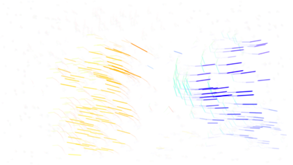

# TrAction: Action Recognition with Sparse Trajectories

## 摘要

**论文元信息**：本文标题为 *TrAction: Action Recognition with Sparse Trajectories*，作者为 Jan F. Meier、Felix B. Mueller、Alexander Ecker、Timo Lüddecke，arXiv ID 为 2606.03490，发布时间为 2026-06-03，类别为 cs.CV。论文链接为 https://arxiv.org/abs/2606.03490，PDF 链接为 https://arxiv.org/pdf/2606.03490。论文在首页摘要末尾声明代码链接为 https://github.com/ecker-lab/TrAction（见 PAGE 1）。但当前材料只提供论文全文抽取和代码链接，未提供仓库 README、核心源码文件或可核验行号，因此本文不写源码片段；源码级组件对应关系记为“证据不足”。

**一句话总结**：TrAction 将视频动作识别从密集 RGB 帧转向稀疏 2.5D 点轨迹，使用轨迹 Transformer 与 masked-trajectory pretraining，在运动主导数据集上取得可用精度，并证明轨迹特征与 DINOv2、V-JEPA 2 等外观模型互补（见 PAGE 1、PAGE 5、PAGE 6）。

本文的核心问题不是“如何再训练一个更大的视频模型”，而是“动作识别是否必须依赖密集 RGB 视频体”。作者指出，现代动作识别模型通常处理高内存、高计算量的 dense RGB video volumes，并容易利用 appearance/background shortcuts，即从物体、场景或背景中推断动作，而非真正建模动作的时间动态（见 PAGE 1）。TrAction 的回答是：用 sparse point trajectories，即稀疏点轨迹，作为一种由构造上弱化外观线索、强化运动线索的输入模态。

论文给出的主要结果包括：轨迹模型在 Something-Something V2 上达到 45.2% top-1，在 EPIC-Kitchens-100 verb prediction 上达到 54.1% top-1，在 Kinetics-400 上为 33.1% top-1（见 PAGE 5、PAGE 6）。这些结果低于强 RGB 图像/视频模型，但 TrAction 的重点并非替代外观模型，而是提供结构不同的 motion representation。与 DINOv2-B 16 帧特征融合后，SSv2 从 53.6% 提升到 62.3%，提升 8.7 个百分点；与 V-JEPA 2-L 融合后，SSv2 从 66.7% 提升到 68.3%，提升 1.6 个百分点（见 PAGE 6）。

从业务和研究视角看，本文适合视频理解、轻量行为识别、异常动作识别、轨迹特征融合等方向。其价值在于将“跟踪轨迹”从中间视觉表示提升为动作识别的主输入之一；风险在于指标距离主流 RGB 模型仍有限，依赖轨迹提取质量，并且公开数据集动作类别与实际业务类别存在分布差异（见 PAGE 8、PAGE 9）。

## 背景与动机

动作识别（action recognition）的标准任务是给定一个视频片段，预测其中发生的动作类别。传统深度学习路径从单帧 CNN、循环模型、3D 卷积网络发展到 video transformer，并进一步通过 masked autoencoding 或 feature prediction 等自监督目标进行大规模预训练（见 PAGE 2）。这一发展路线的共同特征是：输入通常仍然是密集的 RGB 帧序列。

密集 RGB 输入的第一个问题是计算扩展性。视频模型需要同时处理空间分辨率、时间帧数和通道维度，内存与计算成本随 clip length 和 resolution 增长而快速上升。论文在引言中明确指出，dense RGB video volumes 在长视频和高分辨率视频上容易变得难以处理（见 PAGE 1）。这也是许多实际视频理解系统难以直接使用长时间窗口高分辨率模型的原因。

第二个问题更偏向表示学习：密集 RGB 中包含大量外观、物体、场景和背景信息，模型可能利用这些 shortcut 完成分类。例如，在厨房数据中，“cutting” 往往与刀具绑定；在 Kinetics-400 中，很多动作类别从单帧即可判断（见 PAGE 5）。这类模型可能在 benchmark 上表现很强，但未必真正理解动作的时间结构。

历史上，研究者已经尝试过显式运动表示，例如 optical flow（光流）和 skeleton-based methods（基于骨架的方法）。光流抑制了纹理，但它仍是 dense per-pixel signal，并且可能泄漏物体轮廓、形状和布局信息（见 PAGE 2）。骨架方法具有较强的外观不变性，但依赖人体姿态估计器，主要适用于人体动作，难以自然覆盖任意场景元素的运动（见 PAGE 2、PAGE 3）。

TrAction 的动机正来自这一缺口：如果只跟踪少量点在视频中的位置变化，是否可以保留足够的动作动态，同时大幅降低外观偏差和输入规模？论文认为，现代 dynamic point trackers，例如 CoTracker3，已经能够在较长片段中维持点轨迹并处理遮挡，使 sparse point trajectories 成为可行的动作识别输入模态（见 PAGE 2、PAGE 3）。

本文与 TrackMAE、TRec、trajectory tokens 等相关工作的区别在于，TrAction 系统性评估“仅使用轨迹”的标准动作识别能力，并进一步分析轨迹与强视觉 foundation models 的互补性。论文明确强调，模型输入不包含 RGB frames、optical flow 或 appearance features，而是 exclusively on point trajectories（见 PAGE 3）。

## 预备知识

**Point trajectory（点轨迹）**指视频中某个查询点在多个时间帧上的位置序列。论文将动态点跟踪任务描述为：给定查询点 $(u, v, t)$，其中 $u$ 和 $v$ 是像素坐标，$t$ 是时间，tracker 需要预测该点在所有帧中的位置和可见性（见 PAGE 3）。在 TrAction 中，每条 2D 轨迹可写为：

$$
(u_t, v_t, \mathrm{vis}_t)^T_{t=1}
$$

其中 $u_t$ 和 $v_t$ 表示第 $t$ 帧的二维位置，$\mathrm{vis}_t \in [0,1]$ 表示该点在第 $t$ 帧是否可见或可见程度（见 PAGE 3）。人话解释：这个表达式把一个点在整段视频中的移动路径和遮挡状态记录下来。

**2.5D trajectory（2.5D 轨迹）**是在 2D 轨迹基础上加入 monocular depth estimation（单目深度估计）得到的表示。论文使用 Video Depth Anything 在每一帧位置 $(u_t, v_t)$ 处估计深度 $d_t$，因此每条轨迹变为：

$$
(u_t, v_t, d_t, \mathrm{vis}_t)
$$

其中 $d_t$ 表示该点在第 $t$ 帧的深度值（见 PAGE 4）。人话解释：2D 轨迹知道点在画面平面上的移动，2.5D 轨迹额外知道点在相对深度方向上的变化，这对“靠近/远离”“拿起/放下”等动作尤其重要。

**Masked autoencoding（掩码自编码）**是本文预训练方法的基础。TrAction 随机 mask 一部分轨迹 token，只把未被 mask 的 token 输入完整 encoder，然后用轻量 decoder 重建被 mask 轨迹的原始空间坐标 $(u,v,d)$，优化 normalized coordinate space 中预测值与真实值之间的 mean absolute error（见 PAGE 4、PAGE 5）。论文未给出该损失的编号公式，因此这里不伪造具体损失表达式；只能依据文字说明确认其为 L1/MAE 重建目标。

## 方法详解

### 创新一：将稀疏 2.5D 点轨迹作为动作识别主模态

TrAction 的第一个创新点是把动作识别输入从 dense RGB frames 转换为 sparse 2.5D point trajectories。论文在 Method 部分明确写道，模型 exclusively operates on point trajectories，不接收 RGB frames、optical flow 或 appearance features（见 PAGE 3）。这使模型被迫依赖运动几何，而不是从物体或背景中走捷径。

用途：展示 TrAction 为什么认为稀疏轨迹足以表达部分动作类别，并说明 Figure 1 中轨迹本身已经携带可读的动作线索。

读图要点：左侧轨迹可用于猜测动作类别，右侧概念图显示视频先被转换为 2.5D trajectories，再输入 Trajectory Transformer 输出 action class。

支撑的判断：Figure 1 支撑“稀疏轨迹是 sparse yet expressive video representation”的判断，即少量点轨迹虽然弱化外观，但仍能表达方向、靠近、远离、旋转等动作动态（见 PAGE 1）。

Figure 1 的核心意义不在于证明模型性能，而在于给出模态直觉：轨迹去除了纹理、颜色和大部分场景外观，却保留了运动方向和空间变化。论文在 PAGE 1 的图注中称，CoTracker3 得到的 motion trajectories 是 sparse yet expressive video representation。

用途：补充 Figure 1 中 TrAction 的整体任务形式，即从视频到轨迹，再到动作类别。

读图要点：图中强调 motion direction、2.5D trajectories、Trajectory Transformer 和 action class 的关系，说明本文不是在 RGB 上加辅助 loss，而是改变动作识别输入模态。

支撑的判断：该图支撑“TrAction 是 trajectory-based recognition pipeline，而非传统 RGB backbone 的附加模块”的判断（见 PAGE 1）。

输入轨迹首先由 CoTracker3 offline mode 提取。论文设定每个视频提取 $M=2500$ 条轨迹，训练时每次 forward 随机采样 $m=512$ 条轨迹，评估时使用全部 $M$ 条轨迹（见 PAGE 5）。这种训练策略既降低计算量，也构成一种数据增强：模型每次看到不同点集，需要学习对采样子集不敏感的表示。

轨迹查询点不是只在第一帧采样，而是在空间和时间上均匀随机采样。论文解释，如果只在单帧查询，会系统性漏掉视频中途进入画面的物体，而动作视频中动作开始时间很少恰好等于第 0 帧（见 PAGE 4）。这是一处重要设计，因为它直接对应真实视频中“物体进入/离开场景”的常见情况。

2.5D 的加入是本文方法的关键。论文将每条轨迹参数化为：

$$
p \in \mathbb{R}^{T \times 4}
$$

其中 $T$ 是轨迹长度帧数，4 个通道分别为 $(u, v, d, \mathrm{vis})$（见 PAGE 4）。人话解释：每条轨迹是一个长度为 $T$ 的序列，每个时间步记录横坐标、纵坐标、深度和可见性四个数。

为什么 2.5D 有效？从实验看，去掉 depth 会使 SSv2 从 40.9% 降到 31.4%，EK100 从 49.4% 降到 43.5%（见 PAGE 9）。这说明深度不是边缘辅助信号，而是动作识别中区分三维运动的重要信息。尤其对于 Something-Something V2 这种“把东西移近/移远/放上/拿下”的对象操作数据集，深度变化往往比外观更接近动作定义。

### 创新二：轨迹 tokenization 与 Transformer 编码

TrAction 的第二个创新点是为轨迹设计了简单但有效的 tokenization。每条轨迹被编码为一个 token，而不是把每一帧每一个点都作为 token。论文先对空间坐标 $u,v$ 做归一化：除以每个样本的 $\max(H,W)$，其中 $H$ 和 $W$ 是视频高度和宽度（见 PAGE 4）。这个选择不同于分别除以 $W$ 和 $H$，因为后者可能破坏宽高比例。

可以将这一归一化写为论文文字所述的符号关系：

$$
u' = \frac{u}{\max(H,W)}, \quad v' = \frac{v}{\max(H,W)}
$$

这不是论文编号公式，而是 PAGE 4 对归一化操作的直接数学化表述。人话解释：横纵坐标使用同一个尺度归一化，从而保持场景几何比例。

深度通道 $d$ 的归一化方式不同。论文说明，$d$ 在每个样本内被归一化为零均值，并具有与空间坐标相同的标准差（见 PAGE 4）。该设计的目的不是让深度有绝对物理单位，而是让 $u,v,d$ 三个几何通道处于共同数值尺度，避免模型训练时某一通道因量纲不同而主导优化。

随后，论文对三个几何通道 $(u,v,d)$ 应用 sinusoidal frequency encoding。每个标量通过 $L$ 个 frequency bands 变换，加上 visibility 通道后得到：

$$
p_{\mathrm{enc}} \in \mathbb{R}^{T \times (3 \cdot 2L + 1)}
$$

其中 $p_{\mathrm{enc}}$ 是编码后的轨迹序列，$L$ 是频率编码的频带数，$+1$ 对应 visibility（见 PAGE 4）。人话解释：模型不是直接看原始坐标，而是看经过正弦频率展开后的坐标，这有助于表达更细粒度的空间变化。

论文唯一明确编号的公式是轨迹 token 的 MLP 投影：

$$
z = W_2 \sigma(\mathrm{Dropout}(W_1 \mathrm{flatten}(p_{\mathrm{enc}}) + b_1)) + b_2
$$

其中 $z \in \mathbb{R}^{D}$ 是单条轨迹对应的 token，$W_1,W_2$ 和 $b_1,b_2$ 是 MLP 参数，$\sigma$ 是 GELU activation，$D$ 是 model dimension（见 PAGE 4, Equation 1）。人话解释：模型把一条轨迹在所有时间帧上的编码展开成一个长向量，再通过两层 MLP 压缩成一个固定维度的轨迹 token。

这种 tokenization 的一个重要后果是：单条轨迹内部的时间信息主要由 per-trajectory MLP 处理，而不同轨迹之间的空间关系、物体关系和运动组合由后续 self-attention layers 处理（见 PAGE 4）。换言之，TrAction 将 temporal reasoning 和 inter-point reasoning 做了结构上的分工。

用途：展示 Figure 2 中 TrAction 的三阶段流程：2.5D trajectory extraction、self-supervised pretraining、model architecture。

读图要点：A 阶段结合 CoTracker3 与 Video Depth Anything；B 阶段使用 MAE 风格预训练；C 阶段将轨迹 token 输入 self-attention layer，并通过 [CLS] token 输出 action class。

支撑的判断：Figure 2 支撑“本文方法由轨迹提取、MAE 预训练、Transformer 分类三部分构成”的判断（见 PAGE 4）。

Figure 2 还表明，TrAction 不是端到端从像素训练 tracker 与 classifier，而是采用模块化 pipeline：CoTracker3 负责 2D tracking，Video Depth Anything 负责深度估计，Trajectory Transformer 负责动作分类。论文选择这种模块化设计，是因为 2D tracking 方法相对成熟高效，而当前 3D tracking 往往需要昂贵的场景重建（见 PAGE 4）。

用途：补充 Figure 2 中模型架构和预训练路径，强调 encoder-decoder 与分类头的分离。

读图要点：预训练时 encoder 后接 decoder 重建轨迹；微调时 decoder 被丢弃，只保留 encoder，并通过 [CLS] token 与 linear head 分类。

支撑的判断：该图支撑“masked-trajectory pretraining 是服务于下游 encoder 表示学习，而非测试时额外模块”的判断（见 PAGE 4、PAGE 5）。

在 Transformer 输入侧，TrAction 添加一个 learnable [CLS] token 和 4 个 register tokens，再将 $m+5$ 个 token 输入标准 Transformer encoder layers（见 PAGE 4）。分类时，最终层 [CLS] token 通过 linear projection 映射到类别数，并使用 cross-entropy loss 训练（见 PAGE 4）。论文未给出 cross-entropy 的公式，因此不在这里补写通用公式。

### 创新三：Masked-trajectory pretraining

TrAction 的第三个创新点是将 masked autoencoding 思路迁移到 trajectory tokens。训练时，模型随机 mask 比例为 $p_{\mathrm{mask}}$ 的轨迹 token，仅将未 mask token 输入完整 encoder；decoder 阶段再引入 shared learned mask embedding 与 positional encoding，重建被 mask 轨迹的原始 $(u,v,d)$ 坐标（见 PAGE 4、PAGE 5）。

这一方法与 VideoMAE 等像素域 masked autoencoder 的思想相似，但重建目标不同。VideoMAE 通常重建被遮蔽的图像/视频 patch，而 TrAction 重建的是 normalized coordinate space 中的轨迹几何坐标（见 PAGE 5）。因此，预训练任务要求模型从少量可见轨迹推断被遮蔽点的运动结构，而不是复原颜色纹理。

论文说明 decoder 是轻量结构，由 bottleneck MLP 和两个 transformer layers 组成；预训练后 decoder 被丢弃，只迁移 encoder weights 到下游分类（见 PAGE 5）。这种 asymmetric encoder-decoder 设计的意义在于降低预训练成本，同时迫使 encoder 学到可迁移的轨迹表示。

预训练带来的性能提升非常明确。Table 4(a) 显示，无预训练时 SSv2 为 40.9%、EK100 为 49.4%；使用 K400 预训练后分别提升到 45.8% 和 53.9%；使用 SSv2 预训练后为 45.6% 和 53.8%；使用 K400+SSv2 后为 45.8% 和 54.5%（见 PAGE 8、PAGE 9）。作者据此认为 masked-trajectory pretraining 捕获的是较通用的 motion structure，而不是强依赖某个数据集的模式（见 PAGE 9）。

从方法论角度看，这一预训练目标是本文将轨迹模态推向可用性能的重要环节。如果没有预训练，轨迹模型仍能工作，但性能明显低一个台阶；如果使用预训练，轨迹模型在 SSv2 和 EK100 上都获得约 5 个百分点提升（见 PAGE 2、PAGE 9）。

### 代码状态与源码证据

论文在 PAGE 1 明确给出代码链接 https://github.com/ecker-lab/TrAction。因此，代码状态应标记为“论文声明公开代码”。然而，当前任务材料没有提供仓库 README、核心源码文件、配置文件或可核验行号；在受限材料条件下，无法判断具体函数名、类名、文件路径与论文组件的对应关系。

因此，本文不提供代码段。更准确地说：本文提供了可确认的公开代码链接证据，但没有提供可确认的源码内容证据；源码级分析、文件路径、行号和方法到实现的逐段对应均为证据不足。为避免伪造，不写“看似合理”的 PyTorch 类或训练代码。

## 实验分析

### 实验设置概述

论文评估了五类数据集：Kinetics-400、EPIC-Kitchens-100、Something-Something V2、IARD 和 Chirality-in-Action（见 PAGE 5、PAGE 16、PAGE 17）。其中 K400 被视为 appearance-dominated reference；SSv2 强调 fine-grained temporal reasoning；EK100 只报告 verb prediction，因为 noun recognition 本质上更依赖外观（见 PAGE 5）。

实现上，每个视频提取 $M=2500$ 条轨迹，默认轨迹长度为 32 帧。训练时随机采样 $m=512$ 条，评估时使用全部轨迹；模型由 6 层 Transformer encoder 构成，hidden dimension 为 $D_{\mathrm{model}}=288$，总参数少于 8M（见 PAGE 5）。超参数表显示预训练和微调均使用 AdamW、learning rate 2e-4、cosine scheduler、warmup ratio 0.1，预训练 300 epochs，微调 15 epochs（见 PAGE 19）。

### 主要结果：轨迹单模态与视觉模型互补

| 模型 | 输入规模 | SSv2 Top-1 | EK100 Top-1 | K400 Top-1 | 证据 |
|---|---:|---:|---:|---:|---|
| Ours | 32×2500×4 = 0.3M | 45.2 | 54.1 | 33.1 | Table 1, PAGE 6 |
| I3D flow-only | 16×224²×2 = 1.6M | 38.4 | 54.0 | 63.4* | Table 1, PAGE 6 |
| DINOv2-B center | 1×224²×3 = 0.2M | 30.8 | 44.1 | 66.5 | Table 1, PAGE 6 |
| DINOv2-B 16 frames | 16×224²×3 = 2.4M | 53.6 | 59.1 | 73.5 | Table 1, PAGE 6 |
| SigLIP-2-B | 16×224²×3 = 2.4M | 51.5 | 56.6 | 73.6 | Table 1, PAGE 6 |
| VideoPrism-B | 16×224²×3 = 2.4M | 60.5 | 62.9 | 76.6 | Table 1, PAGE 6 |
| V-JEPA 2-L | 16×256²×3 = 3.1M | 66.7 | 67.2 | 73.0 | Table 1, PAGE 6 |

表格解读：轨迹单模态在 SSv2 上优于 flow-only I3D，45.2% 对 38.4%，说明稀疏轨迹对 motion-driven object interaction 具有较强表达能力。但在 K400 上，Ours 仅 33.1%，远低于 RGB/视频模型，符合论文对 K400 appearance bias 的判断：许多 K400 类别可由单帧外观识别，稀疏轨迹并非优势模态（见 PAGE 5、PAGE 6）。

| 融合设置 | SSv2 Base | SSv2 + Ours | SSv2 增益 | EK100 Base | EK100 + Ours | EK100 增益 | 证据 |
|---|---:|---:|---:|---:|---:|---:|---|
| DINOv2-B center + Ours | 30.8 | 56.8 | +26.0 | 44.1 | 59.5 | +15.4 | Table 1, PAGE 6 |
| DINOv2-B 16 frames + Ours | 53.6 | 62.3 | +8.7 | 59.1 | 63.5 | +4.4 | Table 1, PAGE 6 |
| SigLIP-2-B + Ours | 51.5 | 61.4 | +9.9 | 56.6 | 63.4 | +6.8 | Table 1, PAGE 6 |
| VideoPrism-B + Ours | 60.5 | 63.5 | +3.0 | 62.9 | 64.5 | +1.6 | Table 1, PAGE 6 |
| V-JEPA 2-L + Ours | 66.7 | 68.3 | +1.6 | 67.2 | 68.3 | +1.1 | Table 1, PAGE 6 |

表格解读：融合实验是本文最有说服力的结果之一。随着视觉 backbone 变强，轨迹增益变小，但始终为正。DINOv2 center-frame 与轨迹融合的提升最大，说明单帧图像模型几乎没有时间动态；V-JEPA 2-L 已经是强视频自监督模型，但仍可被轨迹提升，说明 RGB 预训练没有完全吸收动作的稀疏运动结构（见 PAGE 5、PAGE 6）。

Figure 3 的类别级分析进一步解释了这种互补性。轨迹-only 模型在 camera motion、directional motion 等类别上表现强，例如 turn camera right、turn camera left、approach something with camera 等；但在依赖物体身份或场景语义的类别上表现弱，例如 poke hole in something soft、pretend spread air、spill something next to something 等（见 PAGE 6）。这支持一个更细的结论：轨迹不是通用替代模态，而是对 motion-discriminative classes 特别有效。

Figure 4 展示了 last-layer CLS attention overlay。论文指出，某个 attention head 的 90% 注意力落在 5% 的轨迹上，并集中于 manipulated object，而不是移动的手或手臂；其他 heads 关注不同区域和运动（见 PAGE 6、PAGE 7）。作者也明确说明这是 qualitative view，不据此作定量声明（见 PAGE 7）。这一谨慎表述值得保留：注意力可用于解释模型关注区域，但不能直接证明因果机制。

### 诊断实验：外观不变性与时间反转敏感性

| 模型 | 预训练数据 | IARD Action | IARD Identity | 证据 |
|---|---|---:|---:|---|
| Random | – | 20.0 | 20.0 | Table 2(a), PAGE 7 |
| DINOv2-B | LVD-142M | 66.0 | 99.0 | Table 2(a), PAGE 7 |
| VideoMAE-L | K400 | 73.4 | 99.1 | Table 2(a), PAGE 7 |
| V-JEPA-L | VideoMix2M | 82.0 | 96.2 | Table 2(a), PAGE 7 |
| DisMo-B | 2.8M clips | 90.7 | 23.8 | Table 2(a), PAGE 7 |
| Ours | K400, SSv2 | 76.6 | 27.3 | Table 2(a), PAGE 7 |

表格解读：IARD identity accuracy 越高，说明特征越容易恢复人物身份，也就越保留外观信息。RGB 预训练模型 identity accuracy 接近 99%，而 Ours 为 27.3%，接近随机 20.0% 和专门抑制外观的 DisMo-B 23.8%。这支持作者关于“轨迹由构造上弱外观”的论断；同时 Ours action accuracy 为 76.6%，说明它并非只是不含身份信息，而是保留了动作相关动态（见 PAGE 7）。

| 模型 | 预训练数据 | CiA-SSv2 Accuracy | 证据 |
|---|---|---:|---|
| Random | – | 50.0 | Table 2(b), PAGE 7 |
| DINOv2-S | LVD-142M | 79.7 | Table 2(b), PAGE 7 |
| SigLIP 2-B | WebLI | 76.8 | Table 2(b), PAGE 7 |
| VideoMAE-L | K400 | 85.7 | Table 2(b), PAGE 7 |
| V-JEPA-L | VideoMix2M | 85.4 | Table 2(b), PAGE 7 |
| Ours | K400, SSv2 | 86.2 | Table 2(b), PAGE 7 |

表格解读：Chirality-in-Action 测试模型区分正放和反放动作的能力，例如 opening/closing 或方向相反的动作。Ours 达到 86.2%，高于 VideoMAE-L 和 V-JEPA-L，说明稀疏轨迹虽然输入少，但对 temporal direction 和 motion asymmetry 保留充分。这一结果直接支撑论文关于 time-awareness 的论点（见 PAGE 7）。

### 与 optical flow 的互补性比较

| 基础模型 | 附加模态 | 附加输入规模 | SSv2 | EK100 | 证据 |
|---|---|---:|---:|---:|---|
| DINOv2-B | 无 | 2.4M | 53.6 | 59.1 | Table 3, PAGE 8 |
| DINOv2-B | + I3D flow | 1.6M | 60.1 (+6.5) | 64.1 (+5.0) | Table 3, PAGE 8 |
| DINOv2-B | + Ours | 0.3M | 62.3 (+8.7) | 63.5 (+4.4) | Table 3, PAGE 8 |
| V-JEPA-L | 无 | 3.1M | 66.7 | 67.2 | Table 3, PAGE 8 |
| V-JEPA-L | + I3D flow | 1.6M | 67.9 (+1.2) | 69.1 (+1.9) | Table 3, PAGE 8 |
| V-JEPA-L | + Ours | 0.3M | 68.3 (+1.6) | 68.3 (+1.1) | Table 3, PAGE 8 |

表格解读：轨迹与光流都能补充视觉模型，但二者优势不同。Ours 在 SSv2 上强于 I3D flow，且输入规模只有 0.3M，约为 flow 的五分之一；EK100 上 I3D flow 更强，论文将其解释为 EK100 中厨房动作与工具/外观关联更强，光流仍可能携带更丰富的形状和局部外观线索（见 PAGE 8）。

### 消融实验：哪些设计真正重要

| 消融项 | 设置 | SSv2 | EK100 | 证据 |
|---|---|---:|---:|---|
| 预训练数据 | no | 40.9 | 49.4 | Table 4(a), PAGE 9 |
| 预训练数据 | K400 | 45.8 | 53.9 | Table 4(a), PAGE 9 |
| 预训练数据 | SSv2 | 45.6 | 53.8 | Table 4(a), PAGE 9 |
| 预训练数据 | both | 45.8 | 54.5 | Table 4(a), PAGE 9 |
| mask ratio | 0.60 | 45.2 | 54.1 | Table 4(b), PAGE 9 |
| mask ratio | 0.75 | 45.6 | 54.1 | Table 4(b), PAGE 9 |
| mask ratio | 0.90 | 45.8 | 53.9 | Table 4(b), PAGE 9 |
| mask ratio | 0.95 | 45.1 | 52.6 | Table 4(b), PAGE 9 |
| 输入编码 | base | 40.9 | 49.4 | Table 4(c), PAGE 9 |
| 输入编码 | w/o sine-enc. | 40.7 | 48.5 | Table 4(c), PAGE 9 |
| 输入编码 | w/o pos enc. | 38.4 | 48.1 | Table 4(c), PAGE 9 |
| 输入编码 | relative coords | 32.0 | 42.1 | Table 4(c), PAGE 9 |
| 模态 | base | 40.9 | 49.4 | Table 4(d), PAGE 9 |
| 模态 | w/o depth | 31.4 | 43.5 | Table 4(d), PAGE 9 |
| 模态 | w/o visibility | 39.3 | 48.6 | Table 4(d), PAGE 9 |
| 推理采样 | random 512 | 40.0 | 48.7 | Table 4(e), PAGE 9 |
| 推理采样 | random 512×5 | 40.8 | 49.3 | Table 4(e), PAGE 9 |
| 推理采样 | all | 40.9 | 49.4 | Table 4(e), PAGE 9 |

表格解读：最关键的两个设计是 depth 和 pretraining。去掉 depth 在 SSv2 上损失 9.5 个百分点，说明 2.5D 是 TrAction 的核心，而非可有可无的增强。预训练约带来 5 个百分点提升，说明轨迹 Transformer 需要自监督阶段学习通用运动结构。相对坐标性能严重下降，说明绝对空间位置仍然重要；这与“动作发生在哪里、相对场景如何移动”有关（见 PAGE 9）。

Figure 5 的帧数与轨迹数实验显示，帧数增加会提升性能，但超过 8 到 16 帧后收益趋于饱和；轨迹数量增加也持续有帮助，但 256 条以后边际收益较小（见 PAGE 8）。这对实际部署有价值：如果业务系统受限于跟踪成本，可以考虑减少轨迹数或帧数，但需要验证具体类别是否仍由粗粒度运动决定。

## 讨论

TrAction 最适合的场景是 motion informative tasks，即动作类别主要由运动方向、时间顺序、相对位移和物体交互动态决定的任务。SSv2、Chirality-in-Action 以及部分 egocentric verb recognition 都符合这一条件（见 PAGE 5、PAGE 7）。在这些场景中，轨迹模态能够以较小输入规模提供外观模型缺失的时间结构。

TrAction 不适合将外观作为主要判别依据的任务。论文在 K400 上的结果已经说明，若类别强烈依赖场景、物体或单帧姿态，轨迹-only 模型会显著落后于 RGB 模型（见 PAGE 5、PAGE 6、PAGE 9）。因此，合理使用方式不是用 TrAction 取代 DINOv2、V-JEPA 2 或 VideoPrism，而是将其作为互补运动分支。

从方法学角度看，本文的贡献在于将动作识别的“显式运动模态”重新推到前台。光流曾是这一角色，但它仍是 dense signal，并可能泄漏形状和布局；骨架方法依赖人体检测；点轨迹则更通用，可以跟踪任意场景元素（见 PAGE 2、PAGE 3）。这为未来的 appearance-motion disentanglement、长视频轻量建模和多模态融合提供了一个清晰方向。

从工程角度看，TrAction 的 pipeline 仍需要先运行 CoTracker3 和 Video Depth Anything，轨迹和深度特征预计算成本不低。论文报告跨数据集轨迹提取与深度估计约需 360 A100 GPU-hours，项目总计算量约 900 A100 GPU-hours（见 PAGE 19）。不过，一旦缓存轨迹，训练和微调成本较低，例如 K400 预训练约 12 A100 GPU-hours，K400 微调约 0.75 A100 GPU-hours（见 PAGE 19）。

## 局限分析

作者自述的第一项局限是，TrAction 依赖独立且计算昂贵的 trajectory extraction step。论文指出这是一项 one-time cost，可以通过缓存轨迹在多次训练中摊销，但提取本身仍构成系统成本（见 PAGE 9）。在实际业务链路中，如果视频流量大、实时性要求高，前置跟踪和深度估计可能成为瓶颈。

作者自述的第二项局限是，现代 point trackers 在 highly dynamic scenarios、rapid camera motion 或 abrupt scene changes 中可能失败（见 PAGE 9）。这意味着 TrAction 的性能上界受 tracker 质量约束：若轨迹漂移、断裂或遮挡估计错误，分类器无法从错误轨迹中恢复真实动作。该风险对运动剧烈、镜头快速切换、低质量视频尤其重要。

作者自述的第三项局限是，motion trajectories 只在 motion informative tasks 中有益；对于 Kinetics-400、UCF-101、HMDB-51 等由静态场景外观主导的数据集，轨迹并不充分（见 PAGE 9）。这与 Table 1 中 K400 性能低的现象一致：Ours 在 K400 上只有 33.1%，而多个 RGB 模型达到 66% 到 76% 区间（见 PAGE 6）。

我的独立判断是，TrAction 的下游业务适配还面临类别语义迁移问题。SSv2 的类别模板强调方向和对象操作，天然适合轨迹；而真实业务中的异常动作或细粒度操作往往同时依赖动作、物体身份、场景区域和人机交互上下文。因此，即使 TrAction 在公开 benchmark 上证明了互补性，也需要在业务类别、摄像头视角、跟踪稳定性和误报成本上重新验证。

另一个证据不足之处是源码实现细节。论文声明了代码链接（见 PAGE 1），但当前材料没有包含仓库内容，因此无法确认训练配置、模型实现、轨迹缓存格式、数据增强代码与论文描述是否完全一致。本文不进行源码级判断，避免将论文方法描述误写成代码事实。

## 结论

TrAction 证明了 sparse point trajectories 可以作为动作识别的一种有效输入模态。它使用 CoTracker3 提取 2D 点轨迹，用 Video Depth Anything 增强为 2.5D 表示，再通过轨迹 Transformer 和 masked-trajectory pretraining 学习动作特征（见 PAGE 3、PAGE 4、PAGE 5）。在 SSv2 和 EK100 上，轨迹-only 模型分别达到 45.2% 和 54.1%，并在 Chirality-in-Action 上超过若干大型视频模型，显示出较强的时间方向敏感性（见 PAGE 6、PAGE 7）。

本文最重要的结论不是“轨迹优于 RGB”，而是“轨迹与 RGB 表示结构互补”。在 DINOv2、SigLIP-2、VideoPrism、V-JEPA 2 等不同强度的视觉 backbone 上，加入 TrAction 均能提升 SSv2 和 EK100 top-1 accuracy（见 PAGE 6）。这说明现代视频模型即便规模很大，也未必完全内化动作所需的稀疏运动结构。

对于视频理解团队，TrAction 的实际启示是：如果任务强依赖运动方向、时序顺序、靠近/远离、物体交互轨迹，轨迹分支值得作为轻量互补特征探索；如果任务主要由场景和物体外观决定，则轨迹-only 模型风险较高，建议与强 RGB/视频特征融合，而不是单独部署。

## 证据索引

| 关键事实 | PAGE 证据 |
|---|---|
| 论文标题、作者、摘要、代码链接、核心结果 45% SSv2 / 54% EK100、融合 DINOv2 与 V-JEPA 2 增益 | PAGE 1 |
| dense RGB video volumes 的计算问题、appearance/background shortcuts、点轨迹作为替代模态的动机 | PAGE 1、PAGE 2 |
| 光流、骨架、点轨迹相关工作与本文定位 | PAGE 2、PAGE 3 |
| TrAction 模型 exclusively on point trajectories，不输入 RGB/flow/appearance features | PAGE 3 |
| CoTracker3 轨迹定义 $(u_t,v_t,\mathrm{vis}_t)$、随机时空查询点采样 | PAGE 3、PAGE 4 |
| 2.5D 轨迹 $(u_t,v_t,d_t,\mathrm{vis}_t)$，Video Depth Anything 深度增强 | PAGE 4 |
| 坐标归一化、深度归一化、sinusoidal frequency encoding、$p_{\mathrm{enc}}$ 维度 | PAGE 4 |
| MLP token 投影 Equation (1)：$z=W_2\sigma(\mathrm{Dropout}(W_1\mathrm{flatten}(p_{\mathrm{enc}})+b_1))+b_2$ | PAGE 4 |
| [CLS] token、4 register tokens、Transformer encoder、classification head | PAGE 4 |
| masked-trajectory pretraining、asymmetric encoder-decoder、MAE/L1 重建目标 | PAGE 4、PAGE 5 |
| 数据集设置、$M=2500$ 轨迹、训练采样 $m=512$、模型小于 8M 参数 | PAGE 5 |
| Table 1：trajectory-only 结果与视觉模型融合结果 | PAGE 6 |
| Figure 3：SSv2 类别级表现与融合增益 | PAGE 6 |
| Figure 4：last-layer CLS attention overlay 及定性解释 | PAGE 6、PAGE 7 |
| Table 2(a)：IARD appearance-invariance / identity recovery 结果 | PAGE 7 |
| Table 2(b)：Chirality-in-Action time-reversal sensitivity 结果 | PAGE 7 |
| Figure 5：帧数与轨迹数 scaling behavior | PAGE 8 |
| Table 3：trajectory 与 optical flow 作为互补模态的比较 | PAGE 8 |
| Table 4：预训练、mask ratio、encoding、depth、visibility、inference sampling 消融 | PAGE 9 |
| 作者自述局限：轨迹提取成本、tracker 在动态场景中困难、轨迹仅适合 motion informative tasks | PAGE 9 |
| 结论：轨迹是 viable modality，与 RGB 表示互补，但不能替代 appearance-based video understanding | PAGE 9、PAGE 10 |
| Appendix A 数据集统计 Table 5 | PAGE 16、PAGE 17 |
| 训练、baseline、fusion、IARD、CiA 详细协议 | PAGE 17、PAGE 18 |
| Hyperparameters Table 6 | PAGE 19 |
| 计算资源：轨迹提取约 360 A100 GPU-hours，总项目约 900 A100 GPU-hours | PAGE 19 |
| Broader impacts 与隐私/高风险部署提醒 | PAGE 19、PAGE 20 |
