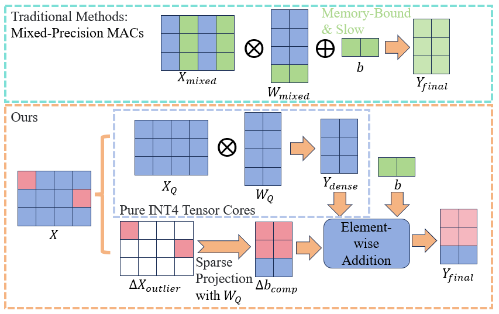
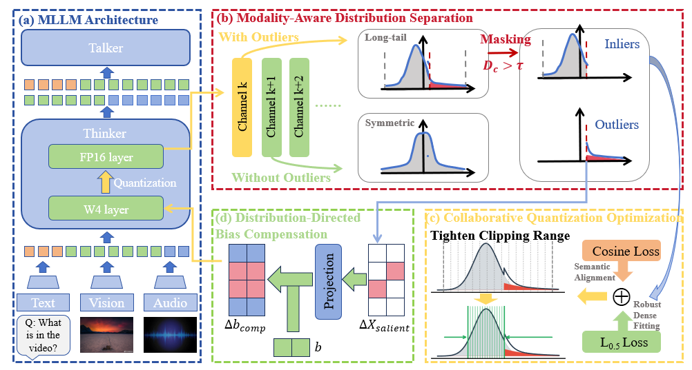
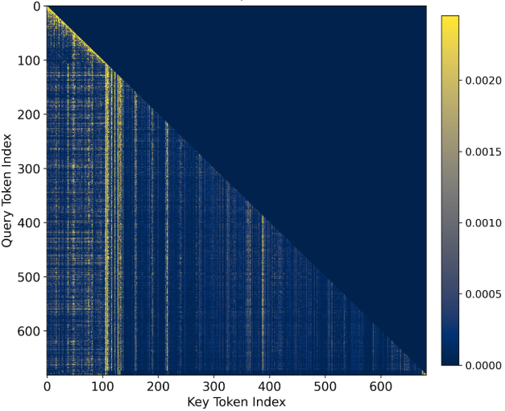
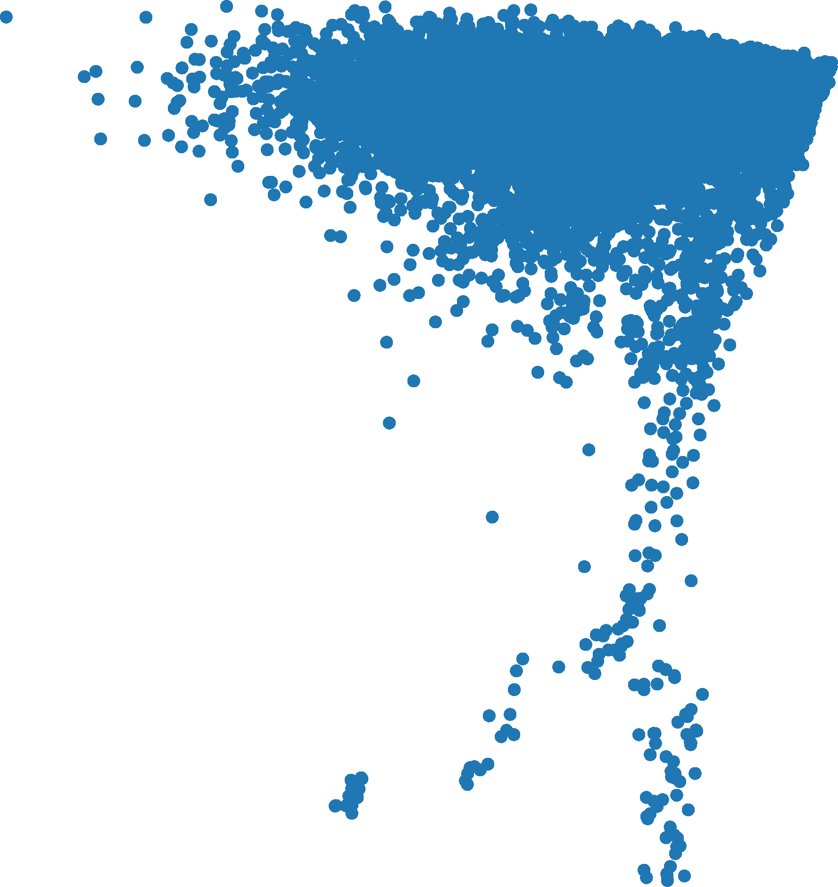

# MorphoQuant: Modality-Aware Quantization for Omni-modal Large Language Models

## 摘要

### 论文元信息

| 项目 | 内容 |
|---|---|
| 标题 | MorphoQuant: Modality-Aware Quantization for Omni-modal Large Language Models |
| 作者 | Yue Wu, Changyuan Wang, Zixuan Wang, Shilin Ma, Yansong Tang |
| arXiv ID | 2606.04349 |
| 链接 | https://arxiv.org/abs/2606.04349；https://arxiv.org/pdf/2606.04349 |
| 发布时间 | 任务元信息给出 2026-06-04T04:00:00+00:00；PDF 页脚显示 arXiv v1 日期为 3 Jun 2026，见 PAGE 1 |
| 研究对象 | Omni-modal Large Language Models，实验主体为 Qwen2.5-Omni 3B，见 PAGE 10 |
| 量化目标 | Post-Training Quantization 下的 W4A4，即 4-bit weight 与 4-bit activation，见 PAGE 2、PAGE 10 |
| 代码状态 | 论文全文未给出可确认代码仓库链接；本次公开检索未确认官方实现。因此代码分析部分不提供代码段，写作结论为“本文未提供可确认的公开代码”。 |

表格解读：这篇论文的定位不是一般视觉语言模型压缩，而是面向 audio、video、image、text 同时接入的 omni-modal LLM。其工程目标是把 Qwen2.5-Omni 这类统一多模态模型推到 W4A4 的极低比特部署区间，同时避免传统 4-bit 激活量化在跨模态分布差异上产生灾难性精度损失，见 PAGE 1 至 PAGE 3。

一句话总结：MorphoQuant 的核心思想是先用 Distribution-Aware Bias Compensation 保住少量长尾离群激活，再用 Morphology-Directed Quantization Function Optimization 为大多数近似零对称 inlier 重新优化量化边界，从而在 Qwen2.5-Omni 上取得强于既有 W4A4 方法、部分指标超过 W4A16 baseline 的结果，见 PAGE 8 至 PAGE 14。

本文建议将 MorphoQuant 归入“小模型 / 部署”方向跟踪。其业务价值在于为多模态助手、视频理解 VLM、音视频端侧推理和端侧大模型压缩提供量化思路；但由于实验集中在 Qwen2.5-Omni 3B 与 transformer-style OLLM，迁移到检测、跟踪、姿态估计等视觉专用网络的有效性证据不足，见 PAGE 10。

## 背景与动机

Omni-modal Large Language Models，简称 OLLMs，是指能够在统一模型主干中处理多类感知输入的大语言模型。论文将其任务范围概括为视觉问答、embodied AI 以及更广泛的复杂推理，并指出这类模型依赖大规模多模态数据和巨大参数规模，因此在真实部署中受到显存、计算量和自回归推理内存带宽的共同制约，见 PAGE 1。

模型压缩是应对这一部署瓶颈的直接路径。论文在 Introduction 中列举了 pruning、low-rank decomposition、efficient architecture design 与 quantization 等方向，其中 Post-Training Quantization，简称 PTQ，被认为具有实践优势：它用很小的 calibration dataset 将浮点表示映射到低比特整数表示，避免完整重训练成本，同时有机会降低推理开销，见 PAGE 2。

现有 PTQ 在单模态 LLM 上已有较充分积累。论文回顾了 SmoothQuant、QLoRA、AWQ、OmniQuant、SpinQuant 等方法：SmoothQuant 处理 channel-wise activation outlier 并支持 W8A8；QLoRA 用 4-bit NormalFloat 存储预训练权重；AWQ 用激活统计识别 salient channels 做 W4A16 weight-only quantization；OmniQuant 与 SpinQuant 则进一步引入 learnable clipping、equivalent transformations 或 learned rotations 来改善低比特 PTQ，见 PAGE 3 至 PAGE 4。

但是 omni-modal 场景比 text-only LLM 或 image-text VLM 更复杂。论文强调，Qwen2.5-Omni 这类模型会同时接收 audio、video、image、text，模态间信息分布高度异质，表现为 activation outlier pattern 与 dense inlier body 的形态差异。传统统一量化函数难以同时适配不同模态的动态范围：量化范围过宽会牺牲密集 inlier 的精细分辨率，量化范围过窄又会裁剪关键 outlier，见 PAGE 2、PAGE 6、PAGE 7。

相关的 multimodal quantization 方法也已经意识到模态差异。例如 Q-VLM 关注 vision-language model 的 cross-layer dependency 与 visual encoder optimization，MBQ 讨论 language 与 vision token 的量化敏感性差异，MQuant 设计 modality-specific static quantization、token reordering 和 rotation magnitude suppression，见 PAGE 5。然而 MorphoQuant 认为这些方法主要面向 bimodal 或 multimodal VLM，而 true omni-modal LLM 在 audio、video、image、text 统一主干下的分布裂缝仍未被系统解决，见 PAGE 3、PAGE 5。

本文的出发点因此可以概括为：不是简单把已有 W4A4 PTQ 套到 Qwen2.5-Omni，而是针对 omni-modal activation 的“形态”进行拆解。作者把问题定义为 cross-modal distribution chasm，并将解法拆成两个层次：第一，保护少量高价值的 long-tailed outliers；第二，在 outlier 被解耦后，为大量 zero-symmetric inliers 重新优化量化函数，见 PAGE 7 至 PAGE 10。

## 预备知识

PTQ 的基本操作是 uniform quantization。给定 full-precision activation tensor $X$ 与 weight matrix $W$，论文将 $k$-bit 均匀量化写为公式 (1)，见 PAGE 6：

$$
X_Q = \operatorname{clip}\left(\left\lfloor \frac{X}{s_x}\right\rceil, Q_{\min}, Q_{\max}\right),
\quad
W_Q = \operatorname{clip}\left(\left\lfloor \frac{W}{s_w}\right\rceil, Q_{\min}, Q_{\max}\right)
$$

其中 $X_Q$ 表示量化后的激活，$W_Q$ 表示量化后的权重，$s_x$ 与 $s_w$ 分别是 activation scale 与 weight scale，$[Q_{\min}, Q_{\max}]$ 是整数网格可表示范围。直观解释是：连续浮点数先除以 scale，再四舍五入到整数网格，最后被裁剪到低比特可表达的边界内。

论文进一步把 activation quantization error $\Delta X$ 拆成 clipping error 与 rounding error，见公式 (2)，PAGE 6：

$$
\Delta X =
\underbrace{(X_{\text{out}}-\alpha_c)}_{E_{\text{clip}}}
+
\underbrace{(X_{\text{in}}-s_x X_Q)}_{E_{\text{round}}}
$$

这里 $X_{\text{out}}$ 表示 outliers，$X_{\text{in}}$ 表示 inliers，$\alpha_c$ 是由 scale 推导出的 clipping threshold。这个公式说明了低比特量化的基本冲突：保 outlier 会扩大范围并增加 inlier rounding error，保 inlier 会收紧范围并增加 outlier clipping error。

传统 PTQ 常以输出重构误差最小化为目标，论文用公式 (3) 表示，见 PAGE 6：

$$
\min_{s_x,s_w}
\left\|WX-(s_w W_Q)(s_x X_Q)\right\|_2^2
$$

这个目标函数的含义是让量化层输出尽量接近浮点层输出。但在 omni-modal activation 中，$\ell_2$ reconstruction objective 会被极端 outlier 与跨模态分布差异牵引，因此并不自然适合 W4A4 这样极低比特的 activation compression，见 PAGE 6。

OLLM 的统一输入形式被论文写为公式 (4)，见 PAGE 6：

$$
X_{\text{omni}}=
\operatorname{Concat}\left(\operatorname{Proj}_m(\operatorname{Enc}_m(I_m))\right),
\quad
m\in\{\text{Audio}, \text{Video}, \text{Image}, \text{Text}\}
$$

这里 $I_m$ 是第 $m$ 个模态的输入，$\operatorname{Enc}_m$ 是对应模态 encoder，$\operatorname{Proj}_m$ 是投影到统一表示空间的模块，$\operatorname{Concat}$ 表示拼接。直观上，audio、video、image、text 最终被汇入同一 backbone，这种架构便利了统一推理，却也把不同模态的统计分布压到同一个量化函数中，见 PAGE 6 至 PAGE 7。

因此，MorphoQuant 并不是单纯寻找一个更好的全局 scale，而是把 activation 按 channel 与形态拆开：长尾离群通道由 DABC 保护，大多数 inlier 则由 MDQFO 重新优化量化边界。这个预设贯穿论文的 Figure 2 和 Section 3.3、3.4，见 PAGE 4、PAGE 8 至 PAGE 10。

## 方法详解

### Cross-modal distribution chasm：问题不是“有 outlier”，而是“不同模态的 outlier 形态不同”

**图 1 用途**：说明传统 mixed-precision outlier protection 与 DABC 在执行路径上的差异。论文用该图强调，传统方法需要蓝色 INT4 与绿色 FP16 的 memory-interleaved operation，而 DABC 将大多数 activation 放在 pure INT4 Tensor Cores 中计算，只把红色 sparse outliers 送入轻量投影路径，见 PAGE 2。

**读图要点**：上半部分代表传统 mixed-precision 方案，核心问题是 INT4 与 FP16 交错访问导致 fragmented memory access；下半部分代表 DABC，将 dense activation 与 sparse outlier correction 分离。**支撑的判断**：MorphoQuant 的工程目标不是保留大量高精度通道，而是在保留 4-bit dense matrix multiplication 的前提下补偿 outlier loss，见 PAGE 2、PAGE 8 至 PAGE 9。

论文在 Section 3.2 中给出了三类观察：第一，某些 channel 存在 significant outlier tails；第二，visual tokens 与 text tokens 在 PCA 空间中表现出 cross-modal morphological disparity；第三，attention map error 在 modality boundary 附近更明显，见 PAGE 7。这些观察把问题从一般“激活分布有长尾”推进到“跨模态语义边界会被量化误差破坏”。

**图 2 用途**：给出 MorphoQuant 的整体框架。该图从 OLLM architecture、modality-aware distribution separation、distribution-directed bias compensation 和 collaborative quantization optimization 四个部分描述方法流程，见 PAGE 4。

**读图要点**：输入端是 audio、video、image、text 等 omni-modal inputs 汇入 Qwen2.5-Omni；中间通过 dispersion score $D_c$ 找出 long-tailed channels；随后将 activation 分离为 symmetric inliers 与 sparse outliers；最后通过 composite loss，即 $L_p$ 与 $L_{\cos}$，优化 inlier quantization boundaries。**支撑的判断**：MorphoQuant 的两个主模块 DABC 与 MDQFO 是串联关系，而不是两个孤立技巧，见 PAGE 4、PAGE 8 至 PAGE 10。

**图 3 用途**：展示 activation distribution、PCA 与 attention map error 对 cross-modal distribution chasm 的经验支撑。论文 caption 指出左图是存在 extreme long tail 的层，中图是 Video-MME activation input 的 PCA，右图是 attention map quantization error，见 PAGE 7。

**读图要点**：论文给出的 activation statistics 包括最小值 -414.00、最大值 42.00、均值 -0.33 与标准差 9.41；这说明某些层的动态范围被一侧长尾强烈拉伸。**支撑的判断**：如果用一个全局 uniform scale 同时覆盖 -414 到 42 的区间，dense inliers 会被迫使用很粗的量化步长；如果收紧区间，则 outlier clipping error 会显著增加，见 PAGE 7。

**图 3 补充用途**：进一步支撑跨模态边界处的量化退化。由于提供的 figure asset 中包含两个 PAGE 7 图像文件，本文仅使用给定路径，不额外引用不存在的图片资产。

**读图要点**：PAGE 7 的文字说明强调，PCA 显示 visual tokens 与 text tokens 具有不同 magnitude 与 outlier morphology，attention map error 主要出现在 modal boundary line。**支撑的判断**：MorphoQuant 要解决的不是单一模态内的量化精度，而是跨模态语义对齐在 4-bit activation bottleneck 下的保持问题，见 PAGE 7。

### DABC：用 channel-wise dispersion 找出需要保护的长尾通道

Distribution-Aware Bias Compensation，简称 DABC，是 MorphoQuant 的第一个核心模块。它的目标是把少数 salient channels 的 clipping residual 从低比特网格中取出，并吸收到 channel-wise bias compensation 中。论文明确声称，这样可以保留关键 outlier magnitude，同时让多数 inlier 使用更高精度的紧凑量化网格，见 PAGE 7 至 PAGE 8。

DABC 首先为每个 channel $c$ 计算 dispersion score $D_c$，见公式 (5)，PAGE 8：

$$
D_c =
\frac{|\max(X_c)-\min(X_c)|}{\|X_c\|_1+\epsilon}
$$

其中 $X_c$ 表示 channel $c$ 的输入激活，$\epsilon$ 用于数值稳定，分子 $|\max(X_c)-\min(X_c)|$ 衡量该 channel 的动态范围，分母 $\|X_c\|_1$ 与 inlier body 的密度相关。直观解释是：如果一个 channel 的极值范围很大，但总体绝对值质量主要集中在较小区域，该 channel 很可能具有长尾 outlier，应被特殊处理。

随后，论文按 $D_c$ 降序排序，并用阈值 $\tau$ 划分 salient channels。binary mask $m\in\{0,1\}^{C_{\text{in}}}$ 定义为公式 (6)，见 PAGE 8：

$$
m_c=\mathbb{I}(D_c>\tau)
$$

这里 $\mathbb{I}(\cdot)$ 是 indicator function，$m_c=1$ 表示第 $c$ 个输入通道被判定为 long-tailed salient channel。论文在实验实现中将 $\tau$ 经验设置为 mask top 5% channels，见 PAGE 11。

对被 mask 的 channel，DABC 提取截断残差 $\Delta X_{\text{salient}}=(X-X_Q)\odot m$，其中 $\odot$ 表示 broadcasted element-wise multiplication，见 PAGE 8。补偿后的 forward pass 写为公式 (7)，见 PAGE 8：

$$
Y=(W_QX_Q)+b+
\underbrace{W_Q((X-X_Q)\odot m)}_{\Delta b_{\text{comp}}}
$$

这里 $Y$ 是层输出，$b$ 是原 bias，$\Delta b_{\text{comp}}$ 是 outlier residual 经 quantized weights $W_Q$ 投影后的补偿项。直观解释是：主计算仍使用 $W_QX_Q$ 的 4-bit 路径，少数被裁剪掉的 outlier 信息通过额外补偿项加回输出。

需要注意的是，论文将 $\Delta b_{\text{comp}}$ 描述为 folded into bias term，但公式 (7) 中该项依赖当前输入 $X$ 与 $X_Q$，因此在没有公开代码的情况下，无法确认其工程实现是静态折叠、动态稀疏校正，还是两者结合。论文文本强调该路径是 lightweight 16-bit sparse matrix multiplication and element-wise bias addition，并兼容优化过的 4-bit CUDA kernels，见 PAGE 8 至 PAGE 9；但实际 kernel、latency 与吞吐实现细节证据不足。

### DABC 与 mixed-precision 的区别

论文特别将 DABC 与 ATOM 一类 mixed-precision outlier protection 区分开。ATOM 等方法会为 salient channels 保留 FP16 值，使硬件执行 mixed-precision MACs，从而破坏 Tensor Cores 的 dense computation throughput，见 PAGE 8。DABC 则声称严格保持 pure 4-bit dense matrix multiplication，即 $(W_Q\otimes X_Q)$，仅将 high-precision outlier correction 作为轻量稀疏计算与 element-wise addition 叠加，见 PAGE 8 至 PAGE 9。

这个区别对部署很关键。若 outlier protection 需要大量 FP16 通道参与主矩阵乘，虽然精度可能恢复，但内存访问与 kernel 调度会变复杂；若 outlier correction 可以从主计算路径中剥离，W4A4 的硬件收益更可能保留。论文 Figure 4 也用 Hardware-friendly Execution Flow 强调这一点，但本任务给定 figures 中没有 Figure 4 的 markdown_path，因此本文不插入不存在的图像，只依据 PAGE 9 的文字描述。

### MDQFO：在 outlier 被解耦后，为 inlier 重新优化量化函数

Morphology-Directed Quantization Function Optimization，简称 MDQFO，是第二个核心模块。它建立在 DABC 之后：当极端 outlier 被 mask 并补偿后，剩余数据呈现更规则的 zero-symmetric distribution，因此可以更激进地收紧 clipping boundary $\alpha_c$，见 PAGE 9。

论文将 compliant channels 的 $k$-bit 量化范围限制在对称区间 $[-\alpha_c,\alpha_c]$，其中 $\alpha_c$ 是 learnable clipping boundary，见 PAGE 9。这里的设计动机是：如果主体分布近似零对称，量化网格也应服务于零附近的密集 inliers，而不应被单侧 long tail 拖大范围。

论文提出用 $\ell_p$-norm loss 替代传统 MSE，以更关注 dense inliers 的重构。由于给定 PDF 文本抽取中公式 (8) 的指数或根号符号存在不完整解析，本文仅按论文可确认内容表述其目标：$L_p$ 度量 full-precision activation $X_{FP}$ 与补偿后的 dequantized value $\hat{X}_Q(\alpha_c)$ 的差异，见 PAGE 9。论文给出的核心形式为：

$$
L_p =
\frac{1}{N}
\sum_{i=1}^{N}
\left|X_{FP}^{(i)}-\hat{X}_{Q}^{(i)}(\alpha_c)\right|
\quad
\text{with } \hat{X}_Q=s_xX_Q+\Delta X_{\text{salient}}
$$

这里 $N$ 表示元素总数，$\hat{X}_Q$ 是 dequantized value together with compensation，$X_{FP}^{(i)}$ 是第 $i$ 个 full-precision 元素。直观解释是：MDQFO 不只看原始量化值，还把 DABC 的 outlier compensation 纳入重构目标，使边界搜索与补偿策略协同。

为了保持高维特征方向，论文进一步引入 Cosine Similarity Loss $L_{\cos}$，见公式 (9)，PAGE 9：

$$
L_{\cos}=
1-
\frac{1}{M}
\sum_{j=1}^{M}
\frac{
X_{FP}^{(j)}\cdot \hat{X}_{Q}^{(j)}(\alpha_c)
}{
\|X_{FP}^{(j)}\|_2
\|\hat{X}_{Q}^{(j)}(\alpha_c)\|_2
}
$$

这里 $M$ 表示 sequence length，$X^{(j)}$ 表示第 $j$ 个 token 的 feature vector。直观解释是：在 cross-modal reasoning 中，不仅数值大小重要，token feature 的方向也决定语义关系；因此 $L_{\cos}$ 用于避免量化后高维向量方向偏离原始语义空间。

最终目标函数写为公式 (10)，见 PAGE 9 至 PAGE 10：

$$
\min_{\alpha_c} L_{\text{total}}=L_p+\lambda_{\cos}L_{\cos}
$$

其中 $\lambda_{\cos}$ 是平衡两个 loss components 的 hyperparameter。直观解释是：$L_p$ 约束数值重构，$L_{\cos}$ 约束语义方向，$\alpha_c$ 的搜索不再只由量化误差驱动，而是由 DABC compensation 与 inlier morphology 共同决定。

### 协同搜索的意义

论文将 DABC 与 MDQFO 称为 Divide-and-Conquer strategy。DABC 负责 securing the minuscule fraction of extreme spikes，MDQFO 负责 tightened clipping threshold 捕获 zero-symmetric inliers 的 fine-grained semantics，见 PAGE 10。换言之，MorphoQuant 的创新点不在某个单独公式，而在“先分离长尾，再优化主体”的联合流程。

这一流程解释了为什么 MorphoQuant 不追求简单扩大 quantization range。若扩大 $\alpha_c$，outlier clipping error 降低，但 dense inlier 的 rounding error 增大；若缩小 $\alpha_c$，inlier precision 提高，但 outlier clipping error 增大。DABC 把 outlier residual 移到补偿项，MDQFO 让 $\alpha_c$ 重新服务于 inlier 主体，从机制上缓解了 PAGE 6 公式 (2) 描述的冲突。

### 代码分析状态

本文未提供可确认的公开代码。论文 PAGE 1 至 PAGE 17 中没有出现官方 GitHub 仓库链接，给定元信息也标注“已知代码链接：未知”。本次基于标题、作者与 arXiv ID 的公开检索未确认官方实现。因此，本文不提供源码片段，不把相关量化项目当作 MorphoQuant 实现证据，也不编造 DABC 或 MDQFO 的文件路径、函数名与 kernel 代码。

这会影响两个层面的判断。第一，公式 (7) 中 $\Delta b_{\text{comp}}$ 的实际部署方式无法通过源码确认。第二，论文声称与 4-bit CUDA kernels 高兼容，但没有公开 kernel 代码、端到端 latency 表或硬件 profiling 明细，因此工程可复现性与真实端侧收益仍需等待官方代码或第三方实现验证，见 PAGE 8 至 PAGE 11。

## 实验分析

论文在 Qwen2.5-Omni 3B 上评估 MorphoQuant，benchmark 覆盖 ScienceQA、MMMU、Video-MME 与 AIR-Bench，分别代表 complex vision-language reasoning、复杂视觉文本推理、长上下文视频理解和 dense audio signal understanding，见 PAGE 10。作者强调这不同于只评估 vision-language task 的常规做法，因为 OLLM 应在模型原生支持的多模态范围内评估，见 PAGE 10。

实验比较包含 W4A16 与 W4A4 两类配置。W4A16 baseline 包括 QLoRA；W4A4 baseline 包括 Naive W4A4、Q-VLM、PoMQ-ViT 等。所有 W4A4 方法使用相同的 4-bit weight compression 技术，采用自 QLoRA 的 MLLM backbone weight compression；MorphoQuant 的 DABC 与 MDQFO 仅应用于 activation tensors。calibration and search phase 使用 128 multimodal samples，dispersion threshold $\tau$ 经验设置为 mask top 5% channels，见 PAGE 10 至 PAGE 11。

### 主结果：跨多模态 benchmark 的 W4A4 表现

| Method | W/A Bits | ScienceQA | MMMU | Video-MME | AIR-Bench | Memory (GB) |
|---|---:|---:|---:|---:|---:|---:|
| FP16 Full Precision | 16/16 | 79.39 | 44.78 | 57.33 | 66.25 | 11.79 |
| QLoRA | 4/16 | 75.88 | 43.56 | 54.78 | 64.12 | 5.54 |
| Naive W4A4 | 4/4 | 73.17 | 40.00 | 47.52 | 63.40 | 6.02 |
| Q-VLM | 4/4 | 73.85 | 40.33 | 48.41 | 63.71 | 5.03 |
| PoMQ-ViT | 4/4 | 75.36 | 42.11 | 49.22 | 64.17 | 6.37 |
| MorphoQuant | 4/4 | 76.63 | 45.11 | 54.33 | 65.09 | 6.07 |

表格解读：Table 1 显示，MorphoQuant 在所有 W4A4 方法中取得最高 ScienceQA、MMMU、Video-MME 与 AIR-Bench 分数，见 PAGE 11。它在 ScienceQA 上达到 76.63%，比 QLoRA W4A16 的 75.88% 高 0.75；在 MMMU 上达到 45.11%，超过 QLoRA 的 43.56，也略高于 FP16 的 44.78；在 AIR-Bench 上达到 65.09%，超过 QLoRA 的 64.12，见 PAGE 11。但在 Video-MME 上，MorphoQuant 的 54.33 仍低于 QLoRA 的 54.78 和 FP16 的 57.33，因此“超过 W4A16 baseline”不是所有 benchmark 上都成立。Memory 方面，MorphoQuant 为 6.07 GB，低于 FP16 的 11.79 GB，但高于 QLoRA 的 5.54 GB 与 Q-VLM 的 5.03 GB；这说明其优势主要体现在 W4A4 activation 精度恢复，而不是表内最低显存，见 PAGE 11。

论文对 MMMU 上 W4A4 超过 FP16 的解释是 morphology-directed quantization 可能产生 regularization effect，过滤视觉特征噪声并保持 semantic alignment，见 PAGE 11。这个解释属于作者分析，不等同于已被充分证明的普遍规律；因为论文没有给出多随机种子、多模型或误差条 evidence，不能将单表结果扩展为“量化普遍优于 FP16”。

### Video-MME 细分结果：长视频与字幕条件下的鲁棒性

| Method | W/A Bits | Short w/o subs | Short w/ subs | Medium w/o subs | Medium w/ subs | Long w/o subs | Long w/ subs | Overall w/o subs | Overall w/ subs |
|---|---:|---:|---:|---:|---:|---:|---:|---:|---:|
| FP16 Oracle | 16/16 | 70.83 | 70.75 | 58.97 | 52.69 | 41.67 | 47.60 | 65.38 | 55.65 |
| QLoRA | 4/16 | 69.10 | 66.67 | 54.49 | 51.34 | 54.17 | 44.75 | 63.46 | 52.96 |
| Naive W4A4 | 4/4 | 63.54 | 57.52 | 45.51 | 44.22 | 29.10 | 38.93 | 55.77 | 45.79 |
| Q-VLM | 4/4 | 63.89 | 57.35 | 42.95 | 47.31 | 37.50 | 39.27 | 55.56 | 46.91 |
| PoMQ-ViT | 4/4 | 64.24 | 58.17 | 52.56 | 45.83 | 45.83 | 40.41 | 59.40 | 47.09 |
| MorphoQuant | 4/4 | 69.79 | 67.32 | 51.92 | 49.87 | 45.83 | 44.63 | 62.61 | 52.60 |

表格解读：Table 2 显示，MorphoQuant 在 Video-MME 的 W4A4 overall 指标上显著优于 Naive W4A4、Q-VLM 与 PoMQ-ViT，尤其 Overall w/o subs 为 62.61，Overall w/ subs 为 52.60，接近 QLoRA 的 63.46 与 52.96，见 PAGE 12。这说明 DABC 与 MDQFO 对视频长上下文中的 activation 退化有明显恢复作用。但细分项并非全部第一：Medium w/o subs 中 PoMQ-ViT 为 52.56，高于 MorphoQuant 的 51.92；Long w/o subs 中 QLoRA 为 54.17，高于 MorphoQuant 的 45.83。论文“video understanding typically suffers the most from quantization”的判断与 Naive W4A4、Q-VLM 在 Video-MME 上大幅下降相符，但 MorphoQuant 尚未完全闭合与 FP16 的差距，见 PAGE 12。

从业务角度看，Video-MME 是最接近视频理解 VLM 场景的证据。MorphoQuant 能把 W4A4 Overall w/ subs 从 Q-VLM 的 46.91 提升到 52.60，这对端侧视频理解或低显存视频助手有直接参考价值，见 PAGE 12。但该表只给准确率，没有延迟、吞吐、prefill time、decode time 或实际端侧设备测试，因此部署收益仍不能只凭 accuracy 与 memory 推断，见 PAGE 11 至 PAGE 12。

### 消融实验：DABC、协同搜索与复合损失的贡献

| Variant | DABC | Collaborative Search | Composite Loss | ScienceQA | MMMU |
|---|---|---|---|---:|---:|
| Baseline | - | - | - | 73.85 | 40.33 |
| + DABC | ✓ | ✓ | - | 75.81 | 44.22 |
| MorphoQuant Full | ✓ | ✓ | ✓ | 76.63 | 45.11 |
| QLoRA W4A16 Reference | - | - | - | 75.88 | 43.56 |

表格解读：Table 3 表明，从 Q-VLM-style baseline 到加入 DABC 与 Collaborative Search，ScienceQA 从 73.85 提升到 75.81，MMMU 从 40.33 提升到 44.22，见 PAGE 13。这说明仅靠常规 W4A4 量化难以处理 cross-modal outlier，而 outlier separation 与 inlier grid tightening 是主要增益来源。加入 Composite Loss 后，ScienceQA 进一步到 76.63，MMMU 到 45.11，超过 QLoRA W4A16 reference，见 PAGE 13。需要注意，论文表格中“+ DABC”这一行同时勾选 DABC 与 Collaborative Search，因此不能把 75.81 的全部提升单独归因于 DABC；更精确的表述应是 DABC 与 collaborative threshold search 的联合贡献。

论文还报告了 hyperparameter sensitivity。Figure 6 显示 $\lambda_{\cos}$ 在 ScienceQA 上的性能峰值位于 0.75；当 $\lambda_{\cos}<0.5$ 时语义方向对齐不足，当 $\lambda_{\cos}>1.0$ 时 cosine loss 可能主导优化并损害 dense inlier 的 magnitude reconstruction，见 PAGE 13 至 PAGE 14。Figure 6 还讨论 expansion rate $\gamma$：当 $\gamma$ 从 1.0 增至 2.0，compensation ratio 降低，但 accuracy 从约 77% 降至约 70%；论文称 $\gamma=1.5$ 是覆盖 long-tail outliers 的 sweet point，见 PAGE 14。由于本任务提供的 figure assets 不包含 Figure 6 的 markdown_path，本文不插入该图。

### 实验结论的强度与边界

最有说服力的结果是 Table 1 与 Table 3 的组合。Table 1 证明 MorphoQuant 在四类 omni-modal benchmark 上相对既有 W4A4 方法具有一致提升，Table 3 证明该提升与 DABC、Collaborative Search、Composite Loss 的逐步加入相关，见 PAGE 11、PAGE 13。这比单一 benchmark 的胜出更有价值，因为论文主张的是 omni-modal distribution-aware quantization，而不是某个视觉问答 benchmark 的局部调参。

但是，实验仍有明显边界。第一，模型只覆盖 Qwen2.5-Omni 3B，没有给出不同规模 Qwen2.5-Omni 或其他 OLLM family 的结果，见 PAGE 10。第二，论文声称 hardware-friendly 和 true inference acceleration，但提供的表格主要是 accuracy 与 memory，缺少 latency、throughput、kernel utilization、bandwidth profiling 等硬件指标，见 PAGE 8 至 PAGE 12。第三，calibration set 只有 128 multimodal samples，且 $\tau$、$\lambda_{\cos}$、$\gamma$ 都存在经验设置或敏感性分析，真实业务数据分布变化时是否稳定仍需验证，见 PAGE 11、PAGE 14。

## 讨论

MorphoQuant 的适用边界首先是 architecture boundary。它直接针对统一 backbone 中的 activation tensor、channel-wise outlier 与跨模态 token feature alignment，因此最自然的对象是 Qwen2.5-Omni 这类 audio、video、image、text 统一接入的 transformer OLLM，见 PAGE 6 至 PAGE 10。对于检测、跟踪、姿态估计等任务，模型结构、特征分布、损失函数和部署瓶颈与 OLLM 不同，不能直接根据本文实验推断收益。

方法论上，MorphoQuant 的核心价值是把“离群值处理”和“主体分布量化”拆成两个目标。传统 uniform quantization 在公式 (2) 的 clipping error 与 rounding error 之间做折中，见 PAGE 6；DABC 则将少数 outlier residual 变成补偿项，MDQFO 再优化大多数 inlier 的 quantization boundary，见 PAGE 8 至 PAGE 10。这一思路对其他 activation-heavy 模型也有启发，但是否能迁移，需要重新定义 dispersion metric、mask ratio 与 loss design。

从部署角度看，论文试图避免 mixed-precision 通道保护带来的内存交错访问和 Tensor Core throughput 破坏，见 PAGE 2、PAGE 8 至 PAGE 9。这一点如果能通过公开 kernel 与真实硬件 benchmark 证实，将对端侧多模态助手、视频理解 VLM 和低显存推理服务具有实际价值。但当前证据还停留在算法与概念执行流层面，缺少充分系统性能数据。

从研究角度看，MorphoQuant 把跨模态语义保持纳入量化函数优化。$L_{\cos}$ 的引入表明作者认为 feature direction 是 cross-modal semantic interaction 的关键，见 PAGE 9。这比只优化 MSE 的 PTQ 更贴近多模态推理需求，也解释了为什么论文关注 PCA morphology、attention map boundary error 与 semantic alignment，见 PAGE 7、PAGE 12 至 PAGE 13。

未解决的问题包括三个方面。第一，outlier compensation 的动态性与实现成本尚不透明，尤其公式 (7) 中 $\Delta b_{\text{comp}}$ 依赖输入 residual，见 PAGE 8。第二，MDQFO 的 $\ell_p$ 公式在文本抽取中不完整，且论文没有在给定文本中充分说明 $p$ 的选取依据，见 PAGE 9。第三，作者将 W4A4 超过 W4A16 或 FP16 的部分结果解释为 regularization effect，但没有提供更系统的统计检验，见 PAGE 11。

## 局限分析

作者没有在给定全文中设置独立的 Limitations section。可作为作者自述局限的直接证据主要来自 Conclusion 中的 future work：作者表示未来将继续探索 more advanced, fine-grained and hardware-efficient outlier processing methodologies，以进一步缩小与 full-precision omni-modal intelligence 的差距，见 PAGE 14。因此，严格来说，“作者自述局限”证据不足；只能确认作者承认当前 outlier processing 仍有进一步细化和硬件效率优化空间。

第一项独立局限是模型覆盖不足。实验全部围绕 Qwen2.5-Omni 3B 展开，见 PAGE 10。尽管 benchmark 覆盖 ScienceQA、MMMU、Video-MME 和 AIR-Bench，模态范围较广，但模型族与规模没有扩展。对于更大参数量 OLLM、不同 tokenizer、不同音视频 encoder 或 MoE-style omni-modal 架构，DABC 的 top 5% channel mask 与 MDQFO 的 loss balance 是否仍然有效，证据不足。

第二项独立局限是硬件收益证据不足。论文多处强调 pure 4-bit dense matrix multiplication、lightweight 16-bit sparse correction、4-bit CUDA kernel compatibility 和 hardware-friendly execution，见 PAGE 8 至 PAGE 9；但实验表只报告 accuracy 与 memory，没有端到端 latency、tokens/s、prefill/decode time、显存带宽或 kernel-level profiling，见 PAGE 11 至 PAGE 12。因此，工程复杂度与真实端侧加速收益仍不能由本文数据直接证明。

第三项局限是复现性不足。由于没有可确认的公开代码，读者无法检查 dispersion score 的具体统计维度、mask 的 batch 聚合方式、$\Delta b_{\text{comp}}$ 的实际计算路径、calibration samples 的构成，以及 $\alpha_c$ collaborative search 的优化细节。对于部署论文而言，缺少实现会显著降低方法可验证性，尤其当核心贡献涉及硬件友好执行路径时。

第四项局限是业务迁移不确定。论文的业务价值主要对 OLLM compression、multimodal assistant、video/audio reasoning LLM 有意义，见 PAGE 1、PAGE 10。若目标是传统 CV 小模型，例如检测、ReID、跟踪或姿态网络，MorphoQuant 的假设并不完全匹配：这些模型未必具有 audio-video-image-text unified backbone，也未必存在相同的 cross-modal semantic boundary degradation。因此建议跟踪而非立即投入大规模工程迁移。

## 结论

MorphoQuant 提出了一个面向 omni-modal LLM 的 modality-aware PTQ 框架。它首先用 Distribution-Aware Bias Compensation 根据 channel dispersion score 找出长尾通道，并将 severe truncation residuals 转化为 bias compensation；随后用 Morphology-Directed Quantization Function Optimization 通过 $L_p$ 与 $L_{\cos}$ 共同优化 clipping boundary，使 zero-symmetric inliers 得到更精细的 4-bit 表示，见 PAGE 8 至 PAGE 10。

从实验看，MorphoQuant 在 Qwen2.5-Omni 3B 的 ScienceQA、MMMU、Video-MME 和 AIR-Bench 上均优于既有 W4A4 baseline，并在 ScienceQA、MMMU、AIR-Bench 上超过 QLoRA W4A16 baseline，见 PAGE 11 至 PAGE 13。这说明“先保护长尾 outlier，再优化主体 inlier morphology”的思路对 OLLM W4A4 activation quantization 有较强实证支撑。

不过，本文更适合作为小模型 / 部署方向的重点跟踪论文，而不是立即迁移到所有视觉业务模型的通用方案。其主要原因是：代码未公开，硬件性能表缺失，实验模型单一，且 OLLM activation quantization 与检测、跟踪、姿态等专用网络之间存在结构差异。后续若作者发布代码与 CUDA kernel，并补充真实设备延迟和多模型实验，MorphoQuant 的工程价值将更容易被准确评估。

## 证据索引

| PAGE | 关键证据 |
|---|---|
| PAGE 1 | 论文标题、作者、摘要、关键词；OLLM 部署瓶颈包括显存、计算成本和自回归推理内存带宽；PDF 页脚显示 arXiv v1 日期为 3 Jun 2026。 |
| PAGE 2 | PTQ 在模型压缩中的定位；W4A4 对 Qwen2.5-Omni 这类 audio、video、image、text omni-modal model 的挑战；Fig. 1 对比 mixed-precision 与 DABC 执行路径。 |
| PAGE 3 | 论文贡献列表：首次系统研究 OLLM W4A4 bottleneck；提出 DABC；提出 MDQFO；宣称 W4A4 超过传统 W4A16 方法。 |
| PAGE 4 | Fig. 2：MorphoQuant 总体框架，包括 OLLM architecture、distribution separation、bias compensation、collaborative quantization optimization。 |
| PAGE 5 | MLLM/VLM 相关量化方法，包括 Q-VLM、MBQ、MQuant；说明 modality-aware design 的已有背景。 |
| PAGE 6 | Uniform quantization 公式 (1)、error decomposition 公式 (2)、传统 PTQ reconstruction objective 公式 (3)、OLLM 输入拼接公式 (4)。 |
| PAGE 7 | Fig. 3：activation long tail、PCA 中 cross-modal disparity、attention map boundary error；提出如何保护 modality-specific outliers 并保持 inliers 的关键问题。 |
| PAGE 8 | DABC dispersion score 公式 (5)、binary mask 公式 (6)、compensated forward pass 公式 (7)；DABC 与 mixed-precision outlier protection 的区别。 |
| PAGE 9 | Fig. 4 的 hardware-friendly execution flow 文字证据；MDQFO 的 zero-symmetric inlier 假设；$L_p$ 与 $L_{\cos}$ 的定义。 |
| PAGE 10 | 总目标公式 (10)；Qwen2.5-Omni 3B 实验设置；benchmark 范围包括 ScienceQA、MMMU、Video-MME、AIR-Bench。 |
| PAGE 11 | Table 1 主结果；W4A4 MorphoQuant 在 ScienceQA、MMMU、Video-MME、AIR-Bench 上优于 W4A4 baseline；calibration 使用 128 multimodal samples，$\tau$ mask top 5% channels。 |
| PAGE 12 | Table 2 Video-MME 细分结果；论文对 video quantization robustness 的分析。 |
| PAGE 13 | Fig. 5 PCA visualization 文字证据；Table 3 消融实验，DABC、Collaborative Search、Composite Loss 的逐步贡献。 |
| PAGE 14 | Figure 6 hyperparameter sensitivity：$\lambda_{\cos}=0.75$ peak，$\gamma=1.5$ sweet point；Conclusion 与 future work。 |
| PAGE 15-17 | References，支持相关工作背景，但不作为本文核心实验或方法结论的主要证据。 |
