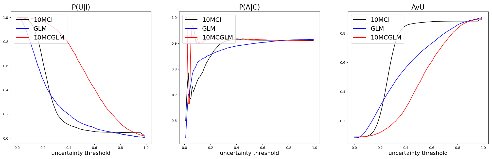
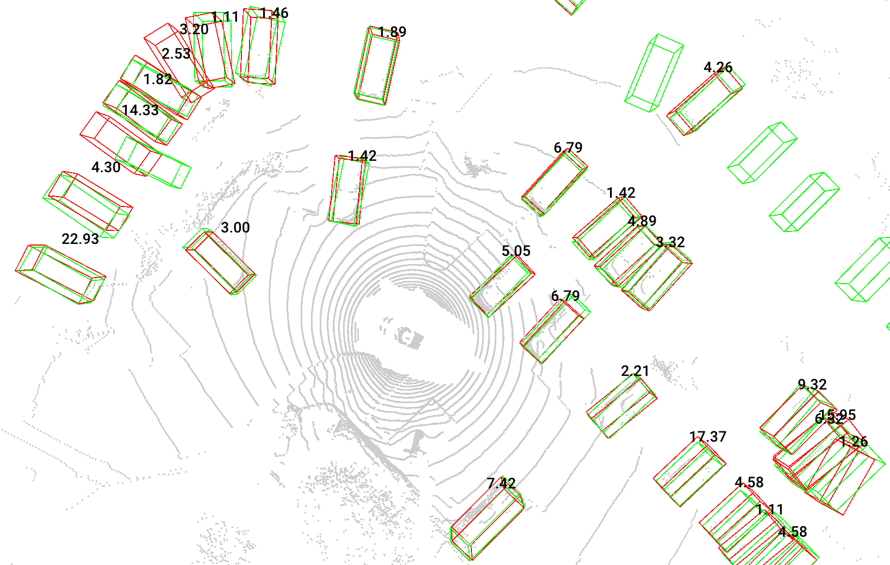

# Instance-Level Post Hoc Uncertainty Quantification in Object Detection

## 摘要

**论文元信息**  
标题：Instance-Level Post Hoc Uncertainty Quantification in Object Detection  
作者：Chongzhe Zhang, Zifan Zeng, Qunli Zhang, Feng Liu, Zheng Hu  
链接：https://arxiv.org/abs/2606.04656  
代码状态：论文正文未给出代码仓库；检索标题、arXiv ID 与 “MC-GLM object detection Laplace GitHub” 后，未发现可确认的官方公开代码。因此本文不提供源码段，代码分析结论为：**本文未提供可确认的公开代码**。  

**一句话总结**：本文提出 MC-GLM，用固定次数前向传播近似 Laplace-GLM 的实例级框不确定性，在 CenterPoint/nuScenes 3D 检测上显著降低 GLM 的在线计算成本，同时保持较好的不确定性质量，见 PAGE 1、PAGE 5、PAGE 6。

本文研究的是目标检测中的实例级事后不确定性量化（instance-level post hoc uncertainty quantification）。其核心约束很明确：检测模型已经训练并调优完成，不能重新训练，也不能改变原始预测行为；但系统仍需要为每个预测框给出 epistemic uncertainty，即模型知识不足导致的不确定性，见 PAGE 1。

本文的主要技术贡献是 Monte-Carlo generalized linearized model（MC-GLM）。它不是直接计算完整输出 Jacobian，而是从 Laplace/KFAC 后验中采样参数扰动，用有限差分近似方向导数，再由这些方向导数组成样本协方差。这样，每个输入只需 $k+1$ 次网络前向传播，计算量不随检测框数量 $m$ 增长；相比之下，GLM 若要得到每个 3D 框 9 个维度的不确定性，需要 $9m$ 次反向传播，见 PAGE 4、PAGE 5。

## 背景与动机

自动驾驶目标检测通常以 bounding box（边界框）表示目标位置。论文强调，在 safety-critical autonomous driving（安全关键自动驾驶）场景中，仅给出检测框本身是不够的；系统还需要知道每个框“有多不可靠”。这种不确定性可用于安全约束、风险评估、自动标注质量控制、误检提示与主动学习采样，见 PAGE 1。

现实部署约束决定了本文关注 post hoc（事后）方法。检测模型通常已经经过大量训练、测试和安全调优，训练阶段未必包含框不确定性建模能力；一旦模型通过安全验证，再修改模型或重新训练会破坏原有安全评估闭环。因此，论文要求不确定性方法应适用于 pre-trained model，并且不改变原网络行为，见 PAGE 1。

现有方法存在两类冲突。第一类如 MC Dropout、deep ensembles 和 evidential regression 能产生不确定性，但需要训练或改变推理预测分布，难以满足严格 post hoc 要求，见 PAGE 2。第二类如 Laplace-GLM 具有较好的 post hoc 性质，但需要对每个输出标量计算 Jacobian 行，也就是大量反向传播；对于实例级检测框不确定性，这一成本随输出维度线性增长，见 PAGE 1、PAGE 3。

本文的出发点是：保留 Laplace approximation（拉普拉斯近似）和 GLM（generalized linear model，广义线性模型）的事后性质，同时避免在线阶段逐输出反向传播。论文将问题限定为 epistemic uncertainty，而不是 aleatoric uncertainty；在固定参数 $\theta$ 下，检测器被视为确定性函数 $z=f(x;\theta)$，不确定性来自参数后验 $p(\theta|D)$，见 PAGE 2。

## 预备知识

Bayesian neural network（贝叶斯神经网络）将网络参数 $\theta$ 视为随机变量。给定训练集 $D$，后验分布 $p(\theta|D)$ 描述模型参数的不确定性；给定测试输入 $x$，输出 $z$ 的 posterior predictive distribution（后验预测分布）通过积分边缘化参数不确定性：

$$
p(z|x,D)=\int p(z|x,\theta)p(\theta|D)d\theta
$$

这里 $\theta$ 是网络参数，$x$ 是输入，$z$ 是检测输出。人话解释：不是只相信一个固定模型参数，而是考虑训练数据允许的一组可能参数，并由这些参数诱导输出分布，见 PAGE 2。

本文使用 MAP 参数 $\theta^*\equiv\theta_{\mathrm{MAP}}$ 表示已训练模型的最优参数：

$$
\theta^*=\arg\max_{\theta\in\Theta}\left(\log p(D|\theta)+\log p(\theta)\right)
$$

这里 $\theta^*$ 是部署中的原始模型权重。人话解释：本文不是重新训练贝叶斯模型，而是围绕已训练好的 MAP 权重估计局部参数不确定性，见 PAGE 2。

Laplace approximation 将难以处理的参数后验近似为 MAP 点附近的高斯分布：

$$
p(\theta|D)\approx \mathcal{N}(\theta^*,\Sigma_\theta)
$$

其中 $\Sigma_\theta$ 是参数后验协方差。人话解释：把训练损失曲面在最优点附近近似成二次曲面，从而用高斯分布表达参数可能偏移的范围，见 PAGE 3。

## 方法详解

### 1. 事后不确定性目标：预测均值不能偏离原检测器

本文首先定义 Bayesian predictive mean（贝叶斯预测均值）：

$$
\hat{z}(x)=\mathbb{E}_{z\sim p(z|x,D)}[z]
=\mathbb{E}_{\theta\sim p(\theta|D)}[f(x;\theta)]
$$

这里 $\hat{z}(x)$ 是输入 $x$ 的预测均值。人话解释：如果从参数后验中采样多个模型，那么输出均值是这些模型预测的平均值，见 PAGE 2。

对于 post hoc 目标，关键不是产生一个新的平均预测，而是在不改变原始检测框 $f(x;\theta^*)$ 的前提下估计其不确定性。因此论文定义 epistemic predictive covariance：

$$
\Sigma_z(x)=\mathrm{Cov}_{z\sim p(z|x,D)}[z]
=\mathrm{Cov}_{\theta\sim p(\theta|D)}[f(x;\theta)]
$$

其中 $\Sigma_z(x)$ 是输出空间协方差。人话解释：本文要估计的是“参数不确定性会让同一个检测框输出波动多少”，见 PAGE 2。

### 2. 为什么普通 Monte Carlo 不完全 post hoc

普通 Monte Carlo integration（MCI）从后验中采样 $k$ 个参数 $\theta_i$，得到预测样本 $z_i(x)=f(x;\theta_i)$，其均值为：

$$
\hat{z}_{MC}(x)=\frac{1}{k}\sum_{i=1}^k z_i(x)
$$

样本协方差为：

$$
\hat{\Sigma}_{z,MC}(x)=\frac{1}{k-1}\sum_{i=1}^k\delta_i(x)\delta_i(x)^\top,\quad
\delta_i(x)=z_i(x)-\hat{z}_{MC}(x)
$$

人话解释：这是对多个随机模型输出做平均和方差估计。但论文指出，这种方式估计的是 Bayesian prediction $\hat{z}_{MC}(x)$ 的不确定性，通常不等于原 MAP 检测器 $f(x;\theta^*)$ 的预测，因此不完全符合 post hoc 要求，见 PAGE 2、PAGE 3。

### 3. GLM 的优点：均值严格等于原模型输出

GLM 使用一阶 Taylor expansion 在 $\theta^*$ 附近线性化网络：

$$
f_{\mathrm{lin}}(x;\theta)=f(x;\theta^*)+J(x)(\theta-\theta^*)
$$

其中 $J(x)=\frac{\partial f(x;\theta)}{\partial\theta}\big|_{\theta=\theta^*}$ 是输出对参数的 Jacobian。人话解释：在已训练权重附近，用一阶线性模型近似原网络对参数扰动的响应，见 PAGE 3。

当 $\theta\sim\mathcal{N}(\theta^*,\Sigma_\theta)$ 时，GLM 诱导输出分布：

$$
\hat{z}_{\mathrm{lin}}(x)=f(x;\theta^*),\quad
\Sigma_{z,\mathrm{lin}}(x)=J(x)\Sigma_\theta J(x)^\top
$$

这条公式是本文 post hoc 性质的核心。人话解释：预测均值严格等于原始 MAP 模型输出，协方差则来自参数不确定性经过 Jacobian 投影后的输出空间变化，见 PAGE 3。

GLM 的瓶颈在计算 $J(x)$。若网络输出 $z(x)\in\mathbb{R}^d$，逐行计算 Jacobian 通常需要对每个输出标量 $z_j(x)$ 做一次反向传播；在 3D 检测中，若有 $m$ 个框，每个框 9 个属性，则 $d=9m$，在线成本很高，见 PAGE 3、PAGE 4。

### 4. KFAC 后验：让参数协方差可存储、可采样

完整 Fisher information matrix $I_\theta(\theta^*)\in\mathbb{R}^{w\times w}$ 难以显式构造。本文采用 KFAC（Kronecker-factored Approximate Curvature），将 Fisher 近似为跨层 block-diagonal，并将每层块写成 Kronecker product：

$$
I_{\theta,KFAC}:=
\mathrm{blkdiag}(Q_1\otimes H_1,\ldots,Q_L\otimes H_L)
$$

对应的后验协方差为：

$$
\Sigma_{\theta,KFAC}:=I^{-1}_{\theta,KFAC}
=\mathrm{blkdiag}(Q_1^{-1}\otimes H_1^{-1},\ldots,Q_L^{-1}\otimes H_L^{-1})
$$

其中 $Q_\ell$ 与 $H_\ell$ 是第 $\ell$ 层的 Kronecker 因子，$\otimes$ 表示 Kronecker 积。人话解释：KFAC 将一个巨大矩阵拆成每层两个较小矩阵的组合，使 Laplace 后验在实际检测网络中可计算，见 PAGE 3。

### 5. MC-GLM：用方向导数替代完整 Jacobian

MC-GLM 的关键观察是，GLM 协方差可写为参数扰动方向导数的协方差：

$$
J(x)\Sigma_\theta J(x)^\top
=
\mathrm{Cov}_{\eta\sim\mathcal{N}(0,\Sigma_\theta)}[J(x)\eta]
$$

其中 $\eta$ 是从参数协方差中采样的扰动方向。人话解释：不必显式计算整个 Jacobian，只要知道网络沿若干参数扰动方向的输出变化，就能近似输出协方差，见 PAGE 3。

方向导数 $J(x)\eta$ 由有限差分近似：

$$
\bar{D}_\eta f(x;\theta^*)=
\frac{f(x;\theta^*+\epsilon\eta)-f(x;\theta^*)}{\epsilon}
$$

其中 $\epsilon$ 是有限差分步长。人话解释：把参数沿 $\eta$ 方向轻微扰动一次，观察输出变化，再除以步长，就近似得到该方向上的导数，见 PAGE 4。

对 $k$ 个采样扰动 $\{\eta_i\}_{i=1}^k$，论文构造方向导数矩阵：

$$
A(x)=
[\bar{D}_{\eta_1}f(x;\theta^*)\ \cdots\ \bar{D}_{\eta_k}f(x;\theta^*)]
\in\mathbb{R}^{d\times k}
$$

再进行列中心化：

$$
\tilde{A}(x)=A(x)-\frac{1}{k}A(x)\mathbf{1}_k\mathbf{1}_k^\top
$$

最终 MC-GLM 协方差估计为：

$$
\hat{\Sigma}_{z,MC\text{-}GLM}(x)=
\frac{1}{k-1}\tilde{A}(x)\tilde{A}(x)^\top
$$

人话解释：MC-GLM 将 $k$ 次有限差分方向导数组成样本，再用样本协方差近似 GLM 的输出协方差；在线阶段需要的是 $k$ 次扰动前向传播加一次原模型前向传播，见 PAGE 4。

### 6. KFAC 后验采样：不显式形成大矩阵

在 MC-GLM 中，参数扰动 $\eta$ 从 $\mathcal{N}(0,\Sigma_{\theta,KFAC})$ 中采样。对第 $\ell$ 层，协方差块为：

$$
\Sigma^{(\ell)}_{\theta,KFAC}=Q_\ell^{-1}\otimes H_\ell^{-1}
$$

若 $L_{Q_\ell}=\mathrm{ch}(Q_\ell)$、$L_{H_\ell}=\mathrm{ch}(H_\ell)$ 是 Cholesky 因子，则层级扰动可写为：

$$
\eta_\ell=
(L_{Q_\ell}^{-T}\otimes L_{H_\ell}^{-T})\xi_\ell
$$

或在权重矩阵形状下：

$$
\Delta W_\ell=
L_{H_\ell}^{-T}\mathrm{reshape}(\xi_\ell;\ell_{out},\ell_{in})L_{Q_\ell}^{-1}
$$

这里 $\xi_\ell$ 是标准高斯噪声，$\Delta W_\ell$ 与第 $\ell$ 层权重矩阵同形状。人话解释：采样时只需要操作每层的两个 KFAC 小因子，不必构造完整参数协方差矩阵，见 PAGE 4。

### 7. 从输出协方差到实例级 3D 框不确定性

本文将每个 3D bounding box 参数化为：

$$
\beta=[p_x,p_y,p_z,w,l,h,\psi,v_1,v_2]\in\mathbb{R}^9
$$

其中 $(p_x,p_y,p_z)$ 是中心位置，$(w,l,h)$ 是尺寸，$\psi$ 是 yaw angle，$(v_1,v_2)$ 是速度分量。人话解释：每个 3D 框有 9 个连续属性，因此一个框的不确定性不是单一标量，而是一个 9 维属性协方差，见 PAGE 4。

若检测器输出 $m$ 个框，论文将其堆叠并展平成 $z(x)\in\mathbb{R}^{9m}$。为提高可解释性和效率，MC-GLM 保留 within-box feature correlations（框内属性相关性），忽略 cross-box correlations（框间相关性），得到每个框的协方差：

$$
\hat{\Sigma}_i(x)=
\frac{1}{k-1}\tilde{A}(x)_{i,:,:}\tilde{A}(x)_{i,:,:}^\top
\in\mathbb{R}^{9\times 9}
$$

最后用 trace 汇总为标量不确定性：

$$
u_i(x)=\mathrm{tr}(\hat{\Sigma}_i(x))
$$

人话解释：每个框先得到一个 $9\times9$ 协方差矩阵，再用迹作为可视化和排序用的单一不确定性分数，见 PAGE 4。

## 实验分析

### 实验设置

实验使用 CenterPoint 作为 point cloud-based 3D detector，并在 nuScenes 数据集上评估，见 PAGE 5。离线阶段在原 nuScenes 训练集上计算 CenterPoint 的 KFAC Fisher information，论文主设置中为最终层，即 bbox heads，收集训练损失在预训练权重处的梯度并利用 Kronecker factorization 简化，见 PAGE 5。

在线阶段 MC-GLM 的两个超参数是 Monte Carlo 样本数 $k$ 和有限差分步长 $\epsilon$。论文所有主实验选择 $k=10$、$\epsilon=1\times10^{-7}$，见 PAGE 5。对比方法包括 MCI，即测试时保持 dropout 激活并执行 10 次随机前向传播；以及 GLM，即在 $\theta^*$ 处线性化并计算 $J(x)\Sigma_\theta J(x)^\top$，见 PAGE 5。

评估指标来自 PAGE 5。预测实例被划分为 AC（accurate & certain）、IC（inaccurate & certain）、AU（accurate & uncertain）和 IU（inaccurate & uncertain）。论文使用：

$$
P(A|C)=\frac{|AC|}{|AC|+|IC|}
$$

人话解释：被模型判断为确定的框中，有多少确实准确，见 PAGE 5。

$$
P(U|I)=\frac{|IU|}{|IC|+|IU|}
$$

人话解释：真实不准确的框中，有多少被不确定性方法识别为不确定，见 PAGE 5。

$$
AvU=\frac{|AC|+|IU|}{|D|}
$$

人话解释：确定且准确、以及不确定且不准确都被视为匹配良好的情况，见 PAGE 5。

### 主结果：不确定性质量

| 指标 | 误差定义 | MCI | GLM | MC-GLM |
|---|---:|---:|---:|---:|
| AvU | IoU | 0.87 | 0.64 | 0.62 |
| AvU | $\ell_2$ | 0.90 | 0.66 | 0.62 |
| $P(A|C)$ | IoU | 0.92 | 0.92 | 0.92 |
| $P(A|C)$ | $\ell_2$ | 0.95 | 0.93 | 0.95 |
| $P(U|I)$ | IoU | 0.09 | 0.14 | 0.40 |
| $P(U|I)$ | $\ell_2$ | 0.10 | 0.10 | 0.40 |

表格解读：Table I 的关键不是 AvU 最高者是谁，而是 MC-GLM 在 $P(U|I)$ 上明显优于 GLM 和 MCI。对于 IoU 误差，MC-GLM 的 $P(U|I)=0.40$，高于 GLM 的 0.14 和 MCI 的 0.09；对于 $\ell_2$ 误差，MC-GLM 同样达到 0.40，显著高于两个基线。这说明 MC-GLM 更擅长把“不准确预测”标为“不确定”。论文同时指出 MC-GLM 的 AvU 较低可归因于 AU 区域样本密度较高，而 AU 并不一定代表不确定性模型错误，见 PAGE 5。

### 图 1：阈值变化下的质量曲线

用途：Figure 1 用于展示在不同 uncertainty threshold 下，MCI、GLM、MC-GLM 三种方法的 $P(U|I)$、$P(A|C)$ 和 AvU 曲线变化，支撑“单一阈值表格之外，MC-GLM 的曲线行为仍有优势”的判断，见 PAGE 6。

读图要点：图中每个子图对应一个指标，横轴是不确定性阈值，纵轴是概率或 AvU。论文说明先用 Gamma distribution 拟合每种方法的不确定性，并将不确定性替换为分位数以缩放到 $[0,1]$，见 PAGE 5。

支撑的判断：Figure 1 支撑 PAGE 5 的结论，即 MC-GLM 在 $P(U|I)$ 和 $P(A|C)$ 曲线区间上优于其他方法；不过 AvU 并非对 MC-GLM 最有利，论文解释为 AU 分区样本密度较高，见 PAGE 5、PAGE 6。

### 图 2：检测框不确定性可视化

用途：Figure 2 用于说明 MC-GLM 输出的不确定性可以绑定到具体预测框上，适合实例级风险提示与自动标注质量控制，见 PAGE 6。

读图要点：绿色框是 ground truths，红色框是 predictions，数字是不确定性值。该图不是定量结果表，而是展示 per-box uncertainty score 如何随预测框显示，见 PAGE 6。

支撑的判断：Figure 2 支撑本文“instance-level”的定位：不确定性不是整张点云或整帧的全局值，而是可以分配到每个检测框的标量值。图中并未提供每个框对应的误差统计，因此不能从该图单独推导精确校准结论；此处若要证明数值校准，证据不足，见 PAGE 6。

### 运行时比较

| 方法 | 时间 ms |
|---|---:|
| MCI | 525 |
| GLM | 10636 |
| MC-GLM | 542 |

表格解读：Table II 显示 MC-GLM 的运行时为 542 ms，接近 MCI 的 525 ms，但远低于 GLM 的 10636 ms。论文解释原因是 MC-GLM 的运行时被固定为预设前向次数，本实验为 10 次扰动前向加一次原始前向；而 GLM 需要 $m\times9$ 次反向传播。实验中平均检测框数 $m=97.3$，对应约 875.7 个输出标量反向计算，见 PAGE 5、PAGE 6。

### Fisher 深度消融

| Fisher 深度 | AvU IoU | AvU $\ell_2$ | $P(A|C)$ IoU | $P(A|C)$ $\ell_2$ | $P(U|I)$ IoU | $P(U|I)$ $\ell_2$ |
|---|---:|---:|---:|---:|---:|---:|
| H | 0.62 | 0.62 | 0.92 | 0.95 | 0.40 | 0.40 |
| N+H | 0.63 | 0.63 | 0.92 | 0.95 | 0.40 | 0.42 |
| B+N+H | 0.72 | 0.73 | 0.93 | 0.95 | 0.33 | 0.34 |

表格解读：Table III 表明，更深的 Fisher 信息范围提升 AvU，但并不单调提升所有指标。B+N+H 将 AvU 提升到 0.72/0.73，但 $P(U|I)$ 降至 0.33/0.34。论文还报告模型大小为 35 MB，而 KFAC Fisher 存储为 H 173 MB、N+H 497 MB、B+N+H 651 MB。因此，更深后验近似带来存储成本，并且对“不准确框识别为不确定”的能力未必更强，见 PAGE 6。

### KFAC 数据比例消融

| 训练数据比例 | AvU IoU | AvU $\ell_2$ | $P(A|C)$ IoU | $P(A|C)$ $\ell_2$ | $P(U|I)$ IoU | $P(U|I)$ $\ell_2$ |
|---|---:|---:|---:|---:|---:|---:|
| 100% | 0.72 | 0.73 | 0.93 | 0.95 | 0.33 | 0.34 |
| 10% | 0.61 | 0.62 | 0.92 | 0.95 | 0.37 | 0.39 |
| 5% | 0.66 | 0.67 | 0.92 | 0.95 | 0.32 | 0.35 |

表格解读：Table IV 表明 KFAC Fisher 可用训练子集估计。10% 或 5% 数据比例下，$P(A|C)$ 和 $P(U|I)$ 与全量数据接近，AvU 下降更明显。对部署而言，这意味着离线 Fisher 估计成本可能通过子采样降低，但如果业务目标主要关注 AvU，则仍需验证数据比例对整体不确定性-准确性匹配的影响，见 PAGE 6。

### 有限差分步长与采样数消融

| $\epsilon$ | AvU IoU | AvU $\ell_2$ | $P(A|C)$ IoU | $P(A|C)$ $\ell_2$ | $P(U|I)$ IoU | $P(U|I)$ $\ell_2$ |
|---|---:|---:|---:|---:|---:|---:|
| 1.0 | 0.88 | 0.90 | 0.92 | 0.94 | 0.08 | 0.08 |
| $1\times10^{-3}$ | 0.92 | 0.94 | 0.92 | 0.94 | 0.01 | 0.01 |
| $1\times10^{-7}$ | 0.62 | 0.62 | 0.92 | 0.95 | 0.40 | 0.40 |

表格解读：Table V 显示 $\epsilon=1\times10^{-7}$ 虽然 AvU 最低，但 $P(U|I)$ 明显最高。论文解释较小步长降低有限差分方向导数的截断误差，使 MC-GLM 协方差更接近 $J(x)\Sigma_\theta J(x)^\top$，见 PAGE 6。

| 采样次数 $k$ | AvU IoU | AvU $\ell_2$ | $P(A|C)$ IoU | $P(A|C)$ $\ell_2$ | $P(U|I)$ IoU | $P(U|I)$ $\ell_2$ |
|---|---:|---:|---:|---:|---:|---:|
| 10 | 0.62 | 0.62 | 0.92 | 0.95 | 0.40 | 0.40 |
| 20 | 0.64 | 0.64 | 0.92 | 0.95 | 0.39 | 0.40 |
| 30 | 0.63 | 0.64 | 0.92 | 0.95 | 0.38 | 0.39 |

表格解读：Table VI 表明 $k=10$ 到 30 的指标差异较小。论文据此认为 MC-GLM 用较少 posterior perturbations 就能达到可用的 Monte Carlo 精度；继续增大 $k$ 会直接增加前向次数，但收益有限，见 PAGE 7。

## 讨论

MC-GLM 的适用边界首先来自 post hoc epistemic uncertainty 的设定。它适合已训练检测器不能改动、但仍需每个检测框风险分数的场景；尤其适合自动驾驶 3D 检测、自动标注审核、低置信框筛选、主动学习采样与误检风险提示。论文实验仅覆盖 CenterPoint 和 nuScenes，因此对其他检测器、其他传感器、2D 检测器和实时部署链路的外推需要额外验证，见 PAGE 5。

方法论上，MC-GLM 是对 Laplace-GLM 在线推理阶段的近似。它保留了 GLM 的关键 post hoc 均值性质，即 $\hat{z}_{lin}(x)=f(x;\theta^*)$，同时用低秩 Monte Carlo 样本协方差替代完整 Jacobian 协方差。其优势不是更精确地恢复完整贝叶斯后验，而是在固定预算下获得实例级框不确定性，见 PAGE 3、PAGE 4。

从业务价值看，本文最有意义的指标是 $P(U|I)$。在安全或自动标注场景中，系统更关心错误框能否被标为高风险，而不是所有高不确定框是否一定错误。MC-GLM 在 $P(U|I)$ 上优于 GLM 和 MCI，说明它更适合做错误风险发现；但 AvU 较低也提示，如果业务将不确定性直接作为“保留/删除”规则，阈值策略需要重新校准，见 PAGE 5。

## 局限分析

第一，作者自述的计算与存储权衡仍然存在。MC-GLM 将在线 GLM 的大量反向传播替换为固定次数前向传播，但离线仍需计算 KFAC Fisher；更深层 Fisher 会显著增加存储，从 H 的 173 MB 增至 B+N+H 的 651 MB，而模型本体只有 35 MB，见 PAGE 6。这对资源受限部署并非零成本。

第二，本文只报告 CenterPoint 在 nuScenes 上的实验。尽管方法表述面向“wide class of models designed for object detection”，但实验没有覆盖常见 2D 检测器、camera-only 检测器、多模型集成业务链路或实时车端端到端延迟。因此，“适配常用 2D 检测器”的工程成本与效果证据不足，见 PAGE 1、PAGE 5。

第三，论文聚焦 epistemic uncertainty，没有建模 aleatoric uncertainty。自动驾驶感知中的遮挡、传感器噪声、标注歧义和远距离点云稀疏性往往属于数据噪声或观测不确定性；本文的设定明确指出固定参数条件下检测器是确定性的，关注的是模型知识不足，见 PAGE 2。因此若业务需要同时区分模型不确定性与观测噪声，本文证据不足。

第四，实验指标主要衡量不确定性与错误的排序或分区关系。论文说明预测分布原则上应产生包含 ground truth 的准确 confidence intervals，但正文未给出覆盖率、校准误差或区间宽度等更直接的置信区间评估。因此，对“预测协方差是否已良好校准到物理尺度”的判断证据不足，见 PAGE 4、PAGE 5。

## 结论

本文提出 MC-GLM，用来自 Laplace/KFAC 后验的参数扰动方向导数近似 GLM 输出协方差，在不改变原检测器预测的前提下，为每个 3D 检测框估计实例级 epistemic uncertainty。其核心优势是在线计算量固定为 $k+1$ 次前向传播，不随检测框数量 $m$ 增长，见 PAGE 4。

实验表明，在 CenterPoint/nuScenes 上，MC-GLM 以 542 ms 的运行时接近 MCI 的 525 ms，远快于 GLM 的 10636 ms；同时在 $P(U|I)$ 上达到 0.40，显著高于 GLM 与 MCI。对自动驾驶检测和自动标注质量控制而言，这篇论文的价值在于把 Laplace-GLM 的 post hoc 性质推进到更实际的实例级部署预算内；但 2D 检测适配、真实车端延迟、置信区间校准与公开实现仍需要进一步证据。

## 证据索引

| 证据点 | PAGE |
|---|---|
| 论文问题定义：post hoc、instance-level、inference speed、epistemic uncertainty 四个要求 | PAGE 1 |
| Laplace/GLM 总体预测分布与 MC-GLM 样本协方差思想 | PAGE 1 |
| MCI、MC Dropout、ensemble、evidential regression 等相关方法及其非严格 post hoc 问题 | PAGE 2 |
| Bayesian predictive mean、predictive covariance、Monte Carlo mean/covariance | PAGE 2、PAGE 3 |
| Laplace approximation、Fisher/KFAC 后验协方差 | PAGE 3 |
| GLM 线性化、$J(x)\Sigma_\theta J(x)^\top$、逐输出反向传播瓶颈 | PAGE 3 |
| MC-GLM 方向导数、有限差分、中心化矩阵、协方差估计、Algorithm 1 | PAGE 4 |
| KFAC 后验采样公式与 3D 框 9 维参数化、per-box covariance、trace 不确定性 | PAGE 4 |
| 评估指标 AC/IC/AU/IU、$P(A|C)$、$P(U|I)$、AvU | PAGE 5 |
| 实验设置：CenterPoint、nuScenes、KFAC bbox heads、$k=10$、$\epsilon=1\times10^{-7}$、MCI/GLM 基线 | PAGE 5 |
| Table I：MCI、GLM、MC-GLM 不确定性质量比较 | PAGE 5 |
| Figure 1：阈值变化下的 $P(U|I)$、$P(A|C)$、AvU 曲线 | PAGE 6 |
| Figure 2：CenterPoint 预测框不确定性可视化 | PAGE 6 |
| Table II：运行时比较，MC-GLM 542 ms，GLM 10636 ms | PAGE 6 |
| 平均检测框数 $m=97.3$，GLM 需 $m\times9$ 次反向传播 | PAGE 5 |
| Table III：Fisher 深度消融与 KFAC 存储 173/497/651 MB | PAGE 6 |
| Table IV：KFAC 训练数据比例消融 | PAGE 6 |
| Table V：有限差分步长 $\epsilon$ 消融 | PAGE 6、PAGE 7 |
| Table VI：Monte Carlo 样本数 $k$ 消融 | PAGE 7 |
| 结论：MC-GLM 用预设前向次数估计实例级不确定性 | PAGE 7 |
