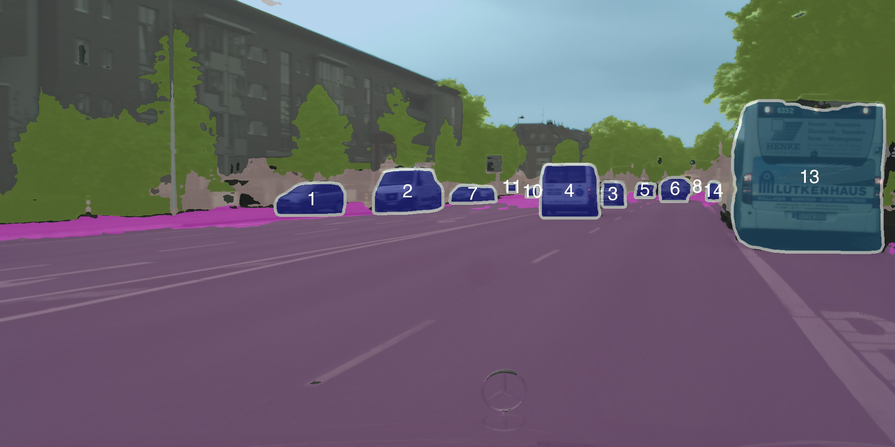
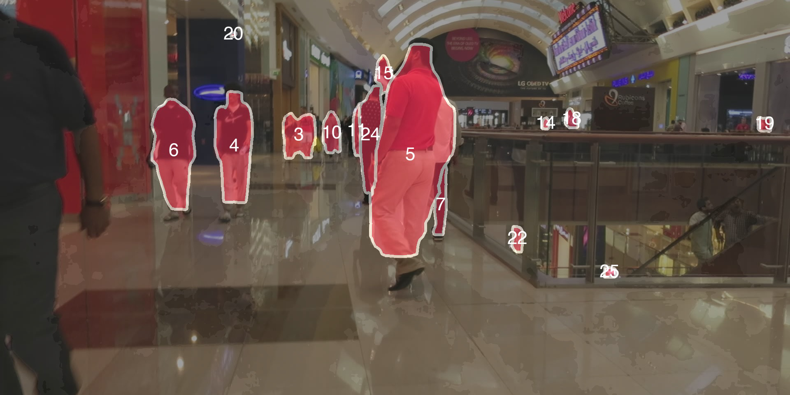
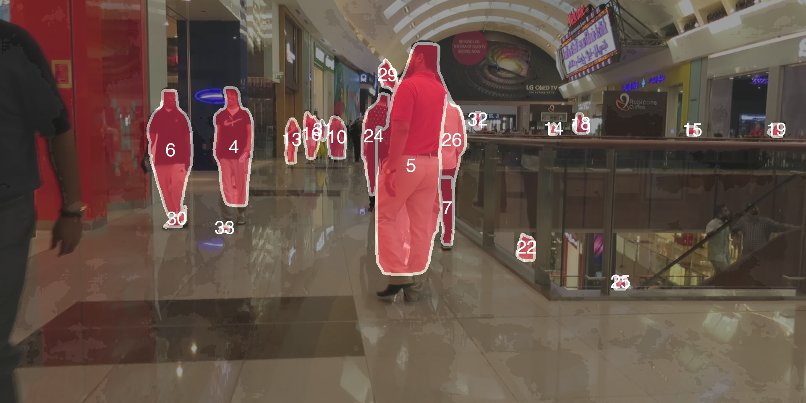
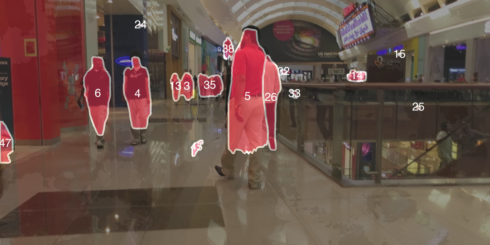

# Scene-Centric Unsupervised Video Panoptic Segmentation

## 摘要

**论文元信息。** 论文题目为 *Scene-Centric Unsupervised Video Panoptic Segmentation*，作者包括 Christoph Reich、Oliver Hahn、Nikita Araslanov、Laura Leal-Taix'e、Christian Rupprecht、Daniel Cremers、Stefan Roth，arXiv ID 为 2606.04925，论文链接为 https://arxiv.org/abs/2606.04925，PDF 链接为 https://arxiv.org/pdf/2606.04925，发布时间为 2026-06-04，方向为计算机视觉中的视频理解与全景分割（见 PAGE 1）。

**一句话总结。** 本文提出 VideoCUPS，将无监督全景分割从图像扩展到视频：它从单目场景中心视频中组合自监督视觉特征、无监督光流、单目深度与运动概率生成时序一致的全景视频伪标签，再用 Video DropLoss 和视频复制粘贴增强训练 VPS 模型（见 PAGE 1、PAGE 2、PAGE 4、PAGE 5）。

**核心贡献。** 第一，论文定义了无监督视频全景分割（Unsupervised Video Panoptic Segmentation, unsupervised VPS）任务，并提出跨 Cityscapes-VPS、KITTI-STEP、Waymo、MOTS 的统一评估协议（见 PAGE 2、PAGE 5）。第二，论文提出 VideoCUPS，使用单目视频生成时序一致的 panoptic video pseudo-labels，避免 CUPS 对 stereo video 的依赖，并显式建模视频中的传播、跟踪和语义平滑（见 PAGE 2、PAGE 3、PAGE 4）。第三，实验显示 VideoCUPS 在 Cityscapes-VPS、KITTI-STEP、Waymo、MOTS 上均优于四个无监督 VPS baseline，并可作为 label-efficient learning 的初始化（见 PAGE 6、PAGE 7）。

**代码状态。** 补充材料声明代码位于 `https://github.com/visinf/cups/tree/main/videocups`（见 PAGE 14）。但公开仓库当前 `videocups/README.md` 仅显示 “Code coming soon.”，未提供可审阅的 VideoCUPS 实现文件。因此，本文未提供可确认的公开代码；下面不写源码片段，代码对应分析标注为证据不足。

**证据边界。** 本报告优先依据给定 `paper_full_text_with_page_markers`。全文抽取状态为 `fulltext:pypdf:truncated`，补充材料在 PAGE 17 的 Table 8 处截断；因此，关于 Table 8 的完整超参数结论、补充材料 Sec. D 的完整限制讨论、以及未给出图片路径的 Figure 2-5 图像内容，均按证据不足处理。

## 背景与动机

视频全景分割（Video Panoptic Segmentation, VPS）试图在同一视频中同时解决四件事：检测 object instances、分割实例 mask、为每个像素分配语义类别、并在时间维度上关联同一实例的 ID（见 PAGE 1）。它是 panoptic segmentation 从静态图像到时空域的扩展，目标不是只找 “car/person”，也不是只做 semantic segmentation，而是把动态场景拆成可追踪、可分类、可像素级解释的完整结构。

这一任务的直接应用场景包括自动驾驶、机器人、视频编辑和医学影像等复杂动态环境（见 PAGE 1）。这些场景共同要求模型不仅理解单帧内容，还要保持跨帧一致性。例如自动驾驶中的一辆车不能在相邻帧中反复变换 ID，视频编辑中的人物也不能在运动中被断裂成不连续 mask。

现有 VPS 进展主要由监督学习推动，需要大规模像素级实例、语义和时间关联标注（见 PAGE 1）。论文指出，即使图像级 dense annotation 已经非常昂贵，扩展到视频后还会遇到更严重的可扩展性与标注质量问题，包括跨帧一致 ID、遮挡恢复、动态边界以及长序列校对（见 PAGE 1）。这构成本文的核心动机：如果视频全景标注成本过高，是否可以完全不使用人工监督，先从视频自身的运动、深度和视觉特征中生成可训练的伪标签？

无监督图像场景理解已经有较多基础。论文回顾了 unsupervised semantic segmentation、unsupervised instance segmentation 和 unsupervised image panoptic segmentation，其中 U2Seg 将 STEGO 的语义伪标签与 CutLER 的 MaskCut 实例 mask 结合，CUPS 则面向 scene-centric imagery，利用 stereo video 的 motion/depth cue 生成图像全景伪标签（见 PAGE 1、PAGE 2、PAGE 3）。但这些方法主要停留在 image segmentation，而非 video panoptic segmentation。

本文对 CUPS 的扩展不是简单把每帧图像伪标签接起来。CUPS 依赖 stereo video 并面向图像全景伪标签；VideoCUPS 则直接从 monocular scene-centric videos 生成 temporally consistent video panoptic pseudo-labels，并加入 instance propagation、tracking、temporal semantic smoothing、Video DropLoss 和视频级 copy-paste augmentation（见 PAGE 2、PAGE 3、PAGE 4、PAGE 5）。因此，本文的研究问题可以概括为：在没有人工标签、没有 stereo 输入的条件下，能否从单目视频中训练出可用的 VPS 模型？

## 预备知识

**Panoptic segmentation 与 VPS。** Panoptic segmentation 将像素划分为 “thing” 与 “stuff” 两类语义结构：thing 是可数实例，如 car、person；stuff 是不可数区域，如 road、sky、building（见 PAGE 5）。VPS 在此基础上加入时间维度：模型不仅要输出语义类别，还要输出跨帧一致的视频实例 mask（见 PAGE 1、PAGE 4）。

**Scene-centric 与 object-centric。** 论文明确区分 scene-centric imagery 和 object-centric imagery：前者包含多个交互对象与复杂环境，例如 Cityscapes；后者通常只有单个孤立对象，例如 ImageNet 图像（见 PAGE 2）。这一差异很关键，因为许多无监督实例方法依赖 object-centric 数据学习 objectness，而真实驾驶视频、城市视频和人群视频更接近 scene-centric 分布（见 PAGE 2、PAGE 6）。

**伪类别与语义匹配。** 无监督模型预测的是 pseudo-classes，而非人工定义的 Cityscapes 或 KITTI 类别 ID（见 PAGE 5）。因此，评价前必须把 pseudo semantic classes 映射到 ground-truth categories。论文提出在 thing/stuff 分开约束下，用 Hungarian matching 最大化像素重叠来建立映射；该映射只用于评估，不作为训练监督（见 PAGE 5）。

**STQ、AQ 与 SQ。** 论文采用 Segmentation and Tracking Quality（STQ）作为核心指标，STQ 由 Association Quality（AQ）和 Segmentation Quality（SQ）组成（见 PAGE 5、PAGE 15）。AQ 衡量实例检测与跨帧关联质量，SQ 衡量语义像素分割质量；这种分解适合 VPS，因为一个方法可能语义边界较好但跟踪差，也可能跟踪稳定但语义错配（见 PAGE 15、PAGE 16）。

## 方法详解

### 1. 总体框架：从单目视频到可训练 VPS 模型

VideoCUPS 的流程分为两阶段。第一阶段是伪标签生成：对单目输入视频分别提取 self-supervised visual features、monocular depth、motion probability 和 optical flow，再生成 instance pseudo-labels 与 semantic pseudo-labels，最后通过 temporal tracking 对齐为 video panoptic pseudo-labels（见 PAGE 1、PAGE 3、PAGE 4）。第二阶段是模型训练：使用这些稀疏伪标签训练 Panoptic Cascade MaskTrack R-CNN 风格的 VPS 模型，并用 Video DropLoss 放宽对漏标实例的惩罚（见 PAGE 4、PAGE 5、PAGE 6）。

**用途 / 读图要点。** 下图来自 PAGE 1 的 Figure 1 抽取图，用于确认论文主张的输出形态：VideoCUPS 不是只输出语义图，而是输出跨数据集的视频全景预测示例和整体管线概览（见 PAGE 1）。

**支撑的判断。** 该图支撑本文对 VideoCUPS 的总体定位：输入是 scene-centric video，输出是 temporally consistent panoptic pseudo-labels，并进一步训练 VPS model，而不是只做单帧 segmentation（见 PAGE 1）。

**用途 / 读图要点。** 下图同样来自 PAGE 1 的 Figure 1 抽取图，用于观察论文在 Cityscapes-VPS、KITTI-STEP、Waymo、MOTS 四类数据上展示 qualitative results 的意图（见 PAGE 1）。

**支撑的判断。** 该图支撑 “统一评估协议覆盖多个 scene-centric VPS datasets” 的论述；但具体数值结论仍以 PAGE 6 的 Table 1 和 PAGE 7 的 Table 2 为准。

**用途 / 读图要点。** 下图来自 PAGE 1 的 Figure 1 抽取图，用于辅助说明 VideoCUPS 的 cue 组合：features、depth、motion、instance labeling、semantic labeling、temporal tracking 共同进入 panoptic pseudo-label generation（见 PAGE 1）。

**支撑的判断。** 该图支撑方法不是单一模块，而是组合式 pipeline：无监督 optical flow、monocular depth、visual representation 和 temporal processing 都是核心环节（见 PAGE 1、PAGE 3、PAGE 4）。

**用途 / 读图要点。** 下图来自 PAGE 1 的 Figure 1 抽取图，用于补充展示训练阶段：生成伪标签后，论文用 Video DropLoss 训练 VPS model（见 PAGE 1、PAGE 5）。

**支撑的判断。** 该图支撑本文对 Video DropLoss 的位置判断：它不是伪标签生成的一部分，而是 learning from VPS pseudo-labels 阶段的训练损失设计（见 PAGE 5）。

给定 `figures` 列表只提供 PAGE 1 的 Figure 1 图像路径。论文正文还描述了 Figure 2（pseudo-label generation pipeline，见 PAGE 4）、Figure 3（Cityscapes-VPS qualitative comparison，见 PAGE 6）、Figure 4（label-efficient learning curves，见 PAGE 7）和 Figure 5（VideoCUPS pseudo-labels 与 video-extended CUPS pseudo-labels 对比，见 PAGE 8），但没有提供可用 `markdown_path`，因此本文只做文字引用，不输出不存在的图片路径。

### 2. 从 motion/depth 到 instance pseudo-labels

VideoCUPS 对 instance 的定义基于 Gestalt principles 中的 common fate、proximity 和 similarity：相邻且一起运动的区域更可能属于同一对象（见 PAGE 3）。论文显式说 “objects as entities capable of moving”，因此初始 instance pseudo-labels 主要来自动态区域，而不是静态 object detector（见 PAGE 3）。

输入为相邻两帧 monocular frames。论文使用 SMURF 估计无监督 optical flow，记为 $f \in \mathbb{R}^{2 \times H \times W}$；这里 $H$ 与 $W$ 表示帧高和宽，$f_x$ 表示像素 $x$ 处二维光流向量（见 PAGE 3）。同时，DynamoDepth 估计 monocular depth $d \in \mathbb{R}^{H \times W}$ 和 dense motion probabilities $m \in [0,1]^{H \times W}$；$m_{h,w} \to 0$ 表示静态区域，$m_{h,w} \to 1$ 表示动态区域（见 PAGE 3）。

论文先用阈值 $\alpha = 0.15$ 在 motion probability 上取 instance seeds，然后在 Chebyshev neighborhood $N_r(x)$ 内按相对深度差与相对光流差进行 region growing（见 PAGE 3、PAGE 6）。核心合并条件为 Equation (1)：

$$
\frac{|d_x - d_y|}{|d_x|} < \tau_d
\quad \text{and} \quad
\frac{\|f_x - f_y\|_2}{\|f_x\|_2} < \tau_f
$$

人话解释：如果相邻像素 $x$ 与 $y$ 的相对深度差小、相对光流差也小，那么它们很可能属于同一个运动实体，因此被合并到同一 class-agnostic instance mask 中（见 PAGE 3）。

这一设计相对于 CUPS 的关键差异是：CUPS 使用 stereo scene flow 并倾向于 rigid instance motion；VideoCUPS 不要求刚体假设，而是利用 depth/flow smoothness，因此可以捕捉非刚性运动实例，例如行走中的 pedestrian（见 PAGE 3、PAGE 8）。这解释了为什么 Table 3 中 VideoCUPS 的 monocular pseudo-label STQ 可以超过 video-extended CUPS pseudo-labels，虽然后者的 SQ 更高（见 PAGE 8）。

### 3. 从 SSL features 到 semantic pseudo-labels

语义伪标签来自自监督视觉特征。论文使用 DINO features，经 contrastive objective 蒸馏到较低维 embedding，再用 stochastic cosine-distance k-means 聚类得到 $c_p$ 个 semantic pseudo-classes（见 PAGE 3）。这里 $c_p$ 表示无监督伪类别数，而非人工类别数；实验中使用 $c_p = 27$，沿用 CUPS 的设置（见 PAGE 6、PAGE 15）。

无监督语义分割通常在低分辨率运行，例如接近 SSL pre-training 的 $320^2$ 分辨率（见 PAGE 3）。但 VPS 需要较细边界，因此 VideoCUPS 使用 depth-guided semantic inference：先得到低分辨率预测 $P_{\text{low}}$，再用 sliding-window inference 得到高分辨率预测 $P_{\text{high}}$，最后用 monocular depth 计算每像素权重融合（见 PAGE 4）。

Equation (2) 给出融合公式：

$$
P^* = \alpha \odot P_{\text{low}} + (1 - \alpha) \odot P_{\text{high}},
\quad
\alpha_{h,w} = (d_{h,w}+1)^{-1}
$$

人话解释：深度 $d_{h,w}$ 决定低分辨率语义和高分辨率细节各占多少权重；$P^*$ 是融合后的语义预测，既保留 coarse semantics，又补充 sliding-window 的边界细节（见 PAGE 4）。

论文进一步使用 regularized Frank-Wolfe inference for dense CRFs 做空间正则化，以提升像素级一致性（见 PAGE 4）。这里需要注意：语义分支虽然无监督，但仍依赖已经训练好的 DepthG/DINO/DynamoDepth 等模块；论文为保持 “purely unsupervised and monocular setup”，重新训练了 DynamoDepth 与 DepthG，避免 ImageNet-supervised depth/backbone 引入人工监督（见 PAGE 6、PAGE 15）。

### 4. 从 image pseudo-labels 到 video pseudo-labels

VideoCUPS 的关键增量在于把单帧 semantic/instance pseudo-labels 变成 video panoptic pseudo-labels。论文的 Figure 2 描述了三个阶段：Instance pseudo-labeling、Semantic pseudo-labeling、Temporal tracking（见 PAGE 4）。由于 Figure 2 没有提供可用图片路径，本文只引用其文字说明。

Instance propagation and tracking 使用三帧窗口 $I_{t-1}, I_t, I_{t+1}$。论文用 SMURF 估计 forward/backward optical flows，然后把 $M_t$ 与 $M_{t+1}$ warp 回前一帧，利用 forward-backward flow consistency 忽略遮挡像素（见 PAGE 4）。随后在 $M_{t-1}$ 和 warped mask 之间计算 IoU cost matrix，并对 IoU 大于 $\tau_m = 0.4$ 的 pair 进行 Hungarian matching（见 PAGE 4、PAGE 15）。

这个 tracking 逻辑还包含 recovery：如果 $M_{t-1}$ 中的实例在 $t$ 没匹配到，系统会尝试用 $t+1$ warp 回 $t$ 的 mask 恢复短时丢失实例，最后过滤掉出现少于 2 帧的 short-lived instances（见 PAGE 4）。这与普通单帧伪标签拼接不同，因为它显式处理遮挡、短时漏检和 ID 延续。

Temporal semantic smoothing 使用相邻帧语义预测的 optical-flow warp 结果做三帧 majority vote：对每个 frame $t$，聚合 $\hat{P}_{t-1 \to t}$、$P^*_t$、$\hat{P}_{t+1 \to t}$，得到 $\tilde{P}_t$（见 PAGE 4）。人话解释：如果当前帧某个像素语义不稳定，前后帧投影过来的预测可以提供时间邻域投票，减少闪烁。

最后，VideoCUPS 对齐 semantic 和 instance signals：同一 instance ID 在整个 clip 中被赋予一致 semantic pseudo-class，该类别由该实例 mask 内所有 semantic pseudo-labels 的 majority vote 决定（见 PAGE 4）。之后，论文根据每个 semantic pseudo-class 在 instance masks 内的频率占比，将 pseudo-classes 分为 pseudo “thing” 和 pseudo “stuff”，阈值为 $\psi_{ts}$（见 PAGE 4、PAGE 17）。

### 5. 用 Video DropLoss 从稀疏伪标签训练 VPS 模型

伪标签的主要局限是只覆盖 moving “thing” instances，例如运动中的车；静态车、短时遮挡目标、远处小物体可能没有被伪标签捕获（见 PAGE 4、PAGE 5）。如果直接把未标出的区域当作负样本，模型会被错误惩罚，学不到静态 object。Video DropLoss 的目标就是避免这种错误负监督。

论文定义模型对 $T$ 帧输入视频的预测为 $P=(S,R)$。其中 $S \in \{1,2,\ldots,c_p\}^{T \times H \times W}$ 是 pseudo-class semantic prediction，$R \in \{0,1\}^{n_p \times T \times H \times W}$ 是 $n_p$ 个 “thing” object instances 的 binary video instance masks（见 PAGE 4）。这里 $n_p$ 是预测实例数量，$c_p$ 是伪语义类别数。

Equation (3) 给出 Video DropLoss。由于文本抽取中公式排版有轻微缺失，下面按 PAGE 5 的符号语义重排：

$$
L_{\mathrm{VDrop}} =
\mathbf{1}\left(\mathrm{IoU}^{\max}_{j} > \tau_{\mathrm{IoU}}\right)
L_d(D_j,\hat{D}_i) L_t(E_j,\hat{id}_i)
$$

人话解释：只有当模型预测的 “thing” detection $D_j$ 与某个伪实例 $\hat{D}_i$ 的最大 IoU 超过阈值 $\tau_{\mathrm{IoU}}$ 时，才对检测损失 $L_d$ 和 tracking loss $L_t$ 施加监督；未被伪标签覆盖的预测不会被强行当作错误（见 PAGE 5）。

这里 $D_j$ 表示模型预测的 thing video instance detection，包括 mask 与 semantic class；$E_j$ 是对应 tracking latent representation；$\hat{D}_i$ 是伪标签中的 thing video instance；$\hat{id}_i$ 是其 track ID（见 PAGE 5）。实验中使用 $\tau_{\mathrm{IoU}}=0.5$（见 PAGE 6、PAGE 15）。

“Stuff” regions 不涉及实例 ID，因此论文用 standard cross-entropy loss 监督其语义（见 PAGE 5）。这形成一个非对称训练策略：thing 用稀疏且宽容的 Video DropLoss，stuff 用常规像素分类损失。该设计与伪标签质量结构匹配，因为 motion/depth 更容易发现动态实例，而 semantic/stuff 区域更适合做 dense supervision。

### 6. Self-enhanced video copy-paste augmentation

Copy-paste augmentation 对 sparse pseudo-label training 有帮助，CUPS 已表明从模型自身 prediction 中提取 instance mask 做 self-enhancement 可能优于只复制伪标签 mask（见 PAGE 5）。VideoCUPS 将这个思想扩展到视频：先在 training batch 上执行 inference，提取 confident “thing” video instances，再对这些 video instance masks 做 random scaling、horizontal flipping，并以 random trajectories 粘贴到训练 clip 中（见 PAGE 5）。

该设计的目标是提升 small-object detection 和 tracking accuracy（见 PAGE 5、PAGE 8）。Table 4 证实 self-enhanced video copy-paste 是 full configuration 的最后增益来源：从普通 video copy-paste 的 21.7 STQ 提升到 22.2 STQ，AQ 从 14.8 提升到 15.3（见 PAGE 8）。这说明它主要提升 association/detection 相关能力，而不是单纯提升语义分割边界。

### 7. 无监督 VPS 评估协议

无监督预测的 pseudo-classes 与 ground-truth semantic class IDs 不对齐，因此不能直接计算 supervised VPS metrics（见 PAGE 5）。论文提出先分别对 pseudo thing classes 和 pseudo stuff classes 构造 overlap cost matrix，再分别用 Hungarian matching 对齐 ground-truth thing/stuff classes（见 PAGE 5）。这一点很重要：如果不保持 thing/stuff 分离，模型可能把某些 stuff 区域错误映射为 thing 类别，从而污染 VPS 指标。

STQ 定义如下：

$$
STQ = (AQ \cdot SQ)^{\frac{1}{2}}
$$

人话解释：STQ 是 association quality 与 segmentation quality 的几何平均，因此只有语义分割和时间关联都较好时，STQ 才会高（见 PAGE 15）。

SQ 的定义为：

$$
SQ = \frac{1}{c_{gt}}
\sum_{c \in \{1,\ldots,c_{gt}\}}
\frac{TP_c}{TP_c + FP_c + FN_c}
$$

人话解释：$SQ$ 是所有 ground-truth classes 上的 mean IoU；$c_{gt}$ 是人工类别数，$TP_c$、$FP_c$、$FN_c$ 分别表示类别 $c$ 的真阳性、假阳性和假阴性像素数（见 PAGE 15）。

对应的像素统计为：

$$
TP_c =
\sum_{i,t,h,w}
\mathbf{1}[\check{S}_{i,t,h,w}=c]
\mathbf{1}[\bar{S}_{i,t,h,w}=c]
$$

$$
FP_c =
\sum_{i,t,h,w}
\mathbf{1}[\check{S}_{i,t,h,w}=c]
\mathbf{1}[\bar{S}_{i,t,h,w}\neq c]
$$

$$
FN_c =
\sum_{i,t,h,w}
\mathbf{1}[\check{S}_{i,t,h,w}\neq c]
\mathbf{1}[\bar{S}_{i,t,h,w}=c]
$$

人话解释：$\check{S}$ 是匹配后的预测语义，$\bar{S}$ 是 ground truth；这些公式把所有 clips、time、height、width 上的像素统一计数（见 PAGE 15）。

AQ 进一步衡量视频实例关联。论文先定义 predicted video instance 与 ground-truth video instance 的 association true positive、false positive、false negative areas（见 PAGE 16）：

$$
TPA_i(g,p) =
\sum_{t,h,w}
\bar{R}_{i,g,t,h,w} R_{i,p,t,h,w}
$$

$$
FPA_i(g,p) =
\sum_{t,h,w}
R_{i,p,t,h,w} - TPA_i(g,p)
$$

$$
FNA_i(g,p) =
\sum_{t,h,w}
\bar{R}_{i,g,t,h,w} - TPA_i(g,p)
$$

人话解释：这些量不是只看单帧，而是把一个 clip 中同一 video instance 的 mask 体积作为整体比较，因此能反映跨帧 ID 是否稳定（见 PAGE 16）。

Association IoU 定义为：

$$
IoU^A_i(g,p)=
\frac{TPA_i(g,p)}
{TPA_i(g,p)+FPA_i(g,p)+FNA_i(g,p)}
$$

人话解释：$IoU^A$ 是预测轨迹与真实轨迹在时空体积上的交并比；如果实例 mask 准确但 ID 经常断裂或混淆，这个值会下降（见 PAGE 16）。

最终 AQ 为：

$$
AQ =
\sum_i
\sum_{g=1}^{n_{gt,i}}
\frac{1}{|\bar{R}_{i,g}|}
\sum_{p=1}^{n_{p,i}}
TPA_i(g,p) IoU^A_i(g,p)
\Big/ n_{gt,i}
$$

人话解释：$AQ$ 按 ground-truth 实例聚合预测实例对其的关联贡献，并用 ground-truth instance area 归一化；它强调视频级 instance association，而非单帧 detection threshold（见 PAGE 16）。

## 实验分析

### 1. 实验设置

VideoCUPS 在 Cityscapes training sequences 上生成伪标签并训练，数据规模为 2,975 个 30-frame clips；评估在 Cityscapes-VPS validation set 上进行（见 PAGE 5）。跨域评估包括 KITTI-STEP、Waymo 和 MOTS，其中 Cityscapes-VPS、KITTI-STEP、Waymo 偏向 driving scenes，MOTS 用于 human-centric indoor/outdoor OOD generalization（见 PAGE 5、PAGE 14、PAGE 15）。

实现细节包括：使用 $c_p=27$ pseudo-classes；region growing 超参数为 $\tau_d=0.02$、$\tau_f=0.04$、$r=8$；训练模型为 Panoptic Cascade MaskTrack R-CNN，backbone 为 DINO ResNet-50，优化器为 AdamW，训练 8 epochs，Video DropLoss 阈值 $\tau_{\mathrm{IoU}}=0.5$（见 PAGE 6、PAGE 15）。补充材料还说明训练使用 4 张 NVIDIA A100 80GB，batch size 为 24（见 PAGE 15）。

论文构造四个无监督 VPS baselines：DepthG + VideoCutLER、U2Seg + SORT、CUPS + SORT、CUPS† + SORT，其中 CUPS† 是使用 monocular depth 的 CUPS variant（见 PAGE 6）。这是合理的，因为此前没有现成 unsupervised VPS 方法，必须把 unsupervised semantic、video instance、image panoptic 与 tracking 模块组合成比较对象（见 PAGE 6）。

### 2. Cityscapes-VPS 主结果

| Method | Training data | Pseudo-classes | STQ | AQ | SQ |
|---|---:|---:|---:|---:|---:|
| Supervised [58,121] | Cityscapes & Cityscapes-VPS | - | 42.0 | 27.0 | 65.3 |
| DepthG + VideoCutLER | Cityscapes & ImageNet | 27 | 9.9 | 3.4 | 28.2 |
| U2Seg + SORT | COCO & ImageNet | 800 + 27 | 11.4 | 5.6 | 23.0 |
| CUPS + SORT | Cityscapes stereo videos | 27 | 20.6 | 13.3 | 31.8 |
| CUPS† + SORT | Cityscapes monocular videos | 27 | 17.8 | 10.6 | 29.9 |
| VideoCUPS | Cityscapes monocular videos | 27 | 22.2 | 15.3 | 32.3 |

表格解读：在 Cityscapes-VPS val 上，VideoCUPS 达到 22.2 STQ，超过 DepthG + VideoCutLER 12.3 个百分点，超过 U2Seg + SORT 10.8 个百分点，超过 stereo CUPS + SORT 1.6 个百分点，并超过 monocular CUPS† + SORT 4.4 个百分点（见 PAGE 6）。关键不是绝对数值接近 supervised upper bound，而是 VideoCUPS 在完全无人工监督、单目训练输入下超过依赖 stereo video 的 CUPS baseline，这直接支撑其 “monocular scene-centric video pseudo-labeling 更有效” 的主张（见 PAGE 6）。

从 AQ/SQ 分解看，VideoCUPS 的 AQ 为 15.3，高于 CUPS + SORT 的 13.3 和 CUPS† + SORT 的 10.6（见 PAGE 6）。这说明增益主要来自视频实例关联与跟踪，而非只来自语义像素质量。SQ 方面 VideoCUPS 为 32.3，也略高于 CUPS + SORT 的 31.8；但差距较小，说明语义质量仍受无监督 pseudo-class 与 monocular depth 的约束（见 PAGE 6、PAGE 8）。

### 3. 跨域与 OOD 泛化

| Method | KITTI STQ | KITTI AQ | KITTI SQ | Waymo STQ | Waymo AQ | Waymo SQ | MOTS STQ | MOTS AQ | MOTS SQ |
|---|---:|---:|---:|---:|---:|---:|---:|---:|---:|
| Supervised [58,121] | 53.9 | 59.9 | 48.4 | 22.3 | 12.6 | 39.4 | 20.5 | 12.7 | 33.1 |
| DepthG + VideoCutLER | 13.2 | 8.7 | 20.1 | 7.9 | 2.6 | 23.9 | 14.5 | 6.8 | 30.7 |
| U2Seg + SORT | 24.0 | 21.1 | 27.2 | 10.4 | 4.8 | 22.6 | 14.9 | 7.2 | 30.8 |
| CUPS + SORT | 34.2 | 37.7 | 31.1 | 17.5 | 9.9 | 30.8 | 16.7 | 10.4 | 27.0 |
| CUPS† + SORT | 32.9 | 35.4 | 30.5 | 16.6 | 9.3 | 29.8 | 14.9 | 7.8 | 28.3 |
| VideoCUPS | 37.3 | 43.6 | 32.0 | 18.4 | 10.7 | 31.6 | 18.6 | 10.5 | 33.0 |

表格解读：VideoCUPS 在 KITTI-STEP、Waymo、MOTS 三个 generalization setting 上均取得最高无监督 STQ（见 PAGE 7）。KITTI-STEP 上优势最明显，VideoCUPS 比 CUPS + SORT 高 3.1 STQ，比 CUPS† + SORT 高 4.4 STQ；Waymo 上优势较小但稳定；MOTS 作为 OOD human-centric dataset，VideoCUPS 的 18.6 STQ 高于所有无监督 baseline，并接近 supervised upper bound 的 20.5 STQ（见 PAGE 7）。这说明 VideoCUPS 学到的不是纯 Cityscapes 语义模板，而包含一定的时空分割和 object tracking prior。

需要谨慎解读的是 supervised model。它在 KITTI-STEP 上远高于无监督方法，但在 Waymo 与 MOTS 上优势显著缩小，论文认为 supervised learning 更容易受 domain shift 影响（见 PAGE 7）。不过，这并不意味着无监督方法整体更强；它只说明在目标域标注或类别分布变化时，完全监督模型的 category-specific bias 可能更明显。

### 4. Label-efficient learning

论文进一步把 VideoCUPS 作为初始化，与 DINO-initialized model 在不同 Cityscapes-VPS 标注比例下 fine-tune 对比（见 PAGE 7）。Figure 4 显示，当使用 10% Cityscapes-VPS labels 时，VideoCUPS 比 DINO 高 4.6% STQ；使用 100% labels 时仍高 3.5% STQ（见 PAGE 7）。论文还指出，VideoCUPS 使用 10% labels 即可达到随机初始化监督模型使用 100% Cityscapes-VPS labels 的 STQ（见 PAGE 7）。

这一实验是全文最有业务价值的结果之一。完全无监督 VPS 仍难以对齐人类定义 taxonomy，但 VideoCUPS 可以作为预训练或伪标签初始化，降低后续人工标注需求（见 PAGE 7）。对视频自动标注、低标注训练和长尾场景伪标签生成而言，这比 “完全替代人工标注” 更现实。

证据不足之处在于：给定文本没有 Figure 4 的具体曲线数值表，只描述了若干差值和结论（见 PAGE 7）。因此，本文不补写每个 label fraction 的 STQ/AQ/SQ 具体数值。

### 5. 伪标签生成消融

| Pseudo-label configuration | Monocular | STQ | AQ | SQ |
|---|---:|---:|---:|---:|
| Vanilla semantics + region growing instances | Yes | 9.3 | 2.6 | 32.5 |
| + Depth-guided semantic inference | Yes | 9.4 | 2.7 | 32.6 |
| + Instance propagation & tracking | Yes | 12.0 | 4.4 | 32.4 |
| + Temporal semantic smoothing, full config | Yes | 12.1 | 4.5 | 32.3 |
| Video-extended CUPS pseudo-labels | No | 11.6 | 3.9 | 35.0 |

表格解读：最关键的伪标签生成组件是 instance propagation & tracking，它将 STQ 从 9.4 提升到 12.0，AQ 从 2.7 提升到 4.4（见 PAGE 8）。Depth-guided semantic inference 和 temporal semantic smoothing 的数值提升很小，说明在该设置下，时序实例关联比单纯语义平滑更决定 VPS 伪标签质量。Video-extended CUPS pseudo-labels 的 SQ 为 35.0，高于 VideoCUPS full config 的 32.3，但 STQ 和 AQ 更低；这支持作者解释：stereo cues 改善深度和语义，但 VideoCUPS 的 monocular pipeline 能发现更多实例、维持更长 track、并捕获非刚性运动（见 PAGE 8）。

### 6. 训练组件消融

| Training configuration | STQ | AQ | SQ |
|---|---:|---:|---:|
| Vanilla training | 17.8 | 10.0 | 31.8 |
| + Video DropLoss | 21.5 | 14.4 | 32.1 |
| + Video copy-paste augmentation | 21.7 | 14.8 | 31.8 |
| + Self-enhanced copy-paste augmentation, full config | 22.2 | 15.3 | 32.3 |

表格解读：Video DropLoss 是训练阶段最大增益来源，使 STQ 从 17.8 增至 21.5，AQ 从 10.0 增至 14.4（见 PAGE 8）。这与其设计动机一致：稀疏伪标签会漏掉部分 “thing” 实例，Video DropLoss 通过只监督高 IoU 匹配实例，避免把未标注目标当作负例。Self-enhanced copy-paste 的提升较小但稳定，主要进一步改善 AQ，说明它有助于小物体检测和轨迹学习（见 PAGE 8）。

### 7. 指标选择补充：VPQ vs STQ

| Method | VPQ | STQ |
|---|---:|---:|
| DepthG + VideoCutLER | 14.3 | 13.2 |
| U2Seg + SORT | 19.0 | 24.0 |
| CUPS + SORT | 20.4 | 34.2 |
| CUPS† + SORT | 20.0 | 32.9 |
| VideoCUPS | 21.1 | 37.3 |

表格解读：在 KITTI-STEP 上，VideoCUPS 同时取得最高 VPQ 和 STQ（见 PAGE 16）。但不同方法在 VPQ 上差距较小，而在 STQ 上差距更大；论文解释为 VPQ 更受 per-frame/per-window mask quality 影响，而 STQ 更明确捕捉 recognition 和 temporal consistency（见 PAGE 16）。因此，本文采用 STQ 作为主指标是合理的，尤其适用于无监督 VPS 中 tracking quality 的比较。

### 8. 阈值敏感性

| $\psi_{ts}$ | 0.0025 | 0.005 | 0.01 | 0.02 | 0.03 |
|---|---:|---:|---:|---:|---:|
| STQ | 7.5 | 11.5 | 12.1 | 11.3 | 10.7 |

表格解读：thing-stuff threshold $\psi_{ts}$ 的最佳值为 0.01，对应 STQ 12.1（见 PAGE 17）。阈值过低会把过多 pseudo-classes 归为 thing，造成 true instance categories 的 over-clustering；阈值过高则 thing pseudo-classes 过少，导致实例类别覆盖不足（见 PAGE 16、PAGE 17）。

| $\tau_m$ | STQ | AQ | SQ |
|---|---:|---:|---:|
| 0.3 | 11.8 | 4.4 | 32.2 |
| 0.4 | 12.1 | 4.5 | 32.3 |
| 0.5 | 12.0 | 4.4 | 32.3 |

表格解读：tracking and instance propagation 的 IoU threshold $\tau_m$ 在 0.3 到 0.5 范围内较稳定，0.4 略优（见 PAGE 17）。这说明方法对该 tracking 阈值不极端敏感，但最佳点仍与主文采用的 $\tau_m=0.4$ 一致（见 PAGE 4、PAGE 17）。

## 讨论

VideoCUPS 最适合的输入条件是 scene-centric monocular videos，且视频中存在足够的运动、深度变化和可估计 optical flow（见 PAGE 2、PAGE 3、PAGE 5）。这类条件在自动驾驶、城市街景和移动摄像机数据中较常见；因此本文对视频自动标注、低标注训练、时序一致分割和伪标签生成有直接启发。

方法学上，VideoCUPS 的贡献不只是 “把 CUPS 加上 SORT”。CUPS + SORT 和 CUPS† + SORT 已经作为 baselines 出现，而 VideoCUPS 仍然更高（见 PAGE 6、PAGE 7）。核心差异在于，VideoCUPS 在伪标签生成阶段就执行 optical-flow-based mask propagation、occlusion filtering、Hungarian ID association、lost-instance recovery 和 temporal semantic smoothing，而不是把单帧结果事后用 tracker 连接（见 PAGE 4）。

但该方法仍是 pipeline-based system，依赖 SMURF、DynamoDepth、DepthG、DINO、CRF、MaskTrack R-CNN 等多个组件（见 PAGE 3、PAGE 4、PAGE 6、PAGE 15）。这种组合式设计有工程优势：每个 cue 可解释、可替换；也有工程风险：任何上游模块在夜间、雨天、动态遮挡、快速运动、低纹理区域的失效都可能传导到伪标签。论文在 Waymo 中移除平均 track size 低于 400 pixels 的极小实例，也提示当前无监督方法对很小目标仍不可靠（见 PAGE 14）。

评价协议的贡献同样重要。无监督 pseudo-class 与 ground-truth class 不对齐，因此如果没有统一 semantic matching，很难比较方法（见 PAGE 5）。论文通过 thing/stuff 分开 Hungarian matching，并采用 STQ 而非只看 VPQ，使 unsupervised VPS 有了可复用 benchmark 框架（见 PAGE 5、PAGE 15、PAGE 16）。

## 局限分析

**作者自述局限 1：完全无监督方法难以适配人类定义语义 taxonomy。** 论文在 label-efficient learning 部分明确指出，高质量 VPS 最终依赖对 human-defined semantic taxonomy 的适配，而这仍然超出 fully unsupervised approaches 的能力范围（见 PAGE 7）。因此，VideoCUPS 更现实的定位是无监督预训练与伪标签初始化，而不是在所有场景中完全替代人工语义标注。

**作者自述局限 2：monocular depth 的质量限制语义与伪标签。** 在 Table 3 和 Figure 5 的分析中，作者指出 CUPS 的 stereo pseudo-labels 在 SQ 上高于 VideoCUPS，原因是 stereo cues 提供更强 depth，从而带来更好的 semantics；VideoCUPS 的 monocular approach 由于 depth cue 质量较低，会削弱 depth-guided semantic inference（见 PAGE 8）。

**作者自述局限 3：数据标注质量会影响消融解释。** Table 3 中 temporal semantic smoothing 的增益很小，作者部分归因于 Cityscapes-VPS labels 的 temporal quality 有限，并引用已有工作指出该数据存在 labeling errors（见 PAGE 8、PAGE 14）。这说明实验结果不仅反映方法能力，也受 benchmark 标注质量影响。

**独立判断 1：对动态实例的偏置可能影响静态目标。** VideoCUPS 的 instance seeds 来自 motion probability，并将 object 定义为 entities capable of moving（见 PAGE 3）。Video DropLoss 确实允许模型预测未被伪标签覆盖的静态物体（见 PAGE 5），但初始伪标签仍天然偏向运动目标。对于大量静态车、静态行人模型、路边停放物、长时间静止但语义重要的目标，训练信号可能不足。

**独立判断 2：当前公开代码证据不足限制可复现审查。** 补充材料声称代码可用（见 PAGE 14），并列出 PyTorch、PyTorch Lightning、Detectron2、Kornia、A100 训练设置等实现细节（见 PAGE 15）。但公开仓库的 VideoCUPS 子目录当前只有 “Code coming soon.”，无法审查 Video DropLoss、tracking propagation、copy-paste augmentation 的具体实现。因此，本文无法提供论文方法与源码的逐行对应，复现实验仍需等待正式代码发布。

## 结论

VideoCUPS 把无监督 panoptic scene understanding 推进到视频全景分割：它定义了 unsupervised VPS setting，提出从单目 scene-centric videos 生成 temporally consistent video panoptic pseudo-labels 的 pipeline，并用 Video DropLoss 与 self-enhanced video copy-paste 训练第一个无监督 VPS 模型（见 PAGE 1、PAGE 2、PAGE 4、PAGE 5、PAGE 8）。实验上，VideoCUPS 在 Cityscapes-VPS、KITTI-STEP、Waymo、MOTS 上均超过四个无监督 baselines，且在 label-efficient learning 中显示出减少人工视频标注需求的潜力（见 PAGE 6、PAGE 7）。

本文最值得关注的不是无监督结果已经接近 fully supervised upper bound，而是它建立了一个可继续发展的研究框架：如何用视频自身的 motion、depth、temporal consistency 和 self-supervised representation 生成可训练的全景伪标签。后续工作若能公开完整代码、提升 monocular depth/flow 的鲁棒性、增强静态目标发现能力，并进一步解决 pseudo-class 到 human taxonomy 的适配问题，VideoCUPS 这一路线将更接近可落地的视频自动标注系统。

## 证据索引

| PAGE | 关键证据 |
|---:|---|
| PAGE 1 | 标题、作者、项目页、Figure 1、Abstract、VPS 定义、监督标注成本与应用场景。 |
| PAGE 2 | 无监督 VPS 任务设定、VideoCUPS 贡献、scene-centric imagery 定义、单目视频伪标签动机。 |
| PAGE 3 | 相关工作、方法总览、motion/depth instance pseudo-labeling、SMURF、DynamoDepth、Equation (1)、非刚性运动说明。 |
| PAGE 4 | Figure 2 文字说明、depth-guided semantic inference、Equation (2)、instance propagation/tracking、semantic smoothing、semantic-instance alignment、thing/stuff 划分。 |
| PAGE 5 | Video DropLoss、Equation (3)、self-enhanced video copy-paste、无监督 VPS semantic matching、STQ/AQ/SQ 评价动机、实验数据集开头。 |
| PAGE 6 | Table 1 Cityscapes-VPS 主结果、Figure 3 qualitative comparison、实现细节、四个 baseline 设置。 |
| PAGE 7 | Table 2 generalization results、Figure 4 label-efficient learning、taxonomy 局限与低标注 fine-tuning 结论。 |
| PAGE 8 | Figure 5 pseudo-label qualitative comparison、Table 3 伪标签生成消融、Table 4 训练组件消融、Conclusion。 |
| PAGE 14 | 补充材料复现章节、代码链接声明、Cityscapes/Cityscapes-VPS/KITTI-STEP/Waymo/MOTS 数据细节、Waymo 小实例过滤。 |
| PAGE 15 | PyTorch/Lightning/Detectron2/Kornia 实现、重训 DynamoDepth/DepthG、训练超参数、STQ 与 SQ 公式。 |
| PAGE 16 | AQ 公式、STQ 指标讨论、VPQ vs STQ 的 Table 5。 |
| PAGE 17 | thing-stuff threshold Table 6、tracking threshold Table 7；Table 8 在给定全文中截断，完整结论证据不足。 |
