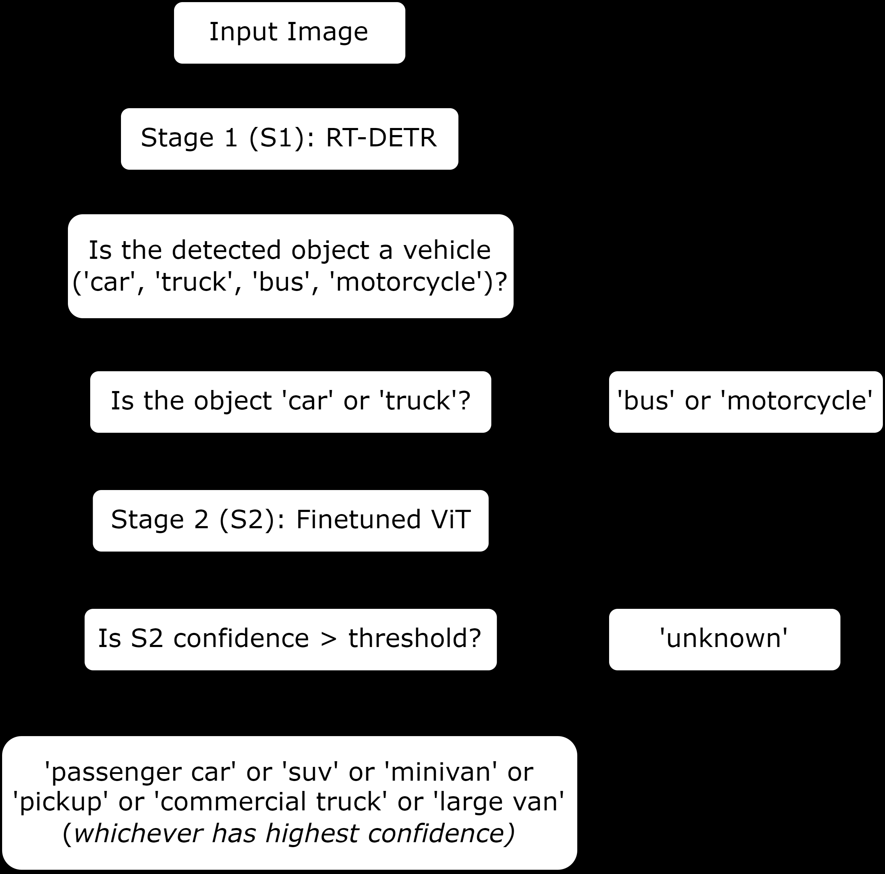
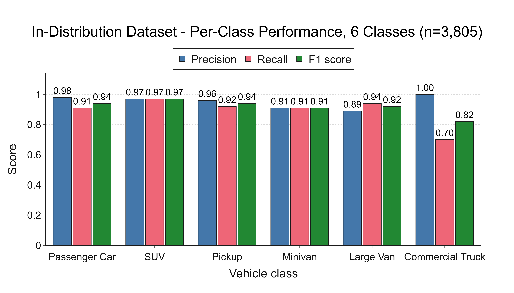
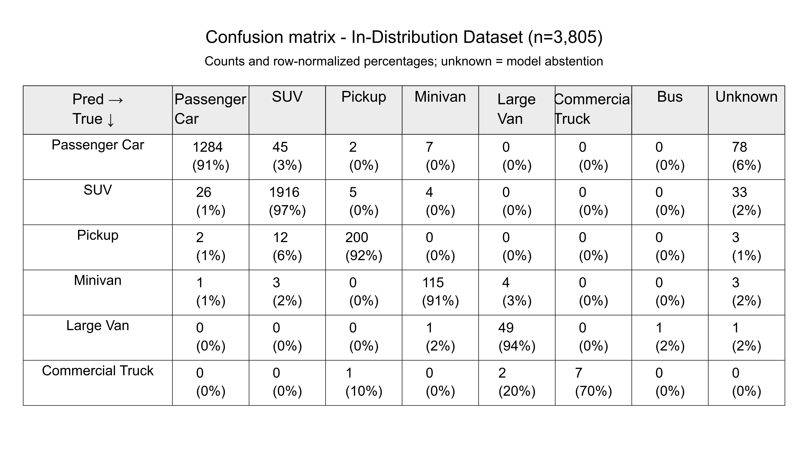
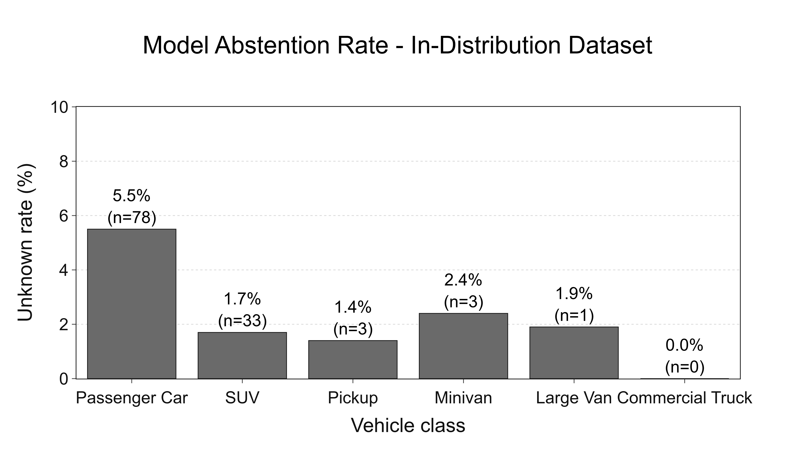

# An Open-Source Two-Stage Computer Vision Pipeline for Fine-Grained Vehicle Classification using Vision Transformers

## 摘要

### 论文元信息

| 项目 | 内容 |
|---|---|
| 标题 | An Open-Source Two-Stage Computer Vision Pipeline for Fine-Grained Vehicle Classification using Vision Transformers |
| 作者 | Gandhimathi Padmanaban, Fred Feng |
| arXiv ID | [2606.05149](https://arxiv.org/abs/2606.05149) |
| PDF | [https://arxiv.org/pdf/2606.05149](https://arxiv.org/pdf/2606.05149) |
| 领域 | cs.CV；细粒度车辆分类（Fine-Grained Vehicle Classification）、道路视频分析、骑行安全 |
| 代码状态 | 论文声明开源，但 Section 6 给出的仓库为 `https://github.com/[repo]` 占位符；本文未提供可确认的公开代码，外部检索也未发现可克隆仓库，因此不写源码段落（见 PAGE 1, PAGE 4, PAGE 21）。 |

**一句话总结：** 本文提出一个面向骑行超车场景的两阶段视觉流水线：先用预训练 RT-DETR 定位车辆，再用微调 ViT-Base/16 将 car/truck 检测框细分为六类车身类型，并用 0.60 置信度阈值输出 `unknown` 以降低静默误判风险；在 Ann Arbor 同分布数据上准确率 0.94，在独立异分布数据上准确率 0.89（见 PAGE 1, PAGE 5, PAGE 10, PAGE 14）。

本文的核心价值不在于提出新的 Transformer 结构，而在于把已有检测器、细粒度分类器和拒识机制组合成一个可复现实验框架，用于解决交通安全研究中的“车辆类型暴露量”测量问题。论文明确指出，常规目标检测基准只提供 car、truck、bus、motorcycle 等粗粒度标签，而骑行伤害风险分析需要区分 passenger car、SUV、pickup truck、minivan、large van、commercial truck 等更细的功能性车身类型（见 PAGE 1, PAGE 2, PAGE 3）。

需要特别说明的是，全文可验证的显式公式很少。论文只给出了类别权重公式 Eq. (1)，并用文字说明 softmax 阈值、F1、accuracy 和 abstention rate 的计算或用途；因此本文在公式分析处会标注“证据不足”，不补造 RT-DETR、ViT self-attention、softmax 或 F1 的论文公式（见 PAGE 8, PAGE 9）。

## 背景与动机

骑行安全研究需要区分“有多少车超越骑行者”和“哪些类型的车超越骑行者”。论文引用美国骑行死亡数据作为问题动机：美国 pedalcyclist deaths 从 2010 年的 786 人上升到 2022 年的 1,105 人，占全部交通死亡的 2.6%（见 PAGE 2）。这不是一个单纯的检测问题，因为不同车辆类型对骑行者和行人的伤害严重度不同。

论文进一步指出，SUV 和 light truck vehicles（LTVs，轻型卡车类车辆）在相同碰撞事件中比 passenger car 更可能造成严重伤害。文中给出的关键风险数字是：被 SUV 撞击时，行人或骑行者致命伤害 odds 增加 44%；儿童场景中该增幅达到 82%（见 PAGE 2）。其机制来自车辆前端几何结构：SUV 和 pickup truck 较高的 front-end geometry 更容易在骑行者重心以上发生撞击，引发 knockdown 和 secondary run-over injuries，而 passenger car 更常见 forward-vault pattern（见 PAGE 2）。

现有交通视频分析技术已经能够完成车辆检测、跟踪、速度估计和行为分析。论文将这一技术背景放在 Faster R-CNN、YOLO 系列、DETR 与 RT-DETR 的发展线上，并指出 RT-DETR 这类 end-to-end Transformer detector 减少了对 non-maximum suppression 等手工后处理组件的依赖（见 PAGE 2）。但这些检测器通常只给粗粒度标签，无法支撑车身类型级别的风险暴露分析。

细粒度车辆识别（Fine-Grained Vehicle Recognition）已有大量研究，但论文认为其目标与交通安全并不一致。Stanford Cars 等 benchmark 面向 make-and-model identification，即识别具体车型或厂牌型号；而安全分析真正需要的是功能性车身类型，例如 SUV、pickup truck、large van 等。这些类别跨越多个 make-and-model，不能直接从车型识别结果可靠映射出来（见 PAGE 3）。

论文把研究空白概括为三点：第一是 vocabulary mismatch，即现有标签体系和伤害风险相关车身类别不匹配；第二是 deployment gap，即已有方法多在干净、受控图像上训练和评估，而自然道路视频存在 oblique viewpoints、motion blur、partial occlusion、variable lighting 和 diverse backgrounds；第三是 accessibility and reproducibility，即缺少可直接用于现有 roadside video archives 的开源端到端流水线（见 PAGE 3, PAGE 4）。

## 预备知识

本文的 pipeline 属于 coarse-to-fine 两阶段范式。Stage 1 负责 coarse vehicle localization：在完整视频帧上检测车辆，并给出 COCO 风格粗类别 car、truck、bus、motorcycle。Stage 2 只对 car 或 truck 检测框进行裁剪和细粒度分类，输出六类 injury-risk-relevant body type；bus 和 motorcycle 不进入 ViT，而是保留 Stage 1 粗标签（见 PAGE 5）。

RT-DETR（Real-Time Detection Transformer）在本文中不是被重新训练的检测器，而是直接使用 `PekingU/rtdetr_r50vd_coco_o365` checkpoint。该 checkpoint 预训练于 COCO 和 Objects365，论文选择它的理由是 Objects365 联合预训练相较 COCO-only 模型可改善不常见车辆类别的 recall，例如 large vans（见 PAGE 7）。这意味着本文把检测能力外包给通用预训练模型，把研究重点放在检测框之后的细粒度车身类型分类上。

Vision Transformer（ViT）在本文中作为 Stage 2 分类器。具体模型是 `google/vit-base-patch16-224-in21k`，patch size 为 16×16 pixels，预训练于 ImageNet-21k；作者替换 classification head 为六类线性层，并在组合训练集上微调全模型（见 PAGE 8）。ViT 的作用不是端到端理解整幅交通场景，而是对 Stage 1 裁出的车辆 crop 进行 body-type 分类。

Abstention mechanism（拒识机制）是本文部署可靠性的关键设计。论文用 Stage 2 softmax top-class probability 作为置信度，当最大概率低于 0.60 时输出 `unknown`，而不是强行输出低置信类别。论文原文将其目标表述为避免 “silent misclassifications”，即避免系统在不确定时给出看似确定的错误标签（见 PAGE 1, PAGE 8）。

## 方法详解

### 创新点一：两阶段检测-分类架构

用途：Figure 1 展示整个 pipeline 的决策逻辑，是理解方法结构的主图。  
读图要点：Stage 1 检测所有车辆；car/truck 进入 Stage 2；bus/motorcycle 绕过 Stage 2；Stage 2 低置信度输出 `unknown`。  

Figure 1 支撑的判断是：本文方法的核心并非单一模型，而是一个 modular pipeline。它把通用 detection 与任务特定 fine-grained classification 解耦，因此不需要为 Stage 1 重新标注 bounding box，也不需要训练一个从全帧直接输出六类 body type 的端到端模型（见 PAGE 4, PAGE 5）。

Stage 1 的输入是完整视频帧，输出是车辆 bounding boxes 和 COCO coarse labels。论文只保留四类 COCO vehicle category：car、truck、bus、motorcycle，对应 class IDs 2、3、5、7；其他检测被丢弃。Stage 1 confidence threshold 设置为 0.35，用于抑制背景误检，同时保留部分出框或低分辨率车辆（见 PAGE 7）。

Stage 2 的输入是 car/truck 检测框 crop，输出是六类细粒度车身类型：passenger car、SUV、pickup truck、minivan、large van、commercial truck。该设计与普通 COCO 检测的差别在于，COCO 的 truck 类可能包含多种风险差异显著的车身类型，而本文进一步细分这些类别，以服务 cyclist exposure analysis（见 PAGE 1, PAGE 5）。

论文还设置了 minimum size gate：如果 bounding box 的 shorter side 小于 frame height 的 5.5%，或 area 小于 total frame area 的 0.04%，则不调用 Stage 2。这一规则的含义是，过远或过小车辆 crop 缺少足够的 type-discriminating texture，强行细分可能产生误导性预测（见 PAGE 7, PAGE 8）。

### 创新点二：面向道路视频的训练数据构造

本文训练集来自三类来源：Stanford Cars、web-scraped imagery 和 Ann Arbor field crops。Stanford Cars 通过 rule-based label translator 映射到 passenger car、SUV、pickup truck、minivan 四类；web-scraped imagery 主要补充 large van、commercial truck、minivan；Ann Arbor field crops 则由 Stage 1 detector 从本地道路视频中裁出，覆盖全部六类并提供 in-domain imagery（见 PAGE 6, PAGE 7）。

| Class | Stanford Cars | Web-scraped | Field crops | Total | % |
|---|---:|---:|---:|---:|---:|
| Passenger car | 9,689 | 0 | 686 | 10,375 | 62.6% |
| SUV | 2,854 | 0 | 1,034 | 3,888 | 23.4% |
| Pickup truck | 1,519 | 0 | 111 | 1,630 | 9.8% |
| Minivan | 416 | 33 | 61 | 510 | 3.1% |
| Large van | 0 | 68 | 24 | 92 | 0.6% |
| Commercial truck | 0 | 84 | 2 | 86 | 0.5% |
| Total | 14,478 | 185 | 1,918 | 16,581 | 100% |

表格解读：Table 1 暴露出本文方法的一个根本张力。作者希望识别 large van 和 commercial truck 等安全关键类别，但训练数据中这两类合计不足 200 张，只占约 1.1%；相反 passenger car 与 SUV 合计占 86%。因此后续 focal loss、class weight 和 weighted random sampler 并不是附属技巧，而是缓解类别不平衡的必要组件（见 PAGE 7, PAGE 8）。

数据构造的优势是覆盖了 controlled imagery 与 field imagery 两种分布。Stanford Cars 提供大规模 make-and-model 图像，web-scraped imagery 补少数类，Ann Arbor field crops 提供道路视角、遮挡、光照和运动模糊等部署条件（见 PAGE 6, PAGE 7）。但这也引出一个需要谨慎解释的问题：论文没有充分说明 Ann Arbor field crops 与 in-distribution evaluation events 在 event/frame 层面是否严格隔离；若存在重叠或近邻帧相似性，可能使同分布结果偏乐观。对此全文证据不足，只能作为风险而非定论提出（见 PAGE 7, PAGE 9）。

### 创新点三：ViT-Base/16 微调与类别不平衡处理

Stage 2 采用 ViT-Base/16，输入在 inference 时 resize 到 256×256 pixels，再 center-crop 到 224×224；训练时使用 random crop 以引入空间变化。训练增强包括 random horizontal flip、color jitter（brightness、contrast、saturation factors 为 0.3，hue factor 为 0.1）以及 probability 0.2 的 random erasing（见 PAGE 8）。

论文使用 focal loss，focusing parameter 为 $\gamma = 2.0$。这里 $\gamma$ 是 focal loss 中控制难样本聚焦程度的参数；值越大，模型越强调当前分类困难或低置信样本。需要注意：论文没有给出 focal loss 的完整公式，因此本文不补写该公式，避免把通用知识误标为论文公式（见 PAGE 8）。

全文明确给出的类别权重公式是：

$$
w_c = \frac{N}{n_c \cdot C}
$$

其中，$w_c$ 表示类别 $c$ 的权重，$N$ 表示训练样本总数，$n_c$ 表示类别 $c$ 的样本数，$C$ 表示类别总数。这个公式的直观含义是：样本越少的类别获得越高权重，从而抵消训练集分布中 passenger car 与 SUV 对 loss 的支配。论文还说明这些权重会被归一化，使 $\sum_c w_c = C$（见 PAGE 8）。

除 loss weighting 外，作者还使用 weighted random sampler 在 batch 内 oversample minority classes。这与 focal loss 是互补关系：前者改变训练 batch 的采样分布，后者改变损失函数对不同类别和难样本的惩罚强度。两者共同服务于同一个问题，即 large van、commercial truck 和 minivan 在数据中显著少于 passenger car 与 SUV（见 PAGE 7, PAGE 8）。

优化设置较为标准：AdamW optimizer，learning rate 为 $2 \times 10^{-5}$，batch size 为 64，训练 30 epochs；GPU 可用时使用 mixed-precision FP16。论文没有留出 validation split，而是用独立 field evaluation datasets 评估泛化。这一选择可最大化少数类训练样本暴露，但也意味着训练过程没有 early stopping 或 validation curve 监控（见 PAGE 8, PAGE 17）。

### 创新点四：置信度拒识机制

Abstention mechanism 是本文区别于普通分类 pipeline 的关键部署策略。论文设定 per-class confidence threshold 为 0.60；当 Stage 2 softmax output 的最大 predicted probability 低于该阈值时，pipeline 输出 `unknown`。在评估中，`unknown` 被当作 incorrect classification 计入 accuracy，因此报告准确率是偏保守的 worst-case bound；同时每类 abstention rate 单独报告（见 PAGE 8, PAGE 9）。

这一设计的优势是将不确定性显式暴露给下游系统。对于交通安全研究，错误地把 minivan 标成 SUV 或把 commercial truck 标成 pickup truck 可能污染 exposure analysis；输出 `unknown` 虽然降低表面准确率，却可以将样本转给人工复核或后续模型再分析。论文在摘要中把 minivan OOD 退化解释为 abstention rate 上升，而非 active misclassification 增加，这一点正是拒识机制的价值所在（见 PAGE 1, PAGE 14, PAGE 19）。

但是论文对“per-class threshold”的描述并不充分。PAGE 1 写作 “class-specific threshold of 0.60”，PAGE 8 写作 “per-class confidence threshold of 0.60”，但全文没有给出每个类别不同阈值的表格或调参过程。因此更稳妥的理解是：所有 Stage 2 类别统一应用 0.60 阈值，或至少论文没有提供证据证明阈值按类别分别校准。这里属于证据不足（见 PAGE 1, PAGE 8）。

### 公式与证据充分性说明

按 paper-analyzer 的 academic 标准，理想分析应引用至少五处论文公式。但本论文全文材料中可确认的显式公式只有类别权重 Eq. (1)。softmax、accuracy、precision、recall、F1 score 和 abstention rate 都以文字说明或指标名出现，未给出可引用的数学定义；RT-DETR 与 ViT 的内部 self-attention 或 detection loss 也没有在方法部分展开。因此本文只引用 Eq. (1)，并明确标注公式证据不足（见 PAGE 8, PAGE 9）。

## 实验分析

### 实验设置概述

论文设置两个评估条件。In-distribution condition 使用 Ann Arbor N. Division 两个 session，日期为 2022 年 10 月 6 日和 10 月 11 日；两次 session 共提供 3,874 个 annotated passing events，过滤后保留 3,805 个六类评估事件（见 PAGE 6, PAGE 9）。Out-of-distribution condition 使用 instrumented bicycle open dataset 的两个 trip，采集地点和条件不同于 Ann Arbor 训练域，过滤后保留 311 个六类事件（见 PAGE 6, PAGE 9, PAGE 12）。

评价协议中有一个重要细节：inference outputs 与 ground-truth labels 按 annotated frame number 连接；如果某帧 inference output 中没有 detection，则该帧被排除在 metric computation 之外，因为作者将其视为 detection-stage failure 而非 classification error（见 PAGE 9）。这意味着论文报告的 accuracy 更准确地说是“在已有检测输出并成功匹配的事件上的分类准确率”，不是完整视频流水线从检测到分类的端到端事件召回率。

### 同分布结果：Ann Arbor N. Division

用途：Figure 2 用于可视化同分布评估中每类 precision、recall 和 F1。  
读图要点：SUV 的 F1 最高；commercial truck precision 高但 recall 低；passenger car precision 高于 recall。  

Figure 2 支撑的判断是：同分布总体准确率 0.94 并非所有类别都同等可靠。SUV、passenger car、pickup truck 和 minivan 具有较稳定表现，但 commercial truck 只有 10 个样本，recall 0.70 的统计不确定性很高（见 PAGE 10）。

| Class | Sample Size | Precision | Recall | F1 |
|---|---:|---:|---:|---:|
| Passenger car | 1,416 | 0.98 | 0.91 | 0.94 |
| SUV | 1,984 | 0.97 | 0.97 | 0.97 |
| Pickup truck | 217 | 0.96 | 0.92 | 0.94 |
| Minivan | 126 | 0.91 | 0.91 | 0.91 |
| Large van | 52 | 0.89 | 0.94 | 0.92 |
| Commercial truck | 10 | 1.00 | 0.70 | 0.82 |
| Overall accuracy | 3,805 |  |  | 0.94 |

表格解读：Table 2 显示，同分布结果最强的是 SUV，F1 为 0.97；passenger car 虽然 precision 达 0.98，但 recall 为 0.91，表明一部分真实 passenger car 被拒识或混淆。Commercial truck 的 precision 为 1.00，但 recall 0.70 意味着 10 个真实样本中有 3 个没有被正确分类；样本量太小，不能据此断言该类别已可靠解决（见 PAGE 10）。

用途：Figure 3 用于定位同分布错误模式，而不是只看 aggregate accuracy。  
读图要点：主要 off-diagonal errors 出现在 passenger car 与 SUV 之间；`unknown` 列显示拒识样本。  

Figure 3 支撑的判断是：本文最主要的分类边界问题不是 truck 与 car 的粗粒度区分，而是视觉相邻 body type 的细粒度边界。论文指出 passenger car 被预测为 SUV 的事件有 45 个，占 passenger car events 的 3.2%；SUV 被预测为 passenger car 的事件有 26 个，占 SUV events 的 1.3%。这与小型 SUV、sedan、hatchback 等形态边界模糊有关（见 PAGE 11）。

用途：Figure 4 用于解释 accuracy 之外的 operational reliability。  
读图要点：passenger car 的拒识率最高，为 5.5%；SUV、pickup truck、minivan、large van 在 1.4% 到 2.4% 之间；commercial truck 样本中无拒识。  

Figure 4 支撑的判断是：拒识机制并非均匀影响所有类别。Passenger car 的较高 abstention rate 可能来自该类内部形态多样性，论文明确提到 sedan、hatchback、wagon 等 body style 会增加 intra-class variability（见 PAGE 11, PAGE 12）。

### 异分布结果：Instrumented Bicycle Open Dataset

OOD 评估是本文较有价值的实验，因为它不进行 retraining 或 threshold adjustment，直接把模型应用到不同地点、不同采集条件的数据上（见 PAGE 12）。总体准确率从同分布的 0.94 降至 0.89，下降 5 个百分点（见 PAGE 12, PAGE 14）。

| Class | Sample Size | Precision | Recall | F1 |
|---|---:|---:|---:|---:|
| Passenger car | 126 | 0.96 | 0.85 | 0.90 |
| SUV | 123 | 0.91 | 0.94 | 0.93 |
| Pickup truck | 27 | 0.96 | 0.96 | 0.96 |
| Minivan | 16 | 1.00 | 0.56 | 0.72 |
| Large van | 9 | 1.00 | 0.89 | 0.94 |
| Commercial truck | 10 | 1.00 | 1.00 | 1.00 |
| Overall accuracy | 311 |  |  | 0.89 |

表格解读：Table 3 表明，OOD 条件下 pickup truck 最稳定，F1 为 0.96，与同分布结果相当；passenger car 和 SUV 分别降至 0.90 和 0.93。最大退化来自 minivan：F1 从 0.91 降至 0.72，recall 只有 0.56。Large van 和 commercial truck 的 OOD 数字看似很强，但样本数分别只有 9 和 10，不足以支持强结论（见 PAGE 14）。

Minivan 退化是理解本文拒识机制的关键案例。论文指出，minivan 的 OOD abstention rate 从同分布 2.4% 上升到 25.0%，其 F1 下降主要由拒识驱动，而不是主动错分驱动（见 PAGE 1, PAGE 14, PAGE 19）。这说明模型在域外 minivan 样本上“不确定”，并将不确定性传递给输出，而不是强行输出错误类别。

### 同分布与异分布对比

| Class | F1 In-Distribution | F1 Out-of-Distribution | Change |
|---|---:|---:|---:|
| Passenger car | 0.94 | 0.90 | -0.04 |
| SUV | 0.97 | 0.93 | -0.04 |
| Pickup truck | 0.94 | 0.96 | +0.02 |
| Minivan | 0.91 | 0.72 | -0.19 |
| Large van | 0.92 | 0.94 | +0.02 |
| Commercial truck | 0.82 | 1.00 | +0.18 |

表格解读：跨域变化不能只按数值大小解释。Pickup truck、large van、commercial truck 的 OOD F1 不降反升，但 large van 和 commercial truck 样本数极小，统计稳定性不足。真正可解释的趋势是 passenger car 与 SUV 小幅下降，以及 minivan 明显下降。论文自身也强调，commercial truck 等小样本类别应谨慎解释（见 PAGE 9, PAGE 14）。

从任务价值看，0.89 的 OOD accuracy 已经说明 ViT 的 ImageNet-21k 预训练表示对新道路视频场景有一定迁移能力；但从部署角度看，5 个百分点下降和 minivan recall 降至 0.56 都提示该 pipeline 仍需要 site-specific validation，尤其是在新城市、夜间、遮挡、不同相机高度和不同道路几何下使用时（见 PAGE 14, PAGE 17, PAGE 18）。

## 讨论

本文最强的贡献是把车辆 body-type classification 从干净图像 benchmark 拉回自然道路视频场景。论文没有追求 196 类 make-and-model recognition，而是选择六类与 cyclist injury severity 更相关的 functional body-type vocabulary。这种 vocabulary alignment 是方法论上的关键：任务标签必须服务于下游风险分析，而不是服从现有 benchmark 的便利性（见 PAGE 3, PAGE 4, PAGE 18, PAGE 19）。

两阶段结构的工程合理性也较强。RT-DETR 负责检测，ViT 负责分类，检测器无需 task-specific fine-tuning；这降低了 bounding-box annotation 需求，并使模型可用于已有视频档案。对 car/truck 才调用 Stage 2，也比在全帧上做细粒度分类更节省计算（见 PAGE 3, PAGE 4, PAGE 5）。

拒识机制是本文比普通 fine-grained classifier 更适合安全应用的地方。交通安全场景中，错误标签可能比 `unknown` 更危险，因为它会被下游统计分析当作真实暴露量。论文把 `unknown` 计为 incorrect classification，同时报告 abstention rate，这一评价方式比只报告 accuracy 更诚实（见 PAGE 8, PAGE 9）。

不过，论文标题中的 “Open-Source” 与正文 Section 6 的实际证据之间存在落差。摘要、贡献和结论都声明 full pipeline、training code、evaluation utilities 和 model weights 已发布（见 PAGE 1, PAGE 4, PAGE 21），但 Section 6 给出的链接是 `https://github.com/[repo]` 占位符，而非真实仓库地址（见 PAGE 21）。因此在当前材料下，本文只能认定“作者声称开源”，不能认定“公开代码已可确认获取”。

另一个需要谨慎的点是端到端评估边界。论文在 evaluation protocol 中排除了没有 detection output 的 frame，因为这类错误属于 detection-stage failure 而非 classification error（见 PAGE 9）。这种做法有助于隔离 Stage 2 分类性能，但如果用户想把系统部署成完整自动标注工具，还需要知道 Stage 1 miss detection 对 event-level recall 的影响。论文没有报告完整端到端检测-分类召回，因此证据不足。

## 局限分析

作者自述的第一类局限是类别不平衡与少数类样本稀疏。Commercial truck 与 large van 合计训练样本少于 200 张，在训练集中约占 1.1%；同分布评估中 commercial truck 只有 10 个样本、large van 52 个样本，OOD 中分别为 10 和 9 个样本。论文明确指出这些类别的 per-class estimates 具有高不确定性，应谨慎解释（见 PAGE 7, PAGE 9, PAGE 17）。

作者自述的第二类局限是 evaluation geometry 特定于固定 roadside camera，且相机位于 bicycle lane 附近。论文明确说明该 annotation and matching protocol 不能直接迁移到 overhead intersection cameras、vehicle-mounted cameras 或 drone footage；front-facing 或 rear-facing dashcam 视角也没有评估（见 PAGE 17）。

作者自述的第三类局限是 Stage 2 training 没有 validation split。模型在完整 assembled dataset 上训练 30 epochs，没有 early stopping；虽然独立 field evaluation sets 可作为泛化代理，但训练收敛没有由 objective stopping criterion 监控。论文也指出 Stanford Cars 中 studio/promotional photography 与 roadside crop imagery 存在系统分布差异，可能影响 passenger car abstention（见 PAGE 8, PAGE 17, PAGE 18）。

作者自述的第四类局限是 pipeline 对单帧分类，没有利用视频中的 temporal redundancy。自然超车事件通常跨越多个连续帧，如果使用 majority vote、Bayesian temporal filter 或 sequence transformer 聚合帧级预测，可能降低 motion blur、partial occlusion 和单帧视角噪声带来的拒识与误分（见 PAGE 18, PAGE 20）。

本文的独立判断是：论文还需要补充真实开源仓库、检测阶段失败统计、阈值校准过程和跨站点更大规模少数类评估。尤其是“0.60 阈值”是否经过 validation、是否按类别单独调参、是否能在新城市保持 calibration，全文没有提供足够证据。考虑到拒识机制是本文可靠性叙事的核心，这部分应在后续版本中更透明地报告（见 PAGE 8, PAGE 9, PAGE 21）。

## 结论

本文展示了一个务实而有应用价值的 coarse-to-fine transformer pipeline：用预训练 RT-DETR 完成车辆定位，用微调 ViT-Base/16 完成六类细粒度 body-type classification，并用 confidence-based abstention 把不确定样本输出为 `unknown`。在 3,805 个 Ann Arbor 同分布超车事件上，系统达到 0.94 accuracy；在 311 个异分布 instrumented bicycle dataset 事件上，不经重训达到 0.89 accuracy（见 PAGE 10, PAGE 14, PAGE 20）。

从学术贡献看，本文不是模型结构创新论文，而是任务定义、数据构造、部署评估与开放工具链结合的应用型计算机视觉论文。它把 fine-grained vehicle classification 与 cyclist safety exposure analysis 对齐，填补了 COCO 粗标签与伤害风险相关车身类型之间的空白（见 PAGE 3, PAGE 4, PAGE 18, PAGE 19）。

从复现角度看，当前材料仍有缺口：论文声称完整开源，但给出的 GitHub 地址是占位符；全文可引用公式不足；部分图表如 Figure 5-10 没有在本任务提供的 `figures` 中给出图片路径，因此本文未嵌入。后续若真实代码仓库发布，最有价值的复现方向应是验证 Stage 1 miss detection、Stage 2 calibration、跨城市 OOD 表现，以及 temporal aggregation 对 minivan 和 passenger car abstention 的改善幅度。

## 证据索引

| 主题 | 关键证据 | 页码 |
|---|---|---|
| 论文标题、作者、摘要、arXiv 标记 | 标题、作者单位、abstract、arXiv:2606.05149v1 | PAGE 1 |
| 任务动机 | 骑行死亡数、SUV/LTV 伤害风险、前端几何伤害机制 | PAGE 2 |
| 现有方法不足 | COCO 粗粒度类别、make-and-model 与安全 body type 不匹配 | PAGE 2, PAGE 3 |
| 研究空白 | vocabulary mismatch、deployment gap、accessibility and reproducibility | PAGE 3, PAGE 4 |
| 论文贡献 | 两阶段 pipeline、拒识机制、ID/OOD 评估、声称开源 | PAGE 4 |
| Pipeline 决策逻辑 | RT-DETR Stage 1、ViT Stage 2、bus/motorcycle bypass、unknown | PAGE 5 |
| 数据采集与标注 | Ann Arbor 两次 session、instrumented bicycle OOD dataset、10 fps frame decoding、人工标注 | PAGE 6 |
| 训练集构造 | Stanford Cars、web-scraped imagery、Ann Arbor field crops | PAGE 6, PAGE 7 |
| 训练集分布 | Table 1，16,581 images，类别严重不平衡 | PAGE 7 |
| Stage 1 设置 | `PekingU/rtdetr_r50vd_coco_o365`、COCO/Objects365、threshold 0.35、size gate | PAGE 7, PAGE 8 |
| Stage 2 设置 | ViT-Base/16、ImageNet-21k、224 crop、augmentation、AdamW、30 epochs | PAGE 8 |
| 公式证据 | 类别权重公式 $w_c = N/(n_c \cdot C)$，归一化 $\sum_c w_c=C$ | PAGE 8 |
| 拒识机制 | softmax top probability < 0.60 输出 `unknown`，unknown 计为错误并单独报告 abstention | PAGE 8, PAGE 9 |
| 评价协议 | 按 frame number 匹配；no detection frames 排除；metrics 用 scikit-learn | PAGE 9 |
| 同分布结果 | Overall accuracy 0.94，Table 2 per-class metrics | PAGE 10 |
| 同分布混淆 | passenger car 与 SUV 主要混淆，Figure 3 | PAGE 11 |
| 同分布拒识 | Figure 4，passenger car abstention 5.5% | PAGE 11, PAGE 12 |
| OOD 结果 | Overall accuracy 0.89，Table 3 per-class metrics | PAGE 12, PAGE 14 |
| OOD minivan 退化 | F1 0.72，abstention rate 从 2.4% 到 25.0% | PAGE 14, PAGE 19 |
| 作者讨论 | ID 到 OOD 下降 5 个百分点，domain shift 解释 | PAGE 14, PAGE 15 |
| 作者自述局限 | 少数类样本少、固定 roadside geometry、无 validation split、单帧无 temporal aggregation | PAGE 17, PAGE 18 |
| 应用意义 | 车辆 body type 暴露量、交通组成监测、安全关键拒识 | PAGE 18, PAGE 19 |
| 未来方向 | temporal aggregation、domain adaptation、少数类扩充、trajectory integration | PAGE 20 |
| 结论 | 两阶段 transformer pipeline 的总结与性能回顾 | PAGE 20, PAGE 21 |
| 代码状态 | Section 6 声称公开，但链接为 `https://github.com/[repo]` 占位符 | PAGE 21 |
