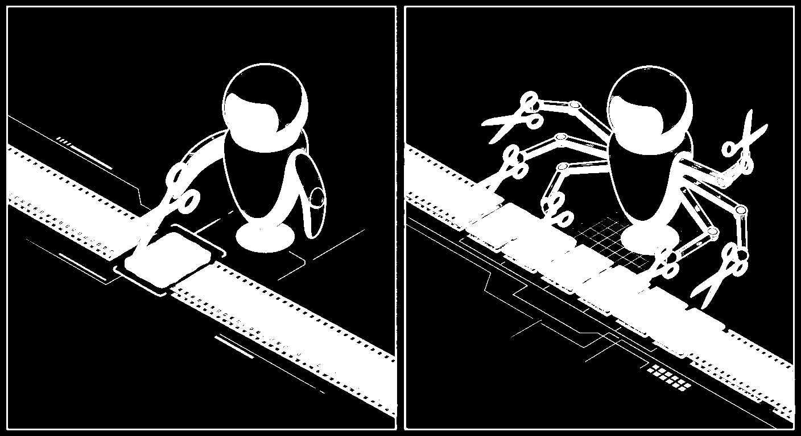
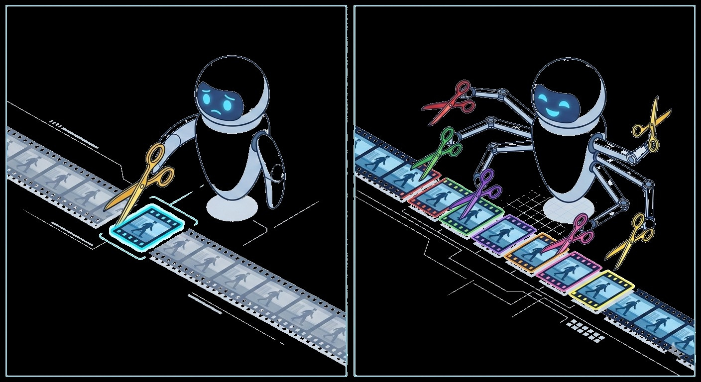

# Towards One-to-Many Temporal Grounding

## 摘要

### 论文元信息

| 项目 | 内容 |
|---|---|
| 标题 | Towards One-to-Many Temporal Grounding |
| 作者 | Qi Xu, Yue Tan, Shihao Chen, Jiahao Meng, Anna Wang, Shunping Ji, Hao Fei, Jason Li |
| arXiv ID | 2606.06294v1 |
| 链接 | http://arxiv.org/abs/2606.06294v1 |
| 发布时间 | 2026-06-04T15:31:22Z |
| 领域 | cs.CV, cs.AI |
| 主题方向 | 视频理解中的时序定位 / Temporal Grounding |
| 代码状态 | 已知代码链接未知；论文正文与给定材料未提供可确认的公开代码仓库，因此本文不写源码段。 |
| 证据边界 | 报告依据为摘要与带 PAGE 标记的 PDF 抽取文本；输入标注为 `fulltext:pypdf:truncated`，因此对缺失页或未给出的附录内容均标注“证据不足”。 |

一句话总结：本文将传统单片段视频时序定位（One-to-One Temporal Grounding）扩展为单查询、多离散片段定位（One-to-Many Temporal Grounding, OMTG），并通过新基准、新数据集和 SFT+RL 奖励设计，使 OMTG-4B 在 OMTG Bench 上达到 43.65% EtF1，显著超过 Gemini 2.5 Pro 与 Seed-1.8（见 PAGE 1, PAGE 2, PAGE 6）。

本文的核心贡献可以概括为三点。第一，论文正式定义 OMTG：给定一个文本查询，模型需要返回所有语义匹配的离散时间段，而不是只返回一个最相关片段（见 PAGE 1, PAGE 2）。第二，论文提出 OMTG Bench 及配套指标，包括 Count Accuracy（C-Acc）与 Effective Temporal F1（EtF1），用于显式惩罚漏检、幻觉片段和事件数量错误（见 PAGE 3, PAGE 4）。第三，论文构建约 56k 训练样本，并采用监督微调（Supervised Fine-Tuning, SFT）与基于 GRPO 的强化学习（Reinforcement Learning, RL），通过 temporal reward、caption reward 与 length penalty 共同优化完整性与边界精度（见 PAGE 4, PAGE 5, PAGE 6, PAGE 7）。

需要先说明证据限制。用户提供的 `figures` 只包含 PAGE 1 的 Figure 1 切片路径，因此本文只嵌入这些已提供路径。论文全文文本中出现 Figure 2、Figure 3、Figure 4、Figure 5、Figure 6、Figure 7 的图注与描述，但未提供对应 `markdown_path`；这些图只在正文中按编号引用，不输出不存在的图片路径。代码方面，论文正文未给出仓库 URL，已知代码链接为未知，因此“源码实现与文件函数对应关系”证据不足，不能编造代码段。

## 背景与动机

Temporal Grounding（TG，视频时序定位）解决的问题是：给定一段视频和一个自然语言查询，模型需要找出视频中与查询语义对应的时间片段。例如查询“a person clapping”，传统 TG 任务通常假设这个动作只对应一个目标片段，模型只需返回一个起止时间即可（见 PAGE 1, PAGE 2）。这一设定适合单事件检索，但并不完全匹配真实视频内容。

真实视频往往包含重复、间歇或多次出现的语义事件。一个人在多个时间点鼓掌、讲解者多次看向镜头、比赛视频中同一类动作反复发生，这些场景都要求模型定位“所有”语义一致的片段，而不是选择一个代表性片段。论文将这一问题命名为 One-to-Many Temporal Grounding（OMTG），即一个查询对应多个不连续时间段（见 PAGE 1）。

传统 one-to-one 评测指标在这里会失效。论文指出，R@1 与单段 tIoU 适用于单个 ground-truth segment 的情况，但 OMTG 中一个查询对应的是 segment set，因此必须同时评价“定位是否准”和“数量是否对”（见 PAGE 3, PAGE 4）。如果模型把多个相邻事件合并成一个长片段，它可能仍然得到较高 tIoU，却没有识别出事件的离散结构；如果模型输出过多片段，也可能覆盖真实区间，但引入幻觉片段。

论文 Figure 2 专门展示了 tIoU 的欺骗性：Gemini 3 Pro 在两个例子中都取得超过 0.9 的 tIoU，但一个例子属于 under-segmentation，即把 4 个真实片段合并成 1 个片段；另一个例子属于 over-segmentation，即把 2 个真实片段扩展为 4 个预测片段。两种情况下 C-Acc 与 EtF1 都为 0，说明高 tIoU 并不代表 OMTG 成功（见 PAGE 3）。

这一动机直接对应业务中的事件检索、视频自动切片和复杂事件标注。若系统只返回一个片段，用户仍需人工检查其他出现位置；若系统返回多余片段，会增加审核与剪辑成本。论文的 OMTG 设定更接近“找出视频里所有满足文本条件的事件实例”，这比传统单段定位更适合长视频检索和事件级自动标注。不过，这是基于任务形式与实验结果的应用推断，不是论文直接给出的产业结论。

## 预备知识

### OMTG 的任务形式

论文将 OMTG 表述为 MLLM 框架下的生成任务。给定视频 $V=\{f_t\}_{t=1}^{T}$ 与文本查询 $Q=\{w_l\}_{l=1}^{L}$，其中 $f_t$ 表示第 $t$ 帧，$T$ 表示视频帧数，$w_l$ 表示查询中的第 $l$ 个词，$L$ 表示查询长度，模型学习一个映射函数 $F_\theta$，直接生成自然语言响应 $Y$（见 PAGE 2）：

$$
Y = F_\theta(V, Q)
$$

这个公式的含义是：模型不是输出固定格式的分类标签，而是根据视频与查询生成一段可解析的自然语言答案，其中包含时间区间。

随后，论文使用确定性解析函数 $\phi(\cdot)$ 从生成文本 $Y$ 中抽取预测时间段集合 $P$（见 PAGE 2）：

$$
P = \phi(Y)=\{(\hat{s}_m,\hat{e}_m)\}_{m=1}^{M}
$$

这里 $\hat{s}_m$ 与 $\hat{e}_m$ 分别表示第 $m$ 个预测片段的起止时间，$M$ 是模型预测的片段数量。人话解释是：模型可以用文本回答，但最终评测要把 `<time>start - end seconds</time>` 这类结构解析为多个时间区间。

ground-truth 标注被定义为集合 $G$（见 PAGE 2）：

$$
G=\{(s_k,e_k)\}_{k=1}^{K}
$$

其中 $s_k$ 与 $e_k$ 表示第 $k$ 个真实片段的起止时间，$K$ 是真实事件出现次数。OMTG 的关键不只是让每个预测边界接近真实边界，还要求 $M=K$，即预测的事件数量等于真实事件数量（见 PAGE 2, PAGE 3）。

### 为什么需要新的指标

传统 tIoU（Temporal Intersection over Union，时间交并比）衡量预测时间区域与真实时间区域的重叠程度。在 OMTG 中，论文将所有预测片段取并集、所有真实片段取并集，然后计算数据集平均 tIoU（见 PAGE 4）：

$$
tIoU=\frac{1}{N}\sum_{i=1}^{N}
\frac{length((\cup P_i)\cap(\cup G_i))}
{length((\cup P_i)\cup(\cup G_i))}
$$

这里 $N$ 是样本数，$length(\cdot)$ 表示时间区间集合的总时长。这个公式在说：只要模型覆盖了大部分真实时间区域，tIoU 就可能很高；但它不关心这些时间是否被正确拆成多个事件实例。因此，tIoU 不能单独承担 OMTG 的评测任务（见 PAGE 3, PAGE 4）。

论文进一步用 Hungarian algorithm 在预测片段与真实片段之间建立最优一对一匹配，并在 IoU 阈值 $\xi$ 下定义 temporal precision 与 temporal recall（见 PAGE 4）：

$$
tP_i@\xi=\frac{TP_i@\xi}{M_i}, \quad
tR_i@\xi=\frac{TP_i@\xi}{K_i}
$$

其中 $TP_i@\xi$ 表示第 $i$ 个样本中 IoU 超过阈值 $\xi$ 的匹配对数量，$M_i$ 是预测片段数，$K_i$ 是真实片段数。这个公式的含义是：precision 惩罚多预测和幻觉片段，recall 惩罚漏掉真实事件。

Temporal F1-Score（tF1）综合 precision 与 recall（见 PAGE 4）：

$$
tF1@\xi=\frac{1}{N}\sum_{i=1}^{N}
\frac{2\cdot tP_i@\xi\cdot tR_i@\xi}
{tP_i@\xi+tR_i@\xi}
$$

这个公式在说：模型既要少输出错误片段，也要覆盖真实片段；二者任何一方较差都会拉低 tF1。

Count Accuracy（C-Acc）显式衡量事件数量是否正确（见 PAGE 4）：

$$
C\text{-}Acc=\frac{1}{N}\sum_{i=1}^{N}\mathbf{1}(M_i=K_i)
$$

其中 $\mathbf{1}(\cdot)$ 是指示函数。这个公式非常直接：只有预测片段数和真实片段数完全一致，样本才在计数指标上得分。

Effective Temporal F1-Score（EtF1）是论文最关键的综合指标。它在 tF1 前加入计数一致性门控（见 PAGE 4）：

$$
EtF1=\frac{1}{N\cdot|\Xi|}\sum_{\xi\in\Xi}\sum_{i=1}^{N}
\mathbf{1}(M_i=K_i)\cdot
\frac{2\cdot tP_i@\xi\cdot tR_i@\xi}
{tP_i@\xi+tR_i@\xi}
$$

其中 $\Xi=\{0.3,0.5,0.7\}$。这个公式的含义是：如果事件数量预测错了，即使边界重叠较高，该样本也被置零。EtF1 因此比 tIoU 更严格，更符合 OMTG 对“完整性 + 精确性”的要求（见 PAGE 4）。

## 方法详解

### 1. 从 one-to-one 到 one-to-many：任务定义的变化

论文的第一项方法论贡献不是一个网络模块，而是任务重定义。传统 TG 的目标通常是“找到一个最匹配片段”，而 OMTG 要求生成多个片段构成的集合 $P$，并同时匹配 ground-truth 集合 $G$ 的数量与边界（见 PAGE 1, PAGE 2）。这意味着模型需要具备 event cardinality perception，即感知同一语义事件出现了几次。

这一变化对 MLLM 特别重要。MLLM 往往以自然语言方式生成答案，如果训练数据主要是 one-to-one 格式，模型会倾向输出单个时间段，即使视频中存在多个事件实例。论文在 PAGE 2 指出，现有 open-source models、traditional TG experts 与部分 proprietary models 在 OMTG 中存在明显能力缺口，常出现接近零的 EtF1。

Figure 1 是论文对这一路线的总览，显示 OMTG dataset、SFT、temporal reward 与 caption reward 如何推动模型从 one-to-one 能力转向 one-to-many 能力（见 PAGE 1）。

用途：下图为输入 `figures` 提供的 PAGE 1 Figure 1 切片，用于呈现论文对 OMTG 能力路线的图形化概览。

读图要点：Figure 1 总体表达的是“数据构建 + SFT + RL 奖励”共同推动模型获得 OMTG 能力。支撑判断：本文方法并非只提出一个新指标，而是将数据、训练和奖励函数作为系统方案（见 PAGE 1, PAGE 2）。

用途：下图同样来自 PAGE 1 Figure 1 的可用切片，用于辅助观察 one-to-one 与 one-to-many 任务迁移关系。

读图要点：图注说明左侧展示从 One-to-One 到 One-to-Many 的训练路径。支撑判断：OMTG 的关键瓶颈在于模型原本缺乏多事件数量感知，而非单纯边界回归误差（见 PAGE 1）。

用途：下图为 PAGE 1 Figure 1 的第三个可用切片，用于支撑论文关于 SFT 与 reward gain 的描述。

读图要点：Figure 1 标注了 SFT、Temporal Reward 和 Caption Reward 对 EtF1 的增益方向。支撑判断：论文将 SFT 视为建立基础 OMTG 能力，将 RL 奖励视为进一步提升精确性与完整性的阶段（见 PAGE 1, PAGE 6, PAGE 8）。

用途：下图为 PAGE 1 Figure 1 的第四个可用切片，用于展示模型能力分区的高层对比。

读图要点：图注说明右侧展示 OMTG Bench 上的 capability landscape。支撑判断：论文认为现有模型大多处于 no/weak OMTG capability，而 OMTG-4B 达到 strong OMTG capability 区间（见 PAGE 1, PAGE 2, PAGE 6）。

### 2. OMTG Bench：把“数量正确”纳入基准

论文构建了包含 340 个手工样本的 OMTG Bench，覆盖 sports、cooking、news 等多种领域。样本来自 Charades、ActivityNet、QVHighlights、VTimeLLM 和 Moment10m 的测试集，并保证 benchmark 的视频来源与训练集没有重叠（见 PAGE 4）。每个样本标注精确边界，并由独立专家验证，一致率超过 90%（见 PAGE 4）。

benchmark 的难度体现在两个方面。第一，真实片段数量从 2 到 20 不等，其中 62.2% 的样本包含 2-3 个实例，15% 的样本包含超过 6 个实例（见 PAGE 4, PAGE 22）。第二，视频时长从 21 秒到超过 17 分钟，平均 221.6 秒（见 PAGE 4）。这说明 OMTG Bench 不是简单的短视频重复动作集合，而是包含长视频、多次数、跨领域的定位任务。

Figure 6 给出了 benchmark 的统计分布：左侧是 ground-truth segment 数量分布，右侧是视频时长直方图（见 PAGE 22）。由于输入未提供 Figure 6 的 `markdown_path`，本文不嵌入该图；但根据 PAGE 22 的图注与正文统计，可以确认该图支撑“多数样本为 2-3 段，同时存在高次数与长视频样本”的判断。

### 3. 56k OMTG Dataset：从公开视频到多片段监督

训练数据方面，论文构建了约 56k 的 OMTG Dataset。原始视频来自 Cosmos-Cap、Moment-10M 和 VTimeLLM，随后通过五阶段自动化流水线转化为 one-to-many supervision signals（见 PAGE 4, PAGE 5）。

第一阶段是 Repetitive Event Discovery。论文使用 Qwen3-VL-235B 扫描原始视频，发现出现多次的显著事件，并生成描述性 query（见 PAGE 4, PAGE 5）。Appendix A 的 Table 5 给出该阶段 prompt，明确要求事件至少作为 distinct instances 出现两次，不能是贯穿整个视频的连续状态（见 PAGE 13）。

第二阶段是 Initial One-to-Many Temporal Grounding。论文使用 Gemini 2.5 Pro 根据 query 进行细粒度时间定位，返回所有出现位置的起止时间（见 PAGE 5）。Appendix A 的 Table 6 提示模型若 query 出现多次，应输出多个相关时间段（见 PAGE 13）。

第三阶段是 Strict Visual Verification。论文将第二阶段预测的片段裁剪出来，再交给 Qwen3-VL-235B 验证每个片段是否严格符合 query，并采用 “All-or-Nothing” 策略：只要一个片段不匹配，整个样本被丢弃（见 PAGE 5, PAGE 16）。这种策略牺牲召回，换取高精度训练数据。

第四阶段是 Recall Check and Query Refinement。对于保留下来的样本，论文用 Gemini 2.5 Pro 做双重检查：识别是否漏掉有效片段，并改写 query 使其更清晰地描述所有片段的共同视觉语义（见 PAGE 5）。Appendix A 的 Table 8 要求标注者或模型检查已有预测、发现遗漏、修正边界、移除 false positives，并必要时 refined query（见 PAGE 14）。

第五阶段是 Query-Guided Dense Captioning。论文使用 Qwen3-VL-235B 生成细粒度 dense captions，并要求 caption 覆盖整个视频、无间隙和重叠，同时把 refined queries 的信息融入更细粒度的事件描述中（见 PAGE 5, PAGE 15）。这些 dense captions 后续用于构造 Chain-of-Thought 与 caption reward，帮助模型在生成最终时间段前形成更完整的事件理解（见 PAGE 5, PAGE 6）。

### 4. 质量控制的理论化解释

Appendix A.2 对 Strict Visual Check 给出了更形式化的质量控制解释。设 $\theta$ 是片段 mismatch 的先验概率，$p$ 是 verifier 错误率，$N$ 是一个样本中的片段数。论文定义质量提升的 relative lift（见 PAGE 16）：

$$
L(N)=\frac{P(Valid|Pass)}{P(Valid)}
=\left(\frac{1-p}{1-\theta-p}\right)^N
$$

这个公式的含义是：样本包含的片段越多，如果它能通过逐段视觉验证，则其整体有效性的后验提升越大。论文在 $\theta\approx0.5$、$p\approx0.2$ 的假设下计算出 base term $\beta=2.67$，当 $N=2$ 时质量提升约 $7.13\times$，当 $N=4$ 时约 $50.82\times$（见 PAGE 16, PAGE 17）。

需要注意，这一推导依赖 independence assumption，即各片段错误与验证器错误近似独立（见 PAGE 16）。论文将其作为数据质量控制的理论支撑，但该假设在真实视频中可能不完全成立，因为同一 query 的多个片段往往来自同一视频、同一场景或同一模型生成过程。

### 5. SFT：先建立多片段输出能力

训练策略的第一阶段是 SFT。论文使用 OMTG Dataset 进行监督微调，使模型学习在 dense video caption 与 CoT reasoning 过程中整合细粒度时间定位信息，并最终输出 grounding results（见 PAGE 5, PAGE 6）。实验设置中，SFT 阶段使用 46k OMTG 样本和 32k TimeLens-100k 样本的混合数据，训练 1 epoch，主干模型为 Qwen3-VL-4B，在 16 张 NVIDIA H100 上约 5 小时完成（见 PAGE 7）。

SFT 的作用可以从 Table 2 看出：Qwen3VL-4B base 在 OMTG Bench 上 EtF1 仅为 0.21，而 SFT 后 EtF1 提升到 34.81（见 PAGE 6, PAGE 8）。这说明模型是否见过 one-to-many 格式的监督，是 OMTG 能力能否出现的基础条件。没有这样的监督，模型即使有视频理解能力，也可能默认输出一个片段。

### 6. RL 与复合奖励：同时优化完整性、边界和推理文本

SFT 之后，论文采用 GRPO（Group Relative Policy Optimization）进行强化学习。复合奖励函数定义为（见 PAGE 6）：

$$
R=\lambda_1R_{tIoU}+\lambda_2R_{C\text{-}Acc}+\lambda_3R_{Caption}+\lambda_4R_{Length}
$$

其中 $R_{tIoU}$ 监督时间覆盖与边界质量，$R_{C\text{-}Acc}$ 监督事件数量正确，$R_{Caption}$ 评价中间 caption 的质量，$R_{Length}$ 惩罚过长输出。论文设置 $\lambda_1=\lambda_2=\lambda_3=0.5$，$\lambda_4=-0.3$，用于平衡 localization quality、counting completeness、caption quality 与 response conciseness（见 PAGE 6）。

Temporal Reward 包含两个关键部分。$R_{tIoU}$ 是边界导向奖励，沿用已有视频时序定位工作中常见的 overlap 监督；$R_{C\text{-}Acc}$ 则是 cardinality-aware reward，只在预测片段数量与真实数量一致时激活（见 PAGE 6）。后者是 OMTG 区别于传统 TG 的关键：如果没有计数奖励，模型可能学会更好地覆盖时间区域，却仍无法把事件拆成正确数量。

Caption Reward 评价模型在最终时间段预测前生成的 descriptive captions。论文将 caption quality score $S_{cq}$ 定义为 coverage、precision、discriminability 的加权和（见 PAGE 6, PAGE 17）：

$$
S_{cq}=\mu_1\cdot S_{cov}+\mu_2\cdot S_{prec}+\mu_3\cdot S_{disc}
$$

其中 $S_{cov}$ 衡量 caption 是否覆盖所有 ground-truth segments，$S_{prec}$ 衡量 caption 边界与真实片段对齐程度，$S_{disc}$ 衡量 caption 是否提供足够上下文区分同一事件的不同出现位置。PAGE 17 给出的系数为 $\mu_1=0.5$、$\mu_2=0.3$、$\mu_3=0.2$，更强调 coverage completeness。

Caption Guided Grounding Score $S_{cgg}$ 则要求 judge 只读生成的 captions、不看视频，尝试定位 query 对应的时间段，再用 tF1@0.3 与 tF1@0.5 评价（见 PAGE 6, PAGE 17）：

$$
S_{cgg}=\frac{tF1@0.3+tF1@0.5}{2}
$$

这个公式的含义是：好的 caption 不只是语义优美，还应包含足够时间与事件信息，使另一个评估器仅凭文字就能恢复 grounding 结果。最终 caption reward 为（见 PAGE 7, PAGE 17）：

$$
R_{Caption}=\alpha\cdot S_{cq}+(1-\alpha)\cdot S_{cgg}
$$

PAGE 17 给出 $\alpha=0.5$，即质量评估与 grounding consistency 各占一半。

Length Penalty 用于防止 CoT 与 caption 过长。论文定义 soft overlong penalty（见 PAGE 18）：

$$
P(L;L_{soft},L_{hard},\alpha)=
\begin{cases}
0, & L\le L_{soft}\\
\alpha\cdot \frac{L-L_{soft}}{L_{hard}-L_{soft}}, & L_{soft}<L\le L_{hard}\\
\alpha, & L>L_{hard}
\end{cases}
$$

这个公式的含义是：文本长度低于软阈值不惩罚，超过软阈值后线性增加惩罚，超过硬阈值后达到最大惩罚。论文进一步对 `<think>` 内容和 captions 分别设置惩罚，最终得到 $R_{Length}=P_{think}+P_{cap}$（见 PAGE 18）。这说明论文并不是无限鼓励长 CoT，而是鼓励“足够支撑定位、但不过度冗长”的中间描述。

### 7. 代码状态与实现证据

本文未提供可确认的公开代码。给定材料中，“已知代码链接”为未知；论文正文与附录抽取文本没有出现 GitHub 仓库、项目主页或模型权重下载链接。虽然论文给出训练框架、奖励函数、prompt templates、部分实现参数和推理设置，但没有源码文件路径、函数名或配置文件可供核对。

因此，源码级分析证据不足。本文不会伪造 `dataset.py`、`reward.py`、`train_grpo.py` 等文件，也不会编写论文未公开的代码段。可确认的实现信息仅限于论文描述：SFT 使用 AdamW、cosine scheduler、0.03 warmup、global batch size 64、4 gradient accumulation steps；RL 使用 GRPO、308 steps、8 rollouts per prompt、DeepSpeed ZeRO-2 和 Flash Attention（见 PAGE 7）。

## 实验分析

### 实验设置概述

论文在两个设置中评估模型：One-to-Many Temporal Grounding（OMTG）和 One-to-One Temporal Grounding（OOTG）。OMTG 使用论文提出的 OMTG Bench，指标包括 C-Acc、tF1@0.3/0.5/0.7、tIoU 和 EtF1；OOTG 使用 TimeLens 的 refined version，指标为 R@1@0.3/0.5/0.7 与 tIoU（见 PAGE 7）。

主干模型为 Qwen3-VL-4B。SFT 阶段混合 46k OMTG 样本与 32k TimeLens-100k 样本；RL 阶段只使用 10k OMTG 样本，以对齐复杂 grounding objective（见 PAGE 7）。这一设计说明作者希望先保留常规 single-segment temporal grounding 能力，再通过 OMTG-only RL 强化多片段对齐。

### OMTG 主结果

| Model | C-Acc | tF1@0.3 | tF1@0.5 | tF1@0.7 | tIoU | EtF1 |
|---|---:|---:|---:|---:|---:|---:|
| Seed-1.8 | 38.12 | 67.13 | 54.67 | 38.79 | 56.81 | 28.04 |
| Gemini-2.5-Pro | 50.94 | 55.72 | 43.57 | 27.97 | 43.24 | 27.80 |
| Gemini-3-Pro | 30.63 | 58.30 | 47.75 | 29.89 | 47.63 | 21.30 |
| Qwen2.5-VL-7B | 0.00 | 21.04 | 12.08 | 7.14 | 20.35 | 0.00 |
| Qwen3-VL-4B | 0.31 | 37.07 | 26.75 | 17.93 | 30.42 | 0.21 |
| UniTime | 0.00 | 35.27 | 30.15 | 23.58 | 37.12 | 0.00 |
| Timelens-8B | 0.00 | 39.14 | 32.76 | 22.58 | 32.38 | 0.00 |
| OMTG-4B | 55.63 | 73.46 | 65.40 | 48.96 | 61.24 | 43.65 |

表格解读：这张表来自论文 Table 1（见 PAGE 6）。最关键的现象不是 OMTG-4B 在 tIoU 上最高，而是它同时取得最高 C-Acc 与最高 EtF1。Qwen2.5-VL 系列、UniTime 和 Timelens-8B 在 tF1 或 tIoU 上并非完全无能力，但 C-Acc 为 0 导致 EtF1 为 0，说明它们无法稳定预测正确事件数量。Gemini-2.5-Pro 的 C-Acc 达到 50.94，但 EtF1 仅 27.80，说明较强 proprietary MLLM 能部分理解多片段任务，却仍在精确边界与完整片段集合上不足。OMTG-4B 的 EtF1 为 43.65，相比 Gemini-2.5-Pro 高 15.85 个百分点，相比 Seed-1.8 高 15.61 个百分点，这与摘要中的主张一致（见 PAGE 1, PAGE 2, PAGE 6）。

### 训练策略消融

| Model | C-Acc | tF1@0.3 | tF1@0.5 | tF1@0.7 | tIoU | EtF1 |
|---|---:|---:|---:|---:|---:|---:|
| Base | 0.31 | 37.07 | 26.75 | 17.93 | 30.42 | 0.21 |
| SFT | 44.06 | 69.57 | 61.23 | 45.63 | 56.94 | 34.81 |
| RL | 55.63 | 73.46 | 65.40 | 48.96 | 61.24 | 43.65 |

表格解读：这张表来自论文 Table 2（见 PAGE 6）。Base 到 SFT 的提升最大，EtF1 从 0.21 到 34.81，说明 one-to-many supervision 是能力出现的主要来源。SFT 到 RL 的提升较小但仍显著，EtF1 从 34.81 到 43.65，C-Acc 从 44.06 到 55.63，说明 RL 奖励主要在“计数一致性”和“边界进一步校正”上提供增益。论文在 PAGE 8 也明确指出，SFT 建立基础 OMTG 能力，而 RL 提供 supervised training alone 之外的额外 alignment。

### 奖励函数消融

| Reward Functions | C-Acc Gain | tF1@0.3 Gain | tF1@0.5 Gain | tF1@0.7 Gain | tIoU Gain | EtF1 Gain |
|---|---:|---:|---:|---:|---:|---:|
| $R_{tIoU}$ | +0.31 | +2.01 | +1.82 | +0.28 | +2.61 | +0.74 |
| $R_{tIoU}+R_{C\text{-}Acc}$ | +7.50 | +4.69 | +3.86 | +3.27 | +4.03 | +5.87 |
| $R_{tIoU}+R_{C\text{-}Acc}+R_{Caption}$ | +11.57 | +3.89 | +4.17 | +3.33 | +4.30 | +8.84 |

表格解读：这张表来自论文 Table 3（见 PAGE 6, PAGE 8）。只加入 $R_{tIoU}$ 时，定位指标略有改善，但 C-Acc 几乎不变，说明边界重叠奖励不能解决事件数量感知。加入 $R_{C\text{-}Acc}$ 后，C-Acc 和 EtF1 明显提升，证明 cardinality supervision 是 OMTG 的必要条件。加入 $R_{Caption}$ 后 EtF1 增益达到 +8.84，作者将其归因于 dense captioning 迫使模型进行细粒度时间感知，并显式区分每个事件实例（见 PAGE 8）。

Appendix B.3 还给出更细的 temporal reward 组合实验。$R_{tIoU}+R_{C\text{-}Acc}$ 比 $R_{tIoU}+R_{tF1}+R_{C\text{-}Acc}$ 表现更好，论文推测是因为 $R_{tIoU}$ 与 $R_{tF1}$ 在 localization supervision 上冗余，可能稀释 sparse cardinality reward 的梯度信号（见 PAGE 18, PAGE 20）。这支持作者最终选择 $R_{tIoU}+R_{C\text{-}Acc}$ 作为 temporal reward 主干。

### 数据质量控制实验

| Model | C-Acc | tF1@0.3 | tF1@0.5 | tF1@0.7 | tIoU | EtF1 |
|---|---:|---:|---:|---:|---:|---:|
| SFT data w/o quality control | 39.17 | 66.32 | 59.43 | 40.65 | 53.82 | 29.73 |
| RL data w/o quality control | 40.25 | 65.41 | 60.01 | 41.72 | 54.14 | 32.55 |
| SFT data w/ quality control | 44.06 | 69.57 | 61.23 | 45.63 | 56.94 | 34.81 |
| RL data w/ quality control | 55.63 | 73.46 | 65.40 | 48.96 | 61.24 | 43.65 |

表格解读：这张表来自论文 Table 10（见 PAGE 17）。质量控制对 SFT 与 RL 都有提升，但对最终 RL 模型影响更大：EtF1 从 32.55 提升到 43.65。这说明 OMTG 训练对数据噪声非常敏感，尤其是强化学习阶段，如果奖励基于错误或不完整标注，模型可能被错误对齐。Strict Visual Check 与 Recall Check 的价值不只是清洗数据，也是在为后续 reward optimization 提供可靠目标。

### OOTG 迁移结果

| Model | Charades R1@0.5 | Charades tIoU | ActivityNet R1@0.5 | ActivityNet tIoU | QVHighlights R1@0.5 | QVHighlights tIoU |
|---|---:|---:|---:|---:|---:|---:|
| Gemini-2.5-Pro | 61.1 | 52.8 | 64.2 | 58.1 | 75.9 | 70.4 |
| TimeLens-7B | 55.6 | 48.8 | 51.0 | 46.2 | 62.7 | 56.0 |
| Qwen3-VL-4B | 47.5 | 45.6 | 51.0 | 47.2 | 66.0 | 61.7 |
| OMTG-4B (SFT) | 56.9 | 50.0 | 50.2 | 45.8 | 65.4 | 61.5 |
| OMTG-4B (RL) | 58.3 | 50.5 | 54.6 | 46.8 | 70.4 | 62.2 |

表格解读：这张表节选自论文 Table 4（见 PAGE 7）。OMTG-4B (RL) 在 Charades、ActivityNet、QVHighlights 上相对 Qwen3-VL-4B 有稳定提升，尤其 QVHighlights R1@0.5 从 66.0 到 70.4。更重要的是，RL 阶段只使用 OMTG 数据，没有使用 one-to-one supervision，却仍然提升 OOTG 表现（见 PAGE 8）。这支持论文的一个重要判断：学习多片段定位并不会破坏传统单片段定位能力，反而可能增强一般时序理解。

### 通用视频理解与 OOD 结果

| Model | Overall | Short | Medium | Long |
|---|---:|---:|---:|---:|
| Qwen3-VL-4B (Base) | 66.7 | 77.6 | 65.8 | 56.8 |
| OMTG-4B (SFT w/o CoT) | 62.1 | 72.4 | 62.0 | 52.0 |
| OMTG-4B (SFT w/ CoT) | 64.4 | 77.6 | 64.0 | 51.8 |
| OMTG-4B (RL w/o Cap. Reward) | 62.5 | 72.7 | 62.3 | 52.4 |
| OMTG-4B (RL w/ Cap. Reward) | 65.1 | 77.3 | 65.7 | 52.3 |

表格解读：这张表来自论文 Table 14，评估 VideoMME w/o subtitle、128 frames 设置（见 PAGE 18, PAGE 21）。领域专项训练通常会损失部分通用能力，SFT w/o CoT 从 base 的 66.7 降到 62.1。但加入 CoT 后 Overall 恢复到 64.4，加入 caption reward 的 RL 版本进一步达到 65.1。该结果说明 caption reward 不只是提高 OMTG 分数，也可能帮助模型保持较好的视频语义表征。不过长视频 Long 分数仍从 base 56.8 降到最终 52.3，说明 OMTG 专项训练并未完全避免长视频通用理解退化。

| Model | tIoU | C-Acc | F1@0.3 | F1@0.5 | F1@0.7 | EtF1 |
|---|---:|---:|---:|---:|---:|---:|
| Gemini-2.5-Pro | 12.99 | 15.00 | 16.35 | 12.17 | 7.15 | 4.81 |
| Gemini-3-Pro | 14.22 | 21.67 | 16.60 | 12.68 | 6.53 | 3.29 |
| Qwen3-VL-4B | 18.91 | 0.13 | 22.11 | 15.72 | 11.09 | 0.09 |
| OMTG-4B | 40.51 | 35.00 | 50.39 | 44.21 | 30.55 | 22.10 |

表格解读：这张表来自论文 Table 18，评估 Bilibili 与 YouTube 的 in-the-wild OOD 视频，包含 60 个样本、52 个视频，平均时长 422.87 秒，最长 1419.93 秒（见 PAGE 21, PAGE 22）。OMTG-4B 在 OOD 上仍显著领先，EtF1 为 22.10。但相较 OMTG Bench 的 43.65，OOD EtF1 明显下降，说明跨域、长视频和真实内容仍是主要挑战。这与论文在结论中承认的 long videos scalability challenge 一致（见 PAGE 9）。

## 讨论

OMTG 的适用边界首先取决于事件是否可以被离散化。论文明确要求识别 “all disjoint time segments”，因此它适合重复动作、间歇性事件、多次出现的视觉状态变化等任务（见 PAGE 1, PAGE 2）。但如果 query 描述的是贯穿全视频的连续状态，或事件边界缺乏可观察变化，OMTG 的标注与评测都会变得困难。Appendix H 的 failure case “person moves the fridge door” 正说明了这一点：模型能在 CoT 中识别两个相关交互，却最终只输出一个片段；Gemini 系列则倾向把 6-24 秒整个交互合并为一个事件（见 PAGE 21, PAGE 23）。

EtF1 的严格性是优点，也是使用时需要理解的边界。它通过 $\mathbf{1}(M_i=K_i)$ 将数量错误样本置零，因此能有效惩罚 under-segmentation 与 over-segmentation（见 PAGE 4）。但在某些业务场景中，用户可能希望“先找全，再人工过滤”，此时完全置零可能过于严格；在自动评测与模型开发阶段，EtF1 更适合作为主指标，因为它避免模型用长片段或多余片段投机获得高 tIoU。

从业务迁移角度看，本文方法对视频事件自动切片、文本检索视频片段、复杂事件多段标注具有直接参考价值。其关键启示不是必须复现 OMTG-4B，而是评测与数据设计要从“单个最佳片段”转向“完整事件集合”。如果业务视频中经常出现重复操作、重复动作或多次状态切换，那么只用 R@1 或 tIoU 评估系统，会系统性高估模型可用性。

同时，落地成本不可忽视。论文的训练使用 16 张 H100，SFT 约 5 小时，RL 约 30 小时（见 PAGE 7）。数据构建依赖 Qwen3-VL-235B、Gemini 2.5 Pro 和 Qwen3-30B-A3B 等强模型（见 PAGE 4, PAGE 5, PAGE 6, PAGE 17）。因此，对于业务落地，较现实的路线可能是先采用 OMTG 式标注和 EtF1/C-Acc 指标改造评测，再评估是否需要训练专门模型。

## 局限分析

作者自述的主要局限是训练成本高，以及在极长视频上的可扩展性挑战。论文在 Limitations and Future Works 中明确写到，当前方法 incurs high training costs，并且 faces scalability challenges with extremely long videos，未来将探索带 memory 的长视频 OMTG（见 PAGE 9）。结合 OOD 实验中最长 1419.93 秒视频上的 EtF1 下降，这一局限具有实验证据支撑（见 PAGE 21, PAGE 22）。

作者还在 Impact Statement 中指出，精确时序定位能力可能被滥用于 surveillance 或 privacy-intrusive applications，并强调反对侵犯隐私或人权的使用方式（见 PAGE 9）。这不是模型性能层面的局限，但属于部署风险。对于业务系统，尤其涉及人员活动、监控视频或敏感场景的视频检索，应加入访问控制、审计和隐私保护策略。

独立判断的第一点局限是数据构建对强 MLLM 的依赖可能引入 teacher bias。Stage 1、Stage 3 和 Stage 5 使用 Qwen3-VL-235B，Stage 2 和 Stage 4 使用 Gemini 2.5 Pro（见 PAGE 4, PAGE 5）。这些模型生成 query、初始边界、验证结果和 dense captions，因此训练数据可能继承这些 teacher models 的视觉偏差、时间边界偏差和语言描述偏差。论文通过 Strict Visual Check 和人工 benchmark 提高质量，但无法完全消除 teacher bias。

独立判断的第二点局限是 benchmark 规模相对有限。OMTG Bench 包含 340 个手工样本，虽然标注质量高、领域多样且有超过 90% 的专家一致性，但相对于复杂现实视频分布仍较小（见 PAGE 4）。OOD 测试只有 60 个样本、52 个视频（见 PAGE 21, PAGE 22），能够说明趋势，但不足以充分覆盖所有业务视频类型。

第三点局限是可复现性证据不足。论文给出了 prompt templates、reward formulas、训练超参和推理设置（见 PAGE 13-PAGE 21），但给定材料未提供公开代码仓库、数据下载地址或模型权重链接。由于没有源码，本文无法验证 reward 实现细节、parser 规则、Hungarian matching 的边界处理、不同模型推理后处理策略等工程因素。对于需要复现结果的读者，这是一个实质性缺口。

第四点局限来自本报告输入材料本身。`paper_full_text_with_page_markers` 标注为 truncated，并在 PAGE 23 的 Appendix I 中途截断。虽然主体方法、主要实验和大部分附录公式已覆盖，但 annotation workflow 的后半部分、可能存在的更多图表或实现细节证据不足。本文没有基于缺失内容补写结论。

## 结论

《Towards One-to-Many Temporal Grounding》的价值在于把视频时序定位从“找一个片段”推进到“找全所有离散事件实例”。这一转变看似只是输出数量变化，实际上要求模型具备事件计数、实例区分、边界定位和完整性控制能力。论文用 OMTG Bench、C-Acc、EtF1、56k 数据集和 SFT+RL 奖励函数构成了较完整的系统方案，并用实验显示 OMTG-4B 在 OMTG Bench 上达到 43.65 EtF1，超过 Gemini 2.5 Pro 与 Seed-1.8（见 PAGE 1, PAGE 2, PAGE 6）。

从研究角度看，本文最大的贡献是建立了一个更贴近真实视频检索需求的任务与评测范式。从工程角度看，它提示我们：当业务目标是“找出所有相关片段”时，只评估 tIoU 或单个 top-1 retrieval 是不够的，必须显式度量事件数量与多片段完整性。后续工作的关键方向包括降低训练成本、提升极长视频可扩展性、公开代码与数据以增强可复现性，以及在隐私敏感场景中建立更严格的部署边界。

## 证据索引

| 证据主题 | PAGE 证据 |
|---|---|
| 论文题目、作者、摘要、三项贡献、EtF1 43.65 与对 Gemini 2.5 Pro / Seed-1.8 的提升 | PAGE 1 |
| OMTG 被定义为 one query 对多个 disjoint time segments 的任务；现有模型存在 OMTG 能力缺口 | PAGE 1, PAGE 2 |
| OMTG 数学形式：$Y=F_\theta(V,Q)$、$P=\phi(Y)$、$G=\{(s_k,e_k)\}$ | PAGE 2 |
| Figure 2 展示高 tIoU 但 under-segmentation / over-segmentation 失败案例 | PAGE 3 |
| tIoU、tP/tR、tF1、C-Acc、EtF1 公式与解释 | PAGE 4 |
| OMTG Bench 规模 340、来源数据集、无训练集重叠、专家一致率超过 90%、片段数量和视频时长统计 | PAGE 4 |
| OMTG Dataset 约 56k；数据构建五阶段流水线；46k SFT 与 10k RL 切分 | PAGE 4, PAGE 5 |
| Figure 3 数据构建流水线图注；Figure 4 GRPO 复合奖励函数图注 | PAGE 5 |
| 复合奖励 $R=\lambda_1R_{tIoU}+\lambda_2R_{C\text{-}Acc}+\lambda_3R_{Caption}+\lambda_4R_{Length}$；caption reward 设计 | PAGE 6, PAGE 7 |
| OMTG Bench 主结果 Table 1；训练策略 Table 2；reward ablation Table 3 | PAGE 6 |
| OOTG TimeLens 结果 Table 4；训练超参、SFT/RL 设置、16 H100、GRPO 308 steps | PAGE 7 |
| OMTG 主结果分析、Figure 5 定性比较、SFT/RL 消融解释 | PAGE 8 |
| 作者自述局限：训练成本高、极长视频可扩展性挑战；Impact Statement 中隐私和监控滥用风险 | PAGE 9 |
| Appendix Overview：附录内容范围 | PAGE 12 |
| Stage 1-5 prompt templates | PAGE 13, PAGE 14, PAGE 15 |
| Strict Visual Check、Algorithm 1、quality lift 公式 $L(N)$ 与数值分析 | PAGE 16, PAGE 17 |
| 数据质量控制实验 Table 10 | PAGE 17 |
| caption reward 细节、$S_{cq}$、$S_{cgg}$、$R_{Caption}$、length penalty 公式 | PAGE 17, PAGE 18 |
| VideoMME 通用视频理解结果 Table 14 | PAGE 18, PAGE 21 |
| temporal reward 组合消融 Table 13；benchmarking implementation details | PAGE 20 |
| 不同模型尺寸 Table 15；推理 prompt templates | PAGE 21, PAGE 22 |
| in-the-wild OOD 设置与 Table 18；Figure 6 benchmark 统计图注 | PAGE 21, PAGE 22 |
| Appendix H failure case：fridge door 事件边界歧义与模型失败分析；Figure 7 图注 | PAGE 21, PAGE 23 |
| Appendix I annotation interface 与 manual check 开始部分；后续内容因输入截断证据不足 | PAGE 22, PAGE 23 |
