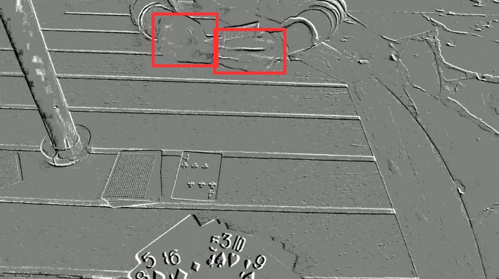
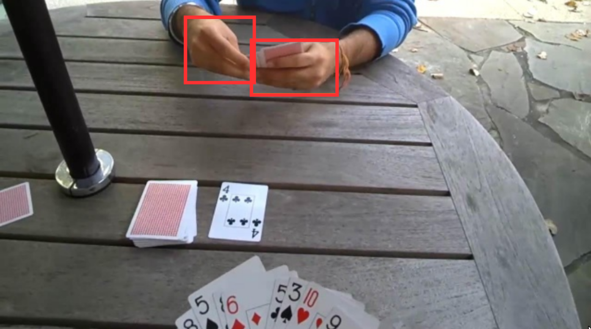
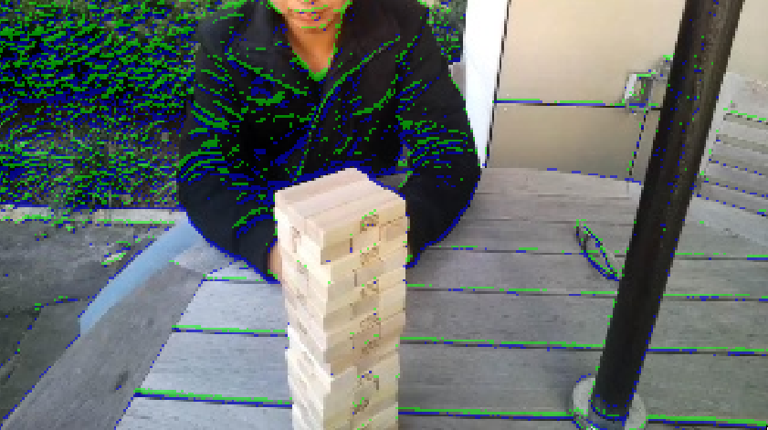
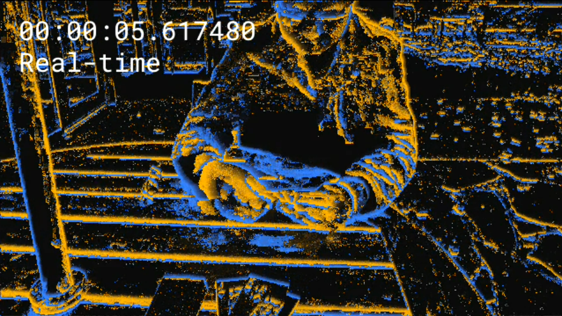

# A Multimodal RGB and Events Dataset for Hand Detection in First-Person View

**论文元信息**

| 项目 | 内容 |
|---|---|
| 标题 | A Multimodal RGB and Events Dataset for Hand Detection in First-person View |
| 作者 | Bharghav Kota, Yulia Sandamirskaya |
| arXiv ID | 2606.10790 |
| 发布时间 | 2026-06-09 |
| 类别 | cs.CV |
| 论文链接 | http://arxiv.org/abs/2606.10790v1 |
| PDF 链接 | https://arxiv.org/pdf/2606.10790v1 |
| 代码状态 | 论文声明 EventEgoHands 数据集与训练代码已开源于 `https://github.com/SynthSyntax/EventEgoHands`，见 PAGE 4；但本文材料未提供可核验源码内容，源码级代码段证据不足。 |

## 摘要

本文提出 **EventEgoHands**，一个面向第一视角手部检测（first-person hand detection）的多模态 RGB 与事件流（event stream）合成数据集。论文的核心问题不是重新设计检测网络，而是补足事件相机用于手部检测时的训练数据缺口：现有事件数据集多集中在自动驾驶或通用目标检测场景，缺少机器人第一视角下动态人手交互数据，见 PAGE 2。

EventEgoHands 从 RGB **EgoHands** 数据集出发，使用 **v2e（Video-to-Events）** 工具将传统视频合成为 DVS 事件流，并通过调节 v2e 参数生成 clean、noisy、mixed 等不同事件版本，见 PAGE 3 和 PAGE 4。论文进一步用微调后的 **YOLOv8** 在 RGB 帧上补全伪标签，再将帧级检测框同步到高时间分辨率事件流中，形成 RGB 帧、事件流和手部边界框标签对齐的数据资源，见 PAGE 1、PAGE 2 和 PAGE 4。

实验上，作者使用 **DAGr** 这类 RGB+事件混合检测方法训练单类 “hand” 检测器。最好的版本为 v6，即 clean 与 noisy 事件混合训练，达到 mAP50 0.931、mAP75 0.817、总体 mAP 0.697，见 PAGE 4。该结果支持一个具体判断：多样化合成事件参数比单一 clean 参数更有利于检测泛化，但论文仍主要基于合成事件，真实事件传感器域差异没有被充分验证，见 PAGE 5。

## 背景与动机

传统 RGB 摄像头输出强度帧（intensity frames），检测频率受相机帧率限制。论文指出，在移动机器人系统中，手部检测任务会受到运动模糊影响，尤其在暗光条件下更明显；事件相机具有高动态范围、高时间分辨率和低功耗特性，因此适合机器人和嵌入式视觉任务，见 PAGE 1。

事件相机（event-based camera）不是以固定帧率输出图像，而是在像素感知到亮度变化时异步发出事件。论文将事件相机的优势概括为稀疏输出、高时间分辨率、微秒级延迟、低运动模糊和低功耗，见 PAGE 1。对于手部检测，这意味着系统理论上可以在 RGB 帧之间继续接收运动信息，而不是等待下一帧到来。

然而，事件相机的优势不能直接转化为检测精度。论文指出，传统预训练卷积网络不能直接处理事件流，因为事件相机不生成常规图像，见 PAGE 1。已有方案通常将事件在固定时间窗口内累积为帧，再送入 CNN，但这种帧化处理会削弱事件相机低延迟的优势，见 PAGE 1。

在更接近事件数据本质的方向上，AEGNN 将事件稀疏、异步地组织为时序演化图（temporally evolving graphs），DAGr 则融合 RGB 帧 CNN 与事件图神经网络，从而在准确率和延迟-带宽权衡之间取得更好结果，见 PAGE 1 和 PAGE 2。本文选择在 DAGr 上验证 EventEgoHands，因此论文重点是数据集构建与多模态检测可行性，而不是提出新的检测网络结构。

本文的动机可以概括为三点。第一，机器人第一视角手部检测需要高频、低延迟感知，RGB 摄像头单独使用存在帧率和运动模糊限制，见 PAGE 1。第二，事件相机适合高动态、高速运动场景，但事件手部检测数据不足，见 PAGE 1 和 PAGE 2。第三，已有汽车事件数据集如 NCARS、DSEC 与机器人第一视角手部交互分布不同，不能直接覆盖人机交互、物体交接和意图识别场景，见 PAGE 2。

## 预备知识

### 事件相机与事件表示

论文采用地址事件表示（Address Event Representation, AER）描述事件流。每个事件写作：

$$
(x, y, t, p)
$$

其中，$x$ 与 $y$ 表示像素坐标，$t$ 表示微秒级时间戳，$p$ 表示事件极性（polarity），用于区分亮度增加或减少，见 PAGE 2。人话解释：一个事件不是一张图，而是“某个像素在某个时刻发生了亮度变化”的记录。

论文进一步给出极性集合：

$$
p = \{0, 1\}
$$

其中 $p=0$ 与 $p=1$ 分别对应二值极性状态，论文表述为亮度增加或降低的指示，见 PAGE 2。这个定义说明事件流携带的是局部变化信号，而不是完整颜色或纹理上下文。

### 图神经网络与事件图

论文在背景部分定义图结构：

$$
G = \{V, E\}
$$

其中 $V$ 是节点或顶点集合，$E$ 是边集合，见 PAGE 2。在事件图（event graph）中，一个事件可以被视为图中的一个节点，边由时空距离阈值 $R$ 连接，见 PAGE 2。人话解释：事件图把“时间上和空间上接近的事件”组织成局部邻域，让模型在稀疏事件之间做消息传递。

论文引用图卷积（Graph Convolution）的标准更新公式：

$$
H^{(l+1)} = \sigma\left(\tilde{D}^{-\frac{1}{2}}\tilde{A}\tilde{D}^{-\frac{1}{2}}H^{(l)}W^{(l)}\right)
$$

其中，$H^{(l)} \in \mathbb{R}^{N \times F_l}$ 是第 $l$ 层节点特征矩阵，$W^{(l)} \in \mathbb{R}^{F_l \times F_{l+1}}$ 是可训练权重矩阵，$\tilde{A}=A+I$ 是加上自环后的邻接矩阵，$\tilde{D}$ 是 $\tilde{A}$ 的对角度矩阵，$\sigma(\cdot)$ 是 ReLU 等激活函数，见 PAGE 2。人话解释：每个节点用邻居节点的信息更新自己，同时通过度归一化避免邻居数量差异带来的尺度偏移。

需要说明的是，全文明确给出的公式证据主要集中在 PAGE 2 的图结构、事件四元组、极性集合和图卷积公式。若按“至少五个独立论文公式”标准衡量，证据不足；本文不额外构造论文未给出的公式。

## 方法详解

### 1. 从 RGB EgoHands 到合成事件数据集

本文的第一项贡献是提出 **EventEgoHands** 数据集生成流程。输入数据来自 RGB EgoHands 数据集，该数据集包含 48 段视频，每段 90 秒、30 fps、2700 帧，帧分辨率为 720×1280，见 PAGE 3。原始 EgoHands 包含四类手部标签：your left、your right、my left、my right，反映拍摄者视角下双方手部的左右关系，见 PAGE 3。

EgoHands 的人工标注并不覆盖所有帧。论文说明，每段视频随机采样 100 帧进行手部人工标注，最终得到 15,053 个手部真值标注，见 PAGE 3。EventEgoHands 的目标是把这种稀疏帧级标注扩展为全数据集边界框，并与事件流同步。

事件生成使用 **v2e** 工具。v2e 接收强度帧，可以选择使用 SuperSloMo 插值中间帧，然后计算每个像素的对数强度变化；当变化超过像素特定阈值时，生成 ON 或 OFF 事件，同时可模拟时间噪声和漏电事件，见 PAGE 3。这一流程使得传统 RGB 视频能够被转换为近似 DVS 输出的合成事件流。

**用途：** 下图用于展示事件累积帧的视觉形态，说明事件流经过 33 ms 累积后可以形成边缘化的运动/亮度变化结构。  
**读图要点：** 重点观察手部轮廓和局部边缘，而不是 RGB 纹理。  
**支撑的判断：** 事件数据保留了对手部运动和边缘变化有用的信息，但语义上下文弱于 RGB 帧，见 PAGE 2。

图 1 支撑了论文采用多模态 RGB+事件而非纯事件处理的必要性：事件帧提供高时间分辨率变化线索，但手部身份、场景和外观上下文仍依赖 RGB 或学习模型补充，见 PAGE 1 和 PAGE 2。

**用途：** 下图展示 EgoHands 中的 RGB 帧，是合成事件和生成伪标签的源数据。  
**读图要点：** 关注手部区域、背景复杂度和第一视角交互场景。  
**支撑的判断：** 原始数据具有第一视角交互属性，但不是事件传感器直接采集数据，见 PAGE 3。

图 2 说明 EventEgoHands 的基础分布来自 RGB EgoHands，而不是真实事件相机采集。因此，它继承了 EgoHands 的第一视角手部交互优势，也继承了从 RGB 合成事件带来的域差异风险。

### 2. 标签扩展：YOLOv8 伪标签与事件同步

本文第二个关键步骤是标签扩展。论文指出，EventEgoHands 将 EgoHands 中原本只覆盖 2.12% 帧的人工标注扩展到整个数据集：作者微调 YOLOv8，并在没有人工标注的 RGB 帧上运行推理，生成手部检测框，见 PAGE 2。

随后，这些帧级检测框被同步到高时间分辨率事件数据上。论文在摘要中说明，ground truth detections 由微调 YOLOv8 在 RGB 图像上生成，并插值到高时间分辨率事件上，见 PAGE 1。结果部分进一步说明，所有手在每个帧时间戳都有边界框标签，总计 129,600 帧、393,561 个 bounding boxes，见 PAGE 4。

这一设计的优点是可以迅速把已有 RGB 手部数据集转化为多模态训练资源。它不要求重新人工标注全部视频，也不要求真实事件相机同步采集。但它的代价同样清楚：标签质量依赖 YOLOv8 伪标签的准确性；如果 YOLOv8 在遮挡、暗光、快速运动或手部边界模糊时出错，错误会进入 EventEgoHands 的训练标签。

### 3. 多版本数据构建：尺度、上采样与事件模型

论文提供多个 EventEgoHands 版本，用于比较不同 v2e 参数、尺度和时间上采样策略对检测性能的影响，见 PAGE 3 和 PAGE 4。

| Version | Upsampling Factor | Scale Factor | Events Model |
|---|---:|---:|---|
| v1 | 1 | 1 | Clean |
| v2 | 1 | 4 | Clean |
| v3 | 1 | 2 | Clean |
| v4 | 41 | 2 | Clean |
| v5 | 41 | 2 | Noisy |
| v6 | 41 | 2 | Mixed |

**表格解读：** 表 I 表明，作者不是只发布一个固定数据集，而是系统改变三个变量：时间上采样、空间尺度和事件噪声模型。v2 与 v3 对比主要考察空间下采样强度；v3 与 v4 对比主要考察生成事件前是否进行高倍时间上采样；v4、v5、v6 对比则考察 clean、noisy 与混合事件条件对检测泛化的影响，见 PAGE 3 和 PAGE 5。

Scale Factor 表示下采样比例。论文说明原始分辨率为 720×1280，scale factor 2 对应 360×640，scale factor 4 对应 180×320，见 PAGE 3。空间下采样可以减少数据体积和训练成本，但过强下采样会损失事件细节，这一点在 v2 的 mAP 下降中得到体现，见 PAGE 5。

Upsampling Factor 与 v2e 的 timestamp resolution 有关，用于把源视频从原 fps 时间上上采样到目标时间分辨率，见 PAGE 3。v4 相比 v3 的主要差异是先将视频源 fps 上采样 41 倍，再合成事件；论文认为更细粒度的时间戳分辨率使生成事件更接近真实 DVS 事件，并带来约 0.02 mAP 增益，见 PAGE 5。

### 4. Clean 与 Noisy：模拟 DVS 非理想性

v2e 的意义在于不仅能从视频生成事件，还能模拟真实 DVS 的非理想性。论文指出，v2e 包括像素级高斯事件阈值不匹配、强度依赖噪声、有限带宽、时间噪声和 leak events，因此比一些事件模拟器更适合建模差光照条件下的像素行为，见 PAGE 2 和 PAGE 3。

| 参数 | Clean | Noisy |
|---|---|---|
| $\theta$ | 0.2 ON, 0.2 OFF | 0.2 ON, 0.2 OFF |
| $\sigma_\theta$ | 0.02 | 0.03 |
| Shot Noise | 5 Hz | 0 Hz |
| Leak Events | 0.1 Hz | 0 Hz |
| Cutoff Freq. | 0 Hz | 30 Hz |

**表格解读：** 表 II 给出了 clean 与 noisy 两组参数。论文文字说明 clean 会关闭噪声、设置无限带宽并减小阈值变化，而 noisy 会设置有限带宽并加入 leak events 和 shot noise，见 PAGE 3 和 PAGE 4。表格中 Shot Noise 与 Leak Events 的数值方向和文字解释之间存在潜在不一致：表中 clean 行给出非零 Shot Noise 与 Leak Events，而正文说 clean turns off noise。本文不替作者修正该矛盾，只将其作为可复现性风险记录。

**用途：** 下图展示事件与 RGB 帧叠加后的空间对齐效果。  
**读图要点：** 观察事件边缘是否落在 RGB 手部和物体边界附近。  
**支撑的判断：** RGB 与事件流同步是本文多模态检测成立的基础，见 PAGE 3 和 PAGE 4。

图 3 支撑了本文的多模态设定：DAGr 这类方法需要同时利用 RGB 帧的上下文和事件流的高频运动信息；如果两者时间或空间不同步，多模态融合的训练信号会被污染，见 PAGE 2 和 PAGE 4。

**用途：** 下图展示 Faery 渲染的 clean events，用于观察 clean 事件模型下的事件外观。  
**读图要点：** 关注事件边缘是否相对清晰、噪声点是否较少。  
**支撑的判断：** clean 事件模型更接近理想传感器输出，通常更利于训练集内检测性能，但未必有最佳泛化能力，见 PAGE 3、PAGE 4 和 PAGE 5。

论文还提到 Figure 5 展示 noisy events，并说明 Figure 4 与 Figure 5 在相同时间戳下生成以比较两种事件模型，见 PAGE 4。但当前提供的 figures 列表没有 Figure 5 的可用 `markdown_path`，因此本文不输出不存在的图片路径。

### 5. 训练设置：DAGr 上的单类手部检测

实验部分使用 **DAGr** 模型在 EventEgoHands 上进行手部检测。论文说明，模型从零开始训练，检测类别为单一类别 “hand”，见 PAGE 4。与原始 EgoHands 的四类左右手标签不同，EventEgoHands 在结果部分声明只提供单类 “hand”，见 PAGE 4。

训练设置为 batch size 16，学习率 $2 \times 10^{-4}$，优化器为 AdamW。每次训练使用一张图像以及其前 33 ms 的事件，和 30 Hz 标签频率对齐，见 PAGE 4。这里的 33 ms 基本对应 30 fps 视频中相邻帧之间的时间间隔，因此模型输入既包含当前帧上下文，又包含前一小段事件动态。

数据划分方面，48 个视频被分为训练、验证和测试集合：30 个视频用于训练，10 个视频用于测试，8 个视频用于验证；所有数据集版本保持相同划分，见 PAGE 4。这个设计使不同版本之间的 mAP 对比主要反映事件生成参数差异，而不是样本划分差异。

## 实验分析

### 1. 数据集规模与同步机制

EventEgoHands 包含 48 个 `.h5` 事件流文件，并与 48 段 RGB 视频序列同步。每段视频 90 秒、30 fps，对应总计 129,600 帧，见 PAGE 4。论文还在事件文件中生成 `timeidx` 键，用于保存每个帧时间戳后立即发生的事件索引，从而加速训练时按时间窗口切片事件，见 PAGE 4。

| 数据项 | 数值或描述 | 证据 |
|---|---:|---|
| RGB 视频数量 | 48 段 | PAGE 3, PAGE 4 |
| 每段视频时长 | 90 秒 | PAGE 3, PAGE 4 |
| 帧率 | 30 fps | PAGE 3, PAGE 4 |
| 每段帧数 | 2700 帧 | PAGE 3 |
| 总帧数 | 129,600 帧 | PAGE 4 |
| 原始人工标注手部数 | 15,053 | PAGE 3 |
| EventEgoHands bounding boxes | 393,561 | PAGE 4 |
| 事件文件格式 | 48 个 `.h5` files | PAGE 4 |
| 同步索引 | `timeidx` key | PAGE 4 |

**表格解读：** 该表显示 EventEgoHands 的主要价值在于把原本稀疏人工标注的 RGB 手部数据扩展为全帧级多模态检测数据。`timeidx` 的设计是工程上重要的细节，因为事件流通常按时间连续存储，若每次训练动态扫描事件时间戳，切片成本会显著增加，见 PAGE 4。

### 2. 主要检测结果

论文使用 COCO 指标评估检测性能，包括 mAP50、mAP75 和总体 mAP。mAP50 表示 IoU 阈值为 0.5 的平均精度，mAP75 表示 IoU 阈值为 0.75 的平均精度，总体 mAP 是 IoU 从 0.50 到 0.95、步长 0.05 的平均值，见 PAGE 4。

| Version | mAP50 | mAP75 | mAP |
|---|---:|---:|---:|
| v1 | 0.912 | 0.687 | 0.645 |
| v2 | 0.923 | 0.712 | 0.616 |
| v3 | 0.932 | 0.763 | 0.655 |
| v4 | 0.932 | 0.786 | 0.674 |
| v5 | 0.891 | 0.584 | 0.532 |
| v6 | 0.931 | 0.817 | 0.697 |

**表格解读：** v6 在总体 mAP 与 mAP75 上最优，说明 clean 与 noisy 事件混合训练比单一 clean 或 noisy 设置更利于精确定位。v5 的 noisy 单独训练性能最低，尤其 mAP75 从 v4 的 0.786 降至 0.584，表明噪声条件会明显削弱高 IoU 精度。v4 相比 v3 总体 mAP 从 0.655 增至 0.674，支持论文关于时间上采样改善事件真实性和检测效果的判断，见 PAGE 4 和 PAGE 5。

需要注意的是，v2 的 mAP50 为 0.923，略高于 v1 的 0.912，但总体 mAP 低于 v1。论文解释 v2 的 scale factor 为 4，下采样过强导致网络无法有效执行 interframe detections，见 PAGE 5。这个现象说明低 IoU 阈值下的粗定位能力不等同于高质量定位；当空间细节被压缩，模型可能仍能找到大致手部区域，但更难得到高 IoU 边界框。

### 3. 消融维度：尺度、时间上采样、噪声混合

尺度消融主要体现在 v1、v2、v3。v2 的 scale factor 为 4，分辨率降至 180×320；v3 的 scale factor 为 2，分辨率为 360×640，见 PAGE 3。论文认为 scale factor 2 在保留足够事件数据和显著压缩数据规模之间取得较好平衡，见 PAGE 5。

时间上采样消融主要体现在 v3 与 v4。二者均为 scale factor 2、clean events，但 v4 的 upsampling factor 为 41。v4 的总体 mAP 为 0.674，相比 v3 的 0.655 提升 0.019，论文将该提升归因于更细粒度时间分辨率使合成事件更接近真实 DVS，见 PAGE 5。

噪声条件消融主要体现在 v4、v5、v6。v4 使用 clean，v5 使用 noisy，v6 使用 mixed。v5 明显低于 v4，说明纯 noisy 合成条件会损害检测性能；v6 又超过 v4，说明将 clean 与 noisy 结合后，模型可能学习到更稳健的事件表征，见 PAGE 5。论文据此认为，扩大合成参数范围有助于减少真实与合成事件数据之间的性能差距，见 PAGE 5。

### 4. 训练动态与过拟合迹象

论文引用 Figure 8 展示 IoU loss 收敛曲线，说明训练期间 loss 持续下降，模型在改善 bounding box prediction，见 PAGE 4。当前提供的 figures 列表没有 Figure 8 的图片路径，因此本文不输出该图。

论文引用 Figure 9 展示 validation mAP 曲线，并指出 mAP 在约 100k training steps 附近达到峰值，之后略有下降，见 PAGE 5。作者将其解释为过拟合迹象：训练 loss 继续下降，但模型对验证集的泛化不再改善，见 PAGE 5。

这个结果对使用者有实际意义。若将 EventEgoHands 用于训练机器人手部检测模型，不能只看训练 loss，应监控验证 mAP，并可能在 100k steps 附近早停。论文没有给出不同 random seed、不同划分或真实事件测试集上的稳定性统计，因此过拟合结论目前主要基于单次训练曲线描述。

## 讨论

EventEgoHands 的适用边界首先由数据来源决定。它适合研究第一视角手部检测、多模态 RGB+事件融合、事件合成参数对检测性能的影响，以及机器人交互中低延迟手部感知的算法验证，见 PAGE 1、PAGE 2 和 PAGE 4。它不应被直接等同于真实事件相机采集数据集，因为事件流由 v2e 从 RGB 视频合成。

从方法论角度看，本文采用“已有 RGB 数据集 + 事件模拟器 + 检测器伪标签”的路线。这条路线具有较高复用价值：只要有足够好的 RGB 视频和标注扩展模型，就可以相对低成本地构建事件版数据集。但这条路线也引入两层误差：事件模拟误差和伪标签误差。前者影响输入分布，后者影响监督信号。

本文没有提出新的检测架构，而是借助 DAGr 验证数据集可用于现有多模态事件检测算法，见 PAGE 4。因此，论文贡献的评价重点应放在数据集构建流程、版本设计和实验对比，而不是网络结构创新。若未来工作能在真实事件相机上复现类似结论，EventEgoHands 的价值会更强。

对业务应用而言，本文的启发是明确的。对于手部/人体局部检测、低照度高速运动感知、多模态标注和机器人第一视角交互，事件相机提供了 RGB 帧之外的时间信息。尤其在物体交接、人手意图识别和移动机器人场景中，高频手部检测可能比单帧高精度更关键，见 PAGE 1 和 PAGE 2。

但部署风险同样显著。真实机器人系统不仅需要数据集和模型，还需要同步 RGB 与事件相机、处理带宽和时钟对齐、维护事件流切片和推理链路。论文报告的是训练和检测实验，没有覆盖完整硬件链路、实时延迟、功耗和真实场景鲁棒性评估。

## 局限分析

第一，作者自述的未来工作直接揭示了数据覆盖不足。论文结论中写到，未来工作包括创建第一视角事件手部数据集，并增加 lighting conditions、skin tones 和 activity variation，见 PAGE 5。这说明当前 EventEgoHands 在光照、肤色和动作类型覆盖上仍有限，不能代表完整真实人机交互分布。

第二，本文的事件数据为合成数据。虽然 v2e 可以模拟多种 DVS 非理想性，论文也通过 clean、noisy、mixed 参数比较讨论了合成参数多样性，见 PAGE 3 至 PAGE 5，但没有提供真实事件相机采集的第一视角手部测试集结果。作者关于“minimize real-synthetic gap”的说法有实验动机，但在当前文本中缺少真实事件测试证据支撑，见 PAGE 5。

第三，伪标签质量是潜在瓶颈。论文使用微调 YOLOv8 在 RGB 帧上补全标签，并生成 393,561 个 bounding boxes，见 PAGE 1、PAGE 2 和 PAGE 4。但全文没有报告 YOLOv8 伪标签相对于人工标注的误差统计，也没有给出伪标签过滤策略、置信度阈值或人工质检比例。若伪标签存在系统性偏差，DAGr 的训练和评估都会受到影响。

第四，论文的开源代码证据存在不足。论文在 PAGE 4 声明数据集和训练代码已开源于 `https://github.com/SynthSyntax/EventEgoHands`。但当前输入材料未包含仓库 README、核心源码文件或配置文件内容，因此本文不写源码级代码段，也不声称已完成论文方法与源码函数的逐行对应。代码分析结论为：公开代码链接存在论文证据，但源码细节证据不足。

第五，实验主要报告不同数据版本在同一测试集上的检测指标，没有给出与纯 RGB、纯事件、AEGNN 或其他 hand detector 的完整对照表。摘要称性能 comparable to the state-of-the-art，见 PAGE 1，但全文材料中没有提供 state-of-the-art 对比数据表。因此，该表述在当前证据下只能作为作者摘要性声明，而不能作为可独立验证的量化结论。

## 结论

本文提出 EventEgoHands，一个由 EgoHands RGB 视频经 v2e 合成事件流、再通过 YOLOv8 扩展标签得到的多模态第一视角手部检测数据集。它的主要贡献在于补足事件相机手部检测训练数据不足，并提供不同尺度、时间上采样和事件噪声模型版本，以研究合成事件参数对检测性能的影响，见 PAGE 1 至 PAGE 4。

实验显示，在 DAGr 上，clean 与 noisy 混合训练的 v6 取得最佳总体 mAP 0.697 和 mAP75 0.817，说明多样化合成事件条件可能增强模型泛化，见 PAGE 4 和 PAGE 5。与此同时，论文仍存在真实事件域验证不足、伪标签质量未量化、光照/肤色/动作覆盖有限、源码细节未在当前材料中可核验等限制。总体而言，EventEgoHands 更适合作为事件手部检测研究的合成基准和方法验证平台，而不是直接替代真实事件相机采集数据集。

## 证据索引

| 关键结论 | PAGE 证据 |
|---|---|
| RGB 手部检测受相机帧率、运动模糊和暗光限制 | PAGE 1 |
| 事件相机具有高动态范围、高时间分辨率、低功耗、低运动模糊优势 | PAGE 1 |
| 事件相机不输出传统图像，不能直接使用传统预训练 CNN | PAGE 1 |
| 帧化事件会削弱低延迟优势 | PAGE 1 |
| AEGNN 以异步事件图处理事件，DAGr 融合 RGB CNN 与事件 GNN | PAGE 1, PAGE 2 |
| 缺少动态第一视角手部事件数据集是本文动机 | PAGE 2 |
| EventEgoHands 派生自 EgoHands | PAGE 2, PAGE 3 |
| EgoHands 有 48 段视频，每段 90 秒、2700 帧、30 fps、720×1280 | PAGE 3 |
| EgoHands 原始人工标注为每段 100 帧，共 15,053 个手部标注 | PAGE 3 |
| 事件表示为 $(x,y,t,p)$，极性 $p=\{0,1\}$ | PAGE 2 |
| 图定义为 $G=\{V,E\}$，事件图以事件为节点并按时空距离连边 | PAGE 2 |
| 图卷积公式 Eq. (1) 与变量解释 | PAGE 2 |
| v2e 的 DVS 非理想性模拟与 SuperSloMo 插值流程 | PAGE 2, PAGE 3 |
| EventEgoHands 六个版本及 upsampling、scale、event model 设置 | PAGE 3 |
| clean/noisy v2e 参数表 | PAGE 3 |
| clean 与 noisy 正文描述及 Figure 4/Figure 5 对比说明 | PAGE 4 |
| 数据集包含 48 个 `.h5` 事件文件并与 48 段 RGB 视频同步 | PAGE 4 |
| `timeidx` 用于加速按帧时间戳切片事件 | PAGE 4 |
| EventEgoHands 提供单类 “hand” 而非 EgoHands 四类左右手 | PAGE 4 |
| 全数据集 129,600 帧、393,561 个 bounding boxes | PAGE 4 |
| 数据集和训练代码声明开源链接 | PAGE 4 |
| DAGr 训练设置：batch size 16、学习率 $2\times10^{-4}$、AdamW、单图像加前 33 ms 事件 | PAGE 4 |
| 训练/测试/验证划分为 30/10/8 个视频 | PAGE 4 |
| COCO mAP50、mAP75、mAP 定义 | PAGE 4 |
| Table III 检测结果，v6 最优 mAP 0.697、mAP75 0.817 | PAGE 4 |
| v2 下采样过强导致 interframe detection 表现较弱 | PAGE 5 |
| v4 相比 v3 的约 0.02 mAP 提升归因于 41 倍上采样 | PAGE 5 |
| v6 混合 clean/noisy 带来约 0.02 mAP 提升，并被解释为改善合成到真实泛化 | PAGE 5 |
| Figure 8 IoU loss 持续下降，Figure 9 validation mAP 约 100k steps 后过拟合 | PAGE 4, PAGE 5 |
| 作者未来工作：更多光照、肤色、活动变化；使用 evGNN 进行边缘实时推理 | PAGE 5 |
