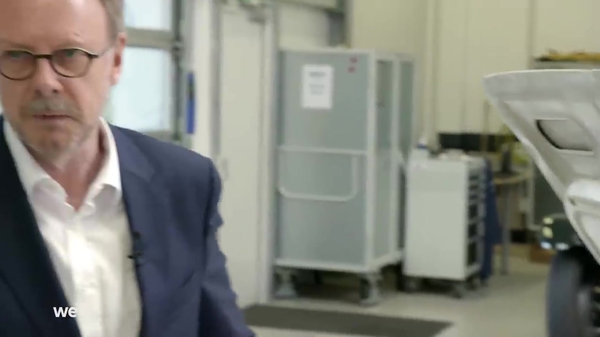
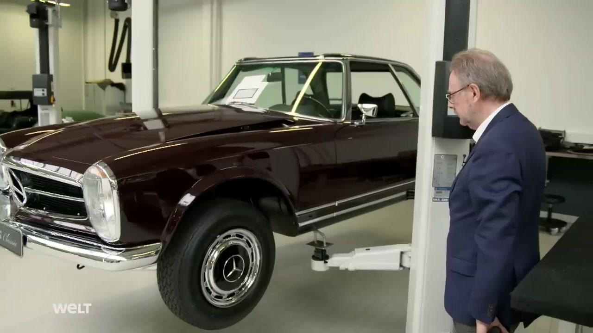
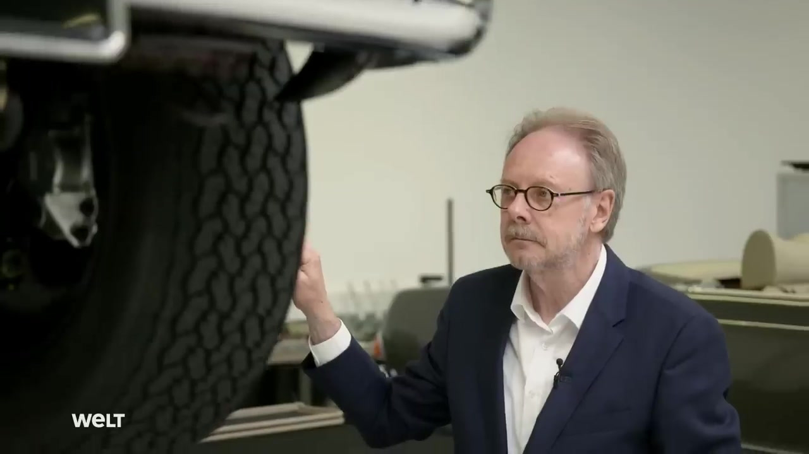

# Q-Fold: Query-Aware Focus-Context Spatio-Temporal Folding for Long Video Understanding

## 摘要

本文解析 arXiv:2606.12125v1《Q-Fold: Query-Aware Focus-Context Spatio-Temporal Folding for Long Video Understanding》。论文由 Biao Tang、Xu Chen、Shuxiang Gou、Jingyi Yuan、Yuhan Zhang、Chenqiang Gao 提出，发布时间为 2026-06-10，研究方向属于长视频理解（Long Video Understanding）与 Video-MLLM 输入构造。论文链接为 http://arxiv.org/abs/2606.12125v1，PDF 链接为 https://arxiv.org/pdf/2606.12125v1。

一句话概括：Q-Fold 是一种无需训练的长视频输入构造框架，它不再把孤立帧作为基本单位，而是在用户查询（query）指导下，把连续时间片段划分为高保真的 Focus Frames 与压缩的 Context Panels，从而在固定视觉预算下同时保留关键证据、局部时间连续性和更广的时间覆盖，见 PAGE 1、PAGE 2、PAGE 3。

代码状态方面，论文摘要明确写道 “Code will be made publicly available.”，但给定全文与元信息中没有提供可确认的公开代码仓库链接。因此，本文未提供可确认的公开代码；下文不编造源码路径、函数或代码段。该判断依据见 PAGE 1。

Q-Fold 的业务价值主要在于“输入构造”而非“底层视频检测或跟踪”。它适合长视频审核、检索式标注、事件片段定位前处理、人工复核提效等场景：在不增加 Video-MLLM 输入预算的前提下，尽可能让模型看到更有用的视觉证据。其风险也相应明确：方法依赖查询质量、依赖外部 Video-MLLM 的理解能力，并且对实时视频感知、目标级定位、轨迹级任务的直接价值有限；这些风险与论文中“query-aware scoring”和“input construction under fixed visual budget”的设定一致，见 PAGE 3、PAGE 5。

## 背景与动机

长视频理解的基本矛盾是：视频越长，帧数越多，Video-MLLM 若穷尽处理所有视觉信息，计算成本和上下文压力会迅速上升；但真正与问题相关的事件往往又稀疏分布在很长的时间跨度中。论文在引言中明确指出，随着视频时长增加，输入帧数量快速增长，带来大量时空冗余和高昂计算成本；与此同时，任务相关事件常常稀疏地分布在长时间范围内，见 PAGE 2。

现有长视频输入构造方法大体可分为三类。第一类是均匀采样（Uniform Sampling），它简单高效，但隐含假设是有效信息在时间上近似均匀分布。对于短暂但关键的事件，这种假设很容易失败。论文 Fig. 1 中的例子显示，均匀采样可能遗漏“检查车辆底盘”这样的关键视觉证据，从而回答错误，见 PAGE 1、PAGE 2。

第二类是查询感知检索（Query-Aware Retrieval）。这类方法根据问题选择相关帧，提升了输入与查询的语义相关性。但论文指出，这类方法常常把输入集中在狭窄时间窗口内，产生冗余帧并限制全局时间覆盖，见 PAGE 2。换言之，它解决了“相关性”问题，却可能牺牲了“覆盖性”。

第三类是复合图像或面板式表示（Composite-image-based representations / Video Panels）。这类方法把多个离散帧打包进一个二维网格，用单张图像承载更长时间范围。其优势是覆盖更广，问题是统一压缩会削弱关键事件所需的细粒度视觉线索。论文明确指出，均匀面板压缩会削弱 fine-grained visual cues，见 PAGE 2、PAGE 3。

Q-Fold 的核心动机来自一个更细的观察：长视频中的内容重要性并不均匀。少数连续片段可能包含决定性证据，大量其他片段只提供过渡或上下文。既然内容重要性不同，输入表示也不应同质化。论文将这一点表述为：长视频输入构造的关键不仅在于选择什么（what to select），也在于如何根据重要性组织内容（how to organize video content according to its importance），见 PAGE 2。

因此，Q-Fold 提出“segment-first”的输入构造思路：以连续时间片段（contiguous temporal segments）而不是孤立帧作为基本单位；在查询指导下进行相关性评估；将高相关片段保留为未压缩的 Focus Frames，将低相关片段折叠为保序的 Context Panels。这个设计目标是在固定视觉预算下，同时保留关键证据、高层上下文和局部时间连续性，见 PAGE 2、PAGE 3。

### 图 1：不同长视频输入构造策略的比较

用途：下图用于说明论文的问题设定，即在有限视觉预算下，不同视觉输入构造策略会带来不同的信息损失。

读图要点：Uniform Sampling 可能错过稀疏关键事件；Query-Aware Retrieval 容易产生时间窗口过窄的冗余输入；Uniform Panels 扩大覆盖但压缩细节；Q-Fold 用 Focus-Context 表示同时保留关键证据与局部时间连贯性，见 PAGE 1。

支撑的判断：这张图支撑 Q-Fold 的方法出发点，即长视频输入构造不能只追求“采样更相关”或“覆盖更广”，而需要对不同重要性的内容采用不同保真度表示。

用途：下图继续展示 Fig. 1 中对比策略的视觉输入组织方式，用于理解“有限预算”下信息丢失的不同形态。

读图要点：重点观察不同策略如何排列输入帧或面板，以及关键视觉证据是否被保留为可辨识的高保真内容，见 PAGE 1。

支撑的判断：该图进一步支持论文对 frame-centric paradigm 的批评：仅以孤立帧为基本单位，难以兼顾时间覆盖、局部连续性与细粒度证据。

用途：下图用于辅助理解 Q-Fold 的 Focus-Context 输入形式，即部分内容保持高保真，部分内容被折叠压缩为上下文。

读图要点：Focus 部分强调查询相关证据；Context 部分强调时序覆盖和背景补充。二者在同一视觉预算内协同工作，见 PAGE 1、PAGE 2。

支撑的判断：该图支撑“异构表示（heterogeneous representation）”这一核心设计，而不是对所有视频内容采用相同采样或相同压缩率。

用途：下图用于展示 Q-Fold 在示例问答中的最终效果，即通过保留关键证据得到正确答案。

读图要点：关注图中 Q-Fold 与其他策略的回答差异，以及论文说明的“preserves visual fidelity and local temporal coherence”，见 PAGE 1。

支撑的判断：该图支撑论文的定性主张：Q-Fold 在有限视觉预算下更可能保留对回答有决定作用的视觉证据。

## 预备知识

Video-MLLM 指面向视频输入的多模态大语言模型（Video Multimodal Large Language Model）。它通常将视频帧经过视觉编码器（vision encoder）转为视觉 token 或图像特征，再与文本查询一起交给大语言模型进行推理。论文在相关工作中提到，Video-LLaMA、Video-LLaVA、VideoChat、Video-ChatGPT 等模型都属于这一方向，见 PAGE 2。

视觉预算（visual budget）是理解本文的关键概念。Q-Fold 并不试图增加模型可以处理的输入数量，而是在固定预算 $B$ 下重新组织输入。论文将一个未压缩 Focus Frame 视为一个 image-equivalent input unit，同时也将一个折叠后的 Context Panel 视为一个单位，因为二者最终都作为单张图像进入视觉编码器，见 PAGE 4。

另一个关键概念是查询感知（query-aware）。在长视频问答中，不同问题需要关注的视频片段不同。例如“谁在柜台附近与我交谈”和“下一次得分后发生什么”可能对应完全不同的视觉证据。Q-Fold 使用预训练视觉-语言模型计算视频帧与查询之间的语义相似度，再在片段层面聚合为相关性分数，见 PAGE 4、PAGE 5。

还需要区分 Focus 与 Context。Focus Frames 是高相关片段中保留的原始帧，不进行折叠压缩，用来保存细粒度视觉证据。Context Panels 是较低相关片段的折叠表示，将多个帧按时间顺序组织到一个二维面板中，用来保留更广的上下文覆盖。二者构成论文所谓的 Focus-Context representation，见 PAGE 3、PAGE 4。

## 方法详解

### 1. 总体框架：从帧中心转向片段中心

Q-Fold 的输入是视频 $\mathcal{V}=\{f_t\}_{t=1}^{T}$ 与用户查询 $q$。其中 $f_t$ 表示第 $t$ 个视频帧，$T$ 表示视频总帧数，$q$ 表示文本问题。输出是一个按时间组织的异构视觉输入序列 $\mathcal{I}$，该序列由 Focus Frames、Mid-Context Panels 和 Low-Context Panels 组成，见 PAGE 3。

论文将整个流程分为三个阶段：Query-Aware Segment Evaluation（QSE，查询感知片段评估）、Focus-Context Representation and Routing（FCR-R，焦点-上下文表示与路由）、Chronology-Preserving Reorganization（CPR，保序重组）。这三个阶段对应 Fig. 2(a)(b)(c)，见 PAGE 3。

QSE 解决“哪些片段与查询相关”的问题。FCR-R 解决“不同重要性的片段应该以什么保真度表示”的问题。CPR 解决“折叠后如何尽量保留局部和全局时间顺序”的问题。相比传统逐帧选择，Q-Fold 的核心变化是把长视频输入构造视为对连续片段的异构组织过程，见 PAGE 3、PAGE 4。

### 2. Query-Aware Segment Evaluation：片段级相关性评分

论文首先将视频划分为 $M$ 个连续且不重叠的片段，每个片段长度为 $L$。如果末尾有剩余帧，则合并进最后一个片段。片段集合定义为：

$$
\mathcal{C}=\{C_1,C_2,\ldots,C_M\}.
$$

其中 $\mathcal{C}$ 表示片段集合，$C_m$ 表示第 $m$ 个连续视频片段。这个公式对应论文 Eq. (1)，见 PAGE 4。人话解释：Q-Fold 不是把整段视频拆成一堆互不相关的帧，而是先切成有局部时间连续性的片段。

随后，Q-Fold 使用预训练视觉-语言模型，例如 LongCLIP ViT-L，分别提取视觉特征与文本特征。设 $E_v$ 为视觉编码器，$E_q$ 为文本编码器，则帧 $f$ 与查询 $q$ 的语义相似度定义为：

$$
s(f,q)=\cos\left(E_v(f),E_q(q)\right).
$$

其中 $s(f,q)$ 表示帧与查询的余弦相似度，$E_v(f)$ 是帧特征，$E_q(q)$ 是查询特征。该公式对应论文 Eq. (2)，见 PAGE 4。人话解释：如果某一帧的视觉语义更接近问题，它的相似度分数就更高。

关键设计在于片段分数的聚合方式。论文指出，只取最大帧响应会过度依赖瞬时峰值，容易受噪声影响；对所有帧平均又会把稀疏关键证据淹没在大量弱相关帧中。因此，Q-Fold 对每个片段内相似度最高的 Top-$K$ 帧求平均：

$$
S_m=\frac{1}{K}\sum_{f\in\mathcal{T}_K(C_m,q)}s(f,q).
$$

其中 $S_m$ 表示第 $m$ 个片段的查询相关性分数，$\mathcal{T}_K(C_m,q)$ 表示片段 $C_m$ 中与查询最相似的 Top-$K$ 帧集合，$K$ 是固定常数。该公式对应论文 Eq. (3)，见 PAGE 4。人话解释：一个片段是否重要，不由单帧偶然高分决定，也不由全部帧平均稀释，而由若干最相关帧共同决定。

这个设计的技术意义是把“稳定性”和“敏感性”折中起来。片段级评分比单帧评分更稳定；Top-$K$ 聚合又比全片段平均更能保留稀疏关键证据。这也是 Q-Fold 相比纯 frame-level retrieval 的首个重要差异，见 PAGE 4。

### 3. Focus-Context Representation：异构保真度表示

在得到片段相关性分数 $\{S_m\}_{m=1}^{M}$ 后，Q-Fold 不再用同一种方式表示所有片段，而是定义三类表示：Focus Frames、Mid-Context Panels、Low-Context Panels，见 PAGE 4。

Focus Frames 对应最高相关片段。它们保留片段中最相关的原始帧，不进行网格折叠，因此保留最高视觉保真度。论文强调，这部分用于识别关键事件所需的 fine-grained visual details，见 PAGE 4。

Mid-Context Panels 对应中等相关片段。它们由片段中 4 个最相关帧组成 $2\times2$ 面板。与 Focus 相比，它牺牲部分单帧分辨率来换取更多上下文覆盖；与 Low-Context 相比，它保留更好的 per-frame recognizability，见 PAGE 4。

Low-Context Panels 对应较低相关片段。它们由片段中 9 个最相关帧组成 $3\times3$ 面板。它的压缩率更高，目标不是识别细粒度证据，而是在有限预算下保留更广的时间背景与过渡信息，见 PAGE 4。

这三类表示共同构成 Q-Fold 的异构输入。论文的关键假设是：关键证据需要高保真，背景上下文可以低保真压缩；长视频理解不需要所有内容都以相同分辨率进入模型，见 PAGE 2、PAGE 4。

### 4. 固定视觉预算下的层级容量分配

Q-Fold 在固定视觉预算 $B$ 下工作。论文将未压缩 Focus Frame 和折叠 Context Panel 都视为一个图像等价输入单位。预算约束写为：

$$
|\mathcal{I}_{focus}|+|\mathcal{I}_{mid}|+|\mathcal{I}_{low}|=B.
$$

其中 $\mathcal{I}_{focus}$ 表示 Focus Frames 集合，$\mathcal{I}_{mid}$ 表示 Mid-Context Panels 集合，$\mathcal{I}_{low}$ 表示 Low-Context Panels 集合，$|\cdot|$ 表示集合大小。该公式对应论文 Eq. (4)，见 PAGE 4。人话解释：无论是原始帧还是折叠面板，只要进入视觉编码器，都要占用一个输入名额，总数不能超过 $B$。

给定分配比例 $(\alpha_{focus},\alpha_{mid},\alpha_{low})$，预算被划分为：

$$
B_{low}=\lfloor\alpha_{low}B\rfloor,\quad
B_{mid}=\lfloor\alpha_{mid}B\rfloor,\quad
B_{focus}=B-B_{mid}-B_{low}.
$$

其中 $\lfloor\cdot\rfloor$ 表示向下取整。该公式对应论文 Eq. (5)，见 PAGE 4。人话解释：Q-Fold 先决定总预算中多少给高保真 Focus，多少给中等压缩，多少给强压缩上下文。

对于 Focus 片段，论文进一步加入最小保留约束 $N_{min}$。Focus 片段数量为：

$$
N_f=\left\lfloor\frac{B_{focus}}{N_{min}}\right\rfloor.
$$

其中 $N_f$ 表示可被选为 Focus 的片段数量，$N_{min}$ 表示每个 Focus 片段至少保留的帧数。该公式对应论文 Eq. (6)，见 PAGE 4。人话解释：如果每个关键片段只保留一帧，关键事件会重新退化成孤立瞬间；因此每个 Focus 片段至少保留若干帧以维持局部连续性。

剩余 Focus 容量被分配给更高相关性的 Focus 片段。第 $i$ 个 Focus 片段保留帧数为：

$$
c_i=
\begin{cases}
N_{min}+1, & i\le B_{res},\\
N_{min}, & i>B_{res},
\end{cases}
\quad i=1,\ldots,N_f.
$$

其中 $c_i$ 表示第 $i$ 个 Focus 片段保留的帧数，$B_{res}=B_{focus}-N_f\cdot N_{min}$ 表示剩余容量。该公式对应论文 Eq. (7)，见 PAGE 5。人话解释：所有 Focus 片段都有最低连续证据保障，剩下的高保真名额优先给最相关的片段。

这一层级容量分配的意义在于：Q-Fold 不只是选择相关片段，也对输入预算进行结构化使用。它让高保真证据占主导，同时保留中低保真上下文，避免“只看关键帧而丢失背景”或“只扩覆盖而丢失细节”两类极端，见 PAGE 5、PAGE 8、PAGE 9。

### 5. Chronology-Preserving Reorganization：保序折叠与全局交错

Context Panel 的问题是：多个帧被压进一张图像后，模型是否还能感知时间顺序？Q-Fold 的做法是采用 Raster-Order Folding，即按时间升序选帧，再按从左到右、从上到下的光栅顺序放入二维面板，见 PAGE 5、PAGE 8。

论文将 Context Panel 构造写为：

$$
P_{ctx}=\bigoplus_{i=1}^{k^2}\psi(f_{t_i}), \quad k\in\{2,3\}.
$$

其中 $P_{ctx}$ 表示上下文面板，$t_i$ 是被选帧的时间戳，$\psi(\cdot)$ 是下采样算子，$\bigoplus$ 表示按光栅顺序进行空间拼接。该公式对应论文 Eq. (8)，见 PAGE 5。人话解释：Q-Fold 把一维时间顺序映射到二维阅读顺序，使压缩面板内部仍保留局部事件推进关系。

最后，Q-Fold 将 Focus Frames、Mid-Context Panels 和 Low-Context Panels 按原始时间顺序统一排序：

$$
\mathcal{I}=\mathrm{Sort}_{temp}(\mathcal{I}_{focus}\cup\mathcal{I}_{mid}\cup\mathcal{I}_{low}).
$$

其中 $\mathrm{Sort}_{temp}$ 表示根据原始时间戳或源片段顺序进行排序。该公式对应论文 Eq. (9)，见 PAGE 5。人话解释：即使输入单元类型不同，最终送入 Video-MLLM 的序列仍尽量恢复全局时间顺序。

这个阶段是 Q-Fold 与普通图像网格方法的重要区别。普通面板可能只是在空间上打包帧，而 Q-Fold 强调局部帧序和全局片段序；这也是其在时间推理类任务上表现更明显的原因之一，见 PAGE 6、PAGE 7、PAGE 8。

## 实验分析

### 实验设置

论文在四个长视频理解基准上评估 Q-Fold：LongVideoBench、MLVU、Video-MME 和 LVBench，见 PAGE 5。LongVideoBench 验证集包含 1,337 个无字幕视频，平均时长 12 分钟，强调长程视觉推理；MLVU 使用 Dev split 的 M-Avg 子集；Video-MME 使用无字幕版本，包含 2,700 个问答对，平均视频时长 17 分钟；LVBench 是极长视频基准，平均视频时长 4,101 秒，见 PAGE 5。

论文将 Q-Fold 应用于三类代表性 Video-MLLM：Qwen2-VL-7B、MiMo-VL-7B、LLaVA-OneVision-1.5-8B。此外，实验还报告了 Qwen2.5-VL-7B 上的结果，见 PAGE 5、PAGE 6。Q-Fold 以 multi-image setting 实现，不修改 Video-MLLM 架构；候选帧以 1 FPS 从原始视频采样；LongCLIP ViT-L 用于计算帧-查询余弦相似度；QSE 中聚合帧数 $K=9$；默认总视觉预算 $B=32$；Focus/Mid/Low 分配比例为 5:2:1；$N_{min}=2$；实验使用 4 张 NVIDIA RTX A6000 48GB GPU，见 PAGE 5。

### 主结果：固定 32 输入预算下的收益

| 模型 | Frames | LongVideoBench (900,3600] | LongVideoBench Avg | MLVU Dev | Video-MME Long | Video-MME Avg | LVBench Avg |
|---|---:|---:|---:|---:|---:|---:|---:|
| Qwen2-VL | 32 | 47.9 | 55.5 | 59.6 | 47.3 | 57.3 | 38.7 |
| Qwen2-VL w/ Q-Fold | 32 | 55.1 (+7.2) | 60.7 (+5.2) | 66.7 (+7.1) | 51.9 (+4.6) | 61.7 (+4.4) | 47.8 (+9.1) |
| Qwen2.5-VL | 32 | 49.6 | 58.5 | 60.0 | 50.8 | 61.5 | 37.3 |
| Qwen2.5-VL w/ Q-Fold | 32 | 56.7 (+7.1) | 63.0 (+4.5) | 65.2 (+5.2) | 52.6 (+1.8) | 62.1 (+0.6) | 45.2 (+7.9) |
| MiMo-VL | 32 | 50.2 | 59.1 | 61.2 | 52.6 | 62.5 | 39.6 |
| MiMo-VL w/ Q-Fold | 32 | 59.6 (+9.4) | 64.1 (+5.0) | 67.9 (+6.7) | 54.3 (+1.7) | 65.6 (+3.1) | 47.3 (+7.7) |
| LLaVA-OneVision-1.5 | 32 | 47.9 | 56.6 | 60.1 | 51.1 | 60.5 | 40.2 |
| LLaVA-OneVision-1.5 w/ Q-Fold | 32 | 55.5 (+7.6) | 60.1 (+3.5) | 64.6 (+4.5) | 52.2 (+1.1) | 61.5 (+1.0) | 46.3 (+6.1) |

表格解读：该表依据论文 Table 1，见 PAGE 6。最重要的现象不是某一个模型单点提升，而是 Q-Fold 在多个 Video-MLLM、多个长视频基准上都带来正收益，且输入预算保持 32 frame-equivalent inputs 不变。提升最显著的是 LVBench：Qwen2-VL 提升 9.1 点，MiMo-VL 提升 7.7 点，LLaVA-OneVision-1.5 提升 6.1 点。这与论文动机一致：视频越长，信息瓶颈越强，Q-Fold 通过异构压缩保留关键证据与广域上下文的价值越明显。

### 细粒度能力：时间推理收益最明显

| 模型 | Temporal Perception | Temporal Reasoning | Action Recognition | Action Reasoning |
|---|---:|---:|---:|---:|
| Qwen2-VL | 61.8 | 35.0 | 55.6 | 55.4 |
| Qwen2-VL w/ Q-Fold | 67.3 (+5.5) | 47.5 (+12.5) | 59.7 (+4.1) | 53.0 (-2.4) |
| MiMo-VL | 70.9 | 38.4 | 63.3 | 53.0 |
| MiMo-VL w/ Q-Fold | 72.7 (+1.8) | 51.4 (+13.0) | 65.8 (+2.5) | 57.9 (+4.9) |
| LLaVA-OneVision-1.5 | 67.3 | 41.8 | 58.1 | 57.9 |
| LLaVA-OneVision-1.5 w/ Q-Fold | 67.3 (+0.0) | 45.2 (+3.4) | 59.1 (+1.0) | 58.6 (+0.7) |

表格解读：该表依据论文 Table 2，见 PAGE 6、PAGE 7。Q-Fold 对 Temporal Reasoning 的提升尤其明显：Qwen2-VL 提升 12.5 点，MiMo-VL 提升 13.0 点。这说明它的主要收益不是简单提升静态识别，而是帮助模型在长时间跨度中保留事件演化线索。也要注意，Qwen2-VL 的 Action Reasoning 下降 2.4 点，说明 Q-Fold 并非对所有短时动作推理都稳定收益；论文也承认某些依赖短时局部线索的任务收益较小或混合，见 PAGE 7。

### 消融一：片段级构造优于帧级构造

| Construction Unit | Overall Acc (%) | LongVideoBench (900,3600] Acc (%) |
|---|---:|---:|
| Frame | 59.5 | 52.7 |
| Segment | 60.7 | 55.1 |

表格解读：该表依据论文 Table 3，见 PAGE 8。Segment 作为构造单位在整体准确率和最长视频分段上都优于 Frame，尤其在 (900,3600] 分段提升 2.4 点。这支持论文的 segment-first 假设：长视频中的相关证据常常分布在短连续时间片段内，而不是孤立单帧。

### 消融二：保序折叠优于随机或 patch 扫描交错

| Method | Unit | Overall Acc (%) | LongVideoBench (900,3600] Acc (%) |
|---|---|---:|---:|
| Patch-Scan Interleaving | Patch | 59.5 | 52.7 |
| Random Folding | Image | 59.9 | 53.9 |
| Raster-Order Folding | Image | 60.7 | 55.1 |

表格解读：该表依据论文 Table 4，见 PAGE 8。Raster-Order Folding 效果最好，说明将时间顺序映射为二维面板中的标准阅读顺序是有效的。Random Folding 会打乱帧顺序，Patch-Scan Interleaving 则破坏帧内空间语义一致性；二者都弱于按帧时间顺序折叠的方案。这一结果直接支撑 CPR 阶段的必要性。

### 消融三：Focus、Mid-Context、Low-Context 的互补性

| Focus | Mid-Context | Low-Context | Overall Acc (%) | LongVideoBench (900,3600] Acc (%) |
|---|---|---|---:|---:|
| ✓ |  |  | 60.0 | 53.4 |
|  | ✓ |  | 59.1 | 52.1 |
|  |  | ✓ | 57.1 | 49.5 |
| ✓ | ✓ |  | 60.1 | 53.4 |
| ✓ |  | ✓ | 59.5 | 53.4 |
| ✓ | ✓ | ✓ | 60.7 | 55.1 |

表格解读：该表依据论文 Table 5，见 PAGE 8。单独使用 Focus 不是最优，因为它保留关键细节但缺少足够上下文；单独使用 Low-Context 更弱，因为强压缩损失细粒度证据；完整 Focus+Mid+Low 组合最好，说明三类表示分别承担关键证据、局部过渡和广域背景覆盖的功能。

### 消融四：容量分配需要偏向 Focus，但不能只有 Focus

| Allocation Strategy | Ratio (F/M/L) | Overall Acc (%) | LongVideoBench (900,3600] Acc (%) |
|---|---|---:|---:|
| Focus Only | 32 / 0 / 0 | 60.0 | 53.4 |
| Uniform Allocation | 11 / 11 / 10 | 60.4 | 54.1 |
| Balanced Allocation | 16 / 8 / 8 | 59.6 | 52.5 |
| Proposed Allocation | 20 / 8 / 4 | 60.7 | 55.1 |

表格解读：该表依据论文 Table 6，见 PAGE 8、PAGE 9。最优比例是 Proposed Allocation，即 Focus 占主导，同时保留 Mid 与 Low 上下文。Uniform Allocation 略低，Balanced Allocation 反而更差，说明长视频理解在该设定下仍需要足够高保真关键证据；但 Focus Only 也不是最优，说明纯关键帧选择会损失背景与事件演化信息。

### 消融五：$N_{min}$ 与片段长度 $L$ 的折中

| $N_{min}$ | Overall Acc (%) | LongVideoBench (900,3600] Acc (%) |
|---:|---:|---:|
| 1 | 59.8 | 52.8 |
| 2 | 60.7 | 55.1 |
| 3 | 59.8 | 52.3 |

表格解读：该表依据论文 Table 7，见 PAGE 9。$N_{min}=2$ 最优。若每个 Focus 片段只保留 1 帧，局部连续性不足；若保留 3 帧，在固定预算下会减少覆盖范围。该结果支持论文对“最小连续证据”的设计，但也说明该超参数存在任务与预算依赖。

| Segment Length $L$ | Overall Acc (%) | LongVideoBench (900,3600] Acc (%) |
|---:|---:|---:|
| 9 | 59.6 | 52.3 |
| 16 | 60.7 | 55.1 |
| 24 | 60.0 | 53.4 |

表格解读：该表依据论文 Table 8，见 PAGE 9。$L=16$ 最优。片段太短会破坏局部上下文，片段太长会降低路由精度。这进一步说明 Q-Fold 的片段级建模不是越细越好，也不是越粗越好，而需要在局部连续性与相关性定位之间取得平衡。

### 定性结果与能力分析

论文 Fig. 3 展示了 Video-MME 与 MLVU 上的定性例子，包括熊猫拿蓝桶后做什么、几个人在看电视、海边晚餐厨师准备什么、柜台附近与谁交谈、卡通松鼠离开房子后做什么等问题。Q-Fold 帮助不同 Video-MLLM 捕获问题相关视觉证据并给出更准确答案，见 PAGE 7。

论文 Fig. 4 给出 MLVU 上 Qwen2-VL 的细粒度能力雷达图。Q-Fold 在 Ego、Order、Needle 等维度上有明显提升，其中 Ego 提升 17.4 点，Order 提升 8.9 点，见 PAGE 7。该结果与 Table 2 的 Temporal Reasoning 提升一致，共同表明 Q-Fold 的主要收益集中在长程上下文理解和时序推理。

论文 Fig. 5 比较了 Raster-Order Folding、Random Folding 和 Patch-Scan Interleaving 三种折叠策略，见 PAGE 8。结合 Table 4 可知，保留 frame-level chronology 的折叠方式最好。这是 Q-Fold 方法论中较有说服力的实验闭环：方法提出保序折叠，定性图说明折叠差异，消融表验证性能差异。

## 讨论

Q-Fold 的主要贡献不是提出新的 Video-MLLM 架构，而是提出一种训练自由（training-free）、可插拔（plug-and-play）的输入构造框架。它可以作用于 Qwen2-VL、MiMo-VL、LLaVA-OneVision-1.5 等不同模型，且不修改模型结构，见 PAGE 2、PAGE 5、PAGE 6。对于已有业务系统而言，这类方法的部署门槛通常低于重新训练或微调大型 Video-MLLM。

从方法论看，Q-Fold 的价值在于把长视频输入构造从“帧选择”扩展为“异构组织”。传统策略往往问：哪些帧该被送入模型？Q-Fold 进一步问：哪些片段需要高保真？哪些片段可以折叠为上下文？折叠后如何保留时间顺序？这种问题重构是论文的核心创新，见 PAGE 2、PAGE 3、PAGE 4。

从适用边界看，Q-Fold 更适合存在长时间跨度、稀疏关键事件和有限输入预算的任务。论文在 LVBench、Video-MME 和 LongVideoBench 长视频分段上的结果支持这一点，见 PAGE 6、PAGE 8、PAGE 9。如果视频很短、事件密集、关键证据几乎处处存在，那么 Q-Fold 的异构压缩优势可能减弱，甚至引入不必要的预处理复杂度。

对于业务迁移，Q-Fold 可作为长视频审核、事件检索式标注、视频摘要前处理、人工复核候选片段筛选的输入构造模块。它不直接输出目标框、轨迹或精确时间边界，而是帮助 Video-MLLM 在有限视觉输入中获得更有效的证据。因此，它适合作为上游压缩与组织层，不应被误解为目标检测、跟踪或实时行为识别算法。

## 局限分析

第一，论文作者在结论中明确指出，未来值得发展更适合异构时空输入的编码机制，并探索输入构造与视觉建模之间更紧密的集成，见 PAGE 9。这实际上承认了当前 Q-Fold 虽然能把异构 Focus-Context 输入送入现有 Video-MLLM，但现有视觉编码器未必天然最适合理解这种混合了原始帧与折叠面板的输入形式。

第二，Q-Fold 的查询感知评分依赖预训练视觉-语言模型，例如 LongCLIP ViT-L，见 PAGE 5。如果查询表达含糊、视觉-文本相似度模型无法捕获关键语义，或者关键事件需要复杂因果推理而非表层语义匹配，那么片段评分可能偏离真正证据。这一点不是论文实验直接量化的失败模式，但由其 QSE 机制可以推出，是实际部署时必须关注的风险。

第三，Q-Fold 是训练自由输入构造方法，不修改下游 Video-MLLM 架构，见 PAGE 2、PAGE 5。这带来可插拔优势，但也限制了端到端优化能力。模型并未专门学习如何解释 Focus Frames 与 Context Panels 的异构组合，尤其是 $2\times2$ 或 $3\times3$ 面板中的时间映射关系。这与作者关于未来编码机制的展望一致，见 PAGE 9。

第四，论文主要报告问答类长视频理解基准上的准确率提升，见 PAGE 5、PAGE 6。对于实时视频感知、目标级定位、轨迹级推理、精确时间戳定位等任务，证据不足，不能直接推断 Q-Fold 会带来同等收益。尤其是 Context Panel 会下采样并折叠多个帧，可能不适合需要像素级或目标级精确性的任务。

第五，公开代码状态仍不完整。论文摘要称代码将公开，但给定材料中没有可确认的仓库链接，见 PAGE 1。因此，本文无法核验实现细节、工程默认参数、数据预处理脚本、评测复现命令，也无法提供论文方法与源码的逐行对应分析。代码层面的证据不足。

## 结论

Q-Fold 提出了一种针对长视频理解的训练自由输入构造框架。它的关键不是增加视觉预算，也不是训练新的 Video-MLLM，而是在固定预算下重新组织视频内容：以连续片段为基本单位进行查询感知评分，将高相关片段保留为高保真 Focus Frames，将较低相关片段折叠为保序 Context Panels，并最终按全局时间顺序交错输入。该方法对应 QSE、FCR-R、CPR 三个阶段，见 PAGE 3 至 PAGE 5。

实验结果表明，Q-Fold 在 LongVideoBench、MLVU、Video-MME、LVBench 上对多个 Video-MLLM 均有稳定提升，尤其在极长视频 LVBench 和时间推理相关任务上收益明显，见 PAGE 6、PAGE 7。消融实验进一步支持 segment-first 构造、Raster-Order Folding、Focus/Mid/Low 异构组合、Proposed Allocation、$N_{min}=2$、$L=16$ 等关键设计，见 PAGE 8、PAGE 9。

总体而言，Q-Fold 的学术价值在于把长视频输入构造问题从“选择哪些帧”推进到“如何按重要性异构组织连续片段”。它对工程落地也具有现实意义：在不改变下游 Video-MLLM 的情况下，为长视频审核、检索式标注、事件片段定位前处理提供更有效的输入压缩方式。但其能力边界同样清楚：它依赖查询质量与外部视觉-语言相似度模型，不是目标级定位或轨迹级理解方法，且公开代码与异构视觉编码机制仍有待补足。

## 证据索引

| 证据点 | PAGE |
|---|---|
| 论文标题、作者、摘要、代码将公开声明 | PAGE 1 |
| Fig. 1：Uniform Sampling、Query-Aware Retrieval、Uniform Panels、Q-Fold 对比 | PAGE 1 |
| 长视频理解的计算成本、冗余、稀疏关键事件问题 | PAGE 2 |
| 现有方法局限：均匀采样、查询检索、复合图像表示 | PAGE 2、PAGE 3 |
| Q-Fold 的三项贡献与 training-free、plug-and-play 设定 | PAGE 2、PAGE 3 |
| Fig. 2：QSE、FCR-R、CPR 总体框架 | PAGE 3 |
| Eq. (1)-(3)：片段集合、帧-查询相似度、Top-K 片段分数 | PAGE 4 |
| Eq. (4)-(7)：固定预算、层级预算划分、Focus 片段数、残余容量分配 | PAGE 4、PAGE 5 |
| Eq. (8)-(9)：Raster-Order Folding 与全局时间排序 | PAGE 5 |
| 实验数据集、模型、预算、LongCLIP、$K=9$、$B=32$、5:2:1、$N_{min}=2$ | PAGE 5 |
| Table 1：四个长视频基准主结果 | PAGE 6 |
| Table 2：Video-MME 细粒度能力结果 | PAGE 6、PAGE 7 |
| Fig. 3：Video-MME 与 MLVU 定性案例 | PAGE 7 |
| Fig. 4：MLVU 细粒度能力雷达图，Ego 与 Order 提升 | PAGE 7 |
| Table 3：Segment-level 优于 Frame-level | PAGE 8 |
| Fig. 5 与 Table 4：Raster-Order Folding 优于 Random Folding 与 Patch-Scan Interleaving | PAGE 8 |
| Table 5：Focus、Mid-Context、Low-Context 组合消融 | PAGE 8 |
| Table 6：容量分配策略消融 | PAGE 8、PAGE 9 |
| Table 7：$N_{min}$ 消融 | PAGE 9 |
| Table 8：片段长度 $L$ 消融 | PAGE 9 |
| 结论与未来工作：更适合异构时空输入的编码机制、更紧密输入构造与视觉建模集成 | PAGE 9 |
