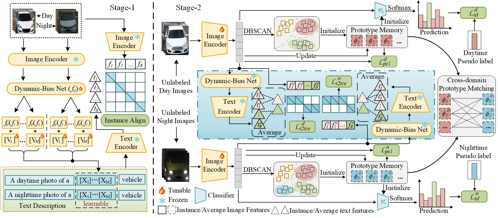
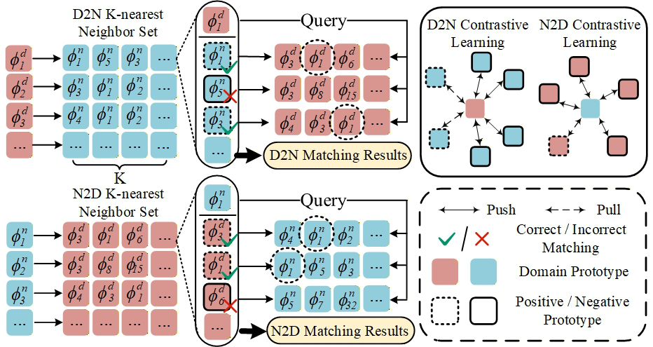

# Bridging Day and Night: Unsupervised Cross-Domain Re-Identification with Synergistic Prompt and Prototype Learning

## 摘要

**论文元信息。** 本文发表于 arXiv，编号为 **2606.12258v1**，作者为 **Jiyang Xu, Rui Liu, Hang Dai**，题目为 *Bridging Day and Night: Unsupervised Cross-Domain Re-Identification with Synergistic Prompt and Prototype Learning*。论文链接为 <http://arxiv.org/abs/2606.12258v1>，PDF 链接为 <https://arxiv.org/pdf/2606.12258v1>。论文首页给出 GitHub 地址 `https://github.com/jyxucs/USL-DN-ReID`，但当前材料未包含仓库 README、源码文件或可确认的代码检索结果；因此本文只标注代码线索，不进行源码级代码段分析，代码实现证据不足（见 PAGE 1）。

**一句话总结。** 本文针对无监督昼夜车辆重识别（Unsupervised Day–Night Vehicle Re-Identification, USL-DN-ReID），提出一种两阶段框架：先用实例感知提示学习（Instance-aware Prompt Learning, IPL）建立图像与文本语义对齐，再用域内身份关联（Intra-domain Identity Association, IIA）和跨域原型匹配学习（Cross-domain Prototype Matching Learning, CPML）在无人工身份标签条件下建立昼夜身份对应关系（见 PAGE 1、PAGE 2、PAGE 3）。

该工作的核心价值在于把昼夜 ReID 的主要困难从“单纯做特征对齐”重新表述为“同时解决无标签语义监督、域内伪标签可分性和跨域原型对应关系”。论文明确指出，昼夜差异并不等同于可见光-红外 ReID 中的光谱差异；夜间图像还受到强光干扰、低照度噪声和复杂环境照明影响，因此直接迁移 USL-VI-ReID 方法并不充分（见 PAGE 2）。

从实验结果看，本文方法在 DN-348 与 DN-Wild 两个昼夜车辆 ReID 数据集上均优于多种无监督可见光-红外 ReID 基线。在 DN-348 上，本文方法达到 Day-to-Night Rank-1 = 0.707、Night-to-Day Rank-1 = 0.796；在 DN-Wild 上达到 Day-to-Night Rank-1 = 0.499、Night-to-Day Rank-1 = 0.476（见 PAGE 6）。这些结果支持论文的主要判断：在无监督设置下，提示学习提供语义约束，原型匹配提供跨域身份结构约束，二者具有互补性。

## 背景与动机

昼夜车辆重识别（Day–Night Vehicle Re-Identification, DN-ReID）关注的是在白天与夜间摄像头图像之间检索同一车辆身份。论文将其定位为智能监控系统中的关键组成部分，并指出该任务近年来受到关注，但仍受制于显著的昼夜域偏移（domain shift）与视角变化（viewpoint variation）（见 PAGE 1）。这里的“域”主要指白天图像域与夜间图像域；同一车辆在两个域中可能呈现完全不同的亮度、颜色、反光和局部可见结构。

已有全监督方法（Fully Supervised Learning, FSL）能够建立较强性能基准，但依赖大量人工身份标注。论文明确指出，全监督 DN-ReID 的人工标注成本限制了可扩展性与实际部署能力，因此有必要研究无监督学习范式下的 DN-ReID（见 PAGE 1）。这也是本文的问题设定：不使用人工身份标签，在白天与夜间图像之间建立车辆身份关联。

无监督 DN-ReID 比普通监督 DN-ReID 更困难。论文总结了三个主要难点：第一，缺少可靠监督信号；第二，昼夜图像之间存在显著域差异，导致特征分布偏移；第三，跨域身份关联本身复杂，即使同一车辆在白天和夜间出现，其可见属性也可能发生很大变化（见 PAGE 1）。这些困难意味着单靠聚类伪标签或单靠图像特征对齐都可能不稳定。

视觉-语言模型（Vision–Language Model, VLM），尤其是 CLIP，为该问题提供了一个可能入口。CLIP 能将图像和文本投影到共享语义空间，已有 CLIP-ReID 等方法通过文本提示（prompt）为每个身份生成结构化文本描述，例如 “A photo of a [V1][V2]...[VM] vehicle”（见 PAGE 1）。但是论文指出，这类方法通常需要真实身份标签来构造或优化身份级 prompt；在无监督设置下，身份标签不可用，而且伪标签会随训练动态变化，静态 prompt 难以适应这种变化（见 PAGE 1、PAGE 3）。

另一个相关方向是无监督可见光-红外重识别（Unsupervised Visible–Infrared ReID, USL-VI-ReID）。这些方法通常使用聚类伪标签与跨模态对比学习，并将模态差异主要归因于光谱差异（见 PAGE 1、PAGE 2）。但论文认为，昼夜 ReID 的域差异更复杂：夜间图像受强光、低照度噪声和环境照明影响，域偏移更严重且更异质（见 PAGE 2）。因此，本文没有简单沿用 VI-ReID 的实例级或共享原型对齐思路，而是强调跨域原型之间的关系建模。

本文的动机可以概括为三点：第一，用视觉-语言模型补充无标签场景下缺失的语义监督；第二，用动态实例感知 prompt 克服静态 prompt 难以适应伪标签演化的问题；第三，用跨域原型匹配而不是直接实例匹配来建立更稳健的昼夜身份对应关系（见 PAGE 2、PAGE 3、PAGE 5）。

## 预备知识

**重识别（Re-Identification, ReID）** 的目标是在图库中检索与查询样本具有同一身份的目标。本文聚焦车辆 ReID，而非行人 ReID；论文 Introduction 明确使用 “day–night vehicle re-identification” 与 “vehicle images” 等表述（见 PAGE 1、PAGE 3）。在 Day-to-Night 设置下，白天图像作为 query，夜间图像作为 gallery；在 Night-to-Day 设置下则相反（见 PAGE 6）。

**无监督伪标签学习（pseudo-label learning）** 是本文 Stage-2 的基础。由于没有真实身份标签，模型需要对图像特征做聚类，并将聚类结果作为伪标签。论文采用 DBSCAN 生成白天域和夜间域各自的动态伪标签，并在每个 epoch 根据最新特征更新伪标签（见 PAGE 4、PAGE 6）。这意味着模型训练并不是固定监督信号下的分类问题，而是“特征更新—聚类更新—原型更新”循环推进的问题。

**原型（prototype）** 指一个聚类或伪身份的中心表示。若某个白天伪标签对应一组图像特征，则该组特征的均值可作为该伪身份的白天原型。本文进一步维护白天与夜间两个域专属原型记忆库（domain-specific prototype memory banks），并在跨域层面计算原型之间的相似度，用互为近邻关系判断正负原型对（见 PAGE 4、PAGE 5）。

**提示学习（prompt learning）** 在本文中不是自然语言生成任务，而是用可学习向量补全文本模板，使文本编码器产生对 ReID 有用的语义表征。本文使用的模板形式为 “A daytime/nighttime photo of a [V1][V2]...[VM] vehicle”，其中 $V_m$ 表示第 $m$ 个可学习 prompt 向量，$M$ 表示 prompt 向量数量（见 PAGE 3、PAGE 4）。

## 方法详解

### 总体框架

用途：展示两阶段框架如何把 VLM 语义对齐、域内原型学习和跨域原型匹配组合起来。

读图要点：Figure 1 显示 Stage-1 冻结图像编码器与文本编码器，通过动态偏置适配 learnable prompts；Stage-2 激活图像编码器，并引入 IIA 与 CPML 两个模块。

支撑的判断：本文方法不是单一损失函数改进，而是一个渐进式两阶段训练框架；Stage-1 解决无标签图文语义初始化，Stage-2 解决伪标签原型判别与跨域身份对应（见 PAGE 3）。

论文将输入无标签昼夜图像集记为：

$$
I = \{ \{I_i^d\}_{i=1}^{N_d} \cup \{I_i^n\}_{i=1}^{N_n} \}
$$

其中，$I_i^d$ 表示第 $i$ 张白天图像，$I_i^n$ 表示第 $i$ 张夜间图像，$N_d$ 与 $N_n$ 分别表示白天与夜间无标签图像数量（见 PAGE 3）。这个定义说明本文的训练输入只有域信息与图像本身，并没有人工身份标签。

Stage-1 使用冻结的 CLIP 图像编码器和文本编码器进行实例级图文对齐。论文强调，Stage-1 的目标不是训练最终 ReID 特征，而是建立初始语义对齐，使每张无标签昼夜图像都能对应一个实例相关文本 prompt（见 PAGE 3、PAGE 4）。Stage-2 则激活图像编码器，使用 DBSCAN 伪标签、原型记忆库、域内身份关联和跨域原型匹配来优化 ReID 表征（见 PAGE 3、PAGE 4、PAGE 5）。

### 创新一：实例感知提示学习

已有 CLIP-ReID 类方法往往依赖身份标签构造身份级文本描述；无监督设置下无法直接知道哪些图像属于同一身份。本文首先指出两个问题：其一，没有身份标注时，Stage-1 无法给不同实例分配判别性文本描述；其二，全局 prompt 向量不足以捕获同一身份簇内部的细粒度实例线索（见 PAGE 3）。

为解决该问题，本文提出实例感知 prompt 适配。对于每个实例，先用冻结视觉编码器提取静态视觉特征 $f_i$，再通过动态偏置网络（Dynamic-bias Net）$f_\theta(\cdot)$ 将视觉特征投影到 prompt 语义空间，得到实例特定偏置。论文给出的公式为：

$$
X_m(f_i) = V_m + f_\theta(f_i), \quad m \in [1, M].
$$

其中，$X_m(f_i)$ 表示第 $i$ 个实例对应的第 $m$ 个动态 prompt 表示，$V_m$ 是第 $m$ 个可学习 prompt 向量，$f_\theta(f_i)$ 是由实例视觉特征生成的动态偏置项（见 PAGE 4）。人话解释：每张图像并不共用完全相同的文本 prompt，而是在共享可学习 prompt 上加一个由图像自身决定的偏移量，使文本描述随实例变化。

随后，文本编码器将动态 prompt 编码为文本特征 $t_i$。视觉特征 $f_i$ 与文本特征 $t_i$ 在共享语义空间内进行双向对比学习。图像到文本损失为：

$$
L_{i2t} =
-\log
\frac{
\exp(S(f_i,t_i)/\tau)
}{
\sum_{j=1}^{B} \exp(S(f_i,t_j)/\tau)
}.
$$

文本到图像损失为：

$$
L_{t2i} =
-\log
\frac{
\exp(S(t_i,f_i)/\tau)
}{
\sum_{j=1}^{B} \exp(S(t_i,f_j)/\tau)
}.
$$

其中，$S(\cdot,\cdot)$ 是相似度函数，$B$ 是 batch size，$\tau$ 是温度超参数（见 PAGE 4）。人话解释：对于一张图像，它自己的文本 prompt 应该比 batch 中其他图像的文本 prompt 更相似；反向也一样，文本 prompt 应该最接近对应图像。

这一设计的关键差异在于，prompt 不再只是一组静态全局向量，而是由实例视觉特征调制。论文在消融实验中验证了这一点：去掉 Stage-1 或去掉 Dynamic-bias Net 都会降低 DN-348 上的 Rank-1 与 mAP（见 PAGE 7）。因此，IPL 的主要作用不是直接完成跨域匹配，而是为无监督训练提供更可靠的实例级语义初始化。

### 创新二：域内身份关联与原型记忆库

Stage-2 中，模型对昼夜图像分别进行 DBSCAN 聚类，得到动态伪标签 $\{y^d, y^n\}$。这里 $y_i^d$ 表示第 $i$ 张白天图像的伪标签，$y_i^n$ 表示第 $i$ 张夜间图像的伪标签（见 PAGE 4）。由于伪标签每个 epoch 更新，原型也需要随训练平滑演化。

论文将每个聚类的均值特征作为原型。公式为：

$$
\phi^d_{y_i^d}
=
\frac{1}{|C^d_{y_i^d}|}
\sum_{f_i^d \in C^d_{y_i^d}} f_i^d,
\quad
\phi^n_{y_i^n}
=
\frac{1}{|C^n_{y_i^n}|}
\sum_{f_i^n \in C^n_{y_i^n}} f_i^n.
$$

其中，$\phi^d_{y_i^d}$ 和 $\phi^n_{y_i^n}$ 分别是白天与夜间伪身份原型，$C^d_{y_i^d}$ 和 $C^n_{y_i^n}$ 是属于对应伪标签的样本集合，$|\cdot|$ 表示集合大小（见 PAGE 4）。人话解释：一个伪身份类中所有样本的平均特征，被当作该伪身份的代表。

为了避免原型随单次 batch 或单次聚类结果剧烈波动，本文采用动量更新：

$$
\phi^{\nabla,\delta}_{y_i^\nabla}
\leftarrow
\alpha \phi^{\nabla,\delta-1}_{y_i^\nabla}
+
(1-\alpha) f_i^\nabla,
\quad
\nabla \in \{d,n\}.
$$

其中，$\nabla$ 表示域，取白天 $d$ 或夜间 $n$；$\delta$ 表示当前训练迭代；$\alpha \in [0,1)$ 是动量系数（见 PAGE 4）。人话解释：新原型不是完全替换旧原型，而是在旧原型基础上吸收新样本特征，从而降低伪标签噪声导致的不稳定。

域内身份关联使用原型对比损失：

$$
L_{pcl}
=
-\sum_{\nabla \in \{d,n\}}
\log
\frac{
\exp(S(f_i^\nabla,\phi_+^\nabla)/\tau)
}{
\sum_{c=1}^{C^\nabla}
\exp(S(f_i^\nabla,\phi_c^\nabla)/\tau)
}.
$$

其中，$\phi_+^\nabla$ 是查询样本对应伪标签的正原型，$C^\nabla$ 是域 $\nabla$ 中的原型总数（见 PAGE 4）。人话解释：每个样本要靠近自己伪类别的原型，同时远离同域内其他伪类别原型。

此外，论文还为白天与夜间域分别设置分类器 $\psi^d$ 和 $\psi^n$，并使用伪标签监督分类。白天域损失为：

$$
L_{id}^d
=
\frac{1}{N_d}
\sum_{i=1}^{N_d}
H(\mathrm{softmax}(\psi^d(f_i^d)), y_i^d).
$$

夜间域损失为：

$$
L_{id}^n
=
\frac{1}{N_n}
\sum_{i=1}^{N_n}
H(\mathrm{softmax}(\psi^n(f_i^n)), y_i^n).
$$

其中，$H(\cdot)$ 表示交叉熵损失，$\psi^d$ 与 $\psi^n$ 是域专属分类器（见 PAGE 4）。人话解释：模型不仅通过对比学习靠近原型，也通过伪标签分类增强域内身份可分性。

### 创新三：跨域原型匹配学习

用途：展示 CPML 如何在白天原型与夜间原型之间构造正负匹配关系。

读图要点：Figure 2 描述了跨域原型匹配流程：先构造白天和夜间原型集合，再计算跨域相似度，基于 top-k 近邻与双向匹配确定正原型对和困难负原型对。

支撑的判断：本文没有直接做实例到实例的跨域监督，而是以原型为单位建立昼夜身份对应关系，这更适合无监督且噪声较强的场景（见 PAGE 5）。

IIA 只增强各自域内的身份可分性，不能显式建立白天与夜间之间的对应。CPML 的目标就是补上这一部分。论文先构造白天原型集合 $\phi^d = \{\phi_1^d,\ldots,\phi_{C_d}^d\}$ 与夜间原型集合 $\phi^n = \{\phi_1^n,\ldots,\phi_{C_n}^n\}$，然后计算大小为 $C_d \times C_n$ 的跨域原型相似度矩阵（见 PAGE 5）。

对于每个白天原型，选取最相似的 top-k 夜间原型作为近邻集合：

$$
R(\phi_i^d)
=
\mathrm{Top}\text{-}k
\left(
S(\phi_i^d, \{\phi_j^n\}_{j=1}^{C_n})
\right).
$$

对于每个夜间原型，也选取 top-k 白天原型作为近邻集合：

$$
R(\phi_j^n)
=
\mathrm{Top}\text{-}k
\left(
S(\phi_j^n, \{\phi_i^d\}_{i=1}^{C_d})
\right).
$$

其中，$R(\cdot)$ 表示跨域 top-k 近邻集合（见 PAGE 5）。人话解释：先分别从白天看夜间、从夜间看白天，找出最相似的一组候选原型。

接着，论文使用互为近邻判断正负关系。若夜间原型 $\phi_j^n \in R(\phi_i^d)$，且白天原型 $\phi_i^d \in R(\phi_j^n)$，则两者构成正原型对；否则，候选近邻被视为困难负样本。论文形式化为：

$$
\langle \phi_i^d, \{\phi_j^n\}_{j=1}^{k} \rangle
=
\begin{cases}
P(\phi_i^d)=\{\phi_j^n \mid \phi_i^d \in R(\phi_j^n)\}, \\
N(\phi_i^d)=\{\phi_j^n \mid \phi_i^d \notin R(\phi_j^n)\}.
\end{cases}
$$

其中，$P(\phi_i^d)$ 是白天原型 $\phi_i^d$ 的跨域正原型集合，$N(\phi_i^d)$ 是负原型集合（见 PAGE 5）。人话解释：只有“双向都认为对方相似”的原型对才更可信；单向相似但不互认的样本，很可能是外观相似但身份不同的困难负例。

CPML 损失基于 InfoNCE。论文将互匹配正对集合记为 $P$，将未匹配负集合记为 $N^{d2n}$ 与 $N^{n2d}$，并给出跨域原型匹配损失：

$$
L_{cpml}
=
-\frac{1}{2|P|}
\sum_{(i,j)\in P}
\left(
\log
\frac{
\exp(S(\phi_i^d,\phi_j^n)/\tau)
}{
\sum_{(i,j^-)\in N^{d2n}\cup P}
\exp(S(\phi_i^d,\phi_{j^-}^n)/\tau)
}
+
\log
\frac{
\exp(S(\phi_i^n,\phi_j^d)/\tau)
}{
\sum_{(i,j^-)\in N^{n2d}\cup P}
\exp(S(\phi_i^n,\phi_{j^-}^d)/\tau)
}
\right).
$$

该公式的含义是：正跨域原型对之间相似度应提高，困难负原型对之间相似度应降低；并且白天到夜间、夜间到白天两个方向都被约束（见 PAGE 5）。这与论文 Discussion 中的解释一致：CPML 中互不匹配的跨域原型近邻自然形成潜在空间中的困难负样本，可促使模型形成更清晰的原型边界（见 PAGE 13）。

### 总体训练目标

Stage-1 的损失是双向图文对比损失：

$$
L_{stage1}
=
\sum_{\nabla \in \{d,n\}}
\left(
L_{i2t}^{\nabla}
+
L_{t2i}^{\nabla}
\right).
$$

其中，$\nabla$ 表示白天或夜间域（见 PAGE 5）。人话解释：白天和夜间图像都要分别进行图像到文本、文本到图像的实例级语义对齐。

Stage-2 的总目标为：

$$
L_{stage2}
=
L_{id}
+
L_{pcl}
+
L_{i2tce}
+
L_{cpml}.
$$

其中，$L_{id}$ 是伪标签身份分类损失，$L_{pcl}$ 是原型对比损失，$L_{i2tce}$ 是图像到文本交叉熵损失，$L_{cpml}$ 是跨域原型匹配损失（见 PAGE 5）。人话解释：Stage-2 同时约束域内分类、域内原型聚合、图文语义保持和跨域原型对应。

补充材料中的 Algorithm 1 进一步给出训练流程：Stage-1 冻结图像编码器和文本编码器，初始化 prompt tokens，计算实例偏置并优化 Eq. 2-3；Stage-2 执行 DBSCAN 聚类、初始化原型记忆库和域专属分类器、更新原型、计算 $L_{pcl}$、$L_{id}$、$L_{i2tce}$ 和 $L_{cpml}$，最后优化组合目标（见 PAGE 11）。该算法证实论文方法是一个完整训练管线，而不是单个模块插入。

## 实验分析

### 实验设置

论文在两个公开昼夜车辆 ReID 数据集上评估：DN-348 与 DN-Wild。DN-Wild 来自 VERI-Wild 2.0，具有自然的昼夜样本不平衡；DN-348 则较为均衡，每个车辆 ID 大约包含 50 张白天图像和 50 张夜间图像（见 PAGE 6）。补充材料进一步给出数据配置：DN-348 训练集为 200 个 ID，白天 9962 张、夜间 10022 张；测试集为 148 个 ID，白天 10121 张、夜间 3972 张。DN-Wild 训练集为 1574 个 ID，白天 70981 张、夜间 35384 张；测试集为 712 个 ID，白天 14964 张、夜间 19568 张（见 PAGE 11）。

评估指标为 CMC 与 mAP。论文报告 Rank-1、Rank-5 和 mAP。在 Day-to-Night 设置中，白天图像作为 query，夜间图像作为 gallery；Night-to-Day 则相反（见 PAGE 6）。实现上，论文使用预训练 CLIP-B/16 作为图像和文本编码器，输入图像尺寸为 $256 \times 256$。Stage-1 训练 150 epochs，batch size 为 64，优化器为 Adam，初始学习率为 $3.5 \times 10^{-4}$；Stage-2 训练 40 epochs，每个 epoch 300 iterations，weight decay 为 $5 \times 10^{-4}$。DBSCAN 在 DN-348 上距离阈值为 0.7，在 DN-Wild 上为 0.8，最小簇样本数为 4；原型动量 $\alpha=0.2$，prompt 数量 $M=4$（见 PAGE 6）。

### 主结果：与监督和无监督方法对比

| 方法 | 设置 | DN-348 D2N Rank-1 | DN-348 D2N mAP | DN-348 N2D Rank-1 | DN-348 N2D mAP | DN-Wild D2N Rank-1 | DN-Wild D2N mAP | DN-Wild N2D Rank-1 | DN-Wild N2D mAP |
|---|---|---:|---:|---:|---:|---:|---:|---:|---:|
| DNDM | FSL | 0.707 | 0.475 | 0.803 | 0.462 | 0.512 | 0.405 | 0.495 | 0.400 |
| PGM | USL | 0.573 | 0.315 | 0.657 | 0.328 | 0.412 | 0.192 | 0.397 | 0.223 |
| RPNR | USL | 0.587 | 0.347 | 0.710 | 0.353 | 0.467 | 0.248 | 0.442 | 0.261 |
| PCLHD | USL | 0.648 | 0.387 | 0.784 | 0.395 | 0.453 | 0.232 | 0.435 | 0.251 |
| NULC | USL | 0.630 | 0.389 | 0.753 | 0.384 | 0.455 | 0.229 | 0.417 | 0.237 |
| PCA | USL | 0.633 | 0.383 | 0.746 | 0.389 | 0.442 | 0.207 | 0.426 | 0.247 |
| Ours | USL | 0.707 | 0.423 | 0.796 | 0.437 | 0.499 | 0.282 | 0.476 | 0.295 |

表格解读：该表摘自论文 Table 1 的关键结果（见 PAGE 6）。本文方法在无监督方法中整体最强，尤其在 DN-348 上达到 0.707 的 Day-to-Night Rank-1，与全监督 DNDM 的 0.707 持平；Night-to-Day Rank-1 为 0.796，接近 DNDM 的 0.803。需要注意的是，本文方法的 mAP 仍低于 DNDM，例如 DN-348 D2N mAP 为 0.423，而 DNDM 为 0.475。这说明本文在首位命中能力上非常强，但完整排序质量与全监督最强方法仍存在差距。论文“Rank-1 accuracy comparable to state-of-the-art fully supervised methods”的表述主要由这些 Rank-1 结果支持（见 PAGE 1、PAGE 6）。

### Zero-shot 泛化实验

| 训练→测试 | 方法 | D2N Rank-1 | D2N mAP | N2D Rank-1 | N2D mAP |
|---|---|---:|---:|---:|---:|
| DN-Wild→DN-348 | PGM | 0.515 | 0.257 | 0.634 | 0.268 |
| DN-Wild→DN-348 | RPNR | 0.574 | 0.328 | 0.716 | 0.329 |
| DN-Wild→DN-348 | NULC | 0.544 | 0.291 | 0.659 | 0.290 |
| DN-Wild→DN-348 | PCA | 0.533 | 0.276 | 0.635 | 0.273 |
| DN-Wild→DN-348 | Ours | 0.676 | 0.375 | 0.748 | 0.375 |
| DN-348→DN-Wild | PGM | 0.388 | 0.184 | 0.365 | 0.213 |
| DN-348→DN-Wild | RPNR | 0.441 | 0.204 | 0.388 | 0.208 |
| DN-348→DN-Wild | NULC | 0.440 | 0.218 | 0.403 | 0.222 |
| DN-348→DN-Wild | PCA | 0.433 | 0.215 | 0.405 | 0.231 |
| DN-348→DN-Wild | Ours | 0.476 | 0.240 | 0.431 | 0.254 |

表格解读：该表摘自论文 Table 2 的关键结果（见 PAGE 6）。Zero-shot 设置更接近真实部署，因为模型在一个数据集上无监督训练后，直接迁移到另一个数据集测试而不 fine-tune。本文方法在两个迁移方向上都取得最高或接近最高的指标，尤其 DN-Wild→DN-348 的提升明显：D2N Rank-1 达到 0.676，超过 RPNR 的 0.574；N2D Rank-1 达到 0.748，超过 RPNR 的 0.716。这支持论文关于“学习域不变表示、具备跨数据集泛化能力”的判断（见 PAGE 7）。

### 模块消融：IPL 与 CPML 的互补性

| Index | Baseline | IPL | CPML | DN-348 D2N Rank-1 | DN-348 D2N mAP | DN-348 N2D Rank-1 | DN-348 N2D mAP | DN-Wild D2N Rank-1 | DN-Wild D2N mAP | DN-Wild N2D Rank-1 | DN-Wild N2D mAP |
|---|---|---|---|---:|---:|---:|---:|---:|---:|---:|---:|
| 1 | ✓ |  |  | 0.645 | 0.372 | 0.723 | 0.383 | 0.473 | 0.261 | 0.443 | 0.277 |
| 2 | ✓ | ✓ |  | 0.685 | 0.419 | 0.776 | 0.423 | 0.492 | 0.278 | 0.462 | 0.289 |
| 3 | ✓ |  | ✓ | 0.677 | 0.411 | 0.744 | 0.420 | 0.491 | 0.277 | 0.455 | 0.287 |
| 4 | ✓ | ✓ | ✓ | 0.707 | 0.423 | 0.796 | 0.437 | 0.499 | 0.282 | 0.476 | 0.295 |

表格解读：该表对应论文 Table 3（见 PAGE 7）。Baseline 只包含 IIA，即 $L_{id}+L_{pcl}$。加入 IPL 后，DN-348 D2N Rank-1 从 0.645 升至 0.685，mAP 从 0.372 升至 0.419；加入 CPML 后，Rank-1 升至 0.677，mAP 升至 0.411。二者同时使用时达到最佳 0.707 / 0.423。这说明 IPL 与 CPML 不是替代关系：IPL 更偏向提供实例语义对齐，CPML 更偏向建立跨域原型身份关系。

### 文本 prompt 学习策略消融

| 方法 | DN-348 D2N Rank-1 | DN-348 D2N mAP | DN-348 N2D Rank-1 | DN-348 N2D mAP |
|---|---:|---:|---:|---:|
| Ours (Two-stage) | 0.707 | 0.423 | 0.796 | 0.437 |
| w/o Stage-1 | 0.666 | 0.402 | 0.752 | 0.415 |
| w/o Dynamic-bias Net | 0.672 | 0.415 | 0.776 | 0.428 |
| Stage-2 w/ Instance Align | 0.682 | 0.417 | 0.772 | 0.428 |

表格解读：该表对应论文 Table 4（见 PAGE 7）。去掉 Stage-1 后，D2N Rank-1 下降 0.041，N2D Rank-1 下降 0.044，说明初始图文对齐不是可有可无的预训练步骤。去掉 Dynamic-bias Net 后性能也下降，说明仅依赖静态 prompt 不足以适应无监督伪标签的动态变化。论文据此认为，两阶段训练和动态 prompt 适配对 USL-DN-ReID 是必要的（见 PAGE 7）。

### prompt 数量与 top-k 参数

论文分析了 learnable prompt 数量 $M$ 的影响。结果显示，在 $M=4$ 时 DN-348 D2N Rank-1 = 0.707、N2D Rank-1 = 0.796，整体最优；当 $M$ 增大到 6 或 8 时，性能下降（见 PAGE 7）。这说明 prompt 数量不是越多越好，过多 prompt 可能引入冗余和噪声，削弱泛化能力。

论文还分析了 CPML 中 cross-domain top-k 邻居数量。Figure 3 显示，DN-348 上最佳约为 $k=15$，DN-Wild 上最佳约为 $k=20$；当 $k$ 过大，例如 50，性能下降（见 PAGE 8）。这与 CPML 的设计逻辑一致：top-k 太小可能漏掉真实正对，太大则会把外观相似但身份不同的原型纳入候选，增加噪声匹配。

### 聚类质量、可视化与检索结果

用途：展示补充实验中聚类指标、Grad-CAM 和检索可视化的综合证据。

读图要点：Figure 6 比较 ARI、AMI、FMI、V-measure 等聚类指标；Figure 7 展示 Grad-CAM 激活差异。图中结果用于说明本文方法的伪标签聚类质量和注意力区域更稳定。

支撑的判断：本文方法的提升不仅体现在 Rank-1 和 mAP，也体现在伪标签聚类、特征关注区域和跨域检索可视化上（见 PAGE 12）。

补充材料报告，所有方法使用相同 DBSCAN 超参数，DN-348 上 eps 固定为 0.7。聚类指标包括 ARI、AMI、FMI 和 V-measure。论文称本文方法在多项聚类指标上优于 RPNR、NULC、PCLHD 和 PCA，并将其归因于 IPL 与 CPML 对复杂昼夜簇对应关系的协同建模（见 PAGE 11、PAGE 12）。这为“更可靠伪标签”提供了间接证据。

Grad-CAM 可视化显示，baseline 注意力更分散，容易响应背景杂波或照明伪影；本文方法更集中于车灯、格栅、品牌轮廓等身份相关结构（见 PAGE 12）。这个结果支持一个重要判断：本文方法的性能提升并不只是度量空间中的数值优化，也可能来自模型对身份相关结构的关注增强。

用途：展示 top-5 跨域检索结果在 Day-to-Night 与 Night-to-Day 下的可视化对比。

读图要点：绿色框表示匹配真实身份，红色框表示错误匹配。Figure 8 比较 baseline 与本文方法在强昼夜变化下的检索排序。

支撑的判断：本文方法更容易把真实身份排在前列，并在夜间眩光、低可见度和视角变化下保持较稳定的身份线索（见 PAGE 13）。

论文指出，baseline 在严重照明变化下容易混淆颜色相近或车灯模式相似的车辆；本文方法则更稳定地保留身份相关结构并抑制照明偏置（见 PAGE 12、PAGE 13）。这与 CPML 的困难负样本设计相互呼应：外观相似但互不匹配的跨域原型被作为困难负例，从而推动模型学习更细粒度的跨域判别边界（见 PAGE 13）。

### 代码状态与实现证据

论文首页明确出现 `https://github.com/jyxucs/USL-DN-ReID`（见 PAGE 1）。但是当前输入材料未包含该仓库的 README、核心源码、配置文件或任何文件路径与行号证据；同时任务要求不能编造代码段。因此，本文不输出源码片段，不做“论文方法 ↔ 源码函数”的逐行对应分析。

结论是：**论文给出代码链接线索，但本次材料中公开代码内容证据不足；代码段分析证据不足。**

## 讨论

本文最有价值的设计选择是把 VLM prompt learning 和 prototype learning 分工明确化。IPL 负责在无身份标签条件下提供实例级语义对齐，使模型在 Stage-2 开始前已有较好的图文对应基础；IIA 负责域内伪身份判别，使白天和夜间各自形成更稳定的身份簇；CPML 负责跨域原型匹配，使白天和夜间之间不只是共享特征空间，而是显式建立原型级正负关系（见 PAGE 3、PAGE 4、PAGE 5）。

该方法适用的边界主要是昼夜车辆 ReID，尤其是有明显照明域差异、人工身份标注成本高但可获得大量无标签跨摄像头图像的场景。论文实验使用 DN-348 与 DN-Wild 两个昼夜车辆 ReID 数据集，且训练和评估协议围绕 Day-to-Night / Night-to-Day 检索构建（见 PAGE 6、PAGE 11）。如果迁移到行人 ReID、通用目标 ReID 或更开放类别检索，当前论文没有给出直接实验，因此不能断言同等有效。

从方法论看，本文的跨域匹配没有采用强制一对一实例配对，而是采用原型 top-k 与双向匹配。这种设计更稳健，因为无监督聚类下的单个实例可能噪声很大，原型能平均掉部分实例噪声。但它也依赖一个前提：域内聚类质量不能太差。若 DBSCAN 伪标签严重错误，则原型本身会混入多个身份，CPML 的正负匹配也可能被污染。

补充材料的 Discussion 进一步说明，Stage-2 虽然冻结文本编码器和 prompt tokens，但文本表示仍会通过 Dynamic-Bias Net 产生的实例特定偏置动态更新，以适应视觉表示变化，避免语义漂移（见 PAGE 13）。这解释了为何 Stage-2 中保留图文对齐损失仍然有意义：文本侧不是完全静态背景，而是随实例特征间接变化。

## 局限分析

第一，论文没有在正文中系统展开失败案例，也没有明确给出“作者自述局限”小节。可作为作者讨论中隐含承认的挑战是：USL-DN-ReID 仍受到强光干扰、低照度噪声和复杂昼夜域偏移影响；论文在 Introduction 和 Related Work 中将这些因素作为任务固有困难（见 PAGE 1、PAGE 2）。因此，作者自述层面的局限可归纳为：昼夜域差异本身高度复杂，尤其夜间场景中的眩光和低照度噪声仍是模型必须面对的核心挑战。

第二，CPML 依赖 top-k 跨域原型近邻构造正负样本。论文自己的参数分析表明，$k$ 过大时性能下降，原因可能是引入噪声或模糊原型关联（见 PAGE 8）。这意味着 CPML 对超参数和原型质量存在敏感性；在新数据集上，$k$ 的最优值可能需要重新调节，且错误原型匹配可能传播到后续训练。

第三，虽然本文 Rank-1 接近或达到部分全监督方法，但 mAP 与最强全监督方法仍有差距。例如 DN-348 D2N 中 Ours 的 mAP 为 0.423，而 DNDM 为 0.475；DN-Wild D2N 中 Ours 的 mAP 为 0.282，而 DNDM 为 0.405（见 PAGE 6）。这说明模型在首位检索上效果突出，但整体排序质量与全监督方法相比仍不完全等价。

第四，代码可复现性在当前材料中证据不足。论文首页给出 GitHub 链接，但本次材料没有仓库内容、commit、README 或源码文件证据，无法核验实现细节是否与论文公式完全一致，也无法给出文件路径级分析（见 PAGE 1）。对于工程落地而言，仍需实际检查仓库、训练配置和数据预处理细节。

## 结论

本文提出的 USL-DN-ReID 框架以两阶段方式结合实例感知 prompt learning 与跨域 prototype learning。Stage-1 通过 Dynamic-bias Net 生成实例相关文本 prompt，在无身份标签条件下建立图文语义对齐；Stage-2 通过域内原型记忆库、伪标签分类、原型对比和跨域原型匹配，增强域内可分性并建立昼夜身份对应关系（见 PAGE 3、PAGE 4、PAGE 5）。

实验结果支持论文的核心结论：本文方法在 DN-348 与 DN-Wild 上均超过多种无监督基线，并在 DN-348 Rank-1 上达到与强全监督方法相当的水平（见 PAGE 6）。消融实验进一步说明 IPL 与 CPML 均有独立贡献，联合使用效果最佳（见 PAGE 7）。但该方法仍依赖伪标签聚类质量、top-k 原型匹配质量和 prompt 动态适配稳定性；在更复杂开放场景下的泛化能力仍需更多证据。

## 证据索引

| 关键事实 | PAGE 证据 |
|---|---|
| 论文标题、作者、摘要、GitHub 链接线索 | PAGE 1 |
| 任务定义为 day–night vehicle ReID，且强调人工标注成本与无监督动机 | PAGE 1 |
| 无监督 DN-ReID 的三类困难：无监督信号、昼夜域偏移、跨域身份关联复杂 | PAGE 1 |
| CLIP-ReID 类 prompt 方法依赖身份标签，静态 prompt 难以适应无监督伪标签演化 | PAGE 1、PAGE 3 |
| 昼夜差异不同于 VI-ReID 光谱差异，夜间存在强光干扰和低照度噪声 | PAGE 2 |
| 本文贡献：协同 prompt 与 prototype、IPL、CPML、实验有效性 | PAGE 2 |
| Figure 1 总体两阶段框架 | PAGE 3 |
| 输入无标签昼夜图像集定义与 Stage-1 / Stage-2 概述 | PAGE 3 |
| 实例感知 prompt 模板与 Eq. 1 动态偏置公式 | PAGE 3、PAGE 4 |
| Eq. 2、Eq. 3 双向图文对比损失 | PAGE 4 |
| DBSCAN 伪标签、原型均值 Eq. 4、动量更新 Eq. 5 | PAGE 4 |
| 原型对比损失 Eq. 6、伪标签分类 Eq. 7、Eq. 8 | PAGE 4 |
| 批内图文交叉熵 Eq. 9 | PAGE 5 |
| Figure 2 跨域原型匹配 | PAGE 5 |
| top-k 跨域近邻 Eq. 10、Eq. 11，正负原型划分 Eq. 12 | PAGE 5 |
| CPML InfoNCE 损失 Eq. 13 | PAGE 5 |
| Stage-1 总目标 Eq. 14，Stage-2 总目标 Eq. 15 | PAGE 5 |
| DN-348、DN-Wild 数据集说明、评价指标、实现细节 | PAGE 6 |
| Table 1 主结果：FSL/USL 对比 | PAGE 6 |
| Table 2 zero-shot 泛化结果 | PAGE 6 |
| Table 3 模块消融：Baseline、IPL、CPML | PAGE 7 |
| Table 4 文本 prompt 学习策略消融 | PAGE 7 |
| Table 5 prompt 数量 $M$ 分析 | PAGE 7 |
| Figure 3 top-k 参数影响 | PAGE 8 |
| Figure 4 相似度分布、Figure 5 t-SNE 可视化 | PAGE 8 |
| 结论与 broader impact | PAGE 8 |
| Supplementary Table 6 数据配置 | PAGE 11 |
| Supplementary Table 7 模型计算复杂度 | PAGE 11 |
| Algorithm 1 训练流程 | PAGE 11 |
| Supplementary Table 8 跨数据集模块泛化消融 | PAGE 12 |
| Figure 6 聚类指标对比，Figure 7 Grad-CAM | PAGE 12 |
| Figure 8 top-5 跨域检索结果 | PAGE 13 |
| Supplementary Discussion：Dynamic-Bias Net 动态更新文本表示、CPML 困难负样本作用 | PAGE 13 |
