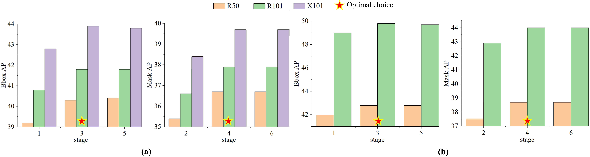

# A Turbo-Inference Strategy for Object Detection and Instance Segmentation

**论文元信息**

| 项目 | 内容 |
|---|---|
| 标题 | A Turbo-Inference Strategy for Object Detection and Instance Segmentation |
| 作者 | Zhen Zhao, Gang Zhang, Xiaolin Hu, Liang Tang |
| arXiv ID | 2606.12371v1 |
| 发布时间 | 2026-06-10 |
| 类别 | cs.CV |
| 论文链接 | http://arxiv.org/abs/2606.12371v1 |
| PDF 链接 | https://arxiv.org/pdf/2606.12371v1 |
| 代码状态 | 论文摘要声明代码可用：https://github.com/zhaozhen2333/Turbo-Learning.git；但本次材料未包含源码文件内容，无法给出可核验的源码路径、行号与代码段。本文不伪造源码分析。 |
| 推荐方向 | 检测 |
| 业务价值 | 可能提升检测框质量、减少漏检与框偏差，并改善分割辅助的自动标注质量。 |
| 主要风险 | 推理成本增加；实时业务未必可接受；需要验证对现有检测/分割架构的适配复杂度与长尾类别收益。 |

## 摘要

本文提出 **turbo-inference strategy（涡轮式推理策略）**，面向 top-down instance segmentation（自顶向下实例分割）中的 detect-then-segment（先检测后分割）范式。传统流程通常由检测分支先产生 bounding boxes（边界框）与 classification scores（分类分数），再由分割分支在每个检测框内预测 instance masks（实例掩码）。这使检测质量直接约束分割质量，但反向方向，即“分割结果能否帮助检测”，长期没有被充分利用。论文的核心贡献是在不重训模型的前提下，在推理阶段引入 **turbo-detection head（涡轮检测头）** 与 **turbo-segmentation head（涡轮分割头）**，让检测与分割形成闭环：粗分割掩码用于修正检测框与分类分数，修正后的检测框再用于生成更精确的分割掩码，必要时继续迭代（见 PAGE 1、PAGE 2、PAGE 3、PAGE 5）。

一句话概括：本文把原本单向的“检测指导分割”改造成可迭代的“分割反馈检测、检测再强化分割”的推理闭环，在 COCO、Cityscapes 与 iFLYTEK 上提升检测 AP 与分割 AP，但代价是 FPS 下降（见 PAGE 5、PAGE 6、PAGE 9、PAGE 10）。

需要强调的是，本文方法不是新的训练目标，也不是新的 backbone，而是一个 **training-free inference pipeline（免训练推理流程）**。它更适合对精度敏感、可接受额外推理成本的场景，例如离线自动标注、高精度评测、数据清洗、遥感大图实例分割后处理，而不是严格实时的在线检测链路。

## 背景与动机

目标检测（object detection）与实例分割（instance segmentation）是计算机视觉中的两个密切相关任务。目标检测通常输出每个目标的类别与边界框；实例分割进一步要求为每个目标输出像素级掩码。论文指出，自顶向下实例分割方法通常遵循 detect-then-segment 范式：先用检测器识别并定位目标，再在每个检测框内部进行二值掩码预测（见 PAGE 1）。Mask R-CNN、HTC、QueryInst、RTMDet-ins 等方法都可被纳入这个大框架，尽管它们的检测或分割头实现方式不同（见 PAGE 2、PAGE 3、PAGE 5）。

这种范式的直接后果是：检测结果的质量会强烈影响后续分割。若检测框包含大量冗余背景，分割头需要在更嘈杂的 RoI 区域内预测掩码；若检测框没有完整覆盖目标，分割结果也可能被截断。论文在 Figure 1 中展示了 vanilla Mask R-CNN 的典型问题：预测掩码的 extreme points（极值点）与检测框之间存在明显距离，说明掩码中包含比框更精细的定位信息；同时，一个分类分数为 0.052 的冗余框对应的 mask quality score 只有 0.31，但传统流程没有利用分割质量来纠正该冗余预测（见 PAGE 2）。

已有工作大多关注“检测如何帮助分割”。例如 Mask R-CNN 在 Faster R-CNN 检测框内添加 FCN 分割头；Mask Scoring R-CNN 通过额外 IoU head 重新评估掩码质量；BMASK R-CNN 与 BCNet 引入边界监督以改善边界区域；HTC 设计交织式级联掩码分支以获得更准确的实例掩码（见 PAGE 3）。这些方法在结构上仍主要将分割视为检测之后的下游任务。

本文的动机正来自这个不对称性：如果实例掩码已经提供了像素级定位与空间结构信息，为什么不把它反馈给检测分支？论文认为，分割结果至少可以在两个方面帮助检测。第一，掩码的前景像素分布可用于收紧或修正检测框；第二，掩码中前景置信度的分布可作为预测质量信号，用于修正分类分数，进而过滤低质量冗余预测（见 PAGE 2、PAGE 3、PAGE 4）。

与 Cascade R-CNN、Sparse R-CNN、HTC 等 multi-stage refinement（多阶段精修）方法相比，本文的差异在于精修发生在检测与分割两个任务之间，而不是仅在单一检测分支或单一分割分支内部。论文将其称为 interleaved cascade structure between detection and segmentation branches，即检测分支与分割分支之间的交错级联结构（见 PAGE 3）。

## 预备知识

**Top-down instance segmentation（自顶向下实例分割）** 指先检测目标，再在检测框内预测掩码的方法。其典型输入是图像，检测分支输出边界框 $B$ 与分类分数 $S$，分割分支基于这些框抽取 RoI features（区域特征）并输出掩码 $M$。这里 $B$ 表示 bounding boxes，$S$ 表示 classification scores，$M$ 表示 predicted masks；这些符号在本文方法描述中反复出现（见 PAGE 3、PAGE 5）。

**RoIAlign（Region of Interest Align）** 是 Mask R-CNN 中用于从 backbone feature map 上按候选框位置抽取固定尺寸 RoI 特征的操作。本文的 turbo-segmentation head 与 vanilla segmentation head 一样使用 RoIAlign，但输入框从原始检测框 $B$ 变成了经 turbo-detection head 修正后的 $B_{ref}$。这意味着分割头并不需要重新训练，而是在推理时复用原有 mask head 权重（见 PAGE 5）。

**AP（Average Precision）** 是检测与分割常用评价指标。论文在 COCO、Cityscapes、iFLYTEK 上均使用 COCO-style AP，同时报告 box AP 与 mask AP。box AP 评估边界框质量，mask AP 评估实例掩码质量；AP50、AP75 分别对应 IoU 阈值为 0.50 与 0.75 的 AP；$AP_S$、$AP_M$、$AP_L$ 分别对应小、中、大目标（见 PAGE 5、PAGE 6、PAGE 9）。

## 方法详解

### 1. 总体框架：从单向管线到闭环推理

传统 top-down 方法包含两个基础阶段。Stage 1 中，vanilla detection head 输出检测框 $B$ 与分类分数 $S$；Stage 2 中，vanilla segmentation head 基于 $B$ 预测粗掩码 $M$。本文在这两个阶段之后增加 Stage 3 与 Stage 4：Stage 3 使用 turbo-detection head 根据 $M$ 修正检测框与分类分数；Stage 4 使用 turbo-segmentation head 基于修正后的检测框 $B_{ref}$ 重新预测掩码 $M_{ref}$。Stage 3 与 Stage 4 可以继续重复，形成多阶段推理过程（见 PAGE 3、PAGE 5）。

**用途**：Figure 2 是理解本文方法的核心结构图，展示从 vanilla detect-then-segment 到 turbo-inference 的阶段扩展方式。

**读图要点**：Figure 2(a)(b) 展示整体流程，Stage 1/2 是原始检测与分割，Stage 3/4 是新增的 turbo-detection 与 turbo-segmentation。Figure 2(c) 将 turbo-detection head 拆为 Box refinement 与 Maskness 两个子模块；Figure 2(d) 展示 turbo-segmentation head 如何基于 refined bounding boxes 抽取 RoI features 并预测 refined masks（见 PAGE 4）。

**支撑的判断**：本文贡献不是替换原始模型主干，而是在推理阶段插入两个任务间通信模块；其技术重点是检测与分割的闭环互馈，而不是训练新网络（见 PAGE 3、PAGE 4、PAGE 5）。

### 2. Turbo-detection head：用掩码反向修正检测

Turbo-detection head 包含两个子模块：**Box refinement（框精修）** 与 **Maskness（掩码性评分）**。检测任务本身可分为 localization（定位）与 classification（分类）两个子任务：前者输出检测框 $B$，后者输出分类分数 $S$。Box refinement 使用预测掩码 $M$ 中的定位信息生成更准确的 $B_{ref}$；Maskness 使用预测掩码 $M$ 的空间结构与不确定性分布修正 $S$，得到更具代表性的 $S_{ref}$（见 PAGE 3、PAGE 4）。

Box refinement 的依据是：掩码通常比边界框包含更精细的像素级定位信息。论文指出，一些预测检测框包含过多冗余空间，无法准确包围目标，而预测掩码对前景和背景像素更敏感，能够提供比检测框更精细的位置线索（见 PAGE 3）。但 vanilla segmentation head 输出的掩码通常是空间尺寸为 $m \times m$ 的浮点图，为降低训练成本并不直接包含显式图像坐标。因此，本文先用 bilinear interpolation（双线性插值）将粗掩码映射回原图对应 RoI 区域，再使用阈值 $S_B$ 二值化，最后遍历前景像素的坐标最大值与最小值，得到 refined box $[x_{min}, y_{min}, x_{max}, y_{max}]$（见 PAGE 3）。

这里 $S_B$ 表示 Box refinement 中用于区分前景/背景的阈值。论文特别指出，常用的 0.5 阈值会降低检测精度，可能因为预测掩码中存在 foreground confidence ambiguous regions（前景置信度模糊区域）。如果阈值过高，这些区域会被过度丢弃，导致 refined RoI 无法完整覆盖实例。因此作者将 $S_B$ 设置为 0.23，以尽可能保留不确定区域与适度冗余空间（见 PAGE 3、PAGE 5）。

### 3. Maskness：用掩码不确定性修正分类分数

Maskness 模块试图解决分类分数与预测质量不一致的问题。传统检测中，分类分数常用于过滤检测与分割结果；但分类分数并不必然反映 mask quality。论文在 Figure 1 的例子中指出，一个冗余预测框的分类分数仍有 0.052，但对应 mask quality score 仅为 0.31，这类预测如果不被修正，会降低最终精度（见 PAGE 2）。

Maskness 的技术假设是：高质量掩码中，前景区域的置信度更接近 1，背景区域更接近 0；而对掩码质量影响较大的少量像素往往处于接近 0.5 的模糊状态。因此，预测掩码中的置信度分布可以反映掩码质量。论文据此引入 uncertainty scores（不确定性分数）来量化这种分布（见 PAGE 4）。

论文全文抽取中明确给出的公式只有两处，即 Eq. (1) 与 Eq. (2)。第一处公式定义 mask-level uncertainty score：

$$
U_{mask} =
\frac{\sum_{i}^{N} \mathbf{1}(B_i > 0) M_i}
{\sum_{i}^{N} B_i}
$$

其中，$U_{mask}$ 表示用于 predicted masks 的不确定性分数；$N$ 表示所有像素数；$M_i$ 表示第 $i$ 个位置的掩码置信度；$B_i$ 表示二值化掩码在第 $i$ 个位置的取值；$\mathbf{1}(B_i > 0)$ 是指示函数，表示只统计前景区域（见 PAGE 4）。人话解释：这个公式计算的是二值前景区域内的平均掩码置信度，前景区域越稳定、置信度越高，得分越高。

第二处公式定义 box-level uncertainty score：

$$
U_{bbox} = \frac{1 + U_{mask}}{2}
$$

其中，$U_{bbox}$ 表示用于 detection boxes 的不确定性分数，它由 $U_{mask}$ 缩放得到（见 PAGE 4）。人话解释：论文发现直接使用 mask uncertainty 会明显降低 AP50，从而削弱 box AP，因此用 $\frac{1 + U_{mask}}{2}$ 降低修正幅度，使其对检测框分数的影响更温和。

根据正文描述，Maskness 会为每个 mask 分配 uncertainty score，并将其与对应 classification score 相乘，生成 refined confidence score（见 PAGE 4）。这里需要谨慎：全文材料没有给出分类分数更新的显式编号公式，因此不能进一步伪造 $S_{ref}$ 的数学表达式。证据只支持“乘以 uncertainty score”这一文字级描述。

### 4. Turbo-segmentation head：复用权重，在更准确 RoI 上重预测掩码

Turbo-segmentation head 与 vanilla segmentation head 共享网络权重。它同样使用 RoIAlign 从 backbone features 中抽取 RoI features，但抽取位置来自 refined detection boxes $B_{ref}$，而不是原始检测框 $B$。这些 refined RoI features 被送入多层卷积，用于预测 refined masks $M_{ref}$。每个 mask 值是 0 到 1 之间的浮点数，表示该像素属于前景的置信度，最后通过阈值二值化（见 PAGE 5）。

这个设计的关键是“免训练”。由于 turbo-segmentation head 复用 vanilla mask head 的权重，方法不需要额外训练新分割头；它只是改变推理时 RoI 的位置，让已有分割头在更合理的区域上工作。这对工程部署有吸引力，因为它避免重新训练大模型，却可以在已有 top-down 框架上追加推理后处理式改进（见 PAGE 5、PAGE 10）。

但这也解释了它的局限：如果某个方法的分割过程高度依赖动态 proposal features 或 query interaction，仅修正 RoI features 可能破坏原有交互结构。论文在 QueryInst 的 stage ablation 中观察到，Stage 4 会导致 mask AP 略降 0.1%，作者认为原因是 turbo-inference 只能精修 mask RoI features，而不能同步精修 proposal features，造成交互不对称（见 PAGE 8）。

### 5. 多阶段迭代与阶段选择

本文将 vanilla detect-then-segment 视为 Stage 1 与 Stage 2，将 turbo-detection 与 turbo-segmentation 分别视为 Stage 3 与 Stage 4，并允许 Stage 3/4 重复，产生 Stage 5、Stage 6 等（见 PAGE 5）。论文明确指出，更多阶段通常会带来检测与分割提升，但也会增加推理时间，因此需要经验性选择精度与成本之间的折中（见 PAGE 5）。

**用途**：Figure 3 用于展示不同 turbo-inference 阶段下 Mask R-CNN 与 QueryInst 的检测/分割结果变化。

**读图要点**：Figure 3 左侧展示检测结果在 Stage 1、3、5 的变化，右侧展示分割结果在 Stage 2、4、6 的变化，星号标记作者采用的最优阶段选择。论文说明 Table 1、Table 4、Table 5 中的结果使用这些最优选择（见 PAGE 7）。

**支撑的判断**：turbo-inference 不是阶段越多越好。Mask R-CNN 默认采用 4-stage，因为 Stage 5/6 没有显著 AP 增益；QueryInst 默认采用 3-stage，因为 Stage 4 可能因动态卷积/attention 交互被破坏而导致 mask AP 略降（见 PAGE 8）。

### 6. 与 Soft NMS 的关系

Soft NMS 是一种 training-free 方法，通过根据 box IoU 衰减分类分数来缓解分类分数与定位质量不一致的问题。论文指出，Soft NMS 对 box AP 有提升，但对 mask AP 影响较小；而 turbo-inference 通过掩码反馈同时改进 box 与 mask。实验表明二者可以叠加，在 Mask R-CNN、HTC 与 RTMDet 上组合后取得更高结果（见 PAGE 9、PAGE 10）。

这说明 turbo-inference 与传统后处理并非互斥。Soft NMS 主要利用 box-level overlap 信息，而 turbo-inference 利用 mask-level spatial structure 与 uncertainty distribution。二者使用的信息源不同，因此提升可以累积（见 PAGE 10）。

## 实验分析

### 实验设置

论文在 COCO、Cityscapes 与 iFLYTEK 三个数据集上评估方法。COCO 包含 118k 训练图像与 5k 验证图像，覆盖 80 个类别；Cityscapes 包含 2975 张训练图像、500 张验证图像与 1525 张测试图像，图像尺寸为 1024×2048，包含 8 个类别；iFLYTEK 是遥感实例分割数据集，包含高分辨率耕地图像，训练集与验证集分别由 16 与 15 张大图切分得到 3744 与 3879 个 512×512 重叠小图（见 PAGE 5）。

评价指标采用 COCO-style AP，同时评估 object detection 与 instance segmentation。推理速度使用单张 RTX 2080Ti GPU、batch size 2 测得 FPS（见 PAGE 5）。实现基于 MMDetection，除新增模块外使用默认超参数；Box refinement 中 $S_B=0.23$；Maskness 中 Mask R-CNN 与 HTC 的 $S_M=0.5$，QueryInst 的 $S_M=0.2$（见 PAGE 5）。

### COCO 主结果

| Method | Backbone | Box AP | Mask AP | FPS | 变化摘要 |
|---|---:|---:|---:|---:|---|
| Mask R-CNN | R50-FPN | 39.2 | 35.4 | 15.7 | baseline |
| Mask R-CNN w/ Turbo | R50-FPN | 40.3 | 36.7 | 12.0 | +1.1 box AP, +1.3 mask AP, -3.7 FPS |
| HTC | R50-FPN | 43.3 | 38.3 | 5.5 | baseline |
| HTC w/ Turbo | R50-FPN | 43.7 | 39.2 | 4.5 | +0.4 box AP, +0.9 mask AP, -1.0 FPS |
| RTMDet-m | CSPX-PAFPN | 48.8 | 42.1 | 3.7 | baseline |
| RTMDet-m w/ Turbo | CSPX-PAFPN | 49.3 | 42.4 | 2.7 | +0.5 box AP, +0.3 mask AP, -1.0 FPS |
| QueryInst | R50-FPN | 42.0 | 37.5 | 7.5 | baseline |
| QueryInst w/ Turbo | R50-FPN | 42.8 | 38.7 | 6.0 | +0.8 box AP, +1.2 mask AP, -1.5 FPS |

表格解读：COCO 主结果表明，turbo-inference 对四类代表性方法均有效，包括两阶段 Mask R-CNN、级联式 HTC、一阶段 RTMDet-ins 与 query-based QueryInst。提升幅度并不完全相同：Mask R-CNN 与 QueryInst 的 mask AP 提升更明显，分别达到 +1.3 与 +1.2；HTC 与 RTMDet 本身已有较强精修或定位能力，因此收益较小。所有方法均出现 FPS 下降，说明该方法本质上是以额外推理阶段换取精度（见 PAGE 5、PAGE 6、PAGE 7）。

### 不同 backbone 下的泛化性

| Method | Backbone | Baseline Box AP | Turbo Box AP | Baseline Mask AP | Turbo Mask AP | FPS Baseline → Turbo |
|---|---:|---:|---:|---:|---:|---:|
| Mask R-CNN | R101-FPN | 40.8 | 41.8 | 36.6 | 37.9 | 13.5 → 9.8 |
| Mask R-CNN | X101-FPN | 42.8 | 43.9 | 38.4 | 39.7 | 6.8 → 5.5 |
| Mask R-CNN | Swin-T | 46.0 | 47.5 | 41.7 | 42.9 | 9.8 → 7.4 |
| Mask R-CNN | Swin-S | 48.2 | 49.4 | 43.2 | 44.5 | 9.3 → 6.3 |
| Mask R-CNN | ViT-B | 51.5 | 52.0 | 45.7 | 46.8 | 3.9 → 3.3 |
| Mask R-CNN | ConvNeXt-v2-FPN | 52.9 | 53.4 | 46.4 | 47.6 | 5.4 → 5.2 |

表格解读：从 ResNet、ResNeXt 到 Swin Transformer、Vision Transformer、ConvNeXt 与 ConvNeXt-v2，turbo-inference 均能带来 box AP 与 mask AP 提升。这说明方法并不依赖某一种 backbone，而主要依赖 top-down detect-then-segment 管线中检测框与分割掩码之间可互补的信息结构。值得注意的是，backbone 越大，FPS 下降的相对比例不一定越严重，因为检测头与分割头相对 backbone 的计算占比变小；这与作者在结论中关于“大 backbone 下速度下降不显著”的判断一致（见 PAGE 6、PAGE 8、PAGE 10）。

### 消融实验：模块贡献

| Model | Box refinement | Maskness | Turbo-seg | Box AP | Mask AP |
|---|---|---|---|---:|---:|
| Mask R-CNN R50-FPN |  |  |  | 39.9 | 35.6 |
| Mask R-CNN R50-FPN | ✓ |  |  | 40.7 | 35.6 |
| Mask R-CNN R50-FPN | ✓ | ✓ |  | 40.7 | 35.8 |
| Mask R-CNN R50-FPN | ✓ | ✓ | ✓ | 41.0 | 36.9 |
| QueryInst R50-FPN |  |  | 不适用/未列 | 42.0 | 37.5 |
| QueryInst R50-FPN | ✓ |  | 不适用/未列 | 42.2 | 37.5 |
| QueryInst R50-FPN | ✓ | ✓ | 不适用/未列 | 42.8 | 38.7 |

表格解读：Mask R-CNN 上，Box refinement 主要提升 box AP，从 39.9 到 40.7；Maskness 单独叠加时 box AP 不变但 mask AP 小幅提升；加入 Turbo-seg 后 mask AP 从 35.8 显著增至 36.9，说明更准确的检测框确实能为后续掩码预测提供更好的 RoI。QueryInst 上，Box refinement 只带来 +0.2 box AP，而 Maskness 带来更大收益，box AP 从 42.2 到 42.8，mask AP 从 37.5 到 38.7。论文解释这是因为 QueryInst 不使用 NMS 调整分类分数，因此分类分数与定位置信度相关性较弱，Maskness 的重打分更有价值（见 PAGE 8、PAGE 9）。

### Cityscapes 与 iFLYTEK 结果

| Dataset | Method | Backbone | Baseline Box AP | Turbo Box AP | Baseline Mask AP | Turbo Mask AP |
|---|---|---:|---:|---:|---:|---:|
| Cityscapes | Mask R-CNN | R50-FPN | 40.9 | 41.9 | 36.7 | 38.1 |
| Cityscapes | Mask R-CNN | R101-FPN | 41.8 | 42.7 | 36.5 | 38.1 |
| iFLYTEK | Mask R-CNN | R50-FPN | 37.6 | 38.6 | 34.1 | 35.9 |
| iFLYTEK | Mask R-CNN | R101-FPN | 37.3 | 38.6 | 34.2 | 35.9 |
| iFLYTEK | HTC | R50-FPN | 40.9 | 41.4 | 37.6 | 38.6 |
| iFLYTEK | QueryInst | R50-FPN | 28.1 | 29.7 | 26.1 | 27.6 |

表格解读：Cityscapes 与 iFLYTEK 结果说明 turbo-inference 不只在 COCO 上有效。Cityscapes 的提升主要体现在 mask AP，R50-FPN 从 36.7 到 38.1，R101-FPN 从 36.5 到 38.1。iFLYTEK 遥感数据集上，Mask R-CNN R50-FPN 获得 +1.0 box AP 与 +1.8 mask AP，说明该策略对高分辨率遥感实例分割也有潜在价值。对于业务上的离线自动标注场景，这一点尤其相关，因为遥感或工业图像中框偏差与掩码边界质量往往直接影响后续人工校验成本（见 PAGE 9、PAGE 10）。

### 与 Soft NMS 组合

| Method | Setting | Box AP | Mask AP | FPS |
|---|---|---:|---:|---:|
| Mask R-CNN R101-FPN | baseline | 40.8 | 36.6 | 13.5 |
| Mask R-CNN R101-FPN | Soft NMS | 41.6 | 36.9 | 13.3 |
| Mask R-CNN R101-FPN | Turbo | 41.8 | 37.9 | 9.8 |
| Mask R-CNN R101-FPN | Both | 42.5 | 38.2 | 9.0 |
| HTC R101-FPN | baseline | 44.8 | 39.6 | 5.2 |
| HTC R101-FPN | Soft NMS | 45.3 | 39.8 | 5.1 |
| HTC R101-FPN | Turbo | 45.1 | 40.5 | 4.3 |
| HTC R101-FPN | Both | 45.6 | 40.6 | 4.2 |

表格解读：Soft NMS 与 turbo-inference 的收益可以叠加。以 Mask R-CNN R101-FPN 为例，Soft NMS 将 box AP 从 40.8 提升到 41.6，但 mask AP 只从 36.6 到 36.9；Turbo 将 mask AP 提升到 37.9；二者结合后 box AP 达到 42.5，mask AP 达到 38.2。该结果支持论文关于二者信息来源互补的判断：Soft NMS 主要处理 box IoU 与 score 的关系，turbo-inference 进一步引入 mask 结构与不确定性信息（见 PAGE 9、PAGE 10）。

### 可视化证据

**用途**：Figure 1 用于展示 vanilla Mask R-CNN 与加入 turbo-inference 后的直观差异。

**读图要点**：图中随机颜色表示预测掩码，红色框表示检测框，蓝底白字表示分类分数，红圈表示 mask extreme points，红色数字表示预测掩码与人工标注掩码之间的 IoU。Figure 1(a) 中存在检测框与掩码极值点不匹配、冗余框未被纠正等问题；Figure 1(b) 展示 turbo-inference 后边界框更贴近目标，冗余预测被削弱（见 PAGE 2）。

**支撑的判断**：该图直接支撑本文动机：掩码包含可用于反向修正检测的定位与质量信息，传统单向管线没有充分使用这些信息（见 PAGE 2）。

**用途**：Figure 4 用于展示 COCO 上从 Faster R-CNN、vanilla Mask R-CNN 到不同 turbo stages 的结果演化。

**读图要点**：Figure 4 中绿色框表示被 turbo-inference 移除的框，其他符号与 Figure 1 相同。论文说明 vanilla Mask R-CNN 的检测框包含大量冗余空间并存在同一目标上的冗余框；3-stage turbo-inference 能生成更精确框并移除低于 0.05 的冗余框；4-stage 进一步预测更高质量掩码（见 PAGE 7、PAGE 8）。

**支撑的判断**：该图支撑两个结论：Box refinement 可改善定位，Maskness 可过滤低质量冗余预测；同时，Stage 4 的 refined boxes 能帮助分割头生成更高质量掩码（见 PAGE 8）。

## 讨论

从方法属性看，turbo-inference 是一种典型的精度-速度折中策略。它最大的优点是 training-free：不改变训练流程，不增加训练成本，能够在已有 top-down 实例分割模型上追加推理阶段。对于已经训练好的模型库、历史 checkpoint 或离线标注系统，这种特性降低了试验门槛（见 PAGE 3、PAGE 5、PAGE 10）。

从适用范围看，本文方法依赖 detect-then-segment 管线中检测框与掩码之间的可交换信息。因此它天然适用于 Mask R-CNN、HTC、QueryInst、RTMDet-ins 等 top-down 或带检测框驱动分割的模型，但不一定适用于纯 bottom-up instance segmentation 或没有显式 box-to-mask 管线的方法。作者在结论中也明确指出，主要缺点之一是只兼容 top-down frameworks（见 PAGE 10）。

从工程价值看，该方法更适合精度优先任务。COCO 主表显示 Mask R-CNN R50-FPN 从 15.7 FPS 降到 12.0 FPS，QueryInst R50-FPN 从 7.5 FPS 降到 6.0 FPS，RTMDet-m 从 3.7 FPS 降到 2.7 FPS（见 PAGE 6）。这些成本对严格实时服务可能不可接受，但对离线自动标注、高精度召回、评测增强、低频人工审核前处理等场景可接受度更高。

## 局限分析

第一，作者自述的局限是 **仅兼容 top-down frameworks**。论文结论明确写到，方法的主要缺点是 exclusively compatible with top-down frameworks（见 PAGE 10）。这意味着其价值边界由模型结构决定：如果业务当前使用的是 bottom-up、prompt-based、fully query-based 或不依赖检测框裁剪的分割架构，迁移成本与可行性需要单独验证。

第二，作者自述的另一项局限是 **inference speed reduction（推理速度下降）**。论文指出，增加 turbo stages 会提升检测与分割结果，但也增加推理时间，需要在精度与计算成本之间经验性折中（见 PAGE 5）。主结果表中的 FPS 下降提供了直接证据：Mask R-CNN R50-FPN 从 15.7 降至 12.0，HTC R50-FPN 从 5.5 降至 4.5，RTMDet-m 从 3.7 降至 2.7，QueryInst R50-FPN 从 7.5 降至 6.0（见 PAGE 6、PAGE 7）。

第三，独立判断上，本文的阶段选择与阈值选择具有经验性。$S_B=0.23$、$S_M=0.5/0.2$ 是实验设置中的固定超参数，但论文没有在全文材料中给出系统阈值敏感性表格。对于不同数据分布、类别尺度、mask calibration 状态或长尾类别，阈值可能需要重新调优；否则可能出现框过紧、框过松或分数校准失衡（见 PAGE 5）。

第四，独立判断上，论文对失败案例与类别级收益的展开不足。主表覆盖多模型、多 backbone、多数据集，但当前全文材料没有提供按类别、遮挡程度、目标大小分组的细粒度误差分析。表中可见一个值得注意的现象：Mask R-CNN 上 turbo-inference 常提升 $AP^m_L$，但有时降低 $AP^m_S$，例如 R50-FPN 的 mask small AP 从 19.1 降到 17.2，而 large AP 从 48.4 提升到 53.7（见 PAGE 6）。这提示小目标可能面临不同风险，但论文没有给出充分解释。

第五，代码层面证据不足。论文摘要明确声明代码可用，并给出 GitHub 链接（见 PAGE 1），但本次输入材料没有包含仓库 README、源码文件、配置文件或可核验的函数实现。因此本文不能提供 paper-analyzer 标准中要求的“源码 ≥2 段 + 文件路径:行号”。结论是：**本文提供了代码链接证据，但当前材料不足以进行源码级对应分析**。

## 结论

本文提出的 turbo-inference strategy 将 top-down 实例分割中的单向 detect-then-segment 管线扩展为检测与分割的闭环推理系统。其核心机制包括：用 predicted masks 的像素级定位信息修正 bounding boxes；用 mask uncertainty distribution 修正 classification scores；再用 refined boxes 重新抽取 RoI features 并预测 refined masks。该策略不需要重训，可集成到 Mask R-CNN、HTC、QueryInst、RTMDet-ins 等既有方法中（见 PAGE 3、PAGE 5、PAGE 10）。

实验上，论文在 COCO、Cityscapes 与 iFLYTEK 上展示了稳定提升。最典型的结果是 Mask R-CNN R50-FPN 在 COCO 上获得 +1.1 box AP 与 +1.3 mask AP，但 FPS 从 15.7 降到 12.0；iFLYTEK 上 Mask R-CNN R50-FPN 获得 +1.0 box AP 与 +1.8 mask AP；与 Soft NMS 组合后还能进一步累积收益（见 PAGE 6、PAGE 9、PAGE 10）。因此，该方法的合理定位不是“免费精度提升”，而是“免训练、可插拔、以推理成本换精度”的后处理式推理增强策略。

对于检测与实例分割业务，本文最值得优先验证的场景是离线自动标注和高精度评测链路：这类场景通常对推理速度不如在线服务敏感，却对框质量、漏检、冗余框、掩码边界质量高度敏感。上线前必须重点评估三项风险：不同现有架构的适配成本、FPS 与显存开销、以及小目标和长尾类别上的收益是否稳定。

## 证据不足说明

1. **公式数量证据不足**：全文材料中明确编号且可引用的公式只有 Eq. (1) 与 Eq. (2)，均位于 Maskness 模块（见 PAGE 4）。本文没有为了满足“公式 ≥5”而编造额外公式。
2. **源码证据不足**：论文摘要给出代码链接（见 PAGE 1），但当前材料未包含源码内容，无法核验 README、核心文件、函数实现与行号。因此不提供代码段。
3. **失败案例证据不足**：论文提供 Figure 1、Figure 3、Figure 4 的可视化与多张结果表，但当前材料中缺少系统类别级失败分析与阈值敏感性实验。
4. **更多图片证据有限**：当前 figures 列表仅提供 4 张图片路径，本文只使用这些路径，没有输出不存在的图片。

## 证据索引

| 论点 | PAGE 证据 |
|---|---|
| 论文提出 turbo-inference，利用检测与分割互补信息形成闭环，无需重训 | PAGE 1、PAGE 2、PAGE 3、PAGE 5 |
| top-down 方法遵循 detect-then-segment，检测质量影响分割 | PAGE 1、PAGE 3 |
| 传统方法较少探索分割对检测的反向帮助 | PAGE 1、PAGE 2 |
| Figure 1 展示 vanilla Mask R-CNN 与 turbo-inference 的可视化差异 | PAGE 2 |
| Turbo-detection head 包含 Box refinement 与 Maskness | PAGE 3、PAGE 4 |
| Box refinement 使用掩码定位信息、双线性插值、阈值二值化与前景坐标极值生成 refined box | PAGE 3 |
| $S_B=0.23$，用于保留不确定区域 | PAGE 5 |
| Maskness 使用掩码不确定性分布修正分类分数 | PAGE 4 |
| Eq. (1) 定义 $U_{mask}$ | PAGE 4 |
| Eq. (2) 定义 $U_{bbox}$ | PAGE 4 |
| Turbo-segmentation head 复用 vanilla segmentation head 权重，基于 $B_{ref}$ 抽取 RoI features | PAGE 5 |
| Stage 3/4 可重复，更多阶段带来精度-成本折中 | PAGE 5、PAGE 7、PAGE 8 |
| COCO 主结果：Mask R-CNN、HTC、RTMDet、QueryInst 均有提升且 FPS 下降 | PAGE 5、PAGE 6、PAGE 7 |
| Figure 3 展示不同阶段结果与最优阶段选择 | PAGE 7、PAGE 8 |
| Figure 4 展示冗余框移除与 mask 质量改进 | PAGE 7、PAGE 8 |
| 消融实验 Table 2、Table 3 说明 Box refinement、Maskness、Turbo-seg 的贡献 | PAGE 8、PAGE 9 |
| Cityscapes 实验设置与结果 | PAGE 9、PAGE 10 |
| iFLYTEK 实验设置与结果 | PAGE 9、PAGE 10 |
| Soft NMS 可与 turbo-inference 叠加 | PAGE 9、PAGE 10 |
| 作者自述局限：只兼容 top-down frameworks，推理速度下降 | PAGE 10 |
| 代码链接由论文摘要声明 | PAGE 1 |
