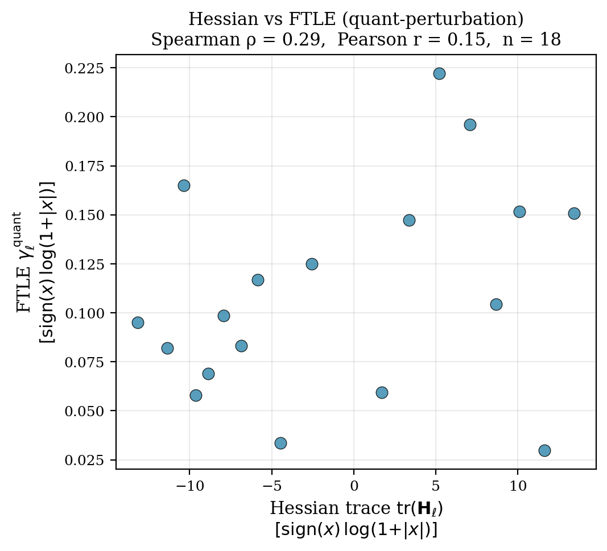
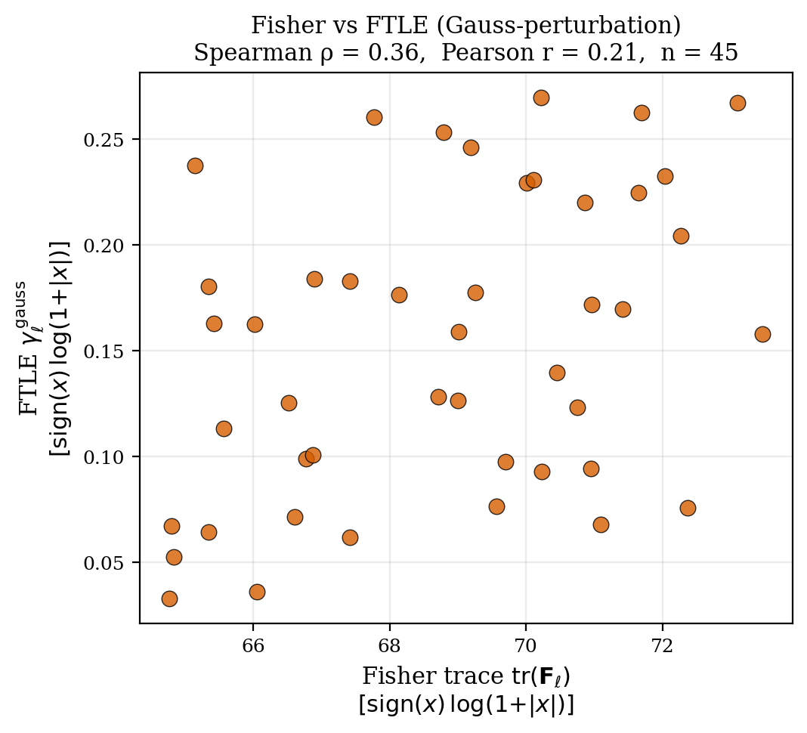
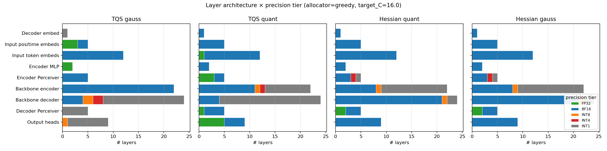
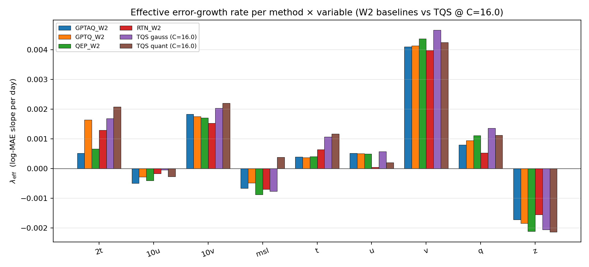

# Quantizing Time-Series Models As Dynamical Systems: Trajectory-Based Quantization Sensitivity Score

## 摘要

| 项目 | 内容 |
|---|---|
| 标题 | Quantizing Time-Series Models As Dynamical Systems: Trajectory-Based Quantization Sensitivity Score |
| 作者 | Mariya Pavlova, Harrison Bo Hua Zhu, Elizaveta Semenova, Yingzhen Li |
| arXiv ID | 2606.13300v1 |
| 发布时间 | 2026-06-11 |
| 类别 | cs.LG |
| 链接 | http://arxiv.org/abs/2606.13300v1 |
| PDF | https://arxiv.org/pdf/2606.13300v1 |
| 代码状态 | 本文未提供可确认的公开代码；已知代码链接为“未知”。本报告不编写源码段。 |
| 报告依据 | PDF全文截断与摘要；文本抽取状态为 fulltext:pypdf:truncated。 |

一句话总结：本文提出 **TQS（Trajectory-based Quantization Sensitivity Score，轨迹量化敏感度分数）**，把时间序列模型的 PTQ（Post-Training Quantization，训练后量化）重写为有限时域动力系统稳定性问题，用前向 rollout 中的预测轨迹偏离来估计每层量化扰动会被放大还是衰减，并据此构建无校准数据、无需 Hessian 的混合精度分配器 TQS-PTQ（见 PAGE 1、PAGE 2）。

本文最重要的贡献不是“又一个量化器”，而是将 **sensitivity estimation（敏感度估计）** 与 **quantizer / bit-width assignment（量化器和位宽分配）** 解耦。传统 PTQ 常在具体量化位宽、校准数据、局部二阶近似或逐层重构误差中估计敏感度；TQS 则先以模型 rollout 的动力学响应给层排序，再在给定压缩预算下分配精度。这使其可用于 black-box 或 compiled networks with fused operators（黑盒或融合算子的编译模型），因为它只需要前向推理，不要求梯度、Hessian 或校准集（见 PAGE 1、PAGE 2、PAGE 3）。

从业务视角看，这篇论文与“小模型/部署”方向相关，尤其适合作为端侧视频时序模型、轨迹预测模型或轻量分类模型的量化敏感度分析备选思路。需要限定的是，论文实验对象是 TimesFM-2.5、Aurora-small 和 Pangu-Weather 等时间序列/天气基础模型，不是 CV 检测、跟踪、视频理解或多任务视觉模型；因此其 I/O 边界敏感性、rollout 误差放大和混合精度预算策略能否迁移到视觉骨干、检测头、跟踪头和真实硬件延迟收益，仍属证据不足。

## 背景与动机

PTQ 的目标是在模型训练完成后，将 FP32 权重，某些场景下也包括激活，替换为低精度表示，从而降低模型存储、内存带宽和推理成本。论文指出，layer-wise PTQ（逐层训练后量化）之所以实用，是因为它不需要 QAT（Quantization-Aware Training，量化感知训练）那样的重训练或反向传播，也不要求全局微调，因此在 LLM 压缩中已经被广泛采用（见 PAGE 1）。

但时间序列和天气基础模型面对的问题不同于一次性前向推理的语言模型或图像模型。对于 autoregressive rollout（自回归滚动预测），早期步骤的小量化误差可能在后续时间步持续传播，沿空间维度和时间维度复合放大。论文明确指出，天气、气候和科学时间序列中的小统计误差还可能导致物理不一致，例如违反守恒律或解析约束；因此量化不能只看局部权重误差或单步重构误差，而必须考虑长时域预测轨迹中的稳定性（见 PAGE 1）。

传统敏感度方法大致可以分成两类。第一类基于 local curvature approximations（局部曲率近似），例如 Hessian-aware quantization，用二阶信息评估某层权重量化后对局部损失的影响；第二类基于 post-hoc evaluation（量化后评估），逐层替换或评估具体量化方案的输出退化。这两类方法在单步推理中合理，但论文认为它们没有直接刻画“量化扰动在 rollout horizon 内如何增长、衰减或保持中性”（见 PAGE 1、PAGE 13）。

本文的出发点是：时间序列模型本身就是 discrete-time dynamical systems（离散时间动力系统）。如果 full-precision model（全精度模型）是一张从当前状态到下一状态的映射，量化后的模型就是这张映射的参数扰动版本。动力系统稳定性理论正是研究小扰动在有限或无限时域内如何演化的工具。因此，将 PTQ 敏感度理解为 finite-horizon stability problem（有限时域稳定性问题）是自然的（见 PAGE 1、PAGE 7）。

论文的贡献可概括为五点：提出 TQS 敏感度分数；用动力系统视角分析时间序列基础模型的量化敏感度；提出 calibration-free mixed-precision allocator（无校准混合精度分配器）TQS-PTQ；发现 LLM PTQ 中常见的 FFN-down projection 敏感假设不直接迁移到 forecasting transformers，后者的敏感性集中在 input/output projection modules；并展示一次 sensitivity sweep 可复用于 TimesFM、Aurora、Pangu 上的多个压缩目标（见 PAGE 2、PAGE 3、PAGE 4）。

## 预备知识

**PTQ（Post-Training Quantization，训练后量化）** 是在训练完成后对模型权重或激活进行低比特化处理。本文讨论的重点是 layer-wise PTQ，即按层或按 tensor / ONNX block 估计敏感度并分配精度。与 QAT 相比，PTQ 的部署成本低，但在低位宽和长时域预测中更容易出现误差积累（见 PAGE 1、PAGE 3）。

**Rollout horizon（滚动预测时域）** 指自回归模型连续预测的时间长度。本文对不同模型使用不同的 probe horizon：TimesFM-2.5 的 $T_{\max}=100$ steps；Aurora-small 的 $T_{\max}=120$ steps，即 6 小时间隔下的 30 天；Pangu-Weather 的 $T_{\max}=4$，即 6 小时间隔下的 24 小时 lead time（见 PAGE 7）。

**Finite-Time Lyapunov Exponent, FTLE（有限时间 Lyapunov 指数）** 描述有限时域内扰动的增长率。TQS 借鉴这一思想，但不是直接求经典动力系统中的 Lyapunov spectrum，而是对每个 quantizable tensor（可量化张量）施加参数扰动，比较 full-precision trajectory 与 perturbed trajectory 的预测空间距离，并用对数增长率作为敏感度分数（见 PAGE 2、PAGE 7、PAGE 13）。

**Mixed-precision allocation（混合精度分配）** 是在同一模型中让不同层使用不同精度。高敏感层保留 FP32 或 BF16，低敏感层压到 INT8、INT4、INT2 或 INT1。本文的分配器将层敏感度 $\gamma_\ell$ 与参数量 $n_\ell$ 结合，在目标压缩率 $C$ 下求解一个 multiple-choice knapsack problem, MCKP（多重选择背包问题）（见 PAGE 2、PAGE 7、PAGE 8、PAGE 9）。

## 方法详解

### 1. 将量化模型表述为扰动动力系统

论文首先将全精度时间序列模型定义为离散时间映射：

$$
x_{t+1}=F_\theta(x_t)
$$

其中，$x_t$ 表示时间 $t$ 的状态，$F_\theta$ 是由参数 $\theta$ 定义的模型映射。量化后模型对应扰动映射：

$$
\tilde{x}_{t+1}=F_{\tilde{\theta}}(\tilde{x}_t), \quad \tilde{\theta}=Q(\theta)
$$

这里 $Q(\cdot)$ 表示量化算子，$\tilde{\theta}$ 是量化后的参数。人话解释：同一个输入状态经过全精度模型和量化模型滚动预测，会产生两条轨迹；TQS 关注的是两条轨迹在预测时域内分开得有多快，而不仅是某一层权重被四舍五入了多少（见 PAGE 2）。

这个建模解决了传统 PTQ 的一个盲点。单层局部误差小，不代表它在 rollout 中无害；相反，某层很小的扰动如果位于输入/输出边界，或者影响强不稳定变量，就可能在多个预测步中被放大。TQS 因此将“层重要性”从静态权重空间转移到预测轨迹空间（见 PAGE 1、PAGE 2、PAGE 4）。

### 2. TQS 的任务级敏感度分数

主文给出的核心公式是 task-level TQS：

$$
\gamma_{\text{task}}(\ell)=
\frac{1}{T_{\max}}
\ln\left(
\frac{
\frac{1}{|S|}\sum_{s\in S}\left\|\Delta \hat{Y}^{(\ell)}_s\right\|_2^2
}{
2\left\|\delta\theta^{\text{quant}}_\ell\right\|_F^2+\epsilon
}
\right)
$$

其中，$\ell$ 表示被扰动的量化层或张量；$S$ 是 independent context windows（独立上下文窗口）集合；$\Delta \hat{Y}^{(\ell)}_s=\hat{Y}^{(\ell)}_{s,1:T_{\max}}-\hat{Y}^{(0)}_{s,1:T_{\max}}$ 表示扰动模型与原模型在完整 rollout 上的预测轨迹差异；$\delta\theta^{\text{quant}}_\ell=Q(\theta_\ell)-\theta_\ell$ 是第 $\ell$ 层的量化扰动；$\|\cdot\|_F$ 是 Frobenius norm（Frobenius 范数）；$\epsilon$ 是数值稳定项（见 PAGE 2）。

这个公式的含义是：用预测轨迹偏离量除以参数扰动大小，再对时间归一化并取对数。$\gamma$ 越高，表示同样大小的权重量化扰动在输出轨迹中造成更大的增长；这些层应分配更高精度。$\gamma$ 越低，表示扰动被模型动态吸收或衰减，可以更激进压缩（见 PAGE 2）。

### 3. 单上下文 TQS 与 rollout building block

附录进一步给出 single-context, single-horizon 的 TQS building block：

$$
\gamma_\ell(T)=
\frac{1}{T}
\ln\left(
\frac{
\left\|\hat{Y}^{(\ell)}_{s,1:T}-\hat{Y}^{(0)}_{s,1:T}\right\|_2
}{
\left\|\delta\theta_\ell\right\|_F+\epsilon
}
\right)
$$

这里 $T$ 是分析的预测时域长度，$\hat{Y}^{(0)}$ 是 nominal trajectory（未扰动轨迹），$\hat{Y}^{(\ell)}$ 是只扰动第 $\ell$ 层后的 perturbed trajectory（扰动轨迹）。人话解释：该公式是 TQS 的最小计算单元，用单个 context window 观察“扰动一层以后，预测轨迹在 $T$ 步内偏离原轨迹的速度”（见 PAGE 7）。

论文还记录最大放大比：

$$
A_{\max,\ell}=
\max_{T\in\mathcal{T}}
\frac{
\left\|\hat{Y}^{(\ell)}_{s,1:T}-\hat{Y}^{(0)}_{s,1:T}\right\|_2
}{
\left\|\delta\theta_\ell\right\|_F+\epsilon
}
$$

其中，$\mathcal{T}$ 是多个 rollout horizons 的集合。人话解释：如果 $\gamma_\ell(T)$ 是平均增长率，$A_{\max,\ell}$ 则记录在不同时间窗口中最严重的一次放大（见 PAGE 12）。

### 4. 量化扰动与 Gaussian proxy 的分离

Equation (1) 使用真实量化噪声 $\delta\theta^{\text{quant}}_\ell$，但这会使敏感度估计依赖具体 bit-width 和 quantization scheme。为了解耦敏感度估计与量化决策，论文定义 Gaussian variant $\gamma_{\text{gauss}}$：用各向同性 Gaussian noise（高斯噪声）替代量化残差，并将噪声 Frobenius norm 缩放到与参考量化扰动一致（见 PAGE 2、PAGE 7、PAGE 9）。

Gaussian probe 的定义在附录中表述为：

$$
\delta\theta^{(c)}_\ell \sim \mathcal{N}(0,\sigma_\ell^2 I),
\quad
\left\|\delta\theta^{(c)}_\ell\right\|_F
=
\left\|\delta\theta^{\text{quant}}_\ell\right\|_F
$$

其中，$\sigma_\ell$ 是让 Gaussian noise 与参考量化扰动范数匹配的尺度参数。人话解释：这相当于问“如果只给这一层一个同等大小但不带具体量化结构的随机扰动，它在轨迹中会被放大吗？”如果 $\gamma_{\text{gauss}}$ 与 $\gamma_{\text{quant}}$ 排名一致，说明主要因素是扰动幅度；如果低位宽下二者分歧，说明量化噪声的 bounded rounding structure（有界舍入结构）本身也携带重要信息（见 PAGE 2、PAGE 4、PAGE 11）。

### 5. Dead-layer rule：识别免费压缩

论文指出，某些模块对扰动几乎不敏感：即使参数扰动较大，输出仍接近不变。此时 Equation (1) 的预测偏离分子接近 0，$\gamma\rightarrow -\infty$。TQS 将这些层自动排在最低敏感度位置，并把它们分配到最低精度 tier，从而释放压缩预算给真正敏感的层（见 PAGE 2、PAGE 3、PAGE 8、PAGE 9）。

表格如下：

| 模型 | 层/块数量 | Dead layers | 免费压缩预算 |
|---|---:|---|---:|
| TimesFM-2.5 | 89 | 3 个 output-quantile heads | 3.4% |
| Aurora-small | 85 | 36 个 deep-stage `ln modulation` layers | 42% |
| Pangu-Weather | 28 blocks | none; block granularity hides inert effects | 证据不足/未给出比例 |

表格解读：Aurora-small 中 36 个 `ln modulation` 模块被识别为低敏感或失活层，形成 42% 的免费压缩预算，这是 TQS-PTQ 能在高压缩率下保持精度的重要原因。Pangu-Weather 没有发现 dead block，但论文说明这是因为 Pangu 以 block 粒度评估，8 个参数平均到一个 block 后会冲淡单个失活参数的影响（见 PAGE 8、PAGE 9、PAGE 10）。

### 6. TQS-PTQ 分配器：从敏感度排名到混合精度

TQS-PTQ 的输入包括每层敏感度 $\{\gamma_\ell\}$、参数量 $\{n_\ell\}$、precision tiers $T=\{(t_k,b_k)\}_{k=1}^K$、目标压缩率 $C$、FP32 fraction $p_{\text{FP32}}$ 和阈值 $\gamma_{\min}$。算法先把 $\gamma_\ell \leq \gamma_{\min}$ 的低敏感层分配到最低 tier，再按 $\gamma_\ell$ 降序为最高敏感层保留 FP32 预算，剩余层通过 MCKP 或 greedy promotion 分配精度（见 PAGE 2、PAGE 7）。

MCKP 的优化形式为：

$$
\min_{x_{\ell,k}\in\{0,1\}}
\sum_{\ell\in R}\sum_{k=1}^{K}\gamma_\ell 2^{-b_k}x_{\ell,k}
$$

约束为：

$$
\sum_{k=1}^{K}x_{\ell,k}=1,\quad \forall \ell\in R
$$

$$
\sum_{\ell\in R}\sum_{k=1}^{K}b_k n_\ell x_{\ell,k}\leq B'
$$

这里 $R$ 是尚未分配的层集合，$x_{\ell,k}$ 表示第 $\ell$ 层是否选择第 $k$ 个 tier，$b_k$ 是该 tier 的位宽，$B'$ 是剩余存储预算。人话解释：每层必须选一个精度，所有层总存储不能超过预算；目标函数鼓励高敏感层使用更高位宽，因为 $2^{-b_k}$ 随位宽增大而减小（见 PAGE 7、PAGE 8）。

### 7. 模型特定 tier set 与部署约束

论文不是对所有模型使用同一精度集合，而是根据模型和导出路径设置 tier set。TimesFM-2.5 使用 $\{\text{FP32},\text{BF16},\text{INT8},\text{INT4},\text{INT2}\}$；Aurora-small 使用 $\{\text{FP32},\text{BF16},\text{INT8},\text{INT4},\text{INT1}\}$；Pangu-Weather 仅使用 $\{\text{FP32},\text{BF16},\text{INT8}\}$，因为 `onnx2torch` 图改写路径只能稳定往返 symmetric INT8 / BF16 / FP32，INT4 和 INT1 会产生非有限激活（见 PAGE 9）。

这说明 TQS-PTQ 的“混合精度”不是抽象算法即可直接落地，还要受模型框架、导出格式和底层算子稳定性的限制。尤其 Pangu-Weather 是 frozen ONNX graph，没有原生 PyTorch checkpoint 或暴露的 parameter dictionary；截断文本只保留到 PAGE 19 开头，因此 Pangu 附录后续实现细节证据不足（见 PAGE 19）。

### 8. 与 Hessian / Fisher 曲率视角的关系

论文专门比较了 TQS 与 Hessian-style / Fisher-style curvature score。其关键判断是：TQS 不是 curvature score 的重参数化。对于 Aurora，Hessian 与 Task-TQS-Quant 有中等相关性，但与 Gaussian-probe TQS 轻微负相关；Fisher 与 Gaussian-probe TQS 有中等但不完美的相关性（见 PAGE 14、PAGE 15）。

**用途**：Figure 4 展示 Hessian curvature score 与 TQS quant / FTLE 的逐层散点关系，用于判断局部曲率与轨迹敏感度是否等价（见 PAGE 14）。

**读图要点**：图中横轴是 Hessian trace，纵轴是 FTLE / TQS quant，点分布并不贴近一条单调线。需要注意，图片标题显示的 $\rho$ 与正文 PAGE 14 的更新叙述存在数值不一致：图片内显示 Spearman $\rho=0.29$、$n=18$，正文说明 Hessian vs Task-TQS-Quant 为 $\rho=0.47$、$p=0.005$、$n=34$。因此本报告仅采用“相关性有限、不是完全一致排序”这一稳健结论，不将图片标题数值作为唯一证据。

**支撑的判断**：Hessian 关注局部曲率，TQS 关注 rollout 轨迹偏离，两者会识别部分重叠但系统性不同的敏感层；这支撑论文关于动力系统视角必要性的判断（见 PAGE 14）。

**用途**：Figure 5 展示 Fisher curvature score 与 TQS gauss / FTLE 的逐层关系，用于观察 Fisher 与 Gaussian perturbation 下轨迹敏感度的一致性（见 PAGE 14）。

**读图要点**：散点显示正相关但离散度明显。正文给出的结论是 Spearman $\rho=0.38$、Pearson $r=0.36$，说明二者存在中等重合但远非同一指标（见 PAGE 14）。

**支撑的判断**：曲率方法可以捕捉一部分敏感层，但不能完整替代轨迹级增长率。对于自回归预测，局部二阶误差与长期轨迹偏离之间仍有结构性差异（见 PAGE 13、PAGE 14）。

## 实验分析

### 实验设置概述

论文在三个模型上评估：Aurora-small（113M）、TimesFM-2.5（200M）和 Pangu-Weather 6h（277M，frozen ONNX export）。Aurora 和 Pangu 在 ERA5 上评估 9 个 surface and upper-air variables；TimesFM 在 ETTh1/2、ETTm1/2、EXCHANGE 和 WEATHER 上评估。对每个 quantizable tensor 或 Pangu 的 ONNX block，论文通过 forward-only autoregressive rollouts 估计 $\gamma_\ell$，然后用 MCKP 或 greedy allocator 分配混合精度（见 PAGE 2、PAGE 3）。

基线包括 uniform RTN、GPTQ、GPTAQ 和 QEP，并在 matched compression 下比较。指标包括 native-unit MAE/RMSE、FP32-relative degradation、壁钟时间、Pareto frontier、dead-layer rate、probe distribution、allocator choice、bottom tier 和 FP32 budget 等（见 PAGE 3、PAGE 8、PAGE 10）。

### 主要结果：TQS-PTQ 在重压缩下最强

| 模型 | 关键结果 | 证据页 |
|---|---|---|
| Aurora-small | 在 $\leq 1\%$ ERA5-MAE degradation 下达到 $\geq 32\times$ compression；在 matched W2 grid 上赢得 9/9 个变量 | PAGE 3、PAGE 4 |
| TimesFM-2.5 | 在 $C=16$ 时赢得 46/57 个变量；在 $\sim 4\times$ compression 下保持 $\leq 1\%$ degradation 结果被主文报告 | PAGE 3、PAGE 4 |
| Pangu-Weather | on-disk $C=1.67\times$，block-level allocation $3.57\times$；mean per-variable MAE degradation 为 1.2%；对 strongest uniform-W8 baseline 赢得 9/9 个变量 | PAGE 3、PAGE 4 |
| 汇总 | 64/75 variable-model wins | PAGE 3 |

表格解读：TQS-PTQ 的强项集中在重压缩和多目标压缩预算规划。它通过一次 sensitivity sweep 复用 layer / block ranking，而不是每个 bit-width 重新校准，因此能形成更密集的 Pareto frontier。对于部署团队，这一点比单个压缩点的最优性更重要，因为真实部署通常需要在不同设备、延迟目标和精度容忍度之间扫预算（见 PAGE 3、PAGE 4）。

**用途**：Figure 1 是论文主结果图，展示 TimesFM-2.5、Aurora-small 和 Pangu-Weather 的 accuracy-compression frontier。由于本次 `figures` 列表未提供 Figure 1 图片路径，本文不嵌入该图；这里只引用主文文字证据（见 PAGE 4）。

**读图要点**：主文说明 TQS-PTQ 在三个模型上扩展低精度 accuracy-compression frontier，并且复用单次敏感度排名跨多个压缩目标（见 PAGE 4）。

**支撑的判断**：TQS-PTQ 的优势不是只来自某个模型，而是在三类 forecast foundation models 上呈现跨架构趋势；但该结论仍限于时间序列/天气预测任务（见 PAGE 3、PAGE 4）。

### 运行成本：一次敏感度扫描换多点 Pareto frontier

| Method | TimesFM | Aurora | Pangu |
|---|---:|---:|---:|
| TQS-PTQ | 7.7h / 10 points = 46m/point | 8.5h / 16 points = 32m/point | 11.5h / 12 points = 57.5m/point |
| GPTQ | 10.6h / 3 points = 3.5h/point | 77.0m / 2 points = 38.5m/point | 32.3m / 1 point = 32.3m/point |
| GPTAQ | 11.7h / 3 points = 3.9h/point | 107.8m / 2 points = 53.9m/point | 66.9m / 1 point = 66.9m/point |
| QEP | 11.7h / 3 points = 3.9h/point | 108.2m / 2 points = 54.1m/point | NaN |
| RTN | 6.1m / 3 points = 2.0m/point | 2.9m / 2 points = 1.4m/point | 2.4s / 1 point = 2.4s/point |

表格解读：RTN 最快但精度不是主文中最强；GPTQ 在 Pangu 单点上更便宜，但只能给一个 uniform allocation，不能描出 mixed-precision frontier。TQS-PTQ 的核心收益是 amortization（摊销）：一次前向敏感度扫描产生多个 Pareto points，在 TimesFM 上每点成本比校准式基线低约 4.6–5.1 倍，在 Aurora 上低约 1.2–1.7 倍；Pangu 上 TQS-PTQ 比 GPTAQ-W8 更便宜且 MAE 更低，但 GPTQ-W8 单点仍更快（见 PAGE 3）。

### 敏感性分布：中等重尾，而非 LLM 式极端 outlier

| 模型 | 有效层/块数 | Top-10% $\gamma$-shift share | Top-25% $\gamma$-shift share | Top-50% $\gamma$-shift share |
|---|---:|---:|---:|---:|
| TimesFM-2.5 | 86 | 24.0% | 43.7% | 69.2% |
| Aurora-small | 45 | 17.3% | 37.4% | 66.1% |
| Pangu-Weather | 28 | 18.4% | 40.1% | 73.0% |
| Uniform reference | - | 10.0% | 25.0% | 50.0% |

表格解读：三类模型的敏感度分布都比均匀分布更集中，但没有达到 LLM 量化文献中少数 outliers 主导大部分误差的极端状态。Top-10% 层承载 17–24% 的累计 $\gamma$-shift，Top-25% 层承载约 40%。这正好适合混合精度：需要保护的层不是极少数点，也不是所有层，而是一个可管理的高精度 tier（见 PAGE 3、PAGE 11）。

### I/O 边界敏感性：与 LLM FFN 假设不同

论文最有部署启发的发现是：forecasting foundation models 的量化敏感性集中在 I/O boundary（输入/输出边界），而不是 LLM PTQ 常报告的 FFN-down projections。TimesFM-2.5 中 input-tokenizer 和 point-prediction head 分别位于 97.7th 和 95.3rd $\gamma$-rank percentiles；self-attention backbone 只有 25.6th percentile。Pangu-Weather 中 five input-output scaffolding blocks 达到 92.9th percentile，而 transformer body blocks 为 21.4th percentile。Aurora-small 中最敏感的是输出接口，五个 atmospheric heads `decoder.atmos_heads.{q,t,u,v,z}` 占据 alive-layer 分布前五名（见 PAGE 3、PAGE 4）。

该发现对端侧部署有直接意义：若要对视频时序模型、轨迹预测模型或多帧分类模型借鉴 TQS 思路，不能直接套用 LLM 中“保护 FFN-down projection”的经验；更应该先检查输入 tokenization、temporal adapter、output projection / head、state update head 等 I/O 边界模块是否是误差放大的主路径。

### Gaussian vs quantization noise：粒度越粗，排名越一致

| 模型 | 分析粒度 | Spearman $\rho(\gamma_{\text{gauss}},\gamma_{\text{quant}})$ | 最大 MAE gap |
|---|---|---:|---:|
| Aurora-small | tensor, $n=45$ | 0.57 | $\leq 0.01\%$ |
| TimesFM-2.5 | role bucket, $n=86$ | 证据不足 | 证据不足 |
| Pangu-Weather | block, $n=28$ | 0.96 | Pangu multi-target sweep pending |

表格解读：在细粒度 tensor 级别，Gaussian proxy 与 quantization residual 的排名会有明显差异；但当粒度变粗到 Pangu 的 28 个 block 时，二者几乎一致。对部署规划而言，这意味着 noise model 对 sub-block diagnostics 很重要，但对全局 bit-width budget planning 的影响可能较小。Aurora 上即便 probe 排名存在差异，16 个压缩目标中的相对 ERA5-MAE 差距也不超过 0.01%（见 PAGE 4、PAGE 11）。

### Aurora 架构审计：TQS 与 Hessian 保护不同层

**用途**：Figure 6 展示在 Aurora-small、target $C=16$、greedy allocator 下，不同方法在各 architectural block 上分配的 precision tier，用于观察 TQS 与 Hessian 方法的精度预算流向（见 PAGE 16）。

**读图要点**：TQS quant 将多个 atmospheric output heads 提升到 FP32；TQS gauss 更偏向 input-side embeddings 和 surface-input MLP；Hessian quant / gauss 则把 FP32 预算集中到 decoder Perceiver MLP，并将 output heads 更统一地放在 BF16（见 PAGE 15、PAGE 16）。

**支撑的判断**：TQS 的敏感性定义与 Hessian-style curvature 不同。前者根据轨迹误差增长保护 I/O 边界或 atmospheric heads，后者更偏向局部曲率显著的中间模块。这种差异解释了为什么 TQS 在长时域 rollout 的高压缩场景中可能优于统一位宽或局部曲率基线（见 PAGE 14、PAGE 15、PAGE 16）。

### 有效误差增长率：系统层面的 sanity check

论文进一步拟合：

$$
\log \text{MAE}(t)=a+\lambda_{\text{eff}}\cdot t
$$

其中，$\lambda_{\text{eff}}$ 是 effective error-growth rate（有效误差增长率），表示量化模型的误差随 rollout day 增长的斜率。人话解释：如果某种量化分配真的更接近 FP32 动力学，它在长时域中的 $\lambda_{\text{eff}}$ 应该更接近 FP32 或更不容易快速增大（见 PAGE 15）。

| Method | 2t | msl | t | u | z |
|---|---:|---:|---:|---:|---:|
| RTN W2 | 0.0013 | -0.0007 | 0.0006 | 0.0000 | -0.0016 |
| GPTQ W2 | 0.0016 | -0.0005 | 0.0004 | 0.0005 | -0.0018 |
| GPTAQ W2 | 0.0005 | -0.0007 | 0.0004 | 0.0005 | -0.0017 |
| QEP W2 | 0.0007 | -0.0009 | 0.0004 | 0.0005 | -0.0021 |
| TQS quant, C=16 | 0.0021 | 0.0004 | 0.0012 | 0.0002 | -0.0021 |
| TQS gauss, C=16 | 0.0017 | -0.0008 | 0.0011 | 0.0006 | -0.0021 |

表格解读：这些数值都很小，论文也提醒 30-day evaluation window 相对 Aurora 主导 TQS time scales 偏短，因此绝对值噪声较大。更稳健的解读是跨方法排序：TQS quant 在部分 upper-air heads，如 $z$ 和 $u$，能较好贴近 FP32 轨迹；TQS gauss 在 $z$ 上也表现为最强阻尼之一。该实验不是 TQS 优势的唯一证据，但为“层级 TQS 敏感度会传导到系统级轨迹增长”提供了 sanity check（见 PAGE 15）。

**用途**：Figure 7 将 W2-equivalent compression 下不同方法和变量的 $\lambda_{\text{eff}}$ 可视化，用于判断 TQS 分配是否在系统层面控制误差增长（见 PAGE 16）。

**读图要点**：不同变量的误差增长率差异明显，$v$ 变量整体为正且较高，$z$ 多数方法为负，说明某些变量在长时域中存在 plateau / damping effect。TQS quant 与 TQS gauss 并非在所有变量上最低，但与 W2 baselines 处于同一量级，并在部分 upper-air 变量上具有较强控制效果（见 PAGE 15、PAGE 16）。

**支撑的判断**：TQS 的方法假设不是只停留在层排名，而是在系统级 rollout error-growth 上有可观察对应关系；但由于窗口较短，不能把 Figure 7 解读为所有变量上严格支配基线（见 PAGE 15）。

### TimesFM 的负结果与可迁移性

TimesFM 部分提供了一个重要的负结果。在 W2 约 $16\times$ 压缩时，TQS-PTQ 在 46/57 个变量上取得最低 per-variable MAE，median PTQ-W2/TQS-PTQ MAE ratio 为 $1.56\times$；但在更轻的 W3 grid 上，uniform-PTQ baselines，特别是 GPTQ-W3 和 QEP-W3，在多数变量上获胜，TQS 仅赢得 14/57 个变量。论文明确称这是 TQS-PTQ 在 time-series mid-compression 下的 honest negative result（见 PAGE 13）。

同时，TimesFM 的敏感度排名具有较强跨数据集稳定性：cross-dataset Spearman $\rho$ 平均为 0.82，最低为 0.70，说明单次 allocation 有一定跨数据集复用价值（见 PAGE 13、PAGE 15）。这对 foundation-model deployment 有价值：若同一模型服务多个时序域，TQS 排名可能作为模型内在敏感度先验，而不必为每个数据集完全重做校准。

## 讨论

TQS 的适用边界首先在于任务结构。它天然适合自回归时间序列、天气预测、轨迹模型、视频时序状态预测等“误差会随时间传播”的系统。如果一个模型只是单帧分类或单步检测，TQS 的 rollout advantage 会弱化，传统 curvature / calibration 方法可能更经济。对于端侧视频模型，只有当业务指标受多帧状态延续、轨迹平滑或长时序一致性影响时，TQS 的动力系统视角才有充分理由进入评估。

第二个边界是模型可访问性。TQS 宣称可用于 black-box 或 compiled networks，因为只需 forward passes；这对融合算子、ONNX、TensorRT 或厂商 NPU 编译图有吸引力。但真正部署时仍要能够对某些 layer / block 注入扰动并得到可比较输出。Pangu 的 frozen ONNX case 说明：当参数暴露粒度变粗时，敏感度诊断会从 tensor 退化到 block，dead-layer 等细粒度现象会被平均掉（见 PAGE 9、PAGE 10、PAGE 19）。

第三个边界是硬件收益。论文主要报告 compression ratio、MAE/RMSE 和 wall-clock analysis cost；它没有证明在真实端侧硬件上 INT1/INT2/INT4 混合精度一定转化为延迟收益。很多硬件对非标准低位宽的吞吐、访存对齐、算子融合和反量化开销非常敏感。因此，TQS 更可靠的定位是“精度预算规划工具”，而不是完整硬件加速方案。要转化为产品收益，还需要设备侧 kernel、编译器和端到端延迟验证。

第四个启示是：时间序列模型的量化敏感性可能集中在 I/O 边界，而不是 backbone 中的传统大模块。对 CV 团队而言，这一结论应被视为假设生成器，而非直接结论。视频检测、BEV 时序融合、目标跟踪、轨迹预测、时序动作识别等模型可能同样存在输入 adapter、temporal fusion layer、output head 的高敏感性，但必须通过内部模型的逐层扰动实验验证，不能简单照搬 TimesFM/Aurora/Pangu 的排序。

## 局限分析

作者自述或论文材料中可见的第一类局限是 mid-compression 下的负结果。TimesFM 在 exact W3 grid 上不占优，uniform-PTQ baselines 在多数变量上胜出；TQS-PTQ 在 $C=12$ 附近能恢复优势，但这说明它并非所有压缩预算下的支配方法。对于只需要温和压缩的部署场景，TQS 的一次 sensitivity sweep 成本未必总能抵消其精度收益（见 PAGE 13、PAGE 17）。

第二类局限是模型和导出格式带来的实现约束。Pangu-Weather 只能稳定使用 FP32/BF16/INT8 tier；INT4 和 INT1 在 `onnx2torch` 路径下会产生非有限激活。Pangu 的 block-level ranking 也会掩盖细粒度 inert parameter，导致无法像 Aurora 一样识别大量 dead layers。由于全文在 PAGE 19 处截断，Pangu 附录后续机制、完整诊断和更多 per-variable 表格证据不足（见 PAGE 9、PAGE 10、PAGE 19）。

第三类局限来自实验范围。论文覆盖的是 forecasting foundation models，不包括 CNN/Transformer 视觉骨干、检测头、跟踪头、多任务模型或视频理解模型，也没有给出真实端侧硬件延迟、功耗、显存峰值、编译器兼容性等部署指标。因此，将 TQS 作为端侧视频时序模型量化敏感度分析工具是合理候选，但作为“已验证的 CV 部署方案”则证据不足。

第四类局限是指标解释不完全一致。Aurora 与 Pangu 的 degradation 是相对 ERA5 reanalysis 的额外物理单位误差；TimesFM 的 degradation 是相对 held-out dataset values 或 FP32 reference 的 functional-preservation / self-consistency 指标，论文说明二者在实验中通常同向移动，但跨模型解释并不严格等价（见 PAGE 8、PAGE 9）。这意味着不能简单把 Aurora 的 1% ERA5-MAE degradation 与 TimesFM 的 FP32-relative drift 做业务级直接比较。

## 结论

本文提出的 TQS 将 PTQ 敏感度从局部权重误差问题转化为有限时域动力系统稳定性问题。其核心公式用预测轨迹偏离与参数扰动范数之比估计每层量化误差的增长率，再用 TQS-PTQ 在压缩预算下执行混合精度分配。实验表明，在 TimesFM-2.5、Aurora-small 和 Pangu-Weather 上，TQS-PTQ 能以单次 sensitivity sweep 复用多个压缩目标，在重压缩区域扩展 accuracy-compression frontier，并揭示 forecasting transformers 的敏感性更集中于 I/O boundary 而非 LLM 文献常强调的 FFN-down projections（见 PAGE 2、PAGE 3、PAGE 4）。

对小模型/部署方向而言，本文最值得吸收的是“先做轨迹敏感度排序，再做预算分配”的方法论。它不要求校准数据和二阶近似，适合黑盒或编译模型的前向评估；但其证据仍集中在时间序列和天气预测任务，且缺少真实端侧硬件收益验证。若要迁移到端侧视频时序模型、轨迹模型或轻量分类模型，建议将 TQS 作为内部量化实验的一条敏感度分析基线：先验证 I/O 模块和时序状态更新模块是否确实高敏感，再决定是否引入混合精度部署。

## 证据索引

| PAGE | 关键证据 |
|---|---|
| PAGE 1 | 摘要、PTQ 背景、时间序列和天气模型中量化误差会跨 rollout steps 与 spatial dimensions 复合传播；提出将 PTQ 重写为动力系统稳定性问题。 |
| PAGE 2 | TQS 主公式 Equation (1)、full-precision 与 quantized map 定义、Gaussian variant、Algorithm 1 TQS-PTQ、贡献列表。 |
| PAGE 3 | 实验模型 Aurora-small、TimesFM-2.5、Pangu-Weather；基线 RTN/GPTQ/GPTAQ/QEP；主结果、64/75 variable-model wins、Table 1 运行成本。 |
| PAGE 4 | Figure 1 accuracy-compression frontier、Figure 2 I/O boundary sensitivity；Gaussian vs quantization noise 的粒度结论。 |
| PAGE 7 | Appendix A.1，TQS building block Equation (2)、probe horizons、Algorithm 2、MCKP 分配器定义。 |
| PAGE 8 | Evaluation protocol、ablation grid、Table 2 dead-layer rate、Table 3 experimental design、degradation reference 开始。 |
| PAGE 9 | TimesFM/Aurora/Pangu 的 tier set；Pangu ONNX round-trip 限制；baseline bit-width choice。 |
| PAGE 10 | Role-bucket assignments；Pangu block granularity 会冲淡 inert effects；baseline calibration 设置。 |
| PAGE 11 | Table 4 raw $\gamma$ ranges、Figure 3 cumulative $\gamma$-shift、Table 5 cross-model concentration、Table 6 Gauss-vs-Quant agreement。 |
| PAGE 12 | TimesFM setup、standardization、forecast trajectory Equation (3)、RMSE/MAE Equation (4)(5)、trajectory divergence 和 task-level TQS。 |
| PAGE 13 | TimesFM sensitivity findings、cross-dataset Spearman $\rho=0.82$、W2 优势与 W3 exact-grid 负结果。 |
| PAGE 14 | Figure 4 Hessian vs FTLE、Figure 5 Fisher vs FTLE；Hessian 与 TQS 的相关性和分歧证据。 |
| PAGE 15 | Table 7 FP32-protected layers、Table 8 effective error-growth rate、$\log\text{MAE}(t)=a+\lambda_{\text{eff}}t$ 系统级检查。 |
| PAGE 16 | Figure 6 architecture-tier audit、Figure 7 effective error-growth visualization；Aurora probe horizon 和 saturation regime。 |
| PAGE 17 | Aurora TQS vs uniform PTQ，W2/W3 operating points、compute cost、allocator choice、TQS 在 exact W3 grid 不是支配方法。 |
| PAGE 18 | Figure 8 Aurora-small TQS-PTQ per-variable ERA5-MAE bootstrap CI；但本次 figures 列表未提供该图路径，因此未嵌入。 |
| PAGE 19 | Pangu-Weather ONNX-only architecture 开始；全文材料在此截断，后续 Pangu 附录证据不足。 |
