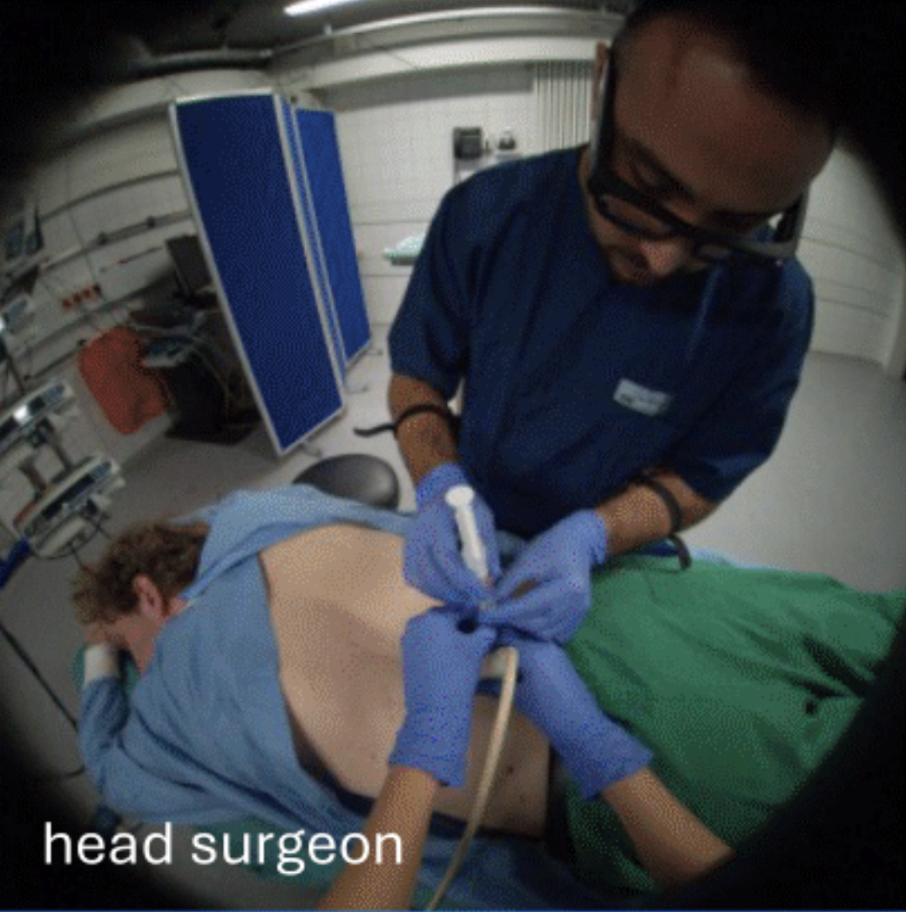
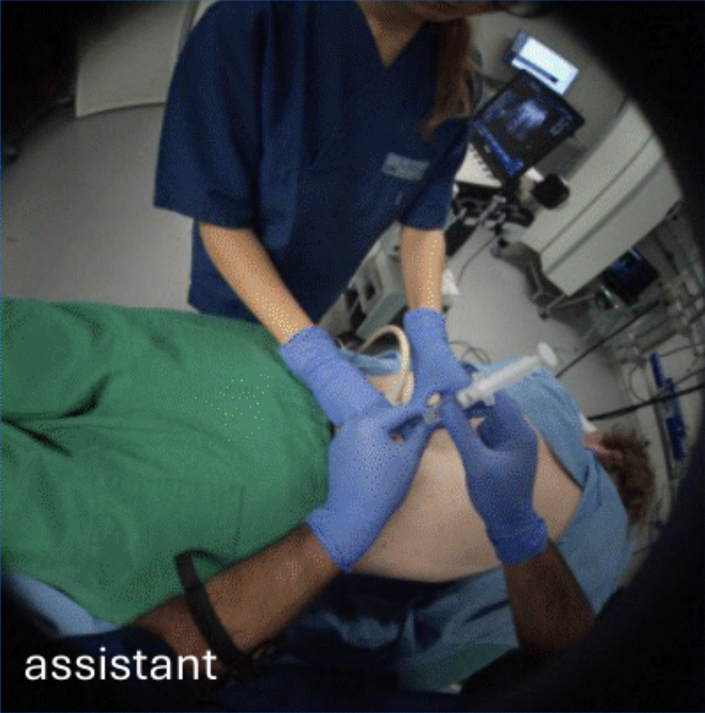

# OR-Action: Multi-Role Video Understanding with Fine-Grained Actions

## 摘要

**论文元信息**：本文题为 *OR-Action: Multi-Role Video Understanding with Fine-Grained Actions*，作者为 Felix Tristram, Ege Özsoy, Christian Benz, Marcel Walch, Ghazal Ghazaei, Nassir Navab，arXiv ID 为 2606.13332，发布时间为 2026-06-11T13:24:40Z，类别为 cs.CV。论文链接为 http://arxiv.org/abs/2606.13332v1，PDF 链接为 https://arxiv.org/pdf/2606.13332v1。报告依据为 PDF 全文与摘要，文本抽取状态为 fulltext:pypdf。

**一句话总结**：OR-Action 将外部手术室视频理解从逐帧场景图关系预测推进到多角色、细粒度、时序动作理解，并表明基于 VJEPA2 特征的视觉时序模型在预测场景图方法之上具有明显优势，尤其适用于密集动作片段构造、多角色动作分类和跨视角蒸馏评估（见 PAGE 1、PAGE 2、PAGE 7、PAGE 8）。

**代码状态**：本文在摘要中说明 benchmark and code “will be released upon acceptance”（见 PAGE 1）。给定材料没有提供 GitHub 或项目主页 URL，已知代码链接为未知；因此本文未提供可确认的公开代码，以下不写源码段，也不伪造文件路径或函数对应关系。

OR-Action 的核心贡献有三项。第一，论文在公开 EgoExOR 数据集之上构建第一个面向外部手术室视频的细粒度动作中心 benchmark，定义多角色动作 taxonomy，并通过 ground-truth scene graph 的状态变化蒸馏出 dense action segments（见 PAGE 1、PAGE 2、PAGE 3）。第二，论文把 scene graph based methods 作为动作识别系统进行原则性评估，发现从 predicted scene graphs 外推到 dense temporal multi-role actions 时性能显著下降（见 PAGE 2、PAGE 7）。第三，论文提出 vision-only temporal model，并在此基础上提出 multi- to single-view feature alignment strategy，用多视角教师特征对齐单视角学生特征，以减轻大规模 egocentric video capture 的需求（见 PAGE 2、PAGE 5、PAGE 6、PAGE 8）。

本文的推荐方向是视频理解。其直接业务价值不在于医学标签本身可以无缝迁移，而在于三类可借鉴设计：其一，利用结构化状态变化自动生成密集动作片段；其二，为多角色场景建立 action taxonomy；其三，用多视角教师到单视角学生的 feature alignment 评估单视角部署上限（见 PAGE 2、PAGE 3、PAGE 5、PAGE 6）。主要风险也很明确：数据场景窄，手术室专业性强，遮挡、隐私、医疗流程标签和通用安防、人车、工业视频任务之间存在显著 domain gap；同时代码尚未释放，当前复现性证据不足（见 PAGE 1、PAGE 2、PAGE 8）。

## 背景与动机

外部手术室理解（external OR understanding）要解决的问题，是在密集、动态且安全关键的手术室环境中识别多名临床人员、患者、工具、设备和显示屏之间的交互关系，并进一步理解这些交互随时间形成的临床活动。论文指出，手术室中多名 clinician 围绕 patient 协同工作，同时与 tools、devices、displays 交互；可靠的外部场景感知可以支持 context-aware safety checks、workflow-aware interfaces、automated documentation 和 training feedback（见 PAGE 1）。

与 intra-body endoscopic 或 laparoscopic video analysis 相比，external OR understanding 的研究成熟度较低。论文将原因归结为 privacy constraints、heavy occlusions、clutter，以及需要 jointly reason about multi-actor interactions over time（见 PAGE 2）。这说明外部手术室视频不仅是普通动作识别问题，还包含多主体协同、遮挡视角变化、医疗流程先验和长尾细粒度动作标签等难点。

既有方法常把手术室建模为 semantic scene graphs，即用 entities 和 relations 表示“谁与什么发生了什么关系”。这类表示具有 interpretable 和 queryable 的优势，适合回答 “who interacts with what” 这一类结构化问题（见 PAGE 2）。但是 scene graph 通常是 per-timepoint relational snapshots；而临床上有意义的活动，例如 tool pick-ups、handovers、equipment positioning、site preparation，本质上是由 temporal ordering、state changes 和 persistence 定义的动作片段（见 PAGE 2）。

因此，论文的动机并不是简单提出一个新分类器，而是指出一个评估缺口：当前 OR scene graph 方法可能在逐帧关系预测上表现尚可，却未必能支持 temporally extended, fine-grained actions。换言之，关系解析准确率和稳健的时序动作识别之间存在 gap。OR-Action 正是为了把这个 gap 变成可测量的 benchmark（见 PAGE 1、PAGE 2、PAGE 7）。

论文还受到 general video understanding 进展的启发，特别是 Ego4D、Ego-Exo4D、Assembly101、EPIC-KITCHENS 等关于 egocentric 或 multi-view procedural activity 的工作。OR-Action 将这些思想引入外部手术室场景：不仅要识别动作类别，还要处理多角色、多视角、细粒度动作段和长尾活动（见 PAGE 2、PAGE 9、PAGE 10）。

## 预备知识

**Scene graph（场景图）** 在本文中是每个 annotated frame 上的一组 relational triplets，即 subject、predicate、object 三元组。例如某角色 looking 某设备、holding 某器械、closeTo 某物体等。论文用这些 per-frame scene graphs 作为 rule-based scene-graph to action mapping 的输入（见 PAGE 3）。

**Temporal action segmentation（时序动作分割）** 与普通 clip-level action classification 不同。它要求模型在连续视频中给出每一帧或每个时间段的动作标签，并且评价动作顺序、边界和类别是否正确。本文使用 Frame Accuracy、Edit Score、Segmental F1@0.1/0.25/0.5 等指标；其中 Edit Score 惩罚动作序列顺序错误和过度/不足分割，Segmental F1 要求类别和边界同时匹配（见 PAGE 7）。

**Multi-role action recognition（多角色动作识别）** 是本文的关键设定。设 $R$ 表示目标角色集合，$R_{in}$ 表示可用输入流集合。每个目标角色 $r \in R$ 在每一帧 $t \in \{1,\ldots,T\}$ 都有一个细粒度动作标签 $y_t^{(r)}$ 和一个二值 activity label $a_t^{(r)}$（见 PAGE 4）。这里 $y_t^{(r)}$ 表示角色 $r$ 在帧 $t$ 的动作类别，$a_t^{(r)}$ 表示该角色是 active 还是 idle。

$$
y_t^{(r)} \in \{1,\ldots,K\}, \quad a_t^{(r)} \in \{0,1\}
$$

这一定义的含义是：模型不能只判断整段视频发生了什么，还要逐帧、逐角色地判断每个人是否活跃以及正在执行哪个动作。本文实验中 $K=78$，即 OR-Action benchmark 包含 78 个动作类（见 PAGE 6）。

## 方法详解

### 1. 从场景图到细粒度动作片段：OR-Action benchmark 构造

OR-Action 的第一项方法贡献是 rule-based scene-graph to action mapping。论文使用 EgoExOR 数据集中已有的 per-frame scene graph annotations，并将其确定性映射为 fine-grained, role-specific action labels，再压缩为 dense temporal segments（见 PAGE 3）。这一过程不是训练模型，而是构造 benchmark 标签。

规则分为两类。第一类是 **State rules（状态规则）**，当某些布尔条件在 triplets 上成立时触发，用来捕捉持续性活动。例如论文给出 `(anaesthetist, looking, health_monitor) => “Anesthetist monitors vitals”` 的例子（见 PAGE 3）。第二类是 **Event rules（事件规则）**，用于检测 pick-up、handover、return 等 change points，并将 anchor frame 前后扩展为短时间动作段（见 PAGE 3）。

这个设计的关键在于：许多动作不是某一帧关系本身，而是关系变化。例如 assistant 第一次满足 `(assistant, holding, scalpel)` 可以作为 scalpel pick-up 的 anchor frame，但真实动作还包含取器械前后的运动线索，因此规则会向过去和未来扩展若干帧（见 PAGE 3）。这种处理把离散 scene graph 状态变化转换为 temporal action segments。

论文还引入 temporal evidence aggregation，包括 “recently” window 和 “ever-before” in the video。以 object handover 为例，系统通过短窗口内 holding(object) 在角色之间的变化检测交接；以 object return 为例，系统在 holding episode 结束时结合 `(subject, closeTo, instrument-table)` 上下文，并要求短暂确认 holding relation 缺失，以抑制标注漏检带来的误触发（见 PAGE 3）。

Fig. 1 用 “Surgeon verifies needle placement” 说明了为什么需要时间启发式。单看 scene graph，这一类活动可能与 “Surgeon scans for target vertebrae” 难以区分；因此论文设置启发式条件：只有在 “recent” needle insertion event 之后，该动作才可触发（见 PAGE 3）。这说明 OR-Action 的标签不是对单帧关系的直接重命名，而是利用时序上下文解释相同关系模式在不同流程阶段的语义差异。

规则系统还有三个工程性约束。其一，规则集是 compositional，后续决策可以引用 earlier outputs。其二，规则按固定顺序执行，冲突通过 priority settings 解决，以保证每个 role 每一帧只有一个 label。其三，frame-wise outputs 会合并成 contiguous segments，并通过吸收 very short segments 到邻近动作的方式进行 light smoothing（见 PAGE 3）。这些约束使 benchmark 更接近 temporal action segmentation 任务，而不是松散的多标签事件检测。

最终，OR-Action 产生 1295 个 action segments、78 个 unique classes、接近 100k active frames 和 230k idle frames。论文还说明这些 classes 由 human observation over the entire dataset 定义，并经人工 refinement 以匹配不同视频中的行为；生成标注也由 human annotators visually verified（见 PAGE 3、PAGE 4）。这提供了 benchmark 的可信度证据，但也意味着 taxonomy 和规则强依赖该手术室数据域。

### 2. Vision-only multi-role framewise action recognition

第二项方法贡献是 vision-only temporal model。它不依赖 predicted scene graphs，而是直接以多路视频流为输入，使用 frozen video foundation model 提取 spatiotemporal tokens。每个输入流 $r \in R_{in}$ 提供一个 clip $x_{1:T}^{(r)}$，其中 $T$ 为帧数；编码器 $E$ 输出 token sequence $z^{(r)}$（见 PAGE 4）。

$$
z^{(r)} = E\left(x_{1:T}^{(r)}\right)
$$

这个公式在说：每个角色或摄像机视角的视频片段先经过同一个冻结视频编码器 $E$，得到该视角的时空 token 表示 $z^{(r)}$。论文采用 VJEPA2 作为 encoder，理由是其对 general motion 和 semantic cues 的表示能力较强（见 PAGE 4）。

由于 foundation model 输出 token sequence 很长，论文使用 attentive Role Pooler 压缩 token。Role Pooler 由 $Q$ 个 learnable query tokens 通过 cross-attention attend 到输入 token set，得到紧凑序列 $u^{(r)}$（见 PAGE 5）。

$$
u^{(r)} = RP_{Q}^{f}\left(z^{(r)}\right)
$$

这个公式在说：每个输入视角的高维长 token 序列被压缩为固定数量的 role-level temporal tokens。论文选择 $Q$ 使每个 role 恰好得到 $T$ 个 token，因此 $u_t^{(r)}$ 可被解释为第 $t$ 帧的 embedding（见 PAGE 5）。

为了建模不同角色和视角之间的交互，论文在每个时间步 $t$ 对所有可用输入流的 embedding $\{u_t^{(r)}\}_{r\in R_{in}}$ 进行 cross-role fusion。具体做法是使用第二个 attentive pooler，即 Role Classifier $RC$，它有 $|R|$ 个 query，每个 query 对应一个 target role，输出 role-conditioned representation $h_t^{(r)}$（见 PAGE 5）。

$$
h_t = RC_{|R|}\left(\{u_t^{(r)}\}_{r\in R_{in}}\right)
$$

$$
h_t = \left[h_t^{(1)}, \ldots, h_t^{(|R|)}\right]
$$

这组公式在说：模型不是简单把多视角特征拼接后分类，而是在每一帧为每个目标角色生成一个条件化表示。这样，一个角色的动作判断可以利用其他视角中可见的工具、手部、设备状态和其他人员动作（见 PAGE 5）。

动作和活动预测使用两个线性头：action head 输出 $K$ 类动作 logits $\ell_t^{(r)}$，activity head 输出 active/idle 的二分类 logits $s_t^{(r)}$（见 PAGE 5）。

$$
\ell_t^{(r)} = W_{act} h_t^{(r)}, \quad s_t^{(r)} = W_{aux} h_t^{(r)}
$$

这个公式在说：同一个 role-conditioned representation 同时服务于细粒度动作分类和 active/idle 判别。论文特别强调使用 separate action and activity heads，是因为 active 和 idle frames 类别极不平衡，idle 占 69%（见 PAGE 5、PAGE 6）。

训练损失是 masked multi-task cross-entropy。$m_t^{(r)}$ 是 mask，用于忽略某些 procedure 中不可用的角色或帧；$CE$ 表示交叉熵损失（见 PAGE 5）。

$$
L_{frame} =
\sum_{r \in R}
\sum_{t=1}^{T}
m_t^{(r)}
\left(
CE(softmax(\ell_t^{(r)}), y_t^{(r)})
+
CE(softmax(s_t^{(r)}), a_t^{(r)})
\right)
$$

这个公式在说：模型对每个角色、每个时间步同时学习动作类别和活动状态，但只在 mask 允许的位置计算损失。这一点对 OR 数据很重要，因为不同 procedure 或视角可能缺少某些角色输入（见 PAGE 5）。

### 3. Multi- to single-view feature alignment

第三项方法贡献是 multi- to single-view feature alignment。其部署动机是：现实手术室中可能只能观察单个 wearable stream 或少量流，但仍希望预测 multi-role actions（见 PAGE 5）。因此论文先训练一个使用所有可用 streams 的 multi-role teacher，然后冻结它，再训练只看固定输入角色 $r_0$ 的 single-view student（见 PAGE 5、PAGE 6）。

教师表示通过对每个输入角色独立 pooling 并拼接得到。论文将其记作 role-major sequence $\mathbf{t}$（见 PAGE 5）。

$$
\mathbf{t} =
\left[
RP_{Q_T}^{T}(z^{(r)})
\right]_{r \in R_{in}}
$$

这个公式在说：教师模型的表示显式包含多个角色或视角的信息，例如其他 staff 的动作、共享工具状态和全局 OR context。这里的上标 $T$ 表示 teacher 侧的 Role Pooler，而不是时间长度 $T$（见 PAGE 5、PAGE 6）。

学生只观察单个输入角色 $r_0$，但产生与 teacher sequence 相同长度的表示 $\mathbf{s}$。论文选择 $Q_S$，使 student sequence 长度匹配 $R_{in}\cdot Q$（见 PAGE 6）。

$$
\mathbf{s} = RP_{Q_S}^{S}(z^{(r_0)})
$$

这个公式在说：虽然 student 只看一个视角，但它被要求输出足够长的 token 序列，用于承载对其他视角上下文的预测性表示。这里的关键不是让 student 生成图像，而是让它在特征空间中接近多视角 teacher（见 PAGE 6）。

对齐损失使用 per-token $\ell_1$ loss，并在比较前对 teacher token 和 student token 做 $\ell_2$ normalization。$\Omega$ 表示对应于 available input streams 的 token 索引集合（见 PAGE 6）。

$$
L_{align} =
\frac{1}{|\Omega|}
\sum_{i\in\Omega}
\left\|
\hat{t}_i - \hat{s}_i
\right\|_1
$$

这个公式在说：student 被鼓励从单视角输入中提取更多 contextual cues，使其 token 表示尽量接近多视角 teacher 的 token 表示。论文的解释是，student 可以利用 dense output $z^{(r_0)}$ 中原本未被 $L_{frame}$ 充分利用的上下文线索（见 PAGE 6）。

最终目标函数把 feature alignment 和 supervised frame loss 结合起来（见 PAGE 6）。

$$
L =
\lambda_{align} L_{align}
+
\lambda_{sup} L_{frame}
$$

这个公式在说：student 不能只模仿 teacher 表示，还必须保持动作预测能力。实现中论文设定 $\lambda_{align}=10.0$、$\lambda_{sup}=0.1$，以大致匹配两个损失项的量级（见 PAGE 6）。

用途：下图展示 Fig. 2 中的 vision-only model 与 cross-view feature alignment strategy。读图要点是，多视角输入先经过 Video Encoder 和 Role Pooler，再通过 Role Classifier 输出各 target role 的动作；单视角分支则通过 Feature Alignment 向多视角 teacher 表示靠拢。它支撑的判断是：本文的方法核心从 predicted scene graph 转向了直接的视频时序表示学习（见 PAGE 4、PAGE 5、PAGE 6）。

图后说明：该图对应论文 Fig. 2 的架构概览，支撑 Sec. 3.1 的多角色帧级动作识别流程，也支撑 Sec. 3.2 中 teacher-student feature alignment 的总体设置（见 PAGE 4）。

用途：下图继续展示 Fig. 2 的结构细节，重点是 single-view setting 中仍然预测 multi-role actions。读图要点是，单视角输入并不只预测自身动作，而是经由 Role Pooler、Role Classifier 和对齐损失尝试恢复多角色上下文。它支撑的判断是：feature alignment 的目标是降低对完整多角色 egocentric capture 的依赖，而不是替代 supervised action loss（见 PAGE 5、PAGE 6、PAGE 8）。

图后说明：该图与公式 (6)、(7)、(8) 的解释一致，即多视角 teacher 表示 $\mathbf{t}$ 与单视角 student 表示 $\mathbf{s}$ 在 token 空间中对齐，同时 student 仍通过 frame-based losses 学习动作和 active/idle 分类（见 PAGE 6）。

材料中还包含 Fig. 1 和 Fig. 3 的文本证据，但未提供对应 markdown_path，因此本文不插入图片。Fig. 1 说明 “Surgeon verifies needle placement” 与 “Surgeon scans for target vertebrae” 在 scene graph 上可能不可区分，需要 recent needle insertion heuristic（见 PAGE 3）。Fig. 3 给出 validation set 上 MISS/3/take/1 的 qualitative example，用于展示 GT、Ours、EgoExOR + rules、EgoExOR + GNN、GT + GNN 的时序预测差异（见 PAGE 6、PAGE 7）。

## 实验分析

实验设置首先固定了输入采样和模型细节。论文以 4 fps 采样 $T=64$ 帧，即每个窗口为 16 秒；Role Pooler 使用 $Q=64$ pooling tokens per role；OR-Action benchmark 包含 $K=78$ 类；由于 idle classes 占 69% frames，因此使用 separate activity and action prediction heads（见 PAGE 6）。这些设置共同说明：任务既有中等长度时序上下文，又有严重 active/idle imbalance。

GNN baseline 的构造也值得注意。论文用 stable embeddings across timepoints 初始化 subject/object nodes，并把相邻帧 $[t-1;t+1]$ 中的 node IDs 连接起来；predicted scene graphs 来自 EgoExOR 的公开 checkpoint（见 PAGE 6、PAGE 7）。这意味着 EgoExOR + GNN 并非完全没有时序建模，但它仍然依赖 predicted scene graph 的质量。

推理阶段，所有 learned models 都以 sliding window 方式运行。activity head 先 gate idle frames，然后 action head 对 active frames 分类；窗口 50% overlap，并通过 Hanning-weighted sum 合并，以减少边界伪影（见 PAGE 7）。这一点使实验更接近连续视频中的 temporal segmentation，而不是独立窗口分类。

### 主要 benchmark 结果：Table 1

| Split | Model | Acc | Edit Score | F1@0.1 | F1@0.25 | F1@0.5 |
|---|---|---:|---:|---:|---:|---:|
| Validation | GT + GNN | 65.19 | 48.33 | 32.08 | 30.42 | 25.42 |
| Validation | EgoExOR + rule mapping | 16.54 | 38.24 | 21.21 | 16.16 | 13.13 |
| Validation | EgoExOR + GNN | 36.29 | 30.01 | 3.56 | 2.43 | 1.13 |
| Validation | Ours (all roles) | 61.65 | 38.24 | 39.90 | 35.47 | 25.12 |
| Test | GT + GNN | 69.54 | 48.63 | 39.34 | 36.53 | 29.98 |
| Test | EgoExOR + rule mapping | 17.37 | 38.28 | 21.59 | 20.45 | 18.18 |
| Test | EgoExOR + GNN | 43.79 | 37.29 | 4.20 | 3.00 | 1.80 |
| Test | Ours (all roles) | 67.50 | 45.47 | 40.64 | 37.88 | 29.10 |

表格解读：Table 1 的指标不包含 idle class（见 PAGE 7）。最强的 scene graph upper bound 是 GT + GNN，因为它训练和评估都使用 ground-truth scene graphs；它在 test 上达到 69.54 Acc 和 48.63 Edit Score（见 PAGE 7）。但是在实际预测设定中，EgoExOR + GNN 的 F1 极低，test F1@0.5 只有 1.80，说明 predicted scene graphs 即使经过 GNN，也难以产生边界稳定、类别一致的 temporal segments（见 PAGE 7）。Ours (all roles) 在 test 上 Acc 为 67.50，接近 GT + GNN 的 69.54；F1@0.1 和 F1@0.25 分别为 40.64 和 37.88，超过 GT + GNN 的 39.34 和 36.53；F1@0.5 为 29.10，略低于 GT + GNN 的 29.98（见 PAGE 7）。这支持论文主张：直接视频时序模型可以接近甚至部分超过 ground-truth scene graph upper bound 的 segment-level 表现，同时显著优于 predicted scene graph pipeline。

从 Table 1 可以看出一个关键现象：EgoExOR + rule mapping 的 Edit Score 并不低，test 为 38.28，但 Acc 只有 17.37。这说明规则映射可能在动作顺序层面保留了某些结构，但具体帧级类别匹配很差（见 PAGE 7）。相反，EgoExOR + GNN 的 Acc 达到 43.79，却 F1 极低，说明它可能在局部帧上预测到某些正确类别，但无法形成连贯 segment。论文把这种现象概括为 temporal jitter，并用 Fig. 3 的 qualitative example 支撑（见 PAGE 7）。

视觉模型的优势来自两个方面。第一，它显式使用 16 秒窗口内的视频时序信息，而不是先把视频压缩成逐帧关系再推断动作。第二，它利用 VJEPA2 的 motion 和 semantic cues 表示能力，可以捕捉 brief actions，例如 Fig. 3 中提到的 scissor handover（见 PAGE 4、PAGE 8）。这类短动作对 scene graph pipeline 特别困难，因为任何局部关系预测错误都会放大到事件边界错误。

### 视角、activity head 与 feature alignment 消融：Table 2

| Input Roles | Acc(w/idle) | Acc | Edit | F1@0.1 | F1@0.25 | F1@0.5 |
|---|---:|---:|---:|---:|---:|---:|
| all roles (ego) | 62.13 | 67.50 | 45.47 | 40.64 | 37.88 | 29.10 |
| all roles (no activity head) | 11.33 | 38.57 | 17.67 | 24.92 | 19.27 | 10.63 |
| only exo views | 50.05 | 44.94 | 30.99 | 26.60 | 23.50 | 13.30 |
| Surgeon | 57.44 | 57.81 | 30.82 | 32.46 | 27.70 | 16.88 |
| Surgeon (align) | 62.11 | 58.16 | 42.93 | 31.29 | 26.64 | 19.45 |
| Assistant | 60.39 | 64.79 | 40.14 | 38.84 | 36.16 | 24.11 |
| Assistant (align) | 67.89 | 64.90 | 44.84 | 41.03 | 36.36 | 26.10 |
| Circulator | 36.02 | 40.28 | 24.12 | 22.58 | 17.74 | 9.68 |
| Circulator (align) | 35.49 | 38.31 | 30.61 | 23.53 | 15.68 | 8.62 |

表格解读：Table 2 是 test-set ablation（见 PAGE 8）。最重要的结论有三点。第一，activity head 非常关键；移除 activity head 后 Acc(w/idle) 从 62.13 降到 11.33，Edit 从 45.47 降到 17.67，说明在 idle 占 69% 的条件下，单一 prediction head 无法稳定处理 active/idle imbalance（见 PAGE 6、PAGE 8）。第二，仅使用 exocentric views 明显弱于 all roles ego；only exo views 的 Acc 为 44.94，F1@0.5 为 13.30，而 all roles ego 分别为 67.50 和 29.10。这支持论文判断：固定、远距离、易遮挡的 exocentric cameras 难以捕捉 fine movements 和 small instruments（见 PAGE 8）。第三，feature alignment 的收益依赖单视角本身是否包含可观察上下文；Assistant 和 Surgeon 受益较大，Circulator 受益有限甚至部分下降（见 PAGE 8）。

对于 Surgeon 视角，alignment 将 Acc(w/idle) 从 57.44 提升到 62.11，Edit 从 30.82 提升到 42.93，F1@0.5 从 16.88 提升到 19.45，但 F1@0.1 和 F1@0.25 小幅下降（见 PAGE 8）。这说明对 Surgeon 来说，alignment 主要改善 idle/active state awareness 和动作顺序，而对宽松边界下的 segment recall/precision 未必全面提升。论文也将 Edit Score 的提升解释为 superior action ordering（见 PAGE 8）。

对于 Assistant 视角，alignment 的收益更全面。Acc(w/idle) 从 60.39 升至 67.89，Edit 从 40.14 升至 44.84，F1@0.1 从 38.84 升至 41.03，F1@0.5 从 24.11 升至 26.10（见 PAGE 8）。这说明 Assistant 视角中包含足够多与其他角色和器械相关的上下文，student 可以通过对齐 teacher 表示学习到更全局的 OR state。

对于 Circulator 视角，alignment 并不稳定。虽然 Edit 从 24.12 升至 30.61，但 Acc(w/idle)、Acc、F1@0.25、F1@0.5 均下降（见 PAGE 8）。论文解释是 Circulator 多数时间 inactive，且常从较远位置观察 procedure，因此单视角输入中缺乏可用于恢复其他角色动作的 cues；feature alignment 不能凭空补足不可见信息（见 PAGE 8）。

### 定性结果与可解释性

Fig. 3 展示 validation set 上 MISS/3/take/1 的 qualitative example，比较 GT、Ours (all roles)、Ours (Assistant)、EgoExOR + rules、EgoExOR + GNN 和 GT + GNN 的动作序列（见 PAGE 6）。虽然本材料未提供 Fig. 3 的 markdown_path，不能插入图片，但论文正文说明 EgoExOR + GNN 表现出 temporal jitter，而 vision-only model 能捕捉 scissor handover 等 brief actions（见 PAGE 7、PAGE 8）。

该定性结果与 Table 1 相互印证。低 F1 不只是数字问题，而是 segment 预测边界和动作连续性失败；高 Acc 也不保证 temporal coherence。对于视频理解任务，尤其是手术室流程理解，动作顺序和边界比孤立帧分类更接近业务需求。

## 讨论

OR-Action 的方法价值首先体现在 benchmark 设计。论文没有等待昂贵的逐帧动作人工标注，而是从已有 ground-truth scene graph state changes 中蒸馏 dense action segments。这为其他结构化视频数据集提供了可借鉴路线：如果已有对象关系、状态或事件日志，可以通过规则和时间启发式构造动作片段监督信号（见 PAGE 2、PAGE 3）。

第二个价值在于多角色建模。传统动作识别常默认一个主体或一个全局标签，而 OR-Action 强制模型对多个 target roles 同时输出 per-frame action 和 activity labels（见 PAGE 4、PAGE 5）。这对通用业务场景也有启发，例如工业多人协作、厨房流程、仓储作业、交通执法或安防视频；但能否迁移取决于角色定义、动作 taxonomy 和视角覆盖是否可重建。

第三个价值在于 cross-view feature alignment。论文没有把多视角部署作为必需条件，而是训练 multi-view teacher，再把其 representation 对齐到 single-view student（见 PAGE 5、PAGE 6）。这种策略适合现实中采集成本高、隐私敏感或多摄像头覆盖不稳定的场景。它的边界也很清楚：如果单视角本身看不到关键上下文，如 Circulator 视角，alignment 无法产生稳定收益（见 PAGE 8）。

对视频理解研究而言，本文的一个重要结论是：scene graph 是有解释性的中间表示，但它不是免费获得时序动作理解的充分条件。GT + GNN 的结果说明 ground-truth scene graphs 可以支持 temporal actions；EgoExOR + GNN 的结果说明 predicted scene graphs 的误差和弱 temporal modeling 会导致 segment-level collapse（见 PAGE 7）。因此，结构化表示与端到端视频特征并不是简单替代关系，未来更可能需要结合二者：用视频模型提供稳健时序特征，用结构化表示提供可解释约束。

对业务应用而言，本文更适合作为方法参考，而不是直接模型迁移方案。可借鉴的是 dense action segment construction、多角色 action taxonomy、activity/action split heads、single-view distillation 评估方案；不应直接假定 OR 标签、器械状态、clinical workflow 和通用安防或工业视频具有一致语义。推荐理由是其与视频动作理解和时序建模直接相关；风险是 OR 场景专业性强，迁移不确定（见 PAGE 1、PAGE 2、PAGE 8）。

## 局限分析

第一类局限来自论文作者自述的场景难度。外部手术室存在 privacy constraints、heavy occlusions、clutter、limited sensing 和 multi-actor temporal reasoning 等问题（见 PAGE 1、PAGE 2）。即便使用 vision-only model，论文也承认 visually similar actions 仍然困难，例如 surgeon positions microscope view 与 surgeon checks procedure 很难仅凭视觉区分（见 PAGE 8）。这说明模型的错误并不只来自架构不足，也来自任务本身的可观测性边界。

第二类局限来自视角覆盖。Table 2 表明 only exo views 与 all roles ego 存在明显差距，原因是 exocentric cameras 固定、距离 active regions 较远，且常被 staff 或 equipment 遮挡（见 PAGE 8）。同样，Circulator 单视角由于角色多数 inactive、观察距离较远，feature alignment 无法稳定提升性能（见 PAGE 8）。因此，本文提出的 single-view alignment 不是通用补全机制，而是依赖输入视角中存在可挖掘的上下文线索。

第三类局限是 benchmark 标签构造依赖启发式规则。OR-Action 的 dense segments 由 ground-truth scene graph state changes 通过 rule-based mapper 生成，再经过 fixed order、priority settings、segment merging 和 smoothing（见 PAGE 3）。虽然论文说明生成 annotations 经 human annotators visually verified（见 PAGE 4），但 segment boundary 和 action semantics 仍可能继承规则设计偏差。特别是 Fig. 1 这类依赖 “recent” needle insertion 的规则，说明同一 scene graph pattern 的语义需要流程上下文解释（见 PAGE 3）。

第四类局限是复现性证据不足。论文摘要说明 benchmark and code will be released upon acceptance，但当前材料未提供可确认的公开仓库链接（见 PAGE 1）。因此，无法检查数据生成脚本、规则实现、模型训练配置、feature alignment token 对齐细节和评估实现。本文未提供可确认的公开代码，不写源码段；这也限制了对方法细节的独立验证。

第五类局限是跨域迁移不确定。OR-Action 基于 EgoExOR，动作 taxonomy 由 human observation over the entire dataset 定义并人工 refine（见 PAGE 3、PAGE 4）。这对手术室内部 benchmark 是合理的，但对通用安防、人车、工业视频或其他医疗流程，角色、工具、动作边界和可观察视角均可能不同。因此，业务使用时应把本文视为构造多角色时序 benchmark 的范式，而不是直接可部署模型。

## 结论

OR-Action 的核心贡献是把外部手术室理解从 frame-wise scene graph prediction 推进到 action-centric temporal benchmark。论文通过 rule-based scene-graph to action mapping 构造 78 类、1295 段、多角色细粒度动作标签，并用该 benchmark 证明 predicted scene graph pipelines 在 temporal action segmentation 上存在明显不足（见 PAGE 2、PAGE 3、PAGE 7）。

方法上，论文提出基于 frozen VJEPA2、Role Pooler、Role Classifier、split action/activity heads 的 vision-only temporal model，并进一步提出 multi- to single-view feature alignment。实验表明，Ours (all roles) 在 test 上达到 67.50 Acc、45.47 Edit、40.64 F1@0.1、37.88 F1@0.25、29.10 F1@0.5，显著优于 predicted scene graph baselines，并接近 GT + GNN upper bound（见 PAGE 7）。feature alignment 对 Surgeon 和 Assistant 等信息丰富视角有效，但对 Circulator 这类上下文不足视角收益有限（见 PAGE 8）。

综合来看，本文对视频理解研究的意义在于：它用一个高遮挡、多角色、细粒度、强时序的 OR 场景检验了 scene graph 与视觉时序模型的能力边界。对应用侧而言，最值得迁移的不是医学动作类别，而是 dense action segments 构造、多角色 taxonomy、activity/action 解耦和多视角到单视角蒸馏的评估框架。

## 证据索引

- PAGE 1：论文标题、作者、摘要、外部 OR 理解问题、scene graph 到 temporal actions 的挑战、vision-only model 和 feature alignment 的摘要性贡献、benchmark/code 将在接收后释放。
- PAGE 2：研究动机、external OR understanding 的隐私/遮挡/多主体时序难点、scene graph 表示的优势与局限、OR-Action benchmark 的 78 类和 1295 segments、三项贡献。
- PAGE 3：Rule-Based Scene-Graph to Action Mapping；state rules、event rules、temporal evidence aggregation、handover/return 检测、priority settings、segment merging、Fig. 1 的 needle placement heuristic。
- PAGE 4：OR-Action 生成标注的人工验证、复用 EgoExOR split、Sec. 3 方法开头、Fig. 2 架构、target roles $R$、input streams $R_{in}$、标签 $y_t^{(r)}$ 和 $a_t^{(r)}$、公式 (1)。
- PAGE 5：Token Compression、Role Pooler、公式 (2)、Framewise cross-role fusion、Role Classifier、公式 (3)、action/activity heads、公式 (4)、masked multi-task loss 公式 (5)、multi-view teacher 表示公式 (6)。
- PAGE 6：Single-view student、alignment loss 公式 (7)、joint objective 公式 (8)、实现细节：$T=64$、4 fps、16s windows、$Q=64$、$\lambda_{align}=10.0$、$\lambda_{sup}=0.1$、$K=78$、idle 占 69%、Fig. 3 qualitative example。
- PAGE 7：Table 1 benchmark results；metrics 定义；EgoExOR + rule mapping、EgoExOR + GNN、GT + GNN、Ours (all roles) 的 validation/test 结果；predicted scene graph pipeline 的 temporal jitter 讨论。
- PAGE 8：Table 2 ablations；activity head、exo views、Surgeon/Assistant/Circulator single-view alignment 结果；vision-only model 对 brief actions 的优势；visually similar actions 的局限。
- PAGE 9：Conclusion；OR-Action 是第一个 multi-role OR benchmark for temporal action understanding；scene graph prediction models 难以表示 temporal actions；vision-only model 和 multi-to-single-view alignment 的总结。
- PAGE 10：References continuation；EgoExOR、4D-OR、MM-OR、MVOR、Assembly101 等相关工作出处。
