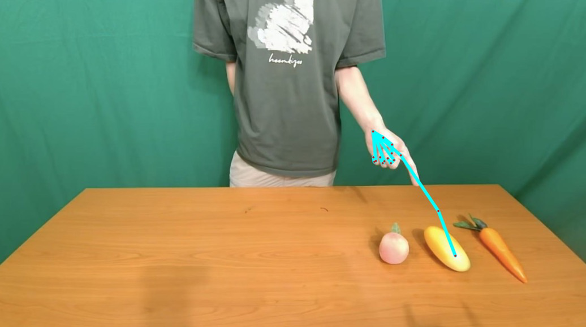
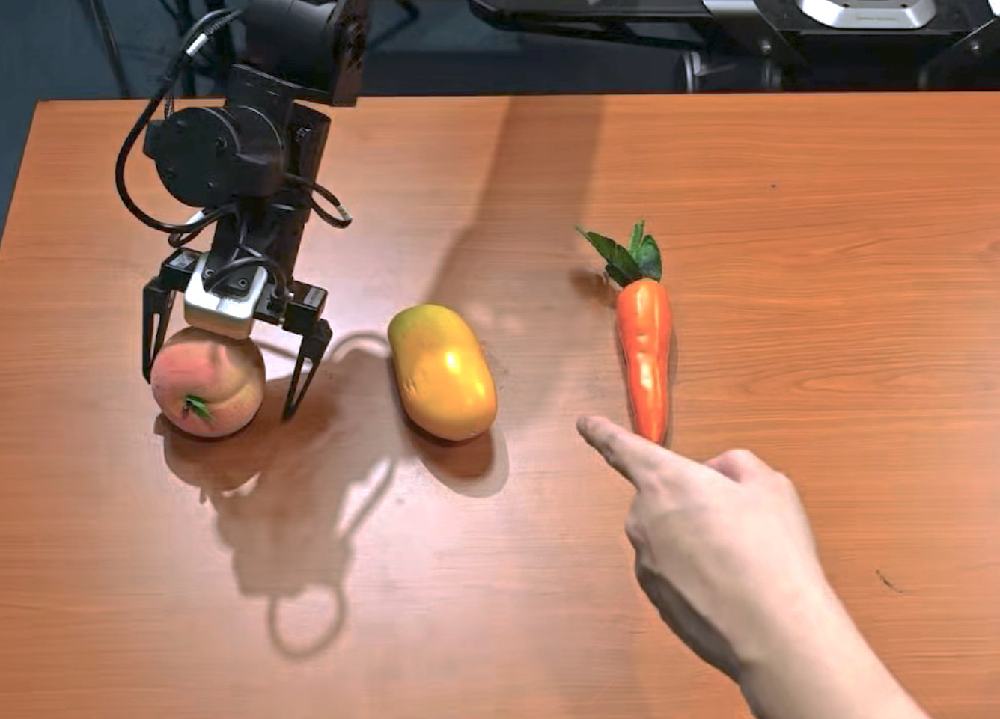

# GIVE: Grounding Human Gestures in Vision-Language-Action Models

## 摘要

| 项目 | 内容 |
|---|---|
| 标题 | GIVE: Grounding Human Gestures in Vision-Language-Action Models |
| 作者 | Pengfei Liu, Gen Li, Junqiao Fan, Boyu Ma, Jindou Jia, Yang Xiao, Jianfei Yang |
| arXiv | 2606.13435v1 |
| 链接 | http://arxiv.org/abs/2606.13435v1 |
| 任务类型 | 人机交互中的机器人 VLA 操作，重点是手势意图 grounding |
| 代码状态 | 本文未提供可确认的公开代码；PAGE 1 仅给出 project site，题面“已知代码链接”为未知 |

一句话总结：GIVE 通过视觉手势提示（Visual Gesture Prompting）和语义意图解析（Semantic Intent Parsing）两条路径，把人类手势转化为 VLA 模型可利用的视觉与文本条件，在不改动策略架构的前提下提升机器人对目标对象和交互阶段的理解能力。

本文研究的核心问题是：当人类用“指一下”“张开手掌”等非语言行为表达意图时，现有 Vision-Language-Action Models（视觉-语言-动作模型，VLA）是否能够可靠理解这些意图并执行正确操作。论文指出，当前 VLA 多把机器人操作建模为纯文本驱动任务，而自然人机交互（Human-Robot Interaction, HRI）通常由语言和非语言线索共同构成；当语言指令含糊或未充分指定目标时，只依赖文本会导致目标 grounding 错误和操作失败（见 PAGE 1）。

GIVE 的贡献不在于提出新的 VLA 主干网络，而在于提出一种可插入预训练 VLA 的手势增强机制。视觉路径将手部骨架和指尖射线渲染到机器人全局观察图像上，用于显式目标定位；语义路径调用预训练 VLM 生成手势与任务描述，用于判断交互阶段，例如等待、抓取或递交（见 PAGE 2、PAGE 4、PAGE 5）。实验在 Galaxea R1-Lite 双臂机器人上进行，使用 270 条真实世界示范数据微调 $\pi0.5$，最终在整体目标识别率上从 46.7% 提升到 86.7%，在最终 handover 成功率上从 0.0% 提升到 80.0%（见 PAGE 6、PAGE 7）。

## 背景与动机

机器人在人机交互中需要理解人的意图，而意图通常不是单一文本指令能够完全表达的。论文开篇强调，人类面对面交流中，语言常与手势、姿态、凝视等非语言线索共同出现；其中手势尤其直接，因为它能在物理空间中指向目标对象或表达交互状态。例如，指向动作可以指定目标物体，开放手掌可以表示接收物体的 handover 请求（见 PAGE 1）。

VLA 模型近年来成为机器人控制的重要范式：它们将视觉观察和语言指令映射到低层动作，例如末端执行器位姿和夹爪控制。论文列举 RT-2、Open X-Embodiment、OpenVLA、$\pi0.5$ 等相关工作，说明 VLA 已具备较强的视觉-语言-动作映射能力，但这些模型主要面向静态、指令驱动任务，而非动态人机协作任务（见 PAGE 2、PAGE 3）。

本文的动机来自一个结构性缺口：自然 HRI 是多模态的，但 VLA 的任务条件往往仍是文本中心的。论文引用社会科学与认知语言学观点指出，面对面交流中大量意义来自非语言通道，且语音和手势共同反映底层意图表征（见 PAGE 1）。因此，当指令只是“把那个给我”或“协作抓取并递交物体”时，如果没有手势信息，机器人很难判断“那个”具体是什么，也难以判断何时应该等待、何时应该交付。

已有手势意图 grounding 方法大致分为两类。第一类是视觉提示或几何提示方法，依赖手部关键点、指向射线、分割或目标 mask 来建立空间对应关系，但往往缺少任务阶段语义理解。第二类是基于 LLM/VLM 的文本推理方法，能够描述动作意图，却不擅长精确建立手势和物理对象之间的空间锚定（见 PAGE 3）。GIVE 的出发点正是把两者结合：视觉路径解决对象级 spatial grounding，语义路径解决阶段级 intent understanding。

用途：下图用于展示论文 Fig. 1 对“普通 VLA”和 GIVE 的对比。  
读图要点：左侧强调一般 VLA 在模糊指令下可能抓错对象或过早 handover；右侧展示 GIVE 同时加入视觉手势提示和语义任务描述。  
支撑的判断：GIVE 的核心不是替换 VLA，而是在输入层补足手势 grounding 信息（见 PAGE 2）。

该图支持论文的主要问题定义：一般 VLA 缺少对人类手势的显式建模，因此在目标选择与阶段转换上不稳定；GIVE 则通过视觉和语义两类增强输入，使策略能够把“指向目标”和“开放手掌等待接收”区分开来（见 PAGE 2）。

## 预备知识

本文中的 Vision-Language-Action Model（视觉-语言-动作模型，VLA）指直接从视觉观察和语言指令生成机器人动作的策略模型。论文中的策略记为 $\pi_\theta$，其中 $\theta$ 表示策略参数。每个时间步 $t$，系统接收多视角视觉观察：

$$
O_t = \{o_t^{global}, o_t^{wrist}\}
$$

这里 $O_t$ 表示时间步 $t$ 的观察集合，$o_t^{global}$ 是头部或全局相机观察，$o_t^{wrist}$ 是腕部相机观察。该公式说明 GIVE 的视觉输入并非单一视角，而是包含第三人称全局视角和腕部自视角（见 PAGE 3）。

策略形式写作：

$$
\pi_\theta(a_t \mid O_t, l_t)
$$

其中 $l_t$ 表示语言指令，$a_t$ 表示动作。通俗地说，该公式表示策略根据当前视觉观察和语言条件，预测机器人下一步或一段动作（见 PAGE 3）。

动作空间定义为：

$$
a_t \in A
$$

论文说明动作 $a_t$ 由连续 6-DoF 末端执行器位姿和 1-D 夹爪命令组成。因此 GIVE 不是只做识别或检测，而是服务于真实机器人连续控制（见 PAGE 3）。

另一个关键概念是 grounding。这里的 grounding 不是一般意义上的语义分类，而是把人的手势、文本指令、图像中的对象和机器人动作连接起来。本文至少涉及两类 grounding：目标对象 grounding，即“手指指向哪个物体”；交互阶段 grounding，即“当前应该抓取、等待，还是递交物体”（见 PAGE 3、PAGE 5）。

## 方法详解

### 1. 总体框架：双路径手势引导

GIVE 的总体方法是把人类手势转换成两类 VLA 可消费的条件：视觉输入 $\mathcal{V}$ 和语义输入 $\mathcal{S}$。视觉输入来自手部关键点和指尖射线的图像叠加，语义输入来自 VLM 对手势与任务阶段的文本描述。二者共同构成对人类意图的补充信息，再交给 VLA 策略生成动作（见 PAGE 3、PAGE 4）。

论文强调该方法 “without architectural modifications”，即不改变原始策略网络结构，而是在输入层完成增强。这一点是 GIVE 的工程价值所在：对于已有预训练 VLA，手势信息不需要通过新增可学习模块强行注入 token 空间，而是以更接近原始图像和文本的形式进入模型（见 PAGE 1、PAGE 2、PAGE 5）。

用途：下图用于说明论文 Fig. 2 的 GIVE 流程。  
读图要点：图中从真实 HRI 场景出发，经手部姿态估计、视觉手势提示、语义意图解析，最终进入 VLA policy $\pi_\theta$ 生成动作。  
支撑的判断：GIVE 把空间目标定位和语义阶段判断拆成互补路径，而不是用单一路径解决所有问题（见 PAGE 4）。

该图支持一个重要方法论判断：视觉路径负责“对象在哪里”，语义路径负责“现在该做什么”。这与论文在 PAGE 2 和 PAGE 3 的相关工作分析一致，即纯视觉几何方法缺少阶段语义，纯文本推理方法缺少空间锚定。

### 2. Visual Gesture Prompting：把手势画进观察图像

Visual Gesture Prompting（视觉手势提示，VGP）的目标是让 VLA 在原始视觉观察中直接看到手势信息。论文使用手部姿态估计器提取关节点 keypoints，并将手部骨架渲染回全局图像。对于 pointing gesture（指向手势），GIVE 进一步构造指尖方向射线，使指向方向延伸到工作空间中（见 PAGE 4）。

这一设计针对的是 VLA 的空间歧义。只看手部骨架时，模型必须自行从局部手指姿态推断远处目标；当多个候选物体相近时，这种推断不稳定。指尖射线把局部方向延展成图像平面上的显式几何线索，从而降低模型对隐式空间推理的依赖（见 PAGE 4、PAGE 12）。

论文给出指尖射线的两个公式。设 $p_{base}$、$p_{mid}$、$p_{top}$ 分别表示食指的根部、中间和指尖关键点，$K$ 是延展因子。扩展后的中间点为：

$$
p'_{mid} = K(p_{mid} - p_{base}) + p_{base}
$$

这个公式表示从食指根部到中间关节的方向被放大 $K$ 倍，用来形成更长的方向向量（见 PAGE 4）。

扩展后的指尖点为：

$$
p'_{top} = K(p_{top} - p_{mid}) + p'_{mid}
$$

这个公式表示继续沿中间关节到指尖的方向延展，从而得到图像平面上的连续 pointing ray。直观解释是：GIVE 不要求模型从短小的手指骨架中自己“想象”射线，而是直接把射线渲染出来（见 PAGE 4）。

### 3. 为什么不直接拼接关键点 token

论文明确比较了视觉叠加与 token 注入。传统想法可能是把 2D keypoints 编码成 latent token，再拼接进 VLM 或 action head。GIVE 选择更保守的方式：把骨架和射线投影回 2D 图像，并作为视觉 overlay 进入原有观察图像（见 PAGE 4）。

理由有三点。第一，visual overlay 保留原始视觉结构，模型仍在熟悉的图像空间中处理信息。第二，它避免改变预训练 VLA 的 token 空间，减少跨模态对齐负担。第三，论文的消融结果显示 token injection 容易破坏几何精度和下游操作能力；尤其 action head injection 的 Identify SR 与 Grasp SR 都较差（见 PAGE 6、PAGE 7）。

这里的判断有明确实验支撑。Figure 4 和 Table 2 显示，Visual Overlay 在手势关键点集成策略中优于 VLM Injection 和 Action Head Injection；VGP keypoints + ray 也明显优于 keypoints only（见 PAGE 6、PAGE 7）。

### 4. Semantic Intent Parsing：把手势翻译成任务阶段语义

视觉提示能够解决目标对象 grounding，但并不能充分告诉机器人当前应该等待还是递交。论文给出的例子是：如果人类尚未打开手掌准备接收，机器人过早 handover 会导致不安全或失败交互（见 PAGE 4）。因此 GIVE 增加语义意图解析路径。

Semantic Intent Parsing（语义意图解析，SIP）使用预训练 VLM 从全局视角解释当前手势与场景，并输出结构化语义元组：

$$
S = \langle T_{ges}, T_{task} \rangle
$$

其中 $T_{ges}$ 是 human gesture description，即对人类手势的描述；$T_{task}$ 是 task instruction，即机器人执行建议。这个公式的含义是，GIVE 把手势语义拆成“人做了什么”和“机器人应做什么”两个文本字段（见 PAGE 5）。

论文还设计了 stable-state triggering mechanism（稳定状态触发机制）。系统监测人的手部姿态，只有当预测手势稳定保持 1.0 秒时才调用 VLM，并且每个任务阶段开始时只查询一次；生成结果会缓存并在当前阶段复用（见 PAGE 5）。这能避免频繁 VLM 调用打断连续控制。

### 5. Object-agnostic 语义设计

GIVE 的语义路径被有意设计为 object-agnostic，即语义描述使用 “target object” 而不是具体物体名称。论文给出的原因是：VLM 可能幻觉或误分类物体类别；当场景中有多个外观相似物体时，具体物体名也无法消除空间歧义（见 PAGE 5）。

这是一处关键设计取舍。语义路径并不承担精确目标定位，而是负责阶段语义；目标定位交给视觉路径中的骨架和射线。这种分工避免了 VLM 同时承担“识别手势、识别物体、解析空间关系、生成操作建议”的全部责任（见 PAGE 5、PAGE 7）。

Appendix A.2 进一步给出 VLM prompt 模板，其中输出字段包括 Human Gesture Description、Interactive Target 和 Robotic Arm Execution Suggestion（见 PAGE 11）。但主方法在 PAGE 5 强调，实际管线中会抽象掉对象身份，使语义路径保持 object-agnostic。

### 6. Action Generation：与 $\pi0.5$ 策略结合

在动作生成阶段，GIVE 把语义元组 $S$ 追加到文本指令中，把几何提示 $V$ 叠加到全局视觉观察上。随后，VLM backbone 处理这些输入并产生复合多模态表示 $Z$。这里 $Z$ 表示融合后的视觉、语言和手势意图特征（见 PAGE 5）。

论文使用 Flow Matching 目标训练连续动作生成。损失函数为：

$$
L_{flow} =
\mathbb{E}_{\tau,\epsilon,a}
\left[
\left\|v_\theta(a_\tau,\tau,Z)-(a-\epsilon)\right\|_2^2
\right]
$$

其中 $L_{flow}$ 是 flow matching 损失，$v_\theta$ 是速度场预测函数，$a$ 是真实 6-DoF 动作与夹爪状态，$\epsilon$ 是高斯噪声，$\tau$ 是时间插值变量。通俗解释是：策略学习在噪声动作和真实动作之间预测正确的“运动方向”，并用融合表示 $Z$ 作为条件（见 PAGE 5）。

论文进一步定义：

$$
\epsilon \sim \mathcal{N}(0,I), \quad \tau \sim U[0,1]
$$

这里 $\epsilon$ 来自标准高斯分布，$\tau$ 来自 $[0,1]$ 均匀分布。该定义说明训练时会随机采样噪声和插值时间点，用于构造 flow matching 的学习目标（见 PAGE 5）。

插值状态定义为：

$$
a_\tau = (1-\tau)\epsilon + \tau a
$$

这个公式表示 $a_\tau$ 是从噪声 $\epsilon$ 到真实动作 $a$ 的线性插值点。换言之，模型不是直接一次性回归动作，而是在条件表示 $Z$ 指导下学习从噪声分布到动作分布的速度场（见 PAGE 5）。

### 7. 数据构建与阶段化处理

Appendix A.3 说明，训练数据来自 Galaxea R1-Lite 机器人的遥操作示范，每个完整 HRI episode 被结构化为两个连续数据段：Phase 1（Pointing & Picking）和 Phase 2（Response & Handover）（见 PAGE 12）。这与主实验部分的两阶段设置一致（见 PAGE 5、PAGE 6）。

视觉路径的数据处理是在每一帧全局观察上显式渲染手部骨架和指尖射线；语义路径则为每个阶段分别分配文本指令。例如 Phase 1 可对应 “pick up the target object and wait”，Phase 2 可对应 “handover the object to the human”。这些 prompt 遵循 object-agnostic 原则，不包含具体物体名（见 PAGE 12）。

这个阶段化处理很重要，因为 GIVE 要解决的不只是“指哪个物体”，还包括“何时切换动作阶段”。如果训练数据不把阶段语义拆开，策略可能学到的是静态抓取或静态递交，而不是动态人机协作过程中的状态转换（见 PAGE 5、PAGE 12）。

### 8. 代码状态与可复现性边界

本文未提供可确认的公开代码。PAGE 1 给出项目站点链接，但题面材料未提供 GitHub 或其他代码仓库链接；全文也未列出源码路径、函数名或配置文件。因此本文不能给出源码段，也不能建立“论文 component 对应具体文件/函数”的代码级映射。

可复现性方面，论文提供了关键实现细节：基础策略为预训练 $\pi0.5$，全参数微调用于适配动态 HRI，训练数据为 270 条真实世界示范，优化器为 AdamW，学习率为 $1 \times 10^{-8}$，global batch size 为 64，训练约 26 小时，硬件为 4 张 NVIDIA A800 GPU（见 PAGE 6）。这些信息足以理解实验规模，但不足以复现实验流水线中的具体实现。

## 实验分析

### 实验设置

论文实验围绕四个问题展开：视觉与语义路径各自如何贡献性能；视觉提示如何解决纯语义推理难以解决的空间歧义；方法在未见空间布局下是否稳健；方法能否泛化到不同人体形态和穿着的未见参与者（见 PAGE 5）。

实验任务是两阶段 HRI。Phase 1 是 Pointing & Picking：人用指向手势在多个物体中指定目标，机器人需要识别目标并完成抓取。Phase 2 是 Response & Handover：机器人抓取成功后保持静止，等待人把手移动并切换为 open palm 手势，然后将物体递交到手掌上方并释放（见 PAGE 5）。

用途：下图用于说明论文 Fig. 3 的两阶段真实任务。  
读图要点：图中展示 P1-Identify、P1-Grasp、P2-React、P2-Handover 的顺序关系。  
支撑的判断：GIVE 的评估不是单步识别，而是把目标识别、抓取、反应和递交串成连续 HRI 流程（见 PAGE 5）。

该图支持实验指标的设计。论文用 Identify SR、Grasp SR、React SR、Handover SR 四个成功率评价不同阶段，其中 Identify/Grasp 反映目标 grounding 和操作能力，React/Handover 反映手势状态转换与人机协作执行能力（见 PAGE 6）。

### 主要结果：GIVE 相对 $\pi0.5$ 的整体提升

| Method | Setting | Identify SR | Grasp SR | React SR | Handover SR |
|---|---:|---:|---:|---:|---:|
| $\pi0.5$ | Setting 1 | 6/15 (40.0%) | 2/15 (13.3%) | 1/15 (6.7%) | 0/15 (0.0%) |
| $\pi0.5$ | Setting 2 | 8/15 (53.3%) | 0/15 (0.0%) | 0/15 (0.0%) | 0/15 (0.0%) |
| $\pi0.5$ | Overall | 14/30 (46.7%) | 2/30 (6.7%) | 1/30 (3.3%) | 0/30 (0.0%) |
| GIVE | Setting 1 | 12/15 (80.0%) | 11/15 (73.3%) | 11/15 (73.3%) | 11/15 (73.3%) |
| GIVE | Setting 2 | 14/15 (93.3%) | 13/15 (86.7%) | 13/15 (86.7%) | 13/15 (86.7%) |
| GIVE | Overall | 26/30 (86.7%) | 24/30 (80.0%) | 24/30 (80.0%) | 24/30 (80.0%) |

表格解读：该表来自论文 Table 1（见 PAGE 7）。最关键的变化是，GIVE 不仅把 Identify SR 从 46.7% 提高到 86.7%，还把后续 Grasp、React、Handover 全部稳定到 80.0%。这说明 GIVE 的收益不是单点识别准确率提升，而是沿整个连续任务链传播：目标识别更准，抓取更稳，阶段反应和递交也随之成功。需要注意，论文摘要中称“target object recognition accuracy by 40%”和“task success rate by 80%”，结合 Table 1 更准确地说是提升 40.0 和 80.0 个百分点（见 PAGE 1、PAGE 7）。

### 消融实验：视觉和语义路径的互补性

| Method | Identify SR | Grasp SR | React SR | Handover SR |
|---|---:|---:|---:|---:|
| $\pi0.5$ | 46.7% | 6.7% | 3.3% | 0.0% |
| + VGP (keypoints) | 56.7% | 30.0% | 13.3% | 3.3% |
| + VGP (keypoints + ray) | 70.0% | 60.0% | 23.3% | 20.0% |
| + VGP & SIP | 86.7% | 80.0% | 80.0% | 80.0% |

表格解读：该表来自论文 Table 2（见 PAGE 7）。只加入关键点时，Identify SR 从 46.7% 到 56.7%，说明局部手部骨架有帮助但不够。加入指尖射线后，Identify SR 提高到 70.0%，Grasp SR 提高到 60.0%，说明 ray 对空间目标 grounding 有显著贡献。然而 React SR 和 Handover SR 仍只有 23.3% 和 20.0%，表明视觉几何本身不足以理解阶段转换。完整 GIVE 加入 SIP 后，React 和 Handover 都达到 80.0%，直接支持“视觉负责空间，语义负责阶段”的设计判断（见 PAGE 6、PAGE 7）。

用途：下图用于展示论文 Fig. 4 的手势关键点集成策略消融。  
读图要点：Visual Overlay、VLM Injection、Action Head Injection 在 Identify、Grasp、React、Handover 四项指标上差异明显。  
支撑的判断：直接把几何提示渲染进图像，比额外 token injection 更适合保持预训练 VLA 的表示稳定性（见 PAGE 6）。

该图与 Table 2 相互补充。Figure 4 显示参数无关的 visual overlay 在整体表现上更优，而 token-based variants 虽可能改善识别，却会损害下游操作几何精度。论文据此认为，额外 tokenization 可能破坏 pretrained feature alignment（见 PAGE 6）。

### VLM 探针实验：为什么目标 grounding 不能只靠语义

| Evaluation Metric | Evaluated Output Fields | w/o Visual Overlay | w/ Visual Overlay |
|---|---|---:|---:|
| Gesture Recognition | Human Gesture Description | 75.0% | 80.0% |
| Target Grounding | Desired Interactive Target | 40.0% | 90.0% |
| Execution Suggestion | Robotic Arm Execution Instruction | 80.0% | 80.0% |

表格解读：该表来自论文 Table 3（见 PAGE 8）。结果显示，VLM 对手势状态和执行建议已经相对稳定：Gesture Recognition 与 Execution Suggestion 在有无 visual overlay 时差异不大。但 Target Grounding 从 40.0% 提升到 90.0%，说明纯 RGB 输入不足以让 VLM 精确判断手势指向哪个对象。这个实验是 GIVE 双路径设计的关键证据：语义模型擅长阶段和任务语言，不应被要求独立承担精确空间定位。

### 空间布局鲁棒性

| Location | Peach $\pi0.5$ | Peach GIVE | Mango $\pi0.5$ | Mango GIVE | Carrot $\pi0.5$ | Carrot GIVE |
|---|---:|---:|---:|---:|---:|---:|
| A | 5/5 | 4/5 | 3/5 | 5/5 | 1/5 | 4/5 |
| B | 3/5 | 5/5 | 3/5 | 5/5 | 0/5 | 5/5 |
| C | 1/5 | 3/5 | 2/5 | 4/5 | 1/5 | 5/5 |

表格解读：该表来自论文 Table 4（见 PAGE 8），评价初始 Identify & Grasp 阶段在不同空间布局和不同物体上的成功率。Baseline 对位置和物体组合较敏感，例如 carrot 在 Location B 为 0/5，而 GIVE 在同一设置为 5/5。GIVE 仍有未满分情形，例如 Location C 的 peach 为 3/5，说明方法不是完全解决空间泛化，但整体稳定性显著更高。

### 未见参与者泛化

| Method | Seen Participant | Unseen Participant A | Unseen Participant B |
|---|---:|---:|---:|
| $\pi0.5$ | 4/10 | 1/10 | 0/10 |
| GIVE | 8/10 | 8/10 | 6/10 |

表格解读：该表来自论文 Table 5（见 PAGE 8），严格评价 Identify SR。未见参与者具有不同手部尺寸、身体形态和穿着。Baseline 在未见参与者上明显退化，而 GIVE 仍维持较高识别率。论文解释为手部姿态估计器提供显式骨架，使意图理解从外观变化中部分解耦（见 PAGE 8）。这一结论对关键点/姿态方向尤其有迁移价值：显式骨架可作为跨人群外观变化的中间表示。

### 时延分析

| Component | Visual Prompting | Semantic Parsing | Policy Inference | Control Execution |
|---|---:|---:|---:|---:|
| Time | 7.35 ± 2.67 ms | 4.65 ± 1.36 s | 3.42 ± 0.35 s | 3.23 ± 0.06 s |

表格解读：该表来自 Appendix Table 6（见 PAGE 11）。视觉提示开销很小，约 7.35 ms；主要延迟来自 API-based VLM semantic parsing，约 4.65 s。论文通过“每个阶段开始时异步调用一次并缓存结果”的方式避免其阻塞高频控制，但这也暴露出工程部署瓶颈：如果交互阶段频繁变化，或要求更低延迟，语义路径需要本地轻量 VLM 或更高效的状态检测机制。

## 讨论

从方法定位看，GIVE 更像一种 VLA 输入增强策略，而不是新的通用姿态估计或检测模型。它的主要价值在于把手部关键点和指尖射线转化为可被预训练 VLA 直接利用的视觉 prompt，并把开放手掌、指向等手势转化为阶段级语义指令（见 PAGE 4、PAGE 5）。因此，它适合手势交互、手部关键点辅助目标选择、人机协作视频理解等方向，但不能直接视为通用开放类别检测方法。

该方法的适用边界较清晰。任务需要满足两个条件：第一，手势与任务目标存在可解释的空间关系，例如指向某个物体；第二，交互阶段可以被少量高层语义描述概括，例如抓取、等待、递交。论文实验的 grasp-then-handover 正好符合这两个条件（见 PAGE 5、PAGE 6）。对于更复杂的社交手势、非刚性多人交互或开放式协作规划，GIVE 的公式和实验尚未提供充分证据。

与关键点/姿态方向的关系在于，GIVE 展示了关键点不一定只作为识别任务输出，也可以作为中间 grounding 表示进入下游策略。尤其是 keypoints + ray 的设计，把人体姿态估计结果转化为机器人可行动的空间提示。Appendix B 指出，keypoints only 在远距离候选物体聚集时仍有歧义，而 ray 能显式缩小手势与目标之间的空间间隙（见 PAGE 12）。这对“手部关键点辅助目标选择”有直接参考价值。

不过，GIVE 的实验仍强绑定机器人 VLA 场景。训练和评估都发生在 Galaxea R1-Lite 双臂机器人、三种目标物体、两阶段 handover 流程中（见 PAGE 5、PAGE 6）。论文没有验证通用人群视频、开放类别检测、复杂遮挡场景或大规模多目标自然环境。因此，将其业务价值迁移到通用视觉产品时，应把它视作“特征融合思路”，而非已验证的通用解决方案。

## 局限分析

作者自述的第一项局限是视觉手势提示依赖手部姿态估计器的准确性。在严重运动模糊或遮挡情况下，手部 keypoints 可能不稳定，从而影响 skeleton overlay 和 pointing ray 的质量（见 PAGE 8）。这意味着 GIVE 的前端感知误差会直接传递到 VLA 策略，尤其在真实 HRI 中，手部遮挡和快速移动并不少见。

作者自述的第二项局限是指向射线使用固定 extension scalar $K$，没有根据场景深度自适应调整。Appendix C 进一步说明，当人手离工作空间特别远时，由于缺少显式深度信息，2D ray 可能在候选物体之间变得模糊，导致错误目标选择或 grasp miss（见 PAGE 8、PAGE 13）。因此，当前 ray 是 2D 图像平面的近似几何提示，而不是严格的 3D 指向建模。

独立判断上，GIVE 的语义路径存在时延和外部 VLM 依赖问题。Appendix A.1 显示 Gemini API 查询约需 4.65 秒，虽然论文通过阶段初始触发和缓存减轻影响，但这仍可能限制高频、连续、多人或快速变化交互场景（见 PAGE 11）。论文提出未来可用 distilled local VLM 缓解，但未给出实验验证。

另一个独立判断是数据规模和任务多样性有限。训练数据为 270 条真实示范，目标对象为 peach、mango、carrot，实验流程为两阶段 grasp-then-handover（见 PAGE 6）。这些设置足以证明方法在特定 HRI 流程上的有效性，但不足以证明其对开放类别物体、多样手势词汇、多人场景或复杂自然语言指令的泛化能力。

证据不足部分也需要明确：本文未提供可确认公开代码，因此无法检查 hand pose estimator、ray rendering、VLM prompt 调用、$\pi0.5$ fine-tuning 和 flow matching loss 的具体实现。论文提供了公式、prompt 模板和实验设置，但没有源码级细节可供复核。

## 结论

GIVE 的核心贡献是把人类手势作为 VLA 的显式交互条件，而不是把机器人操作继续简化为纯文本指令跟随。它通过 Visual Gesture Prompting 解决对象级空间 grounding，通过 Semantic Intent Parsing 解决阶段级意图理解，并在不修改 VLA 架构的条件下改善真实机器人 handover 任务表现（见 PAGE 2、PAGE 4、PAGE 5）。

实验结果支持其主要主张：完整 GIVE 在目标识别、抓取、反应和递交四个阶段均明显优于 $\pi0.5$ baseline；消融实验进一步说明，keypoints + ray 对空间 grounding 关键，语义解析对阶段转换关键（见 PAGE 7、PAGE 8）。从关键点/姿态研究视角看，本文最值得关注的是“手势关键点 → 指向射线 → 目标 grounding → 动作策略”的表达链条，而不是机器人平台本身。

面向未来，最直接的改进方向包括：引入深度自适应或 3D pointing ray，提升遮挡和运动模糊下的手部姿态鲁棒性，替换外部 API VLM 为本地低延迟模型，并在更多开放对象、多人、多手势和非结构化场景中验证。只有当这些问题得到验证后，GIVE 才能从特定 HRI handover 方案扩展为更通用的人类手势 grounding 框架。

## 证据索引

| PAGE | 关键证据 |
|---:|---|
| PAGE 1 | 论文标题、作者、摘要、project site；指出 VLA 多把操作视为纯文本任务；给出 GIVE 的双路径概述与 40% / 80% 性能提升描述。 |
| PAGE 2 | Fig. 1；说明普通 VLA 与 GIVE 的对比；提出视觉路径提供 object grounding、语义路径捕获 gesture-driven intent transitions；列出三项贡献。 |
| PAGE 3 | 相关工作；指出视觉式手势 grounding 缺少语义阶段理解，文本式推理缺少空间锚定；给出任务形式化 $O_t$、$\pi_\theta(a_t \mid O_t,l_t)$、$a_t \in A$。 |
| PAGE 4 | Fig. 2；Visual Gesture Prompting；给出 pointing ray 公式 (1)(2)，解释 skeleton overlay 与 ray overlay 设计；说明不改 token 空间的理由。 |
| PAGE 5 | Semantic Intent Parsing；稳定 1.0 秒触发 VLM；定义 $S=\langle T_{ges},T_{task}\rangle$；object-agnostic 设计；Action Generation 与 Flow Matching 公式 (3)。 |
| PAGE 6 | Fig. 3；实验设置、机器人平台、双视角观察、270 条示范数据、$\pi0.5$、AdamW、学习率、batch size、训练硬件与训练时长；四个成功率指标。 |
| PAGE 7 | Table 1 和 Table 2；主结果与视觉/语义消融；完整 GIVE 在 Overall 上达到 86.7% Identify SR 与 80.0% Handover SR。 |
| PAGE 8 | Table 3、Table 4、Table 5；VLM 目标 grounding 探针、空间布局鲁棒性、未见参与者泛化；作者自述两项局限。 |
| PAGE 11 | Appendix A.1 Table 6；视觉提示、语义解析、策略推理和控制执行时延；Appendix A.2 给出 VLM prompt 模板。 |
| PAGE 12 | Appendix A.3 数据收集与处理；阶段化数据结构；Appendix B 解释 keypoints only 与 keypoints + ray 的差异。 |
| PAGE 13 | Appendix C 失败案例；固定 ray extension scalar $K$ 在远距离和缺少深度信息时可能导致歧义、错误目标选择或抓取失败。 |
