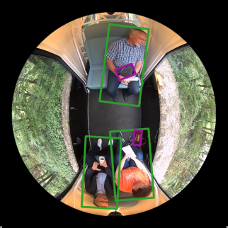
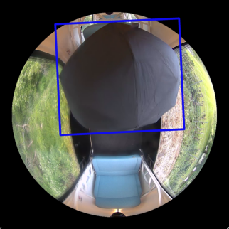
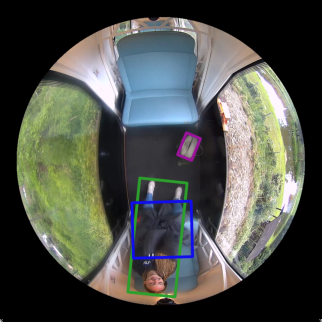
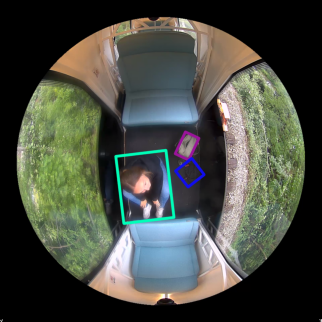

# PMOF: A Dataset and Benchmark for Passenger Monitoring Using Overhead Fisheye Cameras

## 摘要

### 论文元信息

| 条目 | 内容 |
|---|---|
| 标题 | PMOF: A Dataset and Benchmark for Passenger Monitoring Using Overhead Fisheye Cameras |
| 作者 | Stella Katharina Wermuth, Qazi Arbab Ahmed, Klaus Neumann, Thorsten Jungeblut |
| arXiv ID | 2606.13910 |
| 发布时间 | 2026-06-15T04:00:00+00:00 |
| 类别 | cs.CV |
| 论文链接 | https://arxiv.org/abs/2606.13910 |
| PDF 链接 | https://arxiv.org/pdf/2606.13910 |
| 项目页 / 代码声明 | 论文首页摘要称 “The dataset and code are available at https://swermuth.github.io/pmof/.”，但当前材料未提供可检视的源码仓库、源码文件或 README，因此本文不做源码级代码段分析，代码状态记为“论文声明可用，源码证据不足”（见 PAGE 1）。 |

表格解读：这篇论文的核心产物不是一种新网络结构，而是一个面向移动车厢内顶视鱼眼感知的数据集 PMOF，以及围绕该数据集建立的检测基准。论文明确声称数据集与代码在项目页可用，但本文依据的全文材料没有给出可确认的 GitHub 仓库路径或源码文件，因此不能贴出代码片段或建立“论文方法—源码函数”的逐行对应。

一句话总结：PMOF 是首个公开的移动车辆内部顶视鱼眼乘客监测数据集，包含 19,696 帧、旋转框、跟踪 ID 与动作标签；论文用 YOLO26m-obb 在 PMOF、CEPDOF 与 HABBOF 上验证了移动车厢与静态办公室鱼眼场景之间的域差异，并表明跨域联合训练加旋转感知增强可显著提升泛化性能（见 PAGE 1、PAGE 2、PAGE 5）。

PMOF 的贡献可以概括为三个层面。第一，数据层面，论文补上了“移动公共交通车厢内顶视鱼眼图像”这一公开数据空缺；已有公开数据集主要来自办公室、商店、街道等静态或非车内环境，不能直接覆盖车辆运动导致的背景变化、光照变化和遮挡模式（见 PAGE 1、PAGE 2）。第二，标注层面，PMOF 不只给出 person 检测框，还提供 clothing、bag 类别、跨帧 tracking identifiers，以及 seated、seated on the ground、standing、lying 四类动作属性，使其不仅支持检测，还能支持跟踪和动作识别研究（见 PAGE 2、PAGE 3）。第三，实验层面，论文以 YOLO26m-obb 为基线，在 PMOF 与 CEPDOF 的单域、增强、联合训练配置上比较性能，并在 HABBOF 上做跨域验证，展示 PMOF 对更广泛顶视鱼眼人形检测任务的价值（见 PAGE 4、PAGE 5）。

需要特别说明的是，论文全文没有给出新的模型公式、损失函数公式或算法伪代码。全文中出现的数学符号主要是评价指标符号，例如 Precision \(P\)、Recall \(R\)、\(F_1\)-score 与 \(AP_{50}\)，以及 IoU = 0.5 的评价阈值；但论文没有写出这些指标的显式计算公式（见 PAGE 4）。因此，本文不会为了满足格式而伪造“论文公式”。后文凡涉及公式处，均标注为“证据不足”，并只解释论文实际出现的符号。

## 背景与动机

自动化、无人值守的公共交通系统需要可靠的车内乘客监测能力。论文在引言中指出，自动公共交通有助于提高服务灵活性、提升运行频率、降低运营成本，尤其适合中等或波动客流需求的路线以及乡村区域的小型无人车辆服务（见 PAGE 1）。在没有车上工作人员的情况下，系统必须依赖车内感知来支持安全运行、事件响应和车队管理，例如乘客数量统计、异常行为监测、乘客位置估计和舱内状态理解。

与固定场景监控不同，移动车厢内部感知有更强的结构约束和动态扰动。车厢空间狭小，乘客彼此距离近，坐姿、站姿、遮挡和随身物品都可能影响检测。车辆运动又引入连续光照变化、运动诱导的背景变化，以及由行驶环境和车窗外部变化带来的视觉不稳定性。论文明确将这些因素列为车内移动环境区别于传统静态监控环境的主要挑战（见 PAGE 1）。

顶装鱼眼相机（ceiling-mounted fisheye camera）是论文选择的传感器形态。其优势在于从单一顶视视角覆盖整个车厢，可以减少传感器数量，并在一定程度上降低侧视相机中的人体互遮挡问题（见 PAGE 1）。但鱼眼相机也带来几何畸变：同一个人出现在图像不同半径位置时，形状、朝向和尺度都可能发生显著变化。因此，普通水平框或常规透视图像训练策略未必适合顶视鱼眼数据。

相关工作已经覆盖若干公共交通乘客监测任务，例如乘客计数、动作识别、暴力检测、多摄像头检测与动作识别等（见 PAGE 2）。此外，也有研究探索公共交通中的顶视鱼眼摄像头，但论文指出这些研究使用的数据集并非公开，且标注范围有限：有的只有 person bounding boxes，有的只有视频级 anomaly labels（见 PAGE 2）。这限制了算法复现、跨方法比较和多任务研究。

公开顶视鱼眼数据集方面，论文列举了 PIROPO、HABBOF、CEPDOF、WEPDTOF 和 LOAF 等数据集，但它们主要来自办公室、走廊、多样室内场景或室内外混合场景，而非真实行驶中的车厢内部（见 PAGE 2、PAGE 3）。这正是 PMOF 的问题切入点：现有公开数据集无法反映车辆运动产生的域偏移（domain shift），因此训练于静态场景的数据模型不一定能泛化到车内乘客监测。

论文的研究动机不是提出一个全新的检测架构，而是构建一个缺失的数据基准，并用系统实验回答一个实际问题：如果将静态办公室顶视鱼眼数据与移动车内顶视鱼眼数据联合使用，是否能提高检测模型在车厢内和外部鱼眼域上的泛化能力？实验结果给出的答案是肯定的，但也显示单一域训练存在明显边界：仅用 CEPDOF 训练在 PMOF 上表现受限，仅用 PMOF 训练在 HABBOF 上召回率很低（见 PAGE 5）。

## 预备知识

顶视鱼眼图像（overhead fisheye imagery）是指相机安装在场景上方，并使用大视场角鱼眼镜头采集的图像。论文中的 PMOF 由安装在车厢顶部、高度 1.5 m 的 Vivotek FE9180-H-v2 鱼眼相机采集，相机提供 \(180^\circ\) 顶视视野，分辨率为 \(1920 \times 1920\) 像素，帧率为 8–15 fps（见 PAGE 2）。这里的 \(180^\circ\) 表示半球视场覆盖能力，\(1920 \times 1920\) 表示方形图像分辨率；这些是采集设置，不是论文提出的公式。

旋转边界框（rotated bounding box）是理解 PMOF 标注体系的关键概念。普通检测框通常与图像坐标轴对齐，而鱼眼顶视图像中的人体在图像不同位置会呈现不同方向。论文采用 human-aligned rotated bounding boxes，即与人体方向对齐的旋转框，以适应径向鱼眼畸变（见 PAGE 2、PAGE 3）。这使 PMOF 更适合训练 oriented bounding box detector，例如论文使用的 YOLO26m-obb。

跨域泛化（cross-domain generalization）是本文实验设计的第二个核心概念。PMOF 来自移动车辆内部，CEPDOF 和 HABBOF 来自办公室等静态环境。模型若只在某一数据域上训练，可能学习到该域特有的背景、尺度、遮挡和姿态分布；而论文关注的是联合不同域数据并配合增强后，模型能否获得更稳定的人形检测能力（见 PAGE 4、PAGE 5）。

评价指标方面，论文采用 MS COCO protocol，并报告 Precision \(P\)、Recall \(R\)、\(F_1\)-score 和 \(AP_{50}\)（见 PAGE 4）。其中 \(P\) 表示预测为正的目标中有多少是真正例，\(R\) 表示真实目标中有多少被检出，\(F_1\) 通常用于综合衡量精确率与召回率，\(AP_{50}\) 表示 IoU 阈值为 0.5 时的平均精度。需要强调的是，论文只报告这些指标名称与数值，并未在正文中写出指标计算公式，因此公式级证据不足（见 PAGE 4）。

## 方法详解

### 1. 数据集构建：从真实行驶车厢采集顶视鱼眼图像

PMOF 的首要创新是数据采集场景。论文称 PMOF 是第一个公开的、在移动车辆内部采集的顶视鱼眼图像数据集，目标是服务 passenger monitoring using overhead fisheye cameras（见 PAGE 1、PAGE 2）。数据于 2025 年 5 月在 autonomous rail vehicle Monocab 的演示运行期间采集，参与者自愿参加并签署知情同意书。每段 recording 对应一次 ride 和一个 unique passenger group，车辆速度最高达到 20 km/h（见 PAGE 2）。

这一采集设计直接对应论文的核心问题：静态环境数据无法覆盖移动车厢中的域偏移。办公室鱼眼数据通常背景稳定、光照变化相对有限、相机高度较高；而 PMOF 的相机安装高度只有 1.5 m，低于已有数据集中 2.5 m–4 m 的天花板安装高度（见 PAGE 3）。低机位导致人体框更大，也更容易出现人际遮挡，论文指出 standing passengers can cover up to the entire field of view（见 PAGE 3）。

采集后，论文对所有帧进行人工审查，删除车外可见人员和可见手机屏幕相关帧，以处理隐私和数据质量问题。论文还说明时间连续性大体保留，只有 30 段乘客 recordings 中的 5 段因相机掉帧和隐私移除存在轻微间隔；这些不连续可通过递增 frame IDs 识别，因此数据仍适合视频任务（见 PAGE 3）。这一细节对跟踪和动作识别任务很重要，因为跨帧连续性决定了 tracking identifier 是否可以被有效使用。

### 2. 标注体系：检测、跟踪与动作识别的统一标注

PMOF 不只是 person detection 数据集。论文说明两名标注员使用本地 CVAT 实例进行人工标注，并由第三名标注员复核；标注遵循 MS COCO format，使用 human-aligned rotated bounding boxes（见 PAGE 3）。每个框被赋予 person、clothing、bag 三类之一，并连接到一致的 tracking identifier；person 实例额外包括动作属性 seated、seated on the ground、standing、lying（见 PAGE 2、PAGE 3）。

这种设计使 PMOF 支持三个任务层级。第一是 object detection，即检测乘客和相关物品；第二是 multi-object tracking，即利用 tracking ID 进行跨帧身份关联；第三是 action recognition，即基于 person 实例的动作属性识别坐、站、躺等状态。论文在贡献列表中明确将 detection、tracking 和 action recognition 作为 PMOF 的支持任务（见 PAGE 2）。

从业务角度看，动作标签是 PMOF 相比传统鱼眼人形检测数据集的重要扩展。公共交通车内不仅需要知道“有没有人”，还需要知道乘客是否坐在座位上、是否坐在地上、是否站立、是否躺倒。论文提到部分参与者有意执行 falling、covering themselves、fighting 等动作以扩大活动范围，但最终列出的实例级动作属性为四类：seated、seated on the ground、standing、lying（见 PAGE 2、PAGE 3）。因此，不能把 fighting 或 covering themselves 误写成正式标注类别；它们只是采集过程中的行为现象，而非论文列出的动作标签。

### 3. 图像证据：Fig. 1 展示真实驾驶条件下的 PMOF 样例

用途：下图用于说明 PMOF 的核心视觉域，即移动车厢内顶视鱼眼画面，以及 person、bag、clothing 与动作标签在真实驾驶条件下的标注样例。论文 Fig. 1 的说明为 “Annotated PMOF frames sampled every 100 frames from four recordings, illustrating passenger actions and object classes under real driving conditions.”（见 PAGE 1）。

读图要点：该图像片段来自 Fig. 1 的样例帧，用于观察顶视鱼眼视角下人体、座椅、地面和随身物品的空间关系。支撑的判断是：PMOF 的视觉问题不是常规透视行人检测，而是低位车厢顶视鱼眼中的旋转人体实例检测（见 PAGE 1、PAGE 2）。

用途：下图继续展示 Fig. 1 中不同 recording 的标注样例，用于说明 PMOF 包含不同乘客姿态和对象类别，而非单一坐姿场景。

读图要点：标注样例强调 seated、standing、lying 等动作在顶视视角下的外观差异。支撑的判断是：PMOF 的动作属性与旋转框标注共同构成多任务数据基础（见 PAGE 1、PAGE 3）。

用途：下图用于辅助说明车厢内遮挡和鱼眼畸变的存在，尤其是当乘客靠近相机或位于图像边缘时，目标尺度和朝向不稳定。

读图要点：图像中的人体和物体不是标准水平矩形目标，因此论文选择 human-aligned rotated bounding boxes 而非普通水平框。支撑的判断是：旋转框标注并非附加细节，而是适应鱼眼几何的必要设计（见 PAGE 2、PAGE 3）。

用途：下图作为 Fig. 1 的第四个样例片段，用于说明 PMOF 覆盖多个 recordings，而不是单一乘客组或单一位置。

读图要点：不同帧中乘客数量、动作和物品分布存在差异。支撑的判断是：PMOF 的 benchmark split 需要考虑 recording 层面的差异，而论文也确实按 recording 划分训练集和验证集（见 PAGE 3）。

需要说明：当前只提供了 Fig. 1 的四个 markdown_path 图像资源。论文正文还引用了 Fig. 2、Fig. 3、Fig. 4、Fig. 5、Fig. 6 和 Fig. 7，但当前 figures 列表没有提供这些图的可嵌入路径，因此本文不会输出不存在的图片路径。对这些图的讨论仅限于论文文字和页码证据。

### 4. 数据统计与基准划分

PMOF 包含 31 段 recordings，共 19,696 帧，其中 rec0 是 background-only frames，另外 30 段为 passenger recordings（见 PAGE 3）。这 30 段乘客 recordings 贡献 19,345 个 annotated frames，包含 44,718 个 person instances，来自 67 名 distinct participants（见 PAGE 3）。每段 recording 的帧数范围是 294 到 1,061，平均约 635.4 帧；每段包含 1 到 4 名乘客，平均 2.3 名乘客（见 PAGE 3）。

基准划分方面，论文将数据分为 25 段 recordings 的训练集和 5 段 recordings 的验证集，分别包含 16,405 帧和 2,940 帧，并将 background-only frames 排除在训练集与验证集之外（见 PAGE 3）。由于 recording 数量有限，论文没有创建单独 test set。验证集被有意设计为包含更丰富的乘客动作和物体，以更好评估泛化能力；这一点由 Fig. 2b 和 Fig. 2c 支撑（见 PAGE 3）。

| 数据集属性 | PMOF 数值 | 页码证据 |
|---|---:|---|
| 总 recordings | 31 | PAGE 3 |
| 总帧数 | 19,696 | PAGE 3 |
| passenger recordings | 30 | PAGE 3 |
| annotated passenger frames | 19,345 | PAGE 3 |
| person instances | 44,718 | PAGE 3 |
| distinct participants | 67 | PAGE 3 |
| 训练集 | 25 recordings / 16,405 frames | PAGE 3 |
| 验证集 | 5 recordings / 2,940 frames | PAGE 3 |
| 类别 | person、clothing、bag | PAGE 2、PAGE 3 |
| 动作属性 | seated、seated on the ground、standing、lying | PAGE 2、PAGE 3 |

表格解读：PMOF 的规模在顶视鱼眼领域属于中等，但它的独特性来自移动场景、低相机高度、旋转框、tracking ID 与动作属性的组合。需要注意的是，验证集只有 5 段 recordings，且论文没有独立 test set，因此 PMOF 上的数值应被理解为基准验证结果，而不是严格意义上的最终泛化测试。

### 5. 与已有顶视鱼眼数据集的差异

论文 Table I 将 PMOF 与 HABBOF、CEPDOF、WEPDTOF 和 LOAF 等公开真实顶视鱼眼数据集比较（见 PAGE 4）。关键差异包括：PMOF 是 driving vehicle 环境，其他数据集主要是 offices、indoor scenes 或 indoor/outdoor mixed scenes；PMOF 有 tracking IDs、3 个类别和 4 类动作，而大多数比较数据集只有 1 类且没有动作标签（见 PAGE 4）。

| Dataset | Res. | #Videos | #Frames | FPS | #People distinct | Recording Environment | Track IDs | #Classes | #Actions |
|---|---:|---:|---:|---:|---:|---|---|---:|---:|
| HABBOF | 2k | 4 | 5,837 | 30 | 9 | Offices | 否 | 1 | 否 |
| CEPDOF | 2K | 8 | 25,504 | 1–10 | 17 | Offices | 是 | 1 | 否 |
| WEPDTOF | 1.9K | 16 | 10,544 | 1–10 | 188 | Indoor，例如 store、office | 是 | 1 | 否 |
| LOAF | 2.9K | 74 | 42,942 | 10–20 | ≥65 | Indoor/Outdoor，例如 hall、street | 否 | 1 | 否 |
| PMOF | 1.9K | 31 | 19,696 | 8–15 | 67 | Driving Vehicle | 是 | 3 | 4 |

表格解读：PMOF 不是帧数最大的顶视鱼眼数据集，LOAF 和 CEPDOF 在帧数上更大或相近；PMOF 的价值在于 recording environment 和 annotation scope。它将 moving vehicle、track IDs、多类别与动作属性结合到一个公开数据集中，这解释了为什么论文把“域差异”而非“模型结构创新”作为实验重点。

### 6. 旋转感知数据增强：把旋转框转为关键点处理

论文的 benchmark 方法使用 rotation-aware augmentation pipeline（旋转感知增强管线）。问题在于，常用增强库 Albumentations 不原生支持 rotated bounding boxes（见 PAGE 3）。为解决这个工程问题，论文将每个 rotated bounding box 表示为四个 corner coordinates，并把它们作为 keypoints 处理，从而在仿射和光照增强过程中保持框的几何朝向（见 PAGE 3）。

这个设计的输入是带旋转框的 PMOF 或 CEPDOF 图像，处理过程是将框转换为四角点并施加一致的图像变换，输出是保留目标方向的增强图像与标注。论文随机应用 scaling、rotation、horizontal and vertical flips、coarse dropout、color-channel suppression，以及 brightness、contrast、color jitter、HSV shifts 和 random gamma 等 photometric adjustments（见 PAGE 3）。若 scaling 导致 bounding boxes 移出图像，则丢弃对应帧（见 PAGE 3）。

论文有意识地排除了 translation、cropping 和 mosaic 等会破坏 circular fisheye geometry 的变换（见 PAGE 3）。这一点是方法设计的关键：普通检测增强往往追求变化多样性，但顶视鱼眼图像具有圆形几何结构，随意平移或裁剪可能改变鱼眼成像的物理含义。换言之，增强不仅要保持标签正确，还要保持鱼眼域的几何真实性。

增强数据的生成策略也较明确。PMOF training set 和 CEPDOF 各自生成增强版本，命名为 PMOF aug 和 CEPDOF aug。对每个 recording，随机选择 25% frames，并为每个选中帧生成两个 augmented versions；最终数据配置见 Table II（见 PAGE 3、PAGE 4）。论文用 Fig. 3 展示 CEPDOF 增强样例，用 Fig. 4 展示 PMOF 增强样例，但当前未提供这些图的 markdown_path，因此本文不嵌入图像。

### 7. 数据配置：单域、增强与跨域联合训练

论文设置了六种 fine-tuning configurations：CEPDOF、CEPDOF aug、PMOF、PMOF aug、CEPDOF + PMOF、CEPDOF aug + PMOF aug（见 PAGE 4）。这些配置用于区分三个因素：数据域来源、是否使用增强、是否进行跨域联合训练。通过这种设计，论文可以分别观察 PMOF 的域内价值、CEPDOF 的跨域迁移能力，以及增强对两种域的共同影响。

| Dataset Configuration | Original Frames | Aug. Frames | Total Frames | 页码证据 |
|---|---:|---:|---:|---|
| CEPDOF | 25,504 | - | 25,504 | PAGE 4 |
| CEPDOF aug | 25,504 | 11,683 | 37,187 | PAGE 4 |
| PMOF | 16,405 | - | 16,405 | PAGE 4 |
| PMOF aug | 16,405 | 8,071 | 24,476 | PAGE 4 |
| CEPDOF + PMOF | 41,909 | - | 41,909 | PAGE 4 |
| CEPDOF aug + PMOF aug | 41,909 | 19,754 | 61,663 | PAGE 4 |

表格解读：增强后的联合配置包含 61,663 帧，是规模最大的训练配置。更重要的是，这个配置同时包含办公室鱼眼域和移动车厢鱼眼域，并对两者应用同一类旋转感知增强。后文结果显示，该配置在 PMOF 和 HABBOF 两个评估域上都取得最佳 AP50，说明收益并不只是来自单纯增加帧数，而是来自跨域数据和几何一致增强的组合。

### 8. 检测算法与训练细节

论文采用 YOLO26m-obb detector 作为 baseline model，理由是 YOLO-based architectures 在顶视鱼眼人形检测中使用广泛（见 PAGE 4）。模型用标准 YOLO26m 的 MS COCO 2017 pretrained weights 初始化，但由于没有公开的 oriented bounding box model 人形检测权重，obb-detection head 随机初始化，并在 fine-tuning 中与 backbone 联合训练（见 PAGE 4）。因此，论文不报告 without fine-tuning 的结果。

训练设置为 20 epochs，输入分辨率 \(1024 \times 1024\)，优化器为 stochastic gradient descent，momentum 0.9，weight decay 0.0005，learning rate 0.001（见 PAGE 4）。推理时使用 confidence threshold 0.3，与 prior studies 保持一致。评估时选择在相应 evaluation dataset 上 \(AP_{50}\) 最高的 checkpoint，即分别针对 PMOF validation set 或 HABBOF 选择最佳模型（见 PAGE 4）。

这里的 \(AP_{50}\) 是论文最重要的性能指标，含义是在 IoU = 0.5 阈值下计算平均精度。IoU 是 Intersection over Union 的缩写，用来衡量预测框与标注框重叠程度；但论文没有给出 IoU 或 AP 的数学定义公式，只说明遵循 MS COCO protocol（见 PAGE 4）。因此，下文不会把标准 AP 计算公式当作论文公式来引用。

### 9. 公式证据说明

论文没有提出新的损失函数、检测头公式、增强变换公式或域适配目标函数。全文材料中可确认的数学表达主要是分辨率、角度、训练超参数和指标符号，例如 \(180^\circ\)、\(1920 \times 1920\)、\(1024 \times 1024\)、\(P\)、\(R\)、\(F_1\)、\(AP_{50}\) 和 IoU = 0.5（见 PAGE 2、PAGE 4）。这些是实验设置或指标符号，不构成论文方法公式。

因此，按“不要编造论文没有的公式”的要求，本文明确记录：论文公式证据不足。无法提供 5 个论文公式引用，也无法进行 KaTeX 级公式逐条推导。可以解释的只有符号含义：\(P\) 是 Precision，\(R\) 是 Recall，\(F_1\) 是精确率和召回率的综合指标，\(AP_{50}\) 是 IoU 阈值为 0.5 的 average precision；这些符号均出现在 Evaluation Metrics 段落（见 PAGE 4）。

### 10. 代码分析状态

论文首页摘要称 “The dataset and code are available at https://swermuth.github.io/pmof/.”（见 PAGE 1）。但当前提供的全文材料没有包含代码仓库 URL、文件路径、README、训练脚本或增强实现源码。已知链接是项目页，不足以支持源码级判断。因此，本文未提供可确认的公开代码，不贴代码段，也不建立“论文组件—源码文件/函数”的对应关系。

从方法复现角度看，最需要源码核验的是 rotation-aware augmentation pipeline：具体如何将 rotated bounding boxes 转换为四个 keypoints、如何在增强后恢复 oriented box、如何处理越界框、以及如何配置 YOLO26m-obb 的训练。论文对这些步骤给出文字描述，但没有源码证据。因此，复现实验时应优先检查项目页是否发布数据转换脚本、增强配置和训练配置文件。

## 实验分析

### 1. 实验设置概述

论文的实验目标有两个。第一，在 PMOF validation set 上验证 PMOF 域内检测性能，并观察从 CEPDOF 到 PMOF 的跨域迁移是否存在明显性能差距。第二，在 HABBOF 上评估 PMOF 是否有助于 transportation 之外的顶视鱼眼人形检测泛化（见 PAGE 4、PAGE 5）。这种双评估设计使论文能够同时回答“PMOF 是否必要”和“PMOF 是否只对车厢有效”两个问题。

评估数据包括 PMOF validation set 和 HABBOF。训练数据包括 PMOF training set、CEPDOF，以及它们的增强版本与联合版本（见 PAGE 4）。HABBOF 未用于训练，而是作为 unseen overhead fisheye dataset from a different domain 进行外部验证（见 PAGE 1、PAGE 4、PAGE 5）。这使 HABBOF 上的结果更能体现跨域泛化，而不是单一验证集调参效果。

论文报告 Precision、Recall、\(F_1\) 和 \(AP_{50}\)，且所有数值均为百分比（见 PAGE 4）。从结果解读看，\(AP_{50}\) 是论文主要排序指标，但 Recall 的变化同样关键：在 HABBOF 上，仅用 PMOF 训练的模型 Precision 很高但 Recall 极低，说明模型预测较保守，漏检严重（见 PAGE 5）。这比单看 AP50 更能揭示域偏移的具体表现。

### 2. PMOF validation set：PMOF 数据与增强显著改善车内检测

PMOF validation set 上的结果见论文 Table III 和 Fig. 6（见 PAGE 5）。只用 CEPDOF 训练的模型在 PMOF 上 \(AP_{50}\) 为 74.5，而使用 CEPDOF aug 提升到 83.8。相比之下，只用 PMOF 训练即可达到 89.9，PMOF aug 进一步达到 93.0。联合训练 CEPDOF + PMOF 为 93.6，最佳配置 CEPDOF aug + PMOF aug 达到 94.8（见 PAGE 5）。

| Dataset Configuration | AP50 | P | R | F1 | 页码证据 |
|---|---:|---:|---:|---:|---|
| CEPDOF | 74.5 | 72.3 | 69.8 | 71.0 | PAGE 5 |
| CEPDOF aug | 83.8 | 85.5 | 74.1 | 79.4 | PAGE 5 |
| PMOF | 89.9 | 96.3 | 81.0 | 88.0 | PAGE 5 |
| PMOF aug | 93.0 | 96.4 | 87.1 | 91.5 | PAGE 5 |
| CEPDOF + PMOF | 93.6 | 94.4 | 88.8 | 91.5 | PAGE 5 |
| CEPDOF aug + PMOF aug | 94.8 | 96.4 | 90.4 | 93.3 | PAGE 5 |

表格解读：最直接的结论是，PMOF 对车厢域不可替代。CEPDOF 是办公室域，即使增强后在 PMOF 上也只有 83.8 AP50；加入 PMOF 后，性能明显跃升。增强带来的收益也稳定存在：PMOF 到 PMOF aug 提升 +3.1 AP50，CEPDOF 到 CEPDOF aug 提升 +9.3 AP50。最佳联合增强配置相比 PMOF 单独训练提升 +4.9 AP50，说明跨域数据在有目标域数据的情况下仍能提供额外泛化收益（见 PAGE 5）。

从 Precision 和 Recall 的角度看，PMOF-only 模型 Precision 已经很高，为 96.3，但 Recall 只有 81.0；PMOF aug 将 Recall 提升到 87.1，而联合增强配置进一步提升到 90.4，并保持 96.4 Precision（见 PAGE 5）。这意味着最佳配置主要通过减少漏检来提升性能，而不是简单提高置信度阈值下的精确率。

Fig. 6 给出 PMOF validation set 上的 precision-recall curves，论文用它支撑不同训练配置在整个阈值范围内的排序（见 PAGE 5）。当前没有 Fig. 6 的 markdown_path，因此不能嵌入图像；但文字材料足以确认曲线中最佳 AP50 为 CEPDOF aug + PMOF aug 的 94.8，最低为 CEPDOF 的 74.5（见 PAGE 5）。

### 3. HABBOF：PMOF 单独训练跨到办公室域时召回严重不足

HABBOF 上的结果见 Table IV 和 Fig. 7（见 PAGE 5）。只用 PMOF 训练在 HABBOF 上 \(AP_{50}\) 为 60.1，PMOF aug 为 62.7；虽然 Precision 分别为 98.6 和 97.9，但 Recall 只有 21.6 和 27.2。这说明模型在跨到办公室鱼眼域时非常保守，只有在高度确信时才预测，导致大量目标漏检（见 PAGE 5）。

| Dataset Configuration | AP50 | P | R | F1 | 页码证据 |
|---|---:|---:|---:|---:|---|
| CEPDOF | 90.9 | 89.9 | 85.5 | 87.7 | PAGE 5 |
| CEPDOF aug | 95.4 | 87.7 | 93.4 | 90.4 | PAGE 5 |
| PMOF | 60.1 | 98.6 | 21.6 | 35.4 | PAGE 5 |
| PMOF aug | 62.7 | 97.9 | 27.2 | 42.5 | PAGE 5 |
| CEPDOF + PMOF | 93.1 | 92.0 | 86.3 | 89.0 | PAGE 5 |
| CEPDOF aug + PMOF aug | 96.5 | 94.8 | 92.7 | 93.7 | PAGE 5 |

表格解读：HABBOF 结果揭示了域偏移的非对称性。PMOF 是移动车厢域，单独训练后跨到办公室域表现较差；CEPDOF 是办公室域，与 HABBOF 更相近，因此单独训练已经达到 90.9 AP50。加入增强后，CEPDOF aug 达到 95.4；而最佳联合增强配置达到 96.5，相比 CEPDOF alone 提升 +5.6 AP50（见 PAGE 5）。这说明 PMOF 并非只服务车厢场景，它与 CEPDOF 联合后可以改善外部鱼眼域泛化，但前提是不能只依赖 PMOF 单域训练。

Precision 和 Recall 的变化也值得关注。CEPDOF aug 的 Recall 为 93.4，高于最佳联合增强配置的 92.7，但 Precision 只有 87.7，低于最佳配置的 94.8（见 PAGE 5）。最佳配置的优势在于同时保持较高 Precision 和 Recall，使 \(F_1\) 达到 93.7。换言之，联合增强配置不是单纯追求更多检出，而是在误检与漏检之间取得更均衡的结果。

Fig. 7 给出 HABBOF 上的 precision-recall curves，用于直观比较六种训练配置的 PR 曲线和 AP50（见 PAGE 5）。当前没有 Fig. 7 的 markdown_path，因此不能嵌入图像；但表格数值和论文文字已经明确最佳配置为 CEPDOF aug + PMOF aug，AP50 为 96.5（见 PAGE 5）。

### 4. 与既有 HABBOF 方法比较：强基线但非最优

论文进一步将最佳模型与既有 HABBOF 方法比较，见 Table V（见 PAGE 5）。Ours 使用 \(1024 \times 1024\) 输入，AP50 为 96.5，P 为 94.8，R 为 92.7，F1 为 93.7。该结果优于 Tamura et al.、AA、AB 和 ARPD 的部分指标，但低于 RAPiD 1024 的 98.1 AP50 和 Tsiktsiris et al. 的 97.9 AP50（见 PAGE 5）。

| Method | AP50 | P | R | F1 | 页码证据 |
|---|---:|---:|---:|---:|---|
| Tamura et al. (608) | 78.2 | 86.3 | 75.9 | 80.7 | PAGE 5 |
| AA (1024) | 88.4 | 93.9 | 81.9 | 87.4 | PAGE 5 |
| AB (1024) | 95.6 | 89.5 | 90.2 | 89.8 | PAGE 5 |
| RAPiD (608) | 97.3 | 98.4 | 93.5 | 95.8 | PAGE 5 |
| RAPiD (1024) | 98.1 | 97.5 | 96.3 | 96.9 | PAGE 5 |
| ARPD (512) | 95.6 | 96.8 | 92.7 | 94.7 | PAGE 5 |
| Tsiktsiris et al. (1024) | 97.9 | 96.0 | 93.1 | 95.1 | PAGE 5 |
| Ours (1024) | 96.5 | 94.8 | 92.7 | 93.7 | PAGE 5 |

表格解读：论文对自身结果的定位较谨慎。最佳模型并没有超过所有鱼眼专用方法，特别是低于 RAPiD 和 Tsiktsiris et al.。但论文强调，这些方法依赖 fisheye-optimized architectures or loss functions，而本文使用 generic YOLO26m-obb model，没有鱼眼特定结构修改，仍达到较强性能（见 PAGE 5）。因此，PMOF 的实验价值主要在数据和训练配置层面，而不是证明 YOLO26m-obb 是当前最优鱼眼检测器。

### 5. 消融含义：增强与跨域数据的互补性

论文没有用“ablation study”单独命名实验，但六种 dataset configurations 实际形成了数据层面的消融。比较 CEPDOF 与 CEPDOF aug，可观察增强对办公室域训练的影响；比较 PMOF 与 PMOF aug，可观察增强对车厢域训练的影响；比较单域与联合训练，可观察跨域数据的贡献（见 PAGE 4、PAGE 5）。

在 PMOF validation set 上，CEPDOF 到 CEPDOF aug 提升 +9.3 AP50，PMOF 到 PMOF aug 提升 +3.1 AP50，CEPDOF + PMOF 到 CEPDOF aug + PMOF aug 提升 +1.2 AP50（见 PAGE 5）。这表明增强对域外迁移尤其有帮助，但当训练数据已经联合且规模较大时，边际收益变小。

在 HABBOF 上，CEPDOF 到 CEPDOF aug 提升 +4.5 AP50，PMOF 到 PMOF aug 提升 +2.6 AP50，CEPDOF + PMOF 到 CEPDOF aug + PMOF aug 提升 +3.4 AP50（见 PAGE 5）。这说明在外部办公室域上，增强和联合数据仍然互补。尤其是 PMOF 单独训练时召回极低，而与 CEPDOF 联合并增强后，模型不再局限于车厢域外观。

## 讨论

PMOF 的适用边界首先由场景决定。它针对的是车内、顶视、鱼眼、低安装高度、移动平台条件下的乘客监测。对于常规侧视监控、门店客流、园区安防或街景行人检测，PMOF 的图像分布差异很大，不能直接替代这些数据域。论文也通过 CEPDOF、PMOF 和 HABBOF 的跨域实验展示了这种差异：单一域训练在另一个域上会出现性能下降，尤其体现在 Recall 上（见 PAGE 5）。

对于检测任务，PMOF 的最大价值在于提供了移动车厢域的旋转框 person 数据。对于业务应用，如果目标是评估广角或鱼眼人形检测、旋转框标注、车厢或室内顶视场景的域适配策略，PMOF 具有直接参考价值。特别是最佳配置在 PMOF 上达到 94.8 AP50，在 HABBOF 上达到 96.5 AP50，说明跨域联合训练可以同时改善目标域和外部域表现（见 PAGE 1、PAGE 5）。

但对于 tracking 和 action recognition，论文当前还没有提供基准结果。虽然 PMOF 包含 tracking identifiers 和 action labels，论文贡献中也强调支持 detection、tracking and action recognition（见 PAGE 2），但实验只覆盖 person detection benchmark。未来如果要验证 PMOF 在多目标跟踪、乘客行为识别、异常事件检测中的价值，还需要额外模型、指标和拆分策略。

从方法论上看，论文展示了一个务实的数据集论文范式：先明确已有公开数据不能覆盖的真实域，再通过兼容既有数据集的训练配置证明新数据的增益。PMOF 没有把创新包装成新模型，而是将“移动场景域偏移”和“旋转感知增强”作为核心实验变量。这种设计对后续车内感知数据集构建有参考意义。

## 局限分析

第一项局限来自作者自述。论文结论中明确提出未来工作将 expand PMOF with additional actions and environmental conditions，explore fisheye-specific architectures trained with PMOF，并 benchmark tracking and action recognition to fully leverage the dataset’s annotations（见 PAGE 6）。这说明当前 PMOF 的动作种类和环境条件仍有限，且 tracking/action recognition 虽有标注但尚未形成实验基准。

第二项局限是缺少独立 test set。论文在 Dataset Statistics 中说明，由于 recordings 数量有限，没有创建 separate test set（见 PAGE 3）。这使得当前 PMOF validation set 的结果不应被过度解读为最终泛化性能。验证集虽然被有意选择为包含更广泛动作和物体，但它仍只有 5 段 recordings，难以完全覆盖不同车辆、相机高度、乘客密度、光照条件和运行线路。

第三项局限是基线模型不是鱼眼专用架构。论文使用 generic YOLO26m-obb，且承认其 HABBOF 表现低于 RAPiD 和 Tsiktsiris et al. 等 fisheye-optimized methods（见 PAGE 5）。这使实验结论更偏向“PMOF 与增强配置的价值”，而不是“当前模型达到鱼眼检测最优”。如果未来结合 RAPiD 类旋转感知网络、鱼眼几何先验或专用损失函数，PMOF 上可能出现不同排序。

第四项局限是代码与复现证据不足。论文声称 dataset and code available（见 PAGE 1），但当前全文材料没有给出可检查的源码仓库、训练配置或增强实现细节。特别是 rotation-aware augmentation pipeline 的实际复现依赖四角点转换、增强后框恢复、越界过滤和 YOLO26m-obb 数据格式转换；这些步骤若没有代码，复现实验存在不确定性。

第五项局限是场景域集中。PMOF 来自 Monocab 演示运行，车辆速度最高 20 km/h，采集于 2025 年 5 月，参与者 67 名（见 PAGE 2、PAGE 3）。这对于“公共交通车内顶视鱼眼”是重要起点，但仍不能代表所有公共交通形态，例如公交车、地铁、轻轨、多车厢列车、高峰拥挤场景、夜间强反射、极端天气和不同相机安装高度。

## 结论

PMOF 的核心贡献在于建立了一个此前缺失的公开数据域：真实移动公共交通车厢内部的顶视鱼眼乘客监测。它以 19,696 帧、31 段 recordings、67 名参与者、旋转框、tracking ID 和动作属性，将检测、跟踪和动作识别放在同一标注框架下（见 PAGE 2、PAGE 3）。对于研究者而言，PMOF 提供了一个检验顶视鱼眼检测模型是否能跨越静态办公室域与移动车厢域的实证基准。

实验结果表明，域差异是 PMOF 的中心问题。仅用 CEPDOF 在 PMOF 上效果有限，仅用 PMOF 在 HABBOF 上召回严重不足；而 CEPDOF aug + PMOF aug 在 PMOF validation set 上达到 94.8 AP50，在 HABBOF 上达到 96.5 AP50，是论文报告的双域最佳配置（见 PAGE 5）。这说明跨域数据组合与旋转感知增强可以共同提升顶视鱼眼人形检测的稳健性。

本文未发现可引用的论文方法公式，也没有可确认的源码文件，因此没有伪造公式或代码段。对后续研究来说，最直接的推进方向包括：扩大 PMOF 的动作类别和环境条件，建立 tracking 与 action recognition 基准，验证鱼眼专用架构在 PMOF 上的表现，并公开足够完整的训练与增强代码，以降低复现成本（见 PAGE 6）。

## 证据索引

| 关键事实 | PAGE 证据 |
|---|---|
| PMOF 是首个公开的移动车辆内部顶视鱼眼数据集，包含超过 19k 手工标注帧 | PAGE 1、PAGE 2 |
| 数据集与代码声明位于项目页 https://swermuth.github.io/pmof/ | PAGE 1 |
| PMOF 支持 rotated bounding boxes、tracking identifiers 和 action labels | PAGE 1、PAGE 2、PAGE 3 |
| 车内移动环境挑战包括空间狭小、光照变化、运动诱导背景变化、遮挡和有限视角 | PAGE 1 |
| 既有公开顶视鱼眼数据集主要来自静态办公室或非车内环境 | PAGE 2、PAGE 3、PAGE 4 |
| 数据采集使用 Vivotek FE9180-H-v2，安装高度 1.5 m，180° 视场，1920×1920 分辨率，8–15 fps | PAGE 2 |
| 数据采集于 2025 年 5 月 Monocab 演示运行，每段 recording 对应一次 ride | PAGE 2 |
| PMOF 总计 19,696 帧、31 段 recordings、67 名参与者、44,718 person instances | PAGE 3 |
| 训练/验证划分为 25 recordings / 16,405 frames 与 5 recordings / 2,940 frames，无单独 test set | PAGE 3 |
| PMOF 类别为 person、clothing、bag，动作属性为 seated、seated on the ground、standing、lying | PAGE 2、PAGE 3 |
| Table I 比较 PMOF 与 HABBOF、CEPDOF、WEPDTOF、LOAF | PAGE 4 |
| rotation-aware augmentation 将旋转框四个角点作为 keypoints 处理 | PAGE 3 |
| 增强包括 scaling、rotation、flips、coarse dropout、color-channel suppression 和 photometric adjustments | PAGE 3 |
| translation、cropping、mosaic 被排除，因为会破坏 circular fisheye geometry | PAGE 3 |
| 六种训练配置及帧数见 Table II | PAGE 4 |
| 使用 YOLO26m-obb，MS COCO 2017 预训练 backbone，obb head 随机初始化 | PAGE 4 |
| 训练 20 epochs，输入 1024×1024，SGD momentum 0.9，weight decay 0.0005，learning rate 0.001 | PAGE 4 |
| 评价指标为 Precision、Recall、F1 和 AP50，遵循 MS COCO protocol | PAGE 4 |
| PMOF validation set 最佳结果为 CEPDOF aug + PMOF aug，AP50 94.8 | PAGE 5 |
| HABBOF 最佳结果为 CEPDOF aug + PMOF aug，AP50 96.5 | PAGE 5 |
| PMOF-only 在 HABBOF 上 Recall 很低，说明车厢域到办公室域存在明显域差异 | PAGE 5 |
| 与既有 HABBOF 方法比较时，Ours 低于 RAPiD 和 Tsiktsiris et al.，但使用 generic YOLO26m-obb | PAGE 5 |
| 未来工作包括扩展动作与环境条件、探索鱼眼专用架构、benchmark tracking 与 action recognition | PAGE 6 |
| 论文全文未给出新的方法公式、损失函数公式或算法伪代码；仅出现指标符号和实验设置数值 | PAGE 2、PAGE 4 |
