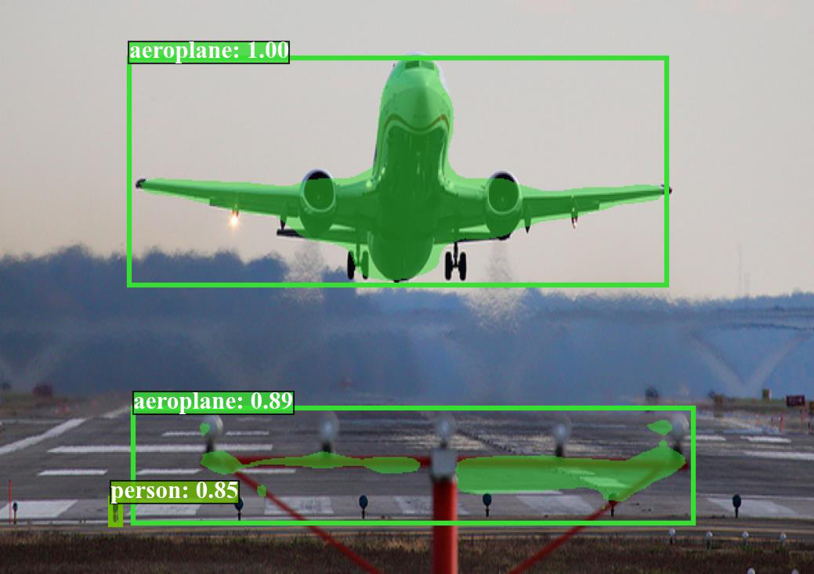

# Context-Guided Semantic Alignment for Feature Fusion Networks

## 摘要

| 项目 | 内容 |
|---|---|
| 标题 | Context-Guided Semantic Alignment for Feature Fusion Networks |
| 作者 | Hyungseop Lee, Jiho Lee, Woochul Kang |
| arXiv ID | 2606.14005 |
| 发布时间 | 2026-06-15T04:00:00+00:00 |
| 类别 | cs.CV |
| 论文链接 | https://arxiv.org/abs/2606.14005 |
| PDF 链接 | https://arxiv.org/pdf/2606.14005 |
| 代码状态 | 本文未提供可确认的公开代码；题名、FINE、AATS 相关关键词检索未发现官方实现，代码分析证据不足。 |

本文提出 FINE，一种用于检测器特征融合网络的轻量语义对齐模块，通过高层上下文指导低层特征，在融合前缓解多尺度特征之间的语义不一致，并在 COCO 等任务上提升小目标和整体检测性能。

本文研究的问题集中在现代目标检测器的 neck 部分。典型检测器由 backbone、neck 和 head 构成，backbone 负责提取多层级特征，neck 负责融合不同尺度的特征，head 负责分类与框回归。论文指出，低层特征保留空间细节但语义不足，高层特征语义更强但空间分辨率更低；若直接通过加法或拼接进行位置级融合，会引入 “semantic inconsistency”（语义不一致），从而导致背景区域误检等问题（见 PAGE 1、PAGE 2）。

为解决该问题，论文提出 Feature Interaction NEtwork（FINE）。FINE 的核心设计包括三部分：Alignment-Aware Token Sampling（AATS，对齐感知 token 采样）、Bottleneck Multi-Head Cross-Level Attention（瓶颈式多头跨层注意力）和 Residual Spatial-Channel Modulation（残差空间-通道调制）。这些模块共同实现一个目标：先用高层特征为低层特征生成语义调制图，再将经过语义增强但仍保留空间细节的低层特征送入常规融合算子（见 PAGE 5、PAGE 6、PAGE 7、PAGE 8）。

实验上，FINE 被插入 RT-DETR、YOLOv8/10/12、Faster R-CNN、RetinaNet、FCOS 等多种检测器，在 COCO val2017 上均带来 AP 提升。例如 Faster R-CNN R50 从 37.0 AP 提升到 39.1 AP，RT-DETRv1 R18 从 46.5 AP 提升到 47.3 AP，YOLOv8-S 从 45.0 AP 提升到 45.8 AP（见 PAGE 9、PAGE 10）。论文还报告 FINE 对小目标更有效，原因在于小目标所在的低层特征尤其缺少语义上下文（见 PAGE 10、PAGE 15）。

## 背景与动机

现代目标检测器通常采用三段式架构：backbone 提取层级特征，neck 聚合多尺度特征，head 进行类别预测和边界框回归。论文在 Introduction 中明确指出，backbone 的浅层特征具有较高空间分辨率和细粒度局部信息，而深层特征具有更大感受野和更强语义表达，但空间分辨率更低（见 PAGE 1）。这正是多尺度检测需要 feature pyramid 的原因：小目标依赖高分辨率特征，大目标依赖强语义特征。

传统 FPN 或 PAN 类结构通常以加法、拼接或上采样后的逐位置融合来结合不同层级特征。论文认为，这种操作默认不同层级同一空间位置上的特征可以直接相加或拼接，但该假设并不充分。高层特征和低层特征来自不同 backbone stage，感受野大小、语义抽象程度和空间细节密度都不同；直接融合会把语义粗但上下文强的表示，与语义弱但定位细的表示混合在一起，引发 feature-level conflict（见 PAGE 2、PAGE 3）。

论文将这一问题称为 “semantic inconsistency”。该问题不同于纯粹的像素级 misalignment。像素级 misalignment 关注上采样、插值或采样偏移导致的空间位置错位；语义不一致则关注不同层级特征在同一位置所代表的信息粒度不同。论文在 Related Work 中说明，已有方法包括 SENet、FaPN、AFF、AugFPN、A2-FPN、CATFPN、learnable offsets、soft upsampling 等，但这些方法要么主要做通道重标定，要么改变融合结构，要么引入较高计算开销，并未充分解决实时检测器中高分辨率跨层注意力的效率问题（见 PAGE 3、PAGE 4）。

用途：下图来自论文 Figure 1 的 PAGE 2 图像抽取，用于定位本文的问题域，即现代检测器的 backbone-neck-head 架构和 neck 中的多尺度融合环节。

读图要点：该图是 Figure 1 的局部视觉证据，论文用它说明现代检测器通过 neck 聚合不同尺度的 backbone 特征，并将融合后的特征送入检测头。支撑的判断是：FINE 并非替代检测头或 backbone，而是作用在 feature fusion block 之前或之中（见 PAGE 2）。

用途：下图同样来自 PAGE 2 的 Figure 1 抽取，用于辅助说明 baseline fusion block 与 FINE-enhanced fusion block 的差异。

读图要点：Figure 1(b) 的文字说明指出，标准融合块通过 naive element-wise operations 组合特征，强制 pixel-wise alignment，但没有解决 representational discrepancies。支撑的判断是：论文的主要假设不是“融合不够多”，而是“融合前缺少语义对齐”（见 PAGE 2）。

用途：下图用于说明论文把 semantic inconsistency 与误分类现象联系起来，特别是背景 clutter 中的 false positive。

读图要点：Figure 1(c) 的 caption 表明，baseline 模型中的语义不一致会在背景杂乱区域造成误分类，而 FINE 能降低此类错误。支撑的判断是：论文后续的错误分析重点关注 false positive suppression（见 PAGE 2、PAGE 15、PAGE 16）。

用途：下图作为 Figure 1 的附加局部证据，用于补充说明 FINE 的直观动机：在融合前利用高层上下文修正低层特征。

读图要点：结合 Figure 1 caption，读图时应关注 low-level 与 high-level 两类特征在融合前的关系，而不是将其理解为一个独立网络结构图。支撑的判断是：FINE 的设计目标是 explicit semantic alignment prior to fusion（见 PAGE 2）。

从方法论上看，本文的动机有两个层次。第一，跨层特征融合确实需要高层语义指导低层细节，因为低层特征承担小目标和边界定位，但容易激活背景纹理。第二，直接做 dense cross-level attention 计算量过高，而且不同层级 token 的 effective receptive field（ERF，有效感受野）并不对齐。因此，论文不是简单把 Transformer attention 插入 FPN，而是先通过 AATS 构造 ERF 对齐且 token 数减少的表示，再进行跨层注意力（见 PAGE 6、PAGE 7）。

## 预备知识

论文在 Section 3 中先回顾 Feature Pyramid Networks（FPN）并定义符号。给定输入图像，backbone 输出层级特征 $\{S_2,S_3,S_4\}$，其中 $S_l \in \mathbb{R}^{H_l \times W_l \times C_l}$ 表示第 $l$ 个金字塔层级特征，$H_l$ 和 $W_l$ 为空间尺寸，$C_l$ 为通道数。论文对应的 stride 为 $\{8,16,32\}$，即相对于输入图像下采样 8、16、32 倍（见 PAGE 4）。

在常规 FPN 中，各层特征先通过 $1\times1$ 卷积投影到统一通道维度 $C$。论文将第 $l$ 个融合阶段的低层特征和高层特征定义为：

$$
F_{\mathrm{low}}=\mathrm{Conv}_{1\times1}(S_l), \quad
F_{\mathrm{high}}=\mathrm{Conv}_{1\times1}(S_{l+1})
$$

这个公式在说：相邻两层特征先被映射到相同通道空间，低层特征 $F_{\mathrm{low}}$ 提供空间细节，高层特征 $F_{\mathrm{high}}$ 提供语义上下文（见 PAGE 4，Eq. 1）。

常规 top-down fusion 写作：

$$
F_{\mathrm{fused}} = f\left(F_{\mathrm{low}}, \mathrm{Up}(F_{\mathrm{high}}, \mathrm{scale}=2)\right)
$$

其中 $\mathrm{Up}(\cdot)$ 表示上采样，$f(\cdot)$ 表示融合算子，例如逐元素加法或拼接。这个公式在说：高层特征被上采样到低层分辨率后，与低层特征直接融合。但问题也正是在这里产生：公式本身只保证空间尺寸一致，不保证语义表达一致（见 PAGE 4，Eq. 2）。

理解本文还需要区分 receptive field 和 effective receptive field。理论感受野描述某个 feature activation 可能覆盖的输入区域，而 ERF 描述实际梯度影响较强的输入区域。论文在 Appendix F 中用梯度定义 ERF：

$$
g_{u,v}=\left|\frac{\partial y_{i,j}}{\partial x_{u,v}}\right|
$$

其中 $y_{i,j}$ 是特征图上位置 $(i,j)$ 的激活，$x_{u,v}$ 是输入图像上位置 $(u,v)$ 的像素，$g_{u,v}$ 表示该输入像素对该激活的影响强度。这个公式在说：ERF 不是理论窗口，而是通过梯度衡量“哪个输入区域真正影响了这个 token”（见 PAGE 20，Eq. 11）。

论文进一步采用二维高斯近似 ERF 分布：

$$
g_{u,v}\propto \exp\left(-\frac{\|(u,v)-\mu\|^2}{2\sigma^2}\right)
$$

其中 $\mu=(\mu_u,\mu_v)$ 是 ERF 中心，$\sigma$ 表示 ERF size，即有效感受野的空间半径。这个公式在说：一个特征激活对输入图像的影响通常集中在中心附近，越远影响越弱（见 PAGE 20，Eq. 12）。

## 方法详解

### 1. 总体框架：在融合前对低层特征做语义对齐

FINE 重新改写常规融合公式。论文不改变融合算子 $f(\cdot)$ 的基本形式，而是将原始低层特征 $F_{\mathrm{low}}$ 替换为经过高层上下文指导后的 $F_{\mathrm{low}}^{\mathrm{aligned}}$：

$$
F_{\mathrm{fused}} =
f\left(F_{\mathrm{low}}^{\mathrm{aligned}},
\mathrm{Up}(F_{\mathrm{high}}, \mathrm{scale}=2)\right),
\quad
F_{\mathrm{low}}^{\mathrm{aligned}}=
\mathrm{FINE}(F_{\mathrm{low}},F_{\mathrm{high}})
$$

这个公式在说：FINE 的输入是相邻层级的低层和高层特征，输出是语义对齐后的低层特征；常规融合仍然发生，但融合前低层特征已经被高层上下文调制（见 PAGE 5，Eq. 3）。

论文 Figure 2 展示了 FINE 的整体结构：$F_{\mathrm{low}}$ 经 AATS 后成为 Query，$F_{\mathrm{high}}$ 经 AATS 后成为 Key 和 Value；瓶颈式跨层注意力生成粗尺度空间-通道调制图 $\hat{M}$；$\hat{M}$ 上采样为 $M$ 后，通过残差元素级调制作用于 $F_{\mathrm{low}}$（见 PAGE 5）。由于 figures 列表未提供 Figure 2 的 markdown_path，本文只引用 Figure 2 的编号和页码证据，不嵌入不存在的图片路径。

FINE 的三个组件对应三类问题。AATS 解决 token 数过多与 ERF 不对齐；Bottleneck Multi-Head Cross-Level Attention 负责建模低层位置与高层语义 token 之间的对应关系；Residual Spatial-Channel Modulation 则避免用粗尺度注意力结果替换高分辨率低层特征，从而保留定位细节（见 PAGE 5、PAGE 6、PAGE 7、PAGE 8）。

### 2. Alignment-Aware Token Sampling：先对齐 ERF，再降低注意力成本

论文指出，直接对 $F_{\mathrm{low}}$ 和 $F_{\mathrm{high}}$ 做 dense pixel-to-pixel cross-level attention 有两个问题。第一，低层和高层特征来自不同 stride 的 backbone stage，同一空间 index 并不代表同等物理输入区域，ERF 不对齐。第二，高分辨率低层特征 token 数太多，直接注意力对实时检测器不现实（见 PAGE 6）。

AATS 的核心公式为：

$$
\hat{F}_{\mathrm{high}}=\mathrm{Down}(F_{\mathrm{high}}, \mathrm{kernel}=k),
\quad
\hat{F}_{\mathrm{low}}=\mathrm{Down}(F_{\mathrm{low}}, \mathrm{kernel}=rk)
$$

其中 $k$ 是高层特征的基础采样核大小，$r$ 是 alignment-aware sampling ratio。这个公式在说：高层特征和低层特征不是用同样大小的 pooling kernel 下采样，而是让低层特征使用 $rk$ 的核，使其覆盖的输入物理区域与高层 token 更接近（见 PAGE 6，Eq. 4）。

若使用 non-overlapping pooling，采样后的 token 数为：

$$
N_{\mathrm{low}}=\frac{H_{\mathrm{low}}W_{\mathrm{low}}}{r^2k^2},
\quad
N_{\mathrm{high}}=\frac{H_{\mathrm{high}}W_{\mathrm{high}}}{k^2}
$$

这里 $N_{\mathrm{low}}$ 和 $N_{\mathrm{high}}$ 分别是低层和高层 token 序列长度。这个公式在说：AATS 同时减少了 Query 和 Key/Value 的 token 数，后续注意力的计算复杂度因此显著降低（见 PAGE 7）。

论文默认采用 average pooling，而不是可学习的卷积下采样。Appendix B 表明，DWConv、MaxPool、AvgPool 在 Faster R-CNN R50 上的 AP 分别为 38.1、38.2、38.2；由于 pooling 无额外参数和计算，作者选择 AvgPool 作为默认 AATS 实现（见 PAGE 17）。

### 3. 为什么 $r=2$：与 backbone 相邻 stage 的 stride ratio 对齐

对于所有评估检测器，论文将 $r$ 设为 2，因为相邻 backbone stage 的空间 stride 通常相差 2 倍。作者在 Section 5.3 和 Appendix F 提供了经验与理论证据：当 $r=1$ 时，低层 sampled token 的物理覆盖范围小于高层 token；当 $r=4$ 时，低层覆盖范围过大；只有 $r=2$ 时，二者 ERF 更接近（见 PAGE 12、PAGE 13）。

论文在 Appendix F 给出 ResNet-50 上的 ERF 分析，并报告相邻 stage 的期望 ERF size ratio 接近 stride ratio：

$$
\frac{\mathbb{E}[\sigma_{\mathrm{high}}]}{\mathbb{E}[\sigma_{\mathrm{low}}]}\approx s
$$

其中 $\sigma$ 表示 ERF size，$s$ 表示相邻 stage 的 stride ratio。这个公式在说：若高层 stride 是低层的 2 倍，则高层 ERF 尺寸也大致是低层的 2 倍，因此 AATS 令低层采样核乘以 $r=2$ 有经验依据（见 PAGE 20、PAGE 21，Eq. 13）。

Figure 5 显示 $r \in \{1,2,4\}$ 与 $k \in \{1,2\}$ 的消融结果，Figure 6 展示不同 $r$ 下 ERF 可视化。论文报告，$r=2$ 在精度与计算之间取得最佳折中；$r=1$ 计算开销较高且没有精度收益，$r=4$ 虽更便宜但精度下降（见 PAGE 12、PAGE 13）。

### 4. Bottleneck Multi-Head Cross-Level Attention：用高层语义生成调制信息

AATS 之后，论文将 $\hat{F}_{\mathrm{low}}$ 作为 Query，将 $\hat{F}_{\mathrm{high}}$ 作为 Key 和 Value。线性投影定义如下：

$$
Q=\mathrm{Flatten}(\hat{F}_{\mathrm{low}})W_Q,
\quad
K=\mathrm{Flatten}(\hat{F}_{\mathrm{high}})W_K,
\quad
V=\mathrm{Flatten}(\hat{F}_{\mathrm{high}})W_V
$$

其中 $W_Q,W_K,W_V\in\mathbb{R}^{C\times C}$ 是可学习投影矩阵。这个公式在说：低层 token 负责提出“当前位置需要什么语义信息”的查询，高层 token 提供可检索的语义上下文（见 PAGE 7，Eq. 5）。

多头注意力对第 $i$ 个 head 的计算为：

$$
\mathrm{head}_i=
\mathrm{Softmax}\left(\frac{Q_iK_i^\top}{\sqrt{d}}\right)V_i
\in \mathbb{R}^{N_{\mathrm{low}}\times d}
$$

其中 $h$ 是 head 数，$d=C/h$ 是每个 head 的维度。这个公式在说：每个低层 token 都根据与高层 token 的相关性取加权语义信息；多头机制允许模型在多个子空间中学习不同类型的跨层对应关系（见 PAGE 7，Eq. 6）。

各 head 的输出拼接后，通过输出投影 $W_O$ 并 reshape 成粗尺度调制图：

$$
\hat{M}=
\mathrm{Reshape}\left(
\mathrm{Concat}(\mathrm{head}_1,\ldots,\mathrm{head}_h)W_O
\right)
\in
\mathbb{R}^{\frac{H_{\mathrm{low}}}{rk}\times\frac{W_{\mathrm{low}}}{rk}\times C}
$$

这个公式在说：跨层注意力的输出不是最终检测特征，而是一个低分辨率的空间-通道语义调制图（见 PAGE 8，Eq. 7）。

随后调制图被上采样回低层特征分辨率：

$$
M=\mathrm{Up}(\hat{M}, \mathrm{scale}=rk)
\in \mathbb{R}^{H_{\mathrm{low}}\times W_{\mathrm{low}}\times C}
$$

这个公式在说：AATS 产生的区域级语义上下文被广播回原始低层特征的空间尺寸，用于后续逐位置逐通道调制（见 PAGE 8，Eq. 8）。

### 5. Residual Spatial-Channel Modulation：不替换低层特征，而是残差调制

论文明确指出，$M$ 来自 condensed tokens，空间上比原始低层特征更粗。如果直接用注意力输出替代 $F_{\mathrm{low}}$，会丢失 dense prediction 所需的高分辨率空间细节。因此，FINE 将 $M$ 作为 modulation map，而不是 standalone feature（见 PAGE 8）。

残差调制公式为：

$$
F_{\mathrm{low}}^{\mathrm{aligned}}=(F_{\mathrm{low}}\odot M)+F_{\mathrm{low}}
$$

其中 $\odot$ 表示逐元素乘法。这个公式在说：$F_{\mathrm{low}}\odot M$ 是受高层语义指导的可学习重标定项，$+F_{\mathrm{low}}$ 是保留原始空间细节的 identity path（见 PAGE 8，Eq. 9）。

这一设计与常规 channel attention 不同。传统通道注意力通常为每个通道学习全局 scalar，而 FINE 的 $M$ 同时具有空间维和通道维，因此能够在不同位置、不同通道上分别增强或抑制特征响应。论文在 Figure 8 中展示了 activation heatmap：高层特征集中于物体主体，低层特征保留边界但也激活背景；经过 modulation 后，aligned low-level feature 保留物体边界并压制背景 clutter（见 PAGE 14、PAGE 15）。

### 6. 对 YOLO 类非统一通道结构的适配

Appendix C 说明，大多数 FPN-based detectors 会先用 $1\times1$ 卷积统一通道维度；但 YOLO 系列通常保留不同 stage 的原始通道数 $\{C_2,C_3,C_4\}$。为适配这种情况，论文将高层特征投影到低层通道空间：

$$
F_{\mathrm{low}}=S_l,
\quad
F_{\mathrm{high}}=\mathrm{Conv}_{1\times1}(S_{l+1})
$$

这个公式在说：如果低层和高层通道数不同，则只投影高层特征，让它与低层特征通道一致；低层特征本身不额外投影。该设计保证 FINE 可以插入 YOLO 类 PAN neck，同时维持轻量性（见 PAGE 18，Eq. 10）。

### 7. 代码分析状态

本文未提供可确认的公开代码。论文全文没有给出官方 GitHub 链接，已知代码链接为未知；基于题名、FINE、Alignment-Aware Token Sampling 等关键词检索未发现可确认的官方仓库。因此，源码段、文件路径、函数名与论文模块的逐项对应关系均为证据不足。根据任务要求，本文不编造代码段，也不提供未验证的实现路径。

## 实验分析

### 实验设置

论文主要在 MS COCO 数据集上评估目标检测性能。COCO 包含 118k training images 和 5k validation images，评价指标采用官方 COCO mean Average Precision（AP）。为公平比较，FINE 被插入各 baseline，且不修改原始训练 recipe。效率评估中，FPS 和 latency 在 NVIDIA Jetson Orin Nano 上用 TensorRT v10.7.0 测量（见 PAGE 8、PAGE 9）。

训练硬件方面，Appendix A 说明实时检测器实验使用 4 张 NVIDIA GeForce RTX 3090，classic object detectors 使用 2 张 NVIDIA RTX Ada 6000，并严格遵循各 baseline 官方训练 recipe 和超参数（见 PAGE 17）。这说明论文试图把 FINE 的收益归因于模块本身，而不是训练策略改动。

### 表 1：FINE 在不同检测器上的主结果

| 模型 | Fusion | Params | FLOPs | FPS | AP50:95 | APs | APm | APl | 证据 |
|---|---:|---:|---:|---:|---:|---:|---:|---:|---|
| RT-DETRv1 R18 | H-Enc | 20.2M | 61.7G | 80 | 46.5 | 28.4 | 49.8 | 63.0 | PAGE 9, Table 1 |
| RT-DETRv1 R18 + FINE | H-Enc+FINE | 21.2M | 62.9G | 78 | 47.3 | 30.1 | 50.8 | 63.5 | PAGE 9, Table 1 |
| YOLOv8-S | PAN | 11.2M | 28.6G | 189 | 45.0 | 26.0 | 49.9 | 61.0 | PAGE 9, Table 1 |
| YOLOv8-S + FINE | PAN+FINE | 12.3M | 29.6G | 177 | 45.8 | 27.0 | 51.2 | 62.1 | PAGE 9, Table 1 |
| YOLOv12-S | PAN | 9.1M | 19.4G | 112 | 47.6 | 28.3 | 52.7 | 65.9 | PAGE 9, Table 1 |
| YOLOv12-S + FINE | PAN+FINE | 10.5M | 21.2G | 106 | 48.2 | 30.6 | 53.3 | 65.2 | PAGE 9, Table 1 |
| Faster R-CNN R50 | FPN | 41.8M | 134.4G | - | 37.0 | 21.1 | 40.3 | 48.2 | PAGE 9, Table 1 |
| Faster R-CNN R50 + FINE | FPN+FINE | 42.8M | 135.5G | - | 39.1 | 23.3 | 42.6 | 50.4 | PAGE 9, Table 1 |
| RetinaNet R50 | FPN | 34.0M | 151.5G | - | 36.4 | 19.1 | 40.0 | 48.9 | PAGE 9, Table 1 |
| RetinaNet R50 + FINE | FPN+FINE | 35.0M | 152.9G | - | 37.3 | 20.6 | 40.7 | 49.4 | PAGE 9, Table 1 |

表格解读：FINE 的收益在不同架构上具有一致性，但幅度并不相同。Classic FPN-based detectors 中 Faster R-CNN R50 的提升最大，从 37.0 到 39.1 AP，说明原始 FPN 对 semantic inconsistency 更敏感。现代实时检测器中，YOLOv8-S、YOLOv12-S 和 RT-DETRv1 R18 的提升约为 0.6 到 0.8 AP，同时 FLOPs 增量约为 1.0G 到 1.8G，FPS 下降有限。需要注意，YOLOv12-S 的 APl 从 65.9 降到 65.2，而 APs 从 28.3 升到 30.6；这与论文在 PAGE 10 的解释一致，即 FINE 的主要收益集中在小目标，large-object 指标可能出现边际波动。

### 小目标收益：为什么 APs 提升更明显

论文 Figure 4 报告了不同 object size 上的 relative AP improvement。FINE 在 small objects 上的相对提升最突出：Faster R-CNN 为 10.4%，RetinaNet 为 7.9%，FCOS 为 5.4%，RT-DETR R18 为 6.0%，YOLOv10-S 为 4.8%，YOLOv12-S 为 8.1%（见 PAGE 9、PAGE 10）。这一结果与方法设计吻合：小目标主要依赖低层高分辨率特征，但低层特征语义弱，容易被背景纹理干扰；FINE 正是用高层语义上下文补充低层表示。

论文还在 VisDrone-DET2019 上验证了小目标密集场景。YOLOv5-S 从 45.9 AP50 提升到 46.9，YOLOv6-S v3.0 从 44.8 提升到 45.6，YOLOv8-S 从 46.3 提升到 47.2。VisDrone 数据集具有 crowded scenes、complex backgrounds 和大量 small objects，因而该结果支持 FINE 对小目标和复杂背景场景的适用性（见 PAGE 19）。

### 表 2：与既有 feature alignment 方法的比较

| Detector | 方法 | Params | FLOPs | AP 变化 | 证据 |
|---|---|---:|---:|---:|---|
| Faster R-CNN R50 | baseline | 41.8M | 134.4G | - | PAGE 11, Table 2 |
| Faster R-CNN R50 | +SNI | 41.8M | 134.4G | 37.0 → 37.7 | PAGE 11, Table 2 |
| Faster R-CNN R50 | +FaPN | 48.5M | 143.6G | 37.9 → 39.2 | PAGE 11, Table 2 |
| Faster R-CNN R50 | +AdaFPN | 45.6M | 159.4G | 37.8 → 39.0 | PAGE 11, Table 2 |
| Faster R-CNN R50 | +A2-FPN(MGC) | 44.4M | 161.8G | 37.0 → 38.3 | PAGE 11, Table 2 |
| Faster R-CNN R50 | +FINE | 42.8M | 135.5G | 37.0 → 39.1 | PAGE 11, Table 2 |
| RT-DETR R18 | baseline | 20.2M | 61.7G | - | PAGE 11, Table 2 |
| RT-DETR R18 | +SNI | 20.2M | 61.7G | 38.7 → 38.5 | PAGE 11, Table 2 |
| RT-DETR R18 | +FaPN | 21.9M | 71.8G | 38.7 → 39.0 | PAGE 11, Table 2 |
| RT-DETR R18 | +AdaFPN | 22.9M | 82.8G | 38.7 → 38.3 | PAGE 11, Table 2 |
| RT-DETR R18 | +A2-FPN(MGC) | 21.1M | 68.7G | 38.7 → 38.6 | PAGE 11, Table 2 |
| RT-DETR R18 | +FINE | 21.2M | 62.9G | 38.7 → 39.7 | PAGE 11, Table 2 |

表格解读：FINE 的优势不只在 AP，而在 accuracy-efficiency trade-off。以 Faster R-CNN R50 为例，FINE 只增加约 1.1G FLOPs，却带来 2.1 AP 提升；A2-FPN(MGC) 增加 27.4G FLOPs，提升为 1.3 AP。RT-DETR R18 上差异更明显：SNI、AdaFPN、A2-FPN(MGC) 甚至带来负向变化，而 FINE 以 +1.2G FLOPs 获得 +1.0 AP。该结果支持论文判断：解决跨层语义不一致时，轻量 cross-level attention 比重型结构改造更稳健（见 PAGE 10、PAGE 11）。

### 表 3：不同注意力策略的消融

| 模型配置 | Attention complexity | FLOPs 增量 | Memory 增量 | FPS | Latency | AP | 证据 |
|---|---|---:|---:|---:|---:|---:|---|
| RT-DETR R18 baseline | - | - | - | 80 | 12.81ms | 38.7 | PAGE 11, Table 3 |
| +FINE Vanilla | $O(H_{\mathrm{low}}W_{\mathrm{low}}\times H_{\mathrm{high}}W_{\mathrm{high}})$ | +18.0G | +1223.48MB | 57 | 17.74ms | 39.5 | PAGE 11, Table 3 |
| +FINE Window | $O(H_{\mathrm{low}}W_{\mathrm{low}}M^2)$ | +8.9G | +65.11MB | 68 | 15.05ms | 39.7 | PAGE 11, Table 3 |
| +FINE Area | $O(H_{\mathrm{low}}W_{\mathrm{low}}\times H_{\mathrm{high}}W_{\mathrm{high}}/A)$ | +10.0G | +65.67MB | 69 | 14.71ms | 39.2 | PAGE 11, Table 3 |
| +FINE Linear | $O(H_{\mathrm{low}}W_{\mathrm{low}}+H_{\mathrm{high}}W_{\mathrm{high}})$ | +7.0G | +18.42MB | 64 | 16.05ms | 39.0 | PAGE 11, Table 3 |
| +FINE AATS | $O(\frac{H_{\mathrm{low}}W_{\mathrm{low}}}{r^2k^2}\times\frac{H_{\mathrm{high}}W_{\mathrm{high}}}{k^2})$ | +1.2G | +1.17MB | 78 | 13.24ms | 39.7 | PAGE 11, Table 3 |

表格解读：AATS 与 Window attention 都达到 39.7 AP，但 AATS 的成本显著低。Vanilla attention 计算和显存开销最高，FPS 从 80 降到 57；AATS 仅使 FPS 从 80 降到 78。论文报告 AATS 相比 vanilla attention 将计算和内存成本分别降低 93.3% 和 99.9%，同时保持同等或更优 AP。这说明 FINE 的关键不只是“用了注意力”，而是“在 ERF 对齐和 token 压缩后使用注意力”（见 PAGE 11、PAGE 12）。

### Attention heads 与调制策略

论文 Table 4 在 Faster R-CNN R50 上消融 attention head 数 $h$，固定通道维度 $C=256$。结果显示，当 $h=16$ 或 $h=32$ 时 AP 达到 38.2；当 $h=1$ 时 AP 为 37.9，当 $h=128$ 时 AP 降为 38.0。作者解释为：head 太少会限制跨层交互子空间多样性，head 太多会让每个 head 的维度 $d=C/h$ 太小，从而削弱表达能力。最终默认固定 per-head dimension 为 $d=16$（见 PAGE 13）。

Figure 7 进一步消融 residual modulation。直接使用 attention output 替代低层特征时，小目标 APs 从 baseline 的 21.4 降到 15.4，说明粗尺度注意力输出不能替代高分辨率低层特征。将 attention output 用作 modulation map 后，direct modulation 和 residual modulation 都超过 baseline，APs 分别达到 22.2 和 22.4；残差版本略优，原因是 identity path 保留了 sub-pixel localization cues（见 PAGE 13、PAGE 14）。

### 表 4：检测错误分析

| 配置 | Images | TPs ↑ | FPs ↓ | FNs ↓ | Precision | Recall | F1-score | 证据 |
|---|---:|---:|---:|---:|---:|---:|---:|---|
| w/o FINE | 5,000 | 23,833 | 21,557 | 12,502 | 0.525 | 0.656 | 0.583 | PAGE 15, Table 5 |
| w/ FINE | 5,000 | 24,186 | 19,417 | 12,149 | 0.555 | 0.666 | 0.605 | PAGE 15, Table 5 |
| Improvement | - | +1.48% | -9.93% | -2.82% | +5.71% | +1.52% | +3.77% | PAGE 15, Table 5 |

表格解读：FINE 的主要错误改进来自 false positives 的下降，而不是简单牺牲召回来提高 precision。TPs 从 23,833 增加到 24,186，FPs 从 21,557 降到 19,417，FNs 从 12,502 降到 12,149。也就是说，FINE 既减少背景误检，也略微恢复漏检目标。该结论与 Figure 8 的 heatmap 和 Figure 9 的 false positive suppression 可视化一致：高层语义调制低层特征后，背景 clutter 的错误激活被压制（见 PAGE 14、PAGE 15、PAGE 16）。

### Dense prediction 扩展

Appendix D 将 FINE 扩展到 instance segmentation、semantic segmentation 和 panoptic segmentation。Mask R-CNN R50 加 FINE 后 box AP 从 37.9 到 39.7，mask AP 从 34.6 到 35.5；Semantic FPN 在 Cityscapes 上 mIoU 从 74.5 到 76.4；Panoptic FPN 在 COCO 上 PQ 从 40.2 到 40.9（见 PAGE 18、PAGE 19）。

这些结果支持一个更一般的判断：FINE 的作用不是检测任务特有的分类头技巧，而是改善层级特征表示质量。由于 segmentation 也依赖高分辨率边界与语义一致性，残差空间-通道调制同样可能有效。不过，论文对 dense prediction 的评估主要放在 Appendix，实验规模和分析深度不如 detection 主线充分，因此只能作为泛化性证据，而不能替代更系统的分割任务验证。

## 讨论

FINE 最适合的应用位置是检测器 neck 的相邻层级融合处，特别是 FPN、PAN、Hybrid Encoder 等结构中存在高低层特征直接融合的模块。论文的实验覆盖 CNN-based one-stage detectors、Transformer-based real-time detectors 和 classic detectors，说明该模块具有一定 architecture-agnostic 性（见 PAGE 9、PAGE 10、PAGE 11）。

从业务检测模型角度看，FINE 的价值在于它是一个轻量 neck 插件，而不是完整检测框架替换。对于已有 YOLO、RT-DETR 或 FPN 类模型，可以优先在低层与高层融合处验证：小目标 AP、复杂背景 false positive、端侧 FPS、TensorRT 导出后的 latency。论文在 Jetson Orin Nano 上报告了实时 FPS，但没有提供所有部署平台、batch size、输入尺寸组合下的完整 latency 分布，因此实际部署仍需本地 profiling（见 PAGE 8、PAGE 11）。

FINE 的另一个方法论意义是把“对齐”从纯空间采样扩展到语义与 ERF 层面。以往很多 alignment 方法关注上采样偏移、像素位置或通道重标定；FINE 则明确指出跨层 token 的 ERF 不一致会削弱注意力对应关系。因此 AATS 是该论文最核心的设计：没有 AATS，cross-level attention 要么太贵，要么仍然 unaligned（见 PAGE 6、PAGE 7、PAGE 11）。

本文也留下了一个更大的开放问题：如果 semantic inconsistency 来自 backbone stage 之间的表示差异，那么只在 neck 中后处理是否足够？论文结论部分也承认，FINE 仍在 conventional backbone-neck dichotomy 内工作，即先抽特征、再融合特征；未来方向是把 cross-scale attention 直接嵌入 feature extraction 过程，使 representation learning 和 multi-scale fusion 更统一（见 PAGE 16）。

## 局限分析

第一，作者自述的结构性局限是：FINE 当前仍然在传统 backbone-neck 二分框架内运行，把 feature extraction 和 feature fusion 当成两个相对独立阶段。论文明确提出未来方向是 dissolving this boundary，即把 cross-scale attention 直接融入特征提取过程（见 PAGE 16）。这说明 FINE 更像是对现有 neck 的增量修正，而不是对多尺度表示学习范式的彻底重构。

第二，作者也指出其主要评估集中在 object detection，尽管 Appendix D 展示了 segmentation 和 panoptic segmentation 的扩展结果（见 PAGE 3、PAGE 18、PAGE 19）。因此，FINE 对 dense prediction 的泛化性已有初步证据，但主文分析仍主要围绕检测任务展开。对于语义分割、实例分割、姿态估计、关键点检测等任务，是否同样有稳定收益，需要更充分的跨数据集、跨架构验证。

第三，本文未提供可确认的公开代码，导致复现风险较高。虽然论文给出了公式、模块描述、训练硬件和部分 recipe 说明，但缺少官方实现时，AATS 的 pooling 细节、插入位置、head 数自适应策略、YOLO 通道投影方式、TensorRT 导出实现等都可能影响实际结果。代码证据不足，因此本文不能给出源码级对应关系。

第四，部署效率仍需独立验证。论文报告 AATS 在 RT-DETR R18 上仅增加 1.2G FLOPs、1.17MB memory，并将 FPS 从 80 降到 78（见 PAGE 11）；但注意力模块在不同推理引擎、不同输入尺寸、不同 batch 和不同硬件上的代价可能并不线性。尤其对于业务中的端侧实时检测，FLOPs 不是充分指标，memory access、kernel fusion、TensorRT plugin 支持都会影响最终 latency。

第五，部分实验现象仍需更细解释。例如 YOLOv12-S 加 FINE 后 APs 提升明显，但 APl 下降；论文将 large-object fluctuation 解释为 statistical noise，因为现代检测器的大目标准确率接近饱和（见 PAGE 10）。这个解释合理但还不充分，若要在生产模型中采用 FINE，仍应检查不同类别、不同尺度、不同置信阈值下的误检和漏检变化。

## 结论

Context-Guided Semantic Alignment for Feature Fusion Networks 的核心贡献是将跨层语义对齐显式引入检测器特征融合过程。FINE 通过 AATS 对齐 ERF 并压缩 token，通过瓶颈式多头跨层注意力提取高层语义上下文，再通过残差空间-通道调制增强低层特征。该设计针对的是 FPN/PAN/Hybrid Encoder 类 neck 中长期存在但常被简化处理的 semantic inconsistency 问题（见 PAGE 5、PAGE 6、PAGE 7、PAGE 8）。

实验结果显示，FINE 在多种检测器上带来稳定 AP 提升，尤其改善小目标检测与 false positive suppression。其工程吸引力在于轻量、可插拔、适配多类检测架构；主要风险在于官方代码缺失、部署效率需要本地验证、dense prediction 泛化性仍以附录证据为主。对于 YOLO、RT-DETR、FPN 类业务检测模型，FINE 值得作为 neck 插件进行小规模 ablation，优先观察小目标 AP、背景误检率和端侧 latency 三个指标。

## 证据索引

| 关键事实 / 判断 | PAGE 证据 |
|---|---|
| 论文题名、作者、摘要、FINE 总体定义 | PAGE 1 |
| 现代检测器 backbone-neck-head 架构；语义不一致在 Figure 1 中的说明 | PAGE 1、PAGE 2 |
| 标准融合块通过加法/拼接等 naive element-wise operations 造成 representational discrepancies | PAGE 2 |
| FINE 的动机、AATS 的引入、false positive 与 small object improvement 的概述 | PAGE 2、PAGE 3 |
| 相关工作：SENet、FaPN、AFF、AugFPN、A2-FPN、CATFPN、cross-attention 方法局限 | PAGE 3、PAGE 4 |
| FPN 预备知识，$F_{\mathrm{low}}$、$F_{\mathrm{high}}$ 定义，常规融合公式 Eq. 1、Eq. 2 | PAGE 4 |
| FINE 总体公式 Eq. 3 与 Figure 2 结构说明 | PAGE 5 |
| AATS 设计、ERF 不对齐问题、采样公式 Eq. 4 | PAGE 6 |
| AATS 与 vanilla/window/area attention 的 ERF 对比，Figure 3 | PAGE 7 |
| Q/K/V 投影 Eq. 5，多头跨层注意力 Eq. 6，调制图 Eq. 7、Eq. 8 | PAGE 7、PAGE 8 |
| 残差空间-通道调制 Eq. 9 | PAGE 8 |
| COCO 实验设置、COCO train/val 数量、Jetson Orin Nano 与 TensorRT v10.7.0 | PAGE 8、PAGE 9 |
| 各检测器主结果 Table 1；RT-DETR、YOLO、Faster R-CNN、RetinaNet、FCOS 的 AP 提升 | PAGE 9、PAGE 10 |
| 小目标相对提升 Figure 4；small-object improvement 解释 | PAGE 9、PAGE 10 |
| 与 SNI、FaPN、AdaFPN、A2-FPN(MGC) 的比较 Table 2 | PAGE 10、PAGE 11 |
| 注意力策略消融 Table 3；AATS 的计算、显存、FPS、AP 优势 | PAGE 11、PAGE 12 |
| AATS sampling ratio $r$ 消融 Figure 5；ERF 可视化 Figure 6 | PAGE 12、PAGE 13 |
| attention head 数消融 Table 4 | PAGE 13 |
| residual modulation 消融 Figure 7 | PAGE 13、PAGE 14 |
| activation heatmap Figure 8 | PAGE 14、PAGE 15 |
| detection error analysis Table 5；FP、FN、precision、recall、F1 改善 | PAGE 15、PAGE 16 |
| false positive suppression Figure 9 | PAGE 15、PAGE 16 |
| 结论与作者自述未来方向：突破 backbone-neck dichotomy | PAGE 16 |
| 训练硬件与 recipe 说明 | PAGE 17 |
| AATS downsampling operator 消融 Table 6 | PAGE 17 |
| YOLO 通道维度适配 Eq. 10 | PAGE 18 |
| dense prediction 泛化实验 Table 7 | PAGE 18、PAGE 19 |
| VisDrone-DET2019 小目标场景实验 Table 8 | PAGE 19 |
| ERF 梯度定义 Eq. 11、高斯近似 Eq. 12、ERF ratio Eq. 13 | PAGE 20、PAGE 21 |
| false negative reduction Figure 11；instance segmentation qualitative Figure 12 | PAGE 21、PAGE 22 |
