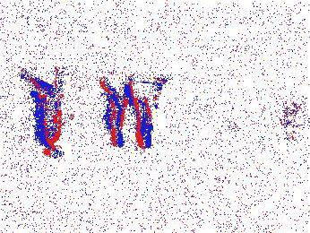
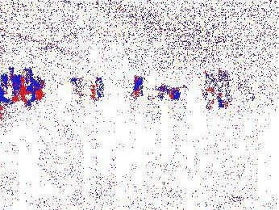
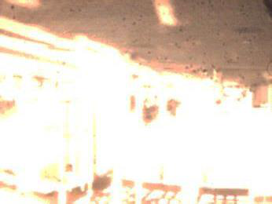

# FEMOT: Multi-Object Tracking using Frame and Event Cameras

## 摘要

**论文元信息。** 本文分析 arXiv:2606.14094《FEMOT: Multi-Object Tracking using Frame and Event Cameras》。作者为 Shiao Wang, Xiao Wang, Chao Wang, Yitao Li, Menghao Liu, Bo Jiang, Yaowei Wang, Yonghong Tian, Jin Tang。论文发表于 2026-06-15，研究类别为 cs.CV，论文链接为 https://arxiv.org/abs/2606.14094，PDF 链接为 https://arxiv.org/pdf/2606.14094。论文声明源码与 benchmark dataset 已发布于 https://github.com/Event-AHU/FEMOT（见 PAGE 2）。但本次可用材料未提供可核验的核心源码文件内容，因此本文不贴源码片段；代码分析部分按“本文未提供可确认的源码实现细节”处理。

**一句话总结。** FEMOT 同时是一套大规模 RGB-Event 多目标跟踪数据集和一个频域融合跟踪框架 FEMOTR：数据集补齐了 RGB-Event MOT 缺少系统 benchmark 的空白，方法则用频域幅值/相位调制与长时记忆交互提升复杂退化场景下的定位与身份关联能力（见 PAGE 3-4, PAGE 10-13）。

本文的核心贡献可以概括为三点。第一，作者提出 FEMOT 数据集，包含 100 个视频序列、200K 帧、14.58K 条轨迹和 0.42M 个边界框标注，覆盖 14 类挑战属性，并聚焦行人与车辆两类真实场景常见目标（见 PAGE 4, PAGE 15-16）。第二，作者提出 FEMOTR，一个基于 Transformer 的 RGB-Event MOT 框架，将 RGB 的低频外观/语义线索与事件流的高频运动/轮廓线索在频域中融合（见 PAGE 4, PAGE 8-11）。第三，作者在 FEMOT 与 DSEC-MOT 两个数据集上进行了实验，FEMOTR 在 FEMOT 上取得 HOTA 48.9、MOTA 52.0、IDF1 62.0，在 DSEC-MOT 上取得最优 AssA 67.8（见 PAGE 20-21）。

---

## 背景与动机

多目标跟踪（Multi-Object Tracking, MOT）的目标是在连续视频中同时定位多个目标，并在时间维度上维持它们的身份一致性。论文在 Introduction 中明确指出，MOT 是自动驾驶、智能交通、机器人和视频监控等应用中的基础任务（见 PAGE 2）。在传统 RGB 视频设定下，近年来的检测器、外观表征、数据关联策略和 Transformer 查询传播方法已经显著推动 MOT 性能提升。例如 MeMOTR 通过记忆增强轨迹表示处理长时关联，MOTIP 将关联从匹配问题转化为 ID prediction 问题（见 PAGE 2）。

然而，RGB 相机的感知机制决定了它在退化环境中存在天然限制。普通帧相机以固定帧率采样，主要依赖纹理、颜色和光照线索；当场景出现低照度、过曝、运动模糊、遮挡、密集人群、摄像机运动、雨雾天气、相似外观或尺度剧烈变化时，检测质量下降会进一步引发轨迹断裂和身份关联错误（见 PAGE 2）。这意味着 RGB-only MOT 的失败往往不是单一模块失败，而是“感知不稳定 → 关联错误积累 → 长时轨迹破碎”的级联问题。

事件相机（Event Camera）提供了一种互补传感机制。不同于以固定时间间隔输出完整图像的 RGB 相机，事件相机异步记录像素级亮度变化，具有微秒级时间分辨率、高动态范围、低延迟和较少运动模糊等特性（见 PAGE 3）。论文将这种互补性表述为：RGB frame 保留密集外观和语义信息，event data 提供运动敏感和高频线索（见 PAGE 3）。因此，在高速运动、低照度、过曝等极端条件下，RGB-Event 融合具有明确的感知优势。

但论文指出，RGB-Event MOT 仍然没有被系统研究，关键原因是缺少大规模、场景多样且有 identity-level trajectory annotation 的 benchmark 数据集（见 PAGE 3）。已有 RGB-Event 工作更多集中在目标检测、行人重识别和单目标跟踪；MOT 的难点更高，因为它不仅要求逐帧定位，还要求跨帧身份一致性，因此对标注粒度和轨迹 ID 的要求更严格（见 PAGE 3）。DSEC-MOT 是事件 MOT benchmarking 的重要进展，但论文认为其原始 benchmark 更偏 event-based MOT，对 RGB frame 与 event stream 的跨模态互补性系统评估仍不足（见 PAGE 6）。

FEMOT 的出发点正是在这个数据与方法的双重缺口上建立新的研究平台。数据层面，FEMOT 提供真实多场景、14 类挑战属性和 RGB/Event 对齐数据；方法层面，FEMOTR 不满足于简单空间域拼接或相加，而是在频域中对 RGB 与事件特征进行幅值（amplitude）和相位（phase）调制，并结合 Transformer decoder 与动态时间交互模块完成定位和身份关联（见 PAGE 4, PAGE 8-13）。这种设计直接对应 MOT 的两个核心目标：更可靠的 object localization 与更稳定的 identity association。

---

## 预备知识

### RGB-Event 数据与事件表示

事件流由一系列事件组成，每个事件记录一个像素位置在某一时刻发生的亮度变化。论文将异步事件流表示为 $E_p = \{e_i\}_{i=1}^{M}$，其中每个事件 $e_i$ 是四元组 $(x_i, y_i, t_i, p_i)$；$(x_i, y_i)$ 表示空间坐标，$t_i \in [0,T]$ 表示时间戳，$p_i$ 表示 polarity，即亮度变化方向，$M$ 是事件总数（见 PAGE 8）。

为了让事件数据与主流深度网络兼容，作者将异步 event stream 按 RGB 帧曝光时间窗口积累成 frame-like representation。对第 $t$ 个 RGB 帧 $I_t \in \mathbb{R}^{3 \times H \times W}$，用曝光起止时间 $t_s$ 和 $t_e$ 选择事件片段：

$$
E_p^t = \{e_i = (x_i, y_i, t_i, p_i) \mid t_i \in [t_s, t_e]\}.
$$

这个公式对应论文 Eq. (1)，含义是：只取与当前 RGB 帧时间窗口对齐的事件，用它构造当前时刻的事件图像 $E_t \in \mathbb{R}^{3 \times H \times W}$（见 PAGE 8）。这里 $H$ 与 $W$ 是图像空间分辨率，三通道 canvas 用不同颜色编码 ON/OFF events（见 PAGE 8）。

### MOT 指标与身份关联

论文采用标准 MOT 指标，包括 MOTA、HOTA、IDF1、DetA、AssA 和 MOTP（见 PAGE 18-19）。MOTA 汇总 false positives、false negatives 和 identity switches，但不显式拆分检测质量与关联质量；HOTA 则进一步将 tracking performance 分解为 Detection Accuracy（DetA）和 Association Accuracy（AssA）（见 PAGE 19）。这对本文尤其重要，因为 FEMOTR 的主要卖点之一不是单纯提高检测分数，而是同时改善检测与身份关联。

论文给出 DetA 与 AssA 的定义：

$$
DetA = \frac{TP^*_{Det}}{TP^*_{Det} + FN^*_{Det} + FP^*_{Det}},
$$

$$
AssA = \frac{TP^*_{Ass}}{TP^*_{Ass} + FN^*_{Ass} + FP^*_{Ass}}.
$$

这两个公式分别对应论文 Eq. (18) 与 Eq. (19)，含义是：DetA 衡量检测层面的真阳性占比，AssA 衡量关联层面的真阳性占比；二者共同解释一个 tracker 是“看得准”还是“认得稳”（见 PAGE 19）。

---

## 方法详解

### 总体框架：从双模态输入到轨迹记忆更新

FEMOTR 的输入是当前时刻的 RGB frame $I_t$ 与事件图像 $E_t$。论文首先使用 shared ResNet-50 backbone 提取两种模态的多尺度层级特征，RGB 特征记为 $X_t = \{X_l^t\}_{l=1}^{L}$，event 特征记为 $Y_t = \{Y_l^t\}_{l=1}^{L}$，其中 $l$ 是 backbone stage 索引（见 PAGE 8-9）。随后，Frequency Aware Feature Fusion（FAF）模块生成增强后的融合特征 $F_t = \{F_l^t\}_{l=1}^{L}$（见 PAGE 9-10）。

融合特征被展平后加入 positional embedding 与 level embedding，并输入 multi-scale deformable Transformer encoder 得到编码表示 $F^t_{en}$（见 PAGE 9）。解码过程分为两阶段：第一阶段使用 learnable detection queries $Q_{det}$ 通过 Detection Decoder 产生 dynamic detection embeddings $E^t_{det}$；第二阶段将这些 detection embeddings 与从历史帧传播来的 track embeddings $E^t_{tck}$ 拼接，输入 Transformer Joint Decoder，输出 $[O^t_{det}, O^t_{tck}]$（见 PAGE 9）。

这种结构对应 query-based Transformer tracking 范式，但引入了 RGB-Event 多模态融合与动态时间交互。$O^t_{det}$ 主要负责发现当前帧新出现目标，$O^t_{tck}$ 对应从前一时刻传播来的已存在目标；输出 embedding 再经 prediction heads 预测每个目标的分类置信度 $c_i^t$ 和 bounding box $b_i^t$（见 PAGE 9）。随后，Dynamic Temporal Interaction Module（DTIM）利用当前输出、上一帧输出和 long-term memory 更新下一帧的 track embeddings 与 memory（见 PAGE 9, PAGE 11-13）。

**图像证据一：事件相机与 RGB 相机机制对比。**

用途：说明 FEMOT 的传感器互补性来自成像机制差异，而不是后处理技巧。  
读图要点：PAGE 3 的 Fig. 1(a) 对比了 conventional RGB camera 的离散帧采样与 bio-inspired event camera 的异步事件流。  
支撑的判断：RGB 提供密集外观，事件流提供高时间分辨率亮度变化，这是后续 RGB-Event MOT 的物理基础（见 PAGE 3）。

该图支撑了论文的核心动机：在固定帧率 RGB 输入受限的场景中，事件相机能够补充时间连续、运动敏感的观测。它不能单独证明 FEMOTR 的性能优势，但能解释为什么 event modality 在低照、过曝和运动模糊条件下可能提供有效线索（见 PAGE 3）。

**图像证据二：极端条件下事件输入的优势。**

用途：展示低照度、运动模糊和过曝等退化场景中，事件输入相对 RGB 输入可能保留更清晰的轮廓或运动信息。  
读图要点：PAGE 3 的 Fig. 1(b) 展示了 Low illumination、Motion blur、Overexposure 三类条件下的 RGB/Event 对比。  
支撑的判断：论文关于事件相机“high dynamic range, low latency, reduced motion blur”的论断有视觉示例支撑（见 PAGE 3）。

该图对业务价值有直接意义：如果实际系统面对夜间、强光、快速运动目标，仅用 RGB tracker 可能出现检测不稳和 ID 断裂；事件流能否改善效果，需要结合硬件、数据域和部署成本进一步验证。

**图像证据三：FEMOTR 框架示意。**

用途：说明论文方法不是简单将 RGB 和 event 输入拼接，而是包含 backbone、Frequency Fusion、Encoder、Decoder 与 Transformer Joint Decoder 的多阶段结构。  
读图要点：PAGE 3 的 Fig. 1(c) 展示 RGB Input 与 Event Input 分别经过 backbone 得到特征，再经 Frequency Fusion 进入 Transformer tracking pipeline。  
支撑的判断：FEMOTR 的核心设计点是“频域融合 + query-based tracking”，而不是仅增加一个事件输入通道（见 PAGE 3-4）。

该图可以作为阅读 Methodology 的入口。完整框架的细化版本见论文 Fig. 2，但本次提供的 figures 列表没有 Fig. 2 的图片路径，因此本文不嵌入不存在的 Fig. 2 图像，只按 PAGE 7-8 的文字描述引用其内容。

**图像证据四：PAGE 3 补充抽取图。**

用途：补充展示 PAGE 3 图像区域中关于 RGB/Event 输入、频域融合或框架结构的局部视觉证据。  
读图要点：该图片来自提供的 `figures` 列表，页码为 PAGE 3，需与 PAGE 3 的 Fig. 1 caption 一并理解。  
支撑的判断：PAGE 3 的图像证据整体服务于“传感器互补性”和“FEMOTR 框架概览”两个判断（见 PAGE 3）。

由于提供的图片没有 caption candidates，本文不对该抽取图作超出 PAGE 3 文本证据之外的额外解释；其作用仅限于辅助理解 Fig. 1 区域。

### 创新点一：FEMOT 数据集补齐 RGB-Event MOT benchmark 空白

论文首先将 FEMOT 定位为一个大规模 RGB-Event multimodal dataset for multi-object tracking。与已有 MOT 数据集相比，FEMOT 的独特性在于它同时包含 RGB 与 event data，并提供 identity-level trajectory annotations（见 PAGE 3-4）。根据 Table 1，FEMOT 含 100 个视频、200K 帧、14.58K tracks、0.42M annotation boxes；相比 DSEC-MOT 的 12 个视频、23.08K 帧、0.50K tracks 和 0.037M boxes，FEMOT 在轨迹数量和标注框数量上显著更大（见 PAGE 4）。

FEMOT 的采集设备为 DVS346 camera，它提供 spatially well-aligned frame and event streams（见 PAGE 4）。这点很关键，因为 RGB-Event 融合不仅要求时间对齐，也要求空间对齐；如果两模态在几何上不一致，简单融合会把跨模态互补性变成噪声。论文没有在可用文本中给出标定误差或对齐精度的定量指标，因此关于空间对齐质量只能依据作者描述，不能进一步推断其标定误差范围。

数据集覆盖两类真实场景核心对象：people 和 vehicles（见 PAGE 4, PAGE 16）。这种类别选择服务于智能交通、校园、道路、商场、桥梁、室内外建筑等场景，而不是泛化到所有开放类别 tracking。论文在 Protocols 中说明采集环境包括白天与夜晚、学校入口、食堂内外、教学楼、商场周边、城市街道和天桥等；相机状态包括旋转、平移、突然抖动、eye-level 和 bird’s-eye views，以及车载相机场景（见 PAGE 13-14）。因此 FEMOT 更适合评估真实退化场景中的行人与车辆 MOT，而不是通用开放世界 MOT。

FEMOT 的 14 个 challenge attributes 包括 Low Illumination（LI）、Static Target（NMO）、Fast Motion（FM）、Camera Motion（CM）、High Exposure（HE）、Small Objects（SO）、Similar Appearance（SA）、Dynamic Background（DB）、Extremely Complex Scene（ECS）、Scale Variation（SV）、Viewpoint Variation（VC）、Frequent Entry/Exit（FEE）、Dense Scene（DS）和 Long-Term Tracking（LT）（见 PAGE 15）。其中 Frequent Entry/Exit 出现 96 次，Scale Variation 出现 88 次，Fast Motion 67 次，Dense Scene 51 次，Small Objects 50 次（见 PAGE 16）。这些属性直接对应 MOT 中轨迹初始化、终止、重识别、尺度鲁棒性和密集目标区分等难点。

### 创新点二：Frequency Aware Feature Fusion 以幅值/相位调制建模互补性

FEMOTR 的关键方法模块是 Frequency Aware Feature Fusion（FAF）。论文的基本假设是：RGB features 通常提供外观和语义信息，而 event features 对 motion boundaries 与 rapid intensity changes 更敏感；直接空间域融合可能无法充分利用这种频率模式互补性，并且容易受 modality-specific noise 影响（见 PAGE 10）。因此，作者将 RGB、event 和 cross-modal fusion branch 都变换到频域，再分别处理 amplitude 与 phase。

FAF 的三分支输入定义为：

$$
B_X^t = X^t,\quad B_Y^t = Y^t,\quad B_Z^t = Z^t = Concat(X^t, Y^t).
$$

这是论文 Eq. (2)，其中 $B_X^t$ 是 RGB branch 输入，$B_Y^t$ 是 event branch 输入，$B_Z^t$ 是跨模态拼接分支输入（见 PAGE 10）。用人话解释：模型不是只对 RGB 和 event 各自做处理，而是同时构造一个“融合视角”作为后续频域引导来源。

每个分支先经过 depthwise separable convolution block 捕捉局部空间模式：

$$
U_b^t = DWConv_b(B_b^t).
$$

这是论文 Eq. (3)，其中 $b \in \{X,Y,Z\}$ 表示 RGB、event 或 fusion branch（见 PAGE 10）。该步骤的意义是：在进入 FFT 前先提取局部空间结构，使频域分析建立在局部增强后的特征上，而不是直接对原始 backbone 特征做变换。

随后，特征被二维快速傅里叶变换（2D FFT）映射到频域：

$$
S_b = \mathcal{F}(U_b^t).
$$

这是论文 Eq. (4)，$\mathcal{F}(\cdot)$ 表示 2D FFT（见 PAGE 10）。该公式在说：每个分支的空间特征被转化为频率表示，从而可以显式区分 amplitude 和 phase。一般而言，幅值更多反映频率成分强度，相位与结构位置和形状信息相关；但论文没有给出更细的理论证明，因此此处只按常见频域解释辅助理解。

论文进一步将频域表示解耦为 amplitude 与 phase，并通过 channel convolution 处理：

$$
A_b = Conv_b(A(S_b)),\quad P_b = Conv_b(P(S_b)).
$$

这是论文 Eq. (5)，其中 $A(\cdot)$ 表示 amplitude extraction，$P(\cdot)$ 表示 phase extraction（见 PAGE 10）。用人话解释：模型分别学习“哪些频率成分强”和“这些频率成分如何排列”，而不是把复数频谱整体混合处理。

FAF 的核心调制操作定义为：

$$
Attn(V,W) = V + V \odot Softmax(V \odot W).
$$

这是论文 Eq. (6)，其中 $\odot$ 表示逐元素乘法，$V$ 是被调制的频率成分，$W$ 是对应 guidance component（见 PAGE 10）。这个公式表示：先用 $V \odot W$ 计算被引导的响应，再经过 Softmax 形成权重，最后作为残差增强加回 $V$。它的作用不是替换原始分支，而是在保留原有模态特征的基础上强化与 guidance 一致的频率响应。

cross-modal fusion branch 先做自调制：

$$
\tilde{A}_Z = Proj_Z(Attn(A_Z,A_Z)),\quad \tilde{P}_Z = Proj_Z(Attn(P_Z,P_Z)).
$$

这是论文 Eq. (7)，其作用是生成跨模态 amplitude guidance $\tilde{A}_Z$ 和 phase guidance $\tilde{P}_Z$（见 PAGE 10-11）。随后，RGB 和 event 分支分别接受这些融合 guidance 的调制：

$$
\tilde{A}_b = Proj_b(Attn(A_b,\tilde{A}_Z)),\quad
\tilde{P}_b = Proj_b(Attn(P_b,\tilde{P}_Z)),\quad b \in \{X,Y\}.
$$

这是论文 Eq. (8)，含义是：融合分支强调跨模态共享频率响应，而 RGB/event 分支保留各自 modality-specific characteristics（见 PAGE 11）。这解释了为什么消融实验中 removing modality-specific branches 会损害 HOTA 和 IDF1：如果只保留融合而不保留各模态差异，模型会丢失 RGB 外观线索或事件运动轮廓线索的一部分（见 PAGE 21）。

调制后，增强的 amplitude 与 phase 被重构为复数频域表示：

$$
\tilde{S}_b = \tilde{A}_b \odot e^{j\tilde{P}_b},\quad b \in \{X,Y,Z\}.
$$

这是论文 Eq. (9)，$j$ 是虚数单位（见 PAGE 11）。该公式说明：幅值和相位不是最终输出，而是重新组合为可逆变换所需的复数频谱。随后模型通过 inverse FFT 回到空间域，并加上 residual connection：

$$
\hat{B}_b^t = \mathcal{F}^{-1}(Conv_b(\tilde{S}_b)) + B_b^t,\quad b \in \{X,Y,Z\}.
$$

这是论文 Eq. (10)，$\mathcal{F}^{-1}(\cdot)$ 表示 inverse FFT（见 PAGE 11）。用人话解释：FAF 在频域中完成互补性增强，但最终仍输出空间特征，以便后续 Transformer encoder-decoder 使用。

最后三个分支的重构输出相加：

$$
F^t = \hat{X}^t + \hat{Y}^t + \hat{Z}^t.
$$

这是论文 Eq. (12)，表示最终 fused representation 同时整合 modality-specific information 与 cross-modal frequency cues（见 PAGE 11）。这也是 FEMOTR 区别于 Add、Concatenate 以及通用频域融合方法的核心：它不是简单相加，也不是直接套用通用频域模块，而是用 cross-modal branch 指导 RGB/event 分支的 amplitude/phase 调制。

### 创新点三：Dynamic Temporal Interaction Module 强化长时身份一致性

FEMOTR 的另一个关键组件是 Dynamic Temporal Interaction Module（DTIM）。论文说明该模块 follow MeMOTR，用于 robust long-term tracking，并接收上一帧输出 embedding $O_{tck}^{t-1}$、当前帧输出 embedding $O_{tck}^{t}$ 以及 long-term memory $M_{tck}^{t}$，生成下一帧的更新 memory 与 track embedding（见 PAGE 11-12）。

长时记忆更新采用 exponential moving average：

$$
\tilde{M}_{tck}^{t+1} = (1-\lambda)M_{tck}^{t} + \lambda \cdot O_{tck}^{t}.
$$

这是论文 Eq. (13)，其中 $\lambda$ 是 memory update rate，作者经验设置为 0.01（见 PAGE 12）。该公式的含义是：长期记忆主要保留历史信息，同时缓慢吸收当前帧信息。对于 MOT 来说，这种低速更新有助于避免单帧噪声、遮挡或模糊导致轨迹表示剧烈漂移。

DTIM 还通过 channel-wise weights 自适应强调可靠通道。论文定义：

$$
W_{tck}^{t} = Sigmoid(MLP_1(O_{tck}^{t})),
$$

$$
\hat{O}_{tck}^{t} = MLP_2([W_{tck}^{t} \odot O_{tck}^{t}, O_{tck}^{t-1}]).
$$

这分别是论文 Eq. (14) 与 Eq. (15)，其中 $W_{tck}^{t}$ 是通道权重，$[\cdot,\cdot]$ 表示拼接（见 PAGE 12）。用人话解释：模型先判断当前 track embedding 中哪些通道可靠，再将加权后的当前信息与上一帧输出拼接，得到融合后的轨迹表示。

随后，DTIM 使用 dynamic memory-attention layer，让不同轨迹之间发生交互。论文描述中，$\hat{O}_{tck}^{t}$、$M_{tck}^{t}$ 和 $O_{tck}^{t}$ 分别作为 query、key、value 输入 multi-head attention，输出再加到 long-term memory 上，并通过 FFN 预测下一帧 track embedding（见 PAGE 12-13）。这使得轨迹更新不只是单条轨迹的独立递推，也能建模多个目标之间的交互关系。对于 dense scene、relative position switches 和 similar appearance，这类跨轨迹交互尤其重要（见 PAGE 16-18）。

### 训练目标与匹配机制

FEMOTR 使用多任务损失，包括分类损失、L1 box regression loss 和 GIoU loss：

$$
L_{total} = \lambda_1 L_{Focal} + \lambda_2 L_{L1} + \lambda_3 L_{GIoU}.
$$

这是论文 Eq. (16)，其中 $\lambda_1=2$、$\lambda_2=5$、$\lambda_3=2$（见 PAGE 13）。该公式对应标准检测式训练目标：Focal Loss 处理类别不平衡，L1 约束边界框坐标，GIoU 约束预测框与真值框的几何重叠质量。

训练阶段还使用 Hungarian matching 解决 prediction 与 ground-truth target 的最小代价二分匹配问题：

$$
C_{ij} = \lambda_4 C_{cls}(i,j) + \lambda_5 C_{L1}(i,j) + \lambda_6 C_{giou}(i,j).
$$

这是论文 Eq. (17)，其中 $\lambda_4=2$、$\lambda_5=5$、$\lambda_6=2$（见 PAGE 13）。这里 $C_{cls}$、$C_{L1}$、$C_{giou}$ 分别表示分类、L1 box 与 GIoU matching cost。检测 queries 只匹配尚未与 existing track queries 关联的 ground-truth objects，而 propagated track queries 根据其关联 identity 接受监督（见 PAGE 13）。这保证了“新目标发现”和“旧目标延续”的训练职责被区分。

### 代码状态与可复现性证据边界

论文在摘要后明确声明 source code and benchmark dataset 已发布到 GitHub（见 PAGE 2），Implementation Details 中也写到 “More details can be found in our source code”（见 PAGE 19）。但本次输入材料没有包含具体源码文件、函数实现或配置文件内容；因此，本文不提供伪造的代码片段，也不构造论文方法与源码路径的逐行对应关系。

本文未提供可确认的公开代码实现细节。可确认的事实仅包括：论文给出 GitHub 地址，论文声称源码与 benchmark dataset 已发布（见 PAGE 2）；方法实现层面的 backbone、FAF、DTIM、loss、训练参数等依据论文正文描述（见 PAGE 8-13, PAGE 19）。若后续需要复现，应以仓库实际代码版本为准，重点核验 FAF 中 FFT/Amplitude/Phase Attention 的实现、DTIM 的 memory update 与 attention 输入定义、以及训练配置是否与 PAGE 19 的 implementation details 一致。

---

## 实验分析

### 数据集规模与 benchmark 对比

论文 Table 1 将 FEMOT 与现有 MOT、RGB-Infrared MOT、RGB-Event SOT 和 RGB-Event MOT 数据集进行比较（见 PAGE 4）。从任务定位看，FEMOT 是 RGB-Event MOT 数据集，而 FE108、VisEvent、COESOT 是 RGB-Event SOT 数据集；DSEC-MOT 虽然也是 RGB-Event MOT，但规模更小（见 PAGE 4）。

| 数据集 | 年份 | 模态 | 任务 | 视频数 | 帧数 | Tracks | 标注框 |
|---|---:|---|---|---:|---:|---:|---:|
| DSEC-MOT | 2025 | RGB-Event | MOT | 12 | 23.08K | 0.50K | 0.037M |
| FEMOT | 2026 | RGB-Event | MOT | 100 | 200K | 14.58K | 0.42M |
| VisEvent | 2024 | RGB-Event | SOT | 820 | 371K | - | 0.37M |
| COESOT | 2025 | RGB-Event | SOT | 1,354 | 479K | - | 0.48M |
| BDD100K | 2018 | RGB | MOT | 2,000 | 318K | 130.60K | 3.30M |

表格解读：FEMOT 的绝对规模不如 BDD100K 这类 RGB-only 大型自动驾驶数据集，但在 RGB-Event MOT 这一细分任务中，相比 DSEC-MOT 显著增加了视频数、帧数、轨迹数和标注框数量。与 RGB-Event SOT 数据集相比，FEMOT 的关键差异不是帧数最多，而是提供多目标跟踪所需的 identity-level tracks。这个差异直接决定它能支持身份关联 benchmark，而不只是单目标定位评估（见 PAGE 3-4）。

### FEMOT 数据集难度证据

论文在 Fig. 5 和 Fig. 6 中给出 FEMOT 的属性统计与运动/外观难度分析。14 类挑战属性中，Frequent Entry/Exit 出现 96 次，Scale Variation 出现 88 次，Fast Motion 67 次，Dense Scene 51 次，Small Objects 50 次（见 PAGE 15-16）。这说明 FEMOT 不是只强调事件相机常见的高速运动，而是同时覆盖 MOT 中会造成身份断裂的多种真实场景因素。

论文还报告 FEMOT 在相邻帧 bounding-box IoU 上低于 MOT17、MOT20、VTMOT 和 DanceTrack：MOT17 为 0.938，MOT20 为 0.959，VTMOT 为 0.903，DanceTrack 为 0.894，而 FEMOT 为 0.581（见 PAGE 16-17）。相邻帧 IoU 低意味着目标在相邻帧之间位移更大或形变更明显，传统基于短时平滑运动假设的关联方法会更难工作。

| 数据集 | Average IoU | FRPS |
|---|---:|---:|
| MOT17 | 0.938 | 0.0022 |
| MOT20 | 0.959 | 0.0018 |
| VTMOT | 0.903 | 0.0094 |
| DanceTrack | 0.894 | 0.0312 |
| FEMOT | 0.581 | 0.0732 |

表格解读：FEMOT 同时呈现最低相邻帧 IoU 和最高 Frequency of Relative Position Switches（FRPS）。这意味着目标不仅移动幅度大，而且目标之间的相对空间顺序频繁变化。对 MOT 来说，这会削弱简单 motion model 与空间邻近匹配的可靠性，也会放大相似外观条件下的 ID switch 风险。论文进一步用 t-SNE 可视化说明 FEMOT 的 re-ID features 更不易分离、更纠缠，说明外观表征本身也更难学（见 PAGE 17-18）。

### FEMOT 主结果：FEMOTR 在新数据集上的综合优势

论文在 Table 2 中比较了 15 个 state-of-the-art trackers 与 FEMOTR 在 FEMOT 数据集上的结果（见 PAGE 20）。所有 baseline 都以 RGB-Event 输入形式重新训练，覆盖 tracking-by-detection、joint detection-and-tracking 和 query-based Transformer trackers 三类方法（见 PAGE 18）。

| Tracker | 类型或代表性 | HOTA | DetA | AssA | MOTA | MOTP | IDF1 |
|---|---|---:|---:|---:|---:|---:|---:|
| ByteTrack | tracking-by-detection | 36.3 | 35.4 | 38.1 | 38.0 | 73.7 | 44.3 |
| SRTrack | tracking-by-detection | 38.5 | 35.8 | 42.0 | 40.8 | 76.0 | 47.0 |
| Samba | joint/state-space baseline | 38.1 | 30.0 | 49.1 | 33.7 | 75.8 | 48.1 |
| MeMOTR | query-based Transformer | 44.0 | 40.2 | 49.0 | 45.4 | 76.9 | 54.9 |
| FEMOTR | proposed | 48.9 | 45.2 | 53.8 | 52.0 | 76.7 | 62.0 |

表格解读：FEMOTR 相比最强 baseline MeMOTR，HOTA 从 44.0 提升到 48.9，MOTA 从 45.4 提升到 52.0，IDF1 从 54.9 提升到 62.0（见 PAGE 20）。HOTA、DetA、AssA 同时提升说明 FEMOTR 不是只改善检测或只改善关联，而是在检测质量与身份保持之间取得更均衡的增益。MOTP 从 76.9 略低到 76.7，表明定位精度指标本身没有显著优势；主要收益来自检测/关联整体质量与 IDF1。

值得注意的是，Samba 的 AssA 为 49.1，略高于 MeMOTR 的 49.0，但 DetA 和 MOTA 明显低于 MeMOTR 与 FEMOTR（见 PAGE 20）。这说明单独看 AssA 可能掩盖检测能力不足；FEMOTR 的优势在于 HOTA、DetA、AssA、MOTA、IDF1 的整体均衡。对于真实业务部署，这种均衡比单个指标峰值更重要，因为检测漏失和 ID 切换都会影响轨迹可用性。

### DSEC-MOT 结果：关联强，但检测质量仍限制整体表现

论文也在 DSEC-MOT 上评估 FEMOTR，并与 event-only 和 RGB-Event 方法比较（见 PAGE 20-21）。结果显示，FEMOTR 的 AssA 最高，为 67.8；但 HOTA 为 52.4，低于 Samba 的 55.4，也略低于 SpikeMOT 的 52.5；IDF1 为 59.0，低于 SpikeMOT 的 62.9 和 Samba 的 64.9（见 PAGE 20-21）。

| Tracker | Modality | HOTA | DetA | AssA | MOTA | IDF1 |
|---|---|---:|---:|---:|---:|---:|
| SpikeMOT | Event | 52.5 | 49.5 | 55.7 | 54.7 | 62.9 |
| MeMOTR | RGB-Event | 48.4 | 36.2 | 64.9 | 35.8 | 54.9 |
| Samba | RGB-Event | 55.4 | 46.4 | 66.5 | 50.3 | 64.9 |
| FEMOTR | RGB-Event | 52.4 | 40.6 | 67.8 | 37.5 | 59.0 |

表格解读：FEMOTR 在 DSEC-MOT 上最突出的优势是 AssA，即身份关联能力；但 DetA 只有 40.6，低于 SpikeMOT 的 49.5 和 Samba 的 46.4（见 PAGE 20-21）。这说明 FEMOTR 的长时关联与频域融合设计确实能帮助维护 identity，但在 DSEC-MOT 这种 event-based driving benchmark 上，检测质量仍然限制整体 HOTA、MOTA 和 IDF1。论文也明确指出，further improvements in detection accuracy could enhance overall performance on DSEC-MOT（见 PAGE 21）。

### 组件消融：FAF 与共享多尺度权重最关键

论文 Table 4 展示了 component analysis（见 PAGE 21）。移除 shared multi-scale weights 后 HOTA 从 48.9 降到 40.5，IDF1 从 62.0 降到 50.9，是最严重的退化；移除 Frequency Aware Feature Fusion 后，HOTA 降到 44.0，AssA 降到 49.0，IDF1 降到 54.9（见 PAGE 21）。这表明共享多尺度建模与频域融合都是核心组件。

| 变体 | HOTA | DetA | AssA | MOTA | MOTP | IDF1 |
|---|---:|---:|---:|---:|---:|---:|
| w/o Shared Multi-scale Weights | 40.5 | 37.1 | 45.1 | 42.8 | 76.8 | 50.9 |
| w/o Frequency Aware Feature Fusion | 44.0 | 40.2 | 49.0 | 45.4 | 76.9 | 54.9 |
| w/o Modality Specific Branch | 45.5 | 41.2 | 51.0 | 47.5 | 76.7 | 57.3 |
| w/o Amplitude/Phase Attention | 48.3 | 45.7 | 52.0 | 52.5 | 76.6 | 61.1 |
| FEMOTR | 48.9 | 45.2 | 53.8 | 52.0 | 76.7 | 62.0 |

表格解读：Amplitude/Phase Attention 的消融很有信息量。移除它后 DetA 和 MOTA 反而略高，但 HOTA、AssA 和 IDF1 下降（见 PAGE 21）。这说明幅值/相位 attention 的主要收益更偏身份关联和轨迹一致性，而不是单帧检测质量。对 MOT 来说，这种 trade-off 合理：为了更稳定地维护 identity，模型可能牺牲极小的检测分数，但换来更高的关联可靠性。

### 融合策略消融：通用频域方法不一定适合 RGB-Event MOT

论文 Table 5 比较了不同 fusion strategies（见 PAGE 21-22）。Baseline 的 HOTA 为 44.0，Add 提升到 47.1，Concatenate 为 45.5；但 FECNet、FCFE、FMAP 等已有频域方法在该任务上没有稳定增益，其中 FECNet HOTA 为 39.2，FCFE 为 41.0，FMAP 为 40.8，均低于 baseline（见 PAGE 21-22）。FAF 取得 HOTA 48.9、DetA 45.2、AssA 53.8、MOTA 52.0、IDF1 62.0 的最好结果（见 PAGE 22）。

| Fusion Strategy | HOTA | DetA | AssA | MOTA | MOTP | IDF1 |
|---|---:|---:|---:|---:|---:|---:|
| Baseline | 44.0 | 40.2 | 49.0 | 45.4 | 76.9 | 54.9 |
| Add | 47.1 | 44.0 | 51.3 | 50.0 | 76.7 | 59.1 |
| Concatenate | 45.5 | 41.2 | 51.0 | 47.5 | 76.7 | 57.3 |
| FECNet | 39.2 | 32.3 | 48.3 | 20.7 | 76.0 | 48.7 |
| FCFE | 41.0 | 37.6 | 45.7 | 47.5 | 77.0 | 51.0 |
| FMAP | 40.8 | 36.6 | 46.4 | 41.8 | 76.7 | 51.1 |
| FAF | 48.9 | 45.2 | 53.8 | 52.0 | 76.7 | 62.0 |

表格解读：Add 的效果已经很强，说明 RGB 与 event 的互补性真实存在；但 Concatenate 不如 Add，说明增加通道维度并不自动带来更好的跨模态利用。更重要的是，已有频域 fusion 方法在 FEMOT 上表现不佳，证明“频域”本身不是充分条件。FAF 的优势来自为 RGB-Event MOT 设计的三分支结构、amplitude/phase guidance 和 modality-specific branch preservation（见 PAGE 10-11, PAGE 21-22）。

### 输入模态消融：Event-only 不足以支撑可靠检测

论文 Table 6 对比了 event-only、RGB-only 与 RGB-Event 输入（见 PAGE 22）。Baseline 的 event-only HOTA 仅 17.7，RGB-only 为 23.7，而 RGB-Event 为 44.0；FEMOTR 的 event-only HOTA 为 14.3，RGB-only 为 42.5，RGB-Event 为 48.9（见 PAGE 22）。这组结果有两层含义。

第一，事件模态单独用于该框架并不可靠，尤其 DetA 和 MOTA 很低。FEMOTR event-only 的 DetA 仅 6.6，MOTA 仅 2.3（见 PAGE 22）。这说明事件流虽然在极端条件下提供高频运动线索，但缺少密集外观与语义信息时，单独完成稳定检测仍然困难。第二，FEMOTR 的 RGB-only 已经较强，但 RGB-Event 进一步显著提升 HOTA、DetA、AssA、MOTA 和 IDF1，说明事件流的价值主要体现在补充 RGB，而不是取代 RGB。

| 方法 | 模态 | HOTA | DetA | AssA | MOTA | MOTP | IDF1 |
|---|---|---:|---:|---:|---:|---:|---:|
| Baseline | Event | 17.7 | 7.8 | 40.1 | 5.9 | 73.7 | 15.5 |
| Baseline | RGB | 23.7 | 16.9 | 34.2 | 16.5 | 74.6 | 27.1 |
| Baseline | RGB & Event | 44.0 | 40.2 | 49.0 | 45.4 | 76.9 | 54.9 |
| FEMOTR | Event | 14.3 | 6.6 | 32.3 | 2.3 | 70.8 | 11.8 |
| FEMOTR | RGB | 42.5 | 37.4 | 49.1 | 44.0 | 76.9 | 53.9 |
| FEMOTR | RGB & Event | 48.9 | 45.2 | 53.8 | 52.0 | 76.7 | 62.0 |

表格解读：这张表对工程落地尤其重要。事件相机不是“单独替代 RGB”的传感器选择，而更像增强复杂场景鲁棒性的辅助模态。对于已有 RGB MOT 系统，FEMOTR 的结果支持“RGB 主导语义与外观，event 补充运动与轮廓”的系统路线；但如果只部署 event-only，论文证据反而显示检测性能会明显不足（见 PAGE 22）。

---

## 讨论

FEMOT/FEMOTR 的适用边界首先由硬件和数据域决定。事件相机提供高动态范围、低延迟和运动敏感线索，但这要求采集设备支持同步或良好对齐的 RGB 与 event streams。论文使用 DVS346 camera，并强调 spatially well-aligned frame and event streams（见 PAGE 4）。因此，FEMOTR 对已有纯 RGB 摄像头系统不是即插即用方法，而更适合具备事件相机硬件、或正在评估极端光照/高速运动感知方案的系统。

方法层面，FAF 的核心假设是 RGB 与 event 在频域中存在可利用的互补结构：RGB 提供 low-frequency appearance and semantic cues，event 提供 high-frequency motion and contour information（见 PAGE 4, PAGE 10）。实验支持该假设在 FEMOT 上有效，尤其在 HE、SO、SA、DB 等挑战属性下表现强（见 PAGE 22-23）。但在 DSEC-MOT 上，FEMOTR 虽有最高 AssA，却没有最高 HOTA 和 IDF1，说明频域融合与长时记忆交互并不能自动解决所有数据域中的检测问题（见 PAGE 20-21）。

从 benchmark 价值看，FEMOT 的贡献可能大于单个方法。论文不仅提出新模型，还重新训练和评估了超过十个 strong trackers，建立 RGB-Event MOT 比较基线（见 PAGE 4, PAGE 18）。这对后续研究很重要，因为没有统一数据集和协议时，RGB-Event MOT 的方法改进难以横向比较。FEMOT 的挑战属性、MOT-style 标注格式、TrackEval 评估和 class-aware evaluation 脚本共同构成了后续方法迭代的基础（见 PAGE 15, PAGE 18-19）。

---

## 局限分析

作者自述的第一项局限是事件密度没有根据场景变化动态调整。论文在 Limitations and Future Work 中指出，fast-moving targets 通常产生 dense event streams，而 slow-moving targets 产生 relatively sparse event responses；当前框架没有根据不同 motion speeds 动态调整 event accumulation window（见 PAGE 24）。这会导致事件表示在不同速度目标之间不够平衡：窗口过短可能丢失慢目标事件，窗口过长可能让快目标事件过密并引入噪声。作者认为动态适配 event accumulation window 是未来改进方向（见 PAGE 24）。

作者自述的第二项局限是没有引入自然语言模态。论文认为 language descriptions 可以提供 high-level semantic priors，例如 object categories、spatial relations 和 motion intentions，从而可能进一步提升 localization 与 identity association（见 PAGE 24-25）。不过，论文没有给出语言标注、语言输入来源或视觉-语言融合实验，因此这只是未来方向，不应解读为当前 FEMOTR 已具备语言引导能力。

从独立判断看，本文还有三个证据边界。第一，论文虽然声明源码和 benchmark dataset 已发布，但本次材料没有提供核心源码文件内容，因此无法核验 FAF、DTIM、训练策略是否与论文公式完全一致，也无法给出论文方法到源码函数的对应关系。第二，FEMOT 的类别主要是 people 和 vehicles（见 PAGE 4, PAGE 16），这使其对交通、校园、城市监控场景很有价值，但不能直接外推到开放类别或工业小目标等不同域。第三，DSEC-MOT 结果显示 FEMOTR 的检测质量仍有限，DetA 和 MOTA 不如 SpikeMOT/Samba（见 PAGE 20-21），说明该方法的跨数据集泛化优势主要集中在 association，而非全面领先。

---

## 结论

FEMOT 的主要价值在于把 RGB-Event MOT 从零散任务推进到可系统评估的 benchmark 阶段。它提供了 100 个视频、200K 帧、14.58K tracks、0.42M boxes 和 14 类挑战属性，并围绕低照、过曝、高速运动、相机运动、小目标、相似外观、频繁进出和密集场景等真实问题构建评估平台（见 PAGE 4, PAGE 15-16）。这使研究者可以更具体地分析 RGB tracker 在退化场景中的失效点，以及事件相机是否能提供可量化补益。

FEMOTR 的方法贡献在于将 RGB-Event 融合从空间域拼接推进到频域 amplitude/phase modulation，并结合 query-based Transformer tracking 与 dynamic temporal interaction 进行身份维护。FEMOT 上的主实验、组件消融、融合策略消融和输入模态消融共同支持这样一个结论：RGB 与 event 的互补性真实存在，但必须通过面向 MOT 的融合结构与轨迹记忆机制加以利用（见 PAGE 20-22）。同时，DSEC-MOT 结果提醒我们，该方法仍受检测质量限制，未来需要在 event accumulation、检测增强、跨域泛化和可能的语言先验方面继续改进（见 PAGE 20-21, PAGE 24-25）。

---

## 证据索引

| 关键事实 | PAGE 证据 |
|---|---|
| 论文题名、作者、摘要、任务定位 | PAGE 1-2 |
| 源码与 benchmark dataset 声明已发布 | PAGE 2 |
| RGB MOT 在低照、过曝、运动模糊等场景退化 | PAGE 2 |
| 事件相机异步记录亮度变化，具备高时间分辨率、高动态范围、低延迟、少运动模糊 | PAGE 3 |
| Fig. 1(a)(b)(c)：RGB/Event 机制、极端条件优势、框架示意 | PAGE 3 |
| RGB-Event MOT 缺少大规模 well-annotated benchmark | PAGE 3 |
| FEMOT 数据集规模：100 videos、200K frames、14.58K trajectories、0.42M boxes | PAGE 4 |
| FEMOT 使用 DVS346 camera，提供 spatially well-aligned frame/event streams | PAGE 4 |
| FEMOTR 频域融合 RGB low-frequency 与 event high-frequency cues | PAGE 4, PAGE 10-11 |
| Table 1 数据集对比 | PAGE 4 |
| MOT 相关范式：tracking-by-detection、joint detection-and-tracking、query-based Transformer | PAGE 5 |
| DSEC-MOT 与 RGB-Event MOT benchmark 缺口 | PAGE 6 |
| FEMOTR overview、Detection Decoder、Joint Decoder、DTIM | PAGE 7-9 |
| 事件流四元组与 Eq. (1) 输入表示 | PAGE 8 |
| FAF 三分支、FFT、amplitude/phase、attention、iFFT、融合公式 Eq. (2)-(12) | PAGE 10-11 |
| DTIM long-term memory 与 Eq. (13)-(15) | PAGE 11-13 |
| Loss 与 Hungarian matching Eq. (16)-(17) | PAGE 13 |
| FEMOT 数据采集 protocol、场景、多相机运动状态 | PAGE 13-14 |
| 标注流程、MOT-style annotation format、类别定义 | PAGE 14-15 |
| Fig. 5：14 个挑战属性统计与代表场景 | PAGE 15 |
| Fig. 6：类别、尺度、平均 IoU、FRPS | PAGE 16 |
| FEMOT 最低 adjacent-frame IoU、最高 FRPS | PAGE 16-17 |
| Fig. 7：re-ID feature t-SNE，FEMOT 更纠缠 | PAGE 17-18 |
| Benchmarked trackers 三类方法与重训练设定 | PAGE 18 |
| 评估指标 MOTA、HOTA、IDF1、DetA、AssA、MOTP 与 Eq. (18)-(19) | PAGE 18-19 |
| Implementation details：MeMOTR base、DAB-Deformable DETR、训练 epoch、batch size、AdamW、A800 GPU | PAGE 19 |
| Table 2：FEMOT 主结果 | PAGE 20 |
| Table 3：DSEC-MOT 结果 | PAGE 20-21 |
| Table 4：组件消融 | PAGE 21 |
| Table 5：不同融合策略消融 | PAGE 21-22 |
| Table 6：不同输入模态消融 | PAGE 22 |
| Fig. 8：挑战属性下跟踪结果 | PAGE 22-23 |
| Fig. 9：频域融合前后 feature maps 与 heatmaps | PAGE 23-24 |
| Fig. 10：FEMOT 跟踪可视化 | PAGE 24-25 |
| 作者自述局限：未动态调整 event density/event accumulation window | PAGE 24 |
| 作者自述局限：未考虑自然语言模态 | PAGE 24-25 |
| 结论：FEMOT 数据集与 FEMOTR 方法贡献 | PAGE 25-26 |
