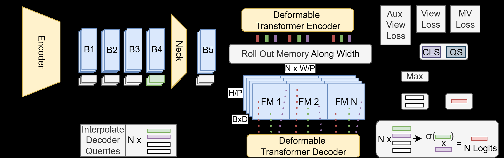
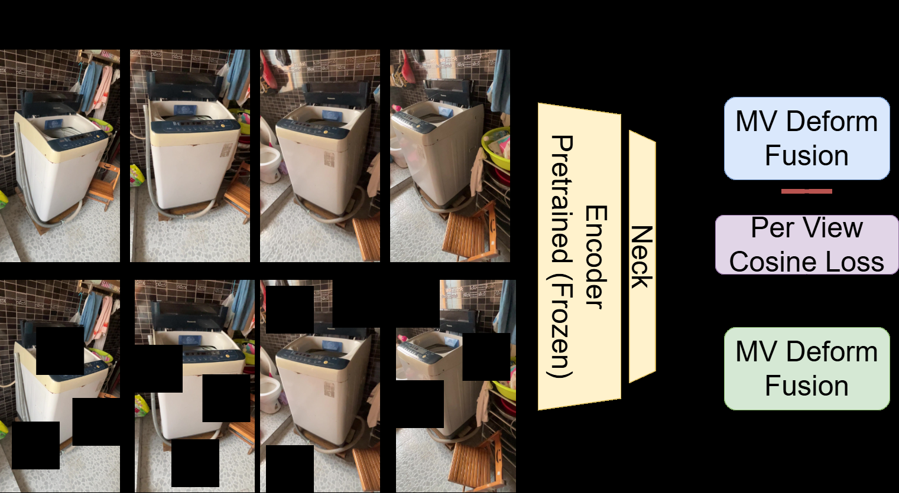
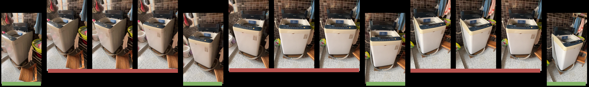
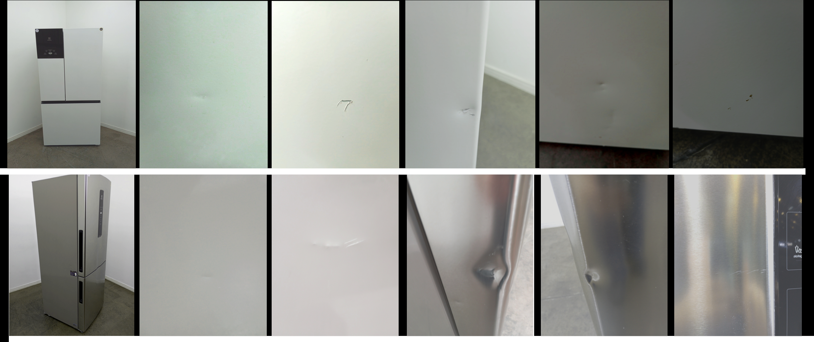

# Visual Quality Score Assessment of Large White Goods in Remanufacture with Multi-View Deformable-DETR

## 摘要

**论文元信息。** 本文题为 *Visual Quality Score Assessment of Large White Goods in Remanufacture with Multi-View Deformable-DETR*，作者为 Paul Koch 与 Vivek Chavan，机构为 Fraunhofer IPK。论文发表于 arXiv，版本为 `2606.14556v1`，提交时间为 2026-06-12，类别为 `cs.CV`。论文链接为 http://arxiv.org/abs/2606.14556v1，PDF 链接为 https://arxiv.org/pdf/2606.14556v1。

**代码状态。** 论文第 1 页给出 `Code: https://github.com/KochPJ/SSLMV`。但当前材料未提供 README、源码文件或提交内容，且无法从论文正文确认具体公开代码实现。因此，本文将代码状态记为：**论文声明有代码链接，但源码内容证据不足**。根据任务要求，本文不编造代码段，也不进行源码级函数映射。见 PAGE 1。

**一句话总结。** 本文提出一种面向大型白色家电再制造场景的多视角 Deformable-DETR 质量评分框架，通过自监督预训练、多视角特征融合与线性热图解释，在有限人工标注条件下预测视觉质量分数，并为缺陷区域提供可解释定位证据。见 PAGE 1、PAGE 3、PAGE 4、PAGE 6。

本文的研究对象不是通用目标检测，而是再制造流程中的视觉质量评分（Visual Quality Score Assessment）。其目标是将多相机或多视角图像转化为可用于翻新、定价和分流决策的连续质量分数，同时保留对模型决策区域的解释能力。论文明确指出，传统检测方法依赖大量标注，并且在高分辨率、多视角数据中的小缺陷识别上存在困难；这构成了本文方法设计的直接动机。见 PAGE 1、PAGE 2。

## 背景与动机

大型白色家电再制造是循环经济中的重要环节。论文将该问题放在欧盟 Ecodesign for Sustainable Products Regulation（ESPR）与 Digital Product Passport（DPP）等监管背景下讨论，指出产业正在从线性生产消费模式转向更可持续的生命周期管理。质量评估决定产品是否适合翻新、转售或回收，因此是再制造产线中影响吞吐量和定价一致性的关键节点。见 PAGE 1。

当前质量评估主要依赖人工检查。论文指出，人工检查耗时、主观、难以规模化，尤其在需要从多个视角检查大型家电时更为明显。大型家电表面面积大，缺陷可能是划痕、凹陷、污渍或局部损伤，且不同视角中可见性不同。因此，单张图像上的缺陷检测并不能直接满足业务中对整机质量等级的判断需求。见 PAGE 1。

已有工业视觉检测方法多以缺陷定位或分割为主，通常输出低层级的缺陷区域，而非直接支持定价与翻新分流的高层级质量分数。论文指出，这类方法需要大量像素级或框级标注；无监督异常检测虽然降低标注成本，但通常给出二分类异常标签，难以表达“Very Good / Good / Okay”这类有序质量等级。见 PAGE 2。

多视角融合（Multi-View Fusion）在 3D 分类和工业零件识别中已有积累，但论文认为多数现有数据集和模型关注重建、分类或零件识别，而不是再制造场景中的质量评分。现有 late-fusion 方法聚合高层特征，但可能损失像素级或细粒度区域信息；Deformable-DETR 的多尺度可变形注意力机制被引入，正是为了在多视角高分辨率图像中检索小而关键的质量相关区域。见 PAGE 2。

本文的出发点可以概括为三个层次：第一，业务层面需要标准化质量分数以支持翻新与定价；第二，数据层面标注有限，且缺陷分布稀疏、细小、多视角冗余；第三，模型层面需要同时具备多视角融合、细粒度特征提取和可解释区域定位能力。论文提出的 MV Deformable-DETR 正是在这三者之间建立连接。见 PAGE 1、PAGE 3、PAGE 6。

## 预备知识

**Deformable-DETR（可变形检测 Transformer）** 是 DETR 系列中的一种改进结构。标准 DETR 通常包含图像编码器、Transformer 编码器、Transformer 解码器和任务头；Deformable-DETR 通过多尺度可变形注意力在层级特征图中查询少量关键采样位置，以提高小目标或局部区域的定位能力。本文采用这一框架，但将其扩展到多视角输入与质量评分任务。见 PAGE 2、PAGE 3。

**多视角质量评分（Multi-View Quality Scoring）** 与传统多视角分类不同。多视角分类通常回答“这是什么物体”或“属于哪一类”，而本文关注“这台家电的视觉质量处于什么等级”。论文将离散质量等级转化为连续目标，以均方误差（Mean Squared Error, MSE）进行监督训练，使模型能够表达相邻等级之间的不确定性。见 PAGE 5。

**自监督学习（Self-Supervised Learning, SSL）** 在本文中用于降低人工标注依赖。论文使用 DINOv2 提取每个视角的 `[CLS]` token，并通过 masked image modeling 风格的 SSL 预训练，使多视角架构从大规模 MVImgNet 数据中学习跨视角鲁棒特征。这里的 `[CLS]` token 指 Vision Transformer 中代表整张图像或视角全局语义的分类 token。见 PAGE 4。

**公式证据说明。** 本文原文没有提供完整数学推导或算法伪代码，只有若干符号关系、训练目标描述和指标定义。因此，下文公式只重述论文明确出现或可由表格直接验证的关系；对于论文未给出的公式，均标注“证据不足”，不扩展为自造推导。

## 方法详解

### 1. 从单视角 DETR 到多视角质量评分

本文以标准 DETR 模块化结构为基础：图像编码器（image encoder）、Transformer 编码器（transformer encoder）、Transformer 解码器（transformer decoder）和任务头（task head）。论文明确说明，其方法采用这一框架，但在图像编码器中加入额外的 neck 模块，用于在已有特征提取器之上增加编码层。见 PAGE 3。

该 neck 的关键作用是让冻结的预训练骨干网络产生任务相关的稠密特征。论文提出冻结 DINOv2 等预训练 backbone，只微调 neck，以便保留大规模自监督预训练得到的泛化表征，同时在下游质量评分任务中获得缺陷定位所需的密集特征图。见 PAGE 3。

用途：下图用于说明 MV Deformable-DETR 的总体架构，包括 backbone、neck、Transformer 编码解码结构以及多视角输出路径。  
读图要点：重点观察多视角输入如何进入共享视觉特征提取器，并在 Deformable-DETR 结构中完成跨视角融合。  
支撑的判断：本文不是简单 late-fusion，而是在 Deformable-DETR 框架内扩展多视角 token 与 query 机制。见 PAGE 3。

Fig. 1 支撑了本文方法的第一个核心判断：模型把多视角图像作为统一结构处理，而不是对每张图像独立评分后再做简单平均。论文正文进一步说明，多视角改造包括两个主要修改：特征图嵌入的空间扩展，以及 decoder query 的自适应插值。见 PAGE 3、PAGE 4。

### 2. 多视角 token 扩展与辅助 token 设计

论文将多视角输入数量记为 $N$。在多视角适配中，Transformer 编码器提取的层级 token 会沿序列维度扩展，以容纳 $N$ 个输入图像。这个设计意味着每个视角的特征不是在模型外部被压缩为一个全局向量，而是在 Transformer 序列中保留更多结构化信息。见 PAGE 3、PAGE 4。

论文还引入每个视角 $A$ 个 auxiliary tokens（辅助 token）。因此，辅助 token 的总数为：

$$
N \times A
$$

其中，$N$ 表示输入视角数量，$A$ 表示每个视角分配的辅助 token 数。人话解释：如果一台设备有多个视角，每个视角都分配若干查询寄存器，那么总查询容量随视角数线性增加，用于在 deformable memory 中寻找质量相关区域。见 PAGE 4。

这些 auxiliary tokens 被论文称为 query registers，用于在 deformable memory 中定位相关特征。论文同时指出，更多辅助 token 有助于细粒度特征提取，但会增加计算复杂度。这个权衡对工业部署很关键：更高的缺陷敏感性可能带来更高推理成本。见 PAGE 4。

### 3. `[CLS]` token 与 decoder query 的融合

每个 `[CLS]` token 编码对应视角的高层内容，用于帮助 decoder 衡量不同视角的重要性。论文说明，最终融合时对 `[CLS]` token 使用 sigmoid activation，并与对应 query 计算 weighted product。随后沿视角维度做 max-pooling，再通过 fully connected layer 输出多视角分类或连续质量分数。见 PAGE 4。

可用论文关系表示为：

$$
\text{ViewFusion} = \max_{\text{view}}\left(\sigma(\text{CLS}_{v}) \odot q_{v}\right)
$$

其中，$\text{CLS}_{v}$ 表示第 $v$ 个视角的分类 token，$q_{v}$ 表示对应视角的 decoder query，$\sigma(\cdot)$ 表示 sigmoid 激活，$\odot$ 表示逐元素加权乘积。人话解释：模型先判断每个视角的全局可信度，再用这个权重调节该视角 query 提取到的局部信息，最后选取跨视角最显著的响应。该式是对 PAGE 4 文字描述的形式化重述，论文未给出原始公式。

这一机制与普通 late-fusion 的区别在于，后者通常先得到每个视角的独立全局特征，再在最后阶段融合；本文则让 `[CLS]` token、辅助 token 和 decoder query 一起参与质量相关区域的检索与聚合。由于质量缺陷可能只在某一视角可见，max-pooling 的跨视角聚合也符合任务需求。见 PAGE 4。

### 4. 自监督预训练：从 MVImgNet 学习多视角鲁棒性

本文使用 DINOv2 提取每个视角的 `[CLS]` token，然后用 MV-Deform 架构基于 masked inputs 重建这些 `[CLS]` token。论文称该过程使用 MiM-based SSL，即 masked image modeling 风格的自监督训练。见 PAGE 4。

用途：下图用于说明 SSL 预训练流程，即先由 DINOv2 为每个视角提取 `[CLS]` token，再让 MV-Deform 架构在掩码输入条件下重建这些视角级表示。  
读图要点：关键不在于重建像素，而在于让多视角模型学习从部分可见输入中恢复视角语义表示。  
支撑的判断：本文的少标注能力来自冻结 DINOv2 特征与多视角 SSL 适配，而不是完全从 KIKERP 小数据集端到端训练。见 PAGE 4。

预训练数据来自 MVImgNet。论文说明，MVImgNet 包含约 220k 个独特物体视频，覆盖 238 个类别，并从至少 $180^\circ$ 视角范围采集。作者对密集视角序列进行 keyframe selection，固定输入每个场景 8 个代表性帧，并在关键帧附近加入 temporal sampling jitter 增强训练多样性。见 PAGE 4、PAGE 5。

预训练设置写为：

$$
B \times V = 32 \times 8
$$

其中，$B=32$ 表示 batch 中的场景或样本数，$V=8$ 表示每个样本选取 8 个视角图像。人话解释：每个训练 batch 实际包含 32 组多视角样本，每组 8 张图像，用于训练模型理解跨视角冗余与互补关系。见 PAGE 4。

论文还给出预训练图像分辨率与学习率：

$$
\text{resolution}=640 \times 480,\quad \eta=10^{-5}
$$

其中，$\eta$ 表示学习率。人话解释：预训练在中等分辨率下进行，学习率较小，符合在预训练视觉特征之上进行结构适配的训练策略。见 PAGE 4。

用途：下图用于说明 MVImgNet 的数据整理与关键帧选择过程。  
读图要点：重点关注从 $180^\circ$ 视角序列中抽取代表性视角，而非使用完整视频序列。  
支撑的判断：本文在工业小数据集训练前，先通过大规模多视角数据学习视角选择与跨视角重建能力。见 PAGE 5。

Fig. 3 与 PAGE 4 的预训练参数共同说明，本文的 SSL 不是泛泛而谈的“使用预训练模型”，而是包含多视角采样、DINOv2 表征提取、masked reconstruction 和固定 8 视角输入的完整适配流程。证据不足之处在于，论文没有给出重建损失的完整数学表达，仅说明使用 cosine similarity reconstruction loss。见 PAGE 4。

### 5. KIKERP 工业数据集与质量标签建模

由于没有公开数据集覆盖 KIKERP 的质量评分框架，作者在巴西再制造工厂现场采集了新的多视角数据集。每个 SKU 在 photobooth 中拍摄，使用手机从左、中、右视角采集，并包含一张完整轮廓图；此外还记录所有缺陷的 close-up 图像和专家操作员给出的最终质量分数。见 PAGE 5。

用途：下图展示样本设备与视觉缺陷 close-up。  
读图要点：左侧是整机样本，右侧是局部缺陷细节；这说明质量评分既依赖全局外观，也依赖局部损伤。  
支撑的判断：本文任务不同于普通物体分类，因为标签来自整机质量判断，但证据可能分布在多个局部缺陷图像中。见 PAGE 5。

数据集规模如下：共 23.3k 张图像，分辨率为 $1920 \times 1440$；覆盖 2,298 个 SKU；记录 16.5k 个唯一损伤实例；每台设备的缺陷数从 0 到 30 不等；数据横跨 406 个 SKU 类别和 8 类家电，包括炉具、冰箱、冷柜、洗衣机、洗碗机、饮水机、微波炉和 micro-ovens。见 PAGE 5。

质量标签包含三个等级：Very Good 为 1,015 个，Good 为 907 个，Okay 为 376 个；不可接受的设备在上游已经被丢弃。这个标签分布说明，模型并不学习“是否报废”的完整分流任务，而是学习已通过上游筛选设备内部的质量等级区分。见 PAGE 5。

论文将离散等级转换为连续监督目标：

$$
y_n = \frac{n}{N+1}
$$

其中，$n$ 表示类别索引，$N$ 表示总类别数。人话解释：模型不把三个质量等级视为互不相关的类别，而是把它们放在有序连续轴上，使相邻等级之间的误差小于跨等级误差。见 PAGE 5。

当 $N=3$ 时，目标值按 25% 间隔排列：

$$
N=3 \Rightarrow y_n \in \{0.25,\ 0.50,\ 0.75\}
$$

人话解释：Very Good、Good、Okay 被映射到连续区间上的三个中心点，因此模型预测可以落在两个等级之间，用于表达不确定性。见 PAGE 5。

训练测试划分为：

$$
\text{train:test}=90\%:10\%,\quad \text{test SKUs}=230
$$

人话解释：测试集包含 230 个未见 SKU，用于评估模型能否泛化到未参与训练的设备。见 PAGE 5。

### 6. 分割解释：冻结特征图上的线性投影

论文进一步训练一个线性投影层，将 encoder neck 输出的高维特征图映射为缺陷或质量相关区域的热图。作者手动标注了训练集中随机选择的 590 张图像，提供像素级 segmentation masks，用于训练该投影层。见 PAGE 6。

分割任务采用 80/20 训练测试划分。为对齐 ground-truth mask 与特征图空间分辨率，论文使用 bilinear interpolation 将分割 mask 下采样为连续 heatmap，而非二值 mask。推理时再将预测热图上采样回原始尺寸，以识别支撑最终质量评分的 pixel-wise areas of interest。见 PAGE 6。

该解释模块的重要性在于它没有要求训练一个复杂分割网络，而是使用 frozen generalized DINOv2 encoder 与 task-specific neck 输出的特征，再通过单个 fully connected linear projection 层生成热图。论文没有提供 Fig. 5 和 Fig. 6 的可用图片路径，因此本文不插入这两张图，但其文字证据见 PAGE 6。

用符号表示，线性投影可概括为：

$$
H = W F + b
$$

其中，$F$ 表示 encoder neck 输出的特征图，$W$ 与 $b$ 表示线性投影层参数，$H$ 表示预测热图。人话解释：解释模块只学习一个线性映射，把已有视觉特征转换为质量相关区域响应。该式是对 PAGE 6 “single fully connected linear projection layer” 的形式化重述，论文没有给出原始公式。

这里的证据边界需要明确：论文说明该投影可以高效地产生 heat maps，但未给出热图训练的具体损失函数公式、标注协议细节或标注一致性指标。因此，关于解释模块的可靠性，只能根据 PAGE 6 的描述和 Table 1 的 segmentation 指标进行判断，不能推断其已达到工业级可解释性验证标准。

## 实验分析

### 实验设置概述

论文将 MV-Deform DeTR 与 view-independent multi-view classification architectures 进行比较，包括 CNN baseline、DINOv2 baseline、带 neck 的模型、Transformer fusion head、SSL 预训练版本以及完整 MV Deform 模型。由于视觉质量评分在该场景中尚未形成成熟 benchmark，作者选择与相近结构的多视角分类方法对比，并将它们适配为连续质量评分输出。见 PAGE 6、PAGE 7。

主要评价指标包含 regression、classification 和 segmentation 三组。回归使用 Mean Absolute Error（MAE）以及相对质量等级 bin size $p=25\%$ 的归一化 MAE；分类指标包含 Top-1、Precision、Recall、F1；分割指标包含 mIoU、Top-1、Precision、Recall、F1。见 PAGE 6、PAGE 7。

归一化 MAE 可由 PAGE 6 的描述和 Table 1 数据验证为：

$$
\text{MAE}_{p=25\%} = \frac{\text{MAE}}{25}
$$

人话解释：因为三个等级被放在 25% 间隔上，MAE 除以 25 后可以表示预测平均偏离一个质量等级中心的比例。以 MV Deform 的 MAE 6.88 为例，$6.88/25=27.52\%$，与 Table 1 一致。见 PAGE 6、PAGE 7。

### 主要结果表：质量评分、分类与分割

| Method | Regression MAE | MAE p=25% | Classification Top1 | Classification P | Classification R | Classification F1 | Segmentation mIoU | Segmentation Top1 | Segmentation P | Segmentation R | Segmentation F1 |
|---|---:|---:|---:|---:|---:|---:|---:|---:|---:|---:|---:|
| CNN [12] | 10.32 | 41.28 | 65.0 | 52.08 | 48.15 | 44.51 | 48.05 | 96.11 | 48.05 | 50.00 | 49.01 |
| DINOv2 [10] | 8.54 | 34.16 | 65.0 | 44.44 | 48.15 | 45.48 | - | - | - | - | - |
| + Neck (Ours) | 8.87 | 35.48 | 65.0 | 46.81 | 48.15 | 44.80 | 62.27 | 96.69 | 80.99 | 66.09 | 70.95 |
| + TF [10] | 7.94 | 31.76 | 67.50 | 80.86 | 56.48 | 59.26 | 61.83 | 96.64 | 80.50 | 65.63 | 70.44 |
| + SSL (Ours) | 8.31 | 33.24 | 70.0 | 80.0 | 58.33 | 61.25 | 61.20 | 96.59 | 79.92 | 64.92 | 69.67 |
| MV Deform (Ours) | 6.88 | 27.52 | 70.0 | 80.01 | 58.33 | 61.25 | 62.08 | 96.63 | 78.75 | 66.44 | 70.75 |
| + SSL (Ours) | 7.61 | 30.44 | 75.0 | 84.44 | 62.04 | 64.99 | 63.01 | 96.75 | 81.59 | 66.92 | 71.83 |

表格解读：Table 1 显示，完整 MV Deform 在回归 MAE 上达到 6.88，是所有列出方法中最低的，说明它对连续质量分数的拟合最好。加入 SSL 后，Top-1 分类从 70.0 提升到 75.0，分类 F1 从 61.25 提升到 64.99，分割 F1 从 70.75 提升到 71.83，但回归 MAE 从 6.88 变为 7.61，略有退化。这说明 SSL 对分类和分割解释有帮助，但在当前小规模、带噪声的质量分数回归上不一定单调提升。该结论必须结合作者在结论中承认的数据规模小与评分不一致问题理解。见 PAGE 7。

### 消融结果说明了什么

从 CNN 到 DINOv2，MAE 从 10.32 降至 8.54，说明强视觉表征对质量评分有明显帮助。DINOv2 是在大规模数据上自监督训练得到的特征提取器，其优势在有限标注工业数据中尤其明显。见 PAGE 7。

加入 neck 后，分割 mIoU 从 CNN 的 48.05 提升到 62.27，分割 F1 从 49.01 提升到 70.95。这表明 neck 对稠密特征图和热图解释确实有贡献。然而，回归 MAE 从 DINOv2 的 8.54 略升到 8.87，说明单独加入 neck 并不能保证质量评分变好，可能需要与更合适的融合结构共同发挥作用。见 PAGE 7。

Transformer fusion head 的 MAE 为 7.94，优于 DINOv2 与 +Neck，且分类 Precision 提升到 80.86。这说明多视角 token 融合本身对质量评分有效。但 MV Deform 进一步将 MAE 降至 6.88，说明 Deformable-DETR 风格的 query 与多视角特征检索在该任务上比普通 Transformer fusion 更适合。见 PAGE 7。

完整 +SSL 版本的结果呈现出更复杂的模式：分类和分割指标最好，但回归不是最好。这可能意味着 SSL 学到的多视角特征增强了类别边界和缺陷区域定位，但对专家连续评分中的主观噪声更敏感。由于论文没有提供置信区间、重复实验方差或统计显著性检验，这一解释只能作为基于 Table 1 的谨慎判断。见 PAGE 7。

### 参数规模比较

| Module | Parameters | Ratio |
|---|---:|---:|
| ViT-14-B [10] | 86.6 Mio | 49.24% |
| Neck (Ours) | 14.18 Mio | 8.64% |
| CLS & QS | 5.91 Mio | 3.36% |
| MV-Deform (Ours) | 69.16 Mio | 39.34% |
| Transformer [8] | 74.75 Mio | 41.20% |

表格解读：Table 2 显示，MV-Deform 模块参数量为 69.16M，占比 39.34%；对比 Transformer head 的 74.75M 和 41.20%，MV-Deform 并未比普通 Transformer fusion 更重，反而略少。这支持作者关于结构可扩展性的论点：MV-Deform 取得更低回归 MAE，并非单纯依靠更大参数量。需要注意的是，表中 ViT-14-B 占 86.6M 参数，是最大单体模块；若部署时冻结 backbone，训练成本与推理成本仍需分别评估。见 PAGE 7。

### 数据集规模与标签分布

| Dataset aspect | Value | Evidence |
|---|---:|---|
| Images | 23.3k | PAGE 5 |
| SKUs | 2,298 | PAGE 5 |
| Unique damage instances | 16.5k | PAGE 5 |
| SKU categories | 406 | PAGE 5 |
| Appliance types | 8 | PAGE 5 |
| Very Good | 1,015 | PAGE 5 |
| Good | 907 | PAGE 5 |
| Okay | 376 | PAGE 5 |
| Test SKUs | 230 | PAGE 5 |

表格解读：该数据集对于工业现场采集而言具有实际价值，但从深度模型训练角度看规模并不大，尤其质量等级只有三个，且类别分布不均衡：Okay 类明显少于 Very Good 和 Good。作者在结论中也承认数据集较小且质量评分存在人为误差与分歧，这会限制模型对真实质量边界的学习。见 PAGE 5、PAGE 7。

## 讨论

本文的适用边界首先由数据采集方式决定。论文中的 KIKERP 数据来自 photobooth 和手机拍摄，包含左、中、右视角以及整机图和缺陷 close-up。若迁移到其他工厂，成像光照、相机位置、设备尺寸、缺陷类型和操作员评分标准都可能变化。因此，该方法更适合作为多相机质检与质量评分框架的原型，而不是可直接跨工厂部署的成品系统。见 PAGE 5。

方法层面，MV-Deform 的优势在于利用多视角冗余定位细粒度缺陷，同时输出单个连续质量分数。与只做缺陷检测相比，它更贴近再制造业务中的定价与分流；与只做全局评分相比，它又通过线性热图提供一定解释能力。该组合是本文对工业视觉检测任务的主要贡献。见 PAGE 1、PAGE 3、PAGE 6。

未解决的问题主要有三类。第一，论文没有报告跨工厂、跨国家或跨设备采集协议的泛化实验。第二，没有给出人工专家之间评分一致性的量化指标，因此无法判断标签噪声的具体程度。第三，解释热图虽然有 segmentation 指标支撑，但缺少与人工质检员审计结果的对齐评估，尚不能说明热图解释是否足以支撑实际业务决策。见 PAGE 6、PAGE 7。

对未来工作的启示是明确的：如果要把该方法用于业务迁移，应优先建立多工厂、多相机协议下的标准化采集流程，并对质量评分进行多专家一致性建模。其次，应将连续质量评分与缺陷属性、维修成本、转售价格等结构化业务变量结合，而不是只预测视觉等级。论文目前证明了多视角视觉评分的可行性，但尚未覆盖完整再制造决策链条。见 PAGE 1、PAGE 5、PAGE 7。

## 局限分析

第一项局限来自作者自述。论文结论明确承认，结果基于“rather small sized dataset”，且质量评分存在 human error 与 disagreements。作者认为这些分歧可以通过扩大数据集在统计上缓解，但当前形式下模型训练过久会被迫过拟合。该局限直接影响 Table 1 中各方法差异的可信度，尤其是在没有置信区间和重复实验的情况下。见 PAGE 7。

第二项局限是实验设计证据不足。论文虽然给出消融表和参数表，但没有报告随机种子、训练轮数、早停策略、优化器细节、数据增强策略、类别不均衡处理、显著性检验或跨域测试。对于一个工业质检模型，这些信息会影响复现性和部署风险。见 PAGE 4、PAGE 5、PAGE 7。

第三项局限是公开代码证据不足。论文第 1 页给出 GitHub 链接，但当前材料没有提供代码内容，无法核对 MV-Deform、SSL pretraining、neck、linear projection 与 Table 1 实验之间的源码对应关系。因此，本文不能给出代码段，也不能确认论文方法是否已经完整开源。见 PAGE 1。

第四项局限是解释模块仍处于轻量验证阶段。论文使用 590 张图像的像素级 mask 训练线性投影，并报告 segmentation 指标，但没有说明这些 mask 的标注规范、标注者数量、一致性或缺陷类别覆盖情况。线性热图可以辅助定位模型关注区域，但是否能满足工业审计、责任追溯或定价解释要求，仍需额外用户研究和现场验证。见 PAGE 6、PAGE 7。

第五项局限是任务定义本身较窄。本文处理的是已被上游过滤后的 Very Good、Good、Okay 三档质量评分，不包括 unacceptable units。也就是说，模型并没有覆盖从报废识别到翻新定价的完整决策空间。若业务场景需要发现不可接受产品、估计维修成本或预测 resale value，需要额外标签和模型头。见 PAGE 5。

## 结论

本文提出的 MV Deformable-DETR 将多视角视觉表征、自监督预训练、连续质量评分和热图解释结合起来，面向大型白色家电再制造中的人工质检瓶颈给出了一套可行技术路线。实验中，MV Deform 在回归 MAE 上达到最佳结果 6.88；加入 SSL 后，分类 Top-1、分类 F1 和分割 F1 达到表中最佳或并列最佳水平。见 PAGE 7。

从学术价值看，本文的贡献不是提出全新的检测基础模型，而是把 Deformable-DETR 的细粒度区域检索能力迁移到多视角工业质量评分任务，并以有序回归方式连接视觉缺陷与业务质量等级。从业务价值看，它对多相机质检、低标注成本建模和可解释质量评分有直接参考意义。见 PAGE 1、PAGE 3、PAGE 5、PAGE 6。

但该工作仍应被视为 promising proof-of-concept，而不是已经充分验证的工业部署方案。后续研究需要补充更大规模、更一致的质量标签，公开可复现训练代码，报告跨域泛化结果，并把视觉质量分数与维修成本、定价策略和人工审计流程建立更完整的闭环。见 PAGE 7。

## 证据索引

| 结论 / 事实 | PAGE 证据 |
|---|---|
| 论文题目、作者、机构、代码链接、摘要 | PAGE 1 |
| 再制造、ESPR、DPP、人工质检瓶颈 | PAGE 1 |
| 本文使用多视角 Deformable-DETR 进行统一质量评分 | PAGE 2、PAGE 3 |
| 现有工业检测依赖大量标注，难以直接支持高层级定价决策 | PAGE 2 |
| 多视角 late-fusion 可能损失像素级精度，Deformable-DETR 适合细粒度区域查询 | PAGE 2 |
| 标准 DETR 模块和本文加入 neck 的结构 | PAGE 3 |
| Fig. 1 MV Deformable-DETR 架构图 | PAGE 3 |
| 多视角扩展包含 feature map embedding spatial expansion 与 adaptive interpolation of decoder queries | PAGE 3、PAGE 4 |
| $N \times A$ auxiliary tokens、query registers、计算复杂度权衡 | PAGE 4 |
| `[CLS]` token、sigmoid、weighted product、view max-pooling、fully connected score head | PAGE 4 |
| Fig. 2 SSL pretraining 流程 | PAGE 4 |
| MVImgNet 约 220k 视频、238 类、至少 $180^\circ$ 视角 | PAGE 4 |
| 8 个代表帧、temporal sampling jitter、batch size $32 \times 8$、分辨率 $640 \times 480$、学习率 $10^{-5}$、cosine similarity reconstruction loss | PAGE 4 |
| Fig. 3 keyframe selection | PAGE 5 |
| KIKERP 数据集采集方式、手机多视角、整机图、缺陷 close-up、专家评分 | PAGE 5 |
| Fig. 4 样本设备与视觉缺陷 | PAGE 5 |
| 23.3k 图像、2,298 SKUs、16.5k 损伤实例、406 SKU 类别、8 类家电 | PAGE 5 |
| Very Good 1,015、Good 907、Okay 376 | PAGE 5 |
| 离散质量等级转连续目标 $n/(N+1)$，$N=3$ 时 25% 间隔 | PAGE 5 |
| 90%/10% train/test split，230 unseen SKUs | PAGE 5 |
| 590 张图像像素级 mask、线性投影热图、80/20 分割训练测试划分 | PAGE 6 |
| Fig. 5 和 Fig. 6 文字描述存在，但本任务未提供可用图片路径 | PAGE 6 |
| 评价指标：MAE、相对 25% bin 的 MAE、分类与分割指标 | PAGE 6、PAGE 7 |
| Table 1 消融与对比实验结果 | PAGE 7 |
| Table 2 参数量对比 | PAGE 7 |
| 作者自述局限：小数据集、评分不一致、人为误差、训练过久会过拟合 | PAGE 7 |
| 作者结论：可高效预训练 MV 架构，并 fine-tune 产生质量分数和解释热图 | PAGE 7 |
