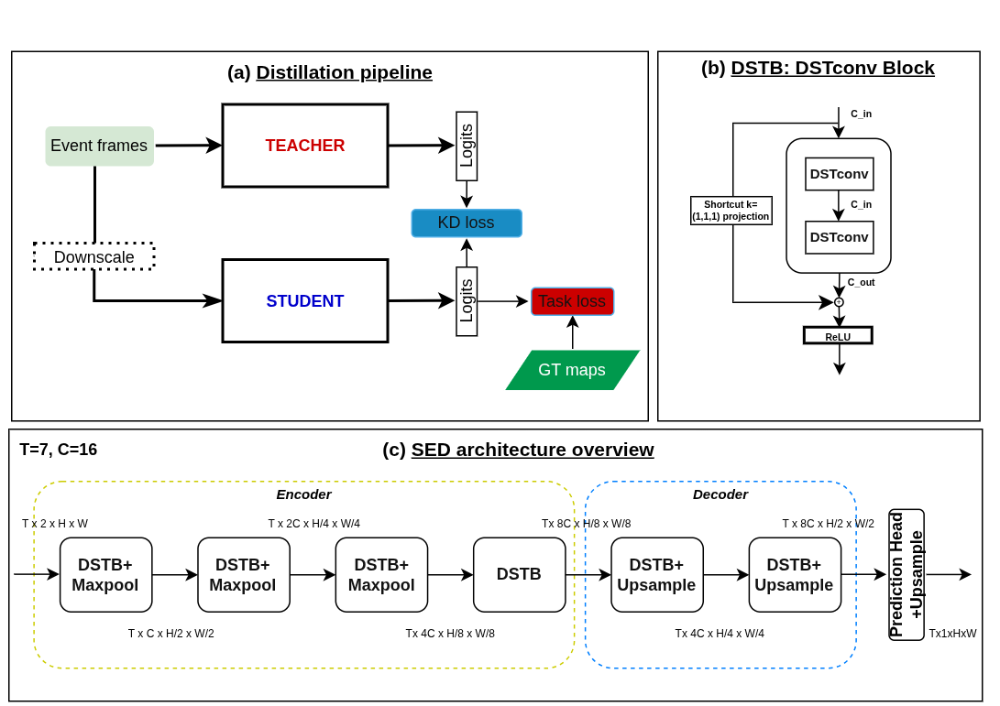
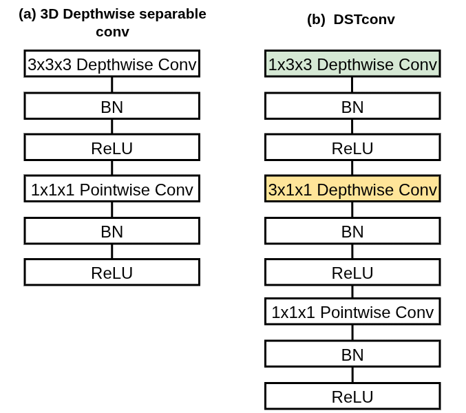
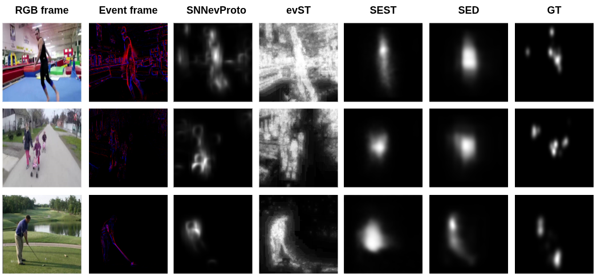

# SED:Lightweight Saliency prediction for Event-based data via Distillation

## 摘要

| 项目 | 内容 |
|---|---|
| 标题 | SED: Lightweight Saliency prediction for Event-based data via Distillation |
| 作者 | Romaric Mazna, Jean Martinet, Michele Magno |
| arXiv ID | 2606.14631 |
| 发布时间 | 2026-06-12 |
| 类别 | cs.CV |
| 链接 | http://arxiv.org/abs/2606.14631v1 |
| 代码状态 | 本文未提供可确认的公开代码；论文全文未列出仓库链接，题设给定“已知代码链接：未知”。因此本文不写源码段，避免伪造实现。 |
| 推荐方向 | 小模型 / 边缘部署 / 事件相机前处理 |

表格解读：这篇论文的核心定位不是提出一个通用视觉主干，而是面向事件相机（event camera）场景，构造一个极小的事件显著性预测（event-based saliency prediction）模型。作者报告 SED 仅有 81k 参数、0.32 MB 模型大小，相比教师模型 SEST 的 45M 参数和 180 MB 存储规模分别缩小约 554 倍和 562 倍，同时在 N-DHF1K 与 N-UCF Sports 上达到或超过教师模型的多项指标（见 PAGE 1、PAGE 9）。

一句话总结：本文提出 SED，一个通过知识蒸馏训练的轻量级事件显著性预测网络，用 Depthwise Spatio-Temporal convolution（DSTconv，深度可分离时空卷积因子化模块）替代重型 Transformer/3D 卷积结构，在 0.32 MB 模型规模下维持甚至超过教师模型 SEST 的显著性预测性能，并表现出跨数据集与真实事件数据的泛化能力（见 PAGE 1、PAGE 10、PAGE 12）。

从应用角度看，这篇论文的价值在于：事件相机本身具有低延迟、低功耗、高动态范围与稀疏输出特性，但如果上游感知模块仍依赖 180 MB 级别的 Transformer 模型，就会削弱事件相机在边缘设备上的部署优势。SED 的主张是把显著性预测作为下游事件感知任务的前置过滤或注意力模块，使边缘设备能优先处理更可能有用的区域，从而改善整体计算效率（见 PAGE 1、PAGE 2）。

## 背景与动机

显著性预测（saliency prediction）研究的是视觉系统如何选择性地关注场景中更重要或更相关的区域。论文将其与人类视觉注意机制联系起来，并指出显著性模型已经在目标检测、无人机导航、视频监控等任务中被用于提升计算效率或任务表现（见 PAGE 1）。在 RGB 图像和视频领域，显著性预测已有较长历史，从早期 bottom-up 方法发展到深度学习模型；但这些方法大多假设输入是固定帧率的 RGB 图像或视频，因此天然包含大量时空冗余（见 PAGE 1）。

事件相机提供了不同的感知范式。它不是以固定帧率输出完整图像，而是在像素亮度发生变化时记录事件，因此具有微秒级时间分辨率、低延迟、低功耗和高动态范围等特点（见 PAGE 1）。这类传感器尤其适合机器人、无人机、可穿戴设备等受电力、延迟和算力限制的平台；论文也明确提到 iCub 机器人和 battery-powered edge devices 这类资源受限平台（见 PAGE 2）。

问题在于，事件相机的硬件优势并不会自动转化为算法部署优势。早期事件显著性方法多为手工设计或基于脉冲神经网络（SNN, Spiking Neural Network），在复杂运动、噪声场景下性能有限；近期 SEST 将深度学习引入事件显著性预测，并以 Transformer 架构取得较强效果，但其代价是 45M 参数和 180 MB 模型大小（见 PAGE 2、PAGE 3）。这与事件相机常见的边缘部署场景存在明显张力：传感器低功耗，而上游感知模型过重。

论文的动机由两个问题构成。第一，能否在不牺牲准确性的情况下大幅降低事件显著性深度模型的计算成本？第二，紧凑模型能否在训练分布之外泛化，尤其是从合成事件数据迁移到真实事件数据？作者强调，机器人、无人机和可穿戴设备处于开放世界，会遇到训练集之外的场景、光照和运动模式，因此仅在训练分布内准确的模型并不足以支撑部署（见 PAGE 2）。

SED 的技术路线是同时处理“轻量化”和“泛化”两个目标。模型结构上，作者提出 DSTconv，将 3D depthwise-separable convolution 的深度卷积部分拆分为空间深度卷积与时间深度卷积，以保留事件数据的时间建模能力并降低参数与计算量（见 PAGE 5、PAGE 6）。训练方式上，作者从强教师 SEST 蒸馏到小学生 SED，认为蒸馏不仅是压缩手段，也在该设定下起到正则化作用，把教师模型的跨域鲁棒性转移给极小模型（见 PAGE 2、PAGE 7、PAGE 10）。

## 预备知识

事件数据（event data）的基本单元是事件 $e_k=(x_k,y_k,t_k,p_k)$。其中，$x_k,y_k$ 表示第 $k$ 个事件发生的像素坐标，$t_k$ 表示时间戳，$p_k\in\{-1,+1\}$ 表示亮度变化的极性，通常对应亮度增加或降低（见 PAGE 4）。与 RGB 帧不同，事件流是异步、稀疏、时序化的；为了输入常规深度网络，论文采用 voxel grid（体素网格）表示，把事件流聚合为空间-时间直方图（见 PAGE 4、PAGE 5）。

显著性预测的输出通常是 saliency map（显著性图），即对每个空间位置给出被人眼关注的概率或强度估计。论文使用 AUC-J、NSS、CC、SIM 四类指标评估模型，其中 AUC-J 与 NSS 属于 location-based metrics，侧重预测图与人类注视位置的对应；CC 与 SIM 属于 distribution-based metrics，侧重预测分布与真实显著性分布的一致性（见 PAGE 8）。因此，单一指标不能完全概括性能，需要同时观察定位能力与分布匹配能力。

知识蒸馏（knowledge distillation, KD）是本文训练策略的关键。经典蒸馏通常让小学生模型学习大教师模型的输出分布，以获得比从真实标签单独训练更好的泛化能力。本文沿用这一思想，但其结论更具体：在事件显著性预测中，蒸馏不仅用于模型压缩，还作为一种正则化机制，使小模型继承教师在跨数据集与真实事件数据上的鲁棒性（见 PAGE 2、PAGE 7、PAGE 10）。

## 方法详解

### 1. 事件表示：从异步事件流到 voxel grid

SED 的输入不是原始异步事件序列，而是 voxel grid。给定时间窗口 $[t_0,t_0+\Delta t]$，作者将其划分为 $T$ 个时间 bin，并对每个空间位置、极性通道和时间 bin 内的事件计数，得到 $V\in\mathbb{R}^{T\times 2\times H\times W}$。其中，$T$ 是时间 bin 数量，$2$ 对应正负两个 polarity channel，$H,W$ 是空间分辨率（见 PAGE 4、PAGE 5）。

论文给出的体素网格定义为：

$$
V(\tau,p,x,y)=\sum_k \mathbf{1}[p_k=p]\mathbf{1}[x_k=x,y_k=y]\mathbf{1}[b(t_k)=\tau]
$$

这个公式在说：对于时间 bin $\tau$、极性 $p$ 和空间坐标 $(x,y)$，统计所有落入该时空极性单元的事件数量。$\mathbf{1}[\cdot]$ 是指示函数，条件成立时为 1，否则为 0（见 PAGE 5）。

时间戳到 bin 的映射由下式给出：

$$
b(t_k)=\left\lfloor T\frac{t_k-t_0}{\Delta t}\right\rfloor
$$

这个公式在说：把事件时间戳 $t_k$ 归一化到当前时间窗口，再乘以时间 bin 数 $T$，最后向下取整得到离散时间索引 $\tau\in\{0,\ldots,T-1\}$（见 PAGE 5）。这种表示牺牲了事件流的完全异步性，但换来了与卷积网络兼容的张量结构。

该设计与 SEST 保持一致，便于以教师模型为蒸馏对象，同时降低学生模型输入分辨率。论文中教师输入为 $X_T\in\mathbb{R}^{B\times T\times 2\times 224\times 224}$，学生输入为 $X_S\in\mathbb{R}^{B\times T\times 2\times 128\times 128}$，其中 $B$ 是 batch size，$T=7$ 是时间 bin 数，第三维是事件极性（见 PAGE 7）。这说明 SED 的轻量化不仅来自网络结构，也来自更低的输入分辨率。

### 2. DSTconv：将 3D 深度卷积分解为空间与时间两步

事件显著性预测需要利用时间信息。直接使用 2D 卷积会削弱事件数据的时序结构；直接使用 3D depthwise-separable convolution 又会增加计算量。论文提出的 Depthwise Spatio-Temporal convolution（DSTconv）试图在二者之间取折中：显式建模时间信息，但避免完整 3D 深度卷积的高成本（见 PAGE 5）。

给定输入特征 $F_{in}\in\mathbb{R}^{C\times T\times H\times W}$，其中 $C$ 是通道数，$T$ 是时间维，$H,W$ 是空间维，DSTconv 定义为：

$$
F_{out}=PW(DW_t(DW_s(F_{in})))
$$

这个公式在说：先用空间深度卷积 $DW_s$ 处理每个通道的空间邻域，再用时间深度卷积 $DW_t$ 处理时间维，最后用点卷积 $PW$ 进行通道混合（见 PAGE 5）。其中 $DW_s$ 使用 $1\times k_s\times k_s$ 核，$DW_t$ 使用 $k_t\times 1\times 1$ 核，$PW$ 是 $1\times1\times1$ pointwise convolution；每个卷积后接 batch normalization 和 ReLU（见 PAGE 5）。

用途：Fig. 1 用于说明整体方法，包括蒸馏管线、DSTB 模块和 SED 的编码器-解码器结构（见 PAGE 4）。

读图要点：图中 (a) 对应教师 SEST 到学生 SED 的蒸馏流程，(b) 显示 DSTB 由两个 DSTconv 组成，(c) 给出 SED 的整体 encoder-decoder 结构。支撑的判断：SED 的轻量化并不是单个算子替换，而是输入分辨率、DSTconv 模块、较小 decoder 与输出级蒸馏共同构成的系统设计（见 PAGE 4、PAGE 6、PAGE 7）。

用途：Fig. 2 用于对比 3D depthwise separable convolution 与 DSTconv 的卷积结构差异（见 PAGE 6）。

读图要点：图中 (a) 表示传统 3D depthwise separable convolution，(b) 表示论文提出的 DSTconv，即把时空卷积拆为空间 depthwise 与时间 depthwise，再通过 pointwise convolution 混合通道。支撑的判断：DSTconv 的主要优势来自把 $Ck_tk_s^2$ 这一 3D depthwise 项替换为 $C(k_s^2+k_t)$，从而保留时空建模同时降低深度卷积部分的参数与计算负担（见 PAGE 5、PAGE 6）。

### 3. 参数量分析：为什么 DSTconv 更适合极小模型

论文比较了三种卷积形式的参数量。设输入通道数为 $C$，输出通道数为 $C'$，空间卷积核大小为 $k_s$，时间卷积核大小为 $k_t$。普通 3D 卷积参数量为：

$$
\text{Conv3D}: C\cdot C'\cdot k_t k_s^2
$$

这个公式在说：普通 3D 卷积同时在通道、时间、空间上进行完整连接，因此参数量随输入输出通道乘积和时空核体积一起增长（见 PAGE 6）。

3D depthwise-separable convolution 的参数量为：

$$
\text{3D DSConv}: C\cdot k_t k_s^2 + C\cdot C'
$$

这个公式在说：3D DSConv 将卷积分为 depthwise 和 pointwise 两部分，前者每个通道独立做 3D 卷积，后者用 $1\times1\times1$ 卷积混合通道，因此比普通 3D 卷积更省参数（见 PAGE 6）。

DSTconv 的参数量为：

$$
\text{DSTconv}: C\cdot k_s^2 + C\cdot k_t + C\cdot C'
$$

这个公式在说：DSTconv 把 3D depthwise 的 $Ck_tk_s^2$ 拆成空间项 $Ck_s^2$ 和时间项 $Ck_t$，只保留一次 pointwise channel mixing（见 PAGE 6）。当 $k_t$ 和 $k_s$ 都大于 1 时，$k_tk_s^2$ 通常明显大于 $k_s^2+k_t$，这就是 DSTconv 的结构性节省来源。

论文还强调，DSTconv 与已有时空因子化模块的差异在于：它将唯一的 pointwise convolution 放在 block 末端，而不是开头，以减少计算；同时不使用残差连接。作者认为这些选择进一步降低参数量，并使模型符合事件相机边缘部署场景的计算要求（见 PAGE 5）。

### 4. 轻量网络结构：小 encoder-decoder 与显著性头

SED 采用四个编码阶段与两个解码阶段的 encoder-decoder 结构，并接一个 saliency prediction head（见 PAGE 6）。每个编码阶段包含一个 Depthwise Spatio-Temporal Block（DSTB），而一个 DSTB 由两个 DSTconv block 与 residual connection 构成（见 PAGE 6）。前三个编码阶段后接 max-pooling，将空间分辨率减半；每经过一个阶段，特征通道数增加（见 PAGE 6）。

解码器被设计得比编码器更小。论文给出的理由是，已有研究指出显著性图所携带的信息量低于输入帧，因此更大的 decoder 不一定带来准确率提升（见 PAGE 6）。这一点对于边缘模型设计很关键：如果任务输出本身是低信息密度的热力图，那么把参数预算主要用于编码阶段的时空特征抽取，可能比使用重型解码器更合理。

最后，模型使用 $1\times1\times1$ Conv3D prediction head 产生 saliency maps，并通过 Gaussian blur 平滑后上采样到原始形状（见 PAGE 6）。这里的输出头仍然保留时间维，即预测每个时间 bin 对应的显著性图，而不是把整个事件窗口压缩成单张输出。这与论文训练目标中的 per-frame predictions 一致（见 PAGE 7）。

### 5. 知识蒸馏：从 SEST 转移鲁棒性，而不只是压缩

本文的教师模型 SEST 使用 pretrained Swin Transformer 作为 backbone，从四个阶段提取层级特征，并通过 Conv3D 投影与轻量 decoder 生成显著性图（见 PAGE 7）。SED 的学生模型则在更低输入分辨率和极小参数规模下学习教师输出。论文的核心观点是：在这个设定中，蒸馏不只是模型压缩工具，而是帮助学生模型避免过拟合、获得跨域泛化能力的正则化机制（见 PAGE 2、PAGE 10）。

总损失函数为：

$$
L=L_{task}+L_{kd}
$$

这个公式在说：学生模型同时学习真实显著性标注与教师模型输出。其中 $L_{task}$ 是任务监督项，$L_{kd}$ 是输出级蒸馏项（见 PAGE 7）。

任务损失定义为：

$$
L_{task}=KL(y\parallel \hat{y}_S)-\alpha CC(\hat{y}_S,y)+\beta BCE(\hat{y}_S,y)
$$

这里，$y$ 是 ground-truth saliency maps，$\hat{y}_S$ 是学生的 per-frame logits，$KL$ 是 Kullback-Leibler divergence，$CC$ 是 Pearson correlation coefficient，$BCE$ 是 binary cross-entropy，论文设定 $\alpha=0.5$、$\beta=0.7$（见 PAGE 7）。该公式在说：学生既要在分布意义上接近真实显著性图，又要提高相关性，同时通过 BCE 提供逐点监督。

蒸馏损失定义为：

$$
L_{kd}=KL(\hat{y}_T\parallel \hat{y}_S)
$$

其中，$\hat{y}_T$ 是教师模型输出，$\hat{y}_S$ 是学生模型输出（见 PAGE 7）。这个公式在说：学生不仅学习人工标注，还学习教师对每一帧显著性分布的软预测。软预测包含教师在大模型、预训练 backbone 和更高输入分辨率下学到的归纳偏置，这可能解释了为什么蒸馏模型在跨数据集和真实事件数据上优于 scratch 模型（见 PAGE 10）。

## 实验分析

### 1. 实验设置

论文在 N-DHF1K 与 N-UCF Sports 两个合成事件显著性数据集上评估 SED。N-DHF1K 来自 DHF1K，包含 500 个训练视频、100 个验证视频和 100 个测试视频；N-UCF Sports 来自 UCF Sports saliency dataset，包含 103 个训练视频、15 个验证视频和 32 个测试视频（见 PAGE 7）。论文还在 EBSD 真实事件数据上评估跨域泛化，但 EBSD 的数据规模细节未在给定全文页中展开，因此这里不补充未给出的统计信息。

训练实现方面，模型使用 PyTorch，在单张 NVIDIA H100 GPU 上训练。蒸馏时教师冻结，学生使用 AdamW 优化器、学习率 0.02、batch size 20（见 PAGE 8）。作者仅训练 7-bin 设置，教师和学生都预测 7 个 saliency maps；N-UCF Sports 的 bin duration 为 100 ms，N-DHF1K 为 33.33 ms（见 PAGE 8）。这些设置说明，SED 的实验并非追求极限时间粒度，而是在固定 7-bin 表示下比较结构与蒸馏策略。

评价指标包括 AUC-J、NSS、CC、SIM。论文同时列出 RGB-domain 模型结果，用于展示 RGB 与 event domain 的差距，但也明确这些 RGB 结果由于测试划分和协议不同，不应与事件设置直接比较（见 PAGE 8、PAGE 9）。因此，SED 的核心比较对象应是事件域模型：SNNevProto、evST、SEST teacher 与 SED。

### 2. 主结果：SED 与事件域模型比较

| Method | Domain | N-UCF AUC-J | N-UCF CC | N-UCF SIM | N-UCF NSS | N-DHF1K AUC-J | N-DHF1K CC | N-DHF1K SIM | N-DHF1K NSS | Size | Params |
|---|---|---:|---:|---:|---:|---:|---:|---:|---:|---:|---:|
| SNNevProto | Event | 0.8316 | 0.2834 | 0.1262 | 1.3286 | 0.5884 | 0.0375 | 0.1342 | 0.1725 | 证据不足 | 证据不足 |
| evST | Event | 0.7787 | 0.2559 | 0.1263 | 1.3798 | 0.5380 | 0.0217 | 0.1317 | 0.0898 | 证据不足 | 证据不足 |
| SEST teacher | Event | 0.9094 | 0.5144 | 0.4280 | 2.7672 | 0.9197 | 0.4661 | 0.3634 | 2.3956 | 180 MB | 45M |
| SED | Event | 0.9187 | 0.5703 | 0.4462 | 3.1418 | 0.9047 | 0.5618 | 0.4316 | 2.4667 | 0.32 MB | 81k |

表格解读：在 N-UCF Sports 上，SED 在四个指标上均超过教师 SEST；在 N-DHF1K 上，SED 在 CC、SIM、NSS 上超过教师，只在 AUC-J 上低于教师（见 PAGE 9）。这说明 SED 并不是简单以性能换体积，而是在多数分布匹配和注视质量指标上维持或超过重型教师。特别是 N-UCF Sports 上 NSS 从 2.7672 提升到 3.1418，表明模型对人类注视位置的响应更集中；但 N-DHF1K 的 AUC-J 下降也提示，SED 在某些阈值排序意义下仍不完全替代教师（见 PAGE 9）。

用途：Fig. 3 用于展示 N-DHF1K 与 N-UCF Sports 上的定性显著性结果（见 PAGE 8、PAGE 9）。

读图要点：图中前两行来自 N-DHF1K，最后一行来自 N-UCF Sports；论文声称 SED 与 ground truth 对齐较好，并能捕捉场景语义上下文（见 PAGE 9）。支撑的判断：定量指标之外，SED 的显著性图不是仅响应稀疏事件强度，而是能够在样例中对更符合人类关注的区域产生响应；不过定性图只能作为补充证据，不能替代 Table 1 的统计评估（见 PAGE 8、PAGE 9）。

### 3. 计算效率：模型体积、MACs 与延迟

| Method | Params | MACs | Memory | GPU Latency | CPU Latency |
|---|---:|---:|---:|---:|---:|
| SEST teacher | 45M | 158G | 180.0 MB | 32.9 ms | 1175.6 ms |
| SED | 81k | 353M | 0.32 MB | 5.84 ms | 38.89 ms |

表格解读：SED 的参数量、模型大小和 MACs 分别相对 SEST 降至极小规模：45M 到 81k，180 MB 到 0.32 MB，158G 到 353M（见 PAGE 9）。延迟方面，论文使用 TensorRT FP32 测量，SED 在 GPU 上为 5.84 ms，在 CPU 上为 38.89 ms，而教师分别为 32.9 ms 和 1175.6 ms（见 PAGE 9）。这组数据直接支撑“小模型/部署”的推荐方向：对边缘设备而言，CPU 延迟从秒级下降到几十毫秒量级，部署可行性发生了质变。不过论文未报告具体 CPU 型号、电源预算、批处理设置等细节，因此实际设备部署仍需复测。

### 4. 蒸馏效果：从 in-domain 到 cross-domain

| Train data | Regime | N-UCF CC | N-UCF NSS | N-DHF1K CC | N-DHF1K NSS | EBSD CC | EBSD NSS |
|---|---|---:|---:|---:|---:|---:|---:|
| N-UCF Sports | Scratch | 0.5266 | 3.0526 | 0.2184 | 0.8981 | 0.2947 | 0.7478 |
| N-UCF Sports | Distilled | 0.5703 | 3.1418 | 0.4697 | 2.0121 | 0.5443 | 1.4531 |
| N-DHF1K | Scratch | 0.4031 | 2.0018 | 0.5665 | 2.4814 | 0.6787 | 1.9309 |
| N-DHF1K | Distilled | 0.4778 | 2.4450 | 0.5618 | 2.4616 | 0.6746 | 1.8707 |

表格解读：蒸馏最有说服力的结果不是单纯 in-domain 提升，而是跨数据集迁移。用 N-UCF Sports 训练时，scratch 模型在 N-DHF1K 上 CC 只有 0.2184、NSS 只有 0.8981；distilled 模型提升到 CC 0.4697、NSS 2.0121（见 PAGE 10）。在 EBSD 真实事件数据上，N-UCF distilled 也从 scratch 的 CC 0.2947、NSS 0.7478 提升到 CC 0.5443、NSS 1.4531（见 PAGE 10）。这支持作者关于“知识蒸馏作为正则化”的判断：小模型从真实标签中容易学习数据集特定模式，而教师输出提供了更平滑、更可迁移的监督信号。

需要注意的是，N-DHF1K 训练时，distilled 与 scratch 在 N-DHF1K in-domain 指标上非常接近，甚至 scratch 在 CC 和 NSS 上略高；在 EBSD 上，scratch 的 CC/NSS 也略高于 distilled（见 PAGE 10）。因此，论文最强结论应限定为：蒸馏在小数据集到大数据集、合成到真实、训练分布外迁移上有明显价值；而不是在所有训练集和所有指标上无条件优于 scratch。

### 5. DSTconv 消融：准确率与计算量的折中

| Block | Params | MACs | Memory | N-UCF CC | N-UCF NSS | N-DHF1K CC | N-DHF1K NSS |
|---|---:|---:|---:|---:|---:|---:|---:|
| DS2D | 79k | 14M | 0.32 MB | 0.5531 | 3.0591 | 0.5605 | 2.4569 |
| DS3D | 90k | 2.63G | 0.36 MB | 0.5905 | 3.3346 | 0.5529 | 2.4153 |
| DSTconv | 81k | 353M | 0.32 MB | 0.5703 | 3.1418 | 0.5618 | 2.4667 |

表格解读：DS3D 在 N-UCF Sports 上表现最好，但 MACs 达到 2.63G，远高于 DSTconv 的 353M；DS2D 的 MACs 只有 14M，但缺少显式时间 depthwise 建模（见 PAGE 11）。DSTconv 在 N-DHF1K 上 CC 和 NSS 均为三者最好，在 N-UCF 上性能接近 DS3D 且计算量大幅更低（见 PAGE 11）。因此，DSTconv 的合理定位不是“所有指标最优”，而是“在显式时间建模与低计算量之间取得更均衡的折中”。这比单纯报告参数量更重要，因为事件相机边缘部署通常同时受延迟、能耗与存储约束。

### 6. 输入分辨率消融：128×128 的操作点

| Input resolution | MMACs | Latency | AUC-J | CC | SIM | NSS |
|---|---:|---:|---:|---:|---:|---:|
| 64×64 | 88 | 2.51 ms | 0.9274 | 0.5685 | 0.4584 | 2.9983 |
| 128×128 | 353 | 5.84 ms | 0.9187 | 0.5703 | 0.4462 | 3.1418 |
| 224×224 | 2160 | 35.79 ms | 0.9168 | 0.5110 | 0.3744 | 2.7792 |

表格解读：128×128 并非在所有指标上最佳，例如 64×64 的 AUC-J 和 SIM 更高；但 128×128 获得最高 CC 和 NSS，且计算量仍明显低于 224×224（见 PAGE 11）。论文给出的解释是事件数据空间稀疏，高分辨率会把活跃事件分散到更多像素中，提高零像素比例，从而削弱信号密度（见 PAGE 11）。因此，128×128 是在显著性质量、时延和事件密度之间的经验折中，而不是由理论推导唯一确定的最优点。

## 讨论

SED 的适用边界首先由输入模态决定：它面向事件相机数据，而非普通 RGB 视频。对于已经部署事件相机、关注低功耗感知、机器人或高速运动场景的团队，SED 可以作为上游显著性预测模块，用于筛选空间区域或为后续事件感知任务提供注意力先验（见 PAGE 1、PAGE 2）。但如果业务主传感器是 RGB 相机，SED 的直接价值有限；可迁移的是 DSTconv 的轻量时空因子化思想和蒸馏设定，而不是完整输入管线。

第二个适用边界是任务层级。论文评估的是 saliency prediction 指标，而不是最终目标检测、跟踪、导航或 SLAM 指标。虽然引言提到显著性模型可在检测、无人机导航、视频监控等任务中提升效率或性能，但 SED 本身没有在这些下游任务上验证端到端收益（见 PAGE 1、PAGE 8、PAGE 9）。因此，将 SED 放入业务系统时，需要额外验证显著性图是否真正降低下游计算、提高召回或减少误检。

第三，本文对蒸馏的结论具有较强启发性。作者的实验显示，从 N-UCF Sports 这样较小、较窄的数据集蒸馏，仍能迁移到更大更多样的 N-DHF1K 与真实 EBSD 数据；而 scratch 模型会在迁移时明显退化（见 PAGE 10）。这表明，对于事件视觉这类数据昂贵且域差异显著的方向，教师模型输出可能比有限标注更能提供跨域结构信息。对工程实践而言，这意味着可以先用重模型建立高质量 teacher，再训练极小 student 部署到端侧。

但论文仍留下几个未解决问题。首先，蒸馏教师 SEST 自身依赖 pretrained Swin Transformer 和较大输入分辨率（见 PAGE 7），训练阶段并不轻；SED 解决的是部署端轻量化，而不是完整训练管线轻量化。其次，Table 3 中 N-DHF1K scratch 在若干 in-domain 和 EBSD 指标上不弱于 distilled，说明蒸馏收益与训练集、域差异和评价指标相关，不能简单概括为“蒸馏总是更好”（见 PAGE 10）。最后，论文没有提供硬件端实际部署结果，仅表示未来工作将关注 real-time on-device inference（见 PAGE 12）。

## 局限分析

作者自述的主要开放问题是硬件部署尚未完成。结论部分明确写到未来工作将聚焦 hardware deployment for real-time on-device inference（见 PAGE 12）。这意味着，虽然论文报告了 TensorRT FP32 下的 GPU/CPU latency，但还没有在具体边缘芯片、嵌入式平台、事件相机实时流输入和功耗约束下完成端到端验证。对于边缘感知系统，这一点是关键缺口：模型小并不必然等于系统级实时，数据预处理、事件聚合、显著性后处理和下游任务接口都会影响实际延迟。

第二个局限来自数据形态。主要训练和测试数据 N-DHF1K 与 N-UCF Sports 是从 RGB 视频模拟得到的事件数据，真实事件数据 EBSD 被用于泛化评估（见 PAGE 7、PAGE 10）。虽然 Table 3 显示 distilled 模型能迁移到 EBSD，但真实事件相机的噪声、运动模糊等效应、曝光变化和传感器差异可能比单一 EBSD 评估更复杂。论文给定材料中没有更多真实数据集、多传感器设备或长时间在线场景实验，因此真实世界鲁棒性的证据仍有限。

第三个局限是任务指标与业务指标之间存在距离。论文使用 AUC-J、NSS、CC、SIM 四个显著性指标，这是该领域标准做法（见 PAGE 8）；但显著性预测是否能提升检测、跟踪、导航或事件流压缩效率，需要额外实验。尤其对于推荐方向“小模型/部署”，最终关心的可能是端到端能耗、下游精度、事件吞吐、系统延迟和失败模式，而这些不在本文实验范围内。

第四个局限是代码不可确认公开。论文全文与题设材料没有给出官方仓库链接，当前材料不足以进行论文方法到源码函数的对应分析。因此，本文未提供可确认的公开代码。若后续官方发布代码，仍需重点核查四处实现：voxel grid 构造是否与公式一致，DSTconv 的空间/时间 depthwise 顺序是否与论文一致，蒸馏损失中 KL/CC/BCE 的归一化细节，TensorRT latency 的导出和测量方式。

## 结论

SED 的贡献可以概括为三点。第一，它提出 DSTconv，将 3D depthwise-separable convolution 的深度时空卷积分解为空间 depthwise 和时间 depthwise，以较低代价保留事件数据的时间建模能力（见 PAGE 5、PAGE 6）。第二，它用四阶段 encoder、两阶段 decoder 和极小 saliency head 构建 81k 参数、0.32 MB 的事件显著性模型，并在 N-UCF Sports 与 N-DHF1K 上达到或超过教师 SEST 的多数指标（见 PAGE 6、PAGE 9）。第三，它通过输出级知识蒸馏展示了小模型跨数据集和真实事件数据泛化的可能性，尤其在 N-UCF Sports 到 N-DHF1K、EBSD 的迁移中显著优于 scratch 训练（见 PAGE 10）。

对工程团队而言，这篇论文最值得借鉴的不是“显著性预测一定是主任务”，而是其小模型设计范式：用任务输出的信息密度约束 decoder 规模，用时空因子化卷积替代重型 3D/Transformer 模块，用教师输出为低容量学生提供跨域正则化。对于事件相机、边缘视频前处理和低功耗注意力模块，SED 是一个值得跟踪的轻量化基线；对于纯 RGB 检测/跟踪主链路，它的直接收益需要通过额外下游实验验证。

## 证据索引

| 证据点 | PAGE |
|---|---|
| 论文标题、作者、摘要、核心模型规模：0.32 MB、81k 参数、相对教师 562×/554× 缩减 | PAGE 1 |
| 事件相机优势、边缘设备动机、SEST 45M 参数与 180 MB 过重问题 | PAGE 1、PAGE 2 |
| 研究问题：能否大幅降低计算成本且保持准确性，能否跨合成与真实事件数据泛化 | PAGE 2 |
| 贡献列表：DSTconv、81k 参数、0.32 MB、蒸馏泛化 | PAGE 2 |
| 相关工作：事件显著性早期方法、SEST Transformer 结构与 180 MB 成本 | PAGE 3 |
| Fig. 1：蒸馏管线、DSTB、SED 架构总览 | PAGE 4 |
| 事件表示公式：$V(\tau,p,x,y)$ 与 $b(t_k)$ | PAGE 4、PAGE 5 |
| DSTconv 公式与结构：$F_{out}=PW(DW_t(DW_s(F_{in})))$ | PAGE 5 |
| Conv3D、3D DSConv、DSTconv 参数量公式 | PAGE 6 |
| Fig. 2：3D depthwise separable convolution 与 DSTconv 对比 | PAGE 6 |
| SED encoder-decoder 结构、DSTB、max-pooling、trilinear upsampling、prediction head | PAGE 6 |
| 蒸馏设置：教师 SEST、学生低分辨率输入、$T=7$、损失函数 $L=L_{task}+L_{kd}$ | PAGE 7 |
| 任务损失与蒸馏损失公式：KL、CC、BCE、$\alpha=0.5$、$\beta=0.7$ | PAGE 7 |
| 数据集规模：N-DHF1K 与 N-UCF Sports 训练/验证/测试划分 | PAGE 7 |
| 实现细节：PyTorch、H100、AdamW、学习率 0.02、batch size 20、bin duration | PAGE 8 |
| Fig. 3：N-DHF1K 与 N-UCF Sports 定性结果 | PAGE 8、PAGE 9 |
| Table 1：SED 与事件域、RGB 域显著性模型的指标比较 | PAGE 9 |
| Table 2：SEST 与 SED 的参数、MACs、模型大小、GPU/CPU latency 比较 | PAGE 9 |
| Table 3：知识蒸馏对跨数据集与 EBSD 真实事件数据泛化的影响 | PAGE 10 |
| Table 4：DS2D、DS3D、DSTconv 消融比较 | PAGE 11 |
| Table 5：64×64、128×128、224×224 输入分辨率消融 | PAGE 11 |
| 结论与未来工作：真实端侧硬件部署仍是后续工作 | PAGE 12 |
