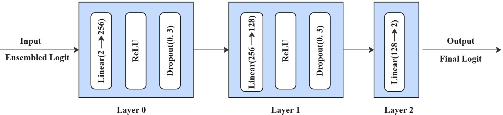
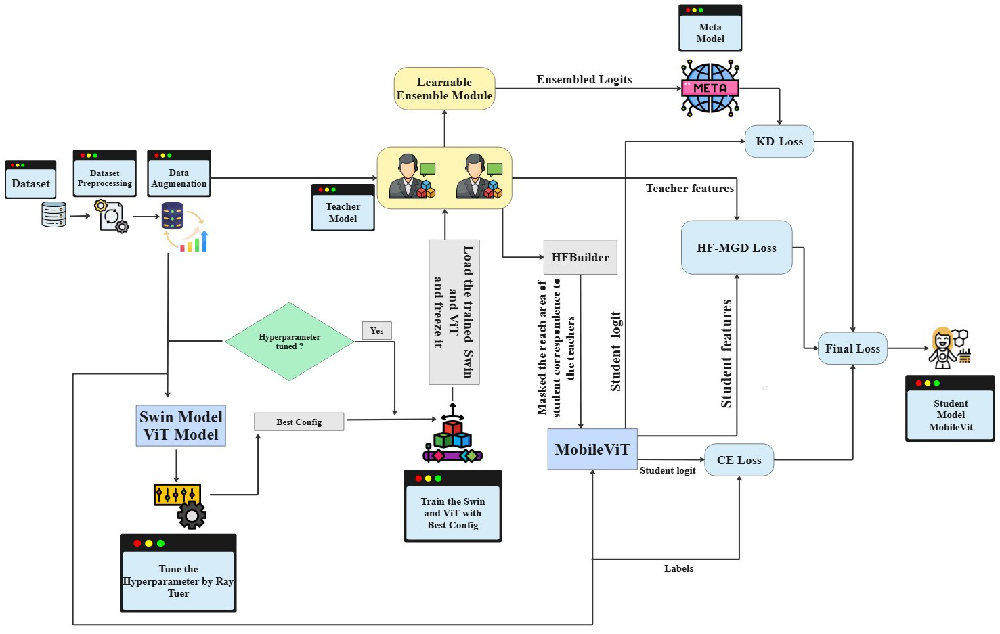
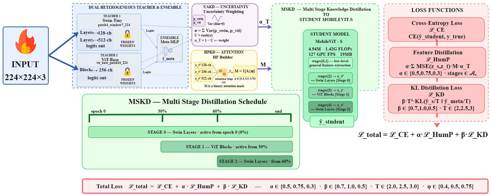
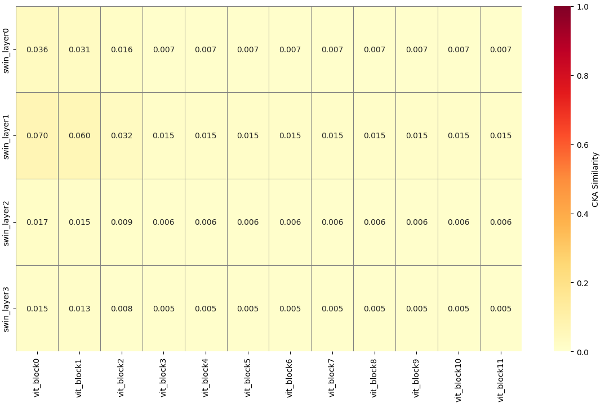

# HumP-KD: A Hybrid Uncertainty-Aware Multi-Stage Progressive Knowledge Distillation Framework for Efficient Fire Classification

## 摘要

| 项目 | 内容 |
|---|---|
| 论文标题 | HumP-KD: A Hybrid Uncertainty-Aware Multi-Stage Progressive Knowledge Distillation Framework for Efficient Fire Classification |
| 作者 | Mohammed Arif Mainuddin, Najifa Tabassum, Omar Ibne Shahid, Riasat Khan |
| arXiv | 2606.14684v1 |
| 发布时间 | 2026-06-12 |
| 任务 | 二分类火焰图像分类：fire / no-fire |
| 代码状态 | 论文全文未给出可确认的公开代码仓库；本文不写源码段，代码分析处标注为证据不足 |
| 部署方向 | 小模型、CPU 实时推理、Web 应用、Grad-CAM 可解释输出 |

一句话总结：HumP-KD 将 Swin-Tiny、ViT-Base 与 Meta-MLP 集成教师的知识，通过不确定性感知加权、层级注意力掩码和多阶段特征蒸馏，迁移到 MobileViT-S 学生模型，在保持 4.94M 参数和 37.72 CPU FPS 的同时，在 Dataset-II 上取得 $0.9876 \pm 0.0063$ 的 10 次试验平均 F1，并相对无蒸馏 MobileViT-S 达到统计显著提升（见 PAGE 1、PAGE 9、PAGE 11）。

本文的核心价值不在于单纯追求干净测试集上的最高分类分数，而在于将“异构 Transformer 教师 + 轻量学生模型 + 真实退化条件鲁棒性 + 端侧部署指标”放入同一个评估框架。论文使用 FlameVision 与 Dataset-II 两个数据集，分别包含 8,600 张与 31,309 张图像，并测试标准预处理、在线增强、Gaussian noise 与 motion blur 等条件（见 PAGE 1、PAGE 3、PAGE 4、PAGE 10）。

需要先指出证据边界：全文提供了完整的方法公式、算法、实验表格、部署描述与若干架构图，但未提供可确认的公开代码链接。PAGE 14 描述了 Flask API 与 Web 应用 FlameVision，说明作者实现了部署系统；但论文没有给出 GitHub、supplementary repository 或 release 地址。因此本文只分析论文中的算法与实验，不伪造源码对应关系。

## 背景与动机

火灾识别的工程目标具有典型的“高精度 + 低延迟 + 可部署”约束。论文在引言中将火灾风险与城市、森林、工厂、商场等场景关联起来，并给出 2024 年美国 1.39 million fire incidents、US$19 billion losses 与 4000 deaths 的背景数字，用以说明自动火灾检测的公共安全意义（见 PAGE 1）。传统 CCTV、烟雾/热传感器、观察塔和人工监控等方案存在响应慢、误报、维护成本高等问题，促使视觉深度学习方法成为现实需求（见 PAGE 1、PAGE 2）。

现有火灾识别研究大致沿三条路线发展。第一类是 CNN 或混合 CNN-Transformer 架构，例如 EfficientNetB2、Xception、CNN-ViT、Swin Transformer 等，用更强 backbone 提升准确率（见 PAGE 2）。第二类是知识蒸馏（Knowledge Distillation, KD），通过教师-学生范式将大模型知识迁移到小模型中，例如 FireNet-KD、多任务 KD、dual distillation 等（见 PAGE 2、PAGE 3）。第三类是面向无人机或边缘设备的轻量检测模型，例如 LAFNET、YOLO11-RLN、FICNet、DETR 相关轻量化方案（见 PAGE 3）。

论文认为这些路线仍存在一个空缺：不确定性感知蒸馏（uncertainty-aware distillation）和多阶段蒸馏（multi-stage distillation）此前被独立探索，但尚未与层级注意力掩码（hierarchical attention masking）统一到同一个火焰分类框架中（见 PAGE 3）。HumP-KD 的出发点正是把三者组合起来：用 UAKD 处理教师分歧，用 HPKD 选择更有判别力的空间区域，用 MSKD 控制训练过程中知识注入的阶段性（见 PAGE 2、PAGE 4、PAGE 5）。

这一动机对小模型部署尤其重要。MobileViT-S 作为学生模型只有 4.94M 参数和 19.01 MB 模型大小，而教师 ViT-Base 有 86.19M 参数、328.87 MB 模型大小，Swin-Tiny 有 27.91M 参数、106.56 MB 模型大小（见 PAGE 9）。如果仅用大模型获得精度，部署价值有限；如果仅追求轻量化，退化图像条件下的鲁棒性又可能不足。HumP-KD 试图在这两个目标之间建立可量化折中。

## 预备知识

知识蒸馏的基本设定是：给定一个高容量教师模型 $f_t$ 和轻量学生模型 $f_s$，学生不仅学习真实标签 $y$，也学习教师输出的软标签或中间表征。软标签通常由温度参数 $T$ 平滑后的 softmax 概率给出。温度越高，类别间相对关系越平滑，学生可以获得比 one-hot 标签更丰富的类别相似性信息。本文中的学生为 MobileViT-S，教师为 Swin-Tiny 与 ViT-Base，另有 Meta-MLP 对教师 logits 进行融合（见 PAGE 3、PAGE 4、PAGE 5）。

“不确定性感知”（Uncertainty-Aware）在本文中不是贝叶斯后验建模，而是用两个教师预测分布之间的方差衡量教师一致性。若 Swin-Tiny 与 ViT-Base 对同一输入给出相似概率分布，则说明教师知识较可靠，蒸馏权重应更高；若二者分歧较大，则降低该样本的教师监督强度（见 PAGE 4）。

“层级渐进蒸馏”（Hierarchical Progressive Knowledge Distillation, HPKD）关注的不只是最终 logits，而是教师和学生不同层级的中间特征。本文从 MobileViT-S 的 stages $\{2,3,4\}$ 取学生特征，从 Swin Layer 0、ViT Block 6、Swin Layer 2 取教师特征，并通过 Hierarchical Feature Builder 生成空间注意力掩码，指导学生在更重要的空间区域进行特征对齐（见 PAGE 3、PAGE 4、PAGE 6）。

## 方法详解

本文的问题定义为二分类图像分类。给定数据集 $D$，其中每张输入图像 $x_i \in \mathbb{R}^{H \times W \times 3}$，$H$ 和 $W$ 分别表示图像高度与宽度，$3$ 表示 RGB 通道数；标签集合为 $Y=\{0,1\}$，其中论文定义 $0$ 表示 fire，$1$ 表示 no-fire。学生模型 $f_s$ 输出 logit 向量 $\hat{y}=f_s(x)\in \mathbb{R}^{C}$，其中 $C=2$ 为类别数，最终预测为 $\arg\max(\hat{y})$（见 PAGE 3）。这一定义明确了 HumP-KD 的目标：不是检测框定位，也不是语义分割，而是图像级火焰/非火焰分类。

HumP-KD 的教师端由 Swin Transformer $f_{\text{swin}}$ 与 Vision Transformer $f_{\text{vit}}$ 构成，二者均在目标域上微调，并将分类头替换为 $C=2$ 输出。Meta-MLP $f_{\text{meta}}$ 接收两个教师的 logits，并产生融合预测 $\hat{y}_{\text{meta}}$。训练学生时，教师参数冻结，这保证了蒸馏信号来自固定教师，而学生、适配器、投影器、集成权重与注意力生成器等模块被优化（见 PAGE 3、PAGE 7）。

**用途**：下图用于说明 Meta-MLP 如何组合两个教师模型的 logits。  
**读图要点**：Fig. 1 展示了三层 MLP：输入维度 2，经 256 和 128 隐层，最终输出 2 类 logits；PAGE 4 文本说明 Layer 0 和 Layer 1 使用 ReLU 与 dropout 0.3。  
**支撑的判断**：HumP-KD 并非简单平均两个教师，而是引入可学习的 meta-model 进行教师融合。

图后说明：该图支撑论文的“heterogeneous transformer teachers + Meta-MLP ensemble”设计。其技术含义是，Swin-Tiny 的局部层级归纳偏置与 ViT-Base 的全局 token 表征不是直接相加，而是通过一个小型监督模型重新映射为更适合学生蒸馏的教师目标（见 PAGE 4、PAGE 5）。

UAKD 的第一步是计算两个教师的类别概率。对输入 $x$，Swin 与 ViT 的 softmax 输出定义为：

$$
P_{\text{swin}}=\operatorname{softmax}(f_{\text{swin}}(x)), \quad
P_{\text{vit}}=\operatorname{softmax}(f_{\text{vit}}(x))
$$

这里 $P_{\text{swin}}$ 和 $P_{\text{vit}}$ 分别表示两个教师对 fire/no-fire 两类的概率分布。人话解释：先让两个教师各自表态，看它们认为图像属于火或非火的概率是多少（见 PAGE 4, Eq. 1）。

随后，论文用两个教师预测的方差衡量分歧：

$$
\sigma^2=\operatorname{Var}([P_{\text{swin}},P_{\text{vit}}], \operatorname{dim}=0)
$$

其中 $\sigma^2$ 是逐类别方差，数值越大表示两个教师在该类别上的判断越不一致。人话解释：如果 Swin 认为很像火而 ViT 认为不像火，方差就会升高，说明这条教师监督不够稳定（见 PAGE 4, Eq. 2）。

论文进一步将逐类别方差求和为样本级不确定性 $\sigma=\sum_c \sigma_c^2$，并映射为教师置信权重：

$$
U=\tanh(\sigma), \quad \alpha_T=1-U
$$

其中 $U$ 是不确定性，$\alpha_T$ 是教师置信度。人话解释：教师越一致，$\sigma$ 越小，$U$ 越低，$\alpha_T$ 越高；教师越分歧，学生越少相信这条蒸馏信号（见 PAGE 4, Eq. 3）。

**用途**：下图用于说明 HumP-KD 的整体数据流和模块交互。  
**读图要点**：Fig. 2 将 Swin、ViT、Meta-MLP、MobileViT 学生以及 UAKD、HPKD、MSKD 放在同一流程中，强调教师 logits、meta logits 和学生训练目标之间的关系。  
**支撑的判断**：HumP-KD 的创新点不是单个模块，而是三个蒸馏机制在同一训练框架内协同工作。

图后说明：Fig. 2 与 PAGE 4 的文字共同表明，教师不仅输出 logits，还通过中间层特征参与 HPKD；Meta-MLP 不替代两个教师，而是在 logits 层提供融合监督；学生 MobileViT-S 同时接收交叉熵、KL 蒸馏与层级特征蒸馏信号。

HPKD 的核心是 Hierarchical Feature Builder $H$。给定三个教师特征图 $Z_t^0,Z_t^1,Z_t^2$，该模块生成空间注意力图：

$$
A=H(Z_t^0,Z_t^1,Z_t^2)\in \mathbb{R}^{B\times 1\times H\times W}
$$

其中 $B$ 表示 batch size，$A$ 是每张图像对应的单通道空间显著性图。人话解释：教师的多层特征被压缩成一张“哪里更值得学生学习”的空间地图（见 PAGE 4）。

随后，论文用阈值 $\phi$ 得到二值注意力掩码：

$$
M=\mathbf{1}[A\ge \phi]
$$

其中 $M$ 是二值掩码，$\phi$ 是选择性阈值。人话解释：只有注意力分数超过阈值的区域被纳入更强的特征蒸馏，从而避免学生在背景或低价值区域上浪费容量（见 PAGE 4, Eq. 4）。

MSKD 将蒸馏过程拆成三个阶段。令 $p=e/E$，其中 $e$ 是当前 epoch，$E$ 是总 epoch；三个阶段阈值为 $\{T_0,T_1,T_2\}=\{0.0,0.3,0.6\}$。当前 epoch 激活的阶段集合定义为：

$$
A_e=\{i \mid p\ge T_i\}, \quad i\in \{0,1,2\}
$$

人话解释：训练一开始只让学生学习较浅或较基础的蒸馏目标，训练到 30% 和 60% 后逐步加入更深层级的蒸馏信号，避免一次性塞入所有教师约束（见 PAGE 5, Eq. 5）。

**用途**：下图用于展示完整 HumP-KD 框架，包括双教师、Meta-MLP、UAKD、HPKD、MSKD 以及学生特征对齐路径。  
**读图要点**：Fig. 3 明确标出 Swin-Tiny 和 ViT-Base 的冻结教师路径、Meta-MLP ensemble、UAKD 的 $\alpha_T$、HFBuilder 的 mask 以及三阶段蒸馏。  
**支撑的判断**：论文的方法是“logit-level + feature-level + schedule-level”的复合蒸馏，而不是 vanilla KD 的单一 KL loss。

图后说明：Fig. 3 对应 PAGE 6 与 PAGE 7 的 Algorithm 1。算法中先计算当前激活阶段，再由 HFBuilder 生成 $M$，再计算教师分歧得到 $\alpha_T$，最后对每个 active stage 的学生和教师归一化特征做 MSE 对齐。这说明 UAKD、HPKD 和 MSKD 在 loss 计算中是耦合的，而非训练后附加模块。

Meta-MLP 之外，论文还定义了 learnable ensemble。设两个可学习标量为 $w_{\text{swin}}$ 和 $w_{\text{vit}}$，教师概率为 $p_{\text{swin}}$ 和 $p_{\text{vit}}$，则集成输出为：

$$
\hat{y}_{\text{ens}}=
\frac{w_{\text{swin}}}{w_{\text{swin}}+w_{\text{vit}}}p_{\text{swin}}
+
\frac{w_{\text{vit}}}{w_{\text{swin}}+w_{\text{vit}}}p_{\text{vit}}
$$

人话解释：这一步让模型学习两个教师在整体上的相对贡献，而不是人为固定 Swin 与 ViT 的权重（见 PAGE 5, Eq. 6）。

标准 KD loss 使用温度 $T$ 对学生 logits $\hat{y}_s$ 与 meta logits $\hat{y}_{\text{meta}}$ 进行平滑：

$$
s=\hat{y}_s/T,\quad t=\hat{y}_{\text{meta}}/T
$$

$$
L_{\text{KD}}=T^2 \cdot L_{\text{KL}}(\log\operatorname{softmax}(s),\operatorname{softmax}(t))
$$

其中 $L_{\text{KL}}$ 是 KL divergence，衡量两个概率分布的差异。人话解释：学生不只学“正确类别是什么”，还学教师对两个类别相对置信度的分布结构（见 PAGE 6, Eq. 7-11）。

HFBuilder 的结构也由公式给出。它先通过 $1\times 1$ 卷积将不同深度的教师特征统一到 64 通道：

$$
\operatorname{reduce}: \mathbb{R}^{B\times C_{\text{in}}\times H\times W}
\rightarrow
\mathbb{R}^{B\times 64\times H\times W},
\quad C_{\text{in}}\in\{128,256,512\}
$$

人话解释：不同教师层的通道数不同，必须先映射到同一通道空间，才能进行层级融合（见 PAGE 6, Eq. 14）。

随后，三个 reduce 后的特征 $r_1,r_2,r_3$ 通过可学习标量 $\gamma_2,\gamma_3$ 融合：

$$
f_{\text{fuse}}=r_1+\gamma_2r_2+\gamma_3r_3
$$

再经过 GELU、final convolution 与 sigmoid 得到 salience map：

$$
A=\operatorname{sigmoid}(\operatorname{finalconv}(\operatorname{GELU}(f_{\text{fuse}})))
$$

人话解释：HFBuilder 学习不同教师层级对空间注意力的贡献，再输出每个空间位置的显著性分数（见 PAGE 6, Eq. 16-17）。

训练目标将监督学习、层级特征蒸馏和 KL 蒸馏组合起来：

$$
L_{\text{train}}
=
L_{\text{CE}}(\hat{y}_s,y)
+
\alpha\cdot L_{\text{HumP}}
+
\beta\cdot L_{\text{KD}}(\hat{y}_s,\hat{y}_{\text{meta}},T)
$$

其中 $L_{\text{CE}}$ 是真实标签交叉熵，$L_{\text{HumP}}$ 是 Algorithm 1 定义的层级不确定性多阶段蒸馏损失，$L_{\text{KD}}$ 是 logit 蒸馏损失，$\alpha$ 和 $\beta$ 是损失权重。人话解释：学生同时被真实标签、教师 logits 和教师中间特征约束（见 PAGE 7, Eq. 27）。

论文还给出总目标：

$$
L_{\text{total}}
=
L_{\text{CE}}(\hat{y}_s,y)
+
\alpha L_{\text{HumP}}
+
\beta L_{\text{KD}}(f_s(x),\hat{y}_{\text{meta}},T)
$$

$$
L_{\text{KD}}
=
T^2 D_{\text{KL}}
\left(
\log\operatorname{softmax}\left(\frac{\hat{y}_s}{T}\right)
\left\|
\operatorname{softmax}\left(\frac{\hat{y}_{\text{meta}}}{T}\right)
\right.
\right)
$$

人话解释：最终优化目标是在小模型容量约束下，让 MobileViT-S 的分类输出和教师集成输出接近，同时保留真实标签监督（见 PAGE 7, Eq. 31-32）。

**用途**：下图用于支持教师层选择与异构教师互补性的分析。  
**读图要点**：Fig. 7 展示 Swin Transformer layers 与 ViT blocks 的 CKA similarity，数值约在 0.005 到 0.070 之间，整体较低。  
**支撑的判断**：Swin 与 ViT 的表征相似度弱，说明二者并非简单重复教师；但低 CKA 也意味着跨架构特征对齐需要投影器和注意力机制辅助。

图后说明：PAGE 11 解释了 Linear Probing、Mutual Information Proxy 和 Centered Kernel Alignment 的作用，并指出 Fig. 7 中 Swin 与 ViT 的 CKA similarity 很低。这支持论文选择异构教师的动机，但也提示方法复杂性：异构教师互补不是自动成立的，必须通过 HFBuilder、投影器和阶段式训练来降低对齐难度。

代码分析方面，证据不足。论文描述了实现细节，包括 forward hooks、HFBuilder、adapter、projector、Adam optimizer、Flask API 与 Web 应用，但全文 PAGE 1-15 未提供公开代码仓库链接。根据任务约束，本文不生成伪源码段，也不推断不存在的文件路径或函数名。可确认的实现级信息仅限论文公式、Algorithm 1 与部署描述（见 PAGE 6、PAGE 7、PAGE 12、PAGE 14）。

## 实验分析

论文使用两个数据集。FlameVision 包含 8,600 张 aerial wildfire images，其中 fire 5,000 张、no-fire 3,600 张；Dataset-II 是 Wildfire Dataset 与 Forest Fire Smoke Dataset 的合并版本，共 31,309 张图像，其中训练集 20,886 张、验证集 3,001 张、测试集 7,422 张（见 PAGE 3、PAGE 4）。

| 数据集 | Split | Fire | No-fire | Total |
|---|---:|---:|---:|---:|
| FlameVision | Train | 3600 | 3200 | 6800 |
| FlameVision | Validation | 700 | 200 | 900 |
| FlameVision | Test | 700 | 200 | 900 |
| Dataset-II | Train | 10229 | 10657 | 20886 |
| Dataset-II | Validation | 1455 | 1546 | 3001 |
| Dataset-II | Test | 3671 | 3751 | 7422 |

表格解读：FlameVision 的验证集与测试集中 fire/no-fire 比例不均衡，均为 700/200；Dataset-II 的类别分布更接近均衡。这个差异会影响准确率与 F1 的解释：FlameVision 上的高准确率可能更受类别比例影响，因此论文同时报告 precision、recall、F1 与统计检验是必要的（见 PAGE 4）。

实验硬件为 NVIDIA GeForce RTX 3090 GPU with 24GB VRAM。论文对多个 CNN 与 Transformer baseline 使用 Ray Tuner 进行超参数优化，并采用 ASHA Scheduler 进行早停剪枝（见 PAGE 7、PAGE 8）。预处理包括数据清洗、resize 到 $224\times224$、归一化，以及 speckle noise、random brightness、saturation adjustment 等在线增强（见 PAGE 4）。

从基础模型表现看，Swin-T 的训练/验证曲线优于 ViT：论文称 Fig. 4 中 Swin-T 的验证准确率约达 96-98%，ViT 在 90-94% 附近波动；Fig. 5 中 Swin-T 的验证 loss 在 epoch 3-4 左右趋于稳定，且低于 ViT（见 PAGE 7、PAGE 8）。这为选择 Swin-Tiny 作为教师之一提供了实验动机。不过，论文没有在提供的 figures 列表中给出 Fig. 4 和 Fig. 5 的图片路径，因此本文只引用文字证据，不插入对应图片。

消融实验是理解 HumP-KD 的关键。Table IV 显示，当移除 attention component 时，性能降至 97.33% accuracy 和 0.9733 F1；当将 Swin layer 0、layer 2 与 ViT block 6 替换为其他层时，性能从 98.48% accuracy 降至 96.31%；当排除 meta model 时，性能降至 94.33% accuracy 和 0.9433 F1（见 PAGE 9）。

| 变体 | Accuracy (%) | F1 | 论文解释 |
|---|---:|---:|---|
| 完整 HumP-KD | 98.48 | 0.9848 | Attention、Meta Model、Augmentation、UAKD、MSKD 与指定教师层均启用 |
| 移除 attention | 97.33 | 0.9733 | 不再需要教师层注意力引导 |
| 替换教师层选择 | 96.31 | 0.9631 | 使用其他 Swin/ViT 层后下降 |
| 移除 Meta Model | 94.33 | 0.9433 | 教师 logits 融合能力下降 |
| 移除 augmentation 的一组结果 | 98.64 | 0.9864 | 论文指出 augmentation 下并非总是更优 |

表格解读：消融结果支持三个判断。第一，Meta-MLP 在这组实验中影响最大，移除后 F1 从 0.9848 降至 0.9433。第二，attention mask 与教师层选择确实影响学生性能，说明 HPKD 不是装饰性模块。第三，augmentation 的收益并不单调，论文报告无 augmentation 的一组结果略高，这提示 HumP-KD 对训练配置敏感，不能简单认为组件越多必然越优（见 PAGE 9、PAGE 10）。

计算成本表明，HumP-KD 的学生模型在速度和容量之间取得较好折中。MobileViT-S (HumP-KD) 有 4.94M 参数、19.01 MB 模型大小、1.42 GFLOPs、134.57 GPU FPS 和 37.72 CPU FPS；相比 ViT-Base 的 86.19M 参数、328.87 MB 和 16.85 GFLOPs，部署成本明显下降（见 PAGE 9）。

| 模型 | Params (M) | Model Size (MB) | FLOPs (G) | GPU FPS | CPU FPS |
|---|---:|---:|---:|---:|---:|
| MobileNetV2 | 2.39 | 9.35 | 0.33 | 236.79 | 88.16 |
| EfficientNetB0 | 4.01 | 15.59 | 0.41 | 133.58 | 31.55 |
| ViT-Base | 86.19 | 328.87 | 16.85 | 214.23 | 15.59 |
| Swin-Tiny | 27.91 | 106.56 | 4.37 | 115.82 | 28.19 |
| MobileViT-S (HumP-KD) | 4.94 | 19.01 | 1.42 | 134.57 | 37.72 |

表格解读：HumP-KD 学生并不是表中最快或最小的模型。MobileNetV2 的 CPU FPS 更高、参数更少；但 HumP-KD 的意义在于将 Transformer 教师知识迁移到仍可 CPU 实时运行的学生模型上。与 Swin-Tiny 和 ViT-Base 相比，HumP-KD 学生显著减少参数与模型大小，同时 CPU FPS 分别高于二者（见 PAGE 9）。

鲁棒性实验比较了 clean data 与 corrupted data，即 Gaussian noise + motion blur 条件。Table VI 中，HumP-KD 在 Dataset-II clean data 上为 98.48% accuracy / 98.48 F1，在 corrupted data 上为 97.62% accuracy / 97.62 F1；在 FlameVision 上 clean data 为 94.78% accuracy / 94.88 F1，corrupted data 为 97.22% accuracy / 97.15 F1（见 PAGE 10）。

| 方法 | 数据集 | Clean Acc | Clean F1 | Corrupted Acc | Corrupted F1 |
|---|---|---:|---:|---:|---:|
| Vanilla-KD | FlameVision | 100.00 | 100.00 | 95.93 | 95.93 |
| ReviewKD | Dataset-II | 98.90 | 98.90 | 96.31 | 96.31 |
| CRD | Dataset-II | 98.67 | 98.67 | 96.98 | 96.98 |
| HumP-KD | FlameVision | 94.78 | 94.88 | 97.22 | 97.15 |
| HumP-KD | Dataset-II | 98.48 | 98.48 | 97.62 | 97.62 |

表格解读：不能笼统声称 HumP-KD 在所有条件下全面最优，因为 Vanilla-KD 和 ReviewKD 在 FlameVision clean 或 corrupted 条件下也有 100.00 的结果。更稳妥的结论是：HumP-KD 在 Dataset-II corrupted 条件下优于 ReviewKD 和 CRD，并且在更大、更接近均衡的数据集上表现稳定。这一结果更贴近论文“退化视觉条件下稳定性”的主张（见 PAGE 10）。

跨数据集泛化实验进一步说明模型迁移能力。HumP-KD 在 FlameVision 上训练、Dataset-II 上测试时，无 fine-tune accuracy 为 88.09%，fine-tune 后为 96.86%；反向训练测试时，无 fine-tune accuracy 为 86.22%，fine-tune 后为 98.00%（见 PAGE 10）。

| 训练 / 测试设置 | Fine-tune | Accuracy (%) | Precision (%) | Recall (%) | F1 (%) |
|---|---|---:|---:|---:|---:|
| Train FlameVision → Test Dataset-II | No | 88.09 | 88.40 | 88.09 | 88.06 |
| Train FlameVision → Test Dataset-II | Yes | 96.86 | 96.94 | 96.86 | 96.86 |
| Train Dataset-II → Test FlameVision | No | 86.22 | 91.50 | 86.22 | 87.18 |
| Train Dataset-II → Test FlameVision | Yes | 98.00 | 98.14 | 98.00 | 98.03 |

表格解读：跨数据集无 fine-tune 时性能明显下降，说明火焰图像分布、采集视角、背景与颜色模式存在域差异。fine-tune 后显著恢复，说明 HumP-KD 的表征具有迁移基础，但并非开箱即用地跨域泛化。对业务迁移而言，这意味着若从火焰分类迁移到属性分类或质量分类，仍需要目标域少量微调数据（见 PAGE 10）。

统计检验是论文中较强的证据之一。作者在 HumP-KD 与 No-KD MobileViT 之间进行 10 次独立试验，并使用 independent t-test 与 Wilcoxon signed-rank test。Dataset-II 上 HumP-KD 的均值为 $0.9876\pm0.0063$，No-KD 为 $0.9537\pm0.0351$；t-test 的 $p=0.0195$，Wilcoxon 的 $p=0.0039$，均满足 $p<0.05$。FlameVision 上两种检验均不显著（见 PAGE 11）。

| 数据集 | 方法 | Mean | Median | t-test p | Wilcoxon p | 结论 |
|---|---|---:|---:|---:|---:|---|
| FlameVision | HumP-KD | $0.9637\pm0.0314$ | 0.9633 | 0.1193 | 0.1602 | Not Significant |
| FlameVision | No-KD | $0.8704\pm0.1634$ | 0.9767 | 0.1193 | 0.1602 | Not Significant |
| Dataset-II | HumP-KD | $0.9876\pm0.0063$ | 0.9886 | 0.0195 | 0.0039 | Significant |
| Dataset-II | No-KD | $0.9537\pm0.0351$ | 0.9697 | 0.0195 | 0.0039 | Significant |

表格解读：Dataset-II 上的统计显著性比单次 accuracy 更有说服力，因为它体现了跨随机试验的稳定提升。FlameVision 上不显著则提示该数据集可能规模较小、类别分布不均衡或试验方差较大，不能把 Dataset-II 的显著结论无条件推广到所有数据集（见 PAGE 11）。

论文还讨论了可解释性与部署。Attention rollout 中，空间注意力图由中间特征 $F\in\mathbb{R}^{B\times C\times H\times W}$ 经通道均值与 ReLU 聚合得到：

$$
A=
\frac{
\operatorname{ReLU}\left(\frac{1}{C}\sum_{i=1}^{C}F_i\right)
}{
\sum_{h,w}\operatorname{ReLU}\left(\frac{1}{C}\sum_{i=1}^{C}F_i\right)+\epsilon
}
$$

其中 $C$ 是通道数，$\epsilon$ 是数值稳定项。人话解释：把多通道特征压缩成一张归一化空间热力图，表示模型关注的图像区域（见 PAGE 12, Eq. 33）。

层级 rollout 通过逐阶段相乘得到：

$$
A_{\text{rollout}}=A_{\text{stage2}}\odot A_{\text{stage1}}\odot A_{\text{stage0}}
$$

其中 $\odot$ 表示逐元素乘法。人话解释：只有在多个阶段持续被关注的区域，才会在最终 attention rollout 中更突出（见 PAGE 12, Eq. 34）。PAGE 13 的 Fig. 10 展示了 fire 与 no-fire 输入下的多尺度 teacher-student attention rollout，但题设 figures 未提供 Fig. 10 的图片路径，因此本文不插入该图。

## 讨论

HumP-KD 最适合的应用边界是“二分类或少类别分类 + 端侧/CPU 实时推理 + 有较强教师模型可用”的场景。论文的目标不是训练一个从零开始的小模型，而是将 Swin-Tiny、ViT-Base 和 Meta-MLP ensemble 的知识压缩到 MobileViT-S 中。因此，在业务上它更像一个蒸馏模板：先用大模型获得强表示，再通过 UAKD/HPKD/MSKD 让小模型获得接近大模型的表现（见 PAGE 3、PAGE 4、PAGE 7）。

对小模型部署而言，37.72 CPU FPS 和 19.01 MB 模型大小具有实际意义。虽然 MobileNetV2 更快更小，但 HumP-KD 的学生模型保留了 Transformer 教师的部分判别能力，并在 Dataset-II 统计检验中显著优于 No-KD MobileViT（见 PAGE 9、PAGE 11）。这使其适合作为“不是极限轻量，但要求精度和鲁棒性更稳”的部署候选。

方法的未解决问题主要有三类。第一，组件较多，包含双教师、Meta-MLP、HFBuilder、adapter、projector、UAKD、MSKD 和多个损失权重，复现实验需要较多工程细节（见 PAGE 6、PAGE 7）。第二，超参数敏感性明显；Table VIII 显示在 FlameVision 上 $\alpha=0.3,\beta=0.5,\phi=0.3,T=1.5$ 可达 98.78% accuracy，而 $\alpha=0.5,\beta=0.7,\phi=0.5,T=2$ 只有 94.78% accuracy（见 PAGE 10）。第三，跨数据集无微调性能只有 86-88% 左右，说明域迁移仍需目标数据适配（见 PAGE 10）。

从方法学角度看，论文的强点是把统计显著性、鲁棒性、计算成本与部署演示都纳入评估，而不是只报告单个干净测试集 accuracy。其不足是部分 baseline 表格结果存在需要谨慎解释的现象，例如 Table III 中若干模型在 Dataset-II 上达到 100.00% accuracy/F1，而 HumP-KD 的优势主要通过多次试验均值、退化条件、消融和部署效率体现（见 PAGE 8、PAGE 9、PAGE 10、PAGE 11）。

## 局限分析

作者自述的一个重要局限来自真实部署测试：模型主要在“devastating fires”图像上训练，因此遇到强红、黄、橙颜色的非火焰图像时，有时会误分类。论文在 IV-D Real-Time Inference 中明确提到，测试包括 fire images、newspapers、park scenes 和 flowers，并指出强暖色图像可能被误判（见 PAGE 12）。这说明模型仍可能依赖颜色先验，而非完全学习火焰形态、烟雾上下文或动态特征。

作者也在结论中提出未来方向：系统可部署到 mobile application 以监控实时火灾，同时未来可发展 multiclass 与 multitask classification，以便接入更多 AI-based devices（见 PAGE 14）。这意味着当前论文仍停留在二分类图像级识别，尚未覆盖火焰等级、烟雾类型、火势阶段、检测框定位、视频时序预警等更细粒度任务。

独立判断上，第一项局限是代码与复现证据不足。论文给出了较多公式和算法，但没有公开仓库链接，Web 应用也只在论文中展示界面与描述，无法从公开代码核验 forward hook、HFBuilder、projector、attention mask、stage schedule 与训练细节是否完全按文中实现。因此，当前只能评价论文方法与实验报告，不能评价代码质量或工程可维护性（见 PAGE 6、PAGE 7、PAGE 14）。

第二项局限是业务迁移风险。火焰分类具有强颜色、纹理和背景特征，而推荐方向中提到的属性分类或质量分类可能依赖完全不同的视觉证据。HumP-KD 的蒸馏框架可迁移，但其增益是否超过简单 KD、强数据增强、label smoothing 或更合适的轻量 backbone，需要在目标业务数据上重新验证。论文自身的跨数据集实验也显示，无 fine-tune 时 accuracy 仅为 88.09% 和 86.22%，说明域偏移不可忽略（见 PAGE 10）。

第三项局限是统计显著性并不覆盖所有数据集。Dataset-II 上 t-test 与 Wilcoxon 均显著，但 FlameVision 上 $p=0.1193$ 和 $p=0.1602$，未达到 $p<0.05$（见 PAGE 11）。因此，严谨表述应是：HumP-KD 在 Dataset-II 上相对 No-KD 有统计显著提升；在 FlameVision 上有均值提升，但证据不足以证明统计显著。

## 结论

HumP-KD 的主要贡献是提出一个面向轻量火焰分类的复合蒸馏框架：UAKD 根据 Swin 与 ViT 教师分歧调节教师置信度，HPKD 通过层级注意力掩码选择高价值空间区域，MSKD 按训练进度逐步激活不同层级的蒸馏阶段。论文用 MobileViT-S 学生模型实现 4.94M 参数、19.01 MB、37.72 CPU FPS，并在 Dataset-II 上用 10 次试验和两种统计检验证明相对 No-KD 的显著提升（见 PAGE 1、PAGE 7、PAGE 9、PAGE 11）。

对实践而言，HumP-KD 可作为小模型分类蒸馏的参考模板，尤其适合有大教师模型、需要 CPU 实时推理、且关注退化图像鲁棒性的场景。但其组件复杂、超参数敏感、公开代码缺失、跨域泛化仍需 fine-tune；若迁移到非火焰业务任务，应优先做简化 KD baseline、强增强 baseline 与组件消融，确认复杂框架确实带来稳定收益。

## 证据索引

| 证据主题 | PAGE |
|---|---|
| 论文题目、作者、摘要、核心结果、参数量、CPU FPS、Web/Grad-CAM 部署描述 | PAGE 1 |
| HumP-KD 六项贡献：UAKD、HPKD、MSKD、统计检验、鲁棒性、跨数据集、部署 | PAGE 2 |
| 相关工作缺口：不确定性感知、多阶段蒸馏、层级注意力掩码尚未统一 | PAGE 3 |
| 问题定义、教师/学生设定、数据集描述 | PAGE 3 |
| 数据集划分、预处理、Meta-MLP 结构、UAKD 与 HPKD 公式 | PAGE 4 |
| Fig. 1 Meta-MLP、Fig. 2 HumP-KD workflow、MSKD 公式、learnable ensemble | PAGE 5 |
| Fig. 3 完整框架、KD loss、HFBuilder、adapter/projector 公式 | PAGE 6 |
| Algorithm 1、训练/验证/总损失公式、实验硬件 | PAGE 7 |
| 超参数表与 baseline 性能表、Swin 与 ViT 训练曲线文字解释 | PAGE 8 |
| 消融实验、计算成本、CPU/GPU FPS、混淆矩阵文字说明 | PAGE 9 |
| 鲁棒性、跨数据集泛化、超参数敏感性、与已有方法比较 | PAGE 10 |
| Linear probing / MI proxy / CKA 描述，t-test 与 Wilcoxon 统计显著性 | PAGE 11 |
| Fig. 7 CKA 图、attention rollout 公式、实时推理误分类风险 | PAGE 12 |
| Fig. 8、Fig. 9、Fig. 10 的文字与图题证据；题设未提供这些图片路径，本文未插入 | PAGE 13 |
| Web interface Fig. 11、FlameVision 应用、结论与未来 mobile/multiclass/multitask 方向 | PAGE 14 |
| References | PAGE 14-15 |
