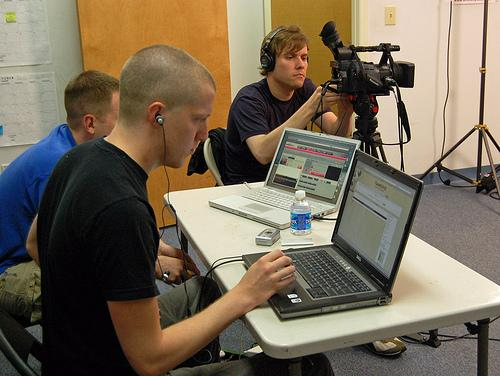
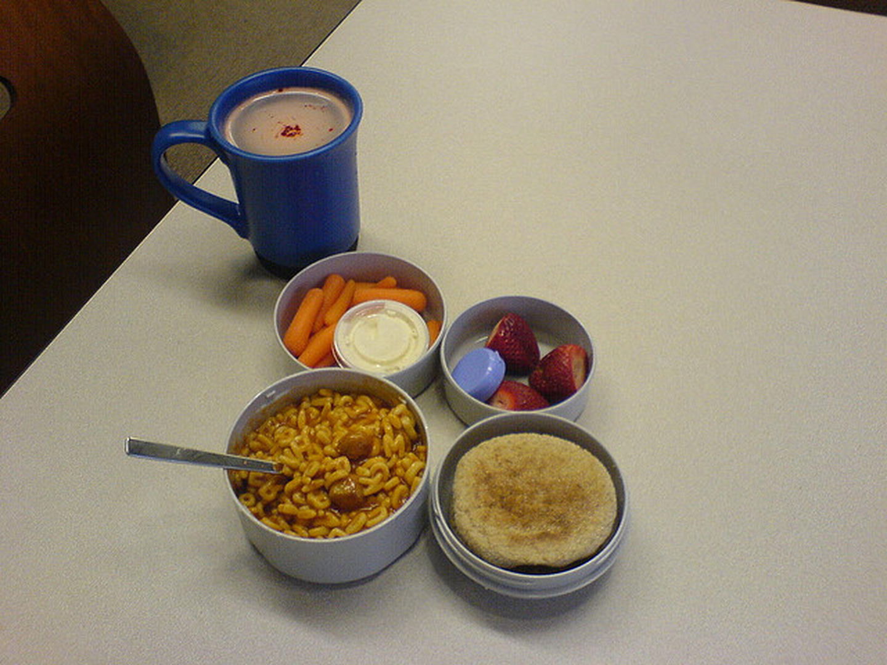

# Thinking with Visual Grounding

## 摘要

**论文元信息。** 标题为 *Thinking with Visual Grounding*，作者为 Junkai Zhang、Yihe Deng、Kai-Wei Chang、Wei Wang，机构为 UCLA。论文页脚显示 arXiv:2606.16122v1 [cs.AI] 的日期为 **2026-06-15**，arXiv 页面也标注 Submitted on 15 Jun 2026；任务元信息给出的 **2026-06-22T01:30:05+00:00** 更可能是本地收录或流水线处理时间。论文链接：[https://arxiv.org/abs/2606.16122](https://arxiv.org/abs/2606.16122)，PDF 链接：[https://arxiv.org/pdf/2606.16122](https://arxiv.org/pdf/2606.16122)。报告依据为 PDF 全文与摘要，文本抽取状态为 fulltext:pypdf。

**一句话总结。** 本文提出视觉扎根思考（visually grounded thinking）：让 VLM 在自然语言推理中显式输出点或框坐标，把每一步关键视觉对象绑定到图像区域，并通过 SAM3 合成监督与 grounding-aware RL 提升计数和空间推理性能（见 PAGE 1-8）。

**代码状态。** 论文第 1 页脚注写有 “We release the data and code”，附录也提到完整 prompt 参见 source code（见 PAGE 1、PAGE 10）。但给定全文、arXiv 元信息和公开检索结果未提供可确认的仓库 URL；因此本文未提供可确认的公开代码，不展示代码段。代码分析证据不足。

**核心贡献。** 第一，论文把“思考是否看起来合理”推进到“思考是否指向图像证据”，要求模型在 `<obj> ... | coordinates </obj>` 标签中输出视觉证据（见 PAGE 1-2）。第二，论文构建了从 VQA 数据到带点/框监督的合成数据流水线，核心依赖 SAM3-based grounding agent 生成 RLE masks（见 PAGE 3-4）。第三，论文提出 grounding-aware reinforcement learning，将答案正确性奖励与密集 grounding reward 结合，使模型不仅优化最终答案，也优化中间视觉引用是否落在正确证据上（见 PAGE 5-6）。

## 背景与动机

近年的语言模型推理方法表明，显式自然语言思考链可以改善复杂问题求解能力。论文将这一趋势放到视觉语言模型（vision-language models, VLMs）场景中：给定图像和问题，模型先在文本中分步推理，再输出最终答案。此类策略已在视觉问答中被证明有效，但本文指出视觉推理与纯文本推理存在一个根本差异：视觉问题的证据位于图像中，不能完全由自然语言替代（见 PAGE 1）。

纯自然语言推理链的问题在于，它可以陈述“红车靠近入口”或“三个人撑伞”，却不说明这些对象在图像中的具体位置。这样一来，推理文本即使语义连贯，也可能无法验证其是否真正依赖图像证据。论文开篇用一句话概括这一动机：视觉思考不应只“听起来正确”，还应展示其证据（见 PAGE 1）。这也是本文题目中 visual grounding 的核心含义。

已有相关工作已经尝试将 grounding 与 reasoning 结合。早期方法更多把 grounding 作为寻找关键图像区域的辅助手段，例如 Visual CoT、UV-CoT；后续 GCoT、Argus、GRIT、ViGoRL、VGR 等工作进一步让模型在推理步骤中生成坐标或使用区域进行视觉回放（见 PAGE 2-3）。本文承接这一方向，但强调两点：一是生成点/框式的中间视觉证据，二是用专门的 grounding reward 直接评价模型生成的视觉定位是否正确。

从任务角度看，本文主要覆盖两类视觉推理：计数（counting）和空间关系理解（spatial reasoning）。训练数据来自 TallyQA、Pixmo-Count、VSR、MultihopSpatial、SpatialMQA，测试集全部保留用于评估（见 PAGE 3）。这些任务与检测业务存在可迁移关系，因为它们都需要识别对象、区分实例、定位空间关系；但本文并未评估开放词汇检测 mAP、召回率或实际检测器部署指标，因此不能把该方法直接等同于可部署检测器。检测方向的业务价值主要体现在自动标注质检、VLM 定位链路可解释性和错误归因分析。

本文的出发点可以概括为：如果 VLM 的中间推理涉及图像对象，那么这些对象应当被明确定位；如果模型定位错误，那么即使最终答案正确，中间推理也不应被完全视为可信。这一立场把“最终答案准确率”扩展为“答案正确性 + 推理证据可检查性”的联合目标。

## 预备知识

**视觉扎根思考（visually grounded thinking）** 指模型在自然语言推理中穿插显式视觉定位。论文采用两种接口：box mode 输出 `[x1, y1, x2, y2]`，表示对象边界框；point mode 输出 `[x, y]`，表示对象内部一点。坐标统一归一化到 `[0,1000]` 图像坐标系，左上角为 `[0,0]`，右下角为 `[1000,1000]`（见 PAGE 4、PAGE 12-13）。

**RLE mask（run-length encoding mask）** 是本文数据合成中的共享几何监督信号。SAM3-based grounding agent 首先为对象选出分割 mask，并以 RLE 形式保存；随后 box mode 从 mask 转换为归一化 bounding box，point mode 从 mask 中选取距离边界最远的内部点，以确保点位于对象内部（见 PAGE 3-4）。

**SFT 与 RL 的分工。** 监督微调（supervised fine-tuning, SFT）用于让模型学会在推理文本中插入 grounding tags；强化学习（reinforcement learning, RL）则进一步优化答案正确性、格式和 grounding 质量。论文使用 GRPO 进行 RL，并将 grounding reward 与 response-level rewards 分开归一化后合并（见 PAGE 6-7）。

## 方法详解

### 1. 输出形式：从纯语言推理到可定位推理

本文最直接的技术接口是 `<obj> name phrase | coordinates </obj>`。其中 `name phrase` 是对象描述，例如 “black laptop”；`coordinates` 是点或框坐标。一个 tag 可以包含多个坐标，用于表示同一短语对应多个实例，例如一群鸟或多名行人（见 PAGE 5、PAGE 12-13）。

用途：Figure 1 用于说明三种推理形式的差异：纯自然语言、box-grounded thinking、point-grounded thinking。它回答的是“本文所谓视觉扎根思考到底长什么样”。

读图要点：图中将“black laptop”“white laptop”等对象从纯文本描述变成带坐标的 `<obj>` 标签。box mode 给出对象外接框，point mode 给出对象内部点。

支撑的判断：本文的核心创新不是换一个 VQA 模型，而是改变推理 trace 的表达协议，使推理步骤显式绑定视觉证据（见 PAGE 1-2）。

用途：该图块同样来自 Figure 1/Page 2，用于补充展示 point mode 与 box mode 的并列形式。

读图要点：box mode 表达对象范围，point mode 表达实例定位。二者都把自然语言对象短语与图像坐标绑定，但几何信息密度不同。

支撑的判断：point grounding 更轻量，适合实例级识别；box grounding 提供对象范围，对空间关系更有潜在帮助。这一判断后来被实验部分进一步验证（见 PAGE 7-8）。

### 2. 真实输出样例：中间证据可读、可查、可评分

Figure 2 展示了模型在评估 benchmark 中的真实输出。问题要求判断最接近 brown chair 的蓝色物体，模型在推理中定位了 blue mug 和 brown chair，并把最终选项映射到 cup（见 PAGE 3）。

用途：Figure 2 用于展示 visually grounded thinking 在真实问答中的输出结构，而不只是格式模板。

读图要点：模型不仅输出答案 A，还显式给出 blue mug 和 brown chair 的坐标框。图中同时列出 grounded objects，说明模型生成的对象引用可以被解析成结构化监督或评估对象。

支撑的判断：这种格式使中间推理可检查：若模型选对 A 但定位错了 chair 或 mug，grounding reward 仍可发现问题（见 PAGE 3、PAGE 5-6）。

### 3. 数据合成流水线：先得到正确推理，再补齐视觉证据

论文的数据合成从多个开源 VQA 数据集出发，首先让 Qwen3-VL-Plus 生成 thinking-mode response，解析最终答案，只保留预测与 ground truth 一致的样本；第一遍未答对的样本再用 Qwen3.5-Plus 做第二遍生成，保留任一遍答对的样本（见 PAGE 3）。这一策略保证合成数据的推理 trace 至少在最终答案层面正确。

随后，论文用 LLM 从正确推理 trace 中抽取 groundable objects。这些对象包括答案对象、可见的多选项、空间 anchor、被计数实例以及空间关系端点。每个对象由 name 和 disambiguating context 共同描述，例如 “red car” 加上 “in the back row”，用于区分视觉上或语义上相似的实例（见 PAGE 3）。

用途：Figure 3 展示完整数据合成流水线，从 VQA 输入、推理 trace 生成、对象抽取、SAM3 agent grounding，到点/框监督和最终 SFT/RL 数据。

读图要点：图中关键环节是 agentic visual grounding：VLM agent 观察图像和目标对象，提出 SAM3-compatible noun phrase，调用 SAM3 产生候选 mask，再验证、修正短语并选择最终 mask。底部展示同一推理 trace 如何分别写成 box mode 和 point mode。

支撑的判断：本文的数据不是人工逐框标注，而是通过“正确推理 trace + 对象抽取 + SAM3 mask + 坐标回填”形成可扩展监督；这解释了为什么论文能构造 19,909 条 SFT traces 和 107,613 个 grounding annotations（见 PAGE 4-5）。

### 4. SAM3-based grounding agent：用 mask 作为几何源头

直接让 VLM 输出 RLE masks 不现实，直接让 VLM 预测框也容易噪声较大；因此论文把 SAM3 放在 grounding agent 的中心。agent 有四类 tool actions：调用 SAM3 产生候选实例 masks，基于原图、全图 overlay 和 zoom crop 验证 mask，选择最终 mask IDs，或者报告没有有效检测（见 PAGE 3）。

这一设计的重要约束是：agent 不能直接写坐标，所有几何监督必须由选中的 SAM3 masks 推导。这一约束降低了 annotation model 直接幻觉坐标的风险。换言之，LLM 负责语义对象理解与短语修正，SAM3 mask 负责几何证据，最后由确定性转换得到 box 或 point（见 PAGE 3-4）。

对检测方向而言，这一 pipeline 与开放词汇检测有关系，但关系是间接的。它并未训练一个 detector，也没有报告检测指标；它更像是用强分割模型和 VLM agent 给推理 trace 生成可监督的定位证据。因此推荐方向应是“观察并迁移其定位监督思想”，而不是立即把它作为检测模型替代方案。

### 5. 点/框监督的构造：同一 mask，两种接口

论文把选中的 RLE mask 作为共享监督信号。box mode 将每个 mask 转换为 `[x1,y1,x2,y2]`，point mode 则选择 mask 内部距离边界最远的点 `[x,y]`。后者特别针对非凸 mask，确保点仍落在对象内部（见 PAGE 4）。

最终 annotation 阶段先在推理文本中插入 placeholder object tags，但不向 annotation model 暴露坐标；随后再从 SAM3 输出填入坐标。论文明确说明，这一设计用于防止 annotation model hallucinating spatial values（见 PAGE 4）。同时，系统会过滤 tag-stripped 后与原始 thinking 差异过大、tag 格式错误或推理高度重复的样本（见 PAGE 4）。

数据规模上，pipeline 产生 19,909 条 reasoning traces，包含 107,613 个 grounding annotations 和 72,381 个 distinct grounded objects（见 PAGE 5）。平均每行约 3.64 个 grounded objects 和 5.41 个 `<obj>` annotations，这说明同一对象可能在推理中被多次引用（见 PAGE 11）。

### 6. Grounding object routing：先对齐对象，再评分坐标

RL 阶段不能简单按字符串匹配 `<obj>` 标签，因为模型可能换用同义短语，也可能改变推理顺序。论文因此引入 grounding object router：先解析 rollout 中所有 `<obj> ... </obj>` 标签，抽取对象名和附近文本作为 disambiguating context，再用轻量 VLM Qwen3.5-4B 将模型生成的 grounding objects 路由到数据中保存的 ground-truth grounding objects（见 PAGE 5）。

该 routing 步骤解决两个问题。第一，同一对象可能有不同说法，例如 “blue mug” 与 “cup”。第二，相同 name phrase 可能对应图中多个实例，需要上下文消歧。若多个生成对象都匹配到同一个 ground-truth object，仅保留最早的一个用于 grounding quality scoring（见 PAGE 5）。

与传统只看最终答案的 RL 不同，这一步让奖励函数能够评估“模型在推理中提到的视觉对象是否对应正确证据”。它也是本文区别于普通 CoT 或仅格式化 grounding 的关键机制。

### 7. Box grounding quality：用区域 IoU 评价框集合

在 box mode 中，第 \(i\) 个保存对象有一组 ground-truth boxes，记为 \(G_i\)。经过 routing 后，模型为匹配到的生成对象输出一组 boxes，记为 \(P_i\)。这里 \(i\) 表示第 \(i\) 个受监督的视觉对象，\(G_i\) 是真实框集合，\(P_i\) 是模型生成框集合（见 PAGE 5）。

论文把每组 boxes 都视为区域并集，计算并集区域之间的 intersection-over-union。令 \(I_i\) 为 \(P_i\) 与 \(G_i\) 同时覆盖的面积，\(U_i\) 为二者任一覆盖的面积，则：

$$
IoU_i = \frac{I_i}{U_i}
$$

人话解释：这个公式衡量模型生成的框区域与真实框区域重合得有多好；完全重合为 1，没有重合为 0（见 PAGE 5）。

如果没有模型生成的 grounding object 匹配到第 \(i\) 个 ground-truth object，则设 \(IoU_i=0\)。最终 box grounding quality 是所有 \(T\) 个 ground-truth objects 的平均分，每个对象等权，不因其包含多少个 boxes 而改变权重（见 PAGE 5-6）。

### 8. Point grounding quality：用实例级匹配 F1 评价点

在 point mode 中，第 \(i\) 个对象的真实监督是一组 masks，记为 \(M_i\)；模型生成的一组 points 记为 \(P_i\)。这里 \(M_i\) 是第 \(i\) 个对象对应的真实 mask 集合，\(P_i\) 是模型给出的点集合（见 PAGE 6）。

论文在生成点与真实 masks 之间形成一对一 assignment，只有点落在 mask 内部时才允许匹配。令 \(TP_i\) 为成功匹配的 mask 数，\(FP_i\) 为多余或错误点数，\(FN_i\) 为未被命中的真实 mask 数，则：

$$
FP_i = |P_i| - TP_i,\quad FN_i = |M_i| - TP_i
$$

人话解释：如果模型点多了但没落到新实例上，就是 false positive；如果真实实例没有点命中，就是 false negative（见 PAGE 6）。

随后用每对象 F1 评价 point grounding：

$$
F1_i = \frac{2TP_i}{2TP_i + FP_i + FN_i}
$$

人话解释：这个公式同时惩罚漏标和乱标；只有每个目标实例都被不同的有效点命中，且没有多余点时，分数才接近或等于 1（见 PAGE 6）。

论文还指出 point reward 是 box reward 的离散对应物。box IoU 会随重叠面积连续变化，而 point F1 是分段常数：点在同一 mask 内移动不改变分数，跨出边界则可能突然降分。这使 point reward 更粗糙，也可能更难优化（见 PAGE 6）。

### 9. 最终奖励：答案、格式、截断与 grounding 分开归一化

每个 rollout 的总奖励由密集 grounding reward 和若干稀疏 response-level rewards 组成。符号 \(r_i^{ans}\) 表示答案正确性奖励，\(r_i^{think}\) 表示 thinking format reward，\(r_i^{gfmt}\) 表示 grounding format reward，\(r_i^{trunc}\) 表示截断惩罚（见 PAGE 6）。

基础奖励定义为：

$$
R_i^{base}
=
w_{ans}r_i^{ans}
+
w_{think}r_i^{think}
+
w_{gfmt}r_i^{gfmt}
+
r_i^{trunc}
$$

人话解释：基础奖励先把答案是否正确、是否符合 `<think>...</think>` 与 `\boxed{}` 格式、grounding tag 是否有效、是否截断这些因素合成一个 response-level 分数（见 PAGE 6）。

由于 grounding reward 与其他奖励尺度不同，论文对二者分别做 batch-wise normalization。令 \(N_B(\cdot)\) 表示当前 batch \(B\) 内的归一化，最终奖励为：

$$
R_i =
N_B(R^{base})_i
+
w_{ground}N_B(r^{ground})_i
$$

人话解释：模型最终看到的奖励由“归一化后的回答质量”加上“加权后的归一化 grounding 质量”组成，避免某一类奖励因数值尺度过大而主导训练（见 PAGE 6）。

实验中，论文设定 \(w_{ans}=1.0\)、\(w_{ground}=0.5\)、\(w_{think}=w_{gfmt}=0.1\)。截断 rollout 的惩罚为 \(r_i^{trunc}=-1\)，未截断为 0（见 PAGE 6）。这些超参数说明答案正确性仍是最大权重目标，但 grounding 被赋予了足够大的独立训练信号。

## 实验分析

### 实验设置

模型基座为 Gemma3-4B-IT。论文先在合成数据上做 SFT，得到 cold-start models；为了隔离视觉 grounding 的作用，训练三个受控变体：non-grounded thinking、thinking with box grounding、thinking with point grounding。三者使用相同图像、问题、答案和底层 reasoning traces，仅在是否包含 grounding tags 以及使用 box 还是 point 上不同（见 PAGE 7）。

RL 使用 verl 训练，SGLang 作为 inference engine，FSDP2 作为 training backend。评估使用 VLMEvalKit，在 temperature 1.0 下做四次 inference passes，并报告 average accuracy 与 pass@4（见 PAGE 7）。评估数据包括两个计数 benchmark：TallyBench、CountQA；四个空间推理 benchmark：VSR-zeroshot、EmbSpatial、SpatialMQA、MultihopSpatial（见 PAGE 7）。

| 配置项 | SFT 设置 | RL 设置 | 证据 |
|---|---:|---:|---|
| 最大序列或响应长度 | 8192 tokens | response 8192 tokens | PAGE 11 |
| 全局/训练 batch size | 256 | 64 | PAGE 11 |
| 优化器 | AdamW, β1=0.9, β2=0.95 | AdamW, β1=0.9, β2=0.999 | PAGE 11 |
| 学习率 | 1e-5 cosine decay | 1e-6 cosine decay | PAGE 11 |
| RL 算法 | 不适用 | GRPO | PAGE 11 |
| rollout samples per prompt | 不适用 | 8 | PAGE 11 |
| 评估 passes | 不适用 | 4 | PAGE 12 |
| 评估 context length | 不适用 | 32768 tokens | PAGE 12 |

表格解读：训练配置显示本文并非只做 prompt engineering，而是完整进行了 SFT 与 RL 两阶段训练。RL 的 8 samples per prompt 和四次评估 passes 说明结果考虑了随机解码方差，但训练成本也较高；论文报告训练和评估约需 400 H200 GPU hours（见 PAGE 13）。

### 计数任务结果

| Method | TallyBench ACC. | TallyBench PASS@4 | CountQA ACC. | CountQA PASS@4 | 证据 |
|---|---:|---:|---:|---:|---|
| Gemma3-4B-IT | 33.33 | 40.65 | 9.87 | 14.14 | Table 1, PAGE 7 |
| Non-grounded Thinking | 21.73 | 42.00 | 4.30 | 12.24 | Table 1, PAGE 7 |
| Grounding Box w/o reward | 37.24 | 64.45 | 10.73 | 27.75 | Table 1, PAGE 7 |
| Grounding Box w/ reward | 38.81 | 64.50 | 11.19 | 28.47 | Table 1, PAGE 7 |
| Grounding Point w/o reward | 39.03 | 65.50 | 12.34 | 31.48 | Table 1, PAGE 7 |
| Grounding Point w/ reward | 39.31 | 65.75 | 11.65 | 29.77 | Table 1, PAGE 7 |

表格解读：计数任务上，所有 visually grounded variants 都显著优于 non-grounded thinking，并整体优于原始 Gemma3-4B-IT。TallyBench 最好 ACC 是 point w/ reward 的 39.31，CountQA 最好 ACC 是 point w/o reward 的 12.34。更明显的是 PASS@4：point w/o reward 在 CountQA 达到 31.48，相比 Gemma3-4B-IT 的 14.14 提升超过一倍。该结果支持论文判断：计数主要需要实例级定位，point grounding 足以帮助模型区分目标实例与干扰物（见 PAGE 7-8）。

### 空间关系结果

| Method | VSR ACC. | VSR PASS@4 | EmbSpatial ACC. | Emb PASS@4 | SpatialMQA ACC. | Spatial PASS@4 | Multihop ACC. | Multihop PASS@4 | 证据 |
|---|---:|---:|---:|---:|---:|---:|---:|---:|---|
| Gemma3-4B-IT | 56.65 | 57.94 | 49.13 | 63.79 | 25.35 | 36.43 | 22.70 | 36.87 | Table 2, PAGE 8 |
| Non-grounded Thinking | 51.84 | 79.13 | 20.54 | 42.53 | 14.17 | 27.88 | 4.79 | 11.67 | Table 2, PAGE 8 |
| Box w/o reward | 66.82 | 87.64 | 57.62 | 81.46 | 37.64 | 67.66 | 34.89 | 63.82 | Table 2, PAGE 8 |
| Box w/ reward | 68.08 | 86.91 | 59.93 | 82.66 | 38.68 | 68.49 | 37.68 | 66.40 | Table 2, PAGE 8 |
| Point w/o reward | 65.38 | 83.88 | 60.25 | 83.21 | 39.13 | 67.19 | 37.03 | 65.40 | Table 2, PAGE 8 |
| Point w/ reward | 64.67 | 81.42 | 60.88 | 83.10 | 39.01 | 68.49 | 37.01 | 65.02 | Table 2, PAGE 8 |
| Gemma3-12B-IT | 67.98 | 69.56 | 56.68 | 65.14 | 37.85 | 50.00 | 30.08 | 43.58 | Table 2, PAGE 8 |
| Gemma3-27B-IT | 69.25 | 70.70 | 62.09 | 72.12 | 38.99 | 54.28 | 30.94 | 45.82 | Table 2, PAGE 8 |

表格解读：空间推理上，4B visually grounded models 在 SpatialMQA 和 MultihopSpatial 的最佳 ACC 超过 Gemma3-27B-IT：SpatialMQA 为 39.13 对 38.99，MultihopSpatial 为 37.68 对 30.94。VSR 和 EmbSpatial 的最佳 ACC 分别为 68.08 和 60.88，低于 27B 但接近或超过 12B。PASS@4 方面，所有 grounded variants 在四个空间 benchmark 上均高于 Gemma3-27B-IT，说明 grounding 更明显提升了多次采样时出现正确答案的概率（见 PAGE 7-8）。

### Grounding reward 的作用

box mode 中，加入 grounding reward 后，六个 benchmark 的 ACC 全部提升：TallyBench 37.24 到 38.81，CountQA 10.73 到 11.19，VSR 66.82 到 68.08，EmbSpatial 57.62 到 59.93，SpatialMQA 37.64 到 38.68，MultihopSpatial 34.89 到 37.68（见 PAGE 7-8）。这说明 box reward 的连续 IoU 信号对下游准确率有稳定收益，尤其在空间任务中更明显。

point mode 中，grounding reward 的收益不稳定。TallyBench ACC 从 39.03 到 39.31，EmbSpatial 从 60.25 到 60.88，但 CountQA、VSR、SpatialMQA、MultihopSpatial 的 ACC 均略降（见 PAGE 7-8）。论文将原因归结为 point reward 的反馈更粗：点只要落在同一 mask 内就得同样分数，跨出边界才突变，因此优化信号比 box IoU 更不平滑（见 PAGE 6-8）。

### Box 与 Point 的差异

计数任务中，point grounding 整体优于 box grounding。论文解释为，计数更依赖实例级定位：模型需要知道哪些对象属于被计数集合，并将其与干扰物分开；它不一定需要精确恢复每个对象的完整边界。point grounding 正好提供紧凑的实例锚点，避免生成 tight box 的额外难度（见 PAGE 8）。

空间任务中，box 与 point 更接近。box 提供对象范围、大小和边界，对 left/right/above/below、距离、重叠等几何关系有潜在帮助；point 虽然几何信息更少，但仍能标识相关对象和空间 anchor，许多空间问题可以结合模型视觉表征完成（见 PAGE 8）。因此本文的实验证据支持一个较细的判断：计数优先 point，空间关系中 box 的理论优势存在，但不总能转化为明确准确率优势。

## 讨论

本文对 VLM 可解释性最直接的启示是：中间推理不应只被当作可读文本，而应被当作可审计对象。传统 CoT 只能检查语言逻辑是否连贯；visually grounded thinking 进一步允许检查模型是否把关键对象定位到正确图像区域。对自动标注质检而言，这意味着可以用 `<obj>` tags 追踪模型判定依据，区分“答案错是因为对象识别错、空间关系错，还是最终选项映射错”。

对检测方向而言，本文提供的是一种训练和评估范式，而不是检测器本身。它没有报告 COCO/LVIS/Open-vocabulary detection 指标，也没有证明生成的点/框可直接替代检测框。其可迁移价值在于：将 VLM 推理中的对象短语、上下文和几何证据联合建模，可用于自动标注审核、开放词汇定位的错误归因，以及检测后处理中的语义一致性检查。由于证据局限，建议观察并做小规模验证，而不是立即作为主检测链路部署。

本文也提示了一个更一般的研究方向：VLM 推理质量不应只用 final answer accuracy 衡量。对于视觉任务，模型可能碰巧答对，也可能在未真正利用图像的情况下生成合理解释。将推理对象路由到 ground-truth masks 并评分，可以为“模型是否看对了地方”提供训练信号。未来工作若能把 grounding correctness、answer correctness 和 human-verifiable rationale 结合，可能形成更稳健的视觉推理评测标准。

## 局限分析

第一，作者没有单列 Limitations section，但文中明确承认数据合成 pipeline 抽取的 grounding objects 不是所有可用视觉线索的完整枚举。因此 RL 不惩罚 unmatched rollout grounding objects，只设置 tag 数量上限，防止模型过度输出标签（见 PAGE 6）。这是一处重要边界：如果监督对象集不完整，grounding reward 只能评价被保存的对象，不能完全覆盖模型可能使用的全部视觉证据。

第二，作者明确分析了 point reward 的优化局限。point F1 是 piecewise constant，点在同一 mask 内移动不会改变分数，越过边界则分数突变，因此反馈比 box IoU 更粗，可能更难优化（见 PAGE 6-8）。实验也印证了这一点：point mode 加 grounding reward 并未稳定提升下游准确率（见 PAGE 7-8）。

第三，从独立判断看，数据合成依赖多个强模型和工具链，包括 Qwen3-VL-Plus、Qwen3.5-Plus、DeepSeek-V4-Flash、Qwen3.5-Flash、Qwen3.6-Plus、Gemini-3-Flash 与 SAM3-based agent（见 PAGE 10）。这种 pipeline 可扩展，但复现成本高，且如果其中部分模型或 SAM3 行为不可完全开放，外部研究者很难严格复现同等数据质量。

第四，代码状态存在证据不足。论文声称 release data and code，附录称 prompt 详见 source code（见 PAGE 1、PAGE 10），但本文给定材料未提供仓库 URL，公开检索也未确认可访问实现。因此当前无法核对 routing、reward、mask conversion、filtering 等实现细节与论文描述是否完全一致，也无法给出论文方法到源码函数的对应关系。

第五，评估范围集中在计数和空间推理，不包含检测、分割、开放词汇定位精度或人工可解释性评分。虽然任务与视觉定位相关，但“提升 VQA 计数/空间准确率”不等于“提升检测系统性能”。若要用于业务检测链路，还需要补充对象级 precision/recall、框质量、长尾类别、遮挡场景、多实例歧义和延迟成本评估。

## 结论

*Thinking with Visual Grounding* 的主要贡献在于把 VLM 的中间思考从纯文本扩展为“文本 + 可定位视觉证据”。论文通过 SAM3-based synthesis pipeline 生成点/框监督，再用 grounding-aware RL 同时优化答案正确性与中间对象定位质量。实验表明，在 Gemma3-4B-IT 上加入 visually grounded thinking 后，计数和空间推理均显著优于 non-grounded thinking；在部分空间 benchmark 上，4B grounded models 可达到或超过同系列 27B 模型（见 PAGE 7-8）。

对研究而言，本文的价值不只在性能提升，而在评价目标的改变：视觉推理的可信度应同时看答案、推理文本和图像证据。对业务而言，它更适合作为自动标注质检、VLM 定位可解释性和错误归因分析的启发，而不是现成检测器。当前最需要补齐的是公开代码、可复现实验细节、grounding 质量独立评估，以及面向检测任务的直接指标。

## 证据索引

| 证据点 | PAGE |
|---|---|
| 论文标题、作者、摘要、核心动机、visually grounded thinking 定义、脚注声称 release data and code | PAGE 1 |
| Figure 1；point/box grounding 输出格式；三项贡献；与相关工作的关系 | PAGE 2 |
| Figure 2；真实 grounded thinking 输出样例；数据源；推理 trace 蒸馏；groundable objects 抽取；SAM3-based grounding agent | PAGE 3 |
| Figure 3 和 Figure 4；数据合成流水线；RLE mask 到 box/point；防止坐标幻觉；tag 过滤 | PAGE 4 |
| 数据规模；grounding tag parsing；grounding object router；box IoU 公式定义 | PAGE 5 |
| point F1 公式；point/box reward 差异；不惩罚 unmatched grounding objects；最终 reward 公式与权重 | PAGE 6 |
| 训练与评估设置；Table 1 计数结果；non-grounded thinking length collapse；主要结果解释 | PAGE 7 |
| Table 2 空间推理结果；grounding reward 效果；box vs point 讨论；结论 | PAGE 8 |
| 数据合成模型细节；source code 提及；源数据过滤规则 | PAGE 10 |
| 最终数据组成；grounding density；SFT/RL 训练配置 Table 3 和 Table 4 | PAGE 11 |
| Figure 7；评估配置 Table 5；box/point system prompts 与坐标归一化规则 | PAGE 12 |
| point system prompt 续；训练评估成本约 400 H200 GPU hours | PAGE 13 |
