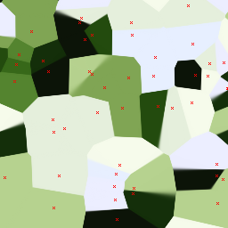
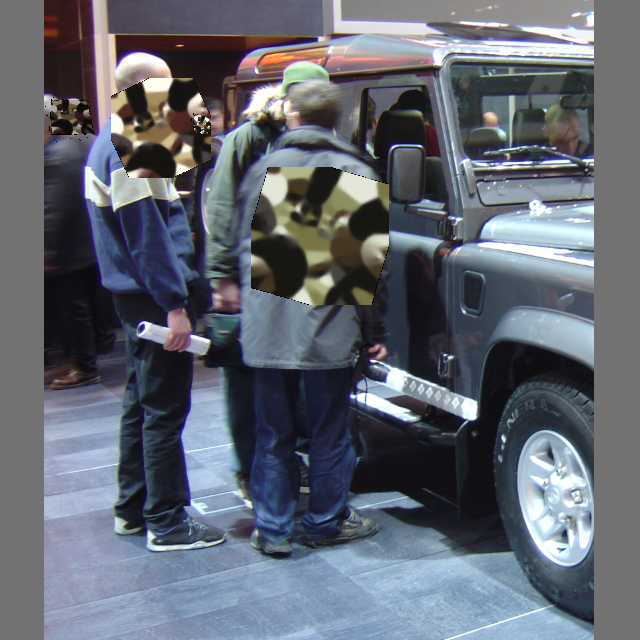
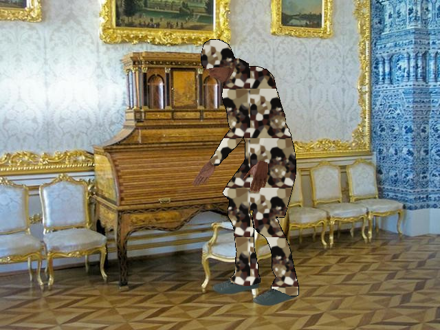

# Structured Adversarial Camouflage via Voronoi Diagrams

## 摘要

| 项目 | 内容 |
|---|---|
| 论文 | Structured Adversarial Camouflage via Voronoi Diagrams |
| 作者 | Jens Bayer, Stefan Becker, David Münch, Michael Arens, Jürgen Beyerer |
| arXiv | http://arxiv.org/abs/2606.17711v1 |
| PDF | https://arxiv.org/pdf/2606.17711v1 |
| 版本时间 | arXiv v1 为 2026-06-16；PDF 封面日期为 2026-06-17（见 PAGE 1） |
| 代码状态 | 论文给出 `https://github.com/JensBayer/Voronoi`（见 PAGE 1）。仓库 README 声明代码因专利注册将在正式论文发布后提供；当前未提供可核验源码，因此代码段与源码行号证据不足。 |
| 任务方向 | 检测鲁棒性评估；尤其是行人检测（person detection）在结构化对抗伪装下的脆弱性测试。 |

本文提出对抗 Voronoi 伪装（adversarial Voronoi camouflage）：不再逐像素优化补丁，而是在固定可打印调色板（fixed printable palette）下优化 Voronoi 种子点（seed points）的位置，通过软分配（soft assignment）生成类似 splinter camouflage 的结构化图案。实验聚焦行人检测，采用 COCO-style AP@[.5:.95]，并覆盖朴素补丁、服装区域覆盖、背景迁移、模型迁移、调色板替换和交叉评估五组实验（见 PAGE 1、PAGE 3、PAGE 4、PAGE 5）。

一句话总结：本文把对抗补丁从“逐像素噪声优化”改写为“固定调色板下的几何种子点优化”，在服装级应用中显著降低 YOLO 系列行人检测 AP，并揭示结构与颜色调色板之间存在强耦合关系（见 PAGE 1、PAGE 6、PAGE 7、PAGE 8）。

需要特别说明：全文明确编号的公式只有公式 (1) 与公式 (2)，另外还有若干未编号定义式。若要求“论文编号公式不少于 5 条”，证据不足；本报告只引用 PAGE 3 中明确出现的数学定义与编号公式，不伪造论文没有给出的公式。论文给出代码链接，但当前仓库未提供核心源码，因此本文不包含代码段，也不做文件级实现映射。

## 背景与动机

现代侦察、监控与固定传感器网络越来越依赖深度学习目标检测器，这些检测器通常位于处理链的前端，负责把人员或装备的出现传递给人类操作员或后续决策模块。论文指出，这类系统中的系统性弱点可能带来不成比例的操作影响；因此，对抗伪装既可以作为友方能力，也可能成为对手利用的安全风险（见 PAGE 1）。

已有物理对抗补丁和对抗服饰工作表明，精心设计的衣物、车辆或装备图案可以在现实视角条件下降低检测性能。问题在于，许多方法生成的图案视觉上过于突兀，偏离常见伪装风格，或者依赖难以用真实颜料和纺织工艺稳定实现的颜色选择，从而限制了技术迁移、物理验证和鲁棒性测试（见 PAGE 1）。

本文的出发点是将对抗优化约束在更接近传统伪装设计的参数空间中。作者使用 Voronoi 图（Voronoi diagrams）作为结构先验，只优化种子点位置，颜色来自预定义固定调色板。这样生成的图案具有更强的结构性和视觉可解释性，形态上接近 woodland、urban、desert 等自然或军事伪装设计，而不是典型对抗补丁中的高频像素扰动（见 PAGE 1、PAGE 2、PAGE 3）。

相关工作方面，论文讨论了物理对抗补丁、adversarial T-shirts、AdvCam、Dense Proposals Attack、红外对抗服装、基于军事伪装原则的补丁攻击、DAAC，以及使用 StyleGAN3 生成伪装纹理的方法。本文与这些工作的关键差异在于，它不训练复杂生成器，也不逐像素优化，而是使用固定调色板下的 Voronoi 几何参数化，降低参数量并增强图案结构性（见 PAGE 2、PAGE 3）。

从防御测试角度看，这类方法的业务价值不在于直接提升检测模型能力，而在于生成更接近真实服饰/伪装的对抗测试样本，用于评估检测模型在安全场景下对服饰区域扰动、背景迁移和模型黑盒迁移的脆弱性。论文也明确表示不主张已经实现 physical stealth，物理打印、颜色校准、服装形变和人因因素仍需受控研究验证（见 PAGE 2、PAGE 9）。

## 预备知识

Voronoi 图是一种由种子点划分平面的几何结构。给定若干种子点，平面上每个位置被分配给距离最近的种子点，从而形成一组多边形单元。本文将这一几何结构用于生成伪装纹理：每个种子点携带一个来自固定调色板的颜色，图案中的像素颜色由像素到各个种子点的距离决定（见 PAGE 3）。

对抗补丁（adversarial patch）通常指在输入图像中放置一块可优化图案，使目标检测器的置信度、objectness score 或类别分数下降。传统补丁可以逐像素优化，因此自由度高，但也更容易产生视觉异常。本文的 Voronoi patch 将优化变量限制为种子点坐标，颜色不自由优化，从而牺牲部分优化自由度，换取更强的图案结构约束和调色板可控性（见 PAGE 3、PAGE 4）。

平均精度 AP（average precision）是本文评估检测性能的核心指标。论文使用 COCO-style AP，即在 IoU 阈值 0.5 到 0.95、步长 0.05 的多个阈值上计算 AP。表格中的 `AP↓` 表示攻击后检测 AP 越低越好，`∆AP↑` 表示相对参考随机 Voronoi 图案的 AP 下降越大越好。论文说明参考图案与优化图案共享相同参数化和调色板，但种子点未经过对抗优化（见 PAGE 5）。

## 方法详解

### 1. 从逐像素优化到种子点优化

本文的核心方法是 adversarial Voronoi patches。给定种子点集合：

$$
S = \{s_1, \ldots, s_n\} \subset \mathbb{R}^2
$$

其中 $S$ 表示所有 Voronoi 种子点的集合，$s_i$ 表示第 $i$ 个种子点，$n$ 表示种子点数量，$\mathbb{R}^2$ 表示二维平面坐标空间。人话解释：图案不是直接由每个像素独立决定，而是由若干二维控制点间接决定；优化目标从“改每个像素”变为“移动这些控制点”（见 PAGE 3）。

论文进一步定义像素网格：

$$
I = \{1, \ldots, H\} \times \{1, \ldots, W\}
$$

其中 $I$ 是图案的像素坐标集合，$H$ 和 $W$ 分别为图案高度与宽度。人话解释：最终图案仍然是一张离散图像，但它的颜色是由连续几何结构生成的，而不是由独立像素自由参数化（见 PAGE 3）。

每个种子点对应一个颜色：

$$
c_i \in [0,1]^3
$$

其中 $c_i$ 是第 $i$ 个种子点的 RGB 颜色，$[0,1]^3$ 表示三个颜色通道都归一化到 0 到 1。人话解释：颜色来自固定调色板，而不是优化器任意生成；这使图案更接近可打印、可选色、可管理的伪装设计（见 PAGE 3、PAGE 5）。

### 2. 距离定义与软分配

对任意像素 $p \in I$，论文定义它到第 $i$ 个种子点的距离为：

$$
d_i(p) = \|p - s_i\|
$$

其中 $p$ 是像素位置，$d_i(p)$ 是该像素到种子点 $s_i$ 的欧氏距离。人话解释：像素离哪个种子点近，就更倾向于采用哪个种子点的颜色，这是 Voronoi 图的几何基础（见 PAGE 3）。

传统 Voronoi 图使用硬分配：每个像素只属于最近种子点。本文为了让优化可微，使用温度缩放的 softmin 权重，即论文公式 (1)：

$$
w_i(p,\tau)=\frac{e^{-d_i(p)/\tau}}{\sum_{k=1}^{n} e^{-d_k(p)/\tau}}
$$

其中 $w_i(p,\tau)$ 是像素 $p$ 对种子点 $i$ 的软权重，$\tau$ 是温度参数，分母对所有种子点的指数距离进行归一化。人话解释：像素不是立刻硬性选择最近种子点，而是按照距离给所有种子点分配概率式权重；距离越近，权重越大（见 PAGE 3）。

论文还说明：

$$
\tau \to 0
$$

时，softmin 会接近：

$$
\operatorname{arg\,min}_i d_i(p)
$$

上的 one-hot 分配。这里 $\operatorname{arg\,min}_i d_i(p)$ 表示距离像素 $p$ 最近的种子点索引。人话解释：温度越低，软分配越接近普通 Voronoi 图的硬边界；温度较高时，单元边界会更平滑。论文 Figure 1 也说明，由于软分配，一些 cell 的边界不那么锐利（见 PAGE 2、PAGE 3）。

### 3. 图案生成公式

最终 Voronoi 图案由各个种子点颜色的凸组合得到，即论文公式 (2)：

$$
f(p)=\sum_{i=1}^{n} w_i(p,\tau)\cdot c_i
$$

其中 $f(p)$ 表示像素 $p$ 的最终 RGB 颜色，$w_i(p,\tau)$ 是该像素对种子点 $i$ 的权重，$c_i$ 是种子点颜色。人话解释：每个像素的颜色是所有种子点颜色的加权平均；当 $\tau$ 很小时，它几乎等于最近种子点的颜色（见 PAGE 3）。

论文设置所有生成图案均使用 256 个种子点，种子点在 $[0,1]^2$ 中随机初始化，温度参数 $\tau=0.001$，图案宽高均为 256 像素。这个设置使得图案有足够多的几何 cell 形成细粒度伪装结构，同时仍远少于逐像素优化 256×256×3 个颜色变量的自由度（见 PAGE 3）。

### 4. 图像证据：优化后的 Voronoi patch

用途：Figure 1 用于展示优化后的 Voronoi patch 及其种子点位置，支撑“结构化几何参数化”的方法描述。  
读图要点：红色叉号对应 seed points；图案呈现 splinter-like 的分块伪装结构；由于 soft assignment，部分 cell 边界并非完全锐利。  
支撑的判断：该图支撑本文不是逐像素优化纹理，而是通过种子点位置控制整体图案结构（见 PAGE 2）。

图后解读：Figure 1 的用途是把公式 (1) 和公式 (2) 的抽象定义可视化。读图要点在于“种子点-分块结构-软边界”三者同时出现。它支撑的判断是：本文的对抗性来自结构参数的优化，而非无约束像素噪声；这也是其相对传统 adversarial patch 更接近伪装设计实践的原因（见 PAGE 2、PAGE 3）。

### 5. 目标检测器优化目标

生成图案后，论文将其放置到目标对象上，并通过目标检测器前向传播，利用检测器预测来最小化目标类别的检测置信度。实验均以 “Person” 为目标类别，检测器权重使用 COCO 预训练官方权重（见 PAGE 3、PAGE 4）。

在 Experiment 1 中，补丁被朴素地放置在目标对象 bounding box 内，优化目标是降低 detector 的 objectness score。由于较新的 YOLO 变体不再计算 objectness score，作者改用两个 detection heads 的全局最大 pre-logit class scores。这个细节很重要，因为它说明攻击目标并非某个单一后处理输出，而是更靠近检测头分类响应的位置（见 PAGE 4）。

在 YOLOv10 中，由于缺少传统 non-maximum suppression，训练时有两个 detector heads；推理时 one-to-many head 通常禁用，但补丁优化时使用两个 heads 的输出。论文选择 YOLOv10b 作为主要被攻击模型，原因是 YOLO 系列为常见实时检测器，YOLOv10b 轻量且速度快，便于更全面评估；作者还引用其先前工作称 YOLOv10 架构生成的 patch 在多架构间具有较好迁移性（见 PAGE 5）。

### 6. 两类应用方式：朴素 patch 与服装区域覆盖

本文最关键的实验设计差异，是将 Voronoi 图案放置方式分成两类。第一类是常规 adversarial patch 设置：在 InriaPerson 上训练，补丁被放入目标 bounding box，随后在 COCO 上评估。这一设置预期不利于 Voronoi patch，因为传统逐像素补丁拥有更高自由度（见 PAGE 3、PAGE 4）。

第二类是 garment-level application，即使用 3DPeople 数据集中的服装 segmentation masks，将人物衣服区域替换为 adversarial Voronoi pattern。由于服装区域覆盖的人体面积更大，并且图案成为对象自身的一部分，而不是侵入式贴在 bounding box 中，作者预期其效果更强。实验结果也支持这一点：服装区域覆盖下 AP 下降显著大于朴素 patch 设置（见 PAGE 4、PAGE 6）。

用途：Figure 2 用于展示 InriaPerson/COCO 朴素放置与 3DPeople 服装 mask 放置之间的差异。  
读图要点：论文说明 InriaPerson 和 COCO 缺少服装 segmentation masks，因此补丁只能简单放到目标对象上；3DPeople 则利用 segmentation mask 覆盖人物 clothed regions。  
支撑的判断：该图支撑“应用位置和覆盖区域”是影响攻击强度的核心变量，而不仅是 Voronoi 图案本身（见 PAGE 4）。

图后解读：该图的用途是给出第一类放置策略的直观背景。读图要点是补丁与人体区域之间的空间关系较为粗糙。它支撑的判断是：朴素 bounding-box 放置并不等价于可穿戴伪装，因此其 AP drop 较小不能否定服装级伪装的有效性（见 PAGE 4、PAGE 6）。

用途：该图同属 Figure 2 的可视化材料，用于说明 3DPeople 数据集中服装 segmentation mask 对图案覆盖方式的作用。  
读图要点：服装区域覆盖使图案更像衣物纹理，而不是外加贴片。  
支撑的判断：该图支撑 Experiment 2 的设计动机，即 garment-level application 更接近对抗服饰/伪装评估场景（见 PAGE 4）。

图后解读：该图的用途是连接方法与实验设置。读图要点是 mask 将扰动限定到 clothed regions，使图案成为人体外观的一部分。它支撑的判断是：Experiment 2 的显著 AP 降低主要来自结构化图案与大面积服装覆盖的结合，而不是单纯把小 patch 放进检测框（见 PAGE 4、PAGE 6）。

### 7. 调色板约束与结构-颜色耦合

本文使用的调色板来自 Camogen，共有 13 个可用 palettes，实验选择其中 5 个：Forest Spring、Coastal、Sahara、Urban 1、Night 1。每个 palette 生成三个随机 Voronoi reference patches，作为未优化基线。论文 Figure 3 展示了五个调色板，但本任务提供的 figures 中没有 Figure 3 的 markdown_path，因此本文不嵌入该图，只依据 PAGE 5 的文字与图题说明（见 PAGE 5）。

调色板约束有两层作用。第一，它限制颜色为预定义集合，使图案更接近可打印伪装设计。第二，它将对抗优化压力转移到结构上，即在固定颜色集合下优化 seed-point locations。这使得“结构是否保留对抗性”可以通过换色实验单独考察（见 PAGE 4、PAGE 5、PAGE 8）。

Experiment 4 显示，将已经优化的结构整体换成另一套 palette 后，对抗效果基本消失，patch 表现接近随机 reference patches。Figure 5 的 repaint matrix 表明，主对角线为 0，而非原 palette 替换会产生明显 AP 差异。这个结果说明，本文方法中的 adversarial property 不是独立附着在 Voronoi 几何结构上，而是依赖结构与 palette 的耦合（见 PAGE 7、PAGE 8）。

## 实验分析

### 1. 实验设置总览

论文共设计五个实验。Experiment 1 验证 Voronoi patch 在常规 adversarial patch 设置下是否能攻击检测器；Experiment 2 使用 3DPeople 的服装 segmentation masks 进行 garment-level application；Experiment 3 评估背景迁移和 YOLOv9/10/11/12 模型迁移；Experiment 4 评估整体换色和单色 HSV 改动；Experiment 5 交换 Experiment 1 与 Experiment 2 的 patch，在对方设置中评估泛化能力（见 PAGE 3、PAGE 4、PAGE 5、PAGE 8、PAGE 9）。

优化细节方面，Experiment 1 使用 InriaPerson 训练、COCO 评估，训练 100 epochs，AdamW 初始学习率 0.01，每 25 epochs 降低 10 倍；augmentation 包括 random resize [0.6, 0.9]、random rotation [-30°, 30°]、color jitter 与 random perspective。Experiment 2 使用 3DPeople，因训练集更大，优化 10 epochs，AdamW 学习率 0.001，每 3 epochs 降低 10 倍（见 PAGE 4）。

### 2. Experiment 1：朴素 patch 效果有限

| Palette | ref. AP | AP↓ | ∆AP↑ |
|---|---:|---:|---:|
| Forest Spring | 0.45±0.00 | 0.42±0.01 | 0.02±0.01 |
| Coastal | 0.45±0.00 | 0.41±0.00 | 0.04±0.00 |
| Sahara | 0.45±0.00 | 0.39±0.01 | 0.06±0.01 |
| Urban 1 | 0.45±0.00 | 0.42±0.01 | 0.03±0.01 |
| Night 1 | 0.45±0.00 | 0.41±0.01 | 0.04±0.01 |

表格解读：Table 1 显示，在 InriaPerson 训练、COCO 评估的朴素放置设置下，Voronoi patch 的 AP 降低幅度很小，∆AP 仅为 0.02 到 0.06。Sahara palette 的效果最好，Forest Spring 最弱。这个结果符合论文预期：在传统 adversarial patch 设置中，逐像素优化方法拥有更高自由度，而 Voronoi seed-point 参数化受到结构和调色板约束，因此攻击强度较低。不过，AP 仍然相对 reference patch 下降，说明该结构参数化确实可以承载一定 adversarial component（见 PAGE 5、PAGE 6）。

### 3. Experiment 2：服装级应用带来显著 AP 下降

| Palette | ref. AP | AP↓ | ∆AP↑ |
|---|---:|---:|---:|
| Forest Spring | 0.60±0.01 | 0.29±0.01 | 0.32±0.01 |
| Coastal | 0.59±0.03 | 0.26±0.03 | 0.33±0.00 |
| Sahara | 0.61±0.01 | 0.26±0.02 | 0.34±0.02 |
| Urban 1 | 0.65±0.04 | 0.29±0.02 | 0.36±0.03 |
| Night 1 | 0.70±0.01 | 0.26±0.03 | 0.43±0.03 |

表格解读：Table 2 是全文最关键的实验结果之一。与 Table 1 相比，3DPeople 服装区域覆盖下 ∆AP 从 0.02–0.06 提升到 0.32–0.43。Night 1 的 reference AP 为 0.70±0.01，优化后降至 0.26±0.03，是最大 AP drop。论文解释称，3DPeople 中 reference patches 的检测 AP 更高，可能因为图案不再侵入式覆盖目标边缘，而是作为对象自身服装区域的一部分；但优化后的 patch 覆盖更大人体区域，因此对检测器造成更强干扰（见 PAGE 5、PAGE 6）。

这一结果的技术含义是：Voronoi 参数化在“小块贴片”场景中攻击性有限，但在“衣物纹理”场景中明显更有效。换言之，本文方法更适合作为对抗服饰/伪装鲁棒性测试工具，而不是替代传统小型 adversarial patch 的通用攻击器（见 PAGE 4、PAGE 6）。

### 4. Experiment 3.1：背景迁移到 BG-20k 仍保持攻击性

| Palette | ref. AP | AP↓ | ∆AP↑ |
|---|---:|---:|---:|
| Forest Spring | 0.86±0.01 | 0.47±0.05 | 0.39±0.00 |
| Coastal | 0.88±0.01 | 0.43±0.02 | 0.45±0.00 |
| Sahara | 0.86±0.02 | 0.51±0.01 | 0.35±0.00 |
| Urban 1 | 0.88±0.01 | 0.40±0.03 | 0.48±0.00 |
| Night 1 | 0.89±0.01 | 0.38±0.02 | 0.51±0.00 |

表格解读：Table 3 表明，将 3DPeople 人物 cut out 后放到 BG-20k 背景上，优化后的 Voronoi patch 仍能造成 0.35–0.51 的 AP drop。Night 1 再次最强，∆AP=0.51；Urban 1 为 0.48，Coastal 为 0.45。论文也指出，背景更换提高了 reference patterns 下的 AP，可能原因是 segmentation cut-out 边界带来的强边界效应，使检测更容易；尽管如此，优化 patch 仍显著降低检测性能（见 PAGE 4、PAGE 6）。

该实验支撑“背景外迁移”而非“只在训练背景有效”的结论。需要注意的是，背景迁移仍在合成流程中完成：人物由 3DPeople segmentation mask 抠出，背景来自 BG-20k center-cropped images，并用 Gaussian blur 缓和边界。因此它证明的是数字合成背景迁移，不等同于真实物理场景迁移（见 PAGE 4、PAGE 6）。

### 5. Experiment 3.2：跨 YOLOv9/10/11/12 的模型迁移

| 指标 | 结果 |
|---|---|
| 总体平均 AP drop | 约 0.37 |
| 平均最强 palette | Night 1，约 0.43 |
| 平均较弱 palettes | Sahara 约 0.33，Urban 1 约 0.34 |
| 最稳健模型 | YOLOv9e，平均 AP drop 约 0.18 |
| 次稳健模型 | YOLOv12n，平均 AP drop 约 0.27 |
| 最不稳健模型 | YOLOv10s 约 0.51，YOLOv9s 约 0.50 |

表格解读：Figure 4 的 transferability matrix 显示，用 YOLOv10b 优化得到的 patches 对 YOLOv9/10/11/12 多个模型仍有攻击效果，总体平均 AP drop 约 0.37。Night 1 在 palette 维度最强，YOLOv9e 在模型维度最稳健。论文特别指出，小模型并不必然更脆弱；某些小模型的相对 AP drop 较低，可能因为其 reference pattern 下的绝对 AP 已经比大模型低约 20 AP points，导致攻击后相对下降空间不同（见 PAGE 6、PAGE 7）。

该结果支持黑盒迁移风险评估：即使攻击图案只针对 YOLOv10b 优化，也能影响多个 YOLO 家族变体。但论文也提醒，Experiment 3 的 transferability study 应谨慎解释，因为优化过程只使用 YOLOv10b；它没有证明对所有检测器家族、非 YOLO 架构或真实部署链路都具有同等迁移性（见 PAGE 4、PAGE 7）。

### 6. Experiment 4：整体换色基本破坏攻击性

| Original Palette | Repaint: Forest Spring | Repaint: Coastal | Repaint: Sahara | Repaint: Urban 1 | Repaint: Night 1 |
|---|---:|---:|---:|---:|---:|
| Forest Spring | 0.00 | 0.34 | 0.32 | 0.42 | 0.47 |
| Coastal | 0.33 | 0.00 | 0.32 | 0.42 | 0.47 |
| Sahara | 0.37 | 0.40 | 0.00 | 0.39 | 0.45 |
| Urban 1 | 0.36 | 0.39 | 0.27 | 0.00 | 0.42 |
| Night 1 | 0.37 | 0.39 | 0.30 | 0.37 | 0.00 |

表格解读：该表根据 Figure 5 的 repaint palette matrix 整理。主对角线为 0，因为原 palette 与 repaint palette 相同；非对角元素表示换色后相对原始 palette 表现的 AP 差异。论文结论是，整体替换 palette 后，patch 基本丧失 adversarial component，表现接近 reference patches。这里的关键发现不是“某个颜色更好”，而是“已优化结构不能脱离其训练 palette 独立迁移”（见 PAGE 7、PAGE 8）。

该实验对物理落地尤其重要。若真实印刷或纺织颜色与数字 palette 偏差较大，攻击效果可能显著衰减。论文后续单色扰动实验也说明，小范围颜色变化的影响小于整体换色，但某些 value 改动仍可导致约 0.17 AP points 的 AP 增加，从而削弱对抗性（见 PAGE 8）。

### 7. Experiment 4.2：单色 HSV 扰动显示有限颜色容忍度

Figure 6 分别分析 hue、saturation、value 单独变化对 AP 的影响，使用 Forest Spring palette 中一个已优化 patch。论文解释称，某个绿色 `0x376819` 的 hue 往 cyan 附近移动时可能增强对抗成分，而继续向 purple 偏移会逐渐丧失对抗性；深绿色 `0x0c1408` 的 saturation 增加几乎不改变表现，但 value 增加会把颜色变亮到接近 lime green，并使 patch AP 增加约 0.17 AP points（见 PAGE 8）。

这说明颜色容忍度不是均匀的。某些颜色通道或 HSV 分量对攻击性能敏感，另一些则较稳定。因此，若该方法用于防御测试集构建，数字 palette 必须与渲染、打印或采集链路中的颜色偏差一起记录；若用于物理验证，则需要颜色校准，而论文明确将 printability 与 color calibration 留给未来工作（见 PAGE 1、PAGE 8、PAGE 9）。

### 8. Experiment 5：不同训练设置下 patch 泛化有限

| 实验 | 训练来源 | 评估设置 | ∆AP 范围 | 主要结论 |
|---|---|---|---:|---|
| Experiment 5.1 | 3DPeople patches | COCO 朴素 patch 设置 | 0.04–0.07 | 比 Experiment 1 略好但仍较弱 |
| Experiment 5.2 | InriaPerson patches | 3DPeople/BG-20k 风格服装评估 | 0.06–0.08 | 远弱于 3DPeople 训练 patch |

表格解读：Table 4 和 Table 5 显示，训练策略之间的泛化并不充分。3DPeople 上训练的 patch 拿到 COCO 朴素设置中，∆AP 只有 0.04–0.07；InriaPerson 上训练的 patch 拿到 3DPeople 设置中，∆AP 只有 0.06–0.08，远低于 Table 3 中 3DPeople 训练 patch 的 0.35–0.51。论文推测原因之一是 InriaPerson 图像数量少于 3DPeople，优化时提供的变化更少（见 PAGE 8、PAGE 9）。

该结果进一步说明，本文方法不是一种“一次优化、到处有效”的通用伪装生成器。它的有效性与训练数据、放置方式、覆盖区域、颜色 palette 和检测器优化目标相关。对于业务上的鲁棒性评估，这一点反而有价值：它提示测试集构建需要覆盖不同服装形态、背景、检测器和颜色误差，而不能只依赖单一 patch（见 PAGE 4、PAGE 9）。

## 讨论

本文的第一项贡献，是将对抗伪装从高维像素空间压缩到低维几何结构空间。固定颜色 palette 与 seed-point 位置优化共同构成一种更可解释、更接近传统伪装纹理的参数化方式。实验表明，这种约束会削弱朴素 patch 场景中的攻击强度，但在服装区域覆盖场景中仍可显著降低检测 AP（见 PAGE 3、PAGE 6）。

第二项贡献，是系统区分了“结构有效性”和“结构-颜色耦合”。如果仅看 Experiment 2 和 Experiment 3，容易得出 Voronoi 结构本身具备强迁移性的结论；但 Experiment 4 显示，整体换色会使对抗成分大幅消失。这意味着 adversarial property 不是纯几何结构，也不是纯颜色选择，而是二者共同作用的结果（见 PAGE 7、PAGE 8）。

第三项贡献，是把评估从单一检测器扩展到 YOLOv9/10/11/12 多个模型，并加入 BG-20k 背景迁移。虽然这些仍属于数字实验，但已经比只报告白盒模型结果更接近安全评估需求。对于构建检测模型红队测试集而言，本文提供了一个可控变量清晰的生成思路：固定 palette、控制种子数量、改变背景、改变模型、改变应用区域（见 PAGE 4、PAGE 6、PAGE 7）。

适用边界也比较明确。本文最适合用于数字防御测试、鲁棒性评估、对抗数据增强候选样本生成，以及检验行人检测器对服装纹理扰动的敏感性。它不应被解读为已经完成真实物理隐身或战术可用伪装，因为作者明确排除了 physical stealth claim，并把 printability、color calibration、garment deformation 和 human factors 放到未来受控研究中（见 PAGE 2、PAGE 9）。

## 局限分析

作者自述的第一类局限是物理验证不足。论文明确表示不声称 physical stealth；验证可打印性、颜色校准、服装形变和人因因素需要受控且经过伦理批准的研究。结论部分也称下一步是物理世界的 realization and proof of concept（见 PAGE 2、PAGE 9）。

作者自述的第二类局限是跨数据集迁移仍未充分考察。论文在结论中指出，尚未 thoroughly examined transferability across multiple datasets；尤其是当前评估数据集具有 COCO-esque 特征，即目标对象较大且较居中。这限制了结果向远距离、小目标、遮挡严重或非中心构图监控场景推广（见 PAGE 9）。

独立判断的第一点局限是：本文的模型迁移主要局限于 YOLO 系列。虽然覆盖 YOLOv9/10/11/12 已经比单模型评估更强，但这些模型共享目标检测范式和相近部署目标。论文没有给出 Faster R-CNN、DETR、RT-DETR、DINO 系列或多模态检测器上的结果，因此不能推出对所有检测器家族都有同等黑盒迁移性（见 PAGE 6、PAGE 7）。

独立判断的第二点局限是：代码实现当前不可核验。论文 PAGE 1 给出 GitHub 链接，但仓库 README 显示代码因专利注册将在正式论文发布后提供。缺少源码意味着无法核查 soft assignment 的具体数值稳定性处理、augmentation 实现、detector head loss 取法、segmentation mask 应用细节和 palette 采样流程。因此，本报告不能提供论文方法与源码函数的对应关系，也不能给出可复现实验脚本证据。

独立判断的第三点局限是：实验主要报告 AP 下降，但缺少对误检类型、漏检类型、置信度分布、检测框偏移、不同距离/尺度分层的细粒度分析。对于安全场景，单一 AP 指标不足以完整描述风险，因为漏检、框偏移、低置信度延迟确认和错误类别预测可能对应不同业务后果。论文提到未来应研究 activation maps 的影响，这与该局限相关（见 PAGE 9）。

## 结论

Structured Adversarial Camouflage via Voronoi Diagrams 提出了一种参数高效、调色板受限、结构化的对抗伪装生成方式。它通过优化 Voronoi seed-point locations，而不是逐像素优化图案，在固定 palette 下生成更接近传统伪装风格的 splinter-like patterns。公式层面，方法由距离定义、softmin 权重和颜色凸组合构成；实验层面，服装区域覆盖和背景/模型迁移结果说明该参数化确实可以显著降低实时行人检测器 AP（见 PAGE 3、PAGE 6、PAGE 7）。

从检测安全评估角度，本文最有价值的结论不是“可以制造物理隐身服”，而是“检测器对结构化、看似合理的服装纹理仍可能高度敏感”。其推荐用途应定位为红队测试样本生成、对抗服饰鲁棒性评估和防御数据增强研究。真正进入物理世界之前，还需要源码开放、复现实验、颜色校准、真实布料打印、服装形变、相机成像链路和人因评估等一系列证据补足（见 PAGE 1、PAGE 2、PAGE 9）。

## 证据索引

| 证据点 | PAGE |
|---|---|
| 标题、作者、摘要、代码链接、ICMCIS 说明、物理验证与颜色校准留待未来工作 | PAGE 1 |
| 方法动机、Figure 1、工作贡献列表、不主张 physical stealth | PAGE 2 |
| 相关工作总结、adversarial Voronoi patches 与逐像素优化差异、公式定义开始 | PAGE 3 |
| 公式 (1)、公式 (2)、256 seed points、τ=0.001、图案尺寸 256×256、五个实验设置概述 | PAGE 3 |
| Figure 2、Experiment 1 朴素 patch 训练细节、Experiment 2 服装 mask 设置、Experiment 3 背景迁移设置、Experiment 4 换色设计 | PAGE 4 |
| Figure 3 调色板、YOLOv10b 选择原因、AP 指标定义、∆AP 说明、Experiment 1 结果解释 | PAGE 5 |
| Table 1、Table 2、Table 3；朴素 patch、服装覆盖和背景迁移主要数值 | PAGE 6 |
| Figure 4 模型迁移矩阵；总体平均 AP drop、palette 均值、模型稳健性比较 | PAGE 7 |
| Figure 5 整体换色矩阵、Figure 6 单色 HSV 扰动；结构-调色板耦合和颜色容忍度 | PAGE 8 |
| Table 4、Table 5、Experiment 5 交叉评估；结论、未来工作、跨数据集局限、物理验证需求 | PAGE 9 |
| 参考文献列表，包括 Camogen、COCO、3DPeople、BG-20k、YOLO 相关背景引用 | PAGE 10 |
