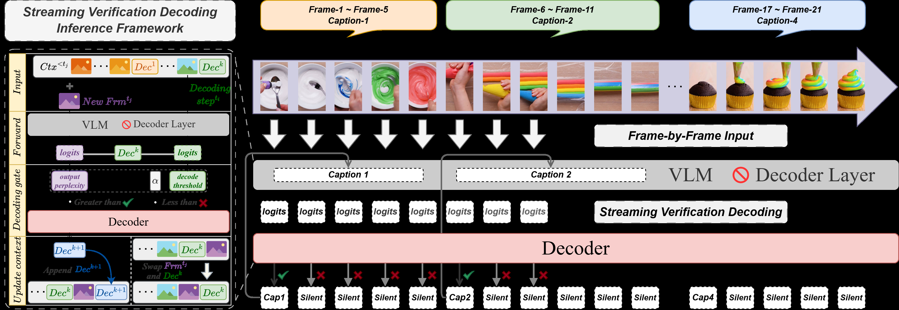
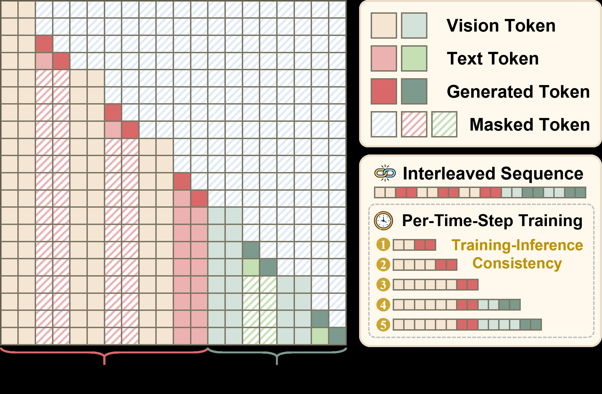
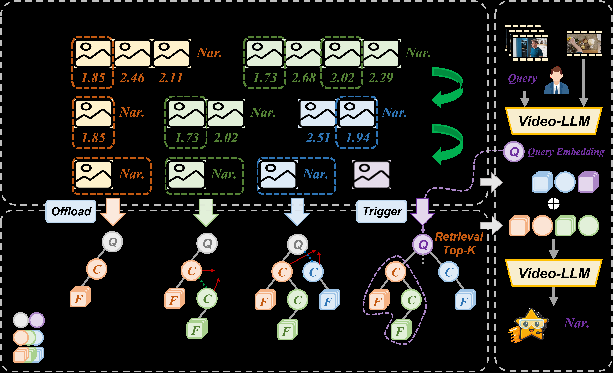

# LiveStarPro: Proactive Streaming Video Understanding with Hierarchical Memory for Long-Horizon Streams

## 摘要

**论文元信息**：LiveStarPro: Proactive Streaming Video Understanding with Hierarchical Memory for Long-Horizon Streams；作者为 Zhenyu Yang, Kairui Zhang, Bing Wang, Shengsheng Qian, Changsheng Xu；arXiv ID 为 2606.17798v1；发布时间为 2026-06-16；论文链接为 http://arxiv.org/abs/2606.17798v1；PDF 链接为 https://arxiv.org/pdf/2606.17798v1。论文自述模型与代码公开于 https://github.com/sotayang/LiveStarPro，见 PAGE 1 与 PAGE 3。

**代码状态**：论文全文明确声称代码公开，见 PAGE 1 与 PAGE 3。当前可确认的公开仓库访问结果主要对应 `sotayang/LiveStar` 初版仓库，其 README 指向 NeurIPS 2025 版本 LiveStar 与 arXiv 2511.05299；未能在当前可验证材料中确认 LiveStarPro 新增的 Tree-Structured Hierarchical Memory（TSHM）与 OmniStarPro-Long 相关实现文件。因此，本文不贴源码段，源码级方法对应证据不足。换言之，论文层面的代码公开声明成立，但本文材料不足以支持对 LiveStarPro 新增模块进行可靠代码分析。

**一句话总结**：LiveStarPro 将响应时机判定、流式视觉语言对齐和长时记忆检索统一到一个在线 Video-LLM 框架中，通过 SVeD、SCAM 与 TSHM 解决连续视频流中“何时说、如何对齐、如何记住很久以前事件”的问题，并在 OmniStarPro 等在线评测中取得优于既有在线 Video-LLM 的结果，见 PAGE 1 至 PAGE 3、PAGE 12 至 PAGE 15。

本文的核心对象是在线流式视频理解（online streaming video understanding），而不是传统离线视频问答或检测跟踪。论文强调，现有 Video-LLM 多在完整、有限、预录制视频上运行；LiveStarPro 面向持续输入的视频流，需要在没有未来帧的条件下持续理解、判断是否响应，并保持长时上下文记忆，见 PAGE 1 至 PAGE 2。

从业务视角看，该方向适合探索长视频监控、客服质检、直播辅助、事件回溯和在线视频问答等场景。它并不是目标检测或多目标跟踪模型的直接替代，因为论文的主要输出是语义描述、问答、时间定位与长期记忆召回，而不是稳定的框级检测框或轨迹 ID，见任务定义 PAGE 10。

## 背景与动机

Video Large Language Models（Video-LLMs，视频大语言模型）近年来在视频描述、视频问答、时空推理和长上下文理解上取得进展，但这些进展主要发生在 offline setting（离线设置）中：模型可以一次性读取完整视频，然后生成答案。论文指出，这类设定与 live streaming assistant（实时流式助手）的需求不同，后者必须“always-on”，即在视频流不断到达时持续观察、持续推理，并在恰当时机主动反馈，见 PAGE 1。

在线视频理解的第一个难点是 response timing（响应时机）。如果模型对每一帧都输出描述，会造成严重冗余；如果模型只在固定时间点输出，又可能错过事件发生时刻。早期在线方法如 VideoLLM-online 使用 streaming EOS（End-Of-Sequence）机制，将“沉默”作为一个显式 token 来预测，见 PAGE 1。后续 VideoLLM-MoD 与 LION-FS 继续沿用或改造这一范式，见 PAGE 1 与 PAGE 3。

论文认为 EOS-driven paradigm（EOS 驱动范式）存在四类结构性缺陷。第一是 severe data imbalance（严重数据不平衡）：例如 90 秒视频按 2 FPS 采样得到 180 帧，如果只有 6 个事件需要响应，则其余 174 帧都对应沉默，响应与沉默比例约为 1:29，见 PAGE 1。第二是 temporal inconsistency（时间不一致）：视觉上相邻且相似的帧可能被标注为完全不同目标，一个生成详细描述，另一个立即生成 EOS，见 PAGE 1。第三是 objective misalignment（目标错配）：预训练通常学习视觉与文本的语义对齐，而 EOS 训练要求模型把丰富视觉证据映射到空沉默 token，见 PAGE 1。第四是 vocabulary degradation（词表退化）：高频 EOS 会污染正常语义 token 的概率空间，见 PAGE 1。

第二个难点是 long-horizon memory（长时记忆）。在线助手不能只处理几十秒窗口，因为直播、监控或机器人视觉流可能持续数十分钟乃至数小时。论文指出，固定 context window（上下文窗口）必然会被无限视频流填满；FIFO 或 sliding window 会无差别丢弃历史信息，导致 catastrophic forgetting（灾难性遗忘）；而缺乏显式检索机制的缓存只是被动容器，无法回答“一个小时前那个人拿起了什么”这类问题，见 PAGE 2。

第三个动机来自数据与评测不足。论文指出，已有在线 Video-LLM 训练数据高度依赖 Ego4D，StreamMind 虽扩展到 SoccerNet，但真实场景覆盖仍有限；SVBench、OVO-Bench 与 StreamBench 等同步评测主要局限在视频问答，未充分覆盖实时旁白、在线时间定位、多轮互动理解等任务，见 PAGE 2 至 PAGE 3。因此，作者提出 OmniStarPro：一方面保留短时在线任务，另一方面新增长视频分区与记忆中心任务，以评估真正超出活动上下文窗口的历史召回能力，见 PAGE 8 至 PAGE 10。

**用途**：下图用于说明在线视频理解的基本任务、EOS 方法的训练矛盾，以及 LiveStarPro 对训练、推理和记忆三方面的整体修正。

**读图要点**：Fig. 1 将问题拆成三个层面：连续视频流中何时响应、EOS-based 方法为何因数据不平衡与时间不一致而不稳定、LiveStarPro 如何通过 SCAM、SVeD 与 TSHM 构建新的 response-silence framework。该图支撑的判断是：论文不是单点改进解码器，而是在训练目标、推理时机和长时记忆三个环节同时改造在线 Video-LLM，见 PAGE 2。

## 预备知识

本文涉及三个基础概念。第一是 perplexity（PPL，困惑度）。在语言模型中，PPL 衡量模型对给定文本的“惊讶程度”：PPL 越低，说明给定上下文越能支持这段文本；PPL 越高，说明当前视觉上下文与旧描述之间可能已经发生语义偏离。LiveStarPro 使用 PPL 作为是否需要更新描述的验证信号，见 PAGE 5。

第二是 causal attention mask（因果注意力掩码）。自回归语言模型只能看见当前位置之前的信息。SCAM 在此基础上增加了更精细的可见性约束：在同一个 semantic clip（语义片段）内部，模型不能直接复制前面帧已经生成的 caption，而必须根据当前 frame 与历史上下文重新对齐视觉语义；但对于前面语义片段的 terminal captions（终止摘要描述），模型仍保持可见，以维持跨事件叙事连贯性，见 PAGE 6。

第三是 hierarchical memory（层级记忆）。论文将记忆分为 Short-Term Working Memory（短期工作记忆）和 Long-Term Retrieval Memory（长期检索记忆）。短期记忆保留近期细粒度视觉信息；长期记忆将被挤出上下文窗口的历史事件组织成 Recursive Event Tree（递归事件树），用于后续检索与生成增强，见 PAGE 6 至 PAGE 8。

这些概念共同服务于一个在线约束：模型不能依赖未来帧，也不能等待完整视频结束后再推理。所有任务都应在严格因果条件下运行，即当前输出只能基于已到达的视频帧与历史交互，见 PAGE 8 至 PAGE 12。

## 方法详解

### 1. 总体框架：用三个模块分解在线理解问题

LiveStarPro 的架构由 Streaming Verification Decoding（SVeD）、Streaming Causal Attention Masks（SCAM）和 Tree-Structured Hierarchical Memory（TSHM）三个模块构成，见 PAGE 4。SVeD 解决推理阶段“何时响应”的问题；SCAM 解决训练阶段“如何让模型学会增量视觉语言对齐”的问题；TSHM 解决长视频中“如何在有限上下文窗口外保存与检索历史事件”的问题。

论文在 Fig. 1 与 Section III-A 中强调，这三个模块不是独立堆叠，而是互相依赖。SVeD 需要模型能稳定估计旧 caption 在新视觉上下文下的概率；SCAM 正是为这种增量概率估计训练模型；TSHM 则在视频持续时间超出上下文窗口后，为 SVeD 触发的生成提供历史证据，见 PAGE 4。

### 2. SVeD：从“生成沉默”改为“验证是否需要说话”

传统 EOS 方法把 silence（沉默）作为一个预测 token。LiveStarPro 的关键转向是：沉默不应被学习为词表目标，而应被视为由模型置信度推导出的状态。论文将问题从 predicting silence（预测沉默）改写为 verifying relevance（验证相关性），见 PAGE 1。

论文先给出一种直接但低效的 generate-then-compare 策略。设 $[Dec]_{t_i}$ 表示最近一次在时间 $t_i$ 输出的描述，$[Dec]^{cand}_{t_j}$ 表示新帧时间 $t_j$ 上完整自回归生成出的候选描述，$S(\cdot,\cdot)$ 是语义相似度函数，$\tau$ 是相似度阈值。响应策略为：

$$
\mathrm{Output}(t_j)=
\begin{cases}
\mathrm{silent}, & S([Dec]_{t_i},[Dec]^{cand}_{t_j})\ge \tau \\
[Dec]^{cand}_{t_j}, & S([Dec]_{t_i},[Dec]^{cand}_{t_j})< \tau
\end{cases}
$$

这条公式的含义是：如果新生成的候选描述与旧描述足够相似，则保持沉默；如果差异足够大，则输出新描述。问题在于，每一帧都要完整生成候选文本，单帧需要 $O(L)$ 解码延迟，其中 $L$ 为生成序列长度，不适合低延迟流式推理，见 PAGE 5。

SVeD 将上述过程改为 verify-then-generate。模型不先生成候选描述，而是把旧描述放到新上下文下重新计算困惑度。论文定义：

$$
\mathrm{PPL}_{t_i}([Dec])=
\sqrt[N]{\frac{1}{P([Dec]\mid [Ctx_{<t_i}], [Frm_{t_i}])}}
$$

其中 $N$ 是描述 $[Dec]$ 的 token 长度，$[Ctx_{<t_i}]$ 是时间 $t_i$ 之前的多模态上下文，$[Frm_{t_i}]$ 是当前帧。人话解释是：如果当前帧和历史上下文仍然支持旧描述，则旧描述的概率高、PPL 低；如果视频内容已经变了，旧描述变得不合时宜，PPL 会升高，见 PAGE 5。

SVeD 使用缩放阈值判断是否触发新生成：

$$
\mathrm{PPL}_{t_j}([Dec]) > \alpha \cdot \mathrm{PPL}_{t_i}([Dec])
$$

其中 $\alpha$ 是 sensitivity threshold（敏感度阈值）。如果新时刻 $t_j$ 的验证 PPL 超过旧参考 PPL 的 $\alpha$ 倍，说明视觉输入与当前描述出现显著语义偏离，模型激活 decoding gate 并生成新 caption；否则模型抑制生成，保持沉默，见 PAGE 5。

论文还引入 logical Swap 操作：在抑制生成时，将已有 caption 移到 context buffer 末尾，使上下文在逻辑上反映时间推进，而不重复生成文本，见 Algorithm 1，PAGE 5。这个操作是 SVeD 保持叙事连贯性的关键，因为它让旧描述继续覆盖当前时间点，同时避免每帧都输出重复内容。

**用途**：下图用于说明 SVeD 的动态 response-silence decoding 流程。

**读图要点**：Fig. 2 展示了一个 gate-driven 的推理过程：视频帧持续进入上下文，模型对已有输出进行单次 PPL 验证，只有当语义偏离超过阈值时才触发新生成。该图支撑的判断是：SVeD 的计算节省来自“验证旧答案是否仍然成立”，而不是“每一帧先生成再比较”，见 PAGE 4 至 PAGE 5。

### 3. Streaming KV Cache：为动态上下文修改提供缓存支持

SVeD 会频繁执行 append（追加帧）与 swap（移动描述位置），普通 LLM KV cache 偏向静态序列，难以直接适配这种动态上下文结构。论文因此提出 Streaming Key-Value Cache，包含 intra-dialogue KV cache（对话内缓存）与 inter-dialogue streaming cache（对话间流式缓存）两层，见 PAGE 5。

该缓存设计服务两个需求。第一，在 caption 位置因 logical Swap 变化时维持 cache sequence integrity（缓存序列完整性），避免重复计算历史表示。第二，在 Peak-End memory compression（峰终记忆压缩）动态裁剪 token 后继续保持上下文一致。实验显示，带 TSHM 的完整 LiveStarPro 在 5 分钟视频推理中达到 3.96 FPS，相比无缓存配置 2.50 FPS 获得约 1.58 倍加速，见 PAGE 5 与 PAGE 15。

### 4. SCAM：使训练目标匹配流式验证推理

SVeD 只有在模型能可靠估计“当前视觉上下文是否仍支持旧描述”时才有效。静态图文预训练的目标通常是：

$$
\max P([Txt_i]\mid [Img_i]/[Vid_i])
$$

其中 $[Txt_i]$ 是文本，$[Img_i]$ 或 $[Vid_i]$ 是静态图像或完整视频。该公式表示传统模型学习的是完整视觉输入与文本之间的静态对齐，不直接训练“随着帧逐步到达，当前描述是否仍成立”的能力，见 PAGE 6。

LiveStarPro 将训练目标改写为增量形式：

$$
\max P([Txt_k]\mid [Ctx_{<t_i}], [Frm_{t_i}]), \quad \forall t_i\in C_k
$$

其中 $C_k$ 是 semantic clip，即共享同一语义事件描述 $[Txt_k]$ 的连续帧集合；$[Frm_{t_i}]$ 是时间 $t_i$ 的帧。该公式表示：对一个语义片段内的每个时刻，模型都要在已有历史与当前帧条件下预测该片段的语义描述，见 PAGE 6。

这与 EOS 训练有本质差异。EOS 方法在非响应帧上优化 $\max P(EOS\mid \cdots)$，会把大量视觉输入映射到一个无语义 token；SCAM 则始终要求模型学习有意义的视觉语言相关性，从而为 SVeD 的 PPL 验证提供稳定概率分布，见 PAGE 6。

### 5. Interleaved Frame-Caption Sequences 与防复制机制

为模拟流式推理，论文将训练数据组织成 Interleaved Frame-Caption Sequences（交错帧-字幕序列）。对 semantic clip $C_k$ 中的每一帧 $[Frm_{t_i}]$，都配上对应 caption $[Cap_k]$。但是同一事件内多帧语义相同，若直接重复同一文本，模型可能记住字符串而不是看图，见 PAGE 6。

为缓解这个问题，作者提出 stochastic caption sampling（随机 caption 采样）：每一帧从 $M$ 个 paraphrased variants（改写版本）中随机抽取一个 $[Cap^k_j]$，促使模型学习鲁棒语义而不是固定文本模式，见 PAGE 6。不过在实验设置中，论文默认 $M=1$ 以保证最佳 temporal alignment，这意味着改写池的实际默认作用有限，见 PAGE 11。

SCAM 的核心是对同一语义片段内部的历史 caption 进行遮蔽，避免模型直接复制前一个 caption。其优化目标为：

$$
\max P([Cap^k_j]\mid [Ctx_{<t_i}\{Mask_{\le t_i}\}], [Frm_{t_i}]), \quad \forall t_i\in C_k
$$

其中 $Mask_{\le t_i}$ 是到时间 $t_i$ 为止的流式因果掩码。该公式表示：模型可以使用历史多模态上下文，但在当前 semantic clip 内不能偷看此前帧已经生成的相同事件 caption；它必须基于当前帧和跨片段历史重新生成语义描述，见 PAGE 6。

**用途**：下图用于说明 SCAM 如何在 interleaved frame-caption 序列上防止信息泄漏。

**读图要点**：Fig. 3 强调了两个可见性规则：同一 semantic clip 内的先前 caption 被 mask 掉，前序 semantic clip 的 terminal captions 保持可见。该图支撑的判断是：SCAM 不是普通因果 mask，而是针对在线视频流中“同一事件多帧同义描述”这一训练陷阱设计的专门掩码，见 PAGE 6。

### 6. TSHM：短期工作记忆与长期检索记忆的分层设计

SVeD 与 SCAM 解决了实时响应与训练对齐，但长时视频还会耗尽上下文窗口。论文提出 TSHM，将记忆分为 Short-Term Working Memory 与 Long-Term Retrieval Memory 两层，见 PAGE 6 至 PAGE 7。

Short-Term Working Memory 使用 Peak-End Compression。论文借鉴 Peak-End Rule（峰终规则）：人类记忆倾向于保留显著峰值时刻与事件结尾摘要。LiveStarPro 中的 Peaks 由 SVeD 阶段每帧 PPL 计算得到的语义分歧分数表示：

$$
S(t)=\mathrm{PPL}_t([Dec])
$$

其中 $S(t)$ 是时间 $t$ 的 semantic divergence score（语义分歧分数）。论文将较低 PPL 的帧视为与当前描述更强对齐的 salient keyframes（显著关键帧），见 PAGE 7。这里需要注意：低 PPL 被用作“对当前描述更稳定”的信号，而不是传统意义上“变化最大”的信号。

当 token 总数达到上下文预算 $L_{max}$ 时，论文对每个 semantic clip $C_k$ 启动裁剪。令 $\tau_k$ 为该 clip 内分歧分数的中位数，保留集合为：

$$
T^k_{keep}=\{t\in C_k\mid S(t)\le \tau_k\}
$$

该公式表示：每个片段保留 PPL 不高于中位数的帧，大约移除 50% 更高分歧的帧，同时保留 clip-level summary caption。其作用是将旧片段逐步压缩成少量 peak frames 与 summary captions，见 PAGE 7。

### 7. Recursive Event Tree：将被逐出的历史组织成事件树

即使经过短期压缩，无限视频流仍然会超过有限上下文。因此，被 evicted（逐出）的 memory units 不被直接丢弃，而是进入 Long-Term Retrieval Memory。每个节点表示一个 memory unit：

$$
U_i=\{c_i, v_i, E_i, C_i\}
$$

其中 $c_i$ 是 event caption（事件描述），$v_i$ 是对应 peak frame 的 visual tokens，$E_i$ 是用于索引的 semantic embedding，$C_i$ 是子节点列表，见 PAGE 7。

新逐出的单元 $U_{new}$ 插入时，系统比较其 embedding $E_{new}$ 与已有节点 embedding 的语义相似度。若最高相似度超过阈值 $\sigma$，则将其挂到最相似节点 $U_{best}$ 下，表示新事件是已有事件线索的延续或细化；否则新建 root node，形成独立事件分支，见 PAGE 7。

父节点 embedding 通过动量聚合更新：

$$
E_{parent}\leftarrow \mathrm{Normalize}((1-\beta)\cdot E_{parent}+\beta\cdot E_{child})
$$

其中 $\beta$ 是更新率。人话解释是：父节点的语义表示会逐步向子树事件的语义中心移动，但不会被单个新子节点完全覆盖，见 PAGE 7。

### 8. Hierarchical Beam Descent：从线性检索转向层级检索

当 SVeD 触发新生成时，LiveStarPro 构造 query vector $q$。在 explicit question answering 中，$q$ 来自用户问题文本 embedding；在无显式问题的 streaming narration 中，$q$ 来自近期短期帧视觉 embedding 的聚合，见 PAGE 7。

检索过程采用 hierarchical beam descent（层级束下降）。设 $F_d$ 为深度 $d$ 的检索前沿，$Child(F_d)$ 为当前前沿节点的子节点集合，$E_i$ 为候选节点 embedding，则下一层前沿为：

$$
F_{d+1}=\operatorname{Top}\text{-}k_{U_i\in Child(F_d)}
\frac{q\cdot E_i}{\lVert q\rVert \lVert E_i\rVert}
$$

该公式表示：在每一层只保留与查询最相似的 $k$ 个子节点继续向下搜索，而不是扫描全部历史记忆。论文称在有界分支因子 $b$ 与平衡树增长假设下，检索检查 $O(kb\log_b n)$ 个节点，而不是 flat memory 的 $O(n)$ 全量扫描，见 PAGE 8。

检索到的节点还会沿 parent 与 immediate children 收集事件链，形成：

$$
M_{retrieved}=\{(c_j,v_j)\mid j\in I\cup Path(I)\}
$$

其中 $I$ 是检索节点索引集合，$Path(I)$ 表示相关路径节点。该集合被重新注入 attention window，用历史 caption 与 visual tokens 增强当前生成，见 PAGE 8。

**用途**：下图用于说明 TSHM 的短期压缩、长期事件树插入和上下文感知检索。

**读图要点**：Fig. 4 将 TSHM 拆成三部分：Peak-End rule 压缩短期帧，Recursive Event Tree 根据相似度阈值组织长期记忆，Context-aware retrieval 在生成时取回相关事件链。该图支撑的判断是：LiveStarPro 的长时记忆不是简单外部向量库，而是将时间推进和语义相似性编码为树结构，见 PAGE 7。

## 实验分析

### 1. 实验设置与训练配置

LiveStarPro 的基础架构是 InternVideo2.5，由 InternViT 视觉编码器、MLP projector 和 InternLM2.5-7B 语言模型组成。InternViT 以 1 至 4 FPS 提取视频帧 embedding，每帧表示为 16 个 tokens。模型在 8K token context window 内处理多分钟内容，完整 fine-tuning 使用 8 张 NVIDIA A800 GPU，见 PAGE 10 至 PAGE 11。

训练采用两阶段 progressive training。Phase I 是 Temporal Alignment Pretraining，使用 ActivityNet Captions、Shot2Story、Ego4D Narration Stream 与 MVBench 中筛选出的 63K 样本；Phase II 是 Multi-Task Online Adaptation，使用 20K OmniStarPro 样本训练五类在线任务，见 PAGE 10。优化设置包括 1 epoch、学习率 $4\times 10^{-5}$、AdamW、weight decay 0.05、warmup ratio 0.03、最大序列长度 8192、视觉编码器冻结、MLP projector 与语言模型更新，见 PAGE 11。

在线评测使用 OmniStarPro 的五个短时任务与三个长时记忆任务。短时任务包括 Real-time Narration Generation（RNG）、Online Temporal Grounding（OTG）、Frame-level Dense QA（FDQ）、Contextual Online QA（COQ）和 Multi-turn Interactive QA（MIQ），见 PAGE 10。长时任务包括 Long-range Memory Recall（LMR）、Cross-event Difference Query（CDQ）与 Temporal Backtracking（TBR），见 PAGE 10。

### 2. 主要在线结果：RNG 任务

| Method | TimDiff ↓ | TimRedun ↓ | TimCover ↑ | SemCor ↑ | SumFluen ↑ |
|---|---:|---:|---:|---:|---:|
| Human | 1.08 | 1.24 | 0.84 | 6.09 | 6.81 |
| VideoLLM-online | 2.67 | 2.15 | 0.80 | 1.68 | 0.59 |
| VideoLLM-MoD | 2.54 | 2.49 | 0.90 | 1.66 | 0.55 |
| MMDuet | 2.32 | 0.62 | 0.51 | 1.93 | 2.69 |
| LiveStar | 1.91 | 0.95 | 0.71 | 3.19 | 4.25 |
| LiveStarPro | 1.89 | 1.01 | 0.78 | 3.27 | 4.41 |

**表格解读**：该表摘自 Table I 的在线 RNG 结果，见 PAGE 12。VideoLLM-online 与 VideoLLM-MoD 的 TimCover 较高，说明它们更频繁地覆盖语义片段，但 TimRedun 与 SemCor 表现差，反映过度响应带来的冗余与语义质量下降。MMDuet 的 TimRedun 最低，但 TimCover 也最低，说明它更保守，遗漏较多。LiveStarPro 在 TimDiff、SemCor、SumFluen 上优于其他在线助手，表明 SVeD 的动态响应机制改善了时机与语义质量的平衡。它仍明显低于 Human SemCor 6.09，说明真实场景语义理解与叙事能力仍有较大差距。

### 3. 多任务在线结果：OmniStarPro 五类短时任务

| Method | RNG SemCor/TimDiff | OTG TimDiff ↓ | FDQ SemCor/TimDiff | COQ SemCor | MIQ SemCor | FPS ↑ |
|---|---:|---:|---:|---:|---:|---:|
| VideoLLM-online | 1.68 / 2.67 | 9.69 | 2.35 / 2.15 | 4.01 | 3.83 | 3.37 |
| VideoLLM-MoD | 1.66 / 2.54 | 9.83 | 2.11 / 2.23 | 3.99 | 3.75 | 3.41 |
| MMDuet | 1.93 / 2.32 | 4.42 | 4.78 / 2.65 | 5.71 | 5.62 | 0.91 |
| LiveStar | 3.19 / 1.91 | 3.57 | 6.44 / 1.80 | 5.85 | 5.78 | 3.82 |
| LiveStarPro | 3.27 / 1.89 | 3.61 | 6.61 / 1.77 | 5.97 | 5.81 | 3.96 |

**表格解读**：该表基于 Table II，见 PAGE 12。LiveStarPro 在 RNG、FDQ、COQ、MIQ 的语义指标上均优于 LiveStar 和其他在线模型，并保持最高 FPS。OTG 上 LiveStarPro 的 TimDiff 为 3.61，略差于 LiveStar 的 3.57，但仍显著优于 VideoLLM-online 与 VideoLLM-MoD。论文据此总结，相对第二优的既有在线 Video-LLM，LiveStarPro 平均 SemCor 提升 28.9%、TimDiff 降低 18.2%、FPS 提升 16.1%，见 PAGE 12。这里的强结论主要来自在线 Video-LLM 比较，而不是与闭源离线 LVLM 的直接比较。

### 4. 长时记忆结果：OmniStarPro-Long

| Method | LMR S | LMR M | LMR L | CDQ S | CDQ M | CDQ L | TBR S | TBR M | TBR L |
|---|---:|---:|---:|---:|---:|---:|---:|---:|---:|
| VideoLLM-online | 41.2 | 18.6 | 6.4 | 33.7 | 14.1 | 5.2 | 38.5 | 16.0 | 5.8 |
| VideoLLM-MoD | 42.0 | 19.3 | 6.9 | 34.5 | 14.8 | 5.6 | 39.1 | 16.7 | 6.1 |
| MMDuet | 47.8 | 24.5 | 9.1 | 39.6 | 19.2 | 7.4 | 44.2 | 21.3 | 8.0 |
| LiveStar | 59.5 | 33.0 | 21.1 | 51.3 | 28.1 | 17.7 | 56.0 | 30.2 | 19.9 |
| LiveStarPro | 63.4 | 49.7 | 37.2 | 55.1 | 42.8 | 31.5 | 59.8 | 46.3 | 34.6 |

**表格解读**：该表摘自 Table III，见 PAGE 13。S、M、L 分别表示短于 10 分钟、10 至 30 分钟、大于 30 分钟的 memory span。所有滑动窗口类 baseline 在长跨度上严重退化，例如 VideoLLM-online 的 LMR-L 仅 6.4，MMDuet 为 9.1。LiveStarPro 的 LMR-L 达 37.2，CDQ-L 达 31.5，TBR-L 达 34.6，说明 TSHM 的主要收益集中在证据已离开活动上下文窗口的情形。这个结果比短时 RNG 更能支撑论文关于 long-horizon streams 的核心主张。

### 5. 离线与常规视频理解结果

| Benchmark / Metric | InternVideo2.5 | LiveStar | LiveStarPro | 备注 |
|---|---:|---:|---:|---|
| OmniStarPro-RNG Offline SemCor | 4.32 | 4.62 | 4.76 | Table I，见 PAGE 12 |
| SVBench Avg Zero-shot | 49.16 | 49.76 | 52.20 | Table IV，见 PAGE 14 |
| Ego4D TokAcc | 证据不足 | 61.1% | 61.9% | Table V，见 PAGE 14 |
| MVBench | 72.0 for InternVL2.5 | 证据不足 | 69.8 | Table VI，见 PAGE 14 |
| LongVideoBench | 60.0 for InternVL2.5 | 证据不足 | 56.3 | Table VI，见 PAGE 14 |
| VideoMME w/o subtitles | 64.2 for InternVL2.5 | 证据不足 | 60.8 | Table VI，见 PAGE 14 |

**表格解读**：离线结果显示，LiveStarPro 在流式专门化后并未彻底牺牲常规视频理解能力，但也没有全面超过强离线 LVLM。论文明确指出，LiveStarPro 相对 InternVideo2.5 backbone 在常规离线 benchmark 上有 modest decline 而非 collapse，见 PAGE 13 至 PAGE 14。因此，LiveStarPro 的价值主要在 proactive online streaming 与 long-term recall，而不是刷新所有离线视频理解榜单。

### 6. 消融：记忆策略、缓存与长期检索

| Setting | SemCor ↑ | TimDiff ↓ | FPS ↑ | Evidence |
|---|---:|---:|---:|---|
| Uniform Dropout + Both KV | 3.04 | 2.01 | 3.77 | Table VII，PAGE 15 |
| FIFO Forgetting + Both KV | 3.07 | 2.09 | 3.91 | Table VII，PAGE 15 |
| Peak-End, no KV | 3.19 | 1.95 | 2.50 | Table VII，PAGE 15 |
| Peak-End, both KV | 3.19 | 1.91 | 3.82 | Table VII，PAGE 15 |
| TSHM, both KV | 3.27 | 1.89 | 3.96 | Table VII，PAGE 15 |
| Flat k-NN bank, LMR long recall | 21.3 | 证据不足 | 38.6 ms latency | Table VIII，PAGE 15 |
| Recursive Event Tree, LMR long recall | 37.2 | 证据不足 | 12.4 ms latency | Table VIII，PAGE 15 |

**表格解读**：Table VII 表明，Peak-End 相比 Uniform Dropout 与 FIFO 在 SemCor 与 TimDiff 上更稳，说明“保留语义稳定关键帧与摘要 caption”优于无差别丢帧。TSHM 在 Peak-End 基础上进一步把 SemCor 从 3.19 提升到 3.27，显示长期检索对 RNG 也有增益，见 PAGE 15。Table VIII 更直接：Recursive Event Tree 在 LMR long bucket 上从 flat k-NN 的 21.3 提升到 37.2，同时延迟从 38.6 ms 降到 12.4 ms，支撑论文关于树形组织优于平面记忆库的论断，见 PAGE 15。

### 7. 阈值与树超参数敏感性

SVeD 的响应阈值 $\alpha$ 对行为影响明显。论文在 OmniStarPro-RNG 上测试 $[1.0,1.1]$ 范围，发现最优区间集中在 $\alpha=1.02$ 至 $1.04$，默认采用 $\alpha=1.03$，见 PAGE 14。作者解释，PPL 的绝对尺度会随模型家族与领域变化，因此 $\alpha$ 实际上是在校准 relative drift（相对漂移），而不是固定绝对阈值，见 PAGE 14。

TSHM 的树结构由相似度阈值 $\sigma$ 与动量因子 $\beta$ 控制。论文报告 $\sigma=0.75,\beta=0.3$ 时平均 branching factor 为 4.1，tree height 为 5.2，long-bucket recall 为 37.2，是 Table IX 中最佳配置，见 PAGE 15。较小 $\sigma$ 会产生浅而宽的树，混合语义不同事件；较大 $\sigma$ 会产生过多孤立 root，使结构退化为接近平面索引，见 PAGE 15。

## 讨论

LiveStarPro 的适用边界首先由输入形态决定。它面向 continuous video streams（连续视频流）和在线语义响应，任务输出包括旁白、问答、时间定位和长期回溯，见 PAGE 10。若业务目标是帧级检测、轨迹级追踪或低误报报警，仍需专门的 detection/tracking/event detection 模块，并将 LiveStarPro 作为语义理解或事件解释层，而不能直接替代检测器。

第二，LiveStarPro 的部署成本不可忽视。论文基座为 InternVideo2.5、InternViT、InternLM2.5-7B，训练使用 8 张 A800，推理还涉及视频帧编码、PPL 验证、KV cache 与长期记忆检索，见 PAGE 10 至 PAGE 11。虽然 Table VII 显示缓存可将 FPS 提升到 3.96，见 PAGE 15，但在高帧率、多路视频或低延迟报警业务中，仍需重新测算端到端吞吐与延迟。

第三，OmniStarPro 的评估设计比既有流式 QA 更全面。它覆盖 15 类真实场景、46 个细分类别，短时分区含 20,137 个专家标注视频文本对，长时分区含 2,108 个长视频流与 12,704 个记忆查询，见 PAGE 8 至 PAGE 10。这使论文的实验更接近真实在线条件；但这些数据仍是 benchmark 构造，不等价于具体行业系统中的误报、漏报、合规审计和人工复核成本。

## 局限分析

第一项作者自述局限来自 TSHM 的理论分析。论文明确说，TSHM 的 sublinear retrieval 是在有界 branching factor 与 balanced subtree growth 假设下的 qualitative complexity argument，而不是 worst-case guarantee，见 PAGE 8。如果视频流高度偏斜，大多数事件被挂到同一线程，树可能退化成链；如果 $\sigma$ 设得过高，每个事件都成为独立 root，则检索退化为 flat index 的 $O(n)$ 扫描，见 PAGE 8。这意味着 TSHM 的效率依赖数据分布与超参数选择。

第二项作者自述局限来自 SVeD 阈值校准。论文指出 $\alpha$ 的最优范围较窄，PPL 绝对尺度随模型和领域变化，因此部署时需要在小规模 held-out stream 上校准，见 PAGE 14。对业务系统而言，这意味着从通用视频迁移到监控、客服、工业巡检或医疗场景时，不能直接假设 $\alpha=1.03$ 总是最优。

第三项局限是评测中使用 LLM-as-Judge。SemCor 与 SumFluen 由 GPT-4o 基于相同 prompts 与 rubrics 打分，论文认为相对排名可靠，但也承认绝对分数可能带有 stylistic bias，见 PAGE 12。因此，LiveStarPro 的语义正确性提升应理解为在该评分协议下的相对提升；若业务关心事实错误、错过关键事件或安全风险，需要额外构造人工标注指标。

第四项独立判断是代码与复现证据不足。论文在 PAGE 1 与 PAGE 3 声称代码公开，但当前材料只确认到初版 LiveStar 仓库的可访问性，未确认本文新增 TSHM、OmniStarPro-Long、长时检索诊断与树超参数实验的完整实现。对于研究复现，这意味着公式、表格和图示证据充分支撑论文叙述，但源码级审查仍需等待或确认 LiveStarPro 对应代码仓库的完整发布。

第五项独立判断是长时记忆任务与实际事件检测之间仍有差距。OmniStarPro-Long 的 LMR、CDQ、TBR 主要测 attribute/timestamp recall，见 PAGE 10 与 PAGE 12 至 PAGE 13。它们能验证历史信息检索能力，但不能直接覆盖业务系统常见的低频异常事件、误报漏报权衡、跨摄像头关联和实时告警闭环。因此，若用于长视频监控或质检，仍需重新建立面向业务事件的指标体系。

## 结论

LiveStarPro 的主要贡献在于把在线 Video-LLM 的三个核心瓶颈拆解并联动解决：SVeD 用单次 PPL 验证替代 EOS 沉默预测，SCAM 用流式因果注意力掩码训练增量视觉语言对齐，TSHM 用短期 Peak-End 压缩与长期 Recursive Event Tree 组织被逐出的历史信息，见 PAGE 3 至 PAGE 8。实验上，它在 OmniStarPro 的短时在线任务、长时记忆任务、SVBench、Ego4D 与常规离线 benchmark 上提供了较完整证据，见 PAGE 12 至 PAGE 15。

对视频理解方向而言，该工作的重要性不只在于某个指标提升，而在于把“实时响应时机”和“长时记忆召回”纳入同一在线评测与建模框架。它提示后续 Video-LLM 系统需要从离线整段理解转向流式、因果、可检索、可校准的长期交互式理解。当前仍需补足源码复现、业务事件指标和极端长流稳定性验证，但 LiveStarPro 已给出一个结构清晰的研究基线。

## 证据索引

| 关键结论 | PAGE 证据 |
|---|---|
| 论文提出 LiveStarPro，包含 SVeD、SCAM、TSHM，并声称代码公开 | PAGE 1 |
| EOS-based 在线方法存在数据不平衡、时间不一致、目标错配、词表退化 | PAGE 1 |
| 固定上下文窗口导致 saturation、catastrophic forgetting 与 retrieval inaccessibility | PAGE 2 |
| Fig. 1 展示在线理解、EOS 缺陷与 LiveStarPro 三模块框架 | PAGE 2 |
| 论文贡献列表：SVeD、SCAM、TSHM、OmniStarPro、28.9%/18.2% 结果 | PAGE 3 |
| Fig. 2 与 Section III-A/B 说明 SVeD 推理框架 | PAGE 4 至 PAGE 5 |
| 公式 (1) generate-then-compare 响应策略 | PAGE 5 |
| 公式 (2) PPL 验证与 Algorithm 1 SVeD | PAGE 5 |
| Streaming KV Cache 及 1.58× 加速声明 | PAGE 5 与 PAGE 15 |
| 公式 (3)(4)(5) 分别对应静态对齐、流式对齐、SCAM 目标 | PAGE 6 |
| Fig. 3 展示 SCAM 的交错帧-字幕训练与 mask 规则 | PAGE 6 |
| Fig. 4 展示 TSHM、Peak-End 压缩、Recursive Event Tree 与检索 | PAGE 7 |
| 公式 (6) Peak-End 保留集合 | PAGE 7 |
| 公式 (7) 父节点 embedding 动量更新 | PAGE 7 |
| 公式 (8) hierarchical beam descent | PAGE 8 |
| TSHM 理论分析的 balanced-growth 假设与退化情形 | PAGE 8 |
| OmniStarPro 数据构建、YouTube 采集、质量过滤与长时分区 | PAGE 8 至 PAGE 10 |
| 五个短时任务与三个长时记忆任务定义 | PAGE 10 |
| 模型架构、训练样本、超参数、A800 训练配置 | PAGE 10 至 PAGE 11 |
| TimDiff、TimRedun、TimCover、SemCor、SumFluen 定义 | PAGE 11 至 PAGE 12 |
| Table I RNG 在线/离线结果 | PAGE 12 |
| Table II OmniStarPro 五任务在线结果与 28.9%/18.2%/16.1% 总结 | PAGE 12 |
| Table III OmniStarPro-Long 三类记忆任务结果 | PAGE 13 |
| Table IV SVBench 结果 | PAGE 14 |
| Table V Ego4D Narration Stream 结果 | PAGE 14 |
| Table VI 常规离线视频理解结果 | PAGE 14 |
| Fig. 7 阈值 $\alpha$ 敏感性与默认 $\alpha=1.03$ | PAGE 14 |
| Table VII 记忆策略与 KV Cache 消融 | PAGE 15 |
| Table VIII 长期检索诊断：flat k-NN vs Recursive Event Tree | PAGE 15 |
| Table IX 树超参数 $\sigma,\beta$ 敏感性 | PAGE 15 |
| 结论：LiveStarPro 通过 SVeD、SCAM、TSHM 实现 proactive responsiveness 与 long-horizon reasoning | PAGE 15 至 PAGE 16 |
