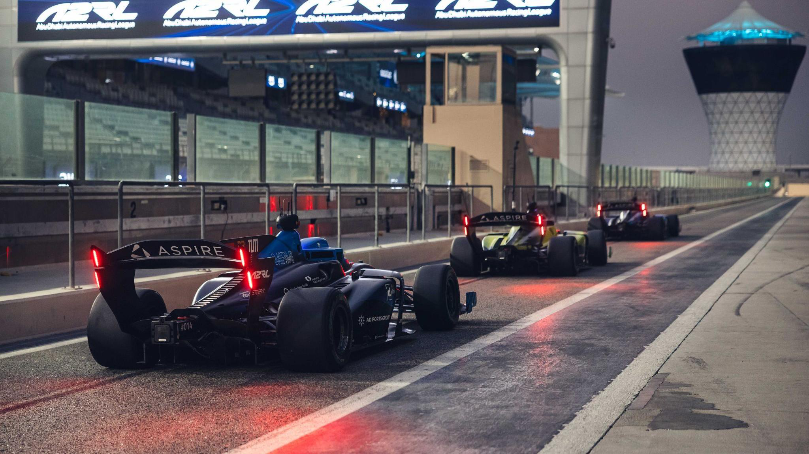
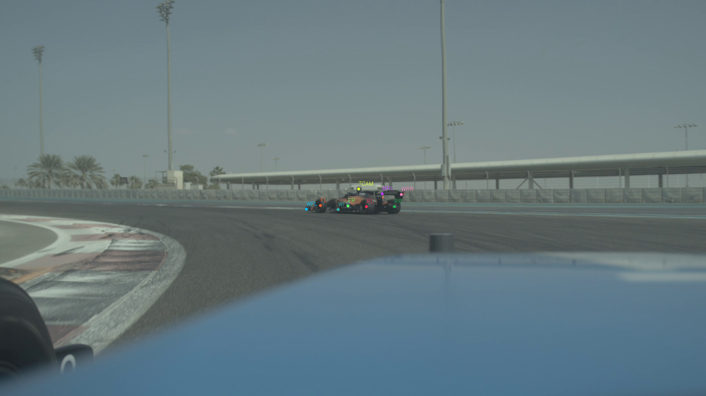

# SPARK: Low Latency Single-Camera 3D Pose Estimation for Autonomous Racing using Keypoints

## 摘要

| 项目 | 内容 |
|---|---|
| 标题 | SPARK: Low Latency Single-Camera 3D Pose Estimation for Autonomous Racing using Keypoints |
| 作者 | Dominic Ebner, Markus Lienkamp |
| arXiv | 2606.17936v1 |
| 发布时间 | 2026-06-16 |
| 领域 | Robotics / Autonomous Racing / Monocular 3D Pose Estimation |
| 论文链接 | http://arxiv.org/abs/2606.17936v1 |
| 代码状态 | 论文在 PAGE 1 声称源码位于 https://github.com/TUMFTM/SPARK-camera-det；但本次材料中没有仓库源码内容，且无法确认可访问源码文件，因此本文不提供源码段。 |

表格解读：论文的核心定位很清晰：SPARK 不是通用单目 3D 检测器，而是面向自主赛车（autonomous racing）的低延迟、单类别、已知几何目标位姿估计算法。代码链接在论文中出现，属于论文证据；但源码文件内容未随全文材料提供，因此代码实现层面的函数、文件和行号证据不足。

一句话总结：SPARK 将 YOLO-Pose 的 2D 关键点检测与 Perspective-n-Point（PnP）几何求解结合，利用赛车尺寸固定、目标类别单一的领域约束，在自主赛车数据上以约 4.9 ms 推理延迟取得优于已有单目 3D 检测方法的精度，但仍在平移误差和数据依赖上弱于 LiDAR 方法（见 PAGE 1、PAGE 6、PAGE 7）。

本文的主要贡献可以概括为三点。第一，SPARK 用轻量级 YOLOv11 / YOLOv12 Pose 模型输出赛车 2D keypoints，再用 PnP 从已知 3D keypoint 坐标恢复 6 DoF pose，避免训练复杂 3D detection head（见 PAGE 3）。第二，论文提出从 3D LiDAR ground-truth annotations 生成高质量 2D keypoint annotations 的流程，并经过人工修正，以适配 YOLO Pose 训练格式（见 PAGE 4、PAGE 5）。第三，作者在真实高速自主赛车数据上，与 CenterPoint、VoxelNeXt、MonoDTR、MonoDETR 等方法比较精度与延迟，显示 SPARK 在单目 camera 方法中有明显优势（见 PAGE 6）。

需要提前说明的是，paper-analyzer 的 academic 风格要求公式充分引用；但该论文全文中可核验的显式公式数量有限，主要包括 PnP 投影公式、visibility filtering 公式，以及 keypoint visibility 定义。本文不会为了满足形式而伪造公式，会在相关位置明确标注“证据不足”。

## 背景与动机

自主赛车与普通城市自动驾驶的感知问题不同。城市道路场景通常强调多类别、复杂交通参与者、语义泛化和全天候鲁棒性；自主赛车则强调高速、高动态、对抗性决策和极低延迟。论文在引言中指出，赛车交互中会出现突然的速度与方向变化，车辆可达到最高约 $30\,m\,s^{-2}$ 加速度，感知延迟会直接增加后续跟踪与预测模块的负担（见 PAGE 1）。

**图片用途**：下图用于展示 SPARK 所服务的真实自主赛车场景，即多车高速交互而不是静态或低速道路检测任务。  
**读图要点**：画面对应 A2RL 在 Yas Marina Circuit 的多车自主赛车场景，论文说明车辆交互速度最高达到 $260\,km\,h^{-1}$（见 PAGE 1, Fig. 1）。  
**支撑的判断**：该场景解释了为什么论文将 latency、long-range detection 和 orientation stability 放在核心位置。

**图后说明**：Fig. 1 支撑的不是模型结构，而是问题设定：高速交互使感知系统不能只追求 benchmark AP，还要把检测延迟纳入评价。论文后续将 LiDAR 与 camera 方法放在同一硬件上比较 latency，正是基于这一任务约束（见 PAGE 1、PAGE 5、PAGE 6）。

传统 LiDAR 3D 检测在精度上强，但在本文目标场景中存在两个工程瓶颈。第一，LiDAR 传感器本身常见频率为 10-30 Hz，论文指出 CenterPoint 在 Waymo 上约 11 Hz、nuScenes 上约 16 Hz，会导致 60-90 ms 检测延迟；VoxelNeXt 虽使用 sparse convolutions，但也未报告低于实时 20 Hz LiDAR 所需的 50 ms 延迟（见 PAGE 1）。第二，LiDAR pipeline 在边缘设备上的部署复杂度较高，voxelization、sparse backbone、ONNX / TensorRT 支持等工程因素会影响实际吞吐和延迟（见 PAGE 2）。

单目 camera 方法具有低延迟和易部署优势，但单目 3D detection 的核心难点是 depth regression。论文回顾了 MonoDTR、MonoDETR、MonoDIS、SMOKE、RTM3D、KM3D 等方法，指出许多方法为了从 RGB 图像中恢复 3D bounding box，需要 3D detection head、depth map、ground-plane information、object anchors 或 transformer global features（见 PAGE 2、PAGE 3）。这些设计适用于更一般的 autonomous driving benchmark，却可能超出了自主赛车任务的实际需求。

SPARK 的出发点是领域约束：自主赛车中目标类别单一，目标车辆尺寸固定，甚至可以从精确 CAD 模型获得 keypoint 的 3D local coordinates。论文明确指出，与道路场景不同，自主赛车只有单一目标类别且已知尺寸，因此可利用 constrained domain 来加速并改善 object detection（见 PAGE 1、PAGE 3）。这使得问题可以从“从图像直接回归完整 3D bounding box”转化为“检测 2D keypoints，再用几何模型恢复 pose”。

这种转化具有明显的方法论意义。深度网络负责图像中最擅长的问题，即 2D keypoint localization；几何求解器负责从已知 2D-3D correspondence 中恢复姿态。换言之，SPARK 把学习问题和几何问题拆开：前者通过 YOLO-Pose 快速推理，后者通过 PnP 保持可解释性与低计算量（见 PAGE 3、PAGE 4）。

## 预备知识

理解 SPARK 需要三个概念：单目深度估计（monocular depth estimation）、2D-3D correspondence、以及 Perspective-n-Point（PnP）pose computation。论文在 Related Work 中先讨论了一个简单深度估计思路：如果目标真实高度 $H$、camera focal length $f$、图像中目标 pixel height $h$ 已知，则可以从 pinhole camera model 估计距离 $Z$（见 PAGE 2）。这里 $H$ 表示物体真实高度，$f$ 表示相机焦距，$h$ 表示图像中的像素高度，$Z$ 表示深度或距离。

但论文指出，仅用 2D bounding box 高度估计距离不适合自主赛车。原因是 bounding box 的像素高度受车辆相对姿态影响，无法确定对手车辆 orientation；该过程也不能生成 6D pose，因为没有考虑物体朝向（见 PAGE 2）。因此，SPARK 没有采用“2D box + depth regression”的路线，而是采用 keypoints + PnP 的路线。

PnP 问题的形式在论文中给出。设 $p_c=(u_i,v_i,1)$ 为图像齐次坐标，其中 $u_i,v_i$ 是第 $i$ 个图像点的像素坐标；设 $p_w=(x_i,y_i,z_i)$ 为对应的物体或世界坐标；设 $K$ 为相机内参矩阵，$R$ 为旋转矩阵，$t$ 为平移向量。PnP 的目标是求解 $R$ 和 $t$，使得：

$$
p_c = K \cdot (R \cdot p_w + t)
$$

人话解释：这条公式说的是，已知一个物体点在 3D 坐标系中的位置，以及它在图像上的 2D 像素位置，就可以反过来求出相机与物体之间的旋转和平移关系。该公式是论文 Eq. (1)，见 PAGE 2。

PnP 有不同求解形式。论文讨论了 P3P、EPnP、SQPnP 和 RANSAC。P3P 只用 3 个点但会产生多个解，不适合无额外假设地确定车辆 orientation；EPnP 至少需要 4 个 image-world coordinate pairs，能以 $O(n)$ 复杂度近似求解；SQPnP 将问题转为 quadratic constrained optimization，速度较慢但更准确；RANSAC 可以通过 reprojection error 去除 outlier keypoints（见 PAGE 2）。SPARK 实际选择 SQPnP 作为主要求解器，并可选使用 RANSAC（见 PAGE 4、PAGE 6）。

还需要理解 visibility（可见性）标注。论文将每个 annotated keypoint 定义为：

$$
p = (u, v, vis)
$$

其中 $u,v$ 是图像坐标，$vis$ 是可见性属性。论文将 $vis=0$ 表示 outside，$vis=1$ 表示 occluded，$vis=2$ 表示 visible；但在修改 YOLO loss 时，将 outside 和 occluded 编码为 0，将 visible 编码为 1，并加入 Binary Cross-Entropy loss 来预测可用 visibility（见 PAGE 3）。人话解释：SPARK 不只让模型预测关键点在哪里，还试图预测该点是否真的可见，以便后续 PnP 不被遮挡点误导。

公式证据说明：全文可核验的显式公式不足 5 处。本文只引用论文明确给出的 Eq. (1)、Eq. (2) 及 keypoint 定义；对 pinhole depth estimation 只按论文文字说明解释，不将其伪装成论文编号公式。

## 方法详解

### 1. 总体框架：用 2D Pose Detection 替代 3D Detection Head

SPARK 的核心流程是：输入单张 RGB camera image，YOLO-Pose 输出车辆 2D keypoints，然后 PnP 根据这些 2D keypoints 与车辆 CAD 模型中的 3D local keypoints 恢复 6D pose。论文 Fig. 2 明确展示了这一流程：Single RGB Camera Image → 2D Keypoint detection → 6D Pose reconstruction，分别对应 YOLO-Pose 和 PnP（见 PAGE 3）。

**图片用途**：下图用于说明 SPARK 的核心 pipeline，即从单目 RGB 图像到 2D keypoints，再到 PnP 姿态恢复。  
**读图要点**：Fig. 2 中没有 3D detection head，只有 YOLO-Pose 与 PnP 两个阶段；红色 bounding box 的 front face 被标记，用于帮助理解 orientation。  
**支撑的判断**：SPARK 的速度优势来自任务拆解，而不是设计更复杂的单目 3D 网络。

**图后说明**：该图支撑论文的核心方法论：在固定尺寸赛车场景中，3D detection 可以由 2D keypoint localization 与几何求解组合完成。与 MonoDETR、MonoDTR 等方法相比，SPARK 避免了复杂 3D detection head，因此更利于低延迟部署（见 PAGE 2、PAGE 3、PAGE 6）。

这一设计不是简单地把 2D detector 后接一个距离估计器。论文明确反对仅用 2D bounding box 高度估计深度，因为相对姿态会影响 box height，且无法生成完整 6 DoF pose（见 PAGE 2）。SPARK 通过多个 keypoints 建立 2D-3D correspondence，保留了姿态信息，因此能估计 orientation，而不仅是 distance。

### 2. Keypoint 设计：9 个点覆盖遮挡与非共面几何

直觉上，赛车四个轮胎是最明显的 pose indicator，但论文指出，仅用轮胎不够稳健：对手车辆相对朝向变化时，部分轮胎会自遮挡；赛道几何或其他车辆也可能遮挡关键点。EPnP / SQPnP 至少需要 4 个点，如果可见点不足，pose recovery 会失败（见 PAGE 3）。

因此，SPARK 选择 9 个 keypoints，使任意朝向下尽可能至少有 4 个点可见。论文列出的 keypoints 包括 tires、Top-Camera housing、front-wing edges 和 rear-wing edges。这些点不仅扩充数量，还引入非共面点，因为 Top-Camera housing 与 wing edges 相对于车轴提供了更丰富的 3D 几何约束（见 PAGE 3、PAGE 4）。

**图片用途**：下图作为 Fig. 2 相关可用图像资产的另一部分，用于辅助观察 keypoint-to-pose 的中间过程。  
**读图要点**：关注图中车辆关键位置被用于构建 2D keypoint detections，而非直接回归完整 3D bounding box。  
**支撑的判断**：SPARK 将模型学习目标约束为少量语义稳定点，降低了从单目图像直接预测 3D box 的难度。

**图后说明**：该图与 PAGE 3 的方法描述共同支持一个判断：SPARK 的关键不是“更多网络层”，而是“更合适的几何中间表示”。论文在 PAGE 4 的 Fig. 3 文字说明中进一步说明，keypoints 分布在 tires、wings 与 top camera 等位置；但 figures 清单未提供 Fig. 3 的独立 markdown_path，因此本文不嵌入不存在的 Fig. 3 图片。

### 3. Visibility 建模：从标注属性到 PnP 输入过滤

SPARK 对每个 keypoint 使用 $p=(u,v,vis)$ 形式，其中 $vis$ 表示该点处于 outside、occluded 还是 visible 状态（见 PAGE 3）。原始 YOLO training 会利用 visibility 影响 loss，但 inference 返回 dummy value；因此作者修改 YOLO loss，在 $vis$ 上加入 Binary Cross-Entropy loss，使模型推理时输出可用于过滤的 visibility 分数（见 PAGE 3）。

这种处理对自主赛车很有针对性。遮挡点并不是“位置稍微不准”的点，而可能是图像中根本没有可见视觉特征的点。若把这些点强行送入 PnP，求解器会把错误 correspondence 当成几何约束，从而影响 pose。SPARK 因此在 PnP 前执行 visibility filtering。

论文给出的过滤公式为：

$$
P_{filtered} = \{(u_i, v_i) \mid vis_i \geq t_{vis}\ \forall (u_i, v_i, vis_i) \in P\}
$$

其中 $P$ 是 YOLO 输出的 keypoint 集合，$vis_i$ 是第 $i$ 个 keypoint 的 predicted visibility，$t_{vis}$ 是可见性阈值，$P_{filtered}$ 是送入 PnP solver 的图像点集合。人话解释：只保留 visibility 分数超过阈值的关键点，避免遮挡点影响姿态求解。该公式是论文 Eq. (2)，见 PAGE 4。

如果过滤后 keypoints 少于 4 个，论文说明无法恢复 definitive pose，因此会丢弃该 2D keypoint detection（见 PAGE 4）。这里体现了 SPARK 的保守策略：宁愿不输出 pose，也不把几何上不充分的点集强行求解成错误姿态。

### 4. Pose Reconstruction：CAD 几何与 SQPnP

SPARK 的 PnP 输入来自两侧。一侧是 YOLO-Pose 检测出的 2D image keypoints；另一侧是从精确 CAD 模型测得的 object keypoint positions。论文强调该 CAD 模型与真实车辆测量精确匹配，因此每个 keypoint 的 3D local coordinate 是已知的（见 PAGE 4）。

由于所有 keypoints 被 individually identified，系统不需要额外匹配算法来建立 correspondence。换言之，模型预测的不只是“有一个点”，而是“这是左前轮、右前翼边缘或 top camera”等具体语义点。这样，2D keypoint 与 3D CAD point 可直接配对，再送入 SQPnP solver（见 PAGE 4）。

论文选择 SQPnP 的理由来自 Related Work：SQPnP 通过 quadratic constrained optimization 寻找全局最优解，速度慢于 EPnP，但精度更高（见 PAGE 2）。在 SPARK 中，PnP 与 Non-Maximum-Suppression 的额外延迟约为 $0.1\,ms$，相对于 YOLO-Pose 推理延迟几乎可以忽略（见 PAGE 6）。这说明 SQPnP 的成本在该任务规模下不是瓶颈。

RANSAC 也是可选项，但实验中未带来提升。论文解释，使用 RANSAC 过滤 outliers 需要定义 reprojection threshold，而场景中目标尺寸随距离变化很大，使阈值难以统一设定；结果是 RANSAC 版本 accuracy 下降且 latency 略升（见 PAGE 6）。

### 5. 数据集构建：从 LiDAR 3D Annotation 到 Camera Keypoints

SPARK 不是只提出推理算法，还包含一套训练数据生成流程。论文使用 Dallara EA V24 autonomous racecar，前左相机为 Leopard Imaging IMX728-80H，前向 LiDAR 为 Seyond Falcon K。相机最高 45 Hz，LiDAR 仅 20 Hz；图像原始格式为 16-bit、3840x2160 Bayer RGGB，记录时 debayer、缩放到 1920x1080 并压缩（见 PAGE 4）。

训练数据包含 976 个 training frames 和 245 个 test frames，带人工标注的 2D / 3D bounding boxes 以及 2D keypoints。标注最大距离达到 120 m，平均目标距离为 58 m；论文说明这是面向最高 260 km/h 场景所需的检测距离（见 PAGE 4）。这些数值很重要，因为单目深度估计在远距离时更难，少量像素误差会对应较大 3D translation error。

标注流程是：先在 LiDAR point cloud 中利用 localization data 与人工修正得到 3D pose annotation；再将该 pose 转到 camera frame；随后扩展为车辆 3D keypoints 并投影到图像；最后人工修正 image keypoints 以匹配真实图像特征（见 PAGE 4、PAGE 5）。论文 Fig. 4 文字说明展示了该流程，但 figures 清单没有提供 Fig. 4 的独立 markdown_path，因此本文不嵌入不存在的图片。

### 6. KITTI 格式转换与公平比较

为了训练 benchmark monocular 3D detection models，论文将自建数据转换为 KITTI format。转换包括 center crop 到 KITTI image size、rescale intrinsic calibration parameters、将 3D ground-truth annotations 转到 camera coordinate system、以及从 keypoint annotations 自动生成 2D bounding box parameters（见 PAGE 4）。训练、测试和验证 splits 在不同格式之间保持一致，以保证公平比较（见 PAGE 4）。

这一点对于实验可信度很关键。MonoDETR、MonoDTR 等模型原本面向 KITTI 或 nuScenes 风格数据，若 SPARK 使用自定义格式而 baselines 使用不同数据处理，就无法比较。论文通过 KITTI 格式转换，让 benchmark methods 在同一数据上训练与评估（见 PAGE 4、PAGE 5）。

**图片用途**：下图作为 PAGE 3 Fig. 2 的可用图像资产，用于补充说明 SPARK 的“YOLO-Pose + PnP”架构在视觉上是两阶段而非端到端 3D box regression。  
**读图要点**：观察从 RGB 输入到 keypoint，再到 pose reconstruction 的分离边界。  
**支撑的判断**：该方法把 learning-based detector 与 classical geometric solver 解耦，为部署优化提供了明确接口。

**图后说明**：该图支撑 SPARK 与 MonoDETR / MonoDTR 的差异：后者尝试在网络内完成更复杂的单目 3D reasoning，而 SPARK 把已知车辆几何交给 PnP。论文在 PAGE 6 的结果表明，这种拆解在 camera-only 方法中带来更好的 AP 与更低 latency。

### 7. 延迟工程：TensorRT、FP16 与避免额外 Rectification

论文将所有网络在同一机器上训练和评估：AMD Epyc 7313P 16-core processor，以及 NVIDIA RTX A6000。作者说明该 GPU 略弱于赛车上安装的 NVIDIA RTX 6000 Ada，因此可作为目标硬件 runtime 的合理估计（见 PAGE 4、PAGE 5）。所有 YOLO networks 使用 Ultralytics 框架训练，并通过内置 TensorRT 支持部署为 FP16 precision（见 PAGE 5）。

SPARK 的 camera pipeline 输入是正确尺寸的 RGB image。相较之下，MonoDTR 和 MonoDETR 需要 resize 到默认 KITTI resolution，并且在该设置下还需要额外 rectification。SPARK 不需要先 rectifying input image，因为 OpenCV PnP solver 可在后续使用 calibration parameters 求解 pose（见 PAGE 7）。这减少了 pipeline 中的额外图像处理步骤。

论文还给出数据采集与图像处理延迟：debayering 是自定义 GPU 加速实现，同时执行 brightness scaling 和 auto-white balance，平均延迟约 $2\,ms$；image scaling 使用 IsaacROS GPU-accelerated image processing pipeline，并可通过 NITROS 在 GPU memory 上做 zero-copy transfer（见 PAGE 7）。这些细节说明 SPARK 的低延迟不仅来自模型小，也来自端到端工程链路。

## 实验分析

实验设置上，论文同时比较 LiDAR 与 camera 方法。LiDAR methods 使用 $140\,m \times 80\,m \times 20\,m$ voxel grid，voxel size 为 $0.2\,m \times 0.2\,m \times 20\,m$，实际形成 pillars 以加快 inference；该 grid 覆盖远距离目标并近似 LiDAR 最大检测范围（见 PAGE 6）。camera baselines 包括 MonoDTR、MonoDETR、MonoDETR tuned，以及若干 YOLOv11 / YOLOv12 Pose 版本（见 PAGE 5、PAGE 6）。

论文报告的关键 metric 包括 KITTI BEV AP R40、nuScenes AP、ATE、AOE 和 latency。其中 KITTI AP 表示 bird’s-eye-view average precision，使用 0.7 IoU threshold；nuScenes AP 是 devkit 的 overall AP；ATE 表示 average translation error，AOE 表示 average orientation error（见 PAGE 6）。AP 越高越好，ATE / AOE / latency 越低越好。

| Algorithm | Modality | KITTI AP % ↑ | nuScenes AP % ↑ | ATE ↓ | AOE ↓ | Latency ms ↓ |
|---|---:|---:|---:|---:|---:|---:|
| CenterPoint | LiDAR | 51.3 | 98.4 | 0.122 | 0.219 | 28.6 |
| VoxelNeXt | LiDAR | 94.1 | 98.4 | 0.127 | 0.075 | 31.7 |
| MonoDTR | Camera | 2.8 | 12.2 | 0.839 | 0.032 | 26.2 |
| MonoDETR | Camera | 2.1 | 20.4 | 0.929 | 0.043 | 6.4 |
| MonoDETR tuned | Camera | 4.1 | 32.9 | 0.815 | 0.021 | 6.4 |
| v11m-960 Ours | Camera | 27.6 | 55.8 | 0.664 | 0.012 | 4.9 |
| Ground-Truth Keypoints | Camera | 67.7 | 85.4 | 0.159 | 0.001 | 证据不足 |

表格解读：该表来自论文 Table I，见 PAGE 6。SPARK 的 v11m-960 在 camera-only 方法中显著领先：相较 MonoDETR tuned，KITTI AP 从 4.1 提升到 27.6，nuScenes AP 从 32.9 提升到 55.8，同时 latency 从 6.4 ms 降至 4.9 ms。它仍明显弱于 LiDAR 方法的整体 AP，尤其 VoxelNeXt 的 KITTI AP 达到 94.1；但 SPARK 的 AOE 为 0.012，低于 CenterPoint 的 0.219 和 VoxelNeXt 的 0.075，说明其 orientation estimation 很稳定。论文也明确指出，depth estimation difficult 导致 translation error 较大，但 azimuth、elevation 和 orientation 非常精确（见 PAGE 6）。

2D pose detection 方面，论文训练 YOLO-Pose 100 epochs，并以 validation set 选择 best epoch。Fig. 5 显示，不同 YOLO 模型版本与模型尺寸中，input image size 比 model size 更重要，因为远距离目标较小，若下采样到较小输入尺寸会压缩过多细节（见 PAGE 5、PAGE 6）。这与 SPARK 的任务特性一致：关键点定位误差会通过 PnP 放大为 3D translation error，尤其在 58 m 平均距离、120 m 最大距离的数据上更明显（见 PAGE 4、PAGE 6）。

| Variant | 目的 | KITTI AP % ↑ | nuScenes AP % ↑ | ATE ↓ | AOE ↓ | Latency ms ↓ |
|---|---|---:|---:|---:|---:|---:|
| v11m-960 Ours | 使用 predicted visibility filtering | 27.6 | 55.8 | 0.664 | 0.012 | 4.9 |
| v11m-960 no vis filter | 不按 visibility 过滤 keypoints | 24.6 | 55.5 | 0.660 | 0.011 | 4.9 |
| v11m-960 RANSAC | 用 RANSAC 过滤 outliers | 19.9 | 53.9 | 0.695 | 0.011 | 5.0 |
| v11m-960 Keypoint Subset | 只用 wheels 与 Top-Camera 共 5 个 keypoints | 26.8 | 55.4 | 0.665 | 0.012 | 4.9 |
| Ground-Truth Keypoints | 用真实 keypoints 测上限 | 67.7 | 85.4 | 0.159 | 0.001 | 证据不足 |

表格解读：该消融同样来自 Table I，见 PAGE 6。Visibility filtering 对 KITTI AP 有正向作用，从 no vis filter 的 24.6 提升到 27.6；但 nuScenes AP 差距很小，说明遮挡过滤并非所有 metric 上的决定性因素。RANSAC 版本 AP 下降，论文解释是 reprojection threshold 难以在不同目标尺寸上统一设定。Keypoint subset 只略低于 full keypoints，说明当前数据集中严重遮挡不多；但作者推测随着未来多车近距离交互增加，完整 keypoint set 会更重要。Ground-truth keypoints 的 AP 上限远高于 learned keypoints，说明 2D keypoint detection accuracy 是当前瓶颈。

Fig. 6 进一步比较了 YOLO model versions、model sizes 与 MonoDETR 的 latency-accuracy 关系。论文结论是，SPARK 在多数设置下比 MonoDETR 有更高 accuracy 和更低 latency，只有最大模型在取得更高 accuracy 时会出现更高 latency（见 PAGE 7）。这表明 SPARK 提供了一个可调 Pareto frontier：在目标硬件预算内，可以选择更大输入尺寸或模型规模换取精度。

基线训练也提供了重要信息。MonoDETR 被部署到 TensorRT，并调整 depth partitioning 与 maximum range 以支持 60 m 以上检测，称为 MonoDETR tuned（见 PAGE 5）。MonoDTR 成功训练，但开源实现因 ONNX 不支持某些 layer，无法完成 TensorRT deployment；论文推测其部署延迟可能接近 MonoDETR（见 PAGE 5）。MonoFlex 与 RTM3D / KM3D 在自定义 KITTI-format 数据上训练时 loss 发散，无法产生有意义检测（见 PAGE 5）。这些结果说明，自主赛车数据分布与通用 KITTI-style 单目 3D detection 存在显著差异。

从结果看，SPARK 最有说服力的实验不是“击败 LiDAR”，而是在 camera-only 方法中同时改进 latency 和 AP。与 LiDAR 相比，SPARK 的 translation accuracy 仍较弱；与单目 3D baselines 相比，SPARK 利用固定几何与 keypoints，使 3D pose estimation 更稳定、更快。这正对应论文的应用目标：为自主赛车提供一个低延迟、冗余、可与 LiDAR 互补的 detection pipeline（见 PAGE 1、PAGE 6、PAGE 7）。

## 讨论

SPARK 的适用边界由其核心假设决定：目标类别单一、目标尺寸固定、3D keypoint locations 可由 CAD 或精确测量获得、相机内参可用、目标形态在训练与部署间保持一致。自主赛车满足这些条件，因此 2D keypoint + PnP 是合理建模；但若应用到人体、人脸或通用交通场景，目标形态、类别和可见性变化会显著增加，不能直接复用同一模型假设。

该方法对固定场景下的单目目标位姿估计具有工程借鉴价值。例如，在封闭园区、固定工位、特定车辆或机器人队列中，如果目标物体几何已知，则可以优先考虑“关键点检测 + 几何求解”的架构，而不是端到端回归完整 3D box。其优势在于可解释、延迟低、后处理简单，并且容易与 EKF-based tracking 结合（见 PAGE 1、PAGE 7）。

未解决的问题主要集中在远距离 depth / translation accuracy 和数据生成依赖上。Ground-truth keypoints 的结果显示，若 keypoint localization 足够准确，camera-only 3D pose 仍有较大提升空间（见 PAGE 6）。但远距离目标像素很小，且 LiDAR-camera 同步误差会污染训练与评估标签，这些因素都限制了当前 AP 与 ATE 表现（见 PAGE 4、PAGE 7）。

## 局限分析

作者自述的第一类局限是对 LiDAR ground-truth annotations 的依赖。论文说明，训练与评估依赖 LiDAR annotations，而传感器无法完全同步触发；在高速自主赛车中，LiDAR 与 camera 同帧之间存在残余 offset，高角速度尤其会放大这一误差，且可用 state estimation 中角速度往往延迟且不够准确（见 PAGE 7）。这会降低 camera method 的检测分数，也解释了为何 ground-truth keypoints 仍不能达到 LiDAR 方法的 AP。

作者自述的第二类局限是 translation errors。论文明确指出，与 LiDAR approaches 相比，SPARK 的 translation errors 较高；但这种误差可以通过 EKF-based object tracking 中的 covariance parameters 缓解。相对地，orientation measurements 更稳定，因此可给 orientation 分配更低 covariance（见 PAGE 7）。这意味着 SPARK 更适合作为高速跟踪中的低延迟 orientation-rich measurement，而不是完全替代 LiDAR 的高精度位置测量。

独立判断上，SPARK 的最大风险是强 domain specificity。该方法依赖固定目标几何、精确 CAD 模型和已知 keypoint 语义；一旦目标形态发生变化，或者从赛车扩展到多类型车辆、人、骑行者、路障等开放类别，2D-3D correspondence 就不再简单成立。论文在 PAGE 1 和 PAGE 3 把“single target class with known dimensions”作为方法前提，因此这不是可忽略的边界条件。

第二个独立局限是数据规模与遮挡复杂度仍有限。数据集包含 976 training frames 和 245 test frames，虽然标注精细且距离覆盖到 120 m，但对深度模型训练来说并不大（见 PAGE 4）。此外，keypoint subset 消融几乎不掉点，论文也推测这是因为当前数据集中 fewer occlusions；如果未来多车近距离对抗更多，full keypoint set 和 visibility modeling 的作用才会被更充分检验（见 PAGE 6）。

第三个局限是代码可复现证据不足。论文在 PAGE 1 声称 source code available，并给出 GitHub 链接；但本次材料中没有源码文件，外部可访问性也无法确认。因此，本文不能审计 YOLO loss 修改、TensorRT 导出、PnP 调用、visibility filtering、KITTI conversion 等实现细节。该限制不否定论文方法，但会影响读者复现实验和验证工程链路。

## 结论

SPARK 的贡献在于把自主赛车中的单目 3D 检测问题重新表述为一个更受约束、更低延迟的 pose estimation 问题。它不试图用复杂网络从 RGB 图像中直接学习完整 3D bounding box，而是先用 YOLO-Pose 检测 2D vehicle keypoints，再利用 CAD-derived 3D keypoints 与 SQPnP 恢复 6 DoF pose。这个设计充分利用了自主赛车的固定几何和单类别约束（见 PAGE 1、PAGE 3、PAGE 4）。

实验表明，SPARK 在 camera-only 方法中取得明显优于 MonoDTR / MonoDETR 的 3D detection performance，并以约 4.9 ms latency 支持高频低延迟感知；但它仍无法在 translation AP 上接近 VoxelNeXt 等 LiDAR 方法（见 PAGE 6）。因此，最准确的定位不是“单目取代 LiDAR”，而是“为自主赛车提供一个低延迟、可部署、orientation 稳定的冗余 camera detection pipeline”。未来提升空间主要在更高精度 keypoint detection、更大且更复杂遮挡的数据集，以及更可靠的 LiDAR-camera synchronization 或 camera-native ground truth 上（见 PAGE 6、PAGE 7）。

## 证据索引

| 证据点 | PAGE |
|---|---|
| 论文题目、作者、摘要、代码链接、三项贡献 | PAGE 1 |
| 自主赛车需要低延迟检测；车辆可达 $30\,m\,s^{-2}$ 加速度；A2RL 速度最高 $260\,km\,h^{-1}$；LiDAR pipeline 存在 60-90 ms 延迟描述 | PAGE 1 |
| LiDAR 与 camera detection latency 背景；2D detection 快但单目 depth regression 困难；PnP Eq. (1)；P3P / EPnP / SQPnP / RANSAC 说明 | PAGE 2 |
| Fig. 2 展示 Single RGB Camera Image → YOLO-Pose → PnP；9 keypoints 设计；visibility 标注与 YOLO loss 修改 | PAGE 3 |
| Eq. (2) visibility filtering；SQPnP 使用；传感器平台；数据集 976 training / 245 test；最大 120 m、平均 58 m；KITTI format conversion | PAGE 4 |
| Fig. 4 annotation process 文字说明；实验硬件；TensorRT / FP16 设置；MonoDETR tuned、MonoDTR、MonoFlex、RTM3D 训练或部署情况 | PAGE 5 |
| Table I 3D detection results；SPARK 与 LiDAR、MonoDTR、MonoDETR 对比；visibility、RANSAC、keypoint subset、ground-truth keypoints 消融；Fig. 5 2D pose detection accuracy | PAGE 6 |
| Fig. 6 latency-accuracy 比较；PnP + NMS 约 $0.1\,ms$；debayering 约 $2\,ms$；SPARK 不需要额外 rectification；结论与作者自述 limitations | PAGE 7 |
