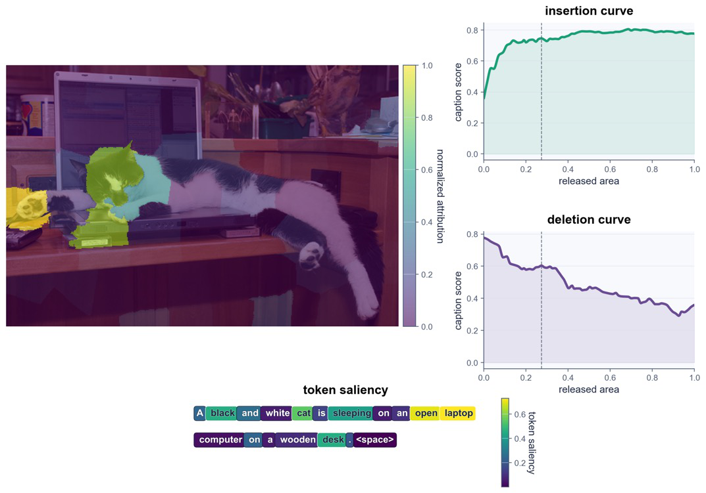

# PhaseWin: An Efficient Search Algorithm for Faithful Visual Attribution

## 论文元信息

- 标题：PhaseWin: An Efficient Search Algorithm for Faithful Visual Attribution
- 作者：Zihan Gu, Ruoyu Chen, Junchi Zhang, Li Liu, Xiaochun Cao, Hua Zhang
- arXiv ID：2606.18008v1
- 发布时间：2026-06-16
- 类别：cs.CV
- 论文链接：http://arxiv.org/abs/2606.18008v1
- PDF 链接：https://arxiv.org/pdf/2606.18008v1
- 代码状态：论文摘要页明确声明代码可用，链接为 https://github.com/Qihuai27/phasewin-va（见 PAGE 1）。公开仓库中已包含 `attribution_research/methods/search/phasewin.py`、`greedy.py`、分类/检测/Caption 任务入口与运行脚本；以下代码分析依据该公开仓库读取结果。
- 文本状态：本报告依据用户提供的 `paper_full_text_with_page_markers` 与摘要；全文抽取状态为 `fulltext:pypdf:truncated`，因此附录 B/D/E 的证明细节和边界案例样本细节证据不足。

## 摘要

PhaseWin 将高保真视觉归因（faithful visual attribution）表述为有序子集搜索（ordered subset search），用阶段化窗口搜索替代 Greedy 每轮全局重评分，在分类、检测、视觉指代和图像描述归因中接近 Greedy 的保真度，同时显著减少模型前向次数（见 PAGE 1、PAGE 3、PAGE 7）。

本文的核心贡献不是提出新的检测器、分类器或训练策略，而是提出一种面向视觉归因的搜索加速算法。它针对的问题很明确：如果图像被划分为 $n$ 个候选区域，Greedy 归因每次选择一个区域前都要重新评分剩余候选，成本达到 $O(n^2)$；PhaseWin 希望保留 Greedy 的区域排序行为，同时将评估复杂度压到近线性或线性规模（见 PAGE 1、PAGE 2、PAGE 6、PAGE 7）。

从业务视角看，PhaseWin 更适合用作模型解释、误检分析、数据闭环诊断和合规审计工具，而不是直接提升检测精度的训练算法。论文实验覆盖检测和 grounding，并在 Grounding DINO、Florence-2 上报告了明显的归因效率收益（见 PAGE 7、PAGE 11、PAGE 12、PAGE 13）。但其输出仍是归因排序或 saliency map，归因质量到业务可操作动作之间仍需额外验证。

## 背景与动机

现代视觉模型和视觉-语言模型（vision-language models, VLMs）的输出越来越复杂：分类模型给出类别，检测模型给出类别和框，视觉指代表达模型定位语言所指对象，多模态大模型生成 caption 或回答问题。论文开头指出，模型可能正确分类、定位或生成描述，但“真正支撑该响应的图像区域不能直接从输出中读出”（见 PAGE 1）。因此，视觉归因的目标是解释模型决策依赖哪些局部视觉区域。

论文将视觉归因定义为一种对候选图像区域的排序任务。给定一张图像的区域划分，好的排序应满足两个方向：逐步插入高排名区域时，目标模型响应应尽快恢复；删除这些区域时，目标响应应明显下降。这对应 sufficiency（充分性）与 necessity（必要性）两个互补标准（见 PAGE 1）。论文称这类方法比纯梯度解释更适合黑盒或弱可访问模型，因为它们通过受控视觉扰动直接探测模型输出（见 PAGE 1）。

现有高保真方法中，Greedy subset search 很自然：每一步选择当前最能提升目标响应的区域。但这也带来主要成本瓶颈。若有 $n$ 个候选区域，Greedy 第一轮评分 $n$ 个区域，第二轮评分 $n-1$ 个区域，直到最后，模型评估总量呈二次增长。论文在 Fig. 1 中明确将 Greedy 标注为 “global rescoring at every step” 与 “Time: $O(n^2)$”（见 PAGE 2）。

论文还指出一个理论层面的动机：已有 Greedy 归因常借用 submodular maximization（子模最大化）的直觉，但标准 sufficiency-necessity proxy 并不能在非退化情况下被视为 submodular set function（见 PAGE 1、PAGE 2）。这意味着，经典子模 Greedy 近似保证不能直接作为这类视觉归因 Greedy 方法的理论基础。PhaseWin 因此不是简单工程加速，而是试图在更贴合归因目标的 evidence accumulation（证据累积）假设下重新分析 Greedy-like 排序。

与 LIME、RISE、HSIC、Shapley-style 方法相比，PhaseWin 不把重点放在新的扰动分布或贡献估计公式上，而是把重点放在“如何更快搜索区域排序”。与 Grad-CAM、IGOS++ 等白盒方法相比，它仍保留搜索式归因对黑盒评估协议的适配能力（见 PAGE 3、PAGE 4）。这也解释了为什么论文将分类、检测、REC 和 caption attribution 都放在同一个 region-based replay protocol 下比较（见 PAGE 7、PAGE 8）。

## 预备知识

视觉归因中的候选区域通常来自 superpixel 或 patch 划分。论文在统一实验设置中说明：分类使用 50 个 SLIC superpixels，caption 使用 64 个 SLICO superpixels，检测和 grounding 使用 50 或 100 个区域（见 PAGE 8）。每个方法先输出区域排序，再通过 insertion/deletion replay protocol 衡量该排序是否真正恢复或破坏模型响应（见 PAGE 7、PAGE 8）。

在本文中，$U$ 表示候选区域全集，$|U|=n$ 表示区域数量；$G:2^U\to \mathbb{R}$ 表示任务相关的基础集合函数，例如分类置信度、检测目标分数、REC 目标置信度或 caption token 概率。集合 $X\subseteq U$ 表示当前插入或保留的区域集合。所有这些定义来自论文 Sec. 3.1（见 PAGE 4）。

需要区分两个层次：第一，搜索算法实际优化的是一个归因代理目标 $F$；第二，评估归因排序时通常看 $G$ 所诱导的前缀恢复曲线，例如 Insertion AUC、Deletion AUC、Average Highest 等。论文明确指出，PhaseWin 搜索 $F$ 并输出区域排序，然后用 $G$ 诱导的 prefix-wise quantities 评估排序质量（见 PAGE 4）。

## 方法详解

### 1. 从边际增益到对称归因目标

论文首先定义任意集合函数 $H$ 的边际增益：

$$
\Delta H(e\mid X):=H(X\cup\{e\})-H(X).
$$

这里 $e$ 是一个尚未被选中的候选区域，$X$ 是当前已选区域集合。人话解释：这个公式衡量“在当前已经有 $X$ 的情况下，再加入区域 $e$ 能让目标函数增加多少”（见 PAGE 4）。

PhaseWin 并不直接优化 $G(X)$，而是沿用 LIMA、VPS 等搜索式归因使用的对称目标：

$$
F(X):=G(X)+G(U)-G(U\setminus X),\quad X\subseteq U.
$$

其中 $G(X)$ 表示只保留或插入 $X$ 后目标响应有多强；$G(U)-G(U\setminus X)$ 表示从完整图像中移除 $X$ 后响应下降多少。人话解释：一个区域集合重要，不仅因为“有它就能恢复响应”，也因为“没它响应会下降”（见 PAGE 4）。

这一目标对应论文反复强调的 sufficiency-necessity proxy。它比单纯看 $G(X)$ 更贴近归因排序，因为归因区域应同时支持目标响应并对目标响应不可或缺。论文也明确说明，本文保持与 Greedy-style baselines 相同的目标，只改进搜索过程，以保证比较公平（见 PAGE 4）。

### 2. 排序评估：前缀最大值与 AUC

给定一个排序 $\pi=(\pi_1,\ldots,\pi_n)$，论文定义其前缀集合：

$$
P_t^\pi:=\{\pi_1,\ldots,\pi_t\},\quad P_0^\pi:=\emptyset.
$$

这里 $P_t^\pi$ 是排序前 $t$ 个区域组成的集合。人话解释：插入曲线上的每个点，就是把前 $t$ 个最重要区域显示出来后模型响应的值（见 PAGE 4）。

论文使用 prefix maximum 衡量排序在某个前缀处能达到的最佳响应：

$$
M_G(\pi):=\max_{0\le t\le n}G(P_t^\pi).
$$

人话解释：如果一个排序很好，那么在较早的前缀位置就应恢复出高目标响应；$M_G$ 看的是整条前缀曲线上的最高点（见 PAGE 4）。

论文还定义 full-cardinality AUC：

$$
\mathrm{AUC}_G(\pi):=\sum_{t=1}^{n}\frac{a_{\pi_t}}{A}G(P_t^\pi),\quad A:=\sum_{e\in U}a_e.
$$

其中 $a_e>0$ 是区域 $e$ 的面积或权重。人话解释：这个公式是对插入过程中每一步响应的加权平均，面积越大的区域对曲线积分贡献越大（见 PAGE 4）。

这些定义把“解释是否 faithful”转化为可度量的排序质量。PhaseWin 的目标并不是让最终全部区域恢复响应，因为全部插入本来就接近原图；关键在于排序前部是否尽快恢复目标响应。

### 3. 结构假设：语义块激活而非全局子模性

为了替代不适用的全局子模假设，论文引入分区视角。令 $\mathcal{H}=\{H_1,\ldots,H_q\}$ 是 $U$ 上的一个分区，每个 $H_j$ 可理解为潜在语义块或结构块。论文定义 activation signature：

$$
\chi_{\mathcal{H}}(X):=
\left(1[X\cap H_1\neq\emptyset],\ldots,1[X\cap H_q\neq\emptyset]\right).
$$

人话解释：这个向量记录当前区域集合 $X$ 是否已经覆盖了每个语义块，只关心“有没有激活”，不关心块内已经选了多少区域（见 PAGE 4）。

对应的 activated block set 定义为：

$$
B(X):=\{j\in[q]:X\cap H_j\neq\emptyset\}.
$$

人话解释：$B(X)$ 是当前已经被选中区域触达的语义块编号集合（见 PAGE 4）。

如果 $\phi:\{0,1\}^q\to\mathbb{R}$ 是块激活函数，论文将其集合形式写作：

$$
\Phi(J):=\phi(1_J),\quad J\subseteq[q].
$$

人话解释：$\Phi$ 衡量已经激活的语义块集合 $J$ 对归因目标的贡献（见 PAGE 4）。

这组定义支撑 PhaseWin 的核心直觉：主要增益来自“首次覆盖新的语义块”，而同一语义块内额外区域只提供较小 residual improvement。论文在 PAGE 4 明确写道，PhaseWin 的 central intuition 是 dominant gain comes from activating previously uncovered semantic blocks。

### 4. PhaseWin 的阶段化窗口搜索

PhaseWin 的输入与 Greedy 相同：候选区域集合、目标大小 $k$、评分函数 $F$。区别在于 Greedy 每一步都全局重评，而 PhaseWin 每个 phase 先做一次全局扫描，再通过阈值剪枝和窗口内精评减少重复模型调用（见 PAGE 4、PAGE 5）。

每个 phase 开始时，算法对当前剩余池 $R$ 做一次全局扫描，计算缓存增益 $g_r=\Delta F(r\mid S)$。最高增益候选作为 anchor：

$$
\alpha^\star\in\arg\max_{r\in R}g_r,\quad \Delta_{\mathrm{ref}}:=g_{\alpha^\star}.
$$

人话解释：anchor 是本阶段最可靠的候选区域，它的增益成为后续筛选阈值的参照（见 PAGE 4）。

然后 PhaseWin 构造两个固定比例阈值：

$$
\tau_{\mathrm{sel}}=\rho_{\mathrm{sel}}\Delta_{\mathrm{ref}},\quad
\tau_{\mathrm{del}}=\rho_{\mathrm{del}}\Delta_{\mathrm{ref}},\quad
0<\rho_{\mathrm{del}}<\rho_{\mathrm{sel}}<1.
$$

人话解释：超过 $\tau_{\mathrm{sel}}$ 的区域进入高潜力池，低于 $\tau_{\mathrm{del}}$ 的区域可被丢弃，中间区域延后到后续 phase（见 PAGE 4、PAGE 5）。

在高潜力池 $P$ 中，PhaseWin 不再全局比较所有剩余区域，而是将候选按缓存增益排序，取 top-$\omega$ 进入局部窗口 $W$。窗口策略 $\psi$ 决定要精确重评哪些候选。论文 Table 1 给出四类窗口策略：Local-Greedy、Beta-Adaptive、Top-2、Batched Best-Above with Forward Checking（见 PAGE 5）。

phase-exit rule 用当前候选真实增益与参考增益比较：

$$
\Delta F(\alpha\mid S)<\theta\Delta_{\mathrm{ref}}.
$$

人话解释：如果窗口内候选的真实增益已显著低于本阶段参考值，继续精评的收益可能不大，本阶段可以提前退出（见 PAGE 5）。

#### 图像证据：Fig. 1 的流程概览图块 1

用途：该图块来自论文 Fig. 1，用于支撑“PhaseWin 与 Greedy 都从同一图像区域划分出发，并输出区域重要性排序”的整体流程判断（见 PAGE 2）。



读图要点：Fig. 1 从输入图像、superpixel partition、candidate regions、target decision 到 importance ranking 串起完整归因流程。支撑的判断是：PhaseWin 并不改变 attribution problem 的输入输出形式，而是替换中间的搜索策略（见 PAGE 2）。

#### 图像证据：Fig. 1 的流程概览图块 2

用途：该图块用于说明 Greedy global rescoring 与 PhaseWin phased subset search 的差异，尤其是从 $O(n^2)$ 到 $O(n)$ 的目标转变（见 PAGE 2）。


读图要点：Fig. 1 将 Greedy 表述为每轮对剩余候选全局重评分，而 PhaseWin 包含 anchor、screen/prune、window refinement、accept/defer。支撑的判断是：PhaseWin 的主要创新在搜索过程，而不是模型结构或 attribution score 本身（见 PAGE 2）。

#### 图像证据：Fig. 1 的流程概览图块 3

用途：该图块用于说明 PhaseWin 的输出可转化为 ranking-induced saliency，用于 classification、grounding/detection 和 caption attribution（见 PAGE 2）。


读图要点：Fig. 1 显示排序 $\pi=(r_7,r_2,r_{11},r_5,\ldots)$ 可以被映射为 saliency map。支撑的判断是：PhaseWin 的任务接口是通用区域排序，因此能跨分类、检测、grounding 和 caption attribution 复用（见 PAGE 2、PAGE 3、PAGE 7）。

#### 图像证据：Fig. 1 的流程概览图块 4

用途：该图块用于补充说明 PhaseWin 的应用层输出与模型任务响应之间的关系（见 PAGE 2）。


读图要点：Fig. 1 底部展示 classification、grounding/detection、caption attribution 等应用场景。支撑的判断是：论文声称 PhaseWin 是 general acceleration strategy，而不是 detector-specific heuristic；这一点也被后续跨任务实验验证（见 PAGE 3、PAGE 14）。

### 5. 理论保证：从 target cardinality 到 full-order AUC

论文在 Sec. 3.3 中给出若干假设与保证。首先是 partition-dominant structure：

$$
F(X)=\Phi(B(X))+R(X),\quad \forall X\subseteq U.
$$

其中 $\Phi$ 是语义块激活贡献，$R$ 是 residual term。人话解释：归因目标的大部分变化来自是否覆盖新的语义块，小部分变化来自块内细节差异（见 PAGE 6）。

 residual term 的边际增益被限制为：

$$
0\le \Delta R(e\mid X)\le \varepsilon_R,\quad \forall X\subseteq U,\ e\in U\setminus X.
$$

人话解释：块内额外区域的贡献不能任意大，否则局部窗口可能错过全局重要区域（见 PAGE 6）。

对于被接受元素 $v_i$，论文设 $a_i$ 为 live candidate pool 中最大真实边际增益：

$$
a_i:=\max_{e\in R_i}\Delta F(e\mid S^{\mathrm{PW}}_{i-1}).
$$

人话解释：$a_i$ 是当前仍可选区域中的最优增益，用于衡量 PhaseWin 本步选择离最优候选有多近（见 PAGE 6）。

PhaseWin 的接受条件被抽象为：

$$
\Delta F(v_i\mid S^{\mathrm{PW}}_{i-1})\ge \kappa_i a_i.
$$

人话解释：只要每步接受的区域至少达到当前最优增益的一定比例，就能得到近 Greedy 的目标保证（见 PAGE 6）。

同时，被删除候选需要满足：

$$
\Delta F(e\mid S^{\mathrm{PW}}_{i-1})\le \rho_{\mathrm{del}}\Delta F(v_i\mid S^{\mathrm{PW}}_{i-1}),\quad \forall e\in D_i.
$$

人话解释：硬删除只应发生在候选明显低于当前接受区域时，这对应代码和论文都强调的小 deletion ratio（见 PAGE 6）。

为了把 $F$ 的保证转回任务响应 $G$，论文加入 two-sided alignment：

$$
\lambda_1G(X)+b_1\le F(X)\le \lambda_2G(X)+b_2.
$$

人话解释：如果 $F$ 与真实任务响应 $G$ 之间没有上下界对齐，那么优化 $F$ 并不一定能保证插入曲线上的 $G$ 也好；论文还指出没有该假设会有反例（见 PAGE 6）。

Theorem 2 给出复杂度结论：

$$
O\left((q+1)n(f_\psi(\omega)+1)\right).
$$

其中 $q$ 是有效语义块数量，$\omega$ 是窗口大小，$f_\psi(\omega)$ 是窗口策略的局部搜索因子。人话解释：如果有效 phase 数 $q$ 与候选区域数 $n$ 无关，且窗口大小固定，PhaseWin 的评估复杂度随 $n$ 线性增长（见 PAGE 7）。

### 6. 代码对应关系

论文 Page 1 明确给出公开代码链接，仓库 README 显示 `phasewin.py`、`greedy.py`、分类/检测/caption 任务入口均已发布。以下代码段不是论文正文内容，而是公开仓库实现与论文方法的对应分析。

Greedy 的核心循环与论文所说“每步全局重评分”一致。它每一轮把所有 remaining masks 打包，调用 `marginal_gain`，选择 argmax。这对应论文 Fig. 1 中 Greedy 的 $O(n^2)$ 流程（见 PAGE 2、PAGE 4）。

```python
# attribution_research/methods/search/greedy.py:43-58
def select(self, V_set, marginal_gain, apply=None):
    remaining = list(V_set)
    selected: List[np.ndarray] = []

    for _ in range(self.k):
        if not remaining:
            break
        batch = np.stack(remaining, axis=0)
        gains = marginal_gain(batch)
        idx = int(torch.argmax(gains).item())
        mask = remaining.pop(idx)
        selected.append(mask)
        if apply is not None:
            apply(mask)

    return selected
```

代码解读：这段实现没有缓存候选分层或窗口筛选。每次选择一个区域后，剩余区域全部重新进入 `marginal_gain`，正是论文批评的 quadratic global rescoring（见 PAGE 2）。

PhaseWin 的实现中，`tau_del` 与 `tau_sel` 对应论文 Eq. (10)，`del_mask` 与 `cand_mask` 对应 Algorithm 1 中 fixed-ratio pruning，`P_t` 是进入窗口精评前的高潜力池（见 PAGE 4、PAGE 5）。

```python
# attribution_research/methods/search/phasewin.py:261-289
tau_del = self.beta_del * G_t
tau_sel = self.alpha_sel_ratio * G_t

# Delete low-gain items
del_mask = g_all < tau_del
if del_mask.any():
    keep_mask = ~del_mask
    deleted.extend([remaining[i] for i, f in enumerate(del_mask.tolist()) if f])
    remaining = [remaining[i] for i, f in enumerate(keep_mask.tolist()) if f]
    g_all = g_all[keep_mask]
    if not remaining:
        T *= self.defer_decay
        continue

# Build candidate set
cand_mask = (g_all >= tau_sel)
rest_mask = ~cand_mask
cand_vals = g_all[cand_mask]
cand_list = [remaining[i] for i, f in enumerate(cand_mask.tolist()) if f]
rest_indices = [i for i, f in enumerate(rest_mask.tolist()) if f]
```

代码解读：这段实现把论文中的“screen/prune”落实为两个比例阈值。低增益候选不会反复参与高成本比较，高增益候选进入后续局部窗口。这正是 PhaseWin 将全局重复比较压缩为阶段化筛选的关键。

窗口策略在代码中对应论文 Table 1。`_policy_BA` 先重评窗口内候选，再保留超过 `max(tau_sel, beta_win * gmax)` 的候选；这对应 Beta-Adaptive / batched accept 类型的局部精评逻辑（见 PAGE 5）。

```python
# attribution_research/methods/search/phasewin.py:181-190
def _policy_BA(self, window, S_eval_fn, tau_sel):
    g = S_eval_fn(window)
    if g.numel() == 0:
        return [], g
    gmax = float(torch.max(g).item())
    cut = max(tau_sel, self.beta_win * gmax)
    idxs = torch.nonzero(g >= cut).flatten().tolist()
    idxs_sorted = sorted(idxs, key=lambda i: float(g[i]), reverse=True)
    return idxs_sorted, g
```

代码解读：论文 Table 1 中的窗口策略不是只停留在伪代码层；公开实现确实包含 LG、BA、T2 三类策略。需要注意的是，论文 Table 1 还列出 `ψBAF-B`，但当前读取到的核心文件中窗口策略集合为 `{"LG","BA","T2"}`；若要确认 BAF-B 是否在其他分支或脚本中实现，现有材料证据不足。

## 实验分析

### 1. 实验设置概述

论文实验覆盖三类逐步增强的场景：标准图像分类归因、检测与 referring expression comprehension（REC）的对象级归因、以及多模态大模型 caption token attribution（见 PAGE 7）。Table 2 列出分类使用 ImageNet-1K 与 CLIP ViT-L/14、CLIP RN101、ResNet-101；检测与 grounding 使用 MS COCO、LVIS、RefCOCO 与 Grounding DINO、Florence-2；caption 使用 MS COCO Captions 与 Qwen2.5-VL-3B/7B-Instruct（见 PAGE 7）。

统一评估协议是论文实验可信度的关键。所有方法最终都被转成区域排序，并通过 insertion/deletion replay protocol 评估，而不是只看 heatmap 外观。分类目标分数是 class probability，检测和 REC 是 object-level confidence，caption 是 selected-token mean probability（见 PAGE 7、PAGE 8）。

效率指标是平均模型评估次数 MEC 或 $MEC_{ave}$。论文还报告 A-C ratio，即主要 faithfulness metric 乘以 10000 后除以前向次数；但作者也提醒，在低保真方法上该指标可能误导，因为很低的成本会放大低质量结果（见 PAGE 8）。

### 2. 分类归因：接近 Greedy，约半数评估成本

| 设置 | Greedy Insertion | PhaseWin Insertion | Greedy MEC | PhaseWin MEC | 主要结论 |
|---|---:|---:|---:|---:|---|
| CLIP ViT-L/14 正确分类 | 0.8239 | 0.7990 | 1735.90 | 871.84 | PhaseWin 保留约 96.98% Greedy Insertion AUC，成本约减半 |
| CLIP RN101 正确分类 | 0.6525 | 0.5981 | 1736.68 | 951.16 | PhaseWin 明显优于 RISE/HSIC，但与 Greedy 有更大间隙 |
| ResNet-101 正确分类 | 0.7926 | 0.7672 | 1744.07 | 907.73 | PhaseWin 接近 Greedy，并显著优于非搜索基线 |

表格解读：该表来自论文 Tables 3 和 4（见 PAGE 8、PAGE 9）。分类正确样本上，Greedy 仍是 raw faithfulness 最强方法，但 PhaseWin 平均保留 95.39% 的 Greedy Insertion AUC、98.79% 的 Average Highest，同时仅使用 52.35% 的模型评估次数，平均 speedup 为 1.91×（见 PAGE 9）。这说明 PhaseWin 的收益不是牺牲主要插入曲线换取极端低成本，而是在 Greedy 高保真区域附近减少重复评估。

在错误分类样本中，论文分两种目标评估：一种解释模型实际给出的错误类别，另一种解释 ground-truth 类别。使用模型错误预测作为目标时，PhaseWin 在三种 backbone 上平均保留 92.68% 的 Greedy Insertion AUC，并将 MEC 从 1747.39 降到 1009.38（见 PAGE 9）。这对 badcase 分析有意义，因为它回答“模型为什么选错了这个类”。

使用 ground-truth 类别作为目标时，任务更难，因为模型本来没有选择真实类。PhaseWin 平均只保留 86.77% 的 Greedy Insertion AUC、86.39% 的 @50% recovery，但仍将 MEC 从 1747.39 降到 945.77（见 PAGE 10）。这暴露了一个边界：当目标响应不是模型主导输出时，缓存增益与后续真实贡献的稳定性下降，PhaseWin 与 Greedy 的差距会扩大。

### 3. 检测与 Grounding：Grounding DINO 上收益最明显

| 数据集 / 任务 | 方法 | Insertion | Deletion | Ave. high score | MECave | A-C ratio |
|---|---|---:|---:|---:|---:|---:|
| MS COCO Detection | Greedy-50 | 0.5195 | 0.0375 | 0.6591 | 2548.8 | 2.04 |
| MS COCO Detection | PhaseWin-50 | 0.4785 | 0.0424 | 0.6353 | 536.8 | 8.92 |
| RefCOCO REC | Greedy-50 | 0.7278 | 0.1240 | 0.8770 | 2290.6 | 3.18 |
| RefCOCO REC | PhaseWin-50 | 0.7013 | 0.1473 | 0.8654 | 630.1 | 11.13 |
| LVIS rare Zero-shot Det. | Greedy-50 | 0.3411 | 0.0265 | 0.4654 | 2544.6 | 1.34 |
| LVIS rare Zero-shot Det. | PhaseWin-50 | 0.3071 | 0.0303 | 0.4325 | 465.9 | 6.59 |

表格解读：该表摘自 Table 8 的 50-region Grounding DINO 结果（见 PAGE 11）。对象级任务中，PhaseWin 的成本收益比分类更明显：MS COCO 上 MEC 从 2548.8 降到 536.8，RefCOCO 从 2290.6 降到 630.1，LVIS rare 从 2544.6 降到 465.9。虽然 Insertion 和 Deletion 相比 Greedy 有损失，但 A-C ratio 大幅提升，说明在需要批量解释检测 failure cases 时，PhaseWin 的实用性更强。

论文还在 Florence-2 上验证跨 backbone 迁移。Table 13 显示，MS COCO 上 PhaseWin-50 Insertion 为 0.7615，接近 Greedy-50 的 0.7678；RefCOCO 上 PhaseWin-50 为 0.8312，甚至略高于 Greedy-50 的 0.8301（见 PAGE 11、PAGE 13）。不过论文也说明 Florence-2 上 speedup 小于 Grounding DINO，这与 Florence-2 的局部子模结构较弱有关（见 PAGE 11）。

failure analysis 覆盖 REC 错误 grounding、检测误分类、未检测实例。以 undetected MS COCO 为例，PhaseWin-100 Insertion 0.2156，略高于 Greedy-100 的 0.2102，ESR 44.44% 也高于 Greedy-100 的 41.33%，同时评估次数约少 4.7×（见 PAGE 12、PAGE 13）。这说明 PhaseWin 的 annealed / deferred search 在少数场景可能避开 Greedy 早期局部选择问题，但这不是普遍保证。

### 4. Caption token attribution：对生成式 MLLM 也有效

| 模型 | 方法 | Insertion | Deletion | SensIns | SensDel | Ave. high | MECave | A-C ratio |
|---|---|---:|---:|---:|---:|---:|---:|---:|
| Qwen2.5-VL-3B | Greedy | 0.6405 | 0.4372 | 0.5946 | 0.2858 | 0.6951 | 4168.62 | 1.53 |
| Qwen2.5-VL-3B | PhaseWin | 0.6351 | 0.4522 | 0.5736 | 0.3052 | 0.6835 | 1412.71 | 4.80 |
| Qwen2.5-VL-7B | Greedy | 0.6284 | 0.4350 | 0.5721 | 0.2815 | 0.7064 | 2931.52 | 2.14 |
| Qwen2.5-VL-7B | PhaseWin | 0.6155 | 0.4467 | 0.5535 | 0.2968 | 0.6995 | 1401.60 | 4.39 |

表格解读：该表来自 Table 12（见 PAGE 13）。Caption token attribution 中，目标不再是单个类别或检测框，而是选定生成 token 的平均概率。PhaseWin 在 3B 和 7B 模型上都接近 Greedy，同时把 MEC 从 4168.62/2931.52 降到约 1400。论文据此认为，PhaseWin 的前向次数主要受模型决策依赖的有效特征数控制，而不严格随分割区域数按 Greedy 的二次形式增长（见 PAGE 13）。

### 5. 定性结果与消融

论文 Fig. 3 展示 ImageNet 分类可视化：PhaseWin 的区域排序视觉上接近 Greedy，插入/删除曲线也接近，但 forward count 明显更低（见 PAGE 10）。Fig. 4 展示对象级归因，PhaseWin 相比 ODAM 和 RISE 更锐利、更少噪声，并与 Greedy 接近（见 PAGE 12）。Fig. 5 展示 caption token attribution，PhaseWin 能跟随 Greedy 找到 token-relevant visual evidence，同时减少模型前向次数（见 PAGE 14）。

论文 Fig. 6 是速度-精度 trade-off 消融。随着窗口大小和 phase-exit threshold 带来的搜索预算增加，Insertion AUC 单调上升并接近 Greedy；在高预算区域，annealed deferral 机制有时略超 Greedy（见 PAGE 14、PAGE 15）。这说明 PhaseWin 不是单一固定算法点，而是一个可调预算的搜索框架。

论文还讨论了 boundary cases：当局部边际排序不稳定时，PhaseWin 会明显偏离 Greedy。caption 任务中未观察到这类 pathological samples；分类任务中约占 13.1%，排除后 PhaseWin 与 Greedy 的 faithfulness gap 在 2% 内（见 PAGE 15）。不过 Appendix E.2 未包含在本次截断全文中，因此这些边界样本的具体构成证据不足。

## 讨论

PhaseWin 的适用边界首先由其问题形式决定：它适合已有候选区域划分、可通过模型前向评估区域子集响应、并以 insertion/deletion 曲线衡量 faithfulness 的归因任务。论文的统一实验协议正是围绕 region-based attribution runtime 构建的（见 PAGE 7、PAGE 8）。如果任务无法定义稳定的 $G(S)$，或者区域扰动会造成严重 out-of-distribution artifacts，PhaseWin 的排序质量也会受影响。

从理论上看，PhaseWin 的线性复杂度不是无条件成立。Theorem 2 依赖 partition-dominant structure 和有效 phase 数 $q$ 不随 $n$ 增长的条件；full-order prefix/AUC guarantee 还需要 block-safe live-pool 与 two-sided alignment（见 PAGE 6、PAGE 7）。因此，论文给出的保证应理解为“在特定证据累积结构下的 near-greedy guarantee”，而不是所有视觉模型和所有图像上的普适最优性证明。

从业务落地看，PhaseWin 对检测 badcase 分析有工具价值。它可帮助定位模型误检、漏检或误分类所依赖的图像区域，辅助数据清洗、偏差检查和合规审计。这一定位与论文将其用于 classification、detection、grounding、caption attribution 的跨任务归因框架一致（见 PAGE 3、PAGE 7、PAGE 14）。但它不直接给出“应该补什么数据”“应该改什么 loss”或“如何提升 detector AP”的训练策略。

风险在于，归因指标高并不等于业务动作可操作。论文主要使用 Insertion AUC、Deletion AUC、Average Highest、Point Game、Energy PG、ESR、Sensitivity-aware AUC 等指标（见 PAGE 8、PAGE 11、PAGE 13）。这些指标能衡量排序是否恢复模型响应，却不能直接衡量解释是否符合人类标注逻辑、是否能稳定指导数据闭环，或是否能减少线上误报。大规模业务闭环中，还需要测量解释耗时、缓存策略、批处理效率和人工审核收益。

## 局限分析

第一，作者自述或论文显式暴露的理论局限是：PhaseWin 的保证依赖 monotone evidence accumulation、partition-dominant structure、block-safe live-pool、two-sided alignment 等假设（见 PAGE 6）。论文 Remark 2 认为 Eq. (21) 在实践中通常由很小的 deletion ratio 隐式满足，但这仍然是分析假设，而非无条件事实（见 PAGE 6）。

第二，作者在消融中承认存在 ranking-unstable boundary cases。分类任务约 13.1% 样本属于这类情形；这些样本中早期区域分数不能稳定预测后续贡献，因此 PhaseWin 与 Greedy 的差距会集中出现（见 PAGE 15）。由于 Appendix E.2 未在截断材料中提供，具体样例、判定规则和可复现列表证据不足。

第三，独立判断上，PhaseWin 仍然可能很贵。即使相比 Greedy 明显降本，分类正确样本中 PhaseWin MEC 仍在约 871 到 951，caption 中约 1400，检测 100-region 设置中仍可能达到 2000 到 3000 级别（见 PAGE 8、PAGE 11、PAGE 13）。如果用于百万级数据闭环，仍需工程层面的批处理、缓存、早停策略和抽样策略。

第四，论文的实验非常广，但仍以插入/删除 faithfulness 为核心。对于检测业务，解释是否能转化为可执行数据治理策略仍未被直接验证。比如一个误检归因区域被 PhaseWin 标为重要，并不自动说明应删除样本、补充某类负样本、调整标注还是修改训练目标。这个“解释到行动”的环节在论文材料中证据不足。

第五，公开代码与论文算法存在少量需要进一步核对的点。当前读取到的核心 `phasewin.py` 实现包含 LG、BA、T2 三类窗口策略；论文 Table 1 还列出 `ψBAF-B`（见 PAGE 5）。该策略是否在其他文件、分支或后续版本实现，当前材料证据不足。

## 结论

PhaseWin 的贡献可以概括为三点：第一，它指出标准 sufficiency-necessity 归因 proxy 不能直接依赖经典子模 Greedy 理论来解释；第二，它将视觉归因重构为 ordered evidence accumulation，并提出 anchor、screen/prune、window refinement、accept/defer 的阶段化搜索；第三，它在分类、检测、REC 和 caption attribution 上证明该搜索机制可在接近 Greedy faithfulness 的同时显著减少模型评估次数（见 PAGE 1、PAGE 2、PAGE 3、PAGE 14、PAGE 15）。

对推荐方向“检测”而言，PhaseWin 的价值不在检测模型本身，而在解释检测模型如何依赖局部区域。它适合放在误检分析、漏检审计、数据闭环诊断和模型合规解释链路中。其主要风险也很清楚：faithfulness 曲线改善不等于业务闭环收益，额外推理成本仍需结合真实数据规模和审核流程验证。

## 证据索引

- PAGE 1：论文摘要；视觉归因定义；Greedy 二次成本；PhaseWin 主张；代码链接；Introduction 中 sufficiency/necessity 动机。
- PAGE 2：Fig. 1；Greedy global rescoring 与 PhaseWin phased subset search 对比；PhaseWin 输出 saliency map 并用于分类、grounding/detection、caption attribution。
- PAGE 3：跨任务实验范围；贡献列表；从会议版本到 journal version 的扩展说明；相关工作开头。
- PAGE 4：Problem Setup；边际增益 Eq. (1)；对称目标 Eq. (2)；前缀集合、prefix maximum、AUC；语义块激活定义 Eq. (6)-(8)；PhaseWin anchor 和阈值 Eq. (9)-(10)。
- PAGE 5：Fig. 2；Algorithm 1；WindowSelection；窗口策略 Table 1；phase-exit rule Eq. (11)。
- PAGE 6：Assumption 1-3；partition-dominant decomposition；residual bound；accepted/deleted candidate 条件；two-sided alignment；Theorem 1。
- PAGE 7：Theorem 2 复杂度；Corollary 1/2；实验任务范围 Table 2。
- PAGE 8：统一实验设置；评估指标；分类正确样本 Table 3；区域数量、窗口大小和 phase-exit threshold 设置。
- PAGE 9：ResNet-101 分类 Table 4；错误预测目标 Tables 5-7；分类正确样本结果解读。
- PAGE 10：ground-truth 失败目标 Tables 9-11；分类失败样本总结；Fig. 3 定性分类结果。
- PAGE 11：Grounding DINO 正确检测/grounding Table 8；Florence-2 Table 13；对象级实验结论。
- PAGE 12：Fig. 4；REC failure、misclassified detection、undetected failure 的实验讨论。
- PAGE 13：Caption token attribution Table 12；Florence-2 Table 13；failure Tables 14-16。
- PAGE 14：Fig. 5；跨任务讨论；PhaseWin 在 classification、caption、Grounding DINO 上的平均 speedup 范围。
- PAGE 15：Fig. 6；速度-精度消融；ranking-unstable boundary cases；Conclusion。
- PAGE 16：参考文献开始；正文之后的附录证明和边界案例细节未包含在本次截断材料中，相关细节证据不足。
