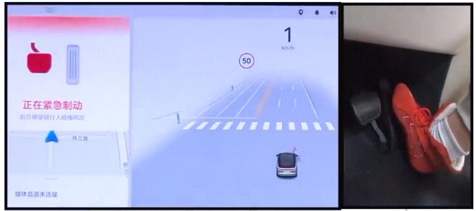

# Scaling Learning-based AEB with Massive Unlabeled Data

## 摘要

**论文元信息。** 本文标题为 *Scaling Learning-based AEB with Massive Unlabeled Data*，arXiv ID 为 2606.18864，作者为 Xiangyu Wang 等，论文链接为 http://arxiv.org/abs/2606.18864v1，PDF 链接为 https://arxiv.org/pdf/2606.18864v1，类别为 cs.LG 与 cs.AI，已接收于 IROS 2026（见 PAGE 1）。论文正文未给出可确认的公开代码仓库；题名、arXiv ID 与作者信息中也未提供代码链接，因此本文不写源码段，代码状态记为：**本文未提供可确认的公开代码**。

**一句话总结。** 本文将元反馈半监督学习（Meta-Feedback Semi-Supervised Learning, MF-SSL）扩展到量产自动紧急制动（Automatic Emergency Braking, AEB），通过噪声感知解耦、运动学门控伪标签和教师冲突惩罚，使 1M 到 1B 规模未标注车队数据能够稳定提升安全性，同时控制误触发（见 PAGE 1、PAGE 2、PAGE 7、PAGE 8）。

本文的核心问题不是“能否用神经网络做 AEB”，而是“能否在量产约束下，把海量未标注车队数据转化为可靠的安全收益”。论文指出，AEB 已经在现实道路安全中有明确收益，例如减少追尾碰撞、行人碰撞和严重伤亡风险，但传统基于 TTC（Time-To-Collision，碰撞时间）或距离阈值的规则系统在传感器噪声、跟踪伪影和长尾交互下容易脆弱（见 PAGE 1、PAGE 2）。

本文的方法建立在教师-学生式 MF-SSL 之上：教师模型为未标注样本生成伪标签，学生模型学习这些伪标签，而教师再根据学生在小规模有标注安全锚点上的表现进行更新（见 PAGE 2、PAGE 3）。论文的关键判断是：在生产 AEB 中，标注锚点存在近边界歧义，未标注数据又以正常驾驶为主，两者不匹配会放大系统性伪标签错误，最终导致看似“高置信”的风险幻觉和误触发（见 PAGE 1、PAGE 3）。

为解决这个问题，论文提出稳定化 MF-SSL 框架：Noise-Aware Decoupling（噪声感知解耦，NAD）将难拟合的歧义锚点从教师监督更新路径中移除并转入未标注池；kinematics-gated pseudo-labeling（运动学门控伪标签）用 TTC 检查器过滤明显安全场景中的风险幻觉；teacher conflict penalty（教师冲突惩罚）进一步抑制与运动学先验冲突的高置信预测（见 PAGE 4、PAGE 5、PAGE 6）。

用途：下图用于展示论文所说的测试场验证场景，即 AEB 在开放道路部署前需要先通过受控场景验证。该图来自提供的 Figure 1 图像切片，证据页为 PAGE 1。

读图要点：画面显示车机界面、当前速度与驾驶员脚部状态。论文 caption 指出测试驾驶员未踩制动踏板，而 AEB 策略在危险场景中自动触发制动（见 PAGE 1）。

支撑的判断：本文讨论的是可实际部署的量产 AEB 策略，而不是离线分类器；其安全收益最终必须通过车辆端触发行为来验证（见 PAGE 1、PAGE 8）。

用途：下图用于展示测试场中的目标与自车相对关系。它支撑论文关于 AEB 需要处理车辆与 VRU/摩托车等目标交互的背景论述。

读图要点：俯视图中可以看到自车与测试设备摩托车处于潜在碰撞路径。论文将该场景作为“test track validation before open world deployment”的示例（见 PAGE 1）。

支撑的判断：AEB 的关键不是静态识别目标，而是根据自车与目标的运动状态判断是否需要触发制动；这也是论文在方法中引入历史轨迹、速度、加速度、yaw 以及 TTC 检查器的原因（见 PAGE 4、PAGE 6）。

用途：下图用于展示触发时刻的人机界面与速度下降。该图对应 Figure 1 的触发状态，用于说明模型输出最终会作用到制动行为。

读图要点：车机界面出现“正在紧急制动”提示，速度显示降到约 1 km/h。论文 caption 强调红框为 AEB 触发提示，黄色框显示触发后自车速度下降（见 PAGE 1）。

支撑的判断：本文把“安全”与“舒适”同时作为目标并不矛盾：安全要求危险场景及时制动，舒适要求正常驾驶中尽量避免误触发。后文实验中的 $S_{\mathrm{safe}}$ 与 $S_{\mathrm{comf}}$ 正是围绕这两个维度设计（见 PAGE 6）。

用途：下图用于标识 AEB 功能本身。它不是方法图，而是 Figure 1 中与 AEB 触发语义相关的视觉片段。

读图要点：图中是 AEB 图标，用于帮助读者识别论文中的触发功能语境。

支撑的判断：本文的研究对象是安全关键触发策略，而非一般感知任务。因此伪标签错误的代价不是普通分类错误，而可能表现为漏刹或误刹（见 PAGE 1、PAGE 3、PAGE 6）。

## 背景与动机

AEB 的工程目标是识别迫近碰撞风险，并在驾驶员未及时反应时主动制动，从而缓解或避免碰撞。论文开篇列举了 AEB 对道路安全的现实收益：追尾碰撞和伤害率下降、白天行人碰撞和伤害率下降，以及不可避免碰撞中的严重行人伤害风险下降（见 PAGE 1）。这说明 AEB 不是边缘功能，而是 ADAS 与自动驾驶系统中的核心安全模块。

传统 AEB 通常依赖手工规则，例如 TTC 阈值、安全距离阈值和运动学制动包络。这类规则的优势是可解释、保守、便于验证，但论文指出它们在传感器噪声、跟踪伪影和开放世界长尾交互下容易变脆（见 PAGE 1、PAGE 2）。例如，目标轨迹短时抖动可能造成 TTC 异常，规则系统如果缺乏上下文建模能力，就可能误判危险或错过危险。

学习式 AEB（learning-based AEB）的动机在于从数据中学习触发边界，使模型能够利用更长时序、更复杂的多智能体交互信息。论文采用 Transformer-based backbone，使触发边界由数据和训练目标学习得到，而不是完全依赖手工阈值（见 PAGE 4、PAGE 5）。但学习式 AEB 的生产瓶颈是安全标签昂贵，尤其是危险事件少、标注标准存在风险容忍差异，无法像普通视觉任务那样轻易扩展有标注数据（见 PAGE 1、PAGE 6）。

车队数据提供了另一条路径：量产车辆每天产生大量未标注驾驶片段，边际标注成本近似为零。论文因此研究 SSL 是否能让 AEB 呈现“随未标注数据规模增长而稳定变好”的 scaling behavior（见 PAGE 1、PAGE 2）。这个问题对自动标注/数据团队有直接参考价值：如果能稳定利用未标注数据，数据闭环的核心就从“尽可能多标注”转向“维护少量高质量锚点、筛选伪标签、抑制风险样本”。

然而，生产 AEB 中的 SSL 比通用视觉 SSL 更难。论文明确指出两类障碍：第一，labeled anchors（有标注锚点）靠近触发边界时存在 near-boundary ambiguity，不同标注者对风险容忍度不同；第二，有标注集通常是 event-heavy，而未标注数据以 nominal driving 为主，形成 labeled-unlabeled mismatch（见 PAGE 1）。这两类问题会使教师模型生成的伪标签在规模扩大时不一定变好，甚至可能把系统性错误放大（见 PAGE 3）。

## 预备知识

本文把 AEB 建模为触发策略 $f_\theta$，其中 $\theta$ 是模型参数。输入是长度为 $T$ 的历史窗口 $x:=X_{t-T+1:t}$，包含自车与跟踪目标的状态；输出是在时间 $t$ 的风险分数 $\hat p_t\in[0,1]$，再通过阈值 $\tau$ 得到二值触发决策 $\hat y_t$（见 PAGE 2）：

$$
x:=X_{t-T+1:t},\qquad \hat y_t=\mathbb{I}[\hat p_t>\tau]\in\{0,1\}.
$$

人话解释：模型不是只看当前帧，而是看过去 $T$ 帧的运动历史；当预测风险分数超过触发阈值 $\tau$ 时，系统输出“触发 AEB”。

MF-SSL 中有教师模型 $f_{\theta_T}$ 与学生模型 $f_{\theta_S}$，其中 $\theta_T$ 和 $\theta_S$ 分别表示教师与学生参数。教师在未标注输入 $x\sim P_U^X$ 上产生伪标签 $p_{\theta_T}(x)$，并通过接受掩码 $m_{\theta_T}(x)\in\{0,1\}$ 决定该伪标签是否用于训练学生。学生的未标注伪标签风险为（见 PAGE 2）：

$$
R^{PL}_{U}(\theta_S;\theta_T)\triangleq
\mathbb{E}_{x\sim P_U^X}
\left[
m_{\theta_T}(x)\,
\mathrm{CE}(f_{\theta_S}(x),p_{\theta_T}(x))
\right].
$$

人话解释：学生只学习被教师接受的伪标签；$m_{\theta_T}(x)=0$ 的样本被过滤，$m_{\theta_T}(x)=1$ 的样本进入学生训练。这里的 $\mathrm{CE}$ 是交叉熵损失，衡量学生输出与教师伪标签之间的差异。

标准 MF-SSL 的三步包括：学生先用未标注伪标签做一步更新，再用更新后的学生在 labeled anchors 上计算损失，最后教师通过这个锚点损失反向更新（见 PAGE 3）：

$$
\theta_S^+(\theta_T)=\theta_S-\alpha\nabla_{\theta_S}R^{PL}_U(\theta_S;\theta_T),
$$

$$
\tilde J(\theta_T)=
\mathbb{E}_{(x,\tilde y)\sim P_L}
\left[
\ell(f_{\theta_S^+(\theta_T)}(x),\tilde y)
\right],
$$

$$
\theta_T^+=\theta_T-\beta\nabla_{\theta_T}\tilde J(\theta_T).
$$

人话解释：教师不是单纯凭自己的置信度给伪标签，而是通过“学生学了这些伪标签以后，在安全锚点上是否变好”来调整自己。$\alpha$ 是学生学习率，$\beta$ 是教师学习率，$\tilde y$ 是可能带噪声的锚点标签（见 PAGE 2、PAGE 3）。

## 方法详解

### 1. 安全泛化分解：为什么伪标签错误会变成部署风险

论文首先定义部署风险 $R_D(\theta)$，其中 $P_D$ 是部署分布，$y$ 是真实触发标签，$\ell$ 是有界损失（见 PAGE 3）：

$$
R_D(\theta)\triangleq
\mathbb{E}_{(x,y)\sim P_D}
\left[
\ell(f_\theta(x),y)
\right].
$$

人话解释：这个量衡量模型在真实部署分布上的平均错误代价。论文承认实践中交叉熵理论上无界，但由于 softmax 饱和与梯度裁剪，训练中可近似采用有界损失假设（见 PAGE 3）。

论文随后给出安全泛化分解（View I）。令 $\Gamma_D(\theta_T)$ 表示教师在部署分布上“接受了错误伪标签”的概率质量，$q_D(\theta_T)$ 表示接受覆盖率，则有（见 PAGE 3）：

$$
R_D(\theta_S)\le
R^{PL}_{D}(\theta_S;\theta_T)
+
B\Gamma_D(\theta_T)
+
B(1-q_D(\theta_T)).
$$

人话解释：部署风险由三部分构成：学生是否学好被接受区域的伪标签、教师接受错误伪标签的概率、以及有多少部署样本没有被伪标签覆盖。这个式子直接解释了本文设计目标：既不能让错误伪标签进入训练，也不能简单把门槛调得过严导致覆盖率下降（见 PAGE 3）。

这一分解对自动标注/数据团队也有启发。伪标签筛选不能只追求高置信，因为高置信不等于正确；筛选策略应同时报告 accepted-error proxy 与 coverage proxy。本文后续用 $q_U$ 和 $r_{\mathrm{conf}}$ 作为训练侧的覆盖率与冲突率代理指标，正是对这个分解的工程化落地（见 PAGE 7）。

### 2. 元梯度耦合：为什么 MF-SSL 会放大系统性错误

论文的第二个理论视角是 meta-gradient coupling。根据链式法则，教师更新梯度为（见 PAGE 3）：

$$
\nabla_{\theta_T}\tilde J(\theta_T)
=
\left(
\frac{\partial\theta_S^+}{\partial\theta_T}
\right)^\top g_L^+,
\qquad
g_L^+:=
\nabla_{\theta_S^+}
\mathbb{E}_{P_L}
\left[
\ell(f_{\theta_S^+}(x),\tilde y)
\right].
$$

人话解释：教师更新取决于“教师伪标签如何改变学生”，以及“改变后的学生在锚点上表现如何”。如果锚点本身带噪声，反馈信号 $g_L^+$ 就会偏斜。

进一步代入学生的一步更新，论文得到（见 PAGE 3）：

$$
\nabla_{\theta_T}\tilde J(\theta_T)
=
-\alpha
\left(
\nabla_{\theta_T}\nabla_{\theta_S}R^{PL}_U
\right)^\top
g_L^+.
$$

人话解释：教师更新被未标注伪标签损失的交叉导数驱动。如果伪标签中有系统性错误，学生梯度会被偏置；这个偏置又通过交叉导数反向作用到教师，形成闭环放大（见 PAGE 3）。

论文还用一阶展开说明错误接受概率 $\Gamma_D$ 可能在教师更新后增加（见 PAGE 3）：

$$
\Gamma_D(\theta_T^+)
\approx
\Gamma_D(\theta_T)
-
\beta
\left\langle
\nabla_{\theta_T}\Gamma_D(\theta_T),
\nabla_{\theta_T}\tilde J(\theta_T)
\right\rangle.
$$

人话解释：如果锚点噪声和分布不匹配使教师梯度朝着“降低锚点损失但增加部署错误接受”的方向走，那么 $\Gamma_D$ 会升高；这对应论文所说的 nominal driving 中 spurious high-risk predictions 与 false activations（见 PAGE 3）。

### 3. 端到端生产数据闭环

论文 Figure 2 描述了生产闭环：车队采集形成 labeled anchors 与大规模 unlabeled pool；鲁棒 MF-SSL 训练 AEB 策略；候选模型先通过闭环仿真评估筛选，再进行车端部署；新数据继续回流用于下一轮迭代（见 PAGE 4）。由于本任务只允许使用 `figures` 中提供的图片路径，而 Figure 2 的图片文件未提供，因此本文不嵌入 Figure 2，只基于正文说明其内容。

这个闭环的关键是把训练、仿真、部署和再采集连接起来，而不是把 SSL 当作一次性离线训练技术。论文在贡献中称其建立了 full-stack data loop，并在数十万辆车、六个月、超过 $10^9$ km 的真实驾驶中验证（见 PAGE 2、PAGE 8）。这也是本文相较多数受控数据集或仿真 AEB 工作的主要差异。

### 4. Transformer-based AEB 架构

模型架构见论文 Figure 3。输入为 $T=60$ 帧历史窗口，包含 ego 与 tracked agents 的位置、速度、加速度和 yaw，并使用 ego-centric coordinate frame（见 PAGE 4）。每个 agent 每帧状态先经过共享 MLP 编码到 $d=64$ 维特征空间，再经过 4-head temporal self-attention 聚合每个 agent 的时序历史，随后通过 4-head spatial self-attention 建模 ego 与所有 tracked agents 的交互，最后 scene pooling 得到全局上下文向量并输出两个 logits（见 PAGE 4、PAGE 5）。

论文给出 softmax 输出公式（见 PAGE 4）：

$$
z_t=f_\theta(X_{t-T+1:t})\in\mathbb{R}^2,
\qquad
p_t=\mathrm{softmax}(z_t).
$$

人话解释：$z_t$ 是二分类 logits，$p_t$ 是经过 softmax 后的类别概率，包含触发与不触发两类。模型学习的是风险触发边界，而不是直接套用固定 TTC 规则。

Figure 3 的图片文件未在本任务的 `figures` 列表中提供，因此本文不嵌入该图。证据不足以展示其视觉结构，但正文已明确给出关键配置：$T=60$、$d=64$、temporal attention 4 heads、spatial attention 4 heads 与二分类输出（见 PAGE 4、PAGE 5）。

### 5. Noise-Aware Decoupling：从教师监督路径中移除歧义锚点

NAD 的目标是降低 ambiguous anchors 对教师更新的污染。论文先训练一个 supervised warm-up model $f_{\theta^{(0)}}$，然后收集其在 labeled set $D_L$ 上误分类的样本（见 PAGE 4）：

$$
D_{\mathrm{err}}=
\{(x,y)\in D_L:\arg\max f_{\theta^{(0)}}(x)\ne y\}.
$$

人话解释：$D_{\mathrm{err}}$ 是模型很难拟合的标注窗口。论文认为这些样本往往集中在触发边界附近，含有 near-trigger ambiguity 与 labeling artifacts，因此不适合作为教师模型的监督锚点（见 PAGE 4）。

一个重要细节是，论文没有直接丢弃这些样本，而是把它们的输入转入未标注池：$D'_L=D_L\setminus D_{\mathrm{err}}$，$D'_U=D_U\cup\{x:(x,y)\in D_{\mathrm{err}}\}$（见 PAGE 4、PAGE 5）。这样做保留了这些窗口的输入分布价值，同时避免有争议的标签直接推动教师监督更新。

论文还说明选择 misclassification 而不是 confidence-based filtering 的原因：现代神经网络往往校准不足，置信度不一定可靠；误分类更能指示标签与特征之间的内在矛盾（见 PAGE 4）。这个判断对伪标签清洗也有参考意义：生产数据中的“低置信”不一定坏，“高置信”也不一定对，筛选标准需要结合任务结构。

### 6. 学生目标：监督锚点与门控伪标签联合训练

学生在清洗后的 labeled anchors $D'_L$ 上使用标准交叉熵监督损失（见 PAGE 5）：

$$
L^{sup}_S(\theta_S)=
\mathbb{E}_{(x_L,y_L)\sim D'_L}
\left[
\mathrm{CE}(f_{\theta_S}(x_L),y_L)
\right].
$$

人话解释：这部分让学生保留对人工安全锚点的基本拟合能力。$x_L$ 是有标注输入，$y_L$ 是二值触发标签。

在未标注样本 $x_U\sim D'_U$ 上，教师提供伪标签 $\hat y_U=\mathrm{softmax}(f_{\theta_T}(x_U))$，并由接受掩码 $m_{\theta_T}(x_U)$ 决定是否使用。学生未标注损失为（见 PAGE 5）：

$$
L^{unsup}_S(\theta_S;\theta_T)=
\mathbb{E}_{x_U\sim D'_U}
\left[
m_{\theta_T}(x_U)\cdot
\mathrm{CE}(f_{\theta_S}(x_U),\hat y_U)
\right].
$$

人话解释：只有通过门控的伪标签进入学生学习；被判定与运动学安全先验冲突的风险伪标签会被屏蔽。

学生总目标为（见 PAGE 5）：

$$
L_S(\theta_S)=
L^{sup}_S(\theta_S)+
\lambda L^{unsup}_S(\theta_S;\theta_T).
$$

人话解释：$\lambda$ 控制未标注伪标签损失的权重。论文实现中设定 $\lambda=1$，并表示对这些超参数敏感性较低（见 PAGE 6）。

### 7. 运动学门控与教师冲突惩罚

论文指出，有标注数据是 event-heavy，而未标注池比它大 3 到 4 个数量级，并且主要由正常驾驶组成（见 PAGE 5）。这种不匹配会导致教师在明显安全场景中产生 over-confident risk hallucination。为此，论文使用轻量 TTC checker 输出 $I_{\mathrm{safe}}(x_U)$，当 TTC 很大时表示清晰安全（见 PAGE 5、PAGE 6）。

高置信风险幻觉定义为（见 PAGE 5）：

$$
I_{\mathrm{hall}}(x_U)=
\mathbb{I}[p^{risk}_T(x_U)>\tau]\cdot I_{\mathrm{safe}}(x_U).
$$

人话解释：如果教师认为样本是高风险，且风险概率超过阈值 $\tau$，但 TTC 检查器认为该场景明显安全，那么该样本就是风险幻觉。实现中使用 $I_{\mathrm{safe}}(x)=\mathbb{I}[\mathrm{TTC}(x)>10]$，高置信阈值 $\tau=0.9$（见 PAGE 6）。

接受掩码为（见 PAGE 5）：

$$
m_{\theta_T}(x_U)=1-I_{\mathrm{hall}}(x_U).
$$

人话解释：被判定为风险幻觉的伪标签不会被学生学习；没有冲突的样本继续保留，从而避免为了安全而过度牺牲覆盖率。

教师冲突惩罚为（见 PAGE 5）：

$$
R_{\mathrm{conf}}(\theta_T)=
\mathbb{E}_{x_U\sim D'_U}
\left[
I_{\mathrm{hall}}(x_U)p^{risk}_T(x_U)
\right].
$$

人话解释：这项损失不仅过滤学生输入，还直接惩罚教师在明显安全样本上输出高风险概率，从源头降低后续伪标签冲突。

### 8. 教师目标与元反馈项

教师目标包含三项：有标注锚点监督损失、冲突惩罚和 meta-feedback 项（见 PAGE 5）。其中 look-ahead student update 定义为：

$$
\theta_S^+(\theta_T)=
\theta_S-\eta_S\nabla_{\theta_S}L^{unsup}_S(\theta_S;\theta_T).
$$

人话解释：先假设学生用当前教师伪标签做一步未标注学习，观察这个“前瞻学生”会如何变化。

meta-feedback 项为（见 PAGE 5）：

$$
R_{\mathrm{meta}}(\theta_T):=
L^{sup}_S(\theta_S^+(\theta_T)).
$$

人话解释：如果教师产生的伪标签能让学生在安全锚点上变好，则教师得到正向反馈；如果伪标签让学生在锚点上变差，则教师更新会被反向修正。

最终教师目标为（见 PAGE 5）：

$$
L_T(\theta_T)=
L^{sup}_T(\theta_T)+
\lambda_{\mathrm{conf}}R_{\mathrm{conf}}(\theta_T)+
\lambda_{\mathrm{meta}}R_{\mathrm{meta}}(\theta_T).
$$

人话解释：教师同时受到人工锚点、运动学安全先验和元反馈约束。论文实现中 $\lambda=\lambda_{\mathrm{conf}}=\lambda_{\mathrm{meta}}=1$（见 PAGE 6）。

| 组件 | 解决的问题 | 关键机制 | 论文证据 |
|---|---|---|---|
| NAD | 锚点近边界歧义污染教师监督更新 | 误分类样本从 $D_L$ 移出，输入转入 $D_U$ | PAGE 4、PAGE 5 |
| Kinematics gating | 明显安全场景中的风险伪标签进入学生训练 | TTC checker 标记 safe case，过滤 hallucination | PAGE 5、PAGE 6 |
| Conflict penalty | 教师持续输出与运动学先验冲突的高风险概率 | 对 $I_{\mathrm{hall}}p_T^{risk}$ 加惩罚 | PAGE 5 |
| Meta-feedback | 伪标签应服务于安全锚点泛化 | 用 look-ahead student 的锚点损失更新教师 | PAGE 3、PAGE 5 |

表格解读：四个组件分别对应理论分析中的两类风险源。NAD 主要处理 anchor ambiguity；gating 与 conflict penalty 主要处理 labeled-unlabeled mismatch；meta-feedback 保留了 MF-SSL 用安全锚点校正教师伪标签的优势（见 PAGE 3、PAGE 5、PAGE 7）。

## 实验分析

论文使用 PyTorch 实现模型，AdamW 优化器，cosine learning-rate schedule，batch size 为 16384，learning rate 为 $1\times 10^{-4}$，weight decay 为 0.01，损失权重均设为 1（见 PAGE 6）。这些设置说明实验规模较大，尤其 batch size 与 1B window-level unlabeled samples 的设定匹配量产数据训练场景。

数据方面，有标注锚点 $D_L$ 包含 10k event segments，形成约 1M window-level training samples，其中 positive trigger rate 为 20%。NAD 识别约 70k hard-to-fit labeled windows，并将其从教师监督更新路径中移除（见 PAGE 6）。未标注池构造为 [1M, 10M, 100M, 1B] 四个尺度，来自原始车队驾驶日志，未人工筛选，主要由正常驾驶组成（见 PAGE 6）。

仿真评估包含两个 held-out scenario sets：安全集 $N_{\mathrm{safe}}=2000$ 个事故场景，舒适集 $N_{\mathrm{comf}}=6000$ 个可能诱发误触发的安全场景；每个场景 15 秒、20 Hz，并按 unique timestamps 排除训练泄漏（见 PAGE 6）。这一区分很关键，因为 AEB 模型如果只提高触发敏感度，可能在事故场景中表现更好，却在正常场景中造成大量误刹。

论文定义 collision-mitigation score $S_{\mathrm{safe}}$ 与 false-activation comfort score $S_{\mathrm{comf}}$（见 PAGE 6）：

$$
S_{\mathrm{safe}}\triangleq
\frac{100}{N_{\mathrm{safe}}}
\sum_{i=1}^{N_{\mathrm{safe}}}
\left(
1-I[\mathrm{col}]\cdot
\left(
1-\mathrm{clip}
\left(
\frac{v_0^{(i)}-v_{\mathrm{col}}^{(i)}}{v_0^{(i)}+\epsilon},0,1
\right)
\right)
\right).
$$

人话解释：$S_{\mathrm{safe}}$ 越高，表示事故场景中碰撞缓解越好；如果触发后碰撞速度显著降低或避免碰撞，得分提高。

$$
S_{\mathrm{comf}}\triangleq
\frac{100}{N_{\mathrm{comf}}}
\sum_{i=1}^{N_{\mathrm{comf}}}
\left(
1-I[\mathrm{trig}]\cdot
\mathrm{clip}
\left(
\frac{v_0^{(i)}-v_{\min}^{(i)}}{v_0^{(i)}+\epsilon},0,1
\right)
\right).
$$

人话解释：$S_{\mathrm{comf}}$ 越高，表示安全但易误导场景中的误触发越少、误触发严重度越低（见 PAGE 6）。

### 主要仿真结果

| Method | $S_{\mathrm{safe}}\uparrow$ | $S_{\mathrm{comf}}\uparrow$ |
|---|---:|---:|
| Rule-based | 47.51 | 96.23 |
| Supervised (no SSL) | 47.90 | 92.70 |
| Self-training (PL) | 58.77 | 89.23 |
| Noisy Student | 62.39 | 85.73 |
| Vanilla MF-SSL | 62.43 | 81.72 |
| Ours | 67.80 | 97.67 |

表格解读：在 100M 未标注窗口下，Self-training、Noisy Student 和 Vanilla MF-SSL 都提高了 $S_{\mathrm{safe}}$，但显著牺牲了 $S_{\mathrm{comf}}$；Vanilla MF-SSL 的舒适性最低，支持论文关于 meta-feedback loop 会在锚点噪声与分布不匹配下放大伪标签错误的判断。本文方法同时达到最高 $S_{\mathrm{safe}}=67.80$ 与最高 $S_{\mathrm{comf}}=97.67$，说明其改进不是简单提高触发率，而是在安全和误触发之间取得更优平衡（见 PAGE 6、PAGE 7）。

### 消融实验

| Method | $S_{\mathrm{safe}}\uparrow$ | $S_{\mathrm{comf}}\uparrow$ | $q_U\uparrow$ | $r_{\mathrm{conf}}\downarrow$ |
|---|---:|---:|---:|---:|
| Supervised | 47.90 | 92.70 | - | 0.06 |
| Vanilla MF-SSL | 62.43 | 81.72 | 98.12 | 0.22 |
| +NAD (w/o relegation) | 64.03 | 93.85 | 97.97 | 0.09 |
| +NAD | 64.72 | 95.85 | 98.08 | 0.09 |
| +Gating | 63.30 | 96.38 | 98.71 | 0.09 |
| +ConfPen | 64.36 | 96.69 | 98.84 | 0.07 |
| +Gating+ConfPen | 66.71 | 97.16 | 98.93 | 0.05 |
| Full method | 67.80 | 97.67 | 99.21 | 0.01 |

表格解读：NAD 显著恢复舒适性，说明锚点歧义确实会污染教师更新；“w/o relegation”弱于完整 NAD，说明把难拟合样本输入转入未标注池优于直接丢弃。Gating 与 ConfPen 都降低 $r_{\mathrm{conf}}$，组合后进一步提升安全与舒适；完整方法达到最高覆盖 $q_U=99.21$ 与最低冲突率 $r_{\mathrm{conf}}=0.01$，符合 Eq. (6) 中同时降低错误接受并保持覆盖率的目标（见 PAGE 7）。

### 元反馈作用

| Method | $S_{\mathrm{safe}}\uparrow$ | $S_{\mathrm{comf}}\uparrow$ |
|---|---:|---:|
| Full method (w/o MF) | 65.91 | 93.83 |
| Full method (w/ MF) | 67.80 | 97.67 |

表格解读：去除 meta-feedback 后安全与舒适均下降，说明锚点反馈仍然有价值。本文不是否定 MF-SSL，而是认为原始 MF-SSL 在 AEB 生产分布下需要稳定器；NAD、gating 与 ConfPen 修正的是 MF-SSL 的错误放大路径，而不是替代锚点反馈（见 PAGE 7）。

### 未标注数据规模扩展

论文在 scaling study 中固定 labeled anchors $D'_L$ 与 200k training steps，只改变未标注池大小，从 1M 扩展到 1B window-level samples（见 PAGE 7）。Figure 4 显示 $S_{\mathrm{safe}}$ 随未标注数据规模稳定提高，而 $S_{\mathrm{comf}}$ 保持高且稳定（见 PAGE 7）。由于本任务未提供 Figure 4 的图片路径，且正文没有给出 1M、10M、100M、1B 各点的精确数值，因此这里不伪造逐点数据表，标记为：**证据不足以重建 Figure 4 的逐尺度数值**。

这个结果的重要性在于：论文证明的不是“加入 SSL 后某一次实验更好”，而是“在未标注数据规模扩大时，安全收益仍然可持续增长且误触发不恶化”。这正对应生产数据闭环最关心的问题：车队规模越大，模型是否真的能从更多未标注日志中受益（见 PAGE 7）。

### 真实车队部署

部署阶段，1B-trained student model 通过 OTA 部署到数十万辆量产车，运行六个月，累计超过 $10^9$ km 真实驾驶（见 PAGE 7、PAGE 8）。初始 10M km 采用 shadow mode，即记录触发决策但不实际制动；所有触发事件由 AEB expert operations team 人工复核，用于计算 positive-to-false activation ratio（PFR）（见 PAGE 6、PAGE 8）。

PFR 定义为（见 PAGE 6）：

$$
\mathrm{PFR}\triangleq
\frac{
\sum_{e\in E_{10M}}\mathbb{I}[z_e=1]
}{
\max(\sum_{e\in E_{10M}}\mathbb{I}[z_e=0],1)
}.
$$

人话解释：PFR 衡量有效触发与误触发的比例，越高表示误触发越少。论文报告 PFR 超过 100:1（见 PAGE 8）。

长期启用制动后，论文使用 accident-free driving mileage（AFM）评估安全收益（见 PAGE 6）：

$$
\mathrm{AFM}\triangleq
\frac{M}{\max(N_{\mathrm{acc}},1)}.
$$

人话解释：$M$ 是总行驶里程，$N_{\mathrm{acc}}$ 是由用户反馈与车身碰撞传感器汇总的事故数量。由于合规审查，论文只报告相对改善，不报告绝对事故数（见 PAGE 6、PAGE 8）。

| Method | Shadow Mode first 10M km PFR $\uparrow$ | Actuation Enabled Mileage | AFM $\uparrow$ |
|---|---:|---:|---:|
| 1B-Model | >100:1 | >$10^9$ km | 35% |

表格解读：部署结果是本文最强的外部验证：模型不仅在仿真集上提高 $S_{\mathrm{safe}}$ 和 $S_{\mathrm{comf}}$，还在真实车队中达到超过 100:1 的有效触发/误触发比例，并相对 rule-only baseline 将 AFM 提高 35%。但由于论文只给出相对 AFM 改善，没有披露事故绝对数，部署结果仍存在可审计性限制（见 PAGE 8）。

## 讨论

本文的适用边界首先来自任务结构。AEB 有明确的运动学先验：TTC、大车速变化、自车与目标轨迹关系都能帮助判断“明显安全”或“明显危险”。因此，TTC checker 可以作为轻量但有效的结构化约束，过滤与常识运动学冲突的风险伪标签（见 PAGE 5、PAGE 6）。如果迁移到检测、跟踪或通用自动标注任务，需要重新定义类似的安全反馈与冲突惩罚，否则不能直接照搬。

其次，本文的核心贡献在于把 SSL 的“数据规模收益”与生产闭环约束结合起来。普通 SSL 关注未标注样本能否提高 benchmark accuracy，而本文关注的是未标注车队数据能否在 safety-critical trigger learning 中提升事故缓解，同时不引入不可接受的 false activations（见 PAGE 6、PAGE 7、PAGE 8）。这使得 $S_{\mathrm{safe}}$、$S_{\mathrm{comf}}$、PFR 与 AFM 比普通分类准确率更符合业务目标。

从自动标注/数据团队角度看，本文可迁移的不是 AEB 模型本身，而是数据策略：维护一个小但关键的 labeled anchor set；识别并降权近边界歧义样本；为未标注伪标签设计结构化冲突检查；同时监控 coverage 与 conflict rate，避免“只保留最容易样本”的伪安全。这个迁移判断基于论文对 anchor ambiguity、labeled-unlabeled mismatch、$q_U$ 与 $r_{\mathrm{conf}}$ 的分析，但不是论文在检测/跟踪任务上验证过的结论（见 PAGE 1、PAGE 3、PAGE 7）。

未解决的问题主要有三类。第一，Figure 4 的 scaling 曲线没有在正文中给出逐点数值，读者无法独立复算 1M 到 1B 每个尺度的边际收益（见 PAGE 7）。第二，真实部署只报告相对 AFM 改善，没有事故绝对数或置信区间，论文解释原因是合规审查（见 PAGE 8）。第三，论文未发布可确认代码，外部研究者难以复现 NAD、TTC checker 与 teacher-student 更新的具体实现细节。

## 局限分析

作者自述的第一处局限是部署结果的披露粒度。论文明确说明，由于 compliance review，只报告 AFM 的相对提升而非绝对事故计数（见 PAGE 8）。这使得部署收益虽然方向清晰，但外部读者无法评估事故基数、统计显著性或不同场景类型下的收益分布。

作者自述的第二处局限体现在未来工作表述中。论文结论称未来将进一步研究 scaling 并扩展到 multimodal AEB（见 PAGE 8）。这意味着当前方法主要基于论文所述的运动状态输入与 Transformer backbone，并没有证明在更丰富的多模态传感器输入下同样稳定。

独立判断的第一处局限是方法强依赖 AEB 运动学先验。TTC checker 在 AEB 中合理，因为目标相对运动与碰撞风险有直接物理关系；但在感知检测、跟踪标签生成或复杂交互预测中，“明显安全”的判定可能没有同样简单的 TTC 阈值。因此，迁移到自动标注/数据闭环时，需要重新定义冲突检查器和业务安全反馈，不能把 Eq. (15) 的 $I_{\mathrm{hall}}$ 原样套用（见 PAGE 5、PAGE 6）。

独立判断的第二处局限是仿真评估仍有环境假设。论文使用 closed-loop log-replay evaluator，自车触发前跟随日志，触发后由数据驱动制动模型模拟，其他参与者非反应式回放（见 PAGE 6）。这种设置可重复、可控，但不能完全覆盖真实道路中其他交通参与者对自车制动的反应。

独立判断的第三处局限是复现证据不足。论文正文没有提供公开代码仓库，本文也没有可确认源码可读，因此无法给出“论文方法 ↔ 源码函数”的对应关系。按照任务要求，本文不伪造代码段，代码分析结论为：**本文未提供可确认的公开代码，证据不足以进行源码级分析**。

## 结论

本文证明了一个对量产 AEB 和数据闭环都很关键的结论：学习式 AEB 可以从海量未标注车队数据中获得稳定收益，但前提是 SSL 训练必须显式处理锚点歧义与有标注/未标注分布不匹配。原始 MF-SSL 在安全关键触发任务中可能放大系统性伪标签错误；NAD、运动学门控和教师冲突惩罚共同降低错误接受，同时保持高覆盖率（见 PAGE 3、PAGE 5、PAGE 7）。

实验层面，本文在 100M 未标注样本上将 $S_{\mathrm{safe}}$ 提升到 67.80、$S_{\mathrm{comf}}$ 提升到 97.67，并在 1M 到 1B 未标注规模上显示持续 scaling 趋势（见 PAGE 6、PAGE 7）。部署层面，1B-trained model 在数十万辆车、六个月、超过 $10^9$ km 行驶中达到 PFR >100:1，并相对 rule-only baseline 将 AFM 提高 35%（见 PAGE 8）。这些证据共同表明，本文的主要价值不只是提出一个 AEB 模型，而是给出了一套面向生产约束的安全关键半监督数据闭环范式。

## 证据索引

| 证据页 | 关键内容 |
|---|---|
| PAGE 1 | 论文标题、作者、IROS 2026 接收信息；摘要；AEB 背景收益；规则方法局限；学习式 AEB 标注昂贵；Figure 1 测试场触发示例；提出大规模未标注车队数据问题。 |
| PAGE 2 | 主要贡献；MF-SSL 用 labeled safety anchors 指导教师伪标签；production AEB 的 anchor ambiguity 与 labeled-unlabeled mismatch；相关工作与 SSL 背景；AEB policy 初步定义。 |
| PAGE 3 | MF-SSL 三步更新 Eq. (2)-(4)；部署风险定义 Eq. (5)；安全泛化分解 Eq. (6)；meta-gradient coupling Eq. (7)-(8)；错误接受概率一阶展开 Eq. (9)。 |
| PAGE 4 | Figure 2 端到端生产闭环；Transformer-based AEB 架构说明；输入 $T=60$ 帧历史窗口、状态变量、MLP 编码、temporal/spatial attention；softmax 输出 Eq. (10)；NAD 动机。 |
| PAGE 5 | Figure 3 架构；NAD 的 $D_{\mathrm{err}}$ 定义 Eq. (11)；学生监督与未监督损失 Eq. (12)-(14)；kinematics checker、risk hallucination Eq. (15)、mask Eq. (16)；教师损失 Eq. (17)-(21)。 |
| PAGE 6 | 训练细节：PyTorch、AdamW、batch size 16384、learning rate $1\times10^{-4}$；数据集规模：10k event segments、约 1M labeled windows、约 70k hard-to-fit windows、1M/10M/100M/1B unlabeled pools；仿真集配置；TTC checker 细节；部署硬件与频率；评估指标 Eq. (22)-(25)；Table I 开始。 |
| PAGE 7 | Table I 主要仿真结果；Table II 消融结果；Table III meta-feedback 消融；Figure 4 scaling 描述；1M 到 1B 未标注数据使 $S_{\mathrm{safe}}$ 稳定提升且 $S_{\mathrm{comf}}$ 保持稳定。 |
| PAGE 8 | Figure 5 部署挑战案例描述；Table IV 车队部署结果；PFR >100:1；累计超过 $10^9$ km；AFM 相对 rule-only baseline 提升 35%；结论与未来 multimodal AEB 方向。 |
