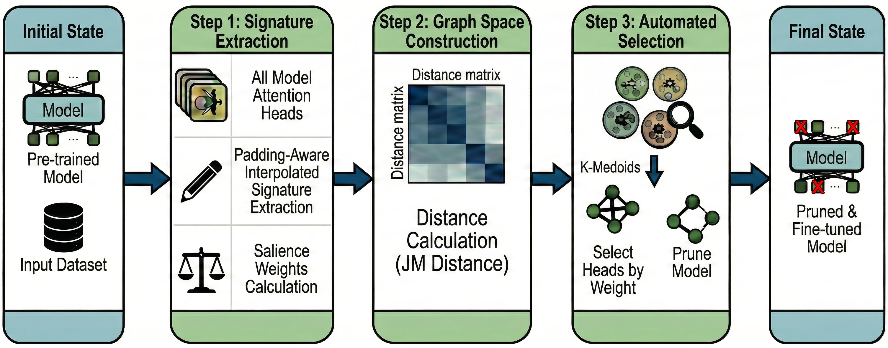
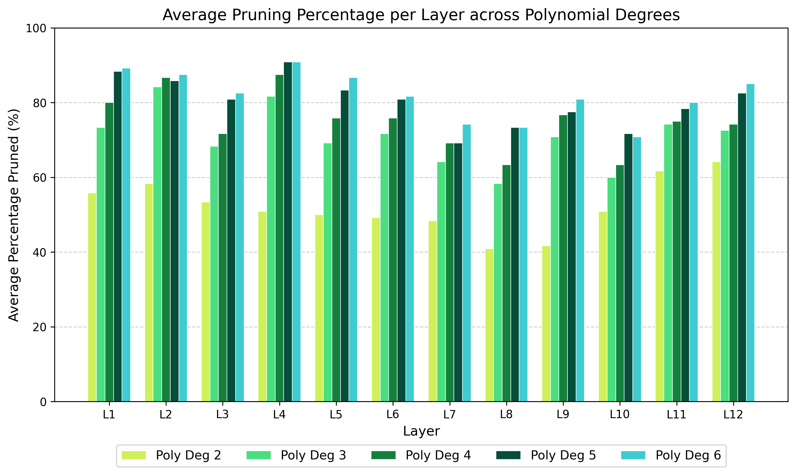
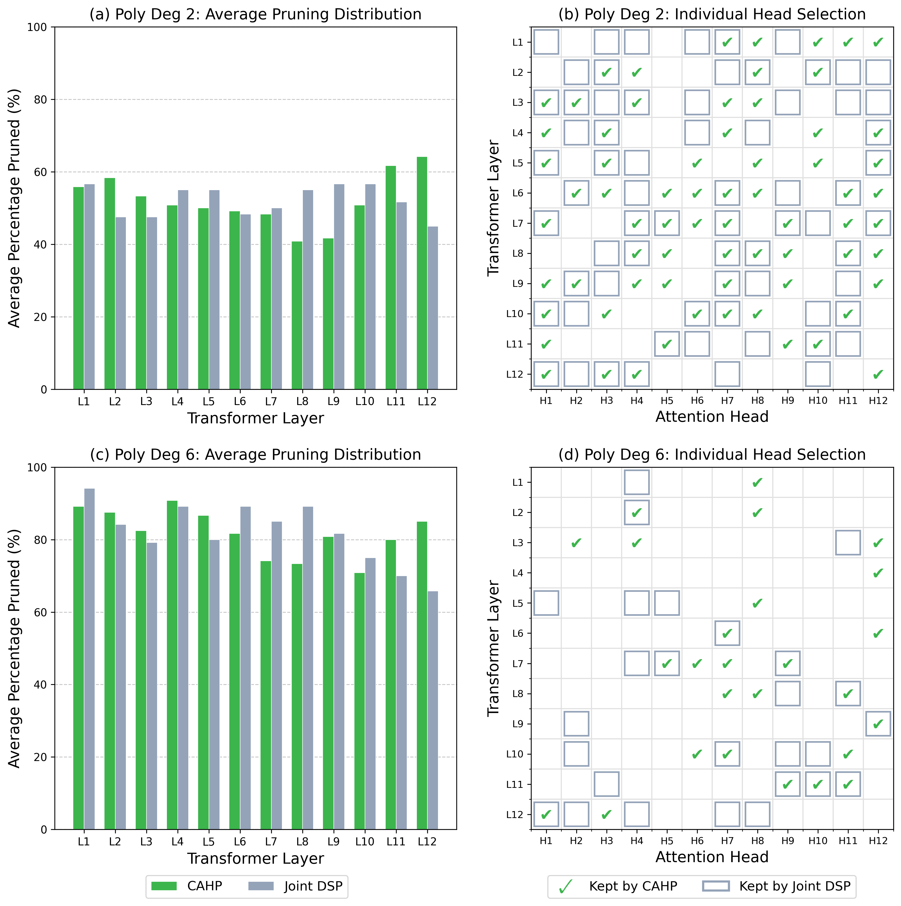
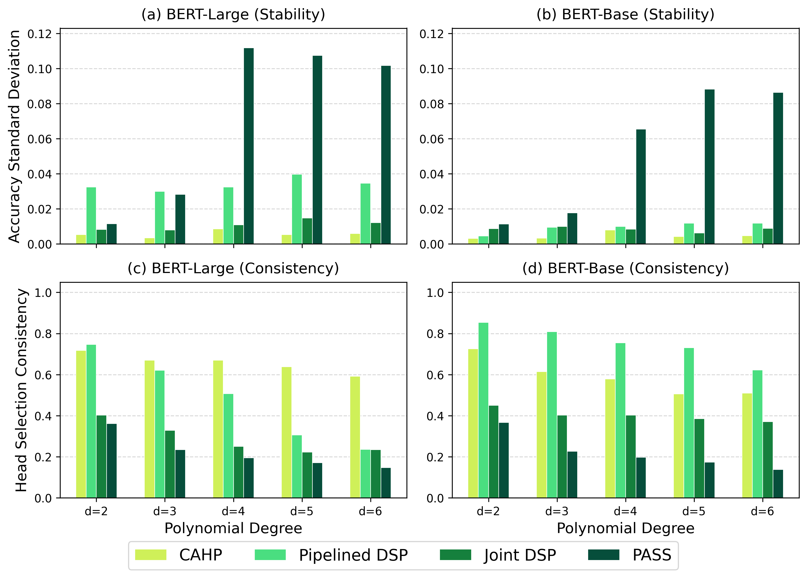

# Complementary Attention Head Pruning for Efficient Transformers

## 摘要

**论文元信息。** 论文标题为 *Complementary Attention Head Pruning for Efficient Transformers*，作者为 Yaniv Livertovsky、Shahar Somin、Gonen Singer，arXiv ID 为 2606.19150，版本为 2026-06-17 发布的 v1，类别为 cs.LG。论文链接为 http://arxiv.org/abs/2606.19150v1，PDF 链接为 https://arxiv.org/pdf/2606.19150v1。论文在正文中声明代码与支持材料公开于 `https://github.com/yanivlivert/cahp`，见 PAGE 2；但本次输入材料没有提供 README、源码文件或可核验的函数行号，因此源码分析证据不足，本文不写代码段。

**一句话总结。** CAHP 将 Transformer attention head pruning 从逐头重要性排序改写为全局图聚类与互补代表选择问题，通过 attention signature、JM distance、MSS knee-point selection 与 salience-weighted representative selection，在无需预设 pruning ratio 的前提下自动保留跨层互补的注意力头，并在 SST-5 与 MNLI 上显示出高压缩率下优于多数基线的稳定性与准确率，见 PAGE 1、PAGE 4、PAGE 6、PAGE 7。

本文的核心贡献可以概括为三点。第一，它把全部注意力头视为统一候选集合，而不是逐层局部剪枝，因此允许模型在不同层之间重新分配容量，见 PAGE 1、PAGE 2、PAGE 3。第二，它不只依据单头重要性，而是通过 class-conditional attention behavior 的统计分离度来构建图空间，从而选择功能互补的代表头，见 PAGE 3、PAGE 4。第三，它用 MSS 曲线与 Kneedle algorithm 自动确定保留头数量 $k^\*$，避免直接指定固定稀疏率，但仍需要选择 polynomial degree $d$ 作为曲线拟合与压缩强度控制变量，见 PAGE 4、PAGE 5。

## 背景与动机

Transformer-based models 的性能提升很大程度来自架构扩展，但扩展也带来参数量、显存占用和部署成本增长。论文在摘要与引言中明确指出，数亿参数级别模型在 resource-constrained hardware 上部署仍是实践障碍，见 PAGE 1。对于小模型与部署方向，这类问题直接对应模型压缩、结构化剪枝和推理成本控制。

结构化剪枝（structured pruning）不同于非结构化权重稀疏化。后者删除单个权重，容易得到稀疏矩阵格式；前者删除完整的神经元、卷积通道或 attention heads，更容易保留硬件友好的 dense matrix computation。论文在相关工作中强调，现代部署通常更依赖 structured pruning 来获得硬件级加速潜力，见 PAGE 2。

在 Transformer 中，多头注意力机制（Multi-Head Attention, MHA）存在显著冗余。论文引用 Michel et al. 与 Voita et al. 的研究，说明许多 attention heads 可以被单独或成组移除而不显著损失准确率，并且注意力头可能承担 positional、syntactic、rare-word processing 等不同功能角色，见 PAGE 2。这为 head pruning 提供了经验基础。

现有 head pruning 方法的关键问题在于选择标准。早期 post-hoc ablation 或 sensitivity heuristic 往往逐头评估，缺少对头与头之间 functional overlap 的建模，见 PAGE 2。若两个头都很重要但功能相似，简单排序可能保留冗余；若某个头单独看梯度不高但与其他头互补，简单排序可能误删它。

优化式方法如 Differentiable Subset Pruning（DSP）和 PASS 将 pruning mask 放入训练目标，用 Gumbel-Softmax 或 hard concrete distribution 学习稀疏结构，见 PAGE 2。这类方法有效，但论文指出其通常需要手动指定 global sparsity target，并且对 temperature schedule、regularization coefficient 等任务相关超参数敏感，见 PAGE 2。

CAHP 的出发点正是这个缺口：部署者不希望通过多轮试错选择 pruning ratio，也不希望剪枝结构因随机门控或局部梯度信号产生不稳定。论文因此提出一种 automated post-hoc pruning framework，把注意力头选择定义为 global graph-theoretical problem，并用 diminishing marginal performance curve 自动确定保留数量，见 PAGE 1。

## 预备知识

令 $F$ 表示一个 Transformer encoder model，$L$ 表示层数，$H$ 表示每层 attention heads 数量。论文定义全局注意力头集合为 $\mathcal{H}=\{h_{1,1}, \ldots, h_{L,H}\}$，总头数为 $N=L \times H$，目标是在数据集 $D=\{(x_i,y_i)\}_{i=1}^{M}$ 上找到子集 $\mathcal{H}^{\*}\subseteq \mathcal{H}$，在减少冗余的同时保持预测性能，见 PAGE 3。

这里 $x_i$ 是输入样本，$y_i$ 是标签，$M$ 是样本数，$C$ 是类别数。$\mathcal{H}^{\*}$ 是剪枝后保留的注意力头集合。人话解释：CAHP 不是问“每一层删几个头”，而是先把全模型所有头放在一个池子里，再选择一组覆盖原模型功能多样性的代表头。

CAHP 继承 Automatic Complementary Separation Pruning（ACSP）的思想，但做了 Transformer 适配。ACSP 原本用于 linear 和 convolutional layers，且按层迭代；CAHP 将其扩展为跨层全局选择，因为 Transformer 的 attention head 总量相对较小，逐层局部聚类不足以稳定识别互补结构，见 PAGE 3。

理解本文还需要区分两个概念：importance 与 complementarity。Importance 关注单个 head 对 loss 或输出的贡献；complementarity 关注一组 heads 是否覆盖不同功能模式。CAHP 的方法论假设是：部署时最值得保留的不是单点得分最高的一批头，而是功能上相互补充、冗余较低的一组头，见 PAGE 1、PAGE 4。

## 方法详解

### 1. 全局候选空间：从 layer-wise pruning 到 global head selection

CAHP 的第一步是收集模型中所有 attention heads，并构造统一 graph space。Algorithm 1 中给出的流程包括：收集 heads、构图、计算 salience weights、遍历 $k=2$ 到 $N$ 做 k-medoids clustering、计算 MSS、用 Kneedle 找到 $k^\*$、在每个 cluster 中选择 salience 最高的代表头、施加 layer-safety constraint、最后 fine-tune，见 PAGE 3。

这一设计与传统 layer-wise pruning 的区别在于，CAHP 不要求每层都按相同或预设比例保留 heads。论文认为功能性注意力头在不同层分布不均，syntactic 或 positional heads 可能集中在特定深度，因此 rigid layer boundary 会限制剪枝质量，见 PAGE 3。

全局视角的直接结果是 cross-layer redistribution。若中间层 heads 对任务更关键，CAHP 可以保留更多中间层 heads，同时更大幅度剪掉早期或末端层 heads。后续 Fig. 2 与 Fig. 3 的结构分析正是为了验证这一点，见 PAGE 6、PAGE 7。

### 2. Attention-specific signature extraction：把 attention map 变成可比较的行为签名

对于输入序列 $x_i$，论文令 $A_{l,h}\in \mathbb{R}^{S\times S}$ 表示第 $l$ 层第 $h$ 个 head 产生的 attention weight matrix，其中 $S$ 是最大序列长度，见 PAGE 3。由于 NLP 输入长度不同，直接比较 $S\times S$ attention map 会被 padding token 干扰。

CAHP 使用 attention mask 将矩阵裁剪为真实序列长度 $S_{\text{real}}\times S_{\text{real}}$，再通过 bilinear interpolation 调整到固定分辨率 $B\times B$，见 PAGE 3。这里 $B$ 是统一后的空间分辨率。人话解释：不同句子长短不同，CAHP 先去掉 padding，再把注意力图缩放到同样大小，避免把“补齐位置”误当成行为模式。

在固定分辨率后，CAHP 对每个 head 与每个类别 $c$ 计算 flattened attention weights 的 class-conditional mean $\mu_{h,c}$ 和 variance $\sigma^2_{h,c}$，见 PAGE 3。$\mu_{h,c}$ 表示该 head 在类别 $c$ 上的平均注意力行为，$\sigma^2_{h,c}$ 表示这种行为的波动程度。若某个 head 对不同类别呈现明显不同的 attention distribution，它更可能携带任务相关信息。

### 3. JM distance：用类别可分性度量 head 行为

CAHP 用 Jeffries-Matusita（JM）distance 衡量 head 在类别对之间的统计分离度。论文先定义 Bhattacharyya distance $B$：

$$
B = \frac{1}{8}\frac{(\mu_1-\mu_2)^2}{\sigma_1^2+\sigma_2^2}+\frac{1}{2}\ln\left(\frac{\sigma_1^2+\sigma_2^2}{2\sigma_1\sigma_2}\right)
$$

见 PAGE 4。这里 $\mu_1,\mu_2$ 是两个类别对应的均值，$\sigma_1,\sigma_2$ 是标准差。人话解释：如果两个类别在某个 head 的注意力行为上均值差异大、方差又相对稳定，则这个 head 对区分类别更有帮助。

JM distance 由 $B$ 得到：

$$
JM = 2(1-e^{-B})
$$

见 PAGE 4。JM distance 是有界分离度指标。论文强调其 saturated behavior 有助于在构建与投影高维特征矩阵时保持数值稳定，见 PAGE 4。人话解释：分离度不会无限增长，因此极端样本不容易支配整个图空间。

对于 $C$ 个类别，类别对数量为：

$$
P=\binom{C}{2}
$$

论文以文字形式定义 $P$ 为 unique class pairs 的数量，见 PAGE 4。人话解释：SST-5 有五个类别时，类别对数量为 10；每个 head 会在这些类别对上形成一组可分性特征。

CAHP 构造全局特征矩阵：

$$
X\in \mathbb{R}^{N\times (B^2\cdot P)}
$$

见 PAGE 4。这里 $N$ 是全模型 attention heads 数量，$B^2$ 来自固定分辨率 attention map 的展平维度，$P$ 是类别对数量。矩阵每一行对应一个 head，包含它在所有类别对上的 JM distance 向量。人话解释：CAHP 把每个头表示为一个“类别区分行为向量”，再比较这些向量之间的相似性。

随后论文使用 t-distributed Stochastic Neighbor Embedding（t-SNE）将高维特征空间投影到低维 manifold，即 graph space，见 PAGE 4。这里的 t-SNE 不是为了可视化展示而已，而是为后续 k-medoids clustering 提供低维拓扑空间。

### 4. MSS 与 Kneedle：自动决定保留多少 heads

CAHP 不要求用户预设 pruning ratio，而是遍历 $k\in\{2,\ldots,N\}$，对 graph space 做 global k-medoids clustering，并计算 Mean Simplified Silhouette（MSS）score，形成复杂度与功能多样性保留之间的曲线，见 PAGE 4。

对每个 head $i$，论文定义 $a(i)$ 为它到所属 cluster medoid $C_h$ 的距离：

$$
a(i)=d(x_i,C_h)
$$

见 PAGE 4。这里 $x_i$ 是 head $i$ 在 graph space 中的位置，$C_h$ 是它所属聚类的 medoid。人话解释：$a(i)$ 衡量这个 head 与本组代表的接近程度，越小表示本组代表越能概括它。

论文定义 $b(i)$ 为 head $i$ 到其他 cluster medoids 的平均距离：

$$
b(i)=\operatorname{avg}_{l\ne h}(d(x_i,C_l))
$$

见 PAGE 4。人话解释：$b(i)$ 衡量这个 head 与其他组代表的距离，越大表示不同组之间区分越清楚。

单个 head 的 MSS 为：

$$
MSS(i)=1-\frac{a(i)}{b(i)}
$$

见 PAGE 4。人话解释：若一个 head 离本组代表近、离其他组代表远，MSS 就高，说明聚类结构较清晰。

全局 MSS index 是所有 $N$ 个 heads 的平均值，见 PAGE 4。CAHP 用 Kneedle algorithm 找到 $MSS(k)$ 曲线的 knee point $k^\*$，即边际收益明显下降的位置。人话解释：当继续增加保留 heads 已经不能显著增加功能覆盖时，CAHP 停止增加模型复杂度。

需要注意的是，CAHP 虽然不要求固定 sparsity target，但实验中使用 polynomial degree $d\in\{2,\ldots,6\}$ 对 Kneedle 曲线拟合进行控制，见 PAGE 5。不同 $d$ 对应不同压缩强度：在 SST-5 上，Poly 2 大约保留 47% heads，而 Poly 6 在 BERT-Large 上只保留约 15.3% heads，见 PAGE 6。因此，CAHP 消除了手动指定“保留多少头”的需求，但并未完全消除所有复杂度控制参数。

### 5. Salience-weighted representative selection：互补聚类后再选重要代表

聚类决定的是“保留多少类行为模式”，但每个 cluster 中还需要选一个代表 head。CAHP 使用 gradient-based head masking 作为 head importance proxy。论文定义 attribution score：

$$
w_{l,h}=E_x\left|\frac{\partial L(x)}{\partial d_{l,h}}\right|
$$

见 PAGE 4。这里 $d_{l,h}$ 是施加在第 $l$ 层第 $h$ 个 head 输出上的 multiplicative mask，$L(x)$ 是样本 $x$ 上的 loss。人话解释：如果遮罩某个 head 会让 loss 对该遮罩非常敏感，则这个 head 的梯度归因分数较高。

论文进一步说明这些 scores 会通过 min-max transformation 归一化到 $[0,1]$，以便跨层比较，见 PAGE 4。这样可以降低不同层梯度尺度差异对选择的影响。

CAHP 的代表选择规则是：在每个 redundancy cluster 中选择 $w$ 最大的 head，见 PAGE 4。这个逻辑把 complementarity 与 salience 分开处理：聚类保证保留 heads 覆盖不同功能模式，salience 保证每个功能组中选出的具体 head 对任务敏感。

### 6. Layer-safety constraint 与 fine-tuning recovery

全局剪枝可能导致某一层所有 heads 都被删除。论文指出，在标准 deep learning framework 中完全删除某层 attention heads 会造成结构失败，因此加入 layer-safety constraint：如果某层被完全剪空，则保留该层 salience score 最高的一个 head，见 PAGE 5。

这一约束的性质是工程安全措施，而不是主要选择目标。它可能使最终保留集合略偏离纯粹的 $k^\*$ 聚类结果，但能避免修改底层模型架构。对于部署来说，这一点重要，因为结构化剪枝若需要重写大量框架代码，会降低方法可用性。

最后，CAHP 对剪枝后的模型进行 targeted fine-tuning，以恢复性能，见 PAGE 5。实验设置中，论文使用 3 epochs、learning rate $2\times 10^{-5}$、linear decay scheduler、10% warmup、weight decay 0.01、maximum gradient norm 1.0，batch size 为 32，见 PAGE 5。人话解释：CAHP 先选择结构，再用短时微调让剩余权重适应新的稀疏结构。

### 7. 方法流程图证据：Figure 1

用途：Figure 1 用于说明 CAHP 的整体 pipeline，从 signature extraction 到 graph space construction，再到 automated selection 与 recovery，直接支撑方法章节的三阶段解释，见 PAGE 4。

读图要点：图中第一阶段对应 padding-aware interpolation 与 salience weighting；第二阶段对应 pairwise JM distances 与 t-SNE graph space；第三阶段对应 MSS、Kneedle、salience-led representatives 与 fine-tuning recovery。该图支撑的判断是：CAHP 不是单一 importance ranking，而是“行为签名 + 图空间 + 自动体积选择 + 代表保留 + 微调恢复”的端到端后处理流程，见 PAGE 4。

## 实验分析

### 实验设置

论文在 SST-5 与 MNLI 上评估 CAHP。SST-5 是五分类情感分类任务，论文认为它对细微语义变化敏感；MNLI 是 natural language inference 任务，报告 dev-mismatched set 结果，见 PAGE 5。SST-5 结果取 10 个 random seeds 平均，MNLI 取 3 个 random seeds 平均，见 PAGE 5。

模型使用 cased BERT-base 与 cased BERT-large。BERT-base 为 $L=12,H=12$，共 144 heads；BERT-large 为 $L=24,H=16$，共 384 heads，见 PAGE 5。论文选择 cased variants 的原因是 capitalization signals 可能包含情绪强度与语义强调信息，见 PAGE 5。

实现细节方面，SST-5 使用 $B=32$，MNLI 使用 $B=48$ 作为 attention matrix interpolation resolution，见 PAGE 5。salience weights 使用 25% training data calibration subset 计算；per-class mean 和 variance profiles 使用 Welford’s algorithm 在线计算，以降低内存占用，见 PAGE 5。

基线包括 Pipelined DSP、Joint DSP、PASS、AttAttr。为公平比较，所有 baseline 被约束保留与 CAHP 选择的相同数量 heads，即相同 $k^\*$，见 PAGE 5。这一点很关键：实验不是比较“谁剪得更多”，而是在相同 head budget 下比较“谁选得更好”。

### SST-5 主结果：Table I

| 模型 | 方法 | Poly 2 | Poly 3 | Poly 4 | Poly 5 | Poly 6 |
|---|---|---:|---:|---:|---:|---:|
| BERT-Large, 384 heads | CAHP | 55.5% | 54.8% | 54.5% | 53.1% | 53.3% |
| BERT-Large, 384 heads | Pipelined DSP | 52.1% | 44.6% | 38.5% | 32.5% | 31.1% |
| BERT-Large, 384 heads | Joint DSP | 54.6% | 54.6% | 53.5% | 53.0% | 52.2% |
| BERT-Large, 384 heads | AttAttr | 51.1% | 40.3% | 35.1% | 33.4% | 31.0% |
| BERT-Large, 384 heads | PASS | 54.6% | 52.2% | 40.0% | 35.7% | 32.2% |
| BERT-Base, 144 heads | CAHP | 52.7% | 52.1% | 51.9% | 51.1% | 51.0% |
| BERT-Base, 144 heads | Pipelined DSP | 52.5% | 47.6% | 45.0% | 39.7% | 38.2% |
| BERT-Base, 144 heads | Joint DSP | 51.0% | 50.0% | 49.5% | 48.6% | 48.4% |
| BERT-Base, 144 heads | AttAttr | 48.6% | 42.8% | 41.3% | 39.0% | 38.1% |
| BERT-Base, 144 heads | PASS | 51.1% | 47.3% | 39.8% | 41.8% | 38.2% |

证据：Table I，见 PAGE 6。Poly 2 到 Poly 6 的平均保留比例分别为：BERT-Large 约 47.0%、28.4%、23.3%、17.8%、15.3%；BERT-Base 约 47.9%、29.3%、25.1%、19.8%、18.1%，见 PAGE 6。

表格解读：SST-5 上，CAHP 在所有 polynomial degrees 与两种模型规模上均为最高或并列接近最高。BERT-Large 未剪枝 baseline 为 56.8%，BERT-Base 未剪枝 baseline 为 53.6%，见 PAGE 5、PAGE 6；在 Poly 6 极高压缩下，CAHP 分别保留约 15.3% 与 18.1% heads，却仍达到 53.3% 与 51.0%。这说明 CAHP 选择出的 heads 对任务性能具有较高覆盖度。相反，AttAttr、Pipelined DSP 和 PASS 在高压缩下大幅退化，尤其 BERT-Large Poly 6 中分别降至 31.0%、31.1%、32.2%，见 PAGE 6。该差异支持论文关于“互补选择比单纯重要性或随机门控更稳定”的判断。

### 层分布证据：Figure 2

用途：Figure 2 用于展示 BERT-Base 在不同 polynomial degrees 下每层 average pruning percentage，支撑 CAHP 是否真的产生非均匀、跨层自适应结构，见 PAGE 6。

读图要点：论文文字解释称，在较低 polynomial degree 如 Poly 2 时，early layers 与 final layers 剪枝更明显，而 intermediate layers，尤其 L8-L9，保留更多 heads；当 degree 增加到 Poly 6 时，分布趋于更均匀，但 intermediate layers 仍较少被剪，见 PAGE 6。该图支撑的判断是：CAHP 并非机械均匀压缩，而是倾向保留中间层功能核心。

### CAHP 与 Joint DSP 的结构对比：Figure 3

用途：Figure 3 用于比较 CAHP 与最强竞争基线 Joint DSP 的 head selection pattern，尤其观察二者是否保留相同子网络，见 PAGE 6、PAGE 7。

读图要点：论文指出，在 Poly 2 下，虽然 CAHP 和 Joint DSP 保留总量相近，但代表 seed 中二者只共享 36 of 69 heads，见 PAGE 6。到 Poly 6 时，重叠进一步下降到 11 of 26 heads，见 PAGE 6、PAGE 7。论文据此认为二者使用了根本不同的重要性标准：Joint DSP 在高稀疏下表现出 proximity bias，容量集中于 final layers L10-L12；CAHP 则保留更多 intermediate layers L7-L9 heads，见 PAGE 6。该图支撑的判断是：CAHP 的优势不只是来自 fine-tuning，而来自结构选择标准本身不同。

### 稳定性与结构一致性：Figure 4

用途：Figure 4 用于检验不同 seeds 下准确率方差与保留 heads 的 Jaccard similarity，支撑 CAHP 的稳定性声明，见 PAGE 7。

读图要点：论文说明 CAHP 在所有 polynomial degrees 与 frameworks 对比中保持较低 accuracy variance；在 high-compression BERT-Large 设置下，CAHP 也保持更高 pairwise Jaccard similarity，见 PAGE 7。该图支撑的判断是：graph-theoretical selection 在 aggressive pruning 下能产生更稳定、功能上更一致的 sparse sub-networks。需要注意，Figure 4 排除了 AttAttr，因为其实现在论文中被称为 inherently deterministic，见 PAGE 7。

### MNLI 结果：Table II

| 模型 | 方法 | Poly 2 | Poly 6 |
|---|---|---:|---:|
| BERT-Large, 384 heads | CAHP | 85.9% | 84.0% |
| BERT-Large, 384 heads | Pipelined DSP | 83.9% | 57.8% |
| BERT-Large, 384 heads | Joint DSP | 85.9% | 84.5% |
| BERT-Large, 384 heads | AttAttr | 85.4% | 48.8% |
| BERT-Large, 384 heads | PASS | 85.4% | 83.3% |
| BERT-Base, 144 heads | CAHP | 83.0% | 81.8% |
| BERT-Base, 144 heads | Pipelined DSP | 81.0% | 72.5% |
| BERT-Base, 144 heads | Joint DSP | 82.8% | 81.2% |
| BERT-Base, 144 heads | AttAttr | 80.1% | 63.5% |
| BERT-Base, 144 heads | PASS | 82.8% | 77.2% |

证据：Table II，见 PAGE 7。Poly 2 与 Poly 6 的平均保留比例为：BERT-Large 45.7% 与 14.8%；BERT-Base 47.2% 与 19.4%，见 PAGE 7。

表格解读：MNLI 上，CAHP 在 BERT-Base 的 Poly 2 与 Poly 6 均为最高；在 BERT-Large Poly 2 与 Joint DSP 并列 85.9%，在 Poly 6 以 84.0% 略低于 Joint DSP 的 84.5%，见 PAGE 7。相对于未剪枝 baseline，BERT-Large 为 86.5%，BERT-Base 为 84.2%，CAHP 在极高压缩下分别损失 2.5 与 2.4 个百分点，见 PAGE 7。这表明 CAHP 不只适用于小型情感分类，也能迁移到句对推理任务；但 MNLI 上 Joint DSP 在 BERT-Large high-compression setting 仍有 0.5 个百分点优势，因此不能简单声称 CAHP 在所有设置中绝对最优。

### 运行时间与实用性：Table III

| 方法 | BERT-Large SST-5 | BERT-Large MNLI | BERT-Base SST-5 | BERT-Base MNLI |
|---|---:|---:|---:|---:|
| CAHP | 10m | 5h 40m | 3m | 2h 2m |
| Pipelined DSP | 3m | 1h 22m | 1m | 27m |
| Joint DSP | 8m | 5h 21m | 3m | 1h 44m |
| AttAttr | 30m | 30m | 5m | 6m |
| PASS | 8m | 5h 38m | 3m | 1h 49m |

证据：Table III，见 PAGE 8。

表格解读：CAHP 的端到端时间与 Joint DSP、PASS 在同一量级，但通常慢于 Pipelined DSP；在 MNLI BERT-Large 上 CAHP 为 5h40m，Joint DSP 为 5h21m，PASS 为 5h38m，见 PAGE 8。论文认为 CAHP 的额外 graph-based selection phase 没有使总成本超出 iterative gating approaches 的量级，见 PAGE 8。但从部署工程角度看，若目标是一次性压缩并反复部署，CAHP 的自动 ratio selection 有价值；若目标是极快得到一个粗略剪枝模型，Pipelined DSP 的时间优势仍然明显。

### 关于消融实验的证据边界

论文没有提供标准意义上的组件消融表，例如分别移除 padding-aware interpolation、JM distance、t-SNE、MSS、salience weighting 或 layer-safety constraint 后的准确率对比。因此，“各组件单独贡献多少”的直接证据不足。论文提供的是 polynomial degree sweep、CAHP 与 baselines 的对照、结构分布分析和稳定性分析，见 PAGE 6、PAGE 7。这些证据支持 CAHP 整体 pipeline 有效，但不足以证明每个子模块都是不可替代的。

## 讨论

CAHP 的适用边界首先是 supervised classification / inference-style evaluation。论文实验覆盖 SST-5 与 MNLI，分别代表单句情感分类与句对自然语言推理，见 PAGE 5、PAGE 7。虽然这两个任务能测试语义分类与推理能力，但它们不能代表 generative modeling、long-context reasoning、多语言迁移或视觉 Transformer 检测任务。

其次，CAHP 的压缩对象是 attention heads，而不是 FFN intermediate dimension、embedding matrix、layer depth 或 KV-cache 结构。对于 BERT encoder 分类模型，head pruning 可以减少部分注意力计算与参数；但在实际硬件上，attention head 删除是否线性转化为 latency 降低，取决于框架是否真正重写矩阵形状、batch size、sequence length、kernel fusion 和硬件调度。论文报告 runtime 是 pruning pipeline 的总时间，不是端侧 inference latency，见 PAGE 8。

第三，CAHP 的“无需预设 sparsity level”应被精确定义。它确实不要求用户输入固定保留比例，并通过 MSS knee point 自动选择 $k^\*$，见 PAGE 1、PAGE 4。但是实验仍评估多个 polynomial degrees $d\in\{2,\ldots,6\}$，而不同 $d$ 对应明显不同的保留比例，见 PAGE 5、PAGE 6、PAGE 7。因此在工程应用中，用户仍需决定使用哪个 $d$ 或为 $d$ 制定策略。

对于视觉模型迁移，CAHP 的思想有启发性：ViT、Transformer detector 或多模态 encoder 也有 attention heads，也存在跨层功能冗余。但论文没有在 CV 模型、检测模型或端侧设备上实验，见 PAGE 5 至 PAGE 8 的实验范围。因此，将其用于 ViT 或检测器时，需要重新验证 attention signature 是否仍适合、类别条件统计是否足够、以及剪枝后的硬件加速是否真实存在。

## 局限分析

作者自述的局限主要出现在结论的 future work 中。论文明确提出未来应扩展到 generative、unsupervised 与 multilingual settings，说明当前评估仍局限于 supervised framework，见 PAGE 8。作者还提出探索 alternative distance metrics 与 clustering methods 以提高效率，并考虑将 complementary selection 集成到训练过程中，而不仅是 post-hoc，见 PAGE 8。

独立判断的第一项局限是缺少组件级消融。CAHP 由 padding-aware interpolation、JM distance、t-SNE、k-medoids、MSS、Kneedle、gradient salience、layer-safety constraint 和 fine-tuning 组成；论文展示了整体效果，但没有逐个组件拆解，见 PAGE 3 至 PAGE 5 的方法描述与 PAGE 6 至 PAGE 8 的实验。若要判断“JM distance 是否优于 cosine distance”或“t-SNE 是否必要”，目前证据不足。

独立判断的第二项局限是部署收益证据不完整。论文的动机是 resource-constrained deployment，见 PAGE 1；实验报告了准确率、保留比例和 pruning pipeline runtime，见 PAGE 6 至 PAGE 8。但没有报告端侧延迟、吞吐、显存峰值、能耗或具体推理加速。对于部署业务而言，head count reduction 不必然等价于 latency reduction，尤其在未重写计算图或硬件 kernel 不匹配时。

独立判断的第三项局限是代码可复核性在本次材料中不足。论文声称代码公开，见 PAGE 2；但本次输入没有提供仓库内容、README、配置文件或源码行号。因此本文无法给出“论文方法 ↔ 源码函数”的对应关系，也不能确认实现是否完全符合论文描述。代码段证据不足，本文不提供伪造源码片段。

## 结论

CAHP 的主要贡献在于把 attention head pruning 从局部重要性排序推进到全局互补选择。它通过 attention behavior signature、JM distance、graph space clustering、MSS knee-point detection 与 salience-weighted representative selection，自动确定保留 heads 的数量与跨层分布，见 PAGE 3、PAGE 4、PAGE 5。

实验上，CAHP 在 SST-5 上跨 BERT-base 与 BERT-large、跨 Poly 2 至 Poly 6 均表现稳定，并在高压缩场景明显优于 Pipelined DSP、AttAttr 与 PASS，见 PAGE 6。在 MNLI 上，CAHP 相对未剪枝模型损失较小，且在 BERT-Base 上优于所有基线；但在 BERT-Large Poly 6 上略低于 Joint DSP，见 PAGE 7。结构分析显示 CAHP 更倾向保留 intermediate layers 的功能核心，避免 Joint DSP 在高稀疏下向 final layers 集中的 proximity bias，见 PAGE 6、PAGE 7。

对于“小模型/部署”方向，这篇论文的业务价值在于提供一种无需手工指定 pruning ratio 的结构化剪枝思路，可启发 BERT 类 encoder 以及潜在的 ViT/Transformer 视觉骨干压缩。但在实际部署前，还必须补充硬件延迟、内存、能耗、CV/检测任务与源码复现实验。就当前论文证据而言，CAHP 是一个方法论清晰、实验结果较强的 NLP Transformer head pruning 框架；它尚不是一个已充分证明端侧收益的通用部署方案。

## 证据索引

| 证据点 | PAGE |
|---|---|
| 论文题目、作者、摘要、核心问题：Transformer scaling 导致资源受限部署困难；CAHP 定义为 post-hoc graph-theoretical head pruning framework | PAGE 1 |
| CAHP 不需要预设 sparsity level / pruning ratio，而是识别 diminishing marginal performance curve；贡献列表 | PAGE 1、PAGE 2 |
| 论文声称代码与支持材料公开于 `https://github.com/yanivlivert/cahp` | PAGE 2 |
| 相关工作：head redundancy、DSP、PASS、Attribution methods、manual threshold 与 hyperparameter 问题 | PAGE 2 |
| 全局 head 集合 $\mathcal{H}$、$N=L\times H$、目标 $\mathcal{H}^{\*}$；Algorithm 1 流程 | PAGE 3 |
| Padding-aware interpolation、attention matrix $A_{l,h}\in\mathbb{R}^{S\times S}$、class-conditional mean/variance signatures | PAGE 3 |
| Figure 1：CAHP pipeline；JM distance Eq. 1、Eq. 2；feature matrix $X$；t-SNE graph space | PAGE 4 |
| MSS/Kneedle、$a(i)$ Eq. 3、$b(i)$ Eq. 4、$MSS(i)$ Eq. 5、salience score $w_{l,h}$ Eq. 6 | PAGE 4 |
| Layer-safety constraint、post-pruning fine-tuning；实验设置、BERT-base/BERT-large、SST-5/MNLI、$B=32/48$、25% calibration、FasterPAM、Kneedle polynomial degrees、baselines | PAGE 5 |
| Table I：SST-5 准确率；Figure 2：BERT-Base 各层剪枝比例；中间层保留更多 heads 的文字解释 | PAGE 6 |
| Figure 3：CAHP 与 Joint DSP 结构对比；Poly 2 共享 36/69 heads，Poly 6 共享 11/26 heads；proximity bias 讨论 | PAGE 6、PAGE 7 |
| Figure 4：稳定性与 Jaccard similarity；Table II：MNLI 准确率；MNLI 未剪枝 baseline 与 CAHP 损失幅度 | PAGE 7 |
| Table III：runtime；CAHP 与 Joint DSP/PASS 同量级，但无需预设 sparsity targets；结论与 future work | PAGE 8 |
