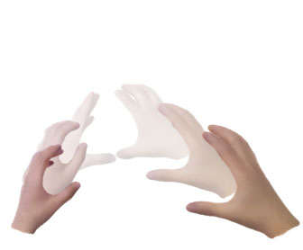
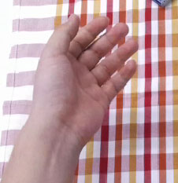
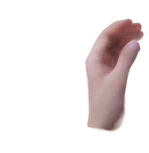

# Hand-4DGS: Feed-Forward 3D Gaussian Splatting for 4D Hand Reconstruction from Egocentric Videos

## 摘要

| 项目 | 内容 |
|---|---|
| 论文 | Hand-4DGS: Feed-Forward 3D Gaussian Splatting for 4D Hand Reconstruction from Egocentric Videos |
| 作者 | Jeongmin Bae, Seoha Kim, Marc Pollefeys, Mahdi Rad, Youngjung Uh, Taein Kwon |
| arXiv | 2606.19156v1 |
| 发布时间 | 2026-06-17 |
| 链接 | http://arxiv.org/abs/2606.19156v1 |
| 代码状态 | 论文材料未给出可确认的公开代码链接；正文只出现 “Project page” 字样但未提供可解析 URL，本文不写源码段，记为“本文未提供可确认的公开代码”（见 PAGE 1） |

一句话总结：Hand-4DGS 是一个面向第一视角视频的前馈式 4D 手部重建框架，用 MANO 网格先验、顶点锚定嵌入和时序卷积预测 3D Gaussian，在无需推理阶段姿态估计器和无需 3D 姿态真值训练的条件下，实现约 60 FPS 的动态双手重建（见 PAGE 1-3）。

本文的核心贡献可以概括为三点。第一，它把 3D Gaussian Splatting（3DGS）从常见的逐场景优化范式转为前馈式预测范式，目标是从单目第一视角视频直接输出动态手部 4D 表示，而不是为每个视频反复优化一套场景参数（见 PAGE 2-3）。第二，它没有直接让网络自由预测所有 Gaussian，而是把 Gaussian 绑定到 MANO 手部网格结构上，通过顶点嵌入与重心插值生成更高分辨率的表面 Gaussian 表征（见 PAGE 5-7）。第三，它用时序卷积层聚合相邻帧视觉 token，缓解逐帧预测造成的 temporal jitter，并在 H2O 与 ARCTIC 两个第一视角双手交互数据集上报告了重建质量、姿态精度和泛化能力的提升（见 PAGE 8-14）。

本文未提供可确认的公开代码。因此，代码分析部分不能给出源码片段或文件路径。后文只依据论文全文中的方法、公式、图表和实验表格进行分析；凡论文材料未给出证据的实现细节，均标注为证据不足。

## 背景与动机

4D hand reconstruction 指的是在时间维度上连续恢复手部三维几何、外观和运动状态。论文将其定位为 AR/VR、AI glasses、机器人操作、telepresence 与 teleoperation 的基础能力，尤其强调第一视角场景可以避免笨重传感器或多相机系统（见 PAGE 2）。对关键点/姿态团队而言，这类工作虽然表面上是 3D/4D 重建，但它把手部姿态、几何、外观和视频时序耦合在同一训练目标中，因此具有明确的迁移价值。

现有 3DGS 手部重建方法在多视角输入下取得了较好效果，但它们通常需要大量视角来消除单目深度歧义。论文指出，已有方法常需要从 20 个视角到超过 120 个视角不等，这直接限制了其在可穿戴设备、第一视角设备和轻量交互系统中的适用性（见 PAGE 2）。换言之，第一视角手部重建的关键矛盾是：真实产品环境只有单个移动相机，但高质量 3D 重建往往依赖多视角约束。

另一类相关方法来自人体 4D 重建，例如 HUGS 和 EVA。它们通常依赖 off-the-shelf monocular body pose estimators，为每帧生成 body mesh，再用 mesh 作为 Gaussian 初始化或约束（见 PAGE 2）。论文认为这一路线不适合第一视角手部重建：第一视角有快速头动、严重自遮挡、有限视角、快速手部运动和双手交互，单目手部估计器在这些情况下容易给出不准确的 mesh 初始化，而初始化误差会传播到 Gaussian 表示，造成不稳定或退化重建（见 PAGE 2）。

前馈式 3D Gaussian 方法提供了另一种方向：用神经网络从图像直接预测 Gaussian 参数，而非对每个场景做迭代优化。论文指出，这类方法具有快速推理和泛化能力，但既有方法主要面向人体静态 avatar 或 sparse-view human reconstruction，并不针对手部快速动态，也往往在训练和推理阶段都依赖姿态估计器（见 PAGE 2）。因此，它们难以直接解决第一视角动态双手重建问题。

Hand-4DGS 的出发点正是上述空白：在单目第一视角视频中，既要保留手部结构先验，又要避免推理阶段依赖姿态估计器；既要有 3DGS 的可微渲染监督，又要能前馈泛化到未见视频。论文明确称其为第一个能直接从 egocentric videos 重建 dynamic 4D hands 的前馈框架（见 PAGE 3）。

从业务角度看，该论文对“关键点/姿态”方向的价值不在于直接替代 2D keypoint 模型，而在于提供一种弱 3D 监督路线：通过 Gaussian splatting 的 2D 图像监督，让模型学习更贴合输入序列的 3D hand reconstruction，并在实验中改善 hand pose estimation（见 PAGE 3、PAGE 12-13）。这一点对缺少昂贵 3D 手部标注、但拥有大量视频或图像监督的数据场景尤其相关。

## 预备知识

### 3D Gaussian Splatting 与前馈预测

3D Gaussian Splatting（3DGS）用一组 3D Gaussian primitives 表示场景。每个 Gaussian 通常包含位置、旋转、尺度、不透明度和颜色。论文在预备部分给出前馈 3DGS 的参数形式：decoder 将图像特征映射到 Gaussian 参数集合 $\{\mu, r, s, \sigma, c\}$，其中 $\mu, r, s \in \mathbb{R}^3$ 分别表示位置、旋转和尺度，$\sigma$ 表示 opacity，$c \in \mathbb{R}^3$ 表示 RGB 颜色（见 PAGE 6）。

这里的关键区别在于“前馈”（feed-forward）。标准 3DGS 往往针对每个场景优化 3D primitives；前馈 3DGS 则训练一个网络，让它从输入图像直接预测 Gaussian 参数，从而可以在未见场景上快速推理（见 PAGE 5-6）。Hand-4DGS 继承这一范式，但把预测对象从一般场景或人体扩展到第一视角动态手部。

论文使用的编码器记为 $\mathrm{Enc}(\cdot)$。对第 $t$ 帧 RGB 图像 $I_t$，编码器独立提取 per-frame feature：

$$
f_t = \mathrm{Enc}(I_t)
$$

其中 $I_t$ 表示第 $t$ 帧输入图像，$f_t$ 表示该帧视觉特征（见 PAGE 6）。通俗地说，这个公式只说明第一步是把每帧图像编码成特征；真正的创新不在这里，而在于后续如何把这些特征变成结构稳定、时间一致的手部 Gaussian。

### MANO 手部模板与网格先验

MANO 是常用的参数化手部模型，可以通过 shape parameters 与 pose parameters 生成手部 mesh。论文使用 MANO 作为结构先验，因为手与一般物体不同，具有稳定的 articulated structure：手指、掌心、关节拓扑在不同个体之间大体一致（见 PAGE 6-7）。这种先验对于第一视角场景尤为重要，因为单目视频存在深度歧义、遮挡和快速运动，仅靠自由 Gaussian 可能难以稳定收敛。

本文中的数学符号 $\beta$ 表示 MANO shape parameters，即手形状参数；$\theta$ 表示 pose parameters，即关节姿态参数；$\tau$ 表示 global translation，即全局平移（见 PAGE 7）。网络先预测这些 MANO 参数，再从 MANO 模型得到手部 mesh vertices $v$，然后把 Gaussian 放置与属性预测建立在 mesh 表面上。

### 第一视角视频重建的特殊困难

第一视角视频的难点不是单一的“视角少”，而是多个因素叠加。论文明确列出 fast head motion、rapid hand dynamics、severe occlusions、single-view ambiguity 等挑战（见 PAGE 1）。这些因素会共同破坏逐帧姿态估计、逐视频优化和自由 Gaussian 表示的稳定性。

因此，Hand-4DGS 的设计可以理解为对三个问题的对应回答：用 mesh-guided representation 处理结构先验不足；用 temporal convolution layer 处理时序抖动；用 feed-forward architecture 处理推理速度和未见视频泛化（见 PAGE 2-5）。

## 方法详解

### 整体任务定义

论文的任务定义是：给定来自第一视角的单目视频序列 $\{I_t\}_{t=1}^{T}$，其中 $T$ 是帧数，目标是预测能够准确表示手部几何和外观的 3D Gaussians（见 PAGE 5）。论文同时说明该设置给定 camera poses，这一点很重要：Hand-4DGS 并不是在完全未知相机运动下同时求解相机轨迹和手部 4D 重建。

与传统逐视频优化方法不同，Hand-4DGS 的 generalized variant 在多序列上训练后，可以对未见目标视频做直接前馈推理（见 PAGE 11、PAGE 14）。这使它更接近产品系统需要的实时推理模型，而不是离线重建 pipeline。

用途：展示论文 PAGE 1 中 Fig.1 的框架概览，说明 Hand-4DGS 的输入、输出和速度主张。

读图要点：该图来自 Fig.1 的提供切片，论文标题区域和总览图共同强调输入为 single-view video，输出为 4D two hands，并标注约 60 FPS（见 PAGE 1）。

支撑的判断：Hand-4DGS 的定位是前馈式第一视角动态双手重建，而非多视角离线优化；这一判断由 Fig.1 caption 与摘要共同支持（见 PAGE 1）。

### 创新点一：Mesh-guided representation

第一个核心创新是 mesh-guided representation。论文指出，手具有一致的 articulated structure，因此可以用 hand template 建模结构先验（见 PAGE 6）。与自由预测每个 Gaussian 不同，Hand-4DGS 先预测 MANO mesh，再在 mesh 顶点和表面上构建 Gaussian 表征。

其流程被论文概括为五步：预测 MANO mesh；在 mesh surface 上通过 vertex embeddings 与 barycentric interpolation 引入 positional embeddings；在 mesh surface 上均匀采样 Gaussians；从 interpolated embeddings 预测 color 和 scale；由 surface normals 设置 rotation（见 PAGE 6）。这个流程体现了“几何由 mesh 管，外观由 embedding 管”的分工。

顶点嵌入的预测公式为：

$$
e_i = \mathrm{MLP}_{emb}(f)
$$

其中 $e_i$ 是第 $i$ 个 mesh vertex $v_i$ 对应的 embedding，$f$ 是 encoder feature（见 PAGE 6）。人话解释：网络不是直接给每个表面点一个完全自由的 latent，而是先在 MANO 顶点上预测结构化 latent。

仅在顶点放置 Gaussian 会限制分辨率，因为 MANO mesh 顶点无法充分表达皮肤纹理和皱纹等细节。为提高表面分辨率，论文在每个 triangular face 内额外采样 $N$ 个 Gaussians，并用三个相邻顶点的 embedding 做重心插值：

$$
\tilde{e} = \mathrm{Interp}(e_i, e_j, e_k)
$$

其中 $\tilde{e}$ 表示采样 Gaussian 的 interpolated embedding，$(e_i, e_j, e_k)$ 是该三角面三个顶点的 embedding（见 PAGE 6）。人话解释：表面任一点的属性 latent 由三角形三个顶点平滑插值得到，因此额外 Gaussian 仍然受 mesh 拓扑约束。

随后，论文用两个轻量 MLP 从插值 embedding 预测 Gaussian color 与 scale：

$$
c = \mathrm{MLP}_{color}(\tilde{e}), \quad s = \mathrm{MLP}_{scale}(\tilde{e})
$$

其中 $c \in \mathbb{R}^{3}$ 是颜色，$s \in \mathbb{R}^{3}$ 是尺度（见 PAGE 6）。人话解释：颜色和尺度由表面位置相关的 latent 决定，使 Gaussian 可以表达局部外观，同时不完全脱离手部结构。

这种设计与逐 Gaussian 自由 embedding 的差异在消融实验中得到验证。Table 4 显示，Vertex Embedding 相比 Per-Gaussian Embedding 在 PSNR、SSIM、MPJPE 和 RA-MPJPE 上均更好，论文解释为逐 Gaussian embedding 自由度过高，会导致 appearance convergence 不理想（见 PAGE 13）。这说明结构约束并非只是先验偏好，而是直接影响优化稳定性和泛化质量。

### 创新点二：显式 Gaussian 几何变换

论文没有让网络完全自由预测 Gaussian position 与 rotation，而是从 predicted mesh 显式计算。Gaussian positions 由三角面三个顶点做 barycentric interpolation 得到；rotations 则由 face normals 转为 quaternions，以计算 Gaussian covariances（见 PAGE 7）。这一步把 Gaussian 几何绑定到手部表面，降低了漂移和不合理几何的风险。

这一设计的意义在于分离“结构”和“属性”。结构部分由 MANO mesh 和表面法线提供，属性部分由 interpolated embeddings 预测 color 与 scale（见 PAGE 6-7）。对第一视角快速手部运动而言，这种分离比完全自由的 Gaussian 参数化更稳，因为它把高维外观拟合限制在一个合理的 articulated hand surface 上。

用途：展示 PAGE 1 中 Fig.1 的第二个提供切片，用作论文总览图的补充视觉证据。

读图要点：该图同属 Fig.1 的页面资源，配合 caption 中 “mesh-guided representation with vertex-anchored positional embeddings” 的描述，强调方法依赖手部结构先验（见 PAGE 1）。

支撑的判断：Hand-4DGS 的重建不是纯图像到 Gaussian 的自由映射，而是通过 mesh-guided representation 捕获 hand appearance 与 complex motion（见 PAGE 1）。

### 创新点三：整体网络从图像预测 MANO 参数、平移和顶点嵌入

论文的整体框架见 Fig.2。给定输入帧 $I_t$，模型先用 pretrained vision foundation model 提取视觉特征，然后通过 temporal convolution layer 融合相邻帧上下文。接着，浅层 MLP 预测 MANO 参数和全局平移（见 PAGE 7）。

MANO 与平移预测公式为：

$$
\{\beta, \theta\} = \mathrm{MLP}_{MANO}(f_t), \quad \tau = \mathrm{MLP}_{trans}(f_t)
$$

其中 $\beta$ 是 shape parameters，$\theta$ 是 pose parameters，$\tau$ 是 global translation，$f_t$ 在论文中表示聚合相邻帧后得到的 temporally-aware features（见 PAGE 7）。人话解释：模型先从时序增强后的视觉特征中估计手的形状、姿态和全局位置，再用 MANO 生成 mesh。

训练时，预测 vertices $v$ 会被 pseudo ground truth vertices 监督，而 pseudo ground truth 来自 off-the-shelf pose estimator HaMeR（见 PAGE 7、PAGE 9-10）。但论文强调推理阶段不需要 pose estimator；这一区分很关键。训练阶段用姿态估计器提供初始几何监督，推理阶段则由网络直接前馈输出（见 PAGE 1-3）。

同时，网络预测 per-vertex embeddings，并通过插值得到 mesh surface 上额外 Gaussian 的 embeddings。插值 embedding 解码出 color 和 scale，position 与 rotation 由 mesh geometry 显式计算。最后，predicted 3D Gaussians 被渲染成图像，以 image supervision 同时优化 mesh vertices 和 Gaussian parameters（见 PAGE 7）。

这里的训练信号构成了一个重要闭环：pseudo vertex supervision 提供早期几何稳定性，image supervision 通过可微 splatting 把重建结果对齐到输入 RGB 序列（见 PAGE 8、PAGE 10）。论文进一步指出，2D image supervision 可改善 hand pose estimation，因为模型被迫学习与输入序列更一致的手部重建（见 PAGE 3）。

### 创新点四：Temporal convolution layer

标准前馈方法通常逐帧独立提取特征，这会造成 temporal jitter。Hand-4DGS 为每一帧聚合时间窗口内的相邻帧特征，公式为：

$$
f'_t = \mathrm{TC}(f_{t-k}, \ldots, f_t, \ldots, f_{t+k})
$$

其中 $\mathrm{TC}$ 表示 temporal convolution operation，$2k+1$ 是时间窗口大小，$f'_t \in \mathbb{R}^{N \times D'}$ 是输出的 temporally consistent features，$D' < D$ 表示降维后的特征维度（见 PAGE 7-8）。人话解释：第 $t$ 帧的预测不只看第 $t$ 帧，还看前后若干帧，从而减少逐帧跳动。

论文在 appendix 进一步说明，特征提取使用 HaMeR 的 pretrained ViT，将 crop 后输入 resize 到 $256 \times 256$，得到 $N_t = 256$ 个 tokens；训练时会预存 hand masks、HaMeR vertices $V_{pseudo}$ 和 image backbone token features $z_t \in \mathbb{R}^{N_t \times D_t}$（见 PAGE 20）。这补充了 Fig.2 中 token features 与 TC layer 的来源。

时序卷积的效果由 Table 5 支撑。去掉 TC layer 后，PSNR 从 24.89 降到 23.75，SSIM 从 0.942 降到 0.933，MPJPE 从 25.22 上升到 26.62，RA-MPJPE 从 14.23 上升到 18.99，Acceleration Error 从 3.08 上升到 5.80（见 PAGE 13）。其中 Acc Err 的变化直接说明逐帧特征会导致 temporal inconsistency。

### 训练目标：vertex、image 与 regularization

Hand-4DGS 的 vertex supervision 公式为：

$$
L_{vert} = \|v - v_{pseudo}\|_1
$$

其中 $v$ 是预测 mesh vertices，$v_{pseudo}$ 是 off-the-shelf pose estimator 给出的 pseudo ground truth（见 PAGE 8）。人话解释：训练早期先让网络预测的手部 mesh 靠近外部估计器输出，以建立基本几何。

Image supervision 结合 L1 loss 与 structural dissimilarity：

$$
L_{img} = \|\hat{I} - I\|_1 + \lambda_{ssim} \cdot D\text{-}SSIM(\hat{I}, I)
$$

其中 $\hat{I}$ 是 Gaussian 渲染图像，$I$ 是真实图像，$\lambda_{ssim}$ 是 D-SSIM 权重（见 PAGE 8）。人话解释：模型既要在像素颜色上接近输入图像，也要在结构相似性上接近输入图像。

Regularization 用于约束 Gaussian scale 并鼓励 opacity 接近 1：

$$
L_{reg} = \lambda_{scale} \sum_i [\max(0, s_{min} - s_i) + \max(0, s_i - s_{max})] + \lambda_{opacity}(1 - \bar{\sigma})
$$

其中 $s_i$ 是第 $i$ 个 Gaussian 的 scale，$\bar{\sigma}$ 是所有 Gaussians 的平均 opacity，$\lambda_{scale}$ 和 $\lambda_{opacity}$ 是权重（见 PAGE 8）。人话解释：scale 不能太小或太大，opacity 则被推向不透明，因为手本身是非透明物体。

总损失为：

$$
L = \lambda_{vert} L_{vert} + \lambda_{img} L_{img} + L_{reg}
$$

其中 $\lambda_{vert}$ 与 $\lambda_{img}$ 分别平衡 vertex supervision 和 image supervision（见 PAGE 8）。人话解释：训练目标由几何伪监督、图像渲染监督和 Gaussian 正则化共同组成。

论文还给出训练调度。主模型训练 1.3M steps；前 1M steps 使用 vertex supervision，之后引入 image supervision；随后 150K steps 中 vertex supervision 权重线性衰减到 0，使模型从依赖伪几何逐渐转向 photometric reconstruction（见 PAGE 10）。这一调度说明作者并未简单叠加监督，而是显式控制训练重心的迁移。

### 与已有方法的差异

与 HUGS、EVA 这类 per-video optimization 方法相比，Hand-4DGS 的 generalized variant 在训练完成后可以对未见视频直接推理。Table 1 显示，500 帧序列上 Hand-4DGS Generalized 的 reconstruction time 为 8.69 秒，而 HUGS 为 15 分钟、EVA 为 24 分钟、Hand-4DGS Per-Video 为 14 分钟（见 PAGE 11）。这一区别不仅是速度差异，也是模型范式差异：前者是 learned feed-forward prior，后者是 target video optimization。

与静态 feed-forward human Gaussian 方法相比，Hand-4DGS 面向视频动态手部，并显式加入 temporal convolution layer（见 PAGE 4-5、PAGE 7-8）。与多视角手部 Gaussian 方法相比，Hand-4DGS 只使用第一视角 RGB frames，并将 MANO annotations 仅用于评估而非训练（见 PAGE 9）。与纯姿态估计器相比，它还通过 differentiable rendering 和 image supervision 让 3D 手部重建与输入图像对齐（见 PAGE 3、PAGE 7-8）。

用途：展示 PAGE 1 中 Fig.1 的第三个提供切片，作为“未见视频泛化”和“无需逐视频重优化”论点的图示证据。

读图要点：Fig.1 caption 写明该框架 reconstructs dynamic 4D hands from challenging single-view egocentric videos at approximately 60 FPS，并强调 generalizes to unseen videos（见 PAGE 1）。

支撑的判断：论文核心主张不仅是重建质量，而且是 feed-forward generalization 与快速 inference（见 PAGE 1、PAGE 11、PAGE 14）。

## 实验分析

### 实验设置

论文在 H2O 和 ARCTIC 两个数据集上评估。H2O 包含第一视角 hand-object interactions，提供 RGB-D sequences、camera poses 和 3D hand poses；论文使用 subject4/h1 作为测试集，其余序列训练，并只使用第一视角 RGB frames（见 PAGE 9）。ARCTIC 包含双手操作 articulated objects 的多视角与 MoCap 数据，论文使用 s01、s08、s09 训练，并从 s05/grab 中选择五个对象保持刚性的测试序列（见 PAGE 9）。

两个数据集都提供 MANO ground truth 3D annotations，但论文明确说明这些 annotations 只用于 evaluation，不用于 training（见 PAGE 9）。这点对理解“without requiring expensive 3D hand pose ground-truth annotations”很关键：训练并不依赖真值 3D 姿态，而是用 HaMeR 产生 pseudo labels，再通过图像监督优化（见 PAGE 1、PAGE 7-10）。

Baselines 选择 HUGS 与 EVA，因为它们是与 monocular videos、3D Gaussians 和 dynamic textured humans 最相关的方法。由于没有直接面向第一视角 feed-forward 4D hand reconstruction 的既有方法，论文将 HUGS 和 EVA 的 body templates 替换为 MANO 以适配手部重建（见 PAGE 9-10）。姿态估计部分还比较 HaMeR，因为 HaMeR 同时是训练 pseudo-label 来源（见 PAGE 10、PAGE 12-13）。

评价指标分为两类。重建质量使用 PSNR 和 SSIM，二者越高越好；手部姿态精度使用 MPJPE、RA-MPJPE 和 Acceleration Error，单位为毫米，越低越好（见 PAGE 10）。其中 MPJPE 衡量全局 joint accuracy，RA-MPJPE 在 root alignment 后衡量局部 joint accuracy，Acc Err 衡量时间一致性（见 PAGE 10、PAGE 13）。

### 主结果：训练视角重建质量与重建时间

| Model | H2O PSNR↑ | H2O SSIM↑ | ARCTIC PSNR↑ | ARCTIC SSIM↑ | Recon. time 500 frames↓ |
|---|---:|---:|---:|---:|---:|
| HUGS | 22.49 | 0.916 | 18.27 | 0.900 | 15 min |
| EVA | 23.56 | 0.925 | 18.41 | 0.895 | 24 min |
| Hand-4DGS Per-Video | 24.66 | 0.939 | 22.68 | 0.933 | 14 min |
| Hand-4DGS Generalized | 24.46 | 0.938 | 22.08 | 0.932 | 8.69 sec |

表格解读：Table 1 的核心不是单一 PSNR 提升，而是“质量接近 Per-Video，时间接近实时”的组合。Hand-4DGS Generalized 在 H2O 上 PSNR 仅比 Per-Video 低 0.20，在 SSIM 上仅低 0.001；在 ARCTIC 上 PSNR 低 0.60，SSIM 低 0.001，但 500 帧重建时间从分钟级降到 8.69 秒（见 PAGE 11）。这说明 generalized feed-forward 模型在未见视频上保留了接近逐视频优化的视觉质量，同时显著降低推理开销。对实时系统而言，这比单纯提高离线 PSNR 更有工程意义。

论文的定性结果也支持该结论。Fig.3 在 H2O 上显示 baselines 在复杂动作下会出现 collapsed geometry 和 artifacts，而 Hand-4DGS Per-Video 与 Generalized 都能保持更准确的结构；Fig.4 在 ARCTIC 上进一步显示，当动作更动态时，baseline failures 更明显，而本文方法保持准确几何（见 PAGE 9、PAGE 11）。由于 figures 列表未提供 Fig.3 和 Fig.4 的图片路径，本文不嵌入这些图，只做文字引用。

### Novel view synthesis：是否真正学到 3D 几何

| Model | PSNR↑ | SSIM↑ |
|---|---:|---:|
| HUGS | 17.09 | 0.826 |
| EVA | 16.61 | 0.828 |
| Hand-4DGS Per-Video | 17.56 | 0.835 |
| Hand-4DGS Generalized | 18.14 | 0.844 |

表格解读：Table 2 评估 novel view image quality，测试对象是 subject4_h1 序列。Hand-4DGS Generalized 在 novel view 上取得最高 PSNR 18.14 和 SSIM 0.844，高于 Per-Video 和两个 baselines（见 PAGE 12）。这说明模型并非只在训练视角拟合手部外观，而是形成了更一致的 3D geometry。论文对 Fig.5 的描述也指出，baselines 在 unseen viewpoints 下难以维持 hand structure，而 Hand-4DGS 能 plausibly preserving hand shape and appearance（见 PAGE 12）。

Novel view 结果对 4D hand reconstruction 尤其重要。若模型只是在输入视角做 image-space 拟合，则换视角渲染时很容易暴露几何错误。Hand-4DGS 在 novel view 指标上的优势，与 mesh-guided representation 的设计目标一致：通过 MANO surface 约束 Gaussian placement，减少过拟合训练视角的可能（见 PAGE 7、PAGE 12）。

### 姿态估计：2D 图像监督能否改善 3D pose

| Model | MPJPE↓ | RA-MPJPE↓ |
|---|---:|---:|
| HaMeR | 37.82 | 15.61 |
| HUGS | 75.95 | 19.35 |
| EVA | 76.11 | 19.39 |
| Hand-4DGS Per-Video | 29.48 | 14.13 |
| Hand-4DGS Generalized | 22.71 | 13.27 |

表格解读：Table 3 的结果值得重点关注。HaMeR 是训练 pseudo-label 来源，但 Hand-4DGS Generalized 的 MPJPE 从 HaMeR 的 37.82 降到 22.71，RA-MPJPE 从 15.61 降到 13.27（见 PAGE 13）。这说明 Hand-4DGS 并非简单复制 HaMeR 输出，而是在 Gaussian rendering 的图像监督和时序建模下进一步优化了手部姿态。相反，HUGS 和 EVA 在 adapted hand setting 中不仅没有改善初始姿态，反而退化到 75mm 以上 MPJPE，说明逐视频优化 baseline 在第一视角双手动态场景中容易把 pose 更新带向错误方向（见 PAGE 12-13）。

对关键点/姿态业务而言，这个结果提示了一条路线：即使训练时只有弱 3D pseudo labels，也可以通过可微渲染的 2D image consistency 反向约束 3D pose。论文明确指出，2D image supervision through Gaussian splatting 可以有效改善 hand pose estimation，而传统手部姿态估计通常依赖昂贵 3D ground-truth annotations（见 PAGE 3）。

### Embedding design 消融

| Embedding design | PSNR↑ | SSIM↑ | MPJPE↓ | RA-MPJPE↓ |
|---|---:|---:|---:|---:|
| Per-Gaussian Embedding | 24.63 | 0.936 | 26.09 | 15.59 |
| Vertex Embedding Ours | 24.89 | 0.942 | 25.22 | 14.23 |

表格解读：Table 4 证明顶点嵌入加重心插值优于逐 Gaussian embedding（见 PAGE 13）。虽然 PSNR 差距只有 0.26，但 SSIM、MPJPE 和 RA-MPJPE 也同步改善，说明该设计不只是视觉纹理层面的微调，而同时改善几何与姿态。论文解释为逐 Gaussian embedding 带来过多自由度，导致 appearance convergence 不佳；Vertex Embedding 则通过 structural constraints 促进 stable convergence（见 PAGE 13）。

这个结果支持本文方法最关键的设计哲学：手部 4D 重建不应把所有自由度交给神经网络，而应把高频外观和低维结构分开处理。对姿态团队而言，这也意味着“mesh prior + differentiable rendering”可能比纯关键点回归更容易在遮挡与快速运动下建立稳定约束。

### Temporal convolution 消融

| Setting | PSNR↑ | SSIM↑ | MPJPE↓ | RA-MPJPE↓ | Acc Err↓ |
|---|---:|---:|---:|---:|---:|
| w/o TC Layer | 23.75 | 0.933 | 26.62 | 18.99 | 5.80 |
| w/ TC Layer Ours | 24.89 | 0.942 | 25.22 | 14.23 | 3.08 |

表格解读：Table 5 直接验证 temporal-aware features 的作用。加入 TC Layer 后，Acc Err 从 5.80 降到 3.08，RA-MPJPE 从 18.99 降到 14.23，同时 PSNR 和 SSIM 也上升（见 PAGE 13）。这说明时序卷积不仅让视觉结果更稳定，也让局部关节结构更准确。论文在 appendix 的 Fig.S2 也指出，没有 temporal-aware features 会出现 severe degradation in hands（见 PAGE 22）。

这一结果对视频姿态建模有直接启发：时序模块不一定需要复杂 Transformer 才能带来收益。论文采用 1D temporal convolution 沿时间轴聚合相邻帧 token features，并同时实现降维（见 PAGE 5、PAGE 7-8）。在端侧或实时系统中，这种轻量时序建模可能比大规模时序注意力更容易落地，但具体端侧性能论文未提供证据，需另行验证。

### Generalization 与 test-time optimization

| Setting | PSNR↑ | SSIM↑ | MPJPE↓ | RA-MPJPE↓ |
|---|---:|---:|---:|---:|
| Per-Video | 24.66 | 0.939 | 26.69 | 16.80 |
| Generalized w/o TTO | 22.59 | 0.925 | 24.84 | 15.48 |
| Generalized w/ TTO | 24.46 | 0.938 | 27.81 | 15.73 |

表格解读：Table 6 显示 generalized model 在不做 TTO 时视觉质量低于 Per-Video，但姿态精度反而更好；加入 500 步 TTO 后，PSNR 和 SSIM 接近 Per-Video，但 MPJPE 变差到 27.81（见 PAGE 14）。这说明 TTO 主要补偿外观质量和 color shift，不一定提升 pose accuracy。论文也明确说 TTO 是 optional stage，用于在需要最高视觉质量时对目标序列 fine-tune appearance，500 steps 少于 30 秒（见 PAGE 14）。

Generalized w/o TTO 的价值在于 zero-shot direct inference。论文称训练好的网络可直接对未见序列输出 accurate hand geometry 与 temporally consistent motion，并用高 SSIM 和低 acceleration error 作为证据（见 PAGE 14）。appendix 进一步补充，generalized model 渲染 H2O 约 1K frames 需要 18 秒；对每个测试场景做 500 次 TTO 在单张 NVIDIA RTX 4090 上少于一分钟（见 PAGE 21）。这些数字说明该方法距离实时或近实时应用更近，但硬件依赖和端侧可行性仍未被论文验证。

用途：展示 PAGE 1 中 Fig.1 的第四个提供切片，作为论文视觉总览的最后一个资源切片。

读图要点：该切片仍属于 Fig.1 资源，需与 caption 一起阅读；caption 明确指出方法不需要 inference 阶段 pose estimator，也不依赖 ground-truth 3D hand pose annotations（见 PAGE 1）。

支撑的判断：Hand-4DGS 的业务意义不只是生成好看的手部渲染，而是提出一种弱 3D 监督、前馈泛化、时序一致的手部重建路线（见 PAGE 1、PAGE 3、PAGE 14）。

### Robustness appendix 结果

| Model | MPJPE↓ | RA-MPJPE↓ | PSNR↑ | SSIM↑ |
|---|---:|---:|---:|---:|
| HaMeR | 37.82 | 15.61 | N/A | N/A |
| WiLoR | 33.86 | 14.80 | N/A | N/A |
| Hand-4DGS w/ HaMeR | 22.71 | 13.27 | 22.80 | 0.931 |
| Hand-4DGS w/ WiLoR | 19.18 | 12.15 | 22.31 | 0.929 |

表格解读：Table S1 表明 Hand-4DGS 对不同 pose estimator 具有一定鲁棒性。无论 pseudo labels 来自 HaMeR 还是 WiLoR，Hand-4DGS 都将 MPJPE 和 RA-MPJPE 降到对应估计器以下（见 PAGE 20）。尤其 WiLoR 设置下，MPJPE 从 33.86 降到 19.18，RA-MPJPE 从 14.80 降到 12.15。视觉质量方面，HaMeR 版本 PSNR/SSIM 略高，WiLoR 版本姿态更准，说明 pseudo label 源会影响重建与姿态之间的平衡。

| Model | MPJPE↓ | RA-MPJPE↓ | PSNR↑ | SSIM↑ |
|---|---:|---:|---:|---:|
| Hand-4DGS w/ GT bbox | 24.84 | 15.48 | 22.59 | 0.925 |
| Hand-4DGS w/o GT bbox | 25.68 | 15.94 | 21.14 | 0.918 |

表格解读：Table S2 检查 detector-based bounding boxes 的影响。去掉 GT bbox 后，MPJPE 从 24.84 上升到 25.68，PSNR 从 22.59 降到 21.14，SSIM 从 0.925 降到 0.918（见 PAGE 20）。性能下降但没有崩溃，说明该框架对 bbox 噪声有一定鲁棒性。不过，论文也承认 detector-based boxes 更不准确且包含 non-negligible failure cases（见 PAGE 19-20），因此真实业务中检测器错误仍可能是系统风险点。

## 讨论

Hand-4DGS 的适用边界首先由输入设定决定：论文任务假设给定 camera poses，并围绕第一视角 RGB 视频重建动态双手（见 PAGE 5）。因此，若业务环境中相机位姿不可用或强噪声，论文没有给出完整解决方案。它也不是一个纯 2D 关键点模型，而是依赖 MANO mesh、Gaussian splatting 和渲染监督的 4D 重建框架。

第二个边界是手部对象交互。H2O 与 ARCTIC 都包含 hand-object interactions，但论文的表示核心是手部本身，结论中明确将“扩展到复杂 hand-object interactions”列为 future work，并认为需要能泛化到多样物体类别且保持一致性的表示（见 PAGE 14）。这意味着本文尚未真正解决手与物体的联合可变形建模、接触约束或物体遮挡下的完整交互重建。

第三个边界是部署成本。论文报告约 60 FPS 与 500 帧 8.69 秒的 generalized reconstruction time，并在 appendix 报告 1K frames 18 秒的渲染速度（见 PAGE 1、PAGE 11、PAGE 21）。但模型包含 pretrained ViT features、MANO MLPs、TC layers 和 Gaussian hands components，训练 generalized model 需要 1.3M steps、约 41 小时；可选 TTO 在 RTX 4090 上少于一分钟（见 PAGE 10、PAGE 21）。因此，对轻量端侧部署而言仍需单独评估模型大小、显存、功耗和延迟。

从方法论上看，Hand-4DGS 的启发在于把 3D pose estimation 与 differentiable rendering 融合。传统姿态估计往往把关键点误差作为主要监督，而本文通过 Gaussian rendering 把 3D 手部预测投影回图像空间，让图像一致性反过来修正手部 mesh 和 pose（见 PAGE 3、PAGE 7-8、PAGE 13）。这对缺少 3D 真值但拥有视频数据的团队具有迁移价值。

## 局限分析

作者自述的局限主要体现在 future work。论文结论明确提出，未来将扩展该框架以建模 complex hand-object interactions，并指出要发展能够泛化到 diverse object categories 且保持 consistency 的表示，这是关键研究方向（见 PAGE 14）。这说明当前 Hand-4DGS 主要解决 dynamic 4D hands，而不是完整的 hand-object joint 4D scene reconstruction。

第二个作者侧限制来自实验设置。论文在 task definition 中说明输入视频给定 camera poses（见 PAGE 5），并在数据集设置中使用 H2O 与 ARCTIC 提供的 camera poses 或多模态数据资源进行评估（见 PAGE 9）。因此，若在真实 AI glasses 场景中 camera pose 来自 SLAM 或视觉惯性系统，位姿误差如何影响 Hand-4DGS，论文没有给出实验证据。

独立判断的第一点局限是对 pseudo labels 的依赖。虽然论文不需要 3D hand pose ground-truth annotations 训练，也不需要 inference 阶段 pose estimator，但训练阶段仍使用 HaMeR 或 WiLoR 生成 pseudo ground truth vertices（见 PAGE 7、PAGE 10、PAGE 20）。Table S1 显示不同 estimator 会带来不同 pose 和 visual quality 结果（见 PAGE 20）。因此，该方法并非完全摆脱姿态估计器，而是把姿态估计器的作用从推理阶段转移到训练伪监督阶段。

独立判断的第二点局限是端侧实时性证据不足。论文报告约 60 FPS 与秒级 generalized reconstruction time，但硬件、模型压缩、移动端 NPU/GPU 延迟、功耗和内存占用没有系统评估（见 PAGE 1、PAGE 11、PAGE 21）。考虑到业务风险中提到 4DGS 链路复杂、可能不适合轻量端侧，这一点不能由论文现有实验直接排除。

独立判断的第三点局限是指标与业务 2D keypoint 指标之间的对应关系仍需验证。论文主要报告 PSNR、SSIM、MPJPE、RA-MPJPE 和 Acc Err（见 PAGE 10-13）。这些指标能说明重建质量、3D 姿态和时间一致性，但未直接报告 2D keypoint accuracy、遮挡关键点召回、交互动作识别收益或下游任务表现。因此，若目标是服务关键点/姿态业务，需要进一步验证 Hand-4DGS 表征是否能稳定提升实际业务指标。

代码层面，本文未提供可确认的公开代码。论文全文材料中没有可解析 GitHub 仓库或源码文件路径，只有 “Project page” 字样但未给出 URL（见 PAGE 1）。因此本文不能给出源码对应分析、代码片段或文件行号；任何实现细节均只能依据论文公式和文字描述，不能替代源码审查。

## 结论

Hand-4DGS 的主要贡献是把第一视角动态手部重建组织成一个前馈式 3D Gaussian Splatting 问题。它用 MANO mesh 提供结构先验，用 vertex-anchored positional embeddings 与 barycentric interpolation 生成表面 Gaussian latent，用 temporal convolution layer 聚合相邻帧特征，并通过 vertex supervision、image supervision 和 regularization 联合训练（见 PAGE 5-8）。实验表明，该方法在 H2O 与 ARCTIC 上相较 HUGS 和 EVA 提升重建质量，在 Hand Pose Estimation 上超过 HaMeR pseudo labels，并在 generalized setting 下显著缩短重建时间（见 PAGE 9-14）。

对关键点/姿态团队而言，这篇论文的最大价值不是一个可直接上线的端侧模型，而是一种值得迁移的训练范式：用结构化手部先验约束 3D 表示，用可微渲染把 2D 图像监督转化为 3D pose refinement，用轻量时序卷积降低视频抖动。其主要风险也清晰存在：训练仍依赖 pseudo pose estimator，camera pose 假设尚需业务验证，复杂 hand-object interaction 仍是 future work，且端侧部署成本缺少证据。基于当前论文证据，Hand-4DGS 更适合作为手部 3D/4D 表征和弱 3D 监督方案的研究参考，而不是直接替换现有 2D keypoint pipeline。

## 证据索引

| 主题 | 关键证据 | 页码 |
|---|---|---|
| 论文任务与主张 | 从 single-view egocentric videos 重建 dynamic 4D hands，约 60 FPS，mesh-guided representation，无推理阶段 pose estimator | PAGE 1 |
| 背景困难 | 第一视角存在 fast head motion、rapid hand dynamics、severe occlusions、single-view ambiguity | PAGE 1-2 |
| 多视角方法限制 | 既有 3DGS 手部方法通常需要 20 到 120+ views，限制 wearable scenarios | PAGE 2 |
| HUGS/EVA 不适配原因 | 依赖 monocular pose estimators 和 per-video optimization，第一视角下初始化误差会传播 | PAGE 2 |
| Feed-forward 方法动机 | 现有 feed-forward Gaussian 方法主要面向人体或静态 avatar，不适合动态手部 | PAGE 2-4 |
| 任务定义 | 给定 $\{I_t\}_{t=1}^{T}$ 和 camera poses，预测手部 3D Gaussians | PAGE 5 |
| Fig.2 框架 | vertex embeddings、temporal-aware features、MANO 参数、Gaussian rendering 的整体 pipeline | PAGE 5 |
| 前馈 3DGS 参数 | Gaussian 参数 $\{\mu,r,s,\sigma,c\}$，encoder 提取 $f_t=\mathrm{Enc}(I_t)$ | PAGE 6 |
| Mesh-guided representation | 预测 MANO mesh，顶点 embedding，重心插值，预测 color/scale，rotation 来自 surface normals | PAGE 6-7 |
| 公式 Eq.1-Eq.3 | $e_i=\mathrm{MLP}_{emb}(f)$，$\tilde e=\mathrm{Interp}(e_i,e_j,e_k)$，$c=\mathrm{MLP}_{color}(\tilde e),s=\mathrm{MLP}_{scale}(\tilde e)$ | PAGE 6 |
| MANO 参数预测 | $\{\beta,\theta\}=\mathrm{MLP}_{MANO}(f_t),\tau=\mathrm{MLP}_{trans}(f_t)$ | PAGE 7 |
| Temporal convolution | $f'_t=\mathrm{TC}(f_{t-k},...,f_t,...,f_{t+k})$，生成 temporally consistent features | PAGE 7-8 |
| 训练损失 | $L_{vert}$、$L_{img}$、$L_{reg}$、总损失 $L$ | PAGE 8 |
| 数据集设置 | H2O 与 ARCTIC 训练/测试划分，MANO annotations 仅用于 evaluation | PAGE 9 |
| Baselines 与指标 | HUGS、EVA、HaMeR；PSNR、SSIM、MPJPE、RA-MPJPE、Acc Err | PAGE 9-10 |
| 训练细节 | 1.3M steps，前 1M vertex supervision，之后 image supervision，vertex 权重衰减 | PAGE 10 |
| Table 1 | H2O/ARCTIC 重建质量与 500 帧 reconstruction time | PAGE 11 |
| Fig.3/Fig.4 | H2O 与 ARCTIC 定性重建对比，baselines 出现 collapsed geometry/artifacts | PAGE 9、PAGE 11 |
| Table 2/Fig.5 | novel view synthesis 结果，Hand-4DGS Generalized PSNR/SSIM 最优 | PAGE 12 |
| Table 3 | Hand pose estimation，Hand-4DGS Generalized 优于 HaMeR、HUGS、EVA | PAGE 13 |
| Table 4 | Vertex Embedding 优于 Per-Gaussian Embedding | PAGE 13 |
| Table 5 | TC Layer 降低 temporal jitter，Acc Err 从 5.80 降到 3.08 | PAGE 13 |
| Table 6 | Generalized、Per-Video 与 TTO 设置对比 | PAGE 14 |
| 作者 future work | 未来扩展到 complex hand-object interactions 和 diverse object categories | PAGE 14 |
| Appendix robustness | HoloAssist in-the-wild，pose estimator choice，detector bbox 鲁棒性 | PAGE 19-20 |
| 实现补充 | HaMeR ViT，$256 \times 256$ crop，$N_t=256$ tokens，预存 masks/vertices/features | PAGE 20 |
| 训练/推理成本 | generalized 训练约 41 小时，1K frames 约 18 秒，500 TTO iterations 少于 1 分钟 on RTX 4090 | PAGE 21 |
| 代码状态 | 论文材料未给出可确认代码仓库；不能写源码分析 | PAGE 1 |
