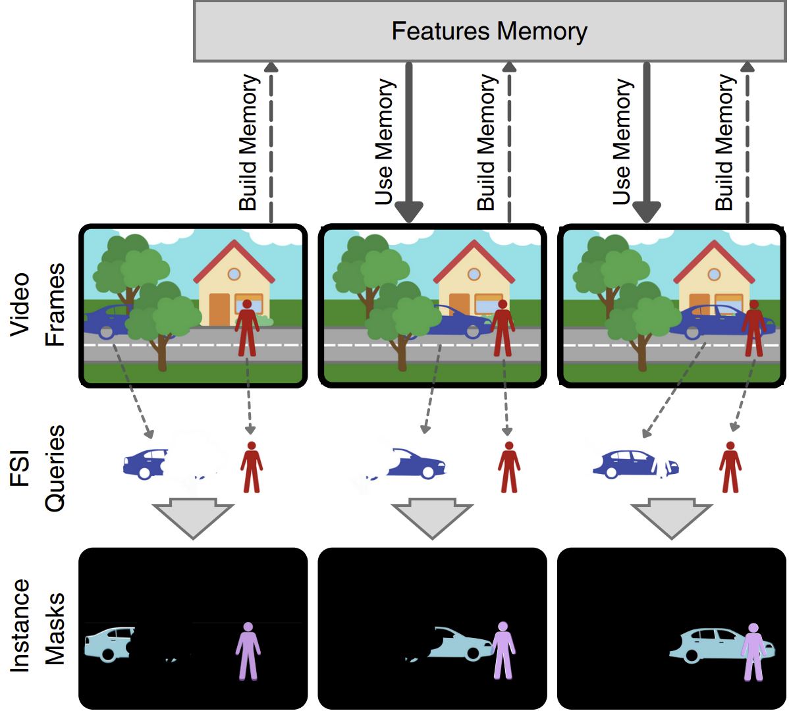
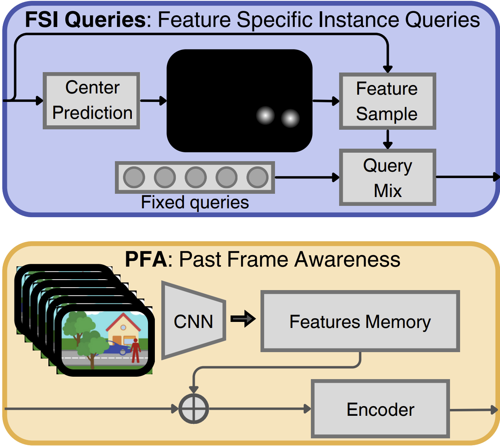

# SA-VIS: Sparse frame Annotations for training Video Instance Segmentation

**论文元信息**

- **标题**：SA-VIS: Sparse frame Annotations for training Video Instance Segmentation
- **作者**：Edoardo Mello Rella, Ajad Chhatkuli, Shipra Jain, Ender Konukoglu, Luc Van Gool
- **arXiv ID**：2606.20140v1
- **发布时间**：2026-06-18
- **论文链接**：http://arxiv.org/abs/2606.20140v1
- **PDF 链接**：https://arxiv.org/pdf/2606.20140v1
- **代码状态**：论文正文未给出可确认的公开代码仓库；题面已知代码链接为“未知”。因此，本文未提供可确认的公开代码，不给出源码片段。

## 摘要

本文提出 SA-VIS，一种面向视频实例分割（Video Instance Segmentation, VIS）的在线模型训练方案，核心目标是在仅有稀疏帧标注的情况下尽可能接近密集帧标注训练的性能。论文的基本判断是：实例在视频中的外观与运动演化并不一定需要每一帧都有监督信号；未标注的过去帧仍可通过低维特征传播为当前帧提供时序上下文。为此，作者提出 Past-frames Feature Propagation（PFP，过去帧特征传播）和 Frame-specific Instance Queries（FSI Queries，帧特定实例查询），在保持在线推理形式和较低训练开销的同时，提高实例匹配与掩码预测质量（见 PAGE 1、PAGE 2、PAGE 4）。

一句话总结：**SA-VIS 通过低维过去帧特征队列和帧特定实例查询，把未标注视频帧转化为可用时序上下文，使在线 VIS 模型在 1/5 帧标注条件下仅损失约 0.4 AP，同时显著优于同类 pairs train 方法。**

该结论有明确实验支撑。论文报告 SA-VIS 在 YouTube-VIS 2019/2021/2022 与 OVIS 上均超过可比的 pairs train 方法；在 YouTube-VIS 2021 上，ResNet50 版 SA-VIS 的 AP 为 48.5，使用 1/5 标注帧的 SA-VIS5 仍有 48.1，仅下降 0.4 AP（见 PAGE 5、PAGE 6、PAGE 7）。在 OVIS 上，SA-VIS 的 AP 为 32.9，超过 IDOL 的 30.2 与 MinVIS 的 25.0（见 PAGE 5）。这些结果说明本文关注的不是单纯提升模型容量，而是降低视频标注密度时如何保留时序学习能力。

## 背景与动机

视频实例分割（VIS）要求在视频序列中同时完成实例级分割与跨帧跟踪，即对所有可数目标生成 mask 并保持实例身份一致。论文指出该任务面向自动驾驶、视频分析、视频编辑和增强现实等应用，但难点在于目标数量不确定、遮挡与重叠频繁、尺度差异大，且视频长度和运动速度变化明显（见 PAGE 1）。

现有 VIS 方法通常分为在线方法（online methods）与离线方法（offline methods）。在线方法按时间顺序逐帧处理，类似摄像头实时输入；离线方法则同时处理整段视频或视频片段，再将片段级结果合并为完整轨迹（见 PAGE 1、PAGE 3）。近年来，在线模型通过强实例表示和跨帧关联，在若干基准上已能超过离线模型；但一些表现较强的在线模型在训练时借鉴离线范式，需要同时优化多帧预测，例如一次训练 8 帧，从而依赖长序列密集标注并增加训练显存与计算成本（见 PAGE 2）。

这正是本文的主要切入点：真实业务中的视频标注成本通常随帧数线性上升，而逐帧像素级实例 mask 的成本尤其高。论文明确指出，大规模视频数据集“extremely expensive to annotate”，而减少标注帧数、降低训练资源需求的 VIS 方案尚未得到足够关注（见 PAGE 1）。因此，SA-VIS 的问题设定具有直接实践价值：如果只标注部分帧，模型能否仍然利用未标注帧中的时序信息？

作者的核心假设是：过去帧即使没有标签，也可以通过编码器产生压缩图像表示，为当前标注帧提供上下文。换言之，监督信号只在稀疏关键帧上出现，但模型仍可在特征层面观察较长时间范围的视觉演化。这与传统密集多帧训练不同，因为 SA-VIS 不要求对所有过去帧计算实例损失，也不需要对多个帧联合监督预测（见 PAGE 2、PAGE 6）。

该工作也不是试图构造复杂的长时记忆或全局视频建模模块。相反，论文反复强调设计的简单性和轻量性：PFP 只存储最深层 backbone 特征经池化与降维后的低维向量；FSI Queries 则通过轻量中心热图检测器为当前帧生成少量帧特定查询（见 PAGE 4、PAGE 5）。这种设计选择使 SA-VIS 更接近可复现、可插拔的工程模块，而不是依赖重型视频 Transformer 的整体替换。

## 预备知识

本文基线来自 IDOL 风格的在线 VIS 架构。输入图像记为 $I$，其中 $I$ 是当前视频帧；论文给出其形状为：

$$
I \in \mathbb{R}^{3 \times H \times W}
$$

这里 $3$ 表示 RGB 通道，$H$ 和 $W$ 分别表示图像高度与宽度。该公式说明 SA-VIS 的基础处理单元仍是单帧图像，而不是整段视频张量（见 PAGE 3）。

CNN backbone 从输入帧提取多尺度特征，随后 DeformableDETR 使用多尺度 self-attention 得到一组特征 $M$。模型使用 $N$ 个可学习 object queries 解码实例嵌入：

$$
E \in \mathbb{R}^{N \times C}
$$

其中 $E$ 表示实例嵌入矩阵，$N$ 是查询数量，$C$ 是通道维度。论文遵循 IDOL，将 $N$ 设为 300。每个实例嵌入用于预测类别、边界框和实例 mask，同时还接入 contrastive embed head 以支持跨帧实例匹配（见 PAGE 3）。

需要区分两类训练设定。论文用 video train 表示需要长视频序列联合训练的方法，用 pairs train 表示只需要单帧或成对标注图像训练的方法（见 PAGE 7）。SA-VIS 属于 pairs train 路线，但通过 PFP 在训练时额外读取未标注过去帧的特征，从而在训练资源与数据标注之间取得折中（见 PAGE 6、PAGE 7）。

## 方法详解

### 1. 基线架构：单帧实例预测与跨帧匹配

SA-VIS 的基础网络每次处理一帧，与在线 VIS 方法保持一致。其 backbone 提取多分辨率特征，DeformableDETR 编码这些特征并生成实例嵌入 $E$，再由 FFN 分别预测类别与 bounding boxes，由 dynamic mask head 预测 1/8 输入分辨率的实例 mask（见 PAGE 3）。

这个基线的关键限制是：如果每一帧几乎独立处理，模型要在单帧外观中学习足够判别的实例特征，再依靠相似性完成跨帧关联。对遮挡、快速运动、相似外观和低分辨率目标而言，这会放大匹配难度。论文相关工作部分也指出，IDOL 通过 contrastive learning 和 optimal transport 学习判别实例嵌入，MinVIS 通过 bipartite matching 进行实例关联，而 CTVIS 通过 memory bank 改善训练一致性，但 CTVIS 需要长标注视频序列联合训练（见 PAGE 3）。

SA-VIS 的策略不是放弃在线框架，而是在保持单帧预测主干的前提下，加入两类信息：一类是过去帧低维特征，用于加强当前帧的上下文；另一类是当前帧实例相关查询，用于让 query 更贴近实际可见目标。Figure 1 对应这一结构设计，图中展示了 Feature Queue、PFP、FSI Queries、固定查询与实例 mask 输出之间的关系（见 PAGE 2）。

**用途**：下图用于定位 SA-VIS 的整体架构，尤其是 Feature Queue 与 FSI Queries 在在线 VIS 管线中的位置。  
**读图要点**：左侧视频帧经过 CNN encoder 形成特征，过去帧特征进入 Feature Queue；当前帧还通过 center prediction 与 feature sample 产生 FSI queries，并与 fixed queries 共同参与实例预测。  
**支撑的判断**：SA-VIS 不是离线整段视频模型，而是在在线模型中增加轻量过去帧上下文和帧特定查询（见 Figure 1，PAGE 2）。

图中“Build Queue / Use Queue”的分离说明 PFP 的核心不是对过去帧产生完整预测，而是把过去帧压缩为可复用的低维上下文。这个设计支撑了论文关于低计算开销的主张，因为 Feature Queue 保存的不是高分辨率特征金字塔，也不是完整实例预测结果，而是经过池化与降维后的特征向量（见 PAGE 4）。

### 2. Past-frames Feature Propagation：用低维过去帧特征补充时序上下文

PFP 的输入来自 backbone 的多尺度特征。论文定义第 $i$ 层特征为：

$$
F_i \in \mathbb{R}^{C_i \times H_i \times W_i}
$$

其中 $F_i$ 是第 $i$ 个尺度的特征图，$C_i$ 为通道数，$H_i$ 和 $W_i$ 为空间尺寸。这个公式说明 PFP 并不直接使用原始图像，而是从编码器特征中抽取更抽象的视觉表示（见 PAGE 4）。

为减少开销，PFP 只使用最深层特征：

$$
F_4 \in \mathbb{R}^{2048 \times H/32 \times W/32}
$$

这里 $F_4$ 的空间分辨率是输入图像的 $1/32$，通道数为 2048。人话解释是：模型选择语义最强、空间尺寸最小的一层特征作为过去帧记忆来源，避免存储高分辨率特征导致显存和计算成本过高（见 PAGE 4）。

随后，$F_4$ 经过 adaptive average pooling 得到 $6 \times 6$ 特征图，再经 FFN 将通道从 2048 降到 256，并加入位置编码，最后展平为空间 token 集合：

$$
H_j \in \mathbb{R}^{36 \times 256}
$$

其中 $H_j$ 表示第 $j$ 帧的压缩图像特征集合，36 来自 $6 \times 6$ 空间位置，256 是降维后的特征维度。这个公式是 PFP 轻量性的关键证据：每帧只保留 36 个 256 维向量，而非完整特征图（见 PAGE 4）。

处理第 $j$ 帧时，模型从 Feature Queue 中取过去 $T$ 帧的特征，并与当前帧特征拼接：

$$
H_{j-T}, \ldots, H_{j-1}, H_j
$$

其中 $T$ 是保留的过去帧数量。论文将 $T$ 固定为 20，以保持设计简单；这些特征在时间轴上拼接，并加入 temporal positional encodings，然后输入 2 层 Transformer encoder，在 $H_i$ 向量之间计算 attention（见 PAGE 4）。

PFP 的输出不是直接给出 mask，而是进一步与当前帧多尺度特征结合。论文描述其做法是在 Transformer encoder 的 self-attention 层之间插入 cross-attention layer，使过去帧特征形成的 embedding 与当前帧多分辨率特征交互，最终得到更丰富的特征 $M$（见 PAGE 4）。因此，PFP 对模型的影响发生在实例查询解码之前，主要改善当前帧表征和后续跨帧匹配。

**用途**：下图补充 Figure 1 中 Feature Queue 与 PFP 模块的结构细节。  
**读图要点**：Feature Queue 存储来自过去帧的低维特征；当前帧处理时使用队列中的历史特征形成上下文。  
**支撑的判断**：PFP 的重点在于低维特征传播，而不是密集帧监督或完整视频联合推理（见 Figure 1，PAGE 2；方法细节见 PAGE 4）。

PFP 的训练机制也体现了稀疏标注目标。训练时除 key-reference 两个标注帧外，还加载 $T$ 个过去帧，这些过去帧不一定有标注，只用于生成 $H_j$ 特征。论文明确指出，为降低训练内存与时间复杂度，用于生成 $H_j$ 的 backbone 不保留梯度，且不会在这些过去帧上运行完整 transformer encoder-decoder（见 PAGE 6）。这使 PFP 能利用未标注帧，却不把训练变成长序列密集监督。

### 3. Frame-specific Instance Queries：让查询与当前帧可见实例相关

Transformer 检测与分割模型通常依赖 object queries。论文指出，这些 queries 被认为编码了图像网格中目标倾向出现的位置，但固定 queries 是否足够高效仍有改进空间。SA-VIS 因此提出 FSI Queries：在固定 $N$ 个 queries 之外，为当前帧中实际可见的实例生成少量帧特定查询（见 PAGE 4）。

FSI Queries 的生成过程以轻量实例中心检测器开始。模型先从多尺度特征 $F_i$ 构造融合特征图 $F_C$，再预测单通道中心热图：

$$
C \in \mathbb{R}^{1 \times H/4 \times W/4}
$$

其中 $C$ 是中心 heatmap，空间分辨率为输入图像的 $1/4$。该公式表示检测器并非输出完整 mask，而是预测实例中心位置；局部最大值给出 $K$ 个检测位置，$K$ 是当前帧检测到的实例数，并且每帧不同（见 PAGE 4、PAGE 5）。

对每个检测位置，模型在各层 backbone 特征 $F_i$ 上采样并拼接，得到 $K$ 个实例相关特征向量，再降到 256 维并加入位置编码。然后，这些向量与原有 $N$ 个 fixed queries 通过 FFN、inner product 和 softmax 产生 mixing weights，输出新的 FSI queries（见 PAGE 5）。

最终 query 集合大小变为：

$$
N + K
$$

其中 $N$ 是固定 query 数量，$K$ 是当前帧生成的 FSI query 数量。论文强调在多数应用中 $K \ll N$，因此额外计算主要来自轻量检测器，而不是 query 数量膨胀（见 PAGE 5）。后续消融进一步报告平均 $K=5.4$，而固定 query 数为 $N=300$，说明 FSI Queries 的性能提升不能简单归因于 query 数量增加（见 PAGE 8）。

FSI Queries 的作用可以概括为：固定 queries 提供通用实例槽位，FSI queries 则将当前帧中已检测到的目标位置和外观信息注入查询集合。对于 VIS，这有两个潜在收益：其一，当前帧 mask 预测更贴近真实可见目标；其二，更稳定的实例嵌入有助于后续跨帧匹配。Table 6 显示，在不同固定 query 数下，加入 FSI Queries 后 AP 保持稳定，并显著优于不加 FSI 的设置（见 PAGE 7、PAGE 8）。

### 4. 损失函数与训练协议

SA-VIS 沿用 IDOL 风格的四类损失：分类损失 $L_{cls}$、框损失 $L_{box}$、mask 损失 $L_{mask}$ 和 embedding 损失 $L_{embed}$。其中 key frame 用于计算实例分割损失，reference frame 只作为 contrastive embeddings 的来源，并与 key frame 一起计算 $L_{embed}$（见 PAGE 6）。

由于 FSI Queries 需要中心检测器，模型额外引入中心热图损失 $L_{center}$。论文给出总损失为：

$$
L = L_{cls} + \lambda_{box}L_{box} + \lambda_{mask}L_{mask}
+ \lambda_{embed}L_{embed} + \lambda_{center}L_{center}
$$

这个公式说明 SA-VIS 的监督项没有为 PFP 单独增加时序预测损失；新增监督只对应 FSI 分支的中心热图。权重设置为 $\lambda_{box}=2.0$、$\lambda_{mask}=2.0$、$\lambda_{embed}=1.0$、$\lambda_{center}=100.0$（见 PAGE 6）。

PFP 不需要自定义 loss。其学习信号来自 key/reference 帧上的下游实例预测与 embedding 匹配目标。论文指出，PFP 与 FSI Queries 合计只增加不到 10% 的训练时间开销，并且 SA-VIS 可以在 2 张 NVIDIA A100 GPU 上训练；相比之下，部分 comparable video train 方法需要 8 张同类型 GPU（见 PAGE 6、PAGE 7）。

### 5. 推理协议：在线顺序处理与 FIFO Feature Queue

推理时，SA-VIS 遵循 IDOL 的在线流程：视频帧按时间顺序处理，实例通过 bi-softmax similarity 进行跨帧匹配（见 PAGE 6）。在此基础上，Feature Queue 随着帧处理逐步构建：每处理一帧，就加入新的 $H_j$，并在超过长度 $T$ 后移除 $H_{j-T}$，即 FIFO buffer（见 PAGE 6）。

这个协议与训练目标一致。模型不需要等待整段视频，也不需要回看未来帧；因此它仍属于在线 VIS 方法。其新增信息只来自过去帧，在实时或半实时场景中更容易部署。性能评估表明，SA-VIS 相对 IDOL 仅从 48M 参数增至 51M，GFLOPs 从 100 增至 109，FPS 从 30 降至 28（见 PAGE 8）。

## 实验分析

### 实验设置概述

论文在 YouTube-VIS 2019/2021/2022 和 OVIS 上评估 SA-VIS。YouTube-VIS 2022 和 OVIS 分别代表长视频与大量遮挡实例的挑战场景；其中 YouTube-VIS 2022 只报告与 YouTube-VIS 2021 不重叠的 long videos 子集 YTVIS22L（见 PAGE 6、PAGE 7）。

评价指标采用 AP 与 AR。论文在报告结果时将方法分为 video train 与 pairs train 两组，以区分是否需要长视频序列联合训练。SA-VIS 同时报告标准密集标注训练结果与稀疏标注版本 SA-VIS5；后者只使用每 5 帧中的 1 帧标注，其余 4 帧视为未标注，只作为过去帧上下文使用（见 PAGE 7）。

实现方面，论文使用 ResNet-50 和 Swin-L backbone，模型预训练于 COCO，并在 YouTube-VIS 与 OVIS 上分别用 2 或 3 张 NVIDIA A100 GPU 训练。YouTube-VIS 训练 12,000 iterations，batch size 为 12；OVIS batch size 为 9；初始学习率 0.0001，在 8,000 iterations 后按 0.1 衰减（见 PAGE 7）。

### 主结果：YouTube-VIS 与 OVIS

| 方法 | 训练类型 | Backbone | YTVIS19 AP | YTVIS21 AP | YTVIS22L AP | 证据 |
|---|---|---:|---:|---:|---:|---|
| IDOL | pairs train | ResNet50 | 49.5 | 43.9 | 证据不足 | PAGE 5 |
| MinVIS | pairs train | ResNet50 | 47.4 | 44.2 | 23.2 | PAGE 5 |
| SA-VIS | pairs train | ResNet50 | 51.2 | 48.5 | 38.6 | PAGE 5 |
| SA-VIS5 | pairs train | ResNet50 | 50.8 | 48.1 | 38.3 | PAGE 5 |
| IDOL | pairs train | Swin-L | 64.3 | 56.1 | 证据不足 | PAGE 5 |
| MinVIS | pairs train | Swin-L | 61.6 | 55.3 | 33.1 | PAGE 5 |
| SA-VIS | pairs train | Swin-L | 64.6 | 60.6 | 45.1 | PAGE 5 |
| SA-VIS5 | pairs train | Swin-L | 64.0 | 60.1 | 44.6 | PAGE 5 |

表格解读：在 ResNet50 设置下，SA-VIS 相比 IDOL 在 YTVIS21 上从 43.9 AP 提升到 48.5 AP，提升 4.6 AP；在 YTVIS22L 上，SA-VIS 达到 38.6 AP，显著高于 MinVIS 的 23.2 AP。更关键的是，SA-VIS5 在只使用 1/5 标注帧时，YTVIS21 AP 为 48.1，相比 SA-VIS 的 48.5 仅下降 0.4 AP。这直接支持论文摘要中“1/5 标注图像仅带来 0.4% 性能下降”的主张（见 PAGE 1、PAGE 5）。

| 方法 | 训练类型 | OVIS AP | AP50 | AP75 | AR1 | AR10 | 证据 |
|---|---|---:|---:|---:|---:|---:|---|
| MinVIS | pairs train | 25.0 | 45.5 | 24.0 | 13.9 | 29.7 | PAGE 5 |
| IDOL | pairs train | 30.2 | 51.3 | 30.0 | 15.0 | 37.5 | PAGE 5 |
| SA-VIS | pairs train | 32.9 | 56.2 | 34.3 | 16.4 | 40.9 | PAGE 5 |
| SA-VIS5 | pairs train | 32.5 | 55.6 | 34.0 | 15.9 | 40.2 | PAGE 5 |
| GenVIS | video train | 35.8 | 60.8 | 36.2 | 16.3 | 39.6 | PAGE 5 |
| GRAtt-VIS | video train | 36.2 | 60.8 | 36.8 | 16.8 | 40.0 | PAGE 5 |

表格解读：OVIS 包含更多中度与重度遮挡目标，因此更能检验跨帧实例匹配能力。SA-VIS 在 pairs train 组中超过 IDOL 2.7 AP，并且 AR10 达到 40.9，略高于 GenVIS 的 39.6 和 GRAtt-VIS 的 40.0。这并不意味着 SA-VIS 全面超过 video train 方法，因为 GenVIS 和 GRAtt-VIS 的 AP 仍更高；但它说明在更低训练标注需求下，SA-VIS 能在召回相关指标上接近或达到强 video train 方法的水平（见 PAGE 5、PAGE 7）。

### 标注稀疏性：SA-VIS 对 1/5 标注较稳健

| 方法 | 稀疏级别 SL | YTVIS21 AP | AP50 | AP75 | AR1 | AR10 | 证据 |
|---|---:|---:|---:|---:|---:|---:|---|
| CTVIS | 1 | 48.3 | 71.4 | 52.4 | 41.8 | 57.5 | PAGE 6 |
| CTVIS | 5 | 47.0 | 69.5 | 51.1 | 41.1 | 56.7 | PAGE 6 |
| IDOL | 1 | 43.9 | 68.0 | 49.6 | 38.0 | 50.9 | PAGE 6 |
| IDOL | 5 | 42.8 | 66.7 | 48.7 | 37.4 | 50.0 | PAGE 6 |
| SA-VIS | 1 | 48.5 | 72.4 | 52.3 | 41.7 | 57.2 | PAGE 6 |
| SA-VIS | 2 | 48.3 | 72.2 | 52.2 | 41.4 | 56.9 | PAGE 6 |
| SA-VIS | 5 | 48.1 | 71.8 | 52.0 | 41.1 | 56.4 | PAGE 6 |
| SA-VIS | 10 | 46.5 | 68.3 | 49.2 | 40.6 | 56.0 | PAGE 6 |

表格解读：SL=5 表示每 5 帧只使用 1 帧标注。SA-VIS 从 SL=1 到 SL=5 仅从 48.5 AP 降至 48.1 AP；即使 SL=10，仍有 46.5 AP，高于 IDOL 密集标注训练的 43.9 AP。该结果是全文最有业务价值的实验信号：在标注预算受限时，SA-VIS 比单纯缩减标注帧更有效，因为它能把未标注帧通过 PFP 变成上下文信息（见 PAGE 6、PAGE 8）。

### 组件消融：PFP 与 FSI Queries 具有互补性

| PFA | FSIQ | YTVIS21 AP | AP50 | AP75 | AR1 | AR10 | 证据 |
|---|---|---:|---:|---:|---:|---:|---|
| 否 | 否 | 43.9 | 68.0 | 49.6 | 38.0 | 50.9 | PAGE 6 |
| 是 | 否 | 46.5 | 70.2 | 51.2 | 39.5 | 54.0 | PAGE 6 |
| 否 | 是 | 45.5 | 68.2 | 50.7 | 35.8 | 55.3 | PAGE 6 |
| 是 | 是 | 48.5 | 72.4 | 52.3 | 41.7 | 57.2 | PAGE 6 |

表格解读：单独加入 PFA/PFP 可将 AP 从 43.9 提升到 46.5，单独加入 FSI Queries 可提升到 45.5；二者同时使用达到 48.5。这个结果表明 PFP 主要改善时序上下文和匹配，FSI Queries 主要改善帧内实例查询质量，二者并非重复贡献。论文也指出 FSI Queries 单独对 AP50 改善不大，但与 PFP 一起使用时整体指标明显提升，说明二者存在互补效应（见 PAGE 8）。

| PFP | Oracle mask 条件下 YTVIS21 AP | AP50 | AP75 | AR1 | AR10 | 证据 |
|---|---:|---:|---:|---:|---:|---|
| 否 | 58.0 | 82.2 | 68.1 | 52.5 | 60.3 | PAGE 8 |
| 是 | 65.0 | 87.4 | 74.2 | 56.1 | 65.8 | PAGE 8 |

表格解读：oracle mask 实验将预测 mask 替换为最匹配的真实 mask，从而更集中地考察跨帧实例匹配能力。PFP 将 AP 从 58.0 提升到 65.0，提升 7.0 AP，说明其贡献不仅来自 mask 质量改善，也显著增强了实例跨帧匹配能力。这是论文支持 PFP 机制有效性的关键消融之一（见 PAGE 8）。

### 查询数量与复杂度

论文通过改变固定 query 数 $N$ 验证 FSI Queries 的收益并非来自单纯增加 query 数。结果显示，在加入 FSI Queries 时，$N=100$、$N=200$、$N=300$、$N=400$ 的 AP 分别为 48.7、48.4、48.5、48.2，整体非常稳定；不加 FSI Queries 时，对应 AP 为 44.9、45.8、46.5、46.2（见 PAGE 7）。这说明 FSI Queries 带来的增益更可能来自“帧特定实例信息”，而不是模型容量。

复杂度方面，SA-VIS 相比 IDOL 的参数量从 48M 增至 51M，GFLOPs 从 100 增至 109，FPS 从 30 降至 28。论文将其描述为 marginal complexity，数值上约为参数 +6%、计算 +9%、速度 -7%（见 PAGE 8）。在考虑其稀疏标注性能收益时，这一开销是相对可控的。

### 定性结果

**用途**：下图展示 SA-VIS 在困难视频场景中的分割和跟踪表现。  
**读图要点**：Figure 2 涵盖快速运动、低分辨率、纹理相近、杂乱背景和遮挡等场景。  
**支撑的判断**：SA-VIS 的定性表现与消融实验一致，即 PFP 与 FSI Queries 有助于在复杂场景中保持 mask 质量和实例身份一致性（见 Figure 2，PAGE 9）。

论文对 Figure 2 的文字说明是：所示视频包含 fast motion、low resolution images、similarly textured and cluttered objects and occlusion；在这些情况下，SA-VIS 生成准确分割 mask 并成功跨帧匹配实例（见 PAGE 9）。这一定性结论与 OVIS 和 oracle mask 消融相互补充。

**用途**：下图继续展示 Figure 2 中的定性样例。  
**读图要点**：重点观察同一实例在连续帧中的颜色/标识是否保持一致，以及遮挡或背景混乱时 mask 是否漂移。  
**支撑的判断**：论文声称 SA-VIS 在 challenging scenes 中能生成准确分割并完成实例匹配；该图是该主张的视觉证据，但不能替代定量 AP/AR 结果（见 Figure 2，PAGE 9）。

需要强调的是，定性图只能说明若干样例中的可视化表现，不能单独证明泛化能力。本文对 Figure 2 的使用应与 Table 1、Table 2、Table 5、Table 7 联合解读：定量结果证明整体性能，定性图帮助理解模型在哪些视觉挑战中表现合理（见 PAGE 5、PAGE 6、PAGE 8、PAGE 9）。

## 讨论

SA-VIS 的适用边界首先由其在线设计决定。它只使用过去帧，不依赖未来帧，因此更适合需要流式处理或低延迟处理的视频理解系统。对于离线全视频分析，如果允许访问完整视频并有充足计算资源，长时全局建模方法仍可能在某些场景取得更高 AP；论文中的 OVIS 结果也显示，GenVIS 与 GRAtt-VIS 在 AP 上仍高于 SA-VIS（见 PAGE 5）。

其次，SA-VIS 的主要价值出现在标注稀缺或训练资源有限的条件下。若业务已经拥有高质量密集帧标注并可承担长序列训练成本，SA-VIS 的优势会变成较小开销下的工程简化；但若标注预算紧张，Table 5 中 SL=5 仅损失 0.4 AP 的结果就具有较强吸引力（见 PAGE 6）。这也是其与视频自动标注、半自动标注和长视频数据生产管线相关的原因。

未解决的问题包括：PFP 使用固定长度 $T=20$ 的 FIFO 过去帧队列，未对长时遮挡、目标重新出现、场景周期性回归做自适应检索；FSI Queries 依赖轻量中心检测器，若检测器漏检，则对应实例可能无法获得帧特定 query。论文在 FSI 分析中也报告，当排除 center heatmap 未检测到的实例时，FSI query 进入 top-10 匹配预测的比例从 82% 上升到 96%，这反过来说明中心检测召回率会影响 FSI 分支上限（见 PAGE 8）。

从方法学看，SA-VIS 的启示是：稀疏监督不一定只能通过伪标签或半监督训练解决，也可以通过“未标注帧特征参与、未标注帧预测不监督”的方式引入时序信息。这一设计避免了伪标签噪声传播，同时比密集视频训练更轻量。但该路径是否能推广到更强 backbone、更大视频集合、开放词汇视频分割或交互式视频标注，还需要后续实验证据。

## 局限分析

作者自述的局限主要集中在长视频记忆选择和 query 设计两方面。论文在 Limitations and Future Works 中指出，对于相似场景在远距离时间步重复出现的长视频，固定过去帧队列可能不足，未来可以使用可变且自适应的 past frame selection（见 PAGE 9）。这意味着当前 FIFO 式 PFP 在长时依赖上存在天然边界：它能利用最近 20 帧上下文，但未显式检索更远历史。

作者还指出，如果 FSI query 分支中存在强实例检测器，高数量固定 queries 可能并非必要。一个未来方向是使用高召回检测器，即使引入更多 false positives，也尽量保证每个实例都有对应 FSI query，从而降低计算并简化匹配任务（见 PAGE 9）。这说明当前 SA-VIS 仍保留 $N=300$ fixed queries，并未完全依赖帧特定实例查询。

独立判断上，第一项局限是代码与复现证据不足。论文正文没有提供可确认官方代码仓库，题面已知代码链接也为未知。因此，本文不能验证 PFP、FSI Queries、训练冻结策略、Feature Queue 更新和 bi-softmax matching 在真实实现中的细节，也无法确认不同数据集上的超参数是否完全一致。对于需要快速业务落地的团队，这会增加复现风险。

第二项局限是实验虽然覆盖 YouTube-VIS 与 OVIS，但尚未证明 SA-VIS 在更大规模、更多类别、更长视频或开放世界视频数据中的稳定性。论文自己也把“应用到 very large sparsely annotated datasets”列为未来方向（见 PAGE 9）。因此，不能直接把 1/5 标注帧仅损失 0.4 AP 的结论外推到所有业务视频；该结论目前主要由 YouTube-VIS 2021 等基准上的设置支撑（见 PAGE 6、PAGE 7）。

第三项局限是 PFP 的低维特征压缩可能对长时遮挡和细粒度外观变化不够充分。每帧压缩为 $36 \times 256$ 的特征集合有利于低开销，但也可能丢失小目标、局部形变或精细边界信息。论文 Table 7 证明 PFP 提升匹配能力，但没有进一步分解遮挡长度、目标大小、运动速度对 PFP 的影响（见 PAGE 4、PAGE 8）。因此，在长时遮挡稳定性方面仍需更细粒度评估。

## 结论

SA-VIS 的贡献可以归纳为两点。第一，PFP 将未标注过去帧压缩为低维 Feature Queue，并通过 Transformer attention 注入当前帧表征，使在线 VIS 模型能够在稀疏标注条件下利用时序上下文。第二，FSI Queries 通过中心热图检测与特征采样生成帧特定实例查询，补充固定 object queries，提高当前帧实例预测质量，并与 PFP 在消融中表现出互补性（见 PAGE 4、PAGE 5、PAGE 6）。

从实验结果看，SA-VIS 最重要的信号不是单一 SOTA 数字，而是稀疏标注稳定性：在 YouTube-VIS 2021 上，SA-VIS 从密集标注到 1/5 标注仅下降 0.4 AP，同时仍明显强于 IDOL 与 MinVIS 等 pairs train 方法（见 PAGE 5、PAGE 6）。这使它对视频标注成本敏感的场景具有研究与工程价值，尤其适合关注视频分割、视频检测跟踪和自动标注数据生产的团队。

但当前结论仍需谨慎使用。本文没有可确认公开代码，长时自适应记忆、更强 FSI 检测器、更大规模稀疏标注数据集仍是未来工作。对于小规模复现，建议优先验证三个关键点：PFP 的 Feature Queue 是否能稳定提升匹配 AP，FSI Queries 是否在目标漏检时退化可控，以及不同稀疏级别下 AP 是否保持类似 Table 5 的缓慢下降趋势。

## 证据索引

| 证据点 | PAGE |
|---|---|
| 论文任务、摘要、PFP/FSI Queries 总体贡献、1/5 标注仅约 0.4 性能下降 | PAGE 1 |
| Figure 1 架构图；在线模型训练密集帧成本；SA-VIS 贡献列表；未标注过去帧作为上下文 | PAGE 2 |
| 在线/离线 VIS 相关工作；IDOL、MinVIS、CTVIS、GRAttVIS 等背景；基线 DeformableDETR 结构；$I \in \mathbb{R}^{3 \times H \times W}$、$E \in \mathbb{R}^{N \times C}$、$N=300$ | PAGE 3 |
| PFP 方法细节；$F_i$、$F_4$、$H_j$、$H_{j-T},\ldots,H_j$；$T=20$；cross-attention 融合 | PAGE 4 |
| Table 1、Table 2 主结果；FSI Queries 生成流程；中心热图 $C$；$N+K$ queries | PAGE 5 |
| Table 4 网络组件消融；Table 5 标注稀疏性；总损失公式；训练和推理协议；PFP 不增加自定义 loss | PAGE 6 |
| 数据集、指标、SA-VIS5 定义；实现细节；主结果文字解读；Table 6 查询数量 | PAGE 7 |
| Table 7 PFP oracle mask 匹配实验；Table 8 复杂度；PFP/FSI Queries 消融解释；$K=5.4$ 与 FSI top-k 分析 | PAGE 8 |
| Figure 2 定性结果；Limitations and Future Works；Conclusion | PAGE 9 |
| 参考文献列表，支持相关工作出处 | PAGE 10-12 |
