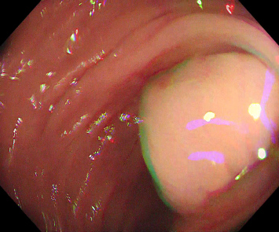
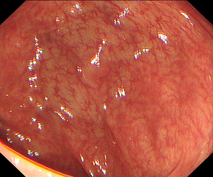
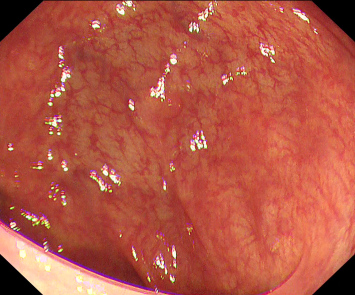
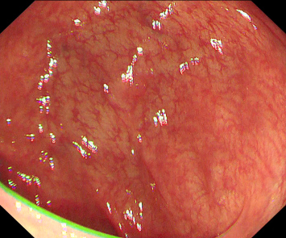

# ARTEMIS: Agent-guided Reliability-aware Temporal Mask Evolution for Imperfectly Supervised Video Polyp Segmentation

## 论文元信息

| 项目 | 内容 |
|---|---|
| 标题 | ARTEMIS: Agent-guided Reliability-aware Temporal Mask Evolution for Imperfectly Supervised Video Polyp Segmentation |
| 作者 | Tong Wang, Siwen Wang, Yaolei Qi, Jinxing Zhou, Yuting He, Guanyu Yang, Yutong Xie |
| arXiv ID | 2606.20161 |
| 版本时间 | 2026-06-18 |
| 类别 | cs.CV |
| 论文链接 | http://arxiv.org/abs/2606.20161v1 |
| PDF | https://arxiv.org/pdf/2606.20161v1 |
| 代码状态 | 论文摘要声明代码将发布于 https://github.com/wangtong627/ARTEMIS；在给定全文材料中未提供可确认的公开源码内容，因此本文未提供代码段分析。见 PAGE 1。 |

## 摘要

ARTEMIS 面向不完美监督视频息肉分割（imperfectly supervised video polyp segmentation, imperfectly supervised VPS），试图用点标注、涂鸦标注或少量密集帧标注，训练出稠密且时序一致的息肉掩码。论文的核心思想不是直接接受 SAM2 生成的伪标签，也不是用固定阈值粗暴过滤伪标签，而是先用视觉语言 agent 判断哪些帧可以作为可靠时序锚点，再用 SAM2 进行双向时序传播，最后用可靠性感知的鲁棒学习机制训练分割器。该设计针对论文指出的三类问题：伪掩码几何退化、伪标签未充分利用时序传播、伪监督缺乏可靠性建模。见 PAGE 1-2。

一句话总结：ARTEMIS 将低成本标注转化为可靠时序锚点，并通过“agent 筛选 + SAM2 双向传播 + 可靠性感知训练”完成视频伪标签闭环，使弱监督和半监督 VPS 能在统一框架下获得更稳定的分割结果。见 PAGE 2-6。

## 背景与动机

结直肠癌是全球第三常见癌症，通常由结肠黏膜上的息肉发展而来；尽管结肠镜是筛查金标准，但论文引用的背景指出超过 25% 的息肉可能被漏检，因此自动息肉分割具有明确临床价值。视频息肉分割（video polyp segmentation, VPS）相比静态图像分割更强调帧间定位和跟踪线索，对计算机辅助结肠镜检查具有直接意义。见 PAGE 1。

VPS 的困难首先来自视觉特性。论文在 Fig. 1 中总结了低前景-背景对比、运动模糊、尺度变化和部分遮挡四类挑战。息肉区域往往与周围黏膜在颜色、纹理和边界上高度相似，这会导致漏分割、过分割或跨帧漂移。换言之，VPS 不只是“单帧看清楚”的问题，还涉及在低对比、动态干扰下维持目标身份和边界稳定性。见 PAGE 1。

用途：下图用于呈现论文 Fig. 1 中 VPS 的典型视觉困难，特别是低对比、运动模糊、尺度变化和遮挡带来的分割不确定性。  
读图要点：应关注息肉与周围黏膜之间的边界不清、目标外观变化以及局部遮挡如何影响模型判断。  
支撑的判断：ARTEMIS 需要可靠性筛选和时序传播，并非仅依赖单帧伪标签，是由这些视觉困难直接驱动的。见 PAGE 1。

图后说明：该图支撑论文对 VPS 视觉挑战的设定。由于息肉边界和背景黏膜高度相似，直接从点或涂鸦恢复完整掩码容易产生边界泄漏或结构缺失，因此后续的 agent 锚点选择与可靠性感知训练具有必要性。见 PAGE 1-2。

监督成本是第二个瓶颈。论文给出一个具体量化例子：30 fps 的 30 秒视频包含 900 帧，如果每帧标注耗时 5 分钟，则需要 75 小时完成密集像素级标注。相比之下，点标注约需 2 秒/帧，涂鸦约需 10 秒/帧，因此弱监督或少量密集帧的半监督设置更符合真实标注预算。见 PAGE 1。

现有弱监督分割方法通常依赖特征变换、标注扩展或针对稀疏标签设计损失；半监督方法则多采用 teacher-student consistency、mutual correction 或 cross-view learning。论文认为这些路线通常分别处理弱监督和半监督，而没有在统一的 imperfect supervision 框架下解决视频息肉分割。对于临床视频数据而言，一个数据集可能同时包含稀疏标签和部分密集标签，因此统一建模更符合真实数据组织方式。见 PAGE 1-2。

Foundation model 尤其是 SAM 和 SAM2 提供了从稀疏 prompt 生成密集掩码的能力，但论文明确指出，直接用 SAM2 伪标签替代缺失标注并不足够。原因包括：从点或涂鸦生成的伪掩码可能在低对比和模糊帧上发生边界泄漏；许多 SAM-based 方法停留在图像级或单次伪标签生成，未充分使用 SAM2 的视频时序记忆；基于面积、置信度或固定阈值的启发式过滤可能丢弃困难但有价值的样本，或把噪声样本当作等权监督。见 PAGE 2。

因此，ARTEMIS 的出发点可以概括为“complete-then-learn”：先把稀疏或缺失监督补全成更时序一致的伪掩码，再让最终分割器在可靠性约束下学习。论文 Fig. 2 将 ARTEMIS 与以往范式对比：以往方法倾向于 heuristic filtering，而 ARTEMIS 在 Stage 1 做 agent-guided bidirectional mask evolution，在 Stage 2 做 reliability-aware robust learning。见 PAGE 2-3。

## 预备知识

本文的第一个关键概念是“时序锚点”（temporal anchor）。在 SAM2 视频推理中，被 prompt 的帧会进入 temporal memory bank，并影响后续帧的掩码传播。论文的 Observation 2 显示，如果在困难帧注入高质量 dense mask prompt，其收益可以扩展到后续五帧；这说明可靠 prompt 不只是单帧修正，而可以作为时序传播的锚点。见 PAGE 3。

第二个关键概念是“可靠性”（reliability）。在 ARTEMIS 中，可靠性既出现在 Stage 1 的 agent anchor selection，也出现在 Stage 2 的 frame-level quality score、pixel-level reliability map 和 judge weight 中。其目标不是简单丢弃所有低质量样本，而是在训练损失中降低不可靠区域或帧的权重，从而保留困难样本中的有效信息。见 PAGE 4-6。

第三个关键概念是 Reference Prototype Transport Module（RPTM，参考原型传输模块）。RPTM 从可靠参考帧中提取目标身份 token，再把这些身份信息传输到目标帧，用于缓解息肉与背景黏膜外观相似导致的时序漂移。它不是单纯的帧间平滑，而是以 reference identity 为条件，增强与参考目标一致的区域响应。见 PAGE 5-6、PAGE 12。

## 方法详解

### 1. 总体框架：complete-then-learn

ARTEMIS 分为两个阶段。Stage 1 首先从已有监督中生成 coarse mask：对于弱监督，点或涂鸦被送入 SAM2 转化为粗密集掩码；对于半监督，已有密集标注直接作为可靠锚点。随后，框架选择或定义可靠 anchor，并通过 SAM2 双向传播得到 evolved pseudo masks。Stage 2 则使用可靠性引导的参考帧选择、RPTM 和可靠性感知鲁棒损失训练最终分割器。见 PAGE 3。

形式上，视频表示为 $\{I_t\}_{t=1}^{T}$，其中 $I_t \in \mathbb{R}^{3 \times H \times W}$ 表示第 $t$ 帧图像，$T$ 为帧数，$H$ 和 $W$ 分别为图像高和宽。初始 coarse mask 表示为 $M_t^c \in [0,1]^{H \times W}$。这个符号定义说明 ARTEMIS 的输入对象是完整视频序列，而不是彼此独立的单帧图像。见 PAGE 4。

Stage 1 和 Stage 2 的关系很重要。Stage 1 负责提高伪标签的时序质量，但论文承认 evolved masks 仍可能包含边界错误、泄漏或不完整区域；Stage 2 因此进一步通过可靠性建模降低残余噪声对训练的影响。也就是说，ARTEMIS 没有把 SAM2 传播结果视为完美标签，而是把它作为带可靠性权重的训练信号。见 PAGE 5-6。

### 2. Observation 1：dense mask prompt 比 sparse point 更适合弱判别目标

论文首先用一个离线观察实验说明 dense mask prompt 的价值。实验在 SUN-SEG 子集上进行，包含 10 个结肠镜视频和 1,478 个匹配帧；ground truth 仅用于诊断实验合成噪声掩码和计算 Dice/MAE，不用于 ARTEMIS 训练。噪声掩码通过随机膨胀/腐蚀和仿射扰动从 ground truth 合成，扰动比例 $\beta$ 表示 changed-pixel proportion。见 PAGE 3。

Table I 的结果显示，Sparse Point 的 Mean Dice 为 71.8%，Mean MAE 为 13.7%；即使是 Heavy Noisy Mask（$\beta=0.6$），Mean Dice 仍达到 74.3%，Mean MAE 降至 3.1%。Light Noisy Mask（$\beta=0.2$）则达到 88.3% Dice 和 2.3% MAE。论文据此认为，对于弱判别息肉，近似区域支持比孤立点提示更能提供形状和边界先验。见 PAGE 3。

| Prompt Type | Mean Dice (%) ↑ | Mean MAE (%) ↓ | 证据 |
|---|---:|---:|---|
| Sparse Point | 71.8 | 13.7 | Table I, PAGE 3 |
| Light Noisy Mask ($\beta=0.2$) | 88.3 | 2.3 | Table I, PAGE 3 |
| Moderate Noisy Mask ($\beta=0.4$) | 81.3 | 3.0 | Table I, PAGE 3 |
| Heavy Noisy Mask ($\beta=0.6$) | 74.3 | 3.1 | Table I, PAGE 3 |

表格解读：这个观察实验不直接证明 ARTEMIS 的最终训练效果，但它支撑了论文的一个关键设计选择：弱监督阶段不应长期停留在点或涂鸦形式，而应先转换为 dense coarse masks，再对这些 masks 做选择、传播和 refinement。尤其是 Heavy Noisy Mask 仍优于 Sparse Point，说明即使 dense prompt 有明显扰动，其区域级先验仍可能比单点定位更有价值。见 PAGE 3。

用途：下图用于辅助理解论文 Fig. 1 所揭示的弱判别场景；在这类场景下，点 prompt 很难表达完整目标范围。  
读图要点：关注目标区域与背景之间的局部相似性，以及为何稀疏点不足以约束边界。  
支撑的判断：Observation 1 中 dense noisy mask 优于 sparse point 的结果，与低对比背景下需要区域级先验的事实一致。见 PAGE 1、PAGE 3。

图后说明：该图不展示 Table I 的数值结果，而是展示导致 sparse prompt 不足的视觉条件。结合 Table I 可判断，ARTEMIS 把弱监督转换成 dense coarse mask 是有实验动机的。见 PAGE 1、PAGE 3。

### 3. Observation 2：可靠 dense prompt 可通过 SAM2 影响后续帧

第二个观察实验考察 temporal propagation。论文以 sparse point prompting 为 baseline，用 Dice < 0.6 识别低质量帧；该标准只用于观察实验，不作为训练规则。对每个被选中的困难帧，作者用 Observation 1 中的 dense noisy mask 替代 point prompt，并让 SAM2 在没有额外 prompt 的情况下传播到后续五帧。见 PAGE 3。

Table II 显示，Sparse Point 的 Mean Dice 为 71.8%，Mean MAE 为 13.7%；Light Noisy Mask 传播后 Dice 达到 92.4%，MAE 降至 0.7；Heavy Noisy Mask 也达到 86.7% Dice 和 0.8% MAE。这直接支撑了“高质量锚点可以影响后续帧”的假设。见 PAGE 3。

| Prompt Type | Mean Dice (%) ↑ | Mean MAE (%) ↓ | 与 Sparse Point 相比 | 证据 |
|---|---:|---:|---|---|
| Sparse Point | 71.8 | 13.7 | baseline | Table II, PAGE 3 |
| Light Noisy Mask ($\beta=0.2$) | 92.4 | 0.7 | Dice +28.6%，MAE -95.1% | Table II, PAGE 3 |
| Moderate Noisy Mask ($\beta=0.4$) | 89.9 | 0.7 | Dice +25.2%，MAE -94.7% | Table II, PAGE 3 |
| Heavy Noisy Mask ($\beta=0.6$) | 86.7 | 0.8 | Dice +20.8%，MAE -94.4% | Table II, PAGE 3 |

表格解读：Table II 是 ARTEMIS 使用 bidirectional mask evolution 的直接证据。Observation 2 只验证了 forward propagation，但它说明被 prompt 的可靠帧能改善邻近帧；ARTEMIS 进一步将这一机制扩展为正向和反向传播，以便锚点同时修正其前后不可靠帧。见 PAGE 3-5。

### 4. Agent-guided reliable anchor selection

Stage 1 的核心问题是：哪些 coarse masks 可以进入 SAM2 memory bank 作为 anchor？论文指出，直接传播所有 coarse masks 可能污染 SAM2 的 temporal memory，因此 ARTEMIS 使用 debate-and-judge vision-language agent 进行可靠性判断。该 agent 由 affirmative agent、negative agent 和 judge agent 三个角色构成，并实例化为 Qwen2.5-VL-7B。见 PAGE 4。

对于每个图像-掩码对 $(I_t, M_t^c)$，输入包括原始图像、候选掩码、mask overlay 和固定 instruction。affirmative agent 论证为什么候选掩码应该被接受，negative agent 识别 under-segmentation、over-segmentation、boundary errors、background leakage 或 artifact confusion，judge agent 汇总辩论历史并输出 Anchor / Non-anchor 决策和可靠性分数 $s_t \in [0,1]$。见 PAGE 4。

论文给出了 agent 辩论的形式化表达：

$$
a_t^+ = D^+(I_t, M_t^c, P_{meta}), \quad a_t^- = D^-(I_t, M_t^c, P_{meta})
$$

其中 $D^+$ 表示 affirmative debating agent，$D^-$ 表示 negative debating agent，$P_{meta}$ 表示共享的 meta prompt，$a_t^+$ 和 $a_t^-$ 分别表示支持和反对候选掩码作为 anchor 的论证。这个公式说明 agent 的判断不是单一置信度分类，而是显式分解为正反两类视觉证据。见 PAGE 4，Eq. (1)。

经过 $R$ 轮辩论后，judge agent 生成可靠性分数：

$$
s_t = J(I_t, M_t^c, H_t)
$$

其中 $J$ 表示 judge agent，$H_t$ 表示完整 debate history，$s_t$ 是第 $t$ 帧候选掩码的可靠性分数。人话解释：judge 并不是只看图像和掩码，而是结合正反双方对齐、边界、泄漏和伪影风险的论证后，给出是否可作为时序锚点的判断。见 PAGE 4，Eq. (2)。

候选 anchor 集合定义为：

$$
C = \{t \mid s_t > \tau_a\}
$$

其中 $\tau_a$ 是 anchor selection threshold，论文设置为 $\tau_a = 0.7$。该公式表示只有可靠性分数超过阈值的帧才进入候选 anchor 集合。见 PAGE 4、PAGE 7，Eq. (3)。

为提高时序覆盖，ARTEMIS 对候选集合应用 temporal non-maximum suppression（T-NMS）：

$$
A = \mathrm{T\text{-}NMS}(C, \{s_t\}_{t=1}^{T}, r)
$$

其中 $A$ 是最终 anchor set，$r=5$ 为抑制半径。人话解释：如果多个高分候选帧在时间上过近，保留高分 anchor，抑制邻近低分候选，以避免锚点过于集中而不能覆盖完整视频。见 PAGE 4、PAGE 7，Eq. (4)。

论文还给出了 fallback 机制：如果没有任何帧满足 $s_t > \tau_a$，则选择分数最高的帧作为 fallback anchor，以避免完全无 prompt 的传播。该设计说明 ARTEMIS 在可靠性筛选与时序传播覆盖之间做了折中。见 PAGE 5。

用途：下图继续展示论文 Fig. 1 的临床视觉干扰背景，用于解释为什么 anchor selection 需要语义级判断，而非只靠面积或置信度。  
读图要点：关注边界泄漏、遮挡和背景相似区域如何使简单 heuristic 难以判断一个 mask 是否适合传播。  
支撑的判断：Stage 1 使用 debate-and-judge agent 的动机，是在困难帧中识别“虽不完美但可传播”的可靠锚点，同时排除会污染 temporal memory 的掩码。见 PAGE 2、PAGE 4-5。

图后说明：该图用于支撑可靠性判断的复杂性。论文 Table VIII 后续也显示，agent-guided selection 相比 no selection 和 policy-based selection 有明显提升，说明语义判断比单纯规则过滤更有效。见 PAGE 9。

### 5. Bidirectional mask evolution

给定最终 anchor set $A$ 后，ARTEMIS 将每个 anchor mask $M_t^c$ 注入 SAM2 作为 mask prompt 并进行传播。单向 forward pass 能修正后续帧，但无法修正 anchor 之前的帧；因此 ARTEMIS 追加 reverse-order pass，让可靠 anchor 同时影响过去和未来帧。见 PAGE 5。

论文定义 forward/backward SAM2 logits 为 $L_t^f, L_t^b \in \mathbb{R}^{H \times W}$，对应概率图为：

$$
P_t^f = \sigma(L_t^f), \quad P_t^b = \sigma(L_t^b)
$$

其中 $\sigma(\cdot)$ 是 sigmoid 函数，$P_t^f$ 和 $P_t^b$ 分别表示正向和反向传播得到的概率图。人话解释：模型不仅得到最终伪掩码，还保留正反传播结果，用于后续估计可靠性。见 PAGE 5。

最终 backward result 被用作 evolved pseudo mask $\tilde{Y}_t \in [0,1]^{H \times W}$，而 $P_t^f$ 和 $P_t^b$ 用于 Stage 2 的 reliability estimation。这个设计表明，ARTEMIS 的双向传播不是简单投票，而是同时为伪标签生成和可靠性计算提供信号。见 PAGE 5-6。

在半监督设置中，已标注的 dense labels 被视为高质量 mask prompts。论文直接将所有 labeled frames 作为可靠 anchors，并将其可靠性分数设置为 $s_t = 1$，再用 SAM2 正向和反向传播补全 unlabeled frames 的伪标签。见 PAGE 5。

### 6. Reliability-guided reference selection

Stage 2 的第一个模块是可靠性引导参考帧选择。论文指出，固定使用第一帧作为 reference 可能不可靠，因为第一帧可能存在运动模糊、弱可见性或不准确伪掩码。因此 ARTEMIS 从 evolved pseudo masks 中选择更可靠的 reference frame。见 PAGE 5。

帧级质量分数定义为：

$$
Q_t = C_t^{fg} \cdot B_t \cdot V_t
$$

其中 $Q_t \in [0,1]$ 是第 $t$ 帧质量分数，$C_t^{fg}$ 表示 foreground confidence，$B_t$ 表示 forward-backward agreement，$V_t \in \{0,1\}$ 是 area validity term。人话解释：一帧要成为好 reference，需要前景置信度高、正反传播一致、目标面积处于合理范围。见 PAGE 5，Eq. (5)。

foreground confidence 定义为：

$$
C_t^{fg} = \frac{1}{|\Omega_t|}\sum_{i \in \Omega_t} 2|P_t^b(i)-0.5|
$$

其中 $\Omega_t$ 是最终 backward pseudo mask 的前景像素集合，$i$ 表示像素位置。这个公式衡量前景区域中预测概率远离 0.5 的程度；越接近 0 或 1，说明模型越确定，越接近 0.5 则说明不确定。若 $\Omega_t$ 为空，论文设置 $C_t^{fg}=0$。见 PAGE 5，Eq. (6)。

可靠参考帧索引定义为：

$$
t_{ref}^{*} = \arg\max_t Q_t
$$

其中 $t_{ref}^{*}$ 表示质量分数最高的参考帧。训练时，为减少该策略与常见 first-frame reference 设置的差异，ARTEMIS 以 $1-p$ 的概率采样 $t_{ref}^{*}$，以 $p$ 的概率采样第一帧；实现细节中 $p=0.5$。见 PAGE 5、PAGE 7，Eq. (7)。

### 7. Reference Prototype Transport Module

RPTM 旨在解决息肉和周围黏膜相似导致的 temporal drift。其输入是 reliable reference frame feature $F_{ref} \in \mathbb{R}^{C \times H_f \times W_f}$ 和 target frame feature $F_t \in \mathbb{R}^{C \times H_f \times W_f}$，其中 $C$ 为通道数，$H_f,W_f$ 是 feature resolution。RPTM 被应用在 fused decoder feature 上，在 prediction head 之前。见 PAGE 5-6。

第一步是 reference identity token extraction。RPTM 从 $F_{ref}$ 预测 $N$ 个空间 assignment maps $A_{ref} \in \mathbb{R}^{N \times H_f \times W_f}$，并对参考帧特征做 soft pooling：

$$
Z_{ref}^{n} = \sum_{h,w} A_{ref}^{n}(h,w) F_{ref}(h,w), \quad n=1,\ldots,N
$$

其中 $Z_{ref}^{n} \in \mathbb{R}^{C}$ 是第 $n$ 个 reference identity token，$h,w$ 表示特征图位置。人话解释：模型把参考帧中的目标身份压缩成若干 token，用于描述息肉目标的不同外观或局部模式。见 PAGE 5，Eq. (8)。

第二步是 reference-to-frame transport。将目标帧特征展平为 $X_t = \mathrm{Flatten}(F_t) \in \mathbb{R}^{H_f W_f \times C}$，transport map 定义为：

$$
M_t = \mathrm{Softmax}\left(\frac{\phi_q(X_t)\phi_k(Z_{ref})^{\top}}{\sqrt{C}}\right)
$$

其中 $\phi_q$ 和 $\phi_k$ 分别是 query 和 key projection，softmax 在 token 维度上执行。该公式本质上计算目标帧每个位置与 reference identity tokens 的相似关系，使后续信息传输以参考目标身份为条件。见 PAGE 5，Eq. (9)。

之后，RPTM 将 $M_t$ 在空间位置上归一化得到 $\bar{M}_t$，并提取 target tokens：

$$
Z_t = \bar{M}_t^{\top}\phi_v(X_t)
$$

其中 $\phi_v$ 是 value projection，$Z_t \in \mathbb{R}^{N \times C}$。人话解释：如果 Eq. (9) 是“目标帧位置到参考 token 的匹配”，Eq. (10) 则把目标帧中与参考身份相关的位置聚合成 target identity tokens。见 PAGE 5，Eq. (10)。

第三步是 temporal identity evolution。目标 token 被组织为 $Z=[Z_1,\ldots,Z_K] \in \mathbb{R}^{K \times N \times C}$，并通过双向 Mamba 建模：

$$
Z_{temp} = \phi_{fuse}(\mathrm{Mamba}_f(Z), \mathrm{Rev}(\mathrm{Mamba}_b(\mathrm{Rev}(Z))))
$$

其中 $K$ 是目标帧数，$\mathrm{Mamba}_f$ 和 $\mathrm{Mamba}_b$ 分别表示正向和反向 temporal blocks，$\mathrm{Rev}(\cdot)$ 表示时间反转，$\phi_{fuse}$ 融合双向结果。人话解释：RPTM 不只在单个目标帧内匹配 reference，还沿时间方向演化 identity tokens，以增强跨帧一致性。见 PAGE 6，Eq. (11)。

第四步是 relation-gated feature injection。RPTM 将演化后的 token 传回目标帧得到 $F_t^{trans}$，再计算 relation gate：

$$
G_t = \sigma(\phi_g([F_t, F_t^{trans}, F_t - F_t^{trans}]))
$$

其中 $[ \cdot ]$ 表示通道拼接，$G_t \in [0,1]^{C \times H_f \times W_f}$ 控制传输特征注入强度。人话解释：gate 用来判断哪些位置应该接受 reference identity 信息，避免直接注入带来噪声。见 PAGE 6，Eq. (12)。

最终输出为：

$$
F_t^{out} = F_t + \gamma_m \cdot G_t \odot F_t^{trans}
$$

其中 $\odot$ 表示逐元素乘法，$\gamma_m$ 是可学习标量，并初始化为 0。这个初始化使 RPTM 在训练开始时近似 identity mapping，降低模块刚加入时破坏原始特征的风险。见 PAGE 6，Eq. (13)。

### 8. Reliability-aware robust loss

ARTEMIS 的损失设计同时考虑 pixel-level 和 frame-level 可靠性。最终监督权重为：

$$
W_t = R_t^{pix} \cdot w_t^{judge}
$$

其中 $R_t^{pix} \in [0,1]^{H \times W}$ 是像素级可靠性图，$w_t^{judge} \in [0,1]$ 是帧级 judge weight。人话解释：同一帧内部不同像素可以有不同权重，不同帧也会因 agent 判断而具有不同整体监督强度。见 PAGE 6，Eq. (14)。

给定 Stage 1 的正反传播概率图 $P_t^f$ 和 $P_t^b$，confidence reliability 和 bidirectional consistency 定义为：

$$
R_t^{conf} = 2|P_t^b - 0.5|, \quad R_t^{bidir} = 1 - |P_t^f - P_t^b|
$$

其中 $R_t^{conf}$ 衡量 backward prediction 的置信程度，$R_t^{bidir}$ 衡量正反传播一致性。人话解释：一个像素如果预测概率接近 0.5 或正反传播差异大，就被视为不可靠监督。见 PAGE 6，Eq. (15)。

像素级可靠性图为：

$$
R_t^{pix} = (R_t^{conf} \cdot R_t^{bidir})^{\gamma_r}
$$

其中 $\gamma_r>0$ 控制可靠性加权的 sharpness；实现细节中 $\gamma_r=2.0$。人话解释：置信度和双向一致性需要同时较高，像素才会得到较高监督权重。见 PAGE 6-7，Eq. (16)。

weighted BCE loss 定义为：

$$
L_{wbce} = \frac{\langle W_t, \mathrm{BCE}(\hat{Y}_t,\tilde{Y}_t)\rangle}{\langle W_t, 1\rangle + \epsilon}
$$

其中 $\hat{Y}_t$ 是模型预测，$\tilde{Y}_t$ 是 evolved pseudo mask，$\langle \cdot,\cdot\rangle$ 表示像素求和，$\epsilon$ 是数值稳定项。人话解释：不可靠像素对 BCE 损失贡献更小，因此噪声伪标签不会以同等强度驱动模型。见 PAGE 6，Eq. (17)。

weighted Dice loss 定义为：

$$
L_{wdice} = 1 - \frac{2\langle W_t,\hat{Y}_t \odot \tilde{Y}_t\rangle + \epsilon}{\langle W_t,\hat{Y}_t\rangle + \langle W_t,\tilde{Y}_t\rangle + \epsilon}
$$

该公式是 Dice loss 的加权版本，用同一个监督权重 $W_t$ 降低不可靠区域对区域重叠目标的影响。见 PAGE 6，Eq. (18)。

最终分割损失为：

$$
L_{seg} = \lambda_{bce}L_{wbce} + \lambda_{dice}L_{wdice}
$$

其中 $\lambda_{bce}$ 和 $\lambda_{dice}$ 分别平衡 BCE 与 Dice 项；实现细节中 $\lambda_{bce}=0.5$，$\lambda_{dice}=1.0$。训练时 decoder 产生 multi-scale side predictions，$L_{seg}$ 对每个输出计算后取平均。见 PAGE 6-7，Eq. (19)。

### 9. 实现细节

论文使用 SAM2 的 `sam2.1_hiera_base_plus.pt`；debate-and-judge agent 使用 Qwen2.5-VL-7B，设置为一轮 affirmative/negative debate 后由 judge 决策，即 $R=1$。Stage 1 中 anchor threshold $\tau_a=0.7$，T-NMS radius $r=5$。见 PAGE 7。

Stage 2 中，目标帧数 $K=5$，first-frame sampling probability $p=0.5$，area bounds 为 $\rho_{min}=0.0005$ 和 $\rho_{max}=0.5$，judge weights 对满足 $s_t>\tau_a$ 的帧设为 1.0，否则为 0.5。RPTM 使用 $N=4$ 个 identity tokens，一个 forward Mamba block 和一个 backward Mamba block，state dimension 为 16，convolution width 为 3，expansion ratio 为 2。见 PAGE 7。

分割 backbone 使用 PVT-v2-B2，RPTM 应用于 32-channel fused decoder feature map，位置在 prediction head 之前。训练使用 AdamW，batch size 为 12，weight decay 为 $10^{-4}$，输入尺寸为 $352 \times 352$。decoder/head 的 base learning rate 为 $10^{-4}$，backbone 为 $10^{-5}$，实验在一张 NVIDIA A100 GPU 上完成。见 PAGE 7。

## 实验分析

### 1. 实验设置

论文在 SUN-SEG 和 CVC-ClinicDB-612 上实验。SUN-SEG 遵循 Easy/Hard 和 Seen/Unseen 协议，形成 SUN-SEG-Easy-Seen、SUN-SEG-Easy-Unseen、SUN-SEG-Hard-Seen 和 SUN-SEG-Hard-Unseen 四个 split。CVC-ClinicDB-612 作为额外 benchmark，按 6:4 划分训练和测试。见 PAGE 7。

评估覆盖两类不完美监督设置：弱监督包括 scribble supervision 和 point supervision；半监督使用 SUN-SEG 训练数据中 1/8 或 1/16 的 dense labels。评价指标包括 structure measure $S_{\alpha}$、mean E-measure $E_{\phi}^{mn}$、weighted F-measure $F_{\beta}^{w}$、Dice、IoU 和 MAE。除 MAE 越低越好外，其余指标越高越好。见 PAGE 7-8。

弱监督比较方法包括 SCWS、TEL、SCOD、SAM-WS、GenSAM、ProMaC、WS-SAM、WeakPolyp 和 SEE；半监督比较方法包括 MT、SAM-S、MCF、CauSSL、CML、AD-MT、ST-SAM、KnowSAM 和 SEE。PraNet、PNS 和 PNS+ 作为 fully supervised 方法列出。论文说明这些方法在相同设置下训练。见 PAGE 8。

### 2. 弱监督结果

在 SUN-SEG 的 scribble supervision 下，ARTEMIS 在多个 split 上达到弱监督方法中的最好结果。论文指出，在 Easy-Seen 上 Dice 从最强竞争者的 80.9% 提升到 85.2%；在 Hard-Unseen 上 Dice 从 67.0% 提升到 68.7%。更显著的是 $F_{\beta}^{w}$，Easy-Seen 从 62.6% 提升到 84.1%，Hard-Unseen 从 53.0% 提升到 67.5%。见 PAGE 7-8。

| 设置 | 数据集 / split | 强竞争者 Dice (%) | ARTEMIS Dice (%) | 强竞争者 $F_{\beta}^{w}$ (%) | ARTEMIS $F_{\beta}^{w}$ (%) | 证据 |
|---|---|---:|---:|---:|---:|---|
| Scribble | SUN-SEG-Easy-Seen | 80.9 | 85.2 | 62.6 | 84.1 | Table III, PAGE 7 |
| Scribble | SUN-SEG-Hard-Unseen | 67.0 | 68.7 | 53.0 | 67.5 | Table III, PAGE 7 |
| Point | SUN-SEG-Easy-Seen | 79.4 | 81.2 | 57.2 | 65.4 | Table III, PAGE 7 |
| Point | SUN-SEG-Hard-Unseen | 63.9 | 64.4 | 49.3 | 52.7 | Table III, PAGE 7 |

表格解读：ARTEMIS 在 Dice 上的增益并非所有 split 都同等巨大，但 $F_{\beta}^{w}$ 的提升更突出，说明它对结构完整性和前景区域质量的改善更明显。尤其在 scribble setting 下，$F_{\beta}^{w}$ 大幅提升与论文提出的“dense evolved pseudo masks 更能恢复结构”一致。见 PAGE 7-8。

在 CVC-ClinicDB-612 上，ARTEMIS 在 scribble supervision 下 Dice 达到 88.7%，相比 ProMaC 的 82.9% 和 SEE 的 81.9% 更高；point supervision 下 ARTEMIS Dice 为 83.1%，相比 SEE 的 75.1% 明显提升。IoU 也分别达到 80.2% 和 72.3%。见 PAGE 7-8。

| 设置 | 方法 | $S_{\alpha}$ (%) ↑ | $F_{\beta}^{w}$ (%) ↑ | Dice (%) ↑ | IoU (%) ↑ | MAE (%) ↓ | 证据 |
|---|---|---:|---:|---:|---:|---:|---|
| Scribble | SEE | 89.8 | 78.9 | 81.9 | 70.4 | 1.6 | Table IV, PAGE 7 |
| Scribble | ProMaC | 88.2 | 80.2 | 82.9 | 71.1 | 1.8 | Table IV, PAGE 7 |
| Scribble | ARTEMIS | 91.7 | 86.5 | 88.7 | 80.2 | 1.1 | Table IV, PAGE 7 |
| Point | SEE | 84.1 | 73.2 | 75.1 | 61.4 | 2.0 | Table IV, PAGE 7 |
| Point | ARTEMIS | 88.7 | 79.4 | 83.1 | 72.3 | 1.7 | Table IV, PAGE 7 |

表格解读：CVC-ClinicDB-612 的结果更集中地显示了 ARTEMIS 对低成本标注的利用能力。尤其是 point supervision 下，ARTEMIS 相比 SEE 的 Dice 提升 8.0 个百分点，IoU 提升 10.9 个百分点，说明从点提示到 dense evolved pseudo mask 的转化和后续可靠性学习在该数据集上效果较强。见 PAGE 7-8。

### 3. 半监督结果

在 SUN-SEG 的 1/8 和 1/16 labeled training data 设置下，ARTEMIS 同样达到最佳。论文指出，在 SUN-SEG-Easy-Seen 上，1/8 labels 时 Dice 从 83.9% 提升到 86.5%，1/16 labels 时从 80.9% 提升到 85.5%。在更难的 SUN-SEG-Hard-Unseen 上，Dice 分别从 67.6% 提升到 70.9%，从 65.8% 提升到 68.2%。见 PAGE 8。

| 半监督设置 | split | 强竞争者 Dice (%) | ARTEMIS Dice (%) | ARTEMIS IoU (%) | ARTEMIS MAE (%) | 证据 |
|---|---|---:|---:|---:|---:|---|
| 1/8 labels | SUN-SEG-Easy-Seen | 83.9 | 86.5 | 79.9 | 2.7 | Table V, PAGE 8 |
| 1/8 labels | SUN-SEG-Hard-Unseen | 67.6 | 70.9 | 63.1 | 4.6 | Table V, PAGE 8 |
| 1/16 labels | SUN-SEG-Easy-Seen | 80.9 | 85.5 | 78.9 | 3.4 | Table V, PAGE 8 |
| 1/16 labels | SUN-SEG-Hard-Unseen | 65.8 | 68.2 | 60.2 | 5.0 | Table V, PAGE 8 |

表格解读：半监督结果说明 ARTEMIS 不仅适用于 sparse weak labels，也能利用少量 dense labels 作为可靠 anchors 补全未标注帧。1/16 labels 下的提升尤其重要，因为标注越稀缺，时序传播和可靠性加权的价值越高。见 PAGE 8。

在 CVC-ClinicDB-612 上，ARTEMIS 在 1/8 labels 下 Dice 为 89.6%，IoU 为 81.7%，MAE 为 0.8；在 1/16 labels 下 Dice 为 84.8%，IoU 为 76.1%，MAE 为 1.2。论文将这些结果解释为 anchor-based bidirectional evolution 可以把缺失帧级标签补全为时序一致的 dense masks，而 reliability-aware training 则进一步处理 evolved masks 中的噪声。见 PAGE 8。

### 4. 组件消融

Table VII 的总体组件消融按照 ARTEMIS 两阶段逐步添加模块。Baseline segmenter 直接使用 initial SAM2 coarse masks 训练；Evo 加入 agent-guided bidirectional mask evolution；Ref 加入 reliability-guided reference selection；Rel 加入 reliability-aware loss；RPTM 则得到完整 ARTEMIS。见 PAGE 9。

在 scribble supervision 下，Evo 带来最大初始提升：Easy-Seen/Easy-Unseen/Hard-Seen/Hard-Unseen 的 Dice 从 57.0/46.0/49.0/42.9 提升到 77.7/63.4/71.8/63.7。随后 Ref、Rel 和 RPTM 继续提升，最终达到 85.2/66.7/78.8/68.7。见 PAGE 9。

| Scribble 组件 | Easy-Seen Dice (%) | Easy-Unseen Dice (%) | Hard-Seen Dice (%) | Hard-Unseen Dice (%) | 证据 |
|---|---:|---:|---:|---:|---|
| Baseline B | 57.0 | 46.0 | 49.0 | 42.9 | Table VII, PAGE 9 |
| B + Evo | 77.7 | 63.4 | 71.8 | 63.7 | Table VII, PAGE 9 |
| B + Evo + Ref | 79.7 | 64.3 | 74.5 | 65.0 | Table VII, PAGE 9 |
| B + Evo + Ref + Rel | 81.8 | 64.5 | 75.8 | 65.7 | Table VII, PAGE 9 |
| Full ARTEMIS | 85.2 | 66.7 | 78.8 | 68.7 | Table VII, PAGE 9 |

表格解读：该消融最有力地说明，Stage 1 的伪标签演化是 ARTEMIS 的主要收益来源，而 Stage 2 的 reference selection、robust loss 和 RPTM 是在更高质量伪标签基础上的进一步稳健化。RPTM 在 Easy-Seen 和 Hard-Seen 上带来较大增益，说明 reference identity transport 对结构恢复和时序一致性有贡献。见 PAGE 9。

### 5. Anchor selection、传播方向与伪标签质量

Table VIII 比较了 no selection（NS）、policy-based selection（PS）和 agent-guided selection（AS）。在 SUN-SEG-Easy-Unseen 上，NS Dice 为 59.8%，PS 为 63.4%，AS 为 66.7%；在 Hard-Unseen 上，NS Dice 为 59.9%，PS 为 64.7%，AS 为 68.7%。同时，AS 的 $F_{\beta}^{w}$ 从 NS 的 37.5/35.1 提升到 65.9/67.5。见 PAGE 9。

这说明仅用所有 coarse masks 作为 anchors 会传播低质量掩码，启发式策略能缓解一部分问题，但 agent-guided semantic judgment 对困难医学场景更有效。该结论支撑了论文引入 Qwen2.5-VL-7B debate-and-judge agent 的合理性。见 PAGE 9。

Table IX 比较 coarse mask（CM）、forward refinement（CM+FR）和 bidirectional refinement（CM+BiR）。在 Easy-Unseen 上，Dice 从 54.9 提升到 63.4，再到 66.7；在 Hard-Unseen 上，从 53.4 提升到 64.4，再到 68.7。见 PAGE 11。

Table X 则直接测量 Stage 1 后的 pseudo-label quality。在 scribble supervision 下，coarse mask Dice 为 71.0，forward evolved 为 81.5，bidirectional evolved 为 83.1；在 1/8 labeled data 下，coarse mask Dice 为 73.4，forward evolved 为 84.2，bidirectional evolved 为 87.6。见 PAGE 11。

| 设置 | Pseudo Label | Dice (%) ↑ | IoU (%) ↑ | MAE (%) ↓ | 证据 |
|---|---|---:|---:|---:|---|
| Scribble | Coarse mask | 71.0 | 63.0 | 8.8 | Table X, PAGE 11 |
| Scribble | Forward evolved | 81.5 | 73.8 | 4.0 | Table X, PAGE 11 |
| Scribble | Bidirectional evolved | 83.1 | 74.5 | 3.6 | Table X, PAGE 11 |
| 1/8 labels | Coarse mask | 73.4 | 64.1 | 8.3 | Table X, PAGE 11 |
| 1/8 labels | Forward evolved | 84.2 | 76.1 | 3.8 | Table X, PAGE 11 |
| 1/8 labels | Bidirectional evolved | 87.6 | 80.9 | 1.8 | Table X, PAGE 11 |

表格解读：该表直接解释了 ARTEMIS 后续训练性能提升的来源。无论弱监督还是半监督，bidirectional evolution 都显著提高伪标签 Dice 并降低 MAE；这说明 Stage 1 不只是形式上补全标注，而是实际提高了 pseudo-label 的几何质量。见 PAGE 11。

### 6. Stage 2 组件分析

Table XI 显示，reliability-guided reference frame（RF）优于固定第一帧（FF）和随机参考（RR）。在 Hard-Unseen 上，FF Dice 为 66.9，RR 为 63.3，RF 为 68.7；$F_{\beta}^{w}$ 也从 FF 的 50.8 和 RR 的 62.5 提升到 67.5。见 PAGE 11。

Table XII 消融 reliability-aware robust loss。直接伪标签监督（DPS）在 Easy-Unseen/Hard-Unseen 上 Dice 为 63.1/64.4；加入 confidence reliability 后为 64.3/65.8；再加入 bidirectional consistency 后为 65.8/67.4；最后加入 frame-level judge weight 后达到 66.7/68.7。见 PAGE 12。

| Loss 设置 | Easy-Unseen Dice (%) | Easy-Unseen $F_{\beta}^{w}$ (%) | Hard-Unseen Dice (%) | Hard-Unseen $F_{\beta}^{w}$ (%) | 证据 |
|---|---:|---:|---:|---:|---|
| DPS | 63.1 | 46.3 | 64.4 | 43.9 | Table XII, PAGE 12 |
| Conf | 64.3 | 51.4 | 65.8 | 50.7 | Table XII, PAGE 12 |
| Conf + BiC | 65.8 | 54.8 | 67.4 | 55.1 | Table XII, PAGE 12 |
| Conf + BiC + SJW | 66.7 | 65.9 | 68.7 | 67.5 | Table XII, PAGE 12 |

表格解读：可靠性损失的收益是逐步叠加的，说明 pixel confidence、bidirectional consistency 和 frame-level judge weight 捕捉的是不同层面的噪声来源。尤其是加入 SJW 后 $F_{\beta}^{w}$ 大幅上升，表明 frame-level agent judgment 对结构质量有明显约束作用。见 PAGE 12。

Table XIII 和 Table XIV 分析 RPTM。去除 relation gate 会降低 Dice，使用单向 Mamba 也不如双向 Mamba；identity token 数量 $N=4$ 最优，$N=1$ 表达能力不足，$N=8$ 可能引入冗余或噪声。见 PAGE 12。

用途：下图展示论文 Fig. 1 中的挑战场景，用于联系 RPTM 的作用：在背景相似和边界模糊条件下，仅靠当前帧局部特征容易混淆。  
读图要点：关注目标身份在连续视频中可能因外观相似、尺度变化和遮挡而漂移。  
支撑的判断：RPTM 通过 reference identity tokens 提供跨帧身份约束，目的不是简单平滑，而是抑制与参考目标不一致的背景响应。见 PAGE 5-6、PAGE 12。

图后说明：该图从视觉层面支撑 RPTM 的必要性；论文 Fig. 11 进一步显示，有 RPTM 时模型能增强息肉区域响应并抑制干扰物，但该具体 Fig. 11 图片路径未在给定 figures 中提供，因此本文不嵌入不存在的图片。见 PAGE 12。

### 7. 定性结果与阈值曲线

论文 Fig. 7 在 scribble supervision 下比较定性结果，显示 ARTEMIS 在模糊、漂移和小息肉目标上能更好地保持边界与跨帧连续性；Fig. 8 在 1/8 labeled training data 下展示背景相似息肉场景，ARTEMIS 相比竞争方法减少过分割和欠分割。由于给定 figures 中未提供 Fig. 7 和 Fig. 8 的图片路径，本文只引用论文结论，不嵌入图片。见 PAGE 10。

论文 Fig. 9 和 Fig. 10 分别比较 SUN-SEG-Hard-Seen 上四种监督设置的 Dice-threshold curves 和 $F_{\beta}$-threshold curves。ARTEMIS 在不同阈值下保持更强表现，说明其优势不依赖某一个特定二值化阈值。由于给定 figures 中未提供 Fig. 9 和 Fig. 10 的图片路径，本文不嵌入对应图片。见 PAGE 11。

## 讨论

ARTEMIS 的方法边界首先与 SAM2 的传播能力相关。论文的 Stage 1 建立在 SAM2 可以从可靠 mask prompt 进行视频传播这一前提上，并通过双向传播改进 forward-only 的局限。但如果视频中存在更长时间的遮挡、强运动或严重光照变化，SAM2 memory 和 anchor propagation 仍可能出现漂移。论文的 failure cases 也支持这一点。见 PAGE 3、PAGE 12。

第二个边界来自 agent-guided anchor selection。Qwen2.5-VL-7B agent 能够综合 image-mask alignment、foreground completeness、boundary plausibility 和 background leakage 等语义证据，但这也引入了计算成本和 agent 判断稳定性问题。论文给出的是 $R=1$ 的一轮 debate 设置，没有在给定全文中系统报告不同 agent、不同 debate rounds 或 VLM 推理成本的消融，因此相关部署代价证据不足。见 PAGE 4、PAGE 7。

第三个讨论点是统一 weak/semi-supervised VPS 的意义。以往弱监督和半监督方法常被拆成两套技术路线，而 ARTEMIS 把二者都视作“可转化为 temporal anchors 的不完美监督”。弱监督中，点/涂鸦先经 SAM2 转为 coarse dense masks；半监督中，dense labels 直接作为 reliable anchors。这样的统一设计对混合标注预算的视频医学数据更自然。见 PAGE 1-2、PAGE 5。

从业务价值角度看，ARTEMIS 对通用视频标注系统的启发在于三点：可靠性筛选可以避免将低质量伪标签直接纳入训练；时序 anchor propagation 可以用少量高质量帧补全邻近帧；噪声伪标签训练不应简单全收或全丢，而应通过 pixel/frame reliability 做加权。但论文场景是息肉分割，目标类型、边界形态和视频动态与通用检测/跟踪对象差异较大，因此迁移到通用视频实例标注需要重新验证。见 PAGE 1-2、PAGE 12。

## 局限分析

作者自述的失败模式包括 severe distractors、rapid motion、strong highlights 和 uneven illumination。这些因素可能导致边界不准确或掩码不完整。论文 Fig. 12 展示了 scribble supervision 下的失败案例，并指出未来需要更 motion-robust temporal modeling 和 boundary-aware refinement。见 PAGE 12。

作者在 Future work 中还指出，将 ARTEMIS 扩展到真实临床场景和长视频时，复杂运动、高亮、低对比边界和多样成像协议要求更强的时序推理和 uncertainty-aware reference selection。同时，作者计划探索 memory-efficient reference management、drift-resistant propagation 和 adaptive human-in-the-loop correction。见 PAGE 12。

独立判断的第一项局限是 agent 成本与可复现性。论文明确使用 Qwen2.5-VL-7B 进行 anchor selection，但给定全文没有报告 VLM 推理开销、不同 VLM 替换结果、prompt 敏感性或 judge score 校准误差。因此，在实际标注闭环中，agent 选择锚点可能带来额外计算成本和不稳定性。证据不足以判断该模块在大规模长视频上的经济性。见 PAGE 4、PAGE 7。

独立判断的第二项局限是临床数据域的专属性。ARTEMIS 针对息肉和黏膜背景相似、结肠镜视频常见高亮和运动模糊等问题设计；这些视觉假设与通用视频对象分割、开放类别实例标注或自然场景跟踪并不完全一致。因此，虽然可靠性筛选、时序锚点传播和噪声伪标签加权具有可迁移启发，但不能直接断言其在通用视频标注场景中同样达到 SOTA。见 PAGE 1-2、PAGE 12。

第三项局限是代码可验证性。论文摘要声明代码将发布于 GitHub，但给定全文材料中没有公开源码内容，也没有核心文件、函数或配置可供核对。因此本文不能提供“论文方法 ↔ 源码实现”的逐行对应分析，也不能验证 RPTM、T-NMS 或 reliability loss 的具体实现细节是否与论文完全一致。本文未提供可确认的公开代码。见 PAGE 1。

## 结论

ARTEMIS 的主要贡献在于把 imperfectly supervised VPS 组织成一个统一的 temporal mask completion 问题。它先利用 SAM2 将稀疏或部分监督转化为 coarse masks，再通过 debate-and-judge VLM agent 选择可靠 anchors，并用 SAM2 双向传播补全时序伪标签；随后，Stage 2 通过可靠参考帧选择、RPTM 和可靠性感知鲁棒损失，降低残余伪标签噪声对训练的影响。见 PAGE 2-6。

实验结果表明，ARTEMIS 在 SUN-SEG 和 CVC-ClinicDB-612 上，在 scribble、point、1/8 labels 和 1/16 labels 设置下均达到较强结果，并通过组件消融证明 Stage 1 的双向伪标签演化、agent anchor selection、Stage 2 的 reference selection、robust loss 和 RPTM 各自贡献明确。其方法价值不在于单纯“使用 SAM2”，而在于围绕 SAM2 伪标签建立了可靠性筛选、时序传播和噪声鲁棒训练的完整闭环。见 PAGE 7-12。

对于自动标注和数据闭环方向，ARTEMIS 提供了可借鉴的技术路线：用 agent 或可靠性模型识别高质量锚点，用时序传播扩展标注覆盖，再以可靠性加权训练而非硬过滤处理噪声伪标签。但在通用视频场景中，仍需重点验证 agent 选择成本、长视频漂移、目标类别差异和人机协同修正机制。见 PAGE 12。

## 证据索引

| 关键事实 | PAGE 证据 |
|---|---|
| 论文任务是不完美监督 VPS，覆盖点、涂鸦和少量密集帧标注 | PAGE 1 |
| VPS 面临低对比、运动模糊、尺度变化、遮挡等挑战，Fig. 1 展示这些现象 | PAGE 1 |
| 30 秒 30 fps 视频含 900 帧，按 5 分钟/帧需 75 小时标注 | PAGE 1 |
| SAM2 直接伪标注存在几何退化、时序利用不足、可靠性盲目三类问题 | PAGE 1-2 |
| ARTEMIS 采用 complete-then-learn，两阶段框架 | PAGE 2-3 |
| Observation 1：dense noisy mask prompts 优于 sparse point prompts | PAGE 3, Table I |
| Observation 2：dense mask prompt 可通过 SAM2 改善后续帧 | PAGE 3, Table II |
| Stage 1 使用 Qwen2.5-VL-7B debate-and-judge agent 选择可靠锚点 | PAGE 4 |
| Agent 可靠性公式 Eq. (1)-(4)，阈值 $\tau_a=0.7$，T-NMS 半径 $r=5$ | PAGE 4, PAGE 7 |
| 半监督中 dense labels 被视为可靠 anchors，可靠性分数设为 1 | PAGE 5 |
| Stage 2 使用 frame quality score $Q_t$ 选择可靠参考帧 | PAGE 5, Eq. (5)-(7) |
| RPTM 包含 identity token extraction、transport、temporal evolution、relation-gated injection | PAGE 5-6, Eq. (8)-(13) |
| Reliability-aware robust loss 包含 pixel-level reliability 和 frame-level judge weight | PAGE 6, Eq. (14)-(19) |
| 实现细节：SAM2 权重、Qwen2.5-VL-7B、PVT-v2-B2、A100、训练超参数 | PAGE 7 |
| SUN-SEG 和 CVC-ClinicDB-612 实验设置、评价指标和对比方法 | PAGE 7-8 |
| 弱监督结果：Table III、Table IV 显示 ARTEMIS 在 scribble/point 下表现最佳 | PAGE 7-8 |
| 半监督结果：Table V、Table VI 显示 ARTEMIS 在 1/8 和 1/16 labels 下表现最佳 | PAGE 8 |
| 组件消融：Evo、Ref、Rel、RPTM 逐步提升性能 | PAGE 9, Table VII |
| Agent anchor selection 优于 no selection 和 policy-based selection | PAGE 9, Table VIII |
| Bidirectional refinement 优于 coarse mask 和 forward-only refinement | PAGE 11, Table IX |
| Stage 1 提高 pseudo-label quality | PAGE 11, Table X |
| Reference selection、robust loss、RPTM 组件消融 | PAGE 11-12, Table XI-XIV |
| 失败案例包括 severe distractors、rapid motion、uneven illumination 等 | PAGE 12, Fig. 12 |
| 未来工作包括长视频、真实临床场景、memory-efficient reference management、human-in-the-loop correction | PAGE 12 |
| 代码状态：论文声明代码将发布于 GitHub，但给定材料没有可确认源码内容 | PAGE 1 |
