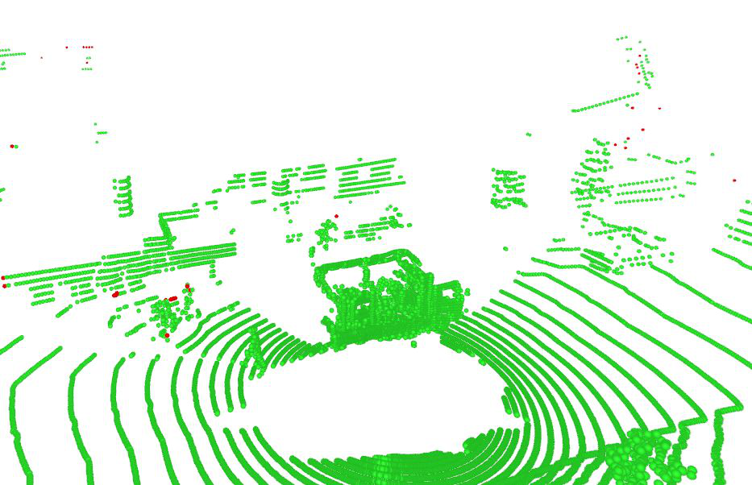
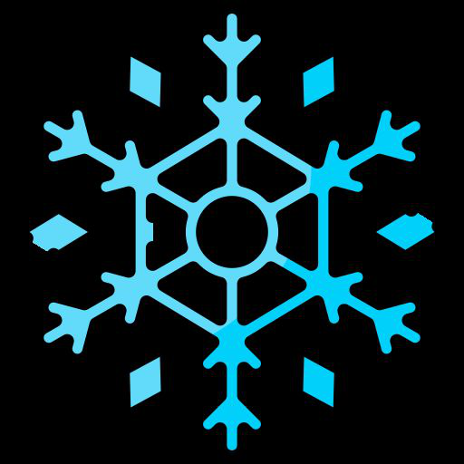

# HilDA: Hierarchical Distillation with Diffusion for Advancing Self-Supervised LiDAR Pre-trainin

## 摘要

| 项目 | 内容 |
|---|---|
| 论文 | HilDA: Hierarchical Distillation with Diffusion for Advancing Self-Supervised LiDAR Pre-trainin |
| 作者 | Maciej Wozniak, Jesper Ericsson, Hariprasath Govindarajan, Truls Nyberg, Thomas Gustafsson, Patric Jensfelt, Olov Andersson |
| arXiv | 2606.20189v1；http://arxiv.org/abs/2606.20189v1 |
| 发布时间 | 2026-06-18 |
| 任务领域 | 自动驾驶 LiDAR 自监督预训练、跨模态蒸馏、3D 感知 |
| 代码状态 | 论文摘要声明代码页面为 https://maxiuw.github.io/hilda（见 PAGE 1）。但当前材料未提供可克隆仓库、README 或源码文件；因此本文不写代码段。本文未提供可确认的公开代码。 |
| 证据状态 | 依据 PDF 正文与补充材料抽取文本；补充材料在 PAGE 26 处截断，部分实现细节证据不足。 |

一句话总结：HilDA 将视觉基础模型（Vision Foundation Model, VFM）的层级语义知识蒸馏到 LiDAR backbone，同时加入面向未来 BEV occupancy 的扩散式时序辅助任务，使 3D 表征同时获得“语义 what”和“几何 where”，并在语义分割、检测、occupancy、鲁棒性和 scene flow 上优于已有 camera-to-LiDAR 蒸馏方法（见 PAGE 1、PAGE 3、PAGE 8-14）。

本文最核心的判断是：HilDA 不是简单把 DINOv2 最后一层特征对齐到点云，而是把 VFM 的中间层语义演化、CLS 全局场景表征，以及 LiDAR 序列中的时空结构共同作为预训练信号。这个组合解释了它为什么在低标注比例、跨域迁移和动态任务中表现突出（见 PAGE 2-4、PAGE 7-14）。

## 背景与动机

自动驾驶中的空间感知需要在动态、遮挡、天气变化和长尾交通参与者下保持可靠。LiDAR 能提供高精度几何信息，但训练 3D 模型通常依赖大量标注数据。论文明确指出，问题不只是标注成本，还包括人工标注难以覆盖真实世界几何和运动的组合式多样性（见 PAGE 1）。这使得 LiDAR backbone 的自监督预训练成为合理方向：先用无标签数据学习可迁移表征，再在下游任务中减少标注依赖。

近年来的 camera-to-LiDAR knowledge distillation（跨模态知识蒸馏）尝试利用视觉基础模型（VFM）作为 teacher，将图像中的 dense semantic feature 迁移到 LiDAR student。现有工作已经表明，这类 VFM teacher 能为 3D 网络提供对 domain shift 和恶劣天气更稳健的语义特征（见 PAGE 2）。但 HilDA 指出一个结构性问题：许多方法只蒸馏 VFM 最后一层特征，等价于只学习 teacher 的最终答案，而忽略 teacher 如何逐层形成语义。

这种“final-layer only”的蒸馏有两个缺陷。第一，VFM 的不同层承载不同抽象级别的信息，中间层可能更适合某些下游任务；只对齐最后一层会丢失 progressive semantic refinement（渐进语义细化）（见 PAGE 2）。第二，ViT-based VFM 的 CLS token 编码了 scene-level context，例如场景类型、显著对象和对象关系；只做局部点-像素特征对齐会忽略这一全局语义线索（见 PAGE 2）。

另一个缺口来自模态本身。图像 VFM 强于语义识别，但不显式包含 3D 几何和时序运动约束。论文指出，已有 occupancy prediction 辅助任务通常是 discriminative objective，即按 voxel 或 query 做局部二分类监督；这种方式更多建模 local marginal，而不是整个场景的 joint distribution（见 PAGE 4）。对于自动驾驶而言，occupancy 在空间和时间上高度相关，包含连续结构和 object permanence，这为 generative objective 提供了动机（见 PAGE 4）。

HilDA 的出发点因此很清晰：用 hierarchical distillation 学习 VFM 的语义层级，用 temporal occupancy diffusion 学习 LiDAR 序列中的几何和运动结构。前者回答“这个点云区域是什么”，后者约束“它在 3D 空间和时间中应当在哪里、如何延续”。论文将其概括为同时捕获 semantic what 和 geometric where（见 PAGE 2、PAGE 14）。

## 预备知识

HilDA 的输入由 LiDAR 点云和同步多视角相机图像组成。论文定义点云为：

$$
P=\{p_i\mid i=1,\ldots,N\},\quad p_i\in\mathbb{R}^{4}
$$

其中 $p_i$ 表示第 $i$ 个点，包含 3D 坐标 $(x,y,z)$ 与 intensity。这个公式说明 HilDA 的 student 输入仍是标准 LiDAR 点云特征，而不是依赖人工语义标签（见 PAGE 5）。

同步相机输入定义为：

$$
I=\{I^c\mid c=1,\ldots,V\},\quad I^c\in\mathbb{R}^{H\times W\times 3}
$$

其中 $V$ 是环视相机数量，$I^c$ 是第 $c$ 个 RGB 图像。这个定义对应 HilDA 的 camera-to-LiDAR 蒸馏设定：teacher 在多视角图像上产生视觉特征，student 在点云上学习与之对齐的 3D 表征（见 PAGE 5）。

模型角色上，teacher 是 frozen VFM，实验中使用 DINOv2；student 是 LiDAR backbone，主实验使用 MinkUnet34，并说明方法也支持 PTv3 等其他 3D backbone（见 PAGE 8）。预训练只使用 nuScenes training split 的同步 RGB-LiDAR 数据和 calibration，不使用任务标签；预训练后的 backbone 直接迁移到所有下游 benchmark，不做 target-dataset re-pretraining（见 PAGE 8）。

还需要区分两个重要术语。CLS token 是 ViT 中用于聚合全局图像语义的 token，HilDA 将多视角 teacher CLS 聚合成视觉场景描述，并让 LiDAR student 学出对应的 3D global context token（见 PAGE 6-7）。BEV occupancy 则是鸟瞰图占用目标，HilDA 将未来 LiDAR sweep 投影为 ground-removed BEV occupancy，并把预测未来 occupancy 表述为 conditional DDPM denoising（见 PAGE 7）。

## 方法详解

### 1. 总体框架：三个无标签目标共同预训练 LiDAR backbone

HilDA 处理三个时间帧 $\{t-1,t_0,t_1\}$。其中 $t-1$ 与 $t_0$ 用于特征提取和蒸馏，未来帧 $t_1$ 只作为 occupancy prediction target。这一点很关键：HilDA 并不是在推理时依赖未来帧，而是在预训练阶段利用未来 occupancy 作为自监督信号，让 backbone 学到时空一致性（见 PAGE 5）。

论文的 Fig.2 给出结构概览：LiDAR sweeps 和同步多视角图像进入系统；teacher 产生 2D multi-layer features 与 2D global feature；student 产生 3D point features 与 3D global feature；同时，student 特征被投影到 BEV 并作为 diffusion UNet 的 conditioning，用于生成未来 BEV occupancy（见 PAGE 5）。由于当前可用 figures 列表未提供 Fig.2 的 markdown_path，本文只引用 Fig.2 的文字证据，不嵌入该图。

HilDA 的最终预训练目标为：

$$
\mathcal{L}_{\text{total}}
=
\omega_{ds}\mathcal{L}_{\text{distill}}
+
\omega_{gl}\mathcal{L}_{\mathrm{CLS}}
+
\omega_{df}\mathcal{L}_{\text{diffusion}}
$$

其中 $\mathcal{L}_{\text{distill}}$ 是多层点-像素蒸馏损失，$\mathcal{L}_{\mathrm{CLS}}$ 是全局上下文蒸馏损失，$\mathcal{L}_{\text{diffusion}}$ 是时序 occupancy 扩散损失；$\omega_{ds},\omega_{gl},\omega_{df}$ 是三项权重。这个公式说明 HilDA 的改进不是单一模块，而是语义层级、场景全局信息和时空几何生成目标的联合优化（见 PAGE 8）。

### 2. Multi-Layer Distillation：从“最后答案”转向“语义形成过程”

HilDA 首先通过几何标定建立点-像素对应关系。对 LiDAR 点 $(x_i,y_i,z_i)$，论文使用相机内参 $\Gamma_I$ 和 LiDAR 到相机的外参 $\Gamma_{c\leftarrow\mathrm{LiDAR}}$ 投影到第 $c$ 个图像平面：

$$
\begin{bmatrix}
u_i\\
v_i\\
1
\end{bmatrix}
=
\rho(i)
=
\frac{1}{z_i}
\Gamma_I
\Gamma_{c\leftarrow\mathrm{LiDAR}}
\begin{bmatrix}
x_i\\
y_i\\
z_i
\end{bmatrix}
$$

这里 $(u_i,v_i)$ 是点 $p_i$ 在图像上的像素坐标。这个公式的含义是：HilDA 不需要额外 semantic prior 或 pseudo-mask，而是严格依赖传感器 calibration 找到跨模态对齐位置（见 PAGE 6）。

记 $\mathcal{M}_c$ 为第 $c$ 个相机中的有效 point-pixel correspondence 集合。若投影点落在图像外，该点不参与 multi-layer distillation，但仍可参与 global context distillation 和 diffusion objective（见 PAGE 6）。这一设计避免了把不可见或不可投影点错误地强行对齐到图像特征。

HilDA 从多个 teacher layer 蒸馏到对应的 student layer。默认使用最后两层，记 teacher/student 的最终输出层索引为 $L$，蒸馏层索引为 $\ell\in\{L-K,\ldots,L\}$。student 点特征为 $\mathbf{f}_{i,\ell}$，teacher 像素特征为 $\mathbf{q}_{j,\ell,c}$，并用层特定 MLP $H_\ell$ 对齐维度（见 PAGE 6）。

核心损失为：

$$
\mathcal{L}_{\text{distill}}
=
\frac{1}{V(K+1)}
\sum_{\ell=L-K}^{L}
\sum_{c=1}^{V}
\frac{1}{|\mathcal{M}_c|}
\sum_{(i,j)\in\mathcal{M}_c}
\left(
1-
\frac{
H_\ell(\mathbf{f}_{i,\ell})\cdot \mathbf{q}_{j,\ell,c}
}{
\|H_\ell(\mathbf{f}_{i,\ell})\|_2
\|\mathbf{q}_{j,\ell,c}\|_2
}
\right)
$$

这个公式在说：对每个有效点-像素匹配、每个相机、每个被选中的层，HilDA 最小化 student feature 和 teacher feature 的 cosine distance。选择 cosine distance 的直接含义是对齐语义方向，而不是强制不同架构的特征范数一致；Table 9 的消融也显示 cosine distance 优于 $\ell_2$ 和 KL loss（见 PAGE 6、PAGE 14）。

与最终层蒸馏相比，多层蒸馏的技术目标是让 3D student 学习 VFM 中语义逐步形成的过程。论文在 PAGE 2-4 反复强调，VFM 的 feature hierarchy 分布在中间层而非只存在最终输出；Table 8 进一步表明，“Separate, Last 2” 的 late-layer matching 在 nuScenes linear probing 上达到 53.8 mIoU，高于 final layer only 的 46.4 和 penultimate only 的 49.9（见 PAGE 13-14）。这说明 HilDA 的收益不是简单“加更多 teacher feature”，而是选择抽象层级与 3D student 几何支持范围相容的 late-layer 对齐。

### 3. Global Context Distillation：补足局部点-像素对齐缺失的场景级语义

局部 point-pixel distillation 能提供细粒度语义，但它难以表达场景整体语义。例如 highway 与 residential area 的区别不一定能从单个点的局部投影充分表达。HilDA 因此利用 ViT-based VFM 的 CLS token 作为 global context teacher（见 PAGE 6-7）。

teacher 侧，HilDA 从最终层 $L$ 提取所有 $V$ 个相机图像的 CLS token，并做 max pooling，得到统一视觉场景描述 $\mathrm{CLS}_{Q}^{L}$。student 侧，HilDA 对最终层点特征使用专用 MLP projection head $H_{\mathrm{CLS}}(\cdot)$，再对所有点做 global max pooling，得到 LiDAR 场景 token $\mathrm{CLS}_{F}^{L}$（见 PAGE 6-7）。

全局上下文蒸馏损失为：

$$
\mathcal{L}_{\mathrm{CLS}}
=
\left\|
\mathrm{CLS}_{F}^{L}
-
\mathrm{CLS}_{Q}^{L}
\right\|_2^2
$$

这个公式在说：student 的 3D 全局场景表征要接近 teacher 的多视角视觉全局表征。它不是替代点-像素蒸馏，而是对局部对齐的补充，使 LiDAR backbone 学到 scene-level semantic regularization（见 PAGE 7）。

Table 9 支持这一设计选择：在 CLS pooling 方案中，max pooling 的 nuScenes LP 为 56.3，高于 learnable pooling 的 55.9 和 per-image/frustum student CLS 的 55.5（见 PAGE 14）。这表明全局蒸馏中“突出最显著响应”的聚合策略更适合与局部 multi-layer distillation 互补。

### 4. Temporal Occupancy Diffusion：把未来占用预测变成条件生成任务

HilDA 的第三个目标解决的是纯语义蒸馏缺乏 3D 时空约束的问题。给定两个 LiDAR sweeps $P^{t-1}$ 和 $P^{t_0}$，student 编码得到 $F_L^{t-1}$ 和 $F_L^{t_0}$，再压缩为 dense BEV history feature map $C_{\text{history}}$。未来 sweep $P^{t_1}$ 被变换到 $t_0$ 坐标系，并投影为 ground-removed BEV occupancy target：

$$
x_{\mathrm{occ}}\in\{0,1\}^{H_{\mathrm{BEV}}\times W_{\mathrm{BEV}}}
$$

这个定义说明 diffusion target 是未来 BEV 二值占用图，而不是语义标签；因此它仍属于 label-free auxiliary task（见 PAGE 7）。

HilDA 将未来 occupancy prediction 表述为 conditional DDPM denoising。扩散前向过程为：

$$
x_\tau
=
\sqrt{\bar{\alpha}_\tau}x_{\mathrm{occ}}
+
\sqrt{1-\bar{\alpha}_\tau}\epsilon,
\quad
\epsilon\sim\mathcal{N}(0,I),
\quad
\bar{\alpha}_\tau
=
\prod_{s=1}^{\tau}(1-\beta_s)
$$

其中 $\tau$ 是扩散时间步，$\epsilon$ 是高斯噪声，$\beta_s$ 是噪声调度参数。这个公式表示 HilDA 在不同噪声强度下扰动未来 occupancy，让 denoising network 学习从粗到细恢复空间结构（见 PAGE 7）。

去噪网络为 2D UNet，输入包括 noisy occupancy $x_\tau$、扩散步 $\tau$ 和历史条件 $C_{\text{history}}$。论文说明 conditioning 通过 channel-wise concatenation 实现（见 PAGE 7）。训练损失为：

$$
\mathcal{L}_{\text{diffusion}}
=
\mathbb{E}_{\tau,\epsilon,C_{\text{history}}}
\left[
\left\|
\epsilon
-
\epsilon_\theta(x_\tau,\tau,C_{\text{history}})
\right\|_2^2
\right]
+
\lambda
\left\|
x_{\mathrm{occ}}
-
\hat{x}_{\mathrm{occ}}
\right\|_2^2
$$

这个公式包含两部分：第一项是 noise prediction，要求 UNet 预测加入的噪声；第二项是 occupancy reconstruction，用权重 $\lambda$ 约束重建 occupancy。论文指出第二项在低噪声步 $\tau$ 下改善 conditioning，并将完整实现细节放在补充材料 Sec. C；但当前提供文本在补充材料中截断，具体超参数和构造细节证据不足（见 PAGE 7、PAGE 23-26）。

与普通 occupancy decoder 相比，diffusion 的理论动机是建模联合场景结构。论文批评二分类式 occupancy objective 更多学习 local marginals，缺少对 global coherent configuration 的显式激励（见 PAGE 4）。Table 9 也显示，diffusion decoder 在 nuScenes LP 上达到 56.3，高于 simple decoder 的 49.1 和 ALSO 的 54.7（见 PAGE 14）。因此，HilDA 的 diffusion 不是为了生成可视化结果，而是作为 representation learning 的几何与运动先验。

### 5. 图像证据：Fig.1 展示组件逐步加入后的误差趋势

用途：下图来自 Fig.1 的第一个裁剪图，用于辅助观察 HilDA 组件对 semantic accuracy 的影响。读图要点：Fig.1 caption 明确描述，从 baseline 到加入 temporal occupancy diffusion、multi-layer distillation、global context distillation，segmentation errors 逐步减少（见 PAGE 2-3）。由于当前 figure metadata 只给出相同 caption candidate，无法仅凭路径确认该裁剪图对应 baseline、(a)、(b) 或 (c) 的哪一个子图。

支撑的判断：该图与 PAGE 2-3 的 Fig.1 文字共同支撑“HilDA 组件逐步加入后，分割错误呈下降趋势”的定性结论；但单张裁剪图的子面板身份证据不足。

用途：下图来自 Fig.1 的第二个裁剪图，用于补充观察组件增益的可视化结果。读图要点：论文将 Fig.1 用作 baseline、diffusion、multi-layer、global context 四个阶段的对比图，而非单一最终结果展示（见 PAGE 2）。

支撑的判断：该图支持本文对 HilDA 进行“组件累加式分析”的解读，即该方法的收益来自 hierarchical distillation 与 diffusion 的组合，而不是只来自单个模块；具体子图标签仍因 metadata 不完整而证据不足。

用途：下图来自 Fig.1 的第三个裁剪图，用于展示 semantic error 可视化的一部分。读图要点：PAGE 3 明确说，相比标准 final-layer distillation，连续加入组件会带来 visibly reduced segmentation errors，说明 LiDAR 表征更结构化且语义对齐更好。

支撑的判断：该图配合 PAGE 3 的文字，支撑“组件越完整，semantic alignment 越强”的定性判断；但无法替代 Table 7 的定量消融证据。

用途：下图来自 Fig.1 的第四个裁剪图，用于完整呈现可用的 Fig.1 图像证据。读图要点：Fig.1 的用途是解释 HilDA 三类组件对 semantic accuracy 的累积影响，而不是展示最终 benchmark 排名（见 PAGE 2-3）。

支撑的判断：该图与 Table 7 的定量结果相互印证：diffusion、distillation、CLS 全局上下文组合后获得最高 performance；但 Fig.1 本身只提供定性视觉证据（见 PAGE 13）。

### 6. 代码状态与实现可验证性

论文摘要声明 “Code available at: https://maxiuw.github.io/hilda”（见 PAGE 1），但当前输入材料没有提供源码仓库、README、文件路径、函数名或配置文件。由于任务要求只有在论文或搜索结果中明确有公开代码时才写代码段，本文不写任何源码片段，也不做“论文模块 ↔ 源码函数”的映射。

本文未提供可确认的公开代码。实现层面的确定信息只来自论文文字：teacher/student 组合为 DINOv2 到 MinkUnet34，预训练使用 nuScenes training split 的同步 RGB-LiDAR 和 calibration，diffusion denoiser 使用 2D UNet，conditioning 通过 channel-wise concatenation 实现（见 PAGE 7-8）。更细的训练超参数、数据构造细节、工程模块划分在当前截断材料中证据不足（见 PAGE 23-26）。

## 实验分析

### 1. 实验设置

HilDA 在 nuScenes training split 上预训练一次，使用同步 RGB-LiDAR 数据和 calibration，不使用任务标签。预训练后的 backbone 迁移到多个下游 benchmark，包括 nuScenes、SemanticKITTI、Waymo、ScribbleKITTI、RELLIS-3D、SemanticSTF、DAPS-3D、nuScenes-C、KITTI detection、nuScenes semantic occupancy 和 Argoverse 2 scene flow（见 PAGE 8-12）。

评估协议包括 linear probing（冻结 backbone，只训练线性头）、data-scarce/full fine-tuning（按标注比例微调整个网络）、frozen backbone occupancy decoder、3D object detection 和 scene flow。指标包括 segmentation/occupancy 的 mIoU、detection 的 mAP、scene flow 的 EPE-based metrics，以及 robustness 的 mCE/mRR（见 PAGE 8）。

### 2. Cross-Modal Distillation 主结果

| 方法 | Teacher | nuScenes LP | nuScenes 1% | nuScenes 5% | nuScenes 10% | nuScenes Full | SKITTI 1% | Waymo 1% |
|---|---:|---:|---:|---:|---:|---:|---:|---:|
| Random | - | 8.10 | 30.30 | 47.84 | 56.15 | 74.66 | 39.50 | 39.41 |
| ScaLR | ViT-B | 41.80 | 55.83 | 63.46 | 65.24 | 74.76 | 45.59 | 49.60 |
| CleverDistiller | ViT-B | 51.89 | 59.80 | 66.44 | 67.65 | 78.49 | 51.48 | 53.56 |
| LiMA | ViT-B | 56.65 | 51.29 | 61.11 | 65.62 | 76.91 | 50.44 | 51.35 |
| HilDA† | ViT-B | 56.51 | 61.01 | 67.17 | 70.13 | 77.53 | 51.58 | 52.11 |
| HilDA | ViT-B | 58.95 | 62.71 | 70.19 | 71.00 | 79.12 | 53.44 | 53.89 |

表格解读：该表截取 Table 1 中 ViT-B/MinkUnet34 的结果（见 PAGE 9）。HilDA 在 nuScenes LP、1%、5%、10%、Full，以及 SKITTI/Waymo 1% transfer 中均高于列出的 prior baselines。最值得关注的是低标注比例：在 nuScenes 1% 下，HilDA 为 62.71，高于 CleverDistiller 的 59.80；在 5% 下，HilDA 为 70.19，高于 CleverDistiller 的 66.44。这说明 HilDA 的预训练收益主要体现在 label-scarce setting，而不只是 full supervision 下的小幅初始化增益。HilDA† 已经较强，加入 diffusion 后继续提升，支持 diffusion auxiliary task 对表征质量有额外贡献。

论文还报告 ViT-S 和 ViT-L teacher 下 HilDA 均取得强结果。例如 ViT-L 下 HilDA 在 nuScenes LP 达到 60.06，在 1% 达到 62.82，在 5% 达到 70.58，在 10% 达到 72.55（见 PAGE 9）。这说明方法收益并不只依赖某一个 teacher size。

### 3. 跨域泛化

| 方法 | ScriKITTI 1% | ScriKITTI 10% | Rellis-3D 1% | Rellis-3D 10% | SemSTF 50% | SemSTF 100% | DAPS-3D 50% | DAPS-3D 100% |
|---|---:|---:|---:|---:|---:|---:|---:|---:|
| Random | 23.81 | 47.60 | 38.46 | 53.60 | 48.03 | 48.15 | 74.32 | 79.38 |
| CleverDistiller | 44.03 | 56.70 | 58.35 | 60.92 | 53.99 | 55.66 | 83.06 | 87.95 |
| LiMA | 45.90 | 55.13 | 55.62 | 57.15 | 55.45 | 56.70 | 83.11 | 86.63 |
| HilDA† | 48.26 | 59.02 | 56.77 | 59.04 | 55.86 | 58.11 | 84.26 | 87.18 |
| HilDA | 48.39 | 58.22 | 59.49 | 62.88 | 56.72 | 57.83 | 85.93 | 89.08 |

表格解读：该表来自 Table 2（见 PAGE 10）。HilDA 在 ScriKITTI 1%、Rellis-3D 1%/10%、SemSTF 50%、DAPS-3D 50%/100% 上领先，在 ScriKITTI 10% 和 SemSTF 100% 上 HilDA† 略高或接近。Rellis-3D 是 off-road unstructured environment，HilDA 从 58.35/60.92（CleverDistiller）提升到 59.49/62.88，说明其表征不只适配 nuScenes 城市场景。DAPS-3D 100% 从 87.95 提升到 89.08，表明预训练特征在 domain-adaptive segmentation 设置中也有价值。

### 4. 鲁棒性：nuScenes-C

| 方法 | mCE ↓ | mRR ↑ | Fog | Rain | Snow | Blur | Beam | Cross | Echo | Sensor | Mean mIoU |
|---|---:|---:|---:|---:|---:|---:|---:|---:|---:|---:|---:|
| LiMoE | 155.77 | 78.23 | 40.35 | 45.28 | 39.14 | 42.10 | 44.21 | 27.33 | 39.20 | 29.49 | 38.39 |
| CleverDistiller | 151.21 | 79.76 | 43.96 | 46.91 | 41.20 | 41.05 | 42.15 | 45.67 | 41.30 | 28.85 | 41.39 |
| LiMA | 137.23 | 79.30 | 51.52 | 54.90 | 45.63 | 50.55 | 49.67 | 27.24 | 45.76 | 34.09 | 44.92 |
| HilDA† | 134.63 | 80.70 | 50.41 | 55.86 | 49.63 | 49.95 | 45.25 | 50.18 | 44.09 | 34.44 | 47.58 |
| HilDA | 124.27 | 88.20 | 55.99 | 57.97 | 54.29 | 51.16 | 51.30 | 56.29 | 47.91 | 40.31 | 52.00 |

表格解读：该表来自 Table 3 的 linear probing robustness 结果（见 PAGE 11）。HilDA 的 mCE 最低、mRR 最高、Mean mIoU 最高，尤其在 Cross-Sensor 和 Snowy corruption 下相对 prior baselines 有明显优势。这里的解释不能简单归因于某一个模块；但结合 Table 7，hierarchical distillation 和 diffusion 均能提高表征，最终组合在腐蚀场景中表现最好。PAGE 23-24 的补充材料还报告 full fine-tuning 下 HilDA 取得最佳平均性能，mCE 为 85.08、mRR 为 85.13、Mean mIoU 为 67.36（见 PAGE 24）。

### 5. 3D Object Detection 迁移

| 方法 | KITTI 5% | KITTI 10% | KITTI 20% | nuScenes 5% | nuScenes 10% | nuScenes 20% |
|---|---:|---:|---:|---:|---:|---:|
| Random | 56.1 | 59.1 | 61.6 | 38.1 | 43.5 | 45.2 |
| ScaLR | 56.2 | 62.3 | 66.5 | 46.1 | 50.3 | 55.1 |
| SuperFlow | 59.3 | 62.7 | 64.2 | 45.9 | 51.1 | 54.5 |
| CleverDistiller | 59.8 | 66.6 | 67.1 | 47.9 | 51.9 | 54.3 |
| HilDA† | 60.1 | 66.3 | 69.4 | 47.0 | 52.2 | 55.7 |
| HilDA | 61.4 | 67.3 | 71.0 | 50.4 | 54.9 | 57.9 |

表格解读：该表来自 Table 4（见 PAGE 11）。HilDA 在 KITTI 和 nuScenes 的 5%/10%/20% 标注比例下均领先。检测任务比语义分割更依赖几何定位和 object-level representation，因此该结果支持论文的主张：temporal occupancy diffusion 可能帮助 student 学到更几何化的表征，而 hierarchical distillation 则补足语义一致性。Fig.4 的文字说明还指出，HilDA 在 long-range 和 heavy occlusion 场景中有更稳健检测，但当前 figures 列表没有 Fig.4 图片路径，因此本文不嵌入该图（见 PAGE 11）。

### 6. Semantic Occupancy 与未来时序预测

| 设置 | 方法 | mIoU | Dynamic | Static | Surface |
|---|---|---:|---:|---:|---:|
| 3D | Random | 10.6 | 3.7 | 10.6 | 24.4 |
| 3D | ScaLR | 16.2 | 9.5 | 16.4 | 29.4 |
| 3D | CleverDistiller | 16.5 | 10.0 | 16.5 | 29.4 |
| 3D | HilDA† | 19.0 | 13.3 | 19.0 | 30.2 |
| 3D | HilDA | 20.0 | 14.5 | 20.2 | 30.4 |
| 4D | Random | 10.3 | 3.1 | 10.7 | 24.4 |
| 4D | ScaLR | 14.9 | 7.1 | 15.9 | 29.5 |
| 4D | CleverDistiller | 15.5 | 8.0 | 16.5 | 29.6 |
| 4D | HilDA† | 17.3 | 10.1 | 18.5 | 30.4 |
| 4D | HilDA | 18.4 | 11.4 | 20.2 | 30.5 |

表格解读：该表来自 Table 5（见 PAGE 12）。HilDA 在 3D 和 4D semantic occupancy 上均领先，且 dynamic 类别提升明显：3D dynamic 从 CleverDistiller 的 10.0 提升到 14.5，4D dynamic 从 8.0 提升到 11.4。这与 diffusion 目标的设计直接相关，因为预训练时模型要根据 $t-1,t_0$ 预测 $t_1$ occupancy。论文也指出，diffusion loss 对 dynamic/object-centric classes 的收益最大，而 surface gains 较小，原因是 ground-removed BEV target 强调 free/occupied boundaries，并移除了对垂直语义区分有用的 cue（见 PAGE 11-12）。

Fig.5 报告 forecast horizon 上的 semantic mIoU，说明 HilDA 在最长 5 秒 horizon 内保持最高 mIoU（见 PAGE 12）。当前 figures 列表没有 Fig.5 的 markdown_path，因此本文只引用文字证据，不嵌入该图。

### 7. Scene Flow：动态几何迁移

| 方法 | Mean EPE ↓ | FD ↓ | FS ↓ | BS ↓ | Dyn ↓ | Stat ↓ |
|---|---:|---:|---:|---:|---:|---:|
| SSF | 0.028 | 0.058 | 0.018 | 0.009 | 0.267 | 0.013 |
| + ScaLR | 0.026 | 0.056 | 0.016 | 0.007 | 0.234 | 0.012 |
| + SuperFlow | 0.025 | 0.053 | 0.015 | 0.007 | 0.198 | 0.012 |
| + CleverDistiller | 0.024 | 0.049 | 0.016 | 0.008 | 0.210 | 0.011 |
| + HilDA† | 0.024 | 0.051 | 0.015 | 0.007 | 0.181 | 0.011 |
| + HilDA | 0.021 | 0.044 | 0.014 | 0.006 | 0.146 | 0.011 |

表格解读：该表来自 Table 6（见 PAGE 12）。HilDA 对 dynamic object estimation 的改善最明显，Dyn 从 CleverDistiller 的 0.210 降到 0.146。scene flow 是对时序运动估计更敏感的任务，这个结果与 temporal occupancy diffusion 的设计方向一致。论文 Fig.6 还显示 HilDA 的 motion map 更干净、速度/方向错误更少，但当前 figures 列表没有 Fig.6 图片路径，因此不嵌入该图（见 PAGE 12）。

### 8. 消融实验：三个组件的互补性

| 编号 | Diffusion | Multi-layer Distill | CLS | nuScenes LP | nuScenes 1% | SK 1% | Waymo 1% |
|---|---|---|---|---:|---:|---:|---:|
| base | ✗ | ✗ | ✗ | 46.36 | 55.01 | 50.15 | 49.08 |
| a | ✓ | ✗ | ✗ | 50.43 | 56.97 | 49.59 | 49.84 |
| b | ✗ | ✓ | ✗ | 53.77 | 57.03 | 50.63 | 50.71 |
| c | ✗ | ✓ | ✓ | 55.13 | 57.81 | 50.80 | 50.87 |
| d | ✓ | ✓ | ✗ | 55.53 | 59.04 | 52.41 | 51.89 |
| e | ✓ | ✓ | ✓ | 56.29 | 59.46 | 52.88 | 52.16 |

表格解读：该表来自 Table 7（见 PAGE 13）。单独加入 diffusion 从 46.36 提升到 50.43，单独加入 multi-layer distillation 从 46.36 提升到 53.77；再加入 CLS 到 55.13；三者共同使用达到 56.29。这个消融支持“语义层级 + 全局上下文 + 时序扩散”的互补关系。需要注意，消融表证明的是实验关联和组件贡献，不等于完全解释了每个下游任务提升的因果机制。

## 讨论

HilDA 的适用边界首先是数据形态。它要求同步 multi-view camera images、LiDAR point clouds 和 calibration，用于建立 point-pixel correspondence 和跨模态蒸馏（见 PAGE 5-6）。因此，它特别适合自动驾驶、多传感器 3D 感知团队，用于提升 LiDAR backbone 初始化质量，降低 3D detection、segmentation、occupancy 等任务的标注依赖。对于纯图像检测、纯视觉端侧模型，或没有 LiDAR 序列和相机标定的数据场景，HilDA 的直接价值有限。

从方法论上看，HilDA 对 camera-to-LiDAR distillation 的主要推进不在于引入更复杂的 teacher，而在于更完整地使用 teacher 表征：既用中间层，也用最终层 CLS；既做局部对齐，也做全局 regularization（见 PAGE 2-7）。这与以往依赖 semantic priors、grouping 或 final-layer feature alignment 的方法形成区别（见 PAGE 3-4）。

Temporal occupancy diffusion 的价值则在于把 LiDAR sequence 中的几何连续性和短期运动变成 self-supervised training signal。它与 VFM teacher 的关系是互补而非替代：VFM 提供 semantic discrimination，diffusion 提供 geometry-oriented and temporal prior（见 PAGE 4、PAGE 7）。实验上，这种互补在 semantic occupancy 和 scene flow 的 dynamic 类别上表现较清楚（见 PAGE 12）。

不过，HilDA 也增加了训练复杂度。预训练同时包含 DINOv2 teacher feature extraction、多层点-像素匹配、CLS 蒸馏、BEV projection、2D diffusion UNet 和三项损失加权（见 PAGE 5-8）。论文没有在当前抽取文本中给出训练成本、GPU 小时或显存开销；PAGE 15 提到计算和数据处理使用 Berzelius resource，但无法据此量化成本。因此，训练成本的精确评估证据不足。

## 局限分析

作者自述的核心局限是 point-pixel distillation 对 LiDAR-camera misalignment 敏感。由于 multi-layer distillation 依赖 calibration 投影，如果同步、外参或运动补偿存在误差，点与像素的语义对应会被污染。作者认为 HilDA 通过 alignment-free global context distillation 和 temporal diffusion 部分缓解这一问题，但并没有声称完全消除（见 PAGE 14）。

作者还指出未来方向包括学习式 layer-to-layer distillation matching、dynamic loss weighting，以及将 diffusion 扩展到 BEV 之外，例如 latent diffusion，以更好保留 3D geometry 和 temporal evolution（见 PAGE 14）。这说明当前 HilDA 的 layer matching 和 loss weighting 仍然是设计选择，而非自动优化结果；BEV diffusion target 也可能限制对完整 3D 结构的建模。

独立判断上，第一项风险是工程复杂度。HilDA 把 cross-modal distillation、global token alignment 和 diffusion pretraining 组合在一起，训练管线比常规 final-layer distillation 更复杂。论文证明了效果，但当前材料没有提供完整源码、配置和训练成本，因此复现风险较高。本文未提供可确认的公开代码；代码级实现证据不足（见 PAGE 1、PAGE 23-26）。

第二项风险是 BEV occupancy target 的信息损失。论文自己在 semantic occupancy 分析中指出，ground-removed pre-training BEV target 强调 free/occupied boundary，同时移除了对 terrain vs sidewalk 等 within-region semantic distinction 有用的 vertical cue，因此 surface 类别收益较小（见 PAGE 11-12）。这提示 HilDA 的 diffusion signal 更偏向 object permanence、边界和短期运动，对垂直结构语义未必充分。

第三项风险是材料截断带来的证据缺口。补充材料目录显示实现细节、数据集、限制和超参数设置分别在 Sec. C、D、E、F，但当前文本只截取到 PAGE 26，并未覆盖 C.1 之后的完整内容（见 PAGE 23-26）。因此，本文不讨论具体 batch size、学习率、diffusion schedule、UNet 结构细节或训练时长，避免超出证据范围。

## 结论

HilDA 的贡献可以概括为三点：第一，它将 camera-to-LiDAR distillation 从 final-layer feature alignment 推进到 hierarchical distillation，通过 multi-layer distillation 学习 VFM 的语义演化，通过 CLS distillation 学习 scene-level context（见 PAGE 2-7）。第二，它把未来 BEV occupancy prediction 表述为 conditional diffusion objective，在无标签预训练中引入几何和时序先验（见 PAGE 7）。第三，它在 segmentation、domain generalization、robustness、3D detection、semantic occupancy 和 scene flow 上均给出强实验结果，尤其在低标注和动态任务上收益明显（见 PAGE 8-14）。

对 LiDAR/自动驾驶 3D 感知团队而言，HilDA 值得关注，因为它提供了一种同时利用 VFM 语义能力和 LiDAR 序列几何结构的预训练方案。它的业务价值主要在减少 3D 标注依赖、提升 backbone 初始化质量，并为检测、occupancy、scene flow 等任务提供更统一的预训练表征。其主要落地风险是需要同步多模态序列、准确 calibration、较复杂训练管线和可复现代码支持；其中代码与完整实现细节在当前材料中证据不足。

## 证据索引

| 证据 | 关键内容 |
|---|---|
| PAGE 1 | 论文标题、作者、摘要、代码页面声明；说明 HilDA 结合 hierarchical distillation 与 temporal occupancy diffusion，并在多个任务上优于 prior approaches。 |
| PAGE 1-2 | 自动驾驶 LiDAR 标注瓶颈；VFM-to-LiDAR distillation 的背景；现有方法通常只蒸馏 final layer。 |
| PAGE 2 | final-layer distillation 的两个问题：丢失 progressive semantic refinement，忽略 CLS token 的 global context；Fig.1 caption 描述组件加入后 segmentation errors 减少。 |
| PAGE 3 | HilDA 两项主要贡献：Hierarchical Distillation 与 Temporal Occupancy Diffusion；Fig.1 的定性解释。 |
| PAGE 4 | 相关工作分析：occupancy 二分类目标倾向 local marginals，diffusion 可建模 joint scene distribution 和 coarse-to-fine refinement。 |
| PAGE 5 | Problem definition；点云 $P$、多相机图像 $I$ 定义；三帧 $\{t-1,t_0,t_1\}$ 预训练设定；Fig.2 框架说明。 |
| PAGE 6 | 点-像素投影公式；multi-layer distillation 的符号定义与 $\mathcal{L}_{\text{distill}}$ 公式。 |
| PAGE 7 | Global context distillation 的 CLS 构造与 $\mathcal{L}_{\mathrm{CLS}}$；temporal occupancy diffusion 的 $x_\tau$ 和 $\mathcal{L}_{\text{diffusion}}$ 公式。 |
| PAGE 8 | 总损失 $\mathcal{L}_{\text{total}}$；实验设置：DINOv2 到 MinkUnet34，nuScenes 无标签预训练，下游任务和指标。 |
| PAGE 9 | Table 1：cross-modal distillation benchmark 主结果；ViT-S/B/L 下 HilDA 的 segmentation mIoU。 |
| PAGE 10 | Table 2：domain generalization；Fig.3 qualitative segmentation 说明。 |
| PAGE 11 | Table 3 robustness；Table 4 3D object detection；Fig.4 detection qualitative 说明。 |
| PAGE 12 | Table 5 semantic occupancy；Fig.5 forecast horizon；Table 6 scene flow；Fig.6 qualitative scene flow 说明。 |
| PAGE 13 | Table 7 component ablation；diffusion、distillation、CLS 三组件组合效果最好。 |
| PAGE 14 | Table 8 multi-layer distillation design；Table 9 loss、CLS pooling、occupancy decoder ablation；Conclusion 中作者自述 misalignment limitation 与 future work。 |
| PAGE 15 | Acknowledgements；计算资源来自 Berzelius，但未给出训练成本量化。 |
| PAGE 23-26 | 补充材料目录和部分附加结果；显示有实现细节与超参数章节，但当前材料在 PAGE 26 截断，完整实现细节证据不足。 |
