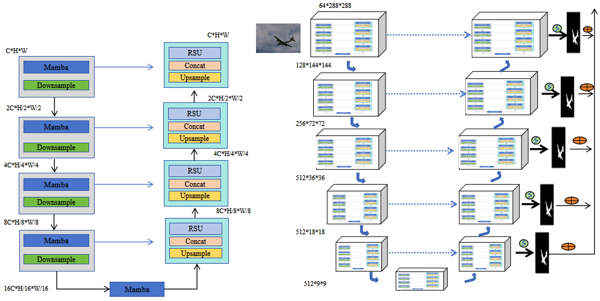
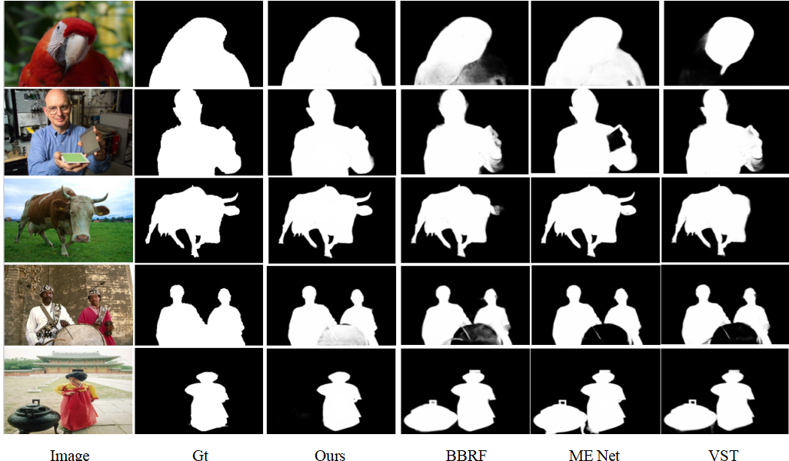

# U$^2$Mamba: A Two-level Nested U-structure Mamba for Salient Object Detection

## 摘要

**论文元信息。** 本文分析对象为 *U$^2$Mamba: A Two-level Nested U-structure Mamba for Salient Object Detection*，作者为 Junhui Li、Jialu Li、Youshan Zhang，arXiv ID 为 2606.20282，版本发布时间为 2026-06-18，类别为 cs.CV。论文链接为 http://arxiv.org/abs/2606.20282v1，PDF 链接为 https://arxiv.org/pdf/2606.20282v1。论文在摘要中声明源代码位于 https://github.com/JL021/U2Mamba（见 PAGE 1）。

**代码状态。** 该 GitHub 仓库可确认为公开仓库，README 与训练入口 `u2mamba_train.py` 可读；但训练脚本引用的核心模型文件 `model.u2umamba` 在当前可访问路径中读取失败，因此公开代码对 MMUB 完整结构的证据不充分。本文仅对已确认可读的训练入口和 MambaLayer 代码做分析，不据此声称已经验证全部模型实现。

**一句话总结。** U$^2$Mamba 将 Mamba 状态空间建模嵌入两级嵌套 U 结构，用 MMUB 进行多尺度长程上下文建模，并以层级监督增强深层输出一致性，在 DUTS-TE 上取得 0.904 maxF$_\beta$ 与 0.024 MAE（见 PAGE 5）。

本文提出的问题背景是显著目标检测（Salient Object Detection, SOD）：给定图像，输出像素级显著区域图，要求既能理解全局语义，又能保留清晰边界。论文认为 CNN 方法容易因下采样损失高分辨率边界细节，Transformer 方法虽然能建模长程依赖，但对输入大小具有二次复杂度，限制高分辨率和资源受限场景使用（见 PAGE 1）。U$^2$Mamba 的基本主张是：Mamba 类状态空间模型（State Space Model, SSM）具备线性或近线性序列建模复杂度，适合密集预测任务；再配合嵌套 U 结构，可以同时保留浅层边界和深层上下文（见 PAGE 1-2）。

本文的实验声称该方法在多个 SOD 数据集上达到有竞争力的表现，并通过消融实验说明 MMUB 与 BCE+KL 层级监督均有独立贡献（见 PAGE 5）。不过，论文也存在若干证据缺口：MMUB 中“高低频分解”的具体算子没有给出公式或伪代码；损失函数文本声称“任意两层预测之间”的 KL 匹配，但公式写法仍像是 ground truth 与预测之间的分布项；公开训练入口中也只看到 BCE 多输出损失，未看到论文 Eq. (4) 中 KL 项与 $\lambda$ 权重的完整对应实现。这些问题会影响复现与工程采信强度。

## 背景与动机

显著目标检测的核心目标是从图像中识别视觉上突出的对象，并生成具有精细边界的像素级显著图。论文列举了医学影像、自动驾驶、场景识别和视频分析等应用场景，强调 SOD 属于视觉理解中的基础问题（见 PAGE 1）。这类任务与通用目标检测不同：它不一定输出类别和框，而是更接近前景区域定位或二值/软分割，因此其业务价值更自然地落在候选前景生成、自动标注预筛、检测数据清洗和显著区域辅助定位上。

传统 CNN/FCN 路线通过逐级下采样扩大感受野并降低计算量，但代价是空间分辨率逐步降低。对于 SOD，边界质量直接影响 MAE 和视觉可用性，因此浅层高分辨率细节不能简单牺牲。论文明确指出，CNN 的渐进式下采样会导致对精确 saliency boundaries 至关重要的空间细节损失（见 PAGE 1）。

Transformer 路线通过 self-attention 捕获长程依赖，能够缓解 CNN 局部感受野不足的问题。论文引用 ViT/Swin/NAT 类方法作为背景，并指出 self-attention 对输入大小呈二次复杂度，这会限制高分辨率 SOD、实时视频分析或边缘设备部署（见 PAGE 1）。这给了 Mamba/SSM 方法进入密集预测任务的空间：如果能以线性复杂度处理长序列，就可能在全局上下文和计算效率之间取得更好的折中。

Mamba 方法在论文中被视为结构化状态空间模型的一类高效实现。作者认为 Mamba 通过硬件感知设计将序列建模复杂度降低到线性或近线性，适合 dense prediction（见 PAGE 1）。但现有视觉 Mamba 模型通常并非为 SOD 定制：VMamba 和 U-Mamba 侧重通用视觉或医学分割，MambaSOD 则偏向 RGB-D 多模态 SOD；这些方法可能缺少单模态 SOD 所需的边界保留和层级监督设计（见 PAGE 1）。

U$^2$Mamba 的出发点是把 Mamba 从“替代 Transformer/CNN backbone 的模块”推进到一个专门为单模态 SOD 设计的架构。论文强调该模型从零构建，不依赖分类预训练 backbone，并以 Multiscale Mamba U-Block（MMUB）作为基本构件，在顶层形成 U-Net 式 encoder-decoder，同时在每个 stage 内部形成小 U 结构，从而得到“两级嵌套 U 结构”（见 PAGE 1-3）。

## 预备知识

首先需要区分三个概念。第一，U-Net 式 encoder-decoder 指先通过编码器逐级压缩空间分辨率、扩大语义感受野，再通过解码器逐级上采样，并用 skip connection 恢复空间细节。第二，U$^2$Net 的 Residual U-block（RSU）思想是在一个 stage 内部再放入小型 U 结构，使单个 block 自身具备多尺度表征能力。第三，Mamba/SSM 负责长序列依赖建模，它不是传统卷积，也不是全局 self-attention，而是把序列输入送入结构化状态空间操作以获得长程交互（见 PAGE 1-3）。

论文把图像特征视作可展平的长序列。设输入特征形状为 $(B,C,H,W,D)$，其中 $B$ 是 batch size，$C$ 是通道数，$H,W$ 是空间高度与宽度，$D$ 在论文公式中作为额外维度出现；展平后得到 $(B,L,C)$，其中序列长度为：

$$
L = H \times W \times D
$$

这句话的含义是：Mamba 模块看到的不是二维网格，而是一串长度为 $L$ 的 token，每个 token 有 $C$ 维特征（见 PAGE 2）。需要注意的是，本文任务是二维 RGB SOD，论文却写出 $(B,C,H,W,D)$，这可能继承自 3D segmentation 表达或通用实现写法；论文没有解释 $D$ 在二维 SOD 中的具体含义，属于证据不足。

评价指标方面，论文主要报告 maximum F-measure，即 maxF$_\beta$，以及 Mean Absolute Error，即 MAE。maxF$_\beta$ 越高表示显著区域预测与标注之间的精确率/召回率综合更好；MAE 越低表示像素级预测与 ground truth 的平均绝对误差越小。论文文本称采用“三个 saliency metrics”，但随后只明确列出 MAE 与 maxF$_\beta$（见 PAGE 4）；README 中还出现 $S_m$ 与 $E_m^{max}$，但这些未在 PDF 表格中完整展开，因此本文以 PDF 表格为主。

## 方法详解

### 整体架构：两级嵌套 U 结构

U$^2$Mamba 的顶层是一个 U-Net-like encoder-decoder，包含六个 encoder stages（En1-En6）和五个 decoder stages（De1-De5），并在多个层级输出 saliency maps 进行深监督（见 PAGE 2）。每个 stage 不是普通卷积块，而是 MMUB。也就是说，顶层是一个大 U；每个 stage 内部又是一个小 U；论文标题中的 U$^2$ 指的就是这种两层嵌套 U 结构（见 PAGE 3）。

**用途：** Figure 1 用于说明 MMUB 内部结构与 U$^2$Mamba 顶层 encoder-decoder 的组合关系。



**读图要点：** Fig. 1(a) 展示 MMUB 通过深层多尺度结构增强 global context representation；Fig. 1(b) 展示整体网络以 U-Net-like encoder-decoder 组织，每个 stage 都由 MMUB 构成（见 PAGE 3）。**支撑的判断：** 该图支持“本文不是简单把 Mamba 插入单个 bottleneck，而是在 stage 内和顶层同时使用 U 结构”的说法；但图中没有给出每个 MMUB 的具体层数、通道配置和可复现超参数，因此完整结构复现仍需源码或附录支持。

论文声称这种结构可以同时满足 SOD 的两个要求：一方面通过浅层高分辨率特征保持边界定位能力；另一方面通过 Mamba 和多尺度下采样表示捕获长程上下文（见 PAGE 2）。与普通 U-Net 的差异在于，U$^2$Mamba 的每个 stage 内部就已经在进行多尺度编码与解码，因此顶层 skip connection 融合的是更丰富的 intra-stage 多尺度特征。

### MMUB：把 Mamba 嵌入 stage 内部多尺度结构

MMUB 的设计动机是利用 Mamba 的线性序列建模优势来增强 CNN 对长程依赖的表达能力，同时保持 U$^2$Net/RSU 风格的多尺度局部特征抽取（见 PAGE 2）。论文称 MMUB 主要由 residual block 与 Mamba block 组成：residual block 包含普通卷积层和 Instance Normalization；Mamba block 将图像特征展平为序列，送入结构化状态空间建模，然后再 reshape 回原特征形状（见 PAGE 2）。

论文给出的 Mamba Block 计算形式为：

$$
F_c(f)=\sigma\left(\mathrm{LN}(\mathrm{ssm}(x))+x\right)
$$

其中 $x$ 是 Mamba Block 的输入特征，$\mathrm{ssm}(\cdot)$ 是 structured state space modeling operation，$\mathrm{LN}(\cdot)$ 是 layer normalization，$\sigma(\cdot)$ 是非线性激活函数（见 PAGE 2-3）。直观地说，这个公式表达了一个残差式 Mamba 变换：先用 SSM 提取长程依赖，再归一化，与原输入相加，最后通过非线性激活输出。

该公式有两个值得注意的细节。第一，残差项 $+x$ 表示模块不会完全覆盖局部输入特征，有利于保留边界和纹理信息。第二，论文没有进一步展开 $\mathrm{ssm}(\cdot)$ 的状态转移、选择机制或参数化方式，因此无法从 PDF 中判断该 Mamba block 是否完全等同于标准 `mamba-ssm` 实现，还是经过视觉任务定制；这里证据不足。

论文还提到 stage 3 和 stage 4 使用 dilated convolutions，理由是这些 stage 的 feature maps spatial resolution 相对较低（见 PAGE 2）。这相当于在空间尺寸已经缩小的位置进一步扩大有效感受野，避免在高分辨率浅层使用过重的空洞卷积。该设计与 MMUB 的目标一致：尽量把昂贵计算放在下采样表示上，同时保留浅层细节。

### 空间冗余与高低频表述

论文在 U$^2$Mamba 小节中提出一个更具体的效率论证：CNN feature maps 存在显著 spatial redundancy，MMUB 通过将中间特征分解为 high-frequency components 与 low-frequency components 来降低冗余；低频分量在较低分辨率处理以节省计算和内存，高频分量保留边缘与边界信息以维持 saliency details（见 PAGE 3）。

这个论断在方法层面很重要，因为它解释了为什么 U$^2$Mamba 能在维持高分辨率结构的同时降低计算成本。若高频分量承载边界，低频分量承载大范围语义背景，则二者分治确实符合 SOD 对边界与上下文的双重需求。论文还称 MMUB 可以通过对低频输入执行等效卷积来扩大 pixel space 中的 receptive field（见 PAGE 3）。

但这里的证据不足也比较明显：论文没有给出高低频分解的具体算子、滤波方式、阈值、频域/空域实现，也没有说明该分解是否在代码中显式存在。仅根据 PDF，无法确认它是一个严格的 frequency decomposition module，还是对 downsampling/skip preservation 的概念性描述。因此，在复现或工程评估时，应优先查看 MMUB 源码而不是只依据论文文字。

### 层级监督：BCE 与 KL 的组合

训练目标是本文第二个关键创新。论文认为传统 deep supervision 通常对 side outputs 独立施加 pixel-wise loss，但在 very deep nested architectures 中，独立 side loss 难以保证层级之间的一致性（见 PAGE 3）。因此 U$^2$Mamba 使用 BCE loss 与 KL divergence loss 的组合，对不同深度输出进行层级监督。

论文给出的 binary cross-entropy loss 为：

$$
L_B=-\sum_{i,j}^{H,W}\left[G(i,j)\log S(i,j)+(1-G(i,j))\log(1-S(i,j))\right]
$$

其中 $(i,j)$ 表示像素坐标，$H,W$ 是图像高度和宽度，$G(i,j)$ 是 ground-truth saliency map 在像素 $(i,j)$ 的值，$S(i,j)$ 是模型预测 saliency map 的值（见 PAGE 3-4）。这个公式的含义是：每个像素都被视为二分类目标，模型需要把显著区域像素预测为 1，把背景像素预测为 0。

论文给出的 Kullback-Leibler divergence loss 为：

$$
L_K=-\sum_{i,j}^{H,W}G(i,j)\log \frac{G(i,j)}{S(i,j)}
$$

按论文解释，KL loss 用于对不同层级之间做 pairwise probability prediction matching，促进多层预测分布一致（见 PAGE 4）。但公式本身写成了 $G(i,j)$ 与 $S(i,j)$ 的关系，而非两个 stage predictions 之间的关系；同时 KL divergence 标准形式通常不带前置负号。这里存在文本目标与公式表达之间的不一致，需要在代码中核验真实实现。

总损失写为：

$$
\mathrm{Loss}=\lambda_1\sum_{i=1}^{M}\omega_i^{B}L_i^{B}
+\lambda_2\sum_{i=1}^{M}\omega_i^{K}L_i^{K}
+\lambda_3\omega_{fuse}L_{fuse}
$$

其中 $M=6$ 表示六个 side outputs，$\omega_i^B$ 与 $\omega_i^K$ 是各层 BCE/KL 权重，$L_{fuse}$ 是 final fusion output saliency 的损失，$\omega_{fuse}$ 是融合输出权重（见 PAGE 4）。人话解释是：模型不是只监督最终输出，而是同时监督多个中间输出，并把最终融合输出也纳入训练目标。

实现细节中，论文设定 $\lambda_1=0.4,\lambda_2=0.4,\lambda_3=0.2$，并将各 side output 和 final fusion output 的权重都设为 1，即 $\omega_i^B=\omega_i^K=\omega_{fuse}=1$（见 PAGE 4）。这个配置意味着 BCE 与 KL 在总目标中同等重要，而最终融合输出占较小权重。若 KL 项确实实现为层级间概率匹配，那么它的作用应是让浅层/深层输出在语义上更一致，从而减少边界断裂和局部噪声。

### 代码证据：MambaLayer 与论文展平逻辑对应

公开仓库的训练入口 `u2mamba_train.py` 中可以读到一个 `MambaLayer`。它先对输入特征 reshape 为 token 序列，再做 LayerNorm 与 `mamba_ssm.Mamba`，最后 reshape 回原空间维度。这与论文中“从 $(B,C,H,W,D)$ 展平到 $(B,L,C)$，再投影回原形状”的叙述对应（见 PAGE 2）。

`u2mamba_train.py:34-58`：

```python
class MambaLayer(nn.Module):
    def __init__(self, dim, d_state = 16, d_conv = 4, expand = 2, channel_token = False):
        super().__init__()
        self.dim = dim
        self.norm = nn.LayerNorm(dim)
        self.mamba = Mamba(
                d_model=dim,
                d_state=d_state,
                d_conv=d_conv,
                expand=expand,
        )
        self.channel_token = channel_token

    def forward(self, x):
        B, d_model = x.shape[:2]
        assert d_model == self.dim
        n_tokens = x.shape[2:].numel()
        img_dims = x.shape[2:]
        x_flat = x.reshape(B, d_model, n_tokens).transpose(-1, -2)
        x_norm = self.norm(x_flat)
        x_mamba = self.mamba(x_norm)
        out = x_mamba.transpose(-1, -2).reshape(B, d_model, *img_dims)

        return out
```

这段代码支持两个判断。第一，代码确实把空间维度序列化为 $n\_tokens$，对应论文的 $L$。第二，代码使用 `mamba_ssm.Mamba`，说明长程建模至少在训练入口中有标准 Mamba 依赖。然而，这段代码本身不能证明 MMUB 的完整 stage 内 U 结构，因为核心模型类 `U2NET` 来自 `model.u2umamba`，该文件在当前读取中不可确认。

### 代码证据：训练入口中的损失与论文 Eq. (4) 不完全一致

同一训练脚本中，损失函数名为 `muti_bce_loss_fusion`，它对 `d0` 到 `d6` 七个输出分别计算 BCE，然后直接求和。已读训练入口没有展示 KL divergence，也没有展示 $\lambda_1,\lambda_2,\lambda_3$ 的加权组合。

`u2mamba_train.py:61-76`：

```python
bce_loss = nn.BCELoss(size_average=True)

def muti_bce_loss_fusion(d0, d1, d2, d3, d4, d5,d6, labels_v):

    loss0 = bce_loss(d0,labels_v)
    loss1 = bce_loss(d1,labels_v)
    loss2 = bce_loss(d2,labels_v)
    loss3 = bce_loss(d3,labels_v)
    loss4 = bce_loss(d4,labels_v)
    loss5 = bce_loss(d5,labels_v)
    loss6 = bce_loss(d6,labels_v)

    loss = loss0 + loss1 + loss2 + loss3 + loss4 + loss5+loss6

    return loss0, loss
```

训练循环中调用方式如下。

`u2mamba_train.py:151-153`：

```python
d0, d1, d2, d3, d4, d5,d6= net(inputs_v)
loss2, loss = muti_bce_loss_fusion(d0, d1, d2, d3, d4, d5, d6,labels_v)
loss.backward()
```

因此，代码层面的保守结论是：公开训练入口可确认多输出 BCE 深监督，但不能确认论文 Eq. (4) 中 BCE+KL 层级监督的完整实现。若仓库其他未读取文件另有 KL 实现，本文证据不足；若没有，则论文方法与公开训练脚本之间存在实现偏差。

## 实验分析

### 数据集与训练设置

论文在 DUTS-TR 上训练，原始训练集包含 10,553 张图像，并通过水平翻转离线扩增得到 21,106 张训练图片（见 PAGE 4）。评估数据集包括 ECSSD、PASCAL-S、DUT-OMRON、HKU-IS 和 DUTS，均有人类像素级标注（见 PAGE 4）。训练时图像先缩放到 $320\times320$，再随机垂直翻转并裁剪到 $288\times288$；测试时图像缩放到 $320\times320$ 后输入网络，resize 使用 bilinear（见 PAGE 4）。

| 项目 | 论文设置 | 证据 |
|---|---:|---|
| 训练集 | DUTS-TR，10,553 张 | PAGE 4 |
| 数据增强 | 水平翻转后 21,106 张训练图片 | PAGE 4 |
| 输入缩放 | 训练先缩放到 320×320，再裁剪到 288×288 | PAGE 4 |
| 测试缩放 | 测试图像缩放到 320×320 | PAGE 4 |
| 优化器 | Adam，lr=1e-3，betas=(0.9,0.999)，eps=1e-4，weight decay=0 | PAGE 4 |
| 损失权重 | $\lambda_1=0.4,\lambda_2=0.4,\lambda_3=0.2$，各 $\omega=1$ | PAGE 4 |
| 硬件 | A100 GPU 80GB | PAGE 4 |
| 训练时间 | 约 72 小时 | PAGE 4 |

表格解读：训练配置显示 U$^2$Mamba 并不是轻量端侧条件下验证的模型，而是在 A100 80GB 上训练和测试。虽然 Table 3 报告 FPS，但该 FPS 是高端 GPU 条件下的结果，不能直接外推到边缘设备。另一个复现风险是论文称 batch size 为 16、loss 在 360 iterations 后收敛（见 PAGE 4），这与 21,106 张训练图片的规模之间存在解释空间，需要以代码和日志进一步核验。

### 与 SOTA 方法比较

论文 Table 1 比较了 F3Net、RCSB、U$^2$Net、MSENET、LDF、PoolNet、BBRF、MENET、VST、VST-S++ 与 U$^2$Mamba，在五个基准上报告 maxF$_\beta$ 和 MAE（见 PAGE 5）。下表摘取与判断最相关的代表方法。

| Model | DUTS-TE maxF$_\beta$ | DUTS-TE MAE | PASCAL maxF$_\beta$ | PASCAL MAE | DUT-OMRON maxF$_\beta$ | DUT-OMRON MAE | HKU-IS maxF$_\beta$ | HKU-IS MAE | ECSSD maxF$_\beta$ | ECSSD MAE |
|---|---:|---:|---:|---:|---:|---:|---:|---:|---:|---:|
| U$^2$Net | 0.873 | 0.044 | 0.770 | 0.076 | 0.823 | 0.054 | 0.935 | 0.031 | 0.951 | 0.033 |
| BBRF | 0.905 | 0.040 | 0.884 | 0.074 | 0.820 | 0.056 | 0.946 | 0.032 | 0.957 | 0.039 |
| VST-S++ | 0.897 | 0.029 | 0.859 | 0.062 | 0.813 | 0.050 | 0.941 | 0.025 | 0.951 | 0.027 |
| U$^2$Mamba | 0.904 | 0.024 | 0.856 | 0.068 | 0.816 | 0.052 | 0.933 | 0.025 | 0.929 | 0.024 |

表格解读：U$^2$Mamba 的最强优势是 MAE，尤其在 DUTS-TE 和 ECSSD 上分别达到 0.024，低于表中多数方法（见 PAGE 5）。但 maxF$_\beta$ 并非全面领先：DUTS-TE 上 BBRF 为 0.905，略高于 U$^2$Mamba 的 0.904；PASCAL 上 BBRF 的 0.884 高于 U$^2$Mamba 的 0.856；HKU-IS 上 BBRF 与 VST-S++ 也高于 U$^2$Mamba（见 PAGE 5）。因此，更严谨的表述应是 U$^2$Mamba 在 MAE 上表现突出、整体具有竞争力，而不是在所有指标和数据集上取得绝对 SOTA。

**用途：** Figure 2 用于展示 ECSSD 数据集上的定性可视化结果。



**读图要点：** Fig. 2 展示不同方法的 saliency maps 与 ground truth 的视觉对比，论文据此声称 U$^2$Mamba 在复杂背景和多目标场景中生成更完整的显著区域、更清晰的边界（见 PAGE 4）。**支撑的判断：** 该图可作为边界质量和区域连贯性的定性证据，但不应替代表格指标；同时图像样本数量有限，不能单独证明泛化能力。

### 消融实验：MMUB 与层级监督的贡献

论文 Table 2 在 DUTS-TE 上进行消融。baseline 是 U$^2$Net-RSU，随后分别加入 BCE+KL 层级监督、替换为 MMUB，最后得到 Full U$^2$Mamba（见 PAGE 5）。

| Model Variant | maxF$_\beta$ ↑ | MAE ↓ |
|---|---:|---:|
| U$^2$Net-RSU (Baseline) | 0.873 | 0.044 |
| +BCE+KL | 0.883 | 0.035 |
| +MMUB | 0.891 | 0.031 |
| Full U$^2$Mamba | 0.904 | 0.024 |

表格解读：相对于 baseline，加入 BCE+KL 将 maxF$_\beta$ 提高 0.010，MAE 降低 0.009；替换 MMUB 将 maxF$_\beta$ 提高 0.018，MAE 降低 0.013；完整模型相对于 baseline 的提升为 maxF$_\beta$ +0.031、MAE -0.020（见 PAGE 5）。这说明两个组件都有贡献，其中 MMUB 的单独增益大于 BCE+KL，二者叠加后效果最好。不过，由于公开训练入口未确认 KL 实现，Table 2 中 “+BCE+KL” 的可复现证据仍需进一步核验。

### 计算效率：参数量、FLOPs 与 FPS

论文 Table 3 比较了 U$^2$Net、VST 和 U$^2$Mamba 的参数量、FLOPs 与 FPS（见 PAGE 5）。这是判断方法工程可用性的关键表格。

| Model | Params (M) | FLOPs (G) | FPS |
|---|---:|---:|---:|
| U$^2$Net | 176.3 | 142.8 | 26.1 |
| VST | 94.7 | 198.2 | 18.3 |
| U$^2$Mamba | 41.97 | 127.5 | 24.7 |

表格解读：U$^2$Mamba 参数量显著低于 U$^2$Net 和 VST，FLOPs 也低于二者；FPS 低于 U$^2$Net 的 26.1，但高于 VST 的 18.3（见 PAGE 5）。这意味着 U$^2$Mamba 更像是“参数与计算更省、速度接近 U$^2$Net、明显快于 VST”的折中方案，而不是速度绝对最快的方案。考虑到测试平台是 A100 80GB，端侧速度、显存峰值和部署友好性仍不能由该表直接推出。

### 长程建模模块对比

论文 Table 4 将 MMUB 内的 long-range module 替换为 dilated convolution、self-attention 或 Mamba，比较 DUTS-TE 上的结果（见 PAGE 5）。

| Long-range Module | maxF$_\beta$ ↑ | MAE ↓ |
|---|---:|---:|
| Dilated Convolution | 0.887 | 0.032 |
| Self-Attention | 0.895 | 0.029 |
| Mamba (SSM) | 0.904 | 0.024 |

表格解读：Mamba 版本相对 self-attention 提升 maxF$_\beta$ 0.009、降低 MAE 0.005；相对 dilated convolution 提升 maxF$_\beta$ 0.017、降低 MAE 0.008（见 PAGE 5）。这支持论文关于 Mamba 更适合高分辨率 saliency maps 中全局上下文建模的主张。不过，表格只给最终指标，没有报告各替代模块的参数量、FLOPs 和训练稳定性，因此还不能完全区分“建模机制优势”和“实现配置差异”的影响。

## 讨论

从方法适用性看，U$^2$Mamba 最适合需要像素级前景/显著区域图的场景，例如内部 SOD 数据集复现、自动标注预筛、检测数据清洗中的候选显著区域生成。它并不直接解决通用目标检测中的类别识别、框回归和多实例区分问题；若用于检测链路，更合理的位置是作为候选区域或 attention prior，而不是替代检测器本体。

从论文证据看，U$^2$Mamba 的优势主要集中在两个方面。第一，MAE 指标在多个数据集上较强，说明其 saliency probability map 与 ground truth 的像素级误差较低（见 PAGE 5）。第二，Table 2 与 Table 4 分别支持 MMUB、BCE+KL 监督和 Mamba long-range modeling 的有效性（见 PAGE 5）。这使得论文的主要贡献线索较清晰：架构深度、多尺度 stage 内建模、长程 SSM、层级监督共同作用。

但从工程落地看，还需要额外核验三件事。第一，源码中的 MMUB 是否完整实现了论文所述 high/low frequency decomposition。第二，训练代码是否确实实现 Eq. (4) 中的 KL 项与权重配置。第三，在非 A100 环境下的速度、显存和吞吐是否仍优于可接受基线。尤其是业务侧若关注端侧部署或实时视频，Table 3 的 A100 FPS 不能直接作为部署依据（见 PAGE 4-5）。

## 局限分析

作者自述的局限包括：U$^2$Mamba 在显著目标与背景具有强纹理或颜色相似性时仍可能困难；未来可结合 explicit edge guidance 或 semantic priors 处理这种歧义（见 PAGE 4）。这是 SOD 的典型难点，因为仅靠显著性线索很难在“目标与背景同质”的场景中稳定分割边界。

本文独立判断的第一处局限是方法细节不充分。MMUB 被描述为包含 residual block、Mamba block、U-like symmetric encoder-decoder、高低频分解、低分辨率低频处理和高频边界保留，但 PDF 没有给出完整伪代码、层级配置表或高低频分解公式（见 PAGE 2-3）。对于复现者而言，这会造成实现自由度过大，难以判断性能来自 Mamba、U 结构、训练技巧还是未描述的工程细节。

第二处局限是损失函数表述与代码证据存在张力。论文说 KL loss 用于不同层级之间的 pairwise probability prediction matching，但 Eq. (3) 写成 ground truth 与 prediction 的形式；公开训练入口又只显示多输出 BCE 求和，没有 KL 项（见 PAGE 3-4；代码证据见 `u2mamba_train.py`）。因此，层级监督是论文贡献之一，但当前材料还不能完全闭环验证其实现。

第三处局限是实验报告仍偏窄。论文报告了 maxF$_\beta$、MAE、参数量、FLOPs、FPS 和模块替换消融（见 PAGE 5），但缺少跨随机种子方差、显存峰值、不同输入分辨率下的速度曲线、端侧设备测试，以及训练收敛日志。对于 2026 年后的 Mamba 系视觉模型，单一 A100 FPS 很难充分说明实际部署效率。

## 结论

U$^2$Mamba 的核心贡献是将 Mamba 状态空间建模系统性嵌入两级嵌套 U 结构，用 MMUB 强化 stage 内多尺度特征表达，并用层级监督约束多个 side outputs。论文实验证据显示，该方法在 DUTS-TE 上达到 0.904 maxF$_\beta$ 和 0.024 MAE，在消融中 MMUB 与 BCE+KL 都带来增益，并在参数量与 FLOPs 上优于 U$^2$Net/VST 对比项（见 PAGE 5）。

从研究价值看，本文提供了一个将 Mamba 用于单模态 SOD 的清晰架构方向：用线性长程建模替代部分 attention 负担，同时通过 nested U 结构保留边界。若后续工作补齐 MMUB 细节、公开完整可复现训练代码，并在更多设备和分辨率上验证效率，U$^2$Mamba 可作为前景定位、显著区域候选生成和检测数据预处理的候选模块。当前阶段更适合小规模复现与内部数据验证，不宜仅凭论文表格直接进入生产链路。

## 证据索引

| 证据点 | PAGE |
|---|---|
| 标题、作者、摘要、任务定义、代码链接、SOD 应用场景 | PAGE 1 |
| CNN 下采样损失边界细节、Transformer 二次复杂度、Mamba 线性/近线性复杂度、现有 Visual Mamba 局限 | PAGE 1 |
| U$^2$Mamba 从零构建、不依赖分类预训练 backbone、MMUB 作为核心模块 | PAGE 1 |
| 整体架构：六个 encoder stages、五个 decoder stages、多层 saliency maps、MMUB stage 设计 | PAGE 2 |
| 特征展平为 $(B,L,C)$、$L=H\times W\times D$、Mamba Block 输入输出逻辑 | PAGE 2 |
| Mamba Block 公式 Eq. (1)、Figure 1 架构图说明 | PAGE 2-3 |
| U$^2$ 嵌套结构、高低频分解叙述、skip connection、多尺度融合 | PAGE 3 |
| BCE loss Eq. (2)、KL loss Eq. (3)、总损失 Eq. (4)、层级监督动机 | PAGE 3-4 |
| 数据集、训练设置、优化器、损失权重、A100 80GB、训练时间、Figure 2 可视化 | PAGE 4 |
| Table 1 SOTA 对比结果、Table 2 消融实验、Table 3 效率对比、Table 4 长程模块对比 | PAGE 5 |
| 作者自述局限：背景与目标纹理/颜色相似时仍可能困难，未来可加入边缘引导或语义先验 | PAGE 4 |
| 结论：MMUB、层级监督、竞争性实验结果 | PAGE 5 |
