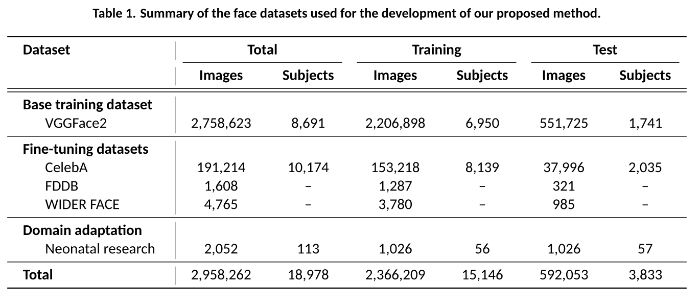
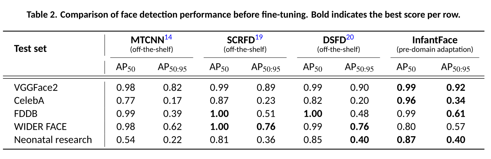
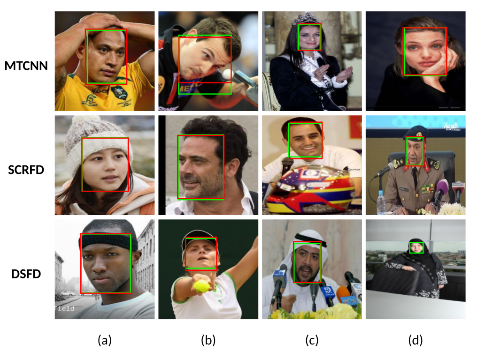
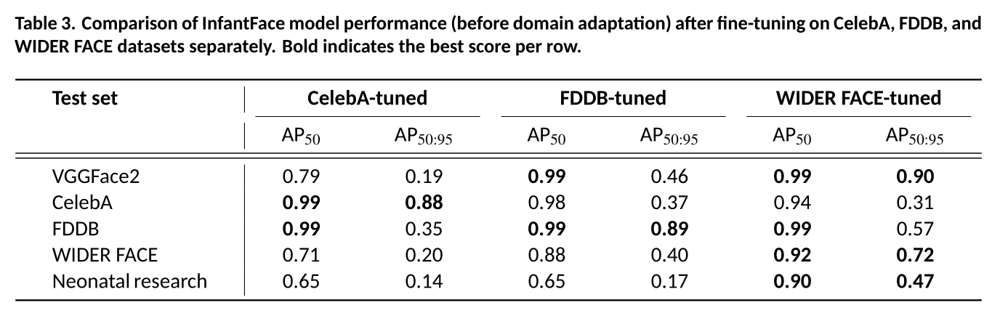

# InfantFace: Detecting infant faces in neonatal clinical environments

## 摘要

**论文元信息。** 本文解析的论文为 *InfantFace: Detecting infant faces in neonatal clinical environments*，arXiv ID 为 2606.20449，作者包括 Abdullah Bin-Obaid、Maria M. Cobo、Rebeccah Slater、Lionel Tarassenko 和 Mauricio Villarroel，发布时间为 2026-06-18，类别为 cs.CV。论文明确说明该稿件是尚未同行评审的预印本，最终发表版本可能不同，见 PAGE 1。论文链接为 http://arxiv.org/abs/2606.20449v1，PDF 链接为 https://arxiv.org/pdf/2606.20449v1。

**代码状态。** 论文在 “Code availability” 中写明，训练注释、训练说明和对应代码将在论文接收后于 `https://github.com/lcmtlab/InfantFace` 提供，见 PAGE 22。因此，基于当前给定材料，本文未提供可确认的公开代码；本文不写源码段，也不把 YOLOv11m 或 Ultralytics 通用实现误当作作者代码。

**一句话总结。** InfantFace 并不是提出全新的检测网络结构，而是将 COCO 预训练的 YOLOv11m 系统性迁移到新生儿临床环境：先用大规模公开人脸数据建立单人脸检测能力，再用公开 benchmark 和新生儿临床视频帧做域适配，使 neonatal research dataset 上的 AP50 从 0.87 提升到 0.96，AP50:95 从 0.40 提升到 0.67，见 PAGE 2、PAGE 12。

本文的核心价值在于把“新生儿临床场景中的人脸检测”作为一个独立、可复现、以标准检测指标评估的问题来处理。该任务看似只是 face detection（人脸检测），但论文强调临床环境中的遮挡、低照度、设备干扰、姿态变化和数据隐私约束，使通用人脸检测器难以直接迁移，见 PAGE 2、PAGE 3、PAGE 12。

本文的主要贡献可概括为三点。第一，作者构建了从公开数据到临床数据的训练与域适配流程，包括 VGGFace2 基础训练、CelebA/FDDB/WIDER FACE 细调、以及 neonatal research dataset 临床域适配，见 PAGE 3、PAGE 14。第二，作者使用 MTCNN、SCRFD 和 DSFD 三个检测器对 VGGFace2 等候选图像做单人脸一致性筛选，并用 detector consensus 生成 VGGFace2 参考框，见 PAGE 14、PAGE 15。第三，作者采用 AP50 和 AP50:95 两类标准目标检测指标，区分“找到脸”和“框得准”两个层面的性能，见 PAGE 6、PAGE 10、PAGE 12。

需要注意的是，本文的创新主要位于数据治理、训练策略、临床域适配和评估协议，而不是 YOLOv11m 网络结构本身。论文在方法部分明确使用 YOLOv11m medium 版本，并将 COCO 预训练模型的 80 类检测头重配置为单类 face 检测头，见 PAGE 16。换言之，InfantFace 更适合作为临床小样本域适配流程的参考，而不是作为一种新检测架构引用。

## 研究背景与动机

新生儿临床环境中的人脸定位是多种非接触式视频分析任务的前置步骤。论文在摘要中列举了 pain and distress related facial expression analysis（疼痛与痛苦相关面部表情分析）、pain scoring（疼痛评分）、cardiorespiratory signal extraction（心肺信号提取）和 cessation of breathing alerts（呼吸停止告警）等应用，见 PAGE 2。这些任务都依赖稳定的人脸区域，因为后续表情、PPGi 信号或行为分析通常需要先确定 face region 或 region of interest。

通用人脸检测在自然图像中已经相当成熟，但论文指出 face detection 本身仍受 cluttered backgrounds（杂乱背景）、occlusion（遮挡）、scale variation（尺度变化）、illumination changes（光照变化）、camera orientation（相机视轴方向）、multiple faces（多张脸）和 skin colour（肤色）等因素影响，见 PAGE 2、PAGE 3。新生儿临床环境把这些问题进一步放大，因为婴儿可能躺在 cot 或 incubator 中，周围存在医护人员、床栏、毯子、监护线缆和治疗设备。

论文特别强调 clinical neonatal environments（临床新生儿环境）中的遮挡与设备干扰。feeding tubes（喂养管）、endotracheal tube fixations（气管插管固定装置）、phototherapy goggles（光疗护目镜）等医疗设备会遮挡面部；blood sampling（采血）、feeding（喂养）、nappy changes（换尿布）和 ventilation support（通气支持）等常规操作会引入运动和视觉变化，见 PAGE 3。这些场景不同于成年人自拍、新闻图像或社交媒体图像，因而模型迁移不能只看通用 benchmark 上的表现。

从相关工作看，MTCNN、BlazeFace、RetinaFace、SCRFD 和 DSFD 分别代表了多阶段级联、移动端轻量检测、one-stage dense detection、样本与计算重分配、dual-shot 两阶段增强等方法路线，见 PAGE 4、PAGE 5。然而，论文指出这些 general face detectors 主要在成人、青少年和儿童数据上发展，并且已有研究报告它们在 NICU 或临床新生儿环境中性能下降，见 PAGE 5、PAGE 11。这构成了 InfantFace 的直接研究动机。

已有新生儿相关工作也存在评估或数据局限。Dosso et al. 在 NICU 数据上评估并 fine-tune RetinaFace 和 YOLO5Face，但训练中使用较低 IoU 阈值 0.2，可能高估宽松框的性能；评估时只选择每张图最高置信度检测，额外 false positives 不被惩罚，见 PAGE 5。Hausmann et al. 使用 YOLOv5/YOLOv6 做 neonatal face detection，但 baseline 是通用目标检测器而非通用人脸检测器，且跨数据集 generalisability 从 99% 降至 62.7%，见 PAGE 5。Gleichauf et al. 使用 RGB 与 thermal 图像进行 sensor fusion，但数据规模有限，并且目标是 head region 而非 face，见 PAGE 6。

因此，本文的出发点不是单纯证明 YOLOv11m “更强”，而是回答一个更具体的问题：如果要在受隐私限制、样本较少、遮挡严重的新生儿临床视频中稳定定位 face，如何设计一个从公开数据预训练到临床域适配的完整流程，并用标准检测指标评估其泛化和定位精度，见 PAGE 3、PAGE 14、PAGE 21。

## 预备知识

**AP50 与 AP50:95。** 论文使用 AP50 和 AP50:95 作为主要评估指标。AP50 是在 IoU threshold = 0.5 下计算的 Average Precision；AP50:95 是在 IoU 从 0.50 到 0.95、步长为 0.05 的多个阈值上取平均的 AP，见 PAGE 6。前者更强调是否找到了 face，后者更严格地衡量 bounding box localisation precision（边界框定位精度）。

论文给出 AP 的定义：

$$
\mathrm{AP}=\sum_n (R_n-R_{n-1})\cdot P_n
$$

其中，$R_n$ 表示 precision-recall curve（精确率-召回率曲线）上第 $n$ 个点的 recall（召回率），$P_n$ 表示该点的 precision（精确率），见 PAGE 6。通俗地说，这个公式把不同召回水平下的精确率进行加权累计，衡量模型在从低召回到高召回过程中保持高精确率的能力。

**IoU 与 localisation。** IoU（Intersection over Union，交并比）用于衡量预测框与 ground-truth box 的重叠程度。论文指出，当一个模型 AP50 高但 AP50:95 低时，说明模型能够找到 face，但 bounding box 未必定位准确，见 PAGE 6。这一点对新生儿临床视频很关键，因为后续表情分析或 PPGi 信号提取对人脸 ROI 的空间精度敏感。

**YOLOv11m。** YOLO（You Only Look Once）是一类 one-stage object detector（单阶段目标检测器）。本文使用 YOLOv11m，其中 “m” 表示 medium-sized version；模型初始权重来自 COCO 预训练，并将 80 类通用目标检测头改成单一 “face” 类检测头，见 PAGE 16。论文 Figure 2 显示该模型由 backbone（主干特征提取）、neck（多尺度特征融合）和 multiscale detection head（多尺度检测头）组成，见 PAGE 17。

## 方法详解

### 1. 总体流程：从公开人脸数据到新生儿临床域适配

InfantFace 的训练路径可以分为四步。第一步，作者使用 COCO 预训练 YOLOv11m 作为初始检测器，并将其检测头改为单类 face，见 PAGE 16。第二步，在 VGGFace2 上进行 base training（基础训练），其中 VGGFace2 原本用于 face recognition，但作者通过三检测器一致性筛选构造单人脸训练样本，见 PAGE 12、PAGE 14、PAGE 15。第三步，分别在 CelebA、FDDB 和 WIDER FACE 上 fine-tune，以考察不同公开 benchmark 对泛化的影响，见 PAGE 8、PAGE 21。第四步，在 neonatal research dataset 上做 domain adaptation（域适配），得到面向临床新生儿场景的 InfantFace，见 PAGE 9、PAGE 10、PAGE 21。

这一流程的关键不是“把所有数据混在一起训练”，而是把不同数据集扮演的角色分开。论文明确称 VGGFace2 为 base training dataset，CelebA、FDDB 和 WIDER FACE 为 fine-tuning datasets，neonatal research dataset 为 domain adaptation dataset，见 PAGE 14。这种分层命名使实验问题更清楚：基础训练学习一般人脸表示，公开 benchmark fine-tuning 评估跨域迁移，新生儿数据则用于目标域适配。

### 2. 数据集构成与临床数据来源

公开数据部分包括 VGGFace2、CelebA、FDDB 和 WIDER FACE。VGGFace2 包含 3,163,185 张图像和 8,691 个身份，具有年龄、姿态、光照、职业、种族和背景变化，见 PAGE 12。CelebA 包含 202,599 张图像和 10,177 个身份，每张图像有单个标注人脸，见 PAGE 12。FDDB 包含 2,845 张图像和 5,171 个标注人脸，包含遮挡、姿态变化和失焦等挑战，见 PAGE 12、PAGE 13。WIDER FACE 包含 32,203 张图像和 393,703 张人脸标注，其中公开可用部分为 16,106 张图像和 199,128 张人脸，见 PAGE 13。

临床数据部分来自 228 段视频记录，覆盖 114 次 recording sessions 和 113 名 independent infants。每次 session 包括两个 45 秒视频，一个是 clinically-required heel lance procedure（临床需要的足跟采血过程），一个是 paired control recording（非疼痛刺激对照记录），见 PAGE 13。数据来自 Petal trial 和 “Investigating Pain in the Developing Human Brain” 研究，论文说明已获得伦理审批和书面父母知情同意，见 PAGE 13。

作者从每个 45 秒视频中每 5 秒随机抽取一帧，即每段视频 9 帧，并将帧尺寸按 1/3 下采样为 426 × 240 或 240 × 426，保持宽高比。最终 neonatal research dataset 包含 2,052 帧，来自 114 个 recording sessions 和 113 名 independent infants，见 PAGE 15。这个数据量相对于公开人脸数据极小，因此后续采用 domain adaptation 而非从头训练是合理选择。

| 数据集 | 论文角色 | 规模信息 | 关键特征 | 页码证据 |
|---|---|---:|---|---|
| VGGFace2 | Base training dataset | 3,163,185 images, 8,691 identities | 年龄、姿态、光照、种族、背景变化丰富 | PAGE 12 |
| CelebA | Fine-tuning dataset | 202,599 images, 10,177 identities | 单人脸图像，背景、姿态、光照多样 | PAGE 12 |
| FDDB | Fine-tuning / benchmark | 2,845 images, 5,171 faces | unconstrained settings，含遮挡、姿态、失焦 | PAGE 12-13 |
| WIDER FACE | Fine-tuning / benchmark | 32,203 images, 393,703 faces；公开部分 16,106 images, 199,128 faces | 尺度、姿态、遮挡变化大，61 个事件类别 | PAGE 13 |
| Neonatal research dataset | Domain adaptation dataset | 228 videos, 2,052 frames, 113 infants | 临床新生儿视频，含足跟采血与对照记录 | PAGE 13、PAGE 15 |

表格解读：这张表说明 InfantFace 的训练不是单一数据集实验。VGGFace2 提供大规模基础能力，CelebA/FDDB/WIDER FACE 提供公开 benchmark 细调与横向评估，neonatal research dataset 则承担目标域适配。由于临床数据只有 2,052 帧，直接训练深度检测器容易过拟合；论文选择先学习通用人脸表示再做临床细调，符合小规模医疗视觉数据的常见工程约束。

### 3. 单人脸样本筛选与注释标准化

论文的一个方法重点是获得更适合 neonatal cot/incubator 场景的 single-face training samples（单人脸训练样本）。作者认为临床新生儿图像中通常只应观察到一个 infant face，因此在公开数据中也尽量筛选单人脸图像，见 PAGE 14。然而，作者手动检查发现，VGGFace2、CelebA、FDDB 和 WIDER FACE 中存在“标注为单脸但图像中可见多张脸”的情况，补充材料 Figure B.2 给出示例，见 PAGE 14、PAGE 30。

为解决这一问题，作者使用 MTCNN、SCRFD 和 DSFD 三个 state-of-the-art face detectors 作为 annotators。对每张候选图像，若任一 detector 未返回 face，则剔除；若三个 detector 都返回框，则计算三组 bounding boxes 的 pairwise IoU；只有所有 pairwise IoU 都不低于 0.60 的图像才被保留为 valid single face samples，见 PAGE 15。对保留图像，作者将三个模型输出框的四个角坐标取平均并四舍五入，生成 reference bounding box，见 PAGE 15。

这一过程本质上是一种 detector consensus filtering（检测器共识筛选）。它并不保证绝对无误，但比直接相信原始数据集标注更适合本文任务，因为多个结构不同的检测器在同一张图上给出高度重叠的单一检测结果，通常意味着该图像确实包含一个主要 face。论文同时保留 CelebA、FDDB 和 WIDER FACE 的官方 ground-truth boxes 用于 fine-tuning 和 evaluation，以保证与既有 benchmark 对齐；只有 VGGFace2 的注释被替换为新计算的 reference boxes，见 PAGE 15。

对于 FDDB，原始标注是 elliptical annotations（椭圆标注），而训练与评估 pipeline 需要 axis-aligned rectangular bounding boxes（轴对齐矩形框）。因此，作者将 FDDB 的椭圆转为最小外接矩形，见 PAGE 15、PAGE 28、PAGE 31。需要说明的是，PAGE 28 的公式在给定文本抽取中缺失具体表达式，因此本文不重写该转换公式，只保留“将椭圆转换为最小外接矩形”这一有文本证据支持的结论。

### 4. 图表证据：公开数据与检测示例

用途：下图用于辅助定位 PAGE 7 的结果图表区域。由于自动抽取的 caption candidate 仅给出 “figure 1.”，无法从给定材料可靠确认其精确图号或表号；本文不从该图像中读取新增数值，只将其作为 PAGE 7 结果段落的视觉证据。

读图要点：PAGE 7 文本进入 “Performance of general face detectors” 小节，并讨论 Table 2 中 MTCNN、SCRFD、DSFD 与 InfantFace pre-adaptation 在各测试集上的性能，见 PAGE 7。该图像资产应结合 PAGE 7 文本和后文表格解读，而不是单独作为数值来源。

支撑的判断：本文关于 general face detectors 与 InfantFace pre-adaptation 的结论，主要依据 PAGE 7 和 PAGE 12 的文字数值，而不是该图像中无法核验的细粒度数字。

用途：下图同样用于辅助 PAGE 7 的结果区域阅读。给定 figure metadata 没有提供可靠 caption，因此本文仅把它作为“论文在 PAGE 7 附有结果图表”的证据，不将其解释为新的实验结果。

读图要点：PAGE 7 明确提到 Table 2 报告三种 general face detectors 与 InfantFace pre-adaptation 的性能，并指出 InfantFace 在 neonatal research dataset 上 AP50 为 0.87，高于所有三个通用检测器，见 PAGE 7。

支撑的判断：InfantFace 在临床新生儿数据上优于 MTCNN、SCRFD、DSFD 的判断有文本证据；但三种 baseline 的具体 AP 数值在给定抽取文本中未出现，因此本文不会补全或猜测。

用途：下图对应论文 Figure 1，用于展示不同 face detectors 在公开数据集上的检测示例。它支撑“不同数据集具有明显视觉差异，并且检测器在复杂样本上可能失效”的判断，见 PAGE 8。

读图要点：Figure 1 的列对应 VGGFace2、CelebA、FDDB 和 WIDER FACE；绿色框来自左侧列出的 face detectors，红色框来自 InfantFace pre-domain adaptation。论文特别说明，在 WIDER FACE 的一个底部图像中，InfantFace 没有检测到目标，见 PAGE 8。

支撑的判断：该图不是为了证明 InfantFace 在所有场景中都稳定优于 baseline，而是说明公开数据集内部也存在显著 domain shift，尤其 WIDER FACE 的尺度、遮挡和场景复杂度更高。这与 PAGE 7、PAGE 9、PAGE 11 中 WIDER FACE 对泛化的作用相互呼应。

用途：下图用于辅助 PAGE 9 的 model adaptation performance 结果区域。由于给定 caption_candidates 为空，本文不把它命名为某个确定图号；结合 PAGE 9 文本，它最可能位于 Table 4 相关结果附近。

读图要点：PAGE 9 开始讨论 Table 4，即 InfantFace 在 WIDER FACE + neonatal fine-tuning 和 neonatal-only domain adaptation 下的表现。PAGE 10 进一步给出关键结论：neonatal research dataset 上两种模型 AP50 均为 0.96，而直接 neonatal-adapted InfantFace 的 AP50:95 为 0.67，略高于 WIDER FACE + neonatal-adapted 的 0.65，见 PAGE 9、PAGE 10。

支撑的判断：该图像资产支持本文在实验分析中区分 AP50 与 AP50:95 的必要性。即使 AP50 相同，AP50:95 仍能揭示 localisation precision 的差异。

### 5. 模型结构：YOLOv11m 的单类检测改造

论文采用 YOLOv11m medium 版本，初始权重来自 COCO dataset。COCO 预训练检测头原本配置为 80 个 object classes；作者将输出类别数设为 1，对应唯一目标类 “face”，见 PAGE 16。该设计说明 InfantFace 是 single-class object detection（单类别目标检测）问题，而不是 face recognition、landmark detection 或 expression classification。

Figure 2 展示了 YOLOv11m 的三个主要组成部分：backbone、neck 和 multiscale detection head，见 PAGE 17。Backbone 提取图像特征，neck 融合不同空间分辨率的特征图，detection head 在多个尺度上输出边界框和类别置信度。论文还标注 CBS、SPPF、C2PSA、C3K2 等 YOLO 架构模块，见 PAGE 17。给定 figures 列表中没有 PAGE 17 的 Figure 2 图像路径，因此本文只做文字引用，不插入不存在的图片。

从方法创新角度看，YOLOv11m 架构本身不是本文原创。论文引用 Ultralytics YOLOv11，并说明使用其 medium 版本，见 PAGE 16、PAGE 26。本文的工程贡献主要在于如何将该检测器与单人脸筛选、注释标准化、跨公开数据 fine-tuning、新生儿临床域适配和严格评估协议组合起来。

### 6. 数据划分与交叉验证

对 base training 和 fine-tuning datasets，作者先保留 20% 作为 holdout test set，再将剩余 80% 划分为 80% training 和 20% validation。因此整体比例为 64% training、16% validation、20% testing，见 PAGE 16。作者在剩余 80% 内做 five-fold cross-validation，以获得更稳健的性能估计，见 PAGE 16、PAGE 17。

为了避免 subject leakage（同一受试者泄漏到训练与测试），VGGFace2 和 CelebA 使用 identity-level stratified sampling；WIDER FACE 按 category 分层；FDDB 因缺少 identity 或 category metadata，随机划分，见 PAGE 16。这一点对 face detection 评估很重要，因为同一身份或相似场景若同时出现在训练和测试中，会高估泛化能力。

对 neonatal research dataset，作者按 participant 划分数据。来自同一 infant 的两个 recording sessions 被放入同一 split；57 名 participants 分配到 test set，剩余 56 名 participants 用于 model development，包括 training 和 validation，见 PAGE 17。这一近似 50/50 的划分是为了在临床数据较小的情况下尽可能扩大测试集，见 PAGE 17。

### 7. 数据增强与输入尺寸

所有训练图像先 resize 到 128 × 128，并通过 zero-padding 保持 aspect ratio，见 PAGE 18。作者使用 YOLO 官方 pipeline 的默认 augmentation，同时明确调整若干策略。Horizontal flip 概率为 0.5；vertical flip 不使用，因为医院中 infant 通常以标准方向放置，头部朝向 cot 或 incubator 的 head end，见 PAGE 18。

作者使用 ±90° random rotation，以适应 head tilt 和 camera angle variation；使用 10% translation，使模型学习部分可见 face，例如被医疗设备遮挡时的情况；使用 ±25° shear 模拟视角变化；启用 perspective augmentation，系数为 0.001，见 PAGE 18。这些增强策略都与临床视频中的真实扰动相对应。

为提高小脸检测能力，作者使用 multi-scale training，scale factor 在 0.5 到 1.5 之间，使输入图像尺寸在 64 × 64 到 192 × 192 之间变化，见 PAGE 18。论文还根据 VGGFace2 的 face-to-image ratio 和 image dimensions 做数据驱动的输入尺寸选择，补充材料 Figure D.4 和 Figure D.5 分别展示 face-to-image ratio 和图像尺寸分布，见 PAGE 30、PAGE 31、PAGE 32。

颜色增强方面，作者将 RGB 转为 HSV，并对每张图像计算 $\bar{H}_i$、$\bar{S}_i$、$\bar{V}_i$，即第 $i$ 张图像在 Hue、Saturation、Value 三个通道上的均值。随后在图像间计算这些均值的标准差 $\sigma_H$、$\sigma_S$、$\sigma_V$，并用 3 倍标准差归一化、裁剪到 $[0,1]$，得到 H/S/V gains 分别为 0.42、0.41、0.42，见 PAGE 18。这说明颜色扰动幅度不是任意设定，而是来自训练数据分布。

### 8. 损失函数：单类检测下的定位优先

论文将 total loss 定义为 bounding box loss、classification loss 和 Distribution Focal Loss 的加权和：

$$
L_{\mathrm{total}}=\lambda_{\mathrm{box}}L_{\mathrm{box}}+\lambda_{\mathrm{cls}}L_{\mathrm{cls}}+\lambda_{\mathrm{dfl}}L_{\mathrm{dfl}}
$$

其中，$L_{\mathrm{box}}$ 是边界框损失，$L_{\mathrm{cls}}$ 是分类损失，$L_{\mathrm{dfl}}$ 是 Distribution Focal Loss；$\lambda_{\mathrm{box}}$、$\lambda_{\mathrm{cls}}$、$\lambda_{\mathrm{dfl}}$ 是对应权重，见 PAGE 18、PAGE 19。这个公式的含义是：训练目标同时优化框的位置、类别判断和边界框分布回归，但三者的重要性可通过权重调节。

作者将 $\lambda_{\mathrm{box}}$ 设为 8.0，以更强惩罚不准确 bounding box；将默认 YOLO 的 $\lambda_{\mathrm{cls}}$ 从 0.5 降到 0.1，因为本文只有一个 face 类，不需要像 COCO 80 类检测那样强调多类分类；$\lambda_{\mathrm{dfl}}$ 保持默认 1.5，见 PAGE 19。这个权重配置与本文任务一致：分类问题简单，定位精度更重要。

Bounding box loss 定义为：

$$
L_{\mathrm{box}}=1-\mathrm{CIoU}
$$

其中，CIoU 是 Complete-IoU，见 PAGE 19。这个公式表示 CIoU 越高，框越接近 ground truth，损失越低；当预测框与真值框重合程度差、中心距离大或长宽比不匹配时，损失会增加。

论文给出 CIoU 的组成：

$$
\begin{aligned}
\mathrm{CIoU} &= \mathrm{IoU}-\frac{\rho^2(p,p_{\mathrm{gt}})}{c^2}-\alpha V, \\
\alpha &= \frac{V}{(1-\mathrm{IoU})+V}, \\
V &= \frac{4}{\pi^2}\left(\arctan\frac{w}{h}-\arctan\frac{w_{\mathrm{gt}}}{h_{\mathrm{gt}}}\right)^2.
\end{aligned}
$$

其中，$\rho^2(p,p_{\mathrm{gt}})$ 是预测框中心 $p$ 与 ground-truth box 中心 $p_{\mathrm{gt}}$ 的平方距离，$c$ 是同时包住预测框和真值框的最小外接框对角线长度，$w,h$ 是预测框宽高，$w_{\mathrm{gt}},h_{\mathrm{gt}}$ 是真值框宽高，$V$ 是 aspect-ratio penalty，$\alpha$ 是 $V$ 的权重，见 PAGE 19。人话解释是：CIoU 不只看框重叠面积，还惩罚中心偏移和长宽比不一致，因此比普通 IoU 更适合强调定位质量。

Classification loss 使用 binary cross-entropy：

$$
L_{\mathrm{cls}}=-\frac{1}{S}\sum_{i=1}^{N}\left[y_i\log\sigma(x_i)+(1-y_i)\log(1-\sigma(x_i))\right]
$$

其中，$x_i$ 是第 $i$ 个 candidate box 的 predicted logit，$y_i\in[0,1]$ 表示该预测与 ground-truth face 的匹配程度，$\sigma(\cdot)$ 是 sigmoid function，$N$ 是 batch 中 candidate boxes 总数，$S$ 是所有 targets 的和，见 PAGE 20。这个公式在说：如果某个候选框应该是 face，模型就要给它高概率；如果不是 face，模型就要给它低概率。

Distribution Focal Loss 定义为：

$$
L_{\mathrm{dfl}}=-\left[(y_{i+1}-y)\log P_i+(y-y_i)\log P_{i+1}\right]
$$

其中，$y$ 是连续回归目标，$y_i$ 与 $y_{i+1}$ 是相邻的两个离散值，$P_i$ 和 $P_{i+1}$ 是模型预测到这两个离散值的概率，见 PAGE 20。该公式的直观含义是：边界框回归不是只预测一个离散 bin，而是把连续目标分配给相邻离散点，从而提高定位回归的细粒度表达能力。

### 9. 优化器、训练细节与评估协议

作者使用 SGD optimiser，学习率为 $10^{-3}$，batch size 为 64，训练 50 epochs，并采用 early stopping：如果 validation loss 不下降且 AP50 不增加连续 20 个 epochs，就停止训练，见 PAGE 20。SGD with momentum 的更新规则为：

$$
\begin{aligned}
v_{t+1} &= \mu\cdot v_t+g_{t+1}, \\
p_{t+1} &= p_t-\mathrm{lr}\cdot v_{t+1}.
\end{aligned}
$$

其中，$v$ 是 velocity（速度项），$\mu$ 是 momentum coefficient（动量系数），$g$ 是 gradient（梯度），$p$ 是 model parameters（模型参数），$\mathrm{lr}$ 是 learning rate，见 PAGE 20。这个公式说明当前更新不仅依赖当前梯度，也累积过去方向，从而使优化更平滑。

在完成 VGGFace2 五折训练后，作者评估每折 best model，并选择 AP 最高的一折模型作为 InfantFace pre-adaptation model，用于后续 fine-tuning 和 domain adaptation，见 PAGE 20、PAGE 21。随后，作者分别在 CelebA、FDDB、WIDER FACE 和 neonatal research dataset 上继续训练，并在 fine-tuning 阶段将学习率降为 $10^{-4}$，batch size 降为 16，见 PAGE 21。

论文还说明 fine-tuning 时冻结 backbone，保留其通用面部特征提取能力，同时让其余层学习临床新生儿域的任务特异模式，见 PAGE 21。评估时使用 multi-scale training 中的最大图像尺寸 192 × 192，并将 confidence threshold 设置为 0.25，见 PAGE 21。作者指出较低阈值会产生更多候选检测和潜在 false positives，因此评估更严格、更接近实际部署，见 PAGE 21。

### 10. 代码分析状态

基于提供的论文全文，本文未提供可确认的公开代码。PAGE 22 的表述是 annotations、training instructions 和 corresponding code “will be made available” 于 GitHub，并附链接 `https://github.com/lcmtlab/InfantFace`，条件是 upon acceptance，见 PAGE 22。由于当前材料没有 README、源码文件、配置文件或 release 状态，代码层面的“文件路径:行号”证据不足。

因此，本文不写伪代码段，也不把论文中的方法描述改写成源码。可确认的实现细节仅包括：YOLOv11m medium、COCO pretrained weights、single face class head、batch size、learning rate、loss weights、augmentation、early stopping、evaluation image size 和 confidence threshold 等，这些均来自 PAGE 16、PAGE 18、PAGE 19、PAGE 20、PAGE 21。

## 实验分析

### 1. 实验设置概述

论文实验围绕三个问题展开。第一，InfantFace pre-adaptation 与 MTCNN、SCRFD、DSFD 三种 general face detectors 相比，在公开数据和 neonatal research dataset 上表现如何，见 PAGE 7。第二，分别在 CelebA、FDDB 和 WIDER FACE 上 fine-tune 后，模型跨数据集泛化如何，见 PAGE 8、PAGE 9。第三，在 neonatal research dataset 上做 domain adaptation 后，是否能显著提高临床新生儿域性能，见 PAGE 9、PAGE 10、PAGE 12。

作者使用 AP50 与 AP50:95 同时报告性能，这一点比只报告 accuracy 或只报告 AP50 更有信息量。AP50 可以反映模型是否能大体找到 face，AP50:95 则更严格衡量框的位置精度，见 PAGE 6。论文讨论中反复指出 AP50 与 AP50:95 的差距，尤其 CelebA 和 neonatal adaptation 结果，说明模型“检测到脸”和“精确框住脸”是两个不同问题，见 PAGE 7、PAGE 10、PAGE 12。

### 2. General face detectors 与 InfantFace pre-adaptation

PAGE 7 的结果表明，InfantFace pre-adaptation 在 VGGFace2 上达到 AP50 = 0.99、AP50:95 = 0.92；在 CelebA 上 AP50 = 0.96、AP50:95 = 0.34；在 WIDER FACE 上 AP50 = 0.80；在 neonatal research dataset 上 AP50 = 0.87，且高于 MTCNN、SCRFD 和 DSFD，见 PAGE 7。PAGE 12 进一步给出 neonatal research dataset 上 pre-adaptation AP50:95 = 0.40，见 PAGE 12。

| 对比对象 / 数据集 | AP50 | AP50:95 | 论文中的关键结论 | 页码证据 |
|---|---:|---:|---|---|
| InfantFace pre-adaptation on VGGFace2 | 0.99 | 0.92 | 最好表现出现在训练来源相关数据上，符合预期 | PAGE 7、PAGE 10 |
| InfantFace pre-adaptation on CelebA | 0.96 | 0.34 | AP50 高但 AP50:95 低，说明框定位精度不足 | PAGE 7 |
| InfantFace pre-adaptation on WIDER FACE | 0.80 | 证据不足 | WIDER FACE 是该模型表现最差的公开数据集之一 | PAGE 7 |
| InfantFace pre-adaptation on neonatal dataset | 0.87 | 0.40 | AP50 高于 MTCNN、SCRFD、DSFD，但仍需域适配 | PAGE 7、PAGE 12 |
| MTCNN / SCRFD / DSFD on neonatal dataset | 低于 0.87 | 证据不足 | 三个通用检测器 AP50 均低于 InfantFace pre-adaptation | PAGE 7 |

表格解读：这张表最重要的信息不是“InfantFace 在所有公开数据上都最好”，而是 AP50 与 AP50:95 的差距。CelebA 上 AP50 = 0.96 但 AP50:95 = 0.34，说明模型能找到脸，却未必给出高精度框。对于临床应用，这种差距很关键，因为后续痛觉表情分析或 PPGi 信号提取依赖稳定 ROI。与此同时，neonatal dataset 上 pre-adaptation AP50 = 0.87、AP50:95 = 0.40，说明通用训练已经有一定迁移能力，但不足以满足更严格定位要求。

### 3. 公开 benchmark fine-tuning 的跨数据集影响

论文分别在 CelebA、FDDB 和 WIDER FACE 的 training subsets 上 fine-tune InfantFace pre-adaptation，然后在所有 test sets 上评估，见 PAGE 8。PAGE 8 和 PAGE 9 给出的结果显示，某个数据集上 fine-tuned 的模型通常在自身 test split 上表现最好，这说明每个数据集都携带特定 domain characteristics 或 dataset biases，见 PAGE 10。

| Fine-tuning 条件 | 最突出结果 | AP50 | AP50:95 | 说明 | 页码证据 |
|---|---|---:|---:|---|---|
| FDDB-tuned / WIDER FACE-tuned on VGGFace2 | 两者 AP50 均为 0.99；WIDER FACE-tuned AP50:95 最高 | 0.99 | 0.90 | VGGFace2 上仍保持高检测能力 | PAGE 8 |
| CelebA-tuned on CelebA | CelebA test 上最佳 | 0.99 | 0.88 | 自身数据集 fine-tuning 提升定位质量 | PAGE 8 |
| FDDB-tuned on FDDB | FDDB test 上 AP50:95 最佳 | 0.99 | 0.89 | 所有模型 FDDB AP50 均为 0.99，但定位精度不同 | PAGE 8、PAGE 9 |
| WIDER FACE-tuned on WIDER FACE | WIDER FACE test 上最佳 | 0.92 | 0.72 | 对复杂公开场景最有效 | PAGE 9 |
| WIDER FACE-tuned on neonatal dataset | neonatal dataset 上公开数据 fine-tuning 中最好 | 0.90 | 0.47 | WIDER FACE 与新生儿场景存在一定视觉/上下文相似性 | PAGE 9、PAGE 11 |

表格解读：这张表显示 WIDER FACE 在临床迁移中具有特殊价值。虽然 WIDER FACE 是公开 benchmark，不是医疗数据，但其单人脸图像在视觉或上下文上更接近 clinical neonatal images，论文据此解释 WIDER FACE-tuned model 在 neonatal research dataset 上达到 AP50 = 0.90，高于 CelebA 或 FDDB fine-tuned 版本，见 PAGE 11。对业务落地而言，这提示在缺少临床数据时，应优先选择遮挡、尺度、背景变化更丰富的数据源，而不是只选择清洁、正面、单人肖像数据。

### 4. Neonatal domain adaptation 的直接收益

Table 4 讨论两个关键模型：一个是 WIDER FACE + neonatal-adapted，另一个是直接 neonatal-adapted 的 InfantFace。论文说明在后续讨论中，若无特别说明，InfantFace 指直接在 neonatal research dataset 上 domain adaptation 的模型，见 PAGE 9。PAGE 10 给出关键结果：在 neonatal research dataset 上，两种模型 AP50 均达到 0.96；InfantFace 的 AP50:95 为 0.67，略高于 WIDER FACE + neonatal-adapted 的 0.65，见 PAGE 10。

| 模型 / 数据集 | AP50 | AP50:95 | 关键判断 | 页码证据 |
|---|---:|---:|---|---|
| InfantFace pre-adaptation on neonatal dataset | 0.87 | 0.40 | 未做临床域适配时已有一定检测能力，但定位精度较低 | PAGE 12 |
| WIDER FACE-tuned on neonatal dataset | 0.90 | 0.47 | 仅用公开 WIDER FACE fine-tuning 即可改善临床迁移 | PAGE 9、PAGE 11 |
| InfantFace WIDER FACE + neonatal-adapted on neonatal dataset | 0.96 | 0.65 | 临床域适配后 AP50 大幅提升 | PAGE 10 |
| InfantFace neonatal-adapted on neonatal dataset | 0.96 | 0.67 | AP50 与前者相同，但 AP50:95 略高，定位更准 | PAGE 10 |
| InfantFace neonatal-adapted on general benchmarks | 多个 AP 值下降 | 例如 CelebA AP50 0.83、AP50:95 0.23 | 临床专门化会牺牲部分通用 benchmark 表现 | PAGE 10、PAGE 11 |

表格解读：这张表是全文最有业务价值的实验结果。AP50 从 0.87 到 0.96 表明 domain adaptation 显著提高了“能否检测到新生儿脸”的能力；AP50:95 从 0.40 到 0.67 则说明 bounding box localisation precision 也明显改善，见 PAGE 12。更重要的是，论文同时报告了通用 benchmark 上的下降，说明临床专门化并非无代价：模型越适应 neonatal domain，越可能牺牲部分 general-domain performance，见 PAGE 11。

### 5. 消融与对比的证据边界

严格来说，论文没有提供传统意义上逐项 ablation study，例如分别关闭 HSV augmentation、关闭 multi-scale training、改变 $\lambda_{\mathrm{box}}$、不冻结 backbone、不同 confidence threshold 的系统对比。给定全文中没有这些消融表，因此证据不足，不能声称某个单独组件独立贡献了多少性能。

论文提供的是 domain adaptation 和 public dataset fine-tuning 层面的对比。Table 3 支持“不同公开数据集 fine-tuning 会带来不同泛化效果”，见 PAGE 8、PAGE 9、PAGE 10。Table 4 支持“neonatal domain adaptation 能显著提高目标域表现，但会造成通用 benchmark 性能下降”，见 PAGE 9、PAGE 10、PAGE 11、PAGE 12。这些是流程级别的消融，而不是模块级别的消融。

### 6. 关键实验结论

最有说服力的结果是 neonatal research dataset 上 domain adaptation 前后的对比。论文明确写道，fine-tuning on clinical neonatal data 后，AP50 从 0.87 提升到 0.96，AP50:95 从 0.40 提升到 0.67，见 PAGE 12。这个结果同时证明两点：第一，通用人脸检测能力不足以完全覆盖新生儿临床域；第二，即使 clinical dataset 只有 2,052 帧，合理的预训练和 fine-tuning 仍可获得显著改善。

第二个有价值的结果是 WIDER FACE-tuned model 在 neonatal dataset 上达到 AP50 = 0.90、AP50:95 = 0.47，见 PAGE 9。论文解释为单人脸 WIDER FACE 图像与 clinical neonatal images 具有较高视觉或上下文相似性，见 PAGE 11。该结果对没有临床标注数据的团队很实用：如果短期无法获取医疗数据，可以先用更接近真实复杂场景的公开数据做 adaptation，而不是只依赖清洁肖像数据。

第三个值得注意的结果是 AP50 与 AP50:95 的系统差距。论文在 Discussion 中强调，AP50 高而 AP50:95 低说明 detector 能识别人脸存在，但 bounding box localisation 仍需改进，见 PAGE 10。对“检测”团队而言，这一结论提醒评估指标不能只看 AP50 或 recall，否则可能掩盖 ROI 质量不足的问题。

## 讨论

InfantFace 的适用边界比较清晰。它面向的是 neonatal clinical environments 中的 single infant face detection，尤其适用于视频相机驱动的非接触式临床评估前处理，例如疼痛表情分析和 PPGi 信号提取，见 PAGE 2、PAGE 3。论文的训练策略也围绕“cot 或 incubator 中通常只有一个 infant face”这一假设展开，因此单人脸筛选和单类检测头是合理选择，见 PAGE 14、PAGE 16。

该方法不应被直接理解为通用人脸检测器的替代品。Table 4 和 Discussion 表明，neonatal-adapted InfantFace 在临床数据上表现最好，但在 CelebA、FDDB、WIDER FACE 等 general-domain benchmarks 上的 AP 尤其 AP50:95 会下降，见 PAGE 10、PAGE 11。这说明 InfantFace 是 domain-specialised detector（领域专门化检测器），不是跨所有人脸数据集的统一最优模型。

对工程团队而言，本文可借鉴的不是 YOLOv11m 本身，而是数据闭环。第一，使用多个检测器构造更可靠的单人脸训练样本；第二，保持官方 benchmark 注释用于可比评估；第三，按 identity 或 participant 做严格划分防止泄漏；第四，同时报告 AP50 和 AP50:95；第五，用公开复杂场景数据作为临床数据不足时的中间域，见 PAGE 15、PAGE 16、PAGE 17、PAGE 21。

论文仍留下若干未解决问题。其一，模型是否能跨医院、跨摄像设备、跨肤色分布、跨临床流程稳定泛化，当前证据不足。作者的 neonatal research dataset 来自特定研究和医院体系，且由于隐私和伦理限制不可公开，见 PAGE 13、PAGE 22。其二，论文未提供对遮挡类型、低照度强度、设备类别、姿态角度等细粒度子群的性能分析，因此无法判断模型失败模式集中在哪些临床条件。

## 局限分析

作者自述的主要局限是缺少公开可用的新生儿研究数据集。论文明确说，评估不同数据集上的 face detection performance 仍然困难，因为缺少 publicly available neonatal datasets；neonatal research dataset 因敏感性质、父母同意条款和伦理协议限制不能公开，见 PAGE 2、PAGE 12、PAGE 22。这一局限直接影响可复现性和外部验证：其他团队可以复现实验流程的一部分，但无法在同一临床数据上完全复核 Table 4。

作者还指出，临床专门化会导致 general-domain benchmarks 上性能下降。Discussion 中写明，比较 pre-domain adaptation 与 neonatal-adapted 模型时，fine-tuning datasets 上的 AP values 下降，体现了 clinical neonatal domain specialisation 与 general-domain performance retention 之间的 trade-off，尤其体现在 AP50:95 上，见 PAGE 11。这意味着模型部署前必须明确目标域，不能期待一个 neonatal-adapted detector 同时保持最强通用人脸检测性能。

我的独立判断是，本文的实验仍缺少细粒度失败分析。论文 Figure 1 展示了一些公开数据集检测示例，并指出 WIDER FACE 中有未检测到底部图像的情况，见 PAGE 8；但对于 neonatal dataset，全文没有给出按遮挡设备、光照条件、婴儿姿态、肤色、病区类型或拍摄角度分组的 AP。对于医疗场景，这类 subgroup evaluation 很重要，因为总体 AP50 = 0.96 可能掩盖某些高风险场景中的性能下降。

第二个独立局限是，论文没有模块级 ablation。比如 $\lambda_{\mathrm{box}}=8.0$、$\lambda_{\mathrm{cls}}=0.1$、HSV gains、multi-scale training、backbone freezing、confidence threshold = 0.25 等选择都有合理解释，见 PAGE 18、PAGE 19、PAGE 21；但给定全文没有提供逐项对照实验。因此，不能判断性能提升主要来自临床数据、WIDER FACE 中间域、损失权重、数据增强，还是 backbone freezing。对于复现和产品化，这会增加参数迁移的不确定性。

第三个局限是代码尚不可确认公开。论文承诺代码和训练说明将在接收后发布，见 PAGE 22，但当前材料中没有可检查的 repository 内容。对于检测团队而言，这意味着无法核验数据预处理脚本、YOLO 配置、训练命令、随机种子、early stopping 细节、fold selection 逻辑和 evaluation implementation。因此，本文的方法可作为方向参考，但短期复现仍需要自行实现。

## 结论

InfantFace 的学术意义在于把新生儿临床人脸检测从“通用人脸检测器能否凑合用”推进到“用目标域数据、标准指标和可解释训练流程系统评估”。论文证明，YOLOv11m 在大规模公开人脸数据上训练后，已经能在 neonatal dataset 上达到 AP50 = 0.87；但临床域适配能进一步把 AP50 提升到 0.96、AP50:95 提升到 0.67，见 PAGE 12。这说明 domain adaptation 对新生儿临床环境不是锦上添花，而是定位精度提升的关键环节。

从业务价值看，本文对人脸检测团队的主要启示是：特殊人群、特殊场景和强隐私数据的检测任务，往往不能只依赖通用 detector 或单一公开 benchmark。更稳妥的路径是先构建可控的公开数据训练流程，再用少量目标域数据进行严格划分的 adaptation，并同时监控 AP50 与 AP50:95。对 neonatal care 场景而言，未来真正推动该方向发展的关键仍是隐私保护下的公开数据集、跨机构验证和细粒度失败模式分析，见 PAGE 12、PAGE 22。

## 证据索引

| 主题 | 关键证据 | 页码 |
|---|---|---|
| 论文为预印本，尚未同行评审 | Manuscript is a preprint and final version may differ | PAGE 1 |
| 任务动机 | 新生儿 face localisation 是疼痛表情分析、疼痛评分、心肺信号提取、呼吸停止告警的前置步骤 | PAGE 2 |
| 临床挑战 | 杂乱背景、光照变化、低照度、医疗设备遮挡 | PAGE 2、PAGE 3 |
| 方法总述 | YOLOv11m one-stage model，公开数据训练后在 neonatal dataset fine-tune | PAGE 2、PAGE 3 |
| Related work | MTCNN、BlazeFace、RetinaFace、SCRFD、DSFD 及 neonatal prior work 的局限 | PAGE 4、PAGE 5、PAGE 6 |
| AP 公式与 AP50/AP50:95 定义 | AP 定义及 AP50:95 对定位精度更严格 | PAGE 6 |
| InfantFace pre-adaptation 结果 | VGGFace2 AP50 0.99/AP50:95 0.92；CelebA AP50 0.96/AP50:95 0.34；WIDER FACE AP50 0.80；neonatal AP50 0.87 | PAGE 7 |
| Figure 1 | VGGFace2、CelebA、FDDB、WIDER FACE 检测示例；WIDER FACE 有漏检示例 | PAGE 8 |
| Public fine-tuning 结果 | WIDER FACE-tuned 在 neonatal dataset 上 AP50 0.90/AP50:95 0.47 | PAGE 9、PAGE 11 |
| Domain adaptation 结果 | neonatal-adapted InfantFace 在 neonatal dataset 上 AP50 0.96/AP50:95 0.67 | PAGE 10、PAGE 12 |
| 域专门化 trade-off | clinical neonatal specialisation 导致 general benchmark AP 下降 | PAGE 11 |
| 数据集信息 | VGGFace2、CelebA、FDDB、WIDER FACE、neonatal research dataset 规模与来源 | PAGE 12、PAGE 13、PAGE 15 |
| 伦理与隐私 | neonatal dataset 来自伦理审批研究，获得书面父母知情同意 | PAGE 13 |
| 单人脸筛选 | MTCNN、SCRFD、DSFD 三检测器共识；IoU ≥ 0.60；平均角点生成 reference box | PAGE 14、PAGE 15 |
| 注释标准化 | FDDB 椭圆标注转矩形框；不同数据集统一为 rectangular bounding box | PAGE 15、PAGE 28、PAGE 31 |
| YOLOv11m 架构 | COCO pretrained YOLOv11m，80 类头改为 1 类 face；Figure 2 展示 backbone/neck/head | PAGE 16、PAGE 17 |
| 数据划分 | 公共数据 64/16/20；五折交叉验证；identity/category/participant-level split | PAGE 16、PAGE 17 |
| 数据增强 | resize 128 × 128、horizontal flip、rotation、translation、shear、perspective、multi-scale、HSV gains | PAGE 18 |
| 损失函数 | total loss、CIoU box loss、classification BCE、DFL | PAGE 18、PAGE 19、PAGE 20 |
| 优化与评估 | SGD with momentum、50 epochs、early stopping、fine-tuning lr 10^-4、batch size 16、eval size 192、confidence 0.25 | PAGE 20、PAGE 21 |
| 数据可用性 | neonatal research dataset 不公开，因敏感性质、同意条款和伦理限制 | PAGE 22 |
| 代码状态 | code、annotations、training instructions 将在 acceptance 后于 GitHub 提供；当前证据不足以写源码分析 | PAGE 22 |
