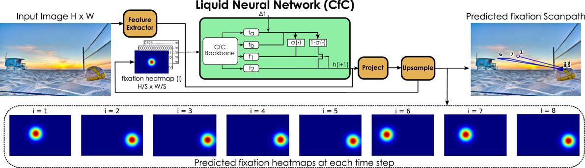
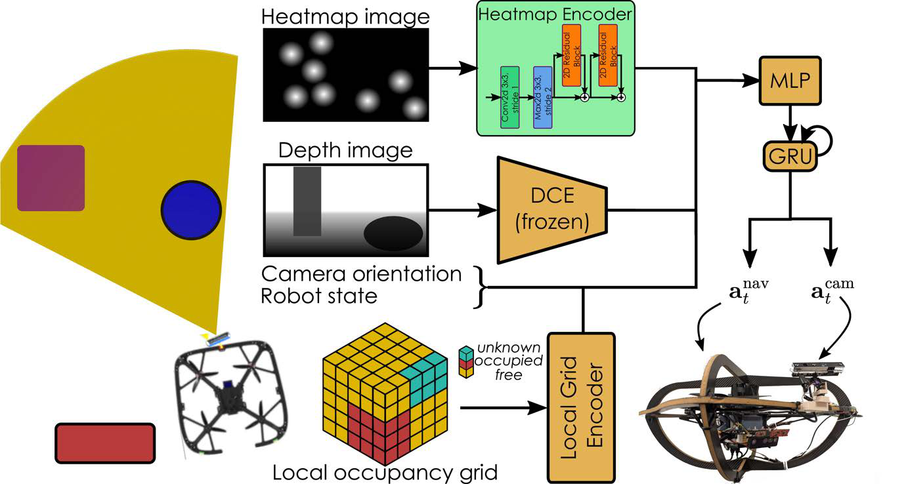
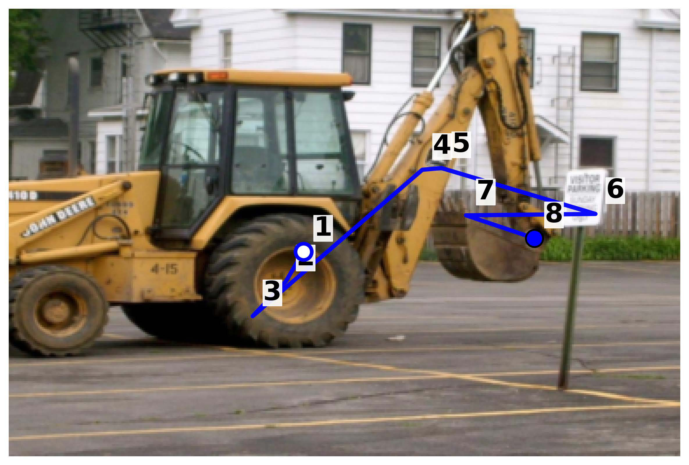

# Fast Human Attention Prediction for Fixation-guided Active Perception in Autonomous Navigation

## 摘要

**论文元信息。** 本文题为 *Fast Human Attention Prediction for Fixation-guided Active Perception in Autonomous Navigation*，作者为 Fatma Youssef Mohammed、Grzegorz Malczyk、Kostas Alexis，arXiv ID 为 2606.20491v1，发布于 2026-06-18，类别为 cs.RO 与 cs.CV，论文链接为 <http://arxiv.org/abs/2606.20491v1>，PDF 链接为 <https://arxiv.org/pdf/2606.20491v1>。论文提出 GazeLNN，一种面向机器人主动感知（active perception）的轻量级人类注视序列预测模型，并将其接入强化学习（Reinforcement Learning, RL）训练的主动相机-机器人控制策略中。代码状态方面，所给全文 PAGE 1-8 未出现可确认的公开代码仓库链接；基于题名、GazeLNN 与作者信息的公开检索也未发现可确认仓库。因此，本文未提供可确认的公开代码，以下不展示源码代码段。

**一句话总结。** GazeLNN 用 MobileNetV3 提取视觉特征、用 Closed-form Continuous-time Liquid Neural Network（CfC-LNN）生成自回归注视热图，在 MIT Low Resolution 数据集上以 0.61 GFLOPs、6.84 ms/frame 达到 0.47 ScanMatch，并进一步驱动无人机主动相机在导航中观察更多显著区域；但其实验指标主要验证“人类注意力预测”和“空间观察覆盖”，尚不能直接推出检测、跟踪或属性识别性能提升（见 PAGE 1、PAGE 5、PAGE 7）。

本文最适合从“小模型/部署”和“视频主动感知”的角度阅读。其业务价值不在于替代目标检测主干，而在于为端侧视频分析提供显著区域选择、帧内 ROI 调度、主动视角控制或计算预算分配的启发。需要同时保留风险判断：论文报告的核心预测指标是 scanpath 相似性，机器人实验报告的是体素覆盖与显著区域观察增益，并未证明下游检测、跟踪、重识别或属性识别指标必然提升（见 PAGE 5、PAGE 7）。

## 背景与动机

自主机器人在高分辨率视觉输入下往往面临计算资源瓶颈。论文开篇指出，对于具备机载资源约束的敏捷平台，全视野、高分辨率视觉处理在计算上通常不可承受；这使机器人视觉系统需要学习类似人类视觉系统的主动感知机制，即将有限的感知和计算资源分配给更有信息量的区域（见 PAGE 1）。

人类视觉系统不是均匀处理整幅图像，而是通过中央凹高分辨率视觉（foveal vision）与外围低分辨率视觉（peripheral vision）的协同工作来完成场景理解。人眼通过快速眼跳（saccades）和短暂停留（fixations）形成注视序列，即 fixation scanpath。论文强调，scanpath 主要受底层视觉特征驱动，例如对比度、颜色、方向等，因此可以看作一种由视觉信息引导的选择性采样行为（见 PAGE 1）。

已有 scanpath prediction 方法在准确性上取得进展，但很多依赖计算量较大的 Transformer 或深层循环模型。论文明确指出，现代 Transformer 与深度 recurrent models 的计算需求和推理速度，使其不适合实时具身机器人部署。这一点构成本文的核心问题设定：不是单纯追求更高的注视预测精度，而是在维持或提升预测质量的同时，将模型压缩到可以服务实时机器人主动感知的成本范围内（见 PAGE 1、PAGE 2）。

从相关工作脉络看，早期视觉注意力模型多依赖静态 saliency map 或手工特征，之后发展出 Winner-Takes-All、Inhibition of Return、ConvLSTM、自回归 recurrent scanpath 等方法，近年 Transformer 进一步刷新性能基准。本文引用近期研究指出，冻结 attention Transformer 中最昂贵的组件仍能取得接近端到端训练模型的表现，这暗示该任务可能不需要过度参数化网络。GazeLNN 的动机正建立在这一判断上：用更节制的架构替代昂贵模型（见 PAGE 2）。

机器人主动感知方面，已有工作将 saliency 用于 SLAM、landmark detection、obstacle avoidance、active visual search、exploration 与 manipulation 表征预训练。与这些工作相比，本文的区别在于同时推进两个环节：第一，提出轻量级 LNN-based scanpath predictor；第二，将该预测器接入 RL-based active camera policy，使机器人在自主飞行中显式优化 human-fixation-guided behavior（见 PAGE 2）。

## 预备知识

**Fixation scanpath（注视路径）** 是由一系列 fixation points 组成的时序轨迹。本文不是直接预测单个显著性热图，而是以自回归方式预测长度为 8 的注视序列：第 $i$ 步预测的 fixation 会作为下一步 $i+1$ 的条件输入，从而形成 sequential fixation heatmaps。该设定保留了人类观看行为中的时间结构，而不是只输出静态 saliency（见 PAGE 2、PAGE 3）。

**Fixation heatmap（注视热图）** 是本文采用的 fixation 表示方式。与直接回归二维坐标 $(x,y)$ 不同，论文沿用 prior work，将 fixation 表示为 Gaussian heatmap，因为这种表示向卷积模型提供更丰富的空间结构。模型还引入 CoordConv layer，为卷积层显式提供 $x$ 与 $y$ 坐标通道，以增强空间定位能力（见 PAGE 2、PAGE 3）。

**Liquid Neural Network（液态神经网络，LNN）** 是本文的 recurrent engine。论文采用的是 Closed-form Continuous-time（CfC）变体，而不是 Liquid Time-Constant（LTC）变体，理由是 CfC 相比 LTC 有更快的训练与推理时间。LNN 的核心价值在于输入相关的时间动态，可以建模人类 gaze behavior 的随机性与时序变化，同时保持较低计算开销（见 PAGE 1、PAGE 3）。

**ScanMatch、Levenshtein Distance、Hausdorff Distance、Fréchet Distance、DTW、TDE** 是本文用于 scanpath 相似性评估的指标集合。字符串类指标将图像离散为 $12\times8$ 网格并把 fixation 转为符号序列；曲线相似度指标关注空间轨迹差异；时间序列指标关注时序结构和不同长度序列的对齐关系（见 PAGE 5）。这些指标衡量的是注视路径与人类 ground truth 的相似性，而不是目标检测或导航成功率本身。

## 方法详解

### 1. GazeLNN 的整体输入、处理与输出

GazeLNN 的输入是一张视觉图像与历史 fixation 表示，输出是下一步 fixation heatmap；重复执行该过程即可生成完整 scanpath。论文说明，第一 fixation 固定在图像中心，后续 fixation 由模型自回归预测。输入图像首先经 MobileNetV3 提取特征，再与上一时刻 fixation heatmap 及 CoordConv 坐标通道拼接，随后送入 CfC-LNN recurrent module（见 PAGE 2、PAGE 3）。

**用途：展示 GazeLNN 从图像、历史注视到下一步热图预测的主干流程。**

**读图要点：** Fig.2 显示输入图像经 feature extraction backbone 处理后，与 previous fixation Gaussian heatmap 及 CoordConv 坐标信息合并；hidden state 初始化为零，经 CfC 模块产生下一步 fixation heatmap，再反馈给后续时间步（见 PAGE 3）。

**支撑的判断：** 该图支撑本文对 GazeLNN 的核心判断：它不是静态 saliency predictor，而是一个以历史 fixation 为条件的 auto-regressive scanpath predictor；同时，轻量化来自 MobileNetV3 与 CfC recurrent engine 的组合，而非简单降低输入分辨率（见 PAGE 3）。

MobileNetV3 被选择为最终 backbone，不是因为其 ScanMatch 明显最高，而是因为它在相近预测性能下显著降低 GFLOPs、参数量与推理时间。论文在 Table II 中显示，MobileNetV3 不带 DeepLabV3 时仍达到 0.47 ScanMatch，同时只有 15.24M 参数、0.61 GFLOPs、6.84 ms 推理时间，是所有列出 backbone 中成本最低的最终选择（见 PAGE 6）。

### 2. CfC-LNN 的隐藏状态更新公式

论文给出的 CfC hidden state update 为：

$$
h_{i+1}
=
(1-\sigma(t_a\Delta t+t_b))\odot\tanh(f_1(x_t))
+
\sigma(t_a\Delta t+t_b)\odot\tanh(f_2(x_t))
$$

其中，$h_{i+1}$ 表示第 $i+1$ 步的隐藏状态，$\sigma(\cdot)$ 是 sigmoid activation，$\Delta t$ 是 fixations 之间的 elapsed time，$t_a$ 与 $t_b$ 用于计算时间相关门控信号，$f_1$ 与 $f_2$ 是两个并行全连接分支，$x_t$ 表示当前输入，$\odot$ 表示逐元素乘法（见 PAGE 3）。

这条公式的直观含义是：CfC 并不是简单把当前输入压成一个新 hidden state，而是用一个依赖 $\Delta t$ 的门控函数，在两个候选状态 $\tanh(f_1(x_t))$ 与 $\tanh(f_2(x_t))$ 之间进行连续插值。时间间隔越影响门控值，模型越能根据 fixation duration 调整状态更新方式。训练时 $\Delta t$ 来自 ground-truth fixation durations；部署到主动相机策略时，由于没有 ground-truth duration，论文将 $\Delta t$ 固定为 1（见 PAGE 3）。

该设计对应本文的第一个核心创新：将轻量视觉 backbone 与连续时间 recurrent dynamics 结合，用较低计算量建模 scanpath 的时序结构。与 ConvLSTM 相比，CfC 在本文实验中不仅计算效率更高，而且 ScanMatch 更高；Table III 显示，在相同 VGG19+DeepLabV3 backbone 下，Bayesian ConvLSTM 与 ConvLSTM 的 ScanMatch 均为 0.34，而 CfC 为 0.47（见 PAGE 6）。

### 3. Fixation heatmap 与 CoordConv 的空间建模

论文没有直接预测 fixation 坐标，而是预测 heatmap distribution。每一步生成的 downsampled fixation map 会被上采样到输入图像大小 $H\times W$，并除以其所有值的和，从而形成下一步 fixation heatmap distribution；预测热图最大值所在位置被视为下一 fixation，并被用于组成 scanpath（见 PAGE 3）。

这里的关键是将空间位置从一个点扩展成分布。Gaussian heatmap 允许模型学习 fixation 周围的局部空间结构，CoordConv 则补足普通卷积对绝对位置编码不敏感的问题。对于 scanpath prediction，这一点比普通图像分类更重要，因为评价指标直接依赖 fixation 空间位置、轨迹顺序和时间结构（见 PAGE 3、PAGE 5）。

该模块也解释了为什么 GazeLNN 能被接入主动相机策略：RL policy 需要的不是离散坐标，而是可编码的 heatmap 输入。论文将长度为 8 的 fixation scanpath 聚合成单个 fixation heatmap，再与深度图一起输入主动相机控制策略，作为视觉注意力信号（见 PAGE 3、PAGE 4）。

### 4. 训练数据、输入尺寸与优化目标

GazeLNN 训练使用 OSIE dataset，包含 700 张图像，每张由 15 名受试者观看；数据划分为 80% train、10% validation、10% test。短于 4 的 scanpath 被丢弃，所有 scanpath padding 到最大长度 8；计算 loss 时忽略 padding fixation。跨数据集测试使用 MIT Low Resolution dataset，其包含 168 张自然图像，论文只使用最高分辨率组，每张图像由 8 名受试者观看（见 PAGE 3）。

输入图像被 resize 到 $256\times384$，downsampling factor $S=8$，因此特征空间分辨率为 $\frac{H}{S}\times\frac{W}{S}$。这里 $H$ 与 $W$ 分别表示输入图像高度与宽度，$S$ 是下采样倍率。该设置在降低 CfC 全连接处理成本的同时，仍保留足够空间分辨率（见 PAGE 2、PAGE 3）。

训练采用 Adam optimizer，学习率为 0.0001，训练 100 epochs，学习率保持不变，early stopping patience 为 20。优化目标采用 tSPM-Net 论文提出的 Dynamic Time Warping with KL-Divergence loss（KL-DTW），用于同时考虑 fixation scanpath 的空间和时间属性。全文没有给出 KL-DTW 的显式公式，因此这里不补写未在本文给出的数学表达（见 PAGE 3）。

### 5. 主动相机-机器人策略的动作空间

为验证 GazeLNN 对机器人自主性的实用价值，论文将其接入一个通过 RL 训练的 active camera-robot control policy。策略同时优化 goal-directed navigation、collision avoidance 与 human-fixation-guided behavior。Policy observation 包含机器人状态、当前 depth image、对应 fixation heatmap、局部 ego-centric 3D occupancy grid、当前相机 pitch/yaw orientation（见 PAGE 4）。

论文给出的动作向量为：

$$
a_t=
[
\underbrace{v_t^r,\omega_{t,z}^r}_{a_t^{nav}},
\underbrace{c_t^r}_{a_t^{cam}}
]
$$

其中，$a_t$ 表示时刻 $t$ 的动作，$v_t^r\in\mathbb{R}^3$ 是机器人坐标系下的线速度命令，$\omega_{t,z}^r$ 是 yaw rate，$a_t^{nav}$ 表示导航动作，$c_t^r=\{\chi_t^r,\psi_t^r\}$ 表示相机 pitch 与 yaw 角命令，$a_t^{cam}$ 表示相机动作（见 PAGE 4）。

这条公式说明，本文不是只把 gaze heatmap 当作辅助输入，而是让 policy 同时输出机器人运动与相机朝向。换言之，GazeLNN 预测的注意力区域会通过 reward 与 observation 影响相机姿态，进而改变未来感知数据的采集方式（见 PAGE 4）。

**用途：展示主动相机策略如何融合 fixation heatmap、depth、占据栅格、机器人状态与相机姿态。**

**读图要点：** Fig.3 中 fixation heatmap encoder 与 frozen depth encoder 分别处理注意力热图和深度图；这些 latent features 与 local occupancy grid、robot state、camera orientation 拼接后，经 MLP 与 GRU 输出导航动作和相机动作（见 PAGE 4、PAGE 5）。

**支撑的判断：** 该图支撑本文第二个核心创新：GazeLNN 的输出不是离线可视化结果，而是进入闭环控制策略，影响 active camera 的 pitch/yaw 决策；GRU 的存在表明策略还考虑部分可观测环境下的时序整合（见 PAGE 5）。

### 6. RL 奖励函数：导航、平滑、避障与注视吸引

论文将 reward 写为四项之和：

$$
R(s_t,a_t)=r_t+l_t+p_t+h_t
$$

其中，$R(s_t,a_t)$ 是状态 $s_t$ 与动作 $a_t$ 下的总奖励，$r_t$ 是导航进展项，$l_t$ 是动作平滑惩罚，$p_t$ 是碰撞避免项，$h_t$ 是本文新增的 fixation-attraction term（见 PAGE 4）。

导航进展项定义为：

$$
r_t=w_r(d_{t-1}-d_t)
$$

其中，$d_t$ 是时刻 $t$ 到目标 waypoint 的欧氏距离，$w_r$ 是缩放权重。该公式的含义是：如果机器人从 $t-1$ 到 $t$ 更接近目标，则 $d_{t-1}-d_t$ 为正，获得正奖励；如果远离目标，则该项变小或为负（见 PAGE 4）。

动作平滑惩罚定义为：

$$
l_t=-w_l\|a_t-a_{t-1}\|_2
$$

其中，$w_l>0$ 是平滑权重，$\|a_t-a_{t-1}\|_2$ 表示连续动作之间的二范数差异。该公式惩罚机器人基座和相机动作的剧烈变化，目的是降低 erratic 或 jerky movements（见 PAGE 4）。

碰撞避免项 $p_t$ 依据 local occupancy grid 计算，当机器人与最近障碍物距离低于基于机体尺寸定义的 safety threshold 时，施加负奖励 $-w_p$。论文没有给出 $p_t$ 的完整显式公式，因此本文只保留其文字定义，不补造未出现的数学形式（见 PAGE 4）。

### 7. Fixation-attraction 奖励项

本文新增的 fixation-attraction term 是主动感知部分最重要的公式。论文给出：

$$
h_t
=
w_h
\frac{
\sum_{u,v}H_t(u,v)\cdot \exp\left(-\alpha d(u,v)^2\right)
}{
\sum_{u,v}\mathbf{1}[H_t(u,v)>0]
}
$$

其中，$H_t(u,v)$ 表示时刻 $t$ 的 fixation heatmap 在像素位置 $(u,v)$ 的值，$d(u,v)$ 表示该像素到图像中心的欧氏距离，$\alpha>0$ 是空间衰减参数，$w_h>0$ 是注意力奖励权重，分母按论文文字说明表示 active heatmap pixels 的数量归一化，以避免奖励随 fixation density 增大而放大（见 PAGE 4）。

这条公式的含义是：如果显著热图中的高响应区域靠近图像中心，则指数项 $\exp(-\alpha d(u,v)^2)$ 更大，policy 获得更高奖励；如果显著区域偏离中心，则奖励下降。因此，policy 被鼓励转动相机，让 GazeLNN 预测的视觉显著区域保持在相机视野中心附近（见 PAGE 4）。

这也是本文与一般“将 saliency map 作为特征输入”方法的区别。GazeLNN 的 heatmap 不只是被动输入，而是通过 $h_t$ 直接参与 RL objective，形成对相机朝向的可优化约束。论文还明确指出，该项替代了 prior work 中的 voxel-based information gain，用于引入 human-fixation-guided behavior（见 PAGE 4）。

### 8. 训练时 proxy heatmap 与部署时 live prediction 的差异

一个需要特别注意的实现细节是：RL 训练阶段并不是直接运行 GazeLNN 生成 live heatmap，而是在 Aerial Gym simulator 中生成 proxy fixation heatmaps。论文描述，训练时从模拟障碍物网格的 face-mesh indices 采样，归约为代表性 fixation heatmap points，然后对每个 fixation point 加入最高 5 pixels 的随机扰动，最后用 Gaussian kernel 生成平滑热图（见 PAGE 4）。

部署阶段则不同。GazeLNN 在真实机器人上 onboard real-time 运行，提供 live fixation heatmap predictions，引导相机控制策略；policy 以 10 Hz 执行，机器人搭载 NVIDIA Jetson Orin NX 16GB，传感器包括 RealSense D455 RGB-D camera、IMU、radar sensor 与 two-axis pan-tilt mechanism（见 PAGE 6、PAGE 7）。

这一训练-部署差异是本文方法的工程重点，也是潜在风险来源。训练时 heatmap 来自模拟几何与扰动，部署时 heatmap 来自 GazeLNN 对真实 RGB 输入的预测。论文通过 domain randomization 与真实机器人部署展示可转移性，但没有系统量化 proxy heatmap 与 live GazeLNN heatmap 的分布差异（见 PAGE 4、PAGE 6、PAGE 7）。

### 9. 真实部署场景与系统意义

**用途：展示 fixation-guided active perception 的真实无人机平台部署。**

**读图要点：** Fig.1 展示了搭载主动相机模块的 aerial platform；论文说明该平台基于由 GazeLNN 视觉注意力模型提供信息的 active camera-robot policy 进行自主导航（见 PAGE 1）。

**支撑的判断：** 该图支撑本文的应用定位：GazeLNN 的设计目标不是离线 saliency benchmark，而是机载资源受限平台上的实时主动感知。PAGE 6-7 进一步说明系统使用 Jetson Orin NX、PX4、ROS、RealSense D455 与 pan-tilt camera 组成真实部署链路。

论文真实平台的相机运动范围为 yaw $\pm45^\circ$ 与 pitch $\pm60^\circ$，RGB-D camera 最高提供 15 Hz 同步 color/depth streams，policy 以 10 Hz 运行，GazeLNN onboard real-time 提供 fixation heatmap predictions。这些细节表明论文在部署层面考虑了实际控制频率、传感器输入和机载计算约束（见 PAGE 6、PAGE 7）。

## 实验分析

### 1. Scanpath 预测主结果

Table I 比较了 GazeLNN 与 recurrent-based baselines 及 human baseline。论文说明 baseline 结果直接来自 tSPM-Net [12]，GazeLNN 使用相同 MIT Low Resolution dataset 与 evaluation protocol；recurrence-based metrics 因阈值未指定而排除（见 PAGE 5）。

| Model | Lev. Dist. ↓ | ScanMatch ↑ | Hausdorff Dist. ↓ | Frechet Dist. ↓ | fast DTW ↓ | T. D. Emb. ↓ |
|---|---:|---:|---:|---:|---:|---:|
| Human BL | 10.77 (1.61) | 0.38 (0.06) | 95.97 (18.40) | 140.02 (26.16) | 550.84 (133.71) | 42.40 (8.45) |
| Itti Model [2] | 14.04 (0.80) | 0.23 (0.05) | 160.09 (29.31) | 207.97 (27.21) | 1041.16 (153.97) | 63.88 (9.54) |
| LeMeur Model [38] | 12.58 (0.78) | 0.35 (0.04) | 104.84 (12.79) | 163.59 (20.52) | 669.67 (108.49) | 39.75 (6.53) |
| IOR-ROI [30] | 13.26 (0.71) | 0.30 (0.05) | 115.50 (20.22) | 166.07 (21.69) | 777.75 (119.46) | 46.98 (7.18) |
| Chen Model [10] | 13.04 (1.14) | 0.31 (0.07) | 109.18 (27.38) | 149.32 (33.03) | 682.80 (183.11) | 46.90 (12.55) |
| tSPM-Net [12] | 11.47 (1.13) | 0.34 (0.06) | 103.44 (27.13) | 144.77 (32.77) | 610.02 (155.96) | 43.74 (10.25) |
| GazeLNN (ours) | 11.22 (2.57) | 0.47 (0.11) | 98.17 (47.17) | 133.31 (53.27) | 537.72 (37.85) | 27.20 (19.29) |

表格解读：GazeLNN 在所有报告指标上优于 recurrent baselines，特别是在 ScanMatch 上达到 0.47，高于 tSPM-Net 的 0.34；TDE 从 tSPM-Net 的 43.74 降到 27.20，说明其时序结构相似性更强。与 Human BL 相比，GazeLNN 的 ScanMatch 甚至高于 human baseline 报告值，但 Hausdorff 与 Levenshtein 接近而非全面压倒，因此更稳妥的表述是：GazeLNN 在该评估协议下取得了最优模型结果，并在若干指标上接近或超过 human baseline，而不是已经完整复现人类注视机制（见 PAGE 5）。

论文在摘要和引言中进一步报告，GazeLNN 相比第二优 baseline tSPM-Net 将 ScanMatch 提升 34.29%，Levenshtein Distance 改善 2.18%，Hausdorff Distance 改善 5.09%，Fréchet Distance 改善 7.92%，FastDTW 改善 11.85%，Time Delay Embedding 改善 37.81%；同时计算成本降低 99.40%，推理速度提升 6.42 倍（见 PAGE 1、PAGE 5）。

**用途：展示 GazeLNN 与 tSPM-Net 在样例图像上的 scanpath 质量差异。**

**读图要点：** Fig.4 比较 Ground Truth、tSPM-Net 与 GazeLNN 的 scanpath visualization；论文文字判断为 GazeLNN 的 predicted scanpath 更接近 human ground truth（见 PAGE 6）。

**支撑的判断：** 该图对 Table I 的定量结果提供定性支撑：GazeLNN 不仅在平均指标上领先，也在样例可视化中呈现更接近人工注视路径的空间-时序模式。不过，该图是小样本 qualitative analysis，不能替代完整统计检验（见 PAGE 6）。

### 2. Backbone 消融：性能近似，成本差异决定最终选择

Table II 比较不同 feature extraction backbone 的 ScanMatch、推理时间、参数量与 GFLOPs。论文指出，ScanMatch 被选为对比指标，因为它在相关文献中广泛使用；除 backbone 外，其余模型保持不变（见 PAGE 6）。

| Backbone | ScanMatch ↑ | Time (ms) ↓ | #Params (M) ↓ | GFLOPs ↓ |
|---|---:|---:|---:|---:|
| VGG19+DeepLabV3 | 0.47 (0.10) | 17.43 | 195.41 | 99.81 |
| ResNet50+DeepLabV3 | 0.46 (0.10) | 14.32 | 77.40 | 69.80 |
| MobileNetV3+DeepLabV3 | 0.48 (0.11) | 13.80 | 57.25 | 62.07 |
| ResNet50 | 0.46 (0.11) | 7.39 | 35.39 | 8.33 |
| MobileNetV3 | 0.47 (0.11) | 6.84 | 15.24 | 0.61 |
| DINOv3 | 0.48 (0.11) | 15.65 | 90.15 | 33.38 |
| DINOv3 (ViT-S) | 0.47 (0.11) | 10.02 | 26.04 | 8.45 |
| DINOv3 (ViT-S)* | 0.48 (0.11) | 8.76 | 31.35 | 8.49 |

表格解读：各 backbone 的 ScanMatch 集中在 0.46-0.48，性能差异很小；但计算成本差异巨大。MobileNetV3 的 0.61 GFLOPs 远低于 VGG19+DeepLabV3 的 99.81 GFLOPs，也低于 DINOv3 (ViT-S)* 的 8.49 GFLOPs。若目标是部署在端侧或机器人机载计算平台，MobileNetV3 是最合理选择：它牺牲极小或不牺牲 ScanMatch，却显著降低 latency、参数量与 FLOPs（见 PAGE 6）。

这张表对“小模型/部署”方向尤其关键。它表明本文的贡献不是简单提出一个新 recurrent cell，而是通过 backbone 和 recurrent module 的联合选择，在性能-成本曲线上移动到更适合机器人部署的位置（见 PAGE 6）。

### 3. Recurrent module 消融：CfC 的作用

Table III 在固定 VGG19+DeepLabV3 backbone 的情况下比较 Bayesian ConvLSTM、ConvLSTM 与 CfC。论文这样设置是为了与 tSPM-Net 的 backbone 保持公平对比（见 PAGE 6）。

| RNN Model | ScanMatch ↑ | Time (ms) ↓ | #Params (M) ↓ | GFLOPs ↓ |
|---|---:|---:|---:|---:|
| Bayesian ConvLSTM | 0.34 (0.06) | 43.90 | 185.92 | 102.51 |
| ConvLSTM | 0.34 (0.06) | 21.76 | 185.76 | 102.51 |
| CfC | 0.47 (0.10) | 17.43 | 195.41 | 99.81 |

表格解读：在相同重 backbone 下，CfC 将 ScanMatch 从 0.34 提高到 0.47，同时推理时间低于 ConvLSTM 与 Bayesian ConvLSTM。参数量上 CfC 不是最小，甚至略高于 ConvLSTM；但 GFLOPs 更低、推理更快、指标更好。因此，CfC 的价值不应被理解为“参数量最少”，而应理解为“在该任务和 backbone 下，时序建模质量与推理效率的综合表现更优”（见 PAGE 6）。

### 4. 机器人主动感知实验：空间覆盖与显著区域观察

论文将完整系统部署到真实 aerial robot。平台包括 IMU、radar sensor、Intel RealSense D455 RGB-D camera、two-axis pan-tilt mechanism、Jetson Orin NX 16GB、PX4 flight controller 与 ROS middleware。相机可达 yaw $\pm45^\circ$、pitch $\pm60^\circ$，RGB-D stream 最高 15 Hz，policy 执行频率为 10 Hz（见 PAGE 6、PAGE 7）。

机器人实验比较 active camera policy 与 static forward-facing camera baseline。静态相机可以完成从起点到目标的导航，但其场景感知局限在正前方窄视野，外围区域大量未建图；主动相机则在 GazeLNN 输出引导下，将视野转向 poster、structural corners、potential obstacles 等显著区域，积累更广范围的 voxelized point cloud（见 PAGE 7）。

Table IV 报告 accumulated voxel grid 的观察统计：

| Camera Setting | Grid | Total Voxels | Min Hit | Max Hit | Avg Hit | 5th Percentile | 50th Percentile | 95th Percentile |
|---|---|---:|---:|---:|---:|---:|---:|---:|
| Static Camera | Full Voxel Grid | 37,067 | 1 | 311 | 38.7 | 2.0 | 28.0 | 108.0 |
| Static Camera | Fixation Grid | 873 | 1 | 537 | 65.7 | 2.0 | 34.0 | 267.4 |
| Active Camera | Full Voxel Grid | 55,524 | 1 | 357 | 31.4 | 2.0 | 21.0 | 95.0 |
| Active Camera | Fixation Grid | 6,770 | 1 | 756 | 38.7 | 2.0 | 24.0 | 111.0 |

表格解读：active camera 在 full voxel grid 中累计 55,524 个 voxels，高于 static camera 的 37,067，约为 1.50 倍；在 fixation grid 中，active camera 观察到 6,770 个 voxels，而 static baseline 只有 873，接近 7.8 倍。论文据此认为主动相机显著增加 task-relevant salient regions 的观察量。需要注意的是，active camera 的 average hit 在 full grid 和 fixation grid 中并不总是更高；它的主要优势是覆盖更多体素和更广空间，而不是单个体素的平均重复观测更密集（见 PAGE 7）。

机器人实验最有说服力的结果是 fixation grid 的体素数量增长。它直接对应论文宣称的“human-fixation-guided perception behavior”：相机不是仅向前看，而是主动扫视并覆盖更多由注意力模型认为重要的区域。与此同时，Table IV 并未报告检测准确率、避障成功率提升幅度或轨迹效率提升，因此其结论边界应限定为“更丰富的空间观察与显著区域覆盖”，而不是泛化为所有下游感知任务性能提升（见 PAGE 7）。

## 讨论

GazeLNN 的适用边界首先由其任务定义决定。它预测的是 bottom-up visual attention 下的人类 fixation scanpath，训练和评估主要基于 OSIE 与 MIT Low Resolution 数据集，指标包括 ScanMatch、Levenshtein、Hausdorff、Fréchet、DTW、TDE 等 scanpath similarity metrics（见 PAGE 3、PAGE 5）。因此，它适合作为视觉计算预算分配、ROI selection、主动视角控制的先验模块，而不是直接作为检测、分类或语义理解模块。

从部署角度看，0.61 GFLOPs、15.24M 参数、6.84 ms/frame 的组合使 GazeLNN 具有端侧实时使用潜力。论文真实平台使用 Jetson Orin NX onboard 运行，并将 policy 执行频率设为 10 Hz，这说明模型成本已低到可以嵌入机器人闭环系统（见 PAGE 1、PAGE 6、PAGE 7）。这一点对无人机、移动机器人、边缘视频分析尤其有参考价值。

方法层面，本文给出的一个重要启示是：在某些时序视觉预测任务中，Transformer 并非唯一通向高性能的路径。通过高效 backbone、heatmap 表示、CoordConv 空间增强和 CfC continuous-time recurrent dynamics，模型可以在显著降低成本的同时取得强 scanpath similarity 表现。论文相关工作部分也指出，冻结 attention Transformer 的昂贵组件仍可达到接近端到端训练的表现，这进一步支持“过度参数化并非必要”的研究判断（见 PAGE 2）。

不过，本文尚未回答一个关键问题：更接近人类注视路径是否一定能提升机器人任务成功率或其他感知指标。PAGE 7 证明 active camera 能覆盖更多 voxels 和 salient regions；但没有报告目标检测 AP、跟踪 IDF1、SLAM drift、导航成功率对比或能耗指标。因此，对实际业务使用而言，GazeLNN 更应被视为一个候选的注意力调度模块，需要在具体任务上验证收益，而不是直接假定人类注意力相似性等价于任务性能提升。

## 局限分析

**作者自述或论文结尾明确提出的未来工作。** 论文结论指出，未来工作将进一步研究 fixation scanpath、active camera configuration、camera motion dynamics 与 reinforcement learning policy 之间的相关性（见 PAGE 8）。这实际上承认当前工作虽然展示了 GazeLNN 与 active camera policy 的可行集成，但尚未系统刻画注视路径、相机机械约束、运动动态与 RL 策略学习之间的耦合关系。

**训练-部署热图来源不一致。** RL 训练阶段使用模拟环境中由 obstacle mesh face indices 生成的 proxy fixation heatmaps，并加入 5 pixels 随机扰动后高斯平滑；真实部署阶段则使用 GazeLNN live prediction（见 PAGE 4、PAGE 7）。论文展示了真实部署效果，但没有给出 proxy heatmap 与 GazeLNN heatmap 的分布对齐分析，也没有报告不同 proxy 生成策略对 RL policy 的消融。因此，若迁移到新环境、新相机或新显著性目标，策略是否稳定仍需额外验证。

**评估指标集中在人类注意力预测与空间观察覆盖。** Scanpath 预测部分使用的是注视路径相似性指标，机器人部分使用的是 voxel observation statistics（见 PAGE 5、PAGE 7）。这些指标能够支持“GazeLNN 更像人类 scanpath”与“active camera 观察更多显著体素”，但不能直接支持“检测、跟踪、属性识别、导航成功率或安全性必然提升”。这对业务落地很关键：如果目标是端侧视频分析中的 ROI 调度，需要在下游任务上重新做闭环 A/B 测试。

**数据规模与泛化证据仍有限。** GazeLNN 使用 OSIE 训练，MIT Low Resolution 最高分辨率组测试；OSIE 为 700 张图像，MIT Low Resolution 为 168 张自然图像且每张由 8 名受试者观看（见 PAGE 3）。这些数据集适合 scanpath benchmark，但与机器人真实导航场景、运动模糊、动态障碍、极端光照、长时序视频流之间仍存在分布差距。论文真实部署证明了可行性，但没有覆盖足够多场景来量化泛化边界（见 PAGE 6、PAGE 7）。

## 结论

本文提出的 GazeLNN 是一篇值得从“小模型/部署”和“主动感知调度”角度关注的工作。其主要贡献包括：第一，用 MobileNetV3 与 CfC-LNN 构建轻量级自回归 scanpath predictor，在 MIT Low Resolution 数据集上达到 0.47 ScanMatch，同时仅需 0.61 GFLOPs、15.24M 参数、6.84 ms/frame；第二，将 fixation heatmap 接入 RL-based active camera-robot policy，通过 fixation-attraction reward 让相机主动朝向预测显著区域；第三，在真实无人机平台上展示 active camera 相比 static camera 能积累更多环境体素，尤其在 fixation grid 上从 873 voxels 增至 6,770 voxels（见 PAGE 1、PAGE 5、PAGE 6、PAGE 7）。

对端侧视频分析或机器人感知系统而言，本文最可借鉴的是“用轻量注意力预测器调度感知资源”的系统设计：先预测人类注意力式的显著区域，再将计算、视角或 ROI 分配给这些区域。结论需要保持边界清晰：论文证明了 scanpath prediction 与 active camera spatial awareness 的收益，但未证明其能直接提升检测、跟踪或属性识别。因此，若将其用于业务系统，应把 GazeLNN 作为 ROI scheduler 或 perception budget allocator 的候选模块，并用具体下游指标验证收益（见 PAGE 5、PAGE 7、PAGE 8）。

## 证据索引

| 证据主题 | PAGE 位置 | 关键内容 |
|---|---:|---|
| 论文任务、GazeLNN 摘要性能 | PAGE 1 | GazeLNN 使用 LNN 与 MobileNetV3，0.61 GFLOPs，0.47 ScanMatch，计算成本降低 99.40%，推理最多 6 倍加速 |
| 机器人主动感知动机 | PAGE 1 | 高分辨率全视野视觉处理对资源受限机器人代价高，人类通过 saccades/fixations 选择性采样 |
| 相关工作与轻量化动机 | PAGE 2 | Transformer 和深层 recurrent models 计算开销高；冻结昂贵 Transformer 组件仍有接近表现，提示过参数化并非必要 |
| GazeLNN 架构与 Fig.2 | PAGE 2-3 | MobileNetV3 特征、fixation heatmap、CoordConv、CfC recurrent module、自回归预测 |
| CfC hidden state 公式 | PAGE 3 | Equation (1)：时间门控的 CfC hidden state update |
| 数据集与训练设置 | PAGE 3 | OSIE 700 images，MIT Low Resolution 168 images，输入 256×384，scanpath length 8，Adam lr 0.0001，100 epochs |
| 主动相机 policy 输入输出与 Fig.3 | PAGE 4 | observation 包含 robot state、depth、fixation heatmap、occupancy grid、camera orientation；输出导航与相机动作 |
| 动作向量公式 | PAGE 4 | Equation (2)：$a_t=[a_t^{nav},a_t^{cam}]$，含速度、yaw rate、camera pitch/yaw |
| 奖励函数公式 | PAGE 4 | Equations (3)-(6)：总奖励、导航进展、平滑惩罚、fixation-attraction term |
| proxy heatmap 训练生成 | PAGE 4 | RL 训练中由 simulated obstacle mesh face indices 生成 proxy heatmaps，加入最高 5 pixels 扰动并高斯平滑 |
| Scanpath 指标定义 | PAGE 5 | Levenshtein、ScanMatch、Hausdorff、Fréchet、DTW、TDE 的评价说明 |
| Table I 主结果 | PAGE 5 | GazeLNN 在所有报告 scanpath metrics 上优于 recurrent baselines，ScanMatch 0.47 |
| Table II backbone 消融 | PAGE 6 | MobileNetV3 以 0.61 GFLOPs、6.84 ms、15.24M 参数取得 0.47 ScanMatch |
| Table III recurrent 消融 | PAGE 6 | CfC 相比 Bayesian ConvLSTM/ConvLSTM ScanMatch 更高且推理更快 |
| Fig.4 定性 scanpath 对比 | PAGE 6 | GazeLNN predicted scanpath 更接近 human ground truth than tSPM-Net |
| 真实机器人平台 | PAGE 6-7 | Quadrotor、RealSense D455、two-axis pan-tilt、Jetson Orin NX、PX4、ROS、10 Hz policy |
| Table IV 体素观察统计 | PAGE 7 | Active camera full grid 55,524 voxels vs static 37,067；fixation grid 6,770 vs 873 |
| 作者未来工作 | PAGE 8 | 进一步研究 fixation scanpath、active camera configuration、motion dynamics 与 RL policy 的相关性 |
