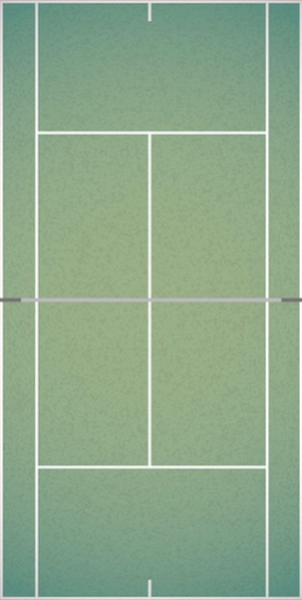
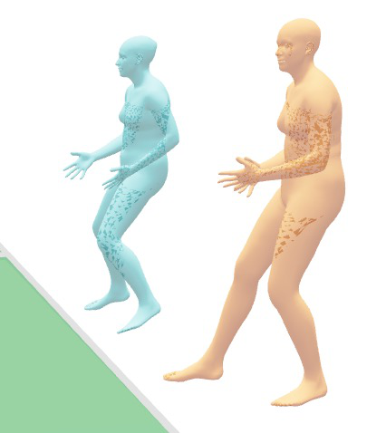
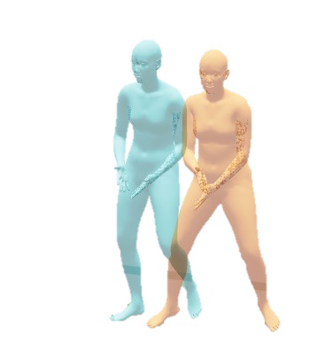
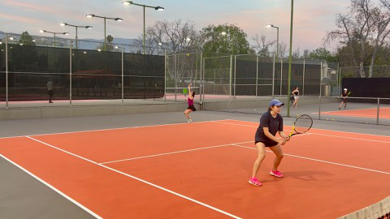

# CalTennis: Large Multi-View Tennis Video Dataset and Benchmark of Monocular-to-3D Pose Estimation

## 摘要

### 论文元信息

| 项目 | 内容 |
|---|---|
| 标题 | CalTennis: Large Multi-View Tennis Video Dataset and Benchmark of Monocular-to-3D Pose Estimation |
| 作者 | Ilona Demler, Xinran Xie, Blake Werner, Anna Szczuka, Pietro Perona |
| 机构 | California Institute of Technology |
| arXiv ID | 2606.20542v1 |
| 发布时间 | 2026-06-18 |
| 论文链接 | http://arxiv.org/abs/2606.20542v1 |
| 数据集 | 论文首页给出 HuggingFace 数据集链接；网页侧也显示 `demalenk/caltennis` 数据集，许可为 cc-by-nc-4.0（见 PAGE 1；数据页见 HuggingFace）([huggingface.co](https://huggingface.co/datasets/demalenk/caltennis)) |
| 代码状态 | 论文首页给出 Project Page 与 Dataset，但全文材料未给出 GitHub 仓库；项目页显示 Code coming soon，因此本文未提供可确认的公开代码（见 PAGE 1；项目页）([ilonadem.github.io](https://ilonadem.github.io/caltennis-website/)) |

一句话总结：CalTennis 提出一个 1100 万帧、51 小时、2-6 视角同步采集的真实网球视频基准，用多视角一致性替代昂贵 MOCAP 标注来评估 monocular-to-3D pose estimation，并揭示当前模型在深度、足部接触、稳定性与体型一致性上的系统性不足（见 PAGE 1、PAGE 2、PAGE 7、PAGE 9）。

本文的核心价值不在于提出一个新的 3D 姿态网络，而在于提出一个面向真实运动场景的评测基准与采集范式。论文明确指出，CalTennis 包含超过 1100 万帧、51 小时、40 名球员、2-6 台同步消费级相机、60 Hz 视频，是现有 in-the-wild human motion video datasets 的 10 倍规模，也是现有 MOCAP-ground-truthed datasets 的 3 倍规模（见 PAGE 1）。这一规模与采集方式使其更接近实际应用中的运动分析环境。

从关键点/姿态团队视角看，CalTennis 的短期价值主要是评测与数据闭环参考，而不是直接产品化迁移。论文场景高度专用：网球场地、标准球场线、低遮挡、高速运动、远距离拍摄，这些条件与通用人体姿态、安防或人脸 landmark 场景差异明显（见 PAGE 2、PAGE 4、PAGE 9）。但它对低成本多视角采集、自动标定同步、多视角一致性评测、脚部稳定性指标设计具有较高借鉴价值（见 PAGE 4、PAGE 5、PAGE 6）。

## 背景与动机

三维人体运动估计（3D human motion estimation）服务于医疗步态分析、康复评估、体育训练、影视游戏角色动画、行人安全、法庭步态识别以及机器人模仿学习等下游任务。论文强调，姿态估计误差会直接传播到下游对生物力学、行为和叙事结论的判断中：关节位置、深度或地面接触的小误差，都可能改变对力、平衡、速度、技术动作的解释（见 PAGE 1）。

现有高精度基准多数依赖 MOCAP（motion capture，运动捕捉）作为 ground truth。MOCAP 的优势是精确，但缺点同样明显：安装成本可超过 15 万美元，需要专用实验室空间，并且常常要求穿戴 marker 或 suits，从而限制自然运动（见 PAGE 1）。因此，如果能够用普通单目视频替代 MOCAP，并在真实环境中达到可用精度，其应用价值会很高；但论文认为当前 monocular video-based methods 仍未达到 MOCAP 级别，需要更大、更困难、更贴近真实应用的基准暴露剩余失效模式（见 PAGE 1）。

本文将问题定位到真实体育运动，尤其是网球。作者给出六个基准条件：in-the-wild、pose coverage、meaningful repeated actions、expert relevance、large-scale、easy and inexpensive to collect（见 PAGE 2）。网球满足这些条件：动作快速且多样，包含发球、截击、冲刺等重复且有语义的动作；球场线标准化，便于自动恢复相机几何；运动员通常遮挡较少；分析尺度可覆盖单个击球、脚步、站位、球路乃至战术（见 PAGE 2）。

CalTennis 的方法论动机是“从数据本身评估”，即不用昂贵的 MOCAP、身体传感器或人工标注，而是利用同步多视角视频中的一致性约束。论文的基本判断是：如果一个单目 3D 姿态模型在不同相机视角下重建同一时刻、同一人物，那么正确的重建应该在共享世界坐标系中一致；因此跨视角不一致可以作为模型真实误差的下界（见 PAGE 2、PAGE 6）。这里的关键表述是 “a correct prediction must agree across views”，即正确预测必须跨视角一致（见 PAGE 6）。

这种评测范式与许多多视角数据集不同。传统多视角数据常用于生成伪 ground truth 或训练信号，而 CalTennis 将 view disagreement 直接作为 label-free error measurement，用来评估已有单目模型在真实运动中的可靠性（见 PAGE 3、PAGE 4）。这使得它不仅是一个数据集，也是一个可复制的低成本评测协议。

## 预备知识

理解本文首先需要区分两类误差。第一类是相对姿态误差，即人体各关节相对骨盆或人体局部坐标系的位置是否一致。第二类是全局位姿误差，尤其是人在场地世界坐标中的 translation 和 depth 是否稳定。论文实验表明，当前模型在关节角或相对姿态上已经相对可用，但在绝对深度、脚部接触和体型一致性上仍不可靠（见 PAGE 7、PAGE 8、PAGE 9）。

本文使用 SMPL-X 表示人体。SMPL-X 参数包括 translation $\tau$、global orientation $\phi$、body pose $\theta$ 和 body shape $\beta$。其中 $\tau$ 表示人在三维空间中的平移位置，$\phi$ 表示全局朝向，$\theta$ 表示 21 个身体关节的姿态，$\beta$ 表示体型参数，例如身高、肢体比例和体型形状（见 PAGE 5、PAGE 15）。论文形式化写作中，$H^i$ 表示第 $i$ 个相机视角下模型输出的人体参数集合（见 PAGE 5）。

多视角一致性评估依赖相机标定与时间同步。空间上，需要把每台相机的局部输出提升到共享 tennis court frame；时间上，由于 iPhone 视频时间戳只有秒级精度，不同视频之间可能有最高 1000 ms 偏移，因此必须通过插值和全局时间偏移 $\Delta t$ 优化实现毫秒级对齐（见 PAGE 5、PAGE 6、PAGE 16）。如果忽略同步误差，高速运动中的跨视角差异会混入时间错位，而不是模型误差。

## 方法详解

### 数据采集：低成本、多视角、真实运动

CalTennis 的采集协议使用普通 iPhone 14 或更新机型的主摄，分辨率为 1920×1080，帧率为 60 Hz；相机安装在 1.65 m MagSafe 三脚架上，每个三脚架约 40 美元；相机数量为 2-6 台，按标准位置布置在球场周围（见 PAGE 4）。论文强调这些设备由球员和教练已有手机承担，项目边际成本低，这支持其 “collector friendly” 主张（见 PAGE 4）。

用途：下图用于说明 CalTennis 的场地采集设置，尤其是多三脚架、多相机和半场覆盖的空间关系（Figure 1，见 PAGE 2）。

读图要点：Figure 1 展示 4-tripod setup，并说明每个半场有两个重叠相机视角；这为跨视角一致性评估提供重叠可见区域（见 PAGE 2）。支撑的判断是：CalTennis 的评测不是依赖单一相机输出，而是依赖同一动作在多个普通相机中的同步观测。

用途：下图用于辅助说明 overlapping views 如何支持 multi-view consistency evaluation（Figure 1，见 PAGE 2）。

读图要点：Figure 1 的中心部分强调重叠视角可以比较 3D position、去除 3D position 差异后的 pose、body shape 与 foot contact（见 PAGE 2）。支撑的判断是：本文评测指标覆盖的不只是关节点误差，还包括足部、稳定性和体型一致性。

用途：下图用于说明数据采集存在多个 camera configurations，而不是单一固定机位（Figure 1，见 PAGE 2）。

读图要点：Figure 1 右侧给出不同配置下的帧数，例如 2.9M、1M、2.8M、0.4M 以及其他配置中的 3.3M 帧（见 PAGE 2）。支撑的判断是：CalTennis 不只评估一种视角几何，而是覆盖多种 view and depth distributions。

用途：下图作为 Figure 1 的另一抽取片段，用于补充说明场地坐标、相机覆盖和数据配置之间的关系（见 PAGE 2）。

读图要点：提供的四张图片均来自 Figure 1 的抽取结果，因此读图结论应限定在 Figure 1 所支持的范围内：低成本多相机采集、重叠视角评测、多配置覆盖（见 PAGE 2）。支撑的判断是：CalTennis 的主要方法创新首先来自采集与评测设计，而非模型结构本身。

### 数据规模与覆盖度

CalTennis 包含 11.03M frames，平均序列长度 3365 秒，90% pose 的相机距离范围为 13.4-16.7 m，pose space coverage 为 85%，硬件成本约 2k 美元（见 PAGE 4）。相比之下，3DPW 只有 0.05M frames，EMDB 为 0.11M，RICH 为 0.54M，Human3.6M 为 1.47M（见 PAGE 4）。Figure 2 进一步可视化了帧数、相机距离、每视频人数和 pose space coverage 差异（见 PAGE 4）。

| Dataset | Multi-view | Real-world | Frames (M) | Avg seq len (sec) | Depth range (m) | Pose space coverage | Hardware cost |
|---|---:|---:|---:|---:|---:|---:|---:|
| 3DPW | No | Yes | 0.05 | 45 | 3.1-7.4 | 58% | 21k |
| EMDB | No | Yes | 0.11 | 42 | 1.9-2.7 | 60% | 31k |
| RICH | Yes | Yes | 0.54 | 127 | 4.2-4.7 | 62% | 100k |
| Human3.6M | Yes | No | 1.47 | 340 | 4.5-5.8 | 89% | 150k |
| CalTennis | Yes | Yes | 11.03 | 3365 | 13.4-16.7 | 85% | 2k |

表格解读：CalTennis 的优势不是单一维度，而是规模、真实环境、多视角、低成本和大深度范围的组合。Human3.6M 的 pose space coverage 达 89%，略高于 CalTennis 的 85%，但它不是 real-world，且深度范围更窄；RICH 是 real-world multi-view，但帧数与硬件成本均不利于规模化采集（见 PAGE 4）。因此 CalTennis 更适合暴露真实场景中的深度和跨视角稳定性问题。

论文定义 pose space coverage 为 frame-to-cluster assignments 的 Shannon entropy，使用共享 pose-joint space 上的 $k=500$ PCA clusters，并归一化到 100% 表示均匀覆盖（见 PAGE 5）。per-joint articulation 则是每个关节角分布熵除以解剖运动范围后再跨关节平均（见 PAGE 5）。这些指标说明 CalTennis 是一个密集的 domain-specific motion manifold，而不是随机堆叠的运动视频。

### 相机标定：利用标准球场几何

本文空间标定依赖网球场标准线。对第 $i$ 台相机，在某帧中识别 $n$ 个球场线交点 $\{\hat P_k^i\}_{k=1}^n \in \mathbb{R}^3$ 以及对应像素点 $\{\hat p_k^i\}_{k=1}^n \in \mathbb{R}^2$；相机内参 $K^i$ 来自 iPhone metadata；通过最小化重投影误差恢复外参 $(R^i,T^i)$（见 PAGE 5、PAGE 15）。

$$
\min_{R^i,T^i}
\sum_{k=1}^{n}
\left\|
\pi(R^i \hat P_k + T^i; K^i) - \hat p_k
\right\|_2^2
$$

这个公式对应论文 Eq. (1) 和 Appendix Eq. (14)：它的含义是寻找一组相机旋转 $R^i$ 与平移 $T^i$，使已知球场三维点投影到图像后尽可能对齐检测到的二维球场线交点（见 PAGE 5、PAGE 15）。人话解释：网球场线就是天然标定板。

与 MOCAP 或专用多相机系统相比，这一设计的关键差异是无需额外标定物，也不需要采集者具备专业技能。论文明确称其使用 PnP algorithm 实现外参恢复（见 PAGE 15）。但这一优点依赖网球场标准几何，因此场景可迁移性存在边界，详见局限分析。

### 共享世界坐标中的姿态提升

每个模型 $M$ 对每个视频 $V^i$ 输出 per-view pose estimates $H^i=M(V^i)$。论文将 SMPL-X 参数写为：

$$
H^i = \{(\tau_t^i, \phi_t^i, \beta_t^i, \theta_t^i)\}_{t=t_0^i}^{t_k^i}
$$

其中 $\tau_t^i \in \mathbb{R}^{p \times 3}$ 表示第 $i$ 个视角在时刻 $t$ 对 $p$ 个人的 translation，$\phi_t^i \in \mathbb{R}^{p \times 3}$ 表示 global orientation，$\theta_t^i \in \mathbb{R}^{p \times 21 \times 3}$ 表示 body pose，$\beta_t^i \in \mathbb{R}^{p \times 10}$ 表示 body shape（见 PAGE 5、PAGE 15）。人话解释：模型输出的不只是关节点，而是人体在三维空间中的位置、朝向、关节姿态和体型。

Appendix 给出从 model-space 到 world-space 的变换：

$$
T^{W}_{model_i \to W} =
\begin{bmatrix}
(R^i)^\top & -(R^i)^\top T^i \\
0 & 1
\end{bmatrix}
$$

该式对应论文 Eq. (15)，表示利用相机外参将模型局部坐标转换到共享世界坐标（见 PAGE 16）。随后 translation 通过齐次坐标提升：

$$
\tilde{\tau}_t^i =
T^{W}_{model_i \to W}[\tau_t^i;1]
$$

该式对应论文 Eq. (16)，其中 $\tilde{\tau}_t^i$ 是第 $i$ 个视角提升到世界坐标后的 translation（见 PAGE 16）。人话解释：只有把每台相机的输出放到同一个球场坐标系里，跨视角误差才有可比性。

### 时间同步：插值与全局偏移搜索

论文指出，iPhone 视频只有秒级全局时间戳，不同相机间可存在最高 1000 ms 偏移；而运动员高速运动要求毫秒级时间估计（见 PAGE 6、PAGE 16）。因此，作者先对重建姿态进行线性插值，使任意相机都能在另一相机的任意时间点查询姿态；再对 $\Delta t \in [-1000,1000]$ ms 做 grid search，最小化跨视角 pose disagreement（见 PAGE 6、PAGE 16）。Figure 3 和 Figure 8 都说明了 spatiotemporal calibration and synchronization（见 PAGE 5、PAGE 16）。

这一处理很关键，因为如果只比较最近帧，观测到的差异可能来自时间错位，而非模型重建错误。对网球这类快速动作，100 ms 甚至更小时间偏差都可能造成脚、手、球拍附近动作位置大幅变化。论文没有给出同步搜索目标函数的完整公式细节，因此关于具体 grid search loss 的实现细节证据不足；但其总体流程在正文和附录均有说明（见 PAGE 6、PAGE 16）。

### 多视角一致性指标：Translation 与 Pose

CalTennis 的核心评估思想是使用跨视角不一致作为误差下界。Translation error 定义为同一人物在视角 $i,j$ 下 translation estimates 的 L2 距离（见 PAGE 6）：

$$
E_{trans} =
\frac{1}{TP}
\sum_{t,p}
\left\|
\tau_{i,p}^{t} - \tau_{j,p}^{t}
\right\|_2
$$

其中 $T$ 表示时间帧数，$P$ 表示人物数量，$\tau_{i,p}^{t}$ 表示视角 $i$ 在时刻 $t$ 对人物 $p$ 的三维平移估计（见 PAGE 6）。人话解释：同一个人在同一时刻不应被不同相机估计到相距数米的位置。

Pose error 则去除 translation 后，比较相对骨盆坐标下的 joint estimates（见 PAGE 6）：

$$
E_{pose} =
\frac{1}{TPK}
\sum_{t,p}
\sum_{k=1}^{K}
\left\|
J_{i,p,k}^{t} - J_{j,p,k}^{t}
\right\|_2
$$

其中 $K$ 是关节数，$J_{i,p,k}^{t}$ 表示第 $i$ 个视角在时刻 $t$ 对人物 $p$ 的第 $k$ 个关节估计（见 PAGE 6）。人话解释：即使两台相机不同意人站在球场哪里，它们仍可能同意人体关节相对骨盆的姿态。

### Footwork 与 Stability：面向运动分析的物理指标

论文提出 footwork 指标，分别比较 foot joint velocities 和 foot heights 的跨视角一致性（见 PAGE 6）：

$$
E_{skate} =
\frac{1}{Z}
\sum_{t,p,k}
\left\|
v_{p,k,t}^{(i)} - v_{p,k,t}^{(j)}
\right\|_2,
\quad
E_{height} =
\frac{1}{Z}
\sum_{t,p,k}
\left|
h_{p,k,t}^{(i)} - h_{p,k,t}^{(j)}
\right|
$$

其中 $v_{p,k,t}^{(i)} \in \mathbb{R}^3$ 表示视角 $i$ 下某个足部关节速度，$h_{p,k,t}^{(i)}$ 表示足部高度，$Z=TPK_{foot}$ 是跨帧、人物和足部关节的归一化项（见 PAGE 6）。人话解释：如果一只脚在一个视角中贴地不动、在另一个视角中却滑动或悬空，那么模型对 foot contact 的理解不可靠。

Stability 指标借鉴 robotics literature，定义 projected center of mass 到 grounded foot joints convex hull $Q$ 的距离；若 CoM 投影落在 $Q$ 内，稳定性距离为 0（见 PAGE 6）：

$$
E_{stab}^{(i)} =
\begin{cases}
\min_{q \in Q} \|CoM_{xy} - q\|_2, & CoM_{xy} \notin Q \\
0, & \text{otherwise}
\end{cases}
$$

其中 $CoM_{xy}$ 是人体 center of mass 在地面平面的投影，$Q$ 是接触地面的足部关节形成的凸包（见 PAGE 6）。人话解释：如果重心投影落在支撑脚区域外，姿态在物理意义上更可能失衡。

跨视角 stability error 定义为不同视角 stability 的平均绝对差（见 PAGE 6）：

$$
E_{stab} =
\frac{1}{TP}
\sum_{t,p}
\left|
E_{stab,p,t}^{(i)} - E_{stab,p,t}^{(j)}
\right|
$$

这说明 CalTennis 关注的不只是“关节点是否接近”，还关注模型是否在不同视角下对“是否站稳”给出一致判断（见 PAGE 6）。对体育技术分析、足部动作质量和潜在受伤风险评估而言，这类物理一致性比单纯 PA-MPJPE 更贴近应用需求。

### MLE consensus pose：可选的多视角融合形式

附录 A.1 给出 maximum-likelihood consensus pose，用于从 $N$ 个重叠视角建立单个稳健 3D joint estimate（见 PAGE 14）。首先，将相机局部 joint observation $J_c^{(i)}$ 提升到 world frame：

$$
J_w^{(i)}
=
R_{calib\_c2w}^{(i)} J_c^{(i)} +
T_{calib\_c2w}^{(i)}
$$

其中 $J_c^{(i)}$ 是第 $i$ 个相机局部坐标中的关节位置，$R_{calib\_c2w}^{(i)}$ 和 $T_{calib\_c2w}^{(i)}$ 是相机到世界坐标的标定参数（见 PAGE 14）。人话解释：先把所有相机看到的关节都搬到同一个球场坐标系中。

同时，噪声协方差也需要从相机坐标变换到世界坐标（见 PAGE 14）：

$$
\Sigma_w^{(i)}
=
R_{calib\_c2w}^{(i)}
\Sigma_c^{(i)}
\left(R_{calib\_c2w}^{(i)}\right)^T
$$

论文强调，monocular reconstruction 的主导误差是 depth，因此 covariance 沿相机 depth axis 拉长（见 PAGE 14）。人话解释：单目相机最不确定的是“远近”，所以融合时应降低深度方向不可靠观测的权重。

最终 MLE 解是 precision-weighted average（见 PAGE 14）：

$$
P_{MLE}
=
\left(
\sum_{i=1}^{N}
(\Sigma_w^{(i)})^{-1}
\right)^{-1}
\sum_{i=1}^{N}
(\Sigma_w^{(i)})^{-1}
J_w^{(i)}
$$

其中 $P_{MLE}$ 是真实 world-frame joint position 的最大似然估计，$(\Sigma_w^{(i)})^{-1}$ 是 precision matrix（见 PAGE 14）。人话解释：更可信的视角贡献更大，深度不确定性更高的视角贡献更小。需要注意的是，主文主要使用 multi-view disagreement 作为评估信号；MLE consensus pose 的具体实验使用范围在提供文本中证据不足，不能推断其已作为所有指标的 ground truth。

### 代码分析

本文未提供可确认的公开代码。论文首页给出项目页和 HuggingFace 数据集链接（见 PAGE 1），结论中称会 release dataset, capture recipe, and evaluation code（见 PAGE 9），但全文材料未出现 GitHub 仓库 URL。项目页目前显示 Code coming soon，而非可读取仓库，因此无法提供源码段、文件路径、函数级映射或论文方法到代码的逐行对应分析([ilonadem.github.io](https://ilonadem.github.io/caltennis-website/))。基于当前证据，只能确认数据集页面存在，并显示 keypoint detection、video、json、human-pose-estimation、3d-pose、multi-view、sports、smpl-x 等标签([huggingface.co](https://huggingface.co/datasets/demalenk/caltennis))。

## 实验分析

### 实验设置

论文评估五个 state-of-the-art monocular 3D human pose reconstruction models：TRAM、GVHMR、GENMO、WHAM 和 PromptHMR（见 PAGE 7）。这些方法覆盖不同策略：TRAM 预测 per-person SMPL-X poses 并提升到 world coordinates；GVHMR 使用 gravity-view coordinates；GENMO 是 video-conditioned diffusion model；WHAM 强化 ground-foot contacts；PromptHMR 使用 2D keypoints 和 contacts 等 prompts 条件化 transformer（见 PAGE 7）。

实验不向模型先验提供相机坐标，因此每个模型运行自己的 camera-estimation preprocessing；模型输出随后按 Appendix A.2 提升到共享坐标系进行比较（见 PAGE 7）。实验运行在 NVIDIA H100 上，主结果基于 CalTennis 前 5M frames；论文明确写道 full results forthcoming，因此完整 11.03M frames 的最终基准结果证据不足（见 PAGE 7）。

### 主结果：没有单一最优模型

| Model | Translation ↓ (mm) | Pose ↓ (mm) | MPJPE ↓ (mm) | PA-MPJPE ↓ (mm) | Foot-Vel ↓ (m/s) | Foot-Height ↓ (mm) | Stability ↓ (mm) |
|---|---:|---:|---:|---:|---:|---:|---:|
| PromptHMR | 942 | 105 | 1,785 | 84 | 3.23 | 70 | 25 |
| WHAM | 2,664 | 106 | 2,675 | 119 | 0.72 | 150 | 44 |
| GVHMR | 3,587 | 109 | 1,066 | 88 | 2.49 | 60 | 21 |
| TRAM | 2,340 | 115 | 958 | 91 | 6.65 | 80 | 33 |
| GENMO | 2,560 | 110 | 1,020 | 91 | 4.40 | 60 | 16 |

表格解读：PromptHMR 在 translation、pose 和 PA-MPJPE 上最好，分别为 0.942 m、105 mm、84 mm；但其 foot-velocity consistency 为 3.23 m/s，明显弱于 WHAM 的 0.72 m/s（见 PAGE 7）。GENMO 在 foot-height 和 stability 上表现最好或并列最好，foot-height 为 60 mm，stability 为 16 mm（见 PAGE 7）。因此论文结论不是“某个模型全面领先”，而是 “No single model is best”（见 PAGE 9）。

Figure 4 将 median translation error 与 pose error 进行比较，并展示 translation error 与模型参数量之间的关系（见 PAGE 7）。论文指出所有模型都难以得到一致 translation estimates，平均 translation error 范围为 0.9 m 到 3.6 m，75% translation errors 落在 1 m 窗口内（见 PAGE 7、PAGE 8）。这说明在远距离网球场景中，像素级误差会被深度放大，形成论文称为 “pose drifting” 的 translation oscillation（见 PAGE 8）。

与此同时，各模型的 pose estimates 更一致，跨视角 pose error 大约为 11 cm（见 PAGE 8）。这支持一个重要应用判断：当前模型更适合依赖相对身体构型和粗粒度时间运动学的任务，例如动作识别、粗略技术分析或 gait-based identification；但不适合依赖精确 3D 人体位置、地面接触、受力和平衡的任务（见 PAGE 8、PAGE 9）。

### 与当前 benchmark 的对比

| Model | 3DPW PA-MPJPE | 3DPW MPJPE | RICH PA-MPJPE | RICH MPJPE | EMDB PA-MPJPE | EMDB MPJPE |
|---|---:|---:|---:|---:|---:|---:|
| WHAM | 37.2 | 59.4 | 44.7 | 82.6 | 48.8 | 80.7 |
| GVHMR | 36.2 | 55.6 | 39.5 | 66.0 | 42.7 | 72.6 |
| TRAM | 35.6 | 59.3 | - | - | 45.7 | 74.4 |
| PromptHMR | 35.5 | 56.9 | 37.0 | 57.4 | 40.1 | 68.1 |
| GENMO | 34.6 | 53.9 | 39.1 | 66.8 | 42.5 | 73.0 |

表格解读：在 3DPW、RICH、EMDB 等现有 benchmark 上，PA-MPJPE 多位于 35-49 mm 区间，MPJPE 多位于 54-83 mm 区间（见 PAGE 18）。而 CalTennis Table 2 中，即使最好的 PA-MPJPE 也为 84 mm，MPJPE 最低为 TRAM 的 958 mm，最高 WHAM 为 2,675 mm（见 PAGE 7）。这说明 CalTennis 暴露的困难主要来自真实场地远距离、深度变化、多人物、运动快速和跨视角一致性要求，而不是传统 benchmark 中已经被充分优化的近距离姿态对齐。

需要谨慎解释的是，CalTennis 的 MPJPE 是 multi-view consistency setting 下的毫米级跨视角不一致，而 Table 4 是各论文在不同 benchmark 上报告的标准指标（见 PAGE 18）。二者不是完全同一实验协议下的绝对可比 ground truth error，但仍支持论文关于 CalTennis 更困难的判断（见 PAGE 7、PAGE 18）。

### Footwork、Stability 与 Shape：传统指标看不到的失效

Figure 5 比较 foot height、stability 和 shape estimates 的一致性，结论是没有模型在所有维度占优；例如 WHAM 在 foot height consistency 上表现好，但在 stability 和 shape metrics 上有较高不一致（见 PAGE 8）。这说明 foot-contact 优化可能改善某些物理一致性，但不会自动解决全局 translation、体型或稳定性判断。

Figure 6 展示 PromptHMR 在单个双视角视频中的 PA-MPJPE inconsistency histogram，并将一台相机的 pose projection 到另一视角上（见 PAGE 8）。论文观察到 low-disagreement poses 通常是 stationary、neutral 且两视角清晰可见的姿态；high-disagreement frames 通常出现在远距离、动态姿态或部分遮挡情况下，尤其是 feet and hands（见 PAGE 8）。这为“困难帧并非随机”的判断提供了可视化证据。

Figure 7 展示 shape consistency，说明不同视角下同一人的 SMPL-X shape parameters $\beta$ 存在显著差异，最高可出现约 20 cm height disagreement（见 PAGE 9）。PromptHMR 的体型一致性相对更高，论文推测可能因为它额外利用 2D bounding boxes 和 keypoints（见 PAGE 9）。但所有模型都存在跨视角体型不一致，这会影响身高、肢体长度、重心、速度和力学解释。

### 失败模式分析

附录 A.3 研究不同模型是否在同一批 frames 上失败。Figure 9 计算不同模型 error signals 的 frame-level Pearson correlation，发现 pose errors 的相关性低于 translation errors，说明不同模型失败原因不同（见 PAGE 16、PAGE 17）。TRAM 与 PromptHMR 在 Pose L2 error 上相关系数为 0.27，在 translation error 上为 0.31，但在 stability 上仅为 0.1（见 PAGE 16、PAGE 17）。

Figure 10 进一步分析 joint error correlations，发现 upper body joints 内部、pelvic joints 内部、lower body joints 内部错误相关，但 upper 与 lower body 之间相关性弱（见 PAGE 17）。这对传感器辅助数据采集有实际影响：仅使用 foot contact points 或仅使用 upper body IMU，可能不足以可靠估计完整 ground-truth pose（见 PAGE 17）。

附录 A.9 使用 worst 30% per model 定义 failure indicator $D_f^m$，并提取十个 scene features，包括 motion、acceleration、depth、camera distance、scale proxy、height、pose spread、foreshortening、blur、motion blur（见 PAGE 20、PAGE 21、PAGE 23）。Table 7 显示 depth 和 camera distance 是 MPJPE failure 的强预测因子，例如 GENMO 的 camera distance 与 MPJPE failure Spearman $r_s=0.543$，depth 为 $0.423$；GVHMR 的 depth 为 $0.463$，scale proxy 为 $-0.439$（见 PAGE 23）。这支持深度歧义是单目方法中心失效模式的判断。

| Model | MPJPE depth correlation | MPJPE camera-distance correlation | MPJPE scale-proxy correlation | MPJPE AUC |
|---|---:|---:|---:|---:|
| PromptHMR | 0.340 | 0.249 | -0.313 | 0.818 |
| WHAM | 0.264 | 0.221 | -0.132 | 0.764 |
| GVHMR | 0.463 | 0.381 | -0.439 | 0.837 |
| TRAM | 0.159 | 0.092 | -0.176 | 0.770 |
| GENMO | 0.423 | 0.543 | -0.436 | 0.890 |

表格解读：MPJPE failure 与 depth、camera distance 普遍正相关，与 scale proxy 负相关，说明人离相机越远、图像中越小，三维重建越容易失败（见 PAGE 21、PAGE 23）。GENMO 的 AUC 最高为 0.890，说明其失败更能由 scene geometry 预测；TRAM 和 WHAM 的相关性较弱，论文解释为它们的失败可能更多来自 identity-level failure modes、trajectory breaks 或模型自身机制，而非简单场景几何（见 PAGE 21、PAGE 23）。

### 消融实验证据

论文没有提供传统意义上的 ablation study，例如去掉时间同步、去掉球场标定、去掉 footwork 指标或比较不同相机数量对指标的系统影响。因此，关于各模块独立贡献的消融证据不足。论文提供的是 benchmark comparison、metric comparison、failure correlation analysis 和 qualitative examples（见 PAGE 7、PAGE 8、PAGE 16-PAGE 23），这些足以支持其主要经验发现，但不足以量化每个系统组件对最终评测稳定性的边际贡献。

## 讨论

CalTennis 的适用边界非常明确：它适合评估单目 3D 姿态模型在真实远距离、高速、重复运动场景中的跨视角一致性，尤其适合检查 depth、foot contact、stability、shape 这类标准 benchmark 容易忽略的误差（见 PAGE 6、PAGE 7、PAGE 9）。对姿态团队而言，它更像一个“压力测试场景”和“采集评测协议模板”，而不是一个通用人体姿态训练集的直接替代。

方法学上，CalTennis 的主要贡献是把 multi-view 从 ground truth 生产工具转化为 label-free evaluation signal。只要能低成本采集重叠视角，类似思想可迁移到其他体育、临床运动分析和日常活动数据集（见 PAGE 9）。但可迁移不等于无条件复用：网球场线提供了天然几何先验，其他场景如果缺少稳定、可检测、标准化的空间结构，就需要其他标定机制。

对下游应用而言，论文给出的判断相当克制：joint-angle pose recovery 已经足以支持相对身体构型和粗粒度时间运动学任务，但 absolute distance and depth、ground-contact detection、body shape 仍不可靠（见 PAGE 9）。这意味着体育技术分析可以谨慎使用当前模型看动作形态，但临床力学、法庭步态长度、精确重心转移、地面反作用力估计等高风险应用仍不应直接依赖单目模型输出（见 PAGE 9）。

## 局限分析

作者自述的局限包括：CalTennis 当前限制在单一运动、单一气候和单一场地表面类型，并且由一个研究团队采集；“easy and inexpensive to collect”的主张尚未被其他团队复制验证；multi-view disagreement 只是 error lower bound，因此 CalTennis 是 MOCAP absolute validation 的补充，而不是替代；大规模人体数据还存在隐私与 surveillance risks，作者通过 IRB、informed consent 和 face blurring 缓解风险（见 PAGE 9）。

作者还明确指出，当前 monocular models 在 depth、foot contact 和 body shape 估计上不可靠，因此不适合大多数 clinical and forensic settings（见 PAGE 9）。这是一项重要限制，因为论文的应用动机中包含医疗、运动训练、行人安全和法庭识别等场景（见 PAGE 1）。如果读者只看到数据规模和低成本采集，容易高估该 benchmark 对高风险应用的立即可用性。

我的独立判断是，CalTennis 对自动标定的依赖既是优势也是限制。网球场线的标准几何让 PnP calibration 可低成本运行（见 PAGE 5、PAGE 15），但这使方法天然偏向有规则平面标记的场景。若迁移到街头、室内家庭、无标准场地的康复环境，需要替换几何先验或加入额外标定流程；这一点论文没有系统验证，因此跨场景采集协议的泛化证据不足。

另一个独立判断是，multi-view inconsistency 作为 lower bound 很适合发现失败，但不总能说明“谁更接近真实”。例如两个视角可能一致地错误，或某个模型通过过强的平滑先验获得较好跨视角一致性但损失真实动态。论文的 MLE consensus pose 推导考虑了深度方向不确定性（见 PAGE 14），但主实验没有把其作为绝对 ground truth。对需要绝对精度的任务，仍需 MOCAP、力板、IMU 或人工审核作为补充验证。

## 结论

CalTennis 的核心贡献可以凝练为三点。第一，它提供了一个大规模、真实、多视角、低成本的网球运动视频基准：1100 万帧、51 小时、40 名球员、2-6 台同步消费级相机、60 Hz（见 PAGE 1、PAGE 4）。第二，它提出用 multi-view consistency 作为 label-free evaluation signal，构建 translation、pose、footwork、stability、shape 等多维指标，暴露标准 PA-MPJPE 难以覆盖的错误（见 PAGE 6-PAGE 9）。第三，它系统评估五个 SOTA monocular-to-3D pose models，发现没有单一模型在所有维度最优，且所有模型都在 depth、foot contact、body shape 上存在明显不足（见 PAGE 7-PAGE 9）。

对研究而言，CalTennis 的价值在于把 3D 姿态评估从实验室近距离动作推向真实、远距离、高速、重复的体育场景。对工程而言，它提示姿态系统不能只看关节角误差，还应检查跨视角位置一致性、脚部接触、重心稳定性和体型一致性。对产品化而言，它的结论应被谨慎使用：可借鉴其采集和评测协议，但网球场景专用性、数据开放范围、代码尚未公开、缺少绝对 ground truth 和跨团队复现实验，决定了它更适合作为研究观察与评测设计参考，而非立即转化为通用人体姿态产品方案。

## 证据索引

| 证据点 | PAGE |
|---|---|
| 标题、作者、摘要、项目页、数据集链接、1100 万帧、51 小时、40 名球员、2-6 相机、60 Hz、主要发现 | PAGE 1 |
| Figure 1：采集设置、多视角一致性、不同 camera configurations；六项 benchmark criteria；网球场景选择理由 | PAGE 2 |
| 论文贡献：Dataset、Evaluation methodology、Benchmark、Data-collection recipe；相关工作定位 | PAGE 3 |
| Table 1 与 Figure 2：CalTennis 与 3DPW、EMDB、RICH、HI4D、Human3.6M、SportsPose 的规模、深度范围、覆盖度、成本比较 | PAGE 4 |
| 数据采集细节：iPhone、60 Hz、1920×1080、1.65 m 三脚架、约 40 美元、IRB 与 face blurring；相机标定问题定义与 Eq. (1) | PAGE 4-PAGE 5 |
| Figure 3：spatiotemporal calibration and synchronization；SMPL-X 参数定义；translation、pose、footwork、stability 指标 Eq. (2)-(6) | PAGE 5-PAGE 6 |
| Table 2：PromptHMR、WHAM、GVHMR、TRAM、GENMO 在 CalTennis 上的主结果；Figure 4 translation vs pose error | PAGE 7 |
| Figure 5 与 Figure 6：foot height、stability、shape 一致性；PromptHMR cross-view projections 与高误差帧定性分析 | PAGE 8 |
| Figure 7：SMPL-X shape inconsistency 与最高约 20 cm height disagreement；Discussion、Conclusions、Limitations & Broader Impacts | PAGE 9 |
| Appendix A.1：MLE consensus pose，Eq. (7)-(13)，深度方向 covariance 加权 | PAGE 14 |
| Appendix A.2：notation table、PnP calibration、model-to-world transform Eq. (15)、translation lifting Eq. (16)、consensus pose Eq. (17)、temporal calibration | PAGE 15-PAGE 16 |
| Appendix A.3：模型错误相关性、Figure 9、Figure 10，上下肢错误相关性分析 | PAGE 16-PAGE 17 |
| Table 4：SOTA models 在 3DPW、RICH、EMDB 上的已报告性能 | PAGE 18 |
| Figure 11、Figure 12：pose space uniformity and coverage、joint angle histograms | PAGE 18-PAGE 19 |
| Figure 13、Figure 14：runtime 与性能权衡；PromptHMR runtime scaling | PAGE 19-PAGE 20 |
| Appendix A.9：failure indicator、scene features、Spearman correlation、AUC、failure patterns | PAGE 20-PAGE 23 |
| Table 7：scene descriptor features 与各模型 failure 的 Spearman rank correlations 和 AUC | PAGE 23 |
