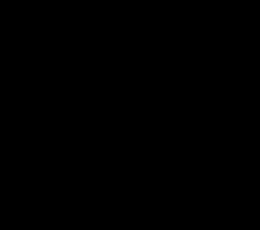
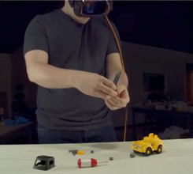
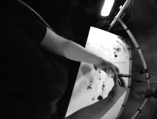

# UNIEGO: Proxies as Mediators for Unified Egocentric Video Representation Learning

## 摘要

**论文元信息。** 论文标题为 *UNIEGO: Proxies as Mediators for Unified Egocentric Video Representation Learning*，作者为 Wenhao Chi、Arkaprava Sinha、Dominick Reilly、Hieu Le、Srijan Das，机构为 University of North Carolina at Charlotte，arXiv ID 为 2606.20559，发布时间为 2026-06-18，类别为 cs.CV 与 cs.LG，论文链接为 <http://arxiv.org/abs/2606.20559v1>，PDF 链接为 <https://arxiv.org/pdf/2606.20559v1>。论文正文在首页声明发布代码与模型，链接为 <https://github.com/Wenhao-Chi/UNIEGO>（见 PAGE 1）。

**代码状态。** 论文 PAGE 1 明确给出代码仓库；GitHub 仓库可访问，并包含 README、`exp/proxy_distill/`、`tools/merging_models.py`、`tools/train_proxy_gen2.py` 等实现文件。本文的代码分析基于公开仓库文件读取；由于当前工作区为只读环境，没有完成本地 `git clone`、训练或复现实验，因此运行级复现证据不足。

**一句话总结。** UNIEGO 用代理模型（Proxy）作为异构教师与统一第一视角编码器之间的中介，把 9 个跨视角、跨模态、跨基础模型的教师信号转化为可部署的单一 egocentric RGB 编码器，并通过样本级可靠代理选择缓解表征间隙与梯度冲突（见 PAGE 1-2）。

从任务定位看，UNIEGO 针对的是第一视角视频理解（egocentric video understanding）：输入端在推理时只有佩戴式相机采集的 RGB 视频，训练时则借助 exocentric RGB、depth、skeleton、DINOv2、SigLIP、DepthAnything、ST-GCN、Sk-Ego 等多源教师知识（见 PAGE 1、PAGE 6）。该目标与视频理解、穿戴设备感知、行为识别、动作检索和动作分割直接相关；但其证据主要来自 ego-exo 数据集，迁移到监控、车载或非穿戴视角视频时存在域差风险（见 PAGE 6-8、PAGE 15）。

## 背景与动机

第一视角视频理解的核心困难来自摄像机位置本身。佩戴式相机视角狭窄，容易出现身体自遮挡，手、物体与场景上下文也常被局部运动破坏；因此，一个只看 ego RGB 的模型难以完整捕获人体动作的几何结构、全身姿态和环境关系（见 PAGE 1）。论文将这个问题概括为：单一视角、单一模态、单一模型不足以覆盖人类动作的丰富性（见 PAGE 1）。

已有 egocentric representation learning 方法大体可以分为三类。第一类只从 egocentric 视频本身学习表征，例如 EgoVLP、LaViLa 等视频语言预训练方法；第二类引入 synchronized exocentric viewpoints，以第三人称视角补充第一人称中缺失的全身与场景信息；第三类引入 depth、skeleton、head motion 等额外模态，用几何或姿态信号弥补 RGB 表征的不足（见 PAGE 3）。这些方法各自有效，但通常只利用一种辅助信号，缺少一个能统一吸收多视角、多模态、多基础模型知识的 egocentric 编码器（见 PAGE 3）。

多教师知识蒸馏（multi-teacher knowledge distillation）看似是自然方案：把多个教师模型的知识压缩到一个学生模型中。论文指出，已有多教师蒸馏工作往往处理同构或近似同构的教师，例如同一模态上的多个模型，或者多个视觉基础模型的通用表征蒸馏（见 PAGE 2-3）。UNIEGO 面对的设置更复杂：教师之间不仅架构不同，而且输入模态、视角、特征维度和表征几何也不同（见 PAGE 2、PAGE 6）。

直接把这些异构教师同时蒸馏给一个 egocentric student，会带来两个失败模式。第一是 representational gap，即 skeleton graph 模型、exocentric RGB 模型、depth 模型和 foundation model 的特征空间不一致；第二是 conflicting gradient signals，即不同教师对同一样本给出的监督方向可能互相抵消，甚至与分类目标相冲突（见 PAGE 2）。论文的核心出发点是：统一表征并不等于把所有教师直接相加，而需要一个结构化的中介层来先消解异构性，再选择可靠监督（见 PAGE 2-4）。

因此，UNIEGO 提出 hierarchical multi-teacher distillation framework。第一层训练 representation-specific Proxy models，把每个异构教师的知识投影到同构的 egocentric proxy space；第二层通过 Proxy Merging 和 Selective Proxy Distillation（SPD）把多个代理模型汇聚为最终的 UNIEGO 编码器（见 PAGE 2、PAGE 4-6）。推理时不需要教师、不需要 exocentric stream、不需要 proxy，只使用 egocentric RGB 输入（见 PAGE 4、PAGE 6）。

## 预备知识

### Egocentric / Exocentric 与多模态教师

Egocentric video 指第一人称或佩戴式相机视频；Exocentric video 指第三人称外部视角视频。两者在动作理解中互补：egocentric 视角更接近手-物交互和局部操作，exocentric 视角更容易观察全身姿态、动作幅度和场景布局（见 PAGE 1、PAGE 7、PAGE 16-17）。UNIEGO 的训练目标不是在推理时依赖外部视角，而是把外部视角在训练阶段转化为单一 ego 编码器内部的表征能力（见 PAGE 4、PAGE 6）。

多模态教师包括 RGB、Depth、Skeleton，以及基础模型表征。论文中的 Level-I teacher pool 共 9 个教师：Ego DINOv2、Ego SigLIP、Ego DepthAnything、Exo TimeSformer、Exo DINOv2、Exo Sk-Ego、Exo SigLIP、Exo ST-GCN、Exo DepthAnything，特征维度覆盖 256、512、768、1024、1152（见 PAGE 6）。这种维度差异也解释了为什么论文需要线性投影层把教师特征对齐到 768 维 student space（见 PAGE 6）。

### 知识蒸馏、代理模型与可靠性选择

知识蒸馏（knowledge distillation）通常让学生模型模仿教师模型的 logits 或中间特征。UNIEGO 的特殊性在于它不直接从原始教师蒸馏到最终学生，而是先训练代理模型 $P_r$。这里 $r$ 表示第 $r$ 个教师或代理，$P_r$ 与最终 UNIEGO 共享架构并接收 egocentric video 输入，但每个 $P_r$ 独立学习对应教师 $T_r$ 的知识（见 PAGE 4）。

Selective Proxy Distillation（SPD）的关键思想是样本级可靠性过滤。对第 $i$ 个训练样本，如果某个代理模型预测错误，则该代理对该样本的知识不被认为可靠；在预测正确的代理中，再按 cross-entropy loss 选择 loss 较小、置信度更高的 top-$K$ 代理进行蒸馏（见 PAGE 5）。这不是全局固定教师选择，而是每个样本动态选择可靠代理。

### 表征间隙与梯度冲突的诊断指标

论文用 Centered Kernel Alignment（CKA）衡量教师或代理之间的表征相似性。Figure 3 显示，代理之间的 pairwise CKA 高于原始教师之间的 CKA，支持 Level-I Proxy Learning 将异构表征转入更同质的 egocentric embedding space（见 PAGE 9）。

论文还定义 gradient conflict rate，即蒸馏梯度与分类梯度方向相反的比例，形式为 $\cos(\nabla_{\mathrm{cls}}, \nabla_{\mathrm{kd}})<0$。Figure 4 和 Figure 5 显示，direct multimodal distillation 梯度冲突更严重，all proxy distillation 有所缓解，而 SPD 进一步降低冲突并提高梯度协同性（见 PAGE 9）。

## 方法详解

### 1. 问题定义：统一编码器只在训练时吸收多源知识

论文将训练集定义为：

$$
\mathcal{D}=\{(x_i^e,\{x_i^r\}_{r=1}^{R},y_i)\}_{i=1}^{N}
$$

其中，$x_i^e$ 表示第 $i$ 个 egocentric video clip，$x_i^r$ 表示第 $r$ 个教师模型 $T_r$ 的输入，$y_i \in \mathcal{Y}$ 是动作标签，$N$ 是训练样本数，$R$ 是教师数量（见 PAGE 3）。这一定义明确区分了训练时可用的多源输入与推理时只保留 ego 输入的约束。

论文的目标是学习统一 egocentric encoder $f(\cdot)$，使其表征 $f(x^e)$ 在训练时吸收 $\{T_r(x^r)\}_{r=1}^{R}$ 的互补知识，但推理时只需要 $x^e$（见 PAGE 4）。这个设置对部署很关键：多教师和多模态只作为训练资源，最终模型仍是单路 ego RGB 模型。

### 2. Figure 1：为什么不能直接多教师蒸馏

用途：以下 PAGE 3 的 Figure 1 裁图用于说明 naive multi-teacher distillation 的问题背景。论文 caption 明确指出，直接用异构教师学习统一 egocentric representation 会产生 representational gaps 与 conflicting gradients（见 PAGE 3）。



读图要点：该图对应 Figure 1 的问题设定部分，强调教师来自不同视角、模态和模型表征，不能假设其 feature geometry 天然兼容。支撑的判断是：UNIEGO 的代理层不是装饰性模块，而是为了处理异构监督之间的结构性不兼容（见 PAGE 2-3）。

用途：以下 Figure 1 裁图继续展示多教师信号在参数或梯度方向上的不一致，用来支撑论文关于 conflicting gradient signals 的动机（见 PAGE 3）。


读图要点：图中用多个教师方向指向 student，表达不同教师可能把同一学生参数推向不同区域。支撑的判断是：如果不做可靠性过滤或中介变换，直接蒸馏会把“补充信息”变成优化噪声（见 PAGE 2、PAGE 9）。

用途：以下 Figure 1 裁图用于展示 UNIEGO 的 hierarchical distillation 思路，即先形成代理池，再进入统一代理空间（见 PAGE 3）。



读图要点：代理模型共享学生架构并处理 egocentric input，因此其输出空间比原始教师更一致。支撑的判断是：Level-I 的价值在于把 heterogeneous teacher supervision 转为 homogeneous proxy space（见 PAGE 4-5）。

用途：以下 Figure 1 裁图用于说明代理中介后，教师知识被转入 unified representation space，最终再由 UNIEGO 聚合（见 PAGE 3）。



读图要点：图中黑色虚线描述 framework 将教师知识“shift”到统一空间的效果。支撑的判断是：UNIEGO 的核心创新不是增加教师数量本身，而是通过 proxy-mediated learning 改变知识转移路径（见 PAGE 3-4）。

### 3. Level-I Proxy Learning：把异构教师翻译到同构 ego 空间

Level-I 对每个教师 $T_r$ 独立训练一个代理模型 $P_r$。所有代理共享同一架构，但参数独立；输入是 egocentric video $x_i^e$，监督来自教师特征 $h_i^r=T_r(x_i^r)$（见 PAGE 4）。这一步的关键是：代理模型不要求推理时保留原始教师输入，而是在训练中学习如何从 ego video 预测或对齐教师表征。

论文给出的 Level-I 损失为：

$$
\mathcal{L}_{I}^{r}
=
\frac{1}{N}\sum_{i=1}^{N}
\left(
\lambda_{I}D_{\cos}(h_i,h_i^r)
+
\lambda_{\mathrm{cls}}\mathrm{CE}(z_i,y_i)
\right)
$$

其中，$h_i$ 是代理学生的 feature embedding，$z_i$ 是代理学生的 action logits，$h_i^r$ 是第 $r$ 个教师的 feature embedding，$D_{\cos}$ 是 cosine distance，$\mathrm{CE}$ 是 cross-entropy loss，$\lambda_I$ 与 $\lambda_{\mathrm{cls}}$ 是损失权重（见 PAGE 4）。人话解释：每个代理既要学会贴近对应教师的特征，又不能丢掉动作分类能力。

该设计与直接蒸馏的差异在于，Level-I 把多个教师问题拆成多个单教师代理问题。每个代理只面对一个教师，因此优化目标更清晰；所有代理最终又使用同一种 egocentric architecture，因此 Level-II 聚合时面对的是同构代理，而不是原始异构教师（见 PAGE 4-5）。

### 4. Proxy Merging：用可学习凸组合初始化统一模型

在 Level-II 开始前，UNIEGO 不是随机初始化，也不是直接选最强代理初始化，而是把多个代理参数做 learned convex combination。论文将第 $r$ 个代理参数记作 $\theta_r$，最终统一模型参数记作 $\theta_U$，并定义：

$$
\theta_U \leftarrow \theta_{\mathrm{merge}}^{*},
\quad
\theta_{\mathrm{merge}}^{*}
=
\sum_{r=1}^{R}\alpha_r^{*}\theta_r
$$

$$
\alpha^{*}
=
\arg\min_{\alpha\in\Delta^{R}}
\frac{1}{N}
\sum_{i=1}^{N}
\mathrm{CE}
\left(
f\left(\sum_{r=1}^{R}\alpha_r\theta_r;x_i^e\right),y_i
\right)
$$

其中，$\alpha_r$ 是第 $r$ 个代理参数的合并权重，$\Delta^R=\{\alpha\in\mathbb{R}_{\ge 0}^{R}\mid \sum_{r=1}^{R}\alpha_r=1\}$ 是概率单纯形，保证合并是凸组合（见 PAGE 5）。人话解释：模型先学习每个代理权重占多少，再把多个代理参数合成为一个更适合继续蒸馏的起点。

论文给出 Proposition 1，说明在局部凸性假设下，合并参数的分类损失满足：

$$
L\left(\sum_{r=1}^{R}\alpha_r\theta_r\right)
\le
\sum_{r=1}^{R}\alpha_rL(\theta_r)
$$

进一步，最优合并初始化满足：

$$
L(\theta_{\mathrm{merge}}^{*})\le \min_r L(\theta_r)
$$

这里 $L(\theta)=\frac{1}{N}\sum_{i=1}^{N}\mathrm{CE}(f(\theta;x_i^e),y_i)$ 表示分类损失（见 PAGE 5）。人话解释：如果局部损失近似凸，那么合并模型至少有理论理由不比单个代理更差；但该命题依赖局部凸性假设，并不能保证深度网络全局损失面上总成立。

代码中，`tools/merging_models.py` 使用 `LearnableModelSoup` 实现可学习合并。下面片段对应论文的 $\alpha$ 权重学习：`self.w` 是未归一化权重，后续通过 softmax 映射到凸组合权重。

```python
# tools/merging_models.py:181
self.merge_keys, self.static_keys, self.dropped_keys = self._collect_keys()
self.group_names, self.key_to_group = self._build_groups()
if self.merge_level == "model" and self.merge_keys:
    self.w = nn.Parameter(torch.zeros(self.k))
elif self.merge_level in {"layer", "parameter"} and self.merge_keys:
    self.w = nn.Parameter(torch.zeros(len(self.group_names), self.k))
else:
    self.w = None
```

该代码与公式中的 $\alpha\in\Delta^R$ 对应：参数 `self.w` 不是直接作为权重使用，而是在 `_weights()` 中通过 `F.softmax` 归一化。代码还支持 model-level、layer-level、parameter-level 和 average 四类合并策略，这也对应论文 Table 7 的 merging strategy ablation（见 PAGE 8）。

```python
# tools/merging_models.py:238
def _weights(self):
    if self.w is None or self.merge_level == "average":
        return self.average_weights
    if self.merge_level == "model":
        return F.softmax(self.w, dim=0)
    return F.softmax(self.w, dim=1)

def _blend_key(self, key, weights):
    key_weights = (
        weights if weights.dim() == 1 else weights[self.key_to_group[key]]
    )
    return sum(
        key_weights[i] * self.model_states[i][key]
        for i in range(self.k)
    )
```

### 5. Proxy Selection：只选择正确且置信的代理监督

SPD 首先定义候选代理集合 $C_i$。对第 $i$ 个样本，第 $r$ 个代理预测为：

$$
\hat{y}_i^r=\arg\max_c(z_i^r)_c
$$

其中，$z_i^r$ 是第 $r$ 个代理对样本 $i$ 的 logits，$c$ 表示动作类别索引（见 PAGE 5）。候选集合为：

$$
C_i=\{r\in\{1,\dots,R\}\mid \hat{y}_i^r=y_i\}
$$

人话解释：只有预测正确的代理才有资格参与该样本的蒸馏；如果代理自己都判断错了，UNIEGO 不应模仿它在这个样本上的输出（见 PAGE 5）。

在候选代理中，论文用 cross-entropy loss $s_i^r=\mathrm{CE}(z_i^r,y_i)$ 衡量可靠性，loss 越小表示预测越自信。当 $|C_i|>0$ 时，选择 loss 最小的 top-$K$ 代理形成 $S_i$；当 $C_i=\emptyset$ 时，跳过该样本的 distillation，只保留分类损失，避免吸收错误监督（见 PAGE 5）。

公开代码中的 `tools/train_proxy_gen2.py` 与该逻辑直接对应。代码先计算每个 candidate proxy 的 CE loss，再比较代理预测是否等于标签，并在 mask 后选择 top-$K$ 小 loss 代理。

```python
# tools/train_proxy_gen2.py:332
ce_losses = [
    F.cross_entropy(candidate_logits, target_labels, reduction="none")
    for candidate_logits in all_logits
]
ce_stack = torch.stack(ce_losses, dim=1)

teacher_preds = logits_stack.argmax(dim=-1)

correct_mask = teacher_preds == target_labels.unsqueeze(1)
if cfg.UNIEGO.DIST_REQUIRE_TEACHER_CORRECT:
    valid_mask = correct_mask
else:
    valid_mask = torch.ones_like(correct_mask, dtype=torch.bool)
valid_mask = valid_mask & (ce_stack < student_ce.unsqueeze(1)) & (ce_stack <= cfg.UNIEGO.DIST_THRESHOLD)
masked_ce = torch.where(valid_mask, ce_stack, torch.full_like(ce_stack, float("inf")))
topk_ce, topk_idx = select_topk_candidates(masked_ce, top_k, candidate_group_indices, largest=False)
```

需要指出，代码实现比论文公式描述多了两个工程过滤条件：代理 CE loss 还需要小于当前 student CE，并且不超过 `DIST_THRESHOLD`。这说明公开实现将“正确且置信”进一步收紧为“比当前学生更好且低于阈值”的候选教师。论文正文中没有展开这两个工程条件，因此这部分属于代码证据而非论文 PAGE 公式本身。

### 6. Selective Proxy Distillation：同时蒸馏 feature 与 logits

对 $S_i\neq\emptyset$ 的样本，SPD 同时使用 feature-level 和 logit-level distillation。论文给出的 per-sample SPD loss 为：

$$
\mathcal{L}_{\mathrm{distill}}^{U}(i)
=
\frac{\beta_{\mathrm{feat}}}{|S_i|}
\sum_{j\in S_i}
D_{\cos}(h_i^U,h_i^{P_j})
+
\frac{\beta_{\mathrm{logit}}}{|S_i|}
\sum_{j\in S_i}
D_{\mathrm{KL}}
\left(
\sigma(z_i^{P_j})\Vert\sigma(z_i^U)
\right)
$$

其中，$h_i^U,z_i^U$ 是 UNIEGO 的 feature 和 logits，$h_i^{P_j},z_i^{P_j}$ 是第 $j$ 个代理的 feature 和 logits，$D_{\mathrm{KL}}$ 是 KL divergence，$\sigma(\cdot)$ 是 softmax，$\beta_{\mathrm{feat}}$ 与 $\beta_{\mathrm{logit}}$ 是损失权重（见 PAGE 5-6）。人话解释：UNIEGO 不仅模仿代理的分类概率，也模仿代理的中间表征。

总的 Level-II 目标为：

$$
\mathcal{L}_{II}
=
\frac{1}{N}
\sum_{i=1}^{N}
\left(
\mathbb{I}(|S_i|>0)\mathcal{L}_{\mathrm{distill}}^{U}(i)
+
\beta_{\mathrm{cls}}\mathrm{CE}(z_i^U,y_i)
\right)
$$

其中，$\mathbb{I}(\cdot)$ 是 indicator function，$\beta_{\mathrm{cls}}$ 是分类损失权重（见 PAGE 6）。人话解释：样本有可靠代理时，使用蒸馏加分类；没有可靠代理时，不强行蒸馏，只用 ground-truth 分类目标。

代码中的 feature/logit 两路损失与论文公式一致。`curr_weight` 相当于对选中代理做平均或有效代理归一化；`calculate_dist_loss` 对应 feature cosine/MSE distillation，`calculate_logits_dist_loss` 对应 logits KL distillation。

```python
# tools/train_proxy_gen2.py:366
for idx in range(selected_teacher_count):
    curr_teacher_idx = topk_idx[:, idx]
    curr_quality_mask = selected_valid_mask[:, idx].float()
    curr_feats = feats_stack[batch_idx, curr_teacher_idx]
    curr_logits = logits_stack[batch_idx, curr_teacher_idx]
    curr_weight = curr_quality_mask / valid_teacher_counts

    if use_feat_branch:
        step_loss_feat = calculate_dist_loss(
            student_token=tokens,
            teacher_tokens=curr_feats,
            loss_type=cfg.UNIEGO.LOSS_TYPE,
            loss_weight=cfg.UNIEGO.LOSS_WEIGHT_FEATS,
            reduction="none",
        )
```

推理时，UNIEGO 只做普通分类预测：

$$
\hat{y}=\arg\max_c z_c^U
$$

其中，$z_c^U$ 是 UNIEGO 对类别 $c$ 的 logit（见 PAGE 6）。这一定义说明，所有 proxy、teacher、exo/depth/skeleton 输入都只用于训练，不进入部署路径（见 PAGE 6）。

### 7. Figure 2：两级框架的结构证据

论文 Figure 2 是 UNIEGO 总览图，描述 Level-I Proxy Learning 与 Level-II Proxy Merging + Selective Proxy Distillation 的完整流程（见 PAGE 4）。由于本任务提供的 `figures` 资产中没有 Figure 2 的 `markdown_path`，本文不嵌入不存在的图片路径，只基于 PAGE 4 的文字与 caption 引用 Figure 2。

Figure 2 支撑三个判断：第一，异构教师独立监督 egocentric proxy models；第二，proxy parameters 先通过 weighted merging 初始化统一模型；第三，SPD 对每个样本做 top-$K$ proxy selection，最终推理只保留 UNIEGO 和 Ego RGB Input（见 PAGE 4）。这三个判断分别对应论文的三项方法贡献：Proxy Learning、Proxy Merging、SPD（见 PAGE 2、PAGE 4-6）。

## 实验分析

### 实验设置

UNIEGO 在三个 ego-exo 数据集上评估：EgoExo-Fitness、Assembly101、EgoExo4D，任务包括 action recognition、video retrieval、temporal action segmentation（见 PAGE 6-8）。EgoExo-Fitness 包含 12 类 fitness actions，约 32 小时视频，使用 3,522 个训练样本和 912 个测试样本；Assembly101 在本文设置中使用 `ego04` 与 `exo03` 配对，包含 46,202 个训练样本、15,307 个测试样本和 24 类动作；EgoExo4D 使用 30,660 个训练样本、9,356 个测试样本和 665 类动作（见 PAGE 15）。

| 数据集 | 任务背景 | 类别数 | 训练样本 | 测试样本 | 证据 |
|---|---:|---:|---:|---:|---|
| EgoExo-Fitness | 全身健身动作 | 12 | 3,522 | 912 | PAGE 15 |
| Assembly101 | 装配过程动作 | 24 | 46,202 | 15,307 | PAGE 6、PAGE 15 |
| EgoExo4D | 技能型人类活动 | 665 | 30,660 | 9,356 | PAGE 15 |

表格解读：三个数据集覆盖的难度并不一致。EgoExo-Fitness 类别少且动作具有强全身运动特征，因此 exocentric/skeleton 教师更可能提供明显增益；Assembly101 更偏手-物局部交互；EgoExo4D 类别数达到 665，任务粒度更细，且 exocentric baseline 不一定强于 egocentric baseline（见 PAGE 7、PAGE 16-17）。

实现细节方面，论文默认使用 TimeSformer 作为 UNIEGO 的 egocentric student backbone，输入 8 帧、分辨率 $224\times224$，输出 768 维 video representation；Level-I 训练 9 个 proxies，$\lambda_I=5$、$\lambda_{\mathrm{cls}}=1$；Level-II 中 proxy merging coefficients 用 Adam 训练 2 epochs，学习率 0.02、weight decay 0.01；EEF 和 Assembly101 设置 $K=1$，EgoExo4D 设置 $K=2$（见 PAGE 6）。训练使用 4 张 NVIDIA RTX A5000 GPU，总 batch size 为 8（见 PAGE 6）。

### Action Recognition：主要结果

| 方法 | EgoExo-Fitness Acc. | Assembly101 Acc. | EgoExo4D Acc. | 说明 |
|---|---:|---:|---:|---|
| TimeSformer ego baseline | 80.3 | 47.6 | 39.9 | egocentric inference |
| Naive Multiteacher Dist. | 81.5 | 48.2 | 40.6 | 直接多教师蒸馏 baseline |
| UNIEGO | 84.7 | 50.7 | 41.1 | proxy-mediated hierarchical distillation |
| UNIEGO 相对 TimeSformer 提升 | +4.4 | +3.1 | +1.2 | PAGE 7 |
| UNIEGO 相对 naive multi-teacher 提升 | +3.2 | +2.5 | +0.5 | PAGE 7 |

表格解读：UNIEGO 在三个数据集上均优于 TimeSformer 和 naive multi-teacher distillation，说明增益不只是来自教师数量，而是来自代理中介与选择性蒸馏。EgoExo-Fitness 上提升最大，论文解释为 fitness 动作包含大量全身运动，exocentric proxies 能提供 egocentric 视角被遮挡的信息；EgoExo4D 上提升较小，与 exocentric TimeSformer baseline 仅 26.0% 且弱于 ego baseline 的现象一致，说明外部视角不总是可靠（见 PAGE 7）。

与其他方法相比，UNIEGO 在 EgoExo-Fitness 上超过 ViFi-CLIP 81.8、π-ViT 80.1 和 EgoVLP 74.7；在 Assembly101 上超过 ViFi-CLIP 46.6、π-ViT 47.8 和 TimeSformer 47.6；在 EgoExo4D 上以 41.1 略高于 VI Encoder 40.3、EgoVLPv2 39.1、Ego-Exo MAE 37.2、Viewpoint Distillation 38.2（见 PAGE 7）。这些结果支持论文关于 state-of-the-art egocentric inference performance 的主张，但 EgoExo4D 的领先幅度较小，应谨慎解读。

### Video Retrieval 与 Temporal Action Segmentation

| 方法 | EEF mAP | EEF R@1 | A101 mAP | A101 R@1 | EE4D mAP | EE4D R@1 | 证据 |
|---|---:|---:|---:|---:|---:|---:|---|
| TimeSformer | 0.474 | 0.712 | 0.226 | 0.410 | 0.167 | 0.326 | PAGE 7 |
| Multiteacher Dist. | 0.486 | 0.720 | 0.228 | 0.413 | 0.178 | 0.331 | PAGE 7 |
| UNIEGO | 0.543 | 0.748 | 0.253 | 0.424 | 0.182 | 0.340 | PAGE 7 |

表格解读：Retrieval 结果比分类结果更能反映表征质量，因为 retrieval 使用 action recognition trained backbone 提取特征并计算 pairwise similarity（见 PAGE 7）。EgoExo-Fitness 上，naive multi-teacher 仅比 baseline 提高 0.012 mAP，而 UNIEGO 提高 0.069 mAP；这说明 SPD 产生的特征不仅更适合分类头，也更适合相似性检索。EgoExo4D 上提升较小，仍与该数据集教师可靠性不均衡的现象一致（见 PAGE 7）。

| Feature Backbone | F1@10 | F1@25 | F1@50 | Edit | Acc | 证据 |
|---|---:|---:|---:|---:|---:|---|
| TimeSformer ego only | 16.2 | 14.1 | 10.4 | 18.7 | 34.4 | PAGE 7 |
| TimeSformer Multiteacher Dist. | 15.3 | 13.2 | 9.8 | 18.4 | 34.2 | PAGE 7 |
| UNIEGO | 19.6 | 16.9 | 12.3 | 19.4 | 34.7 | PAGE 7 |

表格解读：Temporal action segmentation 上，naive multi-teacher distillation 反而低于 ego-only baseline，说明异构教师直接蒸馏会损害细粒度时间结构；UNIEGO 在 F1@10、F1@25、F1@50、Edit、Acc 全部最好，支持论文关于 hierarchical distillation preserves local temporal structure 的判断（见 PAGE 8）。

### Backbone Robustness：不是只对 TimeSformer 有效

论文进一步把 proxy 与 unified model backbone 替换为 UniFormer-S 和 ViFi-CLIP。结果显示，UNIEGO 在 TimeSformer、UniFormer-S、ViFi-CLIP 上均优于对应 baseline 和 naive multiteacher distillation（见 PAGE 7）。其中 UniFormer-S 是 compact 22M model，UNIEGO 从 68.4 提升到 73.5，说明该框架对资源受限部署有潜在价值（见 PAGE 7）。

| Backbone | Baseline | Multiteacher Dist. | UNIEGO | UNIEGO 对 baseline 提升 | 证据 |
|---|---:|---:|---:|---:|---|
| TimeSformer | 80.3 | 81.5 | 84.7 | +4.4 | PAGE 7 |
| UniFormer-S | 68.4 | 69.0 | 73.5 | +5.1 | PAGE 7 |
| ViFi-CLIP | 81.8 | 81.7 | 83.8 | +2.0 | PAGE 7 |

表格解读：UniFormer-S 上提升最大，表明 UNIEGO 不依赖 TimeSformer 的特定参数规模。ViFi-CLIP 上 naive multiteacher distillation 从 81.8 降到 81.7，而 UNIEGO 到 83.8，说明当 backbone 已有强预训练表征时，直接叠加教师不一定有效，代理选择仍然有价值（见 PAGE 7）。

### Ablation：三项组件是否都必要

| Proxy Learning | Proxy Merging | SPD | EEF Acc. | A101 Acc. | 证据 |
|---|---|---|---:|---:|---|
| ✗ | ✗ | ✗ | 80.3 | 47.6 | PAGE 8 |
| ✓ | ✗ | ✗ | 82.1 | 48.7 | PAGE 8 |
| ✓ | ✗ | ✓ | 82.3 | 48.9 | PAGE 8 |
| ✓ | ✓ | ✗ | 81.4 | 48.3 | PAGE 8 |
| ✓ | ✓ | ✓ | 84.7 | 50.7 | PAGE 8 |

表格解读：单独使用 Proxy Learning 已经带来增益，说明代理作为 mediator 有效；只加 SPD 但不做 proxy merging 时，增益很小；proxy merging 与 SPD 组合后出现最大提升，说明合并初始化本身不是最终答案，而是让后续选择性蒸馏处于更好的优化区域（见 PAGE 8）。这一点与 Appendix Table 10 的现象一致：Best Proxy 在 SPD 前较强，但 Model-level learned convex combination 在 SPD 后最好（见 PAGE 16）。

### 代理选择行为：可靠性是数据集相关的

Appendix Figure 6 和 Table 11-12 对代理选择频率进行了分析。论文指出，每个代理在不同 benchmark 上都有被选择的情况，说明 SPD 没有坍缩为单一教师；但选择分布强烈依赖数据集特征（见 PAGE 15-17）。EgoExo-Fitness 更偏向选择 Exo Skeleton 与 Exo RGB，因为 fitness 动作依赖全身姿态；Assembly101 更偏向 egocentric proxies，因为装配动作包含手-物细节；EgoExo4D 中 Exo SkEgo 选择增加，可能与高分辨率局部动作区域有关（见 PAGE 16）。

| 数据集现象 | 论文观察 | 方法含义 | 证据 |
|---|---|---|---|
| EEF exo_rgb sample-weighted selection rate 0.349 | exo_rgb 最常被选 | 全身动作受益于外部视角 | PAGE 16 |
| A101 exo_rgb selection rate 0.182 | 分布更平坦 | 装配动作需要多类局部线索 | PAGE 16-17 |
| EEF top-1/top-2 per-class gap 0.186 | 类别偏好更明确 | fitness 类别常有清晰最优代理 | PAGE 16 |
| A101 top-1/top-2 per-class gap 0.069 | 类别偏好更弱 | 多代理互补性更强 | PAGE 16 |
| exo_depth 在 A101 aggregate 仅 0.042 | 但对 EEF Kneeling push-ups 为 top proxy | depth 对特定几何动作有局部价值 | PAGE 17 |

表格解读：这组结果解释了为什么固定教师融合不够。一个代理在总体上可能弱，但对某些类别或样本有强信息，例如 exo_depth 对 Kneeling push-ups 的 body-to-floor distance 可能更有辨识力（见 PAGE 17）。SPD 的样本级选择机制正是为了保留这种局部有用性，同时抑制整体不可靠监督。

### 模型诊断：表征间隙与梯度冲突是否真的缓解

论文在 Section 5 直接回答 UNIEGO 是否缓解 representational gap 和 conflicting gradients。Figure 3 用 CKA 显示 proxy-pair similarities 高于 teacher-pair similarities，说明 Level-I proxy learning 将异构教师映射到更一致的 egocentric embedding space（见 PAGE 9）。Figure 4 和 Figure 5 显示，direct multimodal distillation 的 gradient conflict 更严重，all proxy distillation 降低冲突，而 SPD 进一步让 distillation gradients 与 classification gradients 更协同（见 PAGE 9）。

这部分诊断是论文说服力较强的证据之一，因为它没有只停留在下游 accuracy，而是验证了方法声称解决的两个机制问题。需要注意的是，PAGE 9 的图表在当前 `figures` 列表中没有提供可嵌入图片路径，因此本文只引用 Figure 3-5 的结论与页码，不输出不存在的图片路径。

## 讨论

UNIEGO 的适用边界比较明确：它适合训练阶段能够获得多视角、多模态或多模型教师特征，但部署阶段只能接受 egocentric RGB 的场景（见 PAGE 4、PAGE 6）。这类场景包括穿戴设备行为理解、AR 辅助、第一视角操作识别、健身动作分析、装配流程理解和 egocentric video retrieval（见 PAGE 1、PAGE 6-8）。

从工程角度看，UNIEGO 的直接代价是训练流程复杂。论文训练 9 个 proxies，再做 proxy merging 和 Level-II SPD；README 也说明仓库流程包含 stage1 proxy training、stage1 train-split artifact export、checkpoint merging、stage2 proxy distillation。教师特征需要预提取并保存为 `.npy` 文件，且不同 teacher key 对应不同特征维度和路径（见 PAGE 6；代码仓库 README）。这意味着小规模复现可行，但完整复现实验需要准备多数据集、多教师特征与多阶段训练资源。

对视频团队而言，最值得迁移的不是具体的 TimeSformer 结果，而是“可靠教师选择”思想。许多实际视频系统会同时拥有 RGB 模型、姿态模型、深度估计模型、CLIP/DINO 类基础模型特征，但这些模型不总是对每个样本可靠。UNIEGO 的 SPD 提供了一个可落地范式：先让不同教师通过同构代理对齐，再按样本判断哪些教师值得蒸馏（见 PAGE 5-6、PAGE 16-17）。

## 局限分析

第一，作者自述的局限是 proxy selection 依赖 small-loss criterion。论文结论中明确指出，当前 UNIEGO 使用的 small-loss criterion 是一种 heuristic，虽然有效，但没有充分利用 proxy pool 的全部潜力；作者认为未来可以设计 learned selection mechanism，根据输入和训练状态动态估计 proxy reliability（见 PAGE 9）。这意味着 SPD 当前仍是规则驱动，而不是端到端学习的教师路由器。

第二，Proxy Merging 的理论解释依赖局部凸性假设。Proposition 1 假设 $L$ 在包含 $\{\theta_r\}_{r=1}^{R}$ 的邻域内关于 $\theta$ convex，然后用 Jensen’s inequality 推出 loss upper bound（见 PAGE 5）。深度网络真实损失面通常非凸，因此该命题更像局部直觉与初始化解释，而不是全局保证。论文的实验支持其有效，但理论条件本身较强（见 PAGE 5、PAGE 8、PAGE 16）。

第三，实验报告主要给出 point estimate，没有在提供文本中看到多随机种子均值、标准差或显著性检验。尤其 EgoExo4D 上 UNIEGO 相对 naive multi-teacher distillation 的提升为 +0.5 accuracy，幅度较小；没有方差信息时，统计稳定性证据不足（见 PAGE 7-8）。这不否定方法有效，但会影响工程团队判断复现收益的置信度。

第四，方法依赖可获得的 teacher features 与 paired ego-exo 数据。论文数据设置中，Assembly101 需要 `ego04` 与 `exo03` 配对，EgoExo4D 需要 dataset-annotated `best_exo` view，Level-I 还需要 RGB、depth、skeleton、foundation model features（见 PAGE 6、PAGE 15）。如果目标业务只有单路未配对 ego video，或者没有高质量 exo/skeleton/depth 教师，UNIEGO 的完整训练收益可能难以复现。

第五，领域迁移风险不可忽视。论文所有主要实验都围绕 egocentric/ego-exo benchmarks，且许多增益来自第一视角缺失信息与第三视角补充信息之间的互补（见 PAGE 6-8、PAGE 16-17）。对于通用监控、车载视频或影视视频，视角关系、动作粒度和遮挡模式不同，Proxy Learning 与 SPD 的思想仍可借鉴，但具体 teacher pool、selection criterion 和训练数据组织需要重新验证。

## 结论

UNIEGO 的主要贡献可以概括为三点：第一，用 representation-specific proxies 把 9 个异构教师转入同构 egocentric proxy space；第二，用 learned convex proxy merging 初始化统一模型；第三，用 Selective Proxy Distillation 按样本选择正确且置信的代理监督，减少错误教师与梯度冲突（见 PAGE 2、PAGE 4-6）。这些设计共同服务于一个部署目标：最终模型只使用 egocentric RGB 输入（见 PAGE 6）。

实验上，UNIEGO 在 action recognition、video retrieval、temporal action segmentation 三类任务上均优于 naive multi-teacher distillation，并通过 ablation、CKA、gradient conflict analysis 支持其机制解释（见 PAGE 7-9）。对实际视频理解团队而言，该论文最有价值的启发是：多教师蒸馏的难点不是“有多少教师”，而是如何把异构教师转成可比较、可选择、可拒绝的可靠监督。

## 证据索引

| 证据主题 | 关键内容 | PAGE |
|---|---|---|
| 论文目标与代码声明 | UNIEGO 统一 egocentric encoder；论文声明发布代码与模型 | PAGE 1 |
| 动机 | ego 视角窄、自遮挡；需要跨视角、跨模态、跨基础模型知识 | PAGE 1 |
| 直接多教师蒸馏问题 | 异构教师带来 representational gap 与 conflicting gradient signals | PAGE 2 |
| 主要贡献 | Proxy Learning、SPD、Proxy Merging 三组件 | PAGE 2 |
| Figure 1 | naive multi-teacher distillation 与 UNIEGO proxy-mediated framework 对比 | PAGE 3 |
| 问题定义 | 训练集 $\mathcal{D}$、$x_i^e$、$x_i^r$、$T_r$、$y_i$ 定义 | PAGE 3-4 |
| Figure 2 | 两级框架总览：Level-I proxy learning，Level-II merging + SPD | PAGE 4 |
| Level-I 公式 | $\mathcal{L}_{I}^{r}$ feature cosine distillation + CE | PAGE 4 |
| Proxy Merging | learned convex combination、$\alpha^*$、Proposition 1 | PAGE 5 |
| SPD 选择 | correctness-filtered small-loss criterion、$C_i$、$S_i$ | PAGE 5 |
| SPD 损失与推理 | feature/logit distillation、$\mathcal{L}_{II}$、推理只用 ego input | PAGE 5-6 |
| 实验设置 | 3 数据集、TimeSformer backbone、9 teachers、训练超参 | PAGE 6 |
| Action recognition | Table 2，UNIEGO 在 EEF/A101/EE4D 上优于 baseline | PAGE 7 |
| Retrieval 与 segmentation | Table 3、Table 4 | PAGE 7 |
| Backbone robustness | Table 5，TimeSformer、UniFormer-S、ViFi-CLIP | PAGE 7 |
| Ablation | Table 6、Table 7、Table 8 | PAGE 8 |
| 表征与梯度诊断 | Figure 3 CKA，Figure 4-5 gradient conflict/cosine similarity | PAGE 9 |
| 作者自述局限 | small-loss criterion 是 heuristic，未来考虑 learned selection | PAGE 9 |
| 数据集细节 | EEF、Assembly101、EgoExo4D 样本数与类别数 | PAGE 15 |
| 代理性能 | Table 9，单个 proxy 不一定强于 base ego model | PAGE 15 |
| 代理选择统计 | Figure 6、Table 10，选择分布依赖数据集 | PAGE 16 |
| 类别级代理选择 | Table 11-12，exo_rgb/exo_skl/ego proxies/depth 的类别差异 | PAGE 17 |
