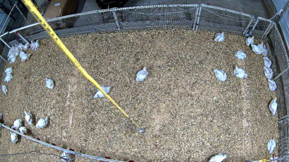
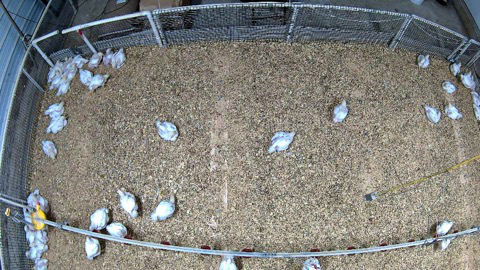
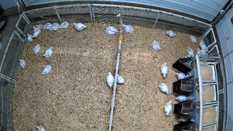
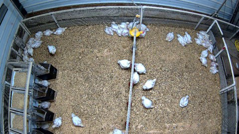

# ARGUSTRACK: A Multi-View Annotation System for Multi-Object Tracking

## 摘要

| 项目 | 内容 |
|---|---|
| 标题 | ARGUSTRACK: A Multi-View Annotation System for Multi-Object Tracking |
| 作者 | Hao Vo, Duc Nguyen, Ngan Le |
| 机构 | AICV Lab, University of Arkansas, USA |
| arXiv ID | 2606.20687 |
| 论文链接 | https://arxiv.org/abs/2606.20687 |
| PDF 链接 | https://arxiv.org/pdf/2606.20687 |
| 方向 | 自动标注 / 多摄像头多目标跟踪（MCMT）/ 数据生产 |
| 代码状态 | 本文未提供可确认的公开代码；论文仅给出项目页 `https://uark-aicv.github.io/argustrack/`，未在全文中给出 GitHub 或源码仓库链接，见 PAGE 1。 |

一句话总结：ARGUSTRACK 将多摄像头多目标跟踪的标注入口从逐相机 2D 框转移到鸟瞰图平面（BEV），通过相机标定把一次地面点标注自动投影为多视角 2D 框，并用时序传播与半自动检测提升标注效率，pilot study 中相对 CVAT 达到 18.35× 标注加速，见 PAGE 1、PAGE 4。

本文的核心贡献不是提出新的跟踪模型，而是针对 MCMT 数据生产瓶颈提出一个标注系统。论文指出，MCMT 已用于自动驾驶、监控、动物行为监测和拥挤场景分析，但高质量多视角标注数据仍是训练和评估算法的关键约束，见 PAGE 1、PAGE 2。ARGUSTRACK 的设计重点是：在经过标定的 camera-only 多摄像头系统中，让标注者只在统一 BEV 平面放置对象地面点，再由几何投影生成所有相关相机视角中的 2D bounding boxes，从机制上保持跨视角身份一致性，见 PAGE 1、PAGE 2。

本文的实验规模较小：作者在包含 11 个同步摄像头、20 个连续 timestamp scenes 的肉鸡多摄像头场景上进行用户研究，对比 CVAT 与 TrackMe 等标注工作流的平均标注时间，见 PAGE 4。因此，这篇论文更适合作为“多摄像头数据标注工具与生产流程”的方法论文来理解，而不应被解读为已经充分验证跨物种、跨场景、跨相机布设泛化能力的通用系统。

## 背景与动机

多摄像头多目标跟踪（Multi-Camera Multi-Target tracking, MCMT）要解决的问题，是在多个相机视角中持续定位多个目标，并保持每个目标的全局身份一致。单摄像头 MOT 只需要处理同一视频流中的检测与关联，而 MCMT 还需要解决跨视角匹配、遮挡消解和全局 ID 同步。论文在 PAGE 1 指出，多摄像头系统对动物行为监测尤其重要，因为动物个体之间高度相似，且频繁发生遮挡和重叠；多视角观测可以缓解单视角下的歧义。

在动物监测场景中，MCMT 的数据价值很明确。肉鸡、奶牛、实验动物或野生动物监测通常需要个体级行为分析，而个体级轨迹要求在长时间序列中保持身份稳定，见 PAGE 1。论文还将应用范围扩展到自动驾驶、监控和人群分析，说明这一工具问题并不限于畜牧场景，见 PAGE 1。

现有 MCMT 算法已经有一定进展。论文提到 BroilerTrack 将检测投影到 BEV 平面用于空间聚类，也提到一些方法利用 temporal cues 或 learned feature representations 来改善关联精度，见 PAGE 1、PAGE 2。然而，算法进步并没有自动解决数据标注问题；相反，越复杂的多视角跟踪算法越依赖高质量标注数据，而高质量跨视角 ID 标签的生产成本很高。

现有标注工具的主要问题在于工作流仍围绕单摄像头展开。论文在 PAGE 2 指出，CVAT、Label Studio、LabelMe 等平台主要支持 single-camera workflows，标注者需要对每个视角独立画框，并手动保持跨相机身份一致。这个流程在相机数量 $C$ 增加时会线性扩大标注工作量，并且跨视角 ID 同步容易出错，见 PAGE 2、PAGE 4。

另一类 3D 标注工具依赖 LiDAR 传感器。论文指出 OpenBox、3D BAT 等 3D annotation tools 依赖 LiDAR sensors，而动物监测环境中通常不会部署 LiDAR，见 PAGE 2。因此，ARGUSTRACK 的问题定义非常具体：在 camera-only、已标定多摄像头系统中，能否通过几何约束把多视角标注简化为一次 BEV 标注？

表 1 概括了论文对现有标注工具的对比。

| Tool | Annotation Space | Annotation Time | Cross-view Consistency | Multi-cam Scalability |
|---|---|---:|---|---|
| CVAT | Single-view | High | Manual | Limited |
| TrackMe | Single-view | High | Manual | Limited |
| LabelMe | Single-view | High | Manual | Limited |
| ARGUSTRACK | Omni-view | Low | Automated | Scalable |

表格解读：Table 1 的价值在于明确了论文的评价维度：不是比较检测精度或跟踪指标，而是比较 annotation space、annotation time、cross-view consistency 与 multi-camera scalability。ARGUSTRACK 的关键差异是把标注空间从 single-view 改为 omni-view BEV plane，从而把跨视角一致性从人工核对转化为几何投影的系统属性，见 PAGE 2。

用途：下面的抽取图用于展示 Figure 1 所依据的肉鸡多摄像头场景视角。论文将 Figure 1 用作 motivation，说明传统单视角标注需要对每个 camera view 独立操作，而 ARGUSTRACK 试图让标注者在 BEV 上一次标注并投影到所有视角，见 PAGE 1。

读图要点：该图是单个相机下的肉鸡场景，目标外观相似、空间分布分散，并存在视角畸变。支撑的判断是：如果每个相机都单独标注，标注者不仅要画框，还要在多个相似个体之间维护全局身份，工作量和出错概率都会随相机数量上升，见 PAGE 1、PAGE 2。

用途：第二张图同样来自 Figure 1 的抽取结果，用于展示同一场景在不同相机下的可见区域与透视差异。

读图要点：不同相机对同一栏舍区域的覆盖不同，边缘区域和遮挡关系也不同。它支撑论文关于“multi-camera configurations can resolve ambiguities”的动机陈述：多视角可以缓解单视角遮挡，但也使标注工作从单流问题变成跨视角同步问题，见 PAGE 1。

用途：第三张图用于展示跨视角标注中“同一真实对象在不同视角下位置和尺度不同”的问题。

读图要点：画面中目标大小与朝向受视角影响明显，不能简单复用一个 2D 框。它支撑 ARGUSTRACK 选择 BEV ground-plane point 作为统一标注实体，再由 3D box projection 生成各视角 2D 框的设计，见 PAGE 2、PAGE 3。

用途：第四张图用于补充说明多摄像头场景中不同视角的局部密集目标区域。

读图要点：当多个肉鸡靠近或聚集时，单视角中身份保持更困难。该图支撑论文把跨视角 ID consistency 作为核心目标，而不只是缩短画框时间的判断，见 PAGE 1、PAGE 2。

## 预备知识

ARGUSTRACK 依赖三个基础概念：相机投影模型（camera projection model）、鸟瞰图平面（bird’s-eye-view plane, BEV plane）和跨视角身份一致性（cross-view identity consistency）。在本文中，BEV 不是神经网络预测输出，而是一个由相机标定参数建立的几何工作平面。标注者在这个平面上放置对象地面接触点，系统再通过投影矩阵把该点对应的 3D bounding box 投到各个相机视角，见 PAGE 2、PAGE 3。

相机标定（camera calibration）是系统成立的前提。论文假设每个相机 $c$ 都有已知的 intrinsic matrix $K_c$ 与 extrinsic matrix $[R_c \mid t_c]$，其中 $K_c$ 描述相机内部参数，$R_c$ 和 $t_c$ 描述世界坐标到相机坐标的旋转和平移，见 PAGE 2。若标定不准确，BEV 到相机视角的投影会系统性偏移，这会直接影响多视角框的位置。

BEV 标注的核心优势在于把跨相机 ID 同步转化为同一个世界平面对象的多视角投影问题。传统 single-view annotation 中，一个真实目标在 $C$ 个相机下可能需要被标注 $C$ 次，并且每次都要人工确认是否是同一身份；ARGUSTRACK 中，一个 BEV 点天然对应一个 global identity，再由系统生成对应相机框，见 PAGE 2、PAGE 4。

半自动标注（semi-annotation）在本文中不是端到端自动标注。论文明确说 annotators only need to review, refine, and supplement missed detections，见 PAGE 3。也就是说，系统利用 YOLO-based detector 生成候选框，再通过 foot-point estimation、BEV projection、cross-view clustering 和 temporal association 生成候选 BEV 位置，最终仍由标注者验证和修正，见 PAGE 3、PAGE 4。

## 方法详解

### 1. 从 single-view 标注到 omni-view BEV 标注

ARGUSTRACK 的首要创新是改变标注空间。传统工具的基本单位是某一相机画面中的 2D bounding box；ARGUSTRACK 的基本单位是 BEV 平面上的对象地面点 $p=(x,y)$，其中 $x$ 和 $y$ 是世界地面平面上的二维坐标，见 PAGE 2、PAGE 3。这个转移看似简单，但对多摄像头标注有结构性影响：一次 BEV 标注可以被投影到所有 calibrated camera views，从而把跨视角 ID 一致性绑定到同一个 BEV object。

论文将该思想称为 omni-view BEV plane annotation。Figure 1 对比了 conventional single-camera annotation 与 ARGUSTRACK omni-view annotation：前者要求 Camera 1 到 Camera N 分别标注，后者在 BEV 中一次标注并生成 multi-view annotations，见 PAGE 1。Figure 2 进一步给出系统概览：camera views 先投影到 BEV plane，标注者在 BEV annotation 中操作，系统再通过 BEV-to-camera projection 输出 multi-view annotations；Temporal Aware 与 Semi-Annotation 分别提供时序初始化和检测候选点，见 PAGE 3。

该设计与已有 MCMT 算法中“把检测投到 BEV 做关联”的思路相呼应，但目标不同。BroilerTrack 等方法利用 BEV 改善跟踪算法中的空间聚类，见 PAGE 1；ARGUSTRACK 则把 BEV 用作 annotation interface，把数据生产中的重复标注和跨视角核验问题前置解决。换言之，本文不是用 BEV 替代跟踪模型，而是用 BEV 改造人工标注操作面。

### 2. 相机模型：从 3D 世界点到 2D 图像点

论文采用标准 pinhole camera model。对每个相机 $c$，定义完整投影矩阵 $H_c$：

$$
H_c = K_c [R_c \mid t_c] \in \mathbb{R}^{3 \times 4}
$$

其中，$K_c \in \mathbb{R}^{3 \times 3}$ 是相机内参矩阵，$[R_c \mid t_c] \in \mathbb{R}^{3 \times 4}$ 是外参矩阵，$H_c$ 将世界坐标中的三维齐次点投影到二维图像坐标，见 Eq. (1), PAGE 2。人话解释：这个公式说明，只要相机内外参已知，系统就能从世界坐标中的对象位置计算它在某个相机图像中的位置。

给定三维世界点 $X_w=[X,Y,Z,1]^\top$，其中 $X,Y,Z$ 是世界坐标，$1$ 是齐次坐标扩展，投影到二维图像点 $x=[u,v,1]^\top$ 的关系为：

$$
x \sim H_c X_w
$$

其中 $\sim$ 表示相差一个 projective scale factor，即齐次坐标下的等价关系，见 Eq. (2), PAGE 2。人话解释：该公式说明三维世界点经过相机投影矩阵后，会落到图像中的像素位置 $(u,v)$；齐次坐标的尺度归一化不改变实际像素点。

这一模型是 ARGUSTRACK 的几何基础。系统并不需要为每个相机单独学习一个标注映射，而是使用标定参数显式定义世界平面与相机平面之间的关系。因此，方法的优势和风险都集中在标定质量上：标定正确时，投影提供自动跨视角同步；标定错误时，所有由 BEV 生成的 2D 框都会受到几何误差影响。

### 3. Camera-to-BEV：从相机图像构造统一鸟瞰平面

论文在 Sec. 2.2 描述从 camera image 到 BEV ground plane 的变换。对于地面平面点 $Z=0$，完整投影矩阵 $H_c$ 可以简化为 $3 \times 3$ homography，即通过丢弃第三列得到地面平面上的单应映射，见 PAGE 2。系统再用逆变换 $H_c^{-1}$ 将 BEV pixel $(u,v)$ 映射回图像坐标。

这里的关键是 ground-plane assumption。论文假设被标注对象可由地面接触点代表，且地面可作为 BEV 平面；这对肉鸡栏舍这样的平面场景是合理的，但对多层结构、坡面、明显非平面地形或目标离地运动场景会更脆弱。论文没有对这些场景进行实验验证，因此迁移到复杂人车业务时需要额外验证，见 PAGE 2、PAGE 4。

系统在相机到 BEV 的投影过程中使用 bilinear interpolation 采样像素强度，并用 per-camera visibility masks 融合多摄像头重叠区域，得到统一 top-down view，见 PAGE 2。人话解释：BEV 界面不是凭空生成的图，而是把多个相机画面按标定几何“铺”到地面平面上，再处理重叠可见区域。

这一 BEV 构造对标注体验很重要。标注者不再需要在多个相机窗口之间反复切换确认同一目标，而是在一个统一地面平面上观察目标布局。论文 Figure 2 将这一过程放在系统主流程前半段：Camera Views 经过 Camera-to-BEV Projection 形成 BEV Plane，再进入 BEV Annotation，见 PAGE 3。

### 4. BEV 点到 2D bounding box：用 3D box 连接地面点和相机框

在 BEV 平面上，标注者放置点 $p=(x,y)$，该点表示对象的 ground contact point，见 PAGE 2。为了从一个点生成相机视角中的 2D bounding box，ARGUSTRACK 给每个对象关联一个可配置的三维包围盒，尺寸为 $(w_o,d_o,h_o)$，分别表示对象在世界坐标中的宽度、深度和高度，见 PAGE 2。

给定地面点与对象尺寸，三维包围盒的 8 个角点定义为：

$$
X_i =
\begin{bmatrix}
x+\delta x_i \\
y+\delta y_i \\
\delta z_i \\
1
\end{bmatrix},
\quad i=1,\ldots,8
$$

其中 $(\delta x_i,\delta y_i,\delta z_i)$ 枚举相对于地面中心的角点偏移，$\delta x_i \in \{\pm w_o/2\}$，$\delta y_i \in \{\pm d_o/2\}$，$\delta z_i \in \{0,h_o\}$，见 Eq. (3), PAGE 3。人话解释：系统不是只把地面点投到图像中，而是以该点为底部中心构造一个具有物理尺寸的 3D box，再投影 box 的 8 个角点。

每个角点随后使用 Eq. (2) 投影到相机 $c$ 中。相机 $c$ 的二维框由所有投影角点的最小外接轴对齐矩形得到：

$$
BBox_c =
\left(
\min_i u_i^c,\,
\min_i v_i^c,\,
\max_i u_i^c,\,
\max_i v_i^c
\right)
$$

其中 $(u_i^c,v_i^c)$ 是第 $i$ 个角点在相机 $c$ 中的投影图像坐标，见 Eq. (4), PAGE 3。人话解释：把三维盒子的 8 个角点投到图像上后，取最左、最上、最右、最下的位置，就得到该相机中的 2D bounding box。

这个设计解决了“一个 BEV 点如何变成 2D 框”的技术断层。仅有地面点无法表达对象高度，因此论文引入可配置的 3D box dimensions。论文还说明中间 3D box 不在界面中显示，annotation interface 只展示 BEV point 和最终 2D bounding boxes，以保持界面简洁，见 PAGE 3。这是一个面向标注效率的工程取舍：系统内部使用 3D 几何，界面层尽量减少操作负担。

### 5. Temporal Aware：相邻帧标注传播

Temporal Aware module 的目标是减少逐帧重复操作。论文在 Sec. 2.4 中说明，当加载新帧时，用户可以复制前一帧的 bounding boxes，保留位置和身份；由于连续帧通常只有小幅位移，标注者只需进行 minor adjustments，见 PAGE 3。

这一模块没有引入复杂运动模型，也没有声称自动完成长时轨迹预测。它更像是一个 temporal initialization 功能：把 $t-1$ 帧已有的 BEV annotations 作为 $t$ 帧的初始状态。Figure 2 中的 T-1 Points、Temporal Aware 和 T Points 展示了这一时序传播关系，见 PAGE 3。

Temporal Aware 的适用条件也在论文中被明确限定。作者指出该功能是 optional，并且在 scene cuts 或 significant camera motion 等情况下可以跳过，见 PAGE 3。这一点很重要：该模块假设相邻帧之间场景连续、相机稳定、目标位移较小；若业务场景存在强相机运动或帧间跳变，TA 的收益会下降，甚至可能引入错误初始化。

实验中的消融结果支持 TA 的实际贡献。Table 3 显示，ARGUSTRACK Base 的平均时间为 150s，加入 TA 后下降到 113s，见 PAGE 4。也就是说，在已有 BEV 标注与投影机制的基础上，TA 进一步减少了从零创建标签的操作时间。

### 6. Multi-camera Semi-annotation：从检测框生成候选 BEV 点

Semi-annotation module 用于进一步降低人工创建标签的成本。论文在 Sec. 2.5 中说明，该模块使用 pretrained object detection model 自动生成初始 bounding box labels，标注者只需要 review、refine，并补充 missed detections，见 PAGE 3。Figure 3 将该模块分为四个部分：Detection、Point Selection and BEV Projection、Cross-view Matching、Temporal Association，见 PAGE 4。

Detection module 使用 pretrained YOLO-based model，包括 YOLOv12、YOLOv8、YOLOv7 等相关检测器引用，见 PAGE 3。论文没有提供检测器训练细节、具体权重、置信度阈值或检测精度，因此这里不能推断其检测鲁棒性。可确认的是，检测框、类别标签和置信度会被传给后续阶段，见 PAGE 3。

Point Selection and BEV Projection 的问题是：2D detection box 中哪个点更适合作为对象地面接触点？论文没有直接使用 box center，也没有固定使用 bottom-center，而是采用两者之间的加权插值：

$$
p = (1-t)\cdot p_{center} + t\cdot p_{bottom}
$$

其中 $p_{center}$ 表示检测框中心，$p_{bottom}$ 表示检测框底部中心，$t \in [0,1]$ 根据 camera-to-object distance 和 elevation angle 自适应确定，见 Eq. (5), PAGE 3。人话解释：对象地面点通常更接近框的底部中心，但不同相机高度和距离会影响最佳投影点，因此系统在中心点和底部中心之间自适应取一个位置。

论文随后将点 $p=[u,v]^\top$ 提升为齐次坐标，并通过 $H_c$ 映射到 BEV ground plane，见 PAGE 3。需要注意的是，全文对“via $H_c$”的描述较简略；结合 Sec. 2.2，应理解为利用由相机标定和地面平面得到的 homography 完成图像到 BEV 的映射。若缺少源码或实现细节，无法进一步确认具体矩阵方向、坐标归一化和可见性过滤策略。

### 7. Cross-view Matching：用 BEV 聚类形成全局身份

当多个相机的检测都投影到 BEV 后，同一个真实对象会产生多个 BEV points。Cross-view Matching 的目标是把来自不同相机的点聚成同一个 real-world object。论文使用 K-Means 对所有相机的 BEV projections 进行聚类，每个 cluster 对应一个真实对象，聚类数 $K$ 由用户定义，见 PAGE 3、PAGE 4。

这里的用户定义 $K$ 是一个值得关注的设计点。它使系统可以结合人工先验控制对象数量，但也意味着半自动模块并非完全免参数。在目标数量变化、遮挡严重或检测漏检较多时，$K$ 的设置会影响聚类结果。论文没有报告 $K$ 设置错误时的鲁棒性实验，因此该部分的失败模式仍证据不足。

论文还使用 constrained greedy assignment 约束每个 camera 在每个 cluster 中最多有一个 detection，并用 previous-frame centroids warm-start initialization，见 PAGE 4。人话解释：一个真实对象在同一个相机视角中通常只能对应一个检测框，因此系统用这个约束减少错误匹配；同时利用上一帧聚类中心让当前帧匹配更稳定。

Cross-view Matching 的输出是从 $(camera, local id)$ 到 consistent global id 的映射，见 PAGE 4。这正是多摄像头标注的关键产物：不是简单生成框，而是为多相机、多帧中的同一实体提供统一身份。

### 8. Temporal Association：用 Hungarian algorithm 维持帧间身份

Temporal Association 用于跨帧维持稳定 tracks。论文定义代价矩阵 $C \in \mathbb{R}^{K \times M_f}$，其中 $K$ 是已有 tracks 数量，$M_f$ 是当前帧 detections 数量，见 PAGE 4。每个矩阵元素表示某条 track 的最后位置 $p_t$ 与某个 detection 位置 $p_d$ 的 BEV 欧氏距离：

$$
C[t,d] = \|p_t - p_d\|_2
$$

其中 $\|\cdot\|_2$ 表示欧氏距离，见 Eq. (6), PAGE 4。人话解释：如果某个检测点离一条已有轨迹的上一位置足够近，系统就倾向于认为它们属于同一对象。

论文使用 Hungarian algorithm 在这个代价矩阵上求匹配，并设定接受条件 $C[t,d] \le \delta$，其中 $\delta$ 是距离阈值，见 PAGE 4。未匹配的 tracks 会保留之前位置直到重新分配，以维持全局身份一致，见 PAGE 4。该策略简单、可解释，适合 BEV 平面中短时间尺度的目标关联。

同时，该策略也显示了方法边界：它主要依赖 BEV 空间距离，而不是外观 re-identification embedding。对于肉鸡这类外观高度相似对象，空间距离在短帧间隔中可能有效；但在长时间遮挡、快速运动、密集交互或相机视野断裂的场景中，仅靠 BEV 距离和阈值可能不足。论文没有给出 IDF1、MOTA、ID switches 等跟踪指标，因此不能把该模块的效果等同于完整 MCMT 跟踪算法性能。

## 实验分析

论文实验的目标是评估标注速度，而不是检测精度或跟踪精度。作者选择 20 个连续 timestamp scenes，每个 scene 包含 11 个同步相机视角，场景为 poultry house 中的 broilers；标注者需要对所有可见 broilers 进行跨视角一致 ID 标注，测量总标注时间并报告 average time per scene，见 PAGE 4。

主实验对比 CVAT、TrackMe 与 ARGUSTRACK 的平均每场景耗时。Table 2 报告 CVAT 为 1872s，TrackMe 为 1392s，ARGUSTRACK 为 102s，并分别给出相对 speedup，见 PAGE 4。

| Tool | Avg. Time / Scene (s) | Speedup |
|---|---:|---:|
| CVAT | 1872 | 1.00× |
| TrackMe | 1392 | 1.34× |
| ARGUSTRACK | 102 | 18.35× |

表格解读：这张表是全文最直接的业务价值证据。ARGUSTRACK 相比 CVAT 的 18.35× 加速并不是来自更快画一个框，而是来自标注复杂度的变化：CVAT 需要对 $C$ 个相机视角分别标注 $N$ 个对象，并额外核对身份；ARGUSTRACK 通过 BEV 一次标注与自动投影，把主要操作压缩到对象级别，论文将其概括为从 $O(N \times C)$ 到 $O(N)$，见 PAGE 4。对 11 个同步相机的场景，这种复杂度变化会显著影响实际生产时间。

论文还提供了消融实验，逐步加入 Temporal Aware 与 Semi-Annotation。Base ARGUSTRACK 只包含 omni-view BEV annotation 与自动投影；加入 TA 后使用上一帧标注初始化；再加入 SA 后通过检测与 BEV 候选点进一步减少人工创建工作，见 PAGE 4。

| Method | Time (s) |
|---|---:|
| ARGUSTRACK Base | 150 |
| + TA | 113 |
| + SA | 102 |

表格解读：Table 3 表明，BEV 基础流程已经是主要收益来源，而 TA 与 SA 是进一步叠加的效率模块。Base 到 +TA 从 150s 降到 113s，减少 37s；+TA 到 +SA 从 113s 降到 102s，再减少 11s。换算来看，TA 带来的边际收益大于 SA，但 SA 把任务从创建标签更多转向验证候选位置，见 PAGE 4。由于论文没有报告标注质量指标，不能判断 SA 是否在所有情况下都保持同等准确性。

从复杂度角度看，论文给出的 $O(N \times C)$ 与 $O(N)$ 是方法动机的简洁表达。$N$ 表示对象数，$C$ 表示相机数；传统单视角工具需要在每个 camera view 中为对象画框并同步 ID，因而随 $C$ 增长。ARGUSTRACK 将对象的主标注操作放在 BEV plane 上，理论上主人工操作与相机数量解耦，见 PAGE 4。

需要谨慎的是，实验只报告 annotation time，没有报告标注一致性错误率、投影框质量、检测候选误差、人工修正量、标注者数量和标注者熟练度等细节。论文声称 ARGUSTRACK inherently ensures identity consistency，是基于同一 BEV annotation 投影到多视角的机制成立，见 PAGE 1、PAGE 2；但在实验层面，全文没有给出 identity consistency 的定量错误统计。因此，“提高跨视角 ID 一致性”有强机制依据，但缺少独立质量度量支撑。

Figure 2 和 Figure 3 在论文中分别支撑系统总览和半自动模块流程。Figure 2 展示 Camera Views、Camera-to-BEV Projection、BEV Plane、Temporal Aware、BEV Annotation、BEV-to-Camera Projection 与 Multi-view Annotations 之间的关系，见 PAGE 3。Figure 3 展示 Semi-Annotation Module 的四阶段 pipeline：Detection、Point Selection & BEV Projection、Cross-view Matching、Temporal Association，见 PAGE 4。当前提供的 figures 清单只包含 PAGE 1 的 Figure 1 抽取图片，因此本文不嵌入 Figure 2 和 Figure 3 的图片路径，以避免输出不存在的图片路径。

## 讨论

ARGUSTRACK 的适用边界可以从其几何假设推出。它最适合 camera-only、多摄像头已标定、目标主要在地面平面运动、对象高度和尺寸可由简单 3D box 近似的场景。肉鸡栏舍、固定摄像头阵列下的动物监测、室内固定区域多摄像头数据建设都符合这些条件，见 PAGE 1、PAGE 2、PAGE 4。

与纯检测或跟踪算法相比，ARGUSTRACK 的业务价值更偏向数据基础设施。它可以减少多摄像头 MOT 数据集构建时的人工成本，并通过同一 BEV 对象投影多个视角降低跨视角 ID 对齐负担。对于需要场景级轨迹数据的应用，尤其是摄像头阵列和固定空间监控，该系统可能比单独提升跟踪模型更直接地解决“没有高质量标注数据”的瓶颈，见 PAGE 2。

未解决的问题主要集中在质量评估、泛化验证和实现细节。论文没有报告标注质量与人工校验后的误差统计，也没有展示不同相机标定误差下的鲁棒性；Semi-Annotation 部分没有给出检测器配置、阈值、候选点误差分布或 K-Means 失败案例；pilot study 只在 broiler tracking 场景验证，尚不足以证明对人、车或其他动物场景同样有效，见 PAGE 3、PAGE 4。

从未来工作角度看，ARGUSTRACK 可以与更强的检测器、ReID 表征、主动学习和标注质量审计结合。本文已经提供了几何投影与人工验证的工作流框架，但如果要进入大规模生产，还需要补充版本化数据管理、标注一致性评估、多人协同冲突处理、标定健康检查和自动质量告警。这些内容不在论文范围内，属于从研究原型走向生产系统时需要补齐的工程层。

## 局限分析

作者自述局限：证据不足。论文没有单独的 Limitations section，也没有以显式“limitation”措辞系统列出不足。可确认的是，作者在方法中写明了若干假设和可跳过条件，例如使用 calibrated camera parameters、ground-plane BEV、standard pinhole camera model，以及 Temporal Aware 在 scene cuts 或 significant camera motion 时可以跳过，见 PAGE 1、PAGE 2、PAGE 3。这些是论文文本可证实的方法边界，但不应被强行改写成作者正式自述的局限章节。

第一项可证实边界是相机标定与地面平面依赖。ARGUSTRACK 的核心链路要求已知每个相机的 $K_c$、$R_c$、$t_c$，并将地面点 $Z=0$ 上的 homography 用于 camera-to-BEV 与 BEV-to-camera 投影，见 PAGE 2。若相机标定不准、地面不平、目标不在地面平面运动，BEV 点与 2D 框之间的几何对应会退化。这对固定栏舍场景可控，但对室外非平面、移动相机或复杂三维场景是主要风险。

第二项边界是 semi-annotation 对检测器、foot-point estimation 和用户定义 $K$ 的依赖。论文使用 pretrained YOLO-based detector 生成候选框，并用中心到底部中心的加权点估计地面接触点，随后用 K-Means 聚类且聚类数 $K$ 由用户定义，见 PAGE 3、PAGE 4。若检测器漏检、误检，或 $K$ 与真实目标数量不一致，系统候选 BEV 点和跨视角匹配会受到影响。论文没有提供这些误差来源的定量分析，因此其鲁棒性证据不足。

第三项边界是实验外推性有限。论文 pilot study 使用 20 个连续 timestamp scenes、11 个同步摄像头、肉鸡场景，主要指标为 average annotation time per scene，见 PAGE 4。该实验能支持“在此场景和此任务设置下显著减少标注时间”，但不能直接证明在人车业务、跨场景摄像头阵列、不同目标尺度或更长视频序列中保持同等加速比和标注质量。

第四项边界是缺少公开代码证据。全文只在 PAGE 1 给出项目页链接，没有给出 GitHub 仓库、安装方式、核心实现文件或配置文件。因此本文未提供源码段，也无法建立“论文方法 ↔ 源码函数”的逐行对应关系。按当前证据，只能写：本文未提供可确认的公开代码。

## 结论

ARGUSTRACK 的贡献可以凝练为一个数据生产层面的结构性改造：把多摄像头标注从“每个视角独立画框并人工同步 ID”改为“在 BEV 平面一次标注并自动投影到多视角”。该系统使用相机标定建立 BEV 与相机图像之间的几何关系，用可配置 3D bounding box 从地面点生成 2D 框，并通过 Temporal Aware 与 Multi-camera Semi-annotation 进一步减少逐帧创建标签的成本，见 PAGE 2、PAGE 3、PAGE 4。

实验上，ARGUSTRACK 在 11 相机、20 个连续 timestamp broiler scenes 的用户研究中，将平均每场景标注时间从 CVAT 的 1872s 降至 102s，实现 18.35× speedup；消融显示 TA 与 SA 分别带来额外时间下降，见 PAGE 4。这个结果足以支持“值得小试”的判断，特别是在固定摄像头阵列、相机标定可控、目标主要在平面上运动的数据建设任务中。但在生产采用前，应补充标注质量评估、标定误差敏感性分析、跨场景验证和源码可用性确认。

## 证据索引

| 证据点 | PAGE |
|---|---|
| 论文题目、作者、机构、摘要、项目页链接 | PAGE 1 |
| MCMT 在动物监测、自动驾驶、监控、人群分析中的应用动机 | PAGE 1 |
| 多摄像头可缓解遮挡和个体相似导致的单视角歧义 | PAGE 1 |
| Figure 1：single-view annotation 与 ARGUSTRACK omni-view annotation 动机对比 | PAGE 1 |
| 现有工具 CVAT、Label Studio、LabelMe 主要支持 single-camera workflows | PAGE 2 |
| 3D annotation tools 依赖 LiDAR，动物监测环境中较少部署 | PAGE 2 |
| Table 1：标注工具对比 | PAGE 2 |
| ARGUSTRACK 三项贡献：BEV 标注、TA/SA 模块、pilot study | PAGE 2 |
| Camera Model：$H_c = K_c [R_c \mid t_c]$ | PAGE 2 |
| 3D 点到 2D 图像点投影：$x \sim H_c X_w$ | PAGE 2 |
| Camera-to-BEV：$Z=0$ 地面平面、homography、bilinear interpolation、visibility masks | PAGE 2 |
| BEV 点与可配置 3D bounding box 尺寸 $(w_o,d_o,h_o)$ | PAGE 2 |
| 3D box 角点公式 $X_i$ | PAGE 3 |
| 2D bounding box 由投影角点最小外接矩形得到 | PAGE 3 |
| Figure 2：ARGUSTRACK 系统总览、TA 与 Semi-Annotation 在流程中的位置 | PAGE 3 |
| Temporal Aware：复制前一帧框、保留身份、scene cuts 或 significant camera motion 可跳过 | PAGE 3 |
| Semi-Annotation 四阶段：Detection、Point Selection and BEV Projection、Cross-view Matching、Temporal Association | PAGE 3、PAGE 4 |
| YOLO-based detector 用于自动生成初始检测框 | PAGE 3 |
| foot-point interpolation 公式 $p=(1-t)p_{center}+t p_{bottom}$ | PAGE 3 |
| K-Means cross-view clustering、用户定义聚类数 $K$、constrained greedy assignment | PAGE 3、PAGE 4 |
| Figure 3：Semi-Annotation Module 流程 | PAGE 4 |
| Temporal Association：Hungarian algorithm 与代价矩阵 $C[t,d]=\|p_t-p_d\|_2$ | PAGE 4 |
| 实验设置：20 个连续 timestamp scenes、11 个同步摄像头、broilers、average time per scene | PAGE 4 |
| Table 2：CVAT 1872s、TrackMe 1392s、ARGUSTRACK 102s、18.35× speedup | PAGE 4 |
| 复杂度解释：传统 $O(N \times C)$，ARGUSTRACK $O(N)$ | PAGE 4 |
| Table 3：Base 150s、+TA 113s、+SA 102s | PAGE 4 |
| 结论：BEV-based labeling、automatic cross-view projection、TA、SA、相对 CVAT 显著减少标注时间 | PAGE 4 |
